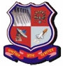
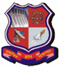
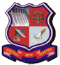
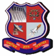
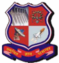
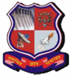
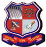

## Gujarat Technological University Affiliation 2026-27

## Application for Affiliation

## (Academic Session- 2026-2027)

Name of Institute

Institute Code :-

Name of Program

:-

Address of Institute

:-

GOVERNMENT POLYTECHNIC,PALANPUR

626

DI

OUTSIDE MALAN GATE AMBAJI ROAD PALANPUR 385001

## Gujarat Technological University Affiliation 2026-27

## INDEX

| SN   | Particular                                                              |
|------|-------------------------------------------------------------------------|
| 1    | Institutional Detail                                                    |
| a    | Application Details                                                     |
| b    | Institute Details                                                       |
| c    | Principal / Director Details                                            |
| d    | Institute Other Details                                                 |
| e    | AIC Deficiency                                                          |
| f    | Old Principal deatils                                                   |
| g    | principal_deficiency                                                    |
| 2    | Course Details                                                          |
| a    | Academic Programmes for which Affiliation is sought                     |
| b    | Program And Courses                                                     |
| c    | Course detail new page                                                  |
|      | Infrastructure Details                                                  |
| a    | Details of Land & Building                                              |
| b    | Other Land Details                                                      |
| c    | Building Details                                                        |
| d    | Other Building Details                                                  |
| e    | Additional Building Details                                             |
| f    | Academic Infrastructure                                                 |
| g    | Additional Academic Infrastructure                                      |
| h    | Infrastructure Details                                                  |
| 4    | Additional Facility Details                                             |
| a    | Details of Other Facilities Available                                   |
| b    | Details of the Labs/Workshops/Work stations available (Department wise) |
| c    | Laboratory Details                                                      |
| d    | Details of the Labs/Workshops/Work stations available (Department wise) |
| e    | Details of Library                                                      |
| f    | Additional Facility Details                                             |
| 5    | Computer Facilities                                                     |
| a    | Computer facilities                                                     |
| b    | Computer hardware facilities                                            |
| c    | Software facilities                                                     |
| 6    | Enrollment Status facility                                              |
| a    | Enrollment Status (For Last 4 Years - Including All Department)         |
| b    | Enrollment Status facility                                              |
| 7    | Staff Details                                                           |
| a    | Teaching Staff                                                          |
| b    | Staff Information                                                       |

| SN   | Particular                                                                                |
|------|-------------------------------------------------------------------------------------------|
| c    | Staff Detail                                                                              |
| e    | Non-Teaching staff (Technical)                                                            |
| f    | Non-Teaching staff (Supporting)                                                           |
| g    | Students-Teachers Ratio                                                                   |
| d    | Staff detail for Earlier year                                                             |
| h    | Program/Level Faculty                                                                     |
| i    | AI- Staff Details                                                                         |
| 8    | Income & Expenditure                                                                      |
| a    | Operational Funds (In Rs.)                                                                |
| b    | Financial Details (In Rs.)                                                                |
| c    | Grant Received Detail                                                                     |
| d    | Source of Income & Expenditure during the last year                                       |
| e    | Account Transcation                                                                       |
| 9    | Examination-Training                                                                      |
| a    | Examination /Training /Placement Details                                                  |
| a    | Examination /Training /Placement Details                                                  |
| 10   | Welfare and Other Committie                                                               |
| a    | Anti-Ragging Related Details Provided by the Institute                                    |
| b    | Anti - Ragging Committee/Squad Details                                                    |
| c    | ST - SC Cell Committee/Squad Details (As Per GTU Instructions)                            |
| d    | Women's Development Committee/Squad Details                                               |
| e    | Physically Disability Grievances Readdressal Details                                      |
| f    | Ombudsman / Grievance Details (As Per GTU Instructions)                                   |
| g    | Ombudsman Appointment /Grievance Committee Details                                        |
| 11   | Paper /Book Published                                                                     |
| a    | Book                                                                                      |
| b    | Published Paper                                                                           |
| c    | Presented Paper                                                                           |
| d    | Participation of your faculty members in FDPs / Paper Presentation / Seminar / Conference |
| 12   | Result Analysis                                                                           |
| a    | RESULT ANALYSIS FOR UG FOR LAST 2 YEARS                                                   |
| b    | RESULT ANALYSIS FOR PG FOR LAST 2 YEARS                                                   |
| c    | RESULT ANALYSIS FOR DIPLOMA FOR LAST 2 YEARS                                              |
| d    | Rank of the Institute at GTU                                                              |
| e    | M_24A_Academic_PER                                                                        |
| 13   | Development Programme                                                                     |
| b    |                                                                                           |
| c    | SOFT-SKILL DEVELOPMENT                                                                    |
|      | Faculty Development Program                                                               |
| e    | External professionals                                                                    |
| f    | Skill Development activities                                                              |
| g    | Participation of your faculty members in FDPs / Paper Presentation / Seminar / Conference |

## INDEX

| SN   | Particular                                                                                                                           |
|------|--------------------------------------------------------------------------------------------------------------------------------------|
| d    | Industrial Training for Faculties                                                                                                    |
| 14   | Event and Participation                                                                                                              |
| a    | Students Activities                                                                                                                  |
| b    | Faculty Activities                                                                                                                   |
| c    | Event hosted at institute                                                                                                            |
| d    | Industrial consultancy / Research projects supervised at Institute                                                                   |
| e    | GTU Innovation Club                                                                                                                  |
| i    | Details of participation where you encourage students / faculties to participate in national / international innovation challenges / |
| j    | GTU Innovation Sankul meetings Hosted By Your Institute/Industry/Government Sponsored                                                |
| h    | GTU Innovation Sankul meetings have your Principal / Director attended                                                               |
| f    | Member(s) of GTU Innovation Club                                                                                                     |
| g    | Name of the Other Club (Within the Innovation Club )                                                                                 |
| 15   | Imp Acivities of Institute                                                                                                           |
| a    | Special Facility                                                                                                                     |
| b    | S4 (Student Start-Up Support System)participation within your institute                                                              |
| c    | Innovations                                                                                                                          |
| d    | Invite / involve Alumni and /or local experts                                                                                        |
| e    | E-Assessment/Manual Of Answer Sheet(s)                                                                                               |
| 16   | Camp Details                                                                                                                         |
| a    | NSS / NCC camps organized by the College                                                                                             |
| b    | Blood Donation camps organized by the College                                                                                        |
| c    | Thalesemia Testing organized by the College                                                                                          |
| 17   | Achievements                                                                                                                         |
| a    | Details of Achivements By Institute                                                                                                  |
| b    | Details of Achivements By Faculty                                                                                                    |
| c    | Details of Achivements By Student                                                                                                    |
| 18   | General Information                                                                                                                  |
| a    | General Information                                                                                                                  |
| 19   | Compliance                                                                                                                           |
| a    | Compliance (For Previous Year)                                                                                                       |
| b    | Approve Course(s)                                                                                                                    |
| 20   | Important Declaration                                                                                                                |
| a    | DECLARATION                                                                                                                          |
| b    | IMPORTANT NOTE                                                                                                                       |

## Gujarat Technological University Affiliation 2026-27

## APPLICATION DETAILS

| Change of Institute Site /Location                                       | NO   |
|--------------------------------------------------------------------------|------|
| Closure of Course/ Programme                                             | NO   |
| Closure of Institute                                                     | NO   |
| PIO (Person of Indian Original)                                          | NO   |
| NRI                                                                      | NO   |
| Change of name of the Institute                                          | NO   |
| Conversion of Women's Institution into Co-Ed Institution                 | NO   |
| Introducing a Foreign Collaboration with GTU approved Indian Institution | NO   |
| Increase in Intake                                                       | NO   |
| Start New Programme /Course                                              | NO   |
| Reduction In Intake                                                      | NO   |
| Extension of Affiliation                                                 | YES  |
| Introduction of Fellowship Program in Management                         | NO   |
| Change in Name of the Course                                             | NO   |
| Change of Trust/Society/Company                                          | NO   |
| Conversion of Diploma Level into Degree Level & Vice Versa               | NO   |
| Is your institute Approved By NBA / NAAC?                                | YES  |

## Gujarat Technological University Affiliation 2026-27

## INSTITUTE DETAILS

Date Of Signature

Name &amp; Sign Of Director / Principal

Institute Seal

## INSTITUTE DETAILS

| Particular                               | Particular                               | Institute                                       | Trust/Organization                                                                | Trust/Organization                                                                |
|------------------------------------------|------------------------------------------|-------------------------------------------------|-----------------------------------------------------------------------------------|-----------------------------------------------------------------------------------|
| Name                                     | Name                                     | GOVERNMENT  POLYTECHNIC,PALANPUR                | Commissionerate of Technical  Education                                           | Commissionerate of Technical  Education                                           |
| Institute Code No.                       | Institute Code No.                       | 626                                             |                                                                                   |                                                                                   |
| Address                                  | Address                                  | OUTSIDE MALAN GATE AMBAJI ROAD  PALANPUR 385001 | 6TH FLOOR, BLOCK-2D, KARMYOGI  BHAVAN, SECTOR-10A, Gandhingar,  Gujarat - 382010. | 6TH FLOOR, BLOCK-2D, KARMYOGI  BHAVAN, SECTOR-10A, Gandhingar,  Gujarat - 382010. |
|                                          |                                          | GUJARAT                                         | State                                                                             | State                                                                             |
|                                          |                                          | BANASKANTHA                                     | District                                                                          | District                                                                          |
|                                          |                                          | PALANPUR                                        | Taluko                                                                            | Taluko                                                                            |
|                                          |                                          | 385001                                          | Pin No                                                                            | Pin No                                                                            |
| Phone No                                 | Phone No                                 | (02742) 262115                                  | (079) 232 53546                                                                   | (079) 232 53546                                                                   |
| Mobile No                                | Mobile No                                | 9099063226                                      | -                                                                                 | -                                                                                 |
| Fax No                                   | Fax No                                   | (02742) 262115                                  | (079) 232 53539                                                                   | (079) 232 53539                                                                   |
| Web Site                                 | Web Site                                 | www.gppp.cteguj.in                              | https://dte.gujarat.gov.in                                                        | https://dte.gujarat.gov.in                                                        |
| E-Mail                                   | E-Mail                                   | gp-palanpur-dte@gujarat.gov.in                  | dec626owner@gtu.edu.in                                                            | dec626owner@gtu.edu.in                                                            |
| PAN No                                   | PAN No                                   | AHMP02238F                                      | NA                                                                                | NA                                                                                |
| Bank Name                                | Bank Name                                | STATE BANK OF INDIA                             | NA                                                                                | NA                                                                                |
| Bank Account No                          | Bank Account No                          | 30220484872                                     | NA                                                                                | NA                                                                                |
| Bank Branch Address                      | Bank Branch Address                      | OPP JAHANARA BAUG, PALANPUR  GUJARAT PIN 385001 | NA                                                                                | NA                                                                                |
| IFCS No                                  | IFCS No                                  | SBIN0000443                                     | NA                                                                                | NA                                                                                |
| Name Of Principal (Director ) / Trustee. | Name Of Principal (Director ) / Trustee. | SHRI SURESHKUMAR DALABHAI                       | NA                                                                                | NA                                                                                |
| Personal Contact No / Mobile No          | Personal Contact No / Mobile No          | DABHI 9825697278                                | 9825697278                                                                        | 9825697278                                                                        |
| (a) GTU Co ordinator Phone No            | (a) GTU Co ordinator Phone No            | 9099063226                                      | 9824745445                                                                        | 9824745445                                                                        |
| GTU Webmail ID                           | GTU Webmail ID                           | dec626owner@gtu.edu.in                          |                                                                                   |                                                                                   |
| Type Of Institute                        | Type Of Institute                        | GOV                                             |                                                                                   |                                                                                   |
| Please specify Registration With :-      | Please specify Registration With :-      | NA                                              |                                                                                   |                                                                                   |
| Date Of Signature                        | Name & Sign Of Director / Principal      | Name & Sign Of Director / Principal             | Name & Sign Of Director / Principal                                               | Institute Seal                                                                    |

| INSTITUTE DETAILS                    | INSTITUTE DETAILS      | INSTITUTE DETAILS   |
|--------------------------------------|------------------------|---------------------|
| Registration Number :                | NA                     |                     |
| Date :                               |                        |                     |
| Apex Body :                          | GOVERNMENT INSTITUTION |                     |
| Year of First Affiliation with GTU : | 2008                   |                     |
| Trustee name & Mobile -1             | NA                     | NA                  |
| Trustee name & Mobile - 2            | NA                     | NA                  |
| Trustee name & Mobile - 3            | NA                     | NA                  |
| Trustee name & Mobile - 4            | NA                     | NA                  |

Date Of Signature

Name &amp; Sign Of Director / Principal

Institute Seal

## Gujarat Technological University Affiliation 2026-27

## Principal Deficiency

Principal Endorsement in 2024-25 :

Principal Endorsement in 2025-26 :

Principal Endorsement in 2023-24 :

Principal Deficiency for this Institute is :

YES

NO

YES

YES

Date Of Signature

Name &amp; Sign Of Director / Principal

Institute Seal

## Gujarat Technological University Affiliation 2026-27

## INSTITUTE OTHER DETAILS

| Approval Year of First Course                                                                                                    | 1984                       |
|----------------------------------------------------------------------------------------------------------------------------------|----------------------------|
| Date of First Approval by AICTE :                                                                                                | Tue2/15/1994               |
| Total Number of teaching faculty in the Institute for all Programmes                                                             | 64                         |
| Are all the teaching faculty as per Govt /AICTE /GTU qualification?                                                              | YES                        |
| Number of teaching faculty approved by University/Government?                                                                    | 64                         |
| Do you give the copy of an endorsement letter to concern faculty?                                                                | NO                         |
| Are all approved teaching faculty being paid as per 6th pay commission ?                                                         | YES                        |
| Whether CL and RH are given to the staff during academic year as per Govt. Rules ?                                               | YES                        |
| Percentage Grant Received from Govt. :                                                                                           | 100                        |
| Whether Institute is operating from Permanent Site/Temporary Site?                                                               | Permanent                  |
| Whether mandatory disclosure is uploaded in Institute's website?                                                                 | YES                        |
| Whether the Institute is following ICA (Institute of Chartered Accountants of India) Accounting Formats?                         | NO                         |
| Fees to be charged, Reservation policy, Admission policy and Document retention policy are followed  by State Govt. ?            | YES                        |
| Fees to be charged, Reservation policy, Admission policy and Document retention policy are followed   by Affiliating University? | YES                        |
| Fees to be charged, Reservation policy, Admission policy and Document retention policy are uploaded  in Institute's Website?     | YES                        |
| List of faculty and data uploaded on the institute web portal & GTU Knowledge.                                                   | YES                        |
| Courses/ Approved Intake displayed at the entrance & Student Notice Board of the institute?                                      | YES                        |
| Institute Website updation                                                                                                       | Monthly                    |
| Autonomous Status by UGC                                                                                                         | No                         |
| NAAC Approval Received                                                                                                           | No                         |
| NBA Approval Received                                                                                                            | Yes 1-Jul-2024 30-Jun-2027 |
| Fire NOC Received                                                                                                                | YES                        |
| Type of Building (SFI/GOVT/GIA/GTU PG School/GTU College)                                                                        | GOVT                       |
| Total No. of Building                                                                                                            | 5                          |
| No. of Building with Fire NOC                                                                                                    | 0                          |

| Date Of Signature   |                                     | Institute Seal   |
|---------------------|-------------------------------------|------------------|
|                     | Name & Sign Of Director / Principal |                  |

## Gujarat Technological University Affiliation 2026-27

## INSTITUTE OTHER DETAILS

No. of Building without Fire NOC

No. of Building with renewal Fire NOC

No. of Building without renewal Fire NOC

5

0

0

3

CIVIL ELECTRICAL

No of courses for NBA

Name of courses of NBA

MECHANICAL

Date Of Signature

Name &amp; Sign Of Director / Principal

Institute Seal

## Gujarat Technological University Affiliation 2026-27

## AIC Deficiency

AIC verification has been conducted in 24-25

AIC verification has been conducted in 25-26

AIC verification has been conducted in 23-24

Yes

AIC Deficiency for this Institute is

NO

No

No

Date Of Signature

Name &amp; Sign Of Director / Principal

Institute Seal

Full Name :

Date Of  Birth :

## Gujarat Technological University Affiliation 2026-27

## PRINCIPAL DETAILS

SURESHKUMAR DALABHAI DABHI

Date Of Appointment :

12-Aug-1968

Email  :

sureshdabhi1968@gmail.com

Endorsed By GTU ? (Letter No. &amp; Date) (If SFI institute)

OR order of CTE/DTE? (Letter No. &amp; Date) (If GOVT

institute): :

PAN :

AAUPD7898R

Gender:

Appointment Type :

1-Apr-2019

In-charge

Mobile no :

9825697278

GTU-SEB/CTE/GPT/CHARGE/AACHARY/2019/GH-4/4810

DATED: 29/03/2019

MALE

Category:

SC

## QUALIFICATION

| Degree   | Subject                | Name of Uni   |   %/CGPA | Class   |
|----------|------------------------|---------------|----------|---------|
| M.TECH.  | MANUFACTURING  SYSTEMS | NIT, JAIPUR   |       68 | FIRST   |

Date Of Signature

Name &amp; Sign Of Director / Principal

Institute Seal

## Gujarat Technological University Affiliation 2026-27

## OLD PRINCIPAL / DIRECTOR DETAILS

| Academic  Year   | Name                         | Date Of  Birth   | Date of  Appointment   | Appointment  Type   | Email                       |     Mobile | Gender   | Catego ry   |
|------------------|------------------------------|------------------|------------------------|---------------------|-----------------------------|------------|----------|-------------|
| 2020-2021        | SURESHKUM AR DALABHAI  DABHI | 1968-08-12       | 2019-04-01             | In-charge           | sureshdabhi1 968@gmail.c om | 9825697278 |          |             |
| 2021-2022        | SURESHKUM AR DALABHAI  DABHI | 1968-08-12       | 2019-04-01             | In-charge           | sureshdabhi1 968@gmail.c om | 9825697278 |          |             |
| 2023-2024        | SURESHKUM AR DALABHAI  DABHI | 1968-08-12       | 2019-04-01             | In-charge           | sureshdabhi1 968@gmail.c om | 9825697278 |          |             |
| 2022-2023        | SURESHKUM AR DALABHAI  DABHI | 1968-08-12       | 2019-04-01             | In-charge           | sureshdabhi1 968@gmail.c om | 9825697278 |          |             |
| 2023-2024        | SURESHKUM AR DALABHAI  DABHI | 1968-08-12       | 2019-04-01             | In-charge           | sureshdabhi1 968@gmail.c om | 9825697278 | MALE     | SC          |
| 2020-2021        | SURESHKUM AR DALABHAI  DABHI | 1968-08-12       | 2019-04-01             | In-charge           | sureshdabhi1 968@gmail.c om | 9825697278 | MALE     | SC          |
| 2024-2025        | SURESHKUM AR DALABHAI  DABHI | 1968-08-12       | 2019-04-01             | In-charge           | sureshdabhi1 968@gmail.c om | 9825697278 | MALE     | SC          |
| 2025-2026        | SURESHKUM AR DALABHAI  DABHI | 1968-08-12       | 2019-04-01             | In-charge           | sureshdabhi1 968@gmail.c om | 9825697278 | MALE     | SC          |

## Gujarat Technological University Affiliation 2026-27

## Academic Programmes for which Affiliation is sought

Date of First Affiliation With GTU :-

31-Jan-2013

No. of First Affiliation With GTU :-

GTU/INST\_AFFI/626/2012-13/677

Provide Detailed Project Report (DPR) for establishment of new college / Courses in prescribed Format (As per AICTE Guideline)? If yes please enclosed. (*Enclose the respective approval copy)

NO

Date Of Signature

Name &amp; Sign Of Director / Principal

Institute Seal

## Gujarat Technological University Affiliation 2026-27

## Program And Courses

| Program :     | DI                       | Course :                 | CIVIL ENGINEERING                           | GTU Course ID          | 06               | Course Duration             | 3             |
|---------------|--------------------------|--------------------------|---------------------------------------------|------------------------|------------------|-----------------------------|---------------|
| Shift         |                          | Current Intake           | 90                                          | S_3_Started In         | 1984             | Applied For Intake          | 90            |
| NRI Seats     | NOT INTERESTED           | PIO Seats                | NOT INTERESTED                              | Foreign  Collaboration | NOT  INTERE STED | Accreditation  Status Up To | ACCREDIT ED   |
| Applying  For | Extension of Affiliation | Extension of Affiliation | Extension of Affiliation                    | Foreign  Collaboration | NOT  INTERE STED | Accreditation  Status Up To | ACCREDIT ED   |
| Program :     | DI                       | Course :                 | ELECTRICAL  ENGINEERING                     | GTU Course ID          | 09               | Course Duration             | 3             |
| Shift         |                          | Current Intake           | 60                                          | S_3_Started In         | 1984             | Applied For Intake          | 60            |
| NRI Seats     | NOT INTERESTED           | PIO Seats                | NOT INTERESTED                              | Foreign  Collaboration | NOT  INTERE STED | Accreditation  Status Up To | ACCREDIT ED   |
| Applying  For | Extension of Affiliation | Extension of Affiliation | Extension of Affiliation                    | Foreign  Collaboration | NOT  INTERE STED | Accreditation  Status Up To | ACCREDIT ED   |
| Program :     | DI                       | Course :                 | ELECTRONICS AND  COMMUNICATION  ENGINEERING | GTU Course ID          | 11               | Course Duration             | 3             |
| Shift         |                          | Current Intake           | 30                                          | S_3_Started In         | 1994             | Applied For Intake          | 30            |
| NRI Seats     | NOT INTERESTED           | PIO Seats                | NOT INTERESTED                              | Foreign                | NOT              | Accreditation               | NOT           |
| Applying  For | Extension of Affiliation | Extension of Affiliation | Extension of Affiliation                    | Collaboration          | INTERE STED      | Status Up To                | ELIGIBLE      |
| Program :     | DI                       | Course :                 | MECHANICAL  ENGINEERING                     | GTU Course ID          | 19               | Course Duration             | 3             |
| Shift         |                          | Current Intake           | 60                                          | S_3_Started In         | 1988             | Applied For Intake          | 60            |
| NRI Seats     | NOT INTERESTED           | PIO Seats                | NOT INTERESTED                              | Foreign  Collaboration | NOT  INTERE      | Accreditation  Status Up To | ACCREDIT ED   |
| Applying  For | Extension of Affiliation | Extension of Affiliation | Extension of Affiliation                    | Foreign  Collaboration | STED             | Accreditation  Status Up To | ACCREDIT ED   |
| Program :     | DI                       | Course :                 | INFORMATION  TECHNOLOGY                     | GTU Course ID          | 16               | Course Duration             | 3             |
| Shift         |                          | Current Intake           | 30                                          | S_3_Started In         | 2023             | Applied For Intake          | 30            |
| NRI Seats     | NO                       | PIO Seats                | NO                                          | Foreign                | NO               | Accreditation               | NOT  ELIGIBLE |
| Applying  For | Extension of Affiliation | Extension of Affiliation | Extension of Affiliation                    | Collaboration          | NO               | Status Up To                | NOT  ELIGIBLE |

## Program And Courses

| Program :     | DI                       | Course :                 | INFORMATION AND  COMMUNICATION  TECHNOLOGY   | GTU Course ID   | 32   | Course Duration    | 3        |
|---------------|--------------------------|--------------------------|----------------------------------------------|-----------------|------|--------------------|----------|
| Shift         |                          | Current Intake           | 60                                           | S_3_Started In  | 2022 | Applied For Intake | 60       |
| NRI Seats     | NO                       | PIO Seats                | NO                                           | Foreign         | NO   | Accreditation      | NOT      |
| Applying  For | Extension of Affiliation | Extension of Affiliation | Extension of Affiliation                     | Collaboration   |      | Status Up To       | ELIGIBLE |

## Gujarat Technological University Affiliation 2026-27

## Deficiency - Program/Level Faculty

| ID          | SPECIALIZATION    | BRANCH Detail   | BRANCH Detail   | BRANCH Detail         | BRANCH Detail   |
|-------------|-------------------|-----------------|-----------------|-----------------------|-----------------|
|             |                   | Total_Intake    | 60              | Defi.Level            | DIPLOMA         |
| 19,789      | ICT ENGG          | AICTE_Require   | 8               | Defi.Cadre            | Lecturer        |
|             |                   | Defi.Available  | 3               | Deficiency            | NO              |
|             |                   | Defi.Available  | 3               | Ph.D Defi.            | NO              |
| 44,477      | IT ENGG           | Total_Intake    | 60              | Defi.Level            | DIPLOMA         |
| 44,477      | IT ENGG           | AICTE_Require   | 1               | Defi.Cadre            | HOD             |
| 44,477      | IT ENGG           | Defi.Available  | 0               | Deficiency            | YES             |
| 44,477      | IT ENGG           | Defi.Available  | 0               | Ph.D Defi.            | NO              |
| 44,478      | IT ENGG           | Total_Intake    | 30              | Defi.Level            | DIPLOMA         |
| 44,478      | IT ENGG           | AICTE_Require   | 4               | Defi.Cadre            | Lecturer        |
| 44,478      | IT ENGG           | Defi.Available  | 0               | Deficiency            | NO              |
| 44,478      | IT ENGG           | Defi.Available  | 0               | Ph.D Defi.            | NO              |
| 19,994      | APPLIED MECHANICS | Total_Intake    | 0               | Defi.Level            | DIPLOMA         |
| 19,994      | APPLIED MECHANICS | AICTE_Require   | 1               | Defi.Cadre            | HOD             |
| 19,994      | APPLIED MECHANICS | Defi.Available  | 0               | Deficiency            | NO              |
| 537         | CIVIL ENGG        | Total_Intake    | 90              | Ph.D Defi. Defi.Level | NO DIPLOMA      |
| 537         | CIVIL ENGG        | AICTE_Require   | 1               | Defi.Cadre            | HOD             |
| 537         | CIVIL ENGG        | Defi.Available  | 0               | Deficiency            | NO              |
| 538         | MECHANICAL ENGG   | Total_Intake    | 60              | Defi.Level            | DIPLOMA         |
| 538         | MECHANICAL ENGG   | AICTE_Require   | 1               | Defi.Cadre            | HOD             |
| 538         | MECHANICAL ENGG   | Defi.Available  | 1               | Deficiency            | NO              |
| 539 EC ENGG | MECHANICAL ENGG   | Total_Intake    | 30              | Defi.Level            | DIPLOMA         |
| 539 EC ENGG |                   | AICTE_Require   | 1               | Defi.Cadre            | HOD             |
| 539 EC ENGG |                   | Defi.Available  |                 | Deficiency            | NO              |
| 539 EC ENGG |                   |                 | 1               | Ph.D Defi.            | NO              |
| 541         | ELECTRICAL ENGG   | Total_Intake    | 60              | Defi.Level            | DIPLOMA         |
| 541         | ELECTRICAL ENGG   | AICTE_Require   | 1               | Defi.Cadre            | HOD             |
| 541         | ELECTRICAL ENGG   | Defi.Available  | 1               | Deficiency            | NO              |
| 8,666       | PHYSICS           | Total_Intake    | 0               | Ph.D Defi. Defi.Level | NO DIPLOMA      |
| 8,666       | PHYSICS           | AICTE_Require   | 1               | Defi.Cadre            | Lecturer        |
| 8,666       | PHYSICS           | Defi.Available  |                 | Deficiency            | NO              |
| 8,666       | PHYSICS           |                 | 1               |                       |                 |
|             |                   | Total_Intake    | 0               | Ph.D Defi. Defi.Level | NO DIPLOMA      |
| 8,668       | MATHS             | AICTE_Require   | 1               | Defi.Cadre            | Lecturer        |
|             |                   | Defi.Available  |                 | Deficiency            | NO              |
|             |                   |                 | 1               | Ph.D Defi.            | NO              |

## Deficiency - Program/Level Faculty

| ID          | SPECIALIZATION    | BRANCH           | Detail         | Detail   | Detail                | Detail     |
|-------------|-------------------|------------------|----------------|----------|-----------------------|------------|
|             |                   |                  | Total_Intake   | 0        | Defi.Level            | DIPLOMA    |
| 8,670       | ENGLISH           | GENERAL          | AICTE_Require  | 2        | Defi.Cadre            | Lecturer   |
|             |                   |                  | Defi.Available | 1        | Deficiency            | NO         |
|             |                   |                  | Defi.Available | 1        | Ph.D Defi.            | NO         |
| 8,667       | CHEMISTRY         |                  | Total_Intake   | 0        | Defi.Level            | DIPLOMA    |
| 8,667       | CHEMISTRY         | GENERAL          | AICTE_Require  | 2        | Defi.Cadre            | Lecturer   |
| 8,667       | CHEMISTRY         |                  | Defi.Available | 2        | Deficiency            | NO         |
| 8,667       | CHEMISTRY         |                  | Defi.Available | 2        | Ph.D Defi.            | NO         |
| 8,669       | APPLIED MECHANICS | APPLIED          | Total_Intake   | 0        | Defi.Level            | DIPLOMA    |
| 8,669       | APPLIED MECHANICS | APPLIED          | AICTE_Require  | 4        | Defi.Cadre            | Lecturer   |
| 8,669       | APPLIED MECHANICS | MECHANICS        | Defi.Available | 2        | Deficiency            | NO         |
| 8,669       | APPLIED MECHANICS | APPLIED          | Defi.Available | 2        | Ph.D Defi.            | NO         |
| 488         | CIVIL ENGG        | CIVIL ENGG       | Total_Intake   | 90       | Defi.Level            | DIPLOMA    |
| 488         | CIVIL ENGG        | CIVIL ENGG       | AICTE_Require  | 11       | Defi.Cadre            | Select     |
| 488         | CIVIL ENGG        | CIVIL ENGG       | Defi.Available | 10       | Deficiency            | NO         |
| 488         | CIVIL ENGG        | CIVIL ENGG       | Defi.Available | 10       | Ph.D Defi.            | NO         |
| 489         | MECHANICAL ENGG   | MECHANICAL  ENGG | Total_Intake   | 60       | Defi.Level            | DIPLOMA    |
| 489         | MECHANICAL ENGG   | MECHANICAL  ENGG | AICTE_Require  | 8        | Defi.Cadre            | Lecturer   |
| 489         | MECHANICAL ENGG   | MECHANICAL  ENGG | Defi.Available | 22       | Deficiency            | NO         |
| 490 EC ENGG |                   |                  | Total_Intake   | 30       | Ph.D Defi. Defi.Level | NO DIPLOMA |
| 490 EC ENGG |                   | EC ENGG          | AICTE_Require  | 4        | Defi.Cadre            | Lecturer   |
| 490 EC ENGG |                   |                  | Defi.Available | 4        | Deficiency            | NO         |
| 491         | IC ENGG           |                  | Total_Intake   |          | Defi.Level            | NO         |
| 491         | IC ENGG           |                  | Total_Intake   |          | Ph.D Defi.            |            |
|             |                   | IC ENGG          |                | 0        |                       | DIPLOMA    |
|             |                   | IC ENGG          | AICTE_Require  | 0        | Defi.Cadre            | Lecturer   |
|             |                   | Defi.Available   | Total_Intake   |          | Defi.Level            |            |
|             |                   | Defi.Available   | Total_Intake   |          | Ph.D Defi.            | NO         |
| 492         | ELECTRICAL ENGG   | ELECTRICAL       |                | 60       |                       | DIPLOMA    |
| 492         | ELECTRICAL ENGG   | ELECTRICAL       | AICTE_Require  | 8        | Defi.Cadre            | Lecturer   |
| 492         | ELECTRICAL ENGG   | ENGG             | Defi.Available |          | Deficiency            | NO         |
| 492         | ELECTRICAL ENGG   | ELECTRICAL       |                | 9        | Ph.D Defi.            | NO         |

## Gujarat Technological University Affiliation 2026-27

| DETAILS OF LAND BUILDING        | DETAILS OF LAND BUILDING   |
|---------------------------------|----------------------------|
| Location                        | Other                      |
| Number of Pieces                | 01                         |
| Max distance in farthest pieces | 0                          |
| Latitude                        | 24 12                      |
| Longitude                       | 72 28                      |
| Total area in acres             | 20.36                      |
| Land registration date          | 13-Jan-1989                |
| Land Use Certificate issued by  | COLLECTORATE BANASKA       |
| Land Use Certificate date       | 13-Jan-1989                |
| Land ownership details          | GOVERNMENT LAND            |
| Mortgage Details                | NO                         |
| Purpose of Mortgage             | N/A                        |

## Gujarat Technological University Affiliation 2026-27

| OTHER LAND DETAILS                                                | OTHER LAND DETAILS   |
|-------------------------------------------------------------------|----------------------|
| Is the Land Mortgaged                                             | NO                   |
| Details of Land if the Land is Mortgage                           | NA                   |
| Land required at the time of First AICTE/GTU approval (In Acres)  | 5                    |
| Land available at the time of First AICTE/GTU approval (in Acres) | 18.8                 |
| if Changes in plan copy attach here with                          | NO                   |

Date Of Signature

Name &amp; Sign Of Director / Principal

Institute Seal

## Gujarat Technological University Affiliation 2026-27

| Building Details                                                                                                | Building Details   |
|-----------------------------------------------------------------------------------------------------------------|--------------------|
| Building Status                                                                                                 | Ready              |
| Total built up area planned                                                                                     | 22461.91           |
| Total built up area ready for use                                                                               | 22461.91           |
| Total Instructional area (carpet area) ready in Sqm.                                                            | 5600.9             |
| Total Administrative area (carpet area) ready in Sqm.                                                           | 1132               |
| Total Amenities area (carpet area) ready in Sqm.                                                                | 716.47             |
| Activities in the building other than GTU approved course if YES give  the name of course & Approved body name. | NO                 |
| If Institute share a building and AICTE Identified land for this Non -  Technical AICTE course?                 | NO                 |

## Gujarat Technological University Affiliation 2026-27

## Other Building Details

| Building Number                      | 1           | Building Name                                       | MAIN BUILDING                    | Sanctioned Build  up area                                 | 4,524.02          |
|--------------------------------------|-------------|-----------------------------------------------------|----------------------------------|-----------------------------------------------------------|-------------------|
| Approved Carpet  Area  Instructional | 1800        | Approved  Carpet area  Amenities                    | 387.94                           | Total Area  Constructed                                   | 4,524.02          |
| Total Area  Approved                 | 4,524.02    | Constructed  Carpet area  Administrative            | 536                              | Approved Carpet  area Administrative                      | 536               |
| Constructed  Build up area           | 4,524.02    | Constructed  Carpet Area  Instructional             | 1800                             | Non GTU approved  courses run in the  Building / Premises | YES               |
| Constructed  carpet area  Amenities  | 387.94      | Activities  Conducted in  the Building              | Academic                         | Approval Number                                           | GTE/1184/379/86/S |
| Building plan  Approval Date         | 28-Feb-1996 | Name of the  Building plan  Approving               | CHIEF ARCHITECT GOVT OF  GUJARAT | Land Conversion  Certificate Issued  Purpose              | ACADEMIC          |
| Master plan  Approval Date           |             | Master Paln in the  name of the  proposed Institute | R & B DEPARTMENT GOVT  GUJARAT   | Master plan  Approval Date  prepared by                   | 28-Feb-1996       |
| Building Number                      | 2           | Building Name                                       | WORKSHOP                         | Sanctioned Build  up area                                 | 1478.5            |
| Approved Carpet  Area  Instructional | 820         | Approved  Carpet area  Amenities                    | 63.69                            | Total Area  Constructed                                   | 1478.5            |
| Total Area  Approved                 | 1478.5      | Constructed  Carpet area  Administrative            | 70                               | Approved Carpet  area Administrative                      | 70                |
| Constructed  Build up area           | 1478.5      | Constructed  Carpet Area  Instructional             | 820                              | Non GTU approved  courses run in the  Building / Premises | YES               |
| Constructed  carpet area  Amenities  | 63.69       | Activities  Conducted in  the Building              | Academic                         | Approval Number                                           | TEM/1087/2474     |
| Building plan  Approval Date         | 5-Feb-1990  | Name of the  Building plan  Approving               | CHIEF ARCHITECT GOVT OF  GUJARAT | Land Conversion  Certificate Issued  Purpose              | ACADEMIC          |
| Master plan  Approval Date           |             | Master Paln in the  name of the  proposed Institute | R & B DEPARTMENT GOVT  GUJARAT   | Master plan  Approval Date  prepared by                   | 5-Feb-1990        |

## Other Building Details

| Building Number                      | 3       | Building Name                                       | BADP BUILDING                    | Sanctioned Build  up area                                 | 2055.84   |
|--------------------------------------|---------|-----------------------------------------------------|----------------------------------|-----------------------------------------------------------|-----------|
| Approved Carpet  Area  Instructional | 879     | Approved  Carpet area  Amenities                    | 969                              | Total Area  Constructed                                   | 2055.84   |
| Total Area  Approved                 | 2055.84 | Constructed  Carpet area  Administrative            | 208                              | Approved Carpet  area Administrative                      | 208       |
| Constructed  Build up area           | 2055.84 | Constructed  Carpet Area  Instructional             | 879                              | Non GTU approved  courses run in the  Building / Premises | YES       |
| Constructed  carpet area  Amenities  | 969     | Activities  Conducted in  the Building              | Academic                         | Approval Number                                           | NA        |
| Building plan  Approval Date         |         | Name of the  Building plan  Approving               | CHIEF ARCHITECT GOVT OF  GUJARAT | Land Conversion  Certificate Issued  Purpose              |           |
| Master plan  Approval Date           |         | Master Paln in the  name of the  proposed Institute |                                  | Master plan  Approval Date  prepared by                   |           |
| Building Number                      | 4       | Building Name                                       | LRUC BUILDING                    | Sanctioned Build  up area                                 | 1038.00   |
| Approved Carpet  Area  Instructional | 602.24  | Approved  Carpet area  Amenities                    | 294.03                           | Total Area  Constructed                                   | 1038.00   |
| Total Area  Approved                 | 1038.00 | Constructed  Carpet area  Administrative            | 141.73                           | Approved Carpet  area Administrative                      | 141.73    |
| Constructed  Build up area           | 1038.00 | Constructed  Carpet Area  Instructional             | 602.24                           | Non GTU approved  courses run in the  Building / Premises | YES       |
| Constructed  carpet area  Amenities  | 294.03  | Activities  Conducted in  the Building              | Academic                         | Approval Number                                           | NA        |
| Building plan  Approval Date         |         | Name of the  Building plan  Approving               | CHIEF ARCHITECT GOVT OF  GUJARAT | Land Conversion  Certificate Issued  Purpose              |           |
| Master plan  Approval Date           |         | Master Paln in the  name of the  proposed Institute |                                  | Master plan  Approval Date  prepared by                   |           |

prepared by

## Other Building Details

| Building Number                      | 5           | Building Name                                       | MECHANICAL BLOCK               | Sanctioned Build  up area                                 | 4872               |
|--------------------------------------|-------------|-----------------------------------------------------|--------------------------------|-----------------------------------------------------------|--------------------|
| Approved Carpet  Area  Instructional | 1499        | Approved  Carpet area  Amenities                    | 162                            | Total Area  Constructed                                   | 4872               |
| Total Area  Approved                 | 4872        | Constructed  Carpet area  Administrative            | 176                            | Approved Carpet  area Administrative                      | 176                |
| Constructed  Build up area           | 4872        | Constructed  Carpet Area  Instructional             | 1499                           | Non GTU approved  courses run in the  Building / Premises | YES                |
| Constructed  carpet area  Amenities  | 162         | Activities  Conducted in  the Building              | Academic                       | Approval Number                                           | TEM/10201/4/3054/S |
| Building plan  Approval Date         | 18-Oct-2014 | Name of the  Building plan  Approving               | R & B DEPARTMENT GOVT  GUJARAT | Land Conversion  Certificate Issued  Purpose              | ACADEMIC           |
| Master plan  Approval Date           |             | Master Paln in the  name of the  proposed Institute | R & B DEPARTMENT GOVT  GUJARAT | Master plan  Approval Date                                | 18-Oct-2014        |

prepared by

## Gujarat Technological University Affiliation 2026-27

## Additional Building Details

| (B)     | Is the land Continues ?                                                                             | YES         |                                       |                                       |                                            |
|---------|-----------------------------------------------------------------------------------------------------|-------------|---------------------------------------|---------------------------------------|--------------------------------------------|
| Sr.  No | Particular                                                                                          | Status      | Order no. Dated                       | Order no. Dated                       | Competent  authority who gave  an approval |
| 1       | Land Use certificate                                                                                | YES         | k.jamin/2/vashi-142/86 dated  13-1-89 | k.jamin/2/vashi-142/86 dated  13-1-89 | collectorate of   banaskantha              |
| 2       | Land conversion (N.A) certificate                                                                   | YES         | k.jamin/2/vashi-142/86 dated  13-1-89 | k.jamin/2/vashi-142/86 dated  13-1-89 | collectorate of   banaskantha              |
| 3       | Land classification certificate                                                                     | YES         | k.jamin/2/vashi-142/86 dated  13-1-89 | k.jamin/2/vashi-142/86 dated  13-1-89 | collectorate of   banaskantha              |
| 4       | FSI/FAR certificate                                                                                 | YES         | FSI AND BU CERTIFICATE                | FSI AND BU CERTIFICATE                | R & B PALANPUR                             |
| 5       | Building plan of institute (prepared by an  Architect registered with council of an  architecture ) | YES         | chief Architect                       | chief Architect                       | chief Architect govt of  gujrat            |
| 6       | BU Permission                                                                                       | YES         | FSI AND BU CERTIFICATE                | FSI AND BU CERTIFICATE                | R & B PALANPUR                             |
| 7       | If any other                                                                                        | no          | n/a                                   | n/a                                   | n/a                                        |
| a)      | Total available Land (one continuous piece of  land) area in                                        | 18.8        | 18.8                                  | 18.8                                  | 18.8                                       |
| b)      | Total Built up area (which can be utilized) as on  today                                            | 13792       | 13792                                 | 13792                                 | 13792                                      |
| c)      | Whether the required Built area is ready for  academic year 2017-18?                                | YES         | YES                                   | YES                                   | YES                                        |
| 8       | Occupancy Certificate                                                                               | Issued By : | R & B DEPARTMENT  GUJARAT STATE       | Issued Date:                          | 23-Jan-2017                                |
| 9       | If Institute Occupacny certificate more than 30  years Provide Structural Stability Certificate     | Issued By : | N/A                                   | Issued Date:                          | Issued Date:                               |

## Gujarat Technological University Affiliation 2026-27

## Academic Infrastructure

A:-Information with carpet area for ACADEMIC INFRASTRUCTURE  :

|   Sr No | Particulars and size in sq. mtr as per Norms                                                                                                                 | Actual at Institute (with Room no. to Room  no.)   |
|---------|--------------------------------------------------------------------------------------------------------------------------------------------------------------|----------------------------------------------------|
|       1 | No. of Class Rooms ( min.66 sq.mt)                                                                                                                           | 20                                                 |
|       2 | No. of PG( Engg..) Class Rooms ( min. 33 sq.mt)                                                                                                              | 0                                                  |
|       3 | No. of Tutorial Rooms ( min.33 sq.mt)                                                                                                                        | 0                                                  |
|       4 | No. of Drawing Halls ( min.132 sq.mt)                                                                                                                        | 4                                                  |
|       5 | No. of Seminar Halls( min. 132 sq mt.)                                                                                                                       | 1                                                  |
|       6 | No. of Research Laboratories for PG prog. ( min.66 sq.mt)                                                                                                    | 0                                                  |
|       7 | No. of Laboratories ( min. 75 sq.mt for pharmacy and 66 sq.mt for others)                                                                                    | 38                                                 |
|       8 | Library & Reading room area: (min 400 sq mt for total intake = 420 and 50 sq mt. more  for every additional 60 seats for technical campus)                   | 413.72                                             |
|       9 | Work shop for Engg. Courses with area: As per AICTE Approval Process Hand Book.                                                                              | 1                                                  |
|      10 | Animal House for Pharmacy with area( min. 75 sq.mt)                                                                                                          | 0                                                  |
|      11 | Computer centre ( 100 sq.mt for Diploma Engg and Post Diploma/150 sq mt for Degree  Engg., MBA and MCA /75 sq.mt for others /200 sq.mt for technical campus) | 1                                                  |
|      12 | Language lab with area : ( minimum for 30 students)                                                                                                          | 1 (76.56 sq.mt)                                    |

Date Of Signature

Name &amp; Sign Of Director / Principal

Institute Seal

## Gujarat Technological University Affiliation 2026-27

## Additional Academic Infrastructure

|   Sr No | Specifications of Accommodation      | No.   | Total Size (in Sq. Mtrs.)   |
|---------|--------------------------------------|-------|-----------------------------|
|       1 | Number of class/tutorial rooms       | 22    | 1223.75                     |
|       2 | Drawing Halls/Conference Room        | 3     | 275.45                      |
|       3 | Laboratories (give details)          | 36    | 2560.14                     |
|       4 | Audio Visual Laboratories            | 1     | 325                         |
|       5 | Library                              | 1     | 336.28                      |
|       6 | Admin Block                          | 0     | 0                           |
|       7 | Workshop                             | 1     | 1478                        |
|       8 | Computer Center                      | 3     | 226.71                      |
|       9 | Toilets                              | 18    | 548                         |
|      10 | Common Rooms                         | 2     | 166                         |
|      11 | Sports facilities (Indoor & Outdoor) | 1     | 13950                       |
|      12 | Playground                           | 1     | 13950                       |
|      13 | Students Canteen                     | 1     | 352                         |
|      14 | No of Seats in Boys Hostel           | 264   | 7256                        |
|      15 | No of Boys Hostel                    | 3     | 7256                        |
|      16 | No of Seats in Girls Hostel          | 48    | 1055                        |
|      17 | No of Girls Hostel                   | 1     | 1055                        |
|      18 | Any other facilities                 | no    |                             |
|      19 | Compound  Wall/ Fencing              | Yes   |                             |
|      20 | Approach Road                        | Yes   |                             |
|      21 | Power Supply                         | Yes   |                             |
|      22 | Water Supply                         | Yes   |                             |
|      23 | Drinking Water                       | Yes   |                             |
|      24 | Is Water Purified ?                  | Yes   |                             |
|      25 | Potable Water                        | Yes   |                             |

## Gujarat Technological University Affiliation 2026-27

## Additional Infrastructure

|   ID | Whether the society has more than one  College in the Same Premises with  GTU(Excluding the above College ):   | Whether the Same Premises are used  to run the courses affilated to different  Universities /Other Apex body. :   | Whether the same Society is running  any other Colleges (Excluding the  above Colleges) :   |
|------|----------------------------------------------------------------------------------------------------------------|-------------------------------------------------------------------------------------------------------------------|---------------------------------------------------------------------------------------------|
|   83 | No                                                                                                             | No                                                                                                                | No                                                                                          |
|  225 | No                                                                                                             | No                                                                                                                | No                                                                                          |

Date Of Signature

Name &amp; Sign Of Director / Principal

Institute Seal

## Gujarat Technological University Affiliation 2026-27

| Details of Other Facilities Available                                                                                            | Details of Other Facilities Available                                                                                            | Details of Other Facilities Available   |
|----------------------------------------------------------------------------------------------------------------------------------|----------------------------------------------------------------------------------------------------------------------------------|-----------------------------------------|
| Drinking Water                                                                                                                   | Drinking Water                                                                                                                   | YES                                     |
| Generator                                                                                                                        | Generator                                                                                                                        | YES                                     |
| Generator Capacity in kV                                                                                                         | Generator Capacity in kV                                                                                                         | 10                                      |
| Bank facility                                                                                                                    | Bank facility                                                                                                                    | NO                                      |
| Medical facilities                                                                                                               | Medical facilities                                                                                                               | YES                                     |
| Transport facilities                                                                                                             | Transport facilities                                                                                                             | NO                                      |
| Canteen                                                                                                                          | Canteen                                                                                                                          | YES                                     |
| Girls' Common Room                                                                                                               | Girls' Common Room                                                                                                               | YES                                     |
| staff quarters available                                                                                                         | staff quarters available                                                                                                         | YES                                     |
| Boys Hostel Capacity                                                                                                             | Boys Hostel Capacity                                                                                                             | 132                                     |
| Girls Hostel  Capacity                                                                                                           | Girls Hostel  Capacity                                                                                                           | 48                                      |
| All Weather Approach (Motorized Road)                                                                                            | All Weather Approach (Motorized Road)                                                                                            | YES                                     |
| Electric Supply in all Classroom,Lab,Workshop etc                                                                                | Electric Supply in all Classroom,Lab,Workshop etc                                                                                | YES                                     |
| Barrier Free Environment                                                                                                         | Barrier Free Environment                                                                                                         | YES                                     |
| CCTV Security for all classroom ,store room,exam control room library                                                            | CCTV Security for all classroom ,store room,exam control room library                                                            | YES                                     |
| ERP Software                                                                                                                     | ERP Software                                                                                                                     | NO                                      |
| General Insurance                                                                                                                | General Insurance                                                                                                                | YES                                     |
| Institution Web Site                                                                                                             | Institution Web Site                                                                                                             | YES                                     |
| Group Insurance                                                                                                                  | Group Insurance                                                                                                                  | YES                                     |
| Insurances for Students                                                                                                          | Insurances for Students                                                                                                          | YES                                     |
| Stand Alone Language Laboratory (Minimum 25 PCs up to total  intake of 1000.Further additional 25 PCs for other intake of 1000.) | Stand Alone Language Laboratory (Minimum 25 PCs up to total  intake of 1000.Further additional 25 PCs for other intake of 1000.) | YES                                     |
| Medical Facility & Counseling for student and Faculties                                                                          | Medical Facility & Counseling for student and Faculties                                                                          | YES                                     |
| Notice Boards                                                                                                                    | Notice Boards                                                                                                                    | YES                                     |
| Public Announcement System                                                                                                       | Public Announcement System                                                                                                       | YES                                     |
| Potable Water Supply                                                                                                             | Potable Water Supply                                                                                                             | YES                                     |
| Post & Banking /ATM                                                                                                              | Post & Banking /ATM                                                                                                              | NO                                      |
| Projectors in all Classrooms                                                                                                     | Projectors in all Classrooms                                                                                                     | YES                                     |
| Safety Provisions                                                                                                                | Safety Provisions                                                                                                                | YES                                     |
| Sewage Disposal System                                                                                                           | Sewage Disposal System                                                                                                           | YES                                     |
| Date Of Signature                                                                                                                | Name & Sign Of Director / Principal                                                                                              | Institute Seal                          |

## Details of Other Facilities Available

YES

YES

YES

Telephone &amp; FAX

Vehicle parking

First Aid

Date Of Signature

Name &amp; Sign Of Director / Principal

Institute Seal

## Gujarat Technological University Affiliation 2026-27

## Details of the Labs/Workshops/Work stations available (Department wise)

| Name of1   Department   | Name of  Laboratory                          | Major Equipment Name                                                      | List of equipment  added during  previous year   | Edited  During  Previous   |
|-------------------------|----------------------------------------------|---------------------------------------------------------------------------|--------------------------------------------------|----------------------------|
| EC DEPT                 | ELECTRONICS  LAB                             | CATHOD RAY  OSCILLOSCOPE (CRO),  WORKBENCH                                | NIL                                              | YES                        |
| EC DEPT                 | WORKSHOP LAB                                 | SOLDERING STATION,  CATHOD RAY  OSCILLOSCOPE (CRO)                        | NIL                                              | YES                        |
| EC DEPT                 | COMMUNICATION  LAB                           | MICROWAVE WORKBENCH,  MOBILE TRAINER KIT                                  | NIL                                              | YES                        |
| EC DEPT                 | COMPUTER LAB-1                               | DYNA 85 KIT, VLSI KIT, 10-PC                                              | NIL                                              | YES                        |
| EC DEPT                 | DIGITAL LAB                                  | DIGITAL ELECTRONICS  TRAINER KIT                                          | NIL                                              | YES                        |
| APPLIED MECHANICS  DEPT | MATERIAL  TESTING LAB                        | COMPUTERIZED  HYDRAULIC   UNIVERSAL TESTING   MACHINE                     | NIL                                              | YES                        |
| APPLIED MECHANICS  DEPT | CONCRETE  TESTING LAB                        | COMPRESSION TESTING  MACHINE                                              | NIL                                              | YES                        |
| APPLIED MECHANICS  DEPT | SOIL MECHANICS  LAB                          | AUTOMATIC  SOIL   COMPACTION  MACHINE                                     | NIL                                              | YES                        |
| CIVIL DEPT              | SURVEY LAB                                   | TOTAL STATION PANTAX                                                      | NIL                                              | YES                        |
| CIVIL DEPT              | COMPUTER LAB                                 | HCL COMPUTER,ACER  DESKTOP COMPUTER (29)                                  | NIL                                              | YES                        |
| CIVIL DEPT              | WATER SUPPLY &  SANITORY ENGG.  LAB          | BOD INCUBATOR                                                             | NIL                                              | YES                        |
| ELECTRICAL DEPT         | ELECTRICAL  POWER LAB                        | INDUCTION MOTOR   PROTECTION SIMULATOR                                    | NIL                                              | YES                        |
| ELECTRICAL DEPT         | COMPUTER LAB                                 | 15 PC                                                                     | NIL                                              | YES                        |
| ELECTRICAL DEPT         | ELECTRONICS  LAB                             | CATHOD RAY  OSCILLOSCOPE 60MHZ DUAL  TRACE                                | NIL                                              | YES                        |
| ELECTRICAL DEPT         | ELECTRICAL  MACHINE LAB-1                    | 3 PHASE INDUCTION MOTOR  COUPLED WITH DC  GENERATOR,  SYNCHRONOUS MACHINE | NIL                                              | YES                        |
| MECHANICAL DEPT         | THERMAL ENGG 1  & 2, BASIC  MECHANICAL  ENGG | 4 STROKE DIESEL ENGINE                                                    | NIL                                              | YES                        |

Date Of Signature

Name &amp; Sign Of Director / Principal

Institute Seal

## Details of the Labs/Workshops/Work stations available (Department wise)

| Name of1   Department   | Name of  Laboratory                         | Major Equipment Name                                               | List of equipment  added during  previous year   | Edited  During  Previous   |
|-------------------------|---------------------------------------------|--------------------------------------------------------------------|--------------------------------------------------|----------------------------|
| MECHANICAL DEPT         | FMHM, M&I                                   | CENTRIFUGAL PUMP,  MICROSCOPE SLIP GAUGE,SURFACE  ROUGHNESS TESTER | NIL                                              | YES                        |
| MECHANICAL DEPT         | CAD,CAMD LAB                                | COMPUTER SYSTEMS                                                   | NIL                                              | YES                        |
| MECHANICAL DEPT         | MACHINE LAB-1                               | LATHE MACHINE                                                      | NIL                                              | YES                        |
| MECHANICAL DEPT         | MACHINE LAB-2                               | MILLING MACHINE                                                    | NIL                                              | YES                        |
| MECHANICAL DEPT         | SMITHY                                      | ARC WELDING AND SPOT  WELDING                                      | NIL                                              | YES                        |
| MECHANICAL DEPT         | FITTER LAB                                  | NIL                                                                | NIL                                              | YES                        |
| MECHANICAL DEPT         | CARPENTRY                                   | WOODEN LATHE AND  PLANER MACHINE                                   | NIL                                              | YES                        |
| MECHANICAL DEPT         | THEORY OF  MACHINE, FOME                    | NIL                                                                | NIL                                              | YES                        |
| MECHANICAL              | ED & MD LAB                                 | Drawing models                                                     | NIL                                              | YES                        |
| GENERAL                 | PHYSICS                                     | SPECTROMETER                                                       | NIL                                              | YES                        |
| GENERAL                 | CHEMISTRY                                   | OVEN                                                               | NIL                                              | YES                        |
| GENERAL                 | ENGLISH  LANGUAGE LAB                       | 17-PC                                                              | NIL                                              | YES                        |
| MECHANICAL              | MANUFACTURING  SYSTEM, IE,  SEED, MSM       | MICROSCOPE                                                         | NIL                                              | YES                        |
| MECHANICAL              | DESIGN OF  MECHANICAL  ELEMENTS, TOOL  ENGG | Jig and Fixtures                                                   | NIL                                              | YES                        |
| CIVIL DEPARTMENT        | HYDRAULICS LAB                              | HYDRAULIC BENCH                                                    | NIL                                              | YES                        |
| CIVIL DEPARTMENT        | TRANSPORTATION  LAB                         | FLASH AND FIRE POINT  EQUIPMENT                                    | NIL                                              | YES                        |
| ELECTRICAL  DEPARTMENT  | ELECTRICAL  MACHINE LAB-2                   | ELECTRICAL MACHINE  TRAINER TURBO 2000 WITH  ALL ACCESSORIES       | NIL                                              | YES                        |
| ELECTRICAL  ENGINEERING | ELECTRICAL  WORKSHOP AND  PROJECT LAB       | WORKSHOP TOOL KIT,  EARTH TESTER                                   | NIL                                              | YES                        |
| ICT                     | COMMUNICATION  LAB                          | CRO, FUNCTION GENERATOR                                            | NIL                                              | YES                        |

Date Of Signature

Name &amp; Sign Of Director / Principal

Institute Seal

## Details of the Labs/Workshops/Work stations available (Department wise)

| Name of1   Department   | Name of  Laboratory   | Major Equipment Name                                | List of equipment  added during  previous year   | Edited  During  Previous   |
|-------------------------|-----------------------|-----------------------------------------------------|--------------------------------------------------|----------------------------|
| ICT                     | MULTIMEDIA LAB        | COMPUTERS AND  PERIPHERALS, PROJECTOR               | NIL                                              | YES                        |
| ICT                     | ELECTRONICS  LAB      | CRO, FUNCTION  GENERATORS, WORKBENCH,  POWER SUPPLY | NIL                                              | YES                        |
| ICT                     | COMPUTER LAB-1        | COMPUTERS, PROJECTOR                                | NIL                                              | YES                        |
| EC                      | COMPUTER LAB-2        | COMPUTERS, PROJECTORS                               | NIL                                              | YES                        |
| IT                      | COMPUTER LAB-1        | COMPUTERS, PROJECTORS                               | NIL                                              | YES                        |
| IT                      | COMPUTER LAB-2        | COMPUTERS, PROJECTORS                               | NIL                                              | YES                        |

Date Of Signature

Name &amp; Sign Of Director / Principal

Institute Seal

## Gujarat Technological University Affiliation 2026-27

## LABORATORY DETAILS

| Program      | DI                 | Course             | ELECTRONICS AND  COMMUNICATION  ENGINEERING   | Building  Number      |       3 | Building  Name   | BADP BUILDING   |
|--------------|--------------------|--------------------|-----------------------------------------------|-----------------------|---------|------------------|-----------------|
| Name of  Lab | ELECTRONICS  LAB   | Yearly  Budget (E) | NA                                            | Investment till  Date |  871538 | Researc h Lab ?  | NO              |
| Program      | DI                 | Course             | ELECTRONICS AND  COMMUNICATION  ENGINEERING   | Building  Number      |       3 | Building  Name   | BADP BUILDING   |
| Name of  Lab | WORKSHOP  LAB      | Yearly  Budget (E) | NA                                            | Investment till  Date |  535445 | Researc h Lab ?  | NO              |
| Program      | DI                 | Course             | ELECTRONICS AND  COMMUNICATION  ENGINEERING   | Building  Number      |       3 | Building  Name   | BADP BULDING    |
| Name of  Lab | COMMUNICATI ON LAB | Yearly  Budget (E) | NA                                            | Investment till  Date | 1114775 | Researc h Lab ?  | NO              |
| Program      | DI                 | Course             | ELECTRONICS AND  COMMUNICATION  ENGINEERING   | Building  Number      |       3 | Building  Name   | BADP BUILDING   |
| Name of  Lab | COMPUTER  LAB - 1  | Yearly  Budget (E) | NA                                            | Investment till  Date |  741264 | Researc h Lab ?  | NO              |
| Program      | DI                 | Course             | ELECTRONICS AND  COMMUNICATION                | Building  Number      |       3 | Building  Name   | BADP BULDING    |
| Name of  Lab | COMPUTER  LAB - 2  | Yearly  Budget (E) | ENGINEERING NA                                | Investment till  Date | 1315685 | Researc h Lab ?  | NO              |
| Program      | DI                 | Course             | INFORMATION AND  COMMUNICATION  TECHNOLOGY    | Building  Number      |       3 | Building  Name   | BADP BUILDING   |
| Name of  Lab | MULTIMEDIA  LAB    | Yearly  Budget (E) | NA                                            | Investment till  Date |       0 | Researc h Lab ?  | NO              |
| Program      | DI                 | Course             | INFORMATION AND  COMMUNICATION  TECHNOLOGY    | Building  Number      |       3 | Building  Name   | BADP BUILDING   |
| Name of  Lab | ELECTRONICS  LAB   | Yearly  Budget (E) | NA                                            | Investment till  Date |       0 | Researc h Lab ?  | NO              |

| Date Of Signature   |                                     | Institute Seal   |
|---------------------|-------------------------------------|------------------|
|                     | Name & Sign Of Director / Principal |                  |

## LABORATORY DETAILS

| Program      | DI                        | Course             | INFORMATION AND  COMMUNICATION  TECHNOLOGY   | Building  Number      | 3           | Building  Name   | BADP BUILDING   |
|--------------|---------------------------|--------------------|----------------------------------------------|-----------------------|-------------|------------------|-----------------|
| Name of  Lab | COMPUTER  LAB-1           | Yearly  Budget (E) | NA                                           | Investment till  Date | 0           | Researc h Lab ?  | NO              |
| Program      | DI                        | Course             | INFORMATION AND  COMMUNICATION  TECHNOLOGY   | Building  Number      | 3           | Building  Name   | BADP BUILDING   |
| Name of  Lab | COMMUNICATI ON LAB        | Yearly  Budget (E) | NA                                           | Investment till  Date | 0           | Researc h Lab ?  | NO              |
| Program      | DI                        | Course             | APPLIED MECHANICS                            | Building  Number      | 1           | Building  Name   | MAIN BUILDING   |
| Name of  Lab | MATERIAL  TESTING LAB     | Yearly  Budget (E) | NA                                           | Investment till  Date | 232387      | Researc h Lab ?  | NO              |
| Program      | DI                        | Course             | APPLIED MECHANICS                            | Building  Number      | 1           | Building  Name   | MAIN BUILDING   |
| Name of  Lab | CONCRETE  TECHNOLOGY  LAB | Yearly  Budget (E) | NA                                           | Investment till  Date | 2040305     | Researc h Lab ?  | NO              |
| Program      | DI                        | Course             | APPLIED MECHANICS                            | Building  Number      | 1           | Building  Name   | MAIN BUILDING   |
| Name of  Lab | SOIL LAB                  | Yearly  Budget (E) | NA                                           | Investment till  Date | 314398      | Researc h Lab ?  | NO              |
| Program      | DI                        | Course             | CIVIL ENGINEERING                            | Building  Number      | 1           | Building  Name   | MAIN BUILDING   |
| Name of  Lab | SURVEY LAB                | Yearly  Budget (E) | NA                                           | Investment till  Date | 1226959.2 4 | Researc h Lab ?  | NO              |
| Program      | DI                        | Course             | CIVIL ENGINEERING                            | Building  Number      | 1           | Building  Name   | MAIN BUILDING   |
| Name of  Lab | HYDRAULICS  LAB           | Yearly  Budget (E) | NA                                           | Investment till  Date | 81557.73    | Researc h Lab ?  | NO              |

## LABORATORY DETAILS

| Program      | DI                                   | Course             | CIVIL ENGINEERING       | Building  Number      | 1           | Building  Name   | MAIN BUILDING   |
|--------------|--------------------------------------|--------------------|-------------------------|-----------------------|-------------|------------------|-----------------|
| Name of  Lab | COMPUTER  LAB                        | Yearly  Budget (E) | NA                      | Investment till  Date | 1393796.2 9 | Researc h Lab ?  | NO              |
| Program      | DI                                   | Course             | CIVIL ENGINEERING       | Building  Number      | 1           | Building  Name   | MAIN BUILDING   |
| Name of  Lab | WATER  SUPPLY &  SANITORY  ENGG. LAB | Yearly  Budget (E) | NA                      | Investment till  Date | 131585.19   | Researc h Lab ?  | NO              |
| Program      | DI                                   | Course             | ELECTRICAL  ENGINEERING | Building  Number      | 1           | Building  Name   | MAIN BUILDING   |
| Name of  Lab | ELECTRICAL  POWER LAB                | Yearly  Budget (E) | NA                      | Investment till  Date | 602564      | Researc h Lab ?  | NO              |
| Program      | DI                                   | Course             | ELECTRICAL  ENGINEERING | Building  Number      | 1           | Building  Name   | MAIN BUILDING   |
| Name of  Lab | COMPUTER  LAB                        | Yearly  Budget (E) | NA                      | Investment till  Date | 1479710     | Researc h Lab ?  | NO              |
| Program      | DI                                   | Course             | ELECTRICAL  ENGINEERING | Building  Number      | 1           | Building  Name   | MAIN BUILDING   |
| Name of  Lab | ELECTRONICS  LAB                     | Yearly  Budget (E) | NA                      | Investment till  Date | 333701      | Researc h Lab ?  | NO              |
| Program      | DI                                   | Course             | ELECTRICAL  ENGINEERING | Building  Number      | 1           | Building  Name   | MAIN BUILDING   |
| Name of  Lab | ELECTRICAL  MACHINE LAB  1           | Yearly  Budget (E) | NA                      | Investment till  Date | 519616      | Researc h Lab ?  | NO              |
| Program      | DI                                   | Course             | MECHANICAL  ENGINEERING | Building  Number      | 1           | Building  Name   | MECHANICAL      |
| Name of  Lab | THERMAL  ENGG 1&2,  BME              | Yearly  Budget (E) | NA                      | Investment till  Date | 529067      | Researc h Lab ?  | NO              |

| Date Of Signature   |                                     | Institute Seal   |
|---------------------|-------------------------------------|------------------|
|                     | Name & Sign Of Director / Principal |                  |

## LABORATORY DETAILS

| Program      | DI               | Course             | MECHANICAL  ENGINEERING   | Building  Number      |       5 | Building  Name   | MECHANICAL   |
|--------------|------------------|--------------------|---------------------------|-----------------------|---------|------------------|--------------|
| Name of  Lab | CAD, CAMD  LAB   | Yearly  Budget (E) | NA                        | Investment till  Date |  681409 | Researc h Lab ?  | NO           |
| Program      | DI               | Course             | MECHANICAL  ENGINEERING   | Building  Number      |       2 | Building  Name   | WORKSHOP     |
| Name of  Lab | MACHINE  LAB-1   | Yearly  Budget (E) | NA                        | Investment till  Date | 3055800 | Researc h Lab ?  | NO           |
| Program      | DI               | Course             | MECHANICAL  ENGINEERING   | Building  Number      |       2 | Building  Name   | WORKSHOP     |
| Name of  Lab | MACHINE LAB  - 2 | Yearly  Budget (E) | NA                        | Investment till  Date | 3244996 | Researc h Lab ?  | NO           |
| Program      | DI               | Course             | MECHANICAL  ENGINEERING   | Building  Number      |       2 | Building  Name   | WORKSHOP     |
| Name of  Lab | SMITHY           | Yearly  Budget (E) | NA                        | Investment till  Date |  201681 | Researc h Lab ?  | NO           |
| Program      | DI               | Course             | MECHANICAL  ENGINEERING   | Building  Number      |       2 | Building  Name   | WORKSHOP     |
| Name of  Lab | FITTER           | Yearly  Budget (E) | NA                        | Investment till  Date |   79989 | Researc h Lab ?  | NO           |
| Program      | DI               | Course             | MECHANICAL  ENGINEERING   | Building  Number      |       2 | Building  Name   | WORKSHOP     |
| Name of  Lab | CARPANTRY        | Yearly  Budget (E) | NA                        | Investment till  Date |  101673 | Researc h Lab ?  | NO           |
| Program      | DI               | Course             | GENERAL  DEPARTMENT       | Building  Number      |       5 | Building  Name   | MECHANICAL   |
| Name of  Lab | PHYSICS LAB      | Yearly  Budget (E) | NA                        | Investment till  Date |  115000 | Researc h Lab ?  | NO           |

## LABORATORY DETAILS

| Program      | DI                        | Course             | MECHANICAL  ENGINEERING   | Building  Number      |          5 | Building  Name   | MECHANICAL    |
|--------------|---------------------------|--------------------|---------------------------|-----------------------|------------|------------------|---------------|
| Name of  Lab | THEORY OF  MACHINE,  FOME | Yearly  Budget (E) | NA                        | Investment till  Date |  32196     | Researc h Lab ?  | NO            |
| Program      | DI                        | Course             | MECHANICAL  ENGINEERING   | Building  Number      |      5     | Building  Name   | MECHANICAL    |
| Name of  Lab | ED & MD                   | Yearly  Budget (E) | NA                        | Investment till  Date |  18698     | Researc h Lab ?  | NO            |
| Program      | DI                        | Course             | MECHANICAL  ENGINEERING   | Building  Number      |      1     | Building  Name   | MAIN BUILDING |
| Name of  Lab | FMHM, M&I                 | Yearly  Budget (E) | NA                        | Investment till  Date | 139502     | Researc h Lab ?  | NO            |
| Program      | DI                        | Course             | CIVIL ENGINEERING         | Building  Number      |      1     | Building  Name   | MAIN BUILDING |
| Name of  Lab | TRANSPORTAT ION LAB       | Yearly  Budget (E) | NA                        | Investment till  Date | 324720     | Researc h Lab ?  | NO            |
| Program      | DI                        | Course             | INFORMATION  TECHNOLOGY   | Building  Number      |      3     | Building  Name   | BADP BUILDING |
| Name of  Lab | COMPUTER  LAB-2           | Yearly  Budget (E) | NA                        | Investment till  Date |      0     | Researc h Lab ?  | NO            |
| Program      | DI                        | Course             | GENERAL  DEPARTMENT       | Building  Number      |      1     | Building  Name   | MAIN BLOCK    |
| Name of  Lab | CHEMISTRY  LAB            | Yearly  Budget (E) | NA                        | Investment till  Date |  57000     | Researc h Lab ?  | NO            |
| Program      | DI                        | Course             | GENERAL  DEPARTMENT       | Building  Number      |      1     | Building  Name   | MAIN BUILDING |
| Name of  Lab | LANGUAGE  LAB             | Yearly  Budget (E) | NA                        | Investment till  Date |      1e+06 | Researc h Lab ?  | NO            |

## LABORATORY DETAILS

| Program      | DI                                          | Course             | MECHANICAL  ENGINEERING                     | Building  Number      | 5      | Building  Name   | MECHANICAL    |
|--------------|---------------------------------------------|--------------------|---------------------------------------------|-----------------------|--------|------------------|---------------|
| Name of  Lab | Manufacturing  systems,  SEED, IE,  MSM     | Yearly  Budget (E) | NA                                          | Investment till  Date | 0      | Researc h Lab ?  | NO            |
| Program      | DI                                          | Course             | MECHANICAL  ENGINEERING                     | Building  Number      | 5      | Building  Name   | MECHANICAL    |
| Name of  Lab | DESIGN OF  MECHANICAL  ELEMENTS,  TOOL ENGG | Yearly  Budget (E) | NIL                                         | Investment till  Date | NIL    | Researc h Lab ?  | NO            |
| Program      | DI                                          | Course             | ELECTRICAL  ENGINEERING                     | Building  Number      | 1      | Building  Name   | MAIN BUILDING |
| Name of  Lab | ELECTRICAL  MACHINELAB  2                   | Yearly  Budget (E) | NIL                                         | Investment till  Date | 400000 | Researc h Lab ?  | NO            |
| Program      | DI                                          | Course             | ELECTRICAL  ENGINEERING                     | Building  Number      | 1      | Building  Name   | MAIN BUILDING |
| Name of  Lab | ELECTRICAL  WORKSHOP  AND PROJECT  LAB      | Yearly  Budget (E) | NIL                                         | Investment till  Date | 100000 | Researc h Lab ?  | NO            |
| Program      | DI                                          | Course             | ELECTRONICS AND  COMMUNICATION  ENGINEERING | Building  Number      | 3      | Building  Name   | BADP BUILDING |
| Name of  Lab | Digital Lab                                 | Yearly  Budget (E) | NA                                          | Investment till  Date | 0      | Researc h Lab ?  | NO            |
| Program      | DI                                          | Course             | INFORMATION  TECHNOLOGY                     | Building  Number      | 3      | Building  Name   | BADP BUILDING |
| Name of  Lab | COMPUTER  LAB-1                             | Yearly  Budget (E) | NA                                          | Investment till  Date | 0      | Researc h Lab ?  | NO            |

## Gujarat Technological University Affiliation 2026-27

## Details of the Labs/Workshops/Work stations available (Department wise)

Total cost of the equipments purchased so far Rs.

Cost of the equipments for which orders have been placed (photocopies of purchase Order) in Rs

THE INSITUTE HEREBY DECLARES THAT IT HAS SUBSCRIBED FOR ALL THE REQUIRED E-JOURNALS AS MENTIONED IN AICTE PROCESS HAND BOOK 2016-17.

3,38,34,207

APPROX 0.5 LAC

YES

Date Of Signature

Name &amp; Sign Of Director / Principal

Institute Seal

## Gujarat Technological University Affiliation 2026-27

## Details of Library

| Details of Books (course- wise)                                                                                                                  | Details of Books (course- wise)                                                                                                                                                                                               | Degree Engg./Diploma Engg./Degree  Pharmacy/Diploma  Pharmacy/MBA/MCA*                                                                                                                                                        |
|--------------------------------------------------------------------------------------------------------------------------------------------------|-------------------------------------------------------------------------------------------------------------------------------------------------------------------------------------------------------------------------------|-------------------------------------------------------------------------------------------------------------------------------------------------------------------------------------------------------------------------------|
| No. of Titles                                                                                                                                    | No. of Titles                                                                                                                                                                                                                 | 4197                                                                                                                                                                                                                          |
| No. of Volumes                                                                                                                                   | No. of Volumes                                                                                                                                                                                                                | 23009                                                                                                                                                                                                                         |
| Total number of books                                                                                                                            | Total number of books                                                                                                                                                                                                         | 18180                                                                                                                                                                                                                         |
| No. of Journals/Foreign Journals                                                                                                                 | No. of Journals/Foreign Journals                                                                                                                                                                                              | 6                                                                                                                                                                                                                             |
| Total cost of technical books Rs.                                                                                                                | Total cost of technical books Rs.                                                                                                                                                                                             | 2743693                                                                                                                                                                                                                       |
| Number of titles of other books                                                                                                                  | Number of titles of other books                                                                                                                                                                                               | 339                                                                                                                                                                                                                           |
| Number of books other than technical                                                                                                             | Number of books other than technical                                                                                                                                                                                          | 1255                                                                                                                                                                                                                          |
| List of technical journals & magazines :                                                                                                         | 1. Inventi Impact Antennas & Propagation 2. Inventi Impact Artificial Intelligence 3. Inventi Impact Civil Structure 4. Inventi Impact Electrical Engineering 5. Inventi Impact Mechanical Engineering 6. Inventi Impact VLSi | 1. Inventi Impact Antennas & Propagation 2. Inventi Impact Artificial Intelligence 3. Inventi Impact Civil Structure 4. Inventi Impact Electrical Engineering 5. Inventi Impact Mechanical Engineering 6. Inventi Impact VLSi |
| The future plans for Automation of the library of the institutions are given below : 7. Electronics for you                                      | The future plans for Automation of the library of the institutions are given below : 7. Electronics for you                                                                                                                   | THE DIGITIZATION AND THE UP GRA                                                                                                                                                                                               |
| B Details of Digital Facilities :                                                                                                                | B Details of Digital Facilities :                                                                                                                                                                                             | B Details of Digital Facilities :                                                                                                                                                                                             |
| Whether library operations Computerized, internet facility,  Reading room facilities, Photocopying Facilities available,  If yes, give details : | Whether library operations Computerized, internet facility,  Reading room facilities, Photocopying Facilities available,  If yes, give details :                                                                              | YES                                                                                                                                                                                                                           |
| Inter library linkage facilities :                                                                                                               | Inter library linkage facilities :                                                                                                                                                                                            | NO                                                                                                                                                                                                                            |
| C                                                                                                                                                | C                                                                                                                                                                                                                             |                                                                                                                                                                                                                               |
| Registration in Digital Library                                                                                                                  | Registration in Digital Library                                                                                                                                                                                               | NO                                                                                                                                                                                                                            |
| Number of books purchased during last academic year                                                                                              | Number of books purchased during last academic year                                                                                                                                                                           | 138                                                                                                                                                                                                                           |

Total cost of the books (in Rs.)

110,635

## Gujarat Technological University Affiliation 2026-27

| Details of Other Facilities Available              | Details of Other Facilities Available   |
|----------------------------------------------------|-----------------------------------------|
| Institute Maintain Campus Hostel?                  | Yes                                     |
| Nutritious Food                                    | YES                                     |
| Purified Water( Mineral Water)                     | YES                                     |
| Well Ventilated Rooms(6 Square meter per Students) | YES                                     |
| Hygiene Bathrooms/Toilets                          | YES                                     |
| 24 Hours Water Facility /Electricity Facility      | YES                                     |
| 24 Hours Security                                  | YES                                     |
| Fire Safety Measures                               | YES                                     |
| Medical Faciliy & First Aid Kit                    | YES                                     |
| Residensical Warden                                | YES                                     |
| Water Cooler                                       | YES                                     |
| Monthly Attendance Register of Students            | YES                                     |
| Reading Room with News Papers & Magazines          | NO                                      |
| TV Hall With Seating Arrangement                   | NO                                      |
| GYM/Sports Room                                    | YES                                     |

## Gujarat Technological University Affiliation 2026-27

## Computer facilities

|   # |   No of  Legal  System  Software |   No of Legal  Application  Software |   Bandwidth  Ratio | Internet  Contention  Ratio   |   PC  exclusively  available  students |   Number of  PCs available  in Library |   PCs available  in Administrative Office |   Number of PCs in language  Lab |   PCs  available to Faculty Members |   Printers available to students |
|-----|----------------------------------|--------------------------------------|--------------------|-------------------------------|----------------------------------------|----------------------------------------|-------------------------------------------|----------------------------------|-------------------------------------|----------------------------------|
|   1 |                              321 |                                   12 |                  4 | 4:1                           |                                    233 |                                     10 |                                        20 |                               20 |                                  40 |                                5 |

## Gujarat Technological University Affiliation 2026-27

## Computer hardware facilities

| Particulars                                                       | Requirements as  per  AICTE /GTU Norms   | Availability   | Shortfall, If any   |
|-------------------------------------------------------------------|------------------------------------------|----------------|---------------------|
| Number of Computer Terminals  (terminal- students ratio) (Number) |                                          |                |                     |
| Number Of Printers (Number)                                       |                                          |                |                     |
| Number of terminals on LAN/WAN  (Number)                          |                                          |                |                     |
| Peripheral(s) (Number)                                            |                                          |                |                     |

#

Requirements as per AICTE /GTU Norms

Hardware Type

Availability

1

## Gujarat Technological University Affiliation 2026-27

## Software facilities

|   ID | Name of the Software   | Type of Software     | Version   | License No.   |   Cost |
|------|------------------------|----------------------|-----------|---------------|--------|
|    1 | Open Office            | Application Software | Latest    | Open Source   |      0 |
|    2 | Autocad                | Application Software | Latest    | Open Source   |      0 |
|    3 | Scilab                 | Application Software | Latest    | Open Source   |      0 |
|    4 | 8085GNUSIM             | Application Software | Latest    | Open Source   |      0 |
|    5 | ExpressPCB             | Application Software | Latest    | Open Source   |      0 |
|    6 | CREO PARAMETRIC        | Application Software | 2018      | Open Source   |      0 |
|    7 | Revit                  | Application Software | 2018      | Open Source   |      0 |
|    8 | staad pro              | Application Software | 2018      | Open Source   |      0 |
|    9 | logisim                | Application Software | 2018      | Open Source   |      0 |
|   10 | safe                   | Application Software | Latest    | Open Source   |      0 |
|   11 | WPL                    | Application Software | Latest    | Open Source   |      0 |
|   12 | tinkercad              | Application Software | Latest    | Open Source   |      0 |
|   13 | pycharm                | System Software      | Latest    | Open Source   |      0 |

## Software facilities

|   ID | Name of the Software   | Type of Software   | Version   | License No.   |   Cost |
|------|------------------------|--------------------|-----------|---------------|--------|
|   14 | jupyter                | System Software    | Latest    | Open Source   |      0 |

## Gujarat Technological University Affiliation 2026-27

## Enrollment Status (For Last 4 Years - Including All Department)

| ID   | Programme   | Programme   | Year      | No. of  students  enrolled   | No. of students  admit(1st sem)   | No. of  students left   | No. of students  admit(3rd sem)   | Total  Enrolled   |
|------|-------------|-------------|-----------|------------------------------|-----------------------------------|-------------------------|-----------------------------------|-------------------|
| 1    | DI          | DI          | 2021-2022 |                              | 153                               | 3                       | 4                                 | 154               |
|      | Remarks     | By DB       | By DB     | By DB                        | By DB                             | By DB                   | By DB                             | By DB             |
| 2    | DI          | DI          | 2022-2023 |                              | 179                               | 6                       | 10                                | 183               |
|      | Remarks     | By DB       | By DB     | By DB                        | By DB                             | By DB                   | By DB                             | By DB             |
| 3    | DI          | DI          | 2023-2024 |                              | 274                               | 9                       | 24                                | 289               |
|      | Remarks     | By DB       | By DB     | By DB                        | By DB                             | By DB                   | By DB                             | By DB             |
| 4    | DI          | DI          | 2024-2025 |                              | 295                               | 2                       | 24                                | 317               |
|      | Remarks     | By DB       | By DB     | By DB                        | By DB                             | By DB                   | By DB                             | By DB             |
| 5    | DI          | DI          | 2025-2026 |                              | 338                               | 2                       | 13                                | 349               |
|      | Remarks     | By DB       | By DB     | By DB                        | By DB                             | By DB                   | By DB                             | By DB             |

## Gujarat Technological University Affiliation 2026-27

## Enrollment Status Facility

| ID     | Level   | Department            | Specializat ion   |   Shift | Academic  year   |   No. of  Sanctione d Intake |   Actual  Intake |
|--------|---------|-----------------------|-------------------|---------|------------------|------------------------------|------------------|
| 21,410 | DIPLOMA | EC                    | EC                |       1 | 2,020            |                           30 |                6 |
| 21,411 | DIPLOMA | ELECTRICAL            | ELECTRIC AL       |       1 | 2,020            |                           60 |               22 |
| 21,412 | DIPLOMA | MECHANICAL            | MECHANIC AL       |       1 | 2,020            |                           60 |               49 |
| 21,413 | DIPLOMA | CIVIL                 | CIVIL             |       1 | 2,020            |                           90 |               64 |
| 26,502 | DIPLOMA | MECHANICAL            | MECHANIC AL       |       1 | 2,021            |                           60 |               36 |
| 26,503 | DIPLOMA | CIVIL                 | CIVIL             |       1 | 2,021            |                           90 |               69 |
| 26,504 | DIPLOMA | ELECTRICAL            | ELECTRIC AL       |       1 | 2,021            |                           60 |               29 |
| 26,505 | DIPLOMA | EC                    | EC                |       1 | 2,021            |                           30 |               19 |
| 28,625 | DIPLOMA | MECHANICAL            | MECHANIC AL       |       1 | 2,022            |                           60 |               35 |
| 28,630 | DIPLOMA | ELECTRONICS AND  COMM | ELECTRO NICS AND  |       1 | 2,022            |                           30 |               11 |
| 28,631 | DIPLOMA | INFORMATION AND  COMM | INFORMAT ION AND  |       1 | 2,022            |                           60 |               21 |
| 28,632 | DIPLOMA | CIVIL                 | CIVIL             |       1 | 2,022            |                           90 |               77 |
| 28,633 | DIPLOMA | ELECTRICAL            | ELECTRIC AL       |       1 | 2,022            |                           60 |               35 |

## Enrollment Status Facility

| ID     | Level   | Department   | Specializat ion   |   Shift | Academic  year   |   No. of  Sanctione d Intake |   Actual  Intake |
|--------|---------|--------------|-------------------|---------|------------------|------------------------------|------------------|
| 34,710 | DIPLOMA | EC           | EC                |       1 | 2,023            |                           30 |                7 |
| 34,711 | DIPLOMA | ICT          | ICT               |       1 | 2,023            |                           60 |               43 |
| 34,713 | DIPLOMA | CIVIL        | CIVIL             |       1 | 2,023            |                           90 |               86 |
| 34,714 | DIPLOMA | ELECTRICAL   | ELECTRIC AL       |       1 | 2,023            |                           60 |               53 |
| 34,715 | DIPLOMA | MECHANICAL   | MECHANIC AL       |       1 | 2,023            |                           60 |               56 |
| 34,716 | DIPLOMA | IT           | IT                |       1 | 2,023            |                           30 |               29 |
| 37,442 | DIPLOMA | EC           | EC                |       1 | 2,024            |                           30 |               15 |
| 37,443 | DIPLOMA | ICT          | ICT               |       1 | 2,024            |                           60 |               28 |
| 37,444 | DIPLOMA | IT           | IT                |       1 | 2,024            |                           30 |               37 |
| 37,445 | DIPLOMA | ELECTRICAL   | ELECTRIC AL       |       1 | 2,024            |                           60 |               52 |
| 37,446 | DIPLOMA | CIVIL        | CIVIL             |       1 | 2,024            |                           90 |              118 |
| 37,447 | DIPLOMA | MECHANICAL   | MECHANIC AL       |       1 | 2,024            |                           60 |               67 |
| 54,103 | DIPLOMA | MECHANICAL   | MECHANIC AL       |       1 | 2,025            |                           60 |               75 |
| 54,104 | DIPLOMA | ELECTRICAL   | ELECTRIC AL       |       1 | 2,025            |                           60 |               79 |
| 54,105 | DIPLOMA | CIVIL        | CIVIL             |       1 | 2,025            |                           90 |              108 |

## Enrollment Status Facility

| ID     | Level   | Department   | Specializat ion   |   Shift | Academic  year   |   No. of  Sanctione d Intake |   Actual  Intake |
|--------|---------|--------------|-------------------|---------|------------------|------------------------------|------------------|
| 54,106 | DIPLOMA | ICT          | ICT               |       1 | 2,025            |                           60 |               55 |
| 54,107 | DIPLOMA | IT           | IT                |       1 | 2,025            |                           30 |               55 |
| 54,108 | DIPLOMA | EC           | EC                |       1 | 2,025            |                           30 |               24 |

Date Of Signature

Name &amp; Sign Of Director / Principal

Institute Seal

## Gujarat Technological University Affiliation 2026-27

## Teaching Staff

|              | Name of Faculty                  | Detail   | Detail               | Detail        | Detail             |
|--------------|----------------------------------|----------|----------------------|---------------|--------------------|
|              | PRAJAPATI MANOJKUMAR Category    |          | Date of  Appointment | 28-Oct-2016   | Qualification      |
|              | Department                       | DI       | Scale of Pay         | 57700-182400  | ME IC AUTO         |
|              | Designation                      | Lecturer |                      |               | NA                 |
|              | Gender                           | MALE     |                      |               | BE MECHANICAL      |
|              | PRAJAPATI VIPULKUMAR Category    |          | Date of  Appointment | 28-Oct-2016   | Qualification      |
|              | Department                       | DI       | Scale of Pay         | 57700-182400  | ME CAD CAM         |
|              | Designation                      | Lecturer |                      |               | NA                 |
|              | Gender                           | MALE     |                      |               | BE MECHNICAL       |
|              | AMIN CHIRAGKUMAR  Category       |          | Date of  Appointment | 9-Nov-2016    | Qualification      |
| MAHENDRABHAI | Department                       | DI       | Scale of Pay         | 57700-182400  | ME AUTOMOBILE      |
|              | Designation                      | Lecturer |                      |               | NA                 |
|              | Gender                           | MALE     |                      |               | BE MECHANICAL      |
|              | OZA NIGAM V Category             |          | Date of  Appointment | 28-Feb-2005   | Qualification      |
|              | Department                       | DI       | Scale of Pay         | 131400-217100 | ME CAD CAM         |
|              | Designation                      | Lecturer |                      |               | NA                 |
|              | Gender                           |          |                      |               | BE MECHANICAL      |
|              | CHAUHAN SOMESHVARBHAI N Category |          | Date of  Appointment | 28-Oct-2016   | Qualification      |
|              | Department                       | DI       | Scale of Pay         | 56100-177500  | NA                 |
|              | Designation                      | Lecturer |                      |               | DIPLOMA MECHANICAL |
|              | Gender                           | MALE     |                      |               | BE MECHANICAL      |
|              | MODI TARUNKUMAR D Category       |          | Date of  Appointment | 28-Oct-2016   | Qualification      |
|              | Department                       | DI       | Scale of Pay         | 56100-177500  | NA                 |
|              | Designation                      | Lecturer |                      |               | DIPLOMA MECHANICAL |
|              | Gender                           | MALE     |                      |               | BE MECHANICAL      |

## Teaching Staff

|                  | Name of Faculty   | Detail   | Detail               | Detail       | Detail        |
|------------------|-------------------|----------|----------------------|--------------|---------------|
| OZA NITINKUMAR H | Category          | SEBC     | Date of  Appointment | 29-Oct-2016  | Qualification |
| OZA NITINKUMAR H | Department        | DI       | Scale of Pay         | 57700-182400 | ME THERMAL    |
| OZA NITINKUMAR H | Designation       | Lecturer |                      |              | NA            |
| OZA NITINKUMAR H | Gender            | MALE     |                      |              | BE MECHANICAL |

| JUDAL DHANRAJBHAI P   | Category    | Category   | Date of  Appointment   | 28-Oct-2016   | Qualification   |
|-----------------------|-------------|------------|------------------------|---------------|-----------------|
| JUDAL DHANRAJBHAI P   | Department  | DI         | Scale of Pay           | 56100-177500  | NA              |
| JUDAL DHANRAJBHAI P   | Designation | Lecturer   |                        |               | NA              |
| JUDAL DHANRAJBHAI P   | Gender      | MALE       |                        |               | BE MECHANICAL   |

| CHAUDHARI VIKRAMBHAI B   | Category    |          | Date of  Appointment   | 28-Oct-2016   | Qualification   |
|--------------------------|-------------|----------|------------------------|---------------|-----------------|
| CHAUDHARI VIKRAMBHAI B   | Department  | DI       | Scale of Pay           | 57700-182400  | ME PRODUCTION   |
| CHAUDHARI VIKRAMBHAI B   | Designation | Lecturer |                        |               | NA              |
| CHAUDHARI VIKRAMBHAI B   | Gender      | MALE     |                        |               | BE MECHANUCAL   |

| PRAJAPATI BHARATBHAI N   | Category    |          | Date of  Appointment   | 10-May-2011   | Qualification     |
|--------------------------|-------------|----------|------------------------|---------------|-------------------|
| PRAJAPATI BHARATBHAI N   | Department  | DI       | Scale of Pay           | 57700-182400  | ME MACHINE DESIGN |
| PRAJAPATI BHARATBHAI N   | Designation | Lecturer |                        |               | NA                |
| PRAJAPATI BHARATBHAI N   | Gender      | MALE     |                        |               | BE MECHANICAL     |

| SUTHAR VISHAL H   | Category   | Date of  Appointment   | 28-Oct-2016   | Qualification   |
|-------------------|------------|------------------------|---------------|-----------------|
| Department        | DI         | Scale of Pay           | 56100-177500  | NA              |
| Designation       | Lecturer   |                        |               | NA              |
| Gender            |            |                        |               | BE MECHANICAL   |

| PRAJAPATI DINESHKUMAR D   | Category    | SEBC     | Date of  Appointment   | 11-May-1994   | Qualification   |
|---------------------------|-------------|----------|------------------------|---------------|-----------------|
| PRAJAPATI DINESHKUMAR D   | Department  | DI       | Scale of Pay           | 131400-217100 | ME THERMAL      |
| PRAJAPATI DINESHKUMAR D   | Designation | Lecturer |                        |               | NA              |
| PRAJAPATI DINESHKUMAR D   | Gender      | MALE     |                        |               | BE MECHANICAL   |

| MODI NILESHKUMAR A   | Category    | Date of  Appointment   | 28-Oct-2016   | Qualification   |
|----------------------|-------------|------------------------|---------------|-----------------|
| Department           | DI          | Scale of Pay           | 57700-182400  | ME PRODUCTION   |
|                      | Lecturer    |                        |               | NA              |
|                      | Gender MALE |                        |               | BE MECHANICAL   |

## Teaching Staff

|                            | Name of Faculty   | Detail   | Detail               | Detail       | Detail        |
|----------------------------|-------------------|----------|----------------------|--------------|---------------|
| CHAUDHARI YOGENDRAKUMAR  D | Category          |          | Date of  Appointment | 2-Nov-2016   | Qualification |
| CHAUDHARI YOGENDRAKUMAR  D | Department        | DI       | Scale of Pay         | 57700-182400 | ME CAD CAM    |
| CHAUDHARI YOGENDRAKUMAR  D | Designation       | Lecturer |                      |              | NA            |
| CHAUDHARI YOGENDRAKUMAR  D | Gender            | MALE     |                      |              | BE MECHANICAL |

Date of

28-Oct-2016

CHAUDHARY NANJIBHAI N

DESAI DHARAKKUMAR H

ZALA MUKESHBHAI R

CHAUHAN PAYAL G

CHAUDHARI RAJESH L

MAHANT SANDIPKUMAR P

Date Of Signature

Appointment

Scale of Pay

Date of

Appointment

Scale of Pay

Date of

Appointment

Scale of Pay

Date of

Appointment

Scale of Pay

Date of

Appointment

Scale of Pay

Date of

Appointment

Scale of Pay

Category

Department

Designation

Gender

Category

Department

Designation

Gender

Category

Department

Designation

Gender

Category

Department

Designation

Gender

Category

Department

Designation

Gender

Category

Department

Designation

SEBC

DI

Lecturer

MALE

DI

Lecturer

MALE

DI

Lecturer

MALE

DI

Lecturer

DI

Lecturer

DI

Lecturer

Gender

MALE

Name &amp; Sign Of Director / Principal

Qualification

ME CAD CAM

PhD

BE MECHANICAL

Qualification

NA

NA

BE MECHANICAL

Qualification

ME IC AUTO

NA

BE MECHANICAL

Qualification

ME THERMAL

NA

BE MECHANICAL

Qualification

NA

NA

BE MECHANICAL

Qualification

NA

NA

BE MECHANICAL

Institute Seal

57700-182400

5-Nov-2016

56100-177500

9-Nov-2016

57700-182400

25-Feb-2005

68900-205500

28-Oct-2016

56100-177500

28-Oct-2016

56100-175500

## Teaching Staff

|                       | Name of Faculty   | Detail   | Detail               | Detail       | Detail        |
|-----------------------|-------------------|----------|----------------------|--------------|---------------|
| PATEL JITENDRAKUMAR B | Category          |          | Date of  Appointment | 12-May-2011  | Qualification |
| PATEL JITENDRAKUMAR B | Department        | DI       | Scale of Pay         | 57700-182400 | ME AMT        |
| PATEL JITENDRAKUMAR B | Designation       | Lecturer |                      |              | NA            |
| PATEL JITENDRAKUMAR B | Gender            | MALE     |                      |              | BE MECHANICAL |

Date of

25-Nov-2016

PATEL VIRALBAHEN G

PATEL ARVINDKUMAR R

PATEL VIPULKUMAR P

RANA YAGNIK T

PATEL HARDIKKUMAR P

PATEL ARVINDBHAI N

Date Of Signature

Appointment

Scale of Pay

Date of

Appointment

Scale of Pay

Date of

Appointment

Scale of Pay

Date of

Appointment

Scale of Pay

Date of

Appointment

Scale of Pay

Date of

Appointment

Scale of Pay

Category

Department

Designation

Gender

Category

Department

Designation

Gender

Category

Department

Designation

Gender

Category

Department

Designation

Gender

Category

Department

Designation

Gender

Category

Department

Designation

GEN

DI

Lecturer

FEMALE

DI

Lecturer

MALE

DI

Lecturer

MALE

DI

Lecturer

DI

Lecturer

MALE

DI

Lecturer

Gender

MALE

Name &amp; Sign Of Director / Principal

Qualification

NA

NA

BE MECHANICAL

Qualification

ME CASAD

NA

BE CIVIL

Qualification

ME IWM

NA

BE CIVIL

Qualification

NA

NA

BE CIVIL

Qualification

NA

NA

BE CIVIL

Qualification

NA

NA

BE CIVIL

Institute Seal

56100-177500

20-Jun-2016

57700-182400

16-Jun-2016

57700-182400

18/09/2015

56100-177500

01/07/2016

56100-177500

21/06/2016

56100-177500

## Teaching Staff

|               | Name of Faculty   | Detail   | Detail               | Detail       | Detail        |
|---------------|-------------------|----------|----------------------|--------------|---------------|
| MUKHI FANAN A | Category          |          | Date of  Appointment | 1/11/2022    | Qualification |
| MUKHI FANAN A | Department        | DI       | Scale of Pay         | 56100-177500 | NA            |
| MUKHI FANAN A | Designation       | Lecturer | Lecturer             |              | NA            |
| MUKHI FANAN A | Gender            |          |                      |              | BE CIVIL      |

| PRAJAPATI NIHARKUMAR V   | Category   | Date of  Appointment   | 12/9/2018    | Qualification   |
|--------------------------|------------|------------------------|--------------|-----------------|
| Department               | DI         | Scale of Pay           | 56100-177500 | NA              |
| Designation              | Lecturer   |                        |              | NA              |
| Gender                   |            |                        |              | BE CIVIL        |
|                          | MALE       |                        |              |                 |

| SHETH DEVENDRAKUMAR N   | Category    |          | Date of  Appointment   | 10/06/2011   | Qualification   |
|-------------------------|-------------|----------|------------------------|--------------|-----------------|
| SHETH DEVENDRAKUMAR N   | Department  | DI       | Scale of Pay           | 57700-182400 | ME CASAD        |
| SHETH DEVENDRAKUMAR N   | Designation | Lecturer |                        |              | NA              |
| SHETH DEVENDRAKUMAR N   | Gender      | MALE     |                        |              | BE CIVIL        |

| SHETH POONAM d   | Category    |          | Date of  Appointment   | 19/05/2011   | Qualification   |
|------------------|-------------|----------|------------------------|--------------|-----------------|
|                  | Department  | DI       | Scale of Pay           | 57700-182400 | ME IRRIGATION   |
|                  | Designation | Lecturer |                        |              | NA              |
|                  | Gender      |          |                        |              | BE CIVIL        |

| PATEL FALGUNIBAHEN M   | Category    |          | Date of  Appointment   | 03/02/2009     | Qualification   |
|------------------------|-------------|----------|------------------------|----------------|-----------------|
|                        | Department  | DI       | Scale of Pay           | 8000-275-13500 | NA              |
|                        | Designation | Lecturer |                        |                | NA              |
|                        | Gender      | FEMALE   |                        |                | BE CIVIL        |

| CHAUHAN NIRAV  JASHVANTKUMAR   | Category    |          | Date of  Appointment   | 1-Jul-2017           | Qualification   |
|--------------------------------|-------------|----------|------------------------|----------------------|-----------------|
| CHAUHAN NIRAV  JASHVANTKUMAR   | Department  | DI       | Scale of Pay           | 57700-182400 Level-1 | M.E.E.C.        |
| CHAUHAN NIRAV  JASHVANTKUMAR   | Designation | Lecturer |                        |                      | NA              |
| CHAUHAN NIRAV  JASHVANTKUMAR   | Gender      |          |                        |                      | B.E.E.C.        |

| PATEL Dr. RATANSING  N   | Category    |          | Date of  Appointment   | 28-Oct-2016          | Qualification   |
|--------------------------|-------------|----------|------------------------|----------------------|-----------------|
| PATEL Dr. RATANSING  N   | Department  | DI       | Scale of Pay           | 57700-182400 Level-1 | M.E.E.C.        |
| PATEL Dr. RATANSING  N   | Designation | Lecturer |                        |                      | Ph.D. EC        |
| PATEL Dr. RATANSING  N   | Gender      |          |                        |                      | B.E.E.C.        |

## Teaching Staff

| Name of Faculty                 | Detail      | Detail   | Detail               | Detail                    | Detail   |
|---------------------------------|-------------|----------|----------------------|---------------------------|----------|
| JOSHIARA SNEHILKUMAR  PRABHUDAS | Category    |          | Date of  Appointment | 25-May-2017 Qualification |          |
| JOSHIARA SNEHILKUMAR  PRABHUDAS | Department  | DI       | Scale of Pay         | NA 56100-177500 (Level-   |          |
| JOSHIARA SNEHILKUMAR  PRABHUDAS | Designation | Lecturer |                      | NA                        |          |
| JOSHIARA SNEHILKUMAR  PRABHUDAS | Gender      | MALE     |                      | B.E.E.C.                  |          |

| PARMAR RAHUL CHANDRAKANT   | Category    |          | Date of  Appointment   | 28-Oct-2016          | Qualification   |
|----------------------------|-------------|----------|------------------------|----------------------|-----------------|
| PARMAR RAHUL CHANDRAKANT   | Department  | DI       | Scale of Pay           | 57700-182400 Level-1 | M.E.E.C.        |
| PARMAR RAHUL CHANDRAKANT   | Designation | Lecturer |                        |                      | NA              |
| PARMAR RAHUL CHANDRAKANT   | Gender      |          |                        |                      | B.E.E.C.        |

| PEDHADIYA MITTAL KALABHAI   | Category    |          | Date of  Appointment   | 26-Apr-2011         | Qualification   |
|-----------------------------|-------------|----------|------------------------|---------------------|-----------------|
| PEDHADIYA MITTAL KALABHAI   | Department  | DI       | Scale of Pay           | 56100-177500 (Level | M.TECH.E.C.     |
| PEDHADIYA MITTAL KALABHAI   | Designation | Lecturer |                        |                     | DIPLOMA E.C.    |
| PEDHADIYA MITTAL KALABHAI   | Gender      |          |                        |                     | B.TECH.E.C.     |

| DABGAR MILAV JAYESHKUMAR   | Category    |          | Date of  Appointment   | 2-Nov-2016           | Qualification   |
|----------------------------|-------------|----------|------------------------|----------------------|-----------------|
| DABGAR MILAV JAYESHKUMAR   | Department  | DI       | Scale of Pay           | 57700-182400 Level-1 | M.E.E.C.        |
| DABGAR MILAV JAYESHKUMAR   | Designation | Lecturer |                        |                      | NA              |
| DABGAR MILAV JAYESHKUMAR   | Gender      |          |                        |                      | B.E.E.C.        |

| PATEL LAUKIKKUMAR  KANTIBHAI   | Category    |          | Date of  Appointment   | 14-Jul-2015          | Qualification   |
|--------------------------------|-------------|----------|------------------------|----------------------|-----------------|
|                                | Department  | DI       | Scale of Pay           | 57700-182400 Level-1 | M.TECH.E.C.     |
|                                | Designation | Lecturer |                        |                      | NA              |
|                                | Gender      |          |                        |                      | B.E.E.C.        |
|                                |             | MALE     |                        |                      |                 |

| PATEL KINJAL ASHOKKUMAR   | Category    |          | Date of  Appointment   | 15-Dec-2009   | Qualification   |
|---------------------------|-------------|----------|------------------------|---------------|-----------------|
| PATEL KINJAL ASHOKKUMAR   | Department  | DI       | Scale of Pay           | 57700-182400  | NA              |
| PATEL KINJAL ASHOKKUMAR   | Designation | Lecturer |                        |               | NA              |
| PATEL KINJAL ASHOKKUMAR   | Gender      |          |                        |               | B.E.I.C         |

| SHAH MEGHANA MAYANK   | Category    |          | Date of  Appointment   | Qualification   |
|-----------------------|-------------|----------|------------------------|-----------------|
|                       | Department  | DI       | Scale of Pay           | NA              |
|                       | Designation | Lecturer |                        | NA              |
|                       | Gender      |          |                        | B.E.I.C         |

## Teaching Staff

| Name of Faculty    | Detail      |          |                      |              |               |
|--------------------|-------------|----------|----------------------|--------------|---------------|
| VADHAVANIYA MAHESH | Category    |          | Date of  Appointment | 17-Dec-2009  | Qualification |
| JERAMBHAI          | Department  | DI       | Scale of Pay         | 68900-211500 | M.E.I.C       |
|                    | Designation | Lecturer |                      |              | NA            |
|                    | Gender      |          |                      |              | B.E.I.C       |

|               | MODI DEVARSH   | Category   | Date of  Appointment   | 17-Oct-2015   | Qualification   |
|---------------|----------------|------------|------------------------|---------------|-----------------|
| JITENDRAKUMAR | Department     | DI         | Scale of Pay           | 56100-182400  | NA              |
|               | Designation    | Lecturer   |                        |               | NA              |
|               | Gender         |            |                        |               | B.E.I.C         |

| kureshi jabbar valibhai   | Category    |          | Date of  Appointment   | 20-Oct-2015   | Qualification   |
|---------------------------|-------------|----------|------------------------|---------------|-----------------|
|                           | Department  | DI       | Scale of Pay           | 57700-205500  | M.E.I.C         |
|                           | Designation | Lecturer |                        |               | NA              |
|                           | Gender      |          |                        |               | B.E.I.C         |

| CHAUHAN VISMAY ARVINDBHAI   | Category    |          | Date of  Appointment   | 21-Oct-2015   | Qualification   |
|-----------------------------|-------------|----------|------------------------|---------------|-----------------|
| CHAUHAN VISMAY ARVINDBHAI   | Department  | DI       | Scale of Pay           | 57700-205500  | M.E.I.C         |
| CHAUHAN VISMAY ARVINDBHAI   | Designation | Lecturer |                        |               | NA              |
| CHAUHAN VISMAY ARVINDBHAI   | Gender      |          |                        |               | B.E.I.C         |

| CHAUHAN SUNILKUMAR   | Category   | Date of  Appointment   | 12-Jul-1993          | Qualification   |
|----------------------|------------|------------------------|----------------------|-----------------|
| JETHALAL Department  | DI         | Scale of Pay           | 131400-217100 (Level | M.E.E.C.        |
| Designation          | HOD        |                        |                      | NA              |
| Gender               |            | MALE                   |                      | B.E.E.C.        |

| CHAUDHARY ISHVARBHAI D   | Category    | Category   | Date of  Appointment   | 11/03/2005           | Qualification   |
|--------------------------|-------------|------------|------------------------|----------------------|-----------------|
| CHAUDHARY ISHVARBHAI D   | Department  | DI         | Scale of Pay           | 68900-205500 Level-1 | ME POWER SYSTEM |
| CHAUDHARY ISHVARBHAI D   | Designation | Lecturer   |                        |                      | DIPLOMA ELE.    |
| CHAUDHARY ISHVARBHAI D   | Gender      | MALE       |                        |                      | B.E Electrical  |

| PATEL ASHOKKUMAR R   | Category   | Date of  Appointment   | 26/04/2010           | Qualification   |
|----------------------|------------|------------------------|----------------------|-----------------|
| Department           | DI         | Scale of Pay           | 68900-205500 Level-1 | ME POWER SYSTEM |
| Designation          | Lecturer   |                        |                      | DIPLOMA ELE.    |
|                      |            |                        |                      | B.E Electrical  |
| Gender               |            |                        |                      |                 |
|                      |            | MALE                   |                      |                 |

## Teaching Staff

|                  | Name of Faculty   | Detail   | Detail               | Detail       | Detail               |
|------------------|-------------------|----------|----------------------|--------------|----------------------|
| PUROHIT TEJPAL P | Category          |          | Date of  Appointment | 10-Nov-2016  | Qualification        |
| PUROHIT TEJPAL P | Department        | DI       | Scale of Pay         | 57700-182400 | ME POWER ELECTRONICS |
| PUROHIT TEJPAL P | Designation       | Lecturer |                      |              | NA                   |
| PUROHIT TEJPAL P | Gender            |          |                      |              | B.E Electrical       |

| PATEL BRIJESH M   | Category   | Date of  Appointment   | 8-Nov-2016   | Qualification   |
|-------------------|------------|------------------------|--------------|-----------------|
| Department        | DI         | Scale of Pay           | 57700-182400 | ME POWER SYSTEM |
| Designation       | Lecturer   |                        |              | NA              |
| Gender            |            |                        |              | B.E Electrical  |

| BHAVSAR PRASHANT K   | Category    |          | Date of  Appointment   | 22/11/2016   | Qualification   |
|----------------------|-------------|----------|------------------------|--------------|-----------------|
| BHAVSAR PRASHANT K   | Department  | DI       | Scale of Pay           | 57700-182400 | ME POWER SYSTEM |
| BHAVSAR PRASHANT K   | Designation | Lecturer |                        |              | NA              |
| BHAVSAR PRASHANT K   | Gender      |          |                        |              | B.E Electrical  |

| GAJJAR ANKIT V   | Category   | Date of  Appointment   | 04/11/2016   | Qualification   |
|------------------|------------|------------------------|--------------|-----------------|
| Department       | DI         | Scale of Pay           | 57700-182400 | ME POWER SYSTEM |
| Designation      | Lecturer   |                        |              | NA              |
| Gender           |            |                        |              | B.E Electrical  |

| PRAJAPATI ROHIT KUMAR M   | Category    |          | Date of  Appointment   | 02/11/2016   | Qualification   |
|---------------------------|-------------|----------|------------------------|--------------|-----------------|
| PRAJAPATI ROHIT KUMAR M   | Department  | DI       | Scale of Pay           | 56100-177500 | NA              |
| PRAJAPATI ROHIT KUMAR M   | Designation | Lecturer |                        |              | DIPLOMA ELE.    |
| PRAJAPATI ROHIT KUMAR M   | Gender      | MALE     |                        |              | B.E Electrical  |

| CHAVDA RAVINDRAKUMAR P   | Category    |          | Date of  Appointment   | Qualification   |
|--------------------------|-------------|----------|------------------------|-----------------|
|                          | Department  | DI       | Scale of Pay           | ME ELECTRICAL   |
|                          | Designation | Lecturer |                        | NA              |
|                          | Gender      | MALE     |                        | B.E Electrical  |

| SHAH ALKESHKUMAR D   | Category    | Appointment   | 23-Oct-2018   | Qualification   |
|----------------------|-------------|---------------|---------------|-----------------|
|                      | Department  | Scale of Pay  | 131400-217100 | ME POWER SYSTEM |
|                      | Designation | HOD           |               | NA              |
|                      | Gender      |               |               | B.E Electrical  |
|                      |             | MALE          |               |                 |

## Teaching Staff

|                     | Name of Faculty   | Detail   | Detail               | Detail        | Detail           |
|---------------------|-------------------|----------|----------------------|---------------|------------------|
| DABHI SURESHKUMAR D | Category          |          | Date of  Appointment | 12-May-1994   | Qualification    |
| DABHI SURESHKUMAR D | Department        | DI       | Scale of Pay         | 131400-217100 | ME MANUFACTURING |
| DABHI SURESHKUMAR D | Designation       | Lecturer |                      |               | NA               |
| DABHI SURESHKUMAR D | Gender            | MALE     |                      |               | BE MECHANICAL    |

| JIVRAMDAS   | PATEL RAJESHKUMAR   | Category   | Date of  Appointment   | 26-May-2011   | Qualification   |
|-------------|---------------------|------------|------------------------|---------------|-----------------|
|             | Department          | DI         | Scale of Pay           | 77500         | ME CIVIL CASAD  |
|             | Designation         | Lecturer   |                        |               | NA              |
|             | Gender              |            |                        |               | B.E.CIVIL       |
|             |                     | MALE       |                        |               |                 |

| CHAUDHARY JIGNESHKUMAR  NARASANGBHAI   | Category    | Category   | Date of  Appointment   | 23-Feb-2016   | Qualification   |
|----------------------------------------|-------------|------------|------------------------|---------------|-----------------|
| CHAUDHARY JIGNESHKUMAR  NARASANGBHAI   | Department  | DI         | Scale of Pay           | 69000         | NA              |
| CHAUDHARY JIGNESHKUMAR  NARASANGBHAI   | Designation | Lecturer   |                        |               | NA              |
| CHAUDHARY JIGNESHKUMAR  NARASANGBHAI   | Gender      | MALE       |                        |               | B.E.CIVIL       |

| MOR Dr. BHUPENDRAKUMAR   | Category    | Appointment     | 6-Feb-2012          | Qualification   |
|--------------------------|-------------|-----------------|---------------------|-----------------|
| BHAVANBHAI               | Department  | DI Scale of Pay | 56100-177500 (Level | MSC PHYSICS     |
|                          | Designation | Lecturer        |                     | Ph.D. Physics   |
|                          |             |                 |                     | BSC PHYSICS     |
|                          | Gender      |                 |                     |                 |
|                          |             | MALE            |                     |                 |

| PANDYA Dr. CHIRAGKUMAR  Category   |          | Date of  Appointment   | 26-May-2011          | Qualification   |
|------------------------------------|----------|------------------------|----------------------|-----------------|
| SHANTILAL Department               | DI       | Scale of Pay           | 57700-182400 Level-1 | MA ENGLISH      |
| Designation                        | Lecturer |                        |                      | Ph.D. English   |
| Gender                             |          |                        |                      | BA ENGLISH      |
|                                    | MALE     |                        |                      |                 |

| TANK Dr. MAHESHKUMAR   | Category    | Date of  Appointment   | 8-Feb-2010           | Qualification   |
|------------------------|-------------|------------------------|----------------------|-----------------|
| FULCHANDBHAI           | Department  | DI Scale of Pay        | 57700-182400 Level-1 | MSC CHEMISTRY   |
|                        | Designation | Lecturer               |                      | Ph.D. Chemistry |
|                        | Gender      | MALE                   |                      | BSC CHEMISTRY   |

| Category    |          | Date of  Appointment   | 8-Oct-2010 Qualification          |
|-------------|----------|------------------------|-----------------------------------|
| Department  | DI       | Scale of Pay           | MSC CHEMISTRY 56100-177500 (Level |
| Designation | Lecturer |                        | Ph.D. Chemistry                   |
| Gender      |          |                        | BSC CHEMISTRY                     |
|             | FEMALE   |                        |                                   |

## Teaching Staff

| Name of Faculty          | Detail      | Detail   | Detail               | Detail              | Detail        |
|--------------------------|-------------|----------|----------------------|---------------------|---------------|
| GELOT CHETAN PRAHLADBHAI | Category    |          | Date of  Appointment | 26-May-2011         | Qualification |
|                          | Department  | DI       | Scale of Pay         | 56100-177500 (Level | MSC MATHS     |
|                          | Designation | Lecturer |                      |                     | NA            |
|                          | Gender      |          |                      |                     | BSC MATHS     |

| Qureshi Ashfaq M   | Category             | Date of  Appointment   | 15-Nov-2016   | Qualification       |
|--------------------|----------------------|------------------------|---------------|---------------------|
| Department         | DI                   | Scale of Pay           | 57700-182400  | ME ELE POWER SYSTEM |
|                    | Lecturer Designation |                        |               | NA                  |
|                    |                      |                        |               | BE ELECTRICAL       |
|                    | Gender               |                        |               |                     |

## Gujarat Technological University Affiliation 2026-27

## Staff Information

Particulars

As Per AICTE Norms

Actual at Institute

Endorsed by GTU (UG/DI)

Endorsed by GTU (PG)

Date Of Signature

Name &amp; Sign Of Director / Principal

Institute Seal

626-GOVERNMENT POLYTECHNIC,PALANPUR-GTUAFF328 - 3/1/2026

## Staff Information

| Particulars                                           | As Per AICTE Norms                              | Actual at Institute                             | Endorsed by GTU (UG/DI)              | Endorsed by GTU (PG)                 |
|-------------------------------------------------------|-------------------------------------------------|-------------------------------------------------|--------------------------------------|--------------------------------------|
| 1) A) Permanent Full time          Principal/Director | 1                                               | 0                                               | 1                                    |                                      |
| B) Professors                                         | 0                                               | 0                                               | 0                                    |                                      |
| C) Associate Prof./HOD                                | 6                                               | 2                                               | 2                                    |                                      |
| D) Asst.Prof../Lecturer                               | 32                                              | 61                                              | 61                                   |                                      |
| 2)Teacher Student ratio                               | (1:25 / 1:20 / 1:15 / 1:16 / 1:12 / 1:10 / 1:5) | (1:25 / 1:20 / 1:15 / 1:16 / 1:12 / 1:10 / 1:5) | 1:25                                 |                                      |
| 3)  Faculty cadre ratio                               | 1:2:6                                           | 1:2:6                                           | 1:20                                 |                                      |
| Faculty Deficiency (UG/DI)                            | Faculty Deficiency (UG/DI)                      | Faculty Deficiency (PG)                         | Faculty Deficiency (PG)              | Faculty Deficiency (PG)              |
| 4) Physical Sports Dir                                | 4) Physical Sports Dir                          | NO                                              | NO                                   | NO                                   |
| If Yes, than                                          | Name Of Director/Instructor                     |                                                 |                                      |                                      |
| Qualification Of Director/Instructor                  | Qualification Of Director/Instructor            | Qualification Of Director/Instructor            | Qualification Of Director/Instructor | Qualification Of Director/Instructor |

Date Of Signature

Name &amp; Sign Of Director / Principal

Institute Seal

626-GOVERNMENT POLYTECHNIC,PALANPUR-GTUAFF328 - 3/1/2026

## Gujarat Technological University Affiliation 2026-27

## Staff Detail

## Particulars

| 1) No. Of Permanent  Faculties   |   63 | and % of Total Faculties   |   98.44 |
|----------------------------------|------|----------------------------|---------|
| 2) No. Of Pro-term Facultie      |    1 | and % of Total Faculties   |    1.56 |
| 3) Total Faculties               |   64 | Total =                    |  100    |

Date Of Signature

Name &amp; Sign Of Director / Principal

Institute Seal

## Gujarat Technological University Affiliation 2026-27

## Staff detail for Earlier year

|   Record  Number | Type of Faculty    |   No. of Position |   Vacant During 2nd  sem of yr. 2021-22 |   Vacant During 2nd  sem of yr. 2022-23 |   Vacant During 2nd  sem of yr. 2023-24 |
|------------------|--------------------|-------------------|-----------------------------------------|-----------------------------------------|-----------------------------------------|
|                1 | Director/Principal |                 1 |                                       1 |                                       1 |                                       1 |
|                2 | Head Of Department |                 6 |                                       2 |                                       3 |                                       3 |
|                3 | Lecturer           |                76 |                                      34 |                                      34 |                                      14 |

## Gujarat Technological University Affiliation 2026-27

## Non-Teaching staff (Technical)

| ID   | Name                  | Designation   | Category   | Scale of Pay   | Date of join   | Appointment  Type   |
|------|-----------------------|---------------|------------|----------------|----------------|---------------------|
| 1    | PRAKASHJI             | INSTRUCTOR    | SEBC       | SEVENTH PAY    | 4-Sep-2025     | Regular             |
|      | NAVGHANJI THAKOR      | GRADE B       |            |                |                |                     |
| 2    | ACHARYA MINAL         | LAB ASSISTANT | GEN        | SEVENTH PAY    | 11-Aug-1998    | Regular             |
|      | DEVENDRKUMAR          |               |            |                |                |                     |
| 3    | KATHROTIYA            | LAB ASSISTANT | SEBC       | SEVENTH PAY    | 13-Dec-2013    | Regular             |
|      | RAMESHBHAI BHEMJIBHAI |               |            |                |                |                     |
| 4    | NEHAL PRAFULBHAI      | LAB ASSISTANT | SEBC       | SEVENTH PAY    | 13-Dec-2013    | Regular             |
|      | JETHVA                |               |            |                |                |                     |
| 5    | VASIMKHAN             | LAB ASSISTANT | GEN        | SEVENTH PAY    | 12-Jan-2015    | Regular             |

SIKANDERKHAN SAMA

## Gujarat Technological University Affiliation 2026-27

## Non-Teaching staff (Supporting)

|   # | Name                              | Designation   | Category   | Scale of Pay   | Date of Joining   | Appointment type   |
|-----|-----------------------------------|---------------|------------|----------------|-------------------|--------------------|
|   1 | CHAUHAN LALLUB HAI RUPAB HAI      | PEON/HAMA L   | ST         | SEVENTH PAY    | 24-Apr-1990       | Regular            |
|   2 | GOSWAMI DATTAG IRI BHANU GIRI     | PEON/HAMA L   | SEBC       | SEVENTH PAY    | 11-Aug-1997       | Regular            |
|   3 | KHARODIYA IBRAHIM BHAI PIRABH AI  | STORE  KEEPER | GEN        | SEVENTH PAY    | 8-May-1995        | Regular            |
|   4 | VISHNUPRA SHAD  AMOLBHAI  TRIVEDI | GARDENER      | GEN        | SEVENTH PAY    | 7-Jun-1991        | Regular            |
|   5 | CHAUHAN  NIRAV  MAFATLAL          | SR.CLERK      | SEBC       | SEVENTH PAY    | 22-May-2017       | Regular            |
|   6 | RAVAL                             | LIBRARIAN     | SEBC       | SEVENTH PAY    | 14-Jul-2017       | Regular            |

BHAVESHK

UMAR NATVARLAL

## Non-Teaching staff (Supporting)

|   # | Name                              | Designation   | Category   | Scale of Pay   | Date of Joining   | Appointment type   |
|-----|-----------------------------------|---------------|------------|----------------|-------------------|--------------------|
|   7 | KAILASHBE N   BHAGVANB HAI DESAI  | SR. CLERK     | SEBC       | SEVENTH PAY    | 16-May-2017       | Regular            |
|   8 | MAHESHKU MAR  BHAVANBH AI VALAGOT | HEAD  CLERK   | SEBC       | SEVENTH PAY    | 27-Aug-2013       | Regular            |
|   9 | PARMAR  CHIMANBHA I RAMJIBHAI     | PEOM          | SC         | SEVENTH PAY    | 1-Jun-1967        | Regular            |
|  10 | VARSHABE                          | SR.CLERK      | GEN        | SEVENTH PAY    | 30-Jun-2026       | Regular            |

N

PREMJIBHAI

PATEL

## Gujarat Technological University Affiliation 2026-27

## Declaration regarding faculty endorsement norms about mandatory requirements of Artificial Intelligence Certificate Course

Read: (1) Annexure-14 of GTU Affiliation Public Notice 2026-27

(2) Circular ref. no. GTU/Academic/AI-Certification/2025/7889 dated 13/10/2025

I /We hereby undertake that I/We have read the GTU Circular 'Amendment to the circular on mandatory certified course of Artificial Intelligence in respective domain for All Faculty members of Affiliated Institutes' dated 13/10/2025. As per the said circular, 10 faculty members have successfully completed the AI course out of the total endorsed faculties (in case of SFI/GIA Institute) 00 /total regular faculties (in case of Government Institute) 64 .

Further, I/We undertake that the remaining 54 faculty members will complete the said course on or before 31-Dec-2026 .

Place:

Date:

Signature of Principal / Director/Head of Institute

Name:

Name of the Institute (Institute Code ) :

Seal/Stamp of the Institute/College:

PALANPUR

1/17/2026 12:00:00 AM

## Gujarat Technological University Affiliation 2026-27

## Students-Teachers Ratio

| Type                      |   Students |   Teachers |   Ratio |
|---------------------------|------------|------------|---------|
| Teaching Staff            |        689 |         64 |      10 |
| Supporting-Teaching Staff |        689 |         15 |      46 |

## Gujarat Technological University Affiliation 2026-27

| Program/Level Faculty                   | Program/Level Faculty                     | Program/Level Faculty                          | Program/Level Faculty   |
|-----------------------------------------|-------------------------------------------|------------------------------------------------|-------------------------|
| ID                                      | 1                                         | Faculty Required (Associ.  Professor/HOD)      | 1                       |
| PROGRAMME                               | DI                                        | Available Faculty (Associ.  Professorr/HOD)    | 1                       |
| BRANCH                                  | ELECTRONICS &  COMMUNICATIO N ENGINEERING | Deficiency (Associ. Professorr/HOD)            | 0                       |
| APPROVED INTEKE                         | 30                                        | Faculty Required (Asst.  Professorr/Lecturer ) | 4                       |
| Faculty Required    (Professor)(Number) | 0                                         | Available Faculty (Asst.  Professor/Lecturer)  | 4                       |
| Available Faculty (Professor)(Number)   | 0                                         | Deficiency (Asst. Professor/Lecturer)          |                         |
| Deficiency (Professor)(Number)          | 0                                         |                                                |                         |
| ID                                      | 2                                         | Faculty Required (Associ.  Professor/HOD)      | 0                       |
| PROGRAMME                               | DI                                        | Available Faculty (Associ.  Professorr/HOD)    | 0                       |
| BRANCH                                  | INSTRUMENTATI ON & CONTROL  ENGINEERING   | Deficiency (Associ. Professorr/HOD)            | 0                       |
| APPROVED INTEKE                         | 0                                         | Faculty Required (Asst.  Professorr/Lecturer ) | 0                       |
| Faculty Required    (Professor)(Number) | 0                                         | Available Faculty (Asst.  Professor/Lecturer)  | 6                       |
| Available Faculty (Professor)(Number)   | 0                                         | Deficiency (Asst. Professor/Lecturer)          |                         |
| Deficiency (Professor)(Number)          | 0                                         |                                                |                         |

| Program/Level Faculty                   | Program/Level Faculty   | Program/Level Faculty                          | Program/Level Faculty   |
|-----------------------------------------|-------------------------|------------------------------------------------|-------------------------|
| ID                                      | 3                       | Faculty Required (Associ.  Professor/HOD)      | 0                       |
| PROGRAMME                               | DI                      | Available Faculty (Associ.  Professorr/HOD)    | 0                       |
| BRANCH                                  | APPLIED  MECHANICS      | Deficiency (Associ. Professorr/HOD)            | 0                       |
| APPROVED INTEKE                         | 0                       | Faculty Required (Asst.  Professorr/Lecturer ) | 2                       |
| Faculty Required    (Professor)(Number) | 0                       | Available Faculty (Asst.  Professor/Lecturer)  | 2                       |
| Available Faculty (Professor)(Number)   | 0                       | Deficiency (Asst. Professor/Lecturer)          |                         |
| Deficiency (Professor)(Number)          | 0                       |                                                |                         |
| ID                                      | 4                       | Faculty Required (Associ.  Professor/HOD)      | 0                       |
| PROGRAMME                               | DI                      | Available Faculty (Associ.  Professorr/HOD)    | 0                       |
| BRANCH                                  | GENERAL  DEPARTMENT     | Deficiency (Associ. Professorr/HOD)            | 0                       |
| APPROVED INTEKE                         | 0                       | Faculty Required (Asst.  Professorr/Lecturer ) | 5                       |
| Faculty Required    (Professor)(Number) | 0                       | Available Faculty (Asst.  Professor/Lecturer)  | 5                       |
| Available Faculty (Professor)(Number)   | 0                       | Deficiency (Asst. Professor/Lecturer)          |                         |
| Deficiency (Professor)(Number)          | 0                       |                                                |                         |

Date Of Signature

Name &amp; Sign Of Director / Principal

Institute Seal

| Program/Level Faculty                   | Program/Level Faculty   | Program/Level Faculty                          | Program/Level Faculty   |
|-----------------------------------------|-------------------------|------------------------------------------------|-------------------------|
| ID                                      | 5                       | Faculty Required (Associ.  Professor/HOD)      | 1                       |
| PROGRAMME                               | DI                      | Available Faculty (Associ.  Professorr/HOD)    | 0                       |
| BRANCH                                  | CIVIL  ENGINEERING      | Deficiency (Associ. Professorr/HOD)            | 1                       |
| APPROVED INTEKE                         | 90                      | Faculty Required (Asst.  Professorr/Lecturer ) | 11                      |
| Faculty Required    (Professor)(Number) | 0                       | Available Faculty (Asst.  Professor/Lecturer)  | 10                      |
| Available Faculty (Professor)(Number)   | 0                       | Deficiency (Asst. Professor/Lecturer)          |                         |
| Deficiency (Professor)(Number)          | 0                       |                                                |                         |
| ID                                      | 6                       | Faculty Required (Associ.  Professor/HOD)      | 2                       |
| PROGRAMME                               | DI                      | Available Faculty (Associ.  Professorr/HOD)    | 1                       |
| BRANCH                                  | ELECTRICAL  ENGINEERING | Deficiency (Associ. Professorr/HOD)            | 1                       |
| APPROVED INTEKE                         | 60                      | Faculty Required (Asst.  Professorr/Lecturer ) | 8                       |
| Faculty Required    (Professor)(Number) | 0                       | Available Faculty (Asst.  Professor/Lecturer)  | 9                       |
| Available Faculty (Professor)(Number)   | 0                       | Deficiency (Asst. Professor/Lecturer)          |                         |
| Deficiency (Professor)(Number)          | 0                       |                                                |                         |

| Program/Level Faculty                   | Program/Level Faculty          | Program/Level Faculty                          | Program/Level Faculty   |
|-----------------------------------------|--------------------------------|------------------------------------------------|-------------------------|
| ID                                      | 7                              | Faculty Required (Associ.  Professor/HOD)      | 1                       |
| PROGRAMME                               | DI                             | Available Faculty (Associ.  Professorr/HOD)    | 1                       |
| BRANCH                                  | MECHANICAL  ENGINEERING        | Deficiency (Associ. Professorr/HOD)            | 0                       |
| APPROVED INTEKE                         | 60                             | Faculty Required (Asst.  Professorr/Lecturer ) | 8                       |
| Faculty Required    (Professor)(Number) | 0                              | Available Faculty (Asst.  Professor/Lecturer)  | 22                      |
| Available Faculty (Professor)(Number)   | 0                              | Deficiency (Asst. Professor/Lecturer)          |                         |
| Deficiency (Professor)(Number)          | 0                              |                                                |                         |
| ID                                      | 8                              | Faculty Required (Associ.  Professor/HOD)      | 0                       |
| PROGRAMME                               | DI                             | Available Faculty (Associ.  Professorr/HOD)    | 0                       |
| BRANCH                                  | INFORMATION  AND  COMMUNICATIO | Deficiency (Associ. Professorr/HOD)            | 0                       |
| APPROVED INTEKE                         | 60                             | Faculty Required (Asst.  Professorr/Lecturer ) | 5                       |
| Faculty Required    (Professor)(Number) | 0                              | Available Faculty (Asst.  Professor/Lecturer)  | 3                       |
| Available Faculty (Professor)(Number)   | 0                              | Deficiency (Asst. Professor/Lecturer)          |                         |
| Deficiency (Professor)(Number)          | 0                              |                                                |                         |

## Program/Level Faculty

| ID                                      | 9                       | Faculty Required (Associ.  Professor/HOD)      | 1   |
|-----------------------------------------|-------------------------|------------------------------------------------|-----|
| PROGRAMME                               | DI                      | Available Faculty (Associ.  Professorr/HOD)    | 0   |
| BRANCH                                  | INFORMATION  TECHNOLOGY | Deficiency (Associ. Professorr/HOD)            | 1   |
| APPROVED INTEKE                         | 30                      | Faculty Required (Asst.  Professorr/Lecturer ) | 3   |
| Faculty Required    (Professor)(Number) | 0                       | Available Faculty (Asst.  Professor/Lecturer)  | 0   |
| Available Faculty (Professor)(Number)   | 0                       | Deficiency (Asst. Professor/Lecturer)          |     |
| Deficiency (Professor)(Number)          | 0                       |                                                |     |

Date Of Signature

Name &amp; Sign Of Director / Principal

Institute Seal

## Gujarat Technological University Affiliation 2026-27

## Financial Details (In Rs.)

Particulars

Detail

Income from State Government (Number)

Income from Students Fees (Number)

Income from Donations (Number)

Income from UGC (Number)

Income from Other Bodies (Number)

Income from other /Internal Revenue (Number)

Income from Central Government (Number)

0.00

143,145,000.00

535,723.00

0.00

0.00

0.00

0.00

Salary Teaching Staff (Number)

Remuneration of Visiting/Guest (Number)

Salary Non-Teaching Staff (Number)

Library (Number)

Equipment (Character)

Building Maintenance (Character)

Other Expenditure (Character)

65,306,655.00

0.00

5,767,583.00

110635

5117787

47,800.00

2,468,052.00

Date Of Signature

Name &amp; Sign Of Director / Principal

Institute Seal

## Gujarat Technological University Affiliation 2024-25

## Grant Received Detail

| Name of the Grant                         | PMKVY                                  | Submited final Utilization  Certificate              | YES                        |
|-------------------------------------------|----------------------------------------|------------------------------------------------------|----------------------------|
| Year in which Grant  was Sanctioned       | 2019                                   | Utilization Certificate  Reference Number            | GPP/PMKVY-DATED 12/10/2019 |
| Sanctioned Letter  Number                 | F.  No.5-6/PMKVY-TI/2018-89-CRO-1-3509 | Date of Submission of  final Utilization Certificate | 20-Nov-2019                |
| Date of Sanctioned  Grant                 | 21-Feb-2019                            | Final Settlement of Grant                            | 102851.00                  |
| Date of Receiving  Grants                 | 11-Mar-2019                            | Balance of Grant to be  received form                | 0                          |
| Activity Related to  Grant Conducted from | 8-Oct-2018                             | Balance of Grant to be  refunded to Authority        | 11899.00                   |
| Activity Related to  Grant Conducted upto | 26-Jun-2019                            | Remarks                                              | NIL                        |
| Name of the Grant                         | SSIP                                   | Submited final Utilization  Certificate              | YES                        |
| Year in which Grant  was Sanctioned       | 2019                                   | Utilization Certificate  Reference Number            | GPP/SSIP/2020/749          |
| Sanctioned Letter  Number                 | GKS/SSIP/GDP-4/GPPALANPUR/2019/ 61     | Date of Submission of  final Utilization Certificate | 23-Jun-2020                |
| Date of Sanctioned  Grant                 | 29-May-2019                            | Final Settlement of Grant                            | 118862.9                   |
| Date of Receiving  Grants                 | 29-May-2019                            | Balance of Grant to be  received form                | 200000                     |
| Activity Related to  Grant Conducted from | 14-Aug-2019                            | Balance of Grant to be  refunded to Authority        | 00                         |
| Activity Related to  Grant Conducted upto | 6-Mar-2020                             | Remarks                                              |                            |

## Gujarat Technological University Affiliation 2026-27

## Source of Income &amp; Expenditure during the last year

|   # | Source of Income                | Rs. (In Lac)   | Expenditure during the last   | Rs. (In Lac)   |
|-----|---------------------------------|----------------|-------------------------------|----------------|
|   1 | Central Government              | 0.00           | Salary of Full-Time Faculty   | 653.06         |
|   2 | State Government                | 1,431.45       | Salary of Full-Time Faculty   | 0.00           |
|   3 | University Grant Commission     | 0.00           | Salary of Non-Teaching Staff  | 57.67          |
|   4 | Others Central/State Government | 0.00           | Library                       | 1.10           |
|   5 | Private Trust                   | 0.00           | Computer Centre               | 0.00           |
|   6 | Donations                       | 0.00           | Equipments Labs and workshops | 51.17          |
|   7 | Student Fees                    | 5.35           | Others (please specify)       | 24.68          |
|   8 | Internals Revenue Generation    | 0.00           |                               |                |
|   9 | Others (please specify)         | 0.00           |                               |                |
|  10 | Total                           | 1,436.80       | Total                         | 787.68         |

## Gujarat Technological University Affiliation 2026-27

## Account Transcation

Transaction Type

Date

Amount

Branch Name

Ref No

Date Of Signature

Name &amp; Sign Of Director / Principal

Institute Seal

## Gujarat Technological University Affiliation 2026-27

## Examination/Training/Placement Details

| 19. Compulsory Setup required for conducting examinations :                                                                                                                                                                                                                    | 19. Compulsory Setup required for conducting examinations :                                             |
|--------------------------------------------------------------------------------------------------------------------------------------------------------------------------------------------------------------------------------------------------------------------------------|---------------------------------------------------------------------------------------------------------|
| 1. Internet Line (minimum 1 mbps)                                                                                                                                                                                                                                              | YES                                                                                                     |
| 2. High end Multi Copier Machine with minimum 90 pages per minute capability                                                                                                                                                                                                   | YES                                                                                                     |
| 3. How many Printers/Copies are available for printing facility of University Question Papers                                                                                                                                                                                  | 7                                                                                                       |
| 4. Generator/Inverter/UPS with six hours battery back-up to support computer systems and  Multi Copier machine.(Individual for each institute)                                                                                                                                 | YES                                                                                                     |
| 5. Min. 2.0 IP based cameras are required at control room. To supervise description, multi  coping of papers, sealing, packing etc. exam related activities which are to be carried out  from central room only CCTV cameras also required in all classroom to be used in exam | YES                                                                                                     |
| 20. Training and Placement Facilities (Please give the details including following specific  question):                                                                                                                                                                        | 20. Training and Placement Facilities (Please give the details including following specific  question): |
| 1. Has a Training and Placement Officer been appointed?                                                                                                                                                                                                                        | YES                                                                                                     |
| 2. Is the TPO a full time appointment, who is working only for Training and Placement work?                                                                                                                                                                                    | NO                                                                                                      |
| 3. Are appropriate facilities like Interview room, Seminar room, Intra net for online test etc  available at the institute?                                                                                                                                                    | YES                                                                                                     |
| 4. Any other facilities and provisions for T&P work and TPO?                                                                                                                                                                                                                   | Institute website for training and  placement only                                                      |
| 5. Details of the Placement Officer:                                                                                                                                                                                                                                           |                                                                                                         |
| 1. Name                                                                                                                                                                                                                                                                        | SHRI N V OZA                                                                                            |
| 2. E-mail                                                                                                                                                                                                                                                                      | gpptpo@gmail.com                                                                                        |
| 3. Tel No.:                                                                                                                                                                                                                                                                    | 02742 262115                                                                                            |
| 4. Mobile:                                                                                                                                                                                                                                                                     | 9067737576                                                                                              |
| 5. Fax No.:                                                                                                                                                                                                                                                                    | 02742 262115                                                                                            |

## Gujarat Technological University Affiliation 2026-27

## Placement Details

| AY      | Program   | Branch                                       |   No. of Students  in branch |   No. of Students  placed in  Industries |   No. of Students  placed for  Higher Study |   No. of Students  placed as  Entrepreneur |
|---------|-----------|----------------------------------------------|------------------------------|------------------------------------------|---------------------------------------------|--------------------------------------------|
| 2025-26 | DI        | MECHANICAL  ENGINEERING                      |                           13 |                                        4 |                                           9 |                                          0 |
| 2025-26 | DI        | CIVIL  ENGINEERING                           |                           21 |                                        0 |                                          21 |                                          0 |
| 2025-26 | DI        | ELECTRICAL  ENGINEERING                      |                           25 |                                        5 |                                          20 |                                          0 |
| 2025-26 | DI        | ELECTRONICS  AND  COMMUNICATIO N ENGINEERING |                            3 |                                        0 |                                           2 |                                          0 |
| 2025-26 | DI        | INFORMATION  AND  COMMUNICATIO               |                            3 |                                        0 |                                           3 |                                          0 |

N TECHNOLOGY

Date Of Signature

Name &amp; Sign Of Director / Principal

Institute Seal

## Gujarat Technological University Affiliation 2026-27

## Anti-Ragging Related Details Provided by the Institute

YES

YES

YES

YES

YES

YES

YES

YES

Constitution of Anti-Ragging Committee

Constitution of Anti-Ragging Squad

College Affidavit submitted in GTU

Affidavit obtain form all Students

Appointment of a Counselors

Affidavit obtain from parents of all the students

Affidavit obtain from students staying in Hostel

Affidavit obtain from all the staff of the institute

Affidavit obtain from parents of students staying in Hostel

YES

Date Of Signature

Name &amp; Sign Of Director / Principal

Institute Seal

## Gujarat Technological University Affiliation 2026-27

## Anti - Ragging Committee/Squad Details

Committee Type

## Anti - Ragging Committee

Appointment Order Reference Number

Date of Appointment

Name of the Committee Member

Profession

Address

Associated With

Mobile Number

e Mail Address

Fax No

GPP/ANTI-RAGGING/2025/1378

15-Sep-2025

D D PRAJAPATI

I/C HOD MECH

G P PALANPUR

G P PALANPUR

9429890717

gppmech19@gmail.com

02742262115

## Committee Type

Anti - Ragging Committee

Appointment Order Reference Number

Date of Appointment

Name of the Committee Member

Profession

Address

Associated With

Mobile Number

e Mail Address

Fax No

GPP/ANTI-RAGGING/2025/1378

15-Sep-2025

I P KHARODIYA

STORE KEEPER

GP PALANPUR

GP PALANPUR

9426208612

ibrhimp1971@gmail.com

02742262115

## Committee Type

Anti - Ragging Committee

Appointment Order Reference Number

Date of Appointment

Name of the Committee Member

Profession

Address

Associated With

Mobile Number

e Mail Address

Fax No

GPP/ANTI-RAGGING/2025/1378

15-Sep-2025

SMIT CHAUDHARY

STUDENT

GP PALANPUR

GP PALANPUR

6352931709

chaudharysmit1818@gmail.com

02742262115

## Anti - Ragging Committee/Squad Details

Committee Type

## Anti - Ragging Committee

Appointment Order Reference Number

Date of Appointment

Name of the Committee Member

Profession

Address

Associated With

Mobile Number

e Mail Address

Fax No

GPP/ANTI-RAGGING/2025/1378

15-Sep-2025

MODI GIRISHBHAI

PARENT

GP PALANPUR

GP PALANPUR

9979707506

gppgen@gmail.com

02742262115

## Gujarat Technological University Affiliation 2026-27

## ST - SC Cell Committee/Squad Details (As Per GTU Instructions) Print

## Committee Type ST - SC Cell Committee

Fax No

e Mail Address

Mobile Number

Associated With

Profession

Name of the Committee Member

Date of Appointment

Appointment Order Reference Number

GPP/EST/Work Distribution/662

4-Jul-2024

CHIRAGKUMAR AMIN

LECTURER

G P PALANPUR

G P PALANPUR

9725015176

chiragamin29@gmail.com

02742262115

Address

## Committee Type

ST - SC Cell Committee

Fax No

e Mail Address

Mobile Number

Associated With

Profession

Name of the Committee Member

Date of Appointment

Appointment Order Reference Number

GPP/EST/Work Distribution/662

4-Jul-2024

PAYAL CHAUHAN

LECTURER

G P PALANPUR

G P PALANPUR

9925208029

payalmech001@gmail.com

02742262115

Address

## Committee Type ST - SC Cell Committee

Fax No

e Mail Address

Mobile Number

Associated With

Profession

Name of the Committee Member

Date of Appointment

Appointment Order Reference Number

GPP/EST/Work Distribution/662

4-Jul-2024

YAGNIK RANA

LECTURER

G P PALANPUR

G P PALANPUR

9624201434

ranayagnik@gmail.com

02742262115

Address

## Gujarat Technological University Affiliation 2026-27

## Women's Development Committee/Squad Details

Committee Type

Women's Development Committee

Fax No

e Mail Address

Mobile Number

Associated With

Profession

Name of the Committee Member

Date of Appointment

Appointment Order Reference Number

Address

GPP/EST/Work Distribution/662

4-Jul-2024

M M SHAH

LECTURER IC

GP PALANPUR

GP PALANPUR

9824349392

gp-palanpur-dte@gujarat.gov.in

02742262115

## Committee Type

Women's Development Committee

Fax No

e Mail Address

Mobile Number

Associated With

Profession

Name of the Committee Member

Date of Appointment

Appointment Order Reference Number

Address

GPP/EST/Work Distribution/662

4-Jul-2024

V G PATEL

LECTURER MECH

GP PALANPUR

GP PALANPUR

9408587170

viral\_jay14@yahoo.com

02742262115

## Committee Type

Women's Development Committee

Fax No

e Mail Address

Mobile Number

Associated With

Profession

Name of the Committee Member

Date of Appointment

Appointment Order Reference Number

Address

GPP/EST/Work Distribution/662

4-Jul-2024

M K PEDHADIYA

LECTURER EC

GP PALANPUR

GP PALANPUR

7600438523

mittal.pedhadiya@gmail.com

02742262115

## Women's Development Committee/Squad Details

Committee Type

Women's Development Committee

Fax No

e Mail Address

Mobile Number

Associated With

Profession

Name of the Committee Member

Date of Appointment

Appointment Order Reference Number

Address

GPP/EST/Work Distribution/662

4-Jul-2024

F M PATEL

LECTURER CIVIL

GP PALANPUR

GP PALANPUR

9638415131

falgunipatel\_civil@yahoo.com

02742262115

Committee Type

Women's Development Committee

Fax No

e Mail Address

Mobile Number

Associated With

Profession

Name of the Committee Member

Date of Appointment

Appointment Order Reference Number

Address

GPP/EST/Work Distribution/662

4-Jul-2024

P D SHETH

LECTURER CIVIL

GP PALANPUR

GP PALANPUR

9909805882

gppcivil06@gmail.com

02742262115

## Gujarat Technological University Affiliation 2026-27

## Physically Disability Grievances Readdressal Details

## Committee Type

Fax No

e Mail Address

Mobile Number

Associated With

Profession

Name of the Committee Member

Date of Appointment

Appointment Order Reference Number

Address

GPP/EST/Work distribution/2022/1235

8-Dec-2022

I P KHARODIYA

STORE KEEPER

G P PALANPUR

G P PALANPUR

9426268612

gppalanpur05@rediffmail.com

02742262115

## Committee Type

Appointment Order Reference Number

Date of Appointment

Name of the Committee Member

Profession

Address

Associated With

Mobile Number e Mail Address

GPP/EST/Work distribution/2022/1235

8-Dec-2022

N A MODI

LECTURER

G P PALANPUR

G P PALANPUR

8511106791

namodi87@gmail.com

Fax No

02742262115

| Date Of Signature   |                                     | Institute Seal   |
|---------------------|-------------------------------------|------------------|
|                     | Name & Sign Of Director / Principal |                  |

## Gujarat Technological University Affiliation 2026-27

## Grievance Redressal Details

Grievance Committee Appointment

No Of Grievance Complain Received

No Of Grievance Complain Settled

YES

- 5 Major Complaints

NIL

Action Taken

NIL

0

0

Date Of Signature

Name &amp; Sign Of Director / Principal

Institute Seal

## Gujarat Technological University Affiliation 2026-27

## Appointment of Grievance Redressal Committee

Fax No

e Mail Address

Mobile Number

Associated With

Profession

Name of the Committee Member

Date of Appointment

Appointment Order Reference Number

Address

Committee Type

GPP/EST/Work Distribution/662

Grievance

4-Jul-2024

A D SHAH

Head Of Department

GP PALANPUR

GP PALANPUR

9664982258

gppelect09@gmail.com

02742262115

Fax No

e Mail Address

Mobile Number

Associated With

Profession

Name of the Committee Member

Date of Appointment

Appointment Order Reference Number

Address

Committee Type

GPP/EST/Work Distribution/662

Grievance

4-Jul-2024

P G CHAUHAN

Lecturer (Sr. Scale)

GP PALANPUR

GP PALANPUR

9925208029

gppmech19@gmail.com

02742262115

Fax No

e Mail Address

Mobile Number

Associated With

Profession

Name of the Committee Member

Date of Appointment

Appointment Order Reference Number

Address

## Committee Type Grievance

GPP/EST/Work Distribution/662

4-Jul-2024

M M SHAH

Lecturer (SG)

GP PALANPUR

GP PALANPUR

9824349392

gppic17@gmail.com

02742262115

## Appointment of Grievance Redressal Committee

Fax No

e Mail Address

Mobile Number

Associated With

Profession

Name of the Committee Member

Date of Appointment

Appointment Order Reference Number

Address

Committee Type

GPP/EST/Work Distribution/662

Grievance

4-Jul-2024

M F TANK

Lecturer (SG)

GP PALANPUR

GP PALANPUR

9328951125

gppgen@gmail.com

02742262115

Date Of Signature

Name &amp; Sign Of Director / Principal

Institute Seal

## Gujarat Technological University Affiliation 2025-26

## Published Book

|   Record  Number | Book Title         | Authors                    | Publisher      | ISSN No   |   Year Of Publication |
|------------------|--------------------|----------------------------|----------------|-----------|-----------------------|
|                1 | LAB MANUAL OF FMHM | R H PRAJAPATI & J P FUDANI | ATUL PRAKASHAN | NA        |                  2021 |

## Gujarat Technological University Affiliation 2026-27

## PUBLISHED PAPER

|   # |                                                      | Paper publish  Person Name   | Conference    | Paper  Level           | ISBN No         | Impact Factor   | Date of  Publication   |
|-----|------------------------------------------------------|------------------------------|---------------|------------------------|-----------------|-----------------|------------------------|
|   1 | Joint Resource and  Power allocation for  5G enabled | Mittal K.  Pedhadiya         | International | Peer reviewed  General | ISSN  1389-1286 | 5.493           | 9-Feb-2023             |
|   2 | Feature based image  registration using ORB  and CNN | Mr. L.K.Patel                | International | Peer reviewed  General | 0974-5645       | 1.3             | 13-Nov-2023            |
|   3 | Feature based image  registration using  CNN feature | Mr. L.K.Patel                | International | Peer reviewed  General | 2394-7454       | 1.217           | 2-May-2023             |
|   4 | Analysis of Vedic  Shaped Microstrip  Patch Antenna  | Mr. N J  Chauhan             | International | Peer reviewed  General | ISSN  2148-2403 | SJR 2023 0.19   | 4-Jun-2024             |

Date Of Signature

Name &amp; Sign Of Director / Principal

Institute Seal

## Gujarat Technological University Affiliation 2026-27

## RESULT ANALYSIS FOR DIPLOMA FOR LAST 2 YEARS

|   # |   Year |   Sem |   No. of  students  Appeared |   No. of  students  passed |   Students  with CPI>8 |   Students  with CPI>7 |   Students  with CPI>6 |   Students  with CPI>5 |
|-----|--------|-------|------------------------------|----------------------------|------------------------|------------------------|------------------------|------------------------|
|   1 |   2023 |     1 |                          284 |                         69 |                     24 |                     59 |                     85 |                    109 |
|   2 |   2023 |     3 |                          148 |                         44 |                     14 |                     32 |                     51 |                     73 |
|   3 |   2023 |     5 |                           86 |                         41 |                     16 |                     32 |                     46 |                     67 |
|   4 |   2024 |     2 |                          233 |                         64 |                     16 |                     49 |                     78 |                    103 |
|   5 |   2024 |     4 |                          109 |                         51 |                     12 |                     32 |                     55 |                     72 |
|   6 |   2024 |     6 |                           78 |                         48 |                     17 |                     38 |                     58 |                     73 |
|   7 |   2024 |     1 |                          298 |                         51 |                     13 |                     32 |                     54 |                     78 |
|   8 |   2024 |     3 |                          190 |                         48 |                     15 |                    447 |                     61 |                     85 |
|   9 |   2024 |     5 |                           99 |                         64 |                     13 |                     41 |                     66 |                     86 |
|  10 |   2025 |     2 |                          241 |                         77 |                     15 |                     37 |                     67 |                     91 |

## RESULT ANALYSIS FOR DIPLOMA FOR LAST 2 YEARS

|   # |   Year |   Sem |   No. of  students  Appeared |   No. of  students  passed |   Students  with CPI>8 |   Students  with CPI>7 |   Students  with CPI>6 |   Students  with CPI>5 |
|-----|--------|-------|------------------------------|----------------------------|------------------------|------------------------|------------------------|------------------------|
|  11 |   2025 |     4 |                          151 |                         79 |                     21 |                     50 |                     77 |                    100 |
|  12 |   2025 |     6 |                           96 |                         73 |                     16 |                     52 |                     76 |                     90 |

626-GOVERNMENT POLYTECHNIC,PALANPUR-GTUAFF328 - 3/1/2026

## Gujarat Technological University Affiliation 2026-27

## Rank of the Institute at GTU

|   # |   Year |   Sem | Branch   |   Rank |
|-----|--------|-------|----------|--------|
|   1 |   2025 |     6 | ALL      |     50 |
|   2 |   2024 |     5 | ALL      |     37 |
|   3 |   2025 |     4 | ALL      |     32 |
|   4 |   2024 |     3 | ALL      |     49 |
|   5 |   2025 |     2 | ALL      |     50 |
|   6 |   2024 |     1 | ALL      |     69 |
|   7 |   2021 |     5 | ALL      |     67 |
|   8 |   2021 |     3 | ALL      |     57 |
|   9 |   2021 |     1 | ALL      |     45 |
|  10 |   2022 |     6 | ALL      |     40 |

## Rank of the Institute at GTU

|   # |   Year | Sem   | Branch   |   Rank |
|-----|--------|-------|----------|--------|
|  11 |   2022 | 4 ALL |          |     57 |
|  12 |   2022 | 2     | ALL      |     49 |
|  13 |   2021 | 6     | ALL      |     89 |
|  14 |   2021 | 4     | ALL      |    124 |
|  15 |   2021 | 2     | ALL      |    113 |
|  16 |   2024 | 6     | ALL      |     66 |
|  17 |   2024 | 4     | ALL      |     41 |
|  18 |   2024 | 2     | ALL      |     50 |
|  19 |   2023 | 6     | ALL      |     61 |
|  20 |   2023 | 4     | ALL      |     49 |
|  21 |   2023 | 2     | ALL      |     77 |
|  22 |   2023 | 5     | ALL      |     75 |

626-GOVERNMENT POLYTECHNIC,PALANPUR-GTUAFF328 - 3/1/2026

## Rank of the Institute at GTU

|   # |   Year |   Sem | Branch   |   Rank |
|-----|--------|-------|----------|--------|
|  23 |   2023 |     3 | ALL      |     40 |
|  24 |   2023 |     1 | ALL      |     44 |

Date Of Signature

Name &amp; Sign Of Director / Principal

Institute Seal

## Gujarat Technological University Affiliation 2026-27

## Result Analysis By Academic Year

| ID        | Programme   | Level            | Departmen t      |   Specializat ion | Shift        |   Academic  Performance |   Pass Actual |   Percen tage(% ) |
|-----------|-------------|------------------|------------------|-------------------|--------------|-------------------------|---------------|-------------------|
| 38,307 DI | DIPLOMA     | IT ENGG          | IT ENGG          |                 1 | First Year   |                      36 |            16 |                44 |
| 38,347 DI | DIPLOMA     | IT ENGG          | IT ENGG          |                 1 | Second  Year |                      20 |            14 |                70 |
| 38,349 DI | DIPLOMA     | CIVIL            | CIVIL            |                 1 | First Year   |                      78 |            10 |                13 |
| 38,350 DI | DIPLOMA     | CIVIL            | CIVIL            |                 1 | Second  Year |                      42 |            20 |                48 |
| 38,351 DI | DIPLOMA     | CIVIL            | CIVIL            |                 1 | Third Year   |                      35 |            21 |                60 |
| 38,352 DI | DIPLOMA     | ELECTRICAL  ENGG | ELECTRICAL  ENGG |                 1 | First Year   |                      61 |            15 |                25 |
| 38,353 DI | DIPLOMA     | ELECTRICAL  ENGG | ELECTRICAL  ENGG |                 1 | Second  Year |                      29 |            12 |                41 |
| 38,354 DI | DIPLOMA     | ELECTRICAL  ENGG | ELECTRICAL  ENGG |                 1 | Third Year   |                      60 |            24 |                40 |
| 38,355 DI | DIPLOMA     | EC ENGG          | EC ENGG          |                 1 | First Year   |                      11 |             4 |                36 |
| 38,356 DI | DIPLOMA     | EC ENGG          | EC ENGG          |                 1 | Second       |                       7 |             4 |                57 |
| 38,357 DI | DIPLOMA     | EC ENGG          | EC ENGG          |                 1 | Third Year   |                       8 |             5 |                63 |
| 38,358 DI | DIPLOMA     | ICT ENGG         | ICT ENGG         |                 1 | First Year   |                      22 |             5 |                23 |
| 38,359 DI | DIPLOMA     | ICT ENGG         | ICT ENGG         |                 1 | Second  Year |                      24 |             7 |                29 |
| 38,360 DI | DIPLOMA     | ICT ENGG         | ICT ENGG         |                 1 | Third Year   |                       7 |             5 |                71 |

## Result Analysis By Academic Year

| ID     | Programme   | Level   | Departmen t   | Specializat ion   |   Shift | Academic  Performance   |   Actual |   Pass |   Percen tage(% ) |
|--------|-------------|---------|---------------|-------------------|---------|-------------------------|----------|--------|-------------------|
| 38,361 | DI          | DIPLOMA | MECH ENGG     | MECH ENGG         |       1 | First Year              |       61 |     15 |                25 |
| 38,362 | DI          | DIPLOMA | MECH ENGG     | MECH ENGG         |       1 | Second  Year            |       40 |      8 |                20 |
| 38,363 | DI          | DIPLOMA | MECH ENGG     | MECH ENGG         |       1 | Third Year              |       18 |     13 |                72 |

## Gujarat Technological University Affiliation 2026-27

## Industrial Visit

|   # |   Year |   Sem | Course   | Department                                    | Date Of visit   | Name of     Industry               |   No. of  days |   No. of  students |
|-----|--------|-------|----------|-----------------------------------------------|-----------------|------------------------------------|----------------|--------------------|
|   1 |   2021 |     1 | DI       | MECHANICAL  ENGINEERING                       | 22-Feb-2021     | Banas Dairy                        |              1 |                 33 |
|   2 |   2021 |     3 | DI       | ELECTRICAL  ENGINEERING                       | 28-Oct-2021     | CAPTAIN  PUMPS PRIVET  LTD         |              1 |                 16 |
|   3 |   2021 |     5 | DI       | ELECTRICAL  ENGINEERING                       | 28-Oct-2021     | CAPTAIN  PUMPS PRIVET  LTD         |              1 |                 34 |
|   4 |   2021 |     3 | DI       | ELECTRICAL  ENGINEERING                       | 28-Oct-2020     | PRI MOTORS                         |              1 |                 16 |
|   5 |   2021 |     5 | DI       | ELECTRICAL  ENGINEERING                       | 28-Oct-2021     | PRI MOTORS                         |              1 |                 34 |
|   6 |   2021 |     6 | DI       | CIVIL  ENGINEERING                            | 16-Mar-2021     | city bus port  palanpur            |              1 |                 70 |
|   7 |   2022 |     6 | DI       | ELECTRONICS  AND  COMMUNICATI ON  ENGINEERING | 26-Mar-2022     | COMMUNITY  RADIO STATION  PALANPUR |              1 |                 11 |
|   8 |   2022 |     4 | DI       | ELECTRONICS  AND  COMMUNICATI                 | 29-Mar-2022     | SAMSUNG  CARE                      |              1 |                  4 |

ON

ENGINEERING

## Industrial Visit

|   # |   Year |   Sem | Course   | Department                                    | Date Of visit   | Name of     Industry                |   No. of  days |   No. of  students |
|-----|--------|-------|----------|-----------------------------------------------|-----------------|-------------------------------------|----------------|--------------------|
|   9 |   2022 |     4 | DI       | ELECTRONICS  AND  COMMUNICATI ON  ENGINEERING | 12-Apr-2022     | SAHAJANAND  LASER TECH  GANDHINAGAR |              1 |                  4 |
|  10 |   2022 |     2 | DI       | ELECTRONICS  AND  COMMUNICATI ON  ENGINEERING | 2-May-2022      | J K  INDUSTRIES  CHANDISAR          |              1 |                 14 |
|  11 |   2022 |     1 | DI       | ELECTRONICS  AND  COMMUNICATI ON  ENGINEERING | 21-Sep-2022     | BAJARANG  PAPER  PRODUCT            |              1 |                  6 |
|  12 |   2022 |     1 | DI       | INFORMATION  AND  COMMUNICATI ON  TECHNOLOGY  | 21-Sep-2022     | BAJARANG  PAPER  PRODUCTS           |              1 |                 17 |
|  13 |   2022 |     1 | DI       | MECHANICAL  ENGINEERING                       | 7-Jan-2022      | BANAS DAIRY                         |              1 |                 28 |
|  14 |   2022 |     6 | DI       | MECHANICAL  ENGINEERING                       | 19-Feb-2022     | LAXMINARAYA N METAL  INDUSTRY       |              1 |                 10 |
|  15 |   2022 |     4 | DI       | MECHANICAL  ENGINEERING                       | 12-Apr-2023     | SAHAJANAND  LASER  TECHNOLOGY       |              1 |                 31 |
|  16 |   2022 |     2 | DI       | MECHANICAL  ENGINEERING                       | 7-May-2022      | AMMANN INDIA  PVT LTD               |              1 |                 31 |
|  17 |   2022 |     1 | DI       | MECHANICAL  ENGINEERING                       | 21-Sep-2022     | BANAS DAIRY                         |              1 |                 19 |

626-GOVERNMENT POLYTECHNIC,PALANPUR-GTUAFF328 - 3/1/2026

## Industrial Visit

|   # |   Year |   Sem | Course   | Department              | Date Of visit   | Name of     Industry            |   No. of  days |   No. of  students |
|-----|--------|-------|----------|-------------------------|-----------------|---------------------------------|----------------|--------------------|
|  18 |   2022 |     5 | DI       | MECHANICAL  ENGINEERING | 26-Sep-2022     | INDO GERMAN  TOOL ROOM          |              1 |                 36 |
|  19 |   2021 |     3 | DI       | CIVIL  ENGINEERING      | 12-Aug-2021     | SANIDHYA  RESIDENCY  PALANPUR   |              1 |                 64 |
|  20 |   2021 |     3 | DI       | CIVIL  ENGINEERING      | 15-Dec-2021     | ROSE VELLY  RESIDENCY  PALANPUR |              1 |                 64 |
|  21 |   2021 |     6 | DI       | CIVIL  ENGINEERING      | 16-Mar-2021     | CITY CENTER  BUS PORT  PALANPUR |              1 |                 70 |
|  22 |   2022 |     6 | DI       | CIVIL  ENGINEERING      | 14-Mar-2022     | ITI PALANPUR                    |              1 |                 57 |
|  23 |   2022 |     4 | DI       | CIVIL  ENGINEERING      | 28-Apr-2022     | POLYTECHNIC  CAMPUS             |              1 |                 60 |
|  24 |   2022 |     4 | DI       | CIVIL  ENGINEERING      | 27-May-2022     | DHANIYANA  PALANPUR             |              1 |                 60 |
|  25 |   2022 |     6 | DI       | ELECTRICAL  ENGINEERING | 4-Mar-2022      | 220KV S/S  SADARPUR             |              1 |                 25 |
|  26 |   2022 |     4 | DI       | ELECTRICAL  ENGINEERING | 25-May-2022     | MASTER  CONTRO  PANEL  CHADOTAR |              1 |                 16 |
|  27 |   2022 |     4 | DI       | ELECTRICAL  ENGINEERING | 25-May-2022     | PATEL  TRANSFORME R PVT LTD     |              1 |                 16 |

CHANDISAR

626-GOVERNMENT POLYTECHNIC,PALANPUR-GTUAFF328 - 3/1/2026

## Industrial Visit

|   # |   Year |   Sem | Course   | Department              | Date Of visit   | Name of     Industry                |   No. of  days |   No. of  students |
|-----|--------|-------|----------|-------------------------|-----------------|-------------------------------------|----------------|--------------------|
|  28 |   2022 |     5 | DI       | ELECTRICAL  ENGINEERING | 1-Oct-2022      | 220KV S/S  SADARPUR                 |              1 |                 15 |
|  29 |   2022 |     6 | DI       | APPLIED  MECHANICS      | 19-Feb-2022     | WDFC  PROJECT SITE  12 P.C.L        |              1 |                 56 |
|  30 |   2022 |     1 | DI       | CIVIL  ENGINEERING      | 21-Sep-2023     | aaganvilla  residential  project    |              1 |                 90 |
|  31 |   2022 |     5 | DI       | CIVIL  ENGINEERING      | 21-Sep-2021     | aaganvilla  residential  project    |              1 |                 77 |
|  32 |   2023 |     3 | DI       | CIVIL  ENGINEERING      | 7-Jan-2023      | aaganvilla  residential  project ii |              1 |                 57 |
|  33 |   2023 |     3 | DI       | CIVIL  ENGINEERING      | 10-Jan-2023     | Aravali marble  palanapur           |              1 |                 57 |
|  34 |   2023 |     6 | DI       | CIVIL  ENGINEERING      | 25-Apr-2024     | amrutam  hospital palanpur          |              1 |                 47 |
|  35 |   2023 |     6 | DI       | CIVIL  ENGINEERING      | 25-Apr-2023     | s 9 commercial  complex  palanpur   |              1 |                 47 |
|  36 |   2023 |     4 | DI       | CIVIL  ENGINEERING      | 3-May-2023      | techeometry  survey jalotra         |              2 |                 49 |
|  37 |   2023 |     2 | DI       | CIVIL  ENGINEERING      | 4-May-2023      | principal  buanglow gpp             |              2 |                 65 |
|  38 |   2023 |     2 | DI       | CIVIL  ENGINEERING      | 22-Jun-2023     | principal  buanglow gpp             |              1 |                 65 |

626-GOVERNMENT POLYTECHNIC,PALANPUR-GTUAFF328 - 3/1/2026

## Industrial Visit

|   # |   Year |   Sem | Course   | Department              | Date Of visit   | Name of     Industry                            |   No. of  days |   No. of  students |
|-----|--------|-------|----------|-------------------------|-----------------|-------------------------------------------------|----------------|--------------------|
|  39 |   2023 |     5 | DI       | CIVIL  ENGINEERING      | 1-Nov-2023      | bridge site near  rto palanpur                  |              1 |                 39 |
|  40 |   2023 |     3 | DI       | CIVIL  ENGINEERING      | 3-Nov-2023      | profile levelling  opp gpp                      |              1 |                 62 |
|  41 |   2023 |     5 | DI       | CIVIL  ENGINEERING      | 14-Dec-2023     | A R K RMC  CHADOTAR                             |              1 |                 39 |
|  42 |   2023 |     3 | DI       | MECHANICAL  ENGINEERING | 11-Jan-2023     | Laxmi Narayan  Metal Industry                   |              1 |                 33 |
|  43 |   2023 |     6 | DI       | MECHANICAL  ENGINEERING | 19-Apr-2023     | vMARG ITI  Sarjan  Foundation  Rampura(Vadala ) |              1 |                 27 |
|  44 |   2023 |     4 | DI       | MECHANICAL  ENGINEERING | 20-Apr-2023     | MARG ITI Sarjan  Foundation  Rampura(Vadala )   |              1 |                 27 |
|  45 |   2023 |     1 | DI       | MECHANICAL  ENGINEERING | 1-Aug-2023      | Banas dairy                                     |              1 |                 32 |
|  46 |   2023 |     3 | DI       | ELECTRICAL  ENGINEERING | 23-Jan-2023     | Master Control  panel                           |              1 |                 20 |
|  47 |   2023 |     3 | DI       | ELECTRICAL  ENGINEERING | 23-Jan-2023     | Patel  Transformer  Pvt.Ltd                     |              1 |                 20 |
|  48 |   2023 |     3 | DI       | ELECTRICAL  ENGINEERING | 19-Oct-2023     | IPR Gandhinagar                                 |              1 |                 55 |

626-GOVERNMENT POLYTECHNIC,PALANPUR-GTUAFF328 - 3/1/2026

## Industrial Visit

|   # |   Year |   Sem | Course   | Department                                    | Date Of visit   | Name of     Industry                      |   No. of  days |   No. of  students |
|-----|--------|-------|----------|-----------------------------------------------|-----------------|-------------------------------------------|----------------|--------------------|
|  49 |   2023 |     3 | DI       | ELECTRICAL  ENGINEERING                       | 19-Oct-2023     | PDPU-SGP-LAB                              |              1 |                 55 |
|  50 |   2023 |     1 | DI       | ELECTRONICS  AND  COMMUNICATI ON  ENGINEERING | 1-Aug-2023      | BAJARANG  PAPER  PRODUCT                  |              1 |                  7 |
|  51 |   2023 |     1 | DI       | INFORMATION  AND  COMMUNICATI ON  TECHNOLOGY  | 1-Aug-2023      | BAJARANG  PAPER  PRODUCT                  |              1 |                 43 |
|  52 |   2023 |     1 | DI       | INFORMATION  TECHNOLOGY                       | 1-Aug-2023      | BAJARANG  PAPER  PRODUCT                  |              1 |                 29 |
|  53 |   2023 |     2 | DI       | ELECTRONICS  AND  COMMUNICATI ON  ENGINEERING | 4-May-2023      | SAMSUNG  SERVICE  CENTRE  PALANPUR        |              1 |                 10 |
|  54 |   2023 |     2 | DI       | INFORMATION  AND  COMMUNICATI ON  TECHNOLOGY  | 4-May-2023      | SAMSUNG  SERVICE  CENTRE  PALANPUR        |              1 |                 20 |
|  55 |   2023 |     4 | DI       | ELECTRONICS  AND  COMMUNICATI ON  ENGINEERING | 4-May-2023      | SAMSUNG  SERVICE  CENTRE  PALANPUR        |              1 |                  9 |
|  56 |   2023 |     5 | DI       | CIVIL  ENGINEERING                            | 23-Oct-2023     | multistory  building  dhaniyana  chwokadi |              1 |                 39 |
|  57 |   2023 |     5 | DI       | CIVIL  ENGINEERING                            | 1-Nov-2023      | bridge near rto  circle palanpur          |              1 |                 39 |

626-GOVERNMENT POLYTECHNIC,PALANPUR-GTUAFF328 - 3/1/2026

## Industrial Visit

|   # |   Year |   Sem | Course   | Department                                    | Date Of visit   | Name of     Industry                       |   No. of  days |   No. of  students |
|-----|--------|-------|----------|-----------------------------------------------|-----------------|--------------------------------------------|----------------|--------------------|
|  58 |   2024 |     2 | DI       | CIVIL  ENGINEERING                            | 17-Feb-2024     | actual  measurement  aanganvilla  palanour |              1 |                 83 |
|  59 |   2024 |     4 | DI       | CIVIL  ENGINEERING                            | 13-Mar-2024     | techeomentry  survey at dhori  danta       |              2 |                 56 |
|  60 |   2024 |     4 | DI       | CIVIL  ENGINEERING                            | 16-May-2024     | construction of  road rto circle  palanpur |              1 |                 56 |
|  61 |   2024 |     2 | DI       | CIVIL  ENGINEERING                            | 17-May-2024     | building services  aanganvilla  palanpur   |              1 |                 83 |
|  62 |   2024 |     4 | DI       | CIVIL  ENGINEERING                            | 18-May-2024     | total sation  project gpp                  |              1 |                 56 |
|  63 |   2024 |     5 | DI       | CIVIL  ENGINEERING                            | 14-Oct-2024     | sport complex  palanpur                    |              1 |                 24 |
|  64 |   2024 |     3 | DI       | ELECTRONICS  AND  COMMUNICATI ON  ENGINEERING | 5-Oct-2024      | BANAS DAIRY                                |              1 |                  4 |
|  65 |   2024 |     3 | DI       | INFORMATION  AND  COMMUNICATI ON  TECHNOLOGY  | 5-Oct-2024      | BANAS DAIRY                                |              1 |                 22 |
|  66 |   2024 |     5 | DI       | ELECTRONICS  AND  COMMUNICATI                 | 5-Oct-2024      | BANAS DAIRY                                |              1 |                  6 |

ON

ENGINEERING

626-GOVERNMENT POLYTECHNIC,PALANPUR-GTUAFF328 - 3/1/2026

## Industrial Visit

|   # |   Year |   Sem | Course   | Department                                    | Date Of visit   | Name of     Industry         |   No. of  days |   No. of  students |
|-----|--------|-------|----------|-----------------------------------------------|-----------------|------------------------------|----------------|--------------------|
|  67 |   2024 |     5 | DI       | INFORMATION  AND  COMMUNICATI ON  TECHNOLOGY  | 5-Oct-2024      | BANAS DAIRY                  |              1 |                  5 |
|  68 |   2024 |     3 | DI       | INFORMATION  AND  COMMUNICATI ON  TECHNOLOGY  | 25-Sep-2024     | RAILWAY  STATION  PALANPUR   |              1 |                 28 |
|  69 |   2024 |     3 | DI       | ELECTRONICS  AND  COMMUNICATI ON  ENGINEERING | 25-Sep-2024     | RAILWAY  STATION  PALANPUR   |              1 |                  5 |
|  70 |   2024 |     5 | DI       | ELECTRONICS  AND  COMMUNICATI ON  ENGINEERING | 25-Sep-2024     | RAILWAY  STATION  PALANPUR   |              1 |                  7 |
|  71 |   2024 |     5 | DI       | INFORMATION  AND  COMMUNICATI ON  TECHNOLOGY  | 25-Sep-2024     | RAILWAY  STATION  PALANPUR   |              1 |                  9 |
|  72 |   2024 |     2 | DI       | ELECTRONICS  AND  COMMUNICATI ON  ENGINEERING | 16-Mar-2024     | PCB POWER  AND MCBS PVT  LTD |              1 |                  4 |
|  73 |   2024 |     2 | DI       | INFORMATION  AND  COMMUNICATI ON  TECHNOLOGY  | 16-Mar-2024     | PCB POWER  AND MCBS PVT  LTD |              1 |                 21 |
|  74 |   2024 |     4 | DI       | ELECTRONICS  AND  COMMUNICATI                 | 16-Mar-2024     | PCB POWER  AND MCBS PVT  LTD |              1 |                  6 |

ON

ENGINEERING

626-GOVERNMENT POLYTECHNIC,PALANPUR-GTUAFF328 - 3/1/2026

## Industrial Visit

|   # |   Year |   Sem | Course   | Department                                    | Date Of visit   | Name of     Industry                          |   No. of  days |   No. of  students |
|-----|--------|-------|----------|-----------------------------------------------|-----------------|-----------------------------------------------|----------------|--------------------|
|  75 |   2024 |     4 | DI       | INFORMATION  AND  COMMUNICATI ON  TECHNOLOGY  | 16-Mar-2024     | PCB POWER  AND MCBS PVT  LTD                  |              1 |                  7 |
|  76 |   2024 |     6 | DI       | ELECTRONICS  AND  COMMUNICATI ON  ENGINEERING | 16-Mar-2024     | PCB POWER  AND MCBS PVT  LTD                  |              1 |                  4 |
|  77 |   2024 |     6 | DI       | MECHANICAL  ENGINEERING                       | 2-Mar-2024      | Duke pipe pvt.  ltd.                          |              1 |                 10 |
|  78 |   2024 |     4 | DI       | MECHANICAL  ENGINEERING                       | 19-Apr-2024     | Coach  international  technique pvt. ltd      |              1 |                 20 |
|  79 |   2024 |     1 | DI       | MECHANICAL  ENGINEERING                       | 8-Feb-2024      | Banas dairy                                   |              1 |                 45 |
|  80 |   2024 |     3 | DI       | MECHANICAL  ENGINEERING                       | 27-Sep-2024     | Coach  international  technique pvt.  ltd.    |              1 |                 19 |
|  81 |   2024 |     5 | DI       | MECHANICAL  ENGINEERING                       | 25-Oct-2024     | Leak proof  engineering pvt.  ltd.            |              5 |                 17 |
|  82 |   2025 |     6 | DI       | MECHANICAL  ENGINEERING                       | 28-Mar-2025     | MARG ITI Sarjan  Foundation  Rampura(Vadala ) |              1 |                 14 |
|  83 |   2025 |     1 | DI       | MECHANICAL  ENGINEERING                       | 8-Aug-2025      | Banas Dairy,  Palanpur                        |              1 |                 43 |
|  84 |   2025 |     3 | DI       | MECHANICAL  ENGINEERING                       | 29-Nov-2025     | Coach  international  technique pvt ltd       |              1 |                 19 |

626-GOVERNMENT POLYTECHNIC,PALANPUR-GTUAFF328 - 3/1/2026

## Industrial Visit

|   # |   Year |   Sem | Course   | Department                                    | Date Of visit   | Name of     Industry                     |   No. of  days |   No. of  students |
|-----|--------|-------|----------|-----------------------------------------------|-----------------|------------------------------------------|----------------|--------------------|
|  85 |   2025 |     3 | DI       | INFORMATION  TECHNOLOGY                       | 8-Aug-2025      | NETRAM  OFFICE  CONTROL  ROOM,  PALANPUR |              1 |                 56 |
|  86 |   2024 |     1 | DI       | ELECTRONICS  AND  COMMUNICATI ON  ENGINEERING | 2-Aug-2024      | BAJARANG  PAPER  PRODUCTS  PALANPUR      |              1 |                 13 |
|  87 |   2024 |     1 | DI       | INFORMATION  AND  COMMUNICATI ON  TECHNOLOGY  | 2-Aug-2024      | BAJARANG  PAPER  PRODUCTS  PALANPUR      |              1 |                 20 |
|  88 |   2024 |     4 | DI       | ELECTRONICS  AND  COMMUNICATI ON  ENGINEERING | 16-Oct-2024     | COMMUNITY  RADIO  STATION,  PALANPUR     |              1 |                  7 |
|  89 |   2024 |     4 | DI       | INFORMATION  AND  COMMUNICATI ON  TECHNOLOGY  | 16-Oct-2024     | COMMUNITY  RADIO  STATION,  PALANPUR     |              1 |                 20 |
|  90 |   2025 |     1 | DI       | ELECTRONICS  AND  COMMUNICATI ON  ENGINEERING | 5-Aug-2025      | COMMUNITY  RADIO  STATION,  PALANPUR     |              1 |                 16 |
|  91 |   2025 |     1 | DI       | INFORMATION  AND  COMMUNICATI ON  TECHNOLOGY  | 5-Aug-2025      | COMMUNITY  RADIO  STATION,  PALANPUR     |              1 |                 35 |
|  92 |   2025 |     4 | DI       | ELECTRICAL  ENGINEERING                       | 7-Feb-2025      | DUKE  PUMPING  SOLUTIONS                 |              1 |                 20 |

PRIVATE

LIMITED

626-GOVERNMENT POLYTECHNIC,PALANPUR-GTUAFF328 - 3/1/2026

## Industrial Visit

|   # |   Year |   Sem | Course   | Department              | Date Of visit   | Name of     Industry                                  |   No. of  days |   No. of  students |
|-----|--------|-------|----------|-------------------------|-----------------|-------------------------------------------------------|----------------|--------------------|
|  93 |   2025 |     6 | DI       | ELECTRICAL  ENGINEERING | 7-Feb-2025      | DUKE  PUMPING  SOLUTIONS  PRIVATE  LIMITED            |              1 |                 21 |
|  94 |   2025 |     3 | DI       | ELECTRICAL  ENGINEERING | 19-Sep-2025     | Banaskantha  District  Co-operative  Milk Producers'' |              1 |                 40 |
|  95 |   2025 |     5 | DI       | ELECTRICAL  ENGINEERING | 19-Sep-2025     | Banaskantha  District  Co-operative  Milk Producers'' |              1 |                 28 |
|  96 |   2025 |     3 | DI       | CIVIL  ENGINEERING      | 5-May-2025      | Levelling &  Countouring  surveying  Project          |              1 |                 50 |
|  97 |   2025 |     3 | DI       | CIVIL  ENGINEERING      | 5-Aug-2025      | Levelling &  Countouring  surveying  Project          |              1 |                 15 |
|  98 |   2025 |     3 | DI       | CIVIL  ENGINEERING      | 4-Apr-2025      | Visual  Inspection to  identify defects               |              1 |                 45 |
|  99 |   2025 |     5 | DI       | CIVIL  ENGINEERING      | 4-Jul-2025      | Banas Dairy,  Palanpur                                |              1 |                 30 |
| 100 |   2025 |     5 | DI       | CIVIL  ENGINEERING      | 16-Apr-2025     | P.H.S. sub  division, Jal  bhavan,  Palanpur          |              1 |                 16 |
| 101 |   2025 |     5 | DI       | CIVIL  ENGINEERING      | 1-Aug-2025      | Akshatam  Luxury flats,  Palanpur                     |              1 |                 44 |
| 102 |   2025 |     5 | DI       | CIVIL  ENGINEERING      | 14-Aug-2025     | S9-Sarvoday,  Palanpur                                |              1 |                 44 |

626-GOVERNMENT POLYTECHNIC,PALANPUR-GTUAFF328 - 3/1/2026

## Industrial Visit

|   # |   Year |   Sem | Course   | Department                                    | Date Of visit   | Name of     Industry                                   |   No. of  days |   No. of  students |
|-----|--------|-------|----------|-----------------------------------------------|-----------------|--------------------------------------------------------|----------------|--------------------|
| 103 |   2025 |     3 | DI       | CIVIL  ENGINEERING                            | 19-Sep-2025     | Visit of City  Akshat villa,  A''''bad highway,  Pala  |              1 |                 60 |
| 104 |   2025 |     3 | DI       | CIVIL  ENGINEERING                            | 24-Sep-2025     | At: Hatavada,  Near Helipad,  Palanpur-Danta  Highway  |              1 |                 60 |
| 105 |   2025 |     3 | DI       | CIVIL  ENGINEERING                            | 30-Sep-2025     | Aina park  society,  Gatahaman  road, Palanpur         |              1 |                 60 |
| 106 |   2025 |     1 | DI       | CIVIL  ENGINEERING                            | 3-Oct-2025      | Shree Hai  Granite, Near  Toll Tax, Abu  Highway, Pal  |              1 |                100 |
| 107 |   2025 |     1 | DI       | CIVIL  ENGINEERING                            | 3-Oct-2025      | Morden Tiles,  Near Toll Tax,  Abu Highway,  Palanpur  |              1 |                100 |
| 108 |   2025 |     1 | DI       | CIVIL  ENGINEERING                            | 10-Oct-2025     | PRIME INFRA,  Malandarwaja,  Opp-  Polytechnic  colleg |              1 |                108 |
| 109 |   2025 |     3 | DI       | ELECTRONICS  AND  COMMUNICATI ON  ENGINEERING | 20-Sep-2025     | Netram  Command and  Control Centre  Palanpur          |              1 |                  7 |
| 110 |   2025 |     3 | DI       | INFORMATION  AND  COMMUNICATI ON  TECHNOLOGY  | 20-Sep-2025     | Netram  Command and  Control Centre  Palanpur          |              1 |                 10 |
| 111 |   2025 |     5 | DI       | ELECTRONICS  AND  COMMUNICATI                 | 20-Sep-2025     | Netram  Command and  Control Centre                    |              1 |                  5 |

ON

Palanpur

ENGINEERING

626-GOVERNMENT POLYTECHNIC,PALANPUR-GTUAFF328 - 3/1/2026

## Industrial Visit

|   # |   Year |   Sem | Course   | Department                                    | Date Of visit   | Name of     Industry                          |   No. of  days |   No. of  students |
|-----|--------|-------|----------|-----------------------------------------------|-----------------|-----------------------------------------------|----------------|--------------------|
| 112 |   2025 |     5 | DI       | INFORMATION  AND  COMMUNICATI ON  TECHNOLOGY  | 20-Sep-2025     | Netram  Command and  Control Centre  Palanpur |              1 |                 13 |
| 113 |   2025 |     3 | DI       | ELECTRONICS  AND  COMMUNICATI ON  ENGINEERING | 17-Nov-2025     | COMMUNITY  RADIO  STATION,  PALANPUR          |              1 |                  6 |
| 114 |   2025 |     5 | DI       | INFORMATION  AND  COMMUNICATI                 | 17-Nov-2025     | COMMUNITY  RADIO  STATION,                    |              1 |                  8 |

ON

PALANPUR

TECHNOLOGY

626-GOVERNMENT POLYTECHNIC,PALANPUR-GTUAFF328 - 3/1/2026

## Gujarat Technological University Affiliation 2026-27

## Faculty Development Program

|   # |   Year | Programme   | Date Of Faculty  Development Program   | Name of Faculty   |   No. of days | Venue                   |
|-----|--------|-------------|----------------------------------------|-------------------|---------------|-------------------------|
|   1 |   2021 | DI          | 21-Jun-2021                            | N.J.CHAUHAN       |            10 | NITTTR, Bhopal,  Online |
|   2 |   2021 | DI          | 15-Nov-2021                            | R.C.PARMAR        |            10 | NITTTR, Bhopal,  Online |
|   3 |   2021 | DI          | 02-Aug-2021                            | J.S.PATEL         |             5 | NITTTR, Bhopal,  Online |
|   4 |   2021 | DI          | 02-Aug-2021                            | M.K.PEDHADIYA     |             5 | NITTTR, Bhopal,  Online |
|   5 |   2021 | DI          | 27-Sep-2021                            | S.P.JOSHIARA      |            10 | NITTTR, Bhopal,  Online |
|   6 |   2021 | DI          | 15-Mar-2021                            | J.V.KURESHI       |             5 | G.P.PALANPU R, ONLINE   |
|   7 |   2021 | DI          | 11-Oct-2021                            | J.V.KURESHI       |             5 | NITTTR, Bhopal,  Online |
|   8 |   2021 | DI          | 15-Mar-2021                            | K.A.PATEL         |             5 | G.P.PALANPU R, ONLINE   |
|   9 |   2021 | DI          | 12-Jul-2020                            | D N SHETH         |             5 | NITTTR  BHOPAL,         |

ONLINE

## Faculty Development Program

|   # |   Year | Programme   | Date Of Faculty  Development Program   | Name of Faculty   |   No. of days | Venue              |
|-----|--------|-------------|----------------------------------------|-------------------|---------------|--------------------|
|  10 |   2021 | DI          | 13-Dec-2021                            | N A MODI          |            10 | NITTTR,  BHOPAL    |
|  11 |   2021 | DI          | 25-Oct-2021                            | D H DESAI         |             5 | iACE,  GANDHINAGAR |
|  12 |   2021 | DI          | 15-Nov-2021                            | D D PANCHAL       |            10 | NITTTR,  BHOPAL    |
|  13 |   2021 | DI          | 15-Mar-2021                            | M R ZALA          |             5 | G P  PALANPUR      |
|  14 |   2021 | DI          | 29-Nov-2021                            | P G CHAUHAN       |             5 | NITTTR,  BHOPAL    |
|  15 |   2021 | DI          | 29-Nov-2021                            | C M AMIN          |             5 | NITTTR,  BHOPAL    |
|  16 |   2021 | DI          | 15-Mar-2021                            | P D SHETH         |             5 | ONLINE             |
|  17 |   2021 | DI          | 15-Mar-2021                            | P D SHETH         |             5 | ONLINE             |
|  18 |   2021 | DI          | 26-Jul-2021                            | T P PUROHIT       |            10 | NITTTR  BHOPAL     |
|  19 |   2021 | DI          | 26-Jul-2021                            | P K BHAVSAR       |            10 | NITTTR  BHOPAL     |
|  20 |   2021 | DI          | 27-Sep-2021                            | R P CHAVDA        |            10 | NITTTR  BHOPAL     |

626-GOVERNMENT POLYTECHNIC,PALANPUR-GTUAFF328 - 3/1/2026

## Faculty Development Program

|   # |   Year | Programme   | Date Of Faculty  Development Program   | Name of Faculty                |   No. of days | Venue             |
|-----|--------|-------------|----------------------------------------|--------------------------------|---------------|-------------------|
|  21 |   2021 | DI          | 27-Sep-2021                            | B M PATEL                      |            10 | NITTTR  BHOPAL    |
|  22 |   2021 | DI          | 12-Jul-2021                            | A V GAJJAR                     |             5 | NITTTR  BHOPAL    |
|  23 |   2022 | DI          | 29-Aug-2022                            | ARVINDKUMAR R  PATEL           |             5 | NITTTR  BHOPAL    |
|  24 |   2022 | DI          | 18-Jul-2022                            | FANAN N MUKHI                  |             5 | NITTTR  BHOPAL    |
|  25 |   2022 | DI          | 29-Aug-2022                            | VIPULKUMAR  PRAHLADBHAI  PATEL |             5 | NITTTR  BHOPAL    |
|  26 |   2022 | DI          | 17-Oct-2022                            | A M QURESHI                    |             5 | ONLINE-GEC-P ATAN |
|  27 |   2022 | DI          | 17-Oct-2022                            | R P CHAVDA                     |             5 | ONLINE-GEC-P ATAN |
|  28 |   2022 | DI          | 17-Oct-2022                            | I D CHAUDHRY                   |             5 | ONLINE-GEC-P ATAN |
|  29 |   2022 | DI          | 04-Jul-2022                            | I D CHAUDHRY                   |             5 | NITTTR  BHOPAL    |
|  30 |   2022 | DI          | 24-Jan-2022                            | C M AMIN                       |            10 | MOOC              |
|  31 |   2022 | DI          | 24-Jan-2022                            | S N CHAUHAN                    |            10 | MOOC              |

626-GOVERNMENT POLYTECHNIC,PALANPUR-GTUAFF328 - 3/1/2026

## Faculty Development Program

|   # |   Year | Programme   | Date Of Faculty  Development Program   | Name of Faculty   |   No. of days | Venue   |
|-----|--------|-------------|----------------------------------------|-------------------|---------------|---------|
|  32 |   2022 | DI          | 24-Jan-2022                            | V M PRAJAPATI     |            10 | MOOC    |
|  33 |   2022 | DI          | 24-Jan-2022                            | T D MODI          |            10 | MOOC    |
|  34 |   2022 | DI          | 31-Jan-2022                            | N H OZA           |             5 | MOOC    |
|  35 |   2022 | DI          | 24-Jan-2022                            | N H OZA           |            10 | MOOC    |
|  36 |   2022 | DI          | 31-Jan-2022                            | V M PRAJAPATI     |             5 | MOOC    |
|  37 |   2022 | DI          | 24-Jan-2022                            | R L CHAUDHARI     |            10 | MOOC    |
|  38 |   2022 | DI          | 31-Jan-2022                            | R L CHAUDHARI     |             5 | MOOC    |
|  39 |   2022 | DI          | 24-Jan-2022                            | M K PRAJAPATI     |            10 | MOOC    |
|  40 |   2022 | DI          | 24-Jan-2022                            | V H SUTHAR        |            10 | MOOC    |
|  41 |   2022 | DI          | 24-Jan-2022                            | S P MAHANT        |            10 | MOOC    |
|  42 |   2022 | DI          | 24-Jan-2022                            | N N CHAUDHARY     |            10 | MOOC    |

626-GOVERNMENT POLYTECHNIC,PALANPUR-GTUAFF328 - 3/1/2026

## Faculty Development Program

|   # |   Year | Programme   | Date Of Faculty  Development Program   | Name of Faculty              |   No. of days | Venue                 |
|-----|--------|-------------|----------------------------------------|------------------------------|---------------|-----------------------|
|  43 |   2022 | DI          | 24-Jan-2022                            | Y D CHAUDHARY                |            10 | MOOC                  |
|  44 |   2022 | DI          | 24-Jan-2022                            | P G CHAUHAN                  |            10 | MOOC                  |
|  45 |   2022 | DI          | 25-Jul-2022                            | P G CHAUHAN                  |             5 | MOOC                  |
|  46 |   2022 | DI          | 24-Jan-2022                            | D H DESAI                    |            10 | MOOC                  |
|  47 |   2022 | DI          | 31-Jan-2022                            | V G PATEL                    |             5 | MOOC                  |
|  48 |   2022 | DI          | 25-Jul-2022                            | M R ZALA                     |            10 | MOOC                  |
|  49 |   2022 | DI          | 31-Jan-2022                            | Y D CHAUDHARY                |             5 | MOOC                  |
|  50 |   2022 | DI          | 31-Jan-2022                            | N N CHAUDHARY                |             5 | MOOC                  |
|  51 |   2022 | DI          | 29-Aug-2022                            | J.N. Chaudhary               |             5 | NITTTR  BHOPAL        |
|  52 |   2022 | DI          | 29-Aug-2022                            | RAJESHKUMAR  JIVRAMDAS PATEL |             5 | NITTTR  BHOPAL        |
|  53 |   2022 | DI          | 23-May-2022                            | RAJESHKUMAR  JIVRAMDAS PATEL |             5 | NITTTR  BHOPAL Online |

## Faculty Development Program

|   # |   Year | Programme   | Date Of Faculty  Development Program   | Name of Faculty                     |   No. of days | Venue                   |
|-----|--------|-------------|----------------------------------------|-------------------------------------|---------------|-------------------------|
|  54 |   2022 | DI          | 29-Aug-2022                            | Dr. R N Patel                       |             5 | NITTTR  BHOPAL          |
|  55 |   2022 | DI          | 23-May-2022                            | M J DABGAR                          |            12 | NITTTR, Bhopal,  Online |
|  56 |   2022 | DI          | 04-Jul-2022                            | DR. B B MOR                         |             7 | NITTTR  BHOPAL          |
|  57 |   2022 | DI          | 27-Feb-2023                            | DR. B B MOR                         |            14 | NITTTR  BHOPAL          |
|  58 |   2022 | DI          | 28-Mar-2022                            | DR. C S PANDYA                      |             7 | G P RAJKOT              |
|  59 |   2022 | DI          | 25-Jul-2022                            | DR. C S PANDYA                      |             7 | NITTTR  BHOPAL          |
|  60 |   2022 | DI          | 29-Aug-2022                            | C P GELOT                           |             7 | NITTTR  BHOPAL          |
|  61 |   2022 | DI          | 20-Mar-2023                            | C P GELOT                           |             7 | NITTTR  BHOPAL          |
|  62 |   2022 | DI          | 29-Aug-2022                            | arvind r patel                      |             5 | NITTTR  BHOPAL          |
|  63 |   2022 | DI          | 19-Jun-2023                            | NIHARKUMAR  VISHNUPRASAD  PRAJAPATI |             5 | NITTTR EC  Ahmedabad    |
|  64 |   2023 | DI          | 19-Jun-2023                            | H P PATEL                           |             5 | NITTTR EC  Ahmedabad    |

## Faculty Development Program

|   # |   Year | Programme   | Date Of Faculty  Development Program   | Name of Faculty                     |   No. of days | Venue                                                  |
|-----|--------|-------------|----------------------------------------|-------------------------------------|---------------|--------------------------------------------------------|
|  65 |   2023 | DI          | 31-Jul-2023                            | ARVINDBHAI  NARANBHAI PATEL         |             5 | NITTTR  BHOPAL                                         |
|  66 |   2023 | DI          | 07-Aug-2023                            | PATEL  HARDIKKUMAR  PRABHUDAS       |             5 | NITTTR  BHOPAL                                         |
|  67 |   2023 | DI          | 07-Aug-2023                            | arvind r patel                      |             5 | NITTTR  BHOPAL                                         |
|  68 |   2023 | DI          | 16-Oct-2023                            | NIHARKUMAR  VISHNUPRASAD  PRAJAPATI |             5 | Graduate  School of  Engineering and  Technology,  GTU |
|  69 |   2023 | DI          | 11-Dec-2023                            | arvind r patel                      |             5 | GPERI  MAHESANA                                        |
|  70 |   2023 | DI          | 11-Dec-2023                            | VIPUL P PATEL                       |             5 | GPERI  MAHESANA                                        |
|  71 |   2023 | DI          | 11-Dec-2023                            | DEVENDRA  N  SHETH                  |             5 | GPERI  MAHESANA                                        |
|  72 |   2023 | DI          | 01-Nov-2023                            | B N PRAJAPATI                       |             6 | GPERI  MEHSANA                                         |
|  73 |   2023 | DI          | 01-Nov-2023                            | V G PATEL                           |             6 | GPERI  MEHSANA                                         |
|  74 |   2023 | DI          | 11-Sep-2023                            | T D MODI                            |             5 | NITTTR  AHMEDABAD                                      |

626-GOVERNMENT POLYTECHNIC,PALANPUR-GTUAFF328 - 3/1/2026

## Faculty Development Program

|   # |   Year | Programme   | Date Of Faculty  Development Program   | Name of Faculty   |   No. of days | Venue             |
|-----|--------|-------------|----------------------------------------|-------------------|---------------|-------------------|
|  75 |   2023 | DI          | 13-Mar-2023                            | V B CHAUDHARI     |             5 | NITTTR  BHOPAL    |
|  76 |   2023 | DI          | 16-Oct-2023                            | J B PATEL         |             5 | NITTTR  AHMEDABAD |
|  77 |   2023 | DI          | 16-Oct-2023                            | D H DESAI         |             5 | NITTTR  AHMEDABAD |
|  78 |   2023 | DI          | 17-Jul-2023                            | C M AMIN          |             5 | IIT   GANDHINAGAR |
|  79 |   2023 | DI          | 17-Jul-2023                            | N N CHAUDHARY     |             5 | SVNIT SURAT       |
|  80 |   2023 | DI          | 17-Jul-2023                            | S N CHAUHAN       |             5 | NITTTR  AHMEDABAD |
|  81 |   2023 | DI          | 20-Feb-2023                            | N N CHAUDHARY     |             5 | NITTTR  BHOPAL    |
|  82 |   2023 | DI          | 20-Feb-2023                            | Y D CHAUDHARY     |             5 | NITTTR  BHOPAL    |
|  83 |   2023 | DI          | 27-Mar-2023                            | M K PRAJAPATI     |             5 | IACE  GANDHINAGAR |
|  84 |   2023 | DI          | 27-Mar-2023                            | N A MODI          |             5 | NITTTR  BHOPAL    |
|  85 |   2023 | DI          | 30-Oct-2023                            | V B CHAUDHARI     |             5 | IACE  GANDHINAGAR |

## Faculty Development Program

|   # |   Year | Programme   | Date Of Faculty  Development Program   | Name of Faculty              |   No. of days | Venue                              |
|-----|--------|-------------|----------------------------------------|------------------------------|---------------|------------------------------------|
|  86 |   2023 | DI          | 20-Feb-2023                            | Brijesh M Patel              |             5 | Government  Polytechnic  Ahmedabad |
|  87 |   2023 | DI          | 10-Jul-2023                            | I D Chaudhary                |             5 | NITTTR  BHOPAL                     |
|  88 |   2023 | DI          | 16-Oct-2023                            | Bhavsar Prashant  Kanaiyalal |             5 | Ahmedabad                          |
|  89 |   2023 | DI          | 16-Oct-2023                            | BRIJESH PATEL                |             5 | IAEC  Gandhinagar                  |
|  90 |   2023 | DI          | 01-Nov-2023                            | Ashok Kumar  Ramjibhai Patel |             7 | GPERI  Mehsana                     |
|  91 |   2023 | DI          | 27-Mar-2023                            | Mittal K. Pedhadiya          |             5 | NITTTR  BHOPAL                     |
|  92 |   2023 | DI          | 06-Nov-2023                            | M J DABGAR                   |             5 | IIT, BOMBAY                        |
|  93 |   2023 | DI          | 06-Nov-2023                            | Mittal K. Pedhadiya          |             5 | IIT, BOMBAY                        |
|  94 |   2023 | DI          | 10-Jul-2024                            | JIGNESH KUMAR N  CHAUDHARY   |             5 | nitttr bhopal                      |
|  95 |   2023 | DI          | 18-Dec-2023                            | A V GAJJAR                   |             5 | LDCE,  Ahmedabad                   |
|  96 |   2024 | DI          | 18-Mar-2024                            | T P PUROHIT                  |             5 | iACE  GANDHINAGAR                  |

## Faculty Development Program

|   # |   Year | Programme   | Date Of Faculty  Development Program   | Name of Faculty                    |   No. of days | Venue                                 |
|-----|--------|-------------|----------------------------------------|------------------------------------|---------------|---------------------------------------|
|  97 |   2024 | DI          | 14-Oct-2024                            | T P PUROHIT                        |             5 | Vidhya  Samiksha  Kendra  Gandhinagar |
|  98 |   2024 | DI          | 14-Oct-2024                            | C M AMIN                           |             5 | Vidhya  Samiksha  Kendra  Gandhinagar |
|  99 |   2024 | DI          | 18-Mar-2024                            | V H SUTHAR                         |             5 | iACE  GANDHINAGAR                     |
| 100 |   2023 | DI          | 10-Mar-2023                            | Dr. Bhupendrakumar  Bhavanbhai Mor |            10 | NITTTR, Bhopal                        |
| 101 |   2023 | DI          | 28-Nov-2023                            | GELOT CHETAN  PRAHLADBHAI          |             5 | NITTTR, Bhopal                        |
| 102 |   2023 | DI          | 14-Jul-2023                            | Dr. Bhupendrakumar  Bhavanbhai Mor |             5 | NITTTR, Bhopal                        |
| 103 |   2023 | DI          | 14-Jul-2023                            | Dr CHIRAGKUMAR  SHANTILAL PANDYA   |             5 | NITTTR, Bhopal                        |
| 104 |   2023 | DI          | 21-Jul-2023                            | DR. JIGNA D MODI                   |             5 | SVNIT, NITTTR  EX.CENTER,SU RAT       |
| 105 |   2023 | DI          | 31-Jul-2023                            | J V KURESHI                        |             5 | IITRAM-AHMED ABAD                     |
| 106 |   2023 | DI          | 31-Jul-2023                            | V A CHAUHAN                        |             5 | NITTTR, Bhopal                        |

## Faculty Development Program

|   # |   Year | Programme   | Date Of Faculty  Development Program   | Name of Faculty   |   No. of days | Venue                     |
|-----|--------|-------------|----------------------------------------|-------------------|---------------|---------------------------|
| 107 |   2023 | DI          | 30-Jan-2023                            | M J VADHAVANIYA   |             5 | NITTTR, Bhopal            |
| 108 |   2023 | DI          | 18-May-2023                            | M J VADHAVANIYA   |             2 | NITTTR, Bhopal            |
| 109 |   2025 | DI          | 06-Oct-2025                            | V A Chauhan       |             5 | IITRAM                    |
| 110 |   2025 | DI          | 08-Sep-2025                            | D J MODI          |             5 | GP  AHMEDABAD             |
| 111 |   2025 | DI          | 01-Jun-2025                            | L K PATEL         |             6 | I-HUB  AHMEDABAD          |
| 112 |   2025 | DI          | 04-Aug-2025                            | M K PEDHADIYA     |             5 | NITTTR  extension  center |
| 113 |   2025 | DI          | 17-Feb-2025                            | A V GAJJAR        |             5 | iACE,  Gandhinagar        |
| 114 |   2025 | DI          | 17-Mar-2025                            | T P PUROHIT       |             5 | EDII  AHMEDABAD           |
| 115 |   2025 | DI          | 01-Jun-2025                            | B M PATEL         |             6 | I Hub  Ahmedabad          |
| 116 |   2025 | DI          | 15-Sep-2025                            | I D CHAUDHRY      |             6 | EDII Campus  Gandhinagar  |
| 117 |   2025 | DI          | 18-Aug-2025                            | V M PRAJAPATI     |             5 | SVNIT Surat  (online )    |

## Faculty Development Program

|   # |   Year | Programme   | Date Of Faculty  Development Program   | Name of Faculty   |   No. of days | Venue                          |
|-----|--------|-------------|----------------------------------------|-------------------|---------------|--------------------------------|
| 118 |   2025 | DI          | 15-Sep-2025                            | V G PATEL         |             5 | GEC  Dahod(online)             |
| 119 |   2025 | DI          | 18-Aug-2025                            | R L CHAUDHARI     |             5 | SVNIT Surat  (online )         |
| 120 |   2025 | DI          | 15-Sep-2025                            | C M AMIN          |             5 | EDII,  GANDHINAGAR             |
| 121 |   2025 | DI          | 15-Sep-2025                            | S P MAHANT        |             6 | EDII,  GANDHINAGAR             |
| 122 |   2025 | DI          | 06-Oct-2025                            | M K PRAJAPATI     |             5 | IITRAM,  AHMEDABAD             |
| 123 |   2025 | DI          | 31-Jan-2025                            | S N CHAUHAN       |             2 | ONLINE  (Hosted by  G.P.Dahod) |
| 124 |   2025 | DI          | 31-Jan-2025                            | T D MODI          |             2 | ONLINE  (Hosted by  G.P.Dahod) |
| 125 |   2025 | DI          | 28-Jul-2025                            | J B PATEL         |             5 | VGEC  CHANDKHEDA               |
| 126 |   2025 | DI          | 01-Sep-2025                            | V B CHAUDHARI     |             5 | SSEC  BHAVNAGAR                |
| 127 |   2025 | DI          | 23-Jun-2025                            | J B PATEL         |             5 | RCTI  ahmedabad                |
| 128 |   2025 | DI          | 17-Feb-2025                            | M R ZALA          |             5 | iACE,  Gandhinagar             |

## Faculty Development Program

|   # |   Year | Programme   | Date Of Faculty  Development Program   | Name of Faculty   |   No. of days | Venue              |
|-----|--------|-------------|----------------------------------------|-------------------|---------------|--------------------|
| 129 |   2025 | DI          | 06-Oct-2025                            | M R ZALA          |             5 | IITRAM,  AHMEDABAD |
| 130 |   2025 | DI          | 23-Jun-2025                            | B N PRAJAPATI     |             5 | RCTI  Ahmedabad    |

## Gujarat Technological University Affiliation 2026-27

## Industrial Training for Faculties

|   Sr. | Year        | Summer / Winter  Program   | Name of Faculty             | Name of Industry  / Organisation   | Address & Contact  no. of Industry /  Organization                                                         |
|-------|-------------|----------------------------|-----------------------------|------------------------------------|------------------------------------------------------------------------------------------------------------|
|     1 | 2024 Summer | arvindkumar r patel        |                             | usp construction                   | F 16 SEVEN ELEVAN  BUSINESS HUB, DEESA  ROAD PATAN MO. 9913071204, E-mail :  upen2Gjan@gmail.com           |
|     2 | 2024        | Summer                     | yagnik t rana               | usp construction                   | F 16 SEVEN ELEVAN  BUSINESS HUB, DEESA  ROAD PATAN MO. 9913071204, E-mail :  upen2Gjan@gmail.com           |
|     3 | 2024        | Summer                     | vipul p patel               | usp construction                   | F 16 SEVEN ELEVAN  BUSINESS HUB, DEESA  ROAD PATAN MO. 9913071204, E-mail :  upen2Gjan@gmail.com           |
|     4 | 2024        | Summer                     | hardik p patel              | Tirupati Sarjan Limited            | 1st Floor, M. K. Patel Market,  Kansa Char  Rasta,Visnagar-384315. Ph. : 02765-230294. Fax :  02765-231570 |
|     5 | 2024        | Summer                     | nihar v prajapati           | Tirupati Sarjan Limited            | 1st Floor, M. K. Patel Market,  Kansa Char  Rasta,Visnagar-384315. Ph. : 02765-230294. Fax :  02765-231570 |
|     6 | 2024        | Summer                     | PATEL ARVINDBHAI  NARANBHAI | Tirupati Sarjan Limited            | 1st Floor, M. K. Patel Market,  Kansa Char  Rasta,Visnagar-384315.                                         |

Ph. : 02765-230294. Fax : 02765-231570

## Industrial Training for Faculties

|   Sr. | Year        | Summer / Winter  Program   | Name of Faculty                       | Name of Industry  / Organisation   | Address & Contact  no. of Industry /  Organization                                                          |
|-------|-------------|----------------------------|---------------------------------------|------------------------------------|-------------------------------------------------------------------------------------------------------------|
|     7 | 2024 Summer | fanan a mukhi              |                                       | Tirupati Sarjan Limited            | 1st Floor, M. K. Patel Market,  Kansa Char  Rasta,Visnagar-384315. Ph. : 02765-230294. Fax :  02765-231570  |
|     8 | 2024 Summer |                            | Poonam D Sheth                        | BANAS DAIRY                        | banas dairy,  PB no.  20,palanpur 385001 mob. 9510407136                                                    |
|     9 | 2024        | Summer                     | Devendrakumar N.  Sheth               | banas dairy                        | banas dairy, pb no. 20  palanpur mob. 9510407136                                                            |
|    10 | 2024        | Summer                     | Rajeshkumar  Jivramdas Patel          | NCC LIMITED                        | patan                                                                                                       |
|    11 | 2024        | Summer                     | CHAUDHARY  JIGNESHKUMAR  NARASANGBHAI | Tirupati Sarjan Limited            | 1st Floor, M. K. Patel Market,  Kansa Char  Rasta,Visnagar-384315. Ph. :  02765-230294. Fax :  02765-231570 |
|    12 | 2024        | Summer                     | M K PEDHADIYA                         | BANAS DAIRY                        | Banas dairy, PB No. 20,  Palanpur-385001 Mob.  9510407136                                                   |
|    13 | 2024        | Summer                     | L K PATEL                             | BANAS DAIRY                        | Banas dairy, PB No. 20,  Palanpur-385001 Mob.  9510407136                                                   |
|    14 | 2024        | Summer                     | S P JOSHIARA                          | BANAS DAIRY                        | Banas dairy, PB No. 20,  Palanpur-385001 Mob.  9510407136                                                   |

## Industrial Training for Faculties

|   Sr. |   Year | Summer / Winter  Program   | Name of Faculty   | Name of Industry  / Organisation   | Address & Contact  no. of Industry /  Organization                         |
|-------|--------|----------------------------|-------------------|------------------------------------|----------------------------------------------------------------------------|
|    15 |   2024 | Summer N J CHAUHAN         |                   | BANAS DAIRY                        | Banas dairy, PB No. 20,  Palanpur-385001 Mob.  9510407136                  |
|    16 |   2024 | Summer                     | Dr. R N PATEL     | BANAS DAIRY                        | Banas dairy, PB No. 20,  Palanpur-385001 Mob.  9510407136                  |
|    17 |   2024 | Summer                     | M J DABGAR        | DUKE PIPES  PRIVATE LIMITED        | Survey No. 365/1, At & Po,  Gadh Road, Chadotar,  Palanpur, Gujarat 385001 |
|    18 |   2024 | Summer                     | L K PATEL         | DUKE PIPES  PRIVATE LIMITED        | Survey No. 365/1, At & Po,  Gadh Road, Chadotar,  Palanpur, Gujarat 385001 |
|    19 |   2024 | Summer                     | P K BHAVSAR       | BANAS DAIRY                        | Banas dairy, PB No. 20,  Palanpur-385001 Mob.  9510407136                  |
|    20 |   2024 | Summer                     | T P PUROHIT       | BANAS DAIRY                        | Banas dairy, PB No. 20,  Palanpur-385001 Mob.  9510407136                  |
|    21 |   2024 | Summer                     | R M PRAJAPATI     | BANAS DAIRY                        | Banas dairy, PB No. 20,  Palanpur-385001 Mob.  9510407136                  |
|    22 |   2024 | Summer                     | A V GAJJAR        | BANAS DAIRY                        | Banas dairy, PB No. 20,  Palanpur-385001 Mob.  9510407136                  |

## Industrial Training for Faculties

|   Sr. | Year        | Summer / Winter  Program   | Name of Faculty                  | Name of Industry  / Organisation       | Address & Contact  no. of Industry /  Organization        |
|-------|-------------|----------------------------|----------------------------------|----------------------------------------|-----------------------------------------------------------|
|    23 | 2024 Summer | R P CHAVDA                 | DUKE PUMPING  SOLUTIONS PVT LTD, |                                        | BADARPURA PALANPUR                                        |
|    24 | 2024 Summer | B M PATEL                  | DUKE PUMPING                     | SOLUTIONS PVT LTD,                     | BADARPURA PALANPUR                                        |
|    25 | 2024 Summer |                            | A M QURESHI                      | DUKE PUMPING  SOLUTIONS PVT LTD,       | BADARPURA PALANPUR                                        |
|    26 | 2024        | Summer                     | ASHOK R PATEL                    | Coach International  Technique Private | AHMEDABAD HIGHWAY  PALANPUR                               |
|    27 | 2024 Summer | N N CHAUDHARY              |                                  | BANAS DAIRY                            | Banas dairy, PB No. 20,  Palanpur-385001 Mob.  9510407136 |
|    28 | 2024 Summer |                            | V M PRAJAPATI                    | BANAS DAIRY                            | Banas dairy, PB No. 20,  Palanpur-385001 Mob.  9510407136 |
|    29 | 2024 Summer | M R ZALA                   |                                  | BANAS DAIRY                            | Banas dairy, PB No. 20,  Palanpur-385001 Mob.  9510407136 |
|    30 | 2024 Summer | T D MODI                   |                                  | BANAS DAIRY                            | Banas dairy, PB No. 20,  Palanpur-385001 Mob.  9510407136 |

## Industrial Training for Faculties

|   Sr. | Year        | Summer / Winter  Program   | Name of Faculty   | Name of Industry  / Organisation   | Address & Contact  no. of Industry /  Organization        |
|-------|-------------|----------------------------|-------------------|------------------------------------|-----------------------------------------------------------|
|    31 | 2024 Summer | S N CHAUHAN                | BANAS DAIRY       |                                    | Banas dairy, PB No. 20,  Palanpur-385001 Mob.  9510407136 |
|    32 | 2024 Summer | M K PRAJAPATI              |                   | VIMAL OIL & FOODS  LTD             | Mehsana                                                   |
|    33 | 2024        | Summer                     | V B CHAUDHARI     | VIMAL OIL & FOODS                  | Mehsana                                                   |
|    34 | 2024        | Summer                     | Y D CHAUDHARI     | VIMAL OIL & FOODS                  | Mehsana                                                   |
|    35 | 2024 Summer |                            | R L CHAUDHARI     | VIMAL OIL & FOODS                  | Mehsana                                                   |
|    36 | 2024 Summer | J B PATEL                  |                   | MEHSANA DAIRY  AND FOOD            | MEHSANA                                                   |
|    37 | Summer      | N H OZA                    |                   | MEHSANA DAIRY  AND FOOD  PRODUCTS  | Mehsana                                                   |
|    38 |             | Summer                     | D P JUDAL         | MEHSANA DAIRY  AND FOOD  PRODUCTS  | Mehsana                                                   |

## Industrial Training for Faculties

| Sr.     | Year   | Summer / Winter  Program   | Name of Faculty                             | Name of Industry  / Organisation   | Address & Contact  no. of Industry /  Organization   |
|---------|--------|----------------------------|---------------------------------------------|------------------------------------|------------------------------------------------------|
| 39 2024 | Summer | V G PATEL                  | MEHSANA DAIRY  AND FOOD  PRODUCTS           | Mehsana                            |                                                      |
| 40 2024 | Summer | C M AMIN                   | KALPATARU  PROJECTS  INTERNATIONAL  LIMITED |                                    | GANDHINAGAR                                          |
| 41 2024 | Summer |                            | D H DESAI                                   | KALPATARU  PROJECTS  INTERNATIONAL | GANDHINAGAR                                          |
| 42 2024 | Summer |                            | N A MODI                                    | GOKUL AGRI                         | SIDHDHPUR                                            |
| 43 2024 | Summer | V H SUTHAR                 |                                             | SUSPA PNEUMETICS                   | PALANPUR                                             |
| 44 2024 | Summer | S P MAHANT                 |                                             | SUSPA PNEUMETICS  INDIA PVT LTD    | PALANPUR                                             |
| 45 2024 | Summer | P G CHAUHAN                |                                             | Duke pumping solution  Pvt limited | PALANPUR                                             |
| 46 2024 | Summer | B N PRAJAPATI              |                                             | Duke pumping solution  Pvt limited | PALANPUR                                             |

## Industrial Training for Faculties

| Sr.     | Year   | Summer / Winter  Program         | Name of Faculty                                       | Name of Industry  / Organisation            | Address & Contact  no. of Industry /  Organization                                             |
|---------|--------|----------------------------------|-------------------------------------------------------|---------------------------------------------|------------------------------------------------------------------------------------------------|
| 47 2024 | Summer | Dr. Bhupendrakumar B  Mor        | Coach International  Technique Private Ltd,  Palanpur | PALANPUR                                    |                                                                                                |
| 48 2024 | Summer | GELOT CHETAN  PRAHLADBHAI        | Coach International  Technique Private Ltd,  Palanpur | PALANPUR                                    |                                                                                                |
| 49 2024 | Summer | Dr CHIRAGKUMAR  SHANTILAL PANDYA | Palanpur                                              | Coach International  Technique Private Ltd, | PALANPUR                                                                                       |
| 50 2024 | Summer | TANK  MAHESHKUMAR  FULCHANDBHAI  | Coach International  Technique Private Ltd,  Palanpur |                                             | PALANPUR                                                                                       |
| 51 2024 | Summer | DR. MODI JIGNABEN  DAHYALAL      | AMEE CASTOR &  DERIVATIVES LTD.                       |                                             | PALANPUR                                                                                       |
| 52 2024 | Summer | MODI DEVARSH  JITENDRAKUMAR      | Pvt Ltd                                               | Harikrupa Automation                        | 302 Kalasagar Business Hub,  Near, Sattadhar Cross Rd,  Ghatlodiya, Ahmedabad,  Gujarat 380061 |
| 53 2024 | Summer | chauhan vismay  arvindbhai       | Pvt Ltd                                               | Harikrupa automation                        | 302 Kalasagar Business Hub,  Near, Sattadhar Cross Rd,  Ghatlodiya, Ahmedabad,  Gujarat 380061 |
| 54 2025 | Summer | R C PARMAR                       | TOPLINE                                               | SWITCHGEAR PVT.  LTD.                       | AT VADSAR TALUKA:  KALOL DIS: GANDHINAGAR                                                      |

## Industrial Training for Faculties

|   Sr. | Year   | Summer / Winter  Program   | Name of Faculty                 | Name of Industry  / Organisation             |   Address & Contact  no. of Industry /  Organization |
|-------|--------|----------------------------|---------------------------------|----------------------------------------------|------------------------------------------------------|
|  2025 | Summer | N J CHAUHAN                | eInfochips, An Arrow  Company   | Ahmedabad                                    |                                                   55 |
|  2025 | Summer | R C PARMAR                 | TOPLINE  SWITCHGEAR PVT.  LTD.  | AT VADSAR TALUKA:  KALOL DIS: GANDHINAGAR    |                                                   56 |
|  2025 | Summer | J D MODI                   | DUKE PIPES PVT.  LTD.           | At & Post. Chadotar, Gadh  road, Ta.Palanpur |                                                   57 |
|  2025 | Summer | A R PATEL                  | JSIW  INFRASTRUCTURE  PVT. LTD. | DANTIVADA,  BANASKANTHA                      |                                                   58 |
|  2025 | Summer | V P PATEL                  | JSIW  INFRASTRUCTURE  PVT. LTD. | DANTIVADA,  BANASKANTHA                      |                                                   59 |

## Gujarat Technological University Affiliation 2026-27

## External professionals

|   # | Name Of External  professional   | Designation /  Education                           | Name Of External  professional                            | Presentation Topic  (Subject)                            | Branch   | Date             |
|-----|----------------------------------|----------------------------------------------------|-----------------------------------------------------------|----------------------------------------------------------|----------|------------------|
|   1 | RISHABH  PRAJAPTI                | CO FOUNDER DIPLOMA                                 | Bee-Robokids  Innovation Pvt.  Ltd., Palanpur             | IOT Applications with  NodeMCU and  Raspberry Pi         | DI       | 10/7/2025  12:0  |
|   2 | Prof. Ashfaq  M. Qureshi         | LECTURER ME                                        | G P PALANPUR                                              | Basics of Electrical  services                           | DI       | 2/6/2025  12:00: |
|   3 | Mr.Amit.R.V erma                 | Jr.Assistant Electrical  Inspector Class-II " M.E. | "Office of The  Assistant  Electrical  Inspector Nadiad " | "Electrical  Safety  and Electrical act &  regulations " | DI       | 9/12/2025  12:0  |
|   4 | Dr.Mohmadi shaq Sheikh           | Assistant Professor-EE-  GEC DAHOD Phd             | GEC DAHOD                                                 | BEST PRACTICES  FOR DIPLOMA  ENGINEERING  STUDENTS       | DI       | 4/15/2025  12:0  |
|   5 | Mr. Manish  Chauhan              | Asst. Professor M.E.                               | GEC Modasa                                                | Cyber Crime  Awareness and Crime  Detection              | DI       | 9/12/2025  12:0  |
|   6 | Mr.  Yuvrajsinh  Rajput          | CEO B.E.                                           | Bee-Robokids  Academy,  Palanpur                          | Drone Technologies                                       | DI       | 2/15/2025  12:0  |
|   7 | Mr. N. B.  Nadoda                | SR. LECTURER M.E.                                  | GGP, Ahmedabad                                            | HAM Radio  Workshop                                      | DI       | 2/14/2025  12:0  |
|   8 | Prof.  Kunalsinh                 | Professor ME                                       | Saffrony Institute  of Technology                         | CAD & CAM                                                | DI       | 3/26/2025  12:0  |

Kathia

## External professionals

|   # | Name Of External  professional   | Designation /  Education                      | Name Of External  professional   | Presentation Topic  (Subject)                                  | Branch   | Date             |
|-----|----------------------------------|-----------------------------------------------|----------------------------------|----------------------------------------------------------------|----------|------------------|
|   9 | Patel Nikunj  N                  | Assistant Professor M E ELECTRICAL            | Ganpat University                | Basic of Power  Electronics and  Application Of PSIM  Software | DI       | 4/29/2024  12:0  |
|  10 | Mr.A.B.CHO TALIYA                | (D.E,GETCO-132KV  -MAHEMDAVAD) B E ELECTRICAL | GETCO-132KV  -MAHEMDAVAD         | INTRODUCTION TO  SUBSTATION  EQUIPMENT                         | DI       | 3/21/2024  12:0  |
|  11 | MR.  KRISHNA  PANCHAL            | ASSOCIATE  ENGINEER B.E.E.C.                  | E-INFOCHIPS                      | CAREER GUIDANCE  FOR EC  ENGINEERS                             | DI       | 10/11/2024  12:  |
|  12 | MR. VISHAL  VADHER               | AAST. MANAGER  TRAINING B.E.E.C.              | SOFCON INDIA  PVT LTD            | AI-ML - A NEW ERA  OF FUTURE                                   | DI       | 9/30/2024  12:0  |
|  13 | DR. V K  THAKAR                  | DEAN INDRASHIL  UNIVERSITY PH.D.              | INDRASHIL  UNIVERSITY            | INTERNET OF  THINGS                                            | DI       | 10/22/2024  12:  |
|  14 | VINOD  TEJWANI                   | LECTURER BE                                   | GP JAMNAGAR                      | Electrical Vehicle                                             | DI       | 5/5/2023  12:00: |
|  15 | Mr. Sandip  Joshi                | Jr. Engineer Diploma EC                       | Adani Power Ltd.                 | Fabrication of Solar  Cell                                     | DI       | 10/18/2023  12:  |
|  16 | VIMAL  DARJI                     | INSTRUCTOR BE                                 | SARJAN MARG  ITI                 | CNC & ROBOTICS                                                 | DI       | 4/1/2023  12:00: |
|  17 | SHAILESH  PATEL                  | HOD PhD                                       | SAKALCHAND  UNIVERSITY           | SMART  MANUFACTURING                                           | DI       | 4/21/2023  12:0  |
|  18 | K S PATEL                        | LECTURER ME                                   | K D  POLYTECHNIC                 | How prepare  competitive MCQ                                   | DI       | 11/8/2023  12:0  |

Exam

626-GOVERNMENT POLYTECHNIC,PALANPUR-GTUAFF328 - 3/1/2026

## External professionals

|   # | Name Of External  professional   | Designation /  Education   | Name Of External  professional                  | Presentation Topic  (Subject)                 | Branch   | Date             |
|-----|----------------------------------|----------------------------|-------------------------------------------------|-----------------------------------------------|----------|------------------|
|  19 | SALMAN K  SHAHU                  | ENGINEER BE                | CLASSIC ENG.  PALANPUR                          | SURVEYING BY  TOTAL STATION  AND DGPS         | DI       | 6/8/2023  12:00: |
|  20 | RITESH  VORA                     | MANAGER PIDILITE  IND. BE  | PIDILITE IND.                                   | BUILDING DEFECT  AND REPAIR  TECHNICS         | DI       | 4/21/2023  12:0  |
|  21 | ER.  DIVYESH  KAKADIYA           | ENGINEER BE                | GEC PALANPUR                                    | 3D MODELLING  USING SKETCH  SOFT              | DI       | 1/6/2023  12:00: |
|  22 | Mr. Darshak  Langaliya           | SENIOR MANAGER BE          | J.K.LAXMI  CEMENT                               | DESIGNE OF RCC  STRUCTURE                     | DI       | 3/10/2022  12:0  |
|  23 | MR.VIKRAM  KAMBOYA               | SENIOR MANAGER BE          | ULTRATECH  CEMENT                               | BASICS OF RCC  DESIGN                         | DI       | 1/11/2022  12:0  |
|  24 | SURESH  RAJENDRA                 | DE BE                      | GEB,PALANPUR                                    | CURRENT TENDS IN  SUBSTATION                  | DI       | 9/7/2022  12:00: |
|  25 | N N  RAJGOR                      | SIN. LECTURER ME           | G P PALANPUR                                    | COPORATE  ETIQUETTE                           | DI       | 5/3/2022  12:00: |
|  26 | PROF. I D  CHAUDHAR Y            | SIN. LECTURER ME           | G P PALANPUR                                    | ELECTRICAL  SERVICES AND  LAYOUT OF  BUILDING | DI       | 11/2/2022  12:0  |
|  27 | ARJUN  BUTALA                    | PROFESSOR ME               | U V PATEL  COLLEGE OF  ENGG. GANPAT  UNIVERSITY | REPAIR AND  RETROFITTING OF  STRUCTURES       | DI       | 7/2/2022  12:00: |

626-GOVERNMENT POLYTECHNIC,PALANPUR-GTUAFF328 - 3/1/2026

## External professionals

|   # | Name Of External  professional   | Designation /  Education   | Name Of External  professional           | Presentation Topic  (Subject)                                           | Branch   | Date             |
|-----|----------------------------------|----------------------------|------------------------------------------|-------------------------------------------------------------------------|----------|------------------|
|  28 | PROF. S A  TRIVEDI               | ASSO. PROFESSOR ME         | VGEC  CHANDKHEDA                         | DIFFERENT TYPE  OF CIVIL  ENGINEERING  ESTIMATES AND ITS  IMPORTANCE    | DI       | 4/9/2021  12:00: |
|  29 | SATYAM  KANSARA                  | ENGINEER BE                | S K ENGINEERS                            | QUANTITY ASPECT  IN RETROFITTING  AND  REHABILITATION OF  OLD STRUCTURE | DI       | 8/3/2021  12:00: |
|  30 | HARISHANK AR SAHU                | DEPARTMENT HEAD GRADUATE   | KRISHNA  MARUTI LTD                      | RECENT TRENDS IN  AUTOMOTIVE ENGG                                       | DI       | 3/23/2022  12:0  |
|  31 | NILESH  BHARATI                  | ENGINEER GRADUATE          | FAG BEARING                              | INDUSTRY POLICY                                                         | DI       | 3/16/2022  12:0  |
|  32 | NIRAJ  SORATHIYA                 | ASST PROF GRADUATE         | SPB  SAFFERONY  INSTITUTE OF  TECHNOLOGY | COMPUTER AIDED  MANUFACTURING                                           | DI       | 1/28/2022  12:0  |
|  33 | TAUSIF  SHAIKH                   | ASST PROFESSOR GRADUATE    | SPB  SAFFERONY  INSTITUTE OF  TECHNOLOGY | QUALITY  ENGINEERING AND  MANAGEMENT                                    | DI       | 1/21/2022  12:0  |
|  34 | MUKESH  YOGI                     | CENTER HEAD GRADUATE       | SAI CAD PATAN                            | AUTOCAD                                                                 | DI       | 3/5/2022  12:00: |
|  35 | Mr. Jaimin  Rami                 | Station Controller ME EC   | JMRC  Ahmedabad                          | Importance of  Communication in  industries                             | DI       | 9/8/2022  12:00: |
|  36 | Mr. Prakash  Darji               | Design Engineer BE EC      | Google Banglore                          | Future of Electronics  in industries                                    | DI       | 8/6/2022  12:00: |

626-GOVERNMENT POLYTECHNIC,PALANPUR-GTUAFF328 - 3/1/2026

## External professionals

|   # | Name Of External  professional   | Designation /  Education      | Name Of External  professional   | Presentation Topic  (Subject)                                       | Branch   | Date             |
|-----|----------------------------------|-------------------------------|----------------------------------|---------------------------------------------------------------------|----------|------------------|
|  37 | Dr.  Mehulkumar  Desai           | Lecturer PhD EC               | GGP Surat                        | NAVIC and its  applications                                         | DI       | 1/29/2022  12:0  |
|  38 | surendrabhai  chaudhary          | contractor B.E                | CIVIL ENGG                       | quality control  inspection in  construction activities             | DI       | 11/1/2022  12:0  |
|  39 | satyam  kansara                  | contractor B.E                | CIVIL ENGG                       | quality aspect in  retrifitting &  rehabilitation of old  structure | DI       | 8/3/2021  12:00: |
|  40 | Mr. Pranav  Dave                 | Associate Consultant MCA      | TCS Gandhinagar                  | Importance of  Programming                                          | DI       | 8/9/2021  12:00: |
|  41 | Dr. Urvashi  P. Shukla           | Assistant Professor PhD EC    | Bansanthali  Vidhyapith          | Digital  Communication  basics realization with  MATLAB             | DI       | 3/19/2021  12:0  |
|  42 | Mr. Nishant  Patel               | Application Engineer B.E.E.C. | Synopsys Inc.  California        | VLSI Low Power  Techniques                                          | DI       | 3/3/2021  12:00: |
|  43 | Mr. KETAN  ACHARYA               | ASST. PROFESSOR B.E.IC        | GEC,  GANDHINAGAR                | Latest Trends in  Industrial Automation                             | DI       | 4/30/2021  12:0  |
|  44 | Mr.  N.P.VASAV                   | LECTURER B.E.IC               | G.P.VYARA                        | Career Opportunities  in IC Engg.                                   | DI       | 4/29/2021  12:0  |

A

626-GOVERNMENT POLYTECHNIC,PALANPUR-GTUAFF328 - 3/1/2026

## Gujarat Technological University Affiliation 2026-27

## Skill Development activities

| #                  | Host Level                                          | Activity    | Periodicity Date Of   |
|--------------------|-----------------------------------------------------|-------------|-----------------------|
| 1 College level    | Life & Employability Skills                         | Others      | 24-Mar-2021           |
| 2 College level    | SET-A,B,C,D (H Kumars Education Institute)          | Others      | 06-Feb-2023           |
| 3 College level    | SET-A,B,C,D (H Kumars Education Institute)          | Others      | 19-Feb-2024           |
| 4 College level    | Spoken Tutorials                                    | Others      | 01-Jul-2023           |
| 5 College level    | Spoken Tutotiral (Online Training Course) For  1/3/ | Monthly     | 01-Sep-2025           |
| 6 Department level | Finishing School Training                           | Fortnightly | 15-Sep-2025           |

## Gujarat Technological University Affiliation 2026-27

## Participation of your faculty members in FDPs / Paper Presentation / Seminar / Conference Print

|   # | faculty  participated IN   | Date        | Name Of  Faculty   | Designation  of Faculty   | Title of the  Event                    | Name of  Host   |
|-----|----------------------------|-------------|--------------------|---------------------------|----------------------------------------|-----------------|
|   1 | FDP                        | 20-Jan-2025 | N N  CHAUDHARI     | LECTURER                  | Philosophy and Critical  Thinking      | MOOC NPTEL      |
|   2 | FDP                        | 20-Jan-2025 | J B PATEL          | LECTURER                  | Training and  Development              | MOOC NPTEL      |
|   3 | FDP                        | 18-Aug-2025 | T D MODI           | LECTURER                  | Advanced Machining  Processes          | MOOC NPTEL      |
|   4 | FDP                        | 20-Jan-2025 | T D MODI           | LECTURER                  | Leadership and Team  Effectiveness     | MOOC NPTEL      |
|   5 | FDP                        | 20-Jan-2025 | V H SUTHAR         | LECTURER                  | Training and  Development              | MOOC NPTEL      |
|   6 | FDP                        | 17-Feb-2025 | V H SUTHAR         | LECTURER                  | Enhancing soft skills  and personality | MOOC NPTEL      |
|   7 | FDP                        | 20-Jan-2025 | S P MAHANT         | LECTURER                  | Training and  Development              | MOOC NPTEL      |
|   8 | FDP                        | 20-Jan-2025 | Y D  CHAUDHARI     | LECTURER                  | Philosophy and Critical  Thinking      | MOOC NPTEL      |
|   9 | FDP                        | 18-Aug-2025 | S N CHAUHAN        | LECTURER                  | Advanced Machining  Processes          | MOOC NPTEL      |
|  10 | FDP                        | 20-Jan-2025 | S N CHAUHAN        | LECTURER                  | Leadership and Team  Effectiveness     | MOOC NPTEL      |

## Participation of your faculty members in FDPs / Paper Presentation / Seminar / Conference Print

|   # | faculty  participated IN   | Date        | Name Of  Faculty   | Designation  of Faculty   | Title of the  Event                     | Name of  Host   |
|-----|----------------------------|-------------|--------------------|---------------------------|-----------------------------------------|-----------------|
|  11 | FDP                        | 18-Aug-2025 | N H OZA            | LECTURER                  | Advanced Machining  Processes           | MOOC NPTEL      |
|  12 | FDP                        | 18-Aug-2025 | D P JUDAL          | LECTURER                  | Advanced Machining  Processes           | MOOC NPTEL      |
|  13 | FDP                        | 17-Feb-2025 | F A MUKHI          | LECTURER                  | Enhancing soft skill  andPersonality    | MOOC NPTEL      |
|  14 | FDP                        | 17-Feb-2025 | F A MUKHI          | LECTURER                  | Interior Design                         | MOOC NPTEL      |
|  15 | FDP                        | 21-Jul-2025 | P D SHETH          | LECTURER                  | OBE and Accreditation                   | MOOC NPTEL      |
|  16 | FDP                        | 21-Jul-2025 | D N SHETH          | LECTURER                  | OBE and Accreditation                   | MOOC NPTEL      |
|  17 | FDP                        | 20-Jan-2025 | A R PATEL          | LECTURER                  | Training and  development               | MOOC NPTEL      |
|  18 | FDP                        | 17-Feb-2025 | N V  PRAJAPATI     | LECTURER                  | Interior Design                         | MOOC NPTEL      |
|  19 | FDP                        | 20-Jan-2025 | A M QURESHI        | LECTURER                  | Education For  Sustainable  Development | MOOC NPTEL      |
|  20 | FDP                        | 20-Jan-2025 | A V GAJJAR         | LECTURER                  | Education For  Sustainable  Development | MOOC NPTEL      |
|  21 | FDP                        | 20-Jan-2025 | R P CHAVDA         | LECTURER                  | Education For  Sustainable  Development | MOOC NPTEL      |
|  22 | FDP                        | 20-Jan-2025 | T P PUROHIT        | LECTURER                  | Education For  Sustainable              | MOOC NPTEL      |

Development

626-GOVERNMENT POLYTECHNIC,PALANPUR-GTUAFF328 - 3/1/2026

## Participation of your faculty members in FDPs / Paper Presentation / Seminar / Conference Print

|   # | faculty  participated IN   | Date        | Name Of  Faculty                 | Designation  of Faculty       | Title of the  Event                                                    | Name of  Host   |
|-----|----------------------------|-------------|----------------------------------|-------------------------------|------------------------------------------------------------------------|-----------------|
|  23 | FDP                        | 20-Jan-2025 | R M  PRAJAPATI                   | LECTURER                      | Education For  Sustainable  Development                                | MOOC NPTEL      |
|  24 | FDP                        | 20-Jan-2025 | P K BHAVSAR                      | LECTURER                      | Education for  Sustainable  Development                                | MOOC NPTEL      |
|  25 | FDP                        | 21-Jul-2025 | C P GEHLOT                       | LECTURER                      | MATHEMATICS FOR  ECONOMICS-1                                           | MOOC NPTEL      |
|  26 | FDP                        | 21-Jul-2025 | C S PANDYA                       | LECTURER                      | Ecology & Society                                                      | MOOC NPTEL      |
|  27 | FDP                        | 21-Jul-2025 | B B MOR                          | LECTURER                      | Ecology & Society                                                      | MOOC NPTEL      |
|  28 | FDP                        | 1-Jun-2021  | MAKBULHUS EN  JAMALBHAI  MANSURI | LECTURER  -APPLIED  MECHANICS | Novel Advances in  ingredients of  sustainable  construction materials | DTE             |
|  29 | FDP                        | 26-Jul-2021 | Artwani Pinky  Nandlal           | lecturer  Applied  Mechanics  | Design of Reinforced  Concrete Structures                              | MOOC            |
|  30 | FDP                        | 18-Jan-2021 | S N CHAUHAN                      | LECTURER                      | PRINCIPLES OF  HUMAN RESOURCE  MANAGEMENT                              | MOOC,  NPTEL    |
|  31 | FDP                        | 18-Jan-2021 | S N CHAUHAN                      | LECTURER                      | MANUFACTURING  PROCESS  TECHNOLOGY-I & II                              | MOOC,  NPTEL    |
|  32 | FDP                        | 18-Jan-2021 | C M AMIN                         | LECTURER                      | FUNDAMENTALS OF  AUTOMOTIVE  SYSTEMS                                   | MOOC,  NPTEL    |
|  33 | FDP                        | 26-Jul-2021 | M R ZALA                         | LECTURER                      | Engineering metrology                                                  | MOOC,  NPTEL    |

626-GOVERNMENT POLYTECHNIC,PALANPUR-GTUAFF328 - 3/1/2026

## Participation of your faculty members in FDPs / Paper Presentation / Seminar / Conference Print

|   # | faculty  participated IN   | Date        | Name Of  Faculty                   | Designation  of Faculty   | Title of the  Event                          | Name of  Host   |
|-----|----------------------------|-------------|------------------------------------|---------------------------|----------------------------------------------|-----------------|
|  34 | FDP                        | 26-Jul-2021 | M R ZALA                           | LECTURER                  | Fundamentals of  manufacturing  processes    | MOOC,  NPTEL    |
|  35 | FDP                        | 26-Jul-2021 | D.J.MODI                           | LECTURER                  | Soft Skills                                  | MOOC,  NPTEL    |
|  36 | FDP                        | 18-Jan-2021 | D.J.MODI                           | LECTURER                  | Non Conventional  Energy Resources           | MOOC,  NPTEL    |
|  37 | FDP                        | 24-Jul-2023 | ASHFAQ  QURESHI                    | LECTURER                  | THE JOY OF  COMPUTING USING  PYTHON          | MOOC NPTEL      |
|  38 | FDP                        | 23-Jan-2023 | PATEL  ASHOKUMAR  RAMJIBHAI        | LECTURER                  | Teaching and Learning  in Engineering(TALE)  | MOOC NPTEL      |
|  39 | FDP                        | 23-Jan-2023 | I D Chaudhary                      | LECTURER                  | Teaching and Learning  in Engineering        | MOOC NPTEL      |
|  40 | FDP                        | 23-Jan-2023 | BRIJESH M  PATEL                   | LECTURER                  | Teaching and Learning  in Engineering (TALE) | MOOC NPTEL      |
|  41 | FDP                        | 23-Jan-2023 | Ankitkumar  Vinodchandra  Gajjar   | LECTURER                  | Teaching And Learning  Engineering (TALE)    | MOOC NPTEL      |
|  42 | FDP                        | 23-Jan-2023 | RAVINDRAKU MAR  PRAVINSINH  CHAVDA | LECTURER                  | Teaching and Learning  in Engineering (TALE) | MOOC NPTEL      |
|  43 | FDP                        | 23-Jan-2023 | ASHFAQ  QURESHI                    | LECTURER                  | Teaching and Learning  in Engineering (TALE) | MOOC NPTEL      |
|  44 | FDP                        | 25-Jul-2023 | S P MAHANT                         | LECTURER                  | Entrepreneurship                             | MOOC NPTEL      |

626-GOVERNMENT POLYTECHNIC,PALANPUR-GTUAFF328 - 3/1/2026

## Participation of your faculty members in FDPs / Paper Presentation / Seminar / Conference Print

|   # | faculty  participated IN   | Date        | Name Of  Faculty   | Designation  of Faculty   | Title of the  Event                                | Name of  Host   |
|-----|----------------------------|-------------|--------------------|---------------------------|----------------------------------------------------|-----------------|
|  45 | FDP                        | 25-Jul-2023 | B N  PRAJAPATI     | LECTURER                  | Entrepreneurship                                   | MOOC NPTEL      |
|  46 | FDP                        | 25-Jul-2023 | J B PATEL          | LECTURER                  | Entrepreneurship                                   | MOOC NPTEL      |
|  47 | FDP                        | 25-Jul-2023 | T D MODI           | LECTURER                  | Fundamentals of  manufacturing  processes          | MOOC NPTEL      |
|  48 | FDP                        | 25-Jul-2023 | M R ZALA           | LECTURER                  | Entrepreneurship                                   | MOOC NPTEL      |
|  49 | FDP                        | 24-Jul-2023 | V H SUTHAR         | LECTURER                  | Entrepreneurship                                   | MOOC,NPTEL      |
|  50 | FDP                        | 24-Jul-2023 | S N CHAUHAN        | LECTURER                  | Automation In  Production Systems  And  Management | MOOC NPTEL      |
|  51 | FDP                        | 24-Jul-2023 | T D MODI           | LECTURER                  | Automation In  Production Systems  And  Management | MOOC NPTEL      |
|  52 | FDP                        | 24-Jul-2023 | M R ZALA           | LECTURER                  | Joining Technologies  for Metals                   | MOOC,NPTEL      |
|  53 | FDP                        | 23-Jan-2023 | V H SUTHAR         | LECTURER                  | Manufacturing Process  Technology 1 & 2            | MOOC NPTEL      |
|  54 | FDP                        | 23-Jan-2023 | S P MAHANT         | LECTURER                  | Manufacturing Process  Technology 1 & 2            | MOOC,NPTEL      |
|  55 | FDP                        | 23-Jan-2023 | S N CHAUHAN        | LECTURER                  | OPERATIONS  MANAGEMENT                             | MOOC,NPTEL      |
|  56 | FDP                        | 1-Jan-2023  | B N  PRAJAPATI     | LECTURER                  | Manufacturing process  technology i&ii             | MOOC,NPTEL      |

626-GOVERNMENT POLYTECHNIC,PALANPUR-GTUAFF328 - 3/1/2026

## Participation of your faculty members in FDPs / Paper Presentation / Seminar / Conference Print

|   # | faculty  participated IN   | Date        | Name Of  Faculty        | Designation  of Faculty   | Title of the  Event                | Name of  Host   |
|-----|----------------------------|-------------|-------------------------|---------------------------|------------------------------------|-----------------|
|  57 | FDP                        | 24-Jul-2023 | YAGNIK T  RANA          | LECTURER                  | DESIGN OF  REINFORCE  CONCRETE     | SWAYAM  MOOC    |
|  58 | FDP                        | 23-Jan-2023 | FANAN A  MUKHI          | LECTURER                  | concrete technology                | SWAYAM  MOOC    |
|  59 | FDP                        | 23-Jan-2023 | VIPUL P  PATEL          | LECTURER                  | concrete technology                | SWAYAM  MOOC    |
|  60 | FDP                        | 23-Jan-2023 | NIHARKUMAR  V PRAJAPATI | LECTURER                  | concrete technology                | SWAYAM  MOOC    |
|  61 | FDP                        | 23-Jan-2023 | ARVINDBHAI  N PATEL     | LECTURER                  | concrete technology                | SWAYAM  MOOC    |
|  62 | FDP                        | 23-Jan-2023 | YAGNIK T  RANA          | LECTURER                  | concrete technology                | SWAYAM  MOOC    |
|  63 | FDP                        | 23-Jan-2023 | ARVIND R  PATEL         | LECTURER                  | concrete technology                | SWAYAM  MOOC    |
|  64 | FDP                        | 23-Jan-2023 | hardikkumar p  patel    | LECTURER                  | concrete technology                | SWAYAM  MOOC    |
|  65 | FDP                        | 24-Jan-2022 | C P GELOT               | LECTURER                  | Non Conventional  Energy Sources   | MOOC,  NPTEL    |
|  66 | FDP                        | 31-Jan-2022 | DR. J D MODI            | LECTURER                  | STUDENT  ASSESSMENT                | MOOC,  NPTEL    |
|  67 | FDP                        | 24-Jan-2022 | DR. J D MODI            | LECTURER                  | Leadership and Team  Effectiveness | MOOC,  NPTEL    |
|  68 | FDP                        | 25-Jul-2022 | DR. M F TANK            | LECTURER                  | Analytical Chemistry               | MOOC,  NPTEL    |

626-GOVERNMENT POLYTECHNIC,PALANPUR-GTUAFF328 - 3/1/2026

## Participation of your faculty members in FDPs / Paper Presentation / Seminar / Conference Print

|   # | faculty  participated IN   | Date        | Name Of  Faculty   | Designation  of Faculty   | Title of the  Event                                           | Name of  Host   |
|-----|----------------------------|-------------|--------------------|---------------------------|---------------------------------------------------------------|-----------------|
|  69 | FDP                        | 24-Jan-2022 | DR. M F TANK       | LECTURER                  | Co-Ordination  Chemistry (Chemistry  Of Transition  Elements) | MOOC,  NPTEL    |
|  70 | FDP                        | 24-Jan-2022 | DR. B B MOR        | LECTURER                  | Non Conventional  Energy Sources                              | MOOC,  NPTEL    |
|  71 | FDP                        | 25-Jul-2022 | L K PATEL          | LECTURER                  | INNOVATION BY  DESIGN                                         | MOOC,  NPTEL    |
|  72 | FDP                        | 25-Jul-2022 | M K  PEDHADIYA     | LECTURER                  | INNOVATION BY  DESIGN                                         | MOOC,  NPTEL    |
|  73 | FDP                        | 25-Jul-2022 | N J CHAUHAN        | LECTURER                  | INNOVATION BY  DESIGN                                         | MOOC,  NPTEL    |
|  74 | FDP                        | 24-Jan-2022 | J.N.CHAUDHA RY     | LAM                       | Mintenance and Repair  of Concrete Structures                 | IIT Madras      |
|  75 | FDP                        | 10-Oct-2022 | DHANRAJ  JUDAL     | LECTURER                  | E-CONTENT  DEVELOPMENT                                        | NITTTR  BHOPAL  |
|  76 | FDP                        | 10-Oct-2022 | M R ZALA           | LECTURER                  | Technology enabled  learning and  assessment                  | NITTTR  BHOPAL  |
|  77 | FDP                        | 10-Oct-2022 | D H DESAI          | LECTURER                  | Technology enabled  learning and  assessment                  | NITTTR  BHOPAL  |
|  78 | FDP                        | 10-Oct-2022 | T D MODI           | LECTURER                  | ACADEMIC  LEADERSHIP                                          | NITTTR  BHOPAL  |
|  79 | FDP                        | 12-Sep-2022 | V K PATEL          | LECTURER                  | Lab Manual  Development for                                   | NITTTR  BHOPAL  |

outcome based curriculum

626-GOVERNMENT POLYTECHNIC,PALANPUR-GTUAFF328 - 3/1/2026

## Participation of your faculty members in FDPs / Paper Presentation / Seminar / Conference Print

|   # | faculty  participated IN   | Date        | Name Of  Faculty   | Designation  of Faculty   | Title of the  Event                                                   | Name of  Host     |
|-----|----------------------------|-------------|--------------------|---------------------------|-----------------------------------------------------------------------|-------------------|
|  80 | FDP                        | 1-Aug-2022  | N A MODI           | LECTURER                  | INDUSTRIAL NDT FOR   WELDING AND  CASTINGS                            | GEC  GANDHINAG AR |
|  81 | FDP                        | 22-Aug-2022 | V H SUTHAR         | LECTURER                  | ROLE OF TECHNICAL  INSTITUTIONS IN  COMMUNITY  DEVELOPMENT            | NITTTR  BHOPAL    |
|  82 | FDP                        | 25-Jul-2022 | V B  CHAUDHARI     | LECTURER                  | TQM AND SIX SIGMA  FOR ENGINEERING  INSTITUTIONS                      | NITTTR  BHOPAL    |
|  83 | FDP                        | 17-Jan-2022 | V B  CHAUDHARI     | LECTURER                  | INDUCTION PHASE 2                                                     | NITTTR  BHOPAL    |
|  84 | FDP                        | 10-Oct-2022 | M K  PRAJAPATI     | LECTURER                  | OUTCOME BASED  CURRICULUM  DESIGN AND  DEVELOPMENT                    | NITTTR  BHOPAL    |
|  85 | FDP                        | 10-Oct-2022 | S N CHAUHAN        | LECTURER                  | "INDUCTION  PROGRAMME ON  TECHNOLOGY  SUPPORTED  INSTRUCTIONAL  MEDIA | NITTTR  BHOPAL    |
|  86 | FDP                        | 25-Jul-2022 | R M  PRAJAPATI     | LECTURER                  | Introduction to law on  Electricity                                   | MOOC              |
|  87 | FDP                        | 25-Jul-2022 | R P CHAVDA         | LECTURER                  | Introduction to law on  Electricity                                   | MOOC              |
|  88 | FDP                        | 25-Jul-2022 | I D  CHAUDHARY     | LECTURER                  | Introduction to law on  Electricity                                   | MOOC              |
|  89 | FDP                        | 25-Jul-2022 | A M QURESHI        | LECTURER                  | Introduction to law on  Electricity                                   | MOOC              |

626-GOVERNMENT POLYTECHNIC,PALANPUR-GTUAFF328 - 3/1/2026

## Participation of your faculty members in FDPs / Paper Presentation / Seminar / Conference Print

|   # | faculty  participated IN   | Date        | Name Of  Faculty        | Designation  of Faculty   | Title of the  Event                                          | Name of  Host   |
|-----|----------------------------|-------------|-------------------------|---------------------------|--------------------------------------------------------------|-----------------|
|  90 | FDP                        | 24-Jan-2022 | I D  CHAUDHARY          | LECTURER                  | Leadership and Team  Effectiveness                           | MOOC            |
|  91 | FDP                        | 24-Jan-2022 | A M QURESHI             | LECTURER                  | Research Methodology                                         | MOOC            |
|  92 | FDP                        | 24-Jan-2022 | YAGNIK T  RANA          | LECTURER                  | MAINTENANCE AND  REPAIR OF  CONCRETE  STRUCTURE              | MOOC NPTEL      |
|  93 | FDP                        | 24-Jan-2022 | NIHARKUMAR  V PRAJAPATI | LECTURER                  | MAINTENANCE AND  REPAIR OF  CONCRETE  STRUCTURE              | MOOC NPTEL      |
|  94 | FDP                        | 24-Jan-2022 | ARVINDBHAI  N PATEL     | LECTURER                  | MAINTENANCE AND  REPAIR OF  CONCRETE  STRUCTURE              | MOOC NPTEL      |
|  95 | FDP                        | 24-Jan-2022 | HARDIKKUMA R H PATEL    | LECTURER                  | MAINTENANCE AND  REPAIR OF  CONCRETE  STRUCTURE              | MOOC NPTEL      |
|  96 | FDP                        | 24-Jan-2022 | ARVINDKUMA R R PATEL    | LECTURER                  | MAINTENANCE AND  REPAIR OF  CONCRETE  STRUCTURE              | MOOC NPTEL      |
|  97 | FDP                        | 9-Aug-2021  | Dr. J D Modi            | Lecturer                  | Mentoring, Coaching,  Guidance and  Counselling of  Students | DTE             |
|  98 | FDP                        | 18-Jan-2021 | M.J.DABGAR              | LECTURER                  | An Introduction to  Artificial Intelligence                  | MOOC,  NPTEL    |
|  99 | FDP                        | 17-Feb-2025 | B B MOR                 | LECTURER                  | Enhancing Soft Skills  & Personality                         | MOOC NPTEL      |

626-GOVERNMENT POLYTECHNIC,PALANPUR-GTUAFF328 - 3/1/2026

## Participation of your faculty members in FDPs / Paper Presentation / Seminar / Conference Print

|   # | faculty  participated IN   | Date        | Name Of  Faculty   | Designation  of Faculty   | Title of the  Event                                                     | Name of  Host            |
|-----|----------------------------|-------------|--------------------|---------------------------|-------------------------------------------------------------------------|--------------------------|
| 100 | FDP                        | 20-Jan-2025 | B B MOR            | LECTURER                  | Leadership and Team  Effectiveness                                      | MOOC NPTEL               |
| 101 | FDP                        | 20-Jan-2025 | B B MOR            | LECTURER                  | Training and  Development                                               | MOOC NPTEL               |
| 102 | FDP                        | 20-Jan-2025 | J D MODI           | LECTURER                  | Philosophy and Critical  thinking                                       | MOOC NPTEL               |
| 103 | FDP                        | 20-Jan-2025 | J D MODI           | LECTURER                  | Education For  Sustainable  Development                                 | MOOC NPTEL               |
| 104 | FDP                        | 20-Jan-2025 | S P  JOSHIARA      | LECTURER                  | Education for  sustainability  development                              | MOOC NPTEL               |
| 105 | FDP                        | 1-Jan-2025  | Dr. R N PATEL      | LECTURER                  | Training and  Development                                               | IIT  KHARAGPUR           |
| 106 | FDP                        | 1-Feb-2025  | Dr. R N PATEL      | LECTURER                  | Enhancing Soft Skills  and Personality                                  | IIT KANPUR               |
| 107 | FDP                        | 27-Jan-2025 | N J CHAUHAN        | LECTURER                  | Recent Development in  RF and Antenna  Design for Various  Applications | ATAL FDP by  GEC, Rajkot |
| 108 | FDP                        | 22-Jan-2025 | K A PATEL          | LECTURER                  | Education for  Sustainable  Development                                 | IIT  KHRAGPUR            |
| 109 | FDP                        | 13-Jun-2022 | V A CHAUHAN        | LECTURER                  | Trends in Industrial  Automation: Refreshing  Past and Focusing  Future | GEC,Gandhin agar         |
| 110 | FDP                        | 22-Jan-2024 | M J  VADHAVANIY    | LECTURER                  | Leadership and Team  Effectiveness                                      | NPTEL                    |

A

626-GOVERNMENT POLYTECHNIC,PALANPUR-GTUAFF328 - 3/1/2026

## Participation of your faculty members in FDPs / Paper Presentation / Seminar / Conference Print

|   # | faculty  participated IN   | Date        | Name Of  Faculty   | Designation  of Faculty   | Title of the  Event                                                 | Name of  Host    |
|-----|----------------------------|-------------|--------------------|---------------------------|---------------------------------------------------------------------|------------------|
| 111 | FDP                        | 22-Jan-2024 | M J  VADHAVANIY A  | LECTURER                  | Training and  Development                                           | NPTEL            |
| 112 | FDP                        | 22-Jan-2024 | D.J.MODI           | LECTURER                  | EDUCATION FOR  SUSTAINABLE  DEVELOPMENT                             | NPTEL            |
| 113 | FDP                        | 23-Jan-2023 | M J  VADHAVANIY A  | LECTURER                  | SOFTWARE TESTING                                                    | NPTEL            |
| 114 | FDP                        | 23-Jan-2023 | M J  VADHAVANIY A  | LECTURER                  | Introduction To Industry  4.0 and Industrial  Internet of Things    | NPTEL            |
| 115 | FDP                        | 23-Jan-2023 | M J  VADHAVANIY A  | LECTURER                  | NBA Accreditation and  Teaching and Learning  in Engineering (NATE) | NPTEL            |
| 116 | FDP                        | 23-Jan-2023 | D.J.MODI           | LECTURER                  | Leadership and Team  Effectiveness                                  | NPTEL            |
| 117 | FDP                        | 24-Jul-2023 | D.J.MODI           | LECTURER                  | BRIEF  INTRODUCTION TO  PSYCHOLOGY                                  | NPTEL            |
| 118 | FDP                        | 21-Aug-2023 | D.J.MODI           | LECTURER                  | BODY LANGUAGE  KEY TO  PROFESSIONAL  SUCCESS                        | NPTEL            |
| 119 | FDP                        | 27-Jul-2023 | J V KURESHI        | LECTURER                  | The Joy Of Computing  Using Python                                  | NPTEL            |
| 120 | FDP                        | 2-Jan-2023  | K A PATEL          | LECTURER                  | Teaching and Learning  in Engineering                               | NPTEL            |
| 121 | FDP                        | 25-Jul-2022 | D.J.MODI           | LECTURER                  | TEACHING AND  LEARNING IN                                           | IISC,  BANGALORE |

GENERAL

PROGRAMS: TALG

626-GOVERNMENT POLYTECHNIC,PALANPUR-GTUAFF328 - 3/1/2026

## Participation of your faculty members in FDPs / Paper Presentation / Seminar / Conference Print

|   # | faculty  participated IN   | Date        | Name Of  Faculty                   | Designation  of Faculty   | Title of the  Event                           | Name of  Host                    |
|-----|----------------------------|-------------|------------------------------------|---------------------------|-----------------------------------------------|----------------------------------|
| 122 | FDP                        | 13-Sep-2024 | GELOT  CHETAN  PRAHLADBHA I        | LECTURER                  | INTRODUCTION TO  ABSTRACT AND  LINEAR ALGEBRA | MOOC NPTEL                       |
| 123 | FDP                        | 28-Apr-2024 | DR. MODI  JIGNABEN  DAHYALAL       | LECTURER                  | Training and  developement                    | NPTEL -   MOOC -   IITKHARAGP UR |
| 124 | FDP                        | 13-Apr-2023 | TANK  MAHESHKUM AR  FULCHANDBH AI  | LECTURER                  | Interpretative Molecular  Spectroscopy        | MOOC NPTEL                       |
| 125 | FDP                        | 30-Apr-2023 | Dr  CHIRAGKUMA R SHANTILAL  PANDYA | LECTURER                  | Leadership and Team  Effectiveness            | MOOC NPTEL                       |
| 126 | FDP                        | 13-Oct-2023 | TANK  MAHESHKUM AR  FULCHANDBH AI  | LECTURER                  | Advanced Transition  Metal Chemistry          | MOOC NPTEL                       |
| 127 | FDP                        | 13-Oct-2023 | Dr.  Bhupendrakum ar B Mor         | LECTURER                  | Accreditation and  Outcome based  Learning    | IIT MADRAS                       |
| 128 | FDP                        | 13-Oct-2023 | Dr  CHIRAGKUMA R SHANTILAL  PANDYA | LECTURER                  | Accreditation and  Outcome based  Learning    | IIT MADRAS                       |
| 129 | FDP                        | 14-Apr-2023 | TANK  MAHESHKUM                    | LECTURER                  | INDUSTRIAL  INORGANIC                         | IIT  KHARAGPUR                   |

AR

CHEMISTRY

FULCHANDBH

AI

626-GOVERNMENT POLYTECHNIC,PALANPUR-GTUAFF328 - 3/1/2026

## Participation of your faculty members in FDPs / Paper Presentation / Seminar / Conference Print

|   # | faculty  participated IN   | Date        | Name Of  Faculty                   | Designation  of Faculty   | Title of the  Event                                                              | Name of  Host   |
|-----|----------------------------|-------------|------------------------------------|---------------------------|----------------------------------------------------------------------------------|-----------------|
| 130 | FDP                        | 14-Apr-2023 | TANK  MAHESHKUM AR  FULCHANDBH AI  | LECTURER                  | NUCLEAR AND  RADIOCHEMISTRY                                                      | IIT BOMBAY      |
| 131 | FDP                        | 30-Apr-2023 | Dr.  Bhupendrakum ar B Mor         | LECTURER                  | The Science of  Happiness and  Wellbeing                                         | IIT MADRAS      |
| 132 | FDP                        | 30-Apr-2023 | Dr.  Bhupendrakum ar B Mor         | LECTURER                  | NBA ACCREDIATTION  AND TEACHING AND  LEARNING IN  ENGINEERING NATE               | IIT MADRAS      |
| 133 | FDP                        | 30-Apr-2023 | DR  CHIRAGKUMA R SHANTILAL  PANDYA | LECTURER                  | NBA Accreditation and  Teaching and learning  in Engineering (NATE)              | IIT MADRAS      |
| 134 | FDP                        | 14-Apr-2023 | GELOT  CHETAN  PRAHLADBHA I        | LECTURER                  | NBA ACCREDIATTION  AND TEACHING AND  LEARNING IN  ENGINEERING NATE               | IIT MADRAS      |
| 135 | FDP                        | 17-Feb-2023 | DR. MODI  JIGNABEN  DAHYALAL       | LECTURER                  | Teaching and learning  in engineering (TALE)                                     | IIT MADRAS      |
| 136 | FDP                        | 22-Jan-2024 | D P JUDAL                          | LECTURER                  | Theory and Practice of  non destructive testing                                  | MOOC NPTEL      |
| 137 | FDP                        | 23-Sep-2024 | S P MAHANT                         | LECTURER                  | "Educational Reforms  for modern workforce:  integrating Industry and  research" | GTU             |
| 138 | FDP                        | 23-Sep-2024 | T D MODI                           | LECTURER                  | "Educational Reforms  for modern workforce:                                      | GTU             |

integrating Industry and research"

626-GOVERNMENT POLYTECHNIC,PALANPUR-GTUAFF328 - 3/1/2026

## Participation of your faculty members in FDPs / Paper Presentation / Seminar / Conference Print

|   # | faculty  participated IN   | Date        | Name Of  Faculty   | Designation  of Faculty   | Title of the  Event                                                              | Name of  Host   |
|-----|----------------------------|-------------|--------------------|---------------------------|----------------------------------------------------------------------------------|-----------------|
| 139 | FDP                        | 23-Sep-2024 | S N CHAUHAN        | LECTURER                  | "Educational Reforms  for modern workforce:  integrating Industry and  research" | GTU             |
| 140 | FDP                        | 23-Sep-2024 | C M AMIN           | LECTURER                  | "Educational Reforms  for modern workforce:  integrating Industry and  research" | GTU             |
| 141 | FDP                        | 22-Jan-2024 | B N  PRAJAPATI     | LECTURER                  | Leadership and Team  Effectiveness                                               | MOOC NPTEL      |
| 142 | FDP                        | 22-Jan-2024 | V H SUTHAR         | LECTURER                  | Leadership and Team  Effectiveness                                               | MOOC NPTEL      |
| 143 | FDP                        | 22-Jan-2024 | J B PATEL          | LECTURER                  | Leadership and Team  Effectiveness                                               | MOOC NPTEL      |
| 144 | FDP                        | 22-Jan-2024 | V B  CHAUDHARI     | LECTURER                  | Training and  development                                                        | MOOC NPTEL      |
| 145 | FDP                        | 22-Jan-2024 | M K  PRAJAPATI     | LECTURER                  | Training and  development                                                        | MOOC NPTEL      |
| 146 | FDP                        | 22-Jan-2024 | D H DESAI          | LECTURER                  | Training and  development                                                        | MOOC NPTEL      |
| 147 | FDP                        | 22-Jan-2024 | V G PATEL          | LECTURER                  | Training and  development                                                        | MOOC NPTEL      |
| 148 | FDP                        | 22-Jan-2024 | R L  CHAUDHARI     | LECTURER                  | Training and  development                                                        | MOOC NPTEL      |
| 149 | FDP                        | 22-Jan-2024 | N H OZA            | LECTURER                  | Training and  development                                                        | MOOC NPTEL      |

626-GOVERNMENT POLYTECHNIC,PALANPUR-GTUAFF328 - 3/1/2026

## Participation of your faculty members in FDPs / Paper Presentation / Seminar / Conference Print

|   # | faculty  participated IN   | Date        | Name Of  Faculty   | Designation  of Faculty   | Title of the  Event                        | Name of  Host                  |
|-----|----------------------------|-------------|--------------------|---------------------------|--------------------------------------------|--------------------------------|
| 150 | FDP                        | 22-Jan-2024 | V M  PRAJAPATI     | LECTURER                  | Training and  development                  | MOOC NPTEL                     |
| 151 | FDP                        | 22-Jan-2024 | S N CHAUHAN        | LECTURER                  | Training and  development                  | MOOC NPTEL                     |
| 152 | FDP                        | 22-Jan-2024 | N N  CHAUDHARY     | LECTURER                  | Training and  development                  | MOOC NPTEL                     |
| 153 | FDP                        | 22-Jan-2024 | C M AMIN           | LECTURER                  | Training and  development                  | MOOC NPTEL                     |
| 154 | FDP                        | 22-Jan-2024 | S P MAHANT         | LECTURER                  | Leadership and Team  Effectiveness         | MOOC NPTEL                     |
| 155 | FDP                        | 22-Jan-2024 | N A MODI           | LECTURER                  | Leadership and Team  Effectiveness         | MOOC NPTEL                     |
| 156 | FDP                        | 19-Aug-2024 | S N CHAUHAN        | LECTURER                  | DEVELOPING SOFT  SKILLS AND  PERSONALITY   | MOOC NPTEL                     |
| 157 | FDP                        | 12-Apr-2024 | Dr. R N PATEL      | LECTURER                  | Leadership and Team  effectiveness         | IIT Roorkee  MOOC NPTL  Online |
| 158 | FDP                        | 12-Apr-2024 | M K  PEDHADIYA     | LECTURER                  | Problem solving  through programming  in C | MOOC NPTEL                     |
| 159 | FDP                        | 12-Apr-2024 | L K PATEL          | LECTURER                  | Training and  developement                 | MOOC NPTEL                     |
| 160 | FDP                        | 15-Mar-2024 | L K PATEL          | LECTURER                  | Yoga and Positive  Psychology for          | MOOC NPTEL                     |

Managing Career and

Life

626-GOVERNMENT POLYTECHNIC,PALANPUR-GTUAFF328 - 3/1/2026

## Participation of your faculty members in FDPs / Paper Presentation / Seminar / Conference Print

|   # | faculty  participated IN   | Date        | Name Of  Faculty              | Designation  of Faculty   | Title of the  Event                                          | Name of  Host   |
|-----|----------------------------|-------------|-------------------------------|---------------------------|--------------------------------------------------------------|-----------------|
| 161 | FDP                        | 15-Mar-2024 | N J CHAUHAN                   | LECTURER                  | Yoga and Positive  Psychology for  Managing Career and  Life | MOOC NPTEL      |
| 162 | FDP                        | 23-Jan-2023 | Jignesh Kumar  N Chaudhary    | lecturer                  | concrete technology                                          | swayam mooc     |
| 163 | FDP                        | 15-Mar-2024 | Rajeshkumar  Jivramdas  Patel | lecturer                  | Introduction to  accounting and finance  for civil engineers | NPTEL MOOC      |
| 164 | FDP                        | 12-Apr-2024 | Poonam  D  Sheth              | LECTURER                  | Rural water resources  management                            | NPTEL           |
| 165 | FDP                        | 12-Apr-2024 | Poonam D  Sheth               | LECTURER                  | Water supply  engineering                                    | NPTEL           |
| 166 | FDP                        | 12-Apr-2024 | Devendrakumar  N Sheth        | LECTURER                  | Remote Sensing  Essentials                                   | NPTEL           |
| 167 | FDP                        | 12-Apr-2024 | FANAN A  MUKHI                | LECURER                   | Principle of  Management                                     | MOOC NPTEL      |
| 168 | FDP                        | 15-Mar-2024 | FANAN A  MUKHI                | LECTURER                  | Yoga and Positive  Psychology for  Managing Career and  Life | MOOC NPTEL      |
| 169 | FDP                        | 15-Mar-2024 | VIPUL P  PATEL                | LECTURER                  | Introduction to  accounting and finance  for civil engineers | MOOC NPTEL      |
| 170 | FDP                        | 15-Mar-2024 | ARVINDBHAI  N PATEL           | LECTURER                  | Introduction to  accounting and finance  for civil engineers | MOOC NPTEL      |
| 171 | FDP                        | 15-Mar-2024 | PATEL  HARDIKKUMA             | LECTURER                  | Introduction to  accounting and finance                      | NPTEL MOOC      |

R

for civil engineers

PRABHUDAS

626-GOVERNMENT POLYTECHNIC,PALANPUR-GTUAFF328 - 3/1/2026

## Participation of your faculty members in FDPs / Paper Presentation / Seminar / Conference Print

|   # | faculty  participated IN   | Date        | Name Of  Faculty      | Designation  of Faculty   | Title of the  Event                                           | Name of  Host   |
|-----|----------------------------|-------------|-----------------------|---------------------------|---------------------------------------------------------------|-----------------|
| 172 | FDP                        | 15-Mar-2024 | ARVIND R  PATEL       | LECTURER                  | Introduction to  Accounting and  Finance for Civil  Engineers | MOOC NPTEL      |
| 173 | FDP                        | 15-Mar-2024 | NIHAR V  PRAJAPATI    | LECTURER                  | Introduction to  Accounting and  Finance for Civil  Engineers | MOOC NPTEL      |
| 174 | FDP                        | 21-Aug-2023 | S P  JOSHIARA         | LECTURER                  | Yoga and positive  psychology for  managing career and  life  | MOOC,  NPTEL    |
| 175 | FDP                        | 21-Aug-2023 | Dr. R N Patel         | LECTURER                  | Accreditation and  Outcome Based  Learning                    | MOOC,  NPTEL    |
| 176 | FDP                        | 24-Jul-2023 | N J CHAUHAN           | LECTURER                  | Soft Skills                                                   | MOOC,  NPTEL    |
| 177 | FDP                        | 24-Jul-2023 | PRAJAPATI  ROHITKUMAR | LECTURER                  | THE JOY OF  COMPUTING USING                                   | MOOC NPTEL      |

MANUBHAI

PYTHON

626-GOVERNMENT POLYTECHNIC,PALANPUR-GTUAFF328 - 3/1/2026

## Gujarat Technological University Affiliation 2026-27

## Students Activities

|   # | Event  Type   | Event  Name                      | No Of  Participants   |   Rank |   Institute  Level  Participants | Zone Level  Partcipants   | GTU Level  Participants   | AIU Level  Participants   |
|-----|---------------|----------------------------------|-----------------------|--------|----------------------------------|---------------------------|---------------------------|---------------------------|
|   1 | SSIP          | SMART  CITY  HACKATH ONE  RAJKOT | 1,500                 |      5 |                               11 | 1,500                     | 1,500                     | 1,500                     |
|   2 | SSIP          | STARTUP  CONCLAV                 | 55                    |      0 |                               55 | 55                        | 55                        | 55                        |

E

## Particulars

For the promotion of student participation in cultural activities, Institute provide a transportation / refreshment/ registration fees and other contingency to the student?

If students and institute have not participated in any of the above programme, please state a valid reason for the same

Date Of Signature

Name &amp; Sign Of Director / Principal

Institute Seal

Detail

## Gujarat Technological University Affiliation 2026-27

## Faculty Activities

|   ID | Programme Name                 |   No Of  Participant |   Director  Principal |   Professor |   Associate  Professor |   Asst_Profe ssor/Lectur er |
|------|--------------------------------|----------------------|-----------------------|-------------|------------------------|-----------------------------|
|    1 | Workshop                       |                   70 |                     0 |           0 |                      0 |                          18 |
|    2 | Faculty Development  Programme |                   89 |                     0 |           0 |                      0 |                          25 |

## Particulars

Detail

For the promotion of faculty participation in development of programme activities, Institute provide a transportation / refreshment/ registration fees/ Duty Leave and other contingency to the Participant?

NO

If faculty and institution have not participated in any of the above programme, please state a valid reason for the same

Date Of Signature

Name &amp; Sign Of Director / Principal

Institute Seal

## Gujarat Technological University Affiliation 2026-27

## Event hosted at institute

|   # | Event  Type   | Event  Title                                | Date Of Event          | Sponsorship   |
|-----|---------------|---------------------------------------------|------------------------|---------------|
|   1 | FDP           | INNOVATIVE  PRACTICES TO  ENHANCE  LEARNING | 2/17/2024  12:00:00AM  | 0             |
|   2 | Workshop      | ENERGY  CONSERVATION                        | 10/10/2024  12:00:00AM | 1,000         |

## Gujarat Technological University Affiliation 2024-25

## Industrial consultancy / Research projects supervised at Institute

|   # | Name Of Supervising Authority   | Name of the consultancy   | Name of the industry   |   Year Of initiation |   Grant Fee Received |
|-----|---------------------------------|---------------------------|------------------------|----------------------|----------------------|
|   1 | NO                              | NO                        | NO                     |                 2019 |                    0 |

Date Of Signature

Name &amp; Sign Of Director / Principal

Institute Seal

## Gujarat Technological University Affiliation 2026-27

## GTU Innovation Club

ID

Subject / Title / Agenda of the event

Date

Name of Co-ordinator

Email

Mobile

SHRI B M PATEL

9726246059

GPPTPO@GMAIL.COM

1

Date Of Signature

Name &amp; Sign Of Director / Principal

Institute Seal

## Gujarat Technological University Affiliation 2026-27

## Member(s) of GTU Innovation Club

|   Sr. | Name of Member   | Faculty / Member   | Mail ID           |   Mobile No. |
|-------|------------------|--------------------|-------------------|--------------|
|     1 | SHRI B M PATEL   | Faculty            | bmp1412@gmail.com |   9726246059 |

## Gujarat Technological University Affiliation 2024-25

## Name of the Other Club (Within the Innovation Club )

|   Sr. | Club Name   | Co-ordinator's Name   | Mail ID             |   Mobile No. |
|-------|-------------|-----------------------|---------------------|--------------|
|     1 | OSTC        | NO                    | GPPALANPUR05@REDIFF |   9099063226 |

MAIL.COM

GTUAFF328 - 8/16/2024

## Gujarat Technological University Affiliation 2024-25

## GTU Innovation Sankul meetings have your Principal / Director attended

|   # | Meeting Date   | Principal Name   | Competent Higher Authority   | Venue   |
|-----|----------------|------------------|------------------------------|---------|
|   1 | 11-Mar-2014    | NO               | NO                           | NO      |

GTUAFF328 - 8/16/2024

## Gujarat Technological University Affiliation 2026-27

Details of participation where you encourage students / faculties to participate in national / international innovation challenges / awards / events / exhibitions / tradeshows / professional bodies / societies

|   ID | Event Type   | Department             | Name of  Event        | Name of  Participant   | Purpose           | Date                           | Venue               |
|------|--------------|------------------------|-----------------------|------------------------|-------------------|--------------------------------|---------------------|
|    1 | events       | ALL                    | SMART CITY  HECKATHON | NAI DHAVAL  WITH OTHER | COMPETITION       | PROJECT  1/23/2020  12:00:00AM | MARVADI  UNIVERSITY |
|    2 | challenges   | GOVERNMENT  OF GUJARAT | G3Q QUIZ              | SHAILESH,  PARESH      | QUIZ  COMPETITION | 12/1/2023  12:00:00AM          | ONLINE              |

Date Of Signature

Name &amp; Sign Of Director / Principal

Institute Seal

## Gujarat Technological University Affiliation 2024-25

## GTU Innovation Sankul meetings Hosted By Your Institute/Industry/Government Sponsored

|   # | Meeting Date   |   No Of colleges participated |   No Of industry leaders participated |
|-----|----------------|-------------------------------|---------------------------------------|
|   1 | 11-Mar-2014    |                             0 |                                     0 |

Date Of Signature

Name &amp; Sign Of Director / Principal

Institute Seal

## Gujarat Technological University Affiliation 2026-27

## Special Facility

Particulars

Detail

Date Of Signature

Name &amp; Sign Of Director / Principal

Institute Seal

## Special Facility

Particulars

Detail

GTU Innovation CLUB / UDISHA CLUB Office

Informed to students regarding International Experience Programme (IEP) ?

Have you started Entrepreneurship Development Cell ?

If Yes, please give details:

How many PATENTS has been filed by Institute

How many PATENTS has been accepted

Detail Of PATENTS

YES

YES

YES

Shri B M Patel-convener

4

1

Date Of Signature

Name &amp; Sign Of Director / Principal

Institute Seal

## Special Facility

Particulars

Detail

Participation in the Vishwakarma Yojana project is mandatory as per the GTU Academic Council Agenda circular dated: 20-07-2021

Vishwakarma Yojana

The total number of villages that participated in the Vishwakarma Yojana project by your college.

Please provide the details of your College's Nodal Officer name and mobile no.

Date Of Signature

Name &amp; Sign Of Director / Principal

Institute Seal

## Gujarat Technological University Affiliation 2026-27

## S4 (Student Start-Up Support System)participation within your institute

|   # | Date       | Name of Participants   | Designation   | Subject / Title of the event                         | Venue                                 |
|-----|------------|------------------------|---------------|------------------------------------------------------|---------------------------------------|
|   1 | 01/09/2020 | Students (300)         | Students      | Sensitization SSIP  and New india New  Palanpur Even | Adarsh  School,  Palanpur             |
|   2 | 01/09/2020 | Students (80)          | Students      | Sensitization SSIP  and New india New  Palanpur Even | Governmen t Higher  secondary  school |
|   3 | 01/17/2020 | Students (250)         | Students      | Sensitization SSIP  and New india New  Palanpur Even | Karnavat   School                     |
|   4 | 03/03/2020 | Students (250)         | Students      | New Palanpur New  India our problem&Our  solution    | Governmen t  polytechnic  palanpur    |
|   5 | 08/19/2020 | Students (13)          | Students      | IDEATHON                                             | Governmen t  polytechnic  palanpur    |
|   6 | 09/20/2020 | Students (4)           | Students      | Startup Runway by  Ihub                              | I Hub  Gujarat                        |
|   7 | 09/15/2020 | Students (184)         | Students      | Engineers Day  Celebration                           | Online                                |
|   8 | 11/05/2020 | Students (32)          | Students      | Toy Innovation  challenge                            | Online                                |

## S4 (Student Start-Up Support System)participation within your institute

|   # | Date       | Name of Participants   | Designation   | Subject / Title of the event        | Venue          |
|-----|------------|------------------------|---------------|-------------------------------------|----------------|
|   9 | 11/20/2020 | Students (741)         | Students      | Twenty  App.Development  Course     | Online         |
|  10 | 02/07/2021 | Students (17)          | Students      | Business badsha  Motivation Seminar | Online         |
|  11 | 09/20/2022 | SEM 1 & 6  STUDENTS    | STUDENTS      | GROUP DISCUSSION                    | G P  PALANPU R |
|  12 | 10/10/2022 | ALL STUDENTS           | STUDENTS      | NEW PALANPUR  FOR NEW INDIA         | G P  PALANPU R |
|  13 | 12/05/2023 | STUDENTS (55)          | STUDENTS      | START UP  CONCLAVE                  | GANDHIN AGAR   |

626-GOVERNMENT POLYTECHNIC,PALANPUR-GTUAFF328 - 3/1/2026

## Gujarat Technological University Affiliation 2026-27

## Innovations

ID

Activity / Initiatives carried out by Student / Faculty

Name of Appreciated Student / Facultys

1

N0

NO

Date Of Signature

Name &amp; Sign Of Director / Principal

Institute Seal

## Gujarat Technological University Affiliation 2026-27

## Invite / involve Alumni and /or local experts

|   ID | Department   | Activity    | Name of invited  Authority / Groups   | Email                           |     Mobile | Date        |
|------|--------------|-------------|---------------------------------------|---------------------------------|------------|-------------|
|    1 | ALL          | Alumni Meet | Passout Students                      | gp-palanpur-dte@g ujarat.gov.in | 9099063226 | 26-Jun-2022 |
|    2 | ALL          | Alumni Meet | Passout Students  and Staff           | gp-palanpur-dte@g ujarat.gov.in | 9099063226 | 19-Nov-2023 |

Date Of Signature

Name &amp; Sign Of Director / Principal

Institute Seal

## Gujarat Technological University Affiliation 2026-27

| E-Assessment/Manual Of Answer Sheet(s)                                                                                         | E-Assessment/Manual Of Answer Sheet(s)   |
|--------------------------------------------------------------------------------------------------------------------------------|------------------------------------------|
| Is answer-sheet were assigned for evolution at your institute?                                                                 | YES                                      |
| Total No of answer sheet(s) issued by GTU for assessment                                                                       | 4,503                                    |
| Is answer-sheet were evaluated within deadline given by GTU?                                                                   | NO                                       |
| Total No of answer sheet(s) evaluated by your institute within deadline given by GTU?                                          | 4,503                                    |
| Are the sufficient resources available at your institute for e-assessment?                                                     | YES                                      |
| Reason :                                                                                                                       | Reason :                                 |
| Total No of faculties who are part of exam duty as an observer sent for e-assessment                                           | 6                                        |
| Do you have dedicated computer center?                                                                                         | YES                                      |
| Are you providing All required resources to your faculty members for completion of  e-Assessment after / before office hours ? | YES                                      |
| Manual Evaluation                                                                                                              |                                          |
| Are answersheets come to evaluate at your institute ? If No then give Reson :                                                  | No Of Answer Sheets : NO                 |
| Are the sufficient resources available at your institute for e-assessment? If No then give Reson :                             | YES                                      |
| Total No of answer sheet(s) issued by GTU for assessment :                                                                     |                                          |
| Total No of answer sheet(s) checked by your institute :                                                                        | 4503                                     |
|                                                                                                                                | 4503                                     |
| Total No of faculties who are part of exam duty as an observer :  Observer / External Duty                                     | 6                                        |
| Have your faculties get observer duty in recent exam ?                                                                         | YES                                      |
| No Of Faculty (Professor) :                                                                                                    |                                          |
| No Of Faculty (Associate Professor) :                                                                                          | 0                                        |
| No Of Faculty (Assistant Professor) :                                                                                          | 0                                        |
| No Of Faculty (Lecturer) :                                                                                                     | 6                                        |

Date Of Signature

Name &amp; Sign Of Director / Principal

Institute Seal

## Gujarat Technological University Affiliation 2026-27

## NSS / NCC camps organized by the College

|   ID | Camp Name   | Date        |   No Of Days |   No of students |
|------|-------------|-------------|--------------|------------------|
|    1 | NSS         | 2-Jan-2023  |            7 |               50 |
|    2 | NSS         | 14-Jul-2023 |            1 |               46 |
|    3 | NSS         | 9-Aug-2023  |            1 |              187 |
|    4 | NSS         | 10-Aug-2023 |            1 |              175 |
|    5 | NSS         | 8-Dec-2023  |            1 |               48 |
|    6 | NSS         | 10-Feb-2024 |           10 |                2 |
|    7 | NSS         | 28-Mar-2024 |            1 |               70 |
|    8 | NSS         | 19-Apr-2024 |            1 |              170 |
|    9 | NSS         | 18-Jul-2025 |            4 |                1 |

## Gujarat Technological University Affiliation 2026-27

## Blood Donation camps organized by the College

|   ID | Blood Collector Name    | Date       |   No Of Blood  Donors |
|------|-------------------------|------------|-----------------------|
|    1 | CIVIL HOSPITAL PALANPUR | 9-May-2013 |                    70 |

## Gujarat Technological University Affiliation 2026-27

## Thalesemia Testing organized by the College

|   ID | Thalesemia Testing Team Name   | Date        |   No Of Person  Participated |
|------|--------------------------------|-------------|------------------------------|
|    1 | INDIAN RED CROSS SOCIETY       | 15-Mar-2016 |                          201 |
|    2 | Indian red cross society       | 21-Feb-2018 |                          374 |
|    3 | INDIAN RED CROSS SOCIETY       | 11-Apr-2019 |                           89 |
|    4 | INDIAN RED CROSS SOCIETY       | 26-Mar-2019 |                          122 |
|    5 | INDIAN RED CROSS SOCIETY       | 7-Oct-2021  |                          170 |
|    6 | INDIAN RED CROSS SOCIETY       | 21-Apr-2023 |                           58 |
|    7 | YGEN HEALTHCARE PVT. LTD.      | 19-Apr-2024 |                          170 |

Date Of Signature

Name &amp; Sign Of Director / Principal

Institute Seal

## Gujarat Technological University Affiliation 2026-27

## Details of Achivements By Institute

|   ID | Achivement Detail                                 | Date Of Achiveme   |
|------|---------------------------------------------------|--------------------|
|    1 | STOOD 5TH IN SMART CITY HECKATHONE HELD AT RAJKOT | 23-Jan-2020        |

## Gujarat Technological University Affiliation 2026-27

## Details of Achivements By Faculty

|   ID | Faculty Name      | Achivement Detail                                   | Date Of  Achivement   |
|------|-------------------|-----------------------------------------------------|-----------------------|
|    1 | Dr. R N Patel     | Patent Application Published with NO:  202141060958 | 21-Jan-2022           |
|    2 | Dr. L K Patel     | Done PhD in EC (Image Processing)                   | 22-Jul-2024           |
|    3 | Dr. N N Chaudhary | Ph D                                                | 19-Jan-2026           |

## Gujarat Technological University Affiliation 2026-27

## Details of Achivements By Student

| ID     |   Enrollment No | Student Name   | Achivement Detail         | Date Of Achivement    |
|--------|-----------------|----------------|---------------------------|-----------------------|
| 35,404 |    186260319044 | DHAVAL P NAI   | PATENT OF WATER ALARM TAP | 1/29/2021  12:00:00AM |

## Gujarat Technological University Affiliation 2026-27

## General Information

## Remark :

| Particulars                                                                                                                                                                                                                                                                                                                                                                        | Particulars                                                                                                                                                                                                                                                                                                                                                                        | DETAIL                                                                              | DETAIL                                                                              |
|------------------------------------------------------------------------------------------------------------------------------------------------------------------------------------------------------------------------------------------------------------------------------------------------------------------------------------------------------------------------------------|------------------------------------------------------------------------------------------------------------------------------------------------------------------------------------------------------------------------------------------------------------------------------------------------------------------------------------------------------------------------------------|-------------------------------------------------------------------------------------|-------------------------------------------------------------------------------------|
| A) institute is charging any additional fee other than approved by fee regulatory committee?      If yes than under which head ?                                                                                                                                                                                                                                                   | A) institute is charging any additional fee other than approved by fee regulatory committee?      If yes than under which head ?                                                                                                                                                                                                                                                   | NO                                                                                  | NO                                                                                  |
| B) Institute websites Home page displays hostel facility ( for Boys and girls ) ?                                                                                                                                                                                                                                                                                                  | B) Institute websites Home page displays hostel facility ( for Boys and girls ) ?                                                                                                                                                                                                                                                                                                  | YES                                                                                 | YES                                                                                 |
| If yes than Capacity Of Hostel ?(Number) Boys (Number)                                                                                                                                                                                                                                                                                                                             | If yes than Capacity Of Hostel ?(Number) Boys (Number)                                                                                                                                                                                                                                                                                                                             |                                                                                     |                                                                                     |
|                                                                                                                                                                                                                                                                                                                                                                                    |                                                                                                                                                                                                                                                                                                                                                                                    | YES                                                                                 | YES                                                                                 |
| D) College Timing for students (from Monday to Friday)(Character)      College Timing for students (working Saturday)(Character)  If Your College Having Second Shift Please Mention Following Detail (Character)      Second Shift's College Timing for students (from Monday to Friday)(Character)      Second Shift's College Timing for students (working Saturday)(Character) | D) College Timing for students (from Monday to Friday)(Character)      College Timing for students (working Saturday)(Character)  If Your College Having Second Shift Please Mention Following Detail (Character)      Second Shift's College Timing for students (from Monday to Friday)(Character)      Second Shift's College Timing for students (working Saturday)(Character) | 10:30 am to 18:10 pm 10:30 am to 18:10 pm 10:30 am to 18:10 pm 10:30 am to 18:10 pm | 10:30 am to 18:10 pm 10:30 am to 18:10 pm 10:30 am to 18:10 pm 10:30 am to 18:10 pm |
| E) Institute( in it's building) has the reprography( photocopying) facility                                                                                                                                                                                                                                                                                                        | E) Institute( in it's building) has the reprography( photocopying) facility                                                                                                                                                                                                                                                                                                        | NO                                                                                  | NO                                                                                  |
| g) rule regarding the fee collection only for six month (one semester) is followed ?                                                                                                                                                                                                                                                                                               | g) rule regarding the fee collection only for six month (one semester) is followed ?                                                                                                                                                                                                                                                                                               | NO                                                                                  | NO                                                                                  |
| h) the institute has the facilities for the students and staff for potable drinking water and its outlets                                                                                                                                                                                                                                                                          | h) the institute has the facilities for the students and staff for potable drinking water and its outlets                                                                                                                                                                                                                                                                          | YES                                                                                 | YES                                                                                 |
| available at strategic points ?                                                                                                                                                                                                                                                                                                                                                    | available at strategic points ?                                                                                                                                                                                                                                                                                                                                                    |                                                                                     |                                                                                     |
| i) institute has covered all the students under group insurance scheme ?                                                                                                                                                                                                                                                                                                           | i) institute has covered all the students under group insurance scheme ?                                                                                                                                                                                                                                                                                                           | YES                                                                                 | YES                                                                                 |
| j) institute website updated every                                                                                                                                                                                                                                                                                                                                                 | j) institute website updated every                                                                                                                                                                                                                                                                                                                                                 | 3 Month                                                                             | 3 Month                                                                             |
| k) whether an instance of raging or sexual harassment on the institute came to the notice of the  college authorities ?                                                                                                                                                                                                                                                            | k) whether an instance of raging or sexual harassment on the institute came to the notice of the  college authorities ?                                                                                                                                                                                                                                                            | YES                                                                                 | YES                                                                                 |
| L) Whether Item wise pricelist of the eatables is displayed in the Canteen ?                                                                                                                                                                                                                                                                                                       | L) Whether Item wise pricelist of the eatables is displayed in the Canteen ?                                                                                                                                                                                                                                                                                                       | YES                                                                                 | YES                                                                                 |
| N) Whether the students attendance register is properly maintained by the faculties ?                                                                                                                                                                                                                                                                                              | N) Whether the students attendance register is properly maintained by the faculties ?                                                                                                                                                                                                                                                                                              | YES                                                                                 | YES                                                                                 |
| O) While detaining the students, Whether the college authorities have applied concerned set of                                                                                                                                                                                                                                                                                     | O) While detaining the students, Whether the college authorities have applied concerned set of                                                                                                                                                                                                                                                                                     | YES                                                                                 | YES                                                                                 |
| rules  uniformly without discrimination ?                                                                                                                                                                                                                                                                                                                                          | rules  uniformly without discrimination ?                                                                                                                                                                                                                                                                                                                                          | Institute Seal                                                                      | Institute Seal                                                                      |
| Date Of Signature                                                                                                                                                                                                                                                                                                                                                                  | Name & Sign Of Director / Principal                                                                                                                                                                                                                                                                                                                                                |                                                                                     |                                                                                     |

## General Information

## Remark :

| Particulars                                                                                                                                                                                                                                                    | DETAIL                                                                                 |
|----------------------------------------------------------------------------------------------------------------------------------------------------------------------------------------------------------------------------------------------------------------|----------------------------------------------------------------------------------------|
| P) No. of UFM cases recorded in the college in the University exams during Internal /External  Exam (s) : (Number)                                                                                                                                             | 1                                                                                      |
| Q) Did You Panelized By GTU/AICTE/GOG/ACPC/ACPDC ?      If yes than give Detail(Character)                                                                                                                                                                     | NO                                                                                     |
| R) Whether every department is equipped with computer and Printer ?                                                                                                                                                                                            | YES                                                                                    |
| S) Whether the faculty seating facilities ( in staff room ) are adequate and proper ?                                                                                                                                                                          | YES                                                                                    |
| T) Are You Mention Roster Register Properly as per Govt. norms ? If No than give Reason(Character)                                                                                                                                                             | YES As a government  organization roster register is  maintained by DTE,  Gandhinagar. |
| U) Whether college authority is returning all Original document(s) after verifying all the original  documents at the time of admission / reporting time to the students ? (As per Education  Department, GOG letter # parach-102010-2048-S, Dated 13/09/2010) | YES                                                                                    |
| V) Are you submitting MHRD data / Form (All India survey of Higher Education) in online form as  per        instruction of GTU?     If no, Please give a reason(Character)                                                                                     | YES                                                                                    |
| W) Is any Person assigned inspection duty by GTU                                                                                                                                                                                                               | 3 YES                                                                                  |
| X) Duty Assigned to (in number)                                                                                                                                                                                                                                | 3                                                                                      |
| Y) Duty Performed By (in number)                                                                                                                                                                                                                               | 3                                                                                      |

## Gujarat Technological University Affiliation 2026-27

## Compliance (For Previous Year)

|   # | Specific Condition                                 | Compliance Status   |
|-----|----------------------------------------------------|---------------------|
|   1 | Principal post vacant since 382 Months.            | In-charge           |
|   2 | Associate Prof./HOD - Deficiency                   | NO                  |
|   3 | Physical Sports Director/Instructor is Appointed o | NO                  |
|   4 | institute( in it's building) has the reprography   | YES                 |

## Gujarat Technological University Affiliation 2024-25

## Approve Course(s)

|   # | Approve Course   | Course Detail   | Affiliating University   |
|-----|------------------|-----------------|--------------------------|
|   1 | NO               | NO              | NO                       |

## Gujarat Technological University Affiliation 2026-27

## Declaration

- I, As the Head of the Institution, Hereby declare:
- A. That, I have carefully gone through the GTU Notification dated  25/11/2025, published in News Paper and also the various provisions mentioned in the Affiliation Form 2026 - 27.
- B. That, I am aware that there is no provision of correction of data, alteration of data, subsequent editing and appeal etc. For the submitted application form.
- C. That. I am also aware that application for seeking Extension of Approval,/ Reduction of intake / Change of Site / Closer of course / Change of name / Increase in Intake shall be processed as per relevant provisions enumerated in the AICTE/GTU  regulation 2026 - 27.
- D. That, I am aware of the Deficiencies (if any) pointed out in the Report submitted to GTU , based on the factual data submitted by my institute in the form.
- E. That, I am also aware that the Institute is eligible for grant of Extension of Approval, / Reduction of intake, / Change of Site,/ Closer of course / Change of name shall be processed as per relevant provisions.
- F. The information furnished above is true &amp; correct to the best of my knowledge and belief and is based on facts. Nothing material has been concealed / misrepresented therein. If any information furnished above is found to be false or misleading, concealed or suppressed, undersigned will be liable for the consequences thereof.

Chairman/Secretary of the Society/Trust Name: NA

Director/Principal of the Institute Name: SHRI S D DABHI

Designation:

NA

Date:

Designation:

PRINCIPAL (INCHARGE)

Date:

13/04/2023

Annexure :

(1) Please provide all the necessary documents / evidence of the information and fees at the time of submission of file.

date of signature

name &amp; sign of director / principal

institute seal

13/04/2023