## INFRA CREATOR Department Of Civil Engineering

Volume-1, Issue-II  (December-2018)

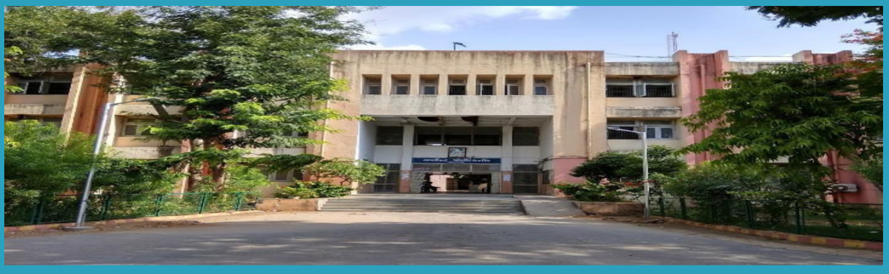

## Content

## About The Department

About the Department

Why GPP Civil? HOD's Message

Vision and Mission of the Department

PEO's and PSO of the Department

Scope of Civil Engineering

Faculty  of  CIVIL  &amp; Applied  Mechanics Department

Department Activities

Extra-Curricular Activities

Student Achiever

Started in 1984, Civil Engineering Department, Government Polytechnic Palanpur offers 3 years (6 semester) Diploma Civil Engineering Program in Two shifts ( Morning shift : 60 seats &amp; Evening shift  :  30  seats).  This  Program  is  Approved  by  All  India Council for Technical Education (AICTE) and Affiliated to Gujarat Technological University,  Ahmedabad (GTU).

## Why GPP Civil ?

Ever since 1984,         Civil Engineering Department, Government Polytechnic Palanpur has been providing students  with  a  rich  and  diverse  learning  environment.  Knowledge, creativity and hands-on experience have always been at our core, and we're proud of the generations of students who have graduated from our College. We always encourage both staff and students to grow, learn and create each passing day.

The transformative learning experiences at Civil Engineering Department, Government Polytechnic Palanpur are designed to help our students grow both in and out of the classroom.  Our passionate and skilled team members are here to help students become  successful  professionals  and  make  an  impact  on  the  world.

## HOD's Message

Welcome to the Department of Civil Engineering. The Department of Civil Engineering strives for Excellence  in  teaching  and  learning  and  ethical professional  development.  We  are  proud  to  have  State-ofthe-art laboratories and technical staff to support our academic  program.  We  have  well  balanced  and  innovative teaching-learning atmosphere and qualified and  well experienced dedicated academic staff. The students here are encouraged to participate in co-curricular and Extracurricular activities for personal development.

Smt. S.B.Khara (HOD Civil)

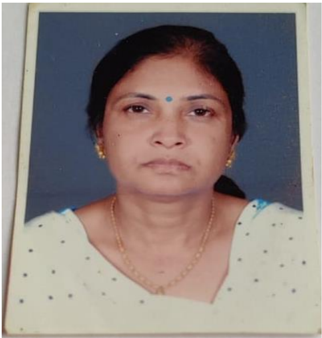

There are many careers paths for Civil Engineers. They are essential in Government agencies,  Private and Public sector undertaking to complete various Mega Projects.

## Vision and Mission of the Department

## Vision

The department envisions to achieve professionals in emerging field of civil engineering to meet aspirations of  the  society,  by  transforming  students  to  be technically skilled, managers, ethical,  entrepreneur's leaders,  and  environmentally  sensible  civil  engineers.

## Mission

1. To impart civil engineering skill to enhance their employability in the  industries.
2. Establish industry collaboration through internship and interaction with professional society through experts, workshops
3. Promote leadership, management, entrepreneurship skills in a student through various projects, co-curriculum, extra-curriculum events.
4. Impart social, environment awareness and responsibility in students to serve society and industry to promote sustainable growth.

## Program Educational Objectives

1. Exhibit technical and leadership capabilities for providing sustainable solutions to various Civil Engineering problems with professional ethics.
2. Inculcate  state  of  the  art  technology  for  efficient  implementation  of  Civil Engineering projects.
3. Enhance social and  economical commitment by entrepreneurial  spirit as  job  creators.
4. Pursue  higher  education  and  improve  learning  spirit  in  the  context  of  technological changes.

## Program Specific Outcomes

1. Select and use of appropriate advanced methods, materials and equipment in construction industry.
2. Suggest relevant and safe demolition/ dismantling techniques for masonry / concrete building structure.
3. Evaluate damaged structure and suggest appropriate repair /  retrofit and maintenance methods /  techniques

## Scope Of Civil Engineering

Civil engineering is a professional engineering discipline which deals with the design, construction and maintenance of the physical and naturally built environment. It provides knowledge and skills to plan, analyze, design, estimate and execute projects using appropriate scientific,  mathematical  and  engineering principles and concepts.

There is a great demand of Diploma Civil Engineers in Government sector including Road &amp;  Building Department, Irrigation Department, Water Supply Board and in Local Municipal Bodies as well as Private sector.

## Faculty of Civil Engineering Department

|   No | Name of  Faculty   | Degree          | Designation   |
|------|--------------------|-----------------|---------------|
|    1 | Smt.S B Khara      | M.E. (Civil)    | HOD           |
|    2 | Shri. N N Rajgor   | M.E. (Civil)    | Lecturer      |
|    3 | Shri. H T Patel    | M.E. (Civil)    | Lecturer      |
|    4 | Shri. D N Sheth    | M.Tech (CASAD)  | Lecturer      |
|    5 | Smt. P D Sheth     | M.E. (Civil)    | Lecturer      |
|    6 | Shri.Y T Rana      | B.E. (Civil)    | Lecturer      |
|    7 | Shri. A R Patel    | M.E. (CASAD)    | Lecturer      |
|    8 | Shri. H P Patel    | B.E. (Civil)    | Lecturer      |
|    9 | Shri. A N Patel    | B.E. (Civil)    | Lecturer      |
|   10 | Smt. N V Prajapati | B.E. (Civil)    | Lecturer      |
|   11 | Shri. F M Patel    | B.E. (Civil)    | Lecturer      |
|   11 | Shri.  D S Mevada  | Diploma (Civil) | Curator       |

## Faculty of Applied Mechanics Department

|   No | Name of  Faculty    | Degree       | Designation   |
|------|---------------------|--------------|---------------|
|    1 | Shri. M D Parmar    | M.E. (CASAD) | HOD           |
|    2 | Shri. M J Mansuri   | B.E. (Civil) | Lecturer      |
|    3 | Shri.J B Suthar     | M.E. (CASAD) | Lecturer      |
|    4 | Shri. J N Chaudhary | B.E. (Civil) | Lecturer      |
|    5 | Shri. B J Desai     | M.A.         | Lab Assistant |

## Extracurricular A ctivities

## 1. Tree plantation -2018 celebration

## 25-07-2018

Wonderful  and  energetic  celebration  of  'world  environment  day'  at G.P.Palanpur  on  5 th June  2018.  All  staff  members  and  present  student contributed their energy in this celebration.

Collecting plastic waste from the various places of the campus like roads, parking, buildings, playground etc… and dumped at one place in campus and  then  dumped  to  waste  dumping  site  of  Palanpur  with  help  of nagarpalika team.

To deliver a message of 'don't use plastic bag' prepare a various slogan and poster.

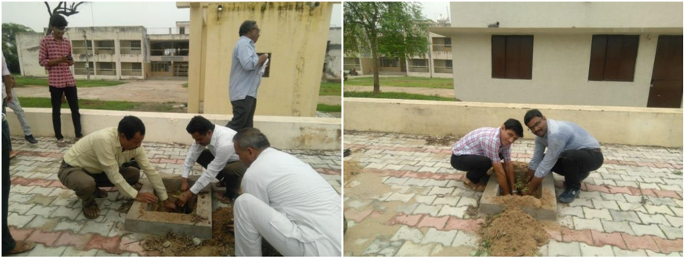

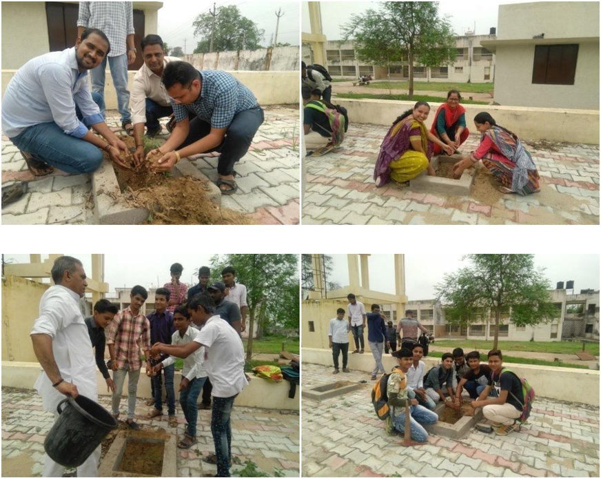

## 2. 15 th  August celebration

## Date-15/08/2018 Place- G.P.Palanpur

A flag hoisting ceremony was organized at Government Polytechnic Palanpur on 15th August 2018 to celebrate 72 th Independence Day in which all the students and staff enthusiastically participated

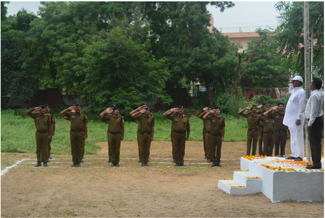

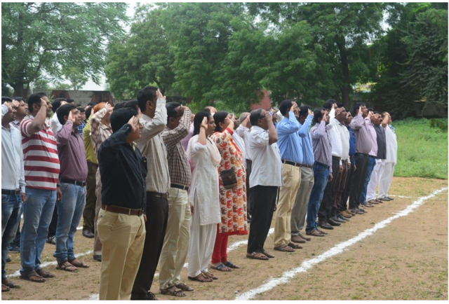

## 3. Mahatma Gandhi birthday celebration (Cleanliness programme)

In  time  period  of  28/09/2018  to  03/10/2018    following  activities  were carried out by the institute.

|   Sr. No. | Date       | Activity                      |
|-----------|------------|-------------------------------|
|         1 | 28/09/2018 | Cleaning Campaign             |
|         2 | 01/10/2018 | Poster presentation           |
|         3 | 01/10/2018 | Reading of Gandhiji's Thought |
|         4 | 01/10/2018 | Drama Competition             |
|         5 | 03/10/2018 | Morning Walk                  |

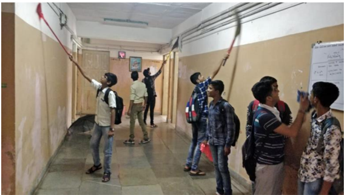

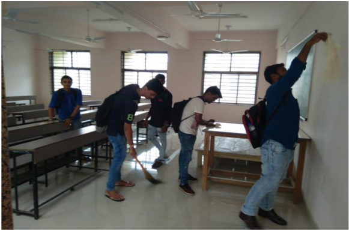

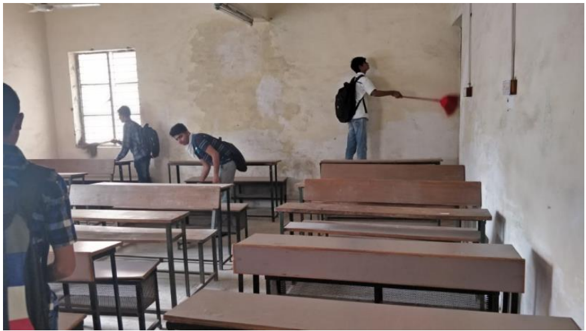

## 4. નવરાત્રી ગરબા મહોત્સવ ની ઉજવણી

## Date-09/10/2018

## Place- G.P.Palanpur

To  enhance  the  cultural  activity  institute  organize  'garba  festival'  on 09/10/2018. Sharing a few glimpses of the Durga Puja celebrations and garba in the campus, which was observed with great zeal and pomp.

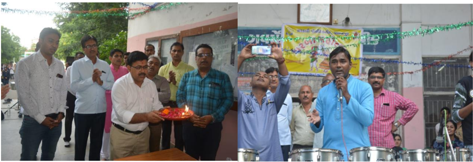

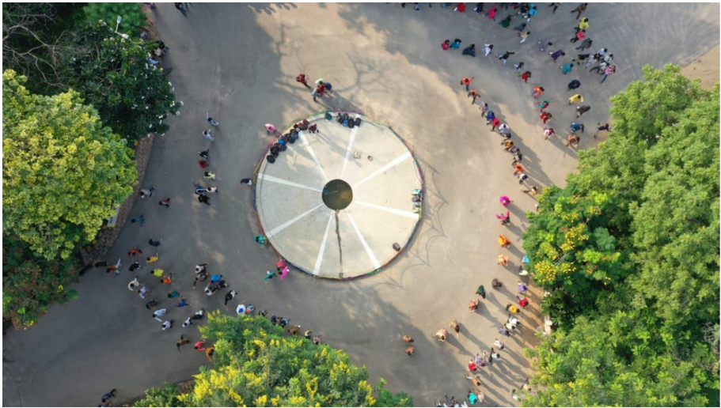

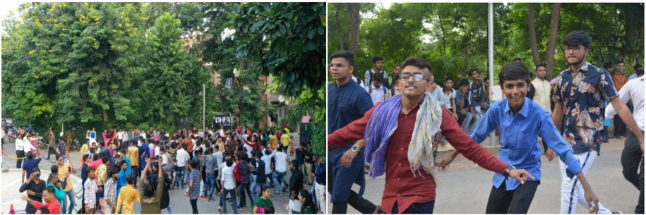

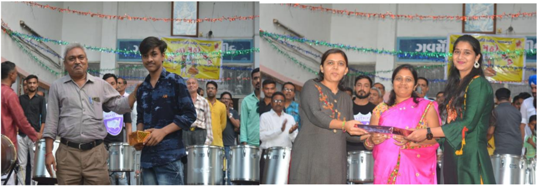

## 6. National Unity Day celebration

## Date-31/10/2018

## Place- G.P.Palanpur

The  Government  of  India  celebrates  the  birth  anniversary  of  Sardar Vallabhbhai Patel on 31st October 2018 as National Unity Day. Pursuant to which the oath taking ceremony of National Unity Day, March Past and Run  for Unity were  organized. Faculty and students had actively participated in events.

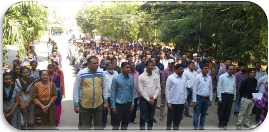

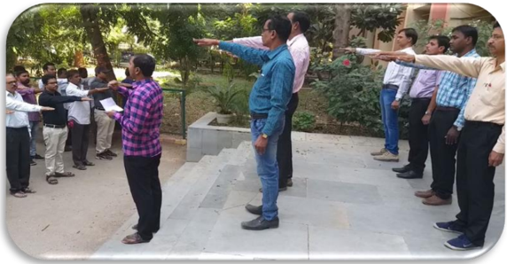

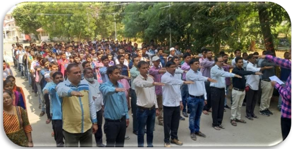

## 5. Celebration of Constitution Day

## Date-26/11/2018 Place- G.P.Palanpur

Constitution  Day  also  known  as  'Samvidhan  Divas',  is  celebrated  in  our  country on 26th November every year to commemorate the adoption of the Constitution of India.  On  26th  November  1949,  the  Constituent  Assembly  of  India  adopted  the Constitution of India, which came into effect from 26th January 1950.

As a part of celebration of constitution day an oath taking was arranged.

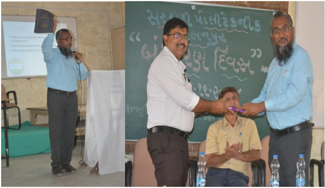

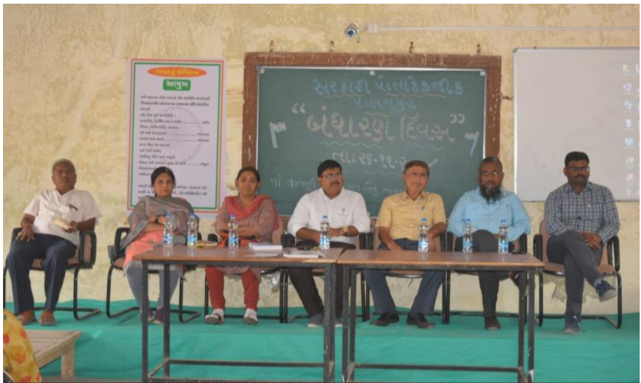

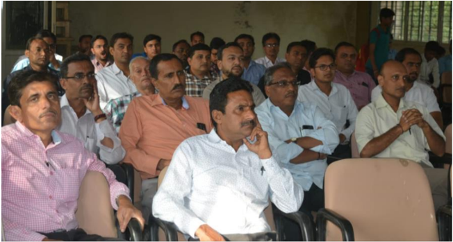

## 2 ND  SEMESTER

| Enrollment No.    Name                                            SPI   |                                                                               |               |
|-------------------------------------------------------------------------|-------------------------------------------------------------------------------|---------------|
| 1.                                                                      | 176260306522       PUROHIT KAILASH ISHVARBHAI           9.19                  | Topper of our |
|                                                                         | 2.         176260306514       PARMAR FALGUNI RAMESHBHAI          8.97         | department    |
|                                                                         | 3.         176260306506      CHAUDHARY VIPULBHAI R.                      8.77 |               |
| 4 TH  SEMESTER                                                          | 4 TH  SEMESTER                                                                |               |
| Enrollment No.    Name                                            SPI   | Enrollment No.    Name                                            SPI         |               |
| 1.                                                                      | 166260306041      PRAJAPATI PANKAJ DINESHBHAI       9.42                      | Topper of our |
|                                                                         | 2.         166260306040       PATEL HIMADRIBEN MAHESHBHAI   8.70              | department    |
|                                                                         | 3.         166260306531      SONI RAVI JITENDRAKUMAR                8.39      |               |
| 6 TH  SEMESTER                                                          | 6 TH  SEMESTER                                                                |               |
| Enrollment No.    Name                                            SPI   | Enrollment No.    Name                                            SPI         |               |
| 1.                                                                      | 156260306002      BAROT JIGAR VINESHBHAI                       9.55           | Topper of our |
|                                                                         | 2.         156260306041      PARMAR KULDIP HARSHADBHAI           9.70         | department    |
|                                                                         | 3.         156260306043     PATEL ARTHBHAI CHANDRESHBHAI    9.70              |               |

## Contact us

Government Polytechnic Palanpur

Department of Civil Engineering

Opp. Malan Darwaja,

Ambaji Road, Palanpur - 385001

Phone: 02742-245219

E-mail:  gppcivil06@gmail.com, gppalanpur05@rediffmail.com

