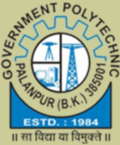
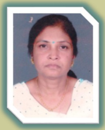
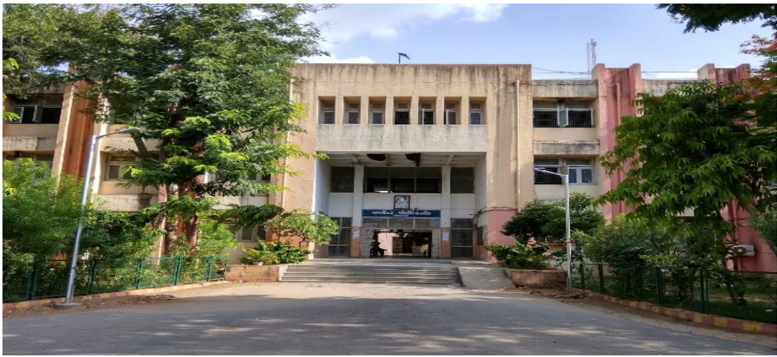
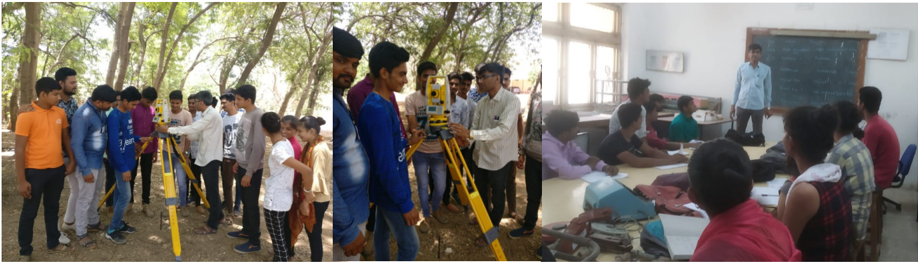
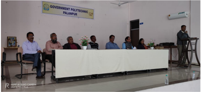
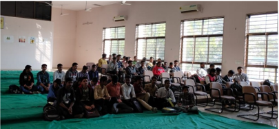
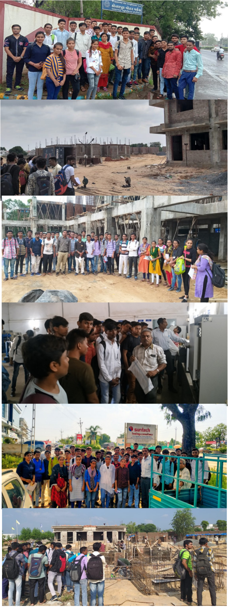
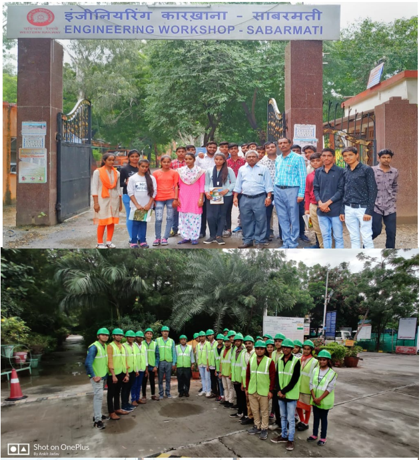
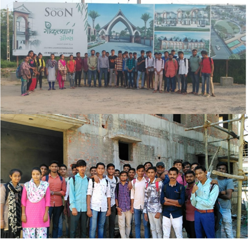

From desk of HOD

As India is going through major infrastructural development, hence Civil Engineers to play leading role  in  national  building, transportation and so on. My  message  to  the  student  and  parents  is  to work very hard to achieve  their  goals  and Excel as an Apex civil engineers of the      country.

Mrs. S. B. Khara HOD (CIVIL)

## Inside this issue:

3

5

Vision &amp; Mission Faculties of Civil &amp; Applied Mechanics 2

Student Achievers

Finishing School

Training programme

Industrial/Site Visit 4

Expert Lecture Contact Us

## Infra Creator

## Department of Civil Engineering

## Volume 1, Issue 1I

## December-2019

## About The Department

The department of civil engineering was stared in the year of 1984 with an aim of promoting high quality education in the field of civil engineering. The academic activities of the department emphasis deep understanding of fundamental principles, development of creative ability to handle the challenges of civil engineering.

The department currently offers Diploma program in civil engineering  following  the  GTU  curriculum.  The  curriculum  broadly  covers  the  engineering  subjects  of  related  fields  such  as  surveying,  building  materials  and constructions, soil mechanics, structural analysis and design, hydraulics and water resources engineering, environmental engineering, transportation engineering, etc...

Industrial site visits/Expert Lectures are arranged for students to gain practical experience. During the semester various technical events like SSIP is organized  for  students  to  explore  the  knowledge  and  interact  with  industries.

Creativity

'The road to success is always under construction' Get it right….CIVIL ENGINEERS

CIVIL ENGINEERS

## Vision

The department envisions to achieve professionals in emerging field of civil engineering  to  meet  aspirations  of  the  society,  by  transforming  students  to  be technically skilled, managers, ethical, entrepreneur's leaders, and environmentally sensible civil engineers.

## Mission

1. To impart civil engineering skill to enhance their employability in the industries.
2. Establish industry collaboration through internship and interaction with professional society through experts, workshops.

## Faculty of Civil Engineering Department

|   Sr No | Name of Faculty     | Degree          | Designation   |
|---------|---------------------|-----------------|---------------|
|       1 | Smt. S B Khara      | M.E. (Civil)    | HOD           |
|       2 | Shri. N N Rajgor    | M.E. (Civil)    | Lecturer      |
|       3 | Shri. H T Patel     | M.E. (Civil)    | Lecturer      |
|       4 | Shri. D N Sheth     | M. Tech (CASAD) | Lecturer      |
|       5 | Smt. P D Sheth      | M.E. (Civil)    | Lecturer      |
|       6 | Shri. Y T Rana      | B.E. (Civil)    | Lecturer      |
|       7 | Shri. A R Patel     | M.E. (CASAD)    | Lecturer      |
|       8 | Shri. H P Patel     | B.E. (Civil)    | Lecturer      |
|       9 | Shri. A N Patel     | B.E. (Civil)    | Lecturer      |
|      10 | Shri. N V Prajapati | B.E. (Civil)    | Lecturer      |
|      11 | Smt. F M Patel      | B.E. (Civil)    | Lecturer      |
|      12 | Shri. D S Mevada    | Diploma (Civil) | Curator       |

## Faculty of Applied Mechanics Department

|   Sr No | Name of Faculty     | Degree                 | Designation   |
|---------|---------------------|------------------------|---------------|
|       1 | Shri. M D Parmar    | M.E. (CASAD)           | HOD           |
|       2 | Shri. M J Mansuri   | B.E. (Civil)           | Lecturer      |
|       3 | Shri. P N Artwani   | M.E. (Civil-Structure) | Lecturer      |
|       4 | Shri. J N Chaudhary | B.E. (Civil)           | Lecturer      |
|       5 | Shri. B J Desai     | M.A.                   | Lab Assistant |

## Student Achievers

|   No. |   Enrollment No.  Name |                            |   CPI |   SPI |   SPI |
|-------|------------------------|----------------------------|-------|-------|-------|
|     1 |           176260306514 | Parmar Falguni Rameshbhai  |  9.24 |  9.3  |  9.27 |
|     2 |           176260306522 | Purohit Kailash Ishvarbhai |  9.04 |  9.04 |  9    |
|     3 |           176260306047 | Patel Vaibhav Hasmukhbhai  |  8.99 |  9.4  |  9.12 |
|     4 |           176260306021 | Gamar Rakeshbhai Tarabhai  |  8.87 |  9.16 |  9.06 |
|     5 |           176260306035 | Mewada Krupaben Rameshbhai |  8.87 |  8.95 |  8.61 |

## Activities and Events

## Technical Finishing School Training Programme

Civil  department  organized  the  extra  higher skill  development  programme  for the final year students in which students can able to perform operational skills of advanced instrument (Total Station) for the survey which is beneficial for the final year students, when they will go for actual site work conditions.

|   No. | Subject                                  | Date       |
|-------|------------------------------------------|------------|
|     1 | Use in Total Station in pipeline Network | 15/05/2019 |

Top Performers of final Year Students in GTU Exam

The joy of engineering is to find a straight line on a double logarithmic diagram.

- Thomas Koenig

## Finishing School Training Programme

Institute organize every year finishing school training programme for final year student for their future  development.  Under  this  programme  students  can  motivate  themselves  for  developing communication skills for interview.

## Industrial/Site Visit

|   No. | Subject                               | Date  Site Visit Detail                                                          |
|-------|---------------------------------------|----------------------------------------------------------------------------------|
|     1 | Water Supply  & Sanitary  Engineering | 03/08/2019  Wastewater treatment  plant, Kotarpur,   Ahmedabad                   |
|     2 | Construction  Technology              | 27/08/2019  28/08/2019  Angan Vila Residency,  Near Dhaniyana   Circle, Palanpur |
|     3 | Construction  Technology              | 05/09/2019  Shopping Complex at  Old Bus-stand,  Palanpur                        |
|     4 | Concrete  Technology                  | 24/09/2019  ARK Infracon,Pvt ltd, (RMC Plant Charotar)                           |
|     5 | Concrete  Technology                  | 24/09/2019  Sun Tech Testing   and Consultancy   Palanpur                        |
|     6 | Construction  Technology              | 25/09/2019  'Gokuldham Greens',  Residencial Bunglows,  Near RTO, Palanpur       |

## Photograph

## Volume 1, Issue 1I

7

Design of Steel

Structure

27/09/2019  Sabarmati Rail Engineering Workshop, D-Cabin, Sabarmati, Ahmedabad

- 8 Concrete

Technology

27/09/2019  J. K. Laxmi

Cement Plant, Kalol

9

- Advanced Construction Technology

04/10/2019  'Gokuldham Greens', Residencial Bunglows, Near RTO, Palanpur

- 10 Water Supply &amp; Sanitary En- gineering

11/10/2019  'Astha Bunglows', Near RTO circle, Palanpur

## Expert Lecture

A Expert lecture on 'Design of Steel Structure' for final year students was organized on 2nd Oct, 2019 by Mr. Batubsi Trivedi, Deputy Executive Engineer, R&amp;B-Sub division Patan, to aware students of Civil Engineering about Various types of Steel Structures.

## Contact us

Government Polytechnic Palanpur Department of Civil Engineering

Opp. Malan Darwaja, Ambaji Road, Palanpur - 385001 Phone: 02742-245219 E-mail:  gppcivil06@gmail.com, gppalanpur05@rediffmail.com

