## INFRA CREATOR Department Of Civil Engineering

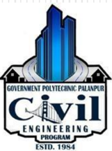

Volume-1, Issue-II  (December-2020)

## Content

## About The Department

About the Department

Why GPP Civil? HOD's Message

Vision and Mission of the Department

PEO's and PSO of the Department

Scope of Civil Engineering

Faculty  of  CIVIL  &amp; Applied  Mechanics Department

Department Activities

Extra-Curricular Activities

Student Achiever

Started in 1984, Civil Engineering Department, Government Polytechnic Palanpur offers 3 years (6 semester) Diploma Civil Engineering Program in Two shifts ( Morning shift : 60 seats &amp; Evening shift  :  30  seats).  This  Program  is  Approved  by  All  India Council for Technical Education (AICTE) and Affiliated to Gujarat Technological University,  Ahmedabad (GTU).

## Why GPP Civil ?

Ever since 1984,         Civil Engineering Department, Government Polytechnic Palanpur has been providing students  with  a  rich  and  diverse  learning  environment.  Knowledge, creativity and hands-on experience have always been at our core, and we're proud of the generations of students who have graduated from our College. We always encourage both staff and students to grow, learn and create each passing day.

The transformative learning experiences at Civil Engineering Department, Government Polytechnic Palanpur are designed to help our students grow both in and out of the classroom.  Our passionate and skilled team members are here to help students become  successful  professionals  and  make  an  impact  on  the  world.

## HOD's Message

Welcome to the Department of Civil Engineering. The Department of Civil Engineering strives for Excellence  in  teaching  and  learning  and  ethical professional  development.  We  are  proud  to  have  State-ofthe-art laboratories and technical staff to support our academic  program.  We  have  well  balanced  and  innovative teaching-learning atmosphere and qualified and  well experienced dedicated academic staff. The students here are encouraged to participate in co-curricular and Extracurricular activities for personal development.

There are many careers paths for Civil Engineers. They are essential in Government agencies,  Private and Public sector undertaking to complete various Mega Projects.

## Vision and Mission of the Department

## Vision

The department envisions to achieve professionals in emerging field of civil engineering to meet aspirations of  the  society,  by  transforming  students  to  be technically skilled, managers, ethical,  entrepreneur's leaders,  and  environmentally  sensible  civil  engineers.

## Mission

1. To impart civil engineering skill to enhance their employability in the  industries.
2. Establish industry collaboration through internship and interaction with professional society through experts, workshops
3. Promote leadership, management, entrepreneurship skills in a student through various projects, co-curriculum, extra-curriculum events.
4. Impart social, environment awareness and responsibility in students to serve society and industry to promote sustainable growth.

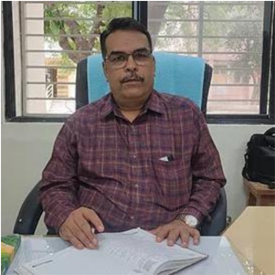

Shri. N.N.Rajgor (HOD Civil)

## Program Educational Objectives

1. Exhibit technical and leadership capabilities for providing sustainable solutions to various Civil Engineering problems with professional ethics.
2. Inculcate  state  of  the  art  technology  for  efficient  implementation  of  Civil Engineering  projects.
3. Enhance social and  economical commitment by entrepreneurial  spirit as  job  creators.
4. Pursue  higher  education  and  improve  learning  spirit  in  the  context  of  technological  changes.

## Program Specific Outcomes

1. Select and use of appropriate advanced methods, materials and equipment in construction industry.
2. Suggest relevant and safe demolition/ dismantling techniques for masonry / concrete building structure.
3. Evaluate damaged structure and suggest appropriate repair /  retrofit and maintenance methods /  techniques

## Scope Of Civil Engineering

Civil  engineering  is  a  professional  engineering  discipline  which  deals  with  the design, construction and maintenance of the physical and naturally built environment. It provides knowledge and skills to plan, analyze, design, estimate and execute projects using appropriate scientific,  mathematical and engineering principles and concepts.

There is a great demand of Diploma Civil Engineers in Government sector including Road &amp;  Building  Department,  Irrigation  Department,  Water  Supply  Board  and  in  Local Municipal Bodies as well as Private sector.

## Faculty of Civil Engineering Department

|   No | Name of  Faculty   | Degree          | Designation   |
|------|--------------------|-----------------|---------------|
|    1 | Shri. N N Rajgor   | M.E. (Civil)    | HOD           |
|    2 | Shri. H T Patel    | M.E. (Civil)    | Lecturer      |
|    3 | Shri. D N Sheth    | M.Tech (CASAD)  | Lecturer      |
|    4 | Smt. P D Sheth     | M.E. (Civil)    | Lecturer      |
|    5 | Shri.Y T Rana      | B.E. (Civil)    | Lecturer      |
|    6 | Shri. A R Patel    | M.E. (CASAD)    | Lecturer      |
|    7 | Shri. H P Patel    | B.E. (Civil)    | Lecturer      |
|    8 | Shri. A N Patel    | B.E. (Civil)    | Lecturer      |
|    9 | Smt. N V Prajapati | B.E. (Civil)    | Lecturer      |
|   10 | Shri. F M Patel    | B.E. (Civil)    | Lecturer      |
|   11 | Shri.  D S Mevada  | Diploma (Civil) | Curator       |

## Faculty of Applied Mechanics Department

|   No | Name of  Faculty    | Degree           | Designation   |
|------|---------------------|------------------|---------------|
|    1 | Shri. M D Parmar    | M.E. (CASAD)     | HOD           |
|    2 | Shri. M J Mansuri   | B.E. (Civil)     | Lecturer      |
|    3 | Smt. P N Artwani    | M.E. (Structure) | Lecturer      |
|    4 | Shri. J N Chaudhary | B.E. (Civil)     | Lecturer      |
|    5 | Shri. B J Desai     | M.A.             | Lab Assistant |

## Departmental Activities and Event

## Expert Lecture Detail

1. An online  expert  Talk  on  'Career guidance lecture'  by  Mr. N N Rajgor  (Head of the Department CivilEngineering Department) on 19 th  september ,  2020

## Extracurricular  Activities

## 74th Independence Day 15/8/2020

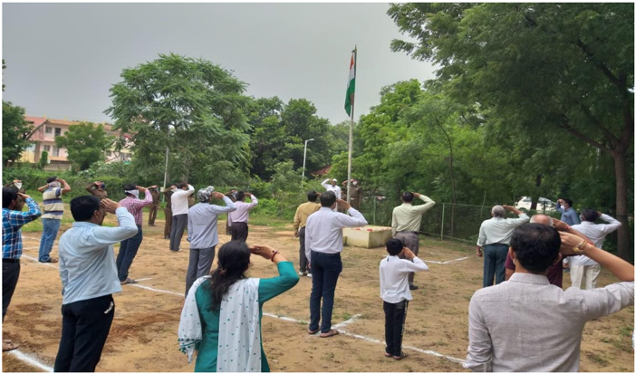

A flag hoisting ceremony was organized at  Government Polytechnic Palanpur on 15th August 2020 to celebrate 74 th  Independence Day in which all the students and staff enthusiastically participated

## Yoga Day 19/6/2020

Fire safety awareness

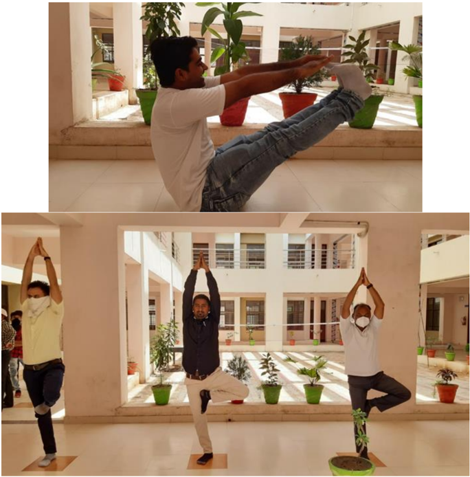

## Date-02/09/2020

## Place- G.P.Palanpur

As we know that the knowledge of fire safety and operating of fire safety equipments  are  very  important  to  everybody.  Hence  on  this  day  we  had organized  demonstrate  the  working  of  these  equipments  via  practical demonstration given by fire safety expert. After expert demonstration, some institute faculty were also operated it under instruction from expert.

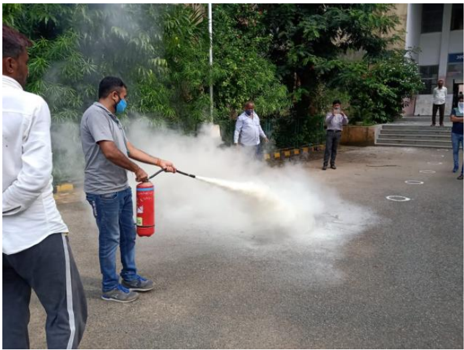

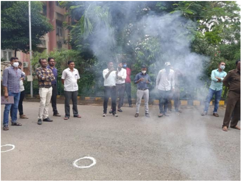

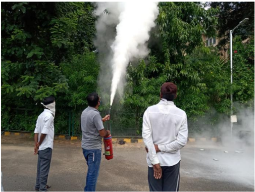

## Tree Plantation-2020 05/09/2020

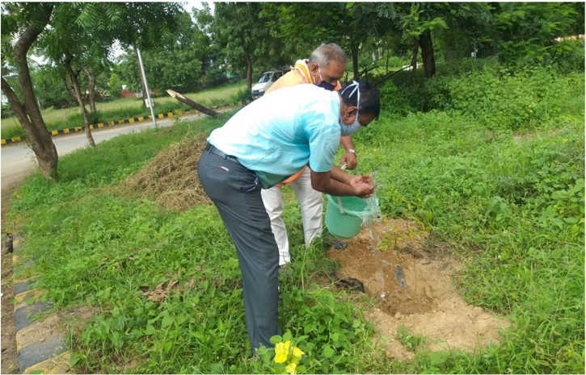

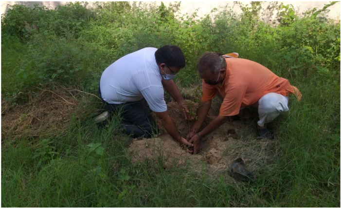

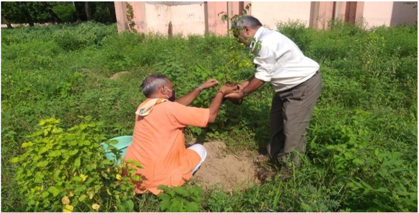

## CORONA Awareness program

## Date-12/10/2020 to 23/11/2020

## Place- G.P.Palanpur

As the world facing this critical pandemic situation, we organized a webinar on 19 th October 2020 and our speaker was very well known Doctor in Palanpur City, Dr. Mayank Shah to spread awareness among students, staff members and for all about all  COVID - 19 situations and safety measures. Other activities like Herbal Plants were planted, Sticking of COVID-19 awareness posters in campus, Corona awareness messages via social media were done during this period

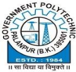

## Government Polytechnic, Palanpur

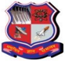

Speaker

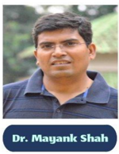

Monday 19-10-2020 On Microsoft Teams organised By Gymkhana committee, G . P Palanpur

## National Education Day

Date-11/11/2020

Place- G.P.Palanpur (lecture taken by Mr. R.H.Prajapati)

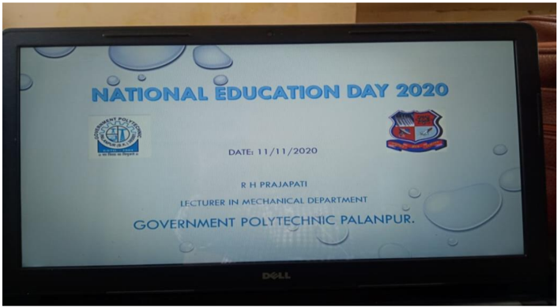

| Enrollment No.    Name                                       SPI      |               |
|-----------------------------------------------------------------------|---------------|
| 1.       176260306047       PATEL VAIBHAV HASMUKHBHAI     10          | Topper of our |
| 2.         176260306514       PARMAR FALGUNI RAMESHBHAI     10        | department    |
| 3.         176260306021       GAMAR RAKESH TARABHAI              9.85 |               |

## Contact us

Government Polytechnic Palanpur

Department of Civil Engineering

Opp. Malan Darwaja,

Ambaji Road, Palanpur - 385001

Phone: 02742-245219

E-mail:  gppcivil06@gmail.com, gppalanpur05@rediffmail.com

