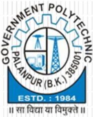

## INFRACREATOR Department Of Civil Engineering

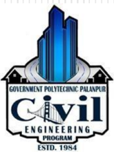

Volume-1, Issue-II(December-2022)

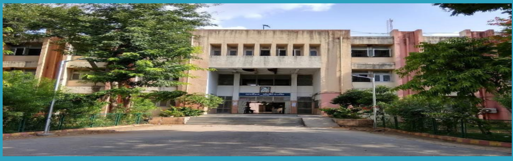

## Content

## About The Department

About the Department

Why GPP Civil?

HOD's Message

Vision and Mission of the Department

PEO's and PSO of the Department

Scope of Civil Engineering

Faculty  of  Civil  &amp; Applied Mechanics Department

Department Activities

Extra-Curricular Activities

Student Achiever

Started  in 1984, Civil  Engineering Department, Government Polytechnic  Palanpur offers 3  years (6 semester)  Diploma  Civil Engineering Program in Two shifts (Morning shift:60seats &amp; Evening  shift:  30seats).This  Program  is  Approved  by  All India  Council  for  Technical  Education  (AICTE)  and  Affiliated  to Gujarat Technological University, Ahmedabad (GTU).

## Why GPP Civil ?

Ever since 1984,        Civil Engineering Department, Government Polytechnic Palanpur has been providing students with a rich and diverse learning environment. Knowledge,  creativity  and  hands-on  experience  have  always been at our core, and we're proud of the generations of students who  have  graduated  from  our  College.  We  always  encourage both  staff  and  students  to  grow, learn and create each passing day.

The  transformative  learning  experiences  at  Civil  Engineering Department,  Government  Polytechnic  Palanpur  are  designed  to help our students grow both in and out of the classroom. Our passionate  and  skilled  team  members  are  here  to  help  students become  successful  professionals  and  make  an  impact  on  the world.

## HOD's Message

Welcome  to  the  Department  of  Civil  Engineering. The  Department  of  Civil  Engineering  strives  for Excellence  in  teaching  and  learning  and  ethical professional development. We are proud to have State-ofthe-art  laboratories  and  technical  staff  to  support  our academic program. We have well balanced and innovative teaching-learning  atmosphere  and  qualified  and  well experienced dedicated academic staff. The students here are  encouraged to participate in co-curricular and Extracurricular activities for personal development.

There are many careers paths for Civil Engineers. They are essential in Government agencies, Private and Public sector undertaking to complete various Mega Projects.

## Vision and Mission of the Department

## Vision

The  department  envisions  to  achieve  professionals  in emerging field of civil engineering to meet aspirations of  the  society,  by  transforming  students  to  be technically  skilled,  managers,  ethical,  entrepreneur's leaders, and environmentally sensible civil engineers.

## Mission

1. To  impart  civil  engineering  skill  to  enhance  their employability in the industries.
2. Establish  industry  collaboration  through internship and  interaction  with  professional  society  through experts, workshops
3. Promote leadership, management, entrepreneurship skills in  a  student  through  various  projects,  co-curriculum, extra-curriculum events.
4. Impart  social,  environment  awareness  and  responsibility in  students  to  serve  society  and  industry  to  promote sustainable growth.

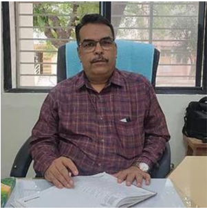

Shri. N.N.Rajgor (HOD Civil)

2

## Program Educational Objectives

1. technical and leadership capabilities for providing sustainable solutions to various Civil Engineering problems with professional ethics.
2. Inculcate state of the art technology for efficient implementation of Civil Engineering projects.
3. Enhance social and economical commitment by entrepreneurial spirit as job creators.
4. Pursue higher education and improve learning spirit in the context of technological changes.

## Program Specific Outcomes

1. Select and use of appropriate advanced methods, materials and equipment in construction industry.
2. Suggest relevant and safe demolition/ dismantling techniques for masonry / concrete building structure.
3. Evaluate  damaged  structure  and  suggest  appropriate  repair  /  retrofit  and  maintenance methods /  techniques

## Scope Of Civil Engineering

Civil  engineering is a  professional engineering  discipline  which deals  with the  design, construction and maintenance of the physical and naturally built environment. It provides knowledge and skills to plan, analyze, design, estimate and execute projects using appropriate scientific, mathematical and engineering principles and concepts.

There is a great demand of Diploma Civil Engineers in Government sector including Road &amp; Building  Department,  Irrigation  Department,  Water  Supply  Board  and  in  Local  Municipal Bodies as well as Private sector.

## Faculty of Civil Engineering Department

|   No | Name of Faculty      | Degree          | Designation   |
|------|----------------------|-----------------|---------------|
|    1 | Shri. N N Rajgor     | M.E. (Civil)    | HOD           |
|    2 | Shri. D N Sheth      | M.Tech (CASAD)  | Lecturer      |
|    3 | Smt.P D Sheth        | M.E. (Civil)    | Lecturer      |
|    4 | Shri.V P Patel       | M.E. (Civil)    | Lecturer      |
|    5 | Shri.Y T Rana        | B.E. (Civil)    | Lecturer      |
|    6 | Shri. A R Patel      | M.E. (CASAD)    | Lecturer      |
|    7 | Shri. H P Patel      | B.E. (Civil)    | Lecturer      |
|    8 | Shri. A N Patel      | B.E. (Civil)    | Lecturer      |
|    9 | Shri.F A Mukhi       | B.E. (Civil)    | Lecturer      |
|   10 | Shri. N V  Prajapati | B.E. (Civil)    | Lecturer      |
|   11 | Smt. F M Patel       | B.E. (Civil)    | Lecturer      |
|   12 | Shri. D S Mevada     | Diploma (Civil) | Curator       |

3

## Faculty of Applied Mechanics Department

|   No | Name of Faculty      | Degree            | Designation   |
|------|----------------------|-------------------|---------------|
|    1 | Shri. M J Mansuri    | B.E. (Civil)      | HOD           |
|    2 | Shri. R J Patel      | M. E.Civil(CASAD) | Lecturer      |
|    4 | Shri. J  N Chaudhary | B.E. (Civil)      | Lecturer      |
|    5 | Shri. B J Desai      | M.A.              | Lab Assistant |

## Extra co-curricular activities

## CYBER CRIME AWARENESS

## DATE - 06/07/2022 PLACE - SEMINAR HALL

Government polytechnic Palanpur has organized a seminar on 'Cyber Crime Awareness' to impart knowledge to the students and staff about the various issues related to cybercrime and hacking on 6 th July.

The  lecture  was  delivered  by Shri.  Vinodbhai  Chaudhari , State  Cyber  Crime  Cell,  CID Crime, Gujarat. He shared lots of case studies with us like the case of Cassidy wolf. Websites used  for  downloading songs  like Songs.pk are also supporting piracy.  Credit card  frauds are done with the help of skimmers.

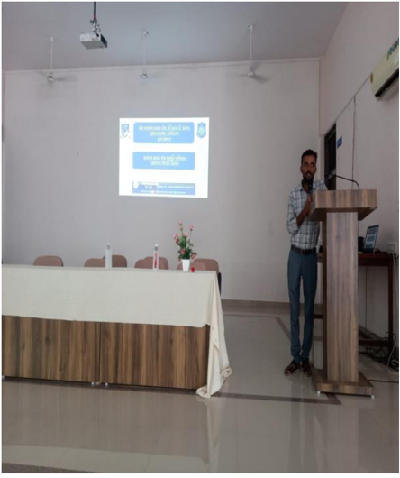

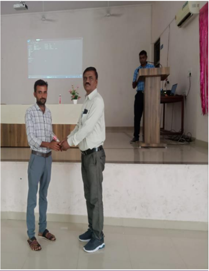

## TREE PLANTATION

## DATE - 22/07/2022

## PLACE - COLLEGE CAMPUS

## 'MY EARTH - MY DUTY'

Every man needs the oxygen for their life and Trees are the foremost source of oxygen as well trees help to reduce the level of co2.

As we all know that the whole world is facing the problem of global warming and to recover from such problem planting the trees has become one of the most important today's aspects.

GOVERNMENT POLYTECHNIC PALANPUR has organized 'Tree Plantation' program on Friday, 22nd July, 2022 in  the  college  campus. It was attended by all college staff, students and student volunteers enthusiastically . More than 100 plants were planted on the occasion.

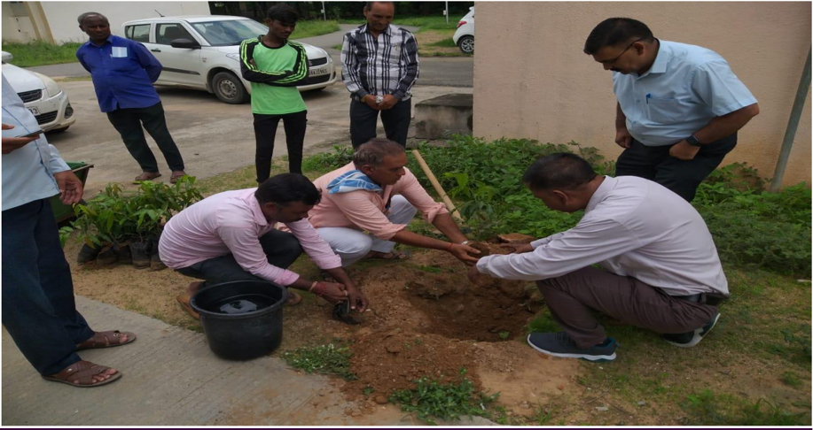

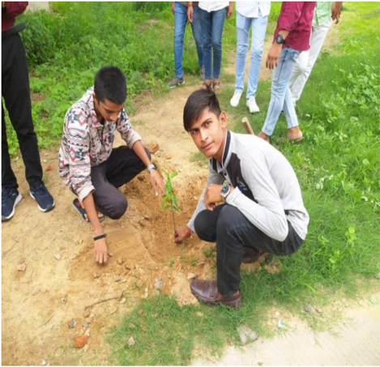

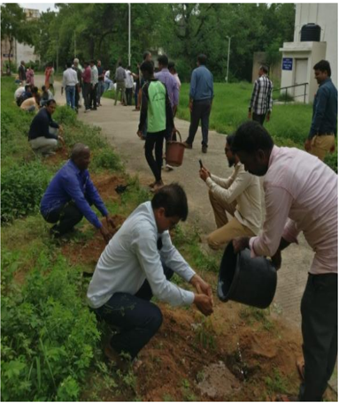

## HAR GHAR TIRANGA

WEEK - 28/07/2022 to 31/07/2022 EVENT NAME     -   RESOLUTION READING -ELOCUTION COMPETITION -ESSAY WRITING

## PLACE - G P PALANPUR

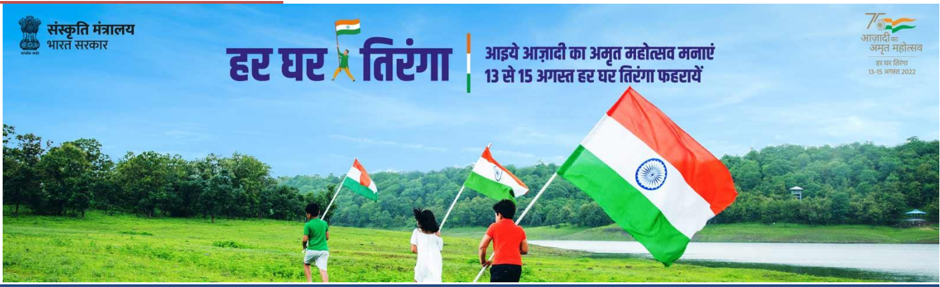

Various nationwide programs are being planned and implemented by the Government of India to celebrate Azadi Ka Amrit Mahotsav . 'Har Ghar Tiranga' is a campaign under the aegis of Azadi Ka Amrit Mahotsav to encourage people to bring the Tiranga home and to hoist it to mark the 75th year of India's independence.

To mark this momentous occasion our institution Government Polytechnic Palanpur has organized an elocution competition, resolution reading and essay writing on the importance of national flag.

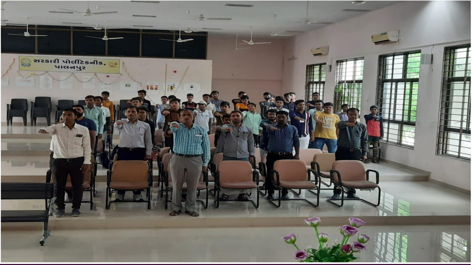

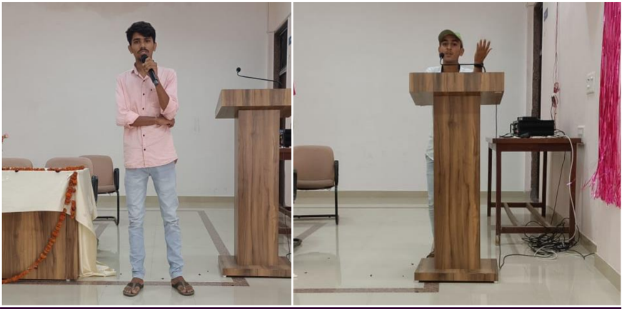

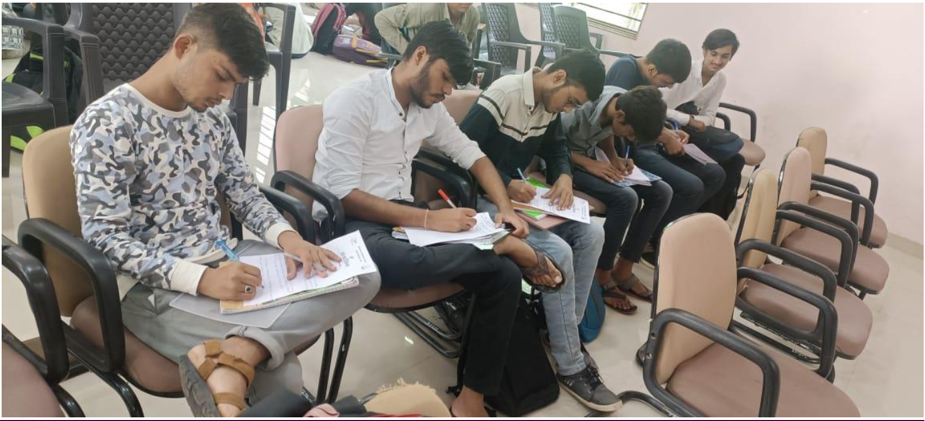

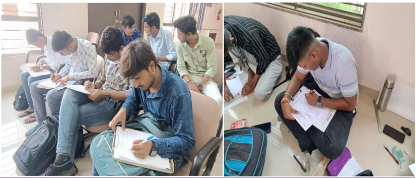

## HAR GHAR TIRANGA

WEEK - 01/08/2022 to 07/08/2022

## EVENT NAME     -   PREPARING NATIONAL FLAG ON CHART/CLOTH -SINGING COMPITION

PLACE - G P PALANPUR

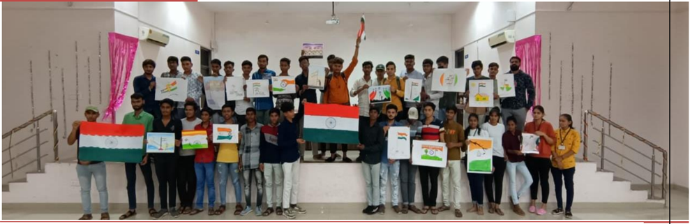

Azadi  Ka  Amrit  Mahotsav is  an  initiative  of  the  Government  of  India  to  celebrate  and commemorate  75  years  of  independence  and  the  glorious  history  of  its  people,  culture  and achievements.. 'Har Ghar Tiranga' is a campaign under the aegis of Azadi Ka Amrit Mahotsav to encourage people to bring the Tiranga home and to hoist it to mark the 75th year of India's independence.

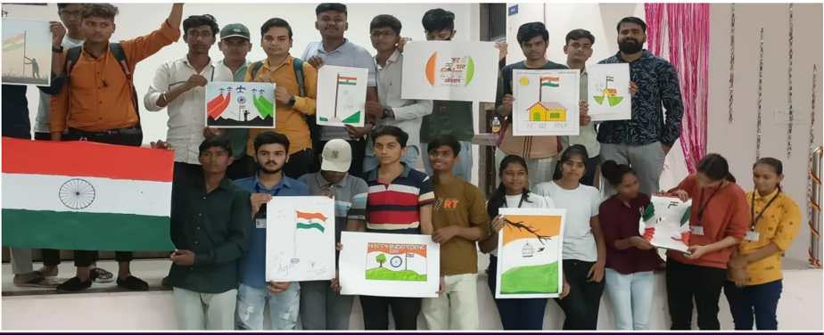

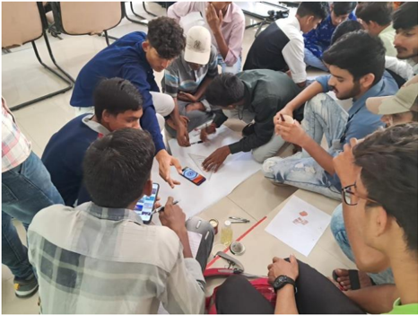

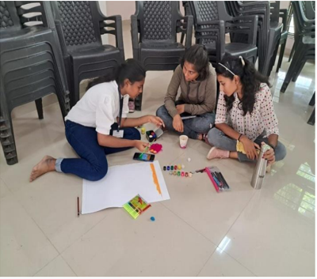

## RESOLUTION READING, PRIZE DISTRIBUTION AND TIRANGA RALLY

DATE- 10/08/2022

PLACE - G P PALANPUR

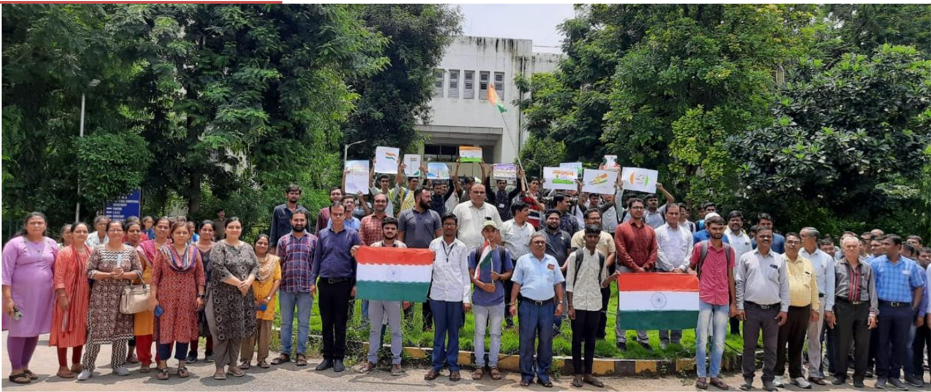

Various nationwide programs are being planned and implemented by the Government of India to celebrate Azadi Ka Amrit Mahotsav. 'Har Ghar Tiranga' is a campaign under the aegis of Azadi  Ka  Amrit Mahotsav to encourage people to bring the Tiranga  home and to hoist  it to mark the 75th year of India's independence.

All the students and employees of the institute enthusiastically participated in this competition.

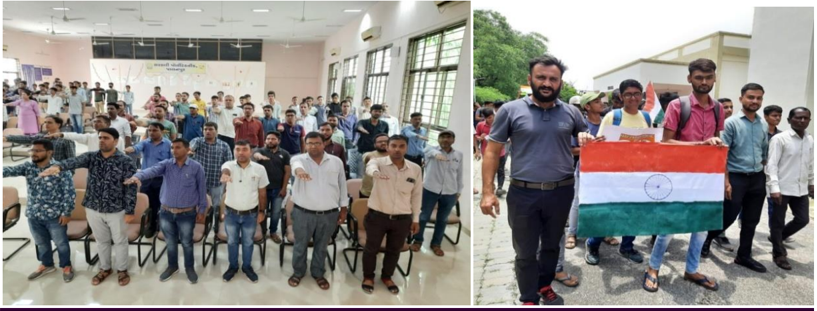

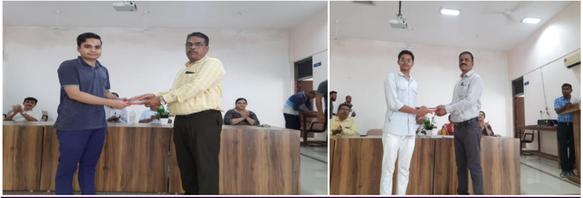

## 76 TH  INDEPENDENCE DAY

DATE - 15/08/2022

PLACE - G P PALANPUR CAMPUS

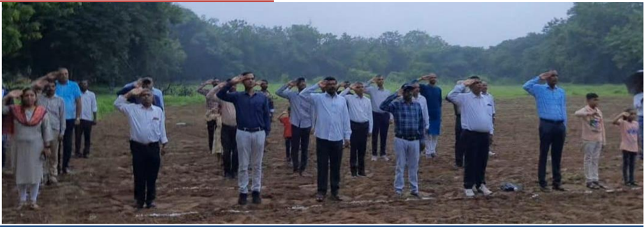

The Independence Day of India is celebrated on the 15th of August to commemorate the birth of  a  free  and  democratic  nation.  Flag  hoisting  ceremony  was  arranged  in  our  college government polytechnic  Palanpur  with  fervent  zeal  and  patriotism.  Flag  hoisting  and  speech was  done  by  our  principal  Shri.  S  D  Dabhi  sir.  Tributes  are  paid  to  the  martyrs  for  their contribution to the freedom struggle.

Flower rain by drawn which was made by students was remain eye catching moment. All Staff members their family and students taken participants enthusiastically

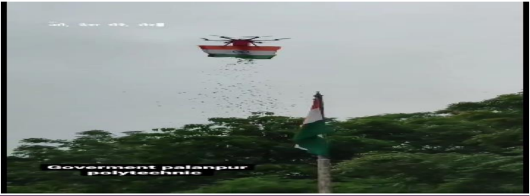

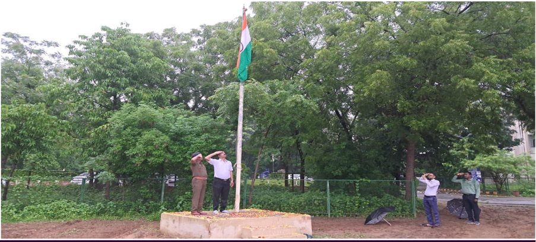

## CLIMATE CHANGE

DATE - 17/09/2022 to 30/09/2022 PLACE - SEMINAR HALL

On  the  occasion  of  the  establishment  day  of  Climate  Change  Department  of  Gujarat Government on September 17, various programs have been organized from 17/09/2022 to 30/09/2022  at  our  institute  GOVERNMENT  POLYTECHNIC  PALANPUR. Various programs  like  slogan  competition,  Innovative  Ideas  for  combating  climate  change,  group discussion  competition,  essay  writing  competition,  elocution  competition  are  organized  at institute.

Participating  and  winning  students  of  the  competition  will  be  awarded  certificates  by  the Gujarat Energy Development Agency under the Department of Climate Change.

During this celebration students learned about following some  interesting  facts about climate changes.

## LIST OF EVENTS

|   Sr.No | Event title                             | Activity              | Date       |
|---------|-----------------------------------------|-----------------------|------------|
|       1 | Water management                        | Slogan competition    | 17/09/2022 |
|       2 | Renewable energy                        | Elocution competition | 19/09/2022 |
|       3 | Panchamrit for climate change           | Signature campaign    | 20/09/2022 |
|       4 | Battery operated vehicles               | Group discussion      | 20/09/2022 |
|       5 | Environment , forest and climate change | Essay writing         | 21/09/2022 |

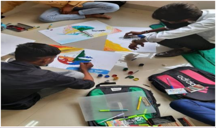

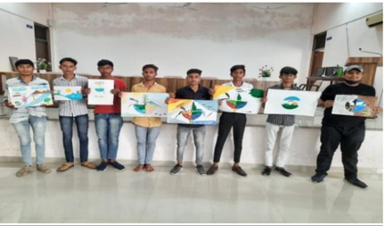

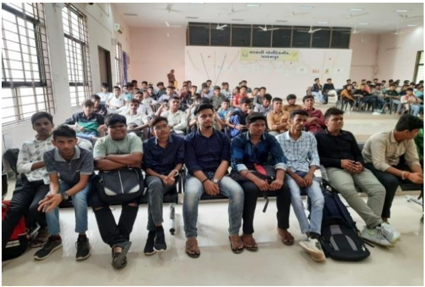

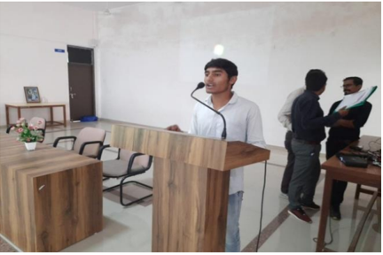

## NAVARATRI (GARABA) CELEBRATION

## DATE - 06/10/2022

## PLACE - MAIN GROUND , G P PALANPUR

Our organization Government Polytechnic Palanpur organized 'Navratri Garba Mahotsav ' on  06/10/2022  from  2  pm  to  6  pm  in  a  manner  consistent  with  the  culture  of  Gujarat  for additional cultural activities apart from educational activities. Enthusiasm of the students were Increased by organizing prizes for the winners as well as the traditional dress.

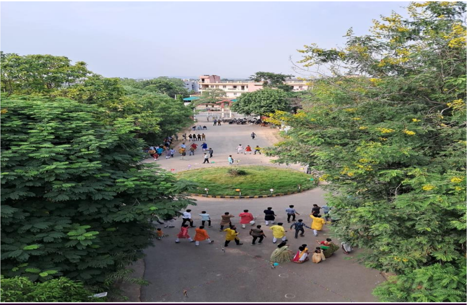

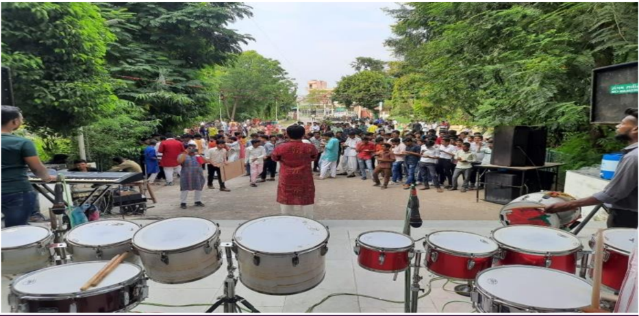

DATE - 09/10/2022

PLACE - SEMINAR HALL

A  lecture  on  the  soil  conservation  campaign  has  been  organized a t our  institute on  09 th September 2022 at 3:00 PM in the seminar hall .

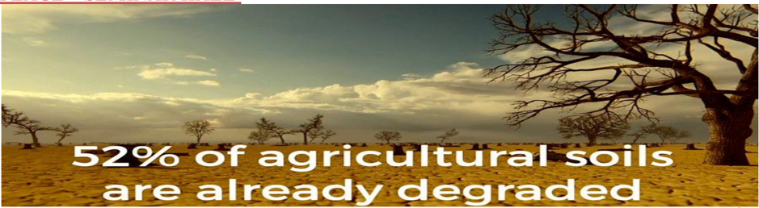

The  lecture  has  been  given  by Dr.  SACHIN  MALVE,  Scientist  (agronomy)  Dantiwada Agriculture University . Dr.Sachin has explained the need of this movement and awaked with some interesting facts about the soil. Some of as below,

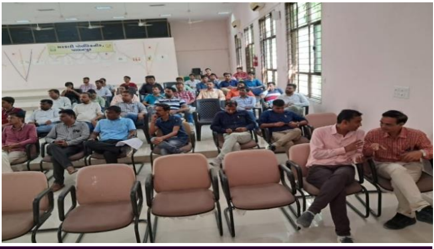

## CLEAN OCEAN MISSION

DATE - 09/10/2022

PLACE - SEMINAR HALL

Mr.Rakesh Prajapati, Lecturer Government polytechnic Palanpur, has explained need of clean ocean mission

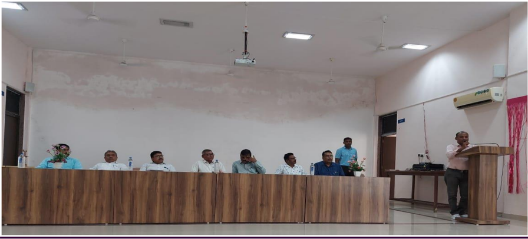

## SAVE SOIL

## GUJARAT 2022, NATIONAL GAMES OF INDIA

DATE - 09/10/2022

PlACE - SEMINAR HALL

The 2022 National Games of India, also known as Gujarat 2022 , will be the 36th edition of the National games of India and will be held in Ahmedabad, Gandhinagar, Surat, Vadodara, Rajkot and Bhavnagar in the state of Gujarat between 27 September and 10 October 2022 . The official logo and motto of the games was unveiled on 22 July 2022.

To spread awareness of this event, Mr. B G Parmar city mamlatdar Palanpur came to our institute GOVERNMENT POLYTECHNIC PALANPUR on 09th September 2022.

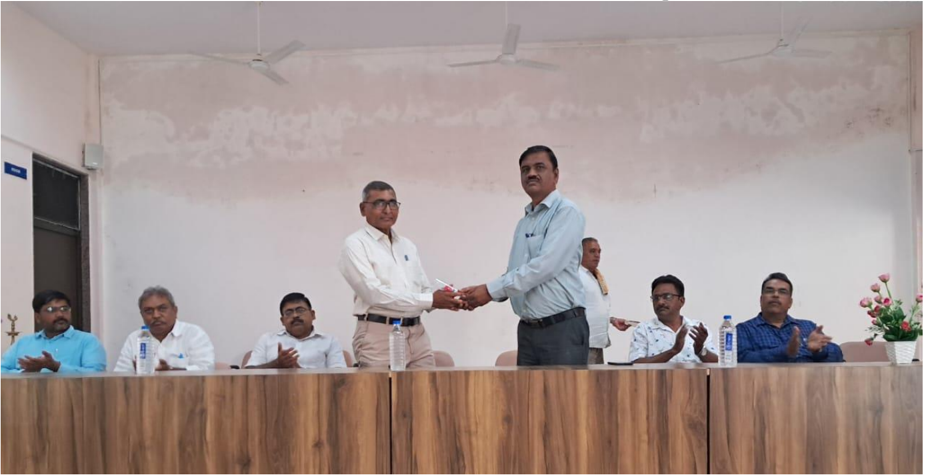

## VOTER AWARENESS

DATE - 09/10/2022

PLACE - SEMINAR HALL

To  make  student  aware  about  the  election  process  and  how  to  register  for  voter  ID  card, Mr.B.G.Parmar City mamlatdar Palanpur came to our institute on 9 th   September .  In  this seminar  he has explained need of  voter awareness among new generation as well as  in rural areas.At last we all take oath to give VOTE in every election and will also make aware other people about voting.

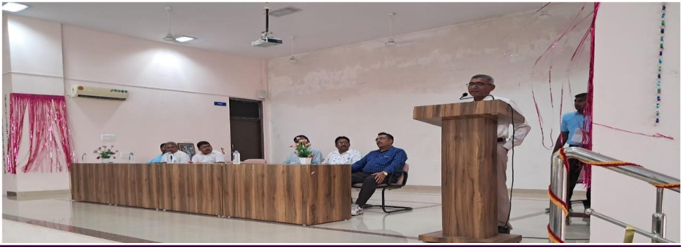

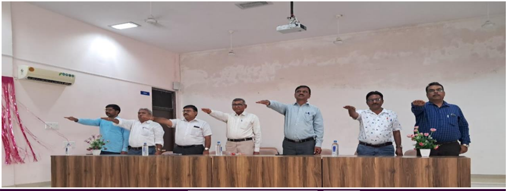

## CONSTITUTION DAY

## DATE - 26/11/2022

## PLACE - SEMINAR HALL

'Constitution Day' also  known as 'Samvidhan Divas' ,  is  celebrated in our  country on 26th November every year to commemorate the adoption of the Constitution of India.

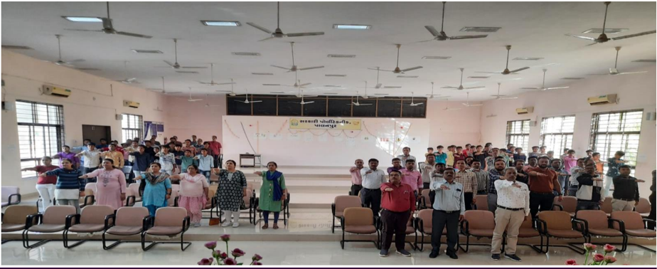

## Student Achievers

## 4 th sem toppers

|    |   No.  Enrollment No. | Name                        |   CGPA |
|----|-----------------------|-----------------------------|--------|
|  1 |          206260306017 | PATNI NARESHBHAI VASANTBHAI |   9.09 |
|  2 |          206260306001 | PRAJAPATI DHRUV HARESHKUMAR |   8.69 |
|  3 |          206260306006 | MEVADA HARSH KIRANKUMAR     |   8.42 |

## Committee members of news letter

- 1) Mr. D.N.Sheth(lecturer in civil engineering department)
- 2) Mrs.F.M.Patel((lecturer in civil engineering department)
- 3) Mr. H.K.Mevada(4 th semester student)
- 4) Mr.D.H.Prajapati(4 th semester student)

## Government  Polytechnic  Palanpur

## Department of Civil Engineering

Opp. Malan Darwaja, Ambaji Road,

Palanpur - 385001

Phone: 02742-245219

E-mail:  gppcivil06@gmail.com,

