## INFRACREATOR

## Newsletter

ISSUE 12 (DEC 2023)

## Vision

The department envisions to achieve professionals in emerging field of civil engineering to meet aspirations of the society, by transforming students to  be technically skilled, managers, ethical, entrepreneur's leaders, and environmentally sensible civil engineers.

GOVERNMENT POLYTECHNIC PALANPUR

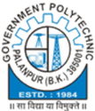

CIVIL ENGINEERING DEPARTMENT

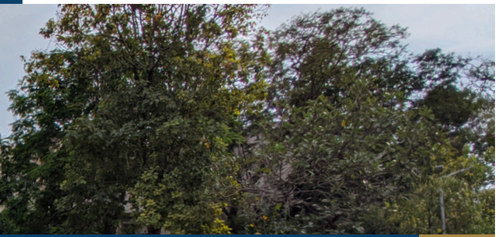

## ABOUT THE DEPARTMENT

Started in 1984, Civil Engineering Department,  Government  Polytechnic Palanpur  offers  3  years  (6  semester) Diploma Civil Engineering Program with 90 intake capacity.

This  Program is Approved by All India Council for Technical Education (AICTE) and Affiliated to Gujarat Technological University, Ahmedabad(GTU).

## Mission

- To impart civil engineering skill to enhance their employability in the industries.
- Establish industry collaboration through internship and interaction with professional society through experts, workshops
- 3Promote  leadership,  management,  entrepreneurship  skills  in  a student through various projects, co-curriculum, extracurriculum events.
- 4Impart  social,  environment  awareness  and  responsibility  in students  to  serve  society  and  industry  to  promote  sustainable growth.

01/18

## HOD's Message

Welcome to the Department of Civil Engineering. The Department  of  Civil  Engineering  strives for  Excellence  in teaching and learning and ethical professional development. We  are  proud  to  have  State-of-  the-art  laboratories  and technical  staff  to  support  our  academic  program.  We  have well balanced and innovative teaching-learning atmosphere and  qualified  and  well  experienced  dedicated  academic staff. The students here are encouraged to participate in cocurricular and Extra-curricular activities for personal development.

There  are  many  careers  paths  for  Civil  Engineers.  They  are essential in Government agencies, Private and Public sectorundertaking to completevarious Mega Projects.

## Newsletter Committee

Government Polytechnic Palanpur Department of Civil Engineering

## Editor in Chief

- Mr N N RAJGOR (HOD Civil)

Coordinator

- Mr F A MUKHI (Lecturer Civil)

## Editors

- Mr N V PRAJAPATI (Lecturer Civil)
- Mr J N CHAUDHARY (Lecturer Ap. Mech.)

## Student Editors

- MANASIYA TALHA N 5th Sem
- PRAJAPATI OM D 5th Sem
- RAVAL JAIMIN D 3rd Sem
- BAGHEL PUNAM I  3rd Sem
- GOSWAMI PRINCEGIRI 1st Sem
- NANDOLIYA AHMEDRIJVAN 1st Sem

Send your feedback to gppcivil06@gmail.com

## Inside The Issue

| Independance Day Celebration             | >> Page 4   |
|------------------------------------------|-------------|
| Admission Awareness Program              | >> Page 4   |
| A Site visit of Multi storey Building    | >> Page 5   |
| Project on Foundation marking            | >> Page 5   |
| Project of Profile Levelling             | >> Page 6   |
| Visit of RMC Plant                       | >> Page 7   |
| Induction Program                        | >> Page 7   |
| A Field visit of Residential Scheme      | >> Page 8   |
| Summer Internship Reports                | >> Page 9   |
| INFRA NEWS : Mumbai Trans Harbour Link:  | >> Page 14  |
| A Game-Changer in Connectivity           |             |
| INFRA NEWS : Okha Bet Dwarka Bridge      | >> Page 14  |
| INFRA ARTICLE : Advancing GIFT City:     | >> Page 15  |
| Exciting New Construction Projects       |             |
| Painting by Students                     | >> Page 16  |
| Report on the Newly Built Mumbai Coastal | >> Page 17  |
| Road                                     |             |
| Out Star Students                        | >> Page 18  |
| Faculty Achievements                     | >> Page 18  |

## Independance Day Celebration

At Government Polytechnic Palanpur, On 15th August 2023, the occasion of 77th Independance Day, a flag hoisting program was arranged in which all the officials, employees and students of the institute enthusiastically participated.

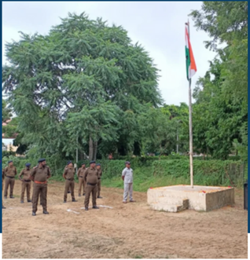

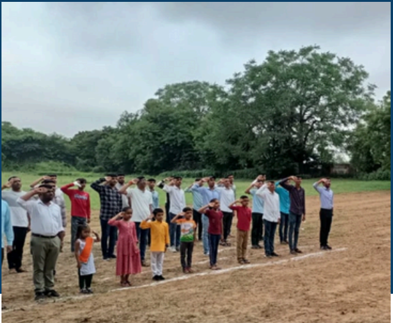

## Admission Awareness Program

Diploma  engineering  admission  awareness programs were arranged at major schools of all talukas of Banaskantha district in last week of december 2023

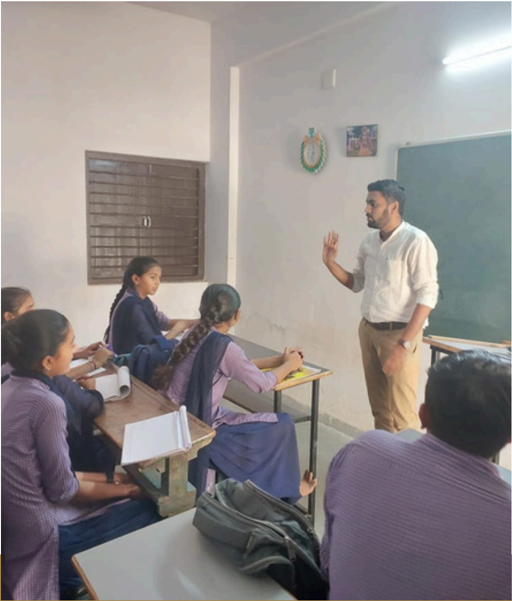

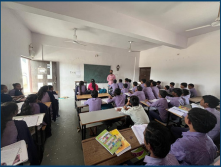

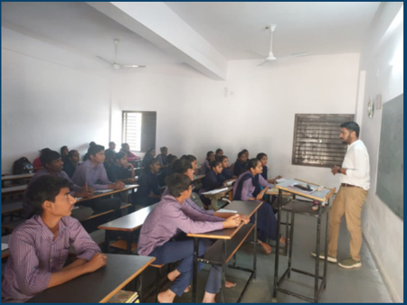

## A Site visit of Multi storey Building

A Site  visit  at  Jalotra  road  approach  was  arranged  on  23/10/2023  for Advanced Construction Technology subject. In which total 23 students of 5th semester participated. Students get to know various  construction activities at various stages of the project

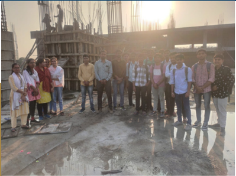

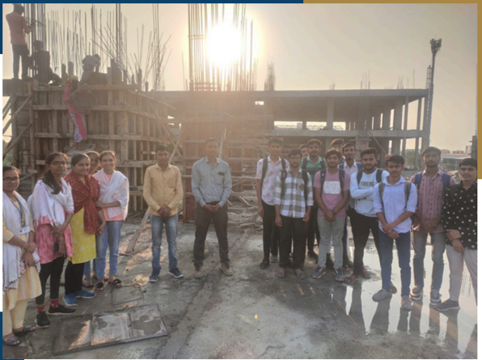

Project on Foundation marking

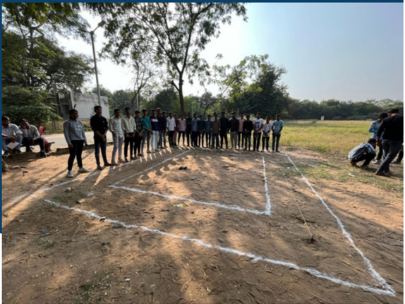

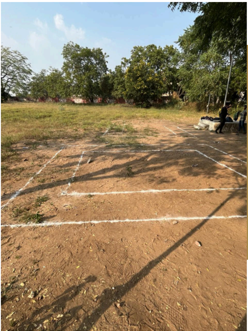

## Project of Profile Levelling

An project on profile leveling was arranged on 03/11/2023 for 3rd semester civil engineering students at under construction party plot near malan gate. students learn how to take levels, level calculation an how to prepare contour map for fiven site.

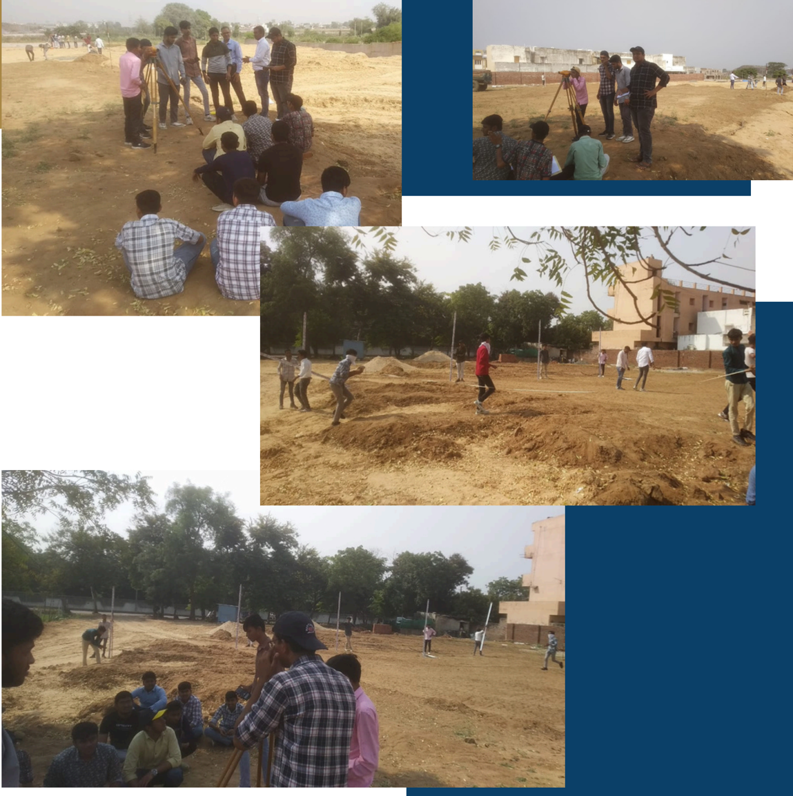

## Visit of RMC Plant

A visit of A R K RMC Plant at chadotar was arranged on 14/12/2023 for  5th semester civil engineering students. Total 39 students were participated which was organized by applied mechanics departments. In which students gain knowledge about Ready Mix Concrete procedures and applications

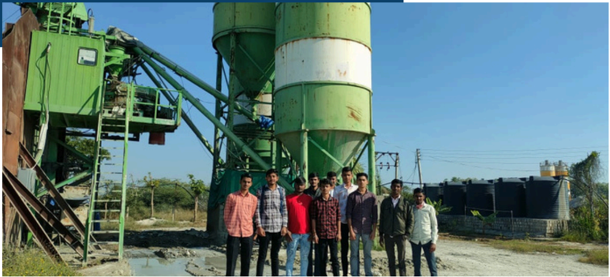

## Induction Program

An Induction program for newly admitted diploma civil engineering students was arranged on 2nd August. In which All the necessary information related to department, institute, GTU, fees payment, exam form etc are given to students

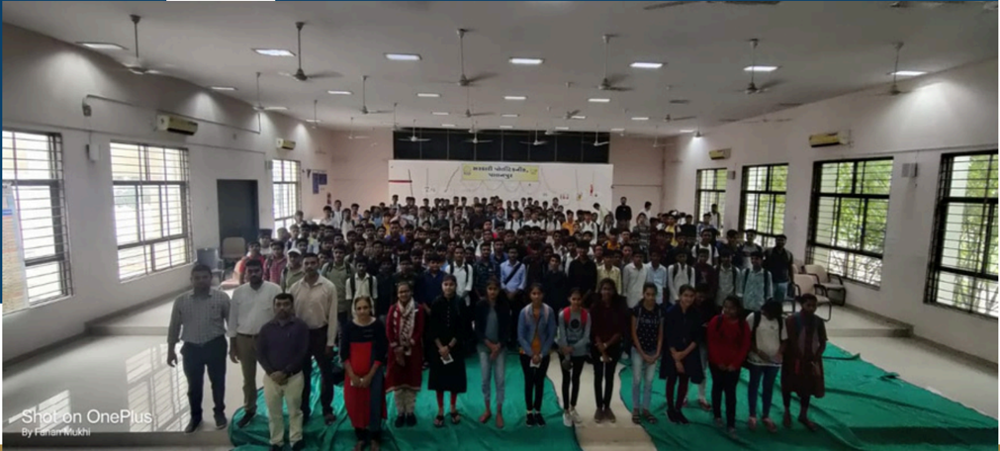

## A Field visit of Residential Scheme

A Field visit at Amrut Villa, Dhaniyana chokdi, Palanpur was arranged on 30/12/2023 for Construction Materials &amp; technology subject. In which total 62 students participated. Students get to know various construction activities at various stages of the project

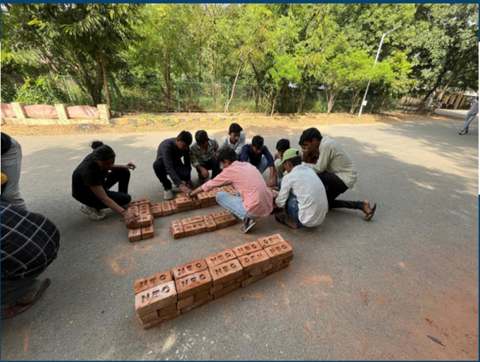

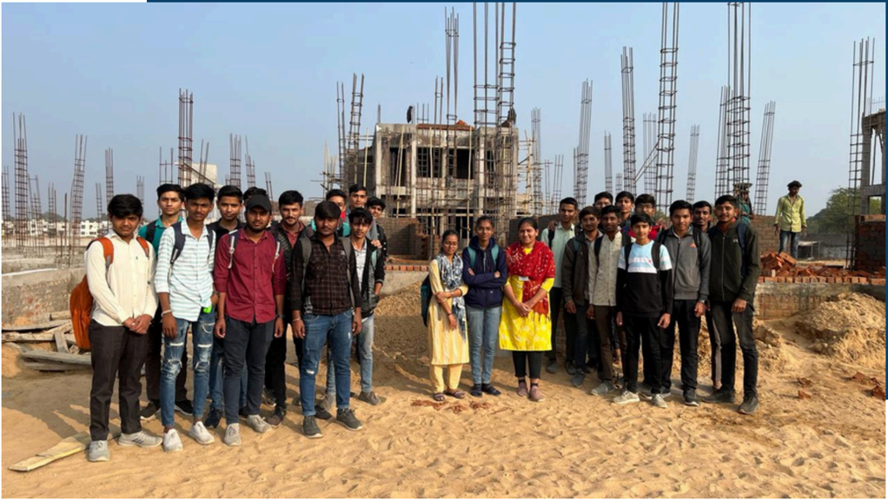

## Summer Internship

Some examples of the reports of summer internship by semester 3 and 5  diploma civil engineering students are here:

## Introduction

- For career-oriented education   Gujarat   Technological   University (GTU) introduced new  and significant Diploma Civil Engineering student ~Summer Internship (4330001)" for 3rd sem students. A internship is period of working experience   offered by an organization for limited period of time applied
- The Summer Internship bridge the gap between theory and practice and provides students with practical;  field-based, real-world experience their year study. during
- difficulties faced by an engineer. how to manage everything and what are the duties of an engineer: During
- In addition, an internship can be used to build a professional network can assist with letters of recommondation or lead to future employment opportunities
- For these practical and technical skill I participated in "PRABHU ENTERPRISE" Construction company.

## PROJECT INFORMATION

Company name Prabhu Enterprise School Building Construction Work At- Gangva, Ta. Danta, Dist. B.K

## LEARNINGOBJECTIVES

- The Orient us with the Practical Civil engineering works.
- The allows us to apply our theoretical knowledge in to the Practical   field.
- To let us gaining Practical experience.
- To let us understand of planning, design and drawing.

## Weekly Overview of Internship

| Project Name                      | Project Engineer                  | Duration                 | What me saw?                                                                                                                                              |
|-----------------------------------|-----------------------------------|--------------------------|-----------------------------------------------------------------------------------------------------------------------------------------------------------|
| School Building Construction Work | Mr. S.N.Prajapati (DCE & BE Civil | 10/08/2023 to 16/08/2023 | Introduction   of   site;  Study about building material , Excavation; PCC. Saw the steel arrangement in foundation; Pedestal, Tie Beam, CC Work Footing. |
| School Building Construction Work | (DCE & BE Civil                   | 17/08/2023 to 23/08/2023 | Saw below Activities Like; Brick Ramming                                                                                                                  |

## Summer Internship

## Daywise Detailing

- DAY-1 (Introduction of Site; General Knowledge about Civil   Material ):-
- First day I want to visit the project of School Building Construction work. 1 Observed the site and got information about different materials used in Civil Engineering.
- The Name of this project is School Building Construction work.
- This Project is Related to Construction of three Classroom
- This Structure is Frame Structure

## Study of Civil Engineering Material:

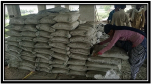

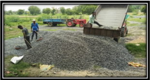

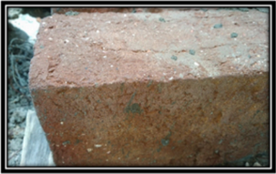

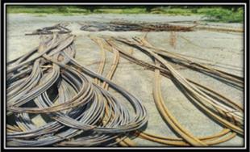

DAY \_ 2 to 7 ( Excavation, PC.C., Footing, Pedestal, Steel Work, Tie Beam and C.C. Work ):-

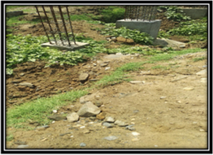

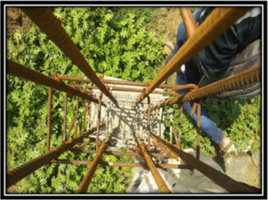

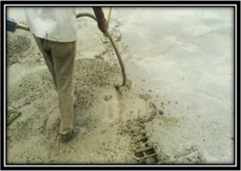

## Summer Internship

- 0 DAY -8 to 14 Brick Work in plinth, Filling; Watering; Ramming):-
- Brickwork is masonry produced by a brick bricks and mortar. layer using
- Typically rows of brick called courses are laid on top of another to build up a structure such as brick wall bricks may be differentiated from block by size
- The   sand is   provided to help   avoid the concrete directly touching the soil surface. filling

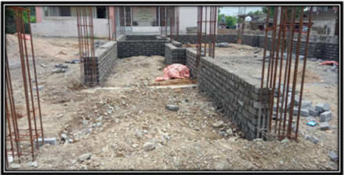

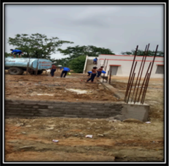

## Watering :

- The process of watering of concrete construction of a building is called Curing. during

## Ramming z

- Rammed earth is technique for constructing foundations; floors, and walls compacted natural materials such as earth, chalk, lime;, or using gravel.

## Conclusion

- During my summer learner at recalls and improve my theoretical knowledge which already I have studied.
- It was also helpful to got knowledge to overcome the uncertain hurdles faced ongoing construction work and from site evaluation know the responsibilities of site engineer for carrying out quality work, proper planning and safety measures in the construction field. during got
- Also I got knowledge about;
- Various construction materials .
- Various Activities in Construction Site. using
- Role of quality control to get construction work. Etc good

## Summer Internship

Date:

27/7/2023

Day:

Thursday

Enroll:

216260306003

Name:

Manasiya Talha

Provide brief summary of activities performed on site: -

- grade.
- Water tank wall (pardi) concrete work with M3O grade.
- Retaining wall concrete work with M3O between C69 to C73 . grade
- Levelling by auto level for p.c.c. on the ground
- Daily curing in concrete work.

## Procedure describe you have learned / observation you have made:-

M3O 1 part cement, 0.75 part sand &amp; 1.5 parts aggregate. Cement shall be fresh Portland cement confirming to IS-269 up-to-date. The fine aggregate shall conform to IS: 383 to-date . Coarse aggregate shall be of hard broken stone of granite or similar stone. Water used shall be clean and reasonably free from injurious quantities of deleterious materials such as oils, acids, alkalises, salts and vegetable growth. Generally potable water shall be used. grade up-

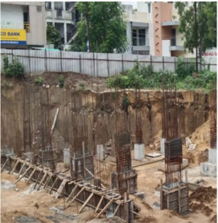

Concrete is directly supply by RMC (Ready mix concrete) plant. Rmc concrete main advantages is maintain proportion and no wastage of material. No any types of store area of material is required. using

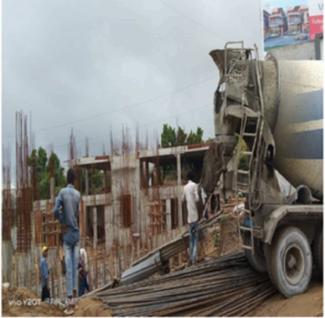

## Summer Internship

Date:

29/7/2023

Enroll: - 216260306003

Saturday

Name:

Manasiya Talha N.

Day:

## Provide brief summary of activities performed on site: -

- Column formwork up to 8ft in €
- Column concrete work up to 8ft
- Column footing work Concrete work
- Wall formwork &amp; Concrete work near hospital slot
- Column footing near lift Cabin C40
- lift Cabin formwork &amp; Concrete work
- Column tie arrange 8c-4" c c
- Concrete in Retaining Wall
- curing in concrete work. Daily

## Procedure describe you have learned / observation you have made:-

M3O grade (1:0.75:1.5) mean 1 part aggregate. Cement shall be fresh Portland cement confirming to IS-269 up-to-date. The fine aggregate shall conform to IS: 383 up-to-date\_ Coarse aggregate shall be of hard broken stone of or similar stone. granite

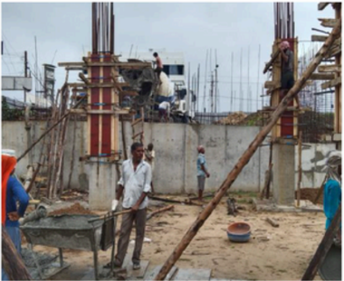

Water used shall be clean and reasonably free from injurious quantities of deleterious materials such as oils; acids; alkalises; salts and vegetable growth. Generally potable water shall be used.

Concrete is directly supply by RMC (Ready mix concrete) Rmc concrete main advantages is maintain proportion and no wastage of material. No any types of store area of material is required. plant . using

## Mumbai Trans Harbour Link: A Game-Changer in Connectivity

NANDOLIYA AHMED RIJVAN

(Sem 1 Diploma Civil Engineering)

## INFRA ARTICLE

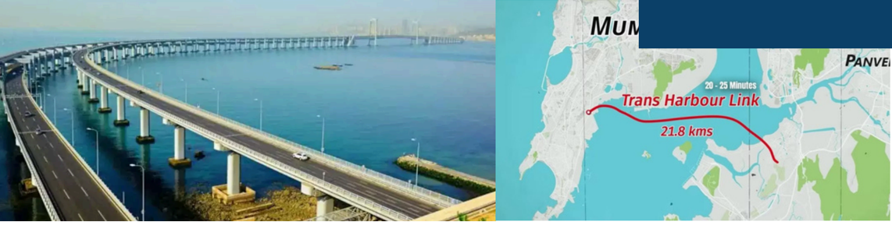

The Mumbai Trans Harbour Link (MTHL) is a transformative infrastructure project aimed at bridging the gap between Mumbai and Navi Mumbai. This 21.8-kilometer, six-lane bridge promises to revolutionize connectivity and unlock economic potential in the region.

## Key Features:

- Connectivity  Enhancement:  Linking  Sewri  in  South  Mumbai  to  Nhava  Sheva  in  Navi Mumbai, the MTHL will significantly reduce travel time and alleviate congestion.
- Economic Impetus: By improving access to Navi Mumbai's commercial and industrial zones,  the  MTHL  is  expected  to  stimulate  economic  growth  and  create  employment opportunities.
- Environmental Considerations: Sustainable design practices are incorporated to minimize ecological impact on the marine ecosystem of Mumbai Bay.
- Technological Innovation: State-of-the-art engineering ensures structural integrity and safety for long-term use.

## Okha Bet Dwarka Bridge

The Okha Bet Dwarka Bridge in Gujarat connects Okha on the mainland to Bet Dwarka Island, which is built at a  cost  of  around  ₹980  crore.  The  2.32km  cable-stayed bridge is the longest of its kind in the country

## Key Features

- Connectivity: Enhances movement of people and goods between  Okha  and  Bet  Dwarka,  fostering  economic activities and tourism.
- Tourism: Provides easy access to Bet Dwarka's religious sites and scenic beauty, boosting tourism in the region.
- Engineering Marvel: Constructed with advanced techniques, ensuring structural integrity and safety.

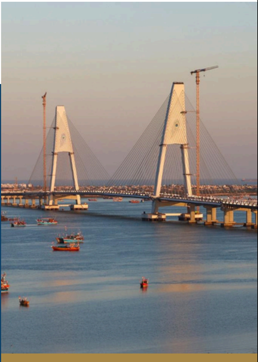

## Advancing GIFT City: Exciting New Construction Projects

## GOSWAMI PRINCEGIRI

(Sem 1 Diploma Civil Engineering)

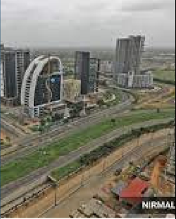

Gujarat International Finance Tec-City (GIFT City) is undergoing transformative development with new construction projects aimed at enhancing its status as a premier financial hub. These projects signify an expansion and diversification of offerings to attract global businesses and investors.

## Iconic Towers: 1.

## Key Projects

- Designed by top architects, these towers will provide cutting-edge office spaces and retail outlets, reshaping the city's skyline and aesthetic appeal.
- Commercial Complexes: 2.
- Modern  complexes  offering  flexible  office  spaces  and  amenities  to  foster collaboration and growth, setting new standards for corporate infrastructure.
- Residential Enclaves: 3.
- Quality living spaces integrated with recreational amenities and green spaces to create a vibrant urban community within GIFT City.
- Infrastructure Upgrades: 4.
- Investments  in  road  networks,  public  transportation,  and  smart  technology solutions to enhance connectivity and efficiency.

Despite challenges like funding and market demand, GIFT City remains poised to capitalize on emerging opportunities, supported by government backing and private sector involvement.

The ongoing  construction projects in GIFT City reflect  its  commitment  to  innovation,  growth,  and sustainability. As these projects materialize, they will redefine  GIFT  City's  identity  as  a  hub  of  progress and prosperity in India's evolving economic landscape.

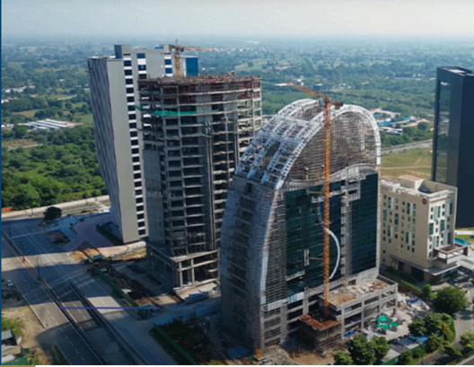

## Report on the Newly Built Mumbai Coastal Road

- Chaudhary Priyanka
- (Sem 6 Diploma Civil Engineering)

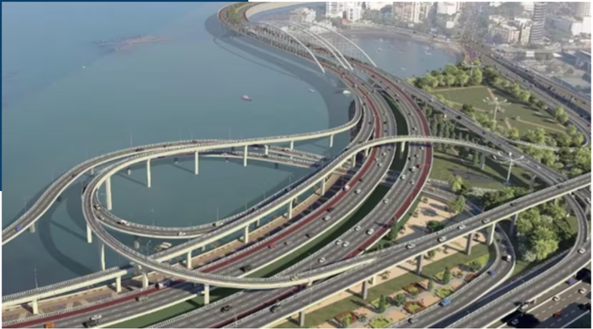

## Introduction:

The Mumbai Coastal Road project, spanning [X kilometers], aims to alleviate traffic congestion  along  Mumbai's  western  coast.  This  report  provides  an  overview  of  its construction methods, environmental considerations, and potential impact.

## Project Overview:

The  road  comprises  elevated  sections  and  reclaimed  land,  connecting  South Mumbai  with  the  northern  suburbs.  It  offers  improved  connectivity  and  smoother commutes.

## Construction Methods:

- Land reclamation using hydraulic fills and dredging
- Elevated segments built with precast concrete
- Construction of seawalls to prevent erosion

## Environmental Considerations:

- Preservation of marine ecosystems
- Advanced stormwater drainage systems
- Sustainable construction practices

## Impact Assessment:

- Traffic decongestion and reduced travel time
- Economic growth along the coastal corridor
- Social benefits including improved access to recreational spaces

## Conclusion:

The Mumbai Coastal Road project signifies a milestone in infrastructural development, emphasizing engineering innovation, environmental sustainability, and societal well-being.

## PAINTING BY STUDENTS

Paintings done byPrajapati Sachin Sem 5 Civil on the theme of 'Save ENvironment'

Txee

Paintings done byNai Meet Sem 5 Civil on the theme of 'Save ENvironment'

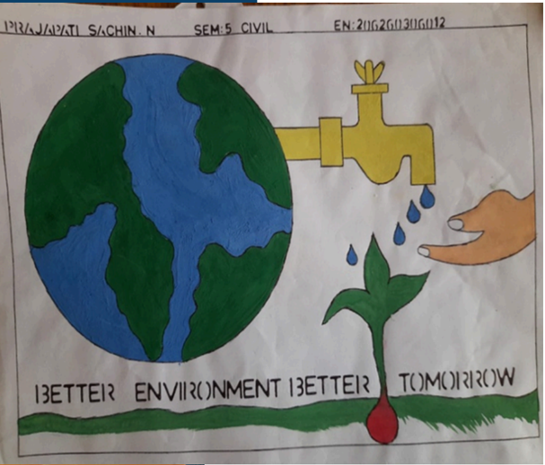

Paintings done byPatni Naresh Sem 5 Civil on the theme of 'Save ENvironment'

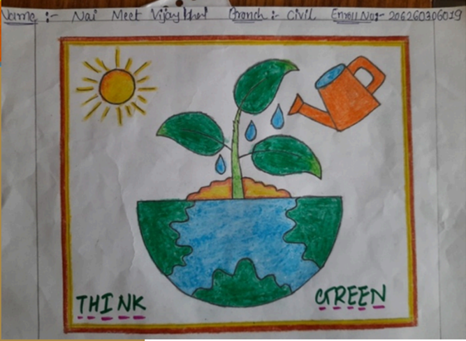

|   Semester | Name of Student               |   Enrollment No |   SPI |
|------------|-------------------------------|-----------------|-------|
|          6 | Mevada Harsh Kirankumar       |    206260306006 |  9.03 |
|          4 | Chaudhary Priyanka Raghjibhai |    216260306030 |  9.55 |
|          2 | Luhar Raghukumar Narayanbhai  |    226260306037 |  7.73 |

## Faculty Achievements

|   Sr No | Name of Faculty                 | Achievement                                                                                                                                                    |
|---------|---------------------------------|----------------------------------------------------------------------------------------------------------------------------------------------------------------|
|       1 | Y T RANA                        | Certificate from NPTEL for being recognized as NPTEL DISCIPLINE STAR                                                                                           |
|       2 | F M MUKHI                       | Delivered Expert lecture on Innovation Talk at G P himmatnagar on 22/09/2023                                                                                   |
|       3 | A N PATEL                       | Attended 1 Week (31/07/2023 TO 04/08/2023) Training on STRUCTURAL EVALUATION AND MAINTENANCE OF PAVEMENT at NITTTR, Bhopal                                     |
|       4 | A R PATEL, H P PATEL            | Attended 1 Week (07/08/2023 To 11/08/2023) Training on TQM and six Sigma for engineering institutions at NITTTR, Bhopal                                        |
|       5 | N V PRAJAPATI                   | Attended 1 Week (16/10/2023 to 21/10/2023) Training on Advances in Earthquake Engineering & Structural Resilience at GTU, Chandkheda                           |
|       6 | D N SHETH, V P PATEL, A R PATEL | Attended 1 Week (11/12/2023 to 16/12/2023) Training on Influence of Seismic, Geotechnical and Structural aspects on Infrastructural Projects at GPERI, Mehsana |

18/18