## INFRACREATOR

## Newsletter

ISSUE 14 (DECEMBER 2024)

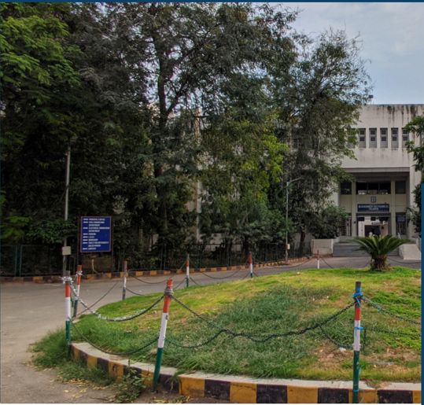

## Vision

The department envisions to achieve professionals in emerging field of civil engineering to meet aspirations of the society, by transforming students to  be technically skilled, managers, ethical, entrepreneur's leaders, and environmentally sensible civil engineers.

GOVERNMENT POLYTECHNIC PALANPUR

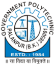

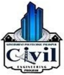

CIVIL ENGINEERING DEPARTMENT

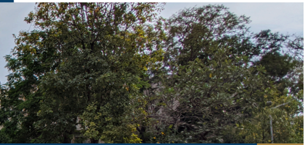

## ABOUT THE DEPARTMENT

Started in 1984, Civil Engineering Department,  Government  Polytechnic Palanpur  offers  3  years  (6  semester) Diploma Civil Engineering Program with 90 intake capacity.

This  Program is Approved by All India Council for Technical Education (AICTE) and Affiliated to Gujarat Technological  University,  Ahmedabad (GTU).

## Mission

- To impart civil engineering skill to enhance their employability in the industries.
- Establish industry collaboration through internship and interaction with professional society through experts, workshops
- 3Promote  leadership,  management,  entrepreneurship  skills  in  a student through various projects, co-curriculum, extracurriculum events.
- 4Impart  social,  environment  awareness  and  responsibility  in students  to  serve  society  and  industry  to  promote  sustainable growth.

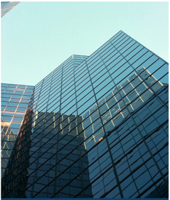

01/12

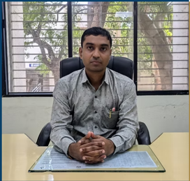

## HOD's Message

Greetings from the Civil Engineering Department.

The Department of Civil Engineering aspires to excellence  in  professional  development  that  is  morally grounded in teaching and learning. We take great pride in having our academic program supported by cuttingedge laboratories and technical personnel. We have a creative, well-balanced teaching-learning environment, as well as a highly skilled and committed faculty. For the purpose of their own growth, the students are encouraged to engage in co-curricular and extracurricular activities, too.

## Newsletter Committee

Government Polytechnic Palanpur Department of Civil Engineering

## Editor in Chief

- Mr D N Sheth (HOD Civil)

## Coordinator

- Mr F A MUKHI (Lecturer Civil)

## Editors

- Mr N V PRAJAPATI (Lecturer Civil)
- Mr J N CHAUDHARY (Lecturer Ap. Mech.)

## Student Editors

- RAVAL JAIMIN D 6th Sem
- BAGHEL PUNAM I  6th Sem
- GOSWAMI PRINCEGIRI 4th Sem
- NANDOLIYA AHMEDRIJVAN 4th Sem
- RAVAL JAYDEEP 2nd Sem
- CHAUDHARY PRITEE 2nd Sem

Send your feedback to gppcivil06@gmail.com

## Inside The Issue

- Independance Day Celebration

- Admission Awareness Program

- Teacher's Day Celebration

- Level Surveying Project on Theodolite

- Site Visit Report: Sports Complex

- Construction near Dhaniyana Circle

- Summer Internship reports

- INFRA NEWS : Gujarat's Anganwadi Construction Project: Focus on

- Construction Aspects

- INFRA ARTICLE : Sudarshan Setu: A Marvel of Engineering and Architecture

- Out Star Students

- Faculty Achievements

&gt;&gt; Page 4

&gt;&gt; Page 4

&gt;&gt; Page 5

&gt;&gt; Page 5

&gt;&gt; Page 6

&gt;&gt; Page 7

&gt;&gt; Page 10

&gt;&gt; Page 11

&gt;&gt; Page 12

&gt;&gt; Page 12

## Independance Day Celebration

At Government Polytechnic Palanpur, On 15th August 2024, the  occasion  of  78th  Independance  Day,  a  flag  hoisting program was arranged in which all the officials, employees and students of the institute enthusiastically participated.

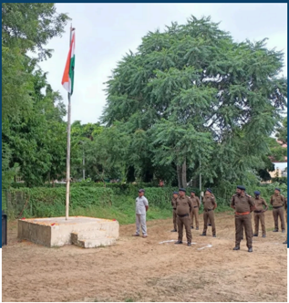

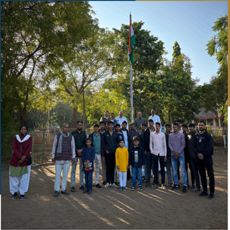

## Admission Awareness Program

Diploma engineering admission awareness programs were arranged at major schools of all talukas of Banaskantha district in last week of december 2024

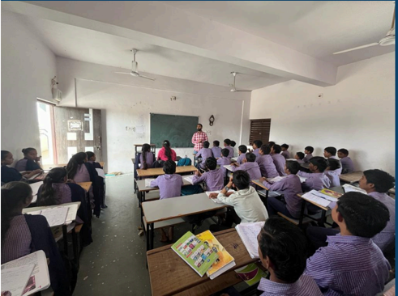

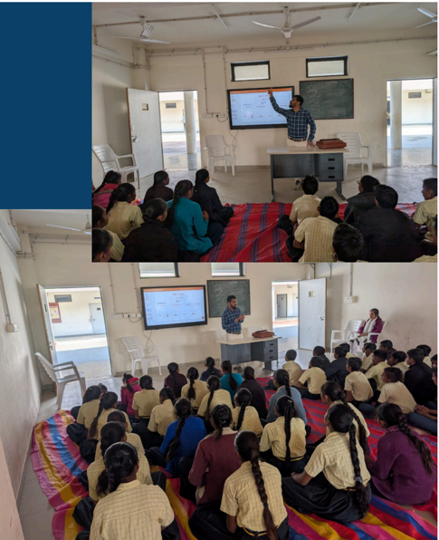

## Teachers Day Celebration

Government Polytechnic Palanpur celebrated Teachers' Day on September 5th. Teachers' Day marks the  birth  anniversary  of  Dr  Sarvepalli Radhakrishnan -the first VicePresident and the second President of India. Students of semester 3 and 5th took part in 1 day teacher celebration and  conducted  class  in  their  junior class

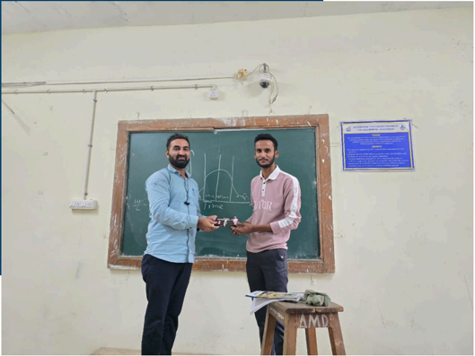

## Level Surveying Project on Theodolite

On 20 September, 2024, 3th semester diploma engineering students performed a project  on  level  profiling  at  open  ground near rampura circle. Total 63 students performed this project

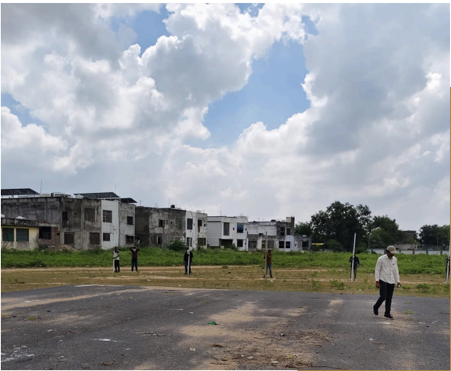

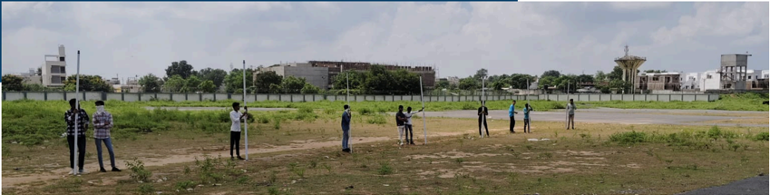

## Site Visit Report: Sports Complex Construction near Dhaniyana Circle

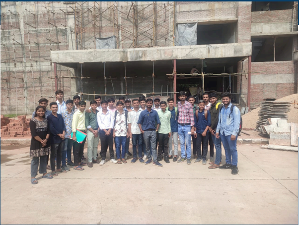

Date: 14th October 2024 Time: 12:40 PM

Location: Construction site of Sports Complex near Dhaniyana Circle Subject: Advanced Construction Technology (ACT)

Attendees: 29 Fifth Semester Diploma Engineering Students

29 fifth-semester diploma engineering students of Government Polytechnic, Palanpur visited the Sports Complex construction site near Dhaniyana Circle on October 14, 2024, at 12:40 PM. Observations focused on foundation type, structural elements (columns, beams, slabs), reinforcement details , formwork, concrete quality, construction methodology, site layout, water management, and other relevant aspects. Further visits and study of project documents are recommended for a deeper understanding.

## Summer Internship

Some examples of the reports of summer internship by semester 3 and 5  diploma civil engineering students are here:

## INTRODUCTION OF SITE

- Name of Project Residential Building
- Location of Site School of Science Behind Akshatam 3 Gathaman Rd , Palanpur 385001
- Company Name
- Guruji Developers
- Type of House 2BHK 3BHK 4BHK ( G +1 , G+2 )
- Area :250000sq ft
- Site supervisor

Sharadbhai V Rathod.

- Stair
- The stair was of doglegged
- Trad:- 12 inch (30.48 cm)
- Riser: - 6 inch (15.42 cm )

## Layout plan of site

Layout Plan

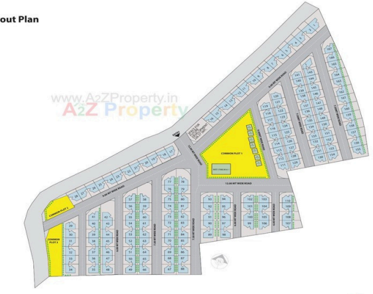

## Layout of 3 BHK House plan

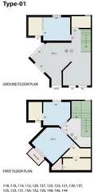

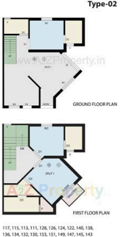

## Summer Internship

## Material used for construction

## Cement

- The function of cement is to combine with water and to form cement paste. This paste sets binds provides strength, durability
- On site used ULTRATECH CEMENT OPC 53 GRADE they

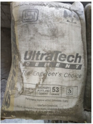

## STEEL Bars

- Bars are widely used to reinforce the concrete. Concrete has compressive strength but poor tensile strength. good
- Bar Size(mm): 6,8,12,16,25

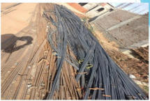

## BRICK WORK

- size of brick was
- 19cm*9cm*9cm
- We were checking verticality of wall by plumb bob, Horizontality of wall checked by lining straight. the brick company name NBC &amp; HB
- Sand
- It is used for plastering work for plinth filling and pcc work.
- Rotary cylinder type sieve used for sieving purpose.

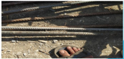

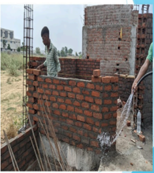

## SLAB WORK

- The slab is Horizontal structural element which is made from the RCC. ~IN slab casting cement bags , Aggregate sand, This concrete material mix was mixed In the machine mixer by volume of 1:1.2

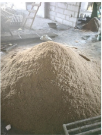

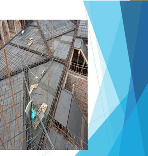

## Summer Internship

## PLASTERING WORK

~Plastering work give uneven brick masonry wall or RC.C wall for resistant the structure external environment effect. mixture of Portland cement sand and water are applied of mix 1.4 against

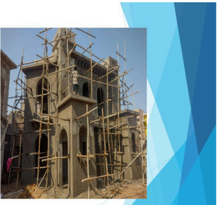

## EQUIPMENTS USED ON SITE

## CUTTING MACHINE

This machine gives a one-shot cutting operation with perfect cutting accuracy thus minimizing the use of labor and drawn cutting process for single cuts. It is durable, fast and easy to use. long

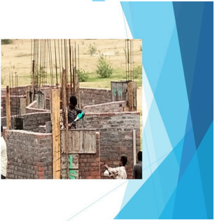

## CONCRETE MIXER

This is a power mechanically operated machine which is used to mix the concrete, it consists a hollow cylindrical part with inner side wings. In which cement; sand, aggregates; and water is mix properly

## NEEDLE VIBRATOR

There are use needle vibrator is critical because by removing air bubbles &amp; packing the aggregate particles together it increases the density and strength of the concrete

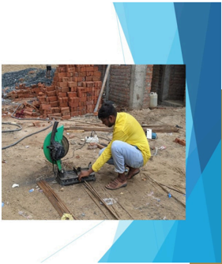

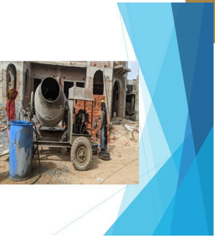

## INFRA NEWS

## Gujarat's Anganwadi Construction Project: Focus on Construction Aspects

The Gujarat government's initiative to build 607 new Anganwadi-Nand Ghars focuses on modern construction techniques, specifically Light Gauge Steel Frame (LGSF) technology. This report focuses on the construction-related details of the project.

## Key Construction Highlights:

- LGSF  Technology:  The  core  of  this  project's  construction  strategy  is  the  use  of  Light Gauge Steel Frame (LGSF) technology. This method utilizes lightweight steel framing to create the structural framework of the buildings.
- Advantages of LGSF: The choice of LGSF likely stems from several advantages:
- Speed  of  Construction:  LGSF  construction  is  typically  faster  than  traditional methods,  allowing  for  quicker  project  completion.  This  is  crucial  for  rapidly expanding childcare infrastructure.
- Durability  and  Strength:  Steel  offers  inherent  strength  and  durability,  potentially leading to longer-lasting structures compared to conventional materials.
- Precision and Quality Control: LGSF components are often manufactured off-site, allowing for greater precision and quality control during the fabrication process. This can translate to a more consistent and reliable final product.
- Lightweight  Nature:  The  lightweight  nature  of  steel  simplifies  transportation  and handling  of  materials,  potentially  reducing  construction  costs  and  logistical challenges, especially in remote areas.
- Sustainability (Potential): Steel is a recyclable material, potentially contributing to the project's sustainability, though this depends on the source and overall lifecycle analysis.
- Scale of Construction: The project involves the construction of 607 Anganwadi centers, representing a significant undertaking. Efficient project management and coordination will be crucial for successful implementation.
- Modern Facilities Integration: The project emphasizes equipping the Anganwadis with modern  facilities.  This  likely  requires  careful  planning  and  integration  of  various building  services  like  electrical,  plumbing,  and  HVAC  systems  within  the  LGSF framework.
- CSR Funding Implications: While GSPC Group is providing the CSR funding, the specific construction contracts and procurement processes will need to be transparent and efficient to ensure optimal utilization of funds and timely project completion.

Gooc

## Sudarshan Setu: A Marvel of Engineering and Architecture

## NANDOLIYA AHMEDRIJVAN

(Sem 4 Diploma Civil Engineering)

## INFRA ARTICLE

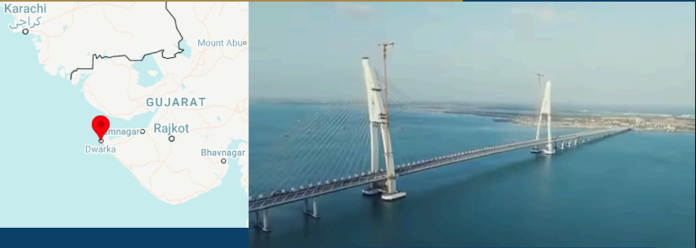

The Sudarshan Setu, formerly known as the Okha-Beyt Dwarka Signature Bridge, is  a  2.32  km  long  cable-stayed  bridge located  in Gujarat, India.  It  connects Okha mainland to Beyt Dwarka Island in the Gulf of Kutch. The bridge  was inaugurated by Prime Minister Narendra Modi on February 25, 2024.

## Civil Engineering Details

- Type: Cable-stayed bridge
- Length: 2.32 km (including 900 meters of central cable-stayed portion)
- Lanes: Four lanes (two in each direction)
- Width: 27.2 meters
- Footpaths:  2.5  meters  wide  on  both sides
- Pylons: Two A-shaped curved pylons, 129.985 meters tall
- Construction Cost: Approximately Rs 980 crore
- Builder: SP Singla Constructions

## Architectural Details

- Design: The bridge features a unique design with a footpath adorned with verses  from  the  Shrimad  Bhagavad Gita  and images of Lord Krishna on both sides.
- Solar Panels: Solar panels are installed on the upper portions of the footpath, generating one megawatt of electricity for the bridge's illumination.

## Significance

- Connectivity: The bridge significantly reduces  travel  time  between  Okha and  Beyt  Dwarka,  benefiting  both locals and pilgrims visiting the Dwarkadhish Temple.
- Tourism: The iconic bridge is expected to become a major tourist attraction in the region.

|   Semester | Name of Student                |   Enrollment No |   SPI |
|------------|--------------------------------|-----------------|-------|
|          6 | MANASIYA TALHA NIZAMUDDIN BHAI |    216260306003 |  9.58 |
|          4 | LUHAR RAGHUKUMAR NARAYANBHAI   |    226260306037 |  8.15 |
|          2 | SUTHAR GOVINDBHAI BHARATBHAI   |    236260306096 |  8.82 |

## Faculty Achievements

|    | Sr No                | Name of Faculty                                                                | Achievement                                                                |
|----|----------------------|--------------------------------------------------------------------------------|----------------------------------------------------------------------------|
|  1 | D N SHETH, P D SHETH | Completed 3 Week Industrial Training at Banas Dairy, Palanpur                  |                                                                            |
|  2 |                      | Y T RANA, V P PATEL, A R PATEL                                                 | Completed 3 Week Industrial Training at USP Construction, Patan            |
|  3 |                      | H P PATEL, A N PATEL, F A MUKHI,  N V PRAJAPATI                                | Completed 3 Week Industrial Training at Tirupati Sargan Limited, Chhapi    |
|  4 |                      | D N SHETH, P D SHETH                                                           | Completed 8 Week MOOC on Municipal solid waste management  at SWAYAM NPTEL |
|  5 |                      | D N SHETH, P D SHETH, Y T RANA, A R PATEL, H P PATEL, A N PATEL, N V PRAJAPATI | Completed 8 Week MOOC on Entrepreneurship  at SWAYAM NPTEL                 |