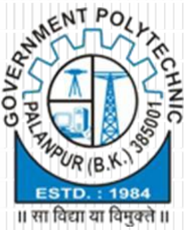
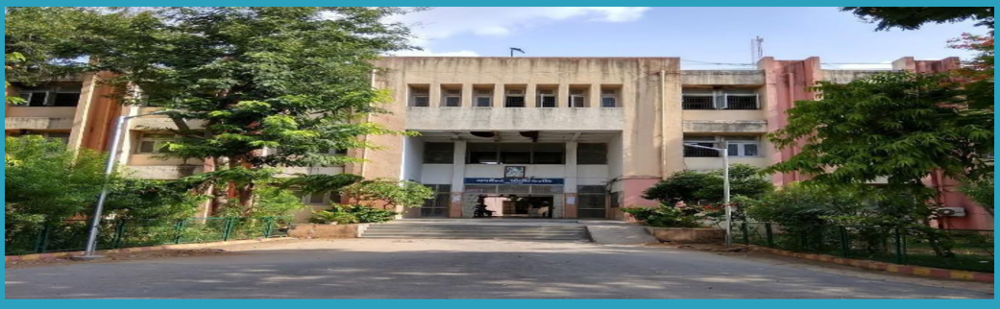
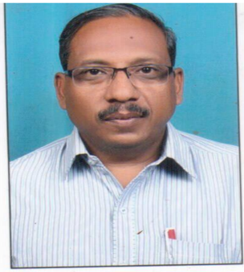
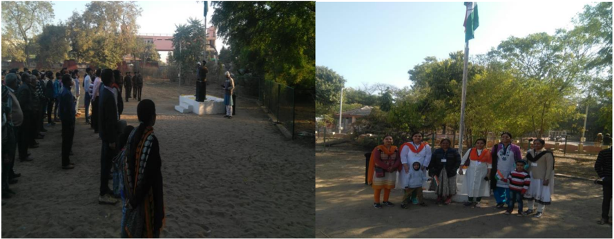
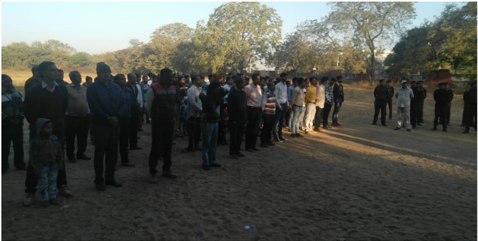
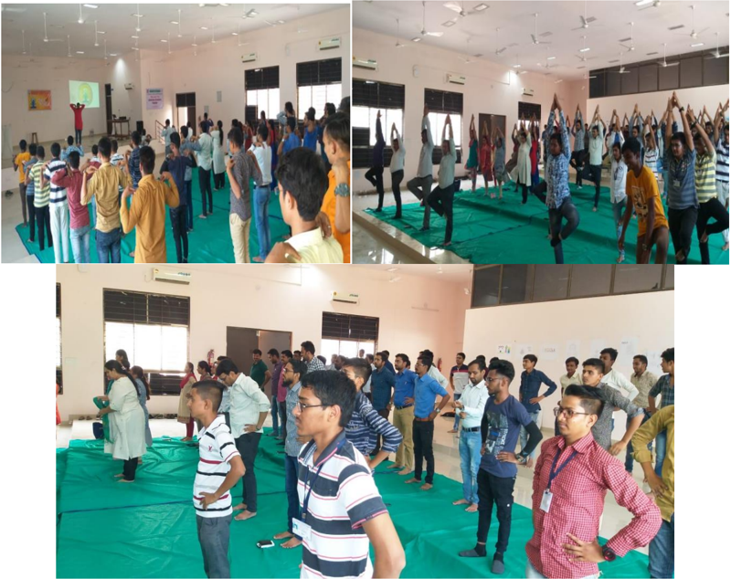
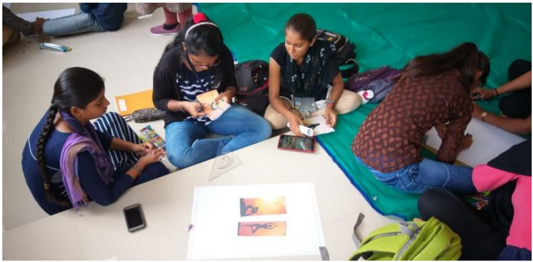
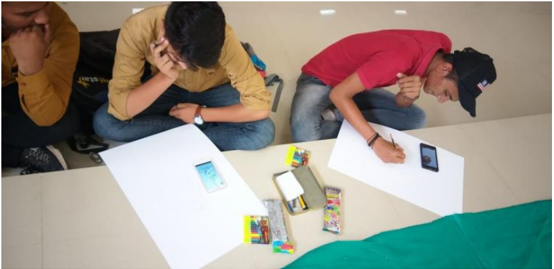
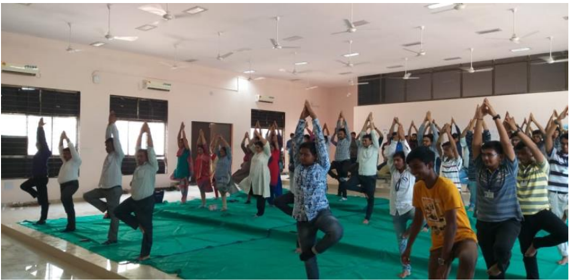
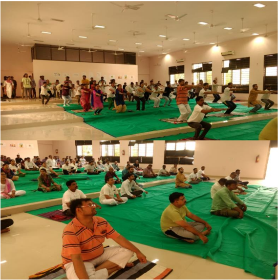

## INFRA CREATOR Department Of Civil Engineering

Volume-1, Issue-I (June-2018)

## Content

## About The Department

About the Department

Why GPP Civil? HOD's Message

Vision and Mission of the Department

PEO's and PSO of the Department

Scope of Civil Engineering

Faculty  of  CIVIL  &amp; Applied  Mechanics Department

Department Activities

Extra-Curricular Activities

Student Achiever

Started in 1984, Civil Engineering Department, Government Polytechnic Palanpur offers 3 years (6 semester) Diploma Civil Engineering Program in Two shifts ( Morning shift : 60 seats &amp; Evening shift  :  30  seats).  This  Program  is  Approved  by  All  India Council for Technical Education (AICTE) and Affiliated to Gujarat Technological University,  Ahmedabad (GTU).

## Why GPP Civil ?

Ever since 1984,         Civil Engineering Department, Government Polytechnic Palanpur has been providing students  with  a  rich  and  diverse  learning  environment.  Knowledge, creativity and hands-on experience have always been at our core, and we're proud of the generations of students who have graduated from our College. We always encourage both staff and students to grow, learn and create each passing day.

The transformative learning experiences at Civil Engineering Department, Government Polytechnic Palanpur are designed to help our students grow both in and out of the classroom.  Our passionate and skilled team members are here to help students become  successful  professionals  and  make  an  impact  on  the  world.

## HOD's Message

Welcome to the Department of Civil Engineering. The Department of Civil Engineering strives for Excellence  in  teaching  and  learning  and  ethical professional  development.  We  are  proud  to  have  State-ofthe-art laboratories and technical staff to support our academic  program.  We  have  well  balanced  and  innovative teaching-learning atmosphere and qualified and  well experienced dedicated academic staff. The students here are encouraged to participate in co-curricular and Extracurricular activities for personal development.

There are many careers paths for Civil Engineers. They are essential in Government agencies,  Private and Public sector undertaking to complete various Mega Projects.

## Vision and Mission of the Department

## Vision

The department envisions to achieve professionals in emerging field of civil engineering to meet aspirations of  the  society,  by  transforming  students  to  be technically skilled, managers, ethical,  entrepreneur's leaders,  and  environmentally  sensible  civil  engineers.

## Mission

1. To impart civil engineering skill to enhance their employability in the  industries.
2. Establish industry collaboration through internship and interaction with professional society through experts, workshops
3. Promote leadership, management, entrepreneurship skills in a student through various projects, co-curriculum, extra-curriculum events.
4. Impart social, environment awareness and responsibility in students to serve society and industry to promote sustainable growth.

Shri. M.M.Shah (HOD Civil)

## Program Educational Objectives

1. Exhibit technical and leadership capabilities for providing sustainable solutions to various Civil Engineering problems with professional ethics.
2. Inculcate  state  of  the  art  technology  for  efficient  implementation  of  Civil Engineering projects.
3. Enhance social and  economical commitment by entrepreneurial  spirit as  job  creators.
4. Pursue  higher  education  and  improve  learning  spirit  in  the  context  of  technological changes.

## Program Specific Outcomes

1. Select and use of appropriate advanced methods, materials and equipment in construction industry.
2. Suggest relevant and safe demolition/ dismantling techniques for masonry / concrete building structure.
3. Evaluate damaged structure and suggest appropriate repair /  retrofit and maintenance methods /  techniques

## Scope Of Civil Engineering

Civil engineering is a professional engineering discipline which deals with the design, construction and maintenance of the physical and naturally built environment. It provides knowledge and skills to plan, analyze, design, estimate and execute projects using appropriate scientific,  mathematical  and  engineering principles and concepts.

There is a great demand of Diploma Civil Engineers in Government sector including Road &amp;  Building Department, Irrigation Department, Water Supply Board and in Local Municipal Bodies as well as Private sector.

## Faculty of Civil Engineering Department

|   No | Name of  Faculty   | Degree          | Designation   |
|------|--------------------|-----------------|---------------|
|    1 | Shri. M M Shah     | B.E. (Civil)    | HOD           |
|    2 | Shri. H T Patel    | M.E. (Civil)    | Lecturer      |
|    3 | Shri. D N Sheth    | M.Tech (CASAD)  | Lecturer      |
|    4 | Smt. P D Sheth     | M.E. (Civil)    | Lecturer      |
|    5 | Shri.Y T Rana      | B.E. (Civil)    | Lecturer      |
|    6 | Shri. A R Patel    | M.E. (CASAD)    | Lecturer      |
|    7 | Shri. H P Patel    | B.E. (Civil)    | Lecturer      |
|    8 | Shri. A N Patel    | B.E. (Civil)    | Lecturer      |
|   10 | Shri. F M Patel    | B.E. (Civil)    | Lecturer      |
|   11 | Shri.  D S Mevada  | Diploma (Civil) | Curator       |

## Faculty of Applied Mechanics Department

|   No | Name of  Faculty    | Degree       | Designation   |
|------|---------------------|--------------|---------------|
|    2 | Shri. M J Mansuri   | B.E. (Civil) | Lecturer      |
|    3 | Shri.J B Suthar     | M.E. (CASAD) | Lecturer      |
|    4 | Shri. J N Chaudhary | B.E. (Civil) | Lecturer      |
|    5 | Shri. B J Desai     | M.A.         | Lab Assistant |

## Extracurricular A ctivities

## 1. National Voter's Day celebration

## Date-25/01/2018 Place- G.P.Palanpur

January 25, the day of establishment of the Election Commission, New Delhi, has been  declared  as'  National  Voter's  Day  by  the  Central  Government.  This  day  is celebrated from the state level to the polling station. This year also National Voters Day  2018  was  celebrated  on  25th  January,  2018.  As  part  of  the  celebrations,  an affidavit  was  fixed  by  the  Election  Commission  of  India,  was  read  out  at  our institution.

Principal explained the importance of voting and hoped that everyone will use their rights of voting and will also take as our responsibility.

## 2. REPUBLIC DAY CELEBRATION - 2018

## Date-26/01/2018 Place- G.P.Palanpur

A flag salute ceremony was organized at the institute on 69th Republic Day, 26th January 2018 in which students and staff has enthusiastically participated.

## 3. SEMINAR ON "DISASTER MANAGEMENT AND FIRE SAFETY"

## Date-05/02/2018 Place- G.P.Palanpur

At our institute , seminar on "Disaster Management and Fire Safety" was organized on 05/02/2018. The entire program was organized by Shri. Trilok Kumar Thacker (International  Disaster  Management  Specialist)  and  Shri.  Sanjay  Kumar  Chauhan (D.P.O-Disaster,  Collectorate  office,  Banaskantha).  Students  were  given  practical knowledge of various aspects related to this subject.

## 4. THALASSEMIA TEST

## Date-27/02/2018

## Place- G.P.Palanpur

Thalassemia  test  was  organized  by  Indian  Red  Cross  Society  Ahmedabad  at  the institute on 27/2/2018 in which the students were informed about thalassemia and a total of 374 students were tested for thalassemia.

## 5. International Yoga day celebration

Practice session for Yoga day:

Date-19/06/2018 &amp; 20/06/2018

## Place- G.P.Palanpur

On the occasion of World Yoga Day on 21st June 2018, a group yoga shibir was held at the institute at 4:30 PM. For this, shibir was organized by a yoga trainer from 19th June to 20 th June 2018. All the staff and students enthusiastically participated in the yoga shibir.

## Yoga day competition:

Student also participent in yoga day drawing compitation. Whch encurage and motvate to doing yoga everday.

## Yoga day celebration

On the occasion of World Yoga Day on 21st June 2018, a group yoga programe was held at the institute at 6:30 AM. On the occasion of Yoga Day, the principal of the institute informed them about the benefits of yoga and hoped that everyone would do yoga every morning.

## 1 ST  SEMESTER

| Enrollment No.    Name                                            SPI       |                                                                       |
|-----------------------------------------------------------------------------|-----------------------------------------------------------------------|
| 1.       176260306035       MEVADA KRUPABEN RAMESHBHAI     8.32             | Topper of our                                                         |
| 2.         176260306047       PATEL VAIBHAV HASMUKHBHAI           8.25      | department                                                            |
| 3.         176260306021       GAMAR RAKESH TARABHAI                    8.18 |                                                                       |
| 3 RD  SEMESTER                                                              | 3 RD  SEMESTER                                                        |
| Enrollment No.    Name                                            SPI       |                                                                       |
| 1.       166260306040       PATEL HIMADRIBEN MAHESHBHAI     9.22            | Topper of our                                                         |
| 2.         166260306041      PRAJAPATI PANKAJ DINESHBHAI        8.78        | department                                                            |
| 3.         166260306025      PRAJAPATI BIJALBHAI AMRUTBHAI    8.47          |                                                                       |
| 5 TH  SEMESTER                                                              | 5 TH  SEMESTER                                                        |
| Enrollment No.    Name                                            SPI       | Enrollment No.    Name                                            SPI |
| 1.       156260306043       PATEL ARTHBHAI CHANDRESHBHAI   9.48             | Topper of our                                                         |
| 2.         156260306041      PARMAR KULDIP HARSHADBHAI           9.33       | department                                                            |
| 3.         156260306523      PRAJAPATI LILABHAI SOMABHAI          9.33      |                                                                       |

## Contact us

Government Polytechnic Palanpur

Department of Civil Engineering

Opp. Malan Darwaja,

Ambaji Road, Palanpur - 385001

Phone: 02742-245219

E-mail:  gppcivil06@gmail.com, gppalanpur05@rediffmail.com

