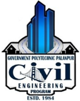
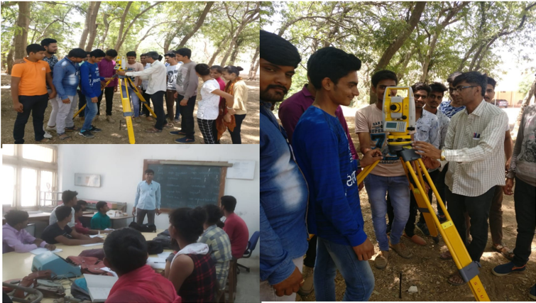
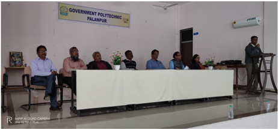
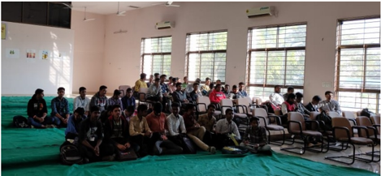

From desk of HOD

As India is going through major infrastructural development, hence Civil Engineers to play leading role  in  national  building, transportation and so on. My  message  to  the  student  and  parents  is  to work very hard to achieve  their  goals  and Excel as an Apex civil engineers of the      country.

Mrs. S. B. Khara HOD (CIVIL)

## Inside this issue:

4

Vision &amp; Mission Faculties of Civil &amp; 2

Student Achievers Finishing School 3

Civil engineering top- pers list Contact Us

## Infra Creator

## Department of Civil Engineering

## Volume 1, Issue 1 (June-2019)

## About The Department

The department of civil engineering was stared in the year of 1984 with an aim of promoting high quality education in the field of civil engineering. The academic activities of the department emphasis deep understanding of fundamental principles, development of creative ability to handle the challenges of civil engineering.

The department currently offers Diploma program in civil engineering  following  the  GTU  curriculum.  The  curriculum  broadly  covers  the  engineering  subjects  of  related  fields  such  as  surveying,  building  materials  and constructions, soil mechanics, structural analysis and design, hydraulics and water resources engineering, environmental engineering, transportation engineering, etc...

Industrial site visits/Expert Lectures are arranged for students to gain practical experience. During the semester various technical events like SSIP is organized  for  students  to  explore  the  knowledge  and  interact  with  industries.

Creativity

'The road to success is always under construction' Get it right….CIVIL ENGINEERS

CIVIL ENGINEERS

## Vision

The department envisions to achieve professionals in emerging field of civil engineering to meet aspirations of the society, by transforming students to be technically skilled, managers, ethical, entrepreneur's leaders, and environmentally sensible civil engineers.

## Mission

1. To impart civil engineering skill to enhance their employability in the industries.
2.  Establish  industry  collaboration  through  internship  and  interaction with professional society through experts, workshops.

## Faculty of Civil Engineering Department

|   Sr No | Name of Faculty     | Degree          | Designation   |
|---------|---------------------|-----------------|---------------|
|       1 | Smt. S B Khara      | M.E. (Civil)    | HOD           |
|       2 | Shri. N N Rajgor    | M.E. (Civil)    | Lecturer      |
|       3 | Shri. H T Patel     | M.E. (Civil)    | Lecturer      |
|       4 | Shri. D N Sheth     | M. Tech (CASAD) | Lecturer      |
|       5 | Smt. P D Sheth      | M.E. (Civil)    | Lecturer      |
|       6 | Shri. Y T Rana      | B.E. (Civil)    | Lecturer      |
|       7 | Shri. A R Patel     | M.E. (CASAD)    | Lecturer      |
|       8 | Shri. H P Patel     | B.E. (Civil)    | Lecturer      |
|       9 | Shri. A N Patel     | B.E. (Civil)    | Lecturer      |
|      10 | Shri. N V Prajapati | B.E. (Civil)    | Lecturer      |
|      11 | Smt. F M Patel      | B.E. (Civil)    | Lecturer      |
|      12 | Shri. D S Mevada    | Diploma (Civil) | Curator       |

## Faculty of Applied Mechanics Department

|   Sr No | Name of Faculty     | Degree                 | Designation   |
|---------|---------------------|------------------------|---------------|
|       1 | Shri. M D Parmar    | M.E. (CASAD)           | HOD           |
|       2 | Shri. M J Mansuri   | B.E. (Civil)           | Lecturer      |
|       3 | Shri. P N Artwani   | M.E. (Civil-Structure) | Lecturer      |
|       4 | Shri. J N Chaudhary | B.E. (Civil)           | Lecturer      |
|       5 | Shri. B J Desai     | M.A.                   | Lab Assistant |

## Activities and Events

## Technical Finishing School Training Programme

Civil  department  organized  the  extra  higher  skill  development  programme for the final year students in which students can able to perform operational skills  of  advanced  instrument  (Total  Station)  for  the  survey work on site,  which is beneficial for the final year students, when they will go for actual site work conditions.

|   Sr. | Subject of Training Programe              | Date          |
|-------|-------------------------------------------|---------------|
|     1 | Use in Total Station in  pipeline Network | 15th May 2019 |

The joy of engineering is to find a straight line on a double logarithmic diagram. - Thomas Koenig

## Finishing School Training Programme

Institute organize every year finishing school training programme for final year student for their future development. Under this programme students can motivate themselves for developing communication skills for interview.

| Page 4               | Page 4               | Page 4                           | Page 4               | Infra Creator                                                 |
|----------------------|----------------------|----------------------------------|----------------------|---------------------------------------------------------------|
| Student Achievers    | Student Achievers    | Student Achievers                | Student Achievers    |                                                               |
| 5th Semester Toppers | 5th Semester Toppers | 5th Semester Toppers             | 5th Semester Toppers |                                                               |
| No.                  | Enrollment No.       | Name                             | SPI                  | Top   Performers   of   final Year   Students   in   GTU Exam |
| 1                    | 166260306041         | PRAJAPATI PANKAJKUMAR DINESHBHAI | 9.42                 | Top   Performers   of   final Year   Students   in   GTU Exam |
| 2                    | 166260306040         | PATEL HIMADRIBEN MAHESHBHAI      | 8.85                 | Top   Performers   of   final Year   Students   in   GTU Exam |
| 3                    | 166260306511         | JOSHI PRAVINBHAI TRIKAMBHAI      | 8.27                 | Top   Performers   of   final Year   Students   in   GTU Exam |
| 3rd Semester Toppers | 3rd Semester Toppers | 3rd Semester Toppers             | 3rd Semester Toppers | Top   Performers   of   final Year   Students   in   GTU Exam |
| No.                  | Enrollment No.       | Name                             | SPI                  | Top   Performers   of   final Year   Students   in   GTU Exam |
| 1                    | 176260306047         | PATEL VAIBHAV HASMUKHBHAI        | 9.38                 | Top   Performers   of   final Year   Students   in   GTU Exam |
| 2                    | 176260306021         | GAMAR RAKESHBHAI TARABHAI        | 9.31                 | Top   Performers   of   final Year   Students   in   GTU Exam |
| 3                    | 176260306506         | CHAUDHARY VIPULBHAI RANCHHODBHAI | 9.31                 | Top   Performers   of   final Year   Students   in   GTU Exam |
| 4                    | 176260306522         | PUROHIT KAILASH ISHVARBHAI       | 9.13                 | Top   Performers   of   final Year   Students   in   GTU Exam |
| 1st Semester Toppers | 1st Semester Toppers | 1st Semester Toppers             | 1st Semester Toppers | Top   Performers   of   final Year   Students   in   GTU Exam |
| No.                  | Enrollment No.       | Name                             | SPI                  | Top   Performers   of   final Year   Students   in   GTU Exam |
| 1                    | 186260306054         | SHERU RAHIL ABDULRASHID          | 8.89                 | Top   Performers   of   final Year   Students   in   GTU Exam |
| 2                    | 186260306016         | CHAUHAN RAHUL MOHANBHAI          | 8.68                 | Top   Performers   of   final Year   Students   in   GTU Exam |
| 3                    | 186260306056         | SONI AYUSHI SANJAYKUMAR          | 8.68                 | Top   Performers   of   final Year   Students   in   GTU Exam |
| 4                    | 186260306050         | RATHOD HETALBEN PREMSINH         | 8.54                 | Top   Performers   of   final Year   Students   in   GTU Exam |

## Contact us

## Government Polytechnic Palanpur Department of Civil Engineering Opp. Malan Darwaja, Ambaji Road, Palanpur - 385001 Phone: 02742-245219 E-mail:  gppcivil06@gmail.com,

