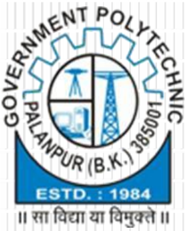

## INFRACREATOR Department Of Civil Engineering

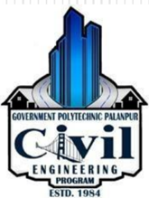

Volume-1, Issue-I(June-2022)

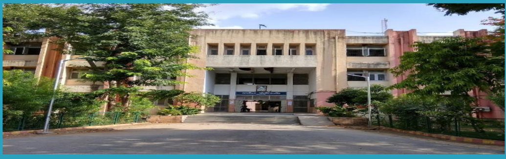

## Content

## About The Department

About the Department

Why GPP Civil?

HOD's Message

Vision and Mission of the Department

PEO's and PSO of the Department

Scope of Civil Engineering

Faculty  of  Civil  &amp; Applied Mechanics Department

Department Activities

Extra-Curricular Activities

Student Achiever

Started in 1984, Civil Engineering Department, Government Polytechnic Palanpur offers 3 years (6 semester) Diploma Civil Engineering Program in Two shifts (Morning shift:60seats &amp; Evening  shift:  30seats).This  Program  is  Approved  by  All India  Council  for  Technical  Education  (AICTE)  and  Affiliated  to Gujarat Technological University, Ahmedabad (GTU).

## Why GPP Civil ?

Ever since 1984,        Civil Engineering Department, Government Polytechnic Palanpur has been providing students with a rich and diverse learning environment. Knowledge,  creativity  and  hands-on  experience  have  always been at our core, and we're proud of the generations of students who  have  graduated  from  our  College.  We  always  encourage both staff and students to grow, learn and create each passing day.

The  transformative  learning  experiences  at  Civil  Engineering Department,  Government  Polytechnic  Palanpur  are  designed  to help our students grow both in and out of the classroom. Our passionate  and  skilled  team  members  are  here  to  help  students become  successful  professionals  and  make  an  impact  on  the world.

## HOD's Message

Welcome  to  the  Department  of  Civil  Engineering. The  Department  of  Civil  Engineering  strives  for Excellence  in  teaching  and  learning  and  ethical professional development. We are proud to have State-ofthe-art  laboratories  and  technical  staff  to  support  our academic program. We have well balanced and innovative teaching-learning  atmosphere  and  qualified  and  well experienced dedicated academic staff. The students here are encouraged to participate in co-curricular and Extracurricular activities for personal development.

There are many careers paths for Civil Engineers. They are essential in Government agencies, Private and Public sector undertaking to complete various Mega Projects.

## Vision and Mission of the Department

## Vision

The  department  envisions  to  achieve  professionals  in emerging field of civil engineering to meet aspirations of  the  society,  by  transforming  students  to  be technically skilled,  managers, ethical,  entrepreneur's leaders, and environmentally sensible civil engineers.

## Mission

1. To  impart  civil  engineering  skill  to  enhance  their employability in the industries.
2. Establish  industry  collaboration  through internship and  interaction  with  professional  society  through experts, workshops
3. Promote leadership, management, entrepreneurship skills in  a  student  through  various  projects,  co-curriculum, extra-curriculum events.
4. Impart  social,  environment  awareness  and  responsibility in  students  to  serve  society  and  industry  to  promote sustainable growth.

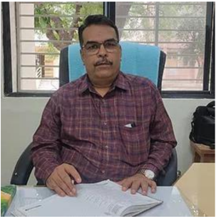

Shri. N.N.Rajgor (HOD Civil)

2

## Program Educational Objectives

1. technical and leadership capabilities for providing sustainable solutions to various Civil Engineering problems with professional ethics.
2. Inculcate state of the art technology for efficient implementation of Civil Engineering projects.
3. Enhance social and economical commitment by entrepreneurial spirit as job creators.
4. Pursue higher education and improve learning spirit in the context of technological changes.

## Program Specific Outcomes

1. Select and use of appropriate advanced methods, materials and equipment in construction industry.
2. Suggest relevant and safe demolition/ dismantling techniques for masonry / concrete building structure.
3. Evaluate  damaged structure  and  suggest  appropriate  repair  /  retrofit  and  maintenance methods /  techniques

## Scope Of Civil Engineering

Civil engineering is a professional engineering discipline which deals with the design, construction and maintenance of the physical and naturally built environment. It provides knowledge and skills to plan, analyze, design, estimate and execute projects using appropriate scientific, mathematical and engineering principles and concepts.

There is a great demand of Diploma Civil Engineers in Government sector including Road &amp; Building  Department,  Irrigation  Department,  Water  Supply  Board  and  in  Local  Municipal Bodies as well as Private sector.

## Faculty of Civil Engineering Department

|   No | Name of Faculty     | Degree          | Designation   |
|------|---------------------|-----------------|---------------|
|    1 | Shri. N N Rajgor    | M.E. (Civil)    | HOD           |
|    2 | Shri. H  T Patel    | M.E. (Civil)    | Lecturer      |
|    3 | Shri. D N Sheth     | M.Tech (CASAD)  | Lecturer      |
|    4 | Smt. P D Sheth      | M.E. (Civil)    | Lecturer      |
|    5 | Shri.Y T Rana       | B.E. (Civil)    | Lecturer      |
|    6 | Shri. A R Patel     | M.E. (CASAD)    | Lecturer      |
|    7 | Shri. H P Patel     | B.E. (Civil)    | Lecturer      |
|    8 | Shri. A N Patel     | B.E. (Civil)    | Lecturer      |
|    9 | Shri. N V Prajapati | B.E. (Civil)    | Lecturer      |
|   10 | Smt. F M Patel      | B.E. (Civil)    | Lecturer      |
|   11 | Shri. D S Mevada    | Diploma (Civil) | Curator       |

3

## Faculty of Applied Mechanics Department

|   No | Name of Faculty     | Degree           | Designation   |
|------|---------------------|------------------|---------------|
|    1 | Shri. M D Parmar    | M.E. (CASAD)     | HOD           |
|    2 | Shri. M J Mansuri   | B.E. (Civil)     | Lecturer      |
|    3 | Smt. P N Artwani    | M.E. (Structure) | Lecturer      |
|    4 | Shri. J N Chaudhary | B.E. (Civil)     | Lecturer      |
|    5 | Shri. B J Desai     | M.A.             | Lab Assistant |

## Departmental Activities and Event

## Expert Lecture Detail

1. An online expert Talk on 'Repair and Retrofitting of  Structure' by Prof.Arjun Butala (Assistant professor-Ganpat University-U.V.Patel college of  engineering )  on 7 th  ,February, 2022 Monday.
2. An  expert Lecture on 'Electrical services and Layout in building' by Prof.I.D.Chaudhary (Senior Lecturer,Electrical Engg.Dept,Gp palanpur) on 11 th  ,February, 2022 on Friday.
3. .An expert Lecture on 'Design of Reinforced concrete structures' by Mr.Darshak Langaliya (Sr.Manager-Technical services,J.K.Lakshmi Cement Ltd Ahmedabad) on 29 th  March, 2022 Tuesday.
4. An expert lecture on career counselling by Mr.N.N.Rajgor sir for 6 th semester students on 05/04/2022

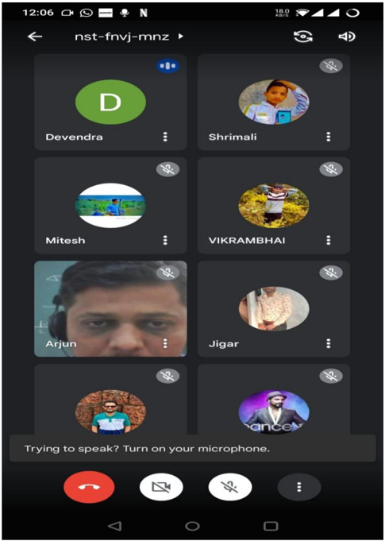

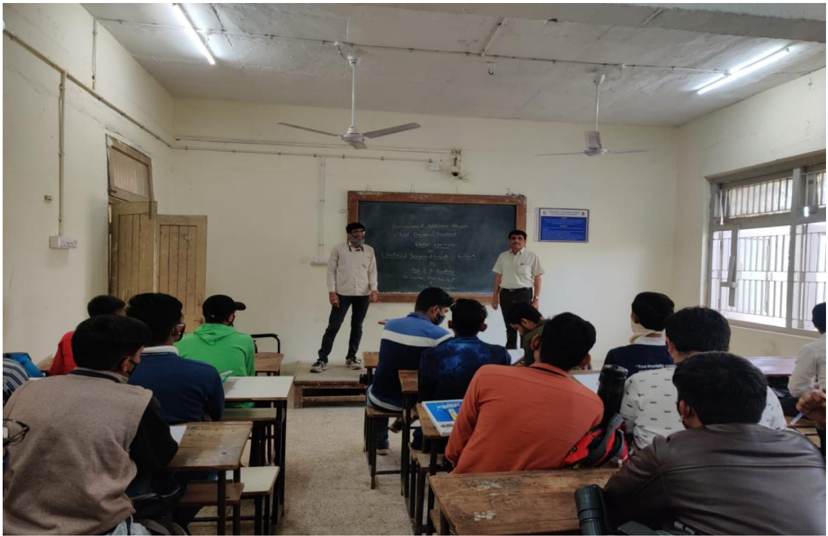

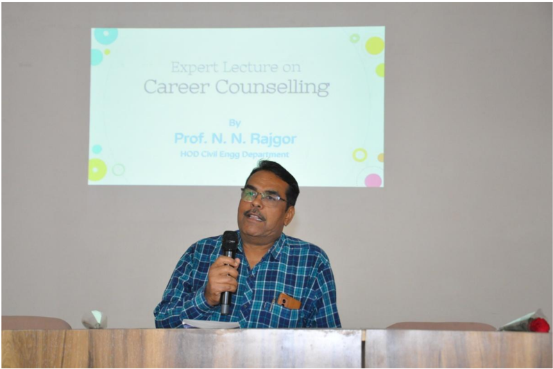

## 5. Farewell function by 6 th semester students on 05/04/2022,Tuesday

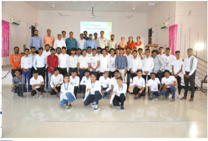

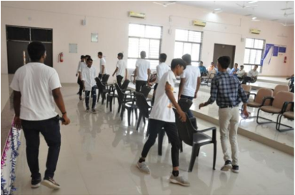

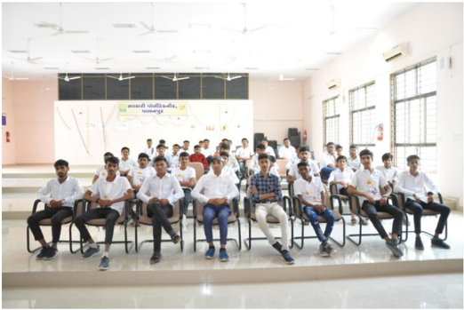

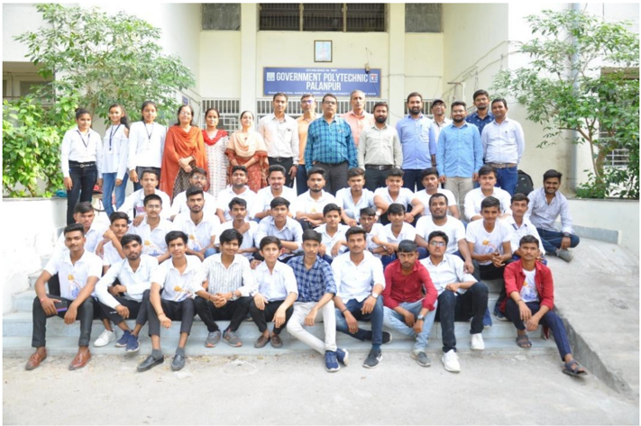

## Extra co-curricular activities

## VISIT OF MANPUR VILLAGE (NATURAL FARMING)

DATE - 04/01/2022

PLACE - MANPUR VILLAGE

Under the 'AAZADI KA AMRUT MAHOTSAV' (Panch Prakalp), students visit  to MANPUR village from  Government Polytechnic Palanpur by taking a bicycle to aware about natural farming was arranged on 04 th Feb. 2022

The  importance  of  natural  farming  has  been  explained  by Mr.  Hareshbhai Chaudhary, an expert in natural farming and also informed about the serious diseases that can be caused by chemical drugs and fertilizers in the coming days.

Mr.  Chaudhary  also  did  some  experiment  to  explain  practically  how's  the chemical fertilizer are damaging our nature.

Students enjoyed knowing the different ways of farming. They gained knowledge about different types of seeds, plants and trees.

At the end of the visit, a resolution was taken to convey the message of natural farming to the students from village to village.

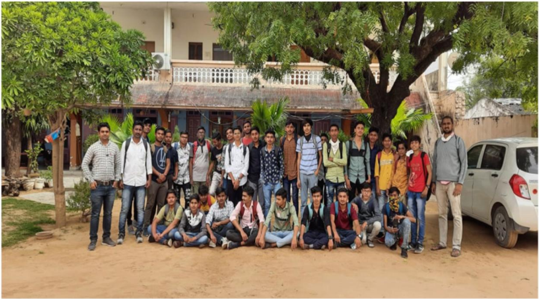

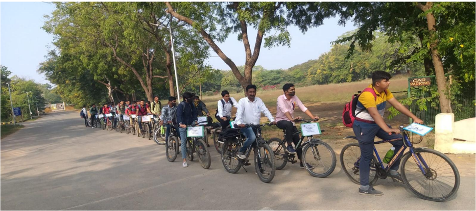

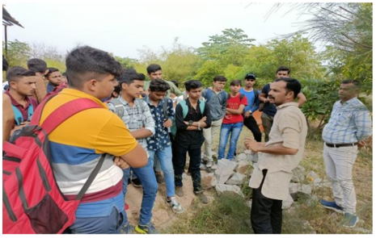

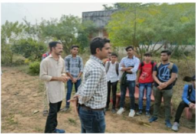

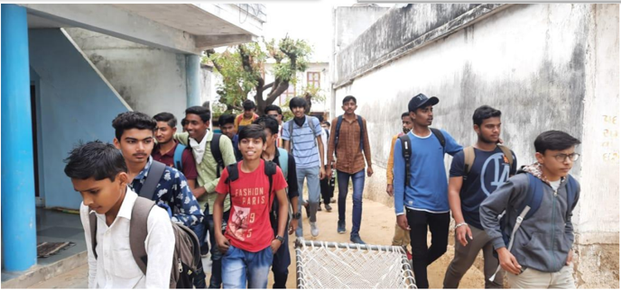

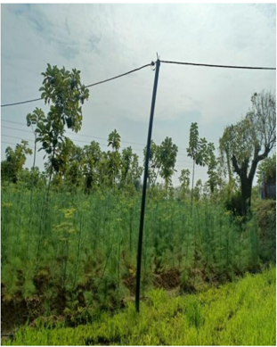

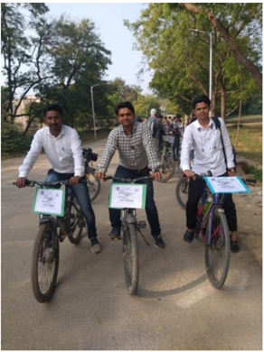

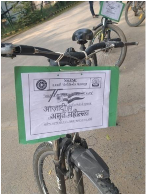

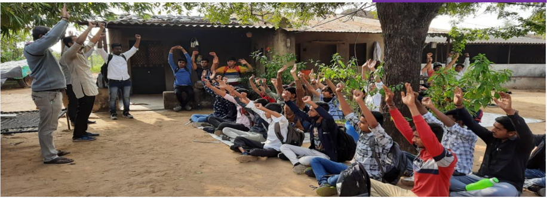

## COVID-19 VACCINATION

## DATE- 06/01/2022

## PLACE - SEMINAR HALL

On 6th January 2022 at Government Polytechnic, Palanpur, under the Government's  guideline,  a covid-19  vaccination program  was  organized  for students below 18 years of age in which all the students of Diploma Engineering were  vaccinated.  The  first  dose  of  vaccine  was  taken  by  approximately  200 students in this program.

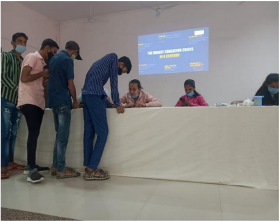

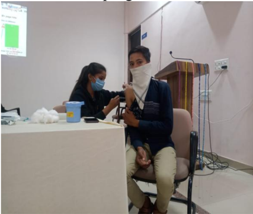

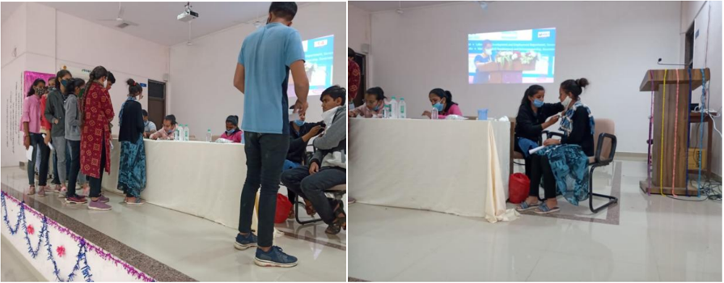

## REPUBLIC DAY

DATE - 26/01/2022 PLACE - MAIN GROUND

At  Government  Polytechnic  Palanpur,  On  26th  January  2022,  the  occasion  of 73rd  Republic  Day ,  a  flag  salute  program  was  organized  in  the  presence  of 'Hon'ble formar  MLA  Rekhaben  Khanesha' .  In  which  all  the  officials, employees and students of the institute enthusiastically participated.

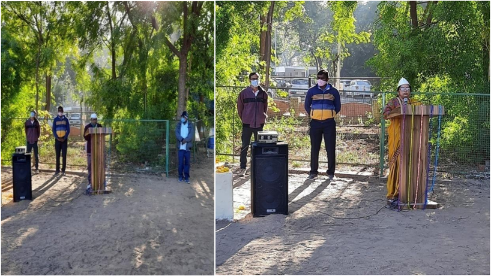

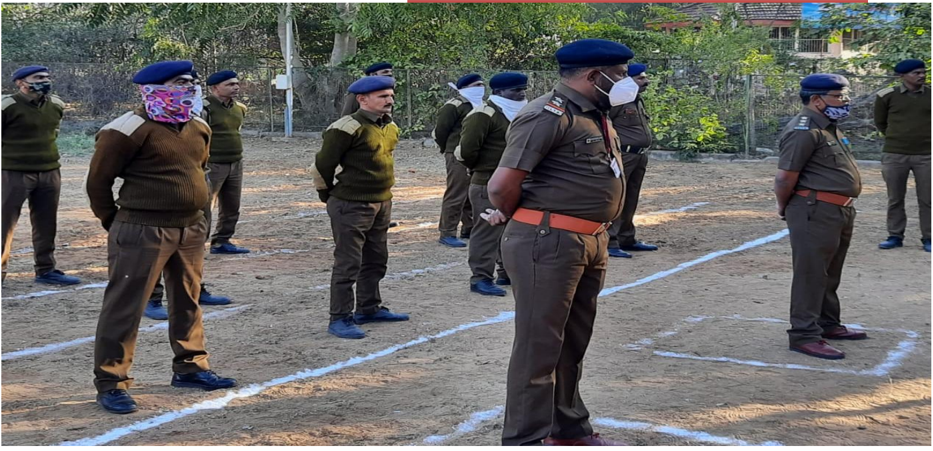

## EXPERT TALK ON 'BHARTIYA SVATANTRATA SANGRAM'

## DATE- 29/01/2022

## PLACE - SEMINAR HALL &amp; ONLINE (GOOGLE MEET)

On the occasion of Martyrs' Day on 30th January 2022 , the opportunity to pay tribute to the martyred heroes who sacrificed their lives in the freedom struggle of India  should  be  taken  seriously  and  the  spirit  of  faith  and  respect  towards  the martyrs  should  be  awakened  and  the  country  should  realize  its  importance  for which An online talk was organized by History Coordinating Committee, Gujarat on 29th January 2020 at 3:00 pm at the institute.

In this program, Shri Girishbhai Thacker, Vice Chairman, History Coordinating  Committee,  Gujarat gave  a  speech  on  the  subject  of 'Indian Freedom  Struggle(Bhartiya  svatantra  sangram)' .  The  program  was  also broadcast online through Google meet.

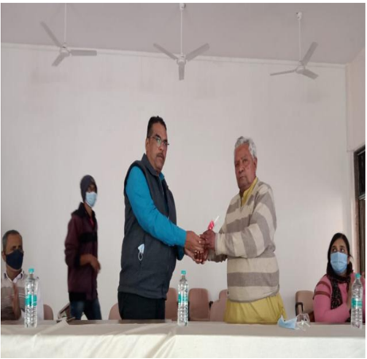

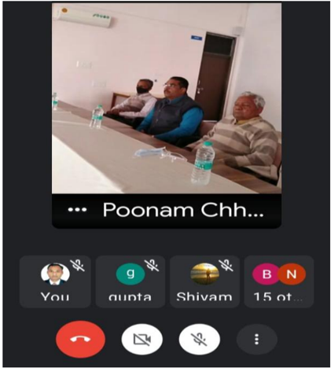

## KHEL MAHAKUMBH REGISTRATION

## DATE - 03/03/2022

Khel Mahakumbh is organized by Sports Authority of Gujarat like every year. In order  to  get  maximum  number  of  students  to  participate  in  this  competition, students are encouraged to register in Khel Mahakumbh as per the instructions of the head office and they are informed about the method of registration.

## COVID-19 VACCINATION\_2nd DOSE

## DATE- 16/03/2022 PLACE - SEMINAR HALL

On 16 th march 2022 at Government Polytechnic, Palanpur, under the Government's guideline, a covid-19 vaccination dose-2 program was organized for  students  below  18  years  of  age  in  which  all  the  students  of  Diploma Engineering were vaccinated. The first dose of vaccine was taken by approximately 130 students in this program.

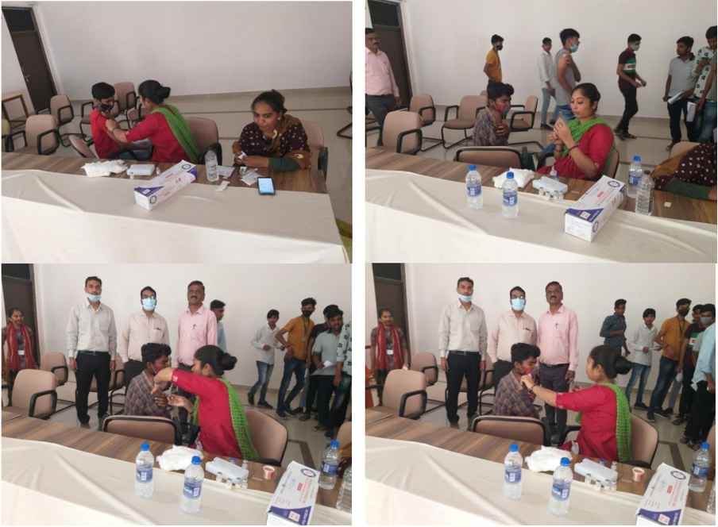

## VOTER AWARENESS PROGRAMME

DATE- 05/05/2022

PLACE - SEMINAR HALL

As part of extra-curricular  activities  at  Government  Polytechnic  Palanpur,  NSS unit organized drawing competition and essay competition to create awareness among students about voting. The students enthusiastically participated in this competition  and  brought  out  their  inner  skill.  The  winning  students  were encouraged by giving certificates and prizes.

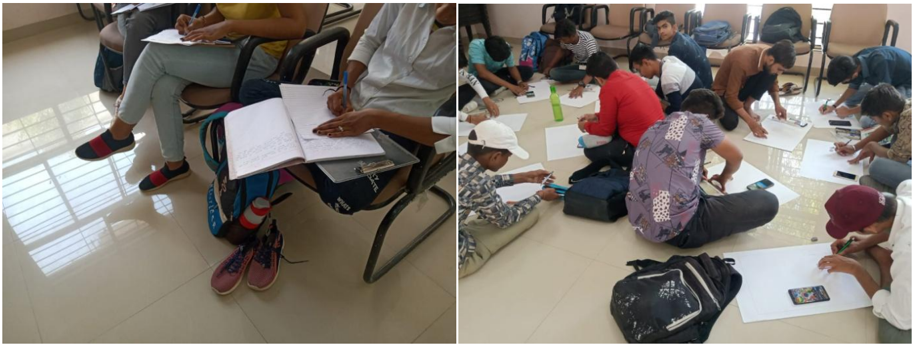

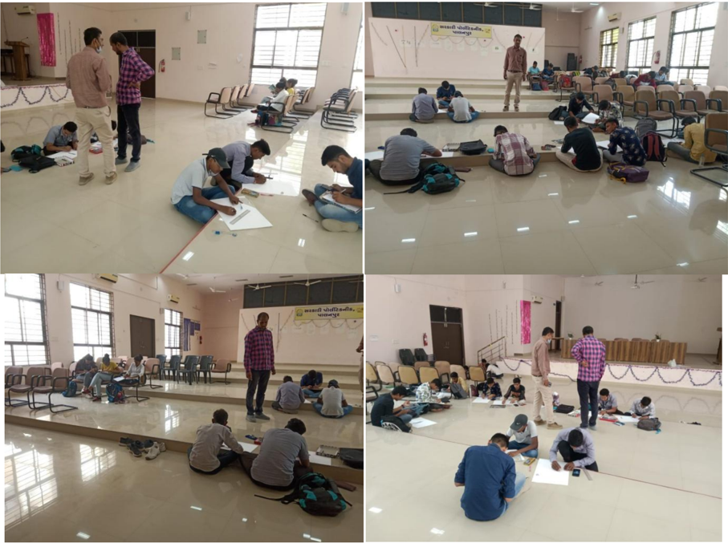

## YOGA DAY CELEBRATION

DATE :

21/06 / 2022

## PLACE:SEMINAR HALL

At  Government  Polytechnic  Palanpur,  On  21 st June  2022,  the  occasion  of International yoga day various yoga represented by yoga teacher. In which all the officials, employees and students of the institute enthusiastically participated.

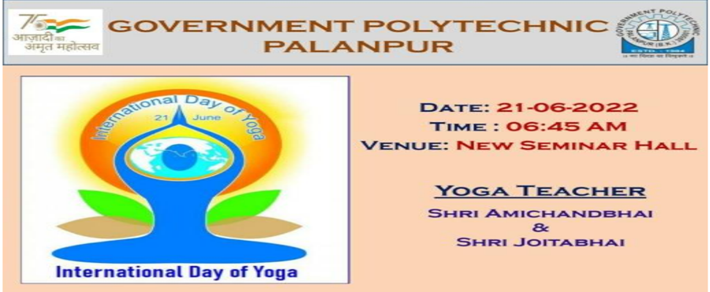

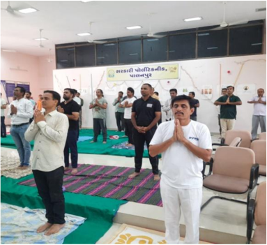

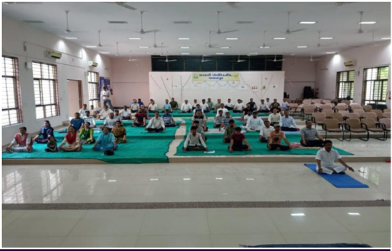

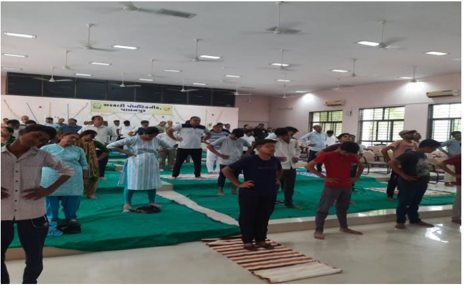

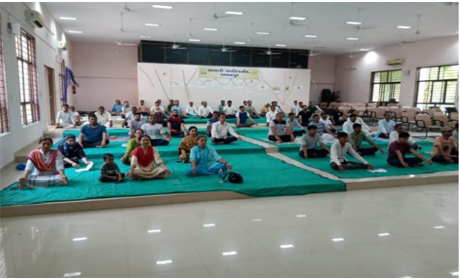

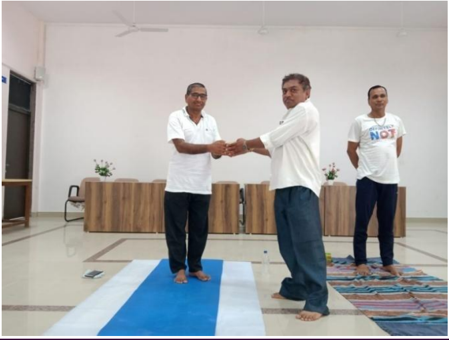

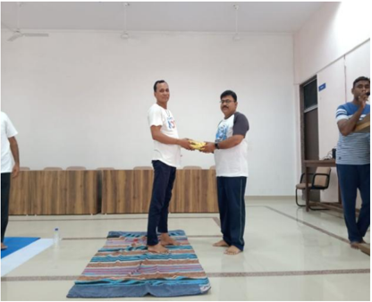

## Student Achievers

## Final year toppers

|    |   No.  Enrollment No. | Name                             |   CGPA |
|----|-----------------------|----------------------------------|--------|
|  1 |          196260306019 | DABHI JIGARKUMAR KANTIBHAI       |   9.62 |
|  2 |          196260306063 | PRAJAPATI SURESHBHAI  RAMESHBHAI |   9.52 |
|  3 |          196260306073 | THAKOR RANGUJI ABHUJI            |   9.29 |

## Government  Polytechnic  Palanpur

## Department of Civil Engineering

Opp. Malan Darwaja, Ambaji Road,

Palanpur - 385001

Phone: 02742-245219

E-mail:  gppcivil06@gmail.com,

6