## INFRACREATOR

## Newsletter

ISSUE 11 (JUNE 2023)

## Vision

The department envisions to achieve professionals in emerging field of civil engineering to meet aspirations of the society, by transforming students to  be technically skilled, managers, ethical, entrepreneur's leaders, and environmentally sensible civil engineers.

GOVERNMENT POLYTECHNIC PALANPUR

CIVIL ENGINEERING DEPARTMENT

## ABOUT THE DEPARTMENT

Started in 1984, Civil Engineering Department,  Government  Polytechnic Palanpur  offers  3  years  (6  semester) Diploma Civil Engineering Program with 90 intake capacity.

This  Program is Approved by All India Council for Technical Education (AICTE) and Affiliated to Gujarat Technological University, Ahmedabad(GTU).

## Mission

- To impart civil engineering skill to enhance their employability in the industries.
- Establish industry collaboration through internship and interaction with professional society through experts, workshops
- 3Promote  leadership,  management,  entrepreneurship  skills  in  a student through various projects, co-curriculum, extracurriculum events.
- 4Impart  social,  environment  awareness  and  responsibility  in students  to  serve  society  and  industry  to  promote  sustainable growth.

01/12

## HOD's Message

Welcome to the Department of Civil Engineering. The Department  of  Civil  Engineering  strives for  Excellence  in teaching and learning and ethical professional development. We  are  proud  to  have  State-of-  the-art  laboratories  and technical  staff  to  support  our  academic  program.  We  have well balanced and innovative teaching-learning atmosphere and  qualified  and  well  experienced  dedicated  academic staff. The students here are encouraged to participate in cocurricular and Extra-curricular activities for personal development.

There  are  many  careers  paths  for  Civil  Engineers.  They  are essential in Government agencies, Private and Public sectorundertaking to completevarious Mega Projects.

## Inside The Issue

- Republic day Celebration &gt;&gt; Page 3
- Visit @ Amrutam Hospital for Building Services &gt;  &gt; Page 3
- Sports Week 2023 &gt;&gt; Page 4
- Surveying by Total Station &amp; DGPS  &gt;&gt; Page 5
- Building Defects &amp; Repair Techniques - An Expert Lecture &gt;&gt; Page 6\
- Infra Article
- Three Legged Rotary Bridge @ RTO Circle, Palanpur - Infra News  &gt;  &gt; Page 7
- The Statue of Unity  &gt;  &gt; Page 7
- Bharat Mala Project &gt;  &gt; Page 8
- The Delhi-Mumbai Expressway - Infra Article &gt;  &gt; Page 9
- Atal Tunnel &gt;  &gt; Page 10
- Student`s Corner &gt;  &gt; Page 11
- Faculty Achievements &gt;  &gt; Page 12

Government Polytechnic Palanpur Department of Civil Engineering

Opp. Malan Darwaja, Ambaji Road, Palanpur - 385001 Phone: 02742-245219

## Newsletter Committee

Editor in Chief

- Mr N N RAJGOR (HOD Civil)

Coordinator

- Mr F A MUKHI (Lecturer Civil) Editors
- Mr N V PRAJAPATI (Lecturer Civil)
- Mr J N CHAUDHARY (Lecturer Ap. Mech.)

## Student Editors

- PRAJAPATI DHRUV H 6th Sem
- MEVADA HARSH K 6th Sem
- MANASIYA TALHA N 4th Sem
- PRAJAPATI OM D 4th Sem
- RAVAL JAIMIN D 2nd Sem
- BAGHEL PUNAM I  2nd Sem

Send your feedback to gppcivil06@gmail.com

## Republic Day Celebration

At Government Polytechnic Palanpur, On 26th January 2023, the occasion of 74th Republic Day, a flag salute program was arranged in which all the officials, employees and students of the institute enthusiastically participated.

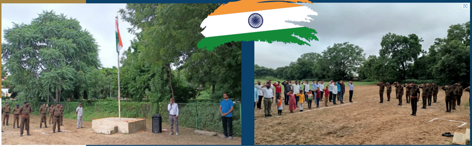

## Visit @ Amrutam Hospital for Building Services

A visit of Amrutam Hospital was arranged on 25  April,  2023  for  Final  Year  Civil  Engineering students.  Students  got  the  chance  to  see various  Building  services  like,  elevators,  fire safety, plumbing, electrical lines etc.

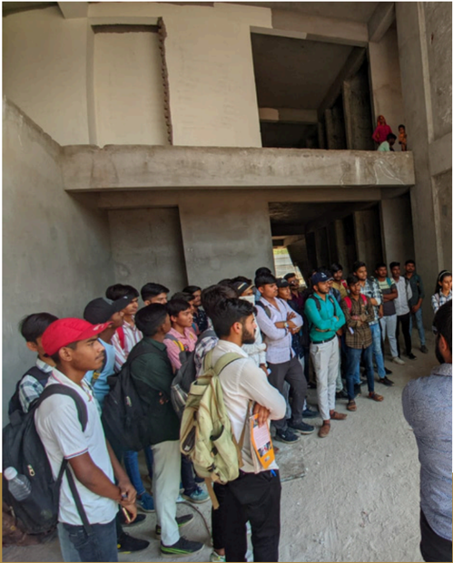

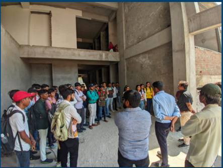

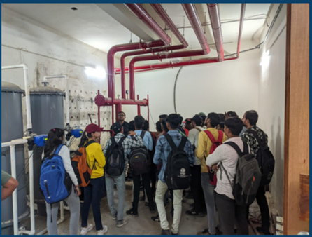

## Sports Week 2023

Sports week was celebrated in the second week of April, 2023. Students of  all  the  departments  participated  in  various  sports  like  Cricket, Volleyball,  Kabaddi,  Rassa  khench,  Chess,  Carrom,  Badminton  and newly introduced Online games.

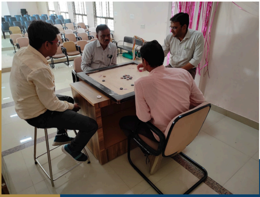

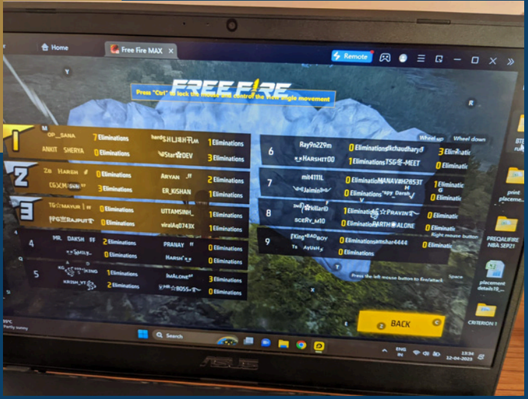

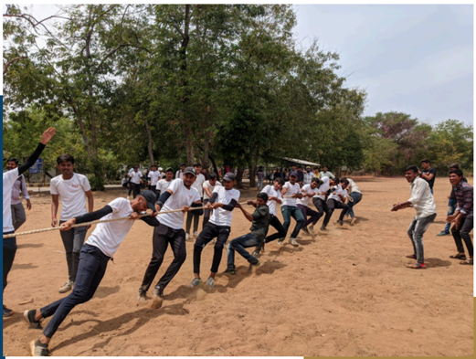

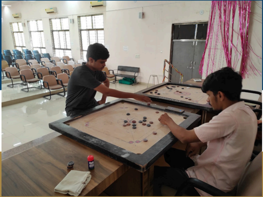

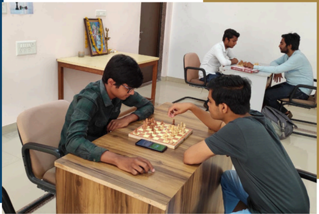

## Surveying by Total Station &amp; DGPS

An expert session on Surveying by Total Station &amp; DGPS was arranged on 08/06/2023 by the industry expert Mr. Salman Khurshid Shahu (Classic Engineering, Palanpur) Total 49 students participated in the session as well as hands on training.

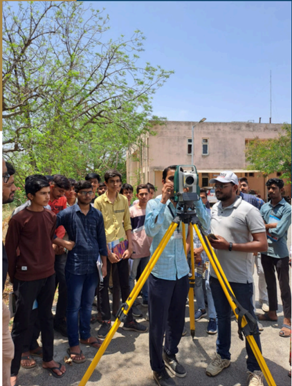

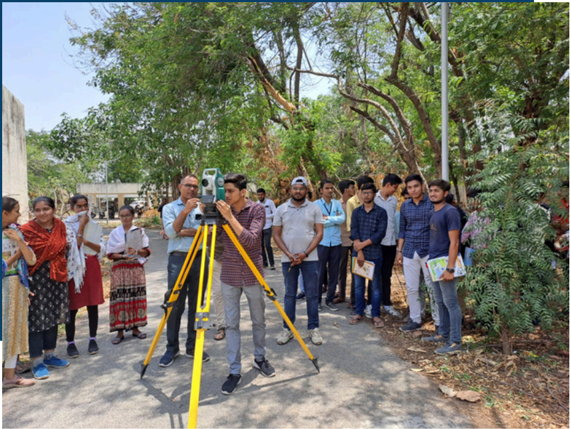

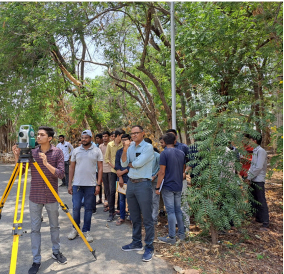

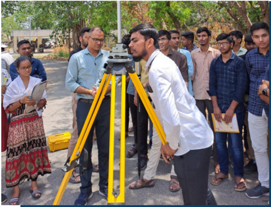

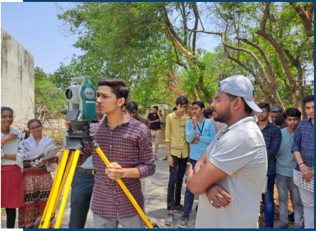

## Building Defects &amp; Repair Techniques An Expert Lecture

An expert lecture on  Building Defects &amp; Repair Techniques was arranged on 21/04/2023 by the Mr. Ritesh Vora (Manager Pidilite Industries). Total 96 students attended the lecture.

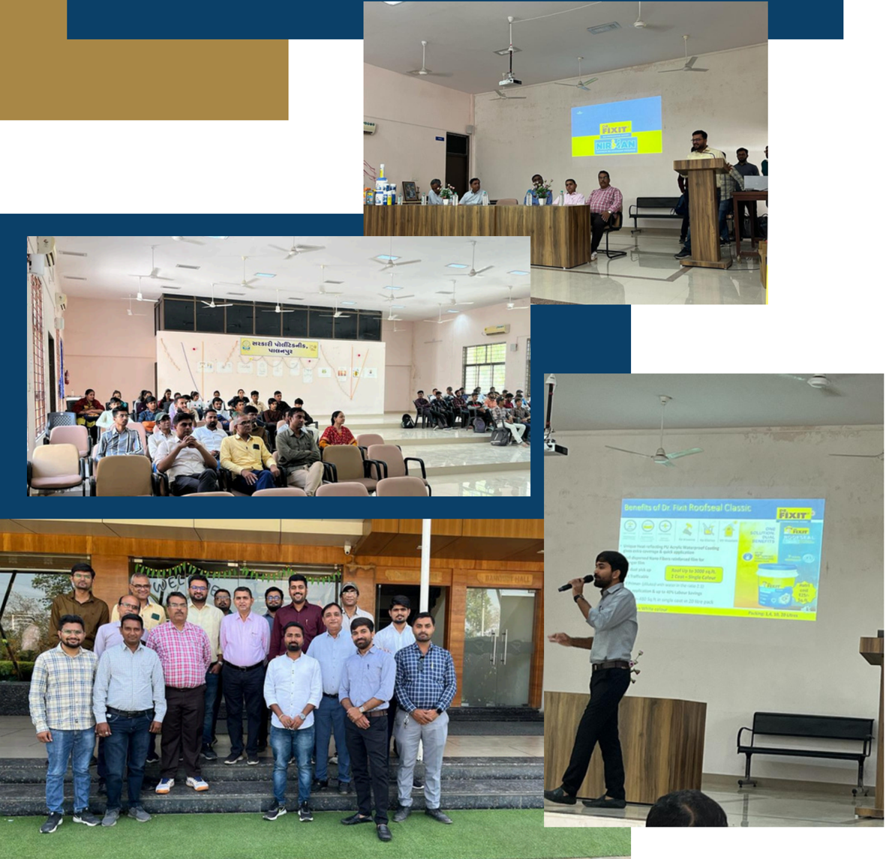

## Three Legged Rotary Bridge @ RTO Circle, Palanpur

Baghel Poonam Sem - 2 Civil Engineering Department

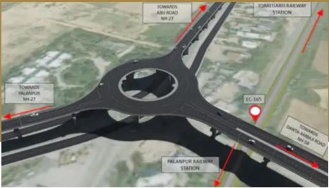

- Three leg rotary bridge construction initiated at Palanpur RTO circle
- Central government approval for a three-leg elevated rotary railway overbridge at a cost of 123 crores
- Palanpur agency authorized for the construction with a budget of 90 crores
- Project completion expected in 18 months
- Three legs of varying lengths: 682 meters towards Danta, 700 meters towards Abu Road, and 951 meters towards Palanpur-Ahmedabad highway
- Innovative three-leg elevated rotary design, marking a significant infrastructure project for Gujarat
- Circular structure formed at a height of 18 to 20 feet above ground level, showcasing engineering excellence.

## The Statue of Unity

The Statue of Unity is a 182-meter (600-foot) tall statue in Gujarat, India.

It's the world's tallest statue.

The statue is dedicated to Sardar Vallabhbhai Patel, who was India's first home minister and deputy prime minister.

The statue is located on the Sadhu Bet island on the Narmada river. It was unveiled on October 31, 2018.

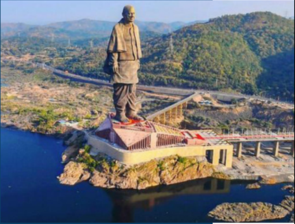

The statue is made of:

- 70,000 tonnes of cement
- 25,000 tonnes of steel
- 12,000 bronze panels, each weighing over 1700 tonnes

The statue is a patriotic symbol of the legacy of a man who spent his life in the struggle for freedom

## Technical Details of Bharat Mala Road Project

- Raval Jaimin D. Sem - 2 Civil Engineering Department

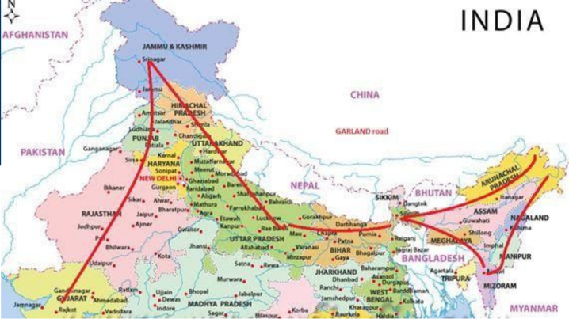

The Bharat Mala project, one of India's most ambitious road infrastructure initiatives, involves the construction of highways, expressways, bridges, and tunnels across the country. Here are the technical details:

## 1. Road Network Expansion:

- The project aims to develop over 83,000 kilometers of roads, including economic corridors, feeder routes, and border roads.
- It focuses on connecting major economic centers, ports, and border areas to facilitate trade and commerce.

## 2. Economic Corridors:

- Bharat  Mala  envisages  the  development  of  several  economic  corridors  such  as  the  Delhi-Mumbai  Industrial Corridor (DMIC) and the North-South Corridor.
- These  corridors  are  designed  to  reduce  travel  time  and  logistics  costs,  enhancing  the  efficiency  of  freight movement.

## 3. Expressways:

- Construction of expressways with high-speed limits, typically six-lane or more, to ensure seamless connectivity between major cities.
- These  expressways  incorporate  modern  features  such  as  service  lanes,  grade-separated  interchanges,  and advanced safety measures.

## 4. Bridges and Tunnels:

- Bharat Mala includes the construction of numerous bridges and tunnels to overcome geographical barriers such as rivers, valleys, and mountainous terrain.
- These structures are engineered to meet international standards of safety, durability, and load-bearing capacity.

## 5. Technological Integration:

- Implementation of advanced technologies such as intelligent transportation systems (ITS) for real-time traffic monitoring, toll collection, and incident management.
- Use  of  Geographic  Information  System  (GIS)  for  route  planning,  land  acquisition,  and  environmental  impact assessment.

## 6. Environmental Considerations:

- Adherence to environmental norms and regulations to minimize the project's ecological footprint.
- Integration of green infrastructure elements such as eco-friendly drainage systems, noise barriers, and wildlife crossings.

## 7. Project Management:

- Effective  project  management  practices  including  detailed  planning,  monitoring,  and  coordination  among multiple stakeholders.
- Emphasis on timely execution, cost optimization, and quality assurance throughout the construction phases.

## Conclusion :

The Bharat Mala road project represents a paradigm shift in India's road infrastructure development, incorporating advanced engineering techniques, technological innovations, and environmental sustainability principles to create a modern and efficient transportation network.

## INFRA ARTICLE

## The Delhi-Mumbai Expressway

## PRAJAPATI OM D

Sem 4 Civil Engineering Department

The Delhi-Mumbai Expressway is an 8-lane, 1,350 km long expressway that connects  India's  two  most  important  cities,  New  Delhi  and  Mumbai.  It  will reduce  the  travel  time  between  the  two  cities  from  nearly  24  hours  to  12 hours. The expressway will also reduce the distance between the two cities by

12%, from 1,424 km to 1,242 km

Some details about

the expressway:

- Total length: 1,350 km
- Operational length: 490 km
- Lanes: 8 (expandable to 12)
- Speed limit: 120 kmph
- Estimated cost: Rs. 1,00,000 crore (1 lakh crore)

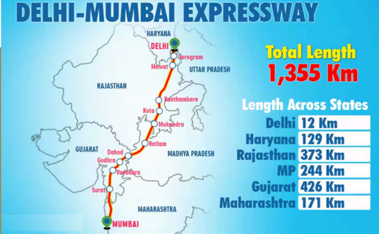

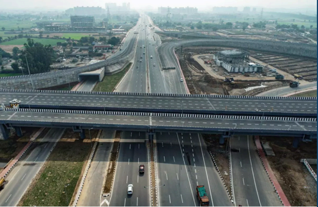

The expressway will pass through six states: Delhi, Haryana, Rajasthan, Madhya Pradesh, Gujarat, and Maharashtra.  It  will  connect  major cities like Kota, Indore, Jaipur, Bhopal, Vadodara, and Surat.

The expressway's first phase, the Delhi-Dausa-Lalsot section, was inaugurated by Prime Minister Narendra  Modi.  The  246  km  long section cost more than Rs 12,150 crore to  develop.  It  will  reduce  the  travel time  from  Delhi  to  Jaipur  from  5 hours to around 3.5 hours.

## Atal Tunnel

## PRAJAPATI OM D

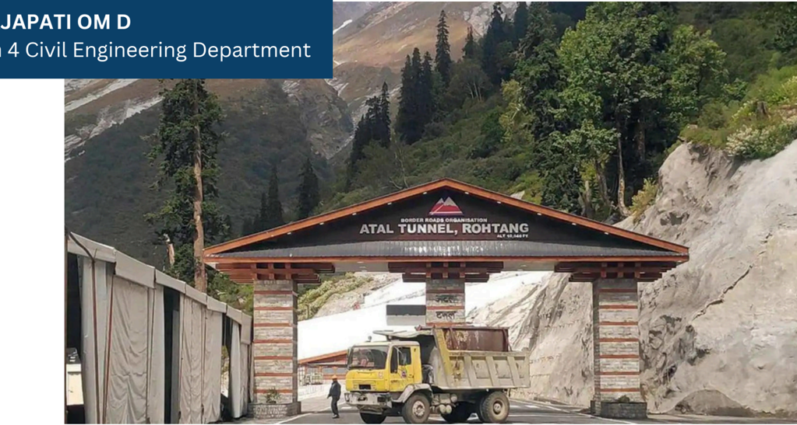

## Construction Methodology:

- The tunnel was constructed using the New Austrian Tunneling Method  (NATM),  a  state-of-the-art  technique  for  tunnel excavation in mountainous terrain.
- Construction  commenced  in  2010  and  involved  extensive drilling, blasting, and excavation through the rocky terrain of the Pir Panjal range.
- Advanced machinery and equipment, including tunnel boring machines (TBMs) and rock drilling rigs, were employed to expedite the construction process.

## Design Features:

- The Atal Tunnel stretches over 9.02 kilometers, making it one of the  longest  tunnels  in  India  and  the  world's  highest  highway tunnel.
- It  is  a  horseshoe-shaped,  single-tube  tunnel  with  a  width  of approximately 10.5 meters and a height of 5.52 meters, allowing two-way traffic flow.
- The tunnel is equipped with modern safety features, including ventilation systems, emergency exit passages, and fire-fighting equipment, ensuring the safety of commuters.

## Geological Challenges:

- The Atal Tunnel has strategic significance for India, providing a vital  link  to  the  border  areas  and  enhancing  military  logistics and troop movement.
- It  has  opened  up  new  opportunities  for  tourism,  trade,  and socio-economic development in the remote Himalayan regions, promoting connectivity and fostering regional integration.

## WHERE IS THE ATAL TUNNEL LOCATED?

ATAL TUNNEL LOCATION MAP

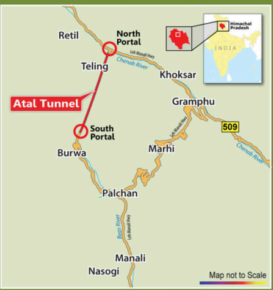

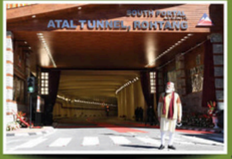

FACTS

## ATAL TUNNEL

(also known as Rohtang Tunnel)

Length:

9.02 Kms (5.60 mi)

Routc:

Lch-Manall Highway

Opened:

3 October 2020

Operator: Border Roads Organisation

## Student`s Corner

- Civil 6th Sem. Team won the GPP Cricket Cup in Sports Week organized by Government Polytechnic, Palanpur
- On the Occasion of Friendship day, a  Poem written by Mevada Harsh (Sem 6 Civil Department) with the subject of ' Friendship '
- 1

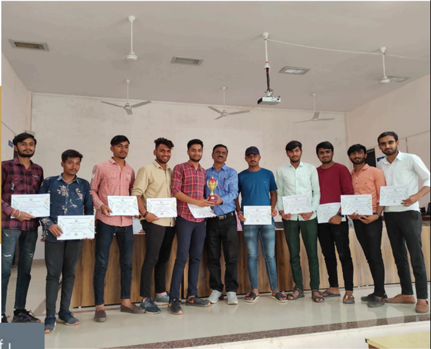

|   Semester | Name of Student               |   Enrollment No |   SPI |
|------------|-------------------------------|-----------------|-------|
|          5 | Mevada Harsh Kirankumar       |    206260306006 |   9.1 |
|          3 | Manasiya Talha Nizamuddinbhai |    216260306003 |   9.8 |
|          1 | Thakor Kishanji Ravaji        |    226260306082 |   7.9 |

## Faculty Achievements

|   Sr No | Name of Faculty   | Achievement                                                                                                                |
|---------|-------------------|----------------------------------------------------------------------------------------------------------------------------|
|       1 | H P Patel         | Attended 2 Weeks (19/06/23 to 23/06/23) Training on Building Information Modeling for Civil Engineers at NITTTR, Ahmedabad |
|       2 | N V Prajapati     | Attended 2 Weeks (19/06/23 to 23/06/23) Training on Building Information Modeling for Civil Engineers at NITTTR, Ahmedabad |