## INFRACREATOR

## Newsletter

ISSUE 13 (JUNE 2024)

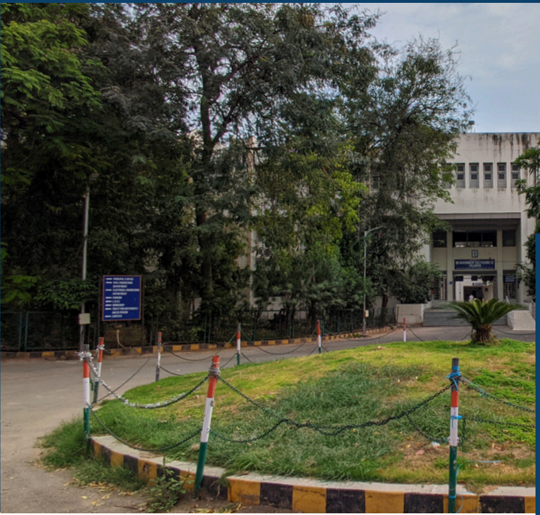

## Vision

The department envisions to achieve professionals in emerging field of civil engineering to meet aspirations of the society, by transforming students to  be technically skilled, managers, ethical, entrepreneur's leaders, and environmentally sensible civil engineers.

GOVERNMENT POLYTECHNIC PALANPUR

CIVIL ENGINEERING DEPARTMENT

## ABOUT THE DEPARTMENT

Started in 1984, Civil Engineering Department,  Government  Polytechnic Palanpur  offers  3  years  (6  semester) Diploma Civil Engineering Program with 90 intake capacity.

This  Program is Approved by All India Council for Technical Education (AICTE) and Affiliated to Gujarat Technological University, Ahmedabad(GTU).

## Mission

- To impart civil engineering skill to enhance their employability in the industries.
- Establish industry collaboration through internship and interaction with professional society through experts, workshops
- 3Promote  leadership,  management,  entrepreneurship  skills  in  a student through various projects, co-curriculum, extracurriculum events.
- 4Impart  social,  environment  awareness  and  responsibility  in students  to  serve  society  and  industry  to  promote  sustainable growth.

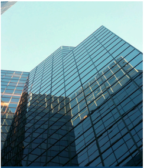

01/11

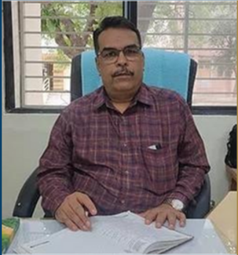

## HOD's Message

Welcome to the Department of Civil Engineering. The Department  of  Civil  Engineering  strives for  Excellence  in teaching and learning and ethical professional development. We  are  proud  to  have  State-of-  the-art  laboratories  and technical  staff  to  support  our  academic  program.  We  have well balanced and innovative teaching-learning atmosphere and  qualified  and  well  experienced  dedicated  academic staff. The students here are encouraged to participate in cocurricular and Extra-curricular activities for personal development.

There  are  many  careers  paths  for  Civil  Engineers.  They  are essential in Government agencies, Private and Public sectorundertaking to completevarious Mega Projects.

## Newsletter Committee

Government Polytechnic Palanpur Department of Civil Engineering

## Editor in Chief

- Mr N N Rajgor (HOD Civil)

Coordinator

- Mr F A MUKHI (Lecturer Civil)

## Editors

- Mr N V PRAJAPATI (Lecturer Civil)
- Mr J N CHAUDHARY (Lecturer Ap. Mech.)

## Student Editors

- MANASIYA TALHA N 6th Sem
- PRAJAPATI OM D 6th Sem
- RAVAL JAIMIN D 4th Sem
- BAGHEL PUNAM I  4th Sem
- GOSWAMI PRINCEGIRI 2nd Sem
- NANDOLIYA AHMEDRIJVAN 2nd Sem

Send your feedback to gppcivil06@gmail.com

## Inside The Issue

| Republic Day Celebration                 | >> Page 4   |
|------------------------------------------|-------------|
| Sports Week 2024                         | >> Page 4   |
| Expert Lecture on Solar Rooftop PV Plant | >> Page 5   |
| Advanced Surveying Project on            | >> Page 5   |
| Theodolite                               |             |
| Training : Recent Advancement in         | >> Page 6   |
| Computer Aided Civil Engineering Design  |             |
| Entrepreneurship Awareness Drive         | >> Page 7   |
| Fire Safety Training                     | >> Page 8   |
| Expert Session on Total Station          | >> Page 8   |
| INFRA NEWS : Ahmedabad-Gandhinagar       | >> Page 9   |
| Metro route likely to be operational by  |             |
| September                                |             |
| INFRA ARTICLE : Bharatmala Project       | >> Page 10  |
| Out Star Students                        | >> Page 11  |
| Faculty Achievements                     | >> Page 11  |

## Republic Day Celebration

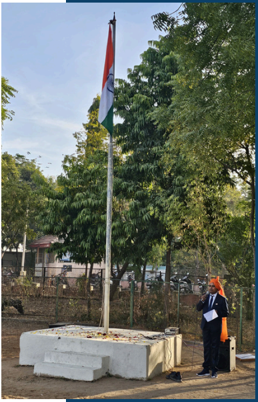

At Government Polytechnic Palanpur, On 26th January 2024, the occasion of 75th Republic Day, a flag hoisting program was arranged in which all the officials, employees and students of the institute enthusiastically participated. Electrial Department Lab assistant Mr S. K Metia hoisted the flag while EC HOD Mr S. J. Chauhan sir delivered a speach.

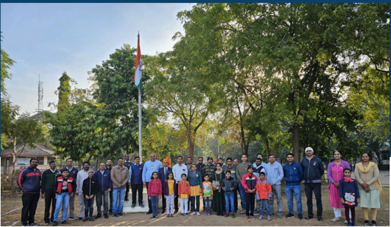

## Sports Week 2024

Sports  week  was  celebrated  in  the  second  week  of  February, 2024.  Students  of  all  the  departments  participated  in  various sports  like  Cricket,  Volleyball,  Kabaddi,  Rassa  khench,  Chess, Carrom, Badminton and e-sports

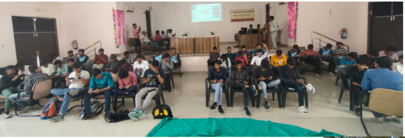

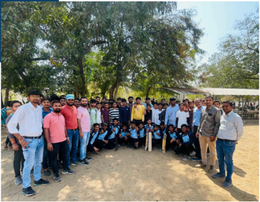

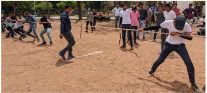

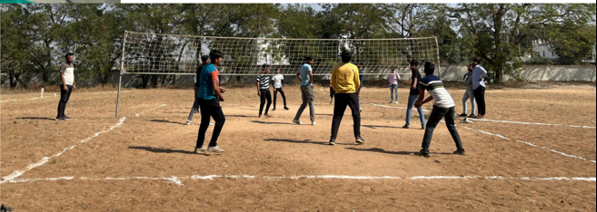

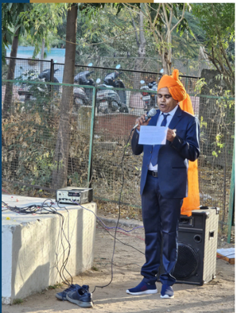

## Expert Lecture on  Solar Rooftop PV Plant

On 21st February, 2024 An Expert Lecture on Solar Rooftop PV Plant was organised for final semester  diploma  civil  engineering  students. The  expert  who  delivered  lecture  was  Mr  A  M Qureshi,  Lecturer  in  Electrical  Engineering  who gane  in  depth  knowledge  about  principle  and working of solar rooftop plant

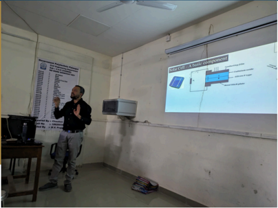

## Advanced Surveying Project on Theodolite

On  14th  March,  2024,  4th  semester  duploma engineering  students  performed  a  project  on theodolite in Advanced surveying subject

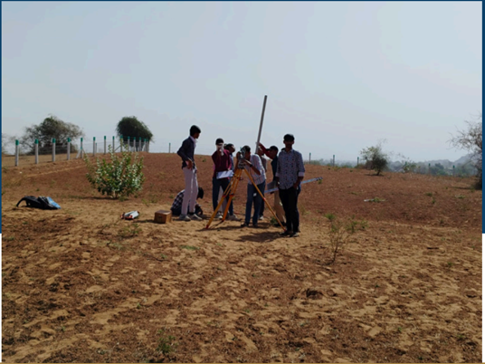

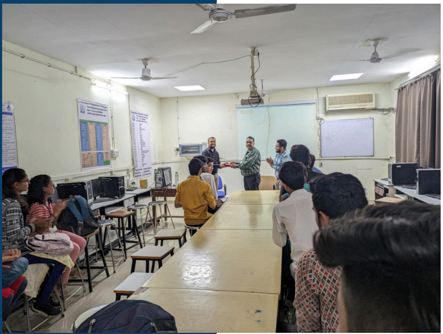

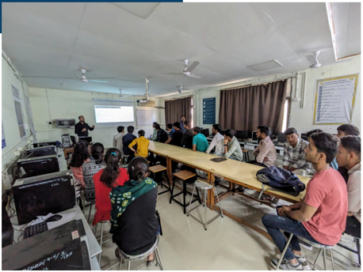

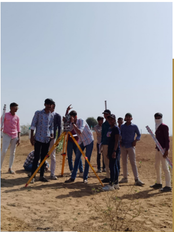

## Training  : Recent Advancement in Computer Aided Civil Engineering Design

A training on Recent Advancement in Computer Aided Civil Engineering Design was organised for second and final year students on 08/04/2024 to 09/04/2024. This training was conducted on department's computer laboratory by the trainers of SAI CAD center, Patan.

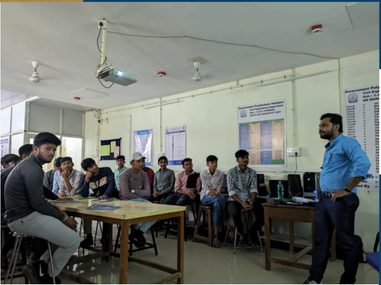

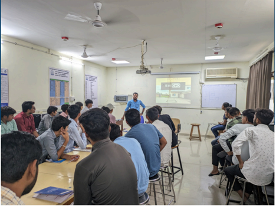

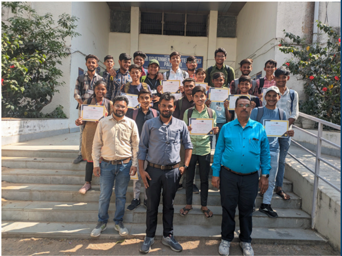

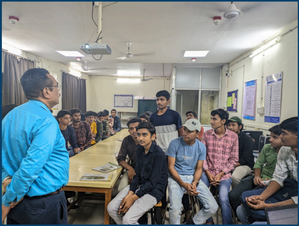

## Entrepreneurship Awareness Drive

An Entrepreneurship Awareness Drive was organised for  final year students on 15/04/2024 to 16/04/2024. This training was conducted on seminal hall by the trainers of Center of Entrepreneurship Development where Mr Mehul Pandya spoke in detail about Entrepreneurship

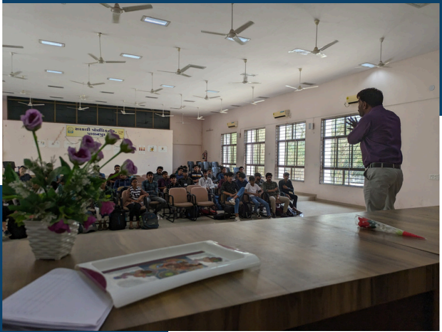

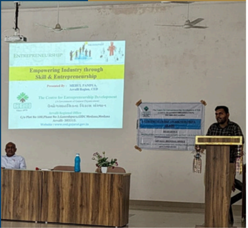

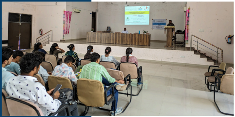

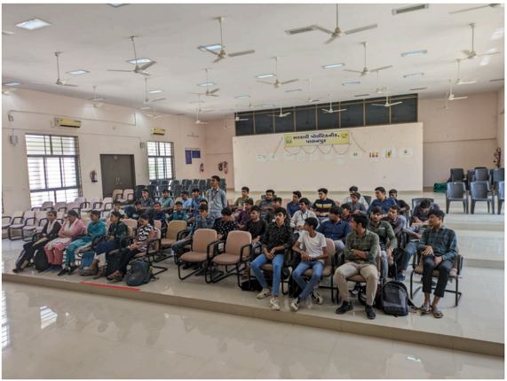

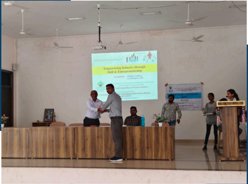

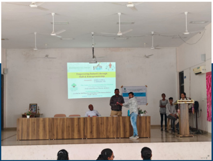

## Fire Safety Training

A Hands on training regarding fire safety of main building of the institute is organised on 1st May, 2024 for all the staff, security personal and students of diploma civil engineering.

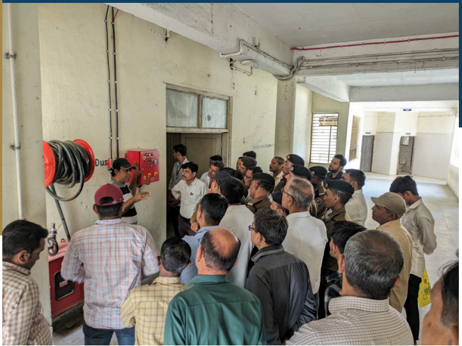

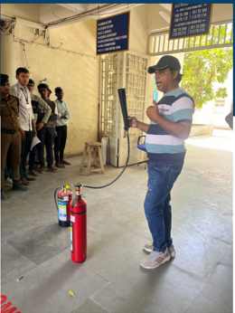

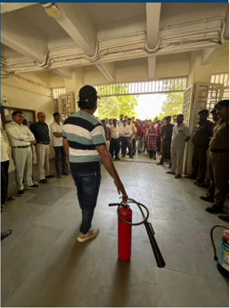

## Expert Session on Total Station

On 21st May, 2024, an Extert hands on sesion on  Total  Station  was  arranged  for  the  4th semester diploma engineering students

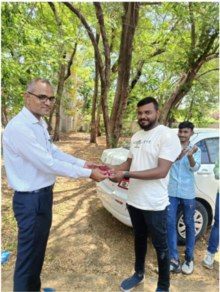

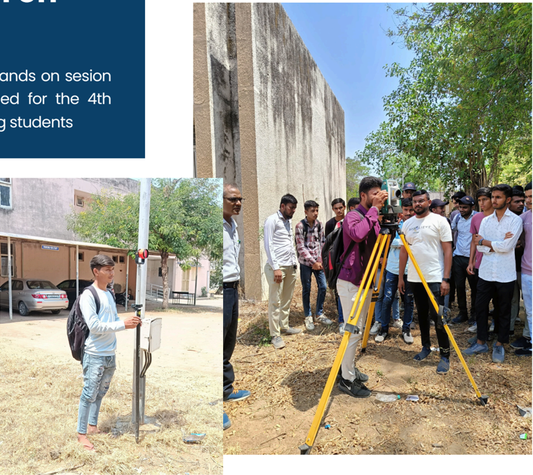

## INFRA NEWS

## Ahmedabad-Gandhinagar Metro route likely to be operational by September

The Gujarat Metro Rail Corporation (GMRC) is working rapidly to operationalize the 28 km route from Motera to Mahatma Mandir in the state capital under the Ahmedabad Metro Phase-2  project. Under  this project,  around  16  km  of  the  route  from  Motera  to Gandhinagar  Sector-1  and  a  5  km  stretch  from  GNLU  to  PDPU  to  Gift  City  have  been completed. Final inspections are currently underway and expected to conclude within a day.

Amendments will be made based on necessary suggestions from the Commissioner of Metro Rail Safety (CMRS), a process likely to take about a month. As a result, metro train operations on this new 21 km route from Motera are anticipated to commence anytime in August.

A total of 22 stations will be established along the 28 km corridor, with 13 stations ready on the Motera-Sector 1 route and 2 stations ready on the GNLU-Gift City route. Currently, the track, signal systems, coaches, and  stations have  undergone  inspection  by  the Commissioner of Metro Rail Safety team. Work on the Sector-1 to Mahatma Mandir route is also progressing rapidly, aiming for completion by year-end

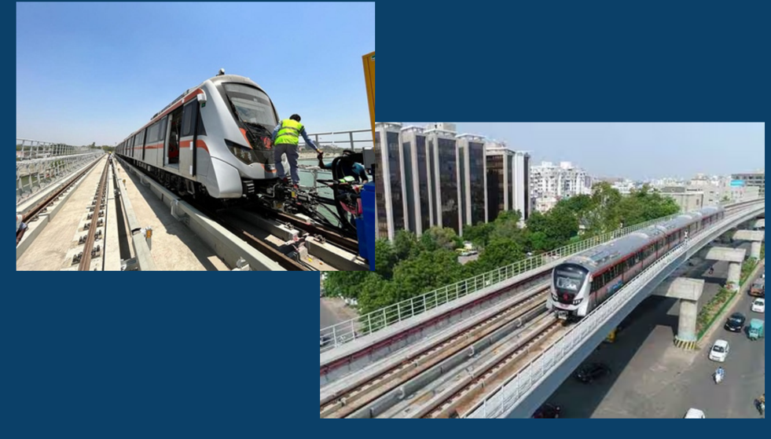

## Bharatmala Project

## GOSWAMI PRINCEGIRI

(Sem 2 Diploma Civil Engineering)

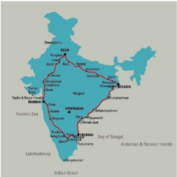

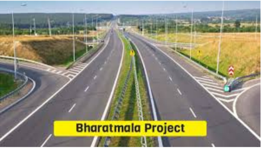

## Bharatmala Project Overview

Launch Date: October 2017

Executing Agency: National Highways Authority of India (NHAI)

Completion Target: 2022 (Phase 1)

## Key Details

- Scope: Pan-India highway and road development, improving connectivity to economic corridors, borders, ports, and underserved regions.
- Key Components:
- 26,200 km of economic corridors
- 8,000 km of inter-corridor and feeder routes
- 2,000 km of border and coastal roads
- 800 km of expressways

## Objectives

- Economic  Growth:  Enhance  infrastructure,  reduce  logistics  costs,  and  improve  travel efficiency.
- Regional Development: Boost connectivity to remote areas.
- Defense: Strengthen border and coastal road networks.

Estimated Cost: ₹5.35 lakh crore (USD 67 billion)

Status (2024): 24,800 km awarded; significant progress made, though some delays due to land acquisition and clearances.

## Conclusion

Bharatmala  is  a  major  infrastructure  project  that  will  transform  India's  road  network, enhancing connectivity and supporting economic growth across the country.

|   Semester | Name of Student                |   Enrollment No |   SPI |
|------------|--------------------------------|-----------------|-------|
|          6 | MANASIYA TALHA NIZAMUDDIN BHAI |    216260306003 |  9.58 |
|          4 | LUHAR RAGHUKUMAR NARAYANBHAI   |    226260306037 |  8.15 |
|          2 | SUTHAR GOVINDBHAI BHARATBHAI   |    236260306096 |  8.82 |

## Faculty Achievements

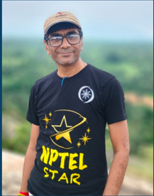

|   Sr No | Name of Faculty                                           | Achievement                                                                                                                                                    |
|---------|-----------------------------------------------------------|----------------------------------------------------------------------------------------------------------------------------------------------------------------|
|       1 | A N PATEL                                                 | Certificate from NPTEL for being recognized as NPTEL DISCIPLINE STAR                                                                                           |
|       2 | D N SHETH                                                 | Completed 12 Week MOOC on Remote Sensing Essentials at SWAYAM NPTEL                                                                                            |
|       3 | P D SHETH                                                 | Completed 12 Week MOOCs on Water Supply Engineering & Rural Water Resourses Management at SWAYAM NPTEL                                                         |
|       4 | V P PATEL, A R PATEL, H P PATEL, A N PATEL, N V PRAJAPATI | Completed 8 Week MOOC on Introduction to Accounting and Finance for Civil Engineers at SWAYAM NPTEL                                                            |
|       5 | F A MUKHI                                                 | Completed 8 Week MOOC onYoga and Positive Psychology for Managing Career and Life at SWAYAM NPTEL and 12 Week MOOC on Principles of Management at SWAYAM NPTEL |