## INFRACREATOR

## Newsletter

ISSUE 15 (JUNE 2025)

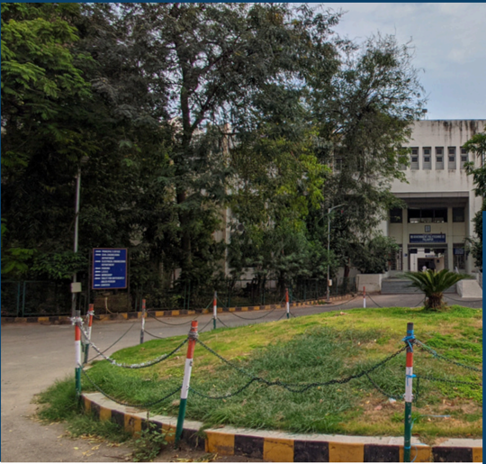

## Vision

The department envisions to achieve professionals in emerging field of civil engineering to meet aspirations of the society, by transforming students to  be technically skilled, managers, ethical, entrepreneur's leaders, and environmentally sensible civil engineers.

GOVERNMENT POLYTECHNIC PALANPUR

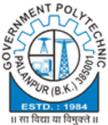

CIVIL ENGINEERING DEPARTMENT

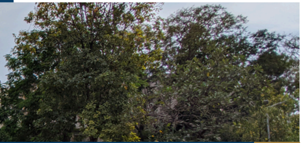

## ABOUT THE DEPARTMENT

Started in 1984, Civil Engineering Department,  Government  Polytechnic Palanpur  offers  3  years  (6  semester) Diploma Civil Engineering Program with 90 intake capacity.

This  Program is Approved by All India Council for Technical Education (AICTE) and Affiliated to Gujarat Technological  University,  Ahmedabad (GTU).

## Mission

- To impart civil engineering skill to enhance their employability in the industries.
- Establish industry collaboration through internship and interaction with professional society through experts, workshops
- 3Promote  leadership,  management,  entrepreneurship  skills  in  a student through various projects, co-curriculum, extracurriculum events.
- 4Impart  social,  environment  awareness  and  responsibility  in students  to  serve  society  and  industry  to  promote  sustainable growth.

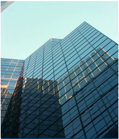

01/10

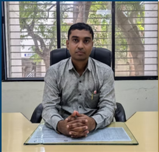

## HOD's Message

Greetings from the Civil Engineering Department.

The Department of Civil Engineering aspires to excellence  in  professional  development  that  is  morally grounded in teaching and learning. We take great pride in having our academic program supported by cuttingedge laboratories and technical personnel. We have a creative, well-balanced teaching-learning environment, as well as a highly skilled and committed faculty. For the purpose of their own growth, the students are encouraged to engage in co-curricular and extracurricular activities, too.

## Newsletter Committee

Government Polytechnic Palanpur Department of Civil Engineering

## Editor in Chief

- Mr D N Sheth (HOD Civil)

## Coordinator

- Mr F A MUKHI (Lecturer Civil)

## Editors

- Mr H P PATEL (Lecturer Civil)
- Mr J N CHAUDHARY (Lecturer Ap. Mech.)

## Student Editors

- RAVAL JAIMIN D 6th Sem
- BAGHEL PUNAM I  6th Sem
- GOSWAMI PRINCEGIRI 4th Sem
- NANDOLIYA AHMEDRIJVAN 4th Sem
- RAVAL JAYDEEP 2nd Sem
- CHAUDHARY PRITEE 2nd Sem

Send your feedback to gppcivil06@gmail.com

## Inside The Issue

| Republic Day Celebration                 | >> Page 4   |
|------------------------------------------|-------------|
| Expert Lecture on Building Services      | >> Page 4   |
| Oath taking ceremoney                    | >> Page 5   |
| Sports week 2025                         | >> Page 6   |
| Admission awareness program              | >> Page 7   |
| Total Station training                   | >> Page 7   |
| INFRA NEWS : Gujarat's Anganwadi         | >> Page 8   |
| Construction Project: Focus on           |             |
| Construction Aspects                     |             |
| INFRA ARTICLE : Sudarshan Setu: A Marvel | >> Page 9   |
| of Engineering and Architecture          |             |
| Out Star Students                        | >> Page 10  |
| Faculty Achievements                     | >> Page 10  |

## Republic Day Celebration

At  Government  Polytechnic  Palanpur,  On  26th  January  2025  the occasion  of  76th  Republic  Day,  a  flag  hoisting  program  was arranged in which all the officials, employees and students of the institute enthusiastically participated.

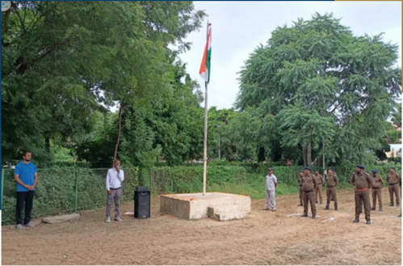

## Expert Lecture on Building Services

Basics of Electrical Services Date: 6 February 2025 Semester: 6 Participants: 28 Students An expert lecture on Basics of Electrical Services was delivered by Prof. Ashfaq M. Qureshi, Lecturer in Electrical Engineering, Government Polytechnic Palanpur. The session focused on fundamental electrical systems relevant to civil engineering, safety aspects, and coordination between civil and electrical services in buildings. The lecture enriched students' interdisciplinary understanding

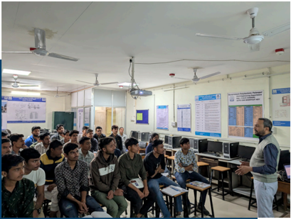

and practical awareness.

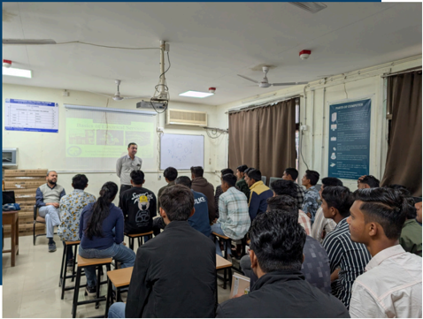

## Oath taking ceremoney

An Oath Taking Ceremony was organized to promote awareness on No Tobacco, Ek Bharat, Shreshtha Bharat, and Say No to Drugs. Students pledged  to  follow  healthy  habits,  avoid  addictions,  respect  national unity,  and  contribute  positively  towards  a  responsible  and  united society.

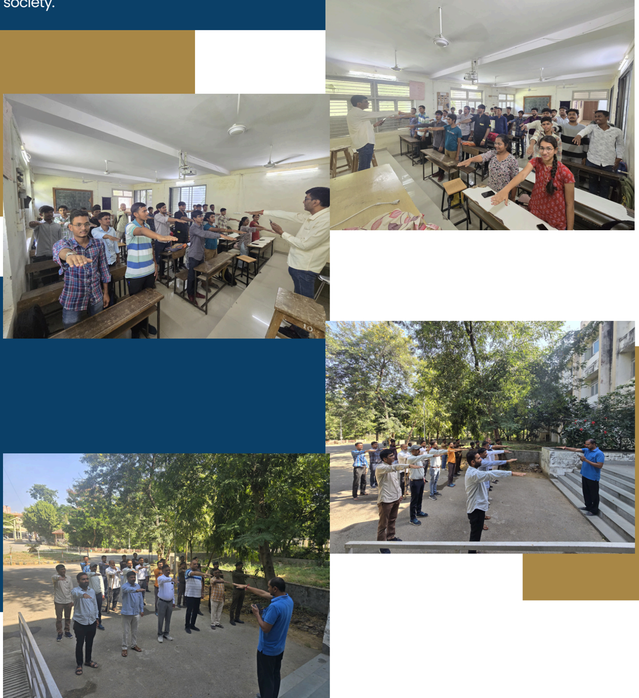

## Sports week 2025

Sports Week was organized in February 2025 to promote physical fitness, teamwork, and sportsmanship among students. Various indoor and outdoor games were conducted with active participation. The event encouraged a healthy lifestyle, discipline, and unity, making it enjoyable and motivating for all participants.

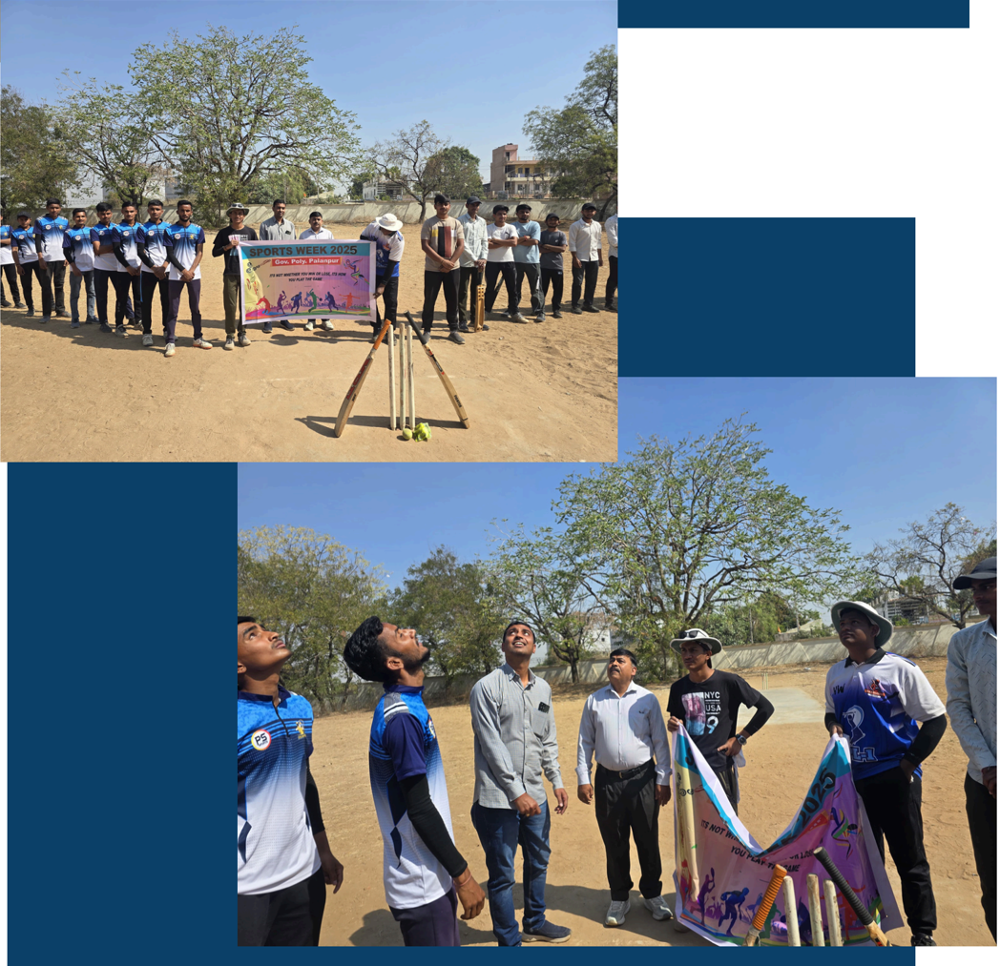

## Admission awareness program

A Diploma Admission Awareness Program was conducted on 17 february 2025 to inform students about diploma courses, eligibility, and career opportunities. The session guided students on admission procedures and encouraged them to pursue technical education for better future prospects.

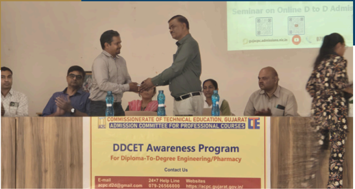

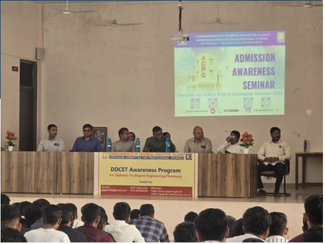

## Total Station training

A Total Station training program was conducted on 11-04-2025 to provide practical knowledge of modern surveying techniques. Students learned instrument handling, measurement procedures, and basic field applications, enhancing their practical skills and technical understanding.

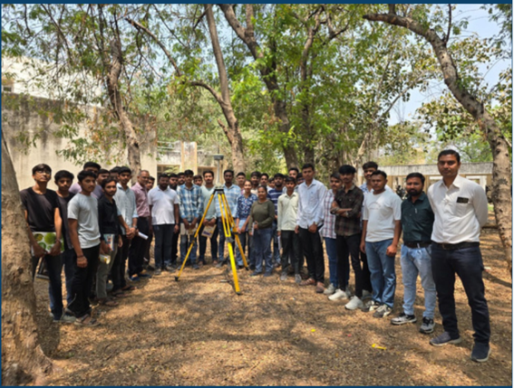

## INFRA NEWS

## Mumbai-Ahmedabad HighSpeed Rail (MAHSR) project

India's flagship Mumbai-Ahmedabad High-Speed Rail (MAHSR) project is rapidly taking shape,  with  construction  now  in  full  swing  across  both  Gujarat  and  Maharashtra.  The project is set to revolutionize travel between the two major economic hubs. 🚄

## Construction Milestones

In Gujarat, progress is visibly advanced. Over 315 kilometers of the elevated viaduct are now  in  place,  and  work  on  all  eight  high-speed  stations  is  nearing  completion.  The construction of complex river bridges, a critical part of the alignment, is also progressing ahead of schedule.

Meanwhile,  in  Maharashtra,  construction  has  gained  crucial  momentum  after  earlier delays. Work is now focused on the challenging 21-kilometer tunnel, which includes India's first  7-kilometer  undersea  rail  tunnel  at  Thane  Creek.  Excavation  for  the  underground station at Bandra-Kurla Complex (BKC) is also advancing well.

## Timeline and Impact

The National High Speed Rail Corporation Limited (NHSRCL) is targeting a trial run on the 50 km Surat-Bilimora stretch in Gujarat by 2026. The entire 508 km corridor is slated to be fully operational by 2029.

Once complete, the bullet train, using Japan's renowned Shinkansen technology, will cut the travel time between Mumbai and Ahmedabad from over six hours to just around two hours.

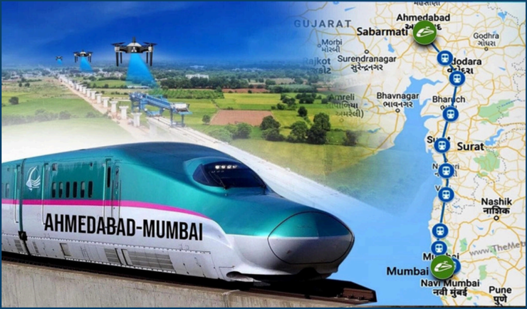

## A Symbol of Modern India: The New Parliament Building

## RAVAL JAIMIN D

(Sem 6 Diploma Civil Engineering)

## INFRA ARTICLE

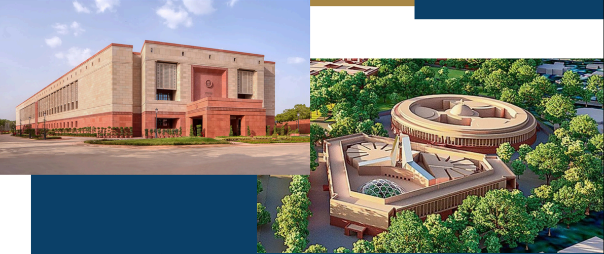

## Key Technical Details

- Structural System: It is a Reinforced Cement Concrete (RCC) framed structure. Its unique triangular shape provides significant rigidity and allows for efficient space planning.
- Seismic Design: Although located in Seismic Zone-IV, the building is engineered to withstand Zone-V earthquakes, the highest level of seismic activity in India. This is achieved  through  the  use  of  shear  walls  and  ductile  detailing  of  structural members.
- Large Span Roofs: The Lok Sabha and Rajya Sabha chambers are vast, columnfree spaces. This was made possible by a complex steel truss system for the roof, which transfers heavy loads to the main RCC frame.
- High-Performance Materials:
- Concrete: High-strength concrete grades (M40 and above).
- Steel:  Ductile,  high-strength  reinforcement  bars  (Fe  500D)  to  absorb  seismic energy.
- Facade: Red and white Dholpur sandstone, anchored to the main structure.
- Foundation: The building stands on a robust raft foundation to ensure stability and uniform load distribution on the soil.
- Sustainability &amp; Longevity: Designed for a lifespan of over 150 years, the building has a GRIHA-5 Star green rating, incorporating features like rainwater harvesting and energy-efficient systems.

|   Semester | Name of Student               |   Enrollment No |   SPI |
|------------|-------------------------------|-----------------|-------|
|          5 | KADIWALA AEJAZALI IMTIYAZALI  |    226260306034 |  8.85 |
|          3 | GOSWAMI PRINCEGIRI BHARATGIRI |    236260306029 |  9.8  |
|          1 | CHAUDHARY HITARTH DHANRAJBHAI |    246260306023 |  8.05 |

## Faculty Achievements

|   Sr No | Name of Faculty                     | Achievement                                                                   |
|---------|-------------------------------------|-------------------------------------------------------------------------------|
|       1 | H P Patel, F.A.Mukhi, N.V.Prajapati | Completed 8 Week MOOC on Interior Design at SWAYAM NPTEL                      |
|       2 | F.A.Mukhi                           | Completed 8 Week MOOC on Enhancing soft skill andPersonality  at SWAYAM NPTEL |
|       3 | A.R.Patel                           | Completed 8 Week MOOC on Training and developmenty  at SWAYAM NPTEL           |