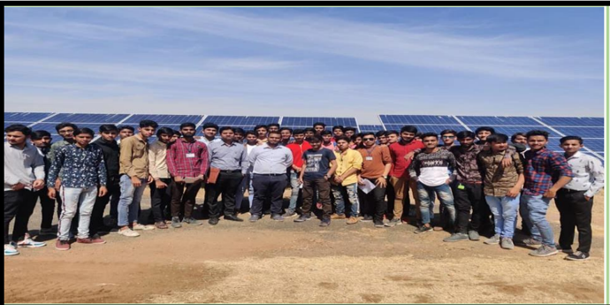

09-Mar-2020 Page

## SPARK (JULY-2020) -ISSUE-02

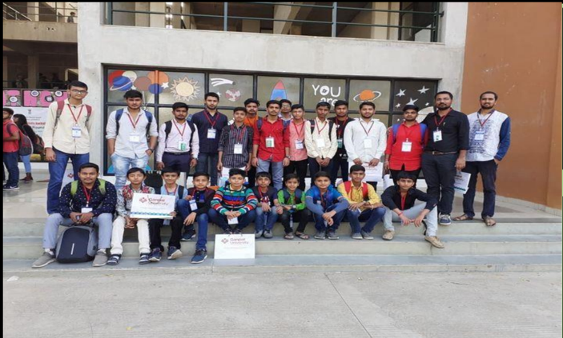

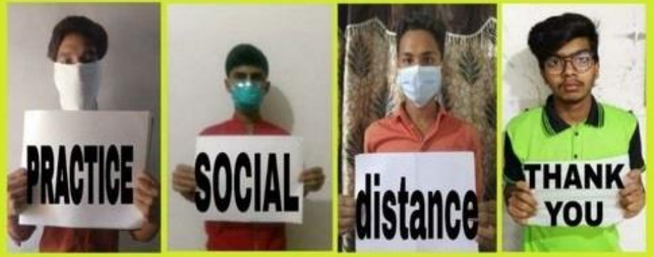

Glimpse of

Electrical Engineering

Department

Government Polytechnic,

Palanpur

Initiative of Electrical Engineering Department to create awareness among current students and all the stakeholder regarding various activities round the semester for the duration January-2020 to June-2020.

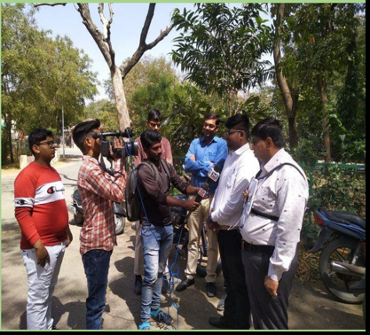

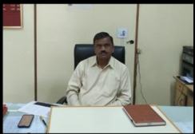

Shri S.D.Dabhi Principal Government Polytechnic Palanpur

## SPARK JULY-2020

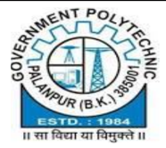

## Message from the Principal

I congratulate electrical engineering department on  publication  second  issue  of  newsletter  for  even term-2019.

The idea of newsletter is really worth in terms of spreading awareness about the vision and mission of the institute and department and also for communicating the developments of department to current  students,  their  parents,  alumni  and  other stakeholders.

Since March-2021, our education system is facing a drastic change in the methods of teaching and our faculty members are contributing their best to enrich the teaching learning process.

Students  are  facing  some  challenges  in  this online  education due  to their  remote location,  weak connectivity  of  internet  and  many  other  issues.  We assure them the best support from our faculty members to solve their difficulty.

The regular offline classes followed by online submission of term work shows the possibility of change in education methodology and I wish electrical engineering department success in their future endeavors.

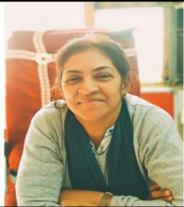

Smt. M.B.Shah Head Electrical Engineering Department

## SPARK JULY-2020

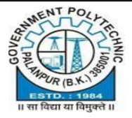

## Message from Head of Department

The 2 nd   issue  of  spark  is  little  bit  different from the first. We gave opportunity to our final year students to perform as editorial board for this issue. Faculty members mentored students throughout the process.

- I  congratulate  students  and  their  mentors  for their efforts under the constraints of social distance of COVID-19.
- I appreciate faculty members for their  efforts to  design  e-content  for  their  course  in  very  short notice  to  complete  curriculum,  It  was  our  first experience to arrange online term work submission and viva. I also appreciate 2019 batch students for showing their adaptability to the changing needs of time. It will help them in future.

We hope that we all will come out of this crisis of COVID-19 and we will have vaccine in near future, with all efforts of our scientist and government. I pray  for  success  of  our  students  in  their  future endeavors.

## MENTORS - EDITORIAL TEAM

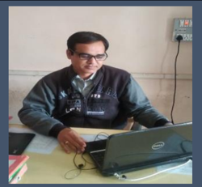

Ashok Patel

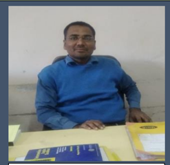

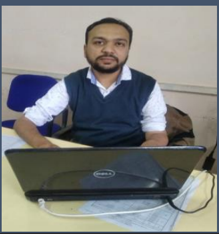

Ashfaq Qureshi

Brijesh Patel

We are thankful to our head of department for suggesting us an idea of student  editorial  team,  which  offers  one  platform  to  our  few  final  year students to test their skills of drafting, presenting and documentation of various events. It was also a new experience for our team to mentor students in different way.

We congratulate our student editorial team Nailesh, Viral and Wasim for their wonderful contribution and efforts.

## EDITORIAL TEAM

Wasim Manasia

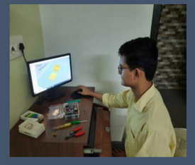

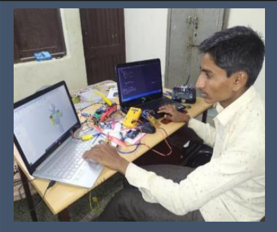

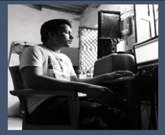

Nailesh Parmar

Viral Soni

We  are  thankful  to  our  mentors  to  guide  us  in  preparation  of  this newsletter. It was really a wonderful experience and proud for us to work as editorial board for spark.

We are also very thankful to our HOD for giving this opportunity to us.

## Industrial visit at 220 kV substation,

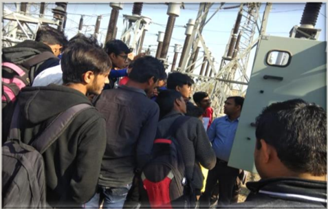

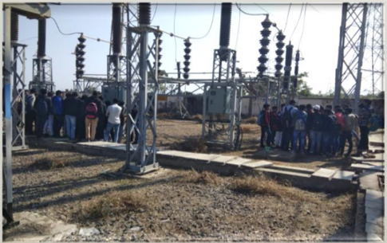

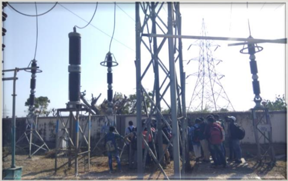

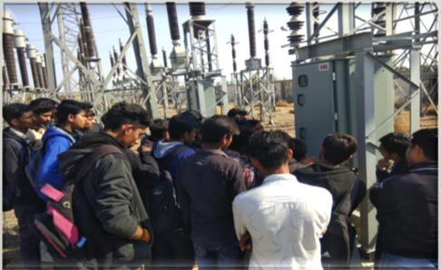

On 6 th  February, 2020 4 th  electrical visited 220 kV substation, Sadarpur. Shri R.P.Chavda and Shri A.V.Gajjar accompanied them in this indusrial visit.

Field experts very happily shared their experience with students and also answered all questions of the students.

Department is grateful to DE and field engineers of substation for their support and their readiness to help department in every possible manner.

## On campus 100 kW solar rooftop

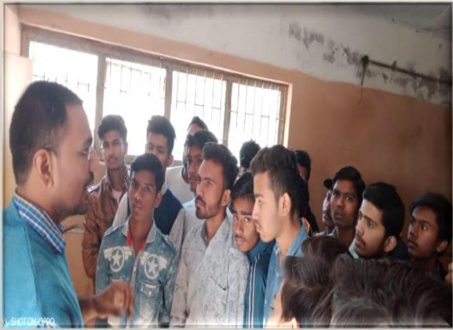

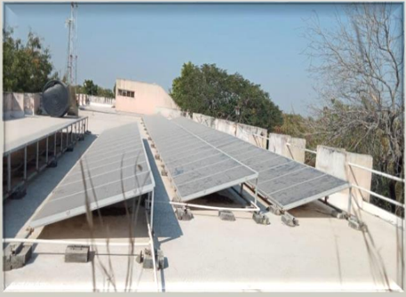

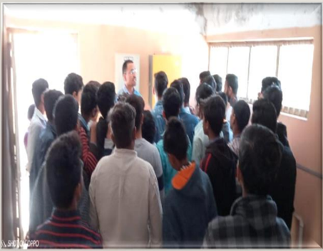

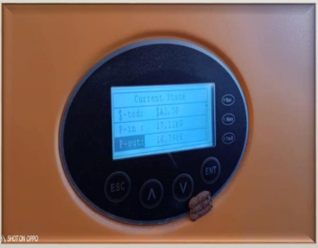

On 7 th  February, 2020 2 nd  electrical were taken to the round of on campus solar roof top by Shri B.M.Patel.

Students were given exposure to non-conventional energy sources and the installed capacity of solar panel on the campus and their working.

Such exposure, enhance the interest of students to see engineering around them and increase their observation capacity. It is also helpful to them to relate their curriculum with current trends.

## Industrial visit - Solar Power Plant Charanka

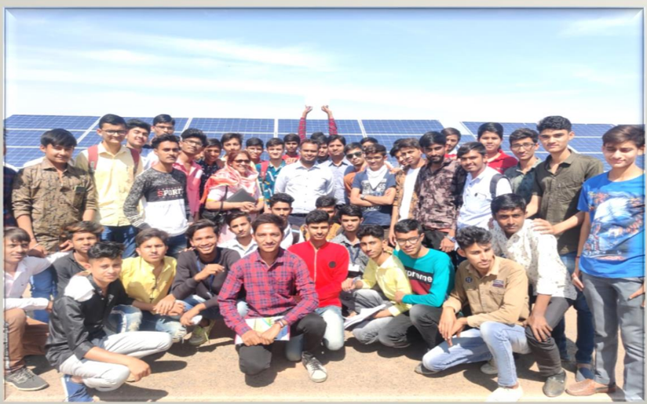

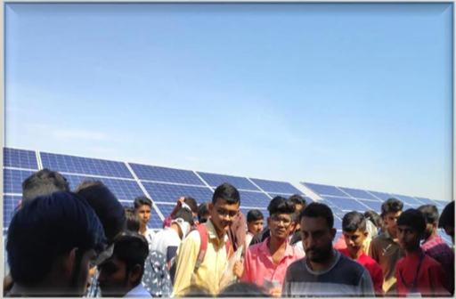

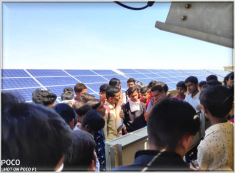

On 18 th  February, 2020 4 th  and 6 th  electrical were taken to the Industrial visit to Solar Power Plant, Charanka.

HOD  Smt.  M.B.Shah  along  with  Shri  H.R.Makwana  and  Shri  M.R.Patel accompanied students to guide them.

Gujarat is one of the first states to develop solar generation capacity in India.

As of 2020, total installed solar power generation capacity of the state is 3,273 MW.

## Hackathon 19-20 @ Ganpat Univeristy

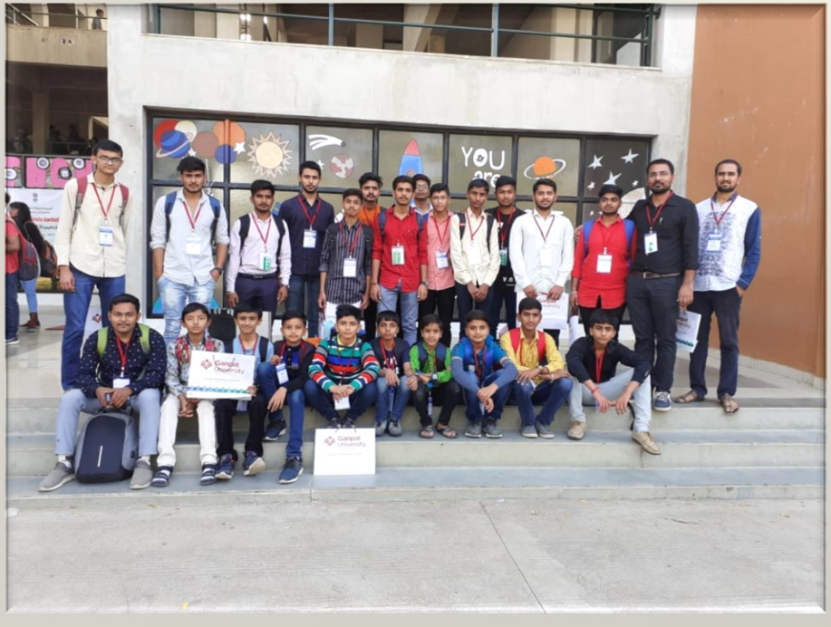

On 19-20 February, 2020 the group of electrical students were taken to Ganpat University to participate in state level HACKATHON.

The event was coordinated by Shri B.M.Patel , Shri P.K. Bhavsar and their SSIP mentor Shri Hiten Patel,

The performance of many groups were appreciated by experts over there and we are expecting some winning price for few of them.

## Let's think innovative

13-Apr-2020

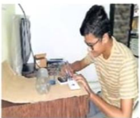

06-Apr-2020

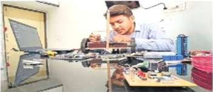

ele

84

214

42l asal

48a aa

4l&lt; 42 Rle 430

09-Mar-2020

1

50{2 362y2

2 50 {2

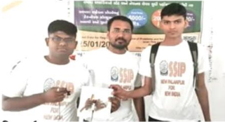

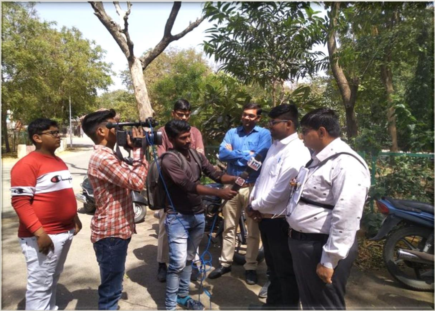

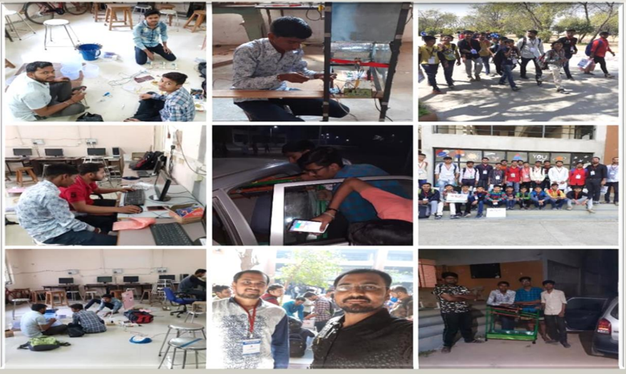

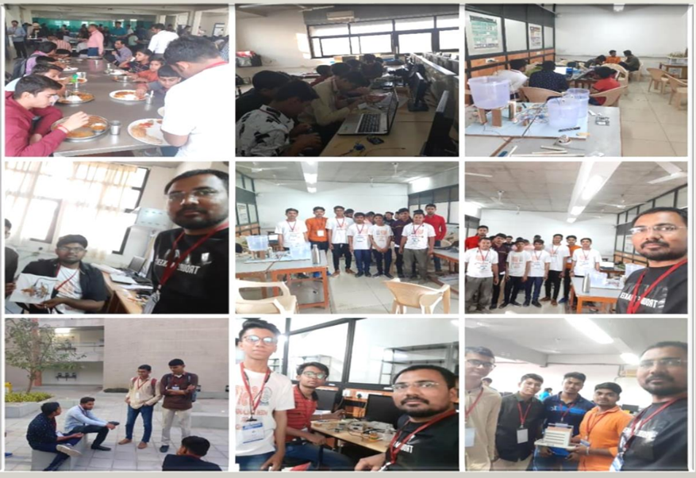

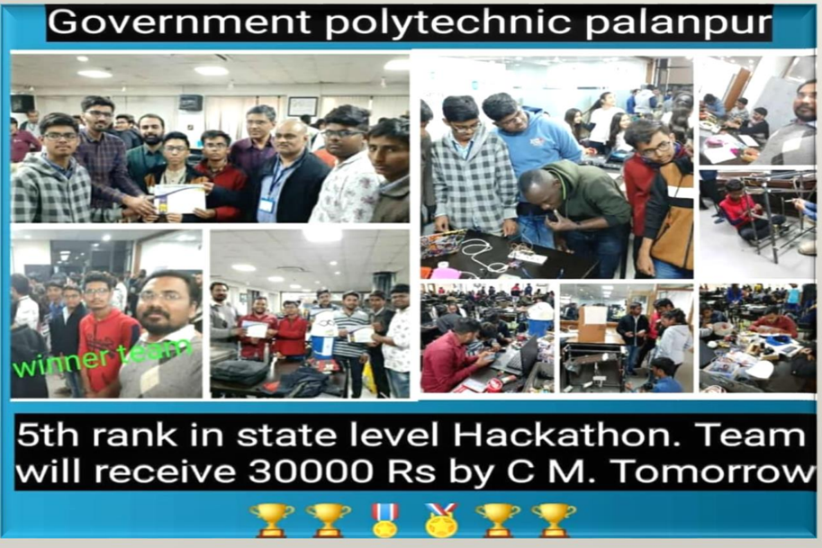

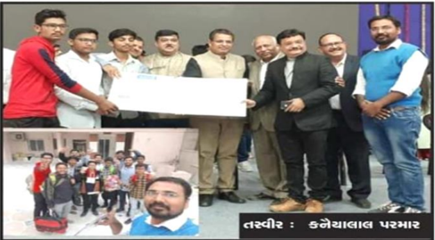

4144 Ja a2

2020 2u 2 . "286-2

"2hl2

444 2212244

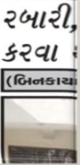

## Entrepreneur Alumni

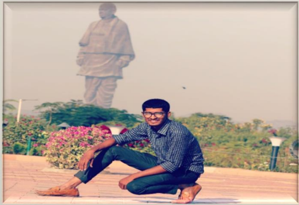

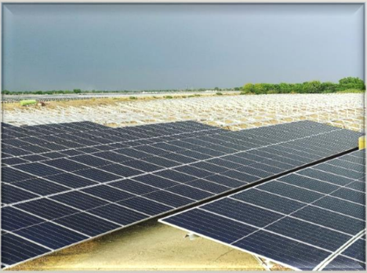

|                          | Type of Enterprise       | Micro                    | ISmall                   | Medium                   |                          |
|--------------------------|--------------------------|--------------------------|--------------------------|--------------------------|--------------------------|
|                          | Manufacturing            |                          |                          |                          |                          |
|                          | [Services                |                          |                          |                          |                          |
|                          |                          | 6J3300001193             | 6J3300001193             | 6J3300001193             |                          |
| Udyog Aadhaar Memorandum | Udyog Aadhaar Memorandum | Udyog Aadhaar Memorandum | Udyog Aadhaar Memorandum | Udyog Aadhaar Memorandum | Udyog Aadhaar Memorandum |

We congratulate our pass out student and alumni Kirtan for registration his firm under MSME. We wish success to his future endeavors.

Such entrepreneurs will raise the job opportunities for fresher in the market and we are committed to produce more such entrepreneurs.

## Alumni @ campus

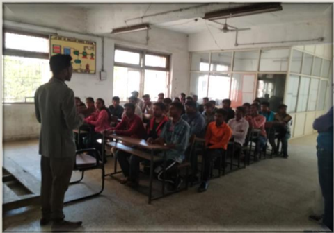

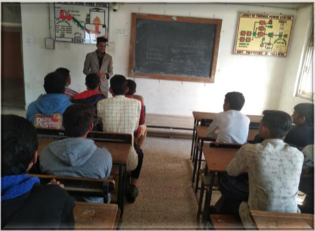

Our  alumni  Hardik  Makwana  was  invited  to  talk  with  our  final  year students. Hardik is 2017 pass out and currently working with Torrent Power, Ahmedabad as Junior Executive.

He shared his memories at college with students and also advised students about do's and don'ts at college. Hardik also explained about his job profile and responsibilities, which was a peak interest for the students during the talk.

Hardik also solved some queries and answered many questions of final year students.

Electrical Engineering Department is determined to produce the best and compatible candidates for the industry and we are always working to achieve our goal.

## Contribution to Society

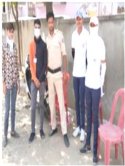

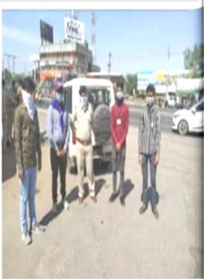

4144 4èq 4

min read

6 hours ago C Jeegna Davda

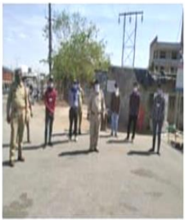

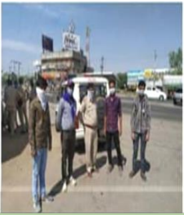

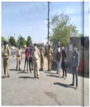

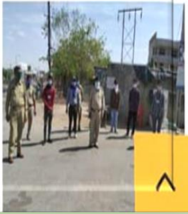

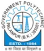

## GOVERNMENT POLYTECHNIC, PALANPUR ELECTRICAL ENGINEERING DEPARTMENT

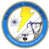

## Institute Vision

To produce competent diploma engineers as per need of Industries   and entrepreneurs   with ethical values.

## Department Vision

## Institute Mission

- Industry oriented technical education .

Government Polytechnic, Palanpur strives to impart,

- Excellent teaching and learning environment.
- Promote entrepreneurship activities.
- Continual growth in every core human values. sphere

To provide quality education in the field of Electrical Engineering to produce competent   engineers that meet industry requirements with societal and environmental concern:.

## Department Mission

- To provide them a platform for developing new products that can help industry and society as a whole.
- Prepare the students with strong fundamental concepts and problem skills to enhance their employability in the industries. solving
- Promote leadership and entrepreneurship skills in a student through various projects, co-curriculum, extra-curriculum events.
- Imbibe   social awareness and   responsibility in   students to serve the society and protect environment

For any queries and suggestion ABOUT 'SPARK' please do write to us: Electrical engineering department Government polytechnic, Palanpur Outside malan gate, Palanpur Email- id: gppelect09@gmail.com FACEBOOK PAGE: https://www.facebook.com/Gppelect09