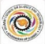

## Electrical Engineering Department Government Polytechnic, Palanpur organizes

GUJCOST Sponsored One Week Online FDP On

## "Tools and Trends in Online Education System"

Outside Malan Palanpur-385001 http:llwww.gpPP.cteguj-in/ Gate,

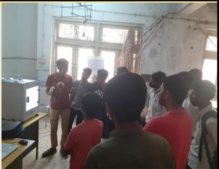

## SPARK (JULY-2021) -ISSUE-03

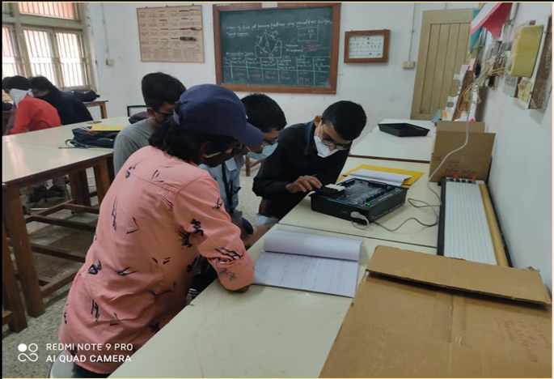

Glimpse of Electrical Engineering Department Government Polytechnic, Palanpur

05-04-2021

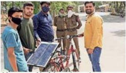

Initiative of Electrical Engineering Department to create awareness among current students and all the stakeholder regarding various activities round the semester for the duration July-20 to June-21.

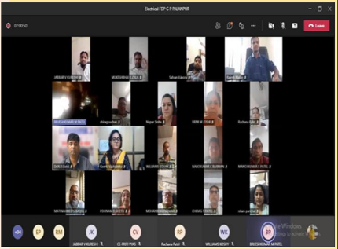

0

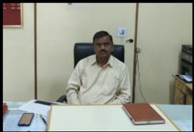

Shri S.D.Dabhi Principal Government Polytechnic Palanpur

## SPARK JULY-2020

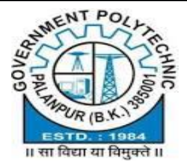

## Message from the Principal

I congratulate our electrical engineering department on publication of its newsletter SPARK in July-2021.

The academics for this year followed the pattern of  last  few  months  and  students  have  matched  their frequency with online education system.

Our three core branches, Electrical, Mechanical and Civil have applied for accreditation for the year 2019-20, and they are waiting for NBA team.

Civil and mechanical maintenance is going on in the main building to enhance infrastructural facility to benefit our students and in order to provide them a good learning atmosphere.

For the odd semester, departments also conducted offline  practical  sessions  with  all  precautionary measures of COVID\_19. The offline and online examinations were smoothly conducted as per the guidelines of the university.

Students  also  participated  in  placement  fair organized at Government Engineering College, Palanpur in February-2021.

Various institute level events have been organized in online and offline mode by SSIP Cell.

The  institute  has  also  3  published  patents  in last  few  months  under  SSIP  Cell.  I  would  like  to congratulate  electrical  engineering  department  for conducting GUJCOST sponsored online FDP on 'Tool and Trends in Online Education System', in March-2021.

1 I also appreciate the consistent efforts of team Electrical  for  the  newsletter  and  also  for  their contribution in the growth of the institute.

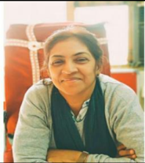

Smt. M.B.Shah Head Electrical Engineering Department

## SPARK JULY-2020

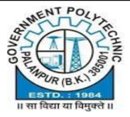

## Message from Head of Department

In this issue of SPARK, we are continuing with our  tradition  to  assign  our  bright  students  the responsibility of editorial team. Our fifth semester students Vishal, Hasmukh and Hasan Ali have put their efforts to make this newsletter meaningful and interesting. I congratulate them for their efforts.

This year our department has a new look due to extensive civil and electrical R&amp;B maintenance work. We encourage our students to take maximum benefit of our existing facilities at the department like Department Library, Project Prototype Display Room, EContent developed by our faculty members.

Although major span of the last year, teaching was conducted through online mode, I appreciate our students for participating in online activities. All three published patents have applicants of our department.

Kudos to Electrical Department and SSIP Cell!!!

We  also  conducted  a  GUJCOST  sponsored,  state level  online  faculty  development  program,  in  which more  than  50  faculty  members  had  participated  and experts from reputed institute delivered sessions.

We  are  keen  to  start  our  academics  in  offline mode with our added experience of online education to enrich the quality of teaching learning process.

I wish all the students of the department success in their future endeavors.

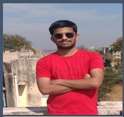

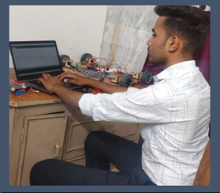

## EDITORIAL TEAM

Vishal Suthar

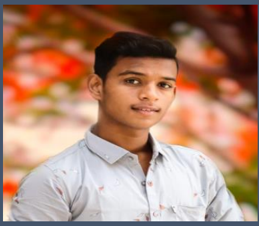

Hasmukh Prajapati

Hasanali Solanki

We are thankful to our department for giving this opportunity to us as editorial team. It was a very good experience to collect data from faculty members and students and represent data in best possible format.

We are also thankful to our mentors for guiding us and also to our seniors Wasim,  Nailesh  and  Viral  for  sharing  their  experiences  to  make  this  task successful.

## MENTORS - EDITORIAL TEAM

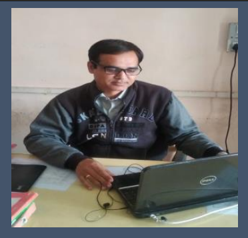

Ashok Patel

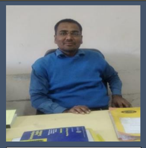

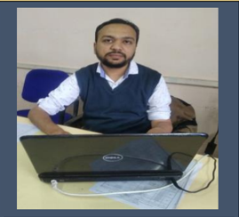

Ashfaq Qureshi

Brijesh Patel

This  time,  we  are  acting  as  bridge  between  two  editorial  teams.  The current editorial team is taking inputs from previous team and we are providing data to the team. This method will enhance extra skills in our students and give them a professional experience.

We appreciate our new editorial team, Vishal, Hasmukh and Hasan Ali for their wonderful efforts in making this newsletter simple and interesting.

## Faculties to their new place

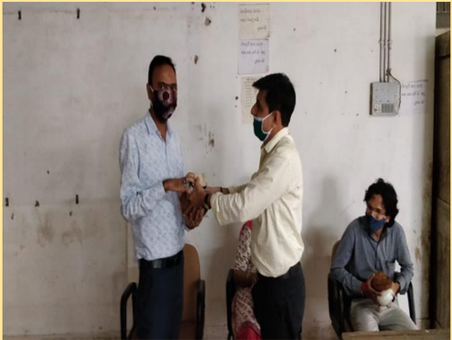

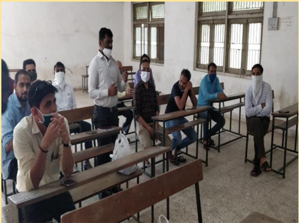

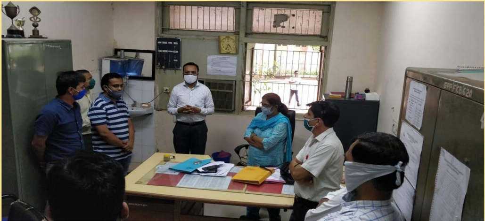

Three faculty members were transferred to the other institutes. Our best wishes to them for their teaching jobs at their new places.

1. Shri A.R.Nijanandi - Government Polytechnic, Himatnagar
2. Shri H.R.Makwana - C.U.Shah Polytechnic, Surendranagar
3. Shri N.A.Sunasara - C.U.Shah Polytechnic, Surendranagar

Electrical engineering department is thankful to them for their contribution to academics well as in the department and the institute.

## Offline laboratory conduction

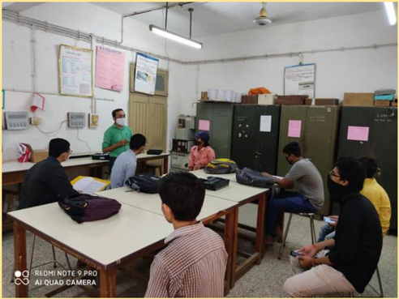

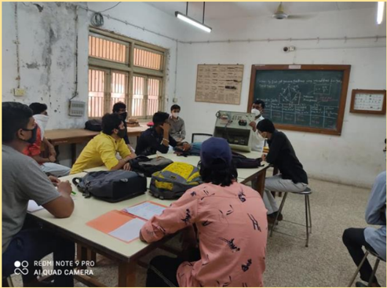

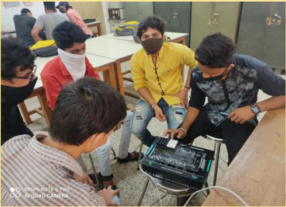

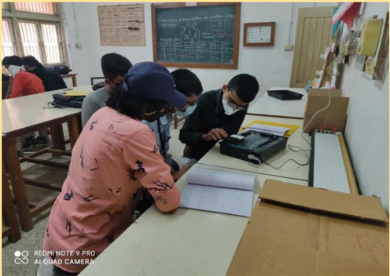

Engineering education is not possible without practical sessions. As per the university guidelines, we arranged practical sessions in final year to provide our students hands on practices with all precautions of COVID-19.

Students  of  nearby  area  enthusiastically  participated  in  practical sessions and for the students, who could not attend this sessions, we have shared video for practical sessions also.

y

## GUJCOST sponsored online FDP

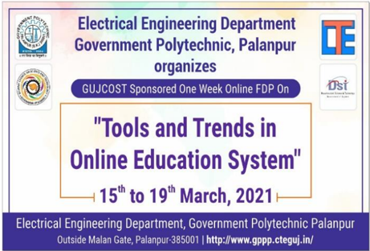

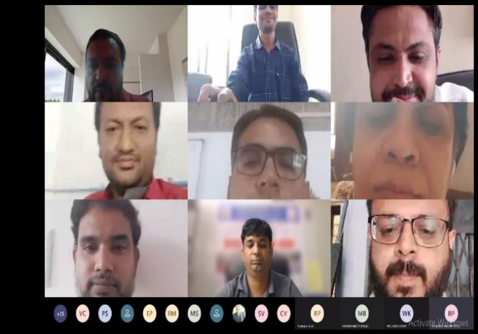

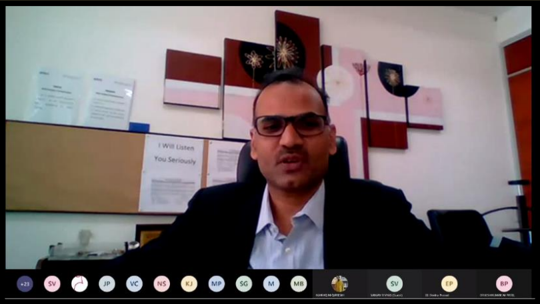

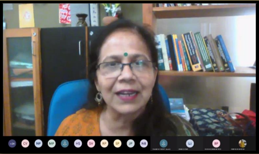

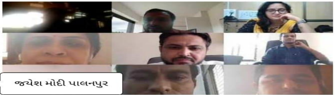

l 6l2

dlu 202 9 2 03/202 9 % 2

2i22ll226-2

## Participation in SSIP events

4%2 24 4uai

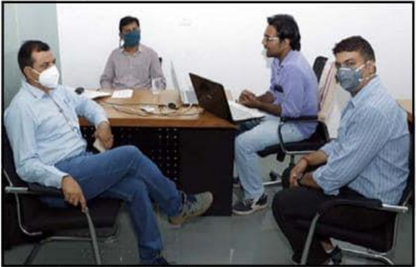

424,

Institute level SSIP coordinator and faculty of our department Shri B.M.Patel was invited to deliver session  on  'Startup  and  Innovation'  at  Dantiwada Agricultural University.

A  large  number  of  students  and  faculty members from state participated in the webinar.

30 students from our department participated in iDEAthon organized by SSIP Cell.

SSIP\_CELL,\_G P Palanpur 'Knowledge power "New Palanpur for New India'

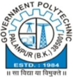

ea2l INNOVATION

ysti

Dpen for 11.00 a.m. to 12.30 p.m.

Brinda Thakkar

Digutal Creator

Or visit www gppp ctegujin Last Date for Registration 17/08/2020 All participants will get participation certificate. For Support contact us: ssipgppalanpur@gmail com.

Students were motivated  in  inaugural program.

' હ્રદયથી Innovation' session was delivered by Ms. Brinda Thakkar.

7

## Participation in SSIP events

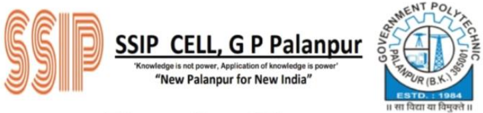

4  students  from  our department participated in 'Toys for change' organized by SSIP Cell.

## Ioys for Change

Search

The aim of this program was to bring out the hidden talent of students.

Winners!

SCHOOL

COLLEGE

Built

1000 -

500 -

500 -

- Share

Image or video of model made by You

Students from different schools and departments participated in the event.

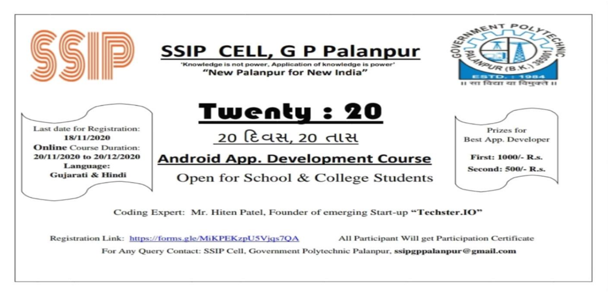

5  students  from  our  department  participated  in 'Twenty:20' Android app development course.

8 Shri Hiten Patel provided his services as an expert for this course.

## Participation in SSIP events

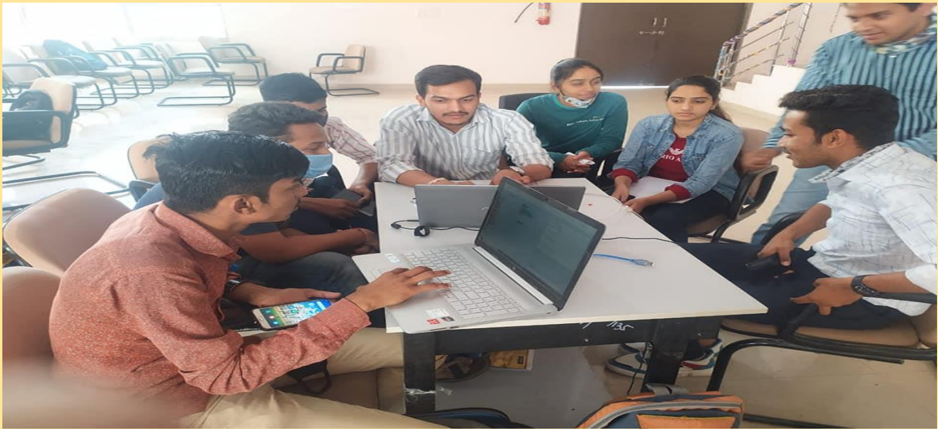

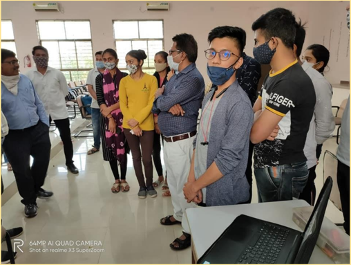

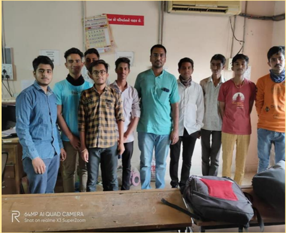

Students from our department participated in 'Boot Camp'  organized  in  March-2021.  Students  from  outside colleges also participated in the event.

Shri Hiten Patel provided his services as an expert for this course.

## Participation in SSIP events

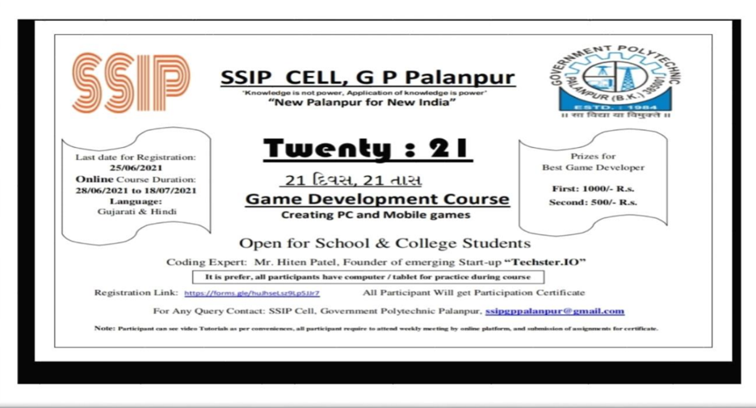

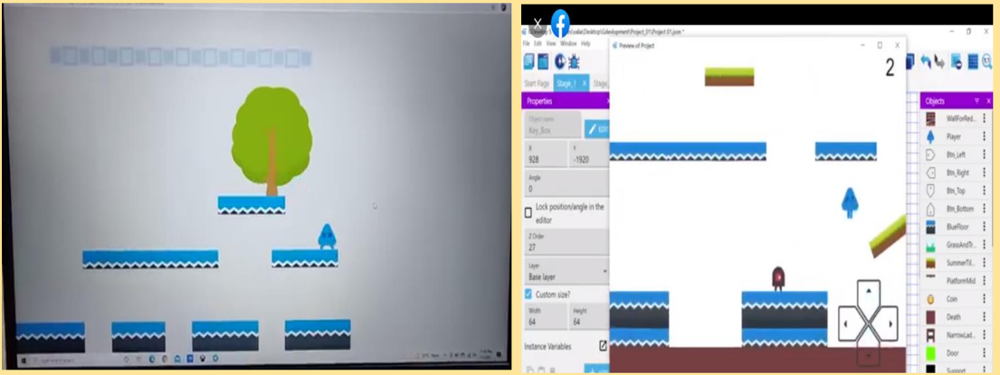

Students from our department participated in 'Game Development Course' starting from June-2021, which is to be completed in 21 days.

Shri Hiten Patel provided his services as an expert for this course.

## Installation of 3-D printer at campus

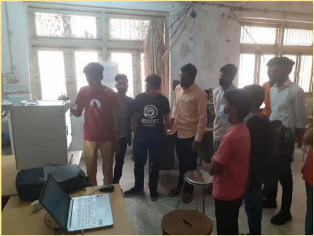

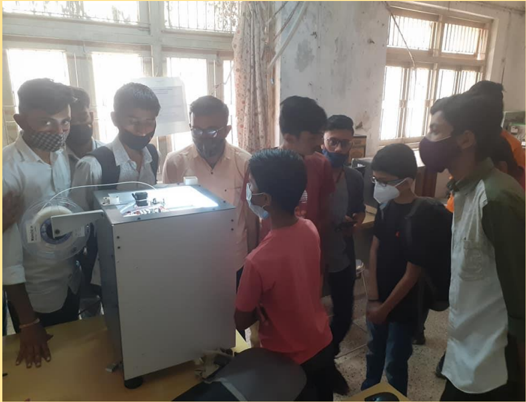

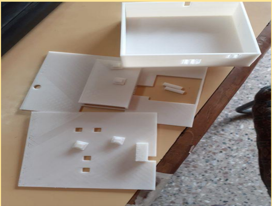

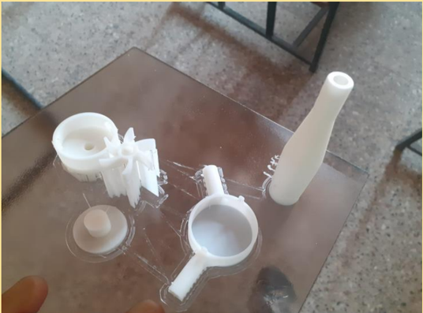

3-D  printer  facility  was  created  under  SSIP,  to enrich the quality of prototypes. Students from our as well as other department have enthusiastically made use of this facility and various prototypes have been created with the help of 3-D printer.

## We appreciate our star students

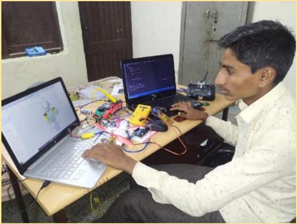

Parmar Nailesh

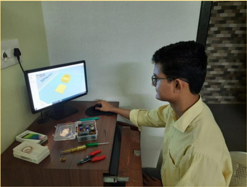

Mansiya Wasim

Department  appreciate  both  Nailesh  and  Wasim,  for their extraordinary performance throughout their diploma. They both performed well in only GTU examination,  but  also  in  other  areas  of  engineering education.

They successfully published 3 patents and contributed as inventor. The patent titles are:

1. Smart Rotary Switchboard
2. Wallpaper Switchboard
3. Water Tap Alarm

Both students successfully created many projects with SSIP funding, which would be useful to society.

## Projects for societal benefit

05-04-2021

44

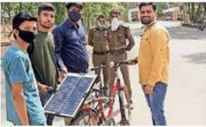

31514 8

eoacer

## Auto Street Light Control

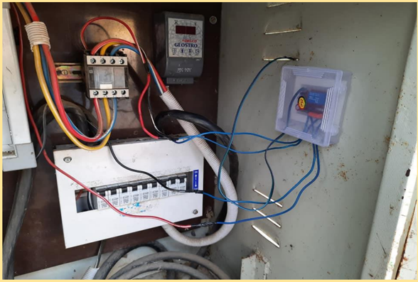

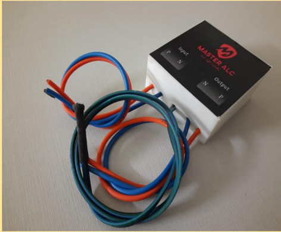

6 th   semester  student  Manasia  Wasim  had  Identified problem that the current device used is time based in which timer is used to ON &amp; OFF Street light, which work on base of set time.

There was a problem in winter when sunset earlier than summer, so the time is to change at every season.

13 So, he made product named Master ALC. The LDR sensor is used to sense the intensity of light and when sunset the  street  light  ON,  similarly  it  OFF  when  Sunrise. Moreover, it can be used in Shopping malls, Shops etc.

It is cheaper about ₹300/- cost per product.

6421,

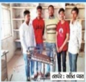

## Providing efficient candidates to industry

## Power

|   Sr. No | Full Name                           |   Pass out Year |
|----------|-------------------------------------|-----------------|
|        1 | Parmar Love H.                      |            2021 |
|        2 | Nai Ronak Shankar Bhai              |            2021 |
|        3 | Raval Jay                           |            2021 |
|        4 | Prajapati Kamlesh Prakashbhai       |            2021 |
|        5 | Mamuda Ronak                        |            2021 |
|        6 | Soni Hiren Pravinbhai               |            2021 |
|        7 | Patel Nikul Dineshbhai              |            2021 |
|        8 | Chauhan Chiragbhai Babubhai         |            2021 |
|        9 | Chaudhary Shailesh Bhai Ravji  Bhai |            2021 |
|       10 | Prajapati Ashishkumar               |            2021 |
|       12 | Prajapati Jagdish                   |            2021 |
|       13 | Lavya Padhiyar                      |            2021 |
|       14 | Chaudhary Jitendra                  |            2021 |
|       15 | Rajgor Jaydevbhai                   |            2020 |
|       11 | Kishankumar Suthar                  |            2019 |
|       16 | Patel Ketul                         |            2019 |
|       17 | Patel Maulik                        |            2019 |

|   Sr. No | Full Name                        |   Pass out Year |
|----------|----------------------------------|-----------------|
|        1 | SONI VIRALKUMAR  CHANDRAKANTBHAI |            2021 |

## Providing efficient candidates to industry

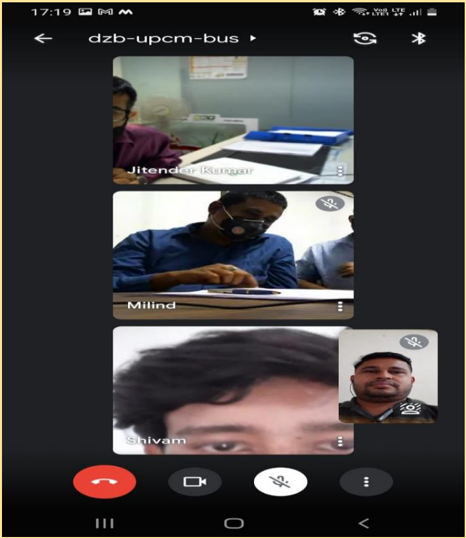

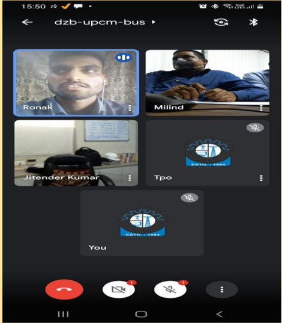

Online interview was conducted by BKT Tyre and  45 students of institute had appeared for the interview. In this interview,4 students from electrical department got selected under difficult conditions posed by COVID-19.

|   Sr. No | Full Name                 |   Pass out Year |
|----------|---------------------------|-----------------|
|        1 | Parmar Love H.            |            2021 |
|        2 | Nai Ronak Shankar Bhai    |            2021 |
|        3 | Madora Shivam Nareshbhai  |            2021 |
|        4 | Ilasariya Soham Rajnikant |            2021 |

## Providing efficient candidates to industry

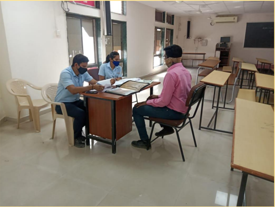

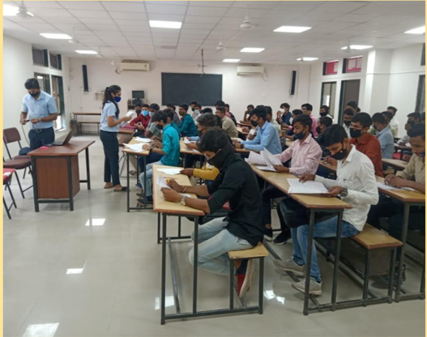

In the month of February, placement fair was organized by Education department at GEC, Palanpur.

Total  35  students  of  electrical  department  were selected in the placement fair.

## Department Vision:

To  provide  quality  education  in  the  field  of  Electrical  Engineering  to produce  competent  engineers  that  meet  industry  requirements  with societal and environmental concern.

## Department Mission:

- Prepare the students with strong fundamental concepts and problem solving skills to enhance their employability in the industries.
- To provide them a platform for developing new products that can help industry and society as a whole.
- Promote leadership and entrepreneurship skills in students through various projects, co-curricular, extra-curricular events.
- Imbibe social awareness and responsibility in students to serve the society and protect environment.

## Program Educational Objectives (PEOs):

1. Apply the knowledge of electrical engineering to solve problems of industrial and social relevance.
2. Pursue higher education and adopt to changing professional needs and engage   in lifelong learning.
3. Be professional with leadership qualities, ethics, moral values and work efficiently in a team.
4. Fulfill social and economical commitments by entrepreneurial spirit.

## Department Vision:

સામાજીક અને પર્ાાવરણલક્ષી અભિગમ સાથે ઇન્ડસ્ટ્રીની જરૂરરર્ાત મુજબ, ઇલેક્ટ્રીકલ  ઇજનેરીનાાં  ક્ષેત્રમાાં  કાબેલ  ઇજનેર  બનાવવાાં  સારુાં  ઉચ્ચ  ગુણવત્તાસિર શિક્ષણ આપવુાં.

## Department Mission:

- ઇન્ડસ્ટ્રીમાાં  રોજગારીની તક વધારવાાં માટે, મજબ ૂ ત મ ૂ ળભ ૂ ત શસધધાાંતો સાથે અને સમસ્ટ્ર્ા ઉકેલવાની િક્ક્ટ્ત ધરાવતાાં શવધાથીઓ તૈર્ાર કરવાાં.
- ઇન્ડસ્ટ્રી  અને  સમાજને  મદદ  કરી  િકે  તેવાાં  ઉત્પાદનો  શવકસાવવા  સારુાં શવધાથીઓને માંચ આપવુાં.
- જુદા-જુદા  પ્રોજેક્ટ્્સ,  સહ-અભ્ર્ાસ  અને  ઇત્તર  પ્રવ્રૃશત્ત  વડે  શવધર્ાથીઓમાાં નેતૃ ત્વ અને ઉદ્યોગ-સાહશસકતાની કુિળતાાં શવકસાવવી.
- શવધાથીઓ સમાજની સેવા અને પર્ાાવરણની રક્ષા કરે એ હેતુથી, તેમને સામાજજક જાગૃકતાાં અને જવાબદારી સાથે આત્મસાત્ત કરવાાં.

## Program Educational Objectives (PEOs):

1. ઇન્ડસ્ટ્રી  અને  સમાજને  લગતાાં  પ્રશ્નોનાાં  ઉકેલ  માટે  ઇલેક્ટ્રીકલ  ઇજનેરીનાાં જ્ઞાનનો ઊપર્ોગ કરવો.
2. ઉચ્ચ અભ્ર્ાસ મેળવવો અને રોજગારીની બદલાતી માાંગ ને અપનાવવુાં અને જીવનિર િીખતાાં રહેવુાં.
3. નેતૃ ત્વ, નીશત, નૈશતક મુલ્ર્ો સિર અને કાર્ાક્ષમ રીતે સાંઘિાવનાાં સાથે કાર્ા કરી િકે, એવા વર્વસાર્ી બનવુાં.
4. ઉદ્યોગ-સાહશસકતાની િાવનાાં સાથે સામાજજક અને આશથિક પ્રશતબધધતાાં પુરી કરવી.

For any queries and suggestion ABOUT 'SPARK' please do write to us: Electrical engineering department Government polytechnic, Palanpur Outside malan gate, Palanpur Website: http://www.gppp.cteguj.in/ Email- id: gppelect09@gmail.com FACEBOOK PAGE: https://www.facebook.com/Gppelect09