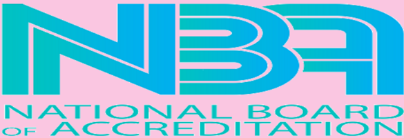

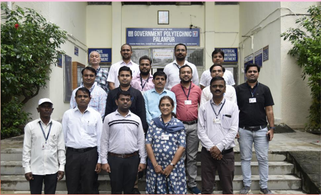

## SPARK (JULY-2022)

ISSUE-04

An initiative of Electrical Engineering Department to create awareness among current  students  and  all  the stakeholders  about  various  activities around  the  year,  from  July-2021  to June-2022.

Glimpse of Electrical Engineering Department, Government Polytechnic, Palanpur

DELL

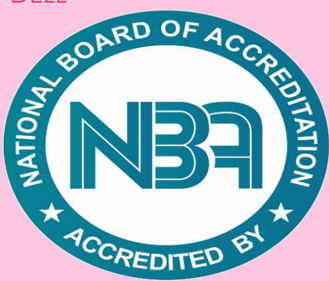

## A message from the Principal

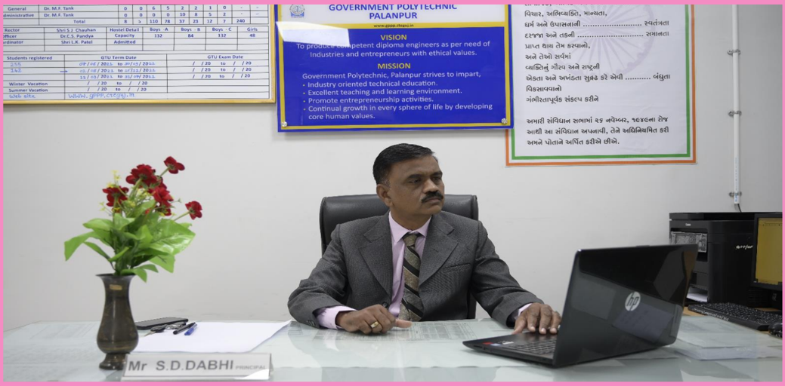

It is a matter of pride for our institute that our three programs -Electrical Engineering , Mechanical Engineering and Civil Engineering are accredited by National Board of Accreditation (NBA) up to July2024. I appreciate all HODs , our faculty members and staff members for their dedication , efforts and contribution throughout the process of accreditation.

I congratulate HOD Electrical and her team for having secure the highest score among all accredited programs.

We are back to offline education and campus is again in vibrant mode.

- It  is  the  responsibility  of  all  HODs  and  faculty  members  to continuously  enhance  the  teaching  learning  process  and  execute student centric learning and OBE and to maintain the peak achieved after getting NBA accreditation.
- I congratulate the department on publishing the fourth issue of 'SPARK' . I admire their perseverance and constant efforts to spread awareness of their activities in their stakeholders in such a nice way.

My best wishes to the department in their future endeavours.

## A message from Head of the Department

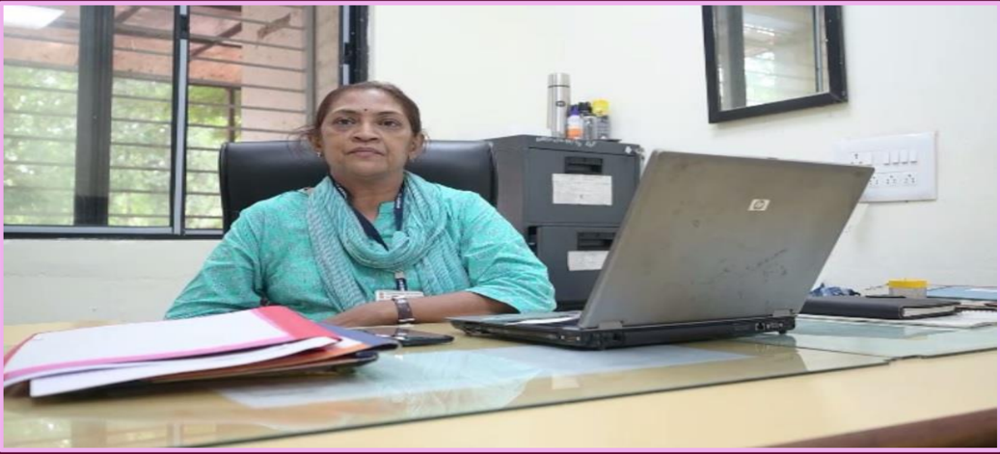

I congratulate all the faculty members and students for the NBA accreditation up to June-2024.We are also thankful to DTE-Gujarat , our  Principal , Mentor , NBA coordinator  and  committee  members  for their guidance throughout the process.

Now , it  is  our  responsibility  to  maintain  and  enrich  the quality  of  teaching-learning  process  towards  the  benefit  of  our students and overall education system.

After COVID , our offline laboratory and lecture sessions are being conducted by faculty members , and we are committed to impart OBE philosophy  to  our  students  and  achieve  program  outcome  set  by National Board of Accreditation.

We have also arranged industrial visits for our final and prefinal students to impart an awareness about technology and culture of the industry , which was not possible during COVID.

And last but not least , some of our students got placed in reputed industry  like  Torrent  Power  and  Arecler  Mittal  and  some  secured admission in institutes like L.D for graduation.

I  wish  all  of  my  students  grand  success  in  their  future endeavours.

M.B.Shah (HOD-Electrical)

## EDITORIAL TEAM

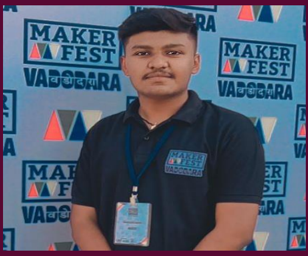

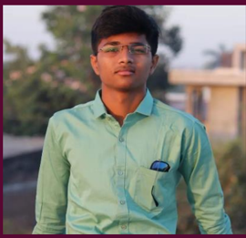

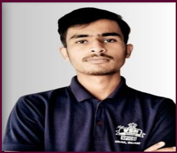

Rahulsinh Dodiya

Jitu Suthar

Rishabh Prajapati

We are thankful to our department for giving us this opportunity to  contribute as editorial team. It was a good experience to collect data from faculty members and students, and to represent data in best possible format.

We are also thankful to our mentors for guiding us and to our seniors Vishal, Hasmukh and Hasan Ali for sharing their experiences to make this task successful.

## MENTORS - EDITORIAL TEAM

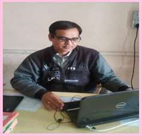

A.R.Patel

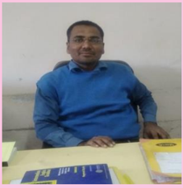

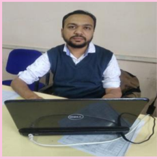

A.M.Qureshi

B.M.Patel

This time, we are acting as a bridge between two editorial teams. The current editorial team is taking inputs from previous team and we are providing data to the team. This method will enhance extra skills in our students and give them a professional experience.

We appreciate our new editorial team, Rahul, Jitu and Rishabh for  their  wonderful  efforts  in  making  this  newsletter  simple , yet interesting.

## Teamwork in NBA Accreditation

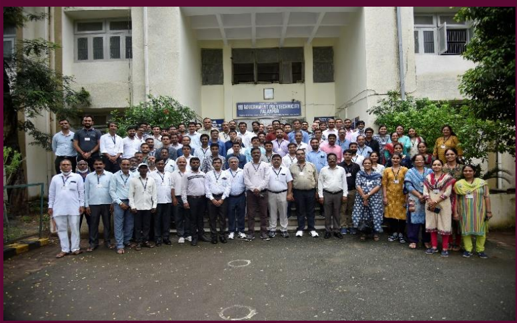

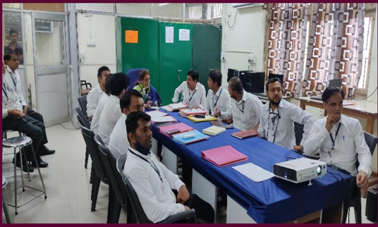

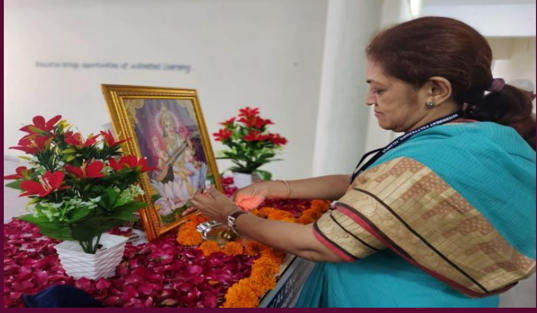

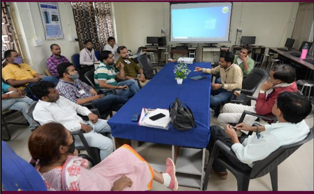

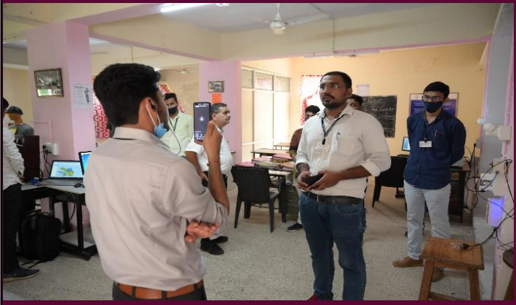

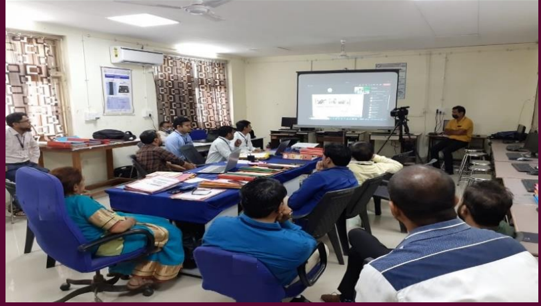

NBA inspection was carried out from 24 th  to 25 th  September,2021. A great quality of teamwork was observed across the institute as well as department. All the faculty members contributed in their criteria and overall representation of the department.

The  inspection  was  conducted  in  an  'online  mode'  through  video conference and the team represented department quite well.

It is a matter of pride that our department secured 690 marks out of 1000 , which is highest among all accredited programs of the institute.

## Offline academic activities

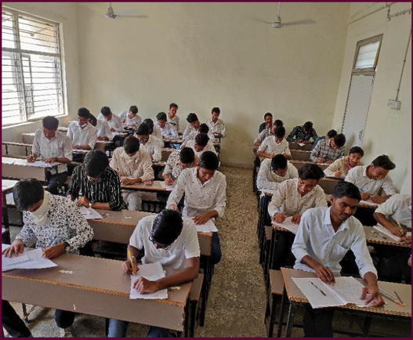

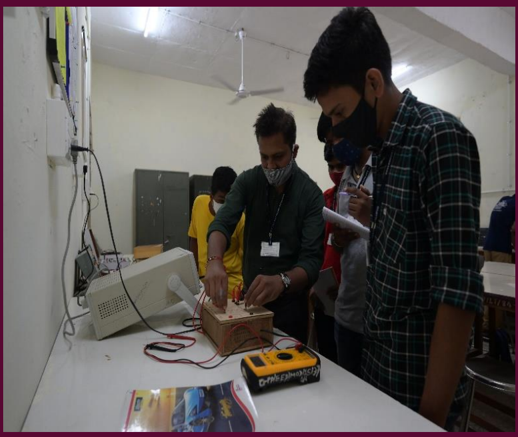

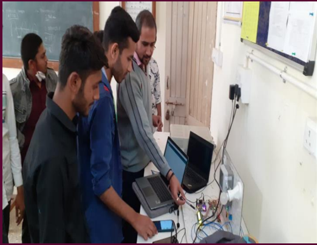

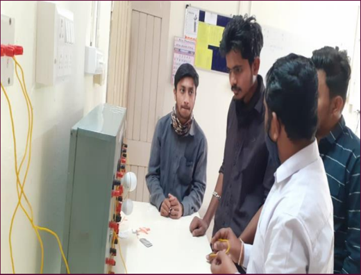

Regular laboratory and lecture sessions , progressive assessment test-2 were re-initiated after relaxation in COVID protocols. Engineering is about practice. Laboratory practicals and projects are the best way to realize the learning in classroom.

Students were guided by project coordinator and their guides to make their project the best application of their classroom learning , while also ensuring the projects were applicable and useful in industry.

After many online examinations , students experienced the thrill of offline theory and practical examination. Faculty members guided and motivated students to enrich their practical knowledge and skills.

## Social Contribution

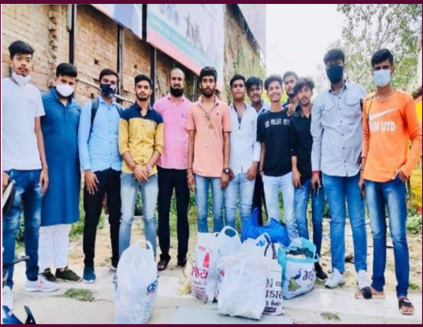

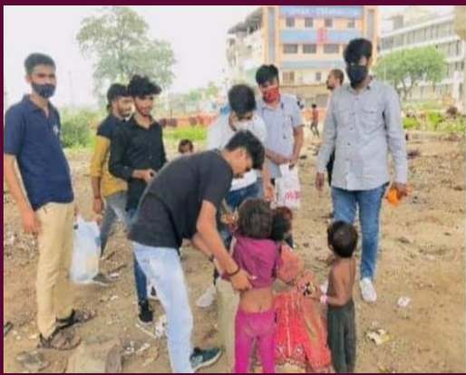

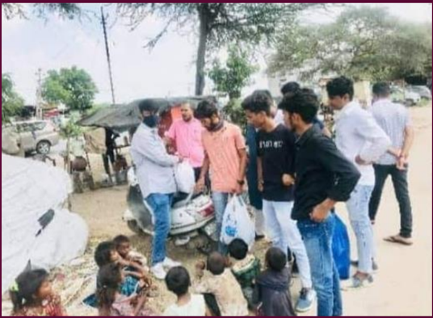

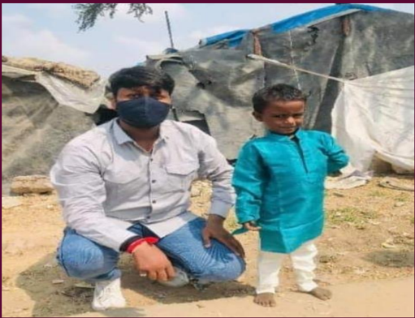

At institute level old and unused clothes were collected from faculty members and students of the institute. It was planned to distribute the collected cloths in slum areas of Palanpur.

Faculty members and students contributed their clothes. Institute level NSS coordinator Prashant Bhavsar lead students of the department and institute.

Jaimin , Jitu , Love , Noman and many other enthusiastic students from the department participated and spent a full day in such a noble work, Students from department felt the feeling of happiness and satisfaction by this program- joy of giving.

## Industry-Academia Relationship

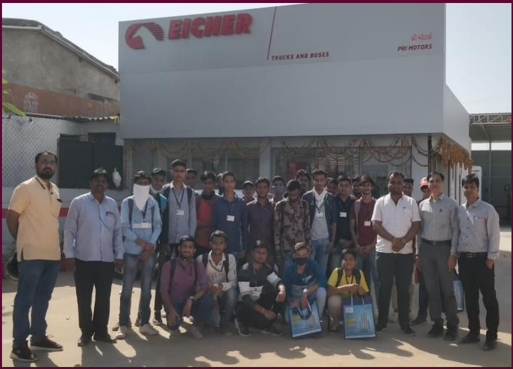

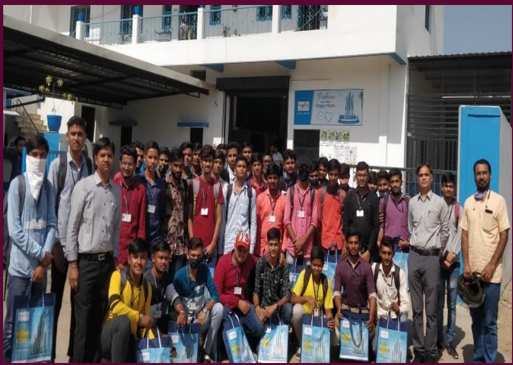

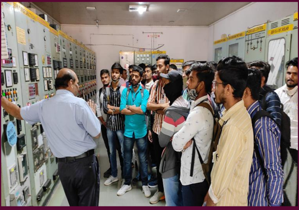

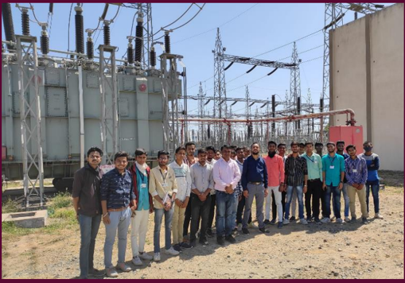

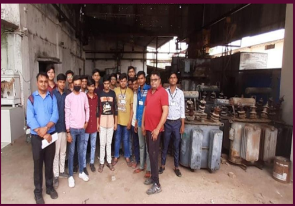

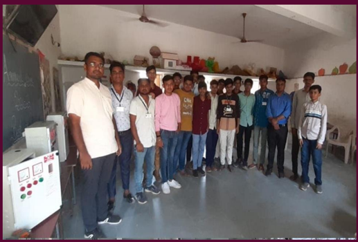

Industrial  visits  were  organized  to  enrich  field  knowledge  of  the students  in  semester-04  and  semester-06  accompanied  by  faculty members.

1. 28-10-2021 -Caption Pump
2. 28-10-2021 -Pri Motors
3. 04-03-2022- 220 kV Substation Sadarpur
4. 25-05-2022- Patel Transformer Chandisar

5.

25-05-2022- Master Control Panel Chadotar

7 | P a g e

## District Level Placement Fair

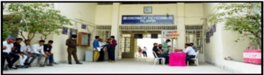

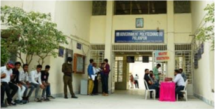

s2ai Knowledge Consortium of Gujarat (KCG) ula dl 51.

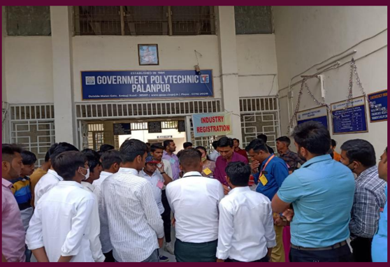

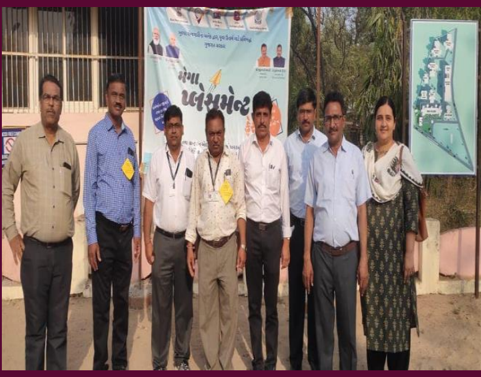

A district level mega placement fair was organized as per directives of  the  government.  Total  22  industries  participated  and  conducted interviews of candidates from Science Colleges , Commerce Colleges , Arts Colleges Degree and Diploma Engineering Colleges across Banaskantha district.

Total 11 students were shortlisted/selected by reputed industries like  Krishna  Maruti  and  Motima  International  company  from  our department.

The event was coordinated by senior faculty from our department and TPO of the institute Shri I.D.Chaudhary and his team.

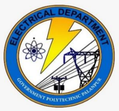

## ELECTRCAL ENGINEERING DEPARTMENT GOVERNMENT POLYTECHNIC, PALANPUR (NBA ACCREDIATED)

OUTSIDE MALAN GATE, PALANPUR-385001

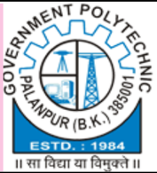

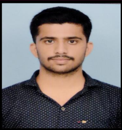

VISHAL SUTHAR

## ArcelorMittal

DET

Arcelor Mittal Nippon Steel India Limited

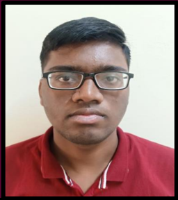

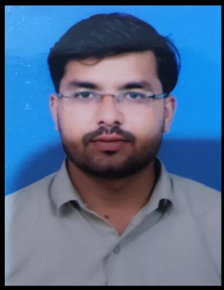

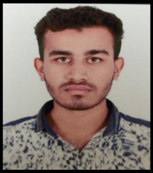

PARTHIV MAHESHVARI

HASANALI SOLANKI

VIRAT DAVE

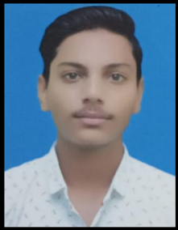

MEVADA TARANG

## DET (Junior Executive)

Torrent Power Limited, Ahmedabad

## Participation in SSIP activities

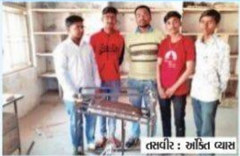

241

Sat

03 July 2021

https:/ /epaper .navgujaratsamay . com/c/61546525

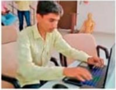

34414

## Alumni Nailesh Patel's Involvement in SSIP Activity

4664

444/2

## Participation in SSIP activities

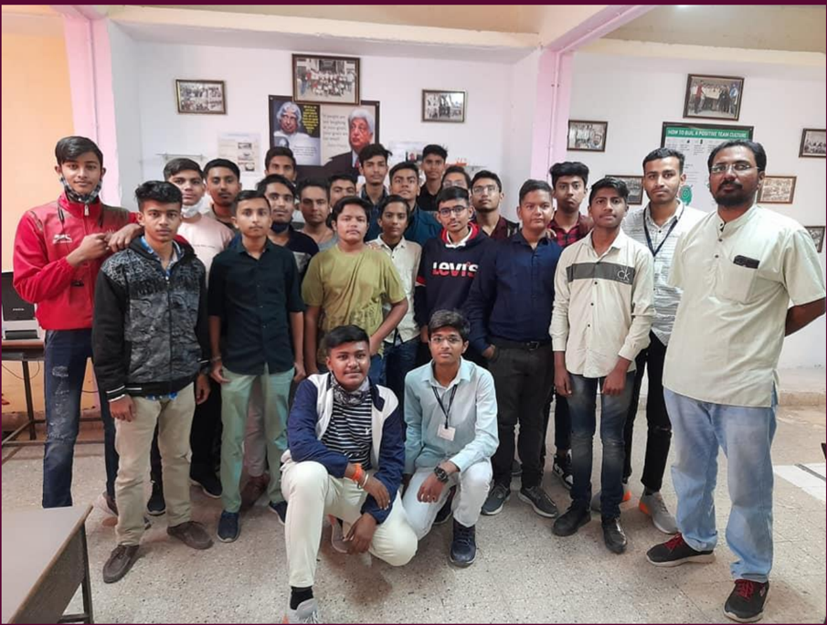

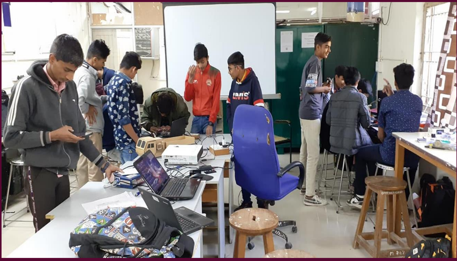

3-Days Boot Camp at Campus for first year students

## Participation in SSIP activities

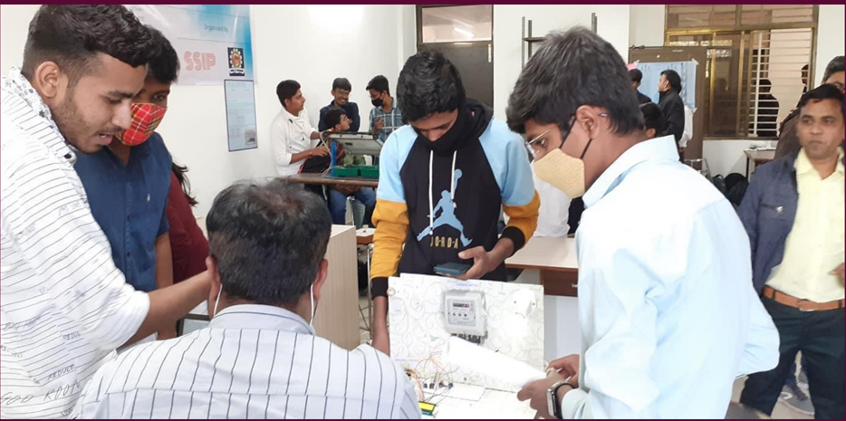

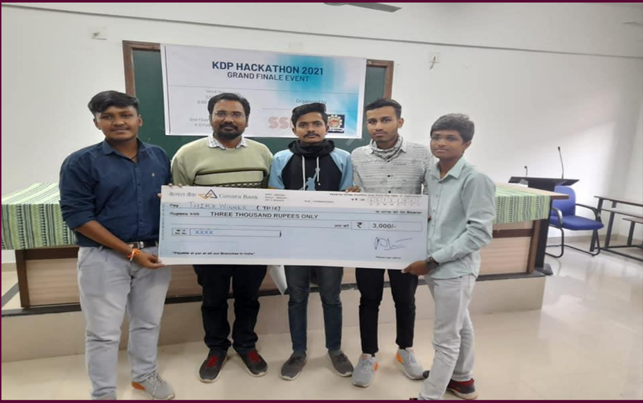

Electrical Team - Winner RANK-03

State level Hackathon at K.D.Polytechnic, Patan

## Participation in SSIP activities

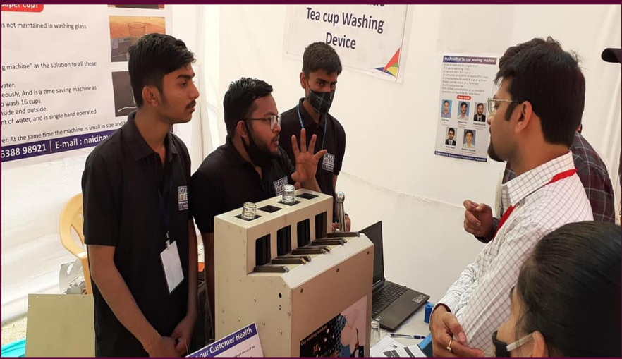

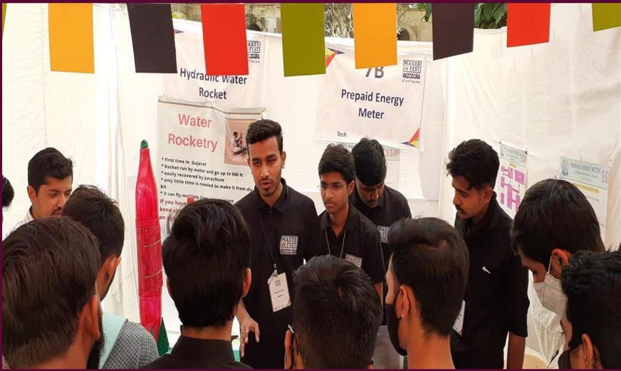

State Level Maker Fest- MSU Vadodara Team 1: Cup washing machine Team 2: Prepaid Energy Meter

## Participation in SSIP activities

State Level Robotics Event GEC- Palanpur

## Participation in SSIP activities

State Level Lakshya 2k22 LDCE - Ahmedabad

## Participation in SSIP activities

Students from our department contributed as experts in practical sessions organized at Vidhyamandir School , Palanpur for 5 to 8 standard students by SSIP Cell.

The sessions were aimed to give basic ideas of robotics and drone making to school students.

It  was  a  wonderful  experience  for  our  students  to perform the role of teacher and demonstrate their skills to school children.

## Alumni at department

We  are  thankful  to  our  alumni  from  1990  batch  for their kind support during preparation of NBA accreditation. All of them are well established businessman and industrialist. They showed their readiness for providing any kind  of  technical , financial  and  any  other  support  for development of our department.

## ELECTRCAL ENGINEERING DEPARTMENT

## GOVERNMENT POLYTECHNIC, PALANPUR (NBA ACCREDITED)

OUTSIDE MALAN GATE, PALANPUR-385001

## Department Vision:

To  provide  quality  education  in  the  field  of  Electrical Engineering  to  produce  competent  engineers  that  meet industry  requirements  with  societal  and  environmental concern.

## Department Mission:

- Prepare the students with strong fundamental concepts and problem solving skills to enhance their employability in the industries.
- To provide them a platform for developing new products that can help industry and society as a whole.
- Promote leadership and entrepreneurship skills in students through various projects, co-curricular, extracurricular events.
- Imbibe social awareness and responsibility in students to serve the society and protect environment.

## Program Educational Objectives (PEOs):

1. Apply the knowledge of electrical engineering to solve problems of industrial   and social relevance.
2. Pursue higher education and adopt to changing professional needs and engage  in lifelong learning.
3. Be professional with leadership qualities, ethics, moral values and work efficiently in a team.
4. Fulfill social and economical commitments by entrepreneurial spirit.

## Our Department is accredited by

## ELECTRICAL ENGINEERING DEPARTMENT GOVERNMENT POLYTECHNIC PALANPUR

For any queries and suggestion ABOUT 'SPARK' please do write to us: Electrical engineering department Government polytechnic, Palanpur Outside malan gate, Palanpur Website: http://www.gppp.cteguj.in/ Email- id: gppelect09@gmail.com FACEBOOK PAGE: https://www.facebook.com/Gppelect09