## SPARK JULY - 2023

SPARK An initiative of Electrical Engineering Department to create awareness among current students and all the stakeholders about various activities round the year, from July-2022 to June-2023. An initiative of Electrical Engineering Department to create awareness among current students and all the stakeholders about various activities round the year, from July-2022 to June-2023.

JULY-2023

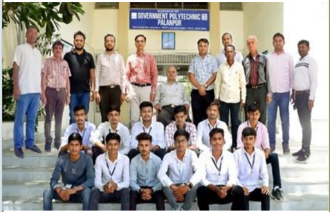

ISSUE-05

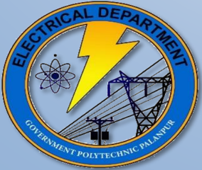

Electrical Engineering Department Government Polytechnic, Palanpur Outside Malan Gate, Palanpur - 385001

## ELECTRICAL  ENGINEERING  DEPARTMENT

Government Polytechnic, Palanpur Outside Malan Gate, Palanpur-385001 NEWSLETTER ISSUE-05  (2022-23)

## VISION

To provide quality education in the field of Electrical Engineering to produce competent engineers that meet  industry  requirements with societal and environmental concern.

## MISSION

M1 -  Prepare  the  students  with strong  fundamental  concepts  and problem solving skills to enhance their employability in the industries.

M2 - To provide them a platform for  developing  new  products  that can help industry and society as a whole.

M3 -Promote leadership and entrepreneurship skills in students through various projects, cocurricular, extra-curricular events.

M4 Imbibe social awareness and responsibility in students to serve the society and protect environment.

## PROGRAMME EDUCATIONAL OBJECTIVES

PEO1: Apply the knowledge of electrical engineering to solve problems of industrial and social relevance.

PEO2: Pursue higher education and adopt to changing professional needs and engage in lifelong learning.

PEO3: Be professional with leadership qualities, ethics, moral values and work efficiently in a team.

PEO4: Fulfill  social  and  economical  commitments  by entrepreneurial spirit.

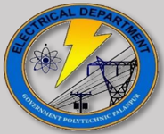

## From the Desk of HOD

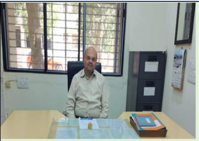

On publishing the fifth issue of the SPARK, I congratulate the editorial team for their teamwork.

Our department has continued  to  excel  in  various areas  of  accreditation,  OBE, and innovation.

We are planning to improve the attendance  of  the students  and  reduce  the  drop out of students with strengthening our mentoring policy.  Parents  meetings  are organized on regular basis.

Industrial visits are organized  and  especially  twoweek  industrial  internship  is provided to second year students  with  the  efforts  from department faculty members and TPO.

I would like to express my  gratitude  to the faculty, staff, and  students for their unwavering support and commitment to the department's growth. Let us continue  working  together  to achieve greater heights and make valuable contributions.

I wish all of my students' grand success in their future endeavors.

A.D.Shah (HOD-Electrical)

## SEMESTER TOPPER LIST

| ILE  Sr.No.   |   Semester |   Enrollment No. | Name                |   SPI |
|---------------|------------|------------------|---------------------|-------|
| 1             |          6 |     196260309035 | PRAJAPATI HASMUKH P |  9.61 |
| 2             |          6 |     206260309502 | DAVE VIRATKUMAR D   |  9.61 |
| 3             |          6 |     196260309044 | RAVAL ARYAN B       |  9.43 |
| 4             |          6 |     206260309501 | PRAJAPATI PRADEEP J |  9.43 |
| URE  5        |          4 |     206260309010 | SUTHAR JITUBHAI B   |  9.53 |
| 6             |          4 |     206260309002 | DODIYA RAHULSINH K  |  9.4  |
| 7             |          4 |     206260309003 | PATEL DIVYANG J     |  9.13 |
| 8             |          2 |     216260309010 | TAIVAR ROHITBHAI H  |  8.43 |
| 9             |          2 |     216260309003 | CHAUDHARY JAYESH N  |  8.39 |
| 10            |          2 |     216260309015 | SELIYA ABRAR A      |  7.96 |
| 11            |          5 |     206260309010 | SUTHAR JITUBHAI B   |  9.84 |
| 12            |          5 |     206260309003 | PATEL DIVYANG J     |  9.5  |
| 13            |          5 |     206260309002 | DODIYA RAHULSINH K  |  9.31 |
| 14            |          3 |     216260309012 | MODI PARTH P        |  9.09 |
| 15            |          3 |     216260309015 | SELIYA ABRAR A      |  9.09 |
| 16            |          3 |     216260309022 | BHANOTAR DHRUV R    |  8.83 |
| 17            |          1 |     226260309042 | RATHOD HARDIKSINH N |  8.8  |
| 18            |          1 |     226260309008 | CHAUHAN ZAID J      |  8.4  |
| 19            |          1 |     226260309018 | KODVANI BHAVESH G   |  8.4  |

## STUDENTS ADMITTED TO B.E.

|   Sr. No. |   Enrollment No. | Name                   | Name of Institute   |
|-----------|------------------|------------------------|---------------------|
|         1 |     196260309035 | PRAJAPATI HASMUKH P    | VGEC, CHANDKHEDA    |
|         2 |     196260309044 | RAVAL ARYAN B          | GEC MODASA          |
|         3 |     196260309009 | CHAUHAN ASHISHKUMAR  R | GEC PALANPUR        |

## EXPERT LECTURE ARRANGED

|   Sr. No | Date       | Title                        | Details of Expert                             |
|----------|------------|------------------------------|-----------------------------------------------|
|        1 | 10-09-2022 | Recent Trends in  Substation | Shri S. Rajendra  DE, GETCO                   |
|        2 | 05-05-2023 | Recent Trends in E-Vehicle   | Dr. Vinod Tejwani  Sr. Lecturer  GP, Jamnagar |

## Expert talks organized

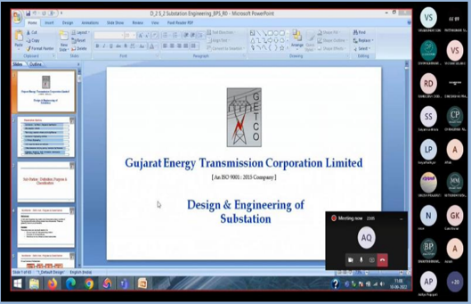

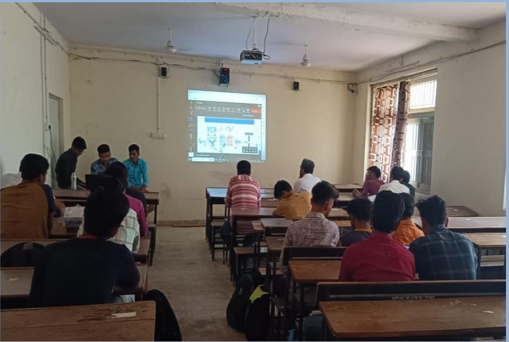

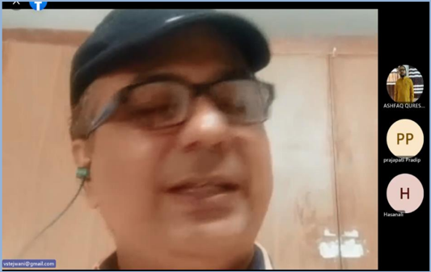

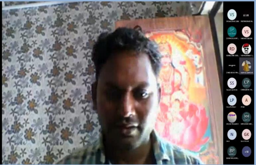

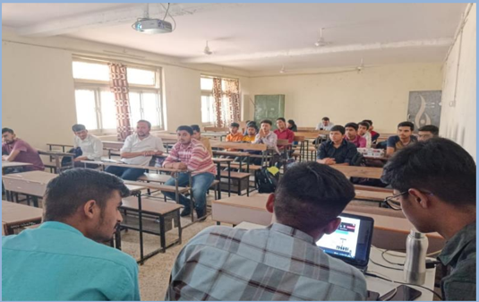

## Electrical safety clearances

Ster\_potential:   The   potential   difference shunted by accessible On the separated Pace assumed to be to one meter ground points equal

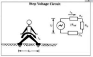

Iouch\_potential:The potential difference shunted by accessible the separated   hy distance Pace assumed to he equalto one meter ground points

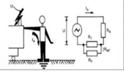

Glimpse of expert lecture on 'Recent Trends in E-Vehicle' organized in May-23 and expert lecture on 'Recent Trends in Substation' organized in Sep-22.

y

## Industrial Visit

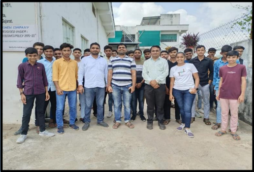

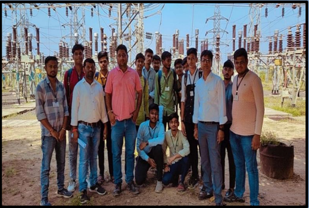

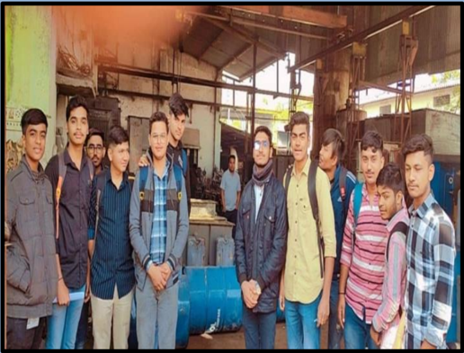

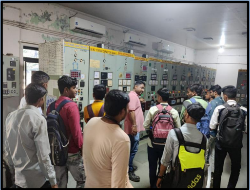

## INDUSTRIAL VISIT ORGANIZED

|   Sr.  No. | Date     | Name of Industry                 | Semester    | Faculty Coordinator                 |
|------------|----------|----------------------------------|-------------|-------------------------------------|
|          1 | 21-09-22 | Sun Cashew Industries,  Palanpur | Semester-01 | Shri A.V.Gajjar  Shri S.H.Chaudhary |
|          2 | 01-10-22 | 220 kV Substation, Sadarpur      | Semester-05 | Shri T.P.Purohit  Shri M.R.Patel    |
|          3 | 23-01-23 | Patel Transformer PVT.  Limited  | Semester-03 | Shri T.P.Purohit  Shri R.P.Chavda   |

## Industrial Internship

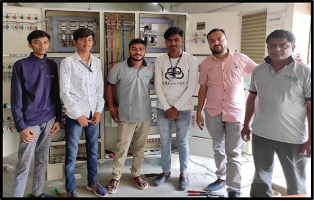

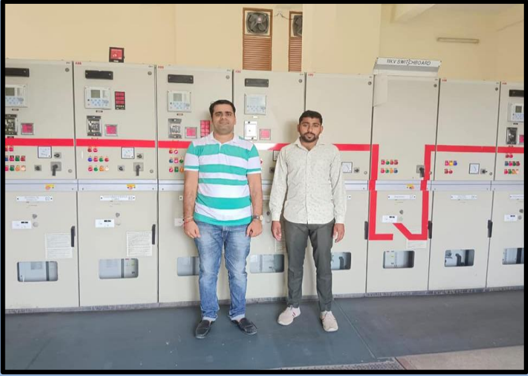

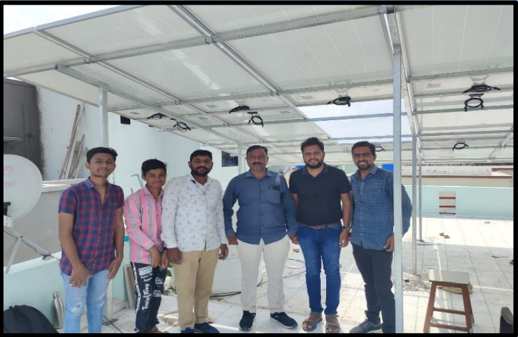

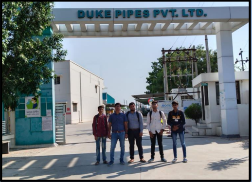

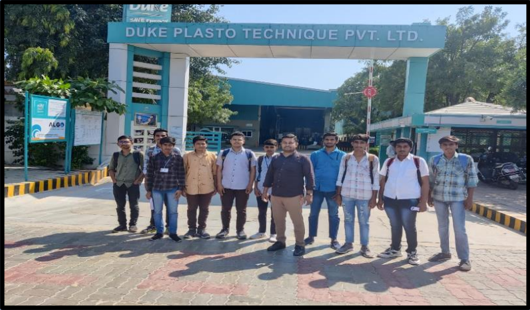

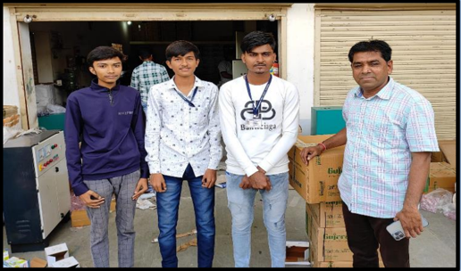

## Associated Industries for 2-Week Internship - 2022-23

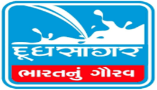

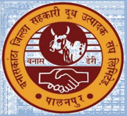

## Participation in Tree Plantation Activity

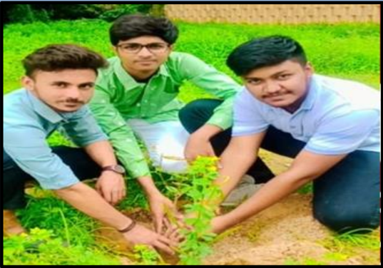

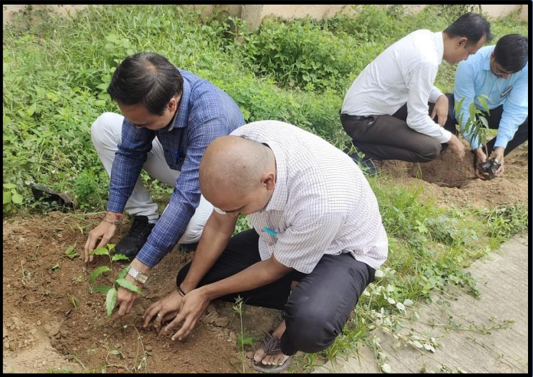

Participation in Drawing Competition 'Aazadi ka Amrit Mahotsav'

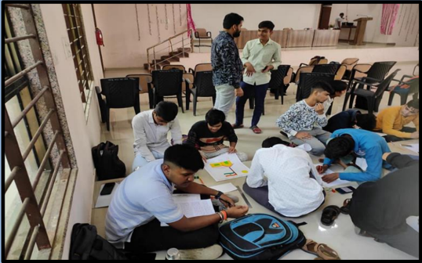

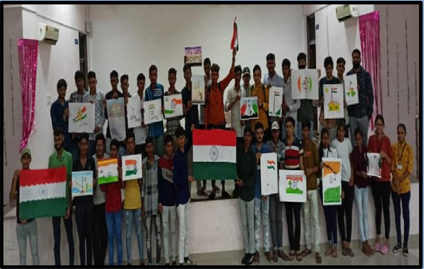

## Participation in Teachers' Day Celebration

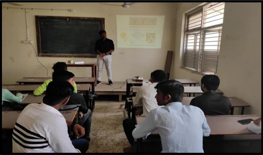

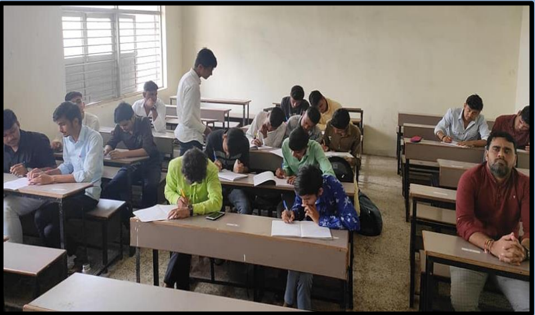

## Campus Awareness Program for School Students

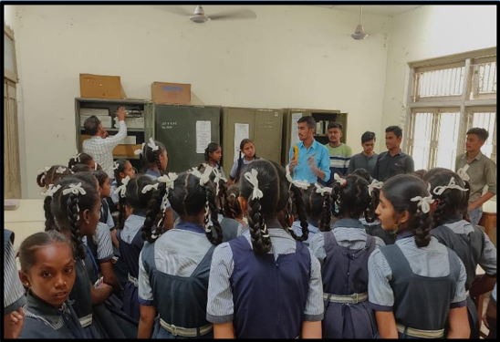

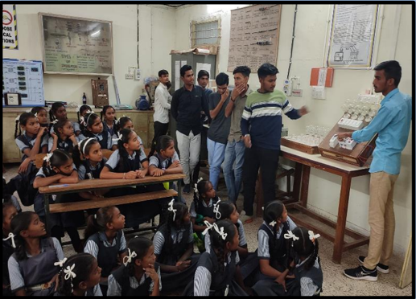

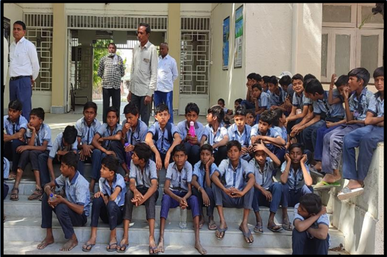

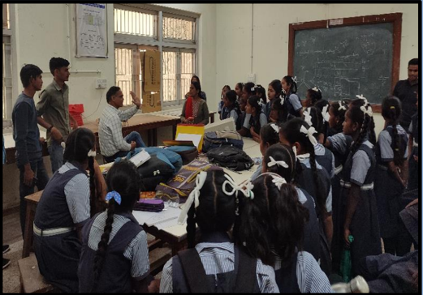

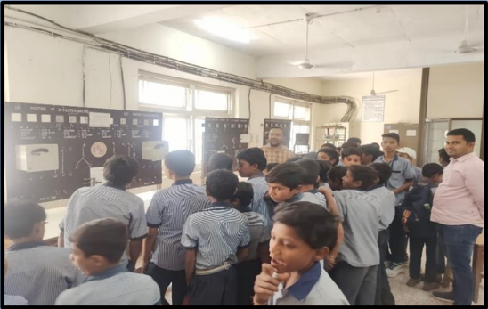

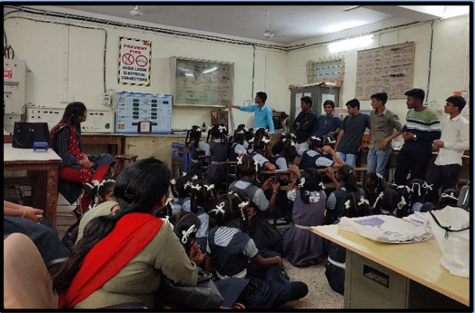

School students from nearby area visited the institute. Final year students of our department explaining them about Electrical Engineering and its future.

y

## First Year Orientation  Program

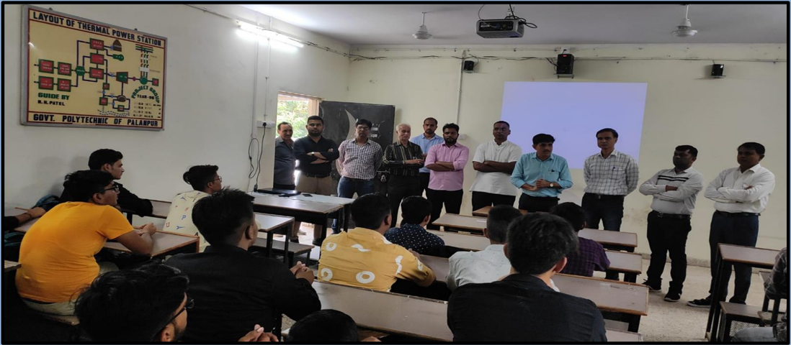

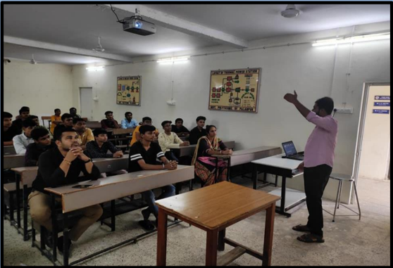

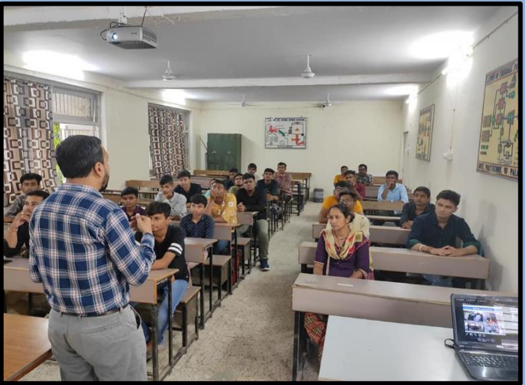

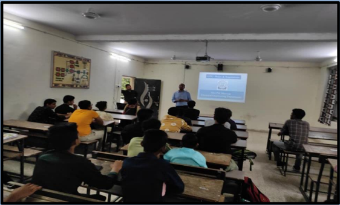

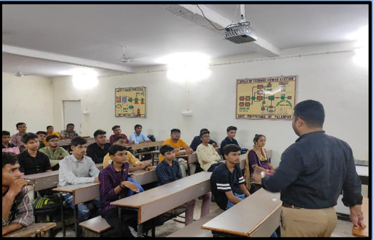

## Placement -2023

## DET Arcelor Mittal Nippon Steel India Limited

RAHULSINH DODIYA

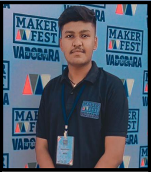

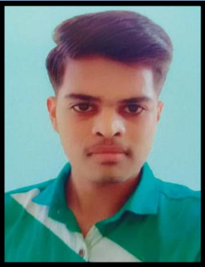

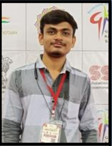

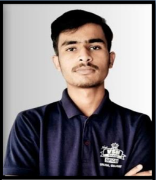

JITUBHAI SUTHAR

DIVYANG PATEL

BHAUTIK PRAJAPATI

## Student Participation and Appreciation in SSIP Activities

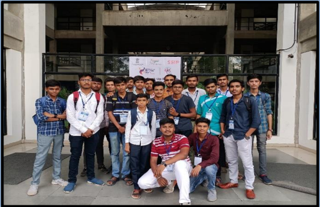

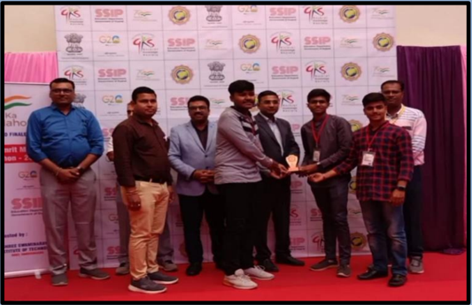

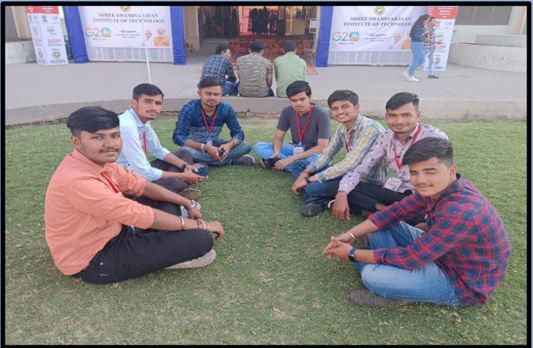

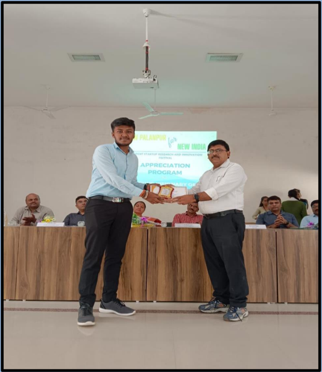

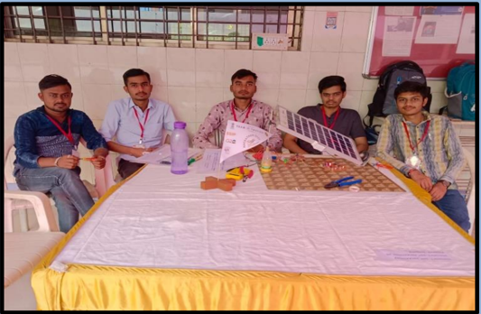

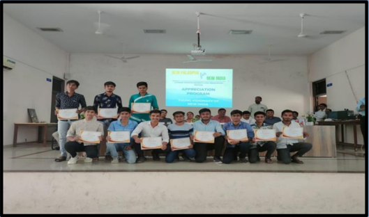

## Farewell function Glimpses

## Few Words from Alumni

Vishal Suthar Arcelor Mittal Nippon steel India

મારા ખ્યાલ મુજબ " G.P. Palanpur" જેવી કોલેજ બીજે ક્ાાંય નહી હોય , કારણ કે તયાાંના બધાાંજ સર ખૂ બ જ expert અને ખૂ બ અનુભવી છે . હાલ હુાં મારા જીવનમાાં જે સક્ષમ છાં તથા જે સક્ષમ હોઈશ તેની પાછળ કોલેજના સ્ટાફનો મોટો ફાળો છપાયેલો રહેવાનો છે જ .

Hardik Makwana Torrent Power Limited , Ahmedabad

Faculty members of my electrical engineering department are very helpful. They always try to do best for students... Now  I'm  here  because  of  them...  They always supported us and we are thankful to them.

Kiran Kumar Gohil Entrepreneur LUMAX SUNLIGHT ENERGY LLP

I feel very lucky that I got the chance to study here. Here we got a very good study from our faculty members. Practical and theory all aspects taught throughout our study. We got very good guidance from all the sirs. After completing college, I also got a job in a good company from the college campus. And today I own a company Thank you for everything to my dear faculties of Electrical Engineering Department , GP Palanpur.

## Few Words from Alumni

Manasiya Wasim Student , BE Electrical L.D.College of Engineering

Academic year 2018-21 was memorable and amazing for me, I have learned a lot in academia and also worked on various projects with support of all the faculty members of Electrical department. My enthusiasm was increased to gain knowledge due to environment at the department.

Thank you to all faculty members for providing me a guidance which  give  me  a  chance  to  be  a  part  for  betterment  of humanity.

Thank you.

Vikas Patel

Enrepreneur

Asort  -  indian  first  Co-commarce  platform (Direct selling business)

સરકારી પોલલટેક્નનક પાલનપુર એ મારા મતે બેસ્ટ કોલેજ છે.ઇલેકટ્રીકલ એન્જજનીયરીંગ વવભાગ એ બેસ્ટ વવભાગ છે અને તયાાંનાાં અમારા બધાાં જ ફેકલ્ટી બેસ્ટ છે. હુાં મારી કારકકર્દી માટે તમામ ફેકલ્ટીને હાંમેશા યાર્દ રાખીશ.

## Few Words from Alumni

Najminbanu Mansuri GE Power India Limited

What to tell you about the college and what did the teacher taught you about the course during teaching. All we can say was a miracle. For us it was nothing more than a miracle. Whatever position , in which we are today , it is only because of the support of the teachers of GP Polytechnic. Today we are successful  because  we  got  the  guidance  from  our  faculty members , which  we  could  not  get  anywhere  else.  If  I  talk about  my  teachers , they  were  so  helpful  that  they  help  us everywhere  in  every  problem , throughout  our  study.  The teachers of the electrical engineering department encouraged , motivated  and  guided  us  for  enhancing  the  quality  of  our learning in all the aspects of engineering. They also guided us about facing of an interview , preparing for interview and dealing with questions and about everything.  Everything done by them was really a great help for my campus selection. We love  all  of  them  a  lot  for  setting  up  our  career  and  their selfless efforts.

## EDITORIAL BOARD

1. Shri A.R. Patel - Lecturer, EE Department
2. Shri B.M.Patel - Lecturer , EE Department
3. Shri A.M.Qureshi - Lecturer, EE Department
4. Rahulsinh Dodiya - 6 th  Semester, EE Department
5. Jitubhai Suthar - 6 th  Semester, EE Department
6. Rishabh Prajapati - 6 th  Semester, EE Department
7. Sheliya Abrar- 4 th  Semester, EE Department
8. Rohit Taivar - 4 th  Semester, EE Department

For any queries and suggestion ABOUT 'SPARK' please do write to us: Electrical engineering department Government polytechnic, Palanpur Outside malan gate, Palanpur Website: http://www.gppp.cteguj.in/ Email- id: gppelect09@gmail.com FACEBOOK PAGE: https://www.facebook.com/Gppelect09

