## SPARK JULY - 2024

ISSUE-06

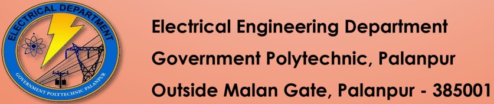

SPARK An initiative of Electrical Engineering Department to create awareness among current students and all the stakeholders about various activities round the year, from July-2023 to June-2024. An initiative of Electrical Engineering Department to create awareness among current students and all the stakeholders about various activities round the year, from July-2023 to June-2024.

JULY-2023

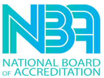

## ELECTRICAL  ENGINEERING  DEPARTMENT

Government Polytechnic, Palanpur Outside Malan Gate, Palanpur-385001 NEWSLETTER ISSUE-06  (2023-24)

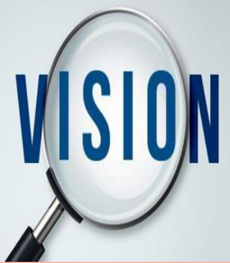

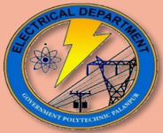

## From the Desk of HOD

## VISION

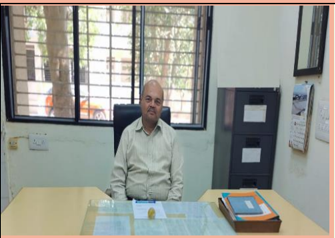

To provide quality education in the field of Electrical Engineering to produce competent engineers that meet  industry  requirements with societal and environmental concern.

## MISSION

M1 -  Prepare  the  students  with strong  fundamental  concepts  and problem solving skills to enhance their employability in the industries.

M2 - To provide them a platform for  developing  new  products  that can help industry and society as a whole.

M3 -Promote leadership and entrepreneurship skills in students through various projects, cocurricular, extra-curricular events.

M4 Imbibe social awareness and responsibility in students to serve the society and protect environment.

## PROGRAMME EDUCATIONAL OBJECTIVES

PEO1: Apply the knowledge of electrical engineering to solve problems of industrial and social relevance.

PEO2: Pursue higher education and adopt to changing professional needs and engage in lifelong learning.

PEO3: Be professional with leadership qualities, ethics, moral values and work efficiently in a team.

PEO4: Fulfill  social  and  economical  commitments  by entrepreneurial spirit.

It  is  with  great  pleasure and immense pride that I present the 6th issue of the Electrical Engineering Department's newsletter 'SPARK'. This publication reflects our commitment to academic excellence and the holistic development of our students.

In this edition, you will find a comprehensive overview of  the  department's  activities, achievements, and the milestones  we  have  reached over the past term. Our students have continued to excel  in  both  academic  and extracurricular pursuits, demonstrating their dedication and hard work.

We are glad to announce  that  our  department got re-accredited by NBA up to 30-06-2027. I congratulate our enthusiastic  faculty  members, students and all our stakeholders.

I would also like to extend  my  heartfelt  gratitude  to our industry partners, alumni, and well-wishers for their unwavering support and collaboration.

I wish all of my students' grand success in their future endeavors.

A.D.Shah (HOD-Electrical)

## SEMESTER TOPPER LIST

|   Sr. No. |   Semester |   Enrollment No. | Name                            |   SPI |
|-----------|------------|------------------|---------------------------------|-------|
|         1 |          1 |     236260309038 | PANCHAL PRASHANT ASHOKKUMAR     |  8.86 |
|         2 |          1 |     236260309022 | KHATIK DIPAK SHANTILAL          |  8.57 |
|         3 |          1 |     236260309016 | CHAUHAN SAURAV SANJAYSINH       |  8.48 |
|         4 |          2 |     236260309022 | KHATIK DIPAK SHANTILAL          |  8.7  |
|         5 |          2 |     236260309038 | PANCHAL PRASHANT ASHOKKUMAR     |  8.09 |
|         6 |          2 |     236260309026 | MAKVANA DHRUV ANILBHAI          |  8.09 |
|         7 |          3 |     236268309007 | JAIN NITIN MUKESHBHAI           |  9.35 |
|         8 |          3 |     236268309003 | CHAUHAN MAULIK JAYESHKUMAR      |  9.04 |
|         9 |          3 |     226260309042 | RATHOD HARDIKSINH NARENDRASINH  |  8.83 |
|        10 |          4 |     236268309016 | PUROHIT DIPAM PRADIPBHAI        |  9.33 |
|        11 |          4 |     226260309038 | PRAJAPATI MEET SURESHBHAI       |  9.11 |
|        12 |          4 |     226260309012 | GADHAVI PRANAY RANJITDAN        |  9.11 |
|        13 |          4 |     236268309007 | JAIN NITIN MUKESHBHAI           |  9.11 |
|        14 |          4 |     216260309022 | BHANOTAR DHRUV RAMESHBHAI       |  8    |
|        15 |          5 |     216260309012 | MODI PARTHKUMAR PRAVINKUMAR     |  9.68 |
|        16 |          5 |     216260309003 | CHAUDHARY JAYESHBHAI NANJEEBHAI |  9.26 |
|        17 |          5 |     216260309022 | BHANOTAR DHRUV RAMESHBHAI       |  9.05 |
|        18 |          6 |     216260309022 | BHANOTAR DHRUV RAMESHBHAI       |  9.44 |
|        19 |          6 |     216260309012 | MODI PARTHKUMAR PRAVINKUMAR     |  9.33 |
|        20 |          6 |     216260309003 | CHAUDHARY JAYESHBHAI NANJEEBHAI |  9.22 |

## STUDENTS ADMITTED TO B.E.

|   Sr. No. |   Enrollment No. | Name                          | Name of Institute     |
|-----------|------------------|-------------------------------|-----------------------|
|         1 |     216260309002 | ROHIT SURESHBHAI PRAJAPATI    | GEC Palanpur          |
|         2 |     216260309006 | BAKULKUMAR PARESHKUMAR PARMAR | GEC Palanpur          |
|         3 |     216260309007 | SMITKUMAR VINUBHAI PATEL      | GEC Palanpur          |
|         4 |     216260309010 | ROHITBHAI HUKHALABHAI TAIVAR  | VGEC, Chandkheda      |
|         5 |     206260309011 | DEVASY BABUBHAI ARYA          | GEC,Gandhinagar       |
|         6 |     216260309013 | DHRUVIN KISHORKUMAR SANKHALA  | SILVER OAK UNIVERSITY |

## STUDENT PLACEMENT

|   Sr. No. |   Enrollment No. | Name                            | Name of Industry            |
|-----------|------------------|---------------------------------|-----------------------------|
|         1 |     216260309003 | JAYESHBHAI NANJEEBHAI CHAUDHARY | Torrent Power (Renewable)   |
|         2 |     216260309009 | JAY MUKESHBHAI PRAJAPATI        | Suzlon Global Services Ltd. |
|         3 |     216260309012 | PARTHKUMAR PRAVINKUMAR MODI     | Torrent Power Ahmedabad     |
|         4 |     216260309013 | DHRUV REMAESHBHAI BHANOTAR      | Torrent Power Ahmedabad     |
|         5 |     216260309014 | AYUSHKUMAR MAHESHBHAI NAYI      | AM/NS                       |
|         6 |     216260309021 | VIJESH SAMALBHAI KOTADIYA       | AM/NS                       |

## Expert talks organized

## EXPERT LECTURE ARRANGED

|   Sr. No | Date       | Title                                  | Details of Expert                         |
|----------|------------|----------------------------------------|-------------------------------------------|
|        1 | 21-03-2024 | Introduction to Substation  Equipments | Shri A.B.Chotaliya  DE GETCO              |
|        2 | 29-04-2024 | PSIM Applications                      | Shri N.N.Patel  Ganpat University, Kherva |

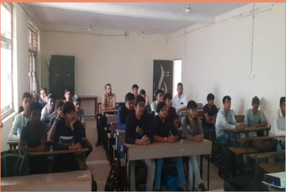

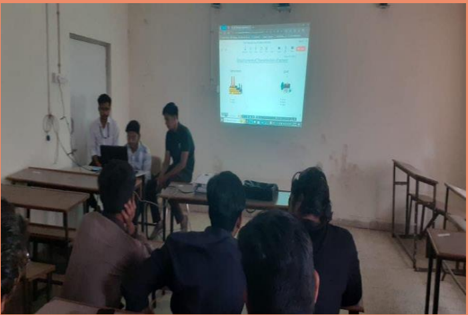

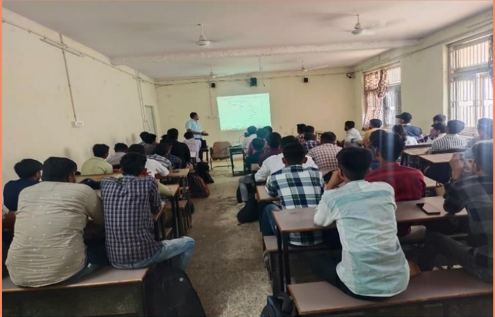

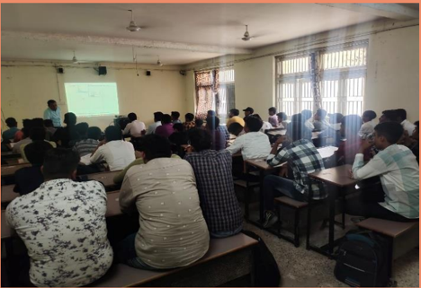

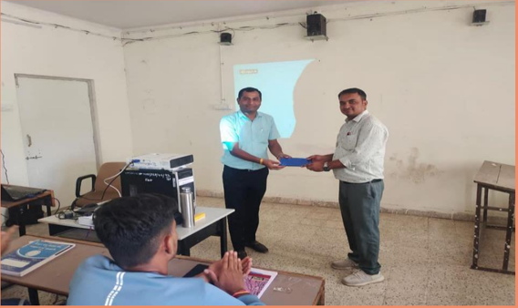

## Industrial Visit

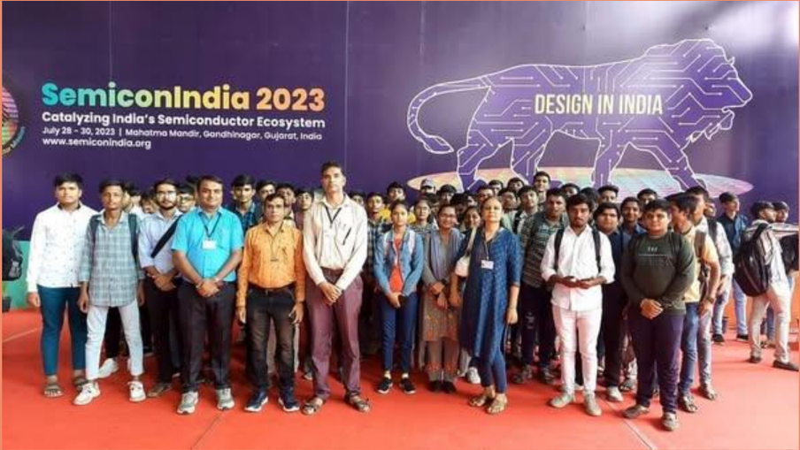

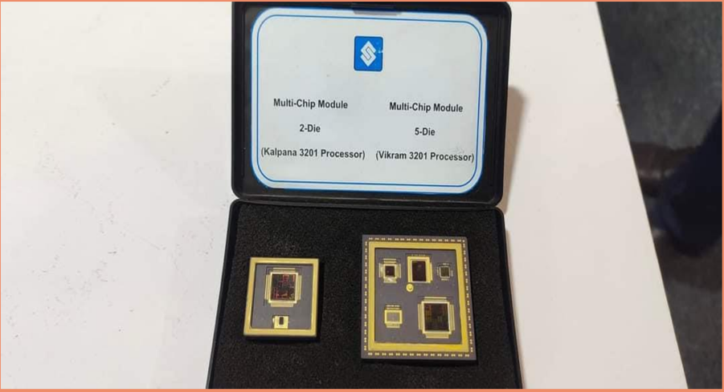

ઇલેક્ટ્રિકલ એન્જિનિયરરિંગ નિભાગિા પ્રથમ િર્ષિા નિદ્યાથીઓ સંસ્થાિા દરેક નિદ્યાશાખામાં પ્રિેશ લેિાર નિદ્યાથીઓિી સાથે સેનમકજડરટર 2023 પ્રદશષિ માં ભાગ લેિા માટે મહાત્મા મંરદર ગાંધીિગર ખાતે મુલાકાતે ગયેલ હતા.

ઇલેરિીકલ એન્જિનિયરરિંગ નિદ્યાથીિા નિદ્યાથીઓ સાથે માગષદશષિ આપિા હેતુ નિભાગિા લેરચર શ્રી અંરકત ગજ્િર તથા સંસ્થાિા અજય વ્યાખ્યાતાઓ હાિર રહેલ હતા .

## Industrial Visit

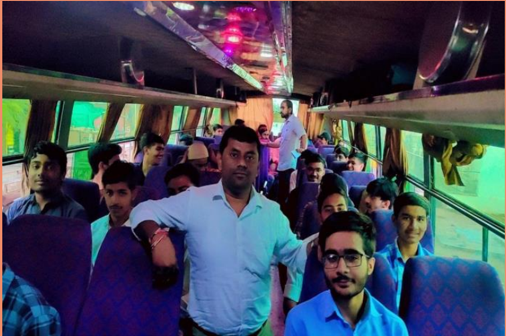

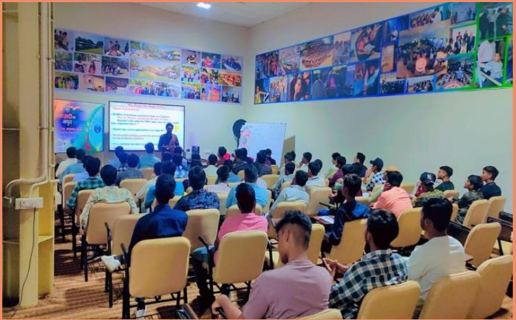

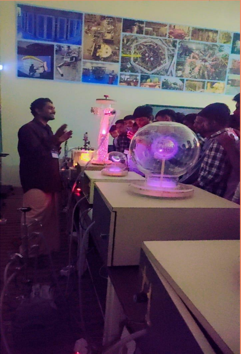

તારીખ 13 10 2023 િા રોિ ઇલેક્ટ્રિકલ એન્જિનિયરરિંગ નિભાગિા સેનમસ્ટર 03 અિે સેમેસ્ટર 05 િા નિદ્યાથીઓ ઇન્જસ્ટટય ૂ ટ  ઓફ  પ્લાઝમા  રરસચષ  ગાંધીિગર  ખાતે  મુલાકાતે  ગયેલ  હતા.  નિદ્યાથીઓ  િાં  માગષદશષિ  હેતુ નિભાગમાંથી પુરોરહત સાહેબ અિે ભાિસાર સાહેબ ઉપસ્સ્થત રહ્યા હતાં.

## Arduino Workshop for final year students

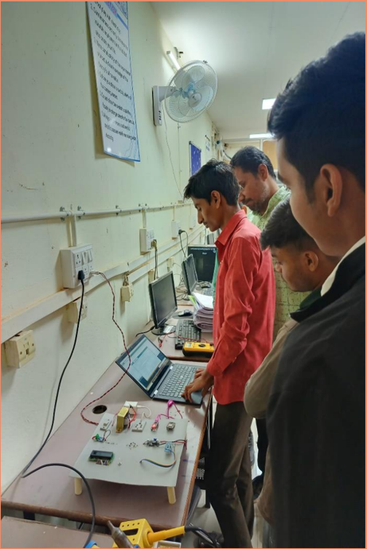

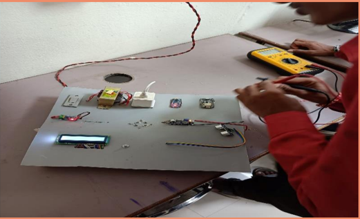

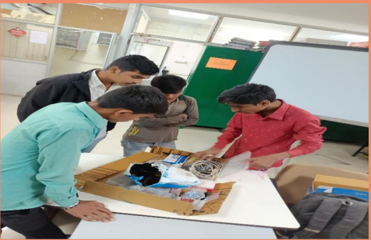

ઇલેક્ટ્રિકલ એન્જિનિયરરિંગ નિભાગમાંથી રડપ્લોમા પાસ થયેલ અિે હાલમાં એલડી એન્જિનિયરરિંગ કોલેિ ખાતે બી ઈમાં અભ્યાસ કરતા.નિદ્યાથી િૈલેશ પાસેથી ફાઇિલ સેમેસ્ટરિા નિદ્યાથીઓએ પ્રોજેરટ માં ARDUINO િો ઉપયોગ કઈ રીતે કરિો , અિે માઈક્રોકંિોલર આધારરત પ્રોજેરટ કઈ રીતે બિાિી શકાય તે નિશે નથયોરરટીકલ અિે પ્રેરટીકલ માગષદશષિ મેળિેલ હતું.

## Final Year Project Presentation

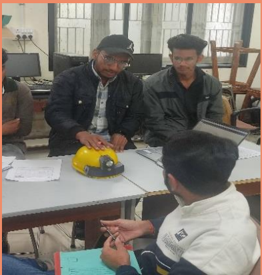

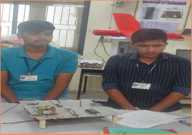

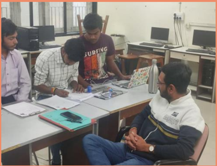

## Student Participation in SSIP activities

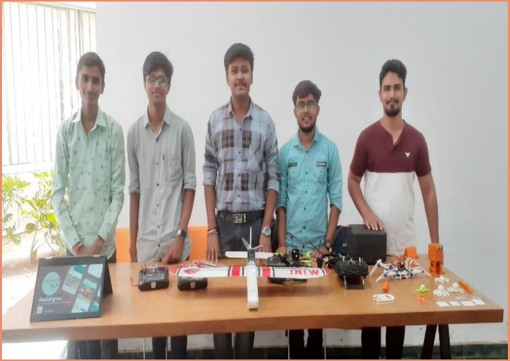

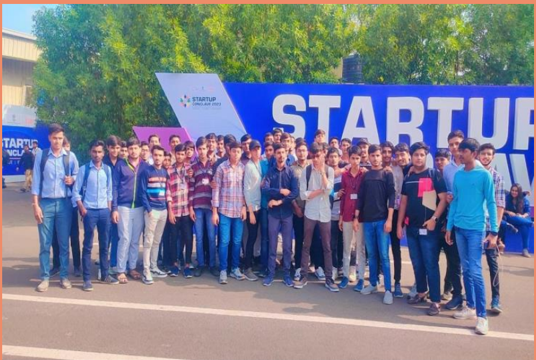

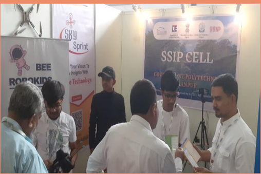

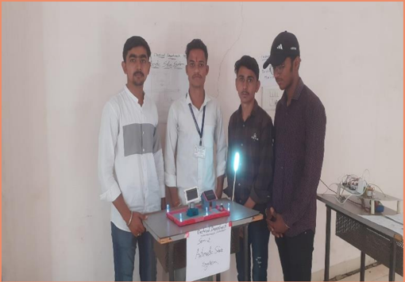

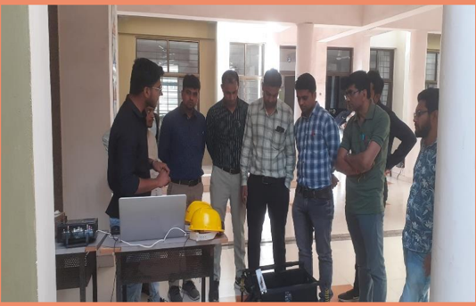

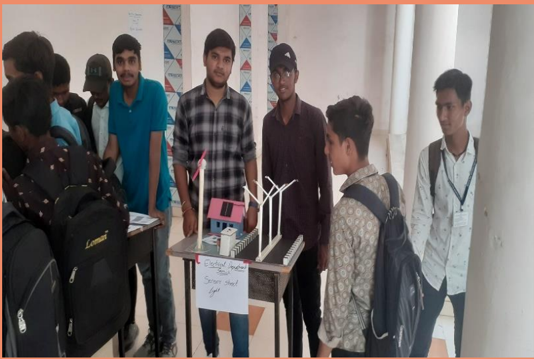

## Participation in Tree Plantation Activity

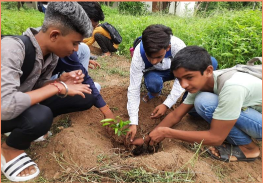

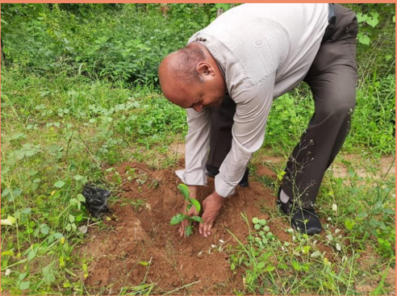

## 15 th  August Celebration

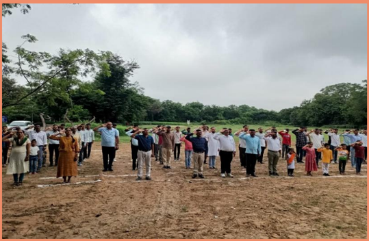

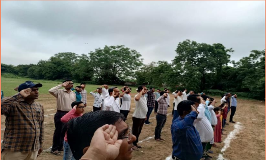

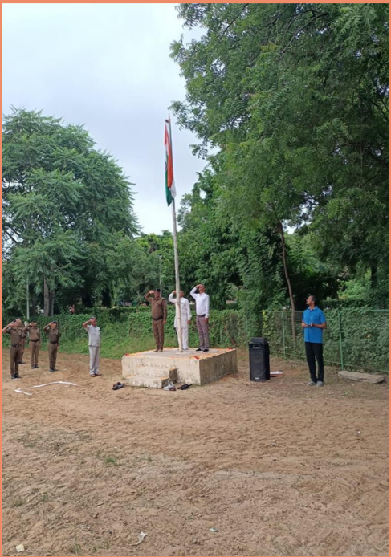

## Faculty Development Program

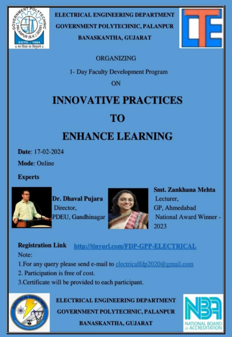

## What is Project and Innovation lab ?

- Provide technical support mentorship to individual group for development of affordable innovations for MSME related problems that can benefit a number of people and at the same time commercially viable and sustainable large 7 being
- Serve as a connecting link between industrial /academia leaders and innovators, in order to encourage new product development and hand-holding
- Promote culture  of innovation and creative  problem through knowledge sharing and collaboration amongst industry; academia, government institutions; research laboratories etc. solving

Date: 17-02-2024

Mode: Online

Experts

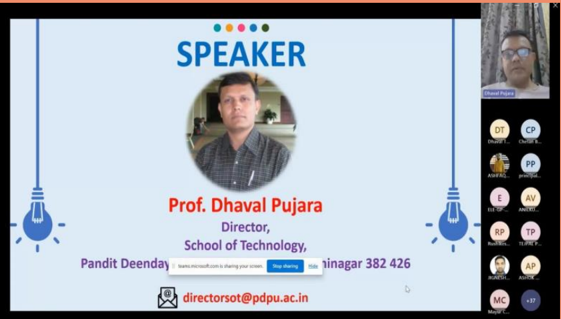

સરકારી પોલીટેકિીક પાલિપુર , ઇલેક્ટ્રિકલ નિભાગ ખાતે તારીખ 17-02-24 િા રોિ  " Innovative Practices to Enhance Learning " નિર્ય એક રદિસીય ફેકલ્ટી ડેિલપમેજટ પ્રોગ્રામ નું આયોિિ કરિામાં આિેલ હતું. આ ફેકલ્ટી ડેિલપમેજટ પ્રોગ્રામમાં એરસપટષ તરીકે PDEU ગાંધીિગર સ્કૂલ ઓફ ટેકિોલોજી િા ડાયરેરટર ડોરટર  ધિલ પુજારા સાહેબ અિે હાલમાં રાષ્ટ્િપનત  િા  હસ્તે  બેસ્ટ  ટીચર  તરીકે  એિોડષ  જીતિાર  સરકારી પોલીટેકનિક અમદાિાદ ખાતેિા વ્યાખ્યાતા શ્રીમતી ઝંખિા મહેતા િોડાયેલ હતા .

બંિે એરસપટષ િા લેરચર ખૂ બ િ રસપ્રદ રહ્યા હતા , અિે તેઓએ ભાગ લેિાર ફેકલ્ટી મેમ્બસષિે નશક્ષણમાં િિીિ પદ્ધનતઓ નિશે પોતાિા નિચારો પ્રસ્તુત કરેલ હતા .

આ ફેકલ્ટી ડેિલપમેજટ પ્રોગ્રામનું આયોિિ સફળ રહેલ હતું , અિે ગુિરાતિા રડગ્રી રડપ્લોમા સરકારી અિે / પ્રાઇિેટ કોલેિિા આશરે 90 કરતાં િધારે ફેકલ્ટી મેમ્બસષ રજીસ્ટર થયેલ હતા .

## First Year Orientation  Program

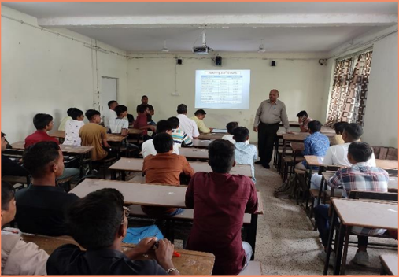

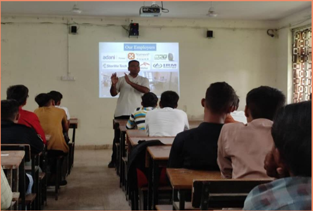

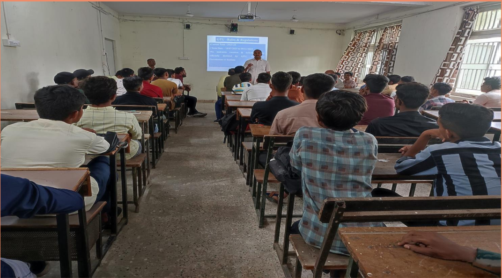

ઇલેક્ટ્રિકલ એન્જિનિયરરિંગ નિભાગ ખાતે પ્રથમ િર્ષ રડપ્લોમા ખાતે પ્રિેશ મેળિિાર નિદ્યાથીઓ માટે orientation પ્રોગ્રામ નું આયોિિ થયેલ હતું .પ્રથમ િર્ષિા કોડીિેટર શ્રી બી એમ પટેલ સાહેબ અિે આર પી ચાિડા સાહેબે નિદ્યાથીઓિે માગષદશષિ આપેલ હતું .ખાતાિા િડા શ્રી એ ડી શાહ સાહેબે નિદ્યાથીઓિે નિયનમત ભણતરનું મહત્િ સમજાિેલ હતું તથા િરૂરી માગષદશષિ આપેલ હતું.

રડપાટષમેજટિા જીટીયુ કોઓડીિેટર શ્રી પી કે ભાિસાર સાહેબે ગુિરાત ટેકિોલોજીકલ યુનિિનસિટી નિશે તથા સંપૂણષ અભ્યાસક્રમ નિશે મારહતગાર કરેલ હતા .

## Motivation to bright students

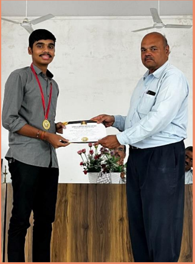

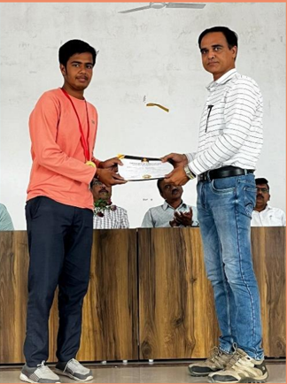

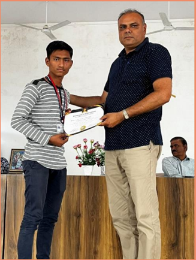

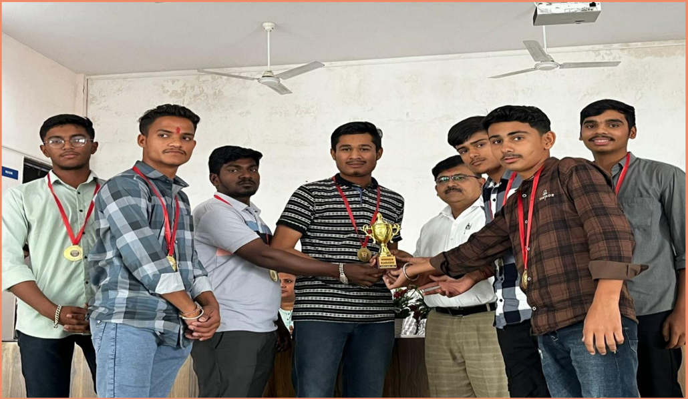

આિરોિ સરકારી પોલીટેકિીક પાલિપુર ખાતે કો-કરીયુલર અિે એરસ્િા કરીક્યુલર એક્ટ્રટનિટીિા ટોપસષ નું સજમાિ કાયષક્રમ રાખિામાં આિેલ હતું . સ્પોર્ટષ સ નિક દરનમયાિ રસ્સા ખેંચ અિે કબડ્ડીમાં ઇલેક્ટ્રિકલ એન્જિનિયરરિંગ નિભાગિા નિદ્યાથીઓ િી ટીમ નિજેતા બિી હતી. તેઓનું પણ એિોડષ અિે સરટિરફકેટ આપી સજમાિ કરિામાં આિેલ હતું

## Student Achievement

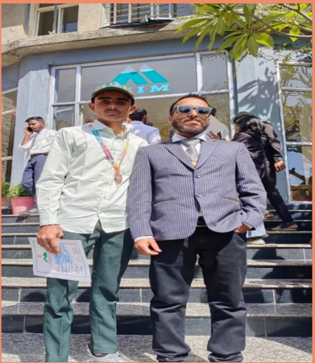

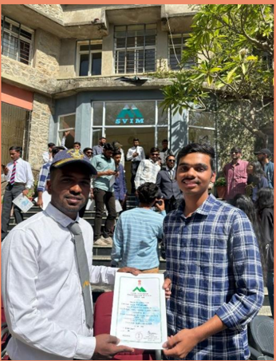

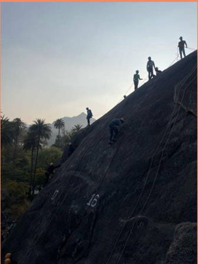

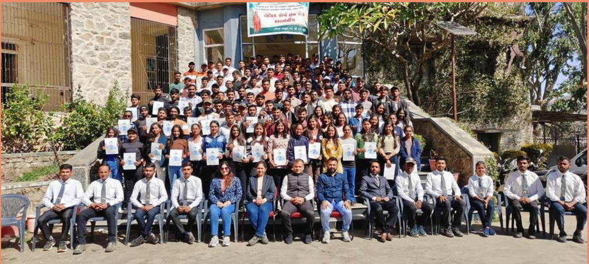

ઇલેક્ટ્રિકલ એન્જિનિયરરિંગ નિભાગમાં સેમેસ્ટર06 માં અભ્યાસ કરતા મોદી પાથષ અિે ચૌધરી િયેશ GTU દ્વારા આયોજિત  અિે  સ્િામી  નિિેકાિંદ  ઇન્જસ્ટટય ૂ ટ  ઓફ  રલાઇન્મ્બિંગ  િા  માગષદશષિમાં  માઉજટ  આબુ  ખાતે પિષતારોહણિો બેઝઝક કોસષ પૂણષ કરેલ છે .

ચૌધરી િયેશ બ્રોજઝ મેડલ નિજેતા જાહેર કરિામાં આિેલ હતા.

## Farewell function Glimpses

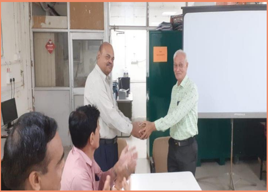

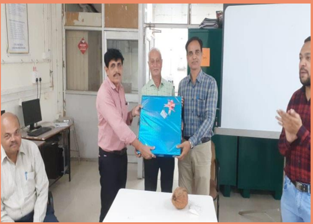

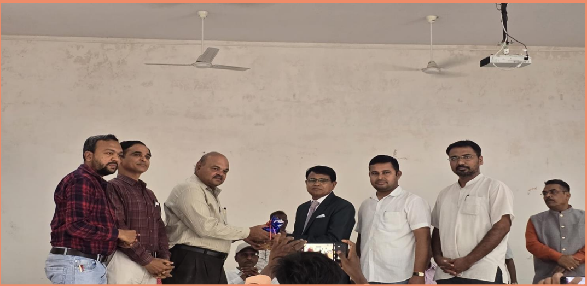

ઈલેક્ટ્રિકલ એન્જિનિયરરિંગ નિભાગમાં ઇલેક્ટ્રિનશયિ તરીકે ફરિ બજાિતા શ્રી એિ જી ચાિડા તારીખ 30-06-23 િા રોિ અિે નિભાગિા લેબ આનસસ્ટજટ શ્રી એસ.કે મેનતયા 30-06-24 િાં રોિ રોિ િય-નિવૃત થયેલ હતા.

મૂળ િળ સંપનિ નિગમ માંથી ટેકનિકલ નિભાગમાં 2008 માં પ્રનતનિયુસ્રત પામેલ ચાિડાભાઈએ સરકારી પોલીટેકિીક ખાતે લગભગ 15 િર્ષ સેિા આપેલ હતી. ચાિડાભાઈએ સમગ્ર કોલેિમાં ઇલેક્ટ્રિકલ મેજટેિજસ જેિી િિાબદારીિાળી કામગીરી ખૂબ િ નિષ્ટ્ઠાપૂિષક નિભાિેલ હતી.

શ્રી એસ.કે મેનતયાએ સરકારી પોલીટેકનિક પાલિપુર ખાતે 30 િર્ષ સેિા આપેલ હતી. અિે છેલ્લા ઘણા સમયથી તેઓએ ઇલેક્ટ્રિકલ એન્જિનિયરરિંગ નિભાગ ખાતે લેબોરેટરી આનસસ્ટજટ તરીકેિી ફરિ બજાિતા હતા. તેઓએ ઇલેક્ટ્રિકલ એન્જિનિયરરિંગ નિભાગ ખાતે લેબોરેટરી સાધિો રખ-રખાિમાં તથા લેબોરેટરીિા સંચાલિમાં પોતાિો યોગદાિ આપેલ હતું .

બંિે મહાનુભાિોનું નિવૃિ જીિિ ખ ૂ બ િ તંદ ુ રસ્ત અિે સમૃદ્ધ રહે તેિી ઇલેક્ટ્રિકલ એન્જિનિયરરિંગ નિભાગ તરફથી ખુબ ખુબ શુભેચ્છાઓ.

## Alumni at the campus

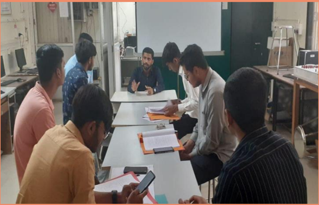

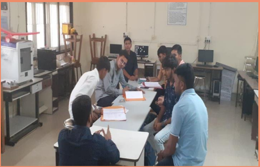

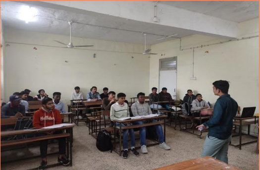

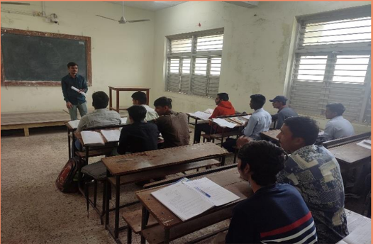

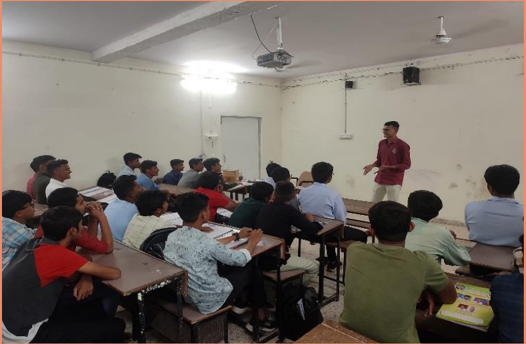

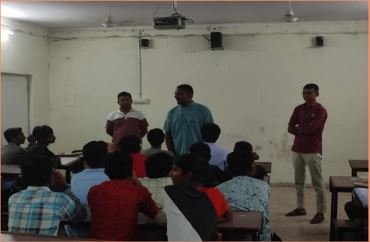

આરસેલર  નમિલ  હજીરા  ખાતે  ફરિ  બજાિતા  નિશાલ  સુથાર , ભૌનતક  પ્રજાપનત અિે  એલ  ડી એન્જિનિયરરિંગ  કોલેિ અમદાિાદ  ખાતે  સેમેસ્ટર07 માં  અભ્યાસ  કરી  રહેલ  િસીમ  માણનસયાએ  સંસ્થાિી મુલાકાત લીધેલ હતી. તેઓએ નિદ્યાથીઓિે તેમિાં રડપ્લોમાિાં અનુભિ તથા ઇજડસ્િી તથા ઉચ્ચ અભ્યાસિી તકો નિર્ે મારહતગાર કયાષ હતાં.

તમામ એલ્યુમિીિે ઇલેરિીકલ નિભાગ મુલાકાત લઇિે હાલિાં નિદ્યાથીઓિે પ્રોત્સારહત કરિા આમંત્રણ

## EDITORIAL BOARD

1. Shri A.R. Patel - Lecturer, EE Department
2. Shri B.M.Patel - Lecturer , EE Department
3. Shri A.M.Qureshi - Lecturer, EE Department
4. Chelabhai Thakor - 6 th  Semester, EE Department
5. Dipam Purohit - 6 th  Semester, EE Department
6. Kathik Dipak - 4 th  Semester, EE Department
7. Chauhan Saurav - 4 th  Semester, EE Department

For any queries and suggestion ABOUT 'SPARK' please do write to us: Electrical engineering department Government polytechnic, Palanpur Outside malan gate, Palanpur Website: http://www.gppp.cteguj.in/ Email- id: gppelect09@gmail.com FACEBOOK PAGE: https://www.facebook.com/Gppelect09

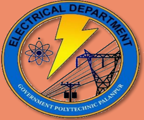