## SPARK JULY - 2025

ISSUE-07

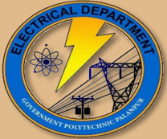

Electrical Engineering Department Government Polytechnic, Palanpur Outside Malan Gate, Palanpur -385001

SPARK An initiative of Electrical Engineering Department to create awareness among current students and all the stakeholders about various activities round the year, from July-2024 to June-2025. An initiative of Electrical Engineering Department to create awareness among current students and all the stakeholders about various activities round the year, from July-2024 to June-2025.

JULY-2023

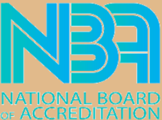

## ELECTRICAL  ENGINEERING  DEPARTMENT

Government Polytechnic, Palanpur Outside Malan Gate, Palanpur-385001 NEWSLETTER ISSUE-07  (2025-26)

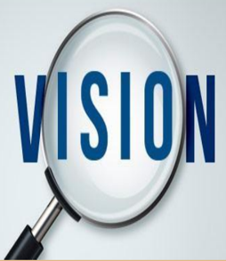

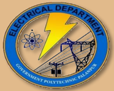

## From the Desk of HOD

## VISION

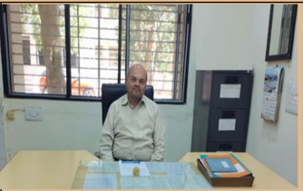

To provide quality education in the field of Electrical Engineering to produce competent engineers that meet  industry  requirements with societal and environmental concern.

## MISSION

M1 -  Prepare  the  students  with strong  fundamental  concepts  and problem solving skills to enhance their employability in the industries.

M2 - To provide them a platform for  developing  new  products  that can help industry and society as a whole.

M3 -Promote leadership and entrepreneurship skills in students through various projects, cocurricular, extra-curricular events.

M4 Imbibe social awareness and responsibility in students to serve the society and protect environment.

## PROGRAMME EDUCATIONAL OBJECTIVES

PEO1: Apply the knowledge of electrical engineering to solve problems of industrial and social relevance.

PEO2: Pursue higher education and adopt to changing professional needs and engage in lifelong learning.

PEO3: Be professional with leadership qualities, ethics, moral values and work efficiently in a team.

PEO4: Fulfill  social  and  economical  commitments  by entrepreneurial spirit.

It is with great pleasure and  immense  pride  that  we present  the  7th  issue  of  the Electrical Engineering Department's newsletter, 'SPARK'. This publication stands  as  a  testament  to  our unwavering commitment to academic  excellence  and  the holistic development of our students.

In this edition, you will discover a comprehensive overview  of  the  department's activities, achievements, and the  significant  milestones,  we have accomplished  over the past  term.  Our  students  have once again showcased their exceptional talent and determination, excelling in both academic pursuits and extracurricular endeavours.

I also take this opportunity to express my deep appreciation to our industry partners, alumni, and wellwishers for their continued support and collaboration, which  have  been  instrumental in our journey. To all  my students, I wish you success in your future endeavours.

A.D. Shah HoD -Electrical

## SEMESTER TOPPER LIST

|   Sr. No. |   Semester |   Enrollment No. | Name                                 |   SPI |
|-----------|------------|------------------|--------------------------------------|-------|
|         1 |          1 |     246260309069 | SOLANKI HIMANSHUBROTHER NARENDRABHAI |  8.86 |
|         2 |          1 |     246260309037 | PATEL CHETANKUMAR VISHNUBHAI         |  8.57 |
|         3 |          1 |     246260309062 | RATHOD JAYSINH BHARATSINH            |  8.48 |
|         4 |          2 |     246260309070 | SONGARA JAY HARESHKUMAR              |  8.4  |
|         5 |          2 |     246260309037 | PATEL CHETANKUMAR VISHNUBHAI         |  8.15 |
|         6 |          2 |     246260309013 | CHAUDHARY VIJAYBHAI JETABHAI         |  7.85 |
|         7 |          2 |     246260309062 | RATHOD JAYSINH BHARATSINH            |  7.85 |
|         8 |          3 |     236260309022 | KHATIK DIPAK SHANTILAL               |  9.35 |
|         9 |          3 |     236260309038 | PANCHAL PRASHANT ASHOKKUMAR          |  9.3  |
|        10 |          3 |     236260309016 | CHAUHAN SAURAV SANJAYSINH            |  8.39 |
|        11 |          4 |     236260309022 | KHATIK DIPAK SHANTILAL               |  9.3  |
|        12 |          4 |     236260309038 | PANCHAL PRASHANT ASHOKKUMAR          |  9.1  |
|        13 |          4 |     236260309016 | CHAUHAN SAURAV SANJAYSINH            |  8.4  |
|        14 |          5 |     226260309044 | SATHVARA MAULIK HARESHBHAI           |  8.79 |
|        15 |          5 |     226260309042 | RATHOD HARDIKSINH NARENDRASINH       |  8.63 |
|        16 |          5 |     236268309016 | PUROHIT DIPAM PRADIPBHAI             |  8.63 |
|        17 |          5 |     236268309005 | CHAUHAN UMABHAI RAMABHAI             |  8.47 |
|        18 |          6 |     226260309038 | PRAJAPATI MEET SURESHBHAI            | 10    |
|        19 |          6 |     226260309012 | GADHAVI PRANAY RANJITDAN             |  9.56 |
|        20 |          6 |     226260309042 | RATHOD HARDIKSINH NARENDRASINH       |  9.56 |
|        21 |          6 |     226260309044 | SATHVARA MAULIK HARESHBHAI           |  9.56 |
|        22 |          6 |     236268309016 | PUROHIT DIPAM PRADIPBHAI             |  9.56 |

## STUDENTS ADMITTED TO B.E.

|   Sr. No. |   Enrollment No. | Name                          | Name of Institute   |
|-----------|------------------|-------------------------------|---------------------|
|         1 |     226260309012 | GADHAVI PRANAY RANJITDAN      | PDEU,GANDHINAGAR    |
|         2 |     226260309013 | GAMAR NILESHKUMAR SHAKARABHAI | GEC, PALANPUR       |
|         3 |     226260309021 | MALI BHARATBHAI SHANTILAL     | GOKUL UNICERSITY    |
|         4 |     226260309023 | MALI SACHIN JIVABHAI          | GEC, PALANPUR       |
|         5 |     236268309016 | PUROHIT DIPAM PRADIPBHAI      | GEC, PALANPUR       |

## STUDENT PLACEMENT

|   Sr.  No. |   Enrollment  No. | Name                               | Name of Industry                           |
|------------|-------------------|------------------------------------|--------------------------------------------|
|          1 |      226260309008 | CHAUHAN MAHAMMADZAID JAVIDMAHAMMAD | DUDH SAGAR DAIRY,  MEHSANA                 |
|          2 |      226260309009 | CHAUHAN PRUTHVISINH MANISHSIHN     | HONDA, VITHLAPUR                           |
|          3 |      226260309018 | KODVANI BHAVESH GHANSYAMBHAI       | HONDA, VITHLAPUR                           |
|          4 |      226260309033 | PRAJAPATI DHRUVKUMAR RAJESHKUMAR   | TATA MOBILITY AND  PASSENGER VEHICLE,SANAD |
|          5 |      226260309039 | PUROHIT DAKSHKUMAR KAUSHIKBHAI     | DUDH SAGAR DAIRY,  MEHSANA                 |
|          6 |      226260309042 | RATHOD HARDIKSINH NARENDRASINH     | ROHA DYECHEM PVT LTD,  CHARANKA            |
|          7 |      236268309007 | JAIN NITIN MUKESHBHAI              | FINETECH ENGINEERIES  ,AHMEDABAD           |
|          8 |      236268309022 | VAGHADKA SUDARSHANKUMAR KANUBHAI   | Torrent Power (Renewable)                  |

## Expert talks organized

|   Sr. No | Date     | Title                                            | Details of Expert             |
|----------|----------|--------------------------------------------------|-------------------------------|
|        1 | 15-04-25 | Best Practices for Diploma  Engineering Students | Dr. Ishak Sheikh,   GEC Dahod |

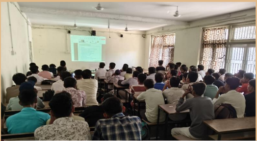

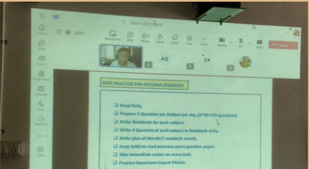

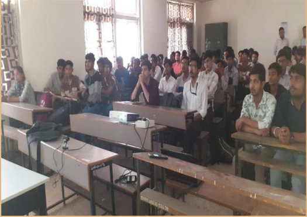

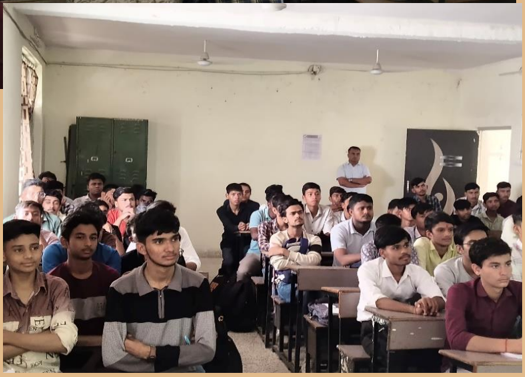

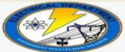

On

## BEST PRACTICES FOR DIPLOMA ENGINEERING STUDENTS

## Key Learnings

- Best Practices for Diploma Studentsin Electrical Engineering
- Time Management Strategic Planning for Exam Success
- Dream Industriesfor Electrical Engineering Students
- Useful Toois and Software for Electrical Engineering students

Pr

SHEIKH PROFESSOR, DEPT GEC Dahod

## Industrial Visit

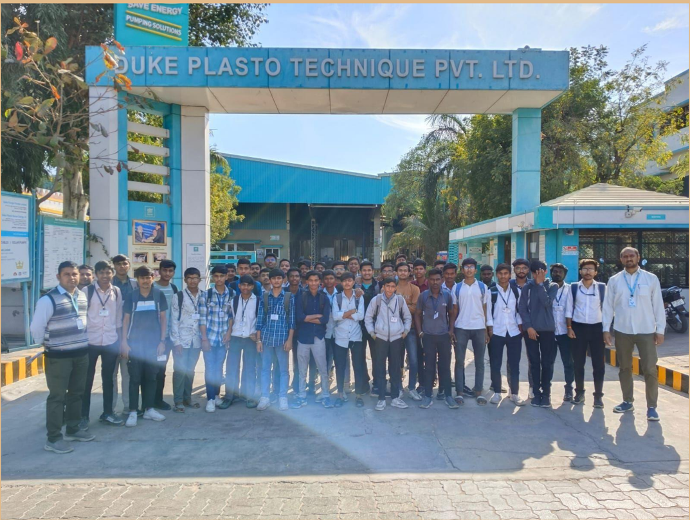

તારીખ 07-02-25 ના રોજ ઇલેક્ટ્રિકલ એન્જજનનયરરિંગ નિભાગના સેમેસ્ટર04 અને સેમેસ્ટર06 ના નિદ્યાર્થીઓ માટે ડ્યુક પમ્પિંગ સોલ્યુશન , ચડ્ોતર ખાતે ઇજડ્સ્િીયલ નિઝીટનુું આયોજન કરિામાું આિેલ હતુું. ઇલેક્ટ્રિકલ નિભાગના વ્યાખ્યાતા ચાિડ્ા સાહેબ અને ભાિસાર સાહેબ નિદ્યાર્થીઓ સાર્થે હાજર રહેલ હતા , અને તેઓનુું માગગદશગન કરેલ હતુું .

ઇજડ્સ્િીયલ નિઝીટ પરનમશન આપિા માટે ઇલેક્ટ્રિકલ ઇજનેરી નિભાગ સરકારી પોલીટેકનીક પાલનપુર Duke Pumps &amp; Motors કું પનીના અનિકારીઓનો આભાર વ્યરત કરે છે .

## 100 kW Solar Plant Demonstration at Campus

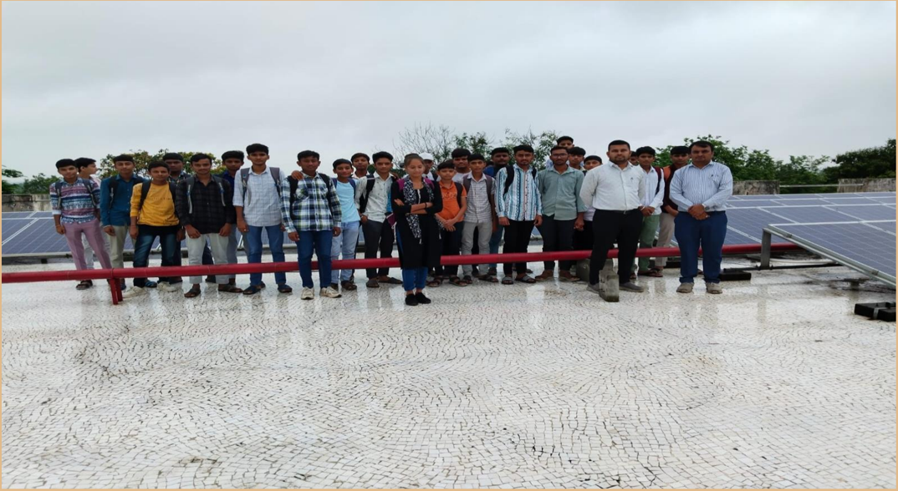

ઇલેક્ટ્રિકલ એન્જજનનયરરિંગ નિભાગ સરકારી પોલીટેકનનક પાલનપુર ખાતે પ્રર્થમ િર્ગમાું પ્રિેશ મેળિેલ નિદ્યાર્થીઓ સોલાર પાિર જનરેશન નિશે મારહતી મેળિે , તે હેતુર્થી તારરખ 02-08-24 નાું રોજ સુંસ્ર્થામાું આિેલ 100 રકલો િોટ પાિર પ્લાજટ પૈકીના મેઇન બબલ્ડ્ીંગ પરના પાિર પ્લાજટની મુલાકાત કરાિેલ હતી .

શ્રી આર પી ચાિડ્ા સાહેબ અને શ્રી એિી ગજ્જર સાહેબે નિદ્યાર્થીઓને સોલાર પાિર પ્લાજટની કાયગ પદ્ધનત નિશે મારહતગાર કરેલ હતા .

## Final Year Project Presentation

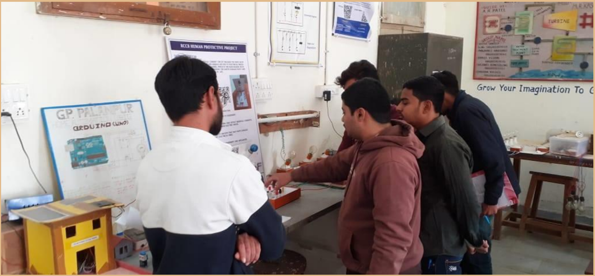

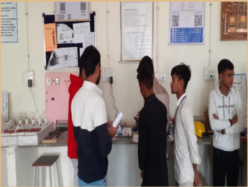

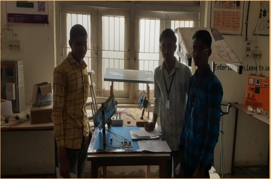

તા 21-12-24 નાું રોજ ફાઇનલ યરનાું નિિાર્થીઓનુું પ્રોજેરટ પ્રેઝજટેશન યોજાયેલ હતુું. નિદ્યાર્થીઓએ એરષટનગલ ફેકલ્ટીને પોતાનાું પ્રોજેરટ નિશે સુંપ ૂ ર્ગ મારહતી તર્થા નનદશગન આપેલ હતુું.

## 15 th  August Celebration

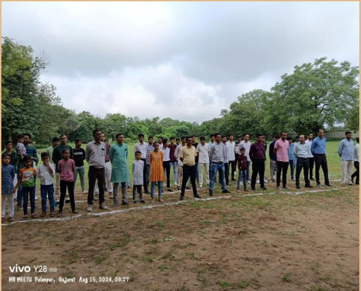

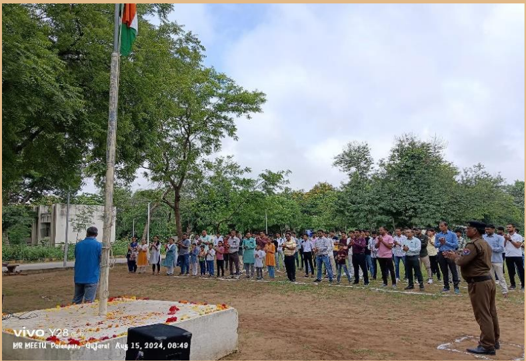

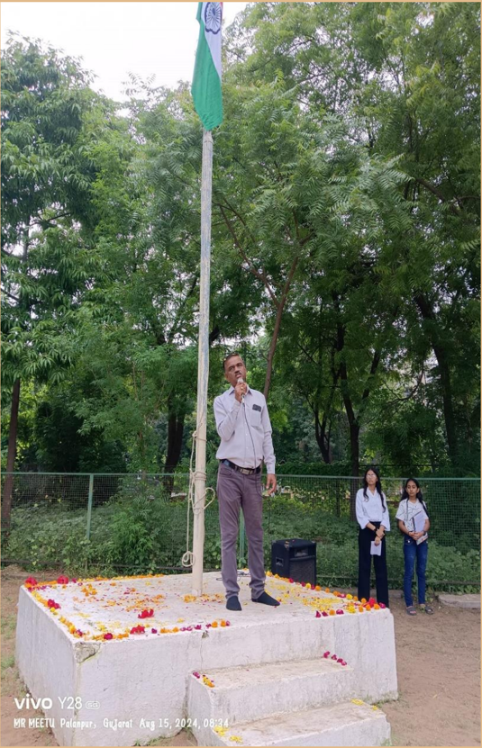

## First Year Orientation  Program

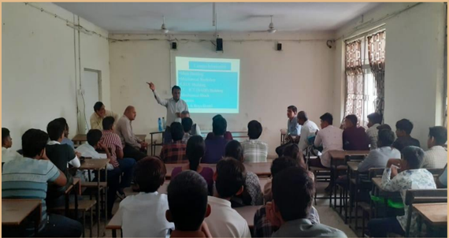

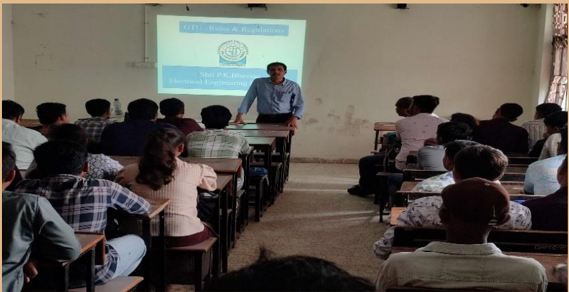

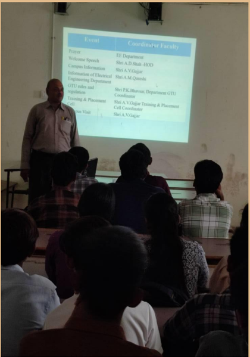

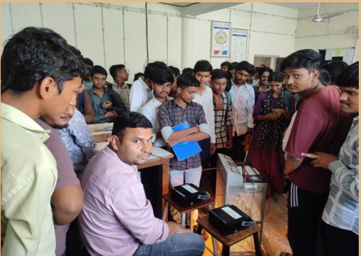

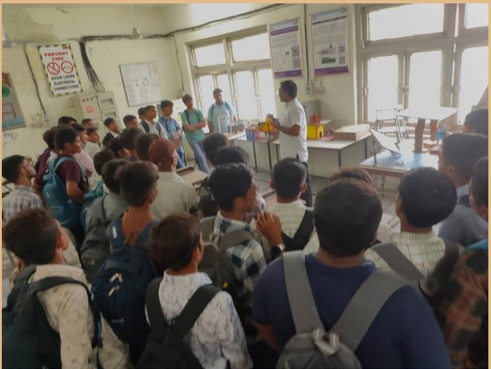

પ્રર્થમ િર્ગ રડ્પ્લોમા ઇલેક્ટ્રિકલ એન્જજનનયરરિંગ ખાતે એડ્નમશન લેનાર નિદ્યાર્થીઓને પ્રાર્થનમક મારહતી મળી રહે તે હેતુર્થી ઓરરએજટેશન પ્રોગ્રામનુું આયોજન કરિામાું આિેલ હતુું .

ઈલેક્ટ્રિકલ ખાતાના િડ્ા શ્રી એ ડ્ી શાહ સાહેબ , પ્રર્થમ િર્ગના કો ઓડ્ીનેટર એ િી ગજ્જર સાહેબ તર્થા નિનિિ .

પોટગફોબલયો િરાિતા નિભાગના નિભાગના વ્યાખ્યાતાઓએ નિદ્યાર્થીઓને માગગદશગન આપેલ હતુું રડ્પાટગ મેજટ ખાતેની નિનિિ લેબોરેટરી નિશે નિદ્યાર્થીઓને મારહતી આપિામાું આિેલી હતી .

## School students at Department Visit

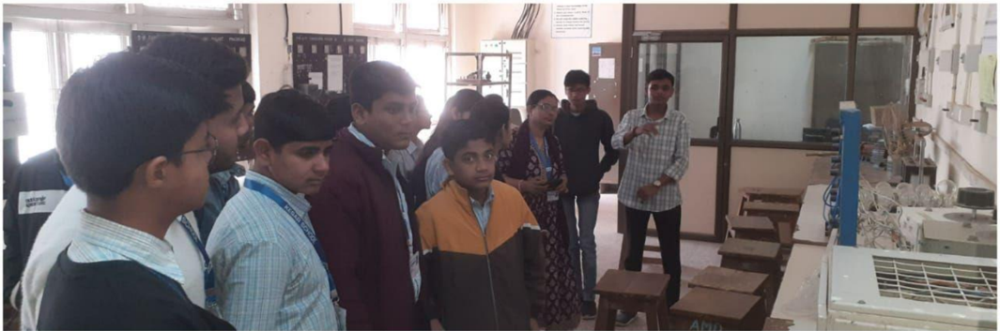

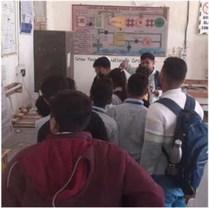

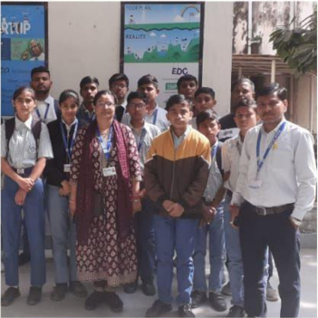

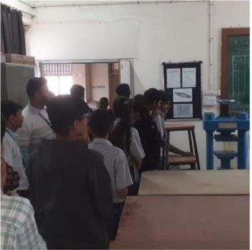

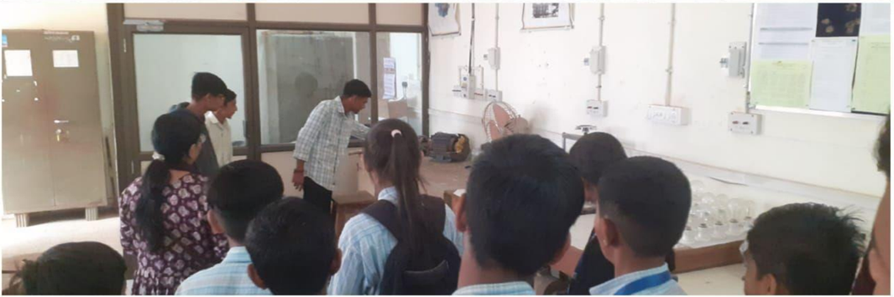

તા 04-02-25 નાું રોજ સરકારી કેસર માધ્યનમક અને ઉચ્ચતર માધ્યનમક શાળા ડ્ીસા ના નિદ્યાર્થીઓએ મુલાકાત લીિેલ હતી.નિદ્યાર્થીઓએ ઇલેક્ટ્રિકલ નિભાગની મુલાકાત પર્ કરી હતી. ઇલેક્ટ્રિકલ એન્જજનનયરરિંગ નિભાગના ફેકલ્ટી  બિજેશ  પટેલ  સાહેબના  માગગદશગનમાું  ઇલેક્ટ્રિકલ  નિભાગના  નિદ્યાર્થીઓ  પુરોરહત  દષ , ગોસ્િામી જીલભારતી અને સૌરિ દ્વારા નિનિિ લેબોરેટરી અંગે મારહતી આપિામાું આિેલ હતી , નિદ્યાર્થીઓએ ઉત્સાહભેર પ્રશ્નો પ ૂ છેલ હતા , અને રડ્પ્લોમા એડ્નમશન અંગે મારહતી મેળિેલ હતી.

## Alumni at the campus

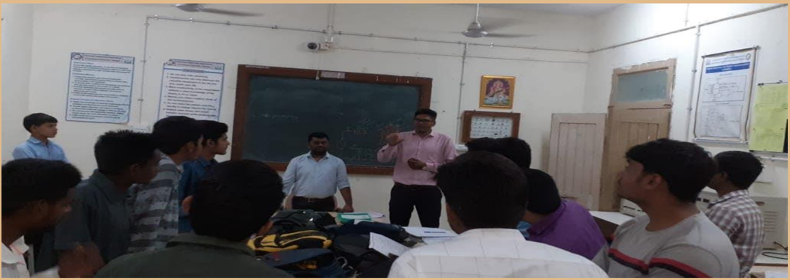

સુંસ્ર્થા  માુંર્થી  િર્ગ 2012 માું પાસ ર્થયેલ અને હાલમાું આઈ.ટી.આઈ રદયોદર ખાતે ઇજસ્િરટર તરીકે ફરજ બજાિતા રનસકભાઈ ચૌિરી સુંસ્ર્થાની મુલાકાતે આિેલ હતા. સેમેસ્ટર 5 ના નિદ્યાર્થીઓ સાર્થે તેમર્ે પોતાના સુંસ્ર્થાના અનુભિો નિશે િાત કરી હતી.

નિદ્યાર્થીઓને આગળ િિિા માટે તેમર્ે ખૂ બ જ પ્રોત્સારહત કયાગ હતા. નિદ્યાર્થીઓએ રસ પ ૂ િગક તેમની િાત સાુંભળી હતી અને કારરકદી માટેના પ્રશ્નો પ ૂ છયા હતા.

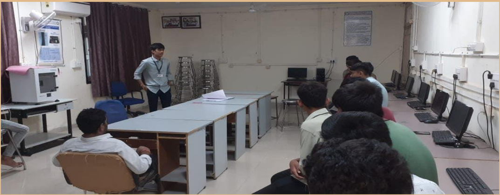

હાલમાું સુઝલોન એનજીમાું નોકરી કરતા અને ઇલેક્ટ્રિકલ રડ્પાટગ મેજટ સરકારી પોલીટેમરનક પાલનપુરના એલ્યુમની એિા જય નિભાગની મુલાકાતે આિેલ હતા ..

પ્રર્થમ િર્ગના નિદ્યાર્થીઓએ જય પાસેર્થી તેના અનુભિો સાુંભળ્યા હતા તર્થા નોકરી માટે માગગદશગન મેળિેલ હતુું , જયે ખૂ બ જ ઉત્સાહપૂ િગક નિદ્યાર્થીઓ સાર્થે િાત કરી હતી . અને પોતાના અનુભિ નિદ્યાર્થીઓ સાર્થે શેર કયાગ હતા.

## Placement -2025

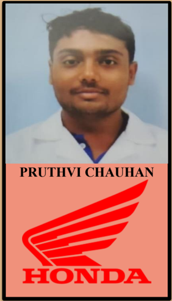

## Ambaji Mandir Visit

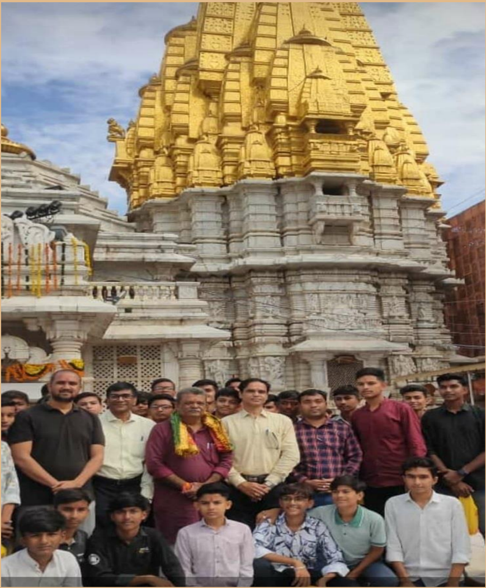

સરકારના સુશાસનના 23 િર્ગ પૂ રા ર્થયા તેને ઉજિર્ી નનનમત્તે તારીખ 11-10-24 નાું રોજ કોલેજના નિદ્યાર્થીઓને અંબાજી મુંરદરે મુલાકાત કરાિિામાું આિેલ હતી .

ઇલેક્ટ્રિકલ એન્જજનનયરરિંગ રડ્પાટગ મેજટના નિદ્યાર્થીઓ સાર્થે માગગદશગન આપિા માટે નસનનયર વ્યાખ્યાતા એ આર પટેલ સાહેબ અને પ્રશાુંત ભાિસાર સાહેબ હાજર રહેલ હતા .

નિદ્યાર્થીઓને પ્રોત્સાહન આપિા માટે િારાસભ્ય શ્રી અનનકેત ઠાકર સાહેબ હાજર રહેલા હતા .

## Navratri Celebration

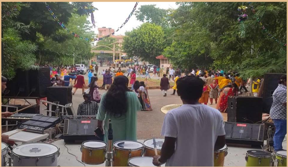

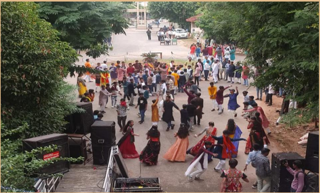

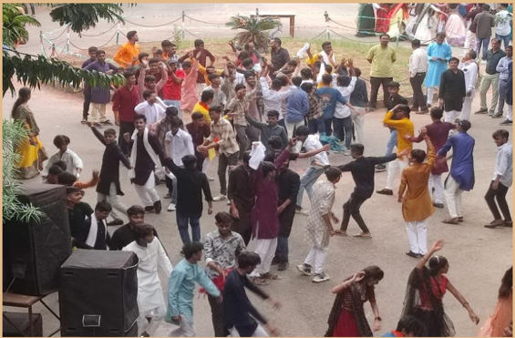

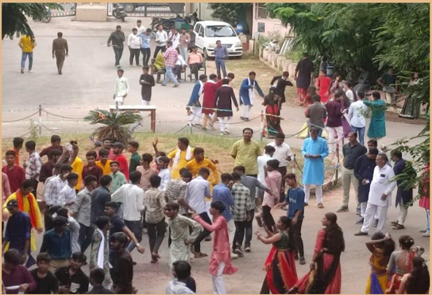

## EDITORIAL BOARD

1. Shri A.R. Patel - Lecturer, EE Department
2. Shri B.M.Patel - Lecturer , EE Department
3. Shri A.M.Qureshi - Lecturer, EE Department
4. Kathik Dipak - 5 th  Semester, EE Department
5. Chauhan Saurav - 5 th  Semester, EE Department
6. Solanki Himanshubrother - 3 rd  Semester, EE Department
7. Patel Chetankumar- 3 rd  Semester, EE Department

For any queries and suggestion ABOUT 'SPARK' please do write to us: Electrical engineering department Government polytechnic, Palanpur Outside malan gate, Palanpur Website: http://www.gppp.cteguj.in/ Email- id: gppelect09@gmail.com FACEBOOK PAGE: https://www.facebook.com/Gppelect09

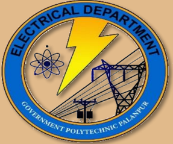