## Civil Engineering

## PART B: Criteria Summary

| Critera No.    | Criteria                                                  | Total Marks    | Institute Marks   |
|----------------|-----------------------------------------------------------|----------------|-------------------|
| 1              | VISION, MISSION AND PROGRAM EDUCATIONAL OBJECTIVES        | 50             | 48.00             |
| 2              | PROGRAM CURRICULUM AND TEACHING - LEARNING PROCESSES      | 200            | 169.00            |
| 3              | COURSE OUTCOMES AND PROGRAM OUTCOMES                      | 100            | 95.00             |
| 4              | STUDENTS' PERFORMANCE                                     | 200            | 91.14             |
| 5              | FACULTY INFORMATION AND CONTRIBUTIONS                     | 150            | 118.00            |
| 6              | FACILITIES AND TECHNICAL SUPPORT                          | 100            | 87.00             |
| 7              | CONTINOUS IMPROVEMENT                                     | 75             | 64.00             |
| 8              | STUDENT SUPPORT SYSTEMS                                   | 50             | 42.00             |
| 9              | GOVERNANCE, INSTITUTIONAL SUPPORT AND FINANCIAL RESOURCES | 75             | 70.00             |
| Total 1000 784 | Total 1000 784                                            | Total 1000 784 | Total 1000 784    |

## Part B

1 1 VISION, MISSION AND PROGRAM EDUCATIONAL OBJECTIVES VISION, MISSION AND PROGRAM EDUCATIONAL OBJECTIVES (50) (50)

1.1 State the Vision and Mission of the Department and Institution (5)

To produce competent diploma engineers as per need of industries and entrepreneurs with ethical values.

Vision of the institute

Total Marks Total Marks   48.00 48.00

## Total Marks 5.00

Institute Marks

5.00

| Mission of the institute   | Government Polytechnic, Palanpur strives to impart… • Industry oriented technical education. • Excellent teaching and learning environment. • Promote entrepreneurship activities. • Continual growth in every sphere of life by developing core human values.   |
|----------------------------|------------------------------------------------------------------------------------------------------------------------------------------------------------------------------------------------------------------------------------------------------------------|
| Vision of the Department   | The department envisions to achieve professionals in emerging field of civil engineering to meet aspirations of the society by  transforming students to be technically skilled entrepreneurs, ethical and environmentally sensible civil engineers.             |

## Mission of the Department

| Mission No.   | Mission Statements                                                                                                                         |
|---------------|--------------------------------------------------------------------------------------------------------------------------------------------|
| M1            |                                                                                                                                            |
| M2            | Establish industry collaboration through internship and interaction with professional society through  experts, workshops                  |
| M3            | Promote leadership, management and entrepreneurship skills in a student through various projects, co- curriculum, extra-curriculum events. |
| M4            |                                                                                                                                            |

## 1.2 State the Program Educational Objectives (PEOs) (5)

| PEO No.   | Program Educational Objectives Statements                                                                                                          | Program Educational Objectives Statements                                                                                                          |
|-----------|----------------------------------------------------------------------------------------------------------------------------------------------------|----------------------------------------------------------------------------------------------------------------------------------------------------|
| PEO1      | Exhibit technical and leadership capabilities for providing sustainable solutions to various Civil Engineering problems with  professional ethics. | Exhibit technical and leadership capabilities for providing sustainable solutions to various Civil Engineering problems with  professional ethics. |
| PEO2      | Inculcate state of the art technology for efficient implementation of Civil Engineering projects.                                                  | Inculcate state of the art technology for efficient implementation of Civil Engineering projects.                                                  |

## Total Marks 5.00

## Institute Marks

5.00

| PEO3   | Enhance social and economical commitment by entrepreneurial spirit as job creators.          |
|--------|----------------------------------------------------------------------------------------------|
| PEO4   | Pursue higher education and improve learning spirit in the context of technological changes. |

## 1.3 Indicate where and how the Vision, Mission and PEOs are published and disseminated among stakeholders (10)

The Vision and Mission of the department are published and disseminated through following:

|   Sr. No. | Place of Dissemination                                                     |
|-----------|----------------------------------------------------------------------------|
|         1 | Institute Website                                                          |
|         2 | Display Board at the entrance of department and Corridors                  |
|         3 | Departmental Notice Board                                                  |
|         5 | Principal office, HOD Office, Departmental Laboratories and Faculty cabins |
|         6 | College Campus like Library Hall, college Canteen, Seminar Hall            |

The PEOs of the department are published and disseminated through

|   Sr. No. | Place of Dissemination                                    |
|-----------|-----------------------------------------------------------|
|         1 | Institute Website                                         |
|         2 | Departmental Notice Board                                 |
|         3 | HOD Office, Departmental Laboratories, and Faculty cabins |

## Total Marks 10.00

## Institute Marks

10.00

Total Marks 15.00

Institute Marks

With the active participation of HOD, Internal Quality Assessment Committee, faculty members and staff along with the continuous feedback from stakeholders, the Vision and Mission statement of the department was discussed and developed in various meetings in alignment with Vision and Mission of the Institute.

The Vision and Mission Statements of the department have been revised by considering the institutional Vision and Mission. The department has adopted a consultative approach to establish its vision and mission by involving the stakeholders of the institute such as faculty, students, staff, parents, alumni, industrial experts, and employers. While articulating the vision and mission statements for the department the future technology and societal requirements were also considered. The whole process is illustrated through the flow chart shown as under.

Fig 1.4.1 Process for Defining Vision and Mission ofthe Department

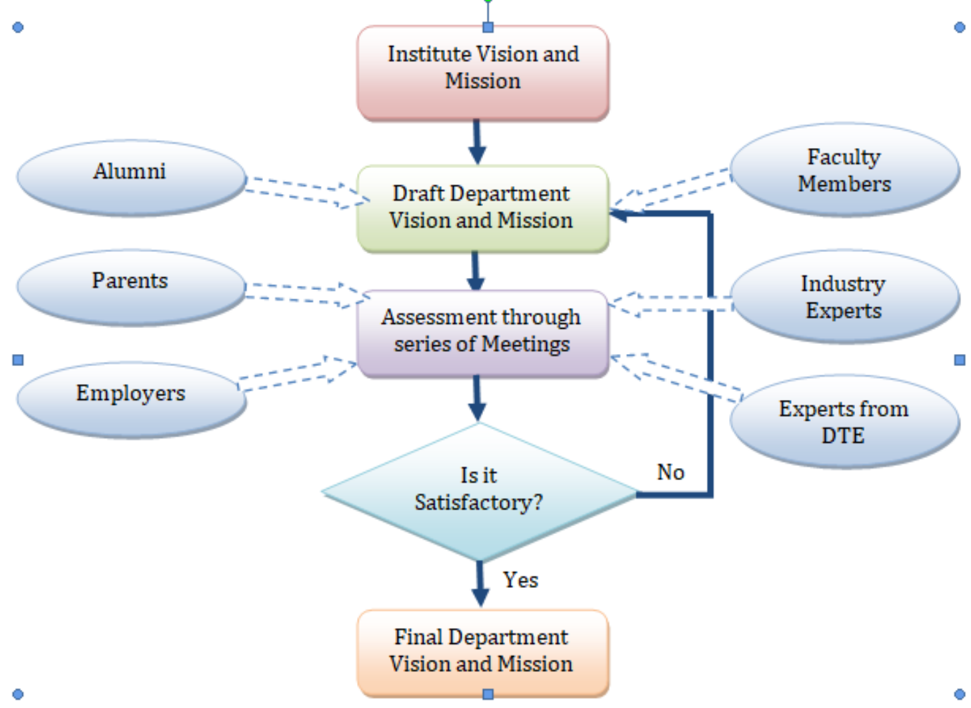

- Considering the institutional Vision and Mission as the base and incorporating global projections in the field of Civil Engineering and allied fields, the Vision and Mission Statements of the department have been defined.
- The departmental faculty members met number of times to develop and cultivate a strong and meaningful Vision and Mission statements (fig. 1.4.3.a)
- A series of discussions were conducted simultaneously among Program Assessment Committee (PAC), Alumni representatives, Industry experts and Training experts to finalize the Vision, Mission and PEOs. (fig. 1.4.3.b)

PEOs are the characteristics of graduates of a program, which enable the students to become successful professionals in their field.

The department has documented measurable PEOs for its Diploma in Civil Engineering program taking into account the program's constituencies and the mission of the institute.

The PEOs are established in the light of the vision and mission statements of the department. Our process for establishing and revising Program Educational Objectives (PEOs) is depicted in fig. 1.4.2

Vision and Mission of the Institute, Department and Graduate attributes recommended by NBA are taken as directorial factors in forming the PEOs. Stakeholder inputs are obtained through extensive surveys with follow-up telephone calls by the Department HOD and associated faculties.

fia1.4.2. Process for Defining PEOs ofthe Deportment

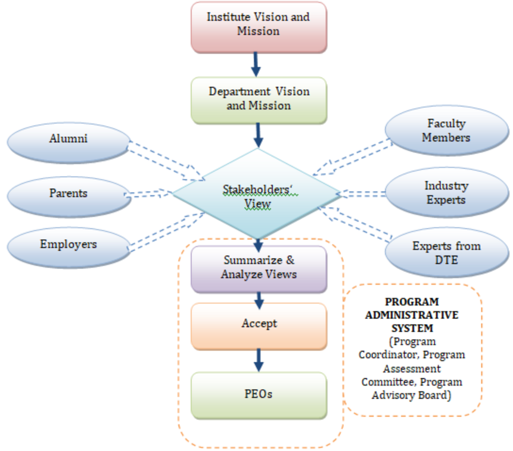

Mission and PEOs

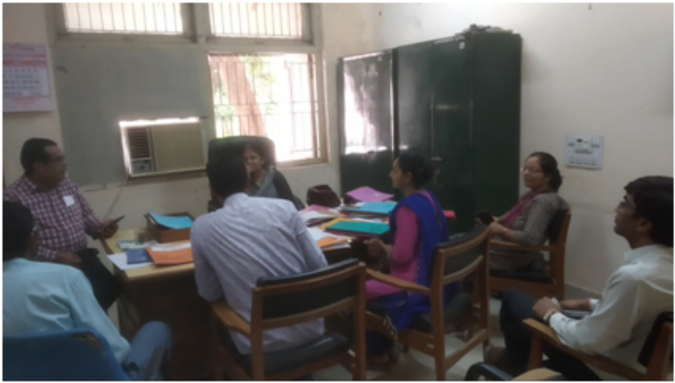

Flg 1.4.3.b. Meetings for Discussion about Vision-Mission &amp; PEOs with Stakeholders

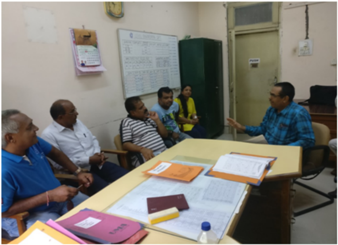

The Vision, Mission and PEOs were finalized based on the following components:

- Departmental meeting
- Feedback from industries
- Feedback from students/ alumni
- Feedback from training and placement department
- Parents meet

1.5 Establish Consistency of PEOs with Mission of the Department (15)

## Total Marks 13.00

## Institute Marks

13.00

The PEOs ensure the accomplishments of the mission of the Department with special emphasis on technical competence of engineers, value addition sustainable solutions to engineering problems. For the mapping of PEOs and Mission, several meetings of the faculty members were conducted at department level. The feedback of the faculty members was taken into consideration and the mapping was finalized as below.

| PEO Statements                                                                                                                                    |   M1 |   M2 |   M3 |   M4 |
|---------------------------------------------------------------------------------------------------------------------------------------------------|------|------|------|------|
| Exhibit technical and leadership capabilities for providing sustainable solutions to various Civil Engineering problems with professional ethics. |    3 |    3 |    3 |    3 |
| Inculcate state of the art technology for efficient implementation of Civil Engineering projects.                                                 |    3 |    2 |    2 |    2 |

Enhance social and economical commitment by entrepreneurial spirit as job creators.

3

2

2

3

Pursue higher education and improve learning spirit in the context of technological changes.

2

2

2

3

## 2 2 PROGRAM CURRICULUM AND TEACHING - LEARNING PROCESSES PROGRAM CURRICULUM AND TEACHING - LEARNING PROCESSES (200) (200)

## Total Marks Total Marks   169.00 169.00

## 2.1 Program Curriculum (40)

## Total Marks 39.00

All POs and PSOs are being demonstrably met through Curriculum ? :

--Select--

- 2.1.1 State the process used to identify extent of compliance of the Board curriculum for attaining the Program Outcomes (POs) and Program Specific Outcomes (PSOs) as mentioned in AnnexureI. Also mention the identified curricular gaps, if any (25)

Institute Marks

25.00

- A. Process used to identify extent of compliance of curriculum for attaining POs &amp; PSOs (15)

## Institute Marks

15.00

Government Polytechnic Palanpur is affiliated under Gujarat Technological University (GTU), Ahmadabad. The university has well defined process to frame curriculum. The meetings of stakeholders are arranged by university at BOS (Board of Studies). Feedback and opinion is taken from stakeholders is recorded and need of industry is accessed and existing curriculum is revised as per guideline of AICTE.

## Structure of the Program Curriculum

## BRA N CH CODE: 06 DIPLOMA PROGRAMME I N CIVIL E N GI N EERI N G

## SEMESTER - I

COURSE CODE

COURSE TITLE

TEACHI

N

G SCHEME/WEEK

CREDITS (L+T+P)

EXAMI

N

ATIO

N

SCHEME

L

T

P

THEORY

PRACTICAL

GRA

N

D TOTAL

ESE

PA

ESE

PA

3300001

BASIC MATHEMATICS

2

2

0

4

70

30

0

0

100

| 3300002   | ENGLISH                         |   3 |   2 |   0 |   5 |   70 |   30 |   20 |   30 |   150 |
|-----------|---------------------------------|-----|-----|-----|-----|------|------|------|------|-------|
| 3300003   | ECHM                            |   4 |   0 |   0 |   4 |   70 |   30 |    0 |    0 |   100 |
| 3300004   | ENGINEERING PHYSICS (GROUP- 1)  |   3 |   0 |   2 |   5 |   70 |   30 |   20 |   30 |   150 |
| 3300007   | BASIC ENGINEERING DRAWING       |   2 |   0 |   4 |   6 |   70 |   30 |   40 |   60 |   200 |
| 3300012   | Computer Application & Graphics |   0 |   0 |   4 |   4 |    0 |    0 |   40 |   60 |   100 |
| TOTAL     | TOTAL                           |  14 |   4 |  10 |  28 |  350 |  150 |  120 |  180 |   800 |

ESE: END SEMESTER EXAM PA: PROGRESSIVE ASSESSMENT           L: LECTURE P: PRACTICAL T: TUTORIAL

ESE for Practical includes Viva/Practical exam/Performance etc.

PA for Practical includes TW/Report writing/Mini Project/Seminar etc. related to practical

PA for Theory includes Written Exam /Assignment/Tutorial Work/Mini Project/Quiz/Presentation

COURSE CODE

COURSE TITLE

1990001

3320003

3300008

Contributory Personality Development

Advanced Mathematics (GROUP- 2)

Applied Mechanics

Applied Chemistry

## BRA N CH CODE: 06 DIPLOMA PROGRAMME I N CIVIL E N GI N EERI N G

## SEMESTER - II

TEACHI

L

4

2

3

N

G SCHEME

T

0

2

0

P

0

0

2

CREDITS (L+T+P)

4

4

5

ESE

70

70

70

THEORY

PA

30

30

30

EXAMI

N

ATIO

N

SCHEME

PRACTICAL

ESE

20

0

20

PA

30

0

30

GRA

N

D TOTAL

150

100

150

| 3300009   | (GROUP- 1)                          |   3 |   0 |   2 |   5 |   70 |   30 |   20 |   30 |   150 |
|-----------|-------------------------------------|-----|-----|-----|-----|------|------|------|------|-------|
| 3320601   | Building Drawing                    |   2 |   0 |   4 |   6 |   70 |   30 |   40 |   60 |   200 |
| 3320602   | Basic Mechanical Engineering        |   0 |   1 |   2 |   3 |    0 |    0 |   20 |   30 |    50 |
| 3320603   | Civil Engineering Workshop Practice |   0 |   0 |   4 |   4 |    0 |    0 |   40 |   60 |   100 |
| TOTAL     | TOTAL                               |  14 |   3 |  14 |  31 |  350 |  150 |  160 |  240 |   900 |

## BRA N CH CODE: 06 DIPLOMA PROGRAMME I N CIVIL E N GI N EERI N G

## SEMESTER - III

D TOTAL

|             |                         | TEACHI N G SCHEME   | TEACHI N G SCHEME   | TEACHI N G SCHEME   | TEACHI N G SCHEME   | EXAMI N ATIO N  SCHEME   | EXAMI N ATIO N  SCHEME   | EXAMI N ATIO N  SCHEME   | EXAMI N ATIO N  SCHEME   | EXAMI N ATIO N  SCHEME   |
|-------------|-------------------------|---------------------|---------------------|---------------------|---------------------|--------------------------|--------------------------|--------------------------|--------------------------|--------------------------|
| COURSE CODE | COURSE TITLE            | L                   | T                   | P                   | CREDITS (L+T+P)     | THEORY MARKS             | THEORY MARKS             | PRACTICAL MARKS          | PRACTICAL MARKS          | GRA N                    |
|             |                         |                     |                     |                     |                     | ESE                      | PA                       | ESE                      | PA                       |                          |
| 3330601     | Building Material       | 3                   | 0                   | 2                   | 5                   | 70                       | 30                       | 20                       | 30                       | 150                      |
| 3330602     | Construction Technology | 3                   | 0                   | 2                   | 5                   | 70                       | 30                       | 20                       | 30                       | 150                      |
| 3330603     | Hydraulics              | 3                   | 1                   | 2                   | 6                   | 70                       | 30                       | 20                       | 30                       | 150                      |
| 3330604     | Structural Mechanics    | 4                   | 1                   | 2                   | 7                   | 70                       | 30                       | 20                       | 30                       | 150                      |
| 3330605     | Surveying               | 3                   | 0                   | 6                   | 9                   | 70                       | 30                       | 60                       | 90                       | 250                      |
| TOTAL       | TOTAL                   | 16                  | 2                   | 14                  | 32                  | 350                      | 150                      | 140                      | 210                      | 850                      |

COURSE CODE

3350601

3350602

COURSE TITLE

Design of Steel Structure

Concrete Technology

## BRA N CH CODE: 06 DIPLOMA PROGRAMME I N CIVIL E N GI N EERI N G

## SEMESTER - IV

|             |                                | TEACHI N G SCHEME   | TEACHI N G SCHEME   | TEACHI N G SCHEME   | TEACHI N G SCHEME   | EXAMI N ATIO N  SCHEME   | EXAMI N ATIO N  SCHEME   | EXAMI N ATIO N  SCHEME   | EXAMI N ATIO N  SCHEME   | EXAMI N ATIO N  SCHEME   |
|-------------|--------------------------------|---------------------|---------------------|---------------------|---------------------|--------------------------|--------------------------|--------------------------|--------------------------|--------------------------|
| COURSE CODE | COURSE TITLE                   | L                   | T                   | P                   | CREDITS (L+T+P)     | THEORY MARKS             | THEORY MARKS             | PRACTICAL MARKS          | PRACTICAL MARKS          | GRA N D TOTAL            |
|             |                                |                     |                     |                     |                     | ESE                      | PA                       | ESE                      | PA                       |                          |
| 3340601     | Structural Mechanics-II        | 3                   | 0                   | 2                   | 5                   | 70                       | 30                       | 20                       | 30                       | 150                      |
| 3340602     | Adv. Surveying                 | 3                   | 0                   | 6                   | 9                   | 70                       | 30                       | 60                       | 90                       | 250                      |
| 3340603     | Basics of Transportation Engg. | 3                   | 0                   | 2                   | 5                   | 70                       | 30                       | 20                       | 30                       | 150                      |
| 3240604     | Water Resources Management     | 3                   | 0                   | 2                   | 5                   | 70                       | 30                       | 20                       | 30                       | 150                      |
| 3340605     | Soil Mechanics                 | 3                   | 0                   | 2                   | 5                   | 70                       | 30                       | 20                       | 30                       | 150                      |
| 3340606     | Computer Aided Drawing         | 0                   | 0                   | 4                   | 4                   | 0                        | 0                        | 40                       | 60                       | 100                      |
| TOTAL       | TOTAL                          | 15                  | 0                   | 18                  | 33                  | 350                      | 150                      | 180                      | 270                      | 950                      |

## BRA N CH CODE: 06 DIPLOMA PROGRAMME I N CIVIL E N GI N EERI N G

## SEMESTER - V

TEACHI

N

G SCHEME

P

4

2

L

3

3

T

0

0

CREDITS (L+T+P)

7

5

THEORY MARKS

ESE

PA

70

70

30

30

EXAMI

N

ATIO

N

SCHEME

PRACTICAL MARKS

ESE

PA

40

20

60

30

GRA

N

D TOTAL

200

150

| 3350603   | Water Supply & Sanitary Engg.   |   3 |   0 |   2 |   5 |   70 |   30 |   20 |   30 |   150 |
|-----------|---------------------------------|-----|-----|-----|-----|------|------|------|------|-------|
| 3350604   | Estimating, Costing & Valuation |   3 |   0 |   4 |   7 |   70 |   30 |   40 |   60 |   200 |
|           | Elective - I                    |   3 |   0 |   2 |   5 |   70 |   30 |   20 |   30 |   150 |
| 3350609   | Project-I                       |   0 |   0 |   4 |   4 |    0 |    0 |   40 |   60 |   100 |
| TOTAL     | TOTAL                           |  15 |   0 |  18 |  33 |  350 |  150 |  180 |  270 |   950 |

## ELECTIVE-I

3350605

3350606

3350607

3350608

COURSE CODE

3360601

Advanced Construction Technology

HIGHWAY ENGINEERING

IRRIGATION ENGINEERING

ENVIRONMENTAL ENGINEERING &amp;POLLUTION CONTROL

## BRA N CH CODE: 06 DIPLOMA PROGRAMME I N CIVIL E N GI N EERI N G

## SEMESTER - VI

TEACHI

N

G SCHEME

P

4

COURSE TITLE

Design of Reinforced Concrete

L

3

T

0

CREDITS (L+T+P)

7

THEORY MARKS

ESE

PA

70

30

EXAMI N ATIO N SCHEME

PRACTICAL MARKS

ESE

PA

40

60

GRA

N

D TOTAL

200

| 3360602   | Construction Quality Control & Monitoring     |   3 |   0 |   2 |   5 |   70 |   30 |   20 |   30 |   150 |
|-----------|-----------------------------------------------|-----|-----|-----|-----|------|------|------|------|-------|
| 3360603   | Construction Project Management               |   3 |   0 |   2 |   5 |   70 |   30 |   20 |   30 |   150 |
|           | Elective-II (First Course From Any One Group) |   3 |   0 |   2 |   5 |   70 |   30 |   20 |   30 |   150 |
|           | Elective-III (Second Course From Same Group)  |   3 |   0 |   2 |   5 |   70 |   30 |   20 |   30 |   150 |
| 3360613   | Project-II                                    |   0 |   0 |   6 |   6 |    0 |    0 |   40 |   60 |   100 |
| TOTAL     | TOTAL                                         |  15 |   0 |  18 |  33 |  350 |  150 |  160 |  240 |   900 |

ELECTIVE-II, III (A N Y O N E GROUP)

GROUP- A

3360604

3360605

3360606

3360607

3360608

3360609

3360610

Building Services

Maintenance &amp; Rehabilitation of Structures

## GROUP ÐB

Railway , Harbour &amp; Tunnel Engineering

Traffic Engineering

Pavement Design

GROUP Ð C

Ground Water Engineering

Advance Hydrology

GROUP Ð D

|   3360611 | Solid Waste Management           |
|-----------|----------------------------------|
|   3360612 | Water And Waste Water Management |

As per the affiliated university GTU student evaluation process has mainly four components which are as follows:

1. End Semester Examination (ESE) Ð Theory paper (70 marks)

For assessment Ð University exam paper taken

2. Progressive Assessment (PA) Ð Part of theory (30 marks)

For assessment Ð CO wise Test/ assignments/ Exit Test etc. can be taken for continuous evaluation. All the activities cover all the COs during the semester.

3. Practical (ESE)

For assessment Ð practical exam, viva, test etc. can be taken by the examiner. For Final (Third) year students external examiner is appointed by the University.

## 4. Practical (PA)

Evaluation of component (1) is conducted at the end of the semester for all the courses by university. ESE forms a major component of overall performance measure and attainment calculation which is of 70 marks each for almost all the courses.

Evaluation of Component (2), (3) and (4) are completely under the purview of the department till 4th Semester.

External evaluation of component (3) is done in subsequent semesters 5 and 6. These evaluations of all the components lead to the determination of course outcomes and further to the POs and PSOs.

Project work is to be done by the student which is based on the theoretical and practical learning of many of the course ranging from basic to advanced concepts. It gives an opportunity to develop professional skills like communication skills, team work, leadership etc. The students have the freedom to select projects of their choice in consultation with the faculties.

## CO-PO AND PO-PSO ARTICULATION MATRIX

| Sr No   | Course Name   | CO     |   PO1 | PO2   | PO3   | PO4   | PO5   | PO6   |   PO7 |      | PSO1 PSO2 PSO3   |      |
|---------|---------------|--------|-------|-------|-------|-------|-------|-------|-------|------|------------------|------|
|         |               | C101.1 |     3 | 1     | 0     | 0     | 0     | 0     |  1    | 1    | 1                | 1    |
|         |               | C101.2 |     3 | 1     | 0     | 0     | 0     | 0     |  1    | 1    | 1                | 0    |
|         |               | C101.3 |     3 | 1     | 0     | 0     | 0     | 0     |  1    | 1    | 1                | 1    |
| 1       | BASIC         | C101.4 |     0 | 0     | 0     | 0     | 0     | 0     |  0    | 0    | 0                | 0    |
|         | MATHEMATICS   | C101.5 |     0 | 0     | 0     | 0     | 0     | 0     |  0    | 0    | 0                | 0    |
|         |               | C101.6 |     0 | 0     | 0     | 0     | 0     | 0     |  0    | 0    | 0                | 0    |
|         |               | AVG    |     3 | 1.00  |       |       |       |       |  1    | 1.00 | 1.00             | 1.00 |
|         |               | C102.1 |     3 | 0     | 0     | 0     | 0     | 1     |  2    | 0    | 0                | 0    |
|         |               | C102.2 |     3 | 0     | 0     | 0     | 0     | 0     |  2    | 0    | 0                | 0    |
|         |               | C102.3 |     3 | 0     | 0     | 0     | 0     | 2     |  1    | 0    | 0                | 0    |
| 2       | ENGLISH       | C102.4 |     0 | 0     | 0     | 0     | 0     | 0     |  0    | 0    | 0                | 0    |
|         |               | C102.5 |     0 | 0     | 0     | 0     | 0     | 0     |  0    | 0    | 0                | 0    |
|         |               | C102.6 |     0 | 0     | 0     | 0     | 0     | 0     |  0    | 0    | 0                | 0    |
|         |               | AVG    |     3 |       |       |       |       | 1.50  |  1.67 |      |                  |      |
|         |               | C103.1 |     2 | 2     | 0     | 0     | 1     | 0     |  2    | 0    | 0                | 0    |
|         | ENVIRONMENT   | C103.2 |     1 | 2     | 1     | 0     | 1     | 0     |  2    | 0    | 0                | 0    |
|         | CONSERVATION  | C103.3 |     2 | 2     | 2     | 1     | 2     | 0     |  1    | 0    | 0                | 0    |
| 3       |               | C103.4 |     1 | 3     | 2     | 0     | 3     | 1     |  3    | 0    | 0                | 0    |

AND HAZARD

4

5

6

7

8

9

10

| MANAGEMENT           | C103.5        | 0      | 0      | 0    | 0    | 0      | 0    | 0    | 0    | 0    | 0    |
|----------------------|---------------|--------|--------|------|------|--------|------|------|------|------|------|
|                      | C103.6        | 0      | 0      | 0    | 0    | 0      | 0    | 0    | 0    | 0    | 0    |
|                      | AVG           | 1.50   | 2.25   | 1.67 | 1.00 | 1.75   | 1.00 | 2.00 |      |      |      |
|                      | C104.1        | 2      | 1      | 1    | 0    | 0      | 0    | 1    | 1    | 0    | 0    |
|                      | C104.2        | 2      | 1      | 1    | 0    | 0      | 0    | 0    | 1    | 1    | 0    |
| ENGINEERING          | C104.3        | 2      | 1      | 1    | 0    | 0      | 0    | 0    | 1    | 0    | 0    |
| PHYSICS (GROUP-      | C104.4        | 0      | 0      | 0    | 0    | 0      | 0    | 0    | 0    | 0    | 0    |
| 1)                   | C104.5        | 0      | 0      | 0    | 0    | 0      | 0    | 0    | 0    | 0    | 0    |
|                      | C104.6        | 0      | 0      | 0    | 0    | 0      | 0    | 0    | 0    | 0    | 0    |
|                      | AVG           | 2.00   | 1.00   | 1.00 |      |        |      | 1.00 | 1.00 | 1.00 |      |
|                      | C105.1        | 2      | 0      | 1    | 3    | 2      | 1    | 1    | 0    | 0    | 0    |
|                      | C105.2        | 2      | 2      | 0    | 3    | 1      | 1    | 1    | 0    | 0    | 0    |
| BASIC                | C105.3        | 2      | 2      | 0    | 3    | 1      | 1    | 1    | 0    | 0    | 0    |
| ENGINEERING          | C105.4        | 2      | 2      | 0    | 3    | 1      | 1    | 1    | 0    | 0    | 0    |
| DRAWING              | C105.5        | 2      | 3      | 2    | 3    | 1      | 1    | 1    | 0    | 0    | 1    |
|                      | C105.6        | 0      | 0      | 0    | 0    | 0      | 0    | 0    | 0    | 0    | 0    |
|                      | AVG           | 2.00   | 2.25   | 1.50 | 3.00 | 1.20   | 1.00 | 1.00 |      |      | 1.00 |
|                      | C106.1        | 3      | 1      | 3    | 2    | 0      | 1    | 2    | 0    | 0    | 0    |
|                      | C106.2        | 3      | 0      | 1    | 2    | 0      | 1    | 2    | 0    | 0    | 0    |
| COMPUTER             | C106.3        | 3      | 1      | 2    | 2    | 1      | 2    | 2    | 0    | 0    | 0    |
| APPLICATION &        | C106.4        | 3      | 1      | 3    | 3    | 0      | 2    | 2    | 0    | 0    | 0    |
| GRAPHICS             | C106.5        | 0      | 0      | 0    | 0    | 0      | 0    | 0    | 0    | 0    | 0    |
|                      | C106.6        | 0      | 0      | 0    | 0    | 0      | 0    | 0    | 0    | 0    | 0    |
|                      | AVG           | 3.00   | 1.00   | 2.25 | 2.25 | 1.00   | 1.50 | 2.00 |      |      |      |
|                      | C107.1        | 2      | 3      | 0    | 0    | 0      | 0    | 2    | 0    | 0    | 0    |
|                      | C107.2        | 2      | 2      | 0    | 0    | 0      | 0    | 1    | 0    | 0    | 0    |
| APPLIED              | C107.3        | 2      | 2      | 0    | 0    | 0      | 0    | 0    | 0    | 0    | 0    |
| MECHANICS            | C107.4        | 2      | 2      | 0    | 0    | 0      | 0    | 0    | 0    | 0    | 0    |
|                      | C107.5        | 2      | 2      | 0    | 3    | 0      | 0    | 1    | 0    | 0    | 0    |
|                      | C107.6        | 0      | 0      | 0    | 0    | 0      | 0    | 0    | 0    | 0    | 0    |
|                      | AVG           | 2.00   | 2.20   |      | 3.00 |        |      | 1.33 |      |      |      |
|                      | C108.1        | 0      | 0      | 0    | 0    | 0      | 0    | 0    | 0    | 0    | 0    |
|                      | C108.2        | 2      | 0      | 0    | 0    | 0      | 0    | 0    | 2    | 0    | 0    |
| APPLIED              | C108.3        | 3      | 1      | 0    | 0    | 0      | 0    | 1    | 0    | 0    | 0    |
| CHEMISTRY            | C108.4        | 0      | 0      | 0    | 0    | 0      | 0    | 0    | 0    | 0    | 0    |
| (GROUP-1)            | C108.5        | 0      | 0      | 0    | 0    | 0      | 0    | 0    | 0    | 0    | 0    |
|                      | C108.6        |        |        | 0    | 0    | 0      | 0    | 0    | 0    | 0    | 0    |
|                      | AVG           | 0      | 0      |      |      |        |      | 1.00 | 2.00 |      |      |
|                      | C109.1        | 2.50 3 | 1.00 1 | 0    | 0    | 0      | 0    | 1    | 1    | 1    | 0    |
|                      | C109.2        | 3      | 1      | 0    | 0    | 0      | 0    | 1    | 0    | 1    | 1    |
| ADVANCED MATHEMATICS | C109.3        | 3      | 1      | 0    | 0    | 0      | 0    | 1    | 1    | 1    | 1    |
|                      | C109.4        | 0      | 0      | 0    | 0    | 0      | 0    | 0    | 0    | 0    | 0    |
| (GROUP-2)            | C109.5        | 0      | 0      | 0    | 0    | 0      | 0    | 0    | 0    | 0    | 0    |
|                      | C109.6        | 0      | 0      | 0    | 0    | 0      | 0    | 0    | 0    | 0    | 0    |
|                      | AVG           | 3.00   | 1.00   |      |      |        |      | 1.00 | 1.00 | 1.00 | 1.00 |
|                      | C110.1        | 3      | 2      | 2    | 1    | 0      | 0    | 3    | 0    | 0    | 0    |
|                      |               |        |        |      |      |        | 2    | 3    | 0    |      |      |
|                      | C110.2        | 2      | 3      | 3    | 3    | 3      |      |      |      | 0    | 0    |
| BUILDING             | C110.3        | 2      | 0      | 0    | 2    | 0      | 0    | 2    | 0    | 0    | 0 0  |
| DRAWING              | C110.4 C110.5 | 2 0    | 2 0    | 1 0  | 3 0  | 0 0    | 3 0  | 2 0  | 0 0  | 0 0  | 0    |
|                      | C110.6        | 0      | 0      | 0    | 0    | 0      | 0    | 0    | 0    | 0    | 0    |
|                      |               | 2.25   | 2.33   | 2.00 | 2.25 |        | 2.50 | 2.50 |      |      |      |
|                      | AVG C111.1    | 1      | 1      | 1    | 0    | 3.00 0 | 0    | 1    | 1    | 1    | 0    |
|                      |               | 2      | 1      | 0    |      |        | 0    | 1    | 1    | 0    | 0    |
|                      | C111.2        |        |        |      | 0    | 0      |      |      |      |      |      |

| 11   | C111.3        | 2      | 1      | 1    | 0    | 0         | 1         | 1      | 1 0   | 0   |
|------|---------------|--------|--------|------|------|-----------|-----------|--------|-------|-----|
|      | C111.4        | 2      | 1      | 1    | 1    | 1         | 0 0       | 0      | 0     | 0   |
|      | C111.5        | 1      | 1      | 1    | 0    | 0 0       | 1         | 1      | 0     | 0   |
|      | C111.6        | 2      | 1      | 1    | 1    | 0 1       | 1         | 1      | 0     | 0   |
|      | AVG           | 1.67   | 1.00   | 1.00 | 1.00 | 1.00      | 1.00 1.00 | 1.00   | 1.00  |     |
|      | C112.1        | 1      | 0      | 0    | 2    | 0 0       | 0         | 2      | 0     | 0   |
|      | C112.2        | 3      | 1      | 0    | 3    | 1 0       | 3 3       | 0      | 0     | 0   |
| 12   | C112.3        | 3      | 0 0    | 0    | 2    | 0 0 0     | 0         | 0 0    | 0 0   | 0   |
|      | C112.4        | 0      | 0      | 0    | 0    | 0 0       | 0         |        |       | 0   |
|      | C112.5        | 0      |        | 0    | 0 0  | 0 0       | 0         | 0      | 0     | 0   |
|      | C112.6        | 0      | 0      | 0    | 2.33 | 0 1.00    | 3.00      | 0 2.00 | 0     | 0   |
|      | AVG           | 2.33 0 | 1.00 0 | 0    | 0    | 2         | 3         | 0      | 0     | 0   |
|      | C113.1        |        |        |      |      | 0 0       | 3         | 0      |       | 0   |
|      | C113.2        | 0      | 0      | 0    | 0    | 0         |           |        | 0     |     |
| 13   | C113.3        | 0      | 0      | 0    | 0    | 0 2       | 3         | 0      | 0     | 0   |
|      | C113.4        | 0      | 0      | 0    | 0    | 0 0       | 0         | 0      | 0     | 0   |
|      | C113.5        | 0      | 0      | 0    | 0    | 0 0       | 0         | 0      | 0     | 0   |
|      | C113.6        | 0      | 0      | 0    | 0    | 0 0       | 0         | 0      | 0     | 0   |
|      | AVG           |        |        |      |      |           | 2.00      | 3.00   |       |     |
|      | C201.1        | 3      | 0      | 0    | 2    | 2 0       | 2 2       | 0 0    | 0     | 0   |
|      | C201.2 C201.3 | 3      | 2      | 0 0  | 2    | 0         | 0         | 0      | 0 0   | 0   |
| 14   | C201.4        | 2 2    | 0 0    | 1    | 3 2  | 0 0 2 0   | 2 3       | 0      | 0     | 0 0 |
|      | C201.5        | 0      | 0      | 0    | 0    | 0 0 0     | 0         | 0      | 0     | 0   |
|      | C201.6        | 0      | 0      | 0    | 0    | 0         | 0         | 0      | 0     | 0   |
|      | AVG           | 2.50   | 2.00   | 1.00 | 2.25 | 2.00      | 2.25      |        |       |     |
|      | C202.1        | 2      | 0      | 0    | 0    | 1 0       | 1         | 0      |       | 0   |
|      |               |        |        | 1    | 2    | 1 0       |           | 2      | 0 0   | 0   |
|      | C202.2 C202.3 | 2      | 2      | 1    | 2    | 1         | 1 2       | 1      | 0     | 0   |
| 15   | C202.4        | 2 2    | 1 2    | 1    | 1    | 2 2 1     | 1         | 2      | 0     | 0   |
|      | C202.5        | 2      | 1      | 1    | 1    | 0 1       | 1         | 2      | 0     | 0   |
|      | C202.6        | 0      | 0      | 0    | 0    | 0 0       | 0         | 0      | 0     | 0   |
|      | AVG           | 2.00   | 1.50   | 1.00 | 1.50 | 1.25 1.33 | 1.20      | 1.75   |       | 0   |
|      | C203.1        | 3      | 2      | 2    | 3    | 0 2       | 3         | 0      | 0     |     |
|      | C203.2        | 3      | 3      | 3    | 2    | 0 2       | 3         | 0      | 0     | 0   |
| 16   | C203.3 C203.4 | 3 0    | 3 0    | 3 0  | 3 0  | 0 3 0 0   | 0 0       | 0 0    | 0 0   | 0 0 |
|      | C203.5        | 0      | 0      | 0    | 0    | 0 0       | 0         | 0      | 0     | 0   |
|      | C203.6        | 0      | 0      | 0    | 0    | 0 0       | 0         | 0      |       |     |
|      |               |        |        |      |      |           |           |        | 0     | 0   |
|      | AVG           | 3.00   | 2.67   | 2.67 | 2.67 | 2.33      | 3.00      |        |       |     |
|      | C204.1        | 3      | 3      | 0    | 3    | 0         | 0         | 1      | 0     | 0   |
|      | C204.2        | 3      | 3      | 0    | 0    | 0 0 0     | 0         | 0      | 0     | 0   |
| 17   | C204.3        | 3      | 3      | 0    | 0    | 0         | 0 0 0     | 0      | 0     | 0   |
|      | C204.4        | 3      | 3      | 0    | 1    | 0         | 0         | 0      | 0     | 0   |
|      | C204.5        | 0      | 0      | 0    | 0    | 0 0       | 0         | 0      | 0     | 0   |
|      | C204.6        | 0      | 0      | 0    | 0    | 0         | 0         | 0      | 0     | 0   |
|      | AVG           | 3.00   | 3.00   |      | 2.00 | 0         |           |        |       |     |
|      | C205.1        | 3      | 3      | 3    | 3    | 3         | 2         | 1.00 0 | 0     | 0   |
|      | C205.2        | 3      | 3      | 3    | 3    | 2 2       | 2         | 0      | 0     | 0   |
|      | C205.3        | 3      | 2      | 3    | 2    | 3         | 3 3       | 0      | 0     | 0   |
| 18   | C205.4        | 3      | 0      | 3    | 2    | 2         | 3 2       | 0      | 0     | 0   |
|      | C205.5        | 0      | 0      | 0    | 0    | 0 0       | 2 0       | 0      | 0     | 0   |
|      | C205.6        | 0      | 0      | 0    | 0    | 0 0       | 0         | 0      | 0     | 0   |
|      | AVG           | 3.00   | 2.67   | 3.00 | 2.50 | 2.25      | 2.50 2.50 |        |       |     |

0

0

0

0

0

0

|    | C206.1                 | 2    | 3    | 0    | 0    | 0      | 0    | 0    | 0    | 0   | 0    |
|----|------------------------|------|------|------|------|--------|------|------|------|-----|------|
|    | C206.2                 | 2    | 3    | 0    | 3    | 0      | 0    | 0    | 0    | 0   | 0    |
| 19 | C206.3                 | 2    | 2    | 0    | 0    | 0      | 0    | 0    | 0    | 0   | 0    |
|    | C206.4                 | 0    | 0    | 0    | 0    | 0      | 0    | 0    | 0    | 0   | 0    |
|    | C206.5                 | 0    | 0    | 0    | 0    | 0      | 0    | 0    | 0    | 0   | 0    |
|    | C206.6                 | 0    | 0    | 0    | 0    | 0      | 0    | 0    | 0    | 0   | 0    |
|    | AVG                    | 2.00 | 2.67 |      | 3.00 |        |      |      |      |     |      |
|    | C207.1                 | 3    | 3    | 3    | 0    | 3      | 3    | 3    | 0    | 0   | 0    |
|    | C207.2                 | 3    | 3    | 3    | 0    | 2      | 2    | 3    | 0    | 0   | 0    |
|    | C207.3                 | 3    | 3    | 3    | 0    | 3      | 3    | 3    | 0    | 0   | 0    |
| 20 | C207.4                 | 3    | 3    | 3    | 0    | 3      | 3    | 3    | 0    | 0   | 0    |
|    | C207.5                 | 3    | 3    | 3    | 0    | 3      | 3    | 3    | 0    | 0   | 0    |
|    | C207.6                 | 0    | 0    | 0    | 0    | 0      | 0    | 0    | 0    | 0   | 0    |
|    | AVG                    | 3.00 | 3.00 | 3.00 |      | 2.80   | 2.80 | 3.00 |      |     |      |
|    | C208.1                 | 2    | 2    | 2    | 0    | 2      | 0    | 2    | 0    | 0   | 0    |
|    | C208.2                 | 3    | 0    | 0    | 0    | 1      | 0    | 2    | 0    | 0   | 0    |
|    | C208.3                 | 3    | 2    | 2    | 3    | 2      | 2    | 2    | 1    | 0   | 0    |
| 21 | TRANSPORTATION C208.4  | 3    | 2    | 2    | 1    | 2      | 2    | 2    | 0    | 0   | 1    |
|    | C208.5                 | 2    | 0    | 0    | 2    | 0      | 0    | 2    | 0    | 0   | 0    |
|    | C208.6                 | 0    | 0    | 0    | 0    | 0      | 0    | 0    | 0    | 0   | 0    |
|    | AVG                    | 2.60 | 2.00 | 2.00 | 2.00 |        | 2.00 | 2.00 | 1.00 |     | 1.00 |
|    | C209.1                 |      | 0    | 0    | 0    | 1.75 0 | 0    | 0    | 2    | 0   | 0    |
|    | C209.2                 |      | 3    | 3    | 2    | 0      | 2    | 0    | 2    | 0   | 0    |
|    | C209.3                 |      |      | 3    | 2    | 3      | 2    | 2    | 2    | 0   | 0    |
| 22 | C209.4                 |      | 3 2  | 2    | 2    | 2      | 2    | 1    | 3    | 0   | 0    |
|    | C209.5                 |      | 2    | 2    | 2    | 2      | 2    | 1    | 3    | 0   | 0    |
|    | C209.6                 |      | 0    | 0    | 0    | 0      | 0    | 0    | 0    | 0   | 0    |
|    |                        | 2.50 | 2.50 | 2.00 | 2.33 | 2.00   | 1.33 | 2.40 |      |     |      |
|    | AVG C210.1             | 2    | 0    | 0    | 0    | 1      | 0    | 0    | 0    | 0   | 0    |
|    | C210.2                 | 2    | 2    | 0    | 3    | 1      | 0    | 0    | 1    | 0   | 0    |
|    | C210.3                 | 2    | 2    | 0    | 0    | 1      | 0    | 0    | 0    | 0   | 0    |
| 23 | SOIL MECHANICS C210.4  | 2    | 1    | 0    | 0    | 1      | 0    | 0    | 0    | 0   | 0    |
|    | C210.5                 | 0    | 0    | 0    | 0    | 0      | 0    | 0    | 0    | 0   | 0    |
|    | C210.6                 | 0    | 0    | 0    | 0    | 0      | 0    | 0    | 0    | 0   | 0    |
|    | AVG                    | 2.00 | 1.67 |      | 3.00 | 1.00   |      |      | 1.00 |     |      |
|    | C211.1                 | 3    | 1    | 3    | 3    | 0      | 1    | 2    | 0    | 0   | 0    |
|    | C211.2                 | 2    | 0    | 2    | 3    | 0      | 1    | 2    | 0    | 0   | 0    |
|    | C211.3                 | 2    | 2    | 3    | 3    | 1      | 1    | 2    | 0    | 0   | 0    |
| 24 | C211.4                 | 0    | 0    | 0    | 0    | 0      | 0    | 0    | 0    | 0   | 0    |
|    | AIDED DRAWING C211.5   | 0    | 0    | 0    | 0    | 0      | 0    | 0    | 0    | 0   | 0    |
|    | C211.6                 | 0    | 0    | 0    | 0    | 0      | 0    | 0    | 0    | 0   | 0    |
|    | AVG                    | 2.33 | 1.50 | 2.67 | 3.00 | 1.00   | 1.00 | 2.00 |      |     |      |
|    | C301.1                 | 3    | 3    | 3    | 0    | 1      | 0    | 0    | 0    | 0   | 0    |
|    | C301.2                 | 3    | 3    | 3    | 0    | 1      | 0    | 0    | 0    | 0   | 0    |
|    | DESIGN OF STEEL C301.3 | 3    | 3    | 3    | 0    | 1      | 0    | 0    | 0    | 0   | 0    |
| 25 | C301.4                 | 0    | 0    | 0    | 0    | 0      | 0    | 0    | 0    | 0   | 0    |
|    | C301.5                 | 0    | 0    | 0    | 0    | 0      | 0    | 0    | 0    | 0   | 0    |
|    | C301.6                 | 0    | 0    | 0    | 0    | 0      | 0    | 0    | 0    | 0   | 0    |
|    | AVG                    | 3.00 | 3.00 | 3.00 |      | 1.00   |      |      |      |     |      |
|    | C302.1                 | 3    | 2    | 1    | 3    | 2      | 1    | 1    | 2    | 0   | 0    |
|    | C302.2                 | 3    | 2    | 1    | 3    | 3      | 1    | 0    | 2    | 0   | 0    |
|    | C302.3                 | 3    | 3    | 3    | 3    | 1      | 1    | 0    | 1    | 0   | 0    |
| 26 | C302.4                 | 3    | 2    | 3    | 0    | 1      | 0    | 0    | 1    | 0   | 0    |
|    | C302.5                 | 1    | 0    | 0    | 0    | 1      | 0    | 2    | 0    | 0   | 0    |

1.00

|    | C302.6        | 0    | 0    | 0    | 0    | 0    | 0    | 0    | 0    | 0    | 0   |
|----|---------------|------|------|------|------|------|------|------|------|------|-----|
|    | AVG           | 2.60 | 2.25 | 2.00 | 3.00 | 1.60 | 1.00 | 1.50 | 1.50 |      |     |
|    | C303.1        | 2    | 3    | 2    | 1    | 2    | 0    | 2    | 0    | 0    | 0   |
|    | C303.2        | 3    | 3 2  | 3 2  | 3 3  | 2    | 2    | 3    | 0 0  | 0 0  | 0   |
| 27 | C303.3 C303.4 | 3 2  | 2    | 2    | 2    | 3 2  | 3 1  | 3 2  | 0    | 0    | 0 0 |
|    | C303.5        | 0    | 0    | 0    | 2    | 3    | 2    | 2    | 0    | 0    | 0   |
|    | C303.6        | 0    | 0    | 0    | 0    | 0    | 0    | 0    | 0    | 0    | 0   |
|    | AVG           | 2.50 | 2.50 | 2.25 | 2.20 | 2.40 | 2.00 | 2.40 |      |      |     |
|    | C304.1        | 3    | 3    | 0    | 3    | 0    | 0    | 3    | 0    | 0    | 0   |
|    | C304.2        | 3    | 3    | 3    | 0    | 0    | 3    | 3    | 0    | 0    | 0   |
| 28 | C304.3        | 0    | 2    | 2    | 1    | 3    | 2    | 1    | 0    | 0    | 0   |
|    | C304.4        | 3    | 3    | 3    | 2    | 0    | 3    | 3    | 0    | 0    | 0   |
|    | C304.5        | 0    | 0    | 0    | 0    | 0    | 0    | 0    | 0    | 0    | 0   |
|    | C304.6        | 0    | 0    | 0    | 0    | 0    | 0    | 0    | 0    | 0    | 0   |
|    | AVG           | 3.00 | 2.75 | 2.67 | 2.00 | 3.00 | 2.67 | 2.50 |      |      |     |
|    | C305.1        | 2    | 1    | 0    | 3    | 1    | 0    | 1    | 2    | 0    | 0   |
|    | C305.2        | 1    | 2    | 0    | 2    | 0    | 1    | 1 1  | 1    | 1    | 0   |
| 29 | C305.3        | 2 1  | 2 2  | 1    | 2 0  | 1    | 2    | 1    | 2    | 0 0  | 0   |
|    | C305.4        |      |      | 2    |      | 1    | 2    |      | 1    |      | 0   |
|    | C305.5        | 1    | 0    | 0    | 0    | 0    | 0    | 2    | 0    | 0    | 0   |
|    | C305.6        | 0    | 0    | 0    | 0    | 0    | 0    | 0    | 0    | 0    | 0   |
|    | AVG           | 1.40 | 1.75 | 1.50 | 2.33 | 1.00 | 1.67 | 1.20 | 1.50 | 1.00 |     |
|    | C306.1        | 3    | 3    | 3    | 3    | 3    | 3    | 3    | 3    | 1    | 1   |
|    | C306.2        | 0    | 3    | 3    | 2    | 3    | 2    | 0    | 0    | 0    | 0   |
|    | C306.3        | 3    | 3    | 3    | 3    | 2    | 2    | 3    | 2    | 0    | 0   |
| 30 | C306.4        | 0    | 0    | 0    | 0    | 3    | 3    | 3    | 0    | 0    | 0   |
|    | C306.5        | 0    | 0    | 3    | 3    | 3    | 0    | 0    | 0    | 0    | 0   |
|    | C306.6        | 0    | 0    | 0    | 0    | 0    | 0    | 0    | 0    | 0    | 0   |
|    | AVG           | 3.00 | 3.00 | 3.00 | 2.75 | 2.80 | 2.50 | 3.00 | 2.50 | 1.00 |     |
|    | C307.1        | 3    | 0    | 0    | 0    | 0    | 0    | 0    | 0    | 0    | 0   |
|    | C307.2        | 3    | 2    | 3    | 0    | 2    | 0    | 0    | 0    | 0    | 0   |
|    | C307.3        | 3    | 2    | 3    | 0 0  | 2 2  | 0 0  | 0    | 0    | 0 0  | 0   |
| 31 | C307.4        | 3    | 2    | 0    |      |      |      | 0    | 0    |      | 0   |
|    | C307.5        | 3    | 3    | 3    | 0    | 2    | 0    | 0    | 0    | 0    | 0   |
|    | C307.6        | 0    | 0    | 0    | 0    | 0    | 0    | 0    | 0    | 0    | 0   |
|    | AVG           | 3.00 | 2.25 | 3.00 |      | 2.00 |      |      |      |      |     |
|    | C308.1        | 3    | 2    | 3    | 2    | 1    | 3    | 2    | 0    | 0    | 0   |
|    | C308.2        | 2    | 0    | 1    | 3    | 1    | 1    | 1    | 0    | 0    | 0   |
|    | C308.3        | 2    | 2    | 2    | 1    | 2    | 2    | 1    | 0    | 0    | 0   |
| 32 | C308.4        | 3    | 2    | 2    | 2    | 1    | 1    | 2    | 0    | 0    | 0   |
|    | C308.5        | 2    | 1    | 3    | 2    | 3    | 2    | 2    | 0    | 0    | 0   |
|    | C308.6        | 0    | 0    | 0    | 0    | 0    | 0    | 0    | 0    | 0    | 0   |
|    | AVG           | 2.40 | 1.75 | 2.20 | 2.00 | 1.60 | 1.80 | 1.60 |      |      |     |
|    | C309.1        | 3    | 2    | 2    | 1    | 1    | 1    | 2    | 0    | 0    | 0   |
|    | C309.2        | 2    | 3    | 3    | 1    | 1    | 1    | 1    | 0    | 0    | 0   |
|    | C309.3        | 2    | 1    | 1    | 2    | 2    | 2    | 1    | 0    | 0    | 0   |
| 33 | C309.4        | 3    | 2    | 2    | 1    | 1    | 1    | 2    | 0    | 0    | 0   |
|    | C309.5        | 2    | 2    | 2    | 3    | 3    | 3    | 2    | 0    | 0    | 0   |
|    | C309.6        | 0    | 0    | 0    | 0    | 0    | 0    | 0    | 0    | 0    | 0   |
|    | AVG           | 2.40 | 2.00 | 2.00 | 1.60 | 1.60 | 1.60 | 1.60 |      |      |     |
|    | C310.1        | 3    | 2    | 2    | 2    | 2    | 2    | 0    | 0    | 0    | 0   |
|    | C310.2        | 3    | 2    | 2    | 2    | 0    | 3    | 0    | 1    | 0    | 0   |

## B. List the curricular gaps for the attainment of POs &amp; PSOs (10)

## Institute Marks

10.00

Generally Curriculum maintains the balance in the composition of basic science, humanities, professional courses and their distribution in core and elective and breadth of offerings. If some components, to attain CO's/ PO's, are not included in the curriculum provided by the affiliated university then the Institution makes additional efforts to impart such knowledge by covering aspects through 'CONTENTS BEYOND SYLLABUS'. We add content beyond syllabus by proper 'GAP analysis' process.

## STEPS for GAP analysis:

1.  Plan the activity
2.  Do it
3.  Measure the performance
4.  Initiate appropriate action based on what was planned and what was achieved

All the processes required for accreditation need to have the step of "closing the loop".

## STEPS:

1.  A subject teacher does a thorough study of the curriculum. After discussion with other subject teachers a common platform is created wherein the link between various subjects is discussed. The curricular and knowledge gaps are identified and the strategy to overcome these gaps is arrived at.
2.  Recent advances in the industry are identified with discussion between industry persons and departmental faculties. The discussion also highlights the need for students to have knowledge of these advancements.
3.  A review of curriculums offered by autonomous institutes is taken into consideration and the necessary contents are added in the seminars.

1.  POs and PSOs are achieved through formal courses and other co-curricular and extracurricular activities.
2.  Target levels of attainment of POs and PSOs are set; program is delivered; actual attainment of POs and PSOs is determined; The loop is closed either by increasing the target level for the next cycle of the program or by planning suitable improvements in all the relevant activities to increase the actual attainment
3.  Closing the loop must be carried out, in a similar manner, at the level of PEOs also.
4.  This process view of quality implicitly central to accreditation.

## Identified Curriculum Gaps

|   Sr. No. | Course Name                     | Course Code   | GAP Description                     |
|-----------|---------------------------------|---------------|-------------------------------------|
|         1 | Computer Application & Graphics | 3300012       | MS Excel, MS Project                |
|         2 | Surveying                       | 3330605       | Global Positioning System Practical |
|         3 | Hydraulics                      | 3330603       | Introduction to Pump                |
|         4 | Field Training/Internship       | -             | For Final Semester Students         |

2.1.2 Contents beyond the Syllabus (15)

## A. Steps taken to get identified gaps included in the curriculum (eg. letters to Board) (2)

## Institute Marks

14.00

## Institute Marks

1.00

The curriculum gap was communicated to university through e-mail as well as through post by the department through head of institute. The gap and its justification were also communicated to the university and recommendation to consider the suggestion in upcoming curriculum revision was done by head of department.

As AICTE has proposed the model curriculum in 2019, we are hopeful to have the new curriculum with reasonable consideration to our suggestion.

Basically there is no content Gap in our syllabus. But for enhancing skill and to get know how in various subject and to improve technical skill and soft skill certain content GAP is introduced in subjects listed as in 2.1.1 B under content GAP.

We will try to improve the identified content gap in the subsequent years.

## CAY - 2019-20

|   Sr .No. | Gap                                 | Action taken                          | Date- Month- Year      | Resource Person with designation                      | Mode            | No. of students present   |
|-----------|-------------------------------------|---------------------------------------|------------------------|-------------------------------------------------------|-----------------|---------------------------|
|         1 | MS Excel, MS Project                | Extra lecture & Lab practice arranged | 05/10/2019, 19/10/2019 | N V Prajapati Lecturer (Civil Engineering Department) | Direct teaching | 47, 51                    |
|         2 | Global Positioning System Practical | Extra lecture & Lab practice arranged | 05/10/2019, 19/10/2019 | H T Patel Lecturer (Civil Engineering Department)     | Direct teaching | 21, 24                    |
|         3 | Introduction to Pump                | Extra lecture & Lab practice arranged | 05/10/2019, 19/10/2019 | Y T Rana Lecturer (Civil Engineering Department)      | Direct teaching | 31, 35                    |

## CAY m 1 - 2018-19

Date-

Month-

Year

Resource

Person with designation

A R Patel

No. of students

present

Sr.

No.

Gap

Action taken

Mode

|   1 | MS Excel, MS Project                | Extra lecture & Lab practice arranged   | 06/10/2018, 20/10/2018   | Lecturer (Civil Engineering Department)           | Direct teaching   | 52, 48   |
|-----|-------------------------------------|-----------------------------------------|--------------------------|---------------------------------------------------|-------------------|----------|
|   2 | Global Positioning System Practical | Extra lecture & Lab practice arranged   | 06/10/2018, 20/10/2018   | A N patel Lecturer (Civil Engineering Department) | Direct teaching   | 17, 23   |
|   3 | Introduction to Pump                | Extra lecture & Lab practice arranged   | 06/10/2018, 20/10/2018   | Y T Rana Lecturer (Civil Engineering Department)  | Direct teaching   | 29, 35   |

## CAY m 2 - 2017-18

| Sr .No.   | Gap                                 | Action taken                          | Date- Month- Year      | Resource Person with designation                  | Mode            | No. of students present   |
|-----------|-------------------------------------|---------------------------------------|------------------------|---------------------------------------------------|-----------------|---------------------------|
| 1         | MS Excel, MS Project                | Extra lecture & Lab practice arranged | 07/10/2017, 18/11/2017 | D N Sheth Lecturer (Civil Engineering Department) | Direct teaching | 45, 39                    |
| 2         | Global Positioning System Practical | Extra lecture & Lab practice arranged | 07/10/2017, 18/11/2017 | Y T Rana Lecturer (Civil Engineering Department)  | Direct teaching | 23, 29                    |
|           |                                     | Extra                                 |                        | H T patel                                         |                 |                           |

## C. Mapping of content beyond syllabus with the POs &amp; PSOs (3)

## Institute Marks

3.00

## 2019-20

|   S.No | Gap                                 | Action Taken Date-Month-Year                     | Resource Person with Designation                      | Mode            |   No. of students present | Relevance to POs, PSOs   |
|--------|-------------------------------------|--------------------------------------------------|-------------------------------------------------------|-----------------|---------------------------|--------------------------|
|      1 | MS Excel                            | Extra lecture & Lab practice arranged 05/10/2019 | N V Prajapati Lecturer (Civil Engineering Department) | Direct teaching |                        47 | PO1, 2, 3, 4             |
|      2 | MS Project                          | Extra lecture & Lab practice arranged 19/10/2019 | N V Prajapati Lecturer (Civil Engineering Department) | Direct teaching |                        51 | PO1, 2, 3, 4             |
|      3 | Global Positioning System Practical | Extra lecture & Lab practice arranged 05/10/2019 | H T Patel Lecturer (Civil Engineering Department)     | Direct teaching |                        21 | PO1, 2, 3, 4             |
|      4 | Global Positioning System Practical | Extra lecture & Lab practice arranged 19/10/2019 | H T Patel Lecturer (Civil Engineering Department)     | Direct teaching |                        24 | PO1, 2, 3, 4             |
|      5 | Introduction to Pump                | Extra lecture & Lab practice arranged 05/10/2019 | Y T Rana Lecturer (Civil Engineering Department)      | Direct teaching |                        31 | PO1, 2, 3, 4             |
|      6 | Introduction to Pump                | Extra lecture & Lab practice arranged 19/10/2019 | Y T Rana Lecturer (Civil Engineering Department)      | Direct teaching |                        35 | PO1, 2, 3, 4             |

## 2018-19

|   S.No | Gap                                 | Action Taken Date-Month-Year                     | Resource Person with Designation                  | Mode            |   No. of students present | Relevance to POs, PSOs   |
|--------|-------------------------------------|--------------------------------------------------|---------------------------------------------------|-----------------|---------------------------|--------------------------|
|      1 | MS Excel                            | Extra lecture & Lab practice arranged 06/10/2018 | A R Patel Lecturer (Civil Engineering Department) | Direct teaching |                        52 | PO1, 2, 3, 4             |
|      2 | MS Project                          | Extra lecture & Lab practice arranged 20/10/2018 | A R Patel Lecturer (Civil Engineering Department) | Direct teaching |                        48 | PO1, 2, 3, 4             |
|      3 | Global Positioning System Practical | Extra lecture & Lab practice arranged 06/10/2018 | A N patel Lecturer (Civil Engineering Department) | Direct teaching |                        17 | PO1, 2, 3, 4             |
|      4 | Global Positioning System Practical | Extra lecture & Lab practice arranged 20/10/2018 | A N patel Lecturer (Civil Engineering Department) | Direct teaching |                        23 | PO1, 2, 3, 4             |
|      5 | Introduction to Pump                | Extra lecture & Lab practice arranged 06/10/2018 | Y T Rana Lecturer (Civil Engineering Department)  | Direct teaching |                        29 | PO1, 2, 3, 4             |
|      6 | Introduction to Pump                | Extra lecture & Lab practice arranged 20/10/2018 | Y T Rana Lecturer (Civil Engineering Department)  | Direct teaching |                        35 | PO1, 2, 3, 4             |

## 2017-18

|   1 | MS Excel                            | Extra lecture & Lab practice arranged 07/10/2017   | D N Sheth Lecturer (Civil Engineering Department)   | Direct teaching   |   45 | PO1, 2, 3, 4   |
|-----|-------------------------------------|----------------------------------------------------|-----------------------------------------------------|-------------------|------|----------------|
|   2 | MS Project                          | Extra lecture & Lab practice arranged 18/11/2017   | D N Sheth Lecturer (Civil Engineering Department)   | Direct teaching   |   39 | PO1, 2, 3, 4   |
|   3 | Global Positioning System Practical | Extra lecture & Lab practice arranged 07/10/2017   | Y T Rana Lecturer (Civil Engineering Department)    | Direct teaching   |   23 | PO1, 2, 3, 4   |
|   4 | Global Positioning System Practical | Extra lecture & Lab practice arranged 18/11/2017   | Y T Rana Lecturer (Civil Engineering Department)    | Direct teaching   |   29 | PO1, 2, 3, 4   |
|   5 | Introduction to Pump                | Extra lecture & Lab practice arranged 07/10/2017   | H T patel Lecturer (Civil Engineering Department)   | Direct teaching   |   35 | PO1, 2, 3, 4   |
|   6 | Introduction to Pump                | Extra lecture & Lab practice arranged 18/11/2017   | H T patel Lecturer (Civil Engineering Department)   | Direct teaching   |   27 | PO1, 2, 3, 4   |

## 2.2 Teaching - Learning Process (160)

## Total Marks 130.00

## 2.2.1 Describe Processes followed to ensure/improve quality of Teaching &amp; Learning based on following points (25)

## A. Adherence to Academic Calendar (3)

## Institute Marks

23.00

## Institute Marks

3.00

By referring the GTU academic/event calendar and institute level calendar, department calendar of events is prepared.

Lesson plan with course objectives and course outcomes are prepared by the subject faculties before the commencement of the semester and is dually approved by the Head of the department and made available to the students in the first week of the term in classroom. According to the lesson plan, work done has been inculcated in the academic file to ensure coverage of syllabus dually monitored by Head of department.

For each course, a course file is prepared by the concerned faculty. The sample content of the course file consists of Copy of University syllabus, Lesson Plan, List of Experiment, Lecture notes, Lab Manual, Laboratory Equipment List, Mid Sem. Exam syllabus and question papers, University Old Exam Question papers, Class attendance Register etc.

## B. Use of various instructional planning and delivery methods (3)

## Institute Marks

3.00

The faculty uses conventional classroom teaching methods like chalk &amp; talk. Faculty also uses audio visual aids, models, charts and various smart teaching learning methods for interactive teaching.

## Project-based learning:

As per GTU curriculum students are allotted IDP/UDP/VKY projects guided by either faculty or Industry person.

## Computer-assisted learning:

The department possesses required number of computers, printers, projectors, application softwares and system softwares which are effectively used for teaching learning and final year projects. Projector is used for demonstration, video (NPTEL), audio of classes. Faculties are using SMART classroom for interactive teaching learning process. E-learning softwares like Microsoft teams, Google Meet, Google Classroom etc are used for teaching &amp; learning.

## C. Methodologies to support weak students and encourage bright students (4)

Institute Marks

4.00

The student centric teaching learning needs the holistic approach to encourage the students in attaining their goal towards success.

## Methodology to support weak students:

Weak students are identified in two ways.

- Course wise list of failed students in previous semester is prepared. Such students will be identified as weak students of the previous semesters. Extra classes are conducted for them. Also extra care of such students is taken during current semester.

- For ongoing semester, students securing less than 50% marks in Progressive Assessments are considered as weak students of the current semester. The subject faculty has to focus such student and observe their progress and execute counseling during classroom and laboratories conduction hours.

## Methodology to support Bright Student:

- Annual event is organized at institute level, to felicitate top three students of every branch of the institute. This practice makes the bright students proud and maintains their winning spirit.

- At department level, bright students are encouraged to bring new idea of the project, even from first year. They are given chance to work with their seniors in SSIP projects and HACKATHON. Also Gifts pen/books are given to bright students of each semester. Their names are also published on department website as well as department notice board.

- Financial support is given for projects under SSIP and students are motivated to be entrepreneur.

During classroom hours they are also encouraged to help weak students of the class

## D. Quality of classroom teaching (3)

Institute Marks

3.00

The following innovative teaching methods are adopted by the faculty:

- Computers are used for teaching purposes and internet facility is available to students and faculty.

- Faculty members are taking advantage of sources like National Program on Technology Enhanced Learning (NPTEL), internet sources for effective teaching.

- White Board, PPTs etc. are used for teaching purposes.

- Recommendation of various course related online journals.

- Well structured lesson plans are prepared / revised for all theory and practical courses on a period to period basis, scrutinized by HODs.

## E. Conduct of experiments (3)

Institute Marks

2.00

Students carry out experiments specified by the University as well as additional experiments required as per need of industry. The department of Civil Engineering is equipped with necessary and sufficient equipments to carry out the experiments as per GTU curriculum. For the experiments detailed instruction manuals are provided. The observations are checked and verified by faculty and record books are maintained systematically. Course teacher and technical assistant are assigned for each practical class. The experiment conduction methodology is defined in clause

## F. Continuous Assessment in the laboratory (3)

Institute Marks

3.00

Continuous assessment system is also implemented for assessment of laboratory work.  The assessment is done on the basis of submission of laboratory records, understanding of the experiment through oral viva voce questions and participation in performing the experiment. Lab manual or experiment file is signed with grade after successful execution of practical. Total marks (grade) of practical work are calculated at the end of the term and converted to a base as per Teaching Examination Scheme.

## G. Student feedback of teaching learning process and action taken (6)

Institute Marks

5.00

At the end of the semester, all the students are required to fill a feedback-form apprising the faculty using a scale of 1 (very poor) through 5 (excellent) by offline / online mode.

Lecture classes are monitored by senior faculties and the HOD of the Department. They give constructive comments to improve the quality of teaching and the teaching- learning process.

Counseling by the respective HOD is done for those faculty members who have secured low scores and negative comments, if any, in the feedback. This motivates them to improve their skills and abilities.

If required training / orientation program are conducted by professional experts to master the skills of the faculty members in the nuances of teaching, thus improving the efficiency of teaching-learning process.

## Table 2.2.1.G Sample Student feedback form

Government Polytechnic, Palanpur

Civil Engineering Department

## Student Feedback Format

Academic Year:

Name of Faculty:

Course(Subject):

Semester:

Date of feedback:

Sr. No.

Description

Very Poor

Poor

Good

Very Good

Excellent

1

2

3

4

5

1

Has the teacher covered entire syllabus as per prescribed university/board?

| 2                                                                                             | Has the teacher covered topic beyond syllabus?                                                |                                                                                               |                                                                                               |                                                                                               |                                                                                               |                                                                                               |
|-----------------------------------------------------------------------------------------------|-----------------------------------------------------------------------------------------------|-----------------------------------------------------------------------------------------------|-----------------------------------------------------------------------------------------------|-----------------------------------------------------------------------------------------------|-----------------------------------------------------------------------------------------------|-----------------------------------------------------------------------------------------------|
| 3                                                                                             | Effectiveness of teacher in terms of:                                                         |                                                                                               |                                                                                               |                                                                                               |                                                                                               |                                                                                               |
| 3                                                                                             | (a)Technical content/course content                                                           |                                                                                               |                                                                                               |                                                                                               |                                                                                               |                                                                                               |
| 3                                                                                             | (b)Communication skills                                                                       |                                                                                               |                                                                                               |                                                                                               |                                                                                               |                                                                                               |
| 3                                                                                             | (c)Use of teaching aids                                                                       |                                                                                               |                                                                                               |                                                                                               |                                                                                               |                                                                                               |
| 4                                                                                             | Pace on which contents were covered                                                           |                                                                                               |                                                                                               |                                                                                               |                                                                                               |                                                                                               |
| 5                                                                                             | Motivation and inspiration for students to learn                                              |                                                                                               |                                                                                               |                                                                                               |                                                                                               |                                                                                               |
| 6                                                                                             | Support for development of studentsÕ skill                                                    |                                                                                               |                                                                                               |                                                                                               |                                                                                               |                                                                                               |
| 6                                                                                             | (i) Practical demonstration                                                                   |                                                                                               |                                                                                               |                                                                                               |                                                                                               |                                                                                               |
| 6                                                                                             | (ii)Hands on training                                                                         |                                                                                               |                                                                                               |                                                                                               |                                                                                               |                                                                                               |
| 7                                                                                             | Clarity of expectation of students                                                            |                                                                                               |                                                                                               |                                                                                               |                                                                                               |                                                                                               |
| 8                                                                                             | Feedback provided on studentsÕ progress                                                       |                                                                                               |                                                                                               |                                                                                               |                                                                                               |                                                                                               |
| 9                                                                                             | Willingness to offer help and advice to students                                              |                                                                                               |                                                                                               |                                                                                               |                                                                                               |                                                                                               |
| Total                                                                                         | Total                                                                                         |                                                                                               |                                                                                               |                                                                                               |                                                                                               |                                                                                               |
| If you want to give additional feedback, to improve quality of classroom teaching as per NBA: | If you want to give additional feedback, to improve quality of classroom teaching as per NBA: | If you want to give additional feedback, to improve quality of classroom teaching as per NBA: | If you want to give additional feedback, to improve quality of classroom teaching as per NBA: | If you want to give additional feedback, to improve quality of classroom teaching as per NBA: | If you want to give additional feedback, to improve quality of classroom teaching as per NBA: | If you want to give additional feedback, to improve quality of classroom teaching as per NBA: |

\_\_\_\_\_\_\_\_\_\_\_\_\_\_\_\_\_\_\_\_\_\_\_\_\_\_\_\_\_\_\_\_\_\_\_\_\_\_\_\_\_\_\_\_\_\_\_\_\_\_\_\_\_\_\_\_\_\_\_\_\_\_\_\_\_\_\_\_\_\_\_\_\_\_\_\_\_\_

\_\_\_\_\_\_\_\_\_\_\_\_\_\_\_\_\_\_\_\_\_\_\_\_\_\_\_\_\_\_\_\_\_\_\_\_\_\_\_\_\_\_\_\_\_\_\_\_\_\_\_\_\_\_\_\_\_\_\_\_\_\_\_\_\_\_\_\_\_\_\_\_\_\_\_\_\_\_

2.2.2 Initiatives to improve the quality of semester tests and assignments (15)

## Institute Marks

15.00

A. Process for Internal semester question paper setting and evaluation and effective process implementation (5)

Institute Marks

5.00

1. There will be policy of continuous evaluations considering course outcome and learning outcome as per curriculum design by GTU. The course coordinator has to submit examination plan before commencement of semester containing type of exam, CO addressed and media used etc to HOD in specified format. For every question paper CO and learning level must be assigned by every faculty as per the curriculum. The revised bloom taxonomy must be used for framing the question paper and secrecy of question paper must be maintained.

2. The course coordinator will have to collect each approved question paper from subject faculty with the model answers.

3. Each designed question paper is to be evaluated by HOD in terms of the parameters stated in point-1 of resolution and the record of evaluation is to be kept at department level.

## B. Question paper setting taking into account outcomes/learning levels (5)

Institute Marks

5.00

In each semester there are two progressive test of each semester and one remedial test. The average of two progressive tests is considered as mid semester test marks equivalent to 30 marks. The remedial test for students who fail in mid semester is conducted for 30 marks. The questions are set descriptive or objective types or numerical types as per the need of subject. Each question is mapped with COs POs &amp; Blooms taxonomy (BT) levels .Student who answered to particular question is taken into consideration and average of all students marks is taken for CO -PO attainment

## C. COs coverage in class test / mid-term tests and assignments (5)

Institute Marks

5.00

The class tests /Mid term tests and assignments for each subjects are designed as per CO coverage as per requirements of different subject syllabus policy.

Sample Mid Semester Question Paper

|    | s 02 2020   | s 02 2020   | s 02 2020   | s 02 2020   |    |
|----|-------------|-------------|-------------|-------------|----|
| 0  | 0           | 5           | 0           | 0           | 0  |
| OR | OR          | OR          | OR          | OR          | OR |
|    |             | 3           |             |             |    |

| R   |    |
|-----|----|
|     | (; |
| "   |    |

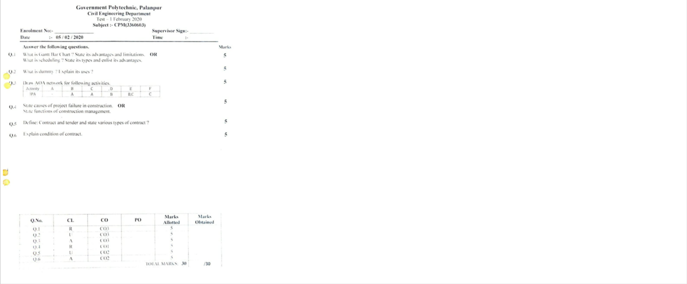

## 2.2.3 Quality of Experiments (15)

## Institute Marks

11.00

## Institute Marks

## A. Experimental methodologies (5)

5.00

For all the courses laboratory experiments are designed as per suggested experiment list in GTU curriculum. Based on the hours allotted to laboratory, the course coordinator decides the number of experiments and request head to initiate the purchase procedure, if any equipment is needed for performing certain experiment.

For semester 1 to 4, Batch of 20 students and for semester 5 &amp; 6, Batch of 15 students for laboratory session is decided as per guideline of Department of Technical Education. The laboratory sessions are conducted as per time table approved by Head and Principal.

All laboratories have adequate facilities. For the experiments detailed instruction manuals are provided. The observations are checked and verified by faculty and record books are maintained systematically. Course teacher and technical assistant are assigned for each practical class.

## B. Innovative experiments including industry attached practices, virtual labs (5)

Each experiments/ exercise of each subject is mapped to CO-PO and are assessed accordingly. The sample is as below.

## Government Polytechnic, Palanpur

Department of CIVIL Engineering

Mapping sheet of CO with each Experiment

## Sub: Hydraulics (3330603)

Describe &amp; develop conceptual knowledge of various properties of fluid

Fluid devices

Compute discharge and Ioss of hcad through pipes, open channels, notches and other

| Sr. No.   | Title of the Practical                                                                       | Course Outcome   | Remarks   |
|-----------|----------------------------------------------------------------------------------------------|------------------|-----------|
|           | Measure the pressure of water in pipe using (a) Piczometer (b) Different Lypes of manomcters |                  |           |
| 2         |                                                                                              |                  |           |
|           | of calibration praph for interpolation and extrapolation                                     | (0-              |           |
|           | Prcparation calibration for interpolation and                                                |                  |           |
|           | of material of pipc on loss of head                                                          |                  |           |

Institute Marks

3.00

Virtual Labs project is an initiative of Ministry of Human Resource Development (MHRD), Government of India under the aegis of National Mission on Education through Information and Communication Technology (NMEICT).

Virtual Labs do not require any additional infrastructural setup for conducting experiments at user premises. Students and Faculty Members of Civil Engineering Department have access to this lab facilities. Students are motivated to learn through Virtual Labs facility of IITs and NITs.

## C. Relevance to outcomes (5)

Institute Marks

3.00

## A. Identification of projects and allocation methodology (3)

## Institute Marks

3.00

The studentÕs projects are selected in line with department mission, vision and Program outcomes. Following policy is used for identifying and allocating the projects in the final year.

- Students are provided with brief idea of various fields for selecting the project ideas at the end of semester 4. Students are asked to conduct a ÔSHODH YATRAÕ for identification of the topic of interest as per GTU guideline.

- The list of previous year projects is made available to the students which ensures no repetition of project work and also encourages students to enhance the previous works.

- The faculties encourage the students to carry out Industry Defined Problem/User Defined Problem projects and support will be provided with all necessary software and hardware.

- The faculties encourage students to participate in project exhibitions.

- Projects are identified to relevant context. The need for the project and the end users of the project are verified for the current context.

- The problem definition with their requirements and constraints are verified.

- The knowledge, methodology, skill set and interest of the students to implement the project are considered to undertake the projects.

- Well experienced Faculties are allocated as supervisor to supervise the studentÕs project.

- Each project team varies from batch of eight to fifteen students.

- Faculty profile should match with the domain of the studentÕs project.

- Students are also given choice to choose their supervisor that matches their project domain.

## B. Types and relevance of the projects and their contribution towards attainment of POs and PSOs (5)

## Institute Marks

5.00

- Current academic projects are mapped to POs and PSOs.

- Each project is evaluated with internal marks and is graded according to their project quality and with their contribution towards attainment of POÕs.

|      |       |           | Application   |
|------|-------|-----------|---------------|
|      |       | Emvonneni |               |
|      | Using |           |               |
| 20is |       |           |               |

## C. Process for monitoring and evaluation (5)

- Process of monitoring and evaluation is solely based on GTU guidelines.
- The faculty members of Civil Engineering Department are responsible for making the regulations for evaluation and for complete evaluation process.
- Project supervisor will assess each student in team and evaluate the progress of the project work and help them to go further with project work.
- Students should meet their respective supervisor weekly and asked to explain their progress they have done in their project in that week.
- They should submit project progress report weekly to get approved by the respective supervisor.
- Project work is carried out in two phases: Project- 1 during 5 th semester and Project- 2 during 6 th semester. Project- 1: The total credit allotted is 4. This phase is evaluated during 5 th semester. Project- 2: Actual work implementation carried out during 6 th semester for a total of 6 credits.
- Student will go through two seminars one at the mid-semester for evaluation of internal marks for 60 and other towards the end of semester for Semester End Examination (ESE) evaluation of 40 marks.
- An external examiner appointed by university evaluates and awards the ESE marks of 40.
- The semester wise evaluation scheme is as per following tables 2.2.4.C-1 &amp; 2.

Institute Marks

5.00

| Sr. N o.   | Performance Indicator                       |   Marks (PA) |
|------------|---------------------------------------------|--------------|
| 1          | Title & Feasibility(Problem Identification) |           20 |
| 2          | Abstract & Depth of Knowledge               |           20 |
| 3          | Presentation and Viva                       |           20 |
|            | PA(Practical Marks-Internal Examination)    |           60 |
| 4          | ESE(End Semester-External Examination)      |           40 |
|            | Total Marks                                 |          100 |

## Table 2.2.4.C-2   PROJECT-II   5 TH  SEMESTER

| Sr. N o.   | Performance Indicator                    |   Marks (PA) |
|------------|------------------------------------------|--------------|
| 1          | Implementation /Execution                |           15 |
| 2          | Analysis/Results                         |           15 |
| 3          | Final report                             |           20 |
| 4          | Presentation and Viva                    |           10 |
|            | PA(Practical Marks-Internal Examination) |           60 |
| 5          | ESE(End Semester-External Examination)   |           40 |
|            | Total Marks                              |          100 |

## D. Process to assess individual and team performance (5)

Institute Marks

5.00

- Project progress seminars are conducted once in every month by the team of their respective supervisor and senior faculty members.

- The project seminar talk and PPT should be given by all the project team members according to the division of project.

- Each student in the project team is assessed on the basis of  understanding of the concept, his/her contribution for  project completion and  way of presentation.

## E. Quality of deliverable, working prototypes (12)

Institute Marks 9.00

## Format of the Report

1. Certificate

2. Acknowledgements

3. Abstract (In One paragraph not more than 150 words)

4. Index

5. Chapter-1    Introduction

6. Chapter-2    Problem Identification and Definition, process modification; Literature Survey etc

7. Chapter-3    the description of the Process/ Product and problem analysis

8. Chapter-4    the outline of the solution (with details including drawings, software, used for or developed for the solution etc. in detail)

9. Chapter-5:

For the Semester 5 Project Report:  The Outline of work to be carried out in semester- 6.

For the Semester 6 Project Report:  Conclusion, Future scope, i.e. the possible extension of  the work, the utility of the Project work.

10. Appendix if any

The Report should include all the Tools details, Figures, Charts, Tables, Analytical Results, Survey conclusions etc. whatever is applicable. It should specify all the references including manuals, papers etc. It must show the usefulness and application of the Project. The future scope and the possible expansion in the work should also be highlighted so that some other student can carry forward the same project in coming years. The report must be signed and approved by faculty guide and the head of the department(HOD).

## F. Papers published /Awards/ Recognition received by projects at State/ National level (5)

Institute Marks

0.00

As in diploma no research level projects are carried out, so till today no paper publication are done by our students till date.

2.2.5 Industry Interaction and Industry Internship/Training (30)

Institute Marks

## A. Industry supported Labs (2)

|   Sr. No | Name of Laboratory                  | Supported by                                   | Type of Support                                            | Topic Covered                                                                          |
|----------|-------------------------------------|------------------------------------------------|------------------------------------------------------------|----------------------------------------------------------------------------------------|
|        1 | Building Materials                  | Patel Engineering, Chadotar                    | Expert Guidance, Sample Materials                          | Properties of Building Materials, Ready Mix Concrete                                   |
|        2 | Water Supply & Sanitary Engineering | Jal Bhavan, palanpur                           | Knowledge of Testing                                       | Chemical Testing of Water                                                              |
|        3 | Civil Engineering Workshop Practice | Aangan villa site, Zamzam villa site, palanpur | Observation of construction activities as different stages | Foundation laying, concreting work, masonry & plastering work, plumbing, painting work |

## B. Delivery of appropriate Course work by Industry experts (5)

|   Sr  N o | N ame of Industry Expert   | N ame of Industry/Organisation   | Date       | Topic                      |
|-----------|----------------------------|----------------------------------|------------|----------------------------|
|         1 | Mr Darshak Langaliya       | J. K. laxmi Cement               | 06/10/2018 | Concrete Technology        |
|         2 | Mr Darshak Langaliya       | J. K. laxmi Cement               | 05/10/2019 | Concrete Technology        |
|         3 | Mr Batukbhai Trivedi       | R & B Design Circle, Gandhinagar | 07/10/2019 | Design of Steel Structures |

- Expert lectures are also arranged under various government schemes such as SSIP/RUSA and Gymkhana activities for the students at Institute level.

## Institute Marks

2.00

## Institute Marks

4.00

## C. Industrial visits/tours for students (3)

Enough visits/tours for students are carried out for in each semester as per syllabus

Table 2.2.5.C-1 Industrial Visits by Civil Engineering Department

|   SR. N O. | N AME OF I N DUSTRY                                 | TYPE OF I N DUSTRY               | DATE  OF VISIT    | OBJECTIVE/ PURPOSE                                                                   |   N O. OF STUDE N T BE N EFITED |
|------------|-----------------------------------------------------|----------------------------------|-------------------|--------------------------------------------------------------------------------------|---------------------------------|
|          1 | Aangan Villa Residential building Construction site | Residential Building             | 27-8-19 & 28-8-19 | Construction of Buildings - brick masonry work, flooring work and concreting work    |                              53 |
|          2 | Old Bus Station palanpur                            | Construction of Shopping complex | 05-09-19          | Construction of Buildings - Concreting work                                          |                              51 |
|          3 | Gokul Green Residency                               | Residential Building             | 25-09-19          | Construction of Buildings - Foundation work, brick masonary work and concreting work |                              48 |
|          4 | Gokul Green Residency                               | Residential Building             | 04-10-19          | Construction of Pile Foundation and Concreting work with advanced equipments         |                              31 |
|          5 | Kotarpur Water works                                | Water treatment plant            | 03-08-19          | Working of differernt components water treatment plants                              |                              34 |

.

Table 2.2.5.C-2 Industrial Visits by Applied Mechanics Department

Institute Marks

3.00

## GOVERNMENT POLYTECHNIC PALANPUR

## APPLIED MECHANICS DEPARTMENT

## 2.2.5 (C3) LIST OF INDUSTRIAL VISITS

| SRNO.   | NAME OF INDUSTRY              | TYPE OF INDUSTRY   |             |                                   | NO. OF   |
|---------|-------------------------------|--------------------|-------------|-----------------------------------|----------|
|         | NEW SASHWAT RMC PLANT         | Construction site  |             | cxposure and avarcnes;            | 59       |
| 2       | Shilpveda                     | Construction site  | 13/04/2016  | Industrial awareness              | 41       |
|         |                               | RMC Plant          | 10-Oct-17   | industrial awarcncss              | 57       |
|         | RAILWAY STATION               | Workshop           | 20/09/17    | industrial exposure and awarcness | 57       |
|         |                               | Construction site  | 17/04/2018  | industrial exposure and awareness | 54       |
|         | Railway Enginecring workshop, | Workshop           | 18/08/2018  | industrial exposure and awareness |          |
|         | PLANT                         | Cement Plant       | 18/08/2018  | Industrial exposure and awarcness |          |
|         | RMC PlANT SHAYONA CONCRETE    | RMC Plant          |             | industrial exposure and awareness |          |
|         | Suntech testinz & Consultancy | Testing lab        | 9/4/2029    | industrial exposure ana           | 20       |
| 10      | Mvomni Shayona                | Construction site  | 10/1/2019   | industrial awareness              | 36       |
| 11      | Railway Engincerine workshop; | Workshop           | 27/09/2029  | Industrlal                        | 44       |
| 12      | PlaNT                         | Cemcnt Plant       | 27/09/201 ) | industrial awareness              | 44       |
| 13      |                               | RMC Plant          | 24/09/2019  | industrial expcsuire and          |          |

## D. Industrial training/ internship (5)

Institute Marks

4.00

interacting with the industrial experts, provide the students recommendation letters and other necessary supports. The alumni who are working in the industries requested to provide necessary guidelines and supports for their internship.

## E. Post training/ internship Assessment (10)

Institute Marks

5.00

The students who have taken industrial training/internship during their semester break share their experience/views with other students in Interactive session.

F. Contribution to Community related projects/activities (5)

Institute Marks

4.00

- Projects like Rain water harvesting, Fire safety, Low cost housing etc. are done by students of civil engineering department for the benefit of community.

- Various activities related to community awareness/development are arranged by Gymkhana committee of our institute like Swachchhata Abhiyan, Tree Plantation, National Tobacco Control program, disaster training/seminar etc.

## 2.2.6 Information Access Facilities and Student Centric Learning Initiatives (15)

Institute Marks

14.00

A. Availability of facilities &amp; Effective Utilization; specify the facilities, materials and scope for self-learning, Webinars, NPTEL Podcast, MOOCs etc (10)

Institute Marks

9.00

We have developed department library and ICT room for our students. As per GTU rule medium of instruction is English for diploma studies, but the students are free to right the paper in either English or Gujarati. In view of that we have allocated all the sample copy of local publisher as our department library books.

We are trying to nurture the reading and communication skills of our students. In department library, we are also adding suggested books as per GTU curriculum.

As ICT facilities we are having projector, multimedia room at department. We have registration with IIT- Kharagpur E-library and allocated PC for students in department library along with materials like animations, video, presentations and other study material with tagging of

subject.

Every semester students are allocated time-table for department library utilization. In free slots of time table students are also encouraged to spend time at department library.

## Smart Class room:  01 N o

- Facilities available: 15 Nos PCs

- Internet Facilities : 5 Pcs

- Projector : 1 No

- Interactive Board Ð 1 No

Google class room &amp; MS teams for all courses

## B. Student Centric Learning Initiatives &amp; Effective Implementation (5)

We are using various methods to raise the interest of students in the courses and technical events. We adapt various learning methods in classroom, like

- Case studies
- Animations
- Presentations
- Seminar
- Industrial Visit
- Digital library
- E-Books

Registration of E-library

## 2.2.7 New Initiatives for embedding Professional Skills (15)

## A. Employability skill enhancement Initiatives and effective implementation (8)

Under finishing school (Technical) project of KCG, Gujarat, faculties are offered training in technical domain and the trained faculty teaches the students and makes them aware of latest trends.

|   Sr. No. | Name of Training                                   | Duration                        |   No of Students Participated |
|-----------|----------------------------------------------------|---------------------------------|-------------------------------|
|         1 | Use of Total Station in Surveying(Technical Skill) | 03-06-2019        to 12-06-2019 |                            16 |

After successful completion of training, the students are assessed by examiner and the outcome is measured with all domains and PO consideration. The type of assessment tool utilized is decided as per the training module.

All the successful students are awarded the certificate.

Institute Marks

5.00

## Institute Marks

8.00

## Institute Marks

4.00

Under finishing school (soft skills) project of KCG, Gujarat,, faculties are offered training in non-technical domain and the expert train the students.

|   Sr. No. | Name of Training                                      | Expert                | Duration                       |   No of Students Participated |
|-----------|-------------------------------------------------------|-----------------------|--------------------------------|-------------------------------|
|         1 | English speaking life skills and employability skills | GKS nominated faculty | 02-0-2018        to 12-07-2018 |                            28 |

After successful completion of training, the students are assessed by examiner and the outcome is measured with all domains and PO consideration. The type of assessment tool utilized is decided as per the training module.

All the successful students are awarded the certificate.

## 2.2.8 Co-curricular &amp; Extra Curricular Activities (10)

The major co-curricular and extra-curricular activates are planned on commencement of semester and executed by in-charge officer of various activities under NSS/Gymkhana.

## Table 2.2.8-1  Co-curricular Activities

|   Sr.No. | Date of Event   | Event Name                                   | Conducted By                     | Place        |   No. of Students benifited |
|----------|-----------------|----------------------------------------------|----------------------------------|--------------|-----------------------------|
|        1 | 3/23/2017       | Nuclear Awarness Program                     | NPCIL,Bhavnagar                  | G P Palanpur |                         110 |
|        2 | 4/8/2017        | E C workshop                                 | Dynamic Consultancy     C/O GEDA | G P Palanpur |                         108 |
|        3 | 05/01/2018      | SSIP  Introductory lecture                   | GEC,Patan                        | G P Palanpur |                          64 |
|        4 | 16/04/2018      | Mobile Energy Conservation Demonstration Van | GEDA, Gandginagar                | G P Palanpur |                          54 |
|        5 | 27/02/2018      | Ó Renewable EnergyÓ Demonstration Van        | GEDA, Gandginagar                | G P Palanpur |                         108 |

## Institute Marks

10.00

|   6 | 07/02/2018   | Entrepreneurship and Startup by SSIP support (SSIP)                  | SSIP Team GEC PATAN                  | GEC Patan    | 14             |
|-----|--------------|----------------------------------------------------------------------|--------------------------------------|--------------|----------------|
|   7 | 17/02/2018   | What is IPR                                                          | SSIP Team GEC PATAN                  | GEC Patan    | 09+1 (faculty) |
|   8 | 07/03/2018   | Entrepreneurship as a career option                                  | I D Chaudhary, Lect. Electrical Dept | G P Palanpur | 89             |
|   9 | 28/02/2018   | Innovation by people that can impact our lives in positive manner    | B M Patel, Lect. Electrical          | G P Palanpur | 48             |
|  10 | 10-09-2018   | Inogration of Industrial Hackathon 2018/ SIC 2018 Prize Distribution | Education Dept. Gujarat              | GMDC Ground  | 6              |
|  11 | 10-09-2018   | Entrepreneurship  Awarness                                           | CED, Gandhinagar                     | G P Palanpur | 82             |
|  12 | 04-10-2018   | Energy conservation                                                  | GEDA, Gandginagar                    | G P Palanpur | 80             |
|  13 | 15/02/2019   | Mobile Renewable Energy Demonstration Van                            | GEDA, Gandginagar                    | G P Palanpur | 110            |

## Table 2.2.8-2  Extra-curricular Activities

|   Sr No | Date       | Details of Activity/Program        |
|---------|------------|------------------------------------|
|       1 | 21/06/2017 | International Yoga day Celebration |
|       2 | 08/2017    | Khel mahakumbh                     |
|       3 | 25/01/2018 | Youth Voters Day Celebration-2017  |
|       4 | 15/08/2017 | Celebration of Independence Day    |
|       5 | 09/2017    | Cleanliness Week Celebration       |

| 6   | 31/10/2017               | Celebration of Sardar Patel Jyanti                                |
|-----|--------------------------|-------------------------------------------------------------------|
| 7   | 12/11/2017               | Celebration of National Education Day                             |
| 8   | 26/11/2017               | Celebration of National Constitution Day                          |
| 9   | 26/01/2018               | Celebration of National Republic Day                              |
| 10  | 02/05/2018               | Seminar On Disaster Management and Fire Safety                    |
| 11  | 27/02/2018               | Thalassemia Test                                                  |
| 12  | 03/07/2018               | Gujarat Road Safety Cadre Core(GRSCC)                             |
| 13  | 21/06/2018               | International Yoga day Celebration                                |
| 14  | 25/07/2018               | Tree Plantation Program                                           |
| 15  | 15/08/2018               | 15 August Independence day Celebration                            |
| 16  | 03/09/2018               | Mahatma Gandhi Jayanti Celebration                                |
| 17  | 09/10/2019               | Navratri Garba Celebration                                        |
| 18  | 30/10/2018               | Rashtriya Ekta Day Celebration                                    |
| 19  | 26/11/2018               | Bandharan day celebration                                         |
| 20  | 18/01/2019               | National Tobacco Control Awareness Program                        |
| 21  | 26/01/2019               | 26 January Republic Day Celebration                               |
| 22  | 25/03/2019 to 30/03/2019 | Student Sports Week 2019                                          |
| 23  | 30/03/2019               | Prize Distribution Program for Bright Students for Semester 1,3,5 |
| 24  | 26/03/2019 & 11/04/2019  | Thalassemia camp                                                  |
|     | 18/06/2019 to            |                                                                   |

25

21/06/2019

International Yoga day Program

26

20/06/2019

Poster Presentation &amp; Essay writing Completion

27

14/07/2019

Tree Plantation Program

## 3 3 COURSE OUTCOMES AND PROGRAM OUTCOMES COURSE OUTCOMES AND PROGRAM OUTCOMES (100) (100)

## Total Marks Total Marks   95.00 95.00

## Define the Program specific outcomes

PSO1

Select and use of appropriate advanced methods, materials and equipment in construction industry.

PSO2

Suggest relevant and safe demolition/ dismantling techniques for masonry / concrete building structure.

PSO3

Evaluate damaged structure and suggest appropriate repair / retrofit and maintenance methods / techniques.

## 3.1 Establish the correlation between the courses and the POs and PSOs (20)

## Total Marks 20.00

- 3.1.1 Course Outcomes (SAR should include course outcomes of one course from each semester of study, however, should be prepared for all courses) (5)

Institute Marks

5.00

Note : Number of Outcomes for a Course is expected to be 3 to 5.

Course Name :

C1 03

Course Year :

2019-20

Course Name

## Statements

C1 03.1

Identify types of pollutions and its effects on ecology and environment

C1 03.2

Identify renewable sources of energy for a given geographical situations and availability of resources for sustainable development

C1 03.3

Identify industrial waste for recycling

C1 03.4

State the Appropriate actions to be taken during Disaster

## Course Name :

C1 12

Course Year :

2019-20

Course Name

## Statements

C1

12.1

Identify basic tasks in Masonry, Concreting, Carpentry, Welding, Fitting, Drilling, Tapping, Plumbing and False Ceiling Works etc and prepare a visit report

C1

12.2

Select tools and equipment require for each construction activities

C1

12.3

Apply safety norms for construction work &amp; handling materials.

## Course Name :

C2 05

Course Year :

2019-20

Course Name

## Statements

C2

05.1

Operate surveying instruments to Carry out civil engineering survey to prepare drawings &amp; maps

C2

05.2

Interpret the drawings and maps for calculating different physical quantities like length, area, volume, elevations etc.

C2

05.3

Apply basics of leveling to find elevation of objects and creat contour maps.

C2

05.4

Demonstrate the use of GPS to enhance the knowledge and abilities required for surveying in field.

## Course Name :

C2 07

Course Year :

2019-20

Course Name

## Statements

C2

07.1

Calculate horizontal and vertical distances and angles with the use of theodolite.

C2

07.2

Conduct survey for setting out of simple circular curves.

C2

07.3

Calculate the height of objects through a trigonometrical levelling.

C2

07.4

Explain and apply the principles and various methodologies involved in tacheometry and prepare contour map for terrain.

C2

07.5

Retrieve the data and generate the drawings using advanced surveying equipment &amp; application software

## Course Name :

C3 03

Course Year :

2019-20

## Course Name

## Statements

C3

03.1

Calculate water demand based on source and quality of water

C3 03.2

Operate water and sewage treatment plan, test water and sewage as per the standard practice

| C3 03.3   | Segregate solid waste and select appropriate method for recycling of solid waste and waste water    |
|-----------|-----------------------------------------------------------------------------------------------------|
| C3 03.4   | Plan and implement house plumbing work effectively                                                  |
| C3 03.5   | Maintain effectively the pipe network for water supply and sewage disposal considering safety norms |

## Course Name :

C3 12

Course Year :

2019-20

| Course Name   | Statements                                                                                                                    |
|---------------|-------------------------------------------------------------------------------------------------------------------------------|
| C3 12.1       | Apply principles of basic science and engineering fundamental in analysis, design and operation of civil engineering systems. |
| C3 12.2       | Assess societal needs and plan suitable infrastructure                                                                        |
| C3 12.3       | Analyze and design components of civil engineering projects                                                                   |
| C3 12.4       | Develop team spirit and inter personal dynamics for effective execution and management of projects                            |
| C3 12.5       | Engage in lifelong learning and adapt to changing professional and societal needs                                             |

## 3.1.2 CO-PO matrices of courses selected in 3.1.1(Six matrices to be mentioned; one per semester from 1st to 6th semester) (5)

Institute Marks

5.00

## 1 . course name : C203

| Course   |   PO1 |   PO2 | PO3   | PO4   |   PO5 | PO6   |   PO7 |
|----------|-------|-------|-------|-------|-------|-------|-------|
| C103.1   |   2   |  2    | -     | -     |  1    | -     |     2 |
| C103.2   |   1   |  2    | 1     | -     |  1    | -     |     2 |
| C103.3   |   2   |  2    | 2     | 1     |  2    | -     |     1 |
| C103.4   |   1   |  3    | 2     | -     |  3    | 1     |     3 |
| Average  |   1.5 |  2.25 | 1.67  | 1.00  |  1.75 | 1.00  |     2 |

## 2 . course name : C212

| Course   |   PO1 | PO2   | PO3   |   PO4 | PO5   | PO6   | PO7   |
|----------|-------|-------|-------|-------|-------|-------|-------|
| C112.1   |  1    | -     | -     |  2    | -     | -     | -     |
| C112.2   |  3    | 1     | -     |  3    | 1     | -     | 3     |
| C112.3   |  3    | -     | -     |  2    | -     | -     | 3     |
| Average  |  2.33 | 1.00  | 0.00  |  2.33 | 1.00  | 0.00  | 3.00  |

## 3 . course name : C305

| Course   |   PO1 | PO2   |   PO3 |   PO4 |   PO5 |   PO6 |   PO7 |
|----------|-------|-------|-------|-------|-------|-------|-------|
| C205.1   |     3 | 3     |     3 |   3   |  2    |   3   |   2   |
| C205.2   |     3 | 3     |     3 |   3   |  2    |   2   |   3   |
| C205.3   |     3 | 2     |     3 |   2   |  3    |   3   |   3   |
| C205.4   |     3 | -     |     3 |   2   |  2    |   2   |   2   |
| Average  |     3 | 2.67  |     3 |   2.5 |  2.25 |   2.5 |   2.5 |

## 4 . course name : C307

| Course   |   PO1 |   PO2 |   PO3 | PO4   | PO5   |   PO6 |     |   PO7 |
|----------|-------|-------|-------|-------|-------|-------|-----|-------|
| C207.1   |     3 |     3 |     3 | -     |       |   3   | 3   |     3 |
| C207.2   |     3 |     3 |     3 | -     |       |   2   | 2   |     3 |
| C207.3   |     3 |     3 |     3 | -     |       |   3   | 3   |     3 |
| C207.4   |     3 |     3 |     3 | -     |       |   3   | 3   |     3 |
| C207.5   |     3 |     3 |     3 | -     |       |   3   | 3   |     3 |
| Average  |     3 |     3 |     3 | 0.00  |       |   2.8 | 2.8 |     3 |

## 5 . course name : C403

| Course   | PO1   | PO2   | PO3   |   PO4 |   PO5 | PO6   |   PO7 |
|----------|-------|-------|-------|-------|-------|-------|-------|
| C303.1   | 2     | 3     | 2     |   1   |   2   | -     |   2   |
| C303.2   | 3     | 3     | 3     |   3   |   2   | 2     |   3   |
| C303.3   | 3     | 2     | 1     |   3   |   3   | 3     |   3   |
| C303.4   | 2     | 2     | 2     |   2   |   2   | 1     |   2   |
| C303.5   | -     | -     | -     |   2   |   3   | 2     |   2   |
| Average  | 2.50  | 2.50  | 2.25  |   2.2 |   2.4 | 2.00  |   2.4 |

## 6 . course name : C412

| Course   | PO1   | PO2   | PO3   | PO4   |   PO5 | PO6   | PO7   |
|----------|-------|-------|-------|-------|-------|-------|-------|
| C312.1   | 3     | 3     | 3     | 3     |     3 | 3     | 3     |
| C312.2   | -     | 3     | 3     | 2     |     3 | 2     | -     |
| C312.3   | 3     | 3     | 3     | 3     |     2 | 2     | 3     |
| C312.4   | -     | -     | -     | -     |     3 | 3     | 3     |
| C312.5   | -     | -     | 3     | 3     |     3 | -     | -     |

## 1 . Course Name : C203

| Course   | PSO1   | PSO2   | PSO3   |
|----------|--------|--------|--------|
| C103.1   | -      | -      | -      |
| C103.2   | -      | -      | -      |
| C103.3   | -      | -      | -      |
| C103.4   | -      | -      | -      |
| Average  | 0.00   | 0.00   | 0.00   |

## 2 . Course Name : C212

| Course   | PSO1   | PSO2   | PSO3   |
|----------|--------|--------|--------|
| C112.1   | 2      | -      | -      |
| C112.2   | -      | -      | -      |
| C112.3   | -      | -      | -      |
| Average  | 2.00   | 0.00   | 0.00   |

## 3 . Course Name : C305

| Course   | PSO1   | PSO2   | PSO3   |
|----------|--------|--------|--------|
| C205.1   | -      | -      | -      |
| C205.2   | -      | -      | -      |
| C205.3   | -      | -      | -      |
| C205.4   | -      | -      | -      |
| Average  | 0.00   | 0.00   | 0.00   |

## 4 . Course Name : C307

| Course   | PSO1   | PSO2   | PSO3   |
|----------|--------|--------|--------|
| C207.1   | -      | -      | -      |
| C207.2   | -      | -      | -      |
| C207.3   | -      | -      | -      |
| C207.4   | -      | -      | -      |

| C207.5   |   - |   - |   - |
|----------|-----|-----|-----|
| Average  |   0 |   0 |   0 |

## 5 . Course Name : C403

| Course   | PSO1   | PSO2   | PSO3   |
|----------|--------|--------|--------|
| C303.1   | -      | -      | -      |
| C303.2   | -      | -      | -      |
| C303.3   | -      | -      | -      |
| C303.4   | -      | -      | -      |
| C303.5   | -      | -      | -      |
| Average  | 0.00   | 0.00   | 0.00   |

## 6 . Course Name : C412

| Course   | PSO1   | PSO2   | PSO3   |
|----------|--------|--------|--------|
| C312.1   | 3      | 1      | 1      |
| C312.2   | -      | -      | -      |
| C312.3   | 2      | -      | -      |
| C312.4   | -      | -      | -      |
| C312.5   | -      | -      | -      |
| Average  | 2.50   | 1.00   | 1.00   |

## 3.1.3 - A Program level Course-PO matrix of all courses INCLUDING first year courses (10)

| Course   |   PO1 |   PO2 |   PO3 |   PO4 |   PO5 |   PO6 |   PO7 |
|----------|-------|-------|-------|-------|-------|-------|-------|
| C101     |   3   |  1    |  0    |  0    |  0    |   0   |  0    |
| C102     |   3   |  0    |  0    |  0    |  0    |   1.5 |  1.67 |
| C103     |   1.5 |  2.25 |  1.67 |  1    |  1.75 |   1   |  2    |
| C104     |   2   |  1    |  1    |  0    |  0    |   0   |  1    |
| C105     |   2   |  2.25 |  1.5  |  3    |  1.2  |   1   |  1    |
| C106     |   3   |  1    |  2.25 |  2.25 |  1    |   1.5 |  2    |
| C107     |   2   |  2.2  |  0    |  3    |  0    |   0   |  1.33 |

## Institute Marks

10.00

| C108   |   2.50 |   1.00 |   0.00 |   0.00 |   0.00 |   0.00 |   1.00 |
|--------|--------|--------|--------|--------|--------|--------|--------|
| C109   |   3    |   1    |   0    |   0    |   0    |   0    |   1    |
| C110   |   2.25 |   2.33 |   2    |   2.25 |   3    |   2.5  |   2.5  |
| C111   |   1.67 |   1    |   1    |   1    |   1    |   1    |   1    |
| C112   |   2.33 |   1    |   0    |   2.33 |   1    |   0    |   3    |
| C113   |   0    |   0    |   0    |   0    |   0    |   2    |   3    |
| C201   |   2.5  |   2    |   1    |   2.25 |   2    |   0    |   2.25 |
| C202   |   2    |   1.5  |   1    |   1.5  |   1.25 |   1.33 |   1.2  |
| C203   |   3    |   2.67 |   2.67 |   2.67 |   0    |   2.33 |   3    |
| C204   |   3    |   3    |   0    |   2    |   0    |   0    |   0    |
| C205   |   3    |   2.67 |   3    |   2.5  |   2.25 |   2.5  |   2.5  |
| C206   |   2    |   2.67 |   0    |   3    |   0    |   0    |   0    |
| C207   |   3    |   3    |   3    |   0    |   2.8  |   2.8  |   3    |
| C208   |   2.6  |   2    |   2    |   2    |   1.75 |   2    |   2    |
| C209   |   2.5  |   2.5  |   2    |   2.33 |   2    |   1.33 |   2.4  |
| C210   |   2    |   1.67 |   0    |   3    |   1    |   0    |   0    |
| C211   |   2.33 |   1.5  |   2.67 |   3    |   1    |   1    |   2    |
| C301   |   3    |   3    |   3    |   0    |   1    |   0    |   0    |
| C302   |   2.6  |   2.25 |   2    |   3    |   1.6  |   1    |   1.5  |
| C303   |   2.5  |   2.5  |   2.25 |   2.2  |   2.4  |   2    |   2.4  |
| C304   |   3    |   2.75 |   2.67 |   2    |   3    |   2.67 |   2.5  |
| C305   |   1.4  |   1.75 |   1.5  |   2.33 |   1    |   1.67 |   1.2  |
| C306   |   3    |   3    |   3    |   2.75 |   2.8  |   2.5  |   3    |
| C307   |   3    |   2.25 |   3    |   0    |   2    |   0    |   0    |
| C308   |   2.4  |   1.75 |   2.2  |   2    |   1.6  |   1.8  |   1.6  |
| C309   |   2.4  |   2    |   2    |   1.6  |   1.6  |   1.6  |   1.6  |
| C310   |   3    |   2.25 |   2.33 |   2.25 |   2    |   2.33 |   2.5  |
| C311   |   2.33 |   2    |   2.5  |   2    |   2.33 |   0    |   2    |
| C312   |   3    |   3    |   3    |   2.75 |   2.8  |   2.5  |   3    |

| Course   |   PSO1 |   PSO2 |   PSO3 |
|----------|--------|--------|--------|
| C101     |   1    |      1 |      1 |
| C102     |   0    |      0 |      0 |
| C103     |   0    |      0 |      0 |
| C104     |   1    |      1 |      0 |
| C105     |   0    |      0 |      1 |
| C106     |   0    |      0 |      0 |
| C107     |   0    |      0 |      0 |
| C108     |   2    |      0 |      0 |
| C109     |   1    |      1 |      1 |
| C110     |   0    |      0 |      0 |
| C111     |   1    |      1 |      0 |
| C112     |   2    |      0 |      0 |
| C113     |   0    |      0 |      0 |
| C201     |   0    |      0 |      0 |
| C202     |   1.75 |      0 |      0 |
| C204     |   1    |      0 |      0 |
| C205     |   0    |      0 |      0 |
| C206     |   0    |      0 |      0 |
| C207     |   0    |      0 |      0 |
| C208     |   1    |      0 |      1 |
| C209     |   0    |      0 |      0 |
| C210     |   1    |      0 |      0 |
| C211     |   0    |      0 |      0 |
| C301     |   0    |      0 |      0 |
| C302     |   1.5  |      0 |      0 |
| C303     |   0    |      0 |      0 |
| C304     |   0    |      0 |      0 |

| C305   |   1.50 |   1 |   0 |
|--------|--------|-----|-----|
| C306   |    2.5 |   1 |   1 |
| C307   |    0   |   0 |   0 |
| C308   |    0   |   0 |   0 |
| C309   |    0   |   0 |   0 |
| C310   |    1   |   0 |   0 |
| C311   |    1   |   2 |   2 |
| C312   |    2.5 |   1 |   1 |

## 3.2 Attainment of Course Outcomes (40)

## 3.2.1 Describe the assessment processes used to gather the data upon which the evaluation of Course Outcome is based (10)

## Total Marks 38.00

## Institute Marks

9.00

As described in section 3.1, various courses are offered to the students of Diploma Civil Engineering as per GTU curriculum. CO attainment is based on the internal and external assessment as per GTU scheme of examination. Depending upon nature of course, maximum marks for various courses may be 150, 200 or 100. Different components and its maximum marks are as shown below.

|   Marks |   Internal  assessment  (30%) | Mid-Sem  Exam  (M)   | Continuous  Evaluation  (I)   |   External  assessment  (70%) | University  ESE (E)   | University  Viva (V)   |
|---------|-------------------------------|----------------------|-------------------------------|-------------------------------|-----------------------|------------------------|
|     150 |                            50 | 30                   | 20                            |                           100 | 70                    | 30                     |
|     200 |                            90 | 30                   | 60                            |                           110 | 70                    | 40                     |
|     100 |                            60 |                      | 60                            |                            40 |                       | 40                     |
|     100 |                            30 | 30                   |                               |                            70 | 70                    |                        |

Structure and weightage for CO attainment for courses with 150 marks are as shown in Fig. 3.2.1.

Fig 3.2.1 Structure and weightage for CO attainment

For 100 mark subjects having only theory component, there is only one component for external and internal evaluation i.e. E and M respectively. For 100 marks subjects having only practical component, there is only one component for external and internal evaluation i.e. V and I respectively. For 200 marks subjects more weightage is given to practical component.

## Measuring attainment of COs through Mid-Sem Exam

The MSE question papers are prepared as per content covered. Total marks for the MSE examination is 30 and questions are aligned with Bloom's level. Number of questions in MSE question paper is equal to number of COs covered by the content of MSE and marks obtained by the students in particular question is directly mapped with the CO addressed by the question. While preparing the question paper, it is ascertained that optional questions are asked from same CO so that students will attempt all the question related to COs covered as per MSE syllabus. MSE question paper is collectively prepared by all the teachers associated with the subject. After MSE, PAC assesses the quality of question papers and necessary instructions are issued to the course coordinator if required.

## Measuring attainment of COs through Assignments

To improve the understanding of the students about the course content a certain number of assignments are given to the students at regular intervals depending upon the content being covered in the class. Its weightage is of 10 marks. Marks are given on the basis of performance of the students. All COs are covered through the assignments. Attempts are made to ensure that students respond to all COs. The assignment and open-ended problems are prepared collectively by all the teachers associated with the subject and are reviewed by PAC.

## Measuring attainment of COs through Continuous Evaluation

During laboratory hours students are required to perform experiments in a small group. Their evaluation during practical hours is considered under this head and its weightage is of 20 marks. Continuous evaluation is done and marks are awarded according to the performance of the students in conducting the experiments, calculations made and conclusions drawn, answering the quiz and oral questions. GTU provides the list of experiments to be performed with the flexibility of designing the experiments such that all the course COs are covered during practical hour

## Measuring attainment of COs through University Exam

End semester exam question paper of each course is normally drawn as per GTU guidelines conforming to the level of learning and curriculum weights. Question paper is of 70 marks and it addresses all COs of the course. Assessment is done by a teacher of affiliated colleges of the university and identity of the student is kept confidential. GTU provides the result in the form of grades. The absolute grading system is adopted by the university and hence for the purpose attainment, these grades are converted into marks

## Measuring attainment of COs through University Viva

University practical examination is conducted by the examiners appointed by the GTU. The examiners are faculty members of other GTU affiliated colleges. The practical and viva voce examination is conducted in a way so that the entire COs are covered during the exam. University assigns grades to the students and same are converted into marks.

## A details procedure of find out the co attainment is given as below

Step 1: Fix weight of each Assessment Component Prescribed by GTU for the courses offered in the program

Our institute is affiliated to Gujarat Technological University. There are four major(Maximum) components defined by the University for evaluating the performance of the students. The number of component for the subject varies from 2 to 4. The component wise distribution of marks is describe as above in table &amp; figure 3.2.1.

In our attainment process we give 70% weight age to End semester Exam conducted by University and 30% weight age Progressive Assessment conducted by Department.

Step 2: Fix the Criteria for CO attainment Level.

## Table 3.2.1.1 Attainment Level PR PA, TH ESE, PR ESE component

## Attainment Level

|    | External Exam    | External Exam   | Internal Exam    | Internal Exam   |
|----|------------------|-----------------|------------------|-----------------|
|    | Attainment Level | Weightage (%)   | Attainment Level | Weightage (%)   |
| AA | 3                | 70              | 3                | 30              |
| AB | 3                | 70              | 3                | 30              |
| BB | 3                | 70              | 3                | 30              |
| BC | 3                | 70              | 3                | 30              |
| CC | 3                | 70              | 3                | 30              |
| CD | 2                | 70              | 2                | 30              |

| DD   |   1 |
|------|-----|
| FF   |   0 |

## Table 3.2.1.2 Attainment Level Theory PA

## Attainment Level For Theory PA

| Marks                                       |   Attainment | Weightage   |
|---------------------------------------------|--------------|-------------|
| > = 45 % Marks (AA to CC) in Internal Exams |            3 | 30%         |
| > = 40 % Marks (CD) in Internal  Exams      |            2 | 30%         |
| > = 35 % Marks (DD) in Internal Exams       |            1 | 30%         |
| < 35 % Marks (FF) in Internal  Exams        |            0 | 30%         |

The grades are given on the basis of their mark range. University's grade pattern is shown in table 3.2.1.3.

## Table 3.2.1.3 University Grading Scheme

|   No | GTU GRADE   | Mark- Range   |   Average Percentage |   SPI Credits |
|------|-------------|---------------|----------------------|---------------|
|    1 | AA          | 85-100        |                   93 |            10 |
|    2 | AB          | 75-84         |                   80 |             9 |
|    3 | BB          | 65-74         |                   70 |             8 |
|    4 | BC          | 55-64         |                   60 |             7 |

|   5 | CC   | 45-54               | 50   |   6 |
|-----|------|---------------------|------|-----|
|   6 | CD   | 40-44               | 42   |   5 |
|   7 | DD   | 35-39               | 37   |   4 |
|   8 | FF   | Less Than 35 (Fail) |      |   0 |

Step 3: Tabulate marks/grades of each student for each assessment component which are in the department.

Sample Marks entry of Mid Sem examination (TH PA) for one subject is show in below table.

## Table 3.2.1.4 TH PA CO wise Marks entry

|         |                                   | CO WISE TOTAL   | CO WISE TOTAL   | CO WISE TOTAL   | CO WISE TOTAL   | CO WISE TOTAL   |            |
|---------|-----------------------------------|-----------------|-----------------|-----------------|-----------------|-----------------|------------|
| SR. NO. | ENROLLMENT NO                     | CO1             | CO2             | CO3             | CO4             | CO5             | TOTAL (30) |
|         |                                   | 6               | 6               | 6               | 6               | 6               |            |
| 1       | 176260306004                      | 4               | 4               | 4               | 4               | 4               | 20         |
| 2       | 176260306005                      | 2               | 3               | 2               | 3               | 2               | 12         |
| 3       | 176260306010                      | 2               | 3               | 4               | 3               | 2               | 14         |
|         | …                                 |                 |                 |                 |                 |                 |            |
| 41      | 186268306001                      | 2               | 3               | 2               | 3               | 2               | 12         |
|         | No of student                     | 41              | 41              | 41              | 41              | 41              |            |
|         | Average Overall Direct Attainment | 1.68            | 2.85            | 2.05            | 2.85            | 1.68            |            |

Step 4: Convert marks/grades into Attainment level.

Converting grades of various components into attainment level for one sample subject is shown in table 3.2.1.6 and 3.2.1.7.

As shown in Table 3.2.1.5 and 3.2.1.6, based on the grades/marks achieved by students in various components, attainment level is assigned to each student as per Table 3.2.1.1. Final attainment level of the component is average of attainment level obtained by all students in that component.

## Table 3.2.1.5 Attainment calculation for PR PA, TH ESE, PR ESE components

| No   | Enrollment No   | Practical PA   | Theory ESE      | Practical ESE   | Attainment PR PA   | Attainment TH ESE   | Attainment PR ESE   |
|------|-----------------|----------------|-----------------|-----------------|--------------------|---------------------|---------------------|
| 1    | 176260306004    | AB             | BC              | AA              | 3                  | 3                   | 3                   |
| 2    | 176260306005    | AB             | CC              | AB              | 3                  | 3                   | 3                   |
| 3    | 176260306010    | FF             | DD              | FF              | 0                  | 1                   | 0                   |
| -    | ---             |                |                 |                 |                    |                     |                     |
| 41   | 186268306001    | FF             | FF              | FF              | 0                  | 0                   | 0                   |
|      |                 |                | Total           | Total           | 99.00              | 81.00               | 99.00               |
|      |                 |                | No. Of Students | No. Of Students | 41                 | 41                  | 41                  |
|      |                 |                | Attainment      | Attainment      | 2.41               | 2.0                 | 2.41                |

Step 5: Calculate Overall CO Attainment from attainment of various components.

Overall CO attainment is calculated based on weighted average of all the components as per table 3.2.1.6

Table 3.2.1.6 CO Attainment Calculation

ASSESSMENT SCHEME

THEORY MARKS PRACTICAL MARKS

TH ESE

TH PA

(Uni

PR ESE

Exam)

70

(Mid

Sem)

30

(Viva)

PR PA (Pract PA)

20

30

150

## COURSE OUTCOME ATTAINMENT BREAK-UP

| CO    | TH ESE Uni Exam   | TH PA Mid Sem   | PR ESE Viva   | PR PA Practical PA   | EXTERNAL MARKS TH.ESE PR.ESE   | INTERNAL MARKS TH.PA PR.PA   | COURSE ATTAINMENT   |
|-------|-------------------|-----------------|---------------|----------------------|--------------------------------|------------------------------|---------------------|
| 303.1 | 1.98              | 1.68            | 2.41          | 2.41                 | 2.07                           | 2.05                         | 2.07                |
| 303.2 | 1.98              | 2.85            | 2.41          | 2.41                 | 2.07                           | 2.63                         | 2.24                |
| 303.3 | 1.98              | 2.05            | 2.41          | 2.41                 | 2.07                           | 2.23                         | 2.12                |
| 303.4 | 1.98              | 2.85            | 2.41          | 2.41                 | 2.07                           | 2.63                         | 2.24                |
|       |                   |                 |               | Weightage            | 70%                            | 30%                          | (Weighted Avg)      |

- Progressive Assessment (PA) attainment = Weightage average of Theory Progressive Attainment

And Practical Progressive Attainment

- End Semester Exam (ESE) Attainment = Weightage average of End semester theory

And End semester practical exam.

- Overall Direct CO attainment = 0.3 * Progressive assessment Attainment + 0.7 *

TOTAL

MARKS

## Table 3.2.1.7 Direct CO Attainment

Subject

CO1

CO2

CO3

CO4

CO5

C303

2.07

2.24

2.12

2.24

2.07

## 3.2.2 Record the attainment of Course Outcome of all courses with respect to set attainment levels (30)

Measuring Course Outcomes attained through External and Internal Assessments

## SET OF ATTAINMENT LEVELS

LEVEL 0 &lt; 35% MARKS (FF) IN EXTERNAL &amp; INTERNAL EXAM

LEVEL 1 &gt;= 35% MARKS (DD) IN EXTERNAL &amp; INTERNAL EXAM

LEVEL 2 &gt;= 40 % MARKS (CD) IN EXTERNAL &amp; INTERNAL EXAM

LEVEL 3 &gt;= 45 % MARKS (CC TO AA ) IN EXTERNAL &amp; INTERNAL EXAM

Overall CO attainment is calculated based on weighted average of all the components.

Here 70% weightage is given to Board examination and 30% weightage to Internal assessment for calculating CO attainment.

For example:

Attainment through Board Examination: Substantial i.e. 3

Attainment through Internal Assessment: Moderate i.e. 2

The Course Attainment = (70% of Board level) + (30% of Internal level)

(70% of 3) 2.1 + (30% of 2) 0.6

=

2.7

## Table 3.2.1 Attainment of Course Outcomes for batch 2015

| Sem   | Course Code   | Course Name                                  |   CO1 |   CO2 |   CO3 | CO4   |      | CO5 CO6   |
|-------|---------------|----------------------------------------------|-------|-------|-------|-------|------|-----------|
| SEM 1 | C101          | BASIC MATHEMATICS                            |  1.98 |  1.85 |  1.85 |       |      |           |
| SEM 1 | C102          | ENGLISH                                      |  2.11 |  2.06 |  2.06 |       |      |           |
| SEM 1 | C103          | ENVIRONMENT CONSERVATION & HAZARD MANAGEMENT |  2.35 |  2.07 |  2.04 | 2.24  |      |           |
| SEM 1 | C104          | ENGINEERING PHYSICS (GROUP-1)                |  1.95 |  1.94 |  1.94 |       |      |           |
| SEM 1 | C105          | BASIC ENGINEERING DRAWING                    |  1.92 |  2.07 |  1.96 | 2.07  | 1.92 |           |

## Institute Marks

29.00

| C106   | COMPUTER APPLICATION & GRAPHICS            |   2.91 |   2.91 |   2.91 | 2.91   |      |      |
|--------|--------------------------------------------|--------|--------|--------|--------|------|------|
| C107   | APPLIED MECHANICS                          |   1.83 |   2.12 |   1.9  | 2.12   | 1.83 |      |
| C108   | APPLIED CHEMISTRY (GROUP-1)                |   1.98 |   1.95 |   1.95 |        |      |      |
| C109   | ADVANCED MATHEMATICS (GROUP-2)             |   1.68 |   1.52 |   1.52 |        |      |      |
| C110   | BUILDING DRAWING                           |   2.19 |   2.05 |   2.09 | 2.13   |      |      |
| C111   | BASIC MECHANICAL ENGINEERING               |   2.79 |   2.79 |   2.79 | 2.79   | 2.79 | 2.79 |
| C112   | CIVIL ENGINEERING WORKSHOP PRACTICE        |   2.89 |   2.89 |   2.89 |        |      |      |
| C113   | CONTIBUTOR PERSONALITY DEVELOPMENT         |   2.91 |   2.91 |   2.91 |        |      |      |
| C201   | BUILDING MATERIAL                          |   2.18 |   1.98 |   2.03 | 2.08   |      |      |
| C202   | CONSTRUCTION TECHNOLOGY                    |   2.12 |   2.37 |   2.15 | 2.37   | 2.12 |      |
| C203   | HYDRAULICS                                 |   2    |   1.92 |   1.92 |        |      |      |
| C204   | STRUCTURE MECHANICS 1                      |   1.59 |   1.41 |   1.46 | 1.51   |      |      |
| C205   | SURVEYING                                  |   2.32 |   2.25 |   2.24 | 2.29   |      |      |
| C206   | STRUCTURE MECHANICS II                     |   2.11 |   2.06 |   2.06 |        |      |      |
| C207   | ADVANCED SURVEYING                         |   2.37 |   2.52 |   2.42 | 2.52   | 2.37 |      |
| C208   | BASIC OF TRANSPORTATION ENGINEERING        |   2.38 |   2.64 |   2.49 | 2.64   | 2.38 |      |
| C209   | WATER RESOURCE MANAGEMENT                  |   2.32 |   2.57 |   2.38 | 2.57   | 2.32 |      |
| C210   | SOIL MECHANICS                             |   1.97 |   1.88 |   1.86 | 1.93   |      |      |
| C211   | COMPUTER ADDED DRAWING                     |   2.71 |   2.71 |   2.71 |        |      |      |
| C301   | DESIGN OF STEEL STRUCTURE                  |   2.12 |   2.09 |   2.09 |        |      |      |
| C302   | CONCRETE TECHNOLOGY                        |   2.22 |   2.48 |   2.28 | 2.48   | 2.22 |      |
| C303   | WATER SUPPLY & SANITARY ENGGINEERING       |   2.07 |   2.34 |   2.12 | 2.34   | 2.07 |      |
| C304   | ESTIMATING , COSTING & VALUATION           |   2.11 |   1.97 |   2.02 | 2.04   |      |      |
| C305   | ADVANCE CONSTRUCTION TECHNOLOGY            |   2.17 |   2.4  |   2.2  | 2.40   | 2.17 |      |
| C306   | PROJECT-I                                  |   2.64 |   2.64 |   2.64 | 2.64   | 2.64 |      |
| C307   | DESIGN OF REEINFORCED CONCRETE STRUCTURE   |   2.28 |   2.47 |   2.29 | 2.47   | 2.28 |      |
| C308   | CONSTRUCTION QUALITY CONTROL & MONITORING  |   2.68 |   2.86 |   2.74 | 2.86   | 2.68 |      |
| C309   | CONSTRUCTION PROJECT MANAGEMENT            |   2.24 |   2.49 |   2.31 | 2.49   | 2.24 |      |
| C310   | BUILDING SERVICES                          |   2.84 |   2.74 |   2.73 | 2.79   |      |      |
| C311   | MAINTENANCE & REHABILITATION OF STRUCTURES |   2.67 |   2.62 |   2.62 |        |      |      |
| C312   | PROJECT-II                                 |   2.93 |   2.93 |   2.93 | 2.93   | 2.93 |      |

## Table 3.2.2 Attainment of Course Outcomes for batch 2016

| Sem   | Course Code   | Course Name                                  |   CO1 |   CO2 |   CO3 | CO4   |      | CO5 CO6   |
|-------|---------------|----------------------------------------------|-------|-------|-------|-------|------|-----------|
| SEM 1 | C101          | BASIC MATHEMATICS                            |  1.52 |  1.44 |  1.44 |       |      |           |
| SEM 1 | C102          | ENGLISH                                      |  1.83 |  1.79 |  1.79 |       |      |           |
| SEM 1 | C103          | ENVIRONMENT CONSERVATION & HAZARD MANAGEMENT |  2.17 |  1.99 |  1.89 | 2.12  |      |           |
| SEM 1 | C104          | ENGINEERING PHYSICS (GROUP-1)                |  2.04 |  2.02 |  2.02 |       |      |           |
| SEM 1 | C105          | BASIC ENGINEERING DRAWING                    |  2.08 |  2.16 |  2.1  | 2.16  | 2.08 |           |
| SEM 1 | C106          | COMPUTER APPLICATION & GRAPHICS              |  2.68 |  2.68 |  2.68 | 2.68  |      |           |
| SEM   | C107          | APPLIED MECHANICS                            |  1.47 |  1.74 |  1.5  | 1.74  | 1.47 |           |
| SEM   | C108          | APPLIED CHEMISTRY (GROUP-1)                  |  1.92 |  1.91 |  1.91 |       |      |           |
| SEM   | C109          | ADVANCED MATHEMATICS (GROUP-2)               |  1.47 |  1.36 |  1.36 |       |      |           |

| 2   | C110   | BUILDING DRAWING                           |   1.74 |   1.65 |   1.69 | 1.70   |      |      |
|-----|--------|--------------------------------------------|--------|--------|--------|--------|------|------|
| 2   | C111   | BASIC MECHANICAL ENGINEERING               |   2.9  |   2.9  |   2.9  | 2.90   | 2.90 | 2.90 |
| 2   | C112   | CIVIL ENGINEERING WORKSHOP PRACTICE        |   2.9  |   2.9  |   2.9  |        |      |      |
| 2   | C113   | CONTIBUTOR PERSONALITY DEVELOPMENT         |   2.85 |   2.89 |   2.89 |        |      |      |
|     | C201   | BUILDING MATERIAL                          |   1.77 |   1.73 |   1.63 | 1.77   |      |      |
|     | C202   | CONSTRUCTION TECHNOLOGY                    |   1.64 |   1.94 |   1.71 | 1.94   | 1.64 |      |
|     | C203   | HYDRAULICS                                 |   1.66 |   1.59 |   1.59 |        |      |      |
|     | C204   | STRUCTURE MECHANICS 1                      |   1.61 |   1.45 |   1.48 | 1.55   |      |      |
|     | C205   | SURVEYING                                  |   1.91 |   1.81 |   1.83 | 1.86   |      |      |
|     | C206   | STRUCTURE MECHANICS II                     |   2.24 |   2.22 |   2.22 |        |      |      |
|     | C207   | ADVANCED SURVEYING                         |   2.07 |   2.24 |   2.14 | 2.24   | 2.07 |      |
|     | C208   | BASIC OF TRANSPORTATION ENGINEERING        |   2.19 |   2.47 |   2.3  | 2.47   | 2.19 |      |
|     | C209   | WATER RESOURCE MANAGEMENT                  |   2.33 |   2.56 |   2.38 | 2.56   | 2.33 |      |
|     | C210   | SOIL MECHANICS                             |   1.88 |   1.77 |   1.73 | 1.84   |      |      |
|     | C211   | COMPUTER ADDED DRAWING                     |   2.93 |   2.93 |   2.93 |        |      |      |
|     | C301   | DESIGN OF STEEL STRUCTURE                  |   2.53 |   2.55 |   2.55 |        |      |      |
|     | C302   | CONCRETE TECHNOLOGY                        |   2.46 |   2.64 |   2.51 | 2.64   | 2.46 |      |
|     | C303   | WATER SUPPLY & SANITARY ENGGINEERING       |   2.26 |   2.56 |   2.38 | 2.56   | 2.26 |      |
|     | C304   | ESTIMATING , COSTING & VALUATION           |   2.17 |   2.1  |   2.09 | 2.15   |      |      |
|     | C305   | ADVANCE CONSTRUCTION TECHNOLOGY            |   2.32 |   2.52 |   2.41 | 2.52   | 2.32 |      |
|     | C306   | PROJECT-I                                  |   2.92 |   2.92 |   2.92 | 2.92   | 2.92 |      |
|     | C307   | DESIGN OF REEINFORCED CONCRETE STRUCTURE   |   2.86 |   2.9  |   2.9  | 2.90   | 2.86 |      |
|     | C308   | CONSTRUCTION QUALITY CONTROL & MONITORING  |   2.64 |   2.82 |   2.72 | 2.82   | 2.64 |      |
|     | C309   | CONSTRUCTION PROJECT MANAGEMENT            |   2.25 |   2.59 |   2.39 | 2.59   | 2.25 |      |
|     | C310   | BUILDING SERVICES                          |   2.75 |   2.72 |   2.65 | 2.75   |      |      |
|     | C311   | MAINTENANCE & REHABILITATION OF STRUCTURES |   2.7  |   2.7  |   2.7  |        |      |      |
|     | C312   | PROJECT-II                                 |   2.92 |   2.92 |   2.92 | 2.92   | 2.92 |      |

## Table 3.2.3 Attainment of Course Outcomes for batch 2017

| Sem   | Course Code   | Course Name                                  |   CO1 |   CO2 |   CO3 | CO4   |      | CO5 CO6   |
|-------|---------------|----------------------------------------------|-------|-------|-------|-------|------|-----------|
| SEM 1 | C101          | BASIC MATHEMATICS                            |  1.5  |  1.4  |  1.4  |       |      |           |
| SEM 1 | C102          | ENGLISH                                      |  2.05 |  1.95 |  1.95 |       |      |           |
| SEM 1 | C103          | ENVIRONMENT CONSERVATION & HAZARD MANAGEMENT |  2.11 |  1.99 |  1.82 | 2.09  |      |           |
| SEM 1 | C104          | ENGINEERING PHYSICS (GROUP-1)                |  1.97 |  1.9  |  1.9  |       |      |           |
| SEM 1 | C105          | BASIC ENGINEERING DRAWING                    |  2.04 |  2.14 |  2.05 | 2.14  | 2.04 |           |
| SEM 1 | C106          | COMPUTER APPLICATION & GRAPHICS              |  2.92 |  2.92 |  2.92 | 2.92  |      |           |
| SEM 2 | C107          | APPLIED MECHANICS                            |  1.65 |  1.82 |  1.66 | 1.82  | 1.65 |           |
| SEM 2 | C108          | APPLIED CHEMISTRY (GROUP-1)                  |  2.17 |  2.1  |  2.1  |       |      |           |
| SEM 2 | C109          | ADVANCED MATHEMATICS (GROUP-2)               |  1.42 |  1.31 |  1.31 |       |      |           |
| SEM 2 | C110          | BUILDING DRAWING                             |  1.43 |  1.32 |  1.36 | 1.38  |      |           |
| SEM 2 | C111          | BASIC MECHANICAL ENGINEERING                 |  2.16 |  2.16 |  2.16 | 2.16  | 2.16 | 2.16      |
| SEM 2 | C112          | CIVIL ENGINEERING WORKSHOP PRACTICE          |  1.67 |  1.67 |  1.67 |       |      |           |
| SEM 2 | C113          | CONTIBUTOR PERSONALITY DEVELOPMENT           |  2.81 |  2.87 |  2.87 |       |      |           |

| C201   | BUILDING MATERIAL                          |   2.48 |   2.41 |   2.36 | 2.46   |      |
|--------|--------------------------------------------|--------|--------|--------|--------|------|
| C202   | CONSTRUCTION TECHNOLOGY                    |   2.43 |   2.58 |   2.44 | 2.58   | 2.43 |
| C203   | HYDRAULICS                                 |   2.06 |   1.98 |   1.98 |        |      |
| C204   | STRUCTURE MECHANICS 1                      |   1.99 |   1.9  |   1.92 | 1.95   |      |
| C205   | SURVEYING                                  |   2.35 |   2.26 |   2.28 | 2.31   |      |
| C206   | STRUCTURE MECHANICS II                     |   2.57 |   2.52 |   2.52 |        |      |
| C207   | ADVANCED SURVEYING                         |   2.34 |   2.49 |   2.39 | 2.49   | 2.34 |
| C208   | BASIC OF TRANSPORTATION ENGINEERING        |   2.31 |   2.5  |   2.34 | 2.50   | 2.31 |
| C209   | WATER RESOURCE MANAGEMENT                  |   1.82 |   2.05 |   1.88 | 2.05   | 1.82 |
| C210   | SOIL MECHANICS                             |   2.13 |   2.01 |   2    | 2.08   |      |
| C211   | COMPUTER ADDED DRAWING                     |   2.74 |   2.74 |   2.74 |        |      |
| C301   | DESIGN OF STEEL STRUCTURE                  |   2.39 |   2.36 |   2.36 |        |      |
| C302   | CONCRETE TECHNOLOGY                        |   2.27 |   2.49 |   2.35 | 2.49   | 2.27 |
| C303   | WATER SUPPLY & SANITARY ENGGINEERING       |   2.07 |   2.24 |   2.12 | 2.24   | 2.07 |
| C304   | ESTIMATING , COSTING & VALUATION           |   1.75 |   1.73 |   1.64 | 1.76   |      |
| C305   | ADVANCE CONSTRUCTION TECHNOLOGY            |   2.5  |   2.62 |   2.58 | 2.62   | 2.50 |
| C306   | PROJECT-I                                  |   2.56 |   2.56 |   2.56 | 2.56   | 2.56 |
| C307   | DESIGN OF REEINFORCED CONCRETE STRUCTURE   |   2.74 |   2.91 |   2.83 | 2.91   | 2.74 |
| C308   | CONSTRUCTION QUALITY CONTROL & MONITORING  |   2.83 |   2.92 |   2.86 | 2.92   | 2.83 |
| C309   | CONSTRUCTION PROJECT MANAGEMENT            |   2.74 |   2.86 |   2.8  | 2.86   | 2.74 |
| C310   | BUILDING SERVICES                          |   2.88 |   2.87 |   2.83 | 2.88   |      |
| C311   | MAINTENANCE & REHABILITATION OF STRUCTURES |   2.85 |   2.88 |   2.88 |        |      |
| C312   | PROJECT-II                                 |   2.9  |   2.9  |   2.9  | 2.90   | 2.90 |

## 3.3 Attainment of Program Outcomes and Program Specific Outcomes (40)

## 3.3.1 Describe assessment tools and processes used for assesing the attainment of each POs and PSOs as mentioned in Annexure 1 (10)

## Total Marks 37.00

Institute Marks

9.00

PO and PSO attainment is evaluated based on the performance of Direct assessment and Indirect assessment processes. To measure attainment of POs and PSOs, direct and indirect assessments have 80% and 20% weightage respectively

## Assessment Tools:

The Assessment tools are divided into two parts,

- (1) Direct Assessment in form of average of assessments of all courses of the program derived from the attainment of Course Outcomes of each and all courses, and
- (2) Indirect Assessment of the program done through the tools: Student Exit Survey, Employer Survey, Co-curricular Activities, Extra Curricular Activities.
- Weightage assigned to Direct and Indirect Assessments:

80% weightage is given to Direct attainment of POs and PSOs through the attainment of course outcomes.

20% weightage is assigned to Indirect attainment of POs and PSOs.

## ➢ Assessment process for measuring direct attainment:

- Course outcomes are prepared and drafted relevant to the detailed curriculum as per the university.

- Mapping of Course Outcomes of each course with the Program Outcomes is done by each group of faculty and course coordinator of relevant course, carefully considering the factors by which the Course Outcomes and Program Outcomes are correlated with each other.

- The record of mapping of Course Outcomes and Program Outcomes and also record of attainment of the same is prepared for each course by the relevant faculty and course coordinator.

- The above-mentioned record is prepared for all courses of the program for all assessment years.

## ➢ Assessment process for measuring indirect attainment:

The process followed with respect to each indirect assessment tool for measuring the indirect attainment of Program Outcomes and Program Specific Outcomes is explained below.

Civil  Engineering  Department of Government Polytechnic palanpur has been using objective and outcome-based education system for the improvement of academic performance for the students, to improve excellence in the field of engineering.

Therefore, to assess the required performance an indirect mechanism of continuous assessment is set through various committees; structured schedule as well as survey instruments has been developed. The industry, the alumni and other external stakeholders were approached and consulted while improvising on the POs prescribed by NBA.

## ➢ Overall Description of Indirect Assessment :

For the evaluation of Indirect Assessment following four Surveys/ Feedbacks were taken to find out the levels of attainment in students' technical life. The indirect assessments cannot be ignored in assessment of the students as it plays a pivotal role in establishing the qualities and ethics in outcome-based education, Also, various aspects those are achieved by students throughout the life by lifelong learning.

- (1) Student Exit Survey, (2) Employer Survey, (3) Co-curricular Activities

## ▪ Student Exit Survey:

Student Exit Survey is conducted within three to four months after passing out from institute. Also, the alumni survey has been carried out for the past three academic assessment years and has been incorporated in the indirect assessment for the betterment in technical education and resources employed by the students. Below graphs and achievement levels in the table above shows the attainment and its justification of technical efforts put up for excelling students' career.

## ▪ Employer Survey:

Employer Survey form was prepared and mapped with POs. The survey was conducted and, customized to an average value as per levels 1, 2 &amp; 3.

## ▪ Co-curricular Activities: Technical festival/events

Students always have chance to excel and enhance their abilities and capabilities in the form of other opportunities. Co-curricular activities have been adopted for promoting the students talent and to nurture their future not only as academic resource person but also as a performer in the field of his passion. Co-curricular activities have been organized to time and surveys and reports have been taken for its improvement in the life of a student.

## A details procedure of find out the PO attainment is given as below

## Direct attainment

Step 1: Calculate PO attainment from CO Attainment for particular course.

The direct assessment consists of the performance of the students in internal and external assessments as described in 3.2. Each CO of a particular course is mapped with the POs with attainment level 1, 2, 3 or 0(-). Accordingly, CO attainment is evaluated through internal and external assessment processes. The value for a particular CO attainment is used to derive the attainment of particular PO.

## Table 3.3.1.1 CO-PO-PSO Mapping for sample subject

| Sr. No.              | CO                   | PO1   | PO2   | PO3   |   PO4 |   PO5 | PO6   |   PO7 | PSO1PSO2PSO3   |
|----------------------|----------------------|-------|-------|-------|-------|-------|-------|-------|----------------|
| 303.1                | CO1                  | 2     | 3     | 2     |   1   |   2   |       |   2   |                |
| 303.2                | CO2                  | 3     | 3     | 3     |   3   |   2   | 2     |   3   |                |
| 303.3                | CO3                  | 3     | 2     | 2     |   3   |   3   | 3     |   3   |                |
| 303.4                | CO4                  | 2     | 2     | 2     |   2   |   2   | 1     |   2   |                |
| 303.5                | CO5                  |       |       |       |   2   |   3   | 2     |   2   |                |
| Average Mapping 2.50 | Average Mapping 2.50 |       | 2.50  | 2.25  |   2.2 |   2.4 | 2.00  |   2.4 |                |

PO Attainment of the subject is calculated using weighted average method.

## Table 3.3.1.2 PO-PSO Attainment calculation for sample subject

Sr. No.

CO

PO1PO2PO3PO4PO5PO6PO7PSO1PSO2PSO3

303.1

303.2

303.3

303.4

CO1

CO2

CO3

CO4

1.38 2.07 1.38 0.69 1.38

1.38

2.24 2.24 2.24 2.24 1.49 1.49 2.24

2.12 1.41 1.41 2.12 2.12 2.12 2.12

1.49 1.49 1.49 1.49 1.49 0.75 1.49

| 303.5             | CO5               | 1.38 2.07 1.38 1.38                |
|-------------------|-------------------|------------------------------------|
| ACTUAL ATTAINMENT | ACTUAL ATTAINMENT | 1.81 1.80 1.63 1.58 1.71 1.43 1.72 |

## For Example:

PO1 Attainment for CO1 = (CO1 Attainment * Mapping of CO1 with PO1)/3

Overall PO1 attainment = Average of PO1 Attainment by all COs

So maximum PO-PSO Attainment achieved for particular course is equal to Average CO-PO-PSO Mapping

Step 2: Calculate Direct PO-PSO attainment from PO-PSO attainment of all courses.

## Table 3.3.1.3 Direct PO-PSO Attainment calculation

| Code                  | Course Name   | PO1   | PO2   | PO3   | PO4   | PO5   | PO6   | PO7   | PSO1   | PSO2   | PSO3   |
|-----------------------|---------------|-------|-------|-------|-------|-------|-------|-------|--------|--------|--------|
| C101                  | B MATHS       | 1.43  | 0.48  |       |       |       |       | 0.48  | 0.48   | 0.48   | 0.48   |
| C102                  | ENGLISH       | 1.98  |       |       |       |       | 0.99  | 1.10  |        |        |        |
| C103                  | ECHM          | 1.00  | 1.51  | 1.09  | 0.61  | 1.17  | 0.70  | 1.36  |        |        |        |
| C303                  | WSSE          | 1.81  | 1.80  | 1.63  | 1.58  | 1.71  | 1.43  | 1.72  |        |        |        |
| -                     | -             | -     |       |       |       | -     |       | -     |        | -      |        |
| C312                  | PROJECT-II    | 2.90  | 2.90  | 2.90  | 2.66  | 2.71  | 2.42  | 2.90  | 2.42   | 0.97   | 0.97   |
| AVG DIRECT ATTAINMENT | 1.89          | 1.56  | 1.74  | 1.76  | 1.42  | 1.43  | 1.51  | 1.08  | 0.86   | 0.88   |        |

## Indirect attainment

Indirect assessment includes program exit survey. This survey is based on a questionnaire which directly resembles with POs and PSOs. Feedback given by pass out students is then analysed and transformed into weightage of 1 to 3.

Table 3.3.1.4 contribution of program exit survey towards PO-PSO attainment.

| Indirect PO-PSO Attainment                              |   PO1 |   PO2 |   PO3 |   PO4 |   PO5 |   PO6 |   PO7 |   PSO1 |   PSO2 |
|---------------------------------------------------------|-------|-------|-------|-------|-------|-------|-------|--------|--------|
| Indirect Attainment From Program Exit Survey (out of 3) |  2.8  |   2.7 |  2.6  |  2.5  |  2.6  |  2.8  |  2.9  |   2.7  |   2.3  |
| Indirect Attainment From stake holder survey (out of 3) |  2.75 |   2.5 |  2.5  |  2.25 |  2.25 |  2.5  |  2.75 |   3    |   2.75 |
| Average  indirect Attainment                            |  2.78 |   2.6 |  2.55 |  2.38 |  2.43 |  2.65 |  2.83 |   2.85 |   2.53 |

## Overall attainment of POs and PSOs

The overall attainment for each PO and PSO is derived as per weightage of direct and indirect attainment. To measure the attainment of POs and PSOs, direct assessment has 80% weightage and indirect assessment has 20% weightage. Following illustrative table gives an insight of evaluating weightage of direct and indirect attainment in measuring overall attainment of POs and PSOs.

## Table 3.3.1.5 Overall PO-PSO Attainment calculation from Direct and Indirect Attainment

Attainment

PO1

PO2

PO3

PO4

PO5

PO6

PO7

PSO1

PSO2

Direct Attainment

Indirect

Attainment

Overall PO-PSO

Attainment

1.89

2.78

1.56

2.60

1.74

2.55

1.76

2.38

1.42

2.43

1.43

2.65

1.51

2.83

1.08

2.85

2.07

1.77

1.91

1.88

1.62

1.68

1.77

1.44

Overall PO-PSO Attainment = 0.8 * Direct PO-PSO Attainment + 0.2 * Indirect PO-PSO

Attainment

0.86

2.53

1.19

28.00

## PO Attainment PO Attainment

| Course   |   PO1 |   PO2 |   PO3 |   PO4 |   PO5 |   PO6 |   PO7 |
|----------|-------|-------|-------|-------|-------|-------|-------|
| C101     |  1.43 |  0.48 |  0    |  0    |  0    |  0    |  0.48 |
| C102     |  1.98 |  0    |  0    |  0    |  0    |  0.99 |  1.1  |
| C103     |  1    |  1.51 |  1.09 |  0.61 |  1.17 |  0.7  |  1.36 |
| C104     |  1.28 |  0.64 |  0.64 |  0    |  0    |  0    |  0.66 |
| C105     |  1.39 |  1.56 |  1.02 |  2.08 |  0.83 |  0.69 |  0.69 |
| C106     |  2.92 |  0.97 |  2.19 |  2.19 |  0.97 |  1.46 |  0.94 |
| C107     |  1.15 |  1.26 |  0    |  1.65 |  0    |  0    |  0.75 |
| C108     |  1.75 |  0.7  |  0    |  0    |  0    |  0    |  0.7  |
| C109     |  1.35 |  0.45 |  0    |  0    |  0    |  0    |  0.45 |
| C110     |  1.03 |  1.06 |  0.91 |  1.02 |  1.32 |  1.13 |  1.14 |
| C111     |  1.2  |  0.72 |  0.72 |  0.72 |  0.72 |  0.72 |  0.72 |
| C112     |  1.3  |  0.56 |  0    |  1.3  |  0.56 |  0    |  1.67 |
| C113     |  0    |  0    |  0    |  0    |  0    |  1.89 |  2.85 |
| C201     |  2.03 |  1.61 |  0.82 |  1.81 |  1.65 |  0    |  1.82 |
| C202     |  1.66 |  1.27 |  0.84 |  1.26 |  1.05 |  1.1  |  0.99 |
| C203     |  2.01 |  1.78 |  1.78 |  1.79 |  0    |  1.56 |  2.02 |
| C204     |  1.94 |  1.94 |  0    |  1.32 |  0    |  0    |  0    |
| C205     |  2.3  |  2.05 |  2.3  |  1.92 |  1.73 |  1.92 |  1.91 |
| C206     |  1.69 |  2.26 |  0    |  2.52 |  0    |  0    |  0    |
| C207     |  2.41 |  2.41 |  2.41 |  0    |  2.25 |  2.25 |  2.41 |
| C208     |  2.08 |  1.59 |  1.59 |  1.57 |  1.4  |  1.61 |  1.59 |
| C209     |  1.63 |  1.63 |  1.3  |  1.49 |  1.3  |  0.85 |  1.54 |
| C210     |  1.37 |  1.12 |  0    |  2.01 |  0.68 |  0    |  0    |

| C211   |   2.13 |   1.37 |   2.43 |   2.74 |   0.91 |   0.91 |   1.82 |
|--------|--------|--------|--------|--------|--------|--------|--------|
| C301   |   2.37 |   2.37 |   2.37 |   0    |   0.79 |   0    |   0    |
| C302   |   2.07 |   1.8  |   1.61 |   2.37 |   1.27 |   0.79 |   1.13 |
| C303   |   1.81 |   1.8  |   1.63 |   1.58 |   1.71 |   1.43 |   1.72 |
| C304   |   1.75 |   1.58 |   1.53 |   1.16 |   1.64 |   1.53 |   1.45 |
| C305   |   1.19 |   1.51 |   1.3  |   1.99 |   0.86 |   1.45 |   1.02 |
| C306   |   2.26 |   2.56 |   2.56 |   2.35 |   2.39 |   2.13 |   2.56 |
| C307   |   2.83 |   2.13 |   2.83 |   0    |   1.9  |   0    |   0    |
| C308   |   2.29 |   1.67 |   2.09 |   1.92 |   1.52 |   1.71 |   1.53 |
| C309   |   2.24 |   1.87 |   1.87 |   1.49 |   1.49 |   1.49 |   1.49 |
| C310   |   2.86 |   2.15 |   2.24 |   2.14 |   1.91 |   2.23 |   2.38 |
| C311   |   2.23 |   1.91 |   2.4  |   1.91 |   2.23 |   0    |   1.91 |
| C312   |   2.9  |   2.9  |   2.9  |   2.66 |   2.71 |   2.42 |   2.9  |

## PO Attainment Level

| Course              |   PO1 |   PO2 |   PO3 |   PO4 |   PO5 |   PO6 |   PO7 |
|---------------------|-------|-------|-------|-------|-------|-------|-------|
| Direct Attainment   |  1.88 |  1.56 |  1.74 |  1.76 |  1.42 |  1.43 |  1.47 |
| InDirect Attainment |  2.78 |  2.6  |  2.55 |  2.38 |  2.43 |  2.65 |  2.83 |
| PO Attainment       |  2.06 |  1.77 |  1.9  |  1.88 |  1.62 |  1.67 |  1.74 |

## PSO Attainment PSO Attainment

| Course   |   PSO1 |   PSO2 |   PSO3 |
|----------|--------|--------|--------|
| C101     |   0.48 |   0.48 |   0.48 |
| C102     |   0    |   0    |   0    |
| C103     |   0    |   0    |   0    |
| C104     |   0.64 |   0.63 |   0    |
| C105     |   0    |   0    |   0.68 |

| C106   |    0 |    0 |    0 |
|--------|------|------|------|
| C107   | 0    | 0    | 0    |
| C108   | 1.4  | 0    | 0    |
| C109   | 0.46 | 0.45 | 0.44 |
| C110   | 0    | 0    | 0    |
| C111   | 0.72 | 0.72 | 0    |
| C112   | 1.11 | 0    | 0    |
| C113   | 0    | 0    | 0    |
| C201   | 0    | 0    | 0    |
| C202   | 1.47 | 0    | 0    |
| C203   | 0    | 0    | 0    |
| C204   | 0.66 | 0    | 0    |
| C205   | 0    | 0    | 0    |
| C206   | 0    | 0    | 0    |
| C207   | 0    | 0    | 0    |
| C208   | 0.78 | 0    | 0.83 |
| C209   | 0    | 0    | 0    |
| C210   | 0.67 | 0    | 0    |
| C211   | 0    | 0    | 0    |
| C301   | 0    | 0    | 0    |
| C302   | 1.2  | 0    | 0    |
| C303   | 0    | 0    | 0    |
| C304   | 0    | 0    | 0    |
| C305   | 1.28 | 0.87 | 0    |
| C306   | 2.13 | 0.85 | 0.85 |
| C307   | 0    | 0    | 0    |
| C308   | 0    | 0    | 0    |
| C309   | 0    | 0    | 0    |
| C310   | 0.96 | 0    | 0    |

| C311   |   0.96 |   1.92 |   1.91 |
|--------|--------|--------|--------|
| C312   |   2.92 |   0.97 |   0.97 |

## PSO Attainment Level

| Course              |   PSO1 |   PSO2 |   PSO3 |
|---------------------|--------|--------|--------|
| Direct Attainment   |   1.12 |   0.86 |   0.88 |
| InDirect Attainment |   2.85 |   2.53 |   2.6  |
| PSO Attainment      |   1.47 |   1.19 |   1.22 |

## 4 4 STUDENTS' PERFORMANCE STUDENTS' PERFORMANCE (200) (200)

## Total Marks Total Marks   91.14 91.14

## Institute Marks

## Intake Information:

## Table 4.1

| Item                                                                   |   2019-20 (CAY) |   2018-19 (CAYm1) |   2017-18 (CAYm2) |   2016-17 (CAYm3) |   2015-16 (CAYm4) |   2014-15 (CAYm5) |
|------------------------------------------------------------------------|-----------------|-------------------|-------------------|-------------------|-------------------|-------------------|
| Sanctioned intake strength of the program((N)                          |              90 |                90 |                90 |                90 |                90 |                90 |
| Total number of students, admitted through state level counseling (N1) |              90 |                77 |                79 |                72 |                67 |                79 |
| Number of students, admitted through Institute level quota (N2)        |               0 |                 0 |                 0 |                 0 |                 0 |                 0 |
| Number of students, admitted through Lateral Entry (N3)                |               0 |                 1 |                 1 |                 1 |                 1 |                 5 |
| Total number of students admitted in the programme(N1 + N2 + N3)       |              90 |                78 |                80 |                73 |                68 |                84 |

## Table 4.2

| Year of entry   |    | Number of students who have successfully passed without backlogs in any year of study   | Number of students who have successfully passed without backlogs in any year of study   | Number of students who have successfully passed without backlogs in any year of study   |
|-----------------|----|-----------------------------------------------------------------------------------------|-----------------------------------------------------------------------------------------|-----------------------------------------------------------------------------------------|
| Year of entry   |    | I year                                                                                  | II year                                                                                 | III year                                                                                |
| 2019-20         | 90 | 0                                                                                       | 0                                                                                       | 0                                                                                       |
| 2018-19         | 78 | 23                                                                                      | 0                                                                                       | 0                                                                                       |
| 2017-18         | 80 | 24                                                                                      | 19                                                                                      | 0                                                                                       |

| 2016-17 (LYG)   |   73 |   17 |   13 |   11 |
|-----------------|------|------|------|------|
| 2015-16 (LYGm1) |   68 |   21 |   16 |   15 |
| 2014-15 (LYGm2) |   84 |   14 |   13 |   10 |

## Table 4.3

| Year of entry   | Total No of students admitted in the program(N1 + N2 + N3)   | Number of students who have successfully graduated in stipulated period of study) [Total of with Backlog + without Backlog]   | Number of students who have successfully graduated in stipulated period of study) [Total of with Backlog + without Backlog]   | Number of students who have successfully graduated in stipulated period of study) [Total of with Backlog + without Backlog]   |
|-----------------|--------------------------------------------------------------|-------------------------------------------------------------------------------------------------------------------------------|-------------------------------------------------------------------------------------------------------------------------------|-------------------------------------------------------------------------------------------------------------------------------|
| Year of entry   | Total No of students admitted in the program(N1 + N2 + N3)   | I year                                                                                                                        | II year                                                                                                                       | III year                                                                                                                      |
| 2019-20         | 90                                                           | 0                                                                                                                             | 0                                                                                                                             | 0                                                                                                                             |
| 2018-19         | 78                                                           | 66                                                                                                                            | 0                                                                                                                             | 0                                                                                                                             |
| 2017-18         | 80                                                           | 47                                                                                                                            | 41                                                                                                                            | 0                                                                                                                             |
| 2016-17 (LYG)   | 73                                                           | 55                                                                                                                            | 39                                                                                                                            | 27                                                                                                                            |
| 2015-16 (LYGm1) | 68                                                           | 54                                                                                                                            | 48                                                                                                                            | 31                                                                                                                            |
| 2014-15 (LYGm2) | 84                                                           | 55                                                                                                                            | 42                                                                                                                            | 30                                                                                                                            |

## 4.1 Enrolment Ratio (20)

## Total Marks 20.00

## Institute Marks

20.00

|         |   N (From Table 4.1) |   N1 + N2 (From Table 4.1) |   Enrollment Ratio [(N1 + N2 / N)*100] |
|---------|----------------------|----------------------------|----------------------------------------|
| 2019-20 |                   90 |                         90 |                                 100    |
| 2018-19 |                   90 |                         77 |                                  85.56 |
| 2017-18 |                   90 |                         79 |                                  87.78 |

Average [ (ER1 + ER2 + ER3) / 3 ] : 91.11

Assessment :

20.00

6.40

| Item                                                                                                                                                               |   Last Year Graduate (2016-17) |   Last Year Graduate Minus 1 Batch (2015-16) |   Last Year Graduate Minus 2 Batch (2014-15) |
|--------------------------------------------------------------------------------------------------------------------------------------------------------------------|--------------------------------|----------------------------------------------|----------------------------------------------|
| Total Number of students (X) (admitted through state level counseling + admitted through Institute on Level quota + admitted through Lateral entry) (N1 + N2 + N3) |                          73    |                                        68    |                                        84    |
| Number of students who have graduated without backlogs in the stipulated period (Y)                                                                                |                          11    |                                        15    |                                        10    |
| Success Index [ SI = Y / X ]                                                                                                                                       |                           0.15 |                                         0.22 |                                         0.12 |

Average SI [ (SI1 + SI2 + SI3) / 3 ] : 0.16

Assessment [40 * Average SI] :

6.40

## 4.2.2 Sucess rate in stipulated period (20)

## Institute Marks

7.93

| Item                                                                                                                                                               |   Latest Year of Graduation, LYG (2016- 17) |   Latest Year of Graduation minus 1, LYGm1 (2015-16) |   Latest Year of Graduation minus 2 LYGm2 (2014-15) |
|--------------------------------------------------------------------------------------------------------------------------------------------------------------------|---------------------------------------------|------------------------------------------------------|-----------------------------------------------------|
| Total Number of students (X) (admitted through state level counseling + admitted through Institute on Level quota + admitted through Lateral entry) (N1 + N2 + N3) |                                       73    |                                                68    |                                               84    |
| Number of students who have passed in the stipulated period (Y)                                                                                                    |                                       27    |                                                31    |                                               30    |
| Success Index [ SI = Y / X ]                                                                                                                                       |                                        0.37 |                                                 0.46 |                                                0.36 |

Average SI[ ( SI1 + SI2 + SI3) / 3 ]: 0.40

Assessment [20 * Average SI] :

7.93

10.52

| Academic Performance                                          |   2018-19 (CAYm1) |   2017-18 (CAYm2) |   2016-17 (CAYm3) |
|---------------------------------------------------------------|-------------------|-------------------|-------------------|
| Mean of CGPA or mean percentage of all successful students(X) |              5.83 |              5.8  |              5.47 |
| Total number of successful students(Y)                        |             66    |             47    |             55    |
| Totalnumber of students appeared in the examination(Z)        |             77    |             79    |             72    |
| API [ X*(Y/Z) ]:                                              |              5    |              3.45 |              4.18 |

Average API [ (AP1 + AP2 + AP3)/3 ] : 4.21

Assessment [2.5 * AverageAPI] : 10.52

## 4.4 Academic Performance in Second Year (20)

## Total Marks 9.83

## Institute Marks

9.83

| Academic Performance                                          |   2017-18(CAYm2) |   2016-17(CAYm3) |   2015-16(CAYm4) |
|---------------------------------------------------------------|------------------|------------------|------------------|
| Mean of CGPA or mean percentage of all successful students(X) |             6.39 |             6    |             5.85 |
| Total number of successful students (Y)                       |            41    |            39    |            48    |
| Total number of students appeared in the examination (Z)      |            48    |            56    |            55    |
| API [ X * (Y/Z) ]                                             |             5.46 |             4.18 |             5.11 |

Average API [ (AP1 + AP2 + AP3)/3 ] : 4.92

Assessment [ 2.0 * AverageAPI ] : 9.83

## 4.5 Academic Performance in Final Year (15)

Academic Performance

## Total Marks 7.86

## Institute Marks

7.86

2014-15(LYGm2)

| Mean of CGPA or mean percentage of all successful students(X)   |   7.55 |   7.66 |   7.74 |
|-----------------------------------------------------------------|--------|--------|--------|
| Total number of successful students(Y)                          |  27    |  31    |  30    |
| Totalnumber of students appeared in the examination(Z)          |  39    |  48    |  42    |
| API [ X*(Y/Z) ]:                                                |   5.23 |   4.95 |   5.53 |

Average API [ (AP1 + AP2 + AP3)/3 ] : 5.24

Assessment [1.5 * AverageAPI] : 7.86

## 4.6 Placement and Higher Studies (40)

## Total Marks 23.60

## Institute Marks

23.60

| Item                                                                                      |   2016-17 (Last Year Graduate,LYG) |   2015-16 (Last Year Graduate Minus 1 Batch,LYGm1) |   2014-15 (Last Year Graduate Minus 2 Batch,LYGm2) |
|-------------------------------------------------------------------------------------------|------------------------------------|----------------------------------------------------|----------------------------------------------------|
| Total No of Final Year Students(N)                                                        |                              39    |                                              48    |                                              42    |
| No of students placed in the companies or goverment sector(X)                             |                               4    |                                               2    |                                               2    |
| No of students admitted to higher studies (Y)                                             |                              17    |                                              25    |                                              21    |
| No. of students turned entrepreneur in the respective field of engineering/technology (Z) |                               0    |                                               1    |                                               0    |
| Placement Index [((1.25 * X) + Y + Z ) / N ] :                                            |                               0.56 |                                               0.62 |                                               0.58 |

Average Placement [ (P1 + P2 + P3)/3 ] : 0.59

Assessment [ 40 * Average Placement] : 23.60

Provide the placement data in the below mentioned format with the name of the program and the assessment year (separately for CAYm1, CAYm2 and CAYm3):

Program Name : Civil Engineering

Assessment Year : 2018-19 (CAYm1)

|   S.No | Student Name                    |   Enrollment No | Employee Name                 | Appointment No   |
|--------|---------------------------------|-----------------|-------------------------------|------------------|
|      1 | CHAUDHARI DINESHBHAI HAMIRABHAI |    166260306008 | MS AVIN CONSULTANCY           | -                |
|      2 | PANCHAL DILIPKUMAR SURESHBHAI   |    166260306029 | SHIV INFRA PROJECTS, PALANPUR | -                |

| SHRIMALI JYOTIBEN ASHOKKUMAR   |   166260306051 |   3 | BLUECHIP CORPORATE INVESTMENT CENTER   | -   |
|--------------------------------|----------------|-----|----------------------------------------|-----|
| NAGORI AKILKHAN AHMEDKHAN      |   176268306001 |   4 | AARVEE ASSOCIATES                      | -   |

## Assessment Year : 2017-18 (CAYm2)

|   S.No | Student Name                  |   Enrollment No | Employee Name                  | Appointment No   |
|--------|-------------------------------|-----------------|--------------------------------|------------------|
|      1 | PADHIYAR AKASHKUMAR VINODBHAI |    156260306035 | ARTEFACT PROJECT LTD. PALANPUR | -                |
|      2 | SHEKH FAIJAN MAHMADRASID      |    156260306052 | ZEETEK DEVELOPEERS MUMBAI      | -                |

## Assessment Year : 2016-17 (CAYm3)

|   S.No | Student Name               |   Enrollment No | Employee Name                        | Appointment No   |
|--------|----------------------------|-----------------|--------------------------------------|------------------|
|      1 | VORA HITARTH YOGESHKUMAR   |    146260306061 | L&T CONSTUCTION MUMBAI               | -                |
|      2 | SUMARA AKBARBHAI HABIBBHAI |    146260306054 | SYSTRA MVA CONSULTING INDIA PVT LTD. | -                |

## 4.7 Professional Activities (20)

## 4.7.1 Professional socities/ student chapters and organizing technical events (10)

## A. Availability of Professional Societies/Chapters &amp; Relevant activities (5)

Professional societies/ chapters were not available in past, but currently we are working on it.

we are orgainazing Other technical activites like as model presentation, project presentation, start-up activities etc. every year

## B. Number, quality of engineering events (5)

|   Sr.No. | Name of Event   | Type            | Venue   | Date    | Remarks                                                                             |
|----------|-----------------|-----------------|---------|---------|-------------------------------------------------------------------------------------|
|        1 | New Palanpur    | Institute Level | G P     | 03- 03- | Students Participated in event and Presented two models Student Name- Patel Sunil K |

## Total Marks 5.00

## Institute Marks

2.00

## Institute Marks

1.00

## Institute Marks

1.00

for New India

Event

Palanpur 2020 Name of Models:

1. Traffic Problems at Railway Crossing

2. Traffic Problem at City

4.7.2 Publication of technical magazines, newsletters, etc. (5)

Institute Marks

A. Quality &amp; Relevance of the contents and Print Material (3)

Institute Marks

2.00

Publication

Date of

Release

Theme/Content

News

Letter

Two times

during year

All department faculties/students activities,

industrial visits, achievements, etc....

## B. Participation of Students from the program (2)

Institute Marks

1.00

Students team are actively participate for preparation of newsletter.

4.7.3 Participation in inter-institute / state/national events by students of the program of study (5)

Institute Marks

0.00

Nil

| Name               | University Degree   | Area of Specialization     | Contribution to the program(% load)   | Contribution to the program(% load)   | Contribution to the program(% load)   | Research Paper Publications   | Faculty receiving Ph.D/M.Tech during the Assessment year   | Current Designation      | Initial Date of Joining   | Association Type   | At present working with the Institution(Yes/No)   | In case of NO, Date of Leaving   | IS Principal?   |
|--------------------|---------------------|----------------------------|---------------------------------------|---------------------------------------|---------------------------------------|-------------------------------|------------------------------------------------------------|--------------------------|---------------------------|--------------------|---------------------------------------------------|----------------------------------|-----------------|
| Name               | University Degree   | Area of Specialization     | CAY (2019- 20)                        | CAYm1 (2018- 19)                      | CAYm2 (2017- 18)                      | Research Paper Publications   | Faculty receiving Ph.D/M.Tech during the Assessment year   | Current Designation      | Initial Date of Joining   | Association Type   | At present working with the Institution(Yes/No)   | In case of NO, Date of Leaving   | IS Principal?   |
| SMT. S. B. KHARA   | M.E/M.Tech          | TRANSPORTATION             | 0                                     | 0                                     | 0                                     | 0                             | 0                                                          | HOD                      | 13/11/2018                | Regular            | No                                                | 31/03/2020                       | No              |
| SHRI N.N.RAJGOR    | M.E/M.Tech          | ENVIRONMENT                | 100                                   | 0                                     | 0                                     | 0                             | 0                                                          | Selection Grade Lecturer | 04/12/2018                | Regular            | Yes                                               |                                  | No              |
| SHRI P. R. MEHTA   | M.E/M.Tech          | STRUCTURE                  | 0                                     | 0                                     | 0                                     | 0                             | 0                                                          | Selection Grade Lecturer | 17/09/2018                | Regular            | No                                                | 25/10/2018                       | No              |
| SHRI M. M. SHAH    | B.E/B.Tech          | CIVIL ENGINEERING          | 0                                     | 0                                     | 100                                   | 0                             | 0                                                          | Selection Grade Lecturer | 06/07/2011                | Regular            | No                                                | 06/12/2018                       | No              |
| SHRI H.T.PATEL     | M.E/M.Tech          | HYDRAULIC STRUCTURES       | 100                                   | 92                                    | 85                                    | 0                             | 0                                                          | Lecturer                 | 27/05/2011                | Regular            | Yes                                               |                                  | No              |
| SHRI D.N.SHETH     | M.E/M.Tech          | CASAD                      | 100                                   | 100                                   | 91                                    | 0                             | 0                                                          | Lecturer                 | 10/06/2011                | Regular            | Yes                                               |                                  | No              |
| SMT. P.D.SHETH     | M.E/M.Tech          | WATER RESOURCES MANAGEMENT | 78                                    | 84                                    | 100                                   | 0                             | 0                                                          | Lecturer                 | 30/06/2015                | Regular            | Yes                                               |                                  | No              |
| SHRI Y.T.RANA      | B.E/B.Tech          | CIVIL ENGINEERING          | 100                                   | 91                                    | 88                                    | 0                             | 0                                                          | Lecturer                 | 18/09/2015                | Regular            | Yes                                               |                                  | No              |
| SHRI A.R.PATEL     | M.E/M.Tech          | CASAD                      | 100                                   | 97                                    | 78                                    | 0                             | 0                                                          | Lecturer                 | 20/06/2016                | Regular            | Yes                                               |                                  | No              |
| SHRI H P PATEL     | B.E/B.Tech          | CIVIL ENGINEERING          | 100                                   | 91                                    | 94                                    | 0                             | 0                                                          | Lecturer                 | 01/07/2016                | Regular            | Yes                                               |                                  | No              |
| SHRI A.N.PATEL     | B.E/B.Tech          | CIVIL ENGINEERING          | 100                                   | 97                                    | 100                                   | 0                             | 0                                                          | Lecturer                 | 21/06/2016                | Regular            | Yes                                               |                                  | No              |
| SHRI N V PRAJAPATI | B.E/B.Tech          | CIVIL ENGINEERING          | 100                                   | 0                                     | 0                                     | 0                             | 0                                                          | Lecturer                 | 12/09/2018                | Regular            | Yes                                               |                                  | No              |
| SMT. F.M.PATEL     | B.E/B.Tech          | CIVIL ENGINEERING          | 75                                    | 74                                    | 94                                    | 0                             | 0                                                          | Lecturer                 | 03/02/2009                | Contractual        | Yes                                               |                                  | No              |
| SHRI M D PARMAR    | M.E/M.Tech          | CASAD                      | 100                                   | 93                                    | 0                                     | 0                             | 0                                                          | HOD                      | 22/08/2018                | Regular            | Yes                                               |                                  | No              |
| SHRI M J MANSURI   | B.E/B.Tech          | CIVIL ENGINEERING          | 93                                    | 93                                    | 85                                    | 0                             | 0                                                          | Selection Grade Lecturer | 16/01/2016                | Regular            | Yes                                               |                                  | No              |

| SHRI J B SUTHAR    | M.E/M.Tech    | STRUCTURE                |   0 |   51 |   86 |   0 |   0 | Lecturer   | 05/03/2016   | Regular   | No   | 03/12/2019   | No   |
|--------------------|---------------|--------------------------|-----|------|------|-----|-----|------------|--------------|-----------|------|--------------|------|
| SHRI J N CHAUDHARY | B.E/B.Tech    | CIVIL ENGINEERING        |  63 |   51 |   77 |   0 |   0 | Lecturer   | 23/02/2016   | Regular   | Yes  |              | No   |
| SHRI J A JOSHI     | M.Phil        | MATHS                    |   0 |   20 |   33 |   0 |   0 | Lecturer   | 17/12/2009   | Regular   | No   | 03/12/2019   | No   |
| DR M F TANK        | M.Sc. and PhD | Chemistry                | 100 |   81 |   67 |   0 |   0 | Lecturer   | 08/02/2010   | Regular   | Yes  |              | No   |
| DR J D MODI        | M.Sc. and PhD | Chemistry                |  46 |   38 |   48 |   0 |   0 | Lecturer   | 31/12/2014   | Regular   | Yes  |              | No   |
| DR C S PANDYA      | M.A and Ph.D  | ENGLISH                  |  30 |   23 |   22 |   0 |   0 | Lecturer   | 26/05/2011   | Regular   | Yes  |              | No   |
| DR B B MOR         | M.Sc. and PhD | Physics                  |  26 |    7 |    0 |   0 |   1 | Lecturer   | 29/06/2015   | Regular   | Yes  |              | No   |
| DR P D PATEL       | M.Sc. and PhD | MATHS                    |   0 |    0 |   33 |   0 |   1 | Lecturer   | 26/05/2011   | Regular   | No   | 08/03/2019   | No   |
| SHRI J P FUDANI    | B.E/B.Tech    | MECHANICAL               |   5 |    0 |    0 |   0 |   0 | Lecturer   | 28/10/2016   | Regular   | Yes  |              | No   |
| SHRI R H PRAJAPATI | B.E/B.Tech    | MECHANICAL               |   5 |   14 |   10 |   0 |   0 | Lecturer   | 28/10/2016   | Regular   | Yes  |              | No   |
| SHRI D D PANCHAL   | M.E/M.Tech    | PRODUCTION ENGINEERING   |  10 |    0 |    0 |   0 |   0 | Lecturer   | 04/11/2016   | Regular   | Yes  |              | No   |
| SHRI N H OZA       | M.E/M.Tech    | THERMAL ENGINEERING      |  11 |    7 |    0 |   0 |   0 | Lecturer   | 29/10/2016   | Regular   | Yes  |              | No   |
| SHRI M K PRAJAPATI | M.E/M.Tech    | IC and Auto              |  30 |   26 |   16 |   0 |   0 | Lecturer   | 28/10/2016   | Regular   | Yes  |              | No   |
| SHRI R L CHAUDHARI | B.E/B.Tech    | MECHANICAL               |  10 |   13 |   14 |   0 |   0 | Lecturer   | 28/10/2016   | Regular   | Yes  |              | No   |
| SHRI C M AMIN      | M.E/M.Tech    | Automobile Engineering   |   0 |    0 |   17 |   0 |   0 | Lecturer   | 09/11/2016   | Regular   | Yes  |              | No   |
| SHRI D H DESAI     | B.E/B.Tech    | MECHANICAL               |  21 |    7 |    7 |   0 |   0 | Lecturer   | 05/11/2016   | Regular   | Yes  |              | No   |
| SHRI N A MODI      | M.E/M.Tech    | PRODUCTION               |  40 |    0 |    0 |   0 |   0 | Lecturer   | 28/10/2016   | Regular   | Yes  |              | No   |
| SHRI V H SUTHAR    | B.E/B.Tech    | MECHANICAL               |   0 |   11 |    0 |   0 |   0 | Lecturer   | 28/10/2016   | Regular   | Yes  |              | No   |
| SHRI M R ZALA      | M.E/M.Tech    | I.C engine & Automobiles |  12 |   14 |    0 |   0 |   0 | Lecturer   | 09/11/2016   | Regular   | Yes  |              | No   |
| SHRI S R MODI      | M.E/M.Tech    | ENERGY ENGINEERING       |  11 |    0 |    0 |   0 |   0 | Lecturer   | 28/10/2016   | Regular   | Yes  |              | No   |
| SHRI N N CHAUDHARI | M.E/M.Tech    | CAD & CAM                |  25 |   23 |    4 |   0 |   0 | Lecturer   | 28/10/2016   | Regular   | Yes  |              | No   |

| SHRI V M PRAJAPATI   | M.E/M.Tech   | CAD & CAM   |   5 |   7 |   0 |   0 |   0 | Lecturer   | 28/10/2016   | Regular     | Yes   | No   |
|----------------------|--------------|-------------|-----|-----|-----|-----|-----|------------|--------------|-------------|-------|------|
| SHRI C N PRAJAPATI   | B.E/B.Tech   | MECHANICAL  |  15 |   0 |   0 |   0 |   0 | Lecturer   | 28/10/2016   | Regular     | Yes   | No   |
| SHRI T D MODI        | B.E/B.Tech   | MECHANICAL  |   0 |   0 |   6 |   0 |   0 | Lecturer   | 28/10/2016   | Regular     | Yes   | No   |
| SHRI S N CHAUHAN     | B.E/B.Tech   | MECHANICAL  |   0 |   0 |   4 |   0 |   0 | Lecturer   | 28/10/2016   | Regular     | Yes   | No   |
| SHRI J D CHAVDA      | B.E/B.Tech   | MECHANICAL  |   0 |  11 |   7 |   0 |   0 | Lecturer   | 10/10/2008   | Contractual | Yes   | No   |
| SHRI B K KATARA      | B.E/B.Tech   | MECHANICAL  |   0 |   7 |   7 |   0 |   0 | Lecturer   | 04/03/2013   | Contractual | Yes   | No   |
| KUM. P. N. ARTWANI   | M.E/M.Tech   | STRUCTURE   |   0 |   0 |   0 |   0 |   0 | Lecturer   | 07/12/2019   | Regular     | Yes   | No   |
| SHRI C P GELOT       | M.Sc (Maths) | MATHS       |   0 |   0 |   0 |   0 |   0 | Lecturer   | 12/12/2019   | Regular     | Yes   | No   |
| SHRI M S MEVADA      | B.E/B.Tech   | MECHANICAL  |   0 |   0 |   7 |   0 |   0 | Lecturer   | 30/07/2008   | Contractual | No    | No   |

## 5.1 Student-Faculty Ratio (SFR) (25)

## Total Marks 25.00

## Institute Marks

25

Average SFR : 19.05

| Year           |   N |     F |   SFR=N/F |
|----------------|-----|-------|-----------|
| 2019-20(CAY)   | 272 | 16.11 |     16.88 |
| 2018-19(CAYm1) | 272 | 13.23 |     20.56 |
| 2017-18(CAYm2) | 272 | 13.8  |     19.71 |

## Assesement SFR : 25

## 5.1.1. Provide the information about the regular and contractual faculty as per the format mentioned below:

|              |   Total number of regular faculty in the department |   Total number of contractual faculty in the department |
|--------------|-----------------------------------------------------|---------------------------------------------------------|
| 2019-20(CAY) |                                                  28 |                                                       1 |

| 2018-19(CAYm1)   |   23 |
|------------------|------|
| 2017-18(CAYm2)   |   22 |

## 5.2 Faculty Qualification (25)

## Total Marks 20.00

## 5.2.1 Faculty Qualification Index (20)

## Institute Marks

20.00

|         |   X |   Y |   F |   FQ = 2 x [(10X + 7Y) / F )] |
|---------|-----|-----|-----|-------------------------------|
| 2019-20 |  18 |  14 |  10 |                          55.6 |
| 2018-19 |  18 |  13 |  10 |                          54.2 |
| 2017-18 |  18 |  14 |  10 |                          55.6 |

Average Assessment :

55.13

## 5.2.2 Availability of Faculty/principal of that discipline with PhD. Qualification (5)

Availability of Faculty/principal of that discipline with PhD. Qualification ? :

NO

## 5.3 Faculty Retention (20)

## Institute Marks

0

## Total Marks 20.00

## Institute Marks

20.00

| Description            |   2018-19 (CAYm1) |   2019-20 (CAY) |
|------------------------|-------------------|-----------------|
| No of Faculty Retained |                30 |              28 |
| Total No of Faculty    |                32 |              32 |
| % of Faculty Retained  |                94 |              88 |

Average : 90.62

## 5.4 Faculty as participants in Faculty development/training activities conducted by other organizations (30)

|                     | Max 5 Per Faculty   | Max 5 Per Faculty   | Max 5 Per Faculty   |
|---------------------|---------------------|---------------------|---------------------|
| Name of the faculty | 2016-17 (CAYm3)     | 2017-18 (CAYm2)     | 2018-19 (CAYm1)     |
| DR B B MOR          | 5.00                | 5.00                | 5.00                |
| DR C S PANDYA       | 2.00                | 2.00                | 2.00                |
| DR J D MODI         | 0.00                | 0.00                | 0.00                |
| DR M F TANK         | 2.00                | 5.00                | 5.00                |
| DR P D PATEL        | 0.00                | 0.00                | 0.00                |
| KUM. P. N. ARTWANI  | 0.00                | 0.00                | 0.00                |
| SHRI  A.N.PATEL     | 5.00                | 1.00                | 5.00                |
| SHRI  A.R.PATEL     | 0.00                | 5.00                | 5.00                |
| SHRI  D.N.SHETH     | 0.00                | 5.00                | 5.00                |
| SHRI  H.T.PATEL     | 5.00                | 5.00                | 5.00                |
| SHRI  N.N.RAJGOR    | 2.00                | 2.00                | 0.00                |
| SHRI  P. R. MEHTA   | 0.00                | 0.00                | 0.00                |
| SHRI  Y.T.RANA      | 0.00                | 5.00                | 5.00                |

## Total Marks 30.00

## Institute Marks

30.00

SHRI B K KATARA

0.00

0.00

0.00

SHRI C M AMIN

5.00

0.00

5.00

SHRI C N PRAJAPATI

5.00

0.00

0.00

SHRI C P GELOT

0.00

0.00

0.00

SHRI D D PANCHAL

5.00

5.00

2.00

SHRI D H DESAI

5.00

5.00

0.00

SHRI H P PATEL

5.00

5.00

2.00

SHRI J A JOSHI

0.00

0.00

0.00

SHRI J B SUTHAR

2.00

0.00

5.00

SHRI J D CHAVDA

0.00

0.00

0.00

SHRI J N CHAUDHARY

0.00

5.00

5.00

SHRI J P FUDANI

2.00

5.00

2.00

SHRI M D PARMAR

0.00

0.00

0.00

SHRI M J MANSURI

2.00

0.00

0.00

SHRI M K PRAJAPATI

2.00

5.00

0.00

SHRI M R ZALA

5.00

2.00

5.00

SHRI M S MEVADA

0.00

0.00

0.00

SHRI M. M. SHAH

0.00

0.00

0.00

SHRI N A MODI

2.00

2.00

5.00

SHRI N H OZA

5.00

0.00

0.00

SHRI N N CHAUDHARI

5.00

2.00

0.00

SHRI N V PRAJAPATI

0.00

5.00

2.00

SHRI R H PRAJAPATI

5.00

2.00

0.00

SHRI R L CHAUDHARI

5.00

5.00

0.00

SHRI S N CHAUHAN

5.00

0.00

5.00

SHRI S R MODI

0.00

5.00

0.00

SHRI T D MODI

5.00

5.00

2.00

SHRI V H SUTHAR

5.00

0.00

2.00

SHRI V M PRAJAPATI

2.00

5.00

0.00

SMT.  F.M.PATEL

0.00

0.00

0.00

SMT. P.D.SHETH

0.00

0.00

0.00

SMT. S. B. KHARA

0.00

5.00

0.00

Sum

98.00

103.00

79.00

RF = Number of Faculty required to comply with 25 : 1 SFR as per 5.1

10.88

10.88

10.88

Assessment [6*(Sum / 0.5RF)](Marks limited to 30)

30.00

30.00

30.00

Average assessment over 3 years (Marks limited to 30): 30.00

5.4. a. Organized/ Conducted FDPs and STTP by this department at State / National Level (12)

Total Marks 0.00

Institute Marks

Civil Engineering Department has not Organized / Conducted FDPs and STTP at State / National Level

5.5 Product development, Consultancy, Manufacturing contracts, testing contracts (8)

## Total Marks 0.00

Institute Marks

0.00

Our Institute is Diploma level and there is no such kind of activities related to Product Development, Consultancy, Manufacturing contracts, Testing contracts.

5.6 Faculty Performance Appraisal and Development System (FPADS) (30)

## Total Marks 23.00

A. A well-defined FPADS instituted for all the assessment years (5)

Institute Marks

5.00

Being government institution, faculty appraisal system is well defined and transparent. Faculties are required to fill their Performance Appraisal Report (PAR) at every year in the month of April. All the PAR are sent to Reporting Officer (Head of Department) for assessment and finally reviewed by Reviewing officer (Principal). After carefully reviewed, it has been shown to candidates to let them know their performance. The reports are then sent to the Commissionerate of Technical Education for further process. After second review by the CTE office, reports of Lecturer (class 2) are being kept at the same office and reports of HOD (class 1) are sent to the education department. The whole appraisal system is transparent and time bound. For promotion to next higher level, all the PAR (last 5 years PAR) are to be reviewed and all the PAR with comment Òvery good or higherÓ are considered to be eligible. PAR is also considered for implementation of CAS.

Key points for faculty appraisal are:

- Result Analysis and Actions taken to improve grades

- Additional Content to be covered other than regular curriculum

- Other initiatives for department, College and Campus

- Industry Interactions and Visits

- Placements related efforts

- Improvements in T-L Process and Pedagogical Innovations.

B. Its implementation and effectiveness (15)

Institute Marks 10.00

During the assessment year three faculties of Civil / Applied Mechanics are promoted as HOD in Civil / Applied Mechanics Department.

|   Sr No. | Name of faculty                   | Promotion Detail                                                                                              |
|----------|-----------------------------------|---------------------------------------------------------------------------------------------------------------|
|        1 | Smt. S.B.Khara M.E. (Civil)       | Promoted to Head of Department of Civil Engineering (Class-1) Order No - SCT/132015/1352/GH, Dated-19/10/2018 |
|        2 | Shree. M.D.Parmar M.E. (CASAD)    | Promoted to Head of Department of Applied Mechanics (Class-1) Order No - SCT/132015/1342/GH, Dated-20/08/2018 |
|        3 | Shree. P.R.Mehta M.E. (Structure) | Promoted to Head of Department of Civil Engineering (Class-1) Order No - SCT/132015/1352/GH, Dated-19/10/2018 |

## C. Details of qualification up-gradation of faculty (10)

Department and related faculties academic upgradation details are as follows.

| Sr.No   | Name of Faculty   | Academic Up gradation Detail   | Academic Up gradation Detail   | Academic Up gradation Detail                     |
|---------|-------------------|--------------------------------|--------------------------------|--------------------------------------------------|
| Sr.No   | Name of Faculty   | Degree Awarded                 | Year                           | University                                       |
| 1       | Shree M.F.Tank    | PhD (Chemistry)                | 2014                           | Hemchandracharya North Gujarat University, Patan |
| 2       | Shree C.S.Pandya  | PhD (English)                  | 2015                           | Hemchandracharya North Gujarat University, Patan |
| 3       | Shree P.D.Patel   | PhD (Mathematics)              | 2017                           | Hemchandracharya North Gujarat University, Patan |

Institute Marks

8.00

|   4 | Shree B.B.Mor    | PhD (Physics)                     |   2017 | Rai University                   |
|-----|------------------|-----------------------------------|--------|----------------------------------|
|   5 | Smt. S.B.Khara   | M.E. (Transportation Engineering) |   2011 | Gujarat Technological University |
|   6 | Shree N.N.Rajgor | M.E. (Environmental Engineering)  |   2003 | SVNIT                            |
|   7 | Shree M.D.Parmar | B.E. (CIVIL)                      |   2001 | Gujarat University               |
|   7 | Shree M.D.Parmar | M.E. (CASAD)                      |   2013 | Gujarat Technological University |

6 6 FACILITIES AND TECHNICAL SUPPORT FACILITIES AND TECHNICAL SUPPORT (100) (100)

6.1 Availability of adequate, well equiped classrooms to meet the curriculum requirements (10)

SR.

NAME OF

BUILDING NAME

NO.

1

CLASSROOM

1 ST  YEAR

(1

ST  SHIFT)

&amp; ROOM NO.

Class Room 212

(Main building - Second floor)

Drawing cum Class Room

AREA

IN M 2

46.33

SEATING

CAPACITY

60

## Total Marks Total Marks   87.00 87.00

## Total Marks 10.00

Institute Marks

10.00

There are adequate numbers of classrooms available for conducting lectures and tutorials as per norms of AICTE/State government. The classrooms operate on a shared basis for theory and practical/tutorials. Conventional black-boards are provided in every class. Classrooms are spacious enough to accommodate 60 students and are well furnished and ensure proper circulation of fresh air and light. State of the art seminar hall is available which is made use for conducting lecture talks by eminent persons from industry and academia.

Description of classrooms: (Entries in the following Tables)

## Table 6.1.1

RESOURCES REMARKS

|   2 | 1 ST  YEAR (2 ND  SHIFT)   | 205 (Main building - Second floor)              |   69.78 |   60 | Black-board Benches   | 2017-18   |
|-----|----------------------------|-------------------------------------------------|---------|------|-----------------------|-----------|
|   3 | 2 ND  YEAR                 | Class Room 012 ( Main building - Ground floor)  |   65.82 |   60 | Black-board Benches   | 2017-18   |
|   4 | 3 RD  YEAR                 | Class Room  022 ( Main building - Ground floor) |   65.82 |   60 | Black-board Benches   | 2017-18   |

## Table 6.1.2

|   SR. NO. | NAME OF CLASSROOM        | BUILDING NAME & ROOM NO.                                  |   AREA IN M 2 |   SEATING CAPACITY | RESOURCES REMARKS   |         |
|-----------|--------------------------|-----------------------------------------------------------|---------------|--------------------|---------------------|---------|
|         1 | 1 ST  YEAR (1 ST  SHIFT) | Class Room 212 (Main building - Second floor)             |         46.33 |                 60 | Black-board Benches | 2018-19 |
|         2 | 1 ST  YEAR (2 ND  SHIFT) | Drawing cum Class Room 205 (Main building - Second floor) |         69.78 |                 60 | Black-board Benches | 2018-19 |
|         3 | 2 ND  YEAR               | Class Room 012 ( Main building - Ground floor)            |         65.82 |                 60 | Black-board Benches | 2018-19 |
|         4 | 3 RD  YEAR               | Class Room  022 ( Main building - Ground floor)           |         65.82 |                 60 | Black-board Benches | 2018-19 |

## Table 6.1.3

|   NO. | CLASSROOM                | & ROOM NO.                                      |   IN M 2 |   CAPACITY |                     |         |
|-------|--------------------------|-------------------------------------------------|----------|------------|---------------------|---------|
|     1 | 1 ST  YEAR (1 ST  SHIFT) | Class Room 208 (Main building - Second floor)   |    43.79 |         60 | Black-board Benches | 2019-20 |
|     2 | 1 ST  YEAR (2 ND  SHIFT) | Class Room 215 (Main building - Second floor)   |    46.61 |         60 | Black-board Benches | 2019-20 |
|     3 | 2 ND  YEAR               | Class Room 212 ( Main building - Second floor)  |    46.33 |         60 | Black-board Benches | 2019-20 |
|     4 | 3 RD  YEAR               | Class Room  216 ( Main building - Second floor) |    39.55 |         60 | Black-board Benches | 2019-20 |

Apart from the above the department has 1 laptop and projector (Model - NP215DLP) and Digital Multimedia projector (Model - Sony - Dx120) as an educational aid that could be used by the course teacher.

6.2 Availability of adequate and well-equipped workshops, Laboratories and Technical manpower to meet the curriculum requirements (40)

## Total Marks 34.00

A. Adequacy (10)

- Civil engineering department has adequate laboratories and other necessary infrastructure to meet curriculum requirements.
- The laboratories are provided with necessary and sufficient equipment /instruments/apparatus as per AICTE/State government recommendations, with adequate technical support and guidance.
- To facilitate for survey and other project/field work adequate open area within the campus is available.

Institute Marks

10.00

- Civil engineering department has well equipped laboratories and other necessary infrastructure as per curriculum requirements.
- Proper seating arrangement is provided in all the laboratories for the students to sit and complete their manual related activities.
- All laboratories are proper ventilated and adequate space for circulation.
- Working platforms are durable and easy to disinfect.
- Routine Servicing of the equipment in each laboratory is carried out.

## C. Technical Manpower support -Eligible and Adequate (10)

- Civil engineering department has eligible technical manpower support to meet curriculum requirements.
- Civil engineering department has qualified and well experienced technical person to help in performing experiments.

| Sr. No   | Name of the Laboratory                                 | Number of students per set up(Batch Size)   | Name of the Important Equipment(Costing more than Rs.30,000)                                                          | Weekly utilization status(all the courses for which the lab is utilized)                                                                                                                                | Technical Manpower Support   | Technical Manpower Support   | Technical Manpower Support   |
|----------|--------------------------------------------------------|---------------------------------------------|-----------------------------------------------------------------------------------------------------------------------|---------------------------------------------------------------------------------------------------------------------------------------------------------------------------------------------------------|------------------------------|------------------------------|------------------------------|
| Sr. No   | Name of the Laboratory                                 | Number of students per set up(Batch Size)   | Name of the Important Equipment(Costing more than Rs.30,000)                                                          | Weekly utilization status(all the courses for which the lab is utilized)                                                                                                                                | Name of the Technical staff  | Designation                  | Qualification                |
| 1        | WORKSHOP                                               | 20                                          | LATHE MACHINE,  WELDING MACHINE                                                                                       | 20 HOURS                                                                                                                                                                                                | D.R.MODI                     | WELDER                       | ITI-WELDER                   |
| 2        | COMPUTER LAB(CAG+CAD)                                  | 20                                          | DESKTOP COMPUTER, NP 215 G DLP PROJECTOR                                                                              | 20 HOURS (CAG) 12 HOURS (CAD)                                                                                                                                                                           | -                            | -                            | -                            |
| 3        | SURVEY LAB (SURVEYING + BCE + ADVANCED SURVEY)         | 20                                          |                                                                                                                       | AUTO FOCUS LEVEL (PENTEX), MICRO OPTIC THEODOLITE (TM-6), DIGITAL THEODOLITE, ELECTRONIC DISTANCE MEASURING INSTRUMENT, TOTAL STATION 18 HOURS (SURVEYING + ADVANCED SURVEY)  10 HOURS (BCE) D.S.MEVADA |                              | CURETOR                      | DIPLOMA CIVIL                |
| 4        | TRANSPORTATION LAB  (BASIC TRANSPORTATION ENGINEERING) | 20                                          |                                                                                                                       | LOSS ANGELAS ABRASION TESTING MACHINE, DUCTILITY APPARTUS, MARSHAL STABILITY TEST APPARTUS, REFRIGERETED WATER LIQUID BATH OUT OF GTU REVISED SYL ABUS                                                  | D.S.MEVADA                   | CURETOR                      | DIPLOMA CIVIL                |
| 5        | HYDRAULICS LAB                                         | 20                                          | HYDRAULIC BENCH                                                                                                       | 6 HOURS                                                                                                                                                                                                 | D.S.MEVADA                   | CURETOR                      | DIPLOMA CIVIL                |
| 6        | WATER SUPPLY & SANITARY ENGGINEERING LAB               | 15                                          | DIGITAL BALANCE                                                                                                       | 6 HOURS                                                                                                                                                                                                 | D.S.MEVADA                   | CURETOR                      | DIPLOMA CIVIL                |
| 7        | CONCRETE LAB  (CONCRETE TECHNOLOGY)                    | 15                                          | COMPRESSION TESTING MACHINE, CONCRETE MIXER (BATCH TYPE), CONCRETE VIBRATING  TABLE                                   | 6 HOURS                                                                                                                                                                                                 | B.J.DESAI                    | LAB  ASSISTANT               | M.A. GUJARATI                |
| 8        | STRUCTURAL MECHNICS LAB                                | 20                                          | COMPUTERIZED  HYDRAULIC  UNIVERSAL TESTING  MACHINE 6 HOURS                                                           |                                                                                                                                                                                                         | B.J.DESAI                    | LAB  ASSISTANT               | M.A. GUJARATI                |
| 9        | SOIL MECHANICS                                         | 20                                          | ELECTRONIC  DIRECT  SHAR  APPARATUS 12  SPEED MOTORISED, DIGITAL BALANCE(400GM), AUTOMATIC  SOIL  COMPACTION  MACHINE | 6 HOURS                                                                                                                                                                                                 | B.J.DESAI                    | LAB  ASSISTANT               | M.A. GUJARATI                |

Institute Marks 10.00

10

BUILDING MATERIAL LAB20

COMPRESSION TESTING MACHINE, CONCRETE MIXER (BATCH TYPE), CONCRETE VIBRATING  TABLE 6 HOURS

B.J.DESAI

LAB  ASSISTANT

M.A. GUJARATI

## 6.3 Additional facilities created for improving the quality of learning experience in laboratories (20)

## Total Marks 16.00

## A. Facilities (10)

Institute Marks

8.00

- The Department of Civil Engineering has the required and adequate models and charts as per the subject curriculum like Building Drawing, Building Construction and Transportation Engineering.

- There is a facility to show E-learning material for the better understanding of the practical.

- The Department of Civil Engineering has its own library. Reference/text books and DLM study materials required for literature survey of various topics and project work are available in it.

- The details of additional facilities created for improving the quality of learning experience in laboratory is given in table.

## B. Effective Utilization (5)

Institute Marks

4.00

- The teacher uses models and charts in the laboratory for better explanation to the students.

- Students utilize different models and charts to understand the concept during laboratory hours.

- E-learning resources are also  used in  laboratory for better teaching learning as and when required.

- Student uses reference/text books and DLM study materials for literature survey of various topics and project work available in department library.

- The details of effective utilization of facilities created for improving the quality of teaching learning experience in laboratory is given in table below.

## C. Relevance to POs/PSOs (5)

Institute Marks

4.00

- The student finds the engineering problem using the above mentioned facilities. It solves technical problems through basic and discipline specific knowledge. And keep up to date with the latest engineering tools and appropriate techniques.

- So above mentions facilities have relevance to below POs.

- PO-1    Basic and discipline knowledge.

- PO-2    Problem analysis

- PO-3    Design/development of solutions

- PO-4    Engineering tools, Experimentation and Testing

- PO-7    Life-long learning

- The details of relevance to POs/PSOs with additional facilities created for improving the quality of learning experience in laboratory is given in table.

|   Sr. No | Facility Name        | Details Reason(s) for creating facility                                                                                                            | Utilization Areas in which students are expected to have enhanced learning                                                                                                                                                                         | Relevance to POs/PSOs                                                                                            |
|----------|----------------------|----------------------------------------------------------------------------------------------------------------------------------------------------|----------------------------------------------------------------------------------------------------------------------------------------------------------------------------------------------------------------------------------------------------|------------------------------------------------------------------------------------------------------------------|
|        1 | Models               | Not to the scale models to give better idea about component and to enhance visualization  To give better understanding of the topics and to        | nhance teaching learning capabilities of students and faculty. Students utilize different models to understand the concept d In subject like Building Drawing, Building Construction, Transportation Engineering                                   | ring laboratory hours. PO-1, PO-2,  PO-3, PO-4,  PO-7                                                            |
|        2 | Charts               | Sketches, figures, related information in short as well as explanation                                                                             | To give better understanding of the top cs and to enhance teaching -learning capabilities of students and faculty. Data/Material will become a handy source of informa ion for students. In subject like Building Dr                               | wing, Building Construction, Transportation & Advanced Transportation Engineering PO-1, PO-2,  PO-3, PO-4,  PO-7 |
|        3 | E-learning Resources | Use of E-learning material for better understanding of practicals                                                                                  | To give better understanding of the topics and to enhance teaching -learning capabilities of students and faculty. Students use it during laboratory hours and as per their requirement for project work. Subjects of Civil engin ering curriculum | PO-1, PO-2,  PO-3, PO-4,  PO-7                                                                                   |
|        4 | Departmental Library | DLM materials and reference/text books of different subjects For literature survey of various topics, for project work, learning civil engineering | As and when required by students. S bjects of Civil engineering curriculum                                                                                                                                                                         | PO-1, PO-7                                                                                                       |

## 6.4 Laboratories: Maintenance and overall ambiance (10)

## Total Marks 8.00

## Institute Marks

8.00

Periodic maintenance of all the equipment and instruments are carried out to ensure proper functioning of them. The ambience of all the Laboratories is good for carrying out the experiments as per the curriculum.

## Maintenance:

Routine maintenance is carried out in the survey laboratory for dumpy levels and theodolites to ensure that the permanent adjustments of the instruments are intact. Calibration of proving rings, UTM and apparatus are done. All PCÕs in the CAG/CAD lab are kept in working condition.

- Laboratories are regularly cleaned and monitored.
- Routine Servicing of the equipment in each laboratory is carried out.
- In all necessary PC systems, Office Software like Microsoft office &amp; other required educational software etc. have been installed and maintained.
- Display boards of DoÕs and DonÕts along with Safety measures rules are well placed in each laboratory.
- Well trained Technical Staff are available to maintain laboratories.
- Electrical maintenance is carried out by Electrical Department &amp; R &amp; B Department as per requirement of the laboratory.
- Paint work is done periodically by the R &amp; B Department.
- Register of laboratory equipment is maintained regularly.

## Ambience:

- The laboratories are well ventilated and airy.
- The students are advised to wear aprons in Water supply and Sanitary Engineering.
- In the Chemistry and Water supply and Sanitary Engineering lab, students are advised to take the help of lab assistants while dealing with the strong acids.
- The instruction sheet with respect to dos and donÕts are displayed for students to understand.
- Proper seating arrangement is provided in all the laboratories for the students to sit and complete their manual related activities.
- Safety measures are undertaken and students are warned about the same to prevent accidents in laboratories.
- The laboratories are provided with proper storage cabinets.
- Each lab is provided with a black board to enable laboratory teaching.
- The relevant charts, step wise procedure of all the experiments are displayed on the walls of the laboratory.
- Fire extinguishers are provided at prominent locations.

## 6.5 Availability of computing facility in the department (10)

- Language laboratory is a room fully furnished with equipment like computers, microphones, headphones etc. to learn any language and practice our verbal and non-verbal skills in a scientific way and in a user-friendly manner.
- It provides ample opportunities to the students to develop the communication skills (Listening, Speaking, Reading, and Writing) to reach up to the image of global citizen and adept employee of any multinational companies or organization.
- Language laboratory enables students to master any language flawlessly and effortlessly.
- The Language lab offers a variety of functions such as Recording, High Speed Copying, Test Preparation, Intercom, Student Monitoring, Teacher/Student Call, Group Conferencing, etc.

## LA N GUAGE LABORATORY

## AVAILABILITY

|   SR.  N O. | REQUIREME N T                       | AVAILABILITY STATUS                |
|-------------|-------------------------------------|------------------------------------|
|           1 | Laboratory Area                     | Room No. G-08 (New Building)       |
|           2 | Teacher Console(Server)             | To Be Developed/Procured           |
|           3 | Students Console Computers)         | Available                          |
|           4 | Language Lab Software (1+30 users)* | To Be Procured by CTE, Gandhinagar |
|           5 | Head Phone With Mike                | Available                          |
|           6 | LCD Projector                       | Available                          |

## Total Marks 9.00

## Institute Marks

9.00

|   Sr. No | No Of Computer terminals                    | Students Computer Ratio Details of Legal Software                                                       | Details of Networking Details of Printers, Scanners etc.                                                                              |
|----------|---------------------------------------------|---------------------------------------------------------------------------------------------------------|---------------------------------------------------------------------------------------------------------------------------------------|
|       29 | 40/29= 1.38 say 1.5 (Student : Computer = 3 | : 2) 2 Computer per 3 Students For the benefit of students open source/Freeware software is being used. | LAN Points available and Computers are used on a sharing basis for project works. ● SAMSUNG -ML 1640 PRINTER  ● SAMSUNG -4623 PRINTER |

## 6.6 Language lab (10)

## Total Marks 10.00

## Institute Marks

10.00

|   7 | Computer Tables                  | Available            |
|-----|----------------------------------|----------------------|
|   8 | Computer Chairs                  | Available            |
|   9 | Projector Screen                 | Available            |
|  10 | Green/White/Black Board          | Available            |
|  11 | Teaching Material (E-Books, CDs) | Available            |
|  12 | Internet Facility                | NaMo WI-FI Available |

* Approximate cost of software is Rs. 2, 00,000/- (Two Lacs only) and the Language Laboratory Software requirement from institute level is already submitted to the Head Office and the procurement will be done by the office of Director of Technical Education, Gandhinagar.

## LOGBOOK FOR THE USAGE OF LA N GUAGELAB

A V AILABLE (Separate Lab. Register maintained in the format available at institute level)

## SOFTWARES A N D METHODOLOGY USED FOR LA N GUAGE LAB

- Open source software like AUDACITY and other online platforms/tools are used for the benefits of the students.
- Moreover, students are allowed to use computers for resume writing practice.
- Downloaded videos are shown to the students for better understanding etc.
- Also stored audio/video material is used for enhancement of communication skills.
- Task based project/assignment work given and presentation are taken from the students.
- Assigned work/project is checked for evaluation purposes.

## 7 7 CONTINOUS IMPROVEMENT CONTINOUS IMPROVEMENT (75) (75)

7.1 Actions taken based on the resultsof evaluation of each of the POs and PSOs (25)

## Total Marks Total Marks   64.00 64.00

## Total Marks 24.00

## Institute Marks

24.00

POs

Target Level

Attainment Level

Observations

## PO 1 : Basic and Discipline specific knowledge

PO 1

1.76

1.87

Target Achieved

Action 1 : Target level increased from 1.76 to 1.95 for  next year

Action 2 : The course teachers will ensure attainment of course outcomes which are mapped with PO right from the beginning of the semester by using real life examples, online videos, models &amp; charts and practice exercises.

## PO 2 : Problem analysis

PO 2

1.51

1.54

Target Achieved

Action 1 : Target level increased from 1.51 to 1.68 for  next year

Action 2 : The course teachers will ensure attainment of course outcomes which are mapped with PO right from the beginning of the semester by using real life examples, online videos, models &amp; charts and practice exercises.

## PO 3 : Design/ development of solutions

PO 3

1.58

1.74

Target  achieved

Action 1 : Target level increased from 1.58 to 1.75 for  next year

Action 2 : The course teachers will ensure attainment of course outcomes which are mapped with PO right from the beginning of the semester by using real life examples, online videos, models &amp; charts and practice exercises.

## PO 4 : Engineering Tools, Experimentation and Testing

PO 4

1.66

1.75

Target  achieved

Action 1 : Target level increased from 1.66 to 1.84 for  next year

Action 2 : The course teachers will ensure attainment of course outcomes which are mapped with PO right from the beginning of the semester by using real life examples, online videos, models &amp; charts and practice exercises.

## PO 5 : Engineering practices for society, sustainability and environment

PO 5

1.34

1.44

Target  achieved

Action 1 : Target level increased from 1.34 to 1.49 for  next year

Action 2 : The course teachers will ensure attainment of course outcomes which are mapped with PO right from the beginning of the semester by using real life examples, online videos, models &amp; charts and practice exercises.

## PO 6 : Project Management

PO 6

1.43

1.42

Gap : 0.01

Target almost achieved

Students sometimes find difficulty in solving engineering problems using inter-disciplinary aspects

## PO 7 : Life-long learning

PO 7

1.49

1.52

Target  achieved

## PSOs Attainment Levels and Actions for Improvement- (2018-19) PSOs Attainment Levels and Actions for Improvement- (2018-19)

PSOs

Target Level

Attainment Level

Observations

## PSO 1 : Select and use of appropriate advanced methods, materials and equipment in construction industry.

PSO 1

1.23

1.12

Gap : 0.11

Students could not attain this PSO from courses like Soil Mechanics, BTE, ACT by 0.37

Action 1 : Lecturers will be asked use various teaching tools like models &amp; charts, PowerPoint presentations, online videos etc to help students in these courses

Action 2 : Sufficient visits of construction work sites will be carried out so that students get idea about advanced methods, materials and equipments used in construction industry nowadays.

## PSO 2 : Suggest relevant and safe demolition/ dismantling techniques for masonry / concrete building structure.

PSO 2

0.94

0.90

Gap : 0.04 Target almost achieved

Action 1 : Sufficient Site visits of demolition/dismantling works will be carried out.

Action 2 : Lecturers will be asked use various teaching tools like models &amp; charts, PowerPoint presentations, online videos etc to help students in MRS course

## PSO 3 : Evaluate damaged structure and suggest appropriate repair / retrofit and maintenance methods / techniques.

PSO 3

0.95

0.89

Gap : 0.06

Target almost achieved

Action 1 : Case studies of various methods implemented for repair / retrofit and maintenance  will be discussed.

Action 2 : Lecturers will be asked use various teaching tools like models &amp; charts, PowerPoint presentations, online videos etc to help students in MRS course

- Action 1 : Target level increased from 1.43 to 1.59 for  next year

- Action 2 : Teachers will be encouraged to use group based methods to develop leadership and working in team in students.

- Action 3 : Students will be encouraged to make mini projects in relevant courses in small groups

- Action 4 : Students will be encouraged to participate in co-curricular events like sports, NSS, SSIP Projects etc. which helps in improving leadership skills, management skills and team work.

AAction 1 : Target level increased from 1.49 to 1.65 for  next year

Action 2 : The course teachers will ensure attainment of course outcomes which are mapped with PO right from the beginning of the semester by using real life examples, online videos, models &amp; charts and practice exercises.

Action 3 : Technical visit, seminars, technical events will be organized round the year for the students, to acquaint them with all the components of life-long learning viz, learning to learn, communication skills, emerging technologies, digital competency, interpersonal, intercultural, social and civic competence, entrepreneurship and cultural expression.

## 7.2 Improvement in Success Index of Students without the backlog (10)

| Items                      |   Latest Passed out Batch (2016-17) |   Latest Passed out Batch minus 1 (2015-16) |   Latest Passed out Batch minus 2 (2014-15) |
|----------------------------|-------------------------------------|---------------------------------------------|---------------------------------------------|
| Success Index (from 4.2.1) |                                0.15 |                                        0.22 |                                        0.12 |

## 7.3 Improvement in Placement and Higher Studies (10)

## Total Marks 8.00

## Institute Marks

8.00

| Items                      |   Latest Passed out Batch (2016-17) |   Latest Passed out Batch minus 1 (2015-16) |   Latest Passed out Batch minus 2 (2014-15) |
|----------------------------|-------------------------------------|---------------------------------------------|---------------------------------------------|
| Placement Index (from 4.6) |                                0.56 |                                        0.62 |                                        0.58 |

## 7.4 Improvement in Academic Performance in Final year (10)

## Total Marks 7.00

## Institute Marks

7.00

| Items                                 |   Latest Passed out Batch (2016-17) |   Latest Passed out Batch minus 1 (2015-16) |   Latest Passed out Batch minus 2 (2014-15) |
|---------------------------------------|-------------------------------------|---------------------------------------------|---------------------------------------------|
| Academic Performance Index (from 4.3) |                                5.23 |                                        4.95 |                                        5.53 |

## 7.5 Internal Academic Audits to Review Complete Academics &amp; to Implement Corrective Actions on Continous Basis (10)

## Total Marks 10.00

## Institute Marks

10.00

| Items                    | 2018-19 (CAYm1)   | 2017-18 (CAYm2)   | 2016-17 (CAYm3)   |
|--------------------------|-------------------|-------------------|-------------------|
| Internal Academic Audits | Twice in a year   | Twice in a year   | Twice in a year   |

## 7.6 New Facility created in the Program (10)

## Total Marks 8.00

## Institute Marks

8.00

Items

2018-19 (CAYm1)

2017-18 (CAYm2)

2016-17 (CAYm3)

New Facility Created

Namo eTAB tablets, Additional drawing lab (207), Improved Hydraulics lab with Hydraulic Bench, New AutoCAD 2013 version, Namo eTAB tablets, Namo WiFi across campus, Model Room, Google classroom for courses, Departmental Library, Namo eTAB tablets, Total Station NTS 332R4,

●

Models, charts &amp; videos for various courses

●

Models, charts &amp; videos for various courses

●

Models, charts &amp; videos for various courses

## 8 8 STUDENT SUPPORT SYSTEMS STUDENT SUPPORT SYSTEMS (50) (50)

## Total Marks Total Marks   42.00 42.00

8.1 Mentoring system to help at individual level (10)

## Total Marks 9.00

Institute Marks

9.00

Government Polytechnic, Palanpur aims to deliver technical programs and services to meet the changing needs of society and industry and thereby contribute to overall techno-economic development of the State in particular and Nation in general. It also aims to produce innovative and globally competitive diploma engineering students who can contribute to improve quality of life of communities. An effective Student Mentoring System (SMS) has been implemented at the institute.

## Details of mentoring system:

The mentoring system involving faculties at all levels mainly provides support to the students in the matters such as

- To help them make better choice for career path and prepare them for the same

- To create awareness among the students for importance of overall personality development and to serve the society in the best possible manner as an engineer

- To solve their theoretical and practical issues in order to sharpen their knowledge

- Students are motivated for their curricular, co-curricular, extra curricular as well as social activities.

- Any discrepancies in the student's behaviour like attendance, participation and interaction in any sphere of college life is questioned and is counselled with care

- If necessary, the committee will have discussions with the Parents or guardian

## Table 8.1.1 Student Mentoring System

Descriptions of mentoring system:

Sr. No.

Type of mentoring system Functions

|   1 | Orientation program for first year students   | To impart information to newly admitted students about institute regarding vision & mission of institute/program, faculty members and teaching/examination scheme of GTU. To motivate the students by experts so that they will be able to carry out their study and other routine work without hesitation. To make them familiar with the campus, laboratories, library and other facilities through a guided tour by faculty members.                        |
|-----|-----------------------------------------------|----------------------------------------------------------------------------------------------------------------------------------------------------------------------------------------------------------------------------------------------------------------------------------------------------------------------------------------------------------------------------------------------------------------------------------------------------------------|
|   2 | Professional guidance                         | Encourage students to discuss their ideas and presentations. Stimulate students' thinking towards innovation in projects Support their learning through technical workshops, industrial tour etc. Persuade them to upgrade their domain knowledge through consistent usage of technical and industrial journals Motivate them to expand their domain knowledge base through participation in competitive activities like corporate quizzes in campus placement |
|   3 | Academic guidance                             | Share information of academic planners, academic schedules and e-learning resources. Identify students with poor attendance and ensure that they improve their attendance. Focus on academically weak students, by providing them with additional reading materials, model questions along with solutions and special classes to cope up                                                                                                                       |
|   4 | Career advancement                            | Provide Career Guidance and other Training apart from arranging campus recruitment drives by the Training & Placement Cell Guide students for higher studies                                                                                                                                                                                                                                                                                                   |
|   5 | Laboratory specific                           | Counsel students who are irregular in laboratory classes to attend regularly and complete backlog experiments during specified extra hours. Arrange special lab coaching for Students with backlogs in external lab exams                                                                                                                                                                                                                                      |

|   6 | All - round development   | Encourage and support students towards all round development through participation in literary, cultural and sports activities which help to develop leadership qualities, decision making abilities, team spirit, socio psychological awareness, to shape the student into an intellectually integrated person.                                                             |
|-----|---------------------------|------------------------------------------------------------------------------------------------------------------------------------------------------------------------------------------------------------------------------------------------------------------------------------------------------------------------------------------------------------------------------|
|   7 | Personal development      | Empower and enable inner adjustments by individual students to counter and cope with physical, emotional, mental, social and environmental challenges through student- counsellor interaction/ through one to one session with mentor. Engage in family /peer counselling by Mentor /HOD to strengthen student's interpersonal relationships thereby improving their grades. |

## Efficacy:

- Most Students improvement in Regularity in Classroom and Practical sessions and eventually improves University Exam Results
- Participate in state level Technical events/ competitions like Smart Gujarat Hackathon, Tech fest (by GTU), etc.
- -Participate in Institute level Co-curricular activities like Sports, Painting competitions, Cultural activities, NSS etc.
- Increased number of students opting for Degree Program at leading Universities in India

8.2 Feedback analysis and reward/ corrective measures taken, if any (10)

Feedback collected for all courses: YES/NO; Specify the feedback collection process; Average Percentage of students who participate; Specify the feedback analysis process; Basis of reward/ corrective measures, if any; Indices used for measuring quality of teaching &amp; learning and summary of the index values for all courses/teachers; Number of corrective actions taken.

A. Methodology being followed for feedback collection, analysis and its effectiveness (5)

Total Marks 8.00

Institute Marks

Table 8.2.1 Feedback System

Feedback collected for all courses:

YES

Feedback collection process:

Hardcopy/Online

- Feedback mechanism is well organized system in the department/college for all courses.

- All the students are encouraged to give feedback.

Items

Description

Feedback receiver

HOD

Frequency of feedback collection

Once in a semester (but oral feedback from Class is taken by HOD almost every month)

Matrices used for calculation

1 - Poor

2 - satisfactory

3 - Good

- 4 - Very Good 5 - Excellent

Purpose of comment

For improving the overall performance of faculty members

Corrective actions taken in the last 3 years

1. To improve the results of few subjects following actions were taken

- Extra classes

- Assignments

2. To increase the industry interaction, more number of industrial visits and expert lectures were arranged. Students were also motivated to undergo internship during the semester break.

3. To improve the placement, finishing schools, and special sessions on Induction Programs for English, communication skills, Maths etc. were arranged.

Average Percentage of students who participate:

&gt; 60 %

Feedback analysis process:

Manually

- The feedback collected from students is first analysed by Departmental HOD.
- The contents of the feedback are shared with each faculty member individually.
- Performance of each individual faculty is assessed by HOD.

FORMAT for Faculty FEEDBACK By student (As per AICTE )

To be filled by institute

Academic Year:

Course(Subject):

Name of Faculty:

Semester:

Date of feedback:

For getting filled in through student

| Sr. No.   | Description                                                                 | Poor   | Satisfactory   | Good   | Very Good   | Excellent   |
|-----------|-----------------------------------------------------------------------------|--------|----------------|--------|-------------|-------------|
| Sr. No.   | Description                                                                 | (1)    | (2)            | (3)    | (4)         | (5)         |
| 1         | Has the teacher covered entire syllabus as per prescribed university/board? |        |                |        |             |             |
| 2         | Has the teacher covered topic beyond syllabus?                              |        |                |        |             |             |
|           | Effectiveness of teacher in terms of:                                       |        |                |        |             |             |

3

(a)Technical content/course content

(b)Communication skills

(c)Use of teaching aids

4

Pace on which contents were

covered

5

Motivation and inspiration for

students to learn

6

Support for development of students' skill

(i) Practical demonstration

(ii)Hands on training

7

Clarity of expectation of students

8

Feedback provided on students'

progress

9

Willingness to offer help and

advice to students

Total

If you want to give additional feedback, to improve quality of classroom teaching as per NBA:

\_\_\_\_\_\_\_\_\_\_\_\_\_\_\_\_\_\_\_\_\_\_\_\_\_\_\_\_\_\_\_\_\_\_\_\_\_\_\_\_\_\_\_\_\_\_\_\_\_\_\_\_\_\_\_\_\_\_\_\_\_\_\_\_\_\_\_\_\_\_\_\_\_\_\_\_\_\_

\_\_\_\_\_\_\_\_\_\_\_\_\_\_\_\_\_\_\_\_\_\_\_\_\_\_\_\_\_\_\_\_\_\_\_\_\_\_\_\_\_\_\_\_\_\_\_\_\_\_\_\_\_\_\_\_\_\_\_\_\_\_\_\_\_\_\_\_\_\_\_\_\_\_\_\_\_\_

|                                                                                                                                                                                                                                                                                                                      |                                                                                                                                                                                                                                                                                                                             | 4.00   |
|----------------------------------------------------------------------------------------------------------------------------------------------------------------------------------------------------------------------------------------------------------------------------------------------------------------------|-----------------------------------------------------------------------------------------------------------------------------------------------------------------------------------------------------------------------------------------------------------------------------------------------------------------------------|--------|
| . Record of corrective measures taken (05)                                                                                                                                                                                                                                                                           |                                                                                                                                                                                                                                                                                                                             |        |
| Basis of reward/ corrective measures                                                                                                                                                                                                                                                                                 |                                                                                                                                                                                                                                                                                                                             |        |
| System of reward process: 1.Student's feedback (Format enclosed as above ) 2. The faculty's self-appraisal report 3. HOD's evaluation 4. The marks given by faculty appraisal committee, headed by Principal. Reward: Higher marks will be reflected in Performance Appraisal Reports of Individual faculty members. | Corrective measures: In case of poor feedback of faculty member, s/he is called before HOD and asked to improve the performance during next semester. Faculty members are regularly deputed to attend FDP/STTP for content up gradation and to improve teaching skill. Feedback form designed by AICTE is taken as          |        |
| Indices used and Summary                                                                                                                                                                                                                                                                                             | reference & further process was carried out. Following indices are incorporated in feedback form Interaction with Students in the class Practical Examples / Ability Course Content Regularity and Punctuality Overall                                                                                                      |        |
| Number of Corrective measures                                                                                                                                                                                                                                                                                        | Faculty members with average feedback were called by HOD and informed about their feedback. They were asked to improve their performance in subsequent semesters. The faculty members were deputed for Induction training programs and FDP in the relevant areas to improve overall performance and knowledge up gradation. |        |

## 8.3 Feedback on facilities (5)

## Total Marks 4.00

## A. Student feedback on facilities, analysis and corrective action taken (5)

Institute Marks

4.00

A standard procedure for feedback on facilities exists at the institute as per details given below.

- Feedback is collected from the students using either in hard copy or Google form on the facilities available in the college such as class room infrastructure, library, labs, canteen, playground, internet facility, etc.

- The feedback is analysed and the necessary corrective measures are implemented after discussions with the management.

- Following is a sample format for collecting this feedback.

## Government Polytechnic Palanpur

## Feedback on Facility

## (To be Given By Students , of Final Year or Passed Out recently)

Give your valuable feedback honestly for further improvement in college infrastructural facility. (Make Tick mark, any one )

SR.

Parameter

Excellent

(4)

Very good (3)

Good

(2)

Poor

(1)

| 1   | Overall Class Room facility (Board/bench/fan /cleanliness )                |    |
|-----|----------------------------------------------------------------------------|----|
| 2   | Overall Laboratory facility (Equipment/ ease of doing experiment)          |    |
| 3   | Seminar Room/Auditorium (Overall)                                          |    |
| 4   | Wi-Fi (Internet ) Facility in Campus (NAMO Wi-fi)                          |    |
| 5   | Library (Availability of books / Reading space/ Library staff cooperation) |    |
| 6   | Canteen (Availability of breakfast/Tea/coffee)                             |    |
|     | Co Curricular Activity (Industrial visit/ Seminar) (Overall in 3 years)    | 7  |
| 8   | Sports/Cultural activity (Play Ground)                                     |    |
| 9   | Drinking Water (Availability )                                             |    |
| 10  | Toilet Block (Cleanliness)                                                 |    |
| 11  | Communication to students-Overall (Website/ Notice board/ Social Media)    |    |
| 12  | Fee (College + GTU ) Collection Process                                    |    |
|     | Boys/Girl s Common Room (Availability/Usage)                               | 13 |
| 14  | Students counseling (Mentoring)                                            |    |
| 15  | Transportation from College (To & Fro)                                     |    |
| 16  | Security arrangement in campus                                             |    |
|     | Co operation/ Support system from Student                                  |    |

- 17 Section staff

Following 2 points are To be filled up if you have stayed at institute hostel

- 19 Hostel facility (Overall)

20

Hostel Mesh

(Availability/Quality of food)

## Special Remark (If Any)

: \_\_\_\_\_\_\_\_\_\_\_\_\_\_\_\_\_\_\_\_\_\_\_\_\_\_\_\_\_\_\_\_\_\_\_\_\_\_\_\_\_\_\_\_\_\_\_\_\_\_\_\_\_\_\_\_

Name of Student

This is Optional data

Enrollment Number

Department

This is Compulsory data to be provided.

Admission year

Passed Out Year

Overall Result Of student (CPI

)

Place :

Date :

Sign of Student (Optional)

Details of corrective action taken is as under.

| Feedback                        | Corrective Action                                                                                                                                                                                                                                                                                                                                                                                                          |
|---------------------------------|----------------------------------------------------------------------------------------------------------------------------------------------------------------------------------------------------------------------------------------------------------------------------------------------------------------------------------------------------------------------------------------------------------------------------|
| Class Room facility             | We are  renovating class rooms as per requirement. New Green Board, window, door are installed as a continuous process of maintenance.                                                                                                                                                                                                                                                                                     |
| Clean drinking water facility   | We have drinking water facility in all building. In mechanical building 2 water cooler with RO are functioning.We will purchase sanctioned 5 new water cooler in few months .                                                                                                                                                                                                                                              |
| Internet connection (Wi-Fi )    | For NAMO wi-fi 2 work Station, Total 14 Access point . In which 7 Access point is fixed at main building & 7- Access- point fixed at Mechanical building. Further, we are in correspondence with BSNL for installation of wi-fi nodes in the institute.                                                                                                                                                                    |
| Sanitation Facility             | Contract of cleanliness is renewed every year with new more added area specific task and area to strengthen cleanliness of campus. Co ordinators at department level monitor this activity of external agencies.                                                                                                                                                                                                           |
| Sport facility                  | Student  Gymkhana  Committee  is  empowered  to maintain  the  grounds  &  other  sports  facilities.  Sport  tools  &  equipment  were  purchased  on  the basis  of  recommendations  of  Student  Gymkhana Committee.  Institute  also  celebrates  sports  week every year. Financial support was also provided to individual/team  to  participate  in  University  level competitions.                               |
| Library Facility                | Every year we are purchasing new books. E books are made available to students in library.                                                                                                                                                                                                                                                                                                                                 |
| Canteen Facility                | In canteen , seating arrangement for students has been facilitated this year. Faculty of canteen committee daily monitor timings ,rate and quality of food sanctioned as per contract.                                                                                                                                                                                                                                     |
| Student counselling (mentoring) | In each department , close monitoring on every student's academic  activity is being done .                                                                                                                                                                                                                                                                                                                                |
| Hostel Facility                 | We are constantly trying to improve facility to students. Mess is running providing quality meal at reasonable rate. Food quality is examines on weekly basis.  Hot water for bath is provided in all 3 blocks. Separate 2 points of security is provided on 24 x 7 basis. Each lobby is being monitored  in all aspects by lobby co ordinators. All blocks are covered in cleanliness contract through external agencies. |

This institute is working excellent in carrier guidance,training and placement area. Following cells are functioning at this institute with same motto to strenghten carrier of students. They are

1.  Training and Placement Cell
2.  Finishing School Project.

Following is a details in above sequence in terms of its availability,management and effectiveness concerns with carrier of students .

## 1. Training and Placement Cell:

Placement activities are executed in 2 mode. One is through campus Interview at institute and second is mega drive for placement at District level well organised by KCG (Knowledge consortium of Gujarat) under direct guidance of Education department.

## (A) Availability

Government Polytechnic, Palanpur has risen as one of the most preferred institute for acquisition of talented students from the Campus. The Placement Cell in the institute has been operational with the dual objectives of providing counselling to the students for their career development and arranging campus placement drives with prestigious industries to provide best opportunities to students.

## Infrastructure of TPO Cell :

The TPO cell has 1 conference room and 1 TPO Cabin (for conducting personal interviews) in LRUC building and an auditorium Hall .

## (B) Management

## Placement team

The College is having Training and Placement Cell. Prof. I D Chaudhary (Sr. Lecturer of electrical dept.) is in-charge of the cell. Mr. DD Panchal and Mr. N P Vasava functions as assistant TPO. TPO cell is assisted by departmental TPO members.

|   Sr.No | Name               | Designation             | Department                  |   Contact No | Email Id         |
|---------|--------------------|-------------------------|-----------------------------|--------------|------------------|
|       1 | Shri I.D.Chaudhary | Convener                | Electrical                  |   9426588882 | gpptpo@gmail.com |
|       2 | Shri D.D.Panchal   | Co -Convener Mechanical |                             |   9106427005 | gpptpo@gmail.com |
|       2 | Shri N.P.Vasava    | Co-Convener             | Instrumentation and Control |   8233868622 | gpptpo@gmail.com |
|       3 | Shri H.P.Patel     | Member                  | Civil                       |   9429762152 | gpptpo@gmail.com |
|       4 | Shri R.H.Prajapati | Member                  | Mechanical                  |   9427405872 | gpptpo@gmail.com |
|       5 | Shri A.V.Gajjar    | Member                  | Electrical                  |   7016228090 | gpptpo@gmail.com |

Institute Marks

16.00

|   6 | Shri N.M.Patel     | Member   | Electronics and Communication   |   9974562310 |
|-----|--------------------|----------|---------------------------------|--------------|
|   7 | Shri T.J.Chaudhary | Member   | Instrumentation and Control     |   9879674770 |

- Faculty Coordinators and Students from each department are also involved actively in the placement cell activities like arranging pre-placement orientation sessions, placement activity, database management, etc.
- Placement cell is very keen to increase placements every year and expand industry contacts. Efforts for the same are made by placement cell as well as at faculty level.
- Placement cell initiates placements by inviting recruiters through invitation email or letter to companies or by communicating over telephone.
- Faculties from departments also contribute via referring companies/person in their contacts. Placement coordinators do visit company in person and discuss as well as invite companies to hire students from the institute.
- Department placement coordinators along with respective HOD also make efforts to liaison with industries at their level in addition to the placement cell activities.
- The students are exposed to the process of placement by conducting mock interviews, group discussion, aptitude tests etc.

## Campus Interview or Placement Procedure :

- Preparation of Industry list.
- Approaching Industry as per prepared list by email and telephone.
- Getting job specific selection criteria from HR department of different companies.
- After receiving the mail about requirements from the Industry, It is to be share to all the departmental TPO Coordinators.
- Departmental TPO Coordinators will share the same information among the concern students.
- As per specified selection criteria, departmental TPO Coordinators will prepare the list of eligible students.
- If Off campus is there, the list of concern students will be provided to the concern industry by email.
- The details of Off campus placement will be shared to the concern students to be appear for the interview.
- In case of placement at our place, discussion with industry personnel about their arrival to conduct the interview process.
- After finalization of interview date, The information will be shared to concern departmental TPO Coordinators to be aware of their role and responsibility during the whole on campus selection process.
- The result will be display on TPO Notice board as well as through wats up group.
- Collection of Offer letter/salary slip or I-card of Students who join the concern Industry.
- Recruiter's feedback about the process and students.

## (C) Effectiveness :

Collective data of Campus Interview held at Institute and at Placement fair.

## Placement Data

|            |                | Total No. of final year   | Current Status                  | Current Status                       | Current Status   | Current Status   |         |      |
|------------|----------------|---------------------------|---------------------------------|--------------------------------------|------------------|------------------|---------|------|
| Department | Admission Year | Student                   | No. of Student doing Job/placed | No. of Student pursue higher studies | Entrepreneur     |                  |         |      |
|            |                |                           |                                 |                                      |                  | % Placement      |         |      |
| Civil      | 2017-18        | Exam Pending              | 1                               | Admission process is going on.       | 0                | 2.00             | 2014-15 | 62 % |
| Civil      | 2016-17        | 39                        | 4                               | 17                                   | 0                | 54               | 2015-16 | 59 % |

|                             | 2015-16   | 48           |   2 | 25                              |   1 |   58 | 2016-17   | 68 %   |
|-----------------------------|-----------|--------------|-----|---------------------------------|-----|------|-----------|--------|
|                             | 2014-15   | 42           |   2 | 21                              |   0 |   55 |           |        |
| Mechanical                  | 2017-18   | Exam Pending |  17 | Admission process is going on.  |   0 |   29 |           |        |
| Mechanical                  | 2016-17   | 71           |  36 | 25                              |   0 |   86 |           |        |
| Mechanical                  | 2015-16   | 89           |  31 | 34                              |   0 |   73 |           |        |
| Mechanical                  | 2014-15   | 89           |  11 | 39                              |   0 |   56 |           |        |
| Electrical                  | 2017-18   | Exam Pending |   6 | Admission process is going on.. |   0 |   33 |           |        |
| Electrical                  | 2016-17   | 27           |   4 | 11                              |   0 |   59 |           |        |
| Electrical                  | 2015-16   | 39           |  11 | 10                              |   1 |   63 |           |        |
| Electrical                  | 2014-15   | 42           |   6 | 23                              |   2 |   77 |           |        |
| Electronics & Communication | 2017-18   | Exam Pending |   1 | Admission process is going on.  |   0 |   25 |           |        |
| Electronics & Communication | 2016-17   | 5            |   1 | 2                               |   0 |   60 |           |        |
| Electronics & Communication | 2015-16   | 11           |   1 | 4                               |   0 |   45 |           |        |
| Electronics & Communication | 2014-15   | 7            |   2 | 5                               |   0 |  100 |           |        |
| Instrumentation & Control   | 2017-18   | Exam Pending |   3 | Admission process is going on.  |   0 |   12 |           |        |
| Instrumentation & Control   | 2016-17   | 19           |   6 | 4                               |   0 |   53 |           |        |
| Instrumentation & Control   | 2015-16   | 60           |  10 | 24                              |   0 |   57 |           |        |
| Instrumentation & Control   | 2014-15   | 83           |  10 | 35                              |   0 |   54 |           |        |

## Procedure for Placement Fair (District level ) :

## (A) Pre-Placement:

- The education department of Gujarat state decides the Month, Date and venue of the different placement fair to be held across the state.

- The education department activates the web portal for planning and real time monitoring.

- The education department frame the guidelines and communicate its to the participating Institutes.

- Formation of Placement fair team by Institute head and distribution of Office order.

- The TPO make the team of 1, 2 or 3 staff members for different route to be visited.

- The team members make the list of Industry to be visited in Banaskatha as well as nearby district.

- Registration of final year students on web portal to participate in Placement fair.

- Visit to the different industries and vacancy data collection by the team members.

- Emailing the above data to the central portal team.

- Verification of above student and Industries data uploaded by the central portal team.

- Correcting the data if any discrepancy found by communicating to the Nodal officer of Central portal team.

- Documentation of all the related information.

- Formation of different team by nodal officer and distribution of office order for placement fair execution at host institute.54

- Reporting and working at host institute as per direction of Nodal officer.

## B. During the Placement:

- Reporting at the host institute on specified dates.

- Working at host institute for smooth execution of Placement fair.

## C. Post-Placement:

- Review of Student placement.

- Record keeping of placement data.

- Uploading of offer letter on portal.

- Final account settlement.

- Surrender of grant of remaining amount.

- Feedback from industry

Effectiveness of Placement fair (District Level )

G. P. Palanpur in Mega Placement fair: Zone-2 Node-2 Banaskatha district

|   Year | Date                    | Venue                         |   No. of Industry Visited |   No. of Industry present |   No. of vacancy Generated |   No. of student registered |   No. of student present |   No. of student appeared |   No. of student Selected |
|--------|-------------------------|-------------------------------|---------------------------|---------------------------|----------------------------|-----------------------------|--------------------------|---------------------------|---------------------------|
|   2019 | 11-02- 2019 12-02- 2019 | Govt. Engg,. College Palanpur |                        27 |                         9 |                        139 |                         177 |                      170 |                       153 |                        18 |
|   2020 | 07-02- 2020 08-02- 2020 | G.E. C. Palanpur              |                        52 |                        16 |                        142 |                         137 |                      112 |                       261 |                        30 |

## List of major Recruiters

|   Sr. No | Name of Industry                     | Location   |
|----------|--------------------------------------|------------|
|        1 | Adani solar Pvt. Ltd                 | Mundra     |
|        2 | Asahi Glass India Ltd.               | Chanshma   |
|        3 | Essar SRF Ltd                        | Dahej      |
|        4 | Kribhco Co-operative Ltd             | Surat      |
|        5 | L & T  Limted                        | Surat      |
|        6 | Motherson Sumi  Systems  Ltd.        | Ahmedabad  |
|        7 | Tata Motor Ltd                       | Sanand     |
|        8 | Torrent Power & Distribution Co.Ltd. | Ahmedabad  |
|        9 | L&T Construction Ltd.                | Mumbai     |

|   10 | Tupendous Construction Pvt.Ltd.        | Ahmedabad       |
|------|----------------------------------------|-----------------|
|   11 | Systra Mva Consulting India Pvt. Ltd.  | New Delhi       |
|   12 | GRE Electrical Pvt.Ltd.                | Mehsana         |
|   13 | Adani port Ltd.                        | Mundra          |
|   14 | Subros Ltd.                            | Sanand          |
|   15 | GE Power Ltd.                          | Sanand          |
|   16 | Krishna Maruti Ltd.                    | Becharaji       |
|   17 | Sterlite Tech Ltd.                     | Aurangabad      |
|   18 | HMSU Rollers India Pvt.Ltd.            | Balva           |
|   19 | Tanu Motors Pvt.Ltd.                   | Palanpur        |
|   20 | Leak- Proof cast (I) Pvt.Ltd.          | Chhapi          |
|   21 | Leak- Proof engineering (I) Pvt.Ltd.   | Chhapi          |
|   22 | Ceat Tyre Ltd.                         | Halol           |
|   23 | Zydus Cadila Pvt.Ltd.                  | Ahmedabad       |
|   24 | Voltas Beko India Pvt.Ltd.             | Ahmedabad       |
|   25 | Yashaswi  Academy  For skills Pvt.Ltd. | Pune            |
|   26 | Essar-Arsnel Mittal-Nippon Steel ltd.  | Hazira,Surat    |
|   27 | Adani Green Energy Ltd.                | Ahmedabad       |
|   28 | Steel Strips Wheels Ltd.               | Martoli,Mehsana |

|   29 | Automotive Electronics Power Pvt.Ltd   | Becharaji   |
|------|----------------------------------------|-------------|
|   30 | SKH Y-TEC India Pvt.Ltd.               | Becharaji   |
|   31 | Sun Vacuum Formers India Pvt.Ltd       | Kadi        |

## 2. Finishing School project

## A. Availability :

The Education Department of Government of Gujarat has taken the initiative of introducing the Finishing School Concept for final year students of colleges across the State. This initiative has been implemented by Knowledge Consortium of Gujarat. The objective of the program is to enhance the employability skills as well as Functional English Language skills of the students who are academically good, but lack in basic communication and life skills, due to which they are unable to secure jobs. The Finishing School Program was launched on 16th March 2017.

It is an Employability Enhancement Initiative of the Education Department, Government of Gujarat for imparting training on Skill development for students of Higher and Technical Education to make them Industry-ready. KCG had empaneled initially more than 35 trainers across Gujarat to impart training to the students and about 40 Colleges (Higher Education and Technical Education) were selected to carry out the pilot and presently the project is running successfully in more than 250 colleges (Higher Education and Technical Education and Grant-in-Aid) with around 125 trainers. Government of Gujarat has spent approx. Rs. 15 crore for providing training to more than 20000 students which resulted into the enhancement of the employability ratio of students in the State.

It is a matter of privilege for Government Polytechnic, Palanpur to be recognized as a centre to impart the training of Finishing School. The institute takes it as an opportunity to contribute to the project designed for the students especially to enhance employability skills along with life skills to get success in every fields of life.

## KCG FINISHING SCHOOL TEAM FOR MANAGEMENT

| NAME                | DEPARTMENT   | DESIGNATION   |   MOBILE NO. |
|---------------------|--------------|---------------|--------------|
| Dr C S Pandya       | GENERAL      | Coordinator   |   9998089654 |
| Shri Y T Rana       | CIVIL        | Member        |   9624201434 |
| Shri T D Modi       | MECHANICAL   | Member        |   8905122630 |
| Shri S H Chaudhary  | ELECTRICAL   | Member        |   9879430247 |
| Shri M J Dabgar     | EC           | Member        |   8128576285 |
| Shri N P Vasava     | IC           | Member        |   8238868622 |
| Shri R B Kathrotiya | ACCOUNT      | Member        |   9979794323 |

## (B ) Management :

## WORK DISTRIBUTION ORDER

For smooth and effective conduction of the training of KCG FINISHING SCHOOL following is a work distribution among faculty for its smooth functioning.

| NAME & DEPARTMENT             | DESIGNATION   | WORK ASSIGNED                                                                                                                                                            |
|-------------------------------|---------------|--------------------------------------------------------------------------------------------------------------------------------------------------------------------------|
| Dr C S Pandya GENERAL         | Coordinator   | Overall monitoring, liaison and correspondence with KCG, Principal & Trainers etc. To keep compiled record of training batch/students/trainers/letters/minutes/account   |
| Shri Y T RANA CIVIL           | Member        | To keep record of students of concerned department (Name,Add.,Mob, Email etc.) To check training's conductivity and students' discipline and  regularity                 |
| Shri T D Modi MECHANICAL      | Member        | To keep record of students of concerned department (Name,Add.,Mob, Email etc.) To manage  attendance  format and reply as well as MAS to  KCG during training            |
| Shri S H Chaudhary ELECTRICAL | Member        | To keep record of students of concerned department (Name,Add.,Mob, Email etc.) To manage  hospitality and feedback forms of students during training                     |
| Shri M J Dabgar EC            | Member        | To keep record of students of concerned department (Name,Add.,Mob, Email etc.) Technical and resources support during entire training to the trainers at institute level |
| Shri N P Vasava IC            | Member        | To keep record of students of concerned department (Name,Add.,Mob, Email etc.) Photography of entire training and its compilation in CD and sorting of students          |
| Shri R B Kathrotiya ACCOUNT   | Member        | To maintain records of all account/finance and ready remuneration bill in KCG formats To make arrangement for approval of bills and payment to the trainers              |

## Procedure to execute training Programme

- A meeting twice in a year with members from each department is conducted for planning and fixing the duration of training.
- List of interested students are registered and on the basis of total number of registered students batches are decided/divided.
- After getting approval of Principal, availability of empanelled trainers is asked via e-mail and report is prepare.
- As per requirement and after consultation, the names of trainers are finalized and approved through resolution at college level.
- Confirmation mails are sent to the trainers and KCG for consideration and final approval letter.
- After getting formal approval from KCG, trainings are conducted at institute level with introductory speech.
- For smooth conduction and monitoring, work distribution orders are generated.
- Attendance record on daily basis and photographs of the training are sent to KCG Finishing school official e-mail id.
- At the end of training feedback in oral and written form are taken from the students through valedictory ceremony.
- Procedure of payment of honorarium to the trainers is done as per KCG guidelines.
- Final compiled report is submitted to the KCG with all supporting docs along with CD of photographs of entire training.
- Certificates are being printed and distributed to the students.
- Review meeting after each completed trainings is conducted at institute level..

## (C) Effectiveness :

## EFFECTIVENESS OF KCG FINISHING SCHOOL:

- A SWOT analysis helped the students to identify their skills and weakness to boost their Self-confidence.
- Through keen observation, concentration, empathy and team work the students developed Self-discipline.
- With critical thinking and problem solving attitude, students set goals and committed to them.
- Along with Interpersonal skills and negotiation skills, students improved their decision making skills.
- A systematic approach towards self-development and self-esteem through stress management was developed.
- Proper guidance regarding cover letter and resume' writing was given where time management emphasized.
- Tips to crack interview with proper way of presentation skills and group discussion shared.
- With development of planning and organizing skills, Leaderships skills developed among the students.
- Value of professional ethics and focused direction boosted the students' efficiency.
- Proper body language improved interpersonal skills which were tested in Group discussion.
- Phobia of interview removed and performance of the students improved via mock-interview.
- Grooming of basic Functional English practice helped the students to improve their communication skills.
- Overall development of the students was possible through training sessions of KCG Finishing school.

| Batch No.    | Training Date   | Training Date   | Training Hours   | Total 5 TH & 6 TH Students   | Name of Trainer   | REMARK   |
|--------------|-----------------|-----------------|------------------|------------------------------|-------------------|----------|
| Batch No.    | From            | To              | Training Hours   | Total 5 TH & 6 TH Students   | Name of Trainer   | REMARK   |
| 1/2018- 2019 | 02-JUL- 2018    | 12-JUL- 2018    | 25+25=50         | 28                           | Mr ASHISH SHAH    |          |
| 2/2018-      |                 |                 |                  |                              |                   |          |

| 2019         | 01-JAN- 2019   | 11-JAN- 2019   | 25+25=50   |   40 | Ms ANUPAMA BOHRA       | COMPONENT-1 (LIFE SKILLS) COMPONENT-2 (EMPLOYIBILITY SKILLS) COMPONENT-3 & COMPONENT-4 (SPOKEN ENGLISH LANGUAGE SKILLS)   |
|--------------|----------------|----------------|------------|------|------------------------|---------------------------------------------------------------------------------------------------------------------------|
| 3/2018- 2019 | 01-JAN- 2019   | 11-JAN- 2019   | 25+25=50   |   40 | Mr SHORAB NEGI         | COMPONENT-1 (LIFE SKILLS) COMPONENT-2 (EMPLOYIBILITY SKILLS) COMPONENT-3 & COMPONENT-4 (SPOKEN ENGLISH LANGUAGE SKILLS)   |
| 4/2018- 2019 | 01-JAN- 2019   | 11-JAN- 2019   | 25+25=50   |   47 | Mrs SUPREETI NEGI      | COMPONENT-1 (LIFE SKILLS) COMPONENT-2 (EMPLOYIBILITY SKILLS) COMPONENT-3 & COMPONENT-4 (SPOKEN ENGLISH LANGUAGE SKILLS)   |
| 2/2018- 2019 | 03-OCT- 2018   | 13-OCT- 2018   | 25+25=50   |   40 | Ms ELIZABETH CHRISTIAN | COMPONENT-1 (LIFE SKILLS) COMPONENT-2 (EMPLOYIBILITY SKILLS) COMPONENT-3 & COMPONENT-4 (SPOKEN ENGLISH LANGUAGE SKILLS)   |
| 3/2018- 2019 | 03-OCT- 2018   | 13-OCT- 2018   | 25+25=50   |   40 | PUSHPENDRA C SINORA    | COMPONENT-1 (LIFE SKILLS) COMPONENT-2 (EMPLOYIBILITY SKILLS) COMPONENT-3 & COMPONENT-4 (SPOKEN ENGLISH LANGUAGE SKILLS)   |
| 4/2018- 2019 | 03-OCT- 2018   | 13-OCT- 2018   | 25+25=50   |   47 | Ms NISHA MEHTA         | COMPONENT-1 (LIFE SKILLS) COMPONENT-2 (EMPLOYIBILITY SKILLS) COMPONENT-3 & COMPONENT-4 (SPOKEN ENGLISH LANGUAGE SKILLS)   |
| 1/2019- 2020 | 20-JAN- 2020   | 31-JAN- 2020   | 20+20=40   |   40 | Mr SUNIL ACHARYA       | COMPONENT-1 (LIFE SKILLS) COMPONENT-2 (EMPLOYIBILITY SKILLS) COMPONENT-3 & COMPONENT-4 (SPOKEN ENGLISH LANGUAGE SKILLS)   |
| 2/2019- 2020 | 20-JAN- 2020   | 31-JAN- 2020   | 20+20=40   |   45 | Mr ERSHAD ALI SYED     | COMPONENT-1 (LIFE SKILLS) COMPONENT-2 (EMPLOYIBILITY SKILLS) COMPONENT-3 & COMPONENT-4 (SPOKEN ENGLISH LANGUAGE SKILLS)   |
| 3/2019- 2020 | 20-JAN- 2020   | 31-JAN- 2020   | 20+20=40   |   40 | Ms NANDINI SINHA       | COMPONENT-1 (LIFE SKILLS) COMPONENT-2 (EMPLOYIBILITY SKILLS) COMPONENT-3 & COMPONENT-4 (SPOKEN ENGLISH LANGUAGE SKILLS)   |

## Finishing School ( Technical ):

At state level there was a training to faculty of Civil,mechanical,electrical and IC branch which was imparted by field experts covering lattest trends in industry of 2 to 5 days. The trained faculty then had delivered training to final year students as per following data.

|   SR. NO. | DEPARTMENT   | DURATION   | AREA OF TRAINING                                                                   |   NO. OF PARTICIPANT STUDENTS |
|-----------|--------------|------------|------------------------------------------------------------------------------------|-------------------------------|
|         1 | ELECTRICAL   | 06 Days    | Control Panel Wiring                                                               |                            14 |
|         2 | MECHANICAL   | 10 Days    | 3D Solid Modelling & 3D Printing (Fs Mech-1)                                       |                            10 |
|         2 | MECHANICAL   | 06 Days    | CNC Programming & Machining (Fs Mech-3)                                            |                            19 |
|         3 | CIVIL        | 11 Days    | Total Station                                                                      |                            19 |
|         4 | IC           | 05 Days    | Maintenance, Calibration And Testing Of Industrial Instruments (Pressure And Flow) |                            03 |

8.5 Entrepreneurship Cell/Technology Business Incubator (5)

## Total Marks 5.00

Institute Marks 5.00

This institute strives hard to inculcate entrepreneurship while student is with us for three years by following 2 schemes.

1.  Student Start-up and student Innovation (SSIP CELL)

2.  Entrepreneur ship Cell.

Following is a details of this two cells in terms of availability ,management and effectiveness.

## 1. Student Start-up and student Innovation (SSIP CELL)

## A. Availability

Government of Gujarat has developed a policy for providing assistance to Startups/ Innovation. Under this scheme, any individual/ group of individuals having innovative idea/ Concept will be eligible and/ or Universities/ education institutions, Incubation Centre/ PSUs/ R&amp;D Institutions/ Private and other establishments will be eligible as an institution to support and mentor to innovators as approved by Committee. Startups in an economys technology sectors is an important indicator of technological performance for several reasons.

The Student Startup &amp; Innovation Policy of Government of Gujarat aims to create an integrated, state-wide, university-based innovation ecosystem to support innovations and ideas of young students and provide a conductive environment for optimum harnessing of their creative pursuit.

Government Polytechnic Palanpur has started its SSIP cell in 2017. This centre is providing incubation facility for the students as it's equipped with basic modern instruments and computers with internet connectivity.

## B. Management :

Following is a tem working hard to make SSIP activities to its effective ultilization.

|   Sr No | Faculty          | Deptt.   | Designation in SSIP Cell   |
|---------|------------------|----------|----------------------------|
|       1 | Mr B M Patel     | EE       | SSIP Coordinator           |
|       2 | Mr M J Dabgar    | EC       | Co-cordinator              |
|       3 | Mr Y T Rana      | Civil    | Member                     |
|       4 | Mr D D Panchal   | Mech     | Member                     |
|       5 | Mr V A Chauhan   | IC       | Member                     |
|       6 | Mr R M Prajapati | EE       | Member                     |

## C. Effectiveness :

The different activates organised by SSIP cell at GP, Palanpur are as under.

Overall Activities at a glance (June-2017 to July-2020):

No Sensitization Program in campus

2

No Sensitization Program out campus

10

| No seminar till date                    | 29                                                                                  |
|-----------------------------------------|-------------------------------------------------------------------------------------|
| Boot camp/ workshop                     | 4 (3 in campus + 1 out campus )                                                     |
| No Technical events organized in campus | 3 (New Palanpur for new India -March-2020: 80 team and 400 + students participated) |
| appreciation Award distribution program | 2 (In presence of M.P. shri Parbatbhai patel)                                       |
| No State Hackathon participation        | 8 (In Jan:2020 we got 5 th  rank and win 30000/- prize money)                       |
| No. National Hackathon participation    | 3                                                                                   |
| No projects  approved for POC           | 13                                                                                  |
| No startup Support                      | 1(at incubation stage)                                                              |
| No IPR support                          | 1 (Patent got  published in June-2020, second patent filing under process)          |

## List of Events organized by SSIP cell 2017-18

|   Sr. no | Event Name                            | Date                   | Organize by or venue   |   Participants |
|----------|---------------------------------------|------------------------|------------------------|----------------|
|        1 | Smart Gujarat for New India Hackathon | 26/09/2017             | SSIP Cell DTE          |              4 |
|        2 | Solar Roof Top Training               | 04/12/17 to 04/01/2018 | inventrik, Palanpur    |              9 |
|        3 | SSIP  Introductory lecture            | 05/01/2018             | GEC,Patan              |             64 |

|   4 | Converting IDEA Into Reality- Startup perspective                 | 07/02/2018    | SSIP Team GEC PATAN   | 14             |
|-----|-------------------------------------------------------------------|---------------|-----------------------|----------------|
|   5 | Intellectual Property (IP) Strategy for academia in Gujarat       | 17/02/2018    | SSIP Team GEC PATAN   | 09+1 (faculty) |
|   6 | Basics of Arduino                                                 | 16-17/02/2018 | EC DEpt. G P Palanpur | 11             |
|   7 | Technical event (project & Poster presentation)                   | 6/4/2018      | G P Palanpur          | 134            |
|   8 | Motivational speech                                               | 06/04/2018    | GETCO                 | 40             |
|   9 | Arduino for Automation                                            | 09/03/2018    | G.P.PALANPUR          | 9              |
|  10 | Entrepreneurship and Contracting after Diploma                    | 07/03/2018    | G.P.PALANPUR          | 89             |
|  11 | Innovation by people that can impact our lives in positive manner | 28/02/2018    | G.P.PALANPUR          | 48             |
|  12 | Smart Gujarat for New India Hackathon                             | 13/03/2018    | DTE Gujarat           | 3              |

## List of Events organized by SSIP cell 2018-19

| Sr no   | Event Name                                                           | Date       | Organize by or venue    | Participants   |
|---------|----------------------------------------------------------------------|------------|-------------------------|----------------|
| 1       | Inogration of Industrial Hackathon 2018/ SIC 2018 Prize Distribution | 10-09-2018 | Education Dept. Gujarat | 6              |
| 2       | Entrepreneurship  Awarness                                           | 10-09-2018 | CED, Gandhinagar        | 82             |
| 3       | Ideation and innovation                                              | 1/3/2019   | G.P.PALANPUR            | 45             |
|         | How to select project and SSIP                                       |            |                         |                |

|   4 | grant                              | 20/03/2019    | G.P.PALANPUR          | 28                         |
|-----|------------------------------------|---------------|-----------------------|----------------------------|
|   5 | Technical event(Idea Presentation) | 15/04/2019    | SSIP CELL GP PALANPUR | 17 team, 34 students       |
|   6 | Technical event(project)           | 15/04/2019    | SSIP CELL GP PALANPUR | 31 team, 90 students       |
|   7 | Technical event(Start up story)    | 15/04/2019    | SSIP CELL GP PALANPUR | 4 team, 10 students        |
|   8 | HAckathon-2019                     | 19-20/02/2019 | Education Dept.       | 4th EE=4,6th EE=2,6th EC=3 |
|   9 | Hack-19 round 2                    | 20-21/03/2019 | Education Dept.       | 4th EE=4,6th EC=3          |

## List of Events organized by SSIP cell 2019-20

|   Sr no | Event Name                                | Date                      | Organize by or venue                                                               |   Participants |
|---------|-------------------------------------------|---------------------------|------------------------------------------------------------------------------------|----------------|
|       1 | Awareness program at Govinda              | 18-07-2019 to 18- 07-2019 | Shri Ram Vidhyalay, SS Govinda Campus, Palanpur Std-8                              |            180 |
|       2 | Awareness program at Govinda              | 18-07-2019 to 18- 07-2019 | Shri Ram Vidhyalay, SS Govinda Campus, Palanpur Std:11-12                          |            130 |
|       3 | Awareness program at Technical Highschool | 11-07-2019 to 11- 07-2019 | Technical High School, palanpur                                                    |             44 |
|       4 | Awareness program at Vidhyamandir Campus  | 24-07-2019 to 24- 07-2019 | Shree Vividhlaxi Vidhyamandir, Near Police Head quarters, Palanpur, Gujarat 385001 |           1000 |
|       5 | Awareness Program for 1st Year Students   | 19-07-2019 to 19- 07-2019 | Government Polytechnic,                                                            |            108 |

|    |                                                                  |                           | Palanpur                                                                           |     |
|----|------------------------------------------------------------------|---------------------------|------------------------------------------------------------------------------------|-----|
|  6 | Awareness Program for 2nd and 3rd Year Students                  | 11-07-2019 to 11- 07-2019 | Government Polytechnic, Palanpur                                                   | 152 |
|  7 | Awareness Program for 2nd and 3rd Year Students By GEC, Palanpur | 11-07-2019 to 11- 07-2019 | Government Polytechnic, Palanpur                                                   | 121 |
|  8 | Robotics Boot Camp for Final Year Student                        | 01-07-2019 to 02- 07-2019 | Government Polytechnic, Palanpur                                                   |  57 |
|  9 | Robotics Boot Camp for Second Year Student                       | 19-07-2019 to 20- 07-2019 | Government Polytechnic, Palanpur                                                   |  40 |
| 10 | Robotics Boot Camp for 1st Year Student                          | 20-09-2019 to 21- 09-2019 | Government Polytechnic, Palanpur                                                   |  59 |
| 11 | Patent Search and filing                                         | 26-9-2019                 | Shree Vividhlaxi Vidhyamandir, Near Police Head Querters, Palanpur, Gujarat 385001 | 700 |
| 12 | Patent Search and filing                                         | 26-9-2019                 | Government Polytechnic, Palanpur                                                   | 225 |
| 13 | Automation and Robotics bootcamp                                 | 20-10-2019                | Vidhyamandir Palanpur                                                              |  25 |
| 14 | CAD                                                              | 13-8-2019                 | Government Polytechnic, Palanpur (Mech 3rd and 5th)                                |  50 |
| 15 | Project selection and apply for SSIP                             | 25-8-2019                 | Government Polytechnic, Palanpur (all branch 5th sem)                              |  35 |

|   16 | Startup and its importance                          | 29-08-2019   | Government Polytechnic (all branch)                                        | 250                                           |
|------|-----------------------------------------------------|--------------|----------------------------------------------------------------------------|-----------------------------------------------|
|   17 | Student Project presentation (SSIP committee)       | 01-10-2019   | Government Polytechnic (all branch)                                        | 48                                            |
|   18 | Design thinking and Production                      | 07/12/2019   | Government Polytechnic (all branch)                                        | 250                                           |
|   19 | SSIP Project Mentoring session                      | 29-12-2019   | SSIP Cell G P Palanpur                                                     | 23                                            |
|   20 | Sketch Programing and Arduino programing            | 22/12/2019   | Government Polytechnic (all branch) also vidhyamandir student participated | 17                                            |
|   21 | Sensitization SSIP and New india New Palanpur Event | 09-01-2020   | Adarsh School, Palanpur                                                    | 300                                           |
|   22 | Sensitization SSIP and New india New Palanpur Event | 09-01-2020   | Government Higher secondary school                                         | 80                                            |
|   23 | Sensitization SSIP and New india New Palanpur Event | 17-01-2020   | Karnavat  School                                                           | 250                                           |
|   24 | New Palanpur New India our problem&Our solution     | 03-03-2020   | Government polytechnic palanpur                                            | 67 teams, 250 students from out and in campus |

## List of Events organized by SSIP cell from 2020-21 till Aug-2020

|   Sr no | Event Name       | Date       | Organize by or venue   |   Participants |
|---------|------------------|------------|------------------------|----------------|
|       1 | Basic of Arduino | 21-04-2020 | GPP online             |             21 |

|   2 | Learn Step By Step Innovation               | 21-04-2021   | GPP online                       |   20 |
|-----|---------------------------------------------|--------------|----------------------------------|------|
|   3 | Fundamental of microwave Devices            | 06-06-2020   | GPP online                       |  100 |
|   4 | Digital system using FPGA                   | 06-06-2020   | GPP online                       |  100 |
|   5 | SSIP Sensitization Program                  | 24-07-2020   | Dantiwada Agriculture university | 1000 |
|   6 | /gjHA_mvR/gjDA/gjYA/gjTHA/gjmII  INNOVATION | 19-8-2020    | GPP Online                       |  170 |
|   7 | IDEATHON opening                            | 19-8-2020    | GPP online                       |  170 |

## Outcomes of SSIP Activities

- Idea generation and problem identification skill are improved in the students
- Students are motivated for design and development of novelty product using the concept of engineering.
- The awareness of business models and product design increased in the students.
- Awareness of intellectual property was also developed among the students.
- Sensitization of SSIP activity among 2500 students of various school through seminar and project demonstration in Banaskantha region.
- 3 students have won 5 th rank at Smart City Hackathon Rajkot and won prize of rupees 30000 .
- 2 students have won prize of Rs.5000 in event names as 'New Palanpur for New India' organised by SSIP cell.

## 2 . Entrepreneurship cell

(A) Availability : E-Cell (Entrepreneurship Cell) aims to promote the entrepreneurship culture in and around the campus by providing multiple platforms to budding entrepreneurs where they can improve upon their Entrepreneurship skill, get mentorship from relevant stack holders.

- B). Management : Following is a list of officers which were allotted duties related to entrepreneurship activities planning and their execution.

|   Sr No | Name            | Deptt.   | Designation   |
|---------|-----------------|----------|---------------|
|       1 | Mr J T Patankar | IC       | Convener      |
|       2 | Mr B M Patel    | EE       | Co-cordinator |

|   3 | Mr M J Dabgar   | EC    | Member   |
|-----|-----------------|-------|----------|
|   4 | Mr Y T Rana     | Civil | Member   |
|   5 | Mr D D Panchal  | Mech  | Member   |
|   6 | Mr V A Chauhan  | IC    | Member   |
|   7 | Mr T P Purohit  | EE    | Member   |

## C).Effectiveness :

## List of Events organized by to promote Start up activities 2017-18

|   Sr no | Event Name                                       | Date                   | Organize by or venue   |   Participants |
|---------|--------------------------------------------------|------------------------|------------------------|----------------|
|       1 | Solar Roof Top Training                          | 04/12/17 to 04/01/2018 | inventrik, Palanpur    |              9 |
|       2 | Converting IDEA Into Reality-Startup perspective | 07/02/2018             | SSIP Team GEC PATAN    |             14 |
|       3 | Entrepreneurship and Contracting after Diploma   | 07/03/2018             | G.P.PALANPUR           |             89 |

## List of Events organized by to promote Start up activities 2018-19.

|   Sr no | Event Name                      | Date       | Organize by or venue   | Participants       |
|---------|---------------------------------|------------|------------------------|--------------------|
|       1 | Entrepreneurship Awarness       | 10-09-2018 | CED, Gandhinagar       | 82                 |
|       2 | Technical event(Start up story) | 15/04/2019 | SSIP CELL GP PALANPUR  | 4 team, 10 student |

## List of Events organized by to promote Start up activities 2019-20

|   Sr no | Event Name                                                                                                                 | Date       | Organize by or venue              | Participants                                                     |
|---------|----------------------------------------------------------------------------------------------------------------------------|------------|-----------------------------------|------------------------------------------------------------------|
|       1 | Award Distribution By MP shri Parbatbhai patel                                                                             | 7/12/2019  | G P Palanpur                      | 6 students awwarded (04 EE, 01 ME,01 EC)                         |
|       2 | Startup encouragement program (New Palanpur New India "our problem-Our solution" Open for all school and college students) | 03-03-2020 | State level event by G P Palanpur | Appreciation certy given to -6 projects having Startup potential |

## 9 9 GOVERNANCE, INSTITUTIONAL SUPPORT AND FINANCIAL RESOURCES GOVERNANCE, INSTITUTIONAL SUPPORT AND FINANCIAL RESOURCES (75) (75)

9.1 Organization, Governance and Transparency (25)

9.1.1 State the Vission and Mission of the Institute (5)

Vision :

To produce competent diploma engineers as per need of industries and entrepreneurs with ethical values.

Mission :

Government Polytechnic, Palanpur strives to impart… ¥ Industry oriented technical education. ¥ Excellent teaching and learning environment. ¥ Promote entrepreneurship activities. ¥ Continual growth in every sphere of life by developing core human values.

9.1.2 Governing body, administrative setup, functions of various bodies, define rules procedures, recruitment and promotional policies (5)

Institute Marks

5.00

Total Marks Total Marks   70.00 70.00

Total Marks 25.00

Institute Marks

5.00

## A.Governing Body and Administrative Setup:

The governance mechanism in government systems are designed to be fair, transparent and effective. Government Polytechnic, Palanpur is administered by the Commissionerate of Technical Education which reports to the Education department, Government of Gujarat. The organizational set up of the authorities of the whole Education Department is appended herewith at Figure 9.1.

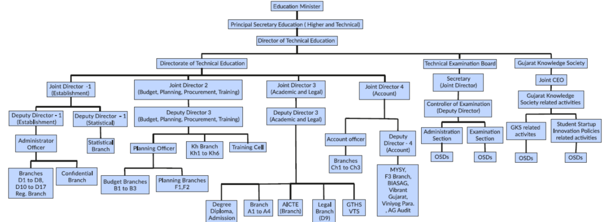

## Figure.9.1

Governing Body - Organizational Chart - Education Department

Furthermore, Government Polytechnic, Palanpur follows the standard practices defined in TEIM (Technical Education Institute Manual), which is available on Commissionerate of Technical Education, Gujarat website on the following link:

- ¥ TEIM Manual: https://dte.gujarat.gov.in/technical-education-institution-manual-teim-govt-polytechnics

## Functions and responsibilities of Various Bodies:

- The administration of the overall Education Department, Gujarat state is decentralized.
- The key officers of the education department are Principal Secretary (Higher and Technical Education), Director-Technical Education, Joint Directors and Principals of the various Government Polytechnics.
- Principal Secretary is the highest authority for overall higher and technical education system in the state.
- Under Principal secretary, Directorate of Technical education works to leverage various governance supports to technical institutions.
- At Directorate office, Joint Directors are appointed for responsibilities of Establishment, Budget-Planning-Procurement, Academic, Legal and Admission related matters.
- At Institute level, Principal is the highest authority for various academic and administrative matters and reports to Director of Technical Education.
- Government Polytechnic,Palanpur is affiliated with Gujarat Technological University, Ahmedabad.
- For the curriculum and evaluation methodology, institute has adopted the rules and regulations laid down by the University.
- Being important stakeholder of the University system, many faculties of the Institute contributes on various boards such as Academic Council, Board of Studies, Academic Inspection etc.

## Service rules, procedures, recruitment and promotional policies:

## Service rules and procedures:

- The Service rules are well defined and amended time to time by the General Administration Department (GAD), Government of Gujarat.
- Service rules including pay, pension and leaves are published in Gujarat Civil Services Rules (GCSR).
- For the pay, Government follows AICTE guidelines.
- The rules are uploaded on Finance Department website on  following link :
- GCSR Rules: https://financedepartment.gujarat.gov.in/rules.html

## Recruitment and Promotion policies:

- The Recruitment Rules (RR) and promotion policy concerned with academic faculties and supporting staff are framed by the Government from time to time.
- Gujarat Gaun Seva Pasandgi Mandal (GSSSB) is statutory body to carry out the direct recruitment for the various non-teaching positions.
- The Gujarat Public Service Commission (GPSC) is statutory body to carry out the direct recruitment for the various academic faculty positions (Principal, Head of the Department,Lecturer) in case of direct recruitment.
- All promotions are carried out as per rules through Departmental Promotion Committee (DPC) with final approval from GPSC.
- The overall mode of recruitment and promotion is as below:
- 100% of the sanctioned positions at the level of Lecturer carried out through direct recruitment by the GPSC based upon proposal received from education department,Gujarat state, as per AICTE norms.
- For remaining cadre (Principal,Head of the Department)  50% of vacant positionsare filled through direct recruitment by GPSC,while remaining 50% positions are filled through promotion by education department through departmental promotion committees.
- The detailed information is available at following link

## https://dte.gujarat.gov.in/recruitment-rules

## B.Minutes of Meetings and Action Taken Reports:

Institute has policy to arrange meetings of head of the different committees and their members for smooth functioning of the institute. Decisions taken in the meetings are recorded in Minutes of Meetings (MoM).

## C.Publication of  Service Rules, Policies and Procedures:

As a Government institution, we are following Government of Gujarat Policies:

- Service Rules: Government Civil Services Rules (GCSR-2002).
- GCSR Rules: https://financedepartment.gujarat.gov.in/rules.html
- Purchase Policy: Gujarat State Purchase Policy-2016.
- Gujarat State Purchase Policy-2016 : http://www.imd-gujarat.gov.in/Document/2016-6-7\_379.pdf
- Admission Policy: Gujarat Act - 2, 2008, Dated: 07/03/2008 and 28/05/2008.
- Admission Policy: http://acpdc.co.in/advertisement/act.html
- Academic Policy: As per Gujarat Technological University (GTU).
- http://www.gtu.ac.in
- StudentÕs Startup and Innovation Policy: SSIP Policy published by Government of Gujarat as on 11/01/2017.
- SSIP Policy:  http://www.startupgujarat.in/writereaddata/Images/pdf/Student-innov-Policy-HT-Edu.pdf

## D.Awareness of Service Rules, Policies and Procedures among the employees/students:

Awareness of Service Rules, Policies and Procedures among the employees/students created through training and awareness program as shown in following details:

## Employees:

- Teaching faculty training: Induction training, subjective training, interdisciplinary training, etc. are arranged by CTE training cell through FSD portal.
- Non-teaching faculty training: Administrative trainings are arranged by SPIPA.
- Institute circular and notification.
- Websites:

1. Government Polytechnic Palanpur (www.gppp.cteguj.in)

2. Commissionerate of Technical Education (https://dte.gujarat.gov.in)

3. Gujarat Technological University (https://www.gtu.ac.in)

4. General Administration Department (https://gad.gujarat.gov.in)

5. Finance Department (https://financedepartment.gujarat.gov.in)

## Students:

- Through Induction and Awareness programs arranged at Institute.

- Institute circular and notice board.

- Websites:

1. Government Polytechnic Palanpur (www.gppp.cteguj.in)

2. Gujarat Technological University (https://www.gtu.ac.in)

## 9.1.3 Decentralization in working and grievance redressal mechanism (5)

Institute Marks 5.00

## A.Decentralization in working:

The administration of the Institute is decentralized as shown in Figure 9.2.

Figure 9.2 Organizational Chart - Institution level

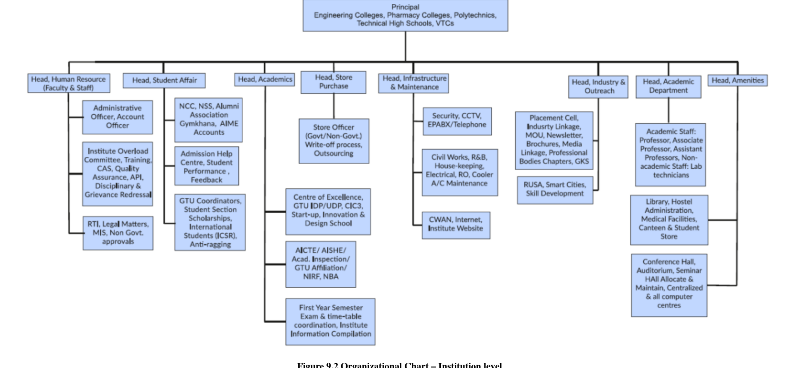

## Decentralization of work :

- Principal of the Institute is responsible for the overall academic and administrative aspects of the Institute.
- Institute also has cells for managing various institute level development activities like Establishment (for faculty and staff service matters), Students matters, Academics, Store and Purchase, Infrastructure &amp; Maintenance, Industry and outreach and central amenities.
- To look after the various academic activities of each programme, Institute has nominated heads of the departments (HODs).
- All faculty and staff members of the concerned programme report to the respective Head of department for their academic activities, academic calendar and managing department level administrative portfolios, grievances etc.
- All HODs report to the head of the Institute.
- To provide detailed guidelines for various activities of a teacher, a Technical Education Institute Manual (TIEM) has been prepared by Commissionerate of Technical Education, Government of Gujarat.
- As per the guidelines of the TEIM, various committees have been formed for the smooth working of the institutional matters as shown in the Figure 9.3 given below vide Office Order No.: GPP/EST/2019/2028 Dated: 05/07/2019.

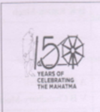

## Government Polytechnic, Palanpur

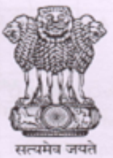

Outside Malan Gate, Palanpur-385001

Phone

(02742) 245219 / 262115

E-mail : gPpalanpur-dte@gujarat Rovin

2028

AL @S 2019

| Sr   | Activity                                              | Convener                               | Co Convener                            | Members                                |
|------|-------------------------------------------------------|----------------------------------------|----------------------------------------|----------------------------------------|
|      | Head, Human Resource (Faculty Staff) :                | Head, Human Resource (Faculty Staff) : | Head, Human Resource (Faculty Staff) : | Head, Human Resource (Faculty Staff) : |
|      | Establishmcnts                                        |                                        | RN Patel-EC                            | VM Prajapati-Mech                      |
|      | Establishmcnts                                        |                                        | RN Patel-EC                            | R G Rana-IC                            |
|      | Establishmcnts                                        |                                        | RN Patel-EC                            | VH Suthar-Mech                         |
|      | IQACTCAS                                              | Poncipal                               | RN Patel-EC                            |                                        |
|      | IQACTCAS                                              | Poncipal                               |                                        | SB Khara Civil                         |
|      | IQACTCAS                                              | Poncipal                               |                                        | MD Parmar- Applied                     |
|      | IQACTCAS                                              | Poncipal                               |                                        | M B Shh-Elect                          |
|      | IQACTCAS                                              | Poncipal                               |                                        | DD Prajapati-Mech                      |
|      | IQACTCAS                                              | Poncipal                               |                                        | JTPatankar-IC                          |
|      | IQACTCAS                                              | Poncipal                               |                                        | JJoshi-Gen                             |
|      | Faculty Training And Pedagogy                         | KA Patel-IC                            | MR Zala-Mech                           | NA Sunsara-Elect                       |
|      |                                                       | CS Pandya Gen                          | MS Mevada-Mech                         |                                        |
|      | Audit Para                                            |                                        |                                        |                                        |
|      | Accounl                                               | DK Raval-Mech                          |                                        |                                        |
|      | Accounl                                               | DK Raval-Mech                          |                                        | JVKureshi-IC                           |
|      | Accounl                                               | DK Raval-Mech                          |                                        | TD Modi-Mech                           |
|      | Accounl                                               | DK Raval-Mech                          |                                        | YD Chaudhary-Mech                      |
|      | Women Devclopment cell & Internal Complaint Committee | DK Raval-Mech                          | MK Pedhadia-EC                         | DETAIL ORDER                           |
|      | Accounl                                               | DK Raval-Mech                          |                                        |                                        |

Page 1of 5

| 8   | Grievance redressal (Staff & Student_                                                                   |                         | Chaudhary-Elect                 | DETAIL ORDER                       |
|-----|---------------------------------------------------------------------------------------------------------|-------------------------|---------------------------------|------------------------------------|
|     | CCC Fcc Reversal                                                                                        | MF Tank-Gen             |                                 | BK Katara-Mcch                     |
|     | E-Mail Handling                                                                                         |                         |                                 |                                    |
| 2   | Head, Student Affairs                                                                                   | Head, Student Affairs   | Head, Student Affairs           | Head, Student Affairs              |
|     | Admission & Hlelp Center                                                                                |                         | MT Tank-Gen                     |                                    |
| 2   | GTU                                                                                                     |                         | S P Joshiyara-EC                | AR Patel-Civil                     |
| 2   | GTU                                                                                                     |                         | S P Mahant-Mech                 | VB3 Chaudhary-Mech                 |
| 2   | GTU                                                                                                     |                         | S P Mahant-Mech                 | PK Bhavsar-Elect                   |
| 2   | GTU                                                                                                     |                         | S P Mahant-Mech                 | S P Joshiyara-EC                   |
| 2   | Student Section; Scholarship: Tab Distriburion (Students); FEE collection: Student Related Mallers ctc, | MM Shah-IC              | MK Pedhadia-FC S N Chauhan-Mech | FM Patel-Civil                     |
|     | Student Section; Scholarship: Tab Distriburion (Students); FEE collection: Student Related Mallers ctc, | MM Shah-IC              |                                 | J B Suthar-Applied                 |
|     | Student Section; Scholarship: Tab Distriburion (Students); FEE collection: Student Related Mallers ctc, | MM Shah-IC              |                                 | MR Zala-Mech                       |
|     | Student Section; Scholarship: Tab Distriburion (Students); FEE collection: Student Related Mallers ctc, | MM Shah-IC              |                                 | vHOza-Mech                         |
|     | Student Section; Scholarship: Tab Distriburion (Students); FEE collection: Student Related Mallers ctc, | MM Shah-IC              |                                 | R M Prajapati-Flect                |
|     | Student Section; Scholarship: Tab Distriburion (Students); FEE collection: Student Related Mallers ctc, | MM Shah-IC              |                                 | R C Parmar-EC                      |
|     | Student Section; Scholarship: Tab Distriburion (Students); FEE collection: Student Related Mallers ctc, | MM Shah-IC              |                                 | R N Sosa -IC                       |
|     | Student Section; Scholarship: Tab Distriburion (Students); FEE collection: Student Related Mallers ctc, | MM Shah-IC              |                                 | MR Palel-Elect D J Vaghela-IC      |
|     | Gymkhana. NSS, NCC Auditoriun, Lecture Expert                                                           | D N Sheth Civil         | R H Prajapati-Mech              | FM Patel-Civil                     |
|     | Gymkhana. NSS, NCC Auditoriun, Lecture Expert                                                           | D N Sheth Civil         | R H Prajapati-Mech              | MK Prajapati-Mech                  |
|     | Gymkhana. NSS, NCC Auditoriun, Lecture Expert                                                           | D N Sheth Civil         | R H Prajapati-Mech              | G $ Rathawa-Elect NM Patel-FC      |
|     | Gymkhana. NSS, NCC Auditoriun, Lecture Expert                                                           | D N Sheth Civil         | R H Prajapati-Mech              | TJChaudhary-IC                     |
|     | Alumni Assuciation                                                                                      | MD Parmar-Applied       | PK Bhavsar-Elect                | # Chaudhary-Applicd Patel-Civil    |
|     | Alumni Assuciation                                                                                      | MD Parmar-Applied       | PK Bhavsar-Elect                | MK Prajapati-Mech                  |
|     | Alumni Assuciation                                                                                      | MD Parmar-Applied       | PK Bhavsar-Elect                | PK Bhavsar-Elect RN Patel-EC       |
|     | Alumni Assuciation                                                                                      | MD Parmar-Applied       | PK Bhavsar-Elect                | VA Chauhan-IC                      |
|     | VISHWA-KARMA YOJNA                                                                                      | S B Khara-Civil         | FM Patel Civil                  | 511 Chaudhary-Elect                |
|     | MYSY                                                                                                    | VM Prajapati-Mech       | RL Chaudhari Mech               |                                    |
| 8   | Anti Ragging Committee                                                                                  | MD Parmar-Applied       |                                 | DETAIL ORDER                       |
| 3   | Head, Store & Purchase:                                                                                 | Head, Store & Purchase: | Head, Store & Purchase:         | Head, Store & Purchase:            |
|     | Central Store Olicer; Purchase & GeM: New items Vikaslaxi CSS; Tendering Outsourcing ctc,               | M J Mansuri-Applied     | €M Prajapati-Mech               | 11 7 Patel-Civil                   |
|     | Central Store Olicer; Purchase & GeM: New items Vikaslaxi CSS; Tendering Outsourcing ctc,               | M J Mansuri-Applied     | MF Tank-Gen                     | D N Sheth-Civil                    |
|     | Central Store Olicer; Purchase & GeM: New items Vikaslaxi CSS; Tendering Outsourcing ctc,               | M J Mansuri-Applied     | MF Tank-Gen                     | PFudani-Mech                       |
|     | Central Store Olicer; Purchase & GeM: New items Vikaslaxi CSS; Tendering Outsourcing ctc,               | M J Mansuri-Applied     | MF Tank-Gen                     | RL Chaudhari-Mech TP Purohit-Elect |
|     | Central Store Olicer; Purchase & GeM: New items Vikaslaxi CSS; Tendering Outsourcing ctc,               | M J Mansuri-Applied     | MF Tank-Gen                     | LK Patel-FC                        |
|     | Central Store Olicer; Purchase & GeM: New items Vikaslaxi CSS; Tendering Outsourcing ctc,               | M J Mansuri-Applied     | MF Tank-Gen                     | JV Kureshi-IC                      |

Page 2 of 5

|    | Purchase Approval Committee                                                                                                                  |                                         | All HoD As A Member                                    | Suthar-Applied                                                                                  | Suthar-Applied                                                                                  | Suthar-Applied                                                                                  | Suthar-Applied                                                                                  | Suthar-Applied                                                                                  | Suthar-Applied                                                                                  | Suthar-Applied                                                                                  | Suthar-Applied                                                                                  | Suthar-Applied                                                                                  | Suthar-Applied                                                                                  | Suthar-Applied                                                                                  | Suthar-Applied                                                                                  | Suthar-Applied                                                                                  |
|----|----------------------------------------------------------------------------------------------------------------------------------------------|-----------------------------------------|--------------------------------------------------------|-------------------------------------------------------------------------------------------------|-------------------------------------------------------------------------------------------------|-------------------------------------------------------------------------------------------------|-------------------------------------------------------------------------------------------------|-------------------------------------------------------------------------------------------------|-------------------------------------------------------------------------------------------------|-------------------------------------------------------------------------------------------------|-------------------------------------------------------------------------------------------------|-------------------------------------------------------------------------------------------------|-------------------------------------------------------------------------------------------------|-------------------------------------------------------------------------------------------------|-------------------------------------------------------------------------------------------------|-------------------------------------------------------------------------------------------------|
|    |                                                                                                                                              | Principal)                              | Store Officer: M J Mansuri-Applied Member Secretary    |                                                                                                 |                                                                                                 |                                                                                                 |                                                                                                 |                                                                                                 |                                                                                                 |                                                                                                 |                                                                                                 |                                                                                                 |                                                                                                 |                                                                                                 |                                                                                                 |                                                                                                 |
|    | Write-off                                                                                                                                    | SB Khara-Civil                          | MJMansuri - Applied                                    | D N Sheth-Civil                                                                                 | BK Katara-Mech                                                                                  | D N Sheth-Civil                                                                                 | D N Sheth-Civil                                                                                 | D N Sheth-Civil                                                                                 | D N Sheth-Civil                                                                                 | D N Sheth-Civil                                                                                 | D N Sheth-Civil                                                                                 | D N Sheth-Civil                                                                                 | D N Sheth-Civil                                                                                 | D N Sheth-Civil                                                                                 | D N Sheth-Civil                                                                                 | D N Sheth-Civil                                                                                 |
|    | Institute Timne lable coordination  Institute Ovcrload commillee- workload calculation Work load distribution AICTE Approval GIU Aftiliation | SB Khara-Civil 5 ) Chauhan-EC           | Head, Academics: TD Modi-Mech R G Rana-IC CM Amin-Mech | J N Chaudhary-Applied A R Patel Civil DH DesaieMech R P Chavada-Elect NJ Chauhan-EC R G Rana-IC | J N Chaudhary-Applied A R Patel Civil DH DesaieMech R P Chavada-Elect NJ Chauhan-EC R G Rana-IC | J N Chaudhary-Applied A R Patel Civil DH DesaieMech R P Chavada-Elect NJ Chauhan-EC R G Rana-IC | J N Chaudhary-Applied A R Patel Civil DH DesaieMech R P Chavada-Elect NJ Chauhan-EC R G Rana-IC | J N Chaudhary-Applied A R Patel Civil DH DesaieMech R P Chavada-Elect NJ Chauhan-EC R G Rana-IC | J N Chaudhary-Applied A R Patel Civil DH DesaieMech R P Chavada-Elect NJ Chauhan-EC R G Rana-IC | J N Chaudhary-Applied A R Patel Civil DH DesaieMech R P Chavada-Elect NJ Chauhan-EC R G Rana-IC | J N Chaudhary-Applied A R Patel Civil DH DesaieMech R P Chavada-Elect NJ Chauhan-EC R G Rana-IC | J N Chaudhary-Applied A R Patel Civil DH DesaieMech R P Chavada-Elect NJ Chauhan-EC R G Rana-IC | J N Chaudhary-Applied A R Patel Civil DH DesaieMech R P Chavada-Elect NJ Chauhan-EC R G Rana-IC | J N Chaudhary-Applied A R Patel Civil DH DesaieMech R P Chavada-Elect NJ Chauhan-EC R G Rana-IC | J N Chaudhary-Applied A R Patel Civil DH DesaieMech R P Chavada-Elect NJ Chauhan-EC R G Rana-IC | J N Chaudhary-Applied A R Patel Civil DH DesaieMech R P Chavada-Elect NJ Chauhan-EC R G Rana-IC |
|    | NBA                                                                                                                                          |                                         | MM Shah-IC                                             | BB Mor-Gen J B Suthar-Applied MK Pedhadia-EC C M Prajapati-Mech                                 | BB Mor-Gen J B Suthar-Applied MK Pedhadia-EC C M Prajapati-Mech                                 | BB Mor-Gen J B Suthar-Applied MK Pedhadia-EC C M Prajapati-Mech                                 | BB Mor-Gen J B Suthar-Applied MK Pedhadia-EC C M Prajapati-Mech                                 | BB Mor-Gen J B Suthar-Applied MK Pedhadia-EC C M Prajapati-Mech                                 | BB Mor-Gen J B Suthar-Applied MK Pedhadia-EC C M Prajapati-Mech                                 | BB Mor-Gen J B Suthar-Applied MK Pedhadia-EC C M Prajapati-Mech                                 | BB Mor-Gen J B Suthar-Applied MK Pedhadia-EC C M Prajapati-Mech                                 | BB Mor-Gen J B Suthar-Applied MK Pedhadia-EC C M Prajapati-Mech                                 | BB Mor-Gen J B Suthar-Applied MK Pedhadia-EC C M Prajapati-Mech                                 | BB Mor-Gen J B Suthar-Applied MK Pedhadia-EC C M Prajapati-Mech                                 | BB Mor-Gen J B Suthar-Applied MK Pedhadia-EC C M Prajapati-Mech                                 | BB Mor-Gen J B Suthar-Applied MK Pedhadia-EC C M Prajapati-Mech                                 |
|    |                                                                                                                                              |                                         | N N Rajgor-Civil                                       | RP Chavada-Elect                                                                                | RP Chavada-Elect                                                                                | RP Chavada-Elect                                                                                | RP Chavada-Elect                                                                                | RP Chavada-Elect                                                                                | RP Chavada-Elect                                                                                | RP Chavada-Elect                                                                                | RP Chavada-Elect                                                                                | RP Chavada-Elect                                                                                | RP Chavada-Elect                                                                                | RP Chavada-Elect                                                                                | RP Chavada-Elect                                                                                | RP Chavada-Elect                                                                                |
|    | SSIP . GTU IDPIUDP                                                                                                                           | B M Patel Elect 1T Patankar-IC (Mentor) | M J Dabgar-EC                                          | JD Modi-Gen                                                                                     | JD Modi-Gen                                                                                     | JD Modi-Gen                                                                                     | JD Modi-Gen                                                                                     | JD Modi-Gen                                                                                     | JD Modi-Gen                                                                                     | JD Modi-Gen                                                                                     | JD Modi-Gen                                                                                     | JD Modi-Gen                                                                                     | JD Modi-Gen                                                                                     | JD Modi-Gen                                                                                     | JD Modi-Gen                                                                                     | JD Modi-Gen                                                                                     |
| 5  | CIC3. Start -Up Innovation and Desien School) IPR                                                                                            | MB Shabh-Elect                          |                                                        | YT Ranu-Civil TP Purohit-Elect                                                                  | YT Ranu-Civil TP Purohit-Elect                                                                  | YT Ranu-Civil TP Purohit-Elect                                                                  | YT Ranu-Civil TP Purohit-Elect                                                                  | YT Ranu-Civil TP Purohit-Elect                                                                  | YT Ranu-Civil TP Purohit-Elect                                                                  | YT Ranu-Civil TP Purohit-Elect                                                                  | YT Ranu-Civil TP Purohit-Elect                                                                  | YT Ranu-Civil TP Purohit-Elect                                                                  | YT Ranu-Civil TP Purohit-Elect                                                                  | YT Ranu-Civil TP Purohit-Elect                                                                  | YT Ranu-Civil TP Purohit-Elect                                                                  | YT Ranu-Civil TP Purohit-Elect                                                                  |
|    | CLEANLINESS                                                                                                                                  |                                         | PDSheth Civil                                          | VA Chauhan-IC P D Sheth-Civil DH DcsaieMech                                                     | VA Chauhan-IC P D Sheth-Civil DH DcsaieMech                                                     | VA Chauhan-IC P D Sheth-Civil DH DcsaieMech                                                     | VA Chauhan-IC P D Sheth-Civil DH DcsaieMech                                                     | VA Chauhan-IC P D Sheth-Civil DH DcsaieMech                                                     | VA Chauhan-IC P D Sheth-Civil DH DcsaieMech                                                     | VA Chauhan-IC P D Sheth-Civil DH DcsaieMech                                                     | VA Chauhan-IC P D Sheth-Civil DH DcsaieMech                                                     | VA Chauhan-IC P D Sheth-Civil DH DcsaieMech                                                     | VA Chauhan-IC P D Sheth-Civil DH DcsaieMech                                                     | VA Chauhan-IC P D Sheth-Civil DH DcsaieMech                                                     | VA Chauhan-IC P D Sheth-Civil DH DcsaieMech                                                     | VA Chauhan-IC P D Sheth-Civil DH DcsaieMech                                                     |
|    |                                                                                                                                              |                                         |                                                        | A V Gajjar-Elect                                                                                | A V Gajjar-Elect                                                                                | A V Gajjar-Elect                                                                                | A V Gajjar-Elect                                                                                | A V Gajjar-Elect                                                                                | A V Gajjar-Elect                                                                                | A V Gajjar-Elect                                                                                | A V Gajjar-Elect                                                                                | A V Gajjar-Elect                                                                                | A V Gajjar-Elect                                                                                | A V Gajjar-Elect                                                                                | A V Gajjar-Elect                                                                                | A V Gajjar-Elect                                                                                |
|    |                                                                                                                                              |                                         |                                                        | S P Joshiara -EC                                                                                | S P Joshiara -EC                                                                                | S P Joshiara -EC                                                                                | S P Joshiara -EC                                                                                | S P Joshiara -EC                                                                                | S P Joshiara -EC                                                                                | S P Joshiara -EC                                                                                | S P Joshiara -EC                                                                                | S P Joshiara -EC                                                                                | S P Joshiara -EC                                                                                | S P Joshiara -EC                                                                                | S P Joshiara -EC                                                                                | S P Joshiara -EC                                                                                |
|    |                                                                                                                                              |                                         |                                                        | NP Vasava-IC                                                                                    | NP Vasava-IC                                                                                    | NP Vasava-IC                                                                                    | NP Vasava-IC                                                                                    | NP Vasava-IC                                                                                    | NP Vasava-IC                                                                                    | NP Vasava-IC                                                                                    | NP Vasava-IC                                                                                    | NP Vasava-IC                                                                                    | NP Vasava-IC                                                                                    | NP Vasava-IC                                                                                    | NP Vasava-IC                                                                                    | NP Vasava-IC                                                                                    |
|    |                                                                                                                                              |                                         |                                                        |                                                                                                 | Page 3 of 5                                                                                     |                                                                                                 |                                                                                                 |                                                                                                 |                                                                                                 |                                                                                                 |                                                                                                 |                                                                                                 |                                                                                                 |                                                                                                 |                                                                                                 |                                                                                                 |

|    |                                                                                  |                                                          |                                                          | J D Modi-Gen                                             |
|----|----------------------------------------------------------------------------------|----------------------------------------------------------|----------------------------------------------------------|----------------------------------------------------------|
|    | J N Chaudhary-Applied Head, Infrastructure &Maintanance:                         | J N Chaudhary-Applied Head, Infrastructure &Maintanance: | J N Chaudhary-Applied Head, Infrastructure &Maintanance: | J N Chaudhary-Applied Head, Infrastructure &Maintanance: |
| 5  | Civil Works R&B (Civil) Liason                                                   | N N Rajgor-Civil                                         | HT Patel-Civil                                           | HP Patel-Civil                                           |
| 5  | Electrical maintenance Billing & R&B (Elect) liason, Solar Panel elc.            | N N Rajgor-Civil                                         | 1 D Chaudhar;-Elect                                      | AR Nijanandi-Elect HR Makawana-Elect                     |
| 5  | Mechanical Maintainancc RO & Water Cooler. AC Maintenance cte.                   | N N Rajgor-Civil                                         | RH Prajapati-Mech                                        | BK Katara-Mech JD Chavda-Mech                            |
|    | Quarters Allotment                                                               |                                                          |                                                          | DD Prajapati-Mech                                        |
|    | Security Institutional Discipline                                                | B B Mor-Gen                                              | Mech                                                     | AN Patel-Civil                                           |
|    | Security Institutional Discipline                                                | B B Mor-Gen                                              | Mech                                                     | N J Chauhan-FC                                           |
|    | Security Institutional Discipline                                                | B B Mor-Gen                                              | Mech                                                     | D J Modi -IC                                             |
|    | CWAN Internct Facility; Lcasc Linc CCTV NAMO WIFL Video Conferencing; BISAG etc. | B B Mor-Gen                                              | A S Chaudhary-IC                                         | PD Sheth-Civil                                           |
|    | CWAN Internct Facility; Lcasc Linc CCTV NAMO WIFL Video Conferencing; BISAG etc. |                                                          | A S Chaudhary-IC                                         | DD Panchal-Mech                                          |
|    | CWAN Internct Facility; Lcasc Linc CCTV NAMO WIFL Video Conferencing; BISAG etc. |                                                          | A S Chaudhary-IC                                         | AM Qureshi-Elect                                         |
|    | CWAN Internct Facility; Lcasc Linc CCTV NAMO WIFL Video Conferencing; BISAG etc. |                                                          | A S Chaudhary-IC                                         | B B Mor-Gen                                              |
|    | CWAN Internct Facility; Lcasc Linc CCTV NAMO WIFL Video Conferencing; BISAG etc. |                                                          | A S Chaudhary-IC                                         | B Suthar-Applied                                         |
|    | MIS Wehsite of Institute KYC ctc                                                 | JTPalankar-IC                                            | SP Joshiyara EC M J Dabgar-EC                            | AR Patcl-Civil                                           |
|    | MIS Wehsite of Institute KYC ctc                                                 | JTPalankar-IC                                            | SP Joshiyara EC M J Dabgar-EC                            | CM Amtin-Mech                                            |
|    | MIS Wehsite of Institute KYC ctc                                                 | JTPalankar-IC                                            | SP Joshiyara EC M J Dabgar-EC                            | MR Patel-Eleco                                           |
|    | MIS Wehsite of Institute KYC ctc                                                 | JTPalankar-IC                                            | SP Joshiyara EC M J Dabgar-EC                            | A $ Chaudhary-IC                                         |
|    | MIS Wehsite of Institute KYC ctc                                                 | JTPalankar-IC                                            | SP Joshiyara EC M J Dabgar-EC                            | B Suthar-Applicd                                         |
|    | Head, Industry & Outreach:                                                       | Head, Industry & Outreach:                               | Head, Industry & Outreach:                               | Head, Industry & Outreach:                               |
|    | Placement Cell. Industry Linkages Placement Fair MOU                             | 1D Chaudhary-Elect                                       | D D PanchalMech                                          | HP Patel-Civil                                           |
|    | Placement Cell. Industry Linkages Placement Fair MOU                             | 1D Chaudhary-Elect                                       | VP Vasava-IC                                             | RH Prajapati-Mcch                                        |
|    | Placement Cell. Industry Linkages Placement Fair MOU                             | 1D Chaudhary-Elect                                       | VP Vasava-IC                                             | A V Gajiar-Elect                                         |
|    | Placement Cell. Industry Linkages Placement Fair MOU                             | 1D Chaudhary-Elect                                       | VP Vasava-IC                                             | TJ Chaudhary-IC                                          |
|    | MAY (Mukhya Mantri Apprentice Yojna) ; PMKVY: D (AICTE) ete. Voc                 | 1D Chaudhary-Elect                                       | JP Fudani-Mech                                           | R G Rana-IC                                              |
|    | MAY (Mukhya Mantri Apprentice Yojna) ; PMKVY: D (AICTE) ete. Voc                 |                                                          | MK Pedhadia-EC                                           |                                                          |
|    | Finishing school ( All) GKS SCOPE Language Lab ctc.                              |                                                          | 1D Modi-Mech                                             | TD Modi-Mech                                             |
|    | Finishing school ( All) GKS SCOPE Language Lab ctc.                              |                                                          | 1D Modi-Mech                                             |                                                          |
|    | Finishing school ( All) GKS SCOPE Language Lab ctc.                              |                                                          | 1D Modi-Mech                                             |                                                          |

Page 4 of 5

|                                             |                    |                   | M J Dabgar-FC               |
|---------------------------------------------|--------------------|-------------------|-----------------------------|
|                                             |                    |                   | NP Vasava-IC                |
| RUSA                                        | JA Joshi - Gen     | 5 NChauhan-Mech   | AR Patel-Civil              |
| RUSA                                        | JA Joshi - Gen     | 5 NChauhan-Mech   | R C Parmur-EC               |
| RUSA                                        | JA Joshi - Gen     | 5 NChauhan-Mech   | D J Vaghela-IC              |
| RUSA                                        | JA Joshi - Gen     | 5 NChauhan-Mech   | J N Chaudbary-Applied       |
| CDTP                                        | D D Prajapati-Mech | J  Joshi-Gen      | D VSheth-Civil              |
| MEDIA & INFORMATION CELL & VC DATA          | JA Joshi-Gen       | 5 P Joshiyara-EC  | LK Patel-EC S P MahanteMech |
| Hcad, Amenities                             | Hcad, Amenities    | Hcad, Amenities   | Hcad, Amenities             |
| Library                                     |                    |                   |                             |
| Hostel Rector Canteen Mess Medical Facility | MD Parmar-Applied  | €N Prajapati-Mech | All Lobby Coordinators      |
| Hostel Rector Canteen Mess Medical Facility | MD Parmar-Applied  | AN Patel-Civil    | All Lobby Coordinators      |
| Hostel Rector Canteen Mess Medical Facility | MD Parmar-Applied  | DModi-Gien        | All Lobby Coordinators      |

## Note: For portfolio specific and responsibilities and related information refer TEIM for GPs. goals

Responsibilities of concerned convencrs /mcmbers;

- Prepare an annual action plan with clear objectives by following standard methodology considering NBA requirements as benchmark for overall development /smooth functioning ofthe institute
- 3 Take Proactive initiative for Reformation in allotted portfolio and quality record keeping for exhibits.
- 2 further to achieve the target as planned in action plan.
- accomplish the plan work as per annual action plan
- Prepare annual summary  report mentioning brief statistics of fulfillment of objectives/ for allotted responsibilities . Also maintain portfolio fic records proofs for the purpose of NBAAICTE goal specil
5. Coordinate with committee /members representatives at regular interval to identily progress/ lagginglfollow ups.
- Constitute appropriate committec represenlatives ifnecessary 10 achievel implement the

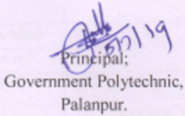

## to:

- 1 All HoD s for information and co-ordination with convener.
- 2 Account. Establishment and Store File.
- 3 Concern ollicers/slaff for necessary action (Through E-mail)

Page 5 of 5

- ¥ Institute level overall human resource planning / administration including faculty / staff service level matters.
- ¥ Institute legal matters, RTI, educational quality assurance, Training need analysis, Annual performance Redressal.

## Student matters cell:

- ¥ Student section related activities/ services, scholarship matters.
- ¥ For smooth conduction of the examination and liaisons with University.
- ¥ Co-and-Extracurricular activities and responsible for various student amenities.
- ¥ Strong bonding with Alumni association.
- ¥ To promote NSS / NCC activities in the Institute.
- ¥ Various issues including Admission, Ragging, and student counselling.

## Academics cell:

- ¥ To ensure the quality of the academics at the Institute level.
- ¥ Coordination among various departments to ensure optimum utilization of the Institute level resources.
- ¥ First year academic and examination planning.
- ¥ To provide academic related data as per the needs of CTE and University.
- ¥ Taking care of the AICTE compliance, University affiliation, NBA requirements.
- ¥ To promote the innovation among the students.

## Store and Purchase cell:

- ¥ Prepare and propose new item requirements based on the Department demands and submit to Directorate of Technical Education office.
- ¥ To purchase and planning from non-government funds.
- ¥ To take care of write-off procedure, maintenance and calibration of various equipments based on the department request.
- ¥ To audit, ensure and keep record of utilization of the equipments.

## Infrastructure and Maintenance cell:

- ¥ Institute Civil works and liaison with R and B civil/electrical related matters.
- ¥ Taking care of overall cleanliness and security of the Institute.
- ¥ To look into drinking water facility as well overall Institute ambiance.

## Industry and Outreach cell:

- ¥ To increase institute-Industry linkage.
- ¥ Media and newsletter coordination.
- ¥ To ensure the implementation of various GOI/GOG schemes effectively in Institute.
- ¥ Explore internship and training opportunities for the students.
- ¥ Skill development / Finishing school of the students

## Institute Amenities cell:

- ¥ To ensure optimal usage of Institute amenities, like hostel, canteen, centralized computing, library, language lab etc.

## B.Grievance redressal cell, Anti Ragging Committee and Prevention of Sexual Harassment Committee:

## B.1 Grievance Redressal

## Grievance Redressal system in Institute:

- Various cells are operative at Institute level for addressing the various grievances.
- Grievance Redress Mechanism has been institutionalized through portal.
- The administration mechanism for accountable, responsive and user-friendly approach has been established along with an efficient and effective grievance redress.

## Responsibilities of the Grievance Cell

- Addressing the grievance of the students and staff.
- Implementation of the corrective steps to be taken to address the grievances and other related matters.
- To deal with issues raised in anti-ragging committee, examination committee (Related to malpractice issues), Committee against sexual harassment.
- Women Empowerment committee etc.

## Grievance Redressal mechanism

- The students can apply on student portal.
- On receipt of specific complains/ grievance from a student, the Redressal cell meets, analyze the matter and corrective measures are taken wherever necessary.
- In case of urgent issue, one can meet concerned officer at any time.

## B.2 Anti-Ragging Committee:

- For prevention and prohibition of ragging in the Institute, an Anti-Ragging Committee as mandated by AICTE, has been formed by the institute.

## B.3 Women Development Cell:

- Women Development Cell is a mandated body as per the Rules and Regulations laid down by AICTE/UGC and MHRD.
- The WDC works with a sole aim of creating hassle-free environment for female students and staff of the campus community thereby enhancing their self-respect and self-confidence.

## 9.1.4 Delegation of financial powers (5)

## Delegation of Financial Powers:

Delegation of financial powers as per the State Government Rules explained as below:

- Controlling Officer - The Principal
- Drawing and Disbursing Officer (DDO) - The Principal
- All HODs are empowered to put the demand as per the requirement for the purchase of laboratory/utility equipment/books/furniture as follows:
- Item costing above Rs. 20000/-, Head of Department sends proposal to CTE purchase committee through Principal office. CTE Purchase committee consist of domain specific senior faculties from the various Govt. Institutions, headed by respective Joint Director, approves and purchases centrally as per the budget provision. (Through open tendering or Government e-Market (GeM).
- Item costing below Rs. 20000/-, purchase is made at the Institute level by concerned department with the help of store officer after due approval from Principal office.
- Consumables as per the requirement are purchased by the HOD with due approval of Head of the Institute.
- All section heads are empowered to scrutinize proposals made by relevant stakeholders and then purchase with due procedure.
- The institute has specific types of Non-Government funds such as Gymkhana fund, Social gathering fund. The disbursement of these funds is done by the Principal as per recommendation of relevant committee.

## 9.1.5 Transparency and availability of correct/unambiguous information in public domain (5)

Institute Marks 5.00

## Transparency and Availability of Information:

Information on policies, rules, processes and its dissemination are made available to the stakeholders on Institute/CTE/University website.

- All India Council for Technical Education (AICTE) EOA letters are available on Institute website.
- The information related to admission in professional courses in Gujarat State is available on ACPDC website (http://www.acpdc.co.in/).
- All the necessary institute information regarding the students, staff and other co-curricular activities are available on the Institute website (http://www.gppp.cteguj.in).
- The syllabus result and other relevant information for students and staff are available on the GTU website (http://www.gtu.ac.in).
- The vendor related information and the online bidding process are done through GeM portal for the procurement purpose.
- As a government institute, we are fully transparent in terms of policies, selection, rules, regulations and procedures.
- Details of policies, selection, rules, regulations and procedures are available on following websites.
- Directorate of Technical Education, Gujarat (https://www.dte.gujarat.gov.in/).
- Education Department, Government of Gujarat (http://gujarat-education.gov.in).
- Gujarat Public Service Commission (http://gpsc.gujarat.gov.in).
- All the information pertaining to Right to Information Act is available on institute website (http://www.gppp.cteguj.in/rti/).

Institute Marks 5.00

## 9.2 Budget Allocation, Utilization, and Public Accounting at Institute level (10)

## Summary of current financial year's budget and actual expenditure incurred(for the institution exclusively)in the three previous financial years

Summary of current financial year's budget and actual expenditure incurred (for the institution exclusively) in the three previous financial years is shown below.

## Utilization Table

|        |                                                                                                     | 2016-17      | 2016-17        | 2017-18      | 2017-18        | 2018-19      | 2018-19        | 2019-20      | 2019-20        |
|--------|-----------------------------------------------------------------------------------------------------|--------------|----------------|--------------|----------------|--------------|----------------|--------------|----------------|
| Sr. No | Item                                                                                                | Budget (Rs.) | Expenses (Rs.) | Budget (Rs.) | Expenses (Rs.) | Budget (Rs.) | Expenses (Rs.) | Budget (Rs.) | Expenses (Rs.) |
| 1      | Teaching and non-teaching staff salary                                                              | 77737560     | 68511946       | 117858715    | 77150463       | 120334817    | 89610116       | 112439920    | 103173496      |
| 2      | Contingency (light bill / telephone bill, training & travel, books, building maintenance)           | 6211827      | 3124354        | 6323028      | 1970096        | 2603267      | 1975651        | 1899056      | 1932225        |
| 3      | Housekeeping & Contractual servants (security service & cleanliness), visiting faculty remuneration | 7423877      | 3816020        | 4598372      | 4399770        | 5322702      | 4326457        | 4832236      | 5007932        |
| 4      | Furniture, Laboratory equipments, consumables                                                       | 1000000      | 1085909        | 1011650      | 0              | 0            | 223723         | 500000       | 103228         |
| 5      | Advance (festival & food grain) for class-4 staff                                                   | 120000       | 120000         | 94000        | 0              | 100000       | 0              | 165000       | 0              |
| Total  | Total                                                                                               | 92493264     | 76658229       | 129885765    | 83520329       | 128360786    | 96135947       | 119836212    | 110216881      |

## Table 1 - CFYm1 2018-19

| Total Income  98963845.00   | Total Income  98963845.00   | Total Income  98963845.00   | Total Income  98963845.00   | Actual expenditure(till…):  96631885.00   | Actual expenditure(till…):  96631885.00   | Actual expenditure(till…):  96631885.00                 | Total No. Of Students 655   |
|-----------------------------|-----------------------------|-----------------------------|-----------------------------|-------------------------------------------|-------------------------------------------|---------------------------------------------------------|-----------------------------|
| Fee                         | Govt.                       | Grants                      | Other sources(specify)      | Recurring including salaries              | Non Recurring                             | Special Projects/Anyother, specify KCG, CDTP, CSS, RUSA | Expenditure per student     |
| 2308554.00                  | 96310000.00                 | 345291.00                   | 0                           | 95825925.00                               | 310022.00                                 | 495938.00                                               | 147529.60                   |

## Table 2 - CFYm2 2017-18

| Total Income  90767442.00   | Total Income  90767442.00   | Total Income  90767442.00   | Total Income  90767442.00   | Actual expenditure(till…):  84966253.00   | Actual expenditure(till…):  84966253.00   | Actual expenditure(till…):  84966253.00            | Total No. Of Students 797   |
|-----------------------------|-----------------------------|-----------------------------|-----------------------------|-------------------------------------------|-------------------------------------------|----------------------------------------------------|-----------------------------|
| Fee                         | Govt.                       | Grants                      | Other sources(specify)      | Recurring including salaries              | Non Recurring                             | Special Projects/Anyother, specify CDTP, CSS, RUSA | Expenditure per student     |
| 2630242.00                  | 87491000.00                 | 646200.00                   | 0                           | 84904073.00                               | 0                                         | 62180                                              | 106607.59                   |

## Table 3 - CFYm3 2016-17

| Total Income  82160494.00   | Total Income  82160494.00   |        |                        | Actual expenditure(till…):  76863184.00   | Actual expenditure(till…):  76863184.00   | Actual expenditure(till…):  76863184.00            | Total No. Of Students 960   |
|-----------------------------|-----------------------------|--------|------------------------|-------------------------------------------|-------------------------------------------|----------------------------------------------------|-----------------------------|
| Fee                         | Govt.                       | Grants | Other sources(specify) | Recurring including salaries              | Non Recurring                             | Special Projects/Anyother, specify CDTP, CSS, RUSA | Expenditure per student     |
| 3698082.00                  | 78444786.00                 | 17626  | 0                      | 75370616.00                               | 1317613.00                                | 174955.00                                          | 80065.82                    |

## 9.2.1 Adequacy of Budget Allocation (4)

## Institute Marks

4.00

Prior to each financial year, each department is preparing non-recurring budget requirement while account office is preparing the recurring budget requirement. The consolidated (recurring and non-recurring) budget requirement is prepared at institute level by the account office and submitted to Commissionerate of technical education for further approval of education department. Budget re-appropriation process is carried out at CTE level after 3rd quarter of the financial year to ensure the allocated budget is as per requirement for smooth functioning of the academic activities.

Details and justification of adequacy of Budget Allocation is as follows :

|   Sr. No | Year          |   Allocated Budget (Rs.) |   Expenditure (Rs.) | Remarks   |
|----------|---------------|--------------------------|---------------------|-----------|
|        1 | CFY (2019-20) |              1.12935e+08 |         1.11286e+08 | Adequate  |

- 2 CFYm1 (2018-19)

3

CFYm2 (2017-18)

## 9.2.2 Utilization of allocated funds (4)

Institute Marks

4.00

|   Sr. No | Year            |   Allocated Budget (Rs.) |   Expenditure (Rs.) |   Utilization (%) |
|----------|-----------------|--------------------------|---------------------|-------------------|
|        1 | CFY (2019-20)   |              1.12935e+08 |         1.11286e+08 |             98.54 |
|        2 | CFYm1 (2018-19) |              9.63516e+07 |         9.61359e+07 |             99.77 |
|        3 | CFYm2 (2017-18) |              8.7491e+07  |         8.49041e+07 |             97.04 |

The allocated budget by the government to the institute for last three years was satisfactory and was utilized as per the details provided in Utilization Table.

## 9.2.3 Availability of the audited statements on the institute's website (2)

In the Government Institute audit is carried out by

- (1) Our Head office i.e. Commissionerate of Technical Education, Gandhinagar, Gujarat State.
- (2) Office of Accountant General, Rajkot.

A udited statements are available on Institute website.

Last CTE audit details are as follows:

Date of Audit visit to Institute: 17/2/2020 to 20/2/2020.

Period covered by Audit: April-2014 to March-2019.

Institute Marks 2.00

96351600.00

87491000.00

96135947.00

84904073.00

Adequate

Adequate

Last A.G audit details are as follows:

Date of Audit visit to Institute: 16/12/2015 to 28/12/2015.

Period covered by Audit: June-2007 to November-2015.

## 9.3 Department Specific Budget Allocation, Utilization (5)

Total Marks 5.00

Utilization Table (Civil Department)

|                                      | 2019-20      | 2019-20        | 2018-19      | 2018-19        | 2017-18      | 2017-18        | 2016-17      | 2016-17        |
|--------------------------------------|--------------|----------------|--------------|----------------|--------------|----------------|--------------|----------------|
| Item                                 | Budget (Rs.) | Expenses (Rs.) | Budget (Rs.) | Expenses (Rs.) | Budget (Rs.) | Expenses (Rs.) | Budget (Rs.) | Expenses (Rs.) |
| Infrastructure Built-up              | 0            | 0              | 0            | 0              | 0            | 0              | 0            | 0              |
| Library                              | 32993        | 32993          | 42165        | 42165          | 0            | 0              | 699          | 699            |
| Laboratory Equipment                 | 0            | 0              | 16567        | 16567          | 0            | 0              | 384460       | 384460         |
| Software                             | 0            | 0              | 0            | 0              | 0            | 0              | 0            | 0              |
| Furniture                            | 0            | 0              | 0            | 0              | 0            | 0              | 0            | 0              |
| Laboratory Consumables               | 2410         | 2410           | 0            | 0              | 0            | 0              | 0            | 0              |
| Maintenance and Spares               | 0            | 0              | 0            | 0              | 0            | 0              | 0            | 0              |
| R&D                                  | 0            | 0              | 0            | 0              | 0            | 0              | 0            | 0              |
| Teaching & Non-Teaching staff salary | 10574527     | 10574527       | 9001608      | 9001608        | 7612468      | 7612468        | 7622713      | 7622713        |

| Miscellaneous expenses (Light, Rent, Public Advert)   |   407200 |   385100 |   404400 |   369296 |   444400 |   386827 |   638000 |   559630 |
|-------------------------------------------------------|----------|----------|----------|----------|----------|----------|----------|----------|
| Security, House keeping                               |  1009000 |  1001586 |   865800 |   865200 |   955200 |   879954 |   775400 |   763204 |
| Training & Travel                                     |        0 |        0 |     3375 |     3375 |        0 |        0 |        0 |        0 |
| Total Rs.                                             | 12026130 | 11996616 | 10333915 | 10298211 |  9012068 |  8879249 |  9421272 |  9330706 |

## Table 1 :: CFY 2019-20

| Total Budget  12026130   | Actual expenditure (till…):  11996616   | Actual expenditure (till…):  11996616   | Actual expenditure (till…):  11996616   |
|--------------------------|-----------------------------------------|-----------------------------------------|-----------------------------------------|
| Non Recurring            | Recurring                               | Non Recurring                           | Recurring                               |
| 35403                    | 11990727                                | 35403                                   | 11961213                                |

## Table 2 :: CFYm1 2018-19

| Total Budget  10333915   |           | Actual expenditure (till…):  10298211   |           |
|--------------------------|-----------|-----------------------------------------|-----------|
| Non Recurring            | Recurring | Non Recurring                           | Recurring |
| 58732                    | 10275183  | 58732                                   | 10239479  |

## Table 3 :: CFYm2 2017-18

| Total Budget  9012068   |           | Actual expenditure (till…):  8879249   |           |
|-------------------------|-----------|----------------------------------------|-----------|
| Non Recurring           | Recurring | Non Recurring                          | Recurring |
| 0                       | 9012068   | 0                                      | 8879249   |

## Table 4 :: CFYm3 2016-17

| Total Budget  9421272   |           | Actual expenditure (till…):  9330706   |           |
|-------------------------|-----------|----------------------------------------|-----------|
| Non Recurring           | Recurring | Non Recurring                          | Recurring |
| 385159                  | 9036113   | 385159                                 | 8945547   |

Sr. No

Year

1

2

3

CFY (2019-20)

CFYm1 (2018-19)

CFYm2 (2017-18)

4

CFYm3 (2016-17)

## 9.3.2 Utilization of allocated funds (3)

## Institute Marks

3.00

|   Sr. No | Year            |   Allocated Budget (Rs.) |   Expenditure (Rs.) |   Utilization (%) |
|----------|-----------------|--------------------------|---------------------|-------------------|
|        1 | CFY (2019-20)   |              1.20261e+07 |         1.19966e+07 |             99.75 |
|        2 | CFYm1 (2018-19) |              1.03339e+07 |         1.02982e+07 |             99.65 |
|        3 | CFYm2 (2017-18) |              9.01207e+06 |         8.87925e+06 |             98.53 |
|        4 | CFYm3 (2016-17) |              9.42127e+06 |         9.33071e+06 |             99.04 |

12026130.00

10333915.00

9012068.00

9421272.00

11996616.00

10298211.00

8879249.00

9330706.00

Remarks

Adequate

Adequate

Adequate

Adequate

2.00

Prior to each financial year, each department is preparing non-recurring budget requirement while account office is preparing the recurring budget requirement. The consolidated (recurring and non-recurring) budget requirement is prepared at institute level by the account office and submitted to Commissionerate of technical education for further approval of education department. Budget re-appropriation process is carried out at CTE level after 3rd quarter of the financial year to ensure the allocated budget is as per requirement for smooth functioning of the academic activities.

Details and justification of adequacy of Budget Allocation is as follows:

Allocated Budget

(Rs.)

Expenditure

(Rs.)

## 9.4 Library and Internet (20)

## (It is assumed that zero deficiency report was received by the institution, Effective availability and utilization to be demonstrated)

## 9.4.1 Quality of learning resources (hard/soft) (10)

Institute has a central library which has a rich collection of books/journals/periodicals etc.

Details of the library are as under.

- Carpet area of library (in m): 769.20 Square Meter.
- Reading space (in m): 225.20 Square Meter.
- Number of seats in reading space: 30
- Number of Books Circulation per day: 6
- Number of users per day: 25 to 30
- Number of users (reading space) per day: 25
- Timings: During Working day: 10:00 TO 05:40
- Number of library staff: 2
- Number of library staff with degree in Library: 1
- Management Computerization, For search: YES
- Library services on Internet/Intranet:
- Æ E-Books Access and Downloading Facility.
- Æ E-Journals/Magazines Access &amp; Downloading Facility.
- Library Total No. of Books (Hard/Soft):
- Total No. of Journals / Technical Magazines
- No. of total technical Journals / Magazines Subscribed :
- Digital Library
- Member of National Digital Library: Yes, IIT Kharagpur
- Availability over Internet / Intranet:
- E-Books: 371 Nos.
- E-Journals: 01 Nos.
- Institute is very specific to ensure that the classroom teaching, laboratory learning and the concept of self learning methodology is practiced seriously and sincerely.
- Internet connected PCs are available in library from which students can access e-resources with local network facility in library.
- List of available e-books of branch wise is also available at library so, students can easily find out whatever they want to search.
- We are issuing 2 books per student for 2 weeks.
- General knowledge reading materials is also provided to students for various competitive exams.
- Newspaper facility is also available for students as well as staff.
- Question papers of past five years of various subjects are also available at library for students.

Hard Copy 17666 (Titles 3983)

Soft Copy (E-Books)

371

Hard Copy: 17

Soft Copy: 01

Institute Marks 10.00

## 9.4.2 Internet (10)

Name of the Internet provider

Bharat Sanchar  Nigam Limited(BSNL)

Available band width

10MBPS CAMPUS LAN (WIRED), 200MBPS WIFI

WiFi availability

Yes, No of access points:14

Internet access in labs, classrooms, library and offices of all Departments

Yes, Total 347 Nodes

Security arrangements

Firewall Partially working (Cyber Roam)

## 9.5 Institutional Contribution to the Community Development (5)

Government Polytechnic, Palanpur contribute their share in Community Development through following activities.

1. Community Development Through Polytechnics (CDTP) Scheme funded by MHRD, New Delhi.

Details of CDTP activities are as follows:

Community Wing project was started at Government Polytechnic, Palanpur in the year 1994. Then the scheme is revised as CDTP (Community development through Polytechnic) in 2008. The grant allocation for the project is being done by MHRD, New Delhi. It is govern by the coordinator (Principal) of the institute with the advice of advisory committee as well as executive committee.

For the implementation of CDTP Project, a survey of rural area is being done on primary basis to identify the skill based need of the society. On the basis of such survey, different short term training program is conducted to enhance employability as well as their self-employment. For the smooth operation of the scheme a community consultant is hired on contract base. In this scheme trainer given remuneration on hour basis and the trainees are trained without any charge means free of cost. Last four years, financial status &amp; progress data is as under.

## Table:-1 (Financial status &amp; progress)

| Year    | Recurring grant (Rs.)   | Non- recurring grant (Rs.)   | Total (Rs.)              | Expenditure (Rs.)   |   Nos. of trained person |   Nos. of employment/self employment after training |
|---------|-------------------------|------------------------------|--------------------------|---------------------|--------------------------|-----------------------------------------------------|
| 2016-17 | 23,61,148=00            |                              | 5,93,700=00 29,54,848=00 | 1,37,482=00         |                      144 |                                                  60 |
| 2017-18 | 24,14,144=00            |                              | 5,93,700=00 30,07,844=00 | 54,750=00           |                       00 |                                                  00 |
| 2018-19 | 24,82,020=00            |                              | 5,93,700=00 30,75,720=00 | 37,402=00           |                       52 |                                                  28 |

## Institute Marks

10.00

## Total Marks 5.00

## Institute Marks

5.00

2019-20

22,17,126=50

5,93,700=00 28,10,826=00

3,56,318=50

262

## Table:-2 (Skill Development Training Program for the year 2019-20)

| Sr.No   | Course Name                     |   No. of Trained person |
|---------|---------------------------------|-------------------------|
| 1       | Data entry operator             |                      41 |
| 2       | Embroidery work                 |                      30 |
| 3       | Paper bag making                |                      17 |
| 4       | Tailoring work.                 |                     120 |
| 5       | Beauty parlour                  |                      20 |
| 6       | Embroidery and  hand work       |                      17 |
| 7       | Tailoring  and  Embroidery Work |                      17 |
|         | Total                           |                     262 |

9.6 Alumni Performance and Connect (10)

Applied for registration of Alumni Association in the Office of Charity Commissioner as on Date.5th September,2020.

155

## Total Marks 5.00

Institute Marks

5.00

## Annexure I

## (A) PROGRAM OUTCOME (POs)

1. Basic and Discipline specific knowledge: Apply knowledge of basic mathematics, science and engineering fundamentals and engineering specialization to solve the engineering problems.
2. Problem analysis: Identify and analyse well-defined engineering problems using codified standard methods.
3. Design/ development of solutions : Design solutions for well-defined technical problems and assist with the design of systems components or processes to meet specified needs.
4. Engineering Tools, Experimentation and Testing: Apply modern engineering tools and appropriate technique to conduct standard tests and measurements.
5. Engineering practices for society, sustainability and environment: Apply appropriate technology in context of society, sustainability, environment and ethical practices.
6. Project Management: Use engineering management principles individually, as a team member or a leader to manage projects and effectively communicate about well-defined engineering activities.
7. Life-long learning: Ability to analyse individual needs and engage in updating in the context of technological changes.

## (B) PROGRAM SPECIFIC OUTCOME (PSOs)

| PSO1   | Select and use of appropriate advanced methods, materials and equipment in construction industry.          |
|--------|------------------------------------------------------------------------------------------------------------|
| PSO2   | Suggest relevant and safe demolition/ dismantling techniques for masonry / concrete building structure.    |
| PSO3   | Evaluate damaged structure and suggest appropriate repair / retrofit and maintenance methods / techniques. |

Place :

Palanpur

Date :

24-09-2020 15:41:10

## Declaration

The head of the institution needs to make a declaration as per the format given The head of the institution needs to make a declaration as per the format given - -

- I undertake that, the institution is well aware about the provisions in the NBA's accreditation manual concerned for this application, rules, regulations, notifications and NBA expert visit guidelines inforce as on date and the institutes hall fully abide by them.
- It is submitted that information provided in this Self Assessment Report is factually correct.
- I understand and agree that an appropriate disciplinary action against the Institute willbe initiated by the NBA. In case, any false statement/information is observed during pre-visit, visit, postvisit and subsequent to grant of accreditation.

## Head of the Institute

Name : Mr.Sureshkumar.D.Dabhi

Designation : Head of the Department(Mechanical Engineering Department) and Principal(Incharge) Signature :

Seal of The Institution :

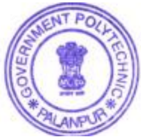