## Part B

## 1 1 VISION, MISSION AND PROGRAM EDUCATIONAL OBJECTIVES VISION, MISSION AND PROGRAM EDUCATIONAL OBJECTIVES (50) (50)

## 1.1 State the Vision and Mission of the Department and Institution (5)

| Vision of the institute   | To produce competent diploma engineers as per need of industries and entrepreneurs  with ethical values.                                                                                                                                                                    |
|---------------------------|-----------------------------------------------------------------------------------------------------------------------------------------------------------------------------------------------------------------------------------------------------------------------------|
| Mission of the institute  | Government Polytechnic, Palanpur strives to impart, 1. To impart Industry oriented technical education. 2. Excellent teaching and learning environment. 3. Promote entrepreneurship activities. 4. Continual growth in every sphere of life by developing core human values |
| Vision of the Department  | To prepare competent diploma level electronics and communication engineers, catering the needs of industries and society as an excellent employees, innovator and entrepreneur with moral values.                                                                           |

Mission of the Department

| Mission No.   | Mission Statements                                                          |
|---------------|-----------------------------------------------------------------------------|
| M1            | Provide quality education in the field of EC engineering                    |
| M2            | Develop state of art laboratories, classrooms and up gradation of faculties |
| M3            | Strengthen industrial liaison by offering mutual beneficiaries services     |

## Electronics &amp; Communication Engineering

## PART B: Criteria Summary

| Critera No.   | Criteria                                                  |   Total Marks |   Institute Marks |
|---------------|-----------------------------------------------------------|---------------|-------------------|
| 1             | VISION, MISSION AND PROGRAM EDUCATIONAL OBJECTIVES        |            50 |             50    |
| 2             | PROGRAM CURRICULUM AND TEACHING - LEARNING PROCESSES      |           200 |            200    |
| 3             | COURSE OUTCOMES AND PROGRAM OUTCOMES                      |           100 |            100    |
| 4             | STUDENTS' PERFORMANCE                                     |           200 |             80.63 |
| 5             | FACULTY INFORMATION AND CONTRIBUTIONS                     |           150 |            146.33 |
| 6             | FACILITIES AND TECHNICAL SUPPORT                          |           100 |            100    |
| 7             | CONTINOUS IMPROVEMENT                                     |            75 |             75    |
| 8             | STUDENT SUPPORT SYSTEMS                                   |            50 |             50    |
| 9             | GOVERNANCE, INSTITUTIONAL SUPPORT AND FINANCIAL RESOURCES |            75 |             75    |
| Total         | Total                                                     |          1000 |            877    |

## Total Marks Total Marks   50.00 50.00

## Total Marks 5.00

Institute Marks

5.00

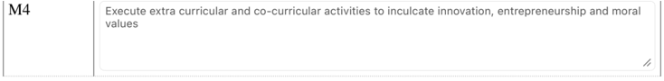

## 1.2 State the Program Educational Objectives (PEOs) (5)

| PEO No.   | Program Educational Objectives Statements                                                                                                                          | Program Educational Objectives Statements   |
|-----------|--------------------------------------------------------------------------------------------------------------------------------------------------------------------|---------------------------------------------|
| PEO1      | Successfully pursue professional Electronics and Communication engineering career working in multidisciplinary areas, focusing on innovation and entrepreneurship. |                                             |
| PEO2      | Pursue higher education.                                                                                                                                           |                                             |
| PEO3      | Demonstrate societal and ethical responsibility in every domain of life.                                                                                           |                                             |
| PEO4      | Adapt technological changes with focus on societal and environmental issues.                                                                                       |                                             |

1.3 Indicate where and how the Vision, Mission and PEOs are published and disseminated among stakeholders (10)

## Total Marks 5.00

Institute Marks

5.00

## Total Marks 10.00

Institute Marks

10.00

The Vision, Mission, and PEOs of the Electronics &amp; Communication Engineering department are strategically published and disseminated to ensure they serve as the foundation for all academic and administrative activities. The department ensures that both internal and external stakeholders are well-versed in these objectives through a multi-channel approach and processes:

## Publication Channels

The following table outlines the specific locations and target audiences for the dissemination of the Departmental Vision, Mission, and PEOs.

Table 1.3.1 Publication and Dissemination Channels for Vision, Mission, and PEOs

|    | Sr. No.Place of Dissemination                                | Target Stakeholders                               |
|----|--------------------------------------------------------------|---------------------------------------------------|
|  1 | Institute & Departmental Website ( https://gppalanpur.ac.in/ | ) Internal & External Stakeholder (Global access) |
|  2 | Department Notice Board & Head Office                        | Internal & External Stakeholder                   |
|  3 | Department Laboratories & Classrooms                         | Internal Stakeholder                              |
|  4 | Orientation Programme & Parents Teacher Meetings             | Internal & External Stakeholder                   |
|  5 | Curriculum documents: Course Files, Lab Manuals              | Internal Stakeholder                              |
|  6 | Departmental Newsletter & email (Signatures)                 | Internal & External Stakeholder                   |

## Dissemination Process and Stakeholder Engagement

To ensure the deep-rooted understanding of Vision and Mission, these statements are actively disseminated through structured engagements among stakeholders.

Figure 1.3.1 Dissemination in Orientation Programme

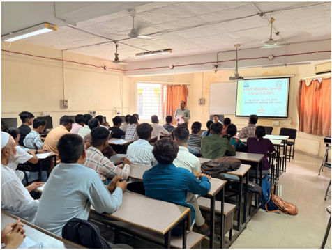

- Internal Stakeholders (Students &amp; Faculty):
- Induction Programs: Newly admitted students are briefed on the Vision, Mission, and PEOs in the orientation program.
- Continuous Awareness: Faculty members reiterate the alignment of Course Outcomes (COs) with the Departmental Mission during the introductory lecture of every course.
- Academic Records: Every lab manual and course file begins with these statements to remind students about the motive behind their education.
- External Stakeholders (Parents, Alumni, &amp; Industry):
- Parent-Teacher Meetings (PTM): Statements are presented to parents to align their support with departmental goals.
- Industry-Institute Interaction: The statements are shared with industry partners to ensure our objectives match professional requirements.
- Alumni Meets: The statements are reviewed with alumni to validate if the program successfully prepared them.

The department ensures effective dissemination through continuous stakeholder interaction via multiple channels and feedback mechanisms.

Figure 1.3.2 Dissemination Process and Stakeholder Engagement Framework

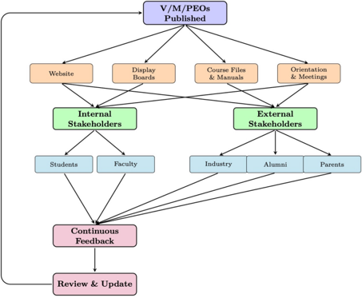

## Stakeholder Roles and Contributions

The department recognizes that quality enhancement is a collaborative effort. Each stakeholder plays a specific role in the formulation, implementation, and attainment of the Vision, Mission, and PEOs.

| Stakeholder Type       | Role in V/M/PEO Implementation                | Contribution to Quality Enhancement                                                                                                                                                                  |
|------------------------|-----------------------------------------------|------------------------------------------------------------------------------------------------------------------------------------------------------------------------------------------------------|
| Students               | Internal Primary beneficiaries of the program | Active participation in the Teaching-Learning Process Provide feedback through Course Exit Surveys and Program Exit Surveys. Participate in professional bodies and technical events to achieve POs. |
| Faculty / DQACInternal | Implement vision and mission via teaching     | Execute teaching-learning processes Mapping of COs to POs and PEOs. Serve in academic committees Provide inputs for curriculum design and assessment                                                 |

## The drafting process was strictly guided by:

- The Institute's Vision and Mission (to ensure vertical consistency).
- Regulatory benchmarks from AICTE, NBA, DTE and GTU.

## Stakeholder Consultation and Validation:

The draft was presented for review by stakeholders on February 4, 2017. Feedback was gathered and analyzed to ensure the statements were measurable and achievable. If refinement was needed, feedback was incorporated, and the draft was revisited.

## Final Approval and Dissemination:

A final approval meeting with stakeholders was held on February 18, 2017 to finalize the statements. Upon formal approval by the stakeholders and departmental leadership, the Vision and Mission were adopted and formally disseminated to all stakeholders.

| Parents   | ExternalSupport students' academic journey and career goals   | Attend orientation and Parent-Teacher Meetings (PTM) to monitor student progress. Support students' career aspirations                                                            |
|-----------|---------------------------------------------------------------|-----------------------------------------------------------------------------------------------------------------------------------------------------------------------------------|
| Industry  | ExternalKey employers and skill validators                    | Employ graduates and provide internships Conduct workshops, seminars, and guest lectures                                                                                          |
| Alumni    | ExternalLong-term success indicators                          | Represent program effectiveness in careers Provide feedback on curriculum relevance Mentoring support to our students Facilitate placement opportunities and industry networking. |

Table 1.3.2 Stakeholder Roles &amp; Contributions to Quality Enhancement

1.4 State the process for defining the Vission and Mission of the Department, and PEOs of the program (15)

## Total Marks 15.00

Institute Marks

15.00

## Process for Defining Vision and Mission

The department follows a systematic, stakeholder-driven process to define and refine the Vision and Mission statements. This process ensures alignment of departmental Vision and mission with the Institute's goals while addressing the evolving needs of the industry and society. The process for the current cycle was executed in 2017 as follows:

## SWOT Analysis and Draft Formulation:

The process initiated with an exhaustive SWOT analysis involving a broad spectrum of internal and external stakeholders (faculty, students, alumni, and industry experts) between January 16 and January 23, 2017. This phase focused on identifying core competencies and pedagogical gaps. On February 2, 2017, the Departmental Quality Assurance Cell (DQAC) synthesized the SWOT findings.

Figure 1.4.1 Departmental Meeting for SWOT

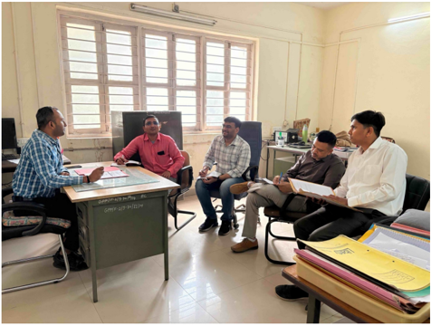

Figure 1.4.2 Systematic Process for Defining Vision, Mission &amp; PEOs

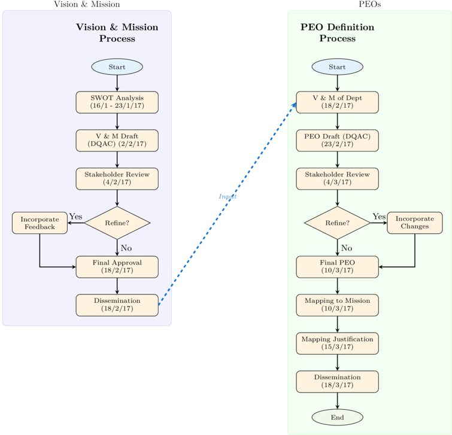

## Process for Defining PEOs

The Department follows a systematic process to ensure that the PEOs are aligned with the Mission of the Department. The PEOs were defined through a structured process involving all key stakeholders.

## Initial Drafting:

Following the formal adoption of the Departmental Vision and Mission on February 18, 2017, the Departmental Quality Assurance Cell (DQAC) initiated the drafting of the PEOs. On February 23, 2017, an initial set of PEOs was formulated, focusing on:

- Graduates professional career progression
- Academic pursuits and lifelong learning.
- Social responsibility and ethical practice.

## Stakeholder Consultation and Refinement:

On March 4, 2017, the draft PEOs were subjected to a rigorous review process. Feedback was collected from the stakeholders, and necessary refinements were made.

## Finalization and Mission Mapping:

The PEOs were formally finalized on March 10, 2017. To ensure "Vertical Consistency," the department performed a PEO-Mission Mapping exercise. This step verified that every Mission statement is supported by at least one PEO, ensuring a cohesive departmental strategy.

## Justification and Dissemination:

On March 15, 2017, the DQAC documented the justification for the mapping matrix, explaining the strength of the correlation between the Mission and the PEOs. On March 18, 2017, the PEOs were disseminated across all platforms.

1.5 Establish Consistency of PEOs with Mission of the Department (15)

Total Marks 15.00

Institute Marks

15.00

| Mission                                                                                                               | PEO1                                                                                         | PEO2                                                                                      | PEO3                                                                                       | PEO4                                                                                  |
|-----------------------------------------------------------------------------------------------------------------------|----------------------------------------------------------------------------------------------|-------------------------------------------------------------------------------------------|--------------------------------------------------------------------------------------------|---------------------------------------------------------------------------------------|
| M1:  Provide quality education in EC engineering                                                                      | 3:  Quality EC education is essential for professional success and innovation                | 3:  Strong foundation enables graduates to pursue higher studies and continuous learning  | 2:  Curriculum integrates ethical practices and professional responsibility                | 2:  Quality education includes awareness of environmental and sustainability issues   |
| M2:  Develop state of art laboratories, classrooms and faculty upgradation                                            | 2:  Modern facilities and upgraded faculty support skill development for careers             | 3:  Adequate infrastructure and knowledgeable faculty facilitate higher learning          | 1:  Upgradation of faculty indirectly supports ethical awareness                           | 2:  Modern labs enable hands-on experience with sustainable technologies              |
| M3:  Strengthen industrial liaison by offering mutual beneficiaries services                                          | 3:  Industry liaison directly enhances employability, innovation, and entrepreneurial skills | 2:  Industry exposure motivates students to learn advanced technologies and skills needed | 2:  Industry interactions expose students to professional ethics and social responsibility | 2:  Industry engagement highlights environmental challenges and sustainable practices |
| M4:  Execute extra-curricular and co-curricular activities to inculcate innovation, entrepreneurship and moral values | 3:  Activities directly nurture innovation and entrepreneurial mindset                       | 2:  Co-curricular activities complement academic learning and encourage growth            | 3:  Activities explicitly develop moral values and ethical responsibility                  | 3:  Activities sensitize students to environmental and societal issues                |

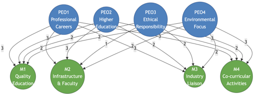

Figure 1.5.1 PEO-Mission Correlation Graph

| PEO Statements                                                                                                                                                     |   M1 |   M2 |   M3 |   M4 |
|--------------------------------------------------------------------------------------------------------------------------------------------------------------------|------|------|------|------|
| Successfully pursue professional Electronics and Communication engineering career working in multidisciplinary areas, focusing on innovation and entrepreneurship. |    3 |    2 |    3 |    3 |
| Pursue higher education.                                                                                                                                           |    3 |    3 |    2 |    2 |
| Demonstrate societal and ethical responsibility in every domain of life.                                                                                           |    2 |    1 |    2 |    3 |
| Adapt technological changes with focus on societal and environmental issues.                                                                                       |    2 |    2 |    2 |    3 |

## 2 2 PROGRAM CURRICULUM AND TEACHING - LEARNING PROCESSES PROGRAM CURRICULUM AND TEACHING - LEARNING PROCESSES (200) (200)

## 2.1 Program Curriculum (40)

All POs and PSOs are being demonstrably met through Curriculum ? : NO

2.1.1 State the process used to identify extent of compliance of the Board curriculum for attaining the Program Outcomes (POs) and Program Specific Outcomes (PSOs) as mentioned in AnnexureI. Also mention the identified curricular gaps, if any (25)

## A. Process used to identify extent of compliance of curriculum for attaining POs &amp; PSOs (15)

Total Marks Total Marks   200.00 200.00

Institute Marks

25.00

Institute Marks

15.00

Government Polytechnic Palanpur is affiliated with Gujarat Technological University (GTU), which provides the curriculum for the Diploma in Electronics and Communication Engineering. Each syllabus clearly outlines the course title and code, the semester in which it is offered, the teaching and examination scheme with credits, detailed course content, Weightage distribution across topics, marks allocation according to cognitive levels, expected course outcomes, laboratory experiments, required equipment, and recommended reference books.

GTU began its academic activities in 2008, and the first revised diploma curriculum was introduced in the academic year 2012Ð13. To strengthen and update its academic framework, GTU established the Curriculum Development Cell (CDC) in 2012. This cell was responsible for revising syllabus across all diploma engineering programs under the guidance of experts from NITTTR (National Institute of Technical Teachers

| Course C ode   | Course Title                                       |              | Teaching Scheme/ Week   | N Credit     | ew Teaching Scheme and Course Category   | Theory Mark   | Practical Mark   | Practical Mark   | Grand Total   | Grand Total   | Course Category                           |              |
|----------------|----------------------------------------------------|--------------|-------------------------|--------------|------------------------------------------|---------------|------------------|------------------|---------------|---------------|-------------------------------------------|--------------|
|                |                                                    | L T          | L T                     | (L+T+P) P    |                                          | ESE           | PA               | ESE              |               | PA            |                                           |              |
| SEMESTER Ð 1   | SEMESTER Ð 1                                       | SEMESTER Ð 1 | SEMESTER Ð 1            | SEMESTER Ð 1 | SEMESTER Ð 1                             | SEMESTER Ð 1  | SEMESTER Ð 1     | SEMESTER Ð 1     | SEMESTER Ð 1  | SEMESTER Ð 1  | SEMESTER Ð 1                              | SEMESTER Ð 1 |
| 4300001        | Mathematics                                        | 3            | 1                       | 0            | 4                                        | 70            | 30               | 0                | 0             | 100           | Basic science                             |              |
| 4300002        | Communication Skills in English                    | 2            | 0                       | 2            | 3                                        | 70            | 30               | 25               | 25            | 150           | HS                                        |              |
| 4300005        | Physics                                            | 3            | 0                       | 2            | 4                                        | 70            | 30               | 25               | 25            | 150           | Basic science                             |              |
| 4300010        | Basics of Information and Communication Technology | 0            | 0                       | 4            | 2                                        | 0             | 0                | 25               | 25            | 50            | Engineering Sciences                      |              |
| 4300015        | Sports and Yoga                                    | 0            | 0                       | 2            | 0                                        | 0             | 0                | 50               | 0             | 50            | HS                                        |              |
| 4311101        | Fundamentals of Electrical Engineering             | 3            | 0                       | 2            | 4                                        | 70            | 30               | 25               | 25            | 150           | Engineering Sciences                      |              |
| 4311102        | Fundamentals of Electronics                        | 4            | 0                       | 2            | 5                                        | 70            | 30               | 25               | 25            | 150           | Program Core                              |              |
| SEMESTER Ð 2   | SEMESTER Ð 2                                       | SEMESTER Ð 2 | SEMESTER Ð 2            | SEMESTER Ð 2 | SEMESTER Ð 2                             | SEMESTER Ð 2  | SEMESTER Ð 2     | SEMESTER Ð 2     | SEMESTER Ð 2  | SEMESTER Ð 2  | SEMESTER Ð 2                              | SEMESTER Ð 2 |
| 4300003        | Environment and Sustainability                     | 3            | 0                       | 0            | 3                                        | 70            | 30               | 0                | 0             | 100           | General Science                           |              |
| 4300012        | Engineering Drawing and Computer Aided Design      | 0            | 0                       | 4            | 2                                        | 0             | 0                | 25               | 25            | 50            | Engineering Sciences                      |              |
| 4300016        | Indian Constitution                                | 2            | 0                       | 0            | 0                                        | 0             | 0                | 50               | 0             | 50            | HS                                        |              |
| 4320002        | Engineering Mathematics                            | 3            | 1                       | 0            | 4                                        | 70            | 30               | 0                | 0             | 100           | Basic Sciences                            |              |
| 4321101        | Electronics Workshop                               | 0            | 0                       | 4            | 2                                        | 0             | 0                | 25               | 25            | 50            | Engineering Sciences                      |              |
| 4321102        | Digital Electronics                                | 3            | 0                       | 2            | 4                                        | 70            | 30               | 25               | 25            | 150           | Program Core                              |              |
| 4321103        | Electronic Circuits & Applications                 | 3            | 0                       | 2            | 4                                        | 70            | 30               | 25               | 25            | 150           | Program Core                              |              |
| SEMESTER Ð 3   | SEMESTER Ð 3                                       | SEMESTER Ð 3 | SEMESTER Ð 3            | SEMESTER Ð 3 | SEMESTER Ð 3                             | SEMESTER Ð 3  | SEMESTER Ð 3     | SEMESTER Ð 3     | SEMESTER Ð 3  | SEMESTER Ð 3  | SEMESTER Ð 3                              | SEMESTER Ð 3 |
| 4330001        | Summer Internship-I                                | 0            | 0                       | 2            | 1                                        | 0             | 0                | 25               | 25            | 50            | Summer Internship-1 (2 Weeks) after sem-2 |              |
| 4331101        | Electronic Circuits & Networks                     | 3            | 0                       | 2            | 4                                        | 70            | 30               | 25               | 25            | 150           | Program Core                              |              |
| 4331102        | Electronic Measurements & Instruments              | 3            | 0                       | 2            | 4                                        | 70            | 30               | 25               | 25            | 150           | Program Core                              |              |
| 4331103        | Industrial Electronics                             | 3            | 0                       | 2            | 4                                        | 70            | 30               | 25               | 25            | 150           | Program Core                              |              |
| 4331104        | Principle of Electronic Communication              | 3            | 0                       | 2            | 4                                        | 70            | 30               | 25               | 25            | 150           | Program Core                              |              |
| 4331105        | Programming In C                                   | 2            | 0                       | 2            | 3                                        | 70            | 30               | 25               | 25            | 150           | Program Core                              |              |
| SEMESTER - 4   | SEMESTER - 4                                       | SEMESTER - 4 | SEMESTER - 4            | SEMESTER - 4 | SEMESTER - 4                             | SEMESTER - 4  | SEMESTER - 4     | SEMESTER - 4     | SEMESTER - 4  | SEMESTER - 4  | SEMESTER - 4                              | SEMESTER - 4 |
| 4340003        | Integrated Personality Development Course          | 2            | 0                       | 0            | 2                                        | 70            | 30               | 25               | 25            | 150           | Program elective                          |              |
| 4341101        | Microprocessor & Microcontroller                   | 3            | 0                       | 2            | 4                                        | 70            | 30               | 25               | 25            | 150           | Program Core                              |              |

- Semester wise Credit distribution and Weightage

| 4341102      | Digital Communication                               | 3            | 0            | 2            | 4            | 70           | 30           | 25           | 25           | 150          | Program Core     |
|--------------|-----------------------------------------------------|--------------|--------------|--------------|--------------|--------------|--------------|--------------|--------------|--------------|------------------|
| 4341107      | Consumer Electronics and Maintenance                | 3            | 0            | 2            | 4            | 70           | 30           | 25           | 25           | 150          | Program elective |
| 4341104      | Circuit Design Tools                                | 0            | 0            | 2            | 1            | 0            | 0            | 25           | 25           | 50           | Program Core     |
| 4341105      | Linear Integrated Circuit (Analog Electronics       | 3            | 0            | 2            | 4            | 70           | 30           | 25           | 25           | 150          | Program Core     |
| 4341106      | Antenna & Wave Propagation                          | 2            | 0            | 2            | 3            | 70           | 30           | 25           | 25           | 150          | Program Core     |
| SEMESTER - 5 | SEMESTER - 5                                        | SEMESTER - 5 | SEMESTER - 5 | SEMESTER - 5 | SEMESTER - 5 | SEMESTER - 5 | SEMESTER - 5 | SEMESTER - 5 | SEMESTER - 5 | SEMESTER - 5 | SEMESTER - 5     |
| 4300021      | Entrepreneurship and Start-ups                      | 3            | 0            | 0            | 3            | 70           | 30           | 0            | 0            | 100          | Program Core     |
| 4351102      | Embedded System                                     | 3            | 0            | 2            | 4            | 70           | 30           | 25           | 25           | 150          | Program Core     |
| 4351103      | Microwave and Radar Communication                   | 3            | 0            | 2            | 4            | 70           | 30           | 25           | 25           | 150          | Program elective |
| 4351104      | Mobile & Wireless Communication                     | 3            | 0            | 2            | 4            | 70           | 30           | 25           | 25           | 150          | Program Core     |
| 4351105      | Software Practices                                  | 0            | 0            | 2            | 1            | 0            | 0            | 25           | 25           | 50           | Program Core     |
| 4351106      | Summer Internship-II                                | 0            | 0            | 6            | 3            | 0            | 0            | 50           | 50           | 100          | Program Core     |
| 4351107      | Electronics and Communication Engineering Project-I | 0            | 0            | 2            | 1            | 0            | 0            | 50           | 50           | 100          | Program Core     |
| 4351108      | OOPS & Python Programming                           | 2            | 0            | 2            | 3            | 70           | 30           | 25           | 25           | 150          | Program elective |
| SEMESTER - 6 | SEMESTER - 6                                        | SEMESTER - 6 | SEMESTER - 6 | SEMESTER - 6 | SEMESTER - 6 | SEMESTER - 6 | SEMESTER - 6 | SEMESTER - 6 | SEMESTER - 6 | SEMESTER - 6 | SEMESTER - 6     |
| 4361101      | Computer Networks & Data Communication              | 3            | 0            | 2            | 4            | 70           | 30           | 25           | 25           | 150          | Program Core     |
| 4361102      | VLSI                                                | 3            | 0            | 2            | 4            | 70           | 30           | 25           | 25           | 150          | Program Core     |
| 4361103      | Electronics & Communication Engineering Project-II  | 0            | 0            | 2            | 1            | 0            | 0            | 25           | 25           | 50           | Program Core     |
| 4361104      | Android App Development                             | 0            | 0            | 4            | 2            | 0            | 0            | 50           | 50           | 100          | Program Core     |
| 4361106      | Renewable Energy & Emerging Trends in Electronics   | 2            | 0            | 2            | 3            | 70           | 30           | 25           | 25           | 150          | Program elective |

Table 2.1.1.1 Teaching Scheme &amp; course Category

|   Sr.  N o | Semester   |   Credit | Weightage   |
|------------|------------|----------|-------------|
|          1 | First      |       22 | 18.33%      |
|          2 | Second     |       19 | 15.83%      |

Sr.

N

o.

1

2

3

Course Code Code ID

4300001

C111

4300002

4300005

C112

C113

3

4

5

6

Third

Fourth

Fifth

Sixth

20

22

23

14

16.67%

18.33%

19.17%

11.67%

Total

120

100%

Table 2.1.1.2 Credit distribution and its Weightage Semester wise

| Sr.  N o.   | Components                               |   Credit |   N o. of courses | % Weightage of course   | % Weightage of course credit   |
|-------------|------------------------------------------|----------|-------------------|-------------------------|--------------------------------|
| 1           | HS Ð Humanities & Social Science Courses |        3 |                 3 | 7.50%                   | 2.50%                          |
| 2           | BS Ð Basic Science                       |       12 |                 3 | 7.50%                   | 10.00%                         |
| 3           | GS Ð General science                     |        3 |                 1 | 2.50%                   | 2.50%                          |
| 4           | ES Ð Engineering Science Course          |       10 |                 4 | 10.00%                  | 8.33%                          |
| 5           | PC Ð Program Core Course                 |       75 |                23 | 57.50%                  | 62.50%                         |
| 6           | PEC Ð Program Elective Course            |       16 |                 5 | 12.50%                  | 13.33%                         |
| 7           | Internship                               |        1 |                 1 | 2.50%                   | 0.83%                          |
|             | Total                                    |      120 |                40 | 100%                    | 100%                           |

Table 2.1.1.3 Percentage Weightage of course and credit distribution

Identification of Compliance of curriculum for attaining POs and PSOs

The process of mapping of course outcome with POs and PSOs for each course is described in Criteria-3 in detail with justification.

## Program Articulation Matrix

The Program Articulation Matrix (PAM) is a vital component of Outcome-Based Education (OBE), serving as a systematic tool to map the relationship between Course Outcomes (COs) and the broader Program Outcomes (POs) as well as Program Specific Outcomes (PSOs). Within the framework of the National Board of Accreditation (NBA), this mapping plays a crucial role in demonstrating how each course within a curriculum contributes to the attainment of well-defined program objectives. The PAM offers a clear and structured visual representation of this alignment, ensuring that the intended learning outcomes of every course are meaningfully linked toÑand support the achievement ofÑthe overall diploma graduate attributes represented by the POs and PSOs.

The Program Articulation Matrix (PAM) is a powerful tool for:

- Ensuring systematic curriculum-outcome alignment
- Identifying areas of improvement within the curriculum
- Addressing curricular gaps through targeted interventions
- Providing evidence of outcome-based education implementation to NBA

Supporting continuous improvement for educational quality assurance

The program articulation matrix indicates the extent each course helps to attain program outcomes.

Course

N

ame

Mathematics

Communication Skills in English

Physics

PO1PO2

3

1.25

1.75

3

-

1

PO3

1

-

1

PO4

-

-

2

PO5PO6PO7PSO1

-

-

1

-

-

1

2

-

1.8

1

-

1.6

PSO2

-

-

-

|   4 |   4300010 | C114   | Basics of Information and Communication Technology   | 2.8   | 2         | 2    | 2    | 1.25      | 2         | 2.4    | 2.5   | 2.5   |
|-----|-----------|--------|------------------------------------------------------|-------|-----------|------|------|-----------|-----------|--------|-------|-------|
|   5 |   4300015 | C115   | Sports and Yoga                                      | 2.4   | -         | -    | -    | 1         | -         | 2      | -     | -     |
|   6 |   4311101 | C116   | Fundamentals of Electrical Engineering               | 3     | 2         | -    | 1    | 3         | 1         | 2      | 3     | 1     |
|   7 |   4311102 | C117   | Fundamentals of Electronics                          | 3     | 1.2       | 1.6  | 2.2  | 1.67 1.25 |           | 1      | 3     | 1     |
|   8 |   4300003 | C121   | Environment and Sustainability                       | 2     | 1.8       | 1.6  | 1    | 1.8       | 1.25      | 1.4    | 2     | -     |
|   9 |   4300012 | C122   | Engineering Drawing and Computer Aided Design        | 3     | 1.5       | 2.75 | 2.5  | 2         | 2         | 2      | -     | 1     |
|  10 |   4300016 | C123   | Indian Constitution                                  | -     | 1         | 1    | -    | 2         | 1         | 2      | -     | -     |
|  11 |   4320002 | C124   | Engineering Mathematics                              | 3     | 1         | 1    | -    | -         | -         | 1      | -     | -     |
|  12 |   4321101 | C125   | Electronics Workshop                                 | 2.6   | 2.2       | 2.4  | 2.8  | 1.6       | 1.4       | 2.2    | 2.6   | 2.6   |
|  13 |   4321102 | C126   | Digital Electronics                                  | 3     | 1.8       | 1.8  | 1.8  | 2         | 1.8       | 1.2    | 2.6   | 1     |
|  14 |   4321103 | C127   | Electronic Circuits & Applications                   | 3     | 2.2       | 2.4  | 2.4  | 1.5       | 2.8       | 1.6    | 2.2   | 2.6   |
|  15 |   4330001 | C231   | Summer Internship-I                                  | 1.4   | 1         | 1.5  | 1.2  | 1         | 1         | 1      | 1.5   | 1     |
|  16 |   4331101 | C232   | Electronic Circuits & Networks                       | 3     | 2.8       | 2.6  | 2.2  | 1.6       | 1.8       | 2.2    | 3     | 2     |
|  17 |   4331102 | C233   | Electronic Measurements & Instruments                | 3     | 2         | 2.5  | 2.8  | 2         | 1         | 1.2    | 3     | 1.33  |
|  18 |   4331103 | C234   | Industrial Electronics                               | 3     | 2         | 2    | 2.4  | 1         | 2.4       | 1.4    | 2.8   | 2.6   |
|  19 |   4331104 | C235   | Principle of Electronic Communication                | 2.8   | 2         | 1.6  | 2.2  | 1.6       | 1         | 2.6    | 1.6   | 1     |
|  20 |   4331105 | C236   | Programming In C                                     | 2.6   | 2.25      | 2    | 2.4  | 1.6       | 1.6       | 2.2    | -     | 3     |
|  21 |   4340003 | C241   | Integrated Personality Development Course            | 1     | 1         | 1    | -    |           | 2.67 2.33 | 2.8    | -     | -     |
|  22 |   4341101 | C242   | Microprocessor & Microcontroller                     | 3     | 2         | 2.2  | 2.2  | 1         | 2.2       | 2.4    | 2.5   | 1.8   |
|  23 |   4341102 | C243   | Digital Communication                                | 3     | 1.4       | 1.4  | 2.4  | 1.6       | 1.8       | 2.6    | 2.8   | 2.6   |
|  24 |   4341104 | C244   | Circuit Design Tools                                 | 2.5   | 2.67 2.67 |      | 3    | 1.67 1    |           | 1.25 3 |       | 2.5   |
|  25 |   4341105 | C245   | Linear Integrated Circuit (Analog Electronics)       | 3     | 2.6       | 2.4  | 2.2  | 2         | 2.8       | 2.4    | 2.6   | 2.8   |
|  26 |   4341106 | C246   | Antenna & Wave Propagation                           | 3     | 2.8       | 2.6  | 2.2  | 1.6       | 1.8       | 2.2    | 3     | 1.4   |
|  27 |   4341107 | C247   | Consumer Electronics and Maintenance                 | 3     | 2.2       | 2    | 2.6  | 2.6       | 1.8       | 3      | 3     | 1     |
|  28 |   4300021 | C351   | Entrepreneurship and Start-ups                       | 2.8   | 2         | 1.8  | 1.25 | 1.25      | 2.4       | 2.6    | 2     | 2     |
|  29 |   4351102 | C352   | Embedded System                                      | 3     | 2.4       | 2    | 2    | 1.67      | 2.2       | 2.4    | 2.2   | 2     |
|  30 |   4351103 | C353   | Microwave and Radar Communication                    | 2.2   | 1.6       | 2.2  | 2    | 2         | 2         | 1.8    | 2.4   | 2.2   |
|  31 |   4351104 | C354   | Mobile & Wireless Communication                      | 2.8   | 2         | 1.8  | 2    | 1.6       | 2         | 2.4    | 3     | 2.33  |
|  32 |   4351105 | C355   | Software Practices                                   | 3     | 2.2       | 2    | 2.4  | 1         | 1.33      | 3      | -     | 3     |

## Process for Finding Curricular Gaps:

The Entire Process of Finding Curricular Gaps Focuses On (Through Program Articulation Matrix):

The basic steps for gap analysis include:

## 1. Mapping Outcomes through PAM:

- The Program Assessment Matrix (PAM) serves as a critical tool to systematically link Course Outcomes (COs) to Program Outcomes (POs) and Program Specific Outcomes (PSOs).
- Each course offered in the curriculum is analyzed for its contribution to the attainment of POs and PSOs.
- The strength of mapping is usually quantified using levels (e.g., 1 Ð low, 2 Ð moderate, 3 Ð high), showing how strongly each course outcome supports specific program outcomes.
- This mapping provides a consolidated overview of how well the curriculum aligns with the intended program-level educational objectives.

## 2. Identifying Gaps:

- Once the PAM is developed, gap identification involves a detailed analysis of the distribution and strength of mappings across all CO-PO and CO-PSO relationships.
- Gaps are identified when:
- Certain POs or PSOs are not addressed or are mapped at a very low level (e.g., Level 0 or 1) across the entire program.
- Some outcomes are underrepresented or overly dependent on a limited number of courses.
- There is imbalanced mapping, where some POs are addressed excessively while others are neglected.
- It ensures that the curriculumÕs contribution to program goals is comprehensive and evenly distributed, without over-reliance on a few courses.

## 3. Addressing the Identified Gaps:

- The insights derived from PAM directly inform stakeholders to take corrective actions.
- This may include updating syllabus or organizing seminar, workshops, expert lectures, industrial visit where specific POs/PSOs are lacking.

| 33   | 4351106   | C356   | Summer Internship-II                                | 1.6       | 2   |   1.8 |   1.2 | 2.2   | 1.6            | 2    | 2.4   |   2.33 |
|------|-----------|--------|-----------------------------------------------------|-----------|-----|-------|-------|-------|----------------|------|-------|--------|
| 34   | 4351107   | C357   | Electronics and Communication Engineering Project-I | 3         | 2   |  1.4  |  1.6  | 1.8   | 1.4            | 3    | 2     |   2.2  |
| 35   | 4351108   | C358   | OOPS & Python Programming                           | 2.25      | 2   |  2    |  1.75 | -     | 1.25           | 2.5  | -     |   3    |
| 36   | 4361101   | C361   | Computer Networks & Data Communication              | 3         | 2.2 |  1.8  |  1.6  | 1.4   | 2.2            | 2.8  | 2.4   |   2.8  |
| 37   | 4361102   | C362   | VLSI                                                | 2.6       | 2.4 |  2    |  2.2  |       | 2.67 2.33      | 2.2  | 2.4   |   2.5  |
| 38   | 4361103   | C363   | Electronics & Communication Engineering Project-II  | 3         | 1   |  2.33 |  1.8  | 2     | 2              | 2    | 2.2   |   2    |
| 39   | 4361104   | C364   | Android App Development                             | 2.2       | 2.4 |  3    |  2.4  | 1.6   | 1.4            | 1    | 1     |   2    |
| 40   | 4361106   | C365   | Renewable Energy & Emerging Trends in Electronics   | 3         | 2   |  2    |  2    | 1.75  | 2              | 2.75 | 3     |   3    |
|      |           |        | Average Attainment                                  | 2.67 1.89 |     |  1.92 |  2.05 |       | 1.71 1.75 2.01 |      | 2.44  |   2.07 |

Table 2.1.1.4 Program Articulation Matrix

Flowchart of Process for finding curricular gaps

Figure 2.1.1.1 Process to identify gaps in curriculum

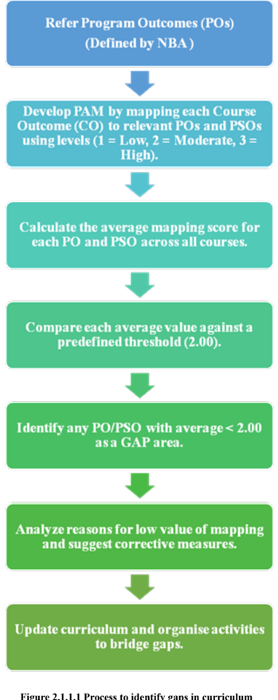

## Step 1: Define Program Outcomes (POs) (Defined by N BA)

Program Outcomes (POs) are specific competencies that students are expected to achieve upon completion of diploma. These are derived from the NBA. Clearly defining POs helps in aligning course objectives with broader educational expectations and ensures uniformity in curriculum planning and delivery.

Step 2: Develop PAM by mapping each Course Outcome (CO) to relevant POs and PSOs using levels (1 = Low, 2 = Moderate, 3 = High)

The Program Articulation Matrix (PAM) is a structured tool where each Course Outcome (CO) is mapped against Program Outcomes (POs) and Program Specific Outcomes (PSOs). The mapping is based on the extent to which a course supports each outcome:

- Level 1 : Low contribution
- Level 2 : Moderate contribution
- Level 3 : High contribution

## Step 3: Calculate the average mapping score for each PO and PSO across all courses

Once the matrix is filled, calculate the average score for each PO and PSO by aggregating the mapping levels across all relevant courses. This score gives an overall view of how strongly the curriculum supports each outcome and helps quantify program effectiveness.

## Step 4: Compare each average value against a predefined threshold (2.00)

A benchmark or threshold (commonly set at 2.00 ) is used to assess adequacy. Each PO and PSOÕs average score is compared to this threshold:

- If the average is ≥ 2.00 , the outcome is considered adequately addressed.
- If it is &lt; 2.00 , there is a shortfall that must be investigated.

This numerical comparison adds objectivity to the evaluation process.

## Step 5: Identify any PO/PSO with average &lt; 2.00 as a GAP area

Any Program Outcome or Program Specific Outcome with an average score below the threshold is flagged as a curricular gap . These gaps indicate that students may not be adequately achieving certain competencies or skills and highlight areas in need of academic attention.

## Step 6: Analyze reasons for low value of mapping and suggest corrective measures

Conduct a root cause analysis to identify why certain POs/PSOs are underachieved. Possible reasons may include:

- Insufficient course content addressing that PO/PSO
- Lack of practical exposure or contextual learning
- Misalignment of assessments with intended outcomes.
- Based on the analysis, formulate actionable recommendations to address the root causes.

## Step 7: Update curriculum and organize activities to bridge gaps.

Based on the identified gaps and their causes, implement curriculum changes such as:

- Organising expert lecture, workshops, seminars, industrial visit to fill the gap
- Introducing interdisciplinary learning
- Updating curriculum

This step is crucial for closing the loop in the Continuous Quality Improvement (CQI) process.

Based on the provided Program Articulation Matrix, the curricular gaps can be identified as below:

## Curricular Gap Analysis

## PO &amp; PSO mapping Summary and Gap Identification

## Detailed Gap Analysis:

## PO2 Ð Problem Analysis

## Reasons for Gap in PO2:

As the major courses in diploma level EC curriculum emphasize conceptual understanding and awareness rather than analytical problem-solving or systematic evaluation of engineering problems.

## Suggested Actions to Bridge PO2 Gap:

¥ Organize project competitions.

- ¥ Arrange Industrial Visits, expert lectures, workshops.

## PO3 Ð Design/Development of Solutions

## Reasons for Gap in PO3:

As the major courses in diploma level EC curriculum do not include design-oriented activities or open-ended problem-solving tasks requiring solution development.

Suggested Actions to Bridge PO3 Gap:

| PO/PSO   | PO/PSO                                                                                                                             |   Average mapping | Gap Identified (Threshold < 2.00)   |
|----------|------------------------------------------------------------------------------------------------------------------------------------|-------------------|-------------------------------------|
| PO1      | Basic & Discipline specific knowledge                                                                                              |              2.67 | No                                  |
| PO2      | Problem Analysis                                                                                                                   |              1.89 | Yes                                 |
| PO3      | Design/Development of Solutions                                                                                                    |              1.92 | Yes                                 |
| PO4      | Engineering Tools, Experimentation and Testing                                                                                     |              2.05 | No                                  |
| PO5      | Engineering practices for Society, Environment and Sustainability                                                                  |              1.71 | Yes                                 |
| PO6      | Project Management                                                                                                                 |              1.75 | Yes                                 |
| PO7      | Life-long Learning                                                                                                                 |              2.01 | No                                  |
| PSO1     | Demonstrate proficiency in installation, maintenance and problem solving of electronic and communication equipments.               |              2.44 | No                                  |
| PSO2     | Proficiency in specialized software packages and coding useful for the analysis of electronics engineering systems and PCB design. |              2.07 | No                                  |

Table 2.1.1.5 PO mapping Summary and Gap Identification

- ¥ Organize workshops/project hackathons focused on design innovation.

- ¥ Arrange Industrial Visits, expert lectures, workshops.

## PO5 Ð Engineering practices for Society, Environment and Sustainability

## Reasons for Gap in PO5:

Societal, environmental, ethical, and sustainability aspects receive limited coverage in the major courses of the diploma level EC curriculum.

## Suggested Actions to Bridge PO5 Gap:

- ¥ Motivate students to prepare Projects focused on this Program outcome.

- ¥ Arrange Industrial Visits, expert lectures, workshops.

## PO6 Ð Project Management

## Reasons for Gap in PO6:

Major technical core subjects include micro-projects, but few subjects do not incorporate project management component.

## Suggested Actions to Bridge PO6 Gap:

- ¥ Promote collaborative projects and presentations to strengthen leadership and communication.

- ¥ Include group assignments with defined roles, timelines, and deliverables.

## B. List the curricular gaps for the attainment of POs &amp; PSOs (10)

List the curricular gaps for the attainment of POs &amp; PSOs

## Curricular Gaps from Program Articulation Matrix

| Program Outcome                                                       |   Average Mapping | Gap Identified   | Appropriateness of the Gap                                                                                                                                                                                                                                                                                                                                                                                                                                                                   |
|-----------------------------------------------------------------------|-------------------|------------------|----------------------------------------------------------------------------------------------------------------------------------------------------------------------------------------------------------------------------------------------------------------------------------------------------------------------------------------------------------------------------------------------------------------------------------------------------------------------------------------------|
| PO2 - Problem Analysis                                                |              1.89 | Yes              | The average mapping score for PO2 falls below the benchmark level of 2.00,  reflecting  inadequate  development  of  studentsÕ  analytical  and problem-analysis  skills.  This  shortfall  indicates  a  need  for  more structured  problem-solving  activities  and  application-oriented  case studies within the curriculum. Strengthening these components will help students  effectively  identify,  formulate,  and  analyze  engineering problems using established methodologies. |
| PO3- Design/Development of Solutions                                  |              1.92 | Yes              | With an average score below 2.00, PO3 indicates that students are not acquiring sufficient exposure to the development of design and solution- oriented  skills.  This  may  be  attributed  to  a  scarcity  of  design-focused assignments and limited opportunities for interdisciplinary project work. Addressing  this  gap  will  foster  greater  innovation,  creativity,  and  a stronger emphasis on solution-based learning among students.                                       |
| PO5-Engineering practices for Society, Environment and Sustainability |              1.71 | Yes              | This gap highlights the limited emphasis on integrating environmental, ethical,  and  societal  considerations  within  the  curriculum.  An  average mapping score of 1.71 suggests that students may not fully appreciate the broader  societal  implications  of  technological  solutions.  Strengthening this  Program  Outcome  will  help  prepare  students  to  become  socially responsible and ethically aware engineers.                                                         |
| PO6-Project Management                                                |              1.75 | Yes              | The PO6 score indicates that students have limited exposure to applying project  management  principles  in  academic  activities.  As  a  result, essential skills such as leadership, communication, and resource planning Ñcritical  to  professional  engineering  practiceÑare  not  sufficiently developed.  This  gap  underscores  the  need  to  incorporate  structured project-based  learning  and  dedicated  management-oriented  workshops into the curriculum.               |

Table 2.1.1.6 Curricular Gaps from Program Articulation Matrix

Institute Marks 10.00

## Justification of the process to find curricular gap:

- Threshold Selection: The threshold of 2 for average attainment is chosen based on the common practice in outcome-based education. On a scale typically ranging from 1 to 3, a value of 2 represents satisfactory accomplishment. Anything below this indicates a need for improvement.
- Comprehensive Evaluation: By calculating the average mapping for each PO and PSO across all courses, we get a holistic view of how well the curriculum is addressing each outcome.
- Objective Identification of Gaps: Comparing each average mapping to the threshold provides an objective method to identify areas where the curriculum may be falling short. This removes subjectivity from the process.
- Alignment with NBA Requirements: NBA criteria 2.1.2 specifically asks for the identification of curricular gaps concerning the attainment of POs and PSOs. This process directly addresses this requirement.
- Basis for Improvement: Identifying these gaps provides a clear starting point for curriculum enhancement. It allows the institution to focus its efforts on the most critical areas needing improvement.
- Continuous Improvement: This process supports the principle of continuous improvement, which is a key aspect of NBA accreditation. By regularly assessing and addressing curricular gaps, the program can evolve and better meet the needs of students and industry.

In conclusion, this process offers a systematic, objective, and comprehensive method for identifying curricular gaps in alignment with NBA accreditation Criteria 2.1.2. It helps institutions accurately pinpoint areas that require enhancement within the curriculum, thereby strengthening overall educational quality and improving student learning outcomes.

2.1.2 Contents beyond the Syllabus (15)

## A. Steps taken to get identified gaps included in the curriculum (eg. letters to Board) (2)

A. Steps taken to get identified gaps included in the curriculum

Electronics and Communication Deptt.

Govt. Polytechnic . Palanpur

Date

19/2/2020

| Sr.   | Branch   | Semester   | Subject   | Name of   | Identilied   | Justification     |
|-------|----------|------------|-----------|-----------|--------------|-------------------|
| No.   |          |            | Code      | Subject   | GAP          |                   |
|       |          |            |           |           |              | Consumer products |

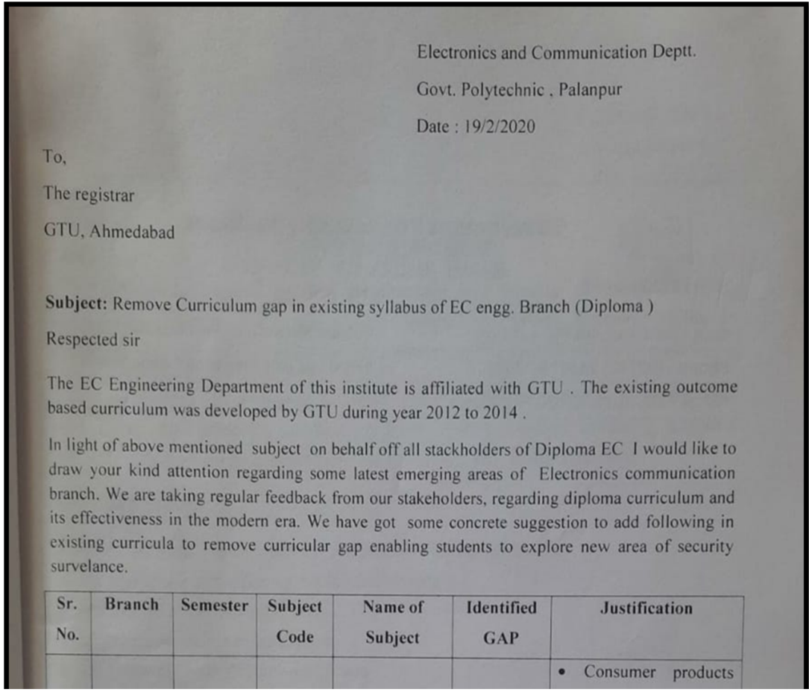

Institute Marks

15.00

Institute Marks

2.00

We   request you lake this   communication in   discussion for further revision of curriculum of diploma EC as and when initiated .

With best regards;

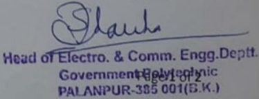

Figure 2.1.2.1 Communication-1 to university

To;

Electronics and Communication Deptt:. Govt. Polytechnic , Palanpur Date : 2/12/2025

registrar GTU, Ahmedabad The

Subject: Regarding   Curriculum gap in existing syllabus of EC Branch (Diploma ) Engg

Respected sir

The EC Engineering Department of this institute is affiliated with GTU Currently\_there is ongoing curriculum's revision at University\_level Upto Ath semester curriculum of various subject of Diploma EC has been published;

We would like to draw your kind attention regarding some latest emerging areas of Electronics communication branch We are regular feedback from our stakeholders, regarding diploma curriculum and its effectiveness in the modern era. taking

Kindly consider following suggestions to incorporate/Update following areas in existing curricula to remove curricular gap enabling students to explore new area of electronics and communication;

Semester

Name of

Identified

Justification

Remark

|    | Code           |                      |                                |                                                                                                                |                                                                       |
|----|----------------|----------------------|--------------------------------|----------------------------------------------------------------------------------------------------------------|-----------------------------------------------------------------------|
|    | Ath DI04011031 | Consumer Electronics | Concept of AUTO electronics    | All cars now days equipped with electronic control module controlling all operations of a car.                 | Curriculum just published.  Update before study start from 22/12/2025 |
|    | Ath DI04011031 | Consumer Electronics | Air fryer                      | Oil cooking in a Kitchen free                                                                                  | Curriculum just published.  Update before study start from 22/12/2025 |
|    | Ath DI04011031 | Consumer Electronics | (Inverter home Usage specific) | Solar rooftop plant uses Inverter                                                                              | Curriculum just published.  Update before study start from 22/12/2025 |
|    | Ath DI04011031 | Consumer Electronics | Electronic Weighing scale      | Used in Kitchen  as well.                                                                                      | Curriculum just published.  Update before study start from 22/12/2025 |
|    | Ath DI04011031 | Consumer Electronics | Induction cooking stove        | Electronic heating process based on power electronics and electromagnetic Induction,                           | Curriculum just published.  Update before study start from 22/12/2025 |
| 2  | 6th            | Internship           | Industry Specific knowledge    | Industrial internship Is a bridge between education and diploma final year student, it is an essential step to | To be incorporated as per guidelines of NEP 2020.                     |

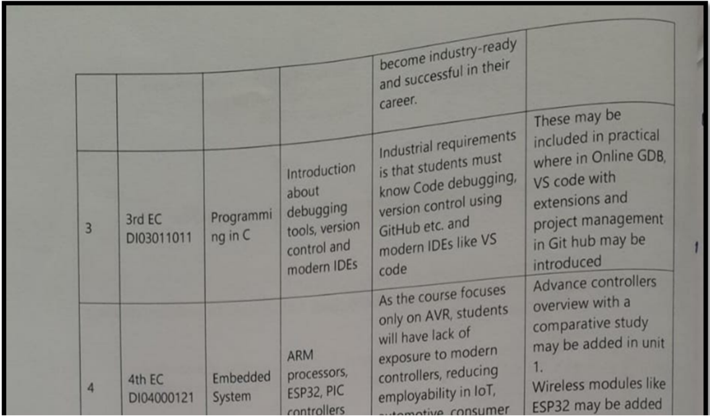

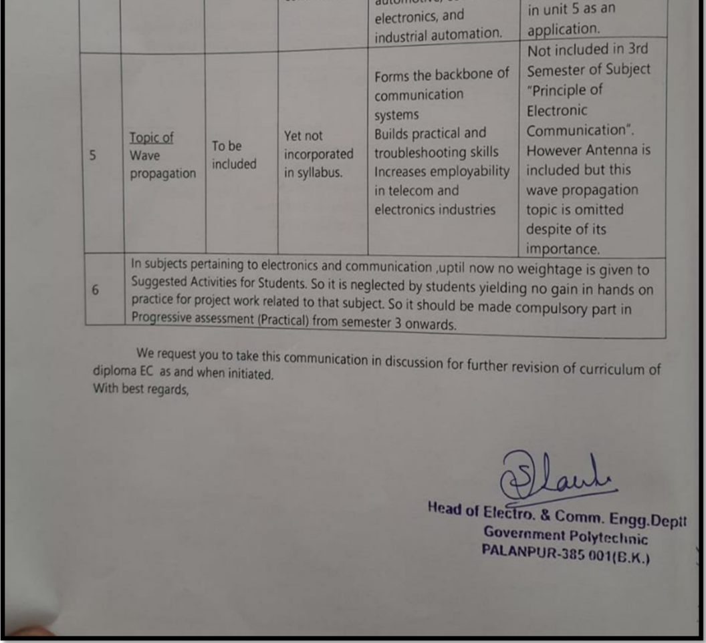

Figure 2.1.2.2 Communication-2 to university

B. Delivery details of content beyond syllabus (10)

|   Sr.  N o. | Event Type                             | Year    | Date       | Event  N ame                                         |
|-------------|----------------------------------------|---------|------------|------------------------------------------------------|
|           1 | Expert Lecture by Mr. Dhananjay Pathak | 2019-20 | 02-01-2020 | CCTV Installation                                    |
|           2 | Industrial Visit                       | 2019-20 | 15-02-2020 | Rudraksh Electronics                                 |
|           3 | Webinar by Mr. L K Patel               | 2020-21 | 27-09-2020 | Entrepreneurship                                     |
|           4 | Webinar by Dr. Urvashi P. Shukla       | 2020-21 | 19-03-2021 | Digital Communication Basics Realization With MATLAB |
|           5 | Industrial Visit                       | 2021-22 | 24-03-2022 | Community Radio Station, Palanpur                    |
|           6 | Industrial Visit                       | 2021-22 | 29-03-2022 | Samsung Care, Palanpur                               |
|           7 | Industrial Visit                       | 2023-24 | 16-03-2024 | PCB Power Pvt. Ltd., Gandhinagar                     |
|           8 | Industrial Visit                       | 2023-24 | 16-03-2024 | MCBS Pvt. Ltd., Gandhinagar                          |
|           9 | Industrial Visit                       | 2024-25 | 25-09-2024 | Railway Station, Palanpur                            |
|          10 | Industrial Visit                       | 2024-25 | 05-10-2024 | Banas Dairy                                          |
|          11 | Industrial Visit                       | 2024-25 | 16-10-2024 | Community Radio Station, Palanpur                    |
|          12 | Expert Lecture by Dr. V K Thakar       | 2024-25 | 22-10-2024 | Internet of Things                                   |

Institute Marks

10.00

|   13 | Expert Lecture by Mr. Krishna Panchal   | 2024-25   | 10-11-2024   | Career Guidance For EC Engineers                  |
|------|-----------------------------------------|-----------|--------------|---------------------------------------------------|
|   14 | Workshop by Mr. Yuvrajsinh Rajput       | 2024-25   | 15-02-2025   | Drone Technologies                                |
|   15 | Industrial Visit                        | 2025-26   | 20-09-2025   | NETRAM (Command and Control Centre) Palanpur      |
|   16 | Expert Lecture by Mr. Rishabh Prajapati | 2025-26   | 07-10-2025   | IOT Application with ESP-32, NOD-MCU, Rasberry Pi |
|   17 | Industrial Visit                        | 2025-26   | 17-11-2025   | Community Radio Station, Palanpur                 |
|   18 | Scratch Coding Competition              | 2025-26   | 16-12-2025   | Scratch Coding Competition                        |

T able 2.1.2.1 Delivery details of the content beyond the syllabus

## C. Mapping of content beyond syllabus with the POs &amp; PSOs (3)

## Institute Marks

3.00

## 2025-26

| S.No   | Gap                                   | Action Taken                                                        | Date-Month-Year   | Resource Person with Designation                              | Mode                      |   No. of students present | Relevance to POs, PSOs   |
|--------|---------------------------------------|---------------------------------------------------------------------|-------------------|---------------------------------------------------------------|---------------------------|---------------------------|--------------------------|
|        | Fundamentals of ICT                   | Scratch Coding Competition                                          | 16/12/2025        | Ms.M.K.Pedhadiya (Lecturer EC), Mr. N.J.Chauhan (Lecturer EC) | Offline Competition       |                        12 | PO2, PO3                 |
|        | Principle of Electronic Communication | Industrial Visit at Community Radio Station, Palanpur               | 17/11/2025        | Ms.M.K.Pedhadiya (Lecturer EC), Dr. L.K.Patel (Lecturer EC)   | Offline Industrial Visit  |                        14 | PO3                      |
|        | Computer Networks                     | Industrial Visit at NETRAM (Command and Control Centre) Palanpur    | 20/09/2025        | Mr. M.J.Dabgar (Lecturer EC), Mr. S.P.Joshiara (Lecturer EC)  | Offline Industrial Visit  |                        49 | PO3, PO6                 |
|        | Embedded Systems                      | Expert Lecture on IOT Application with ESP-32, NOD-MCU, Rasberry Pi | 07/10/2025        | Mr. Rishabh Prajapati                                         | Offline Expert Lecture    |                        21 | PO3, PO6                 |
|        | Programming in C                      | Web Resources Provided                                              | 04/10/2025        | Ms.M.K.Pedhadiya (Lecturer EC)                                | Offline Hands-on Practice |                         8 | PO2, PO5                 |

## 2024-25

|   S.No | Gap                                   | Action Taken                                                                                                 | Date-Month-Year   | Resource Person with Designation                                                          | Mode                     |   No. of students present | Relevance to POs, PSOs   |
|--------|---------------------------------------|--------------------------------------------------------------------------------------------------------------|-------------------|-------------------------------------------------------------------------------------------|--------------------------|---------------------------|--------------------------|
|      1 |                                       | Consumer Electronics and Principle of Electronic Communication Industrial Visit at Railway Station, Palanpur | 25/09/2024        | Ms.M.K.Pedhadiya (Lecturer EC), Mr. N.J.Chauhan (Lecturer EC)                             | Offline Industrial Visit |                        49 | PO5                      |
|      2 | Automation                            | Industrial Visit at Banas Dairy                                                                              | 05/10/2024        | Dr. R.N.Patel (Lecturer EC), Mr. M.J.Dabgar (Lecturer EC), Mr. S.P.Joshiara (Lecturer EC) | Offline Industrial Visit |                        37 | PO6                      |
|      3 | Principle of Electronic Communication | Industrial Visit at Community Radio Station, Palanpur                                                        | 16/10/2024        | Dr. R.N.Patel (Lecturer EC), Mr. S.P.Joshiara (Lecturer EC)                               | Offline Industrial Visit |                        24 | PO3                      |
|      4 | WSN&IOT                               | Expert Lecture on IOT                                                                                        | 22/10/2024        | DR. V K THAKAR                                                                            | Offline Expert Lecture   |                        81 | PO2                      |
|      5 | RE&ETE and MPMC                       | Expert Lecture on Drone Technologies                                                                         | 15/02/2025        | Mr. Yuvrajsinh Rajput                                                                     | Offline Expert Lecture   |                        36 | PO2, PO5                 |
|      6 | Entrepreneurship & Startups           | Entrepreneurship Awareness Drive                                                                             | 07/04/2025        | CED (Center of Entrepreneurship Development)                                              | Offline Expert Lecture   |                        95 | PO5, PO6                 |

## 2023-24

| S.No   | Gap                  | Action Taken                                                | Date-Month-Year   | Resource Person with Designation                                                           | Mode                     |   No. of students present | Relevance to POs, PSOs   |
|--------|----------------------|-------------------------------------------------------------|-------------------|--------------------------------------------------------------------------------------------|--------------------------|---------------------------|--------------------------|
|        | Consumer Electronics | Industrial Visit at PCB POWER AND MCBS PVT LTD, GANDHINAGAR | 16/03/2024        | Ms.M.K.Pedhadiya (Lecturer EC), Dr. L.K.Patel (Lecturer EC), Mr. N.J.Chauhan (Lecturer EC) | Offline Industrial Visit |                        56 | PO3, PO6                 |

## 2.2 Teaching - Learning Process (160)

## 2.2.1 Describe Processes followed to ensure/improve quality of Teaching &amp; Learning based on following points (25)

## A. Adherence to Academic Calendar (3)

## A. Adherence to Academic calendar:

To maintain a structured and effective teachingÐlearning process, the department adheres to a three-tier academic calendar framework, implemented sequentially at the University, Institute, and Department levels.

## Institute Marks

25.00

## Institute Marks

3.00

Gujarat Technological University (GTU) declares the academic calendar before the start of every term. It includes the start and end dates of the semester, tentative exam schedules, internship periods, and official vacation/holiday lists.

## 2. Institute Calendar:

Based on GTUÕs academic calendar, Government Polytechnic, Palanpur prepares its institutional calendar. It incorporates term duration, internal examinations, industrial visits, expert lectures and holidays.

## 3. Department Calendar - Electronics and Communication Engineering:

The department prepares a comprehensive academic calendar aligned with both GTU and institute calendars. It serves as the backbone for planning and implementing all departmental academic and co-curricular activities.

## It includes:

- Term start and end dates for each semester
- Class Test schedules
- Remedial exam periods and submission timelines
- Industrial/site visits, seminars, expert lectures, webinars and co-curricular activities
- Parent-teacher meetings and weak student support sessions
- Government-declared holidays and official vacations

## Key Attributes of Calendar Adherence:

- Smooth functioning of the teaching-learning process
- Clarity of all scheduled events across the campus
- A structured and well-organized academic environment
- Avoidance of clashes between various institutional activities
- Equal opportunity for students to participate in co-curricular and extracurricular activities
- Fair planning window for faculty to deliver the syllabus effectively

The academic calendar is published on departmental notice boards and through electronic media at the beginning of each term. This layered adherence enhances coordination, discipline, and overall academic quality at the department level.

## Government Polytechnic; Palanpur

Academic Calendar Odd Term 2025-26 Information and Communication Technology Electronics &amp; Communication Engineering Department

| Activity                                               | SEMESTER-1                                             | SEMESTER-1                                             | SEMESTER- 3                                            | SEMESTER- 3                                            | SEMESTER-5                                             | SEMESTER-5                                             | Vision                                                                                                                                                                           |
|--------------------------------------------------------|--------------------------------------------------------|--------------------------------------------------------|--------------------------------------------------------|--------------------------------------------------------|--------------------------------------------------------|--------------------------------------------------------|----------------------------------------------------------------------------------------------------------------------------------------------------------------------------------|
| Activity                                               | From                                                   | To                                                     | From                                                   | To                                                     | From                                                   | To                                                     | To                                                                                                                                                                               |
| diploma engineers Academic activity Entrepreneurs with | diploma engineers Academic activity Entrepreneurs with | diploma engineers Academic activity Entrepreneurs with | diploma engineers Academic activity Entrepreneurs with | diploma engineers Academic activity Entrepreneurs with | diploma engineers Academic activity Entrepreneurs with | diploma engineers Academic activity Entrepreneurs with | diploma engineers Academic activity Entrepreneurs with                                                                                                                           |
| Term Date                                              | 24/07/25                                               | 30/12/25                                               | 30/06/25                                               | 24/11/25                                               | 24/05/25                                               | 17/10/25                                               |                                                                                                                                                                                  |
| Attendance review-1                                    | 19/09/25                                               |                                                        | 30/08/25                                               |                                                        | 30/08/25                                               |                                                        | ethical values                                                                                                                                                                   |
| Prog_Assessment-1                                      | 1/12/25                                                | 06/12/25                                               | 13/10/25                                               | 17/10/25                                               | 01/09/25                                               | 06/09/25                                               | Mission Industry oriented technical education Excellent teaching and                                                                                                             |
| PA-1 Result Display                                    | 12/12/25                                               | 12/12/25                                               | 17/10/25                                               | 17/10/25                                               | 10/09/25                                               | 10/09/25                                               | learning environment Promote entrepreneurship activities Continual growth in every sphere of life by developing                                                                  |
| Parents Meeting                                        | 20/09/25                                               | 20/09/25                                               | 20/09/25                                               | 20/09/25                                               | 20/09/25                                               | 20/09/25                                               | learning environment Promote entrepreneurship activities Continual growth in every sphere of life by developing                                                                  |
| Remedial Classes                                       | 10/11/25                                               | 30/12/25                                               | 10/11/25                                               | 24/11/25                                               | 10/09/25                                               | 17/10/25                                               | learning environment Promote entrepreneurship activities Continual growth in every sphere of life by developing                                                                  |
| Attendance review 2                                    | 17/11/25                                               | 17/11/25                                               | 06/10/25                                               | 06/10/25                                               | 06/10/25                                               | 06/10/25                                               | learning environment Promote entrepreneurship activities Continual growth in every sphere of life by developing                                                                  |
| Prog_Assessment-2                                      | 22/12/25                                               | 26/12/25                                               | 17/11/25                                               | 21/11/25                                               | 13/10/25                                               | 17/10/25                                               | learning environment Promote entrepreneurship activities Continual growth in every sphere of life by developing                                                                  |
| PA-2 Result Display                                    | 29/12/25                                               | 29/12/25                                               | 21/11/25                                               | 21/11/25                                               | 07/12/25                                               | 07/12/25                                               | learning environment Promote entrepreneurship activities Continual growth in every sphere of life by developing                                                                  |
| Term work submission                                   | 22/12/25                                               | 26/12/25                                               | 17/11/25                                               | 21/11/25                                               | 13/10/25                                               | 17/10/25                                               | core human values                                                                                                                                                                |
| GTU practical exam                                     | As per GTU                                             | As per GTU                                             | As per GIU                                             | As per GIU                                             | As per GTU                                             | As per GTU                                             | learning environment Promote entrepreneurship activities Continual growth in every sphere of life by developing                                                                  |
| GTU-Theory End Semester Examination                    | As per GTU                                             | As per GTU                                             | As per GTU                                             | As per GTU                                             | As per GTU                                             | As per GTU                                             | Department Vision To prepare competent                                                                                                                                           |
| diploma engineers of Project (Sem 5) IInformation ana  | diploma engineers of Project (Sem 5) IInformation ana  | diploma engineers of Project (Sem 5) IInformation ana  | diploma engineers of Project (Sem 5) IInformation ana  | diploma engineers of Project (Sem 5) IInformation ana  | diploma engineers of Project (Sem 5) IInformation ana  | diploma engineers of Project (Sem 5) IInformation ana  | diploma engineers of Project (Sem 5) IInformation ana                                                                                                                            |
| Project Review-1                                       |                                                        |                                                        |                                                        |                                                        |                                                        |                                                        | communication technology catering the neecs of                                                                                                                                   |
| Final Project Presentation                             |                                                        |                                                        |                                                        |                                                        |                                                        |                                                        | lindustries and society as an lexcellent employee; innovator moral values                                                                                                        |
| Students feedback on faculty_performance               | Students feedback on faculty_performance               | Students feedback on faculty_performance               | Students feedback on faculty_performance               | Students feedback on faculty_performance               | Students feedback on faculty_performance               | Students feedback on faculty_performance               | Department Mission                                                                                                                                                               |
| Feedback                                               | 24/11/25                                               | 28/11/25                                               | 06710/25                                               | 10/10/25                                               | 25708/25                                               | 29/08/25                                               | Provide quality education in ithe field of ICT engineering Develop art laboratories   classrooms  and lup gradation of faculties . Strengthen industrial liaison offering mutual |
| 2 Feedback                                             | 22/12/25                                               | 26/12/25                                               | 17/11/25                                               | 21/11/25                                               | 13/10/25                                               | 17/10/25                                               | Provide quality education in ithe field of ICT engineering Develop art laboratories   classrooms  and lup gradation of faculties . Strengthen industrial liaison offering mutual |
| Industrial Visits                                      | Industrial Visits                                      | Industrial Visits                                      | Industrial Visits                                      | Industrial Visits                                      | Industrial Visits                                      | Industrial Visits                                      | Industrial Visits                                                                                                                                                                |
| Banas Dairy , Palanpur                                 | 05/10/2025                                             | 05/10/2025                                             | 05/10/2025                                             | 05/10/2025                                             | 05/10/2025                                             | 05/10/2025                                             |                                                                                                                                                                                  |
| FMRadio_Palanpur                                       | 05/08/2025                                             | 05/08/2025                                             | 27/09/2025                                             | 27/09/2025                                             | 27/09/2025                                             | 27/09/2025                                             | by beneficiaries services                                                                                                                                                        |
| Police control room                                    |                                                        |                                                        | 4/10/2025                                              | 4/10/2025                                              | 4/10/2025                                              | 4/10/2025                                              | Execute extracurricular  and                                                                                                                                                     |
| Railway control room                                   |                                                        |                                                        |                                                        |                                                        | 26/9/2025                                              | 26/9/2025                                              | Ico-curricular activities                                                                                                                                                        |
| Expert Lectures linculcate innovation                  | Expert Lectures linculcate innovation                  | Expert Lectures linculcate innovation                  | Expert Lectures linculcate innovation                  | Expert Lectures linculcate innovation                  | Expert Lectures linculcate innovation                  | Expert Lectures linculcate innovation                  | Expert Lectures linculcate innovation                                                                                                                                            |
| Workshop on                                            | 18/09/2025                                             | 18/09/2025                                             | 18/09/2025                                             | 18/09/2025                                             | 18/09/2025                                             | 18/09/2025                                             | lentrepreneurship and moral Ivalues                                                                                                                                              |

| Seminar on Cyber security                | 19/09/2025                               |
|------------------------------------------|------------------------------------------|
| International / National celebration day | International / National celebration day |
| International Yoga Day                   | 21/07/2025                               |
| Independence Day celebration             | 15/08/2025                               |
| Teachers celebration Day                 | 05/09/2025                               |
| Mahatma Gandhi Jayanti                   | 02/10/2025                               |
| Navratri celebration                     | 03/10/2025                               |
| Diwali Vacation                          | 17/10/2025- 6/11/2025                    |

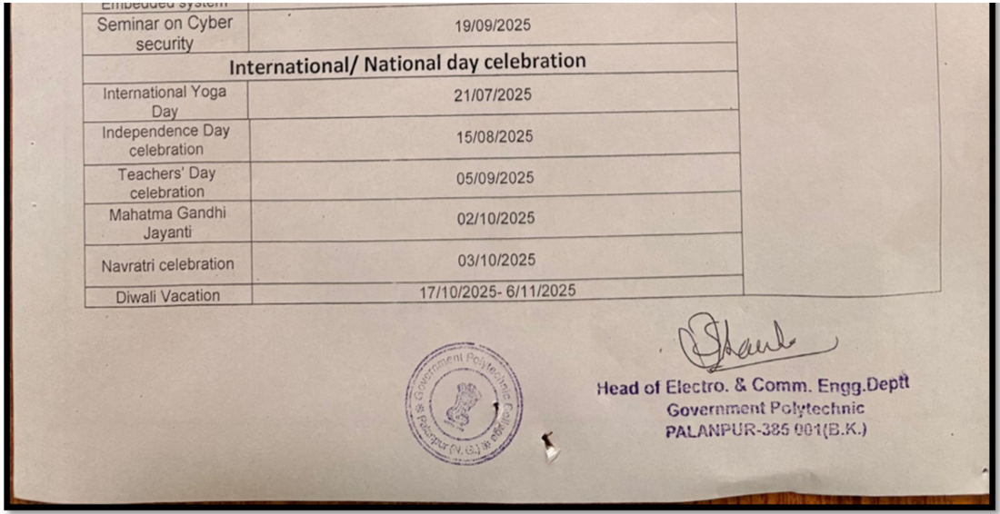

Figure 2.2.1.1 Department Academic calendar format

B. Use of various instructional planning and delivery methods (3)

Effective teachingÐlearning requires a mix of different instructional planning and delivery methods. The Department of Electronics and Communication uses a variety of teaching methods to ensure better understanding, active learning, and deeper engagement of students.

Below are the key teachingÐlearning methods adopted by the department:

- Traditional Black board and Chalk method

This is the most widely used teaching method where faculty teach using a blackboard (or green/white board) and chalk (or marker pens).

Institute Marks

3.00

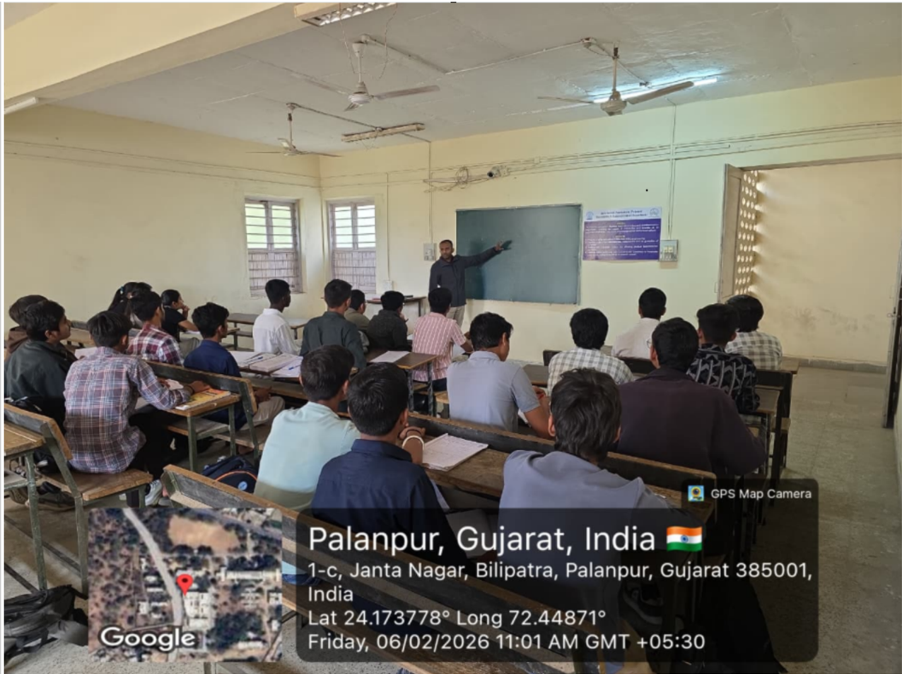

Figure 2.2.1.2 Traditional black (Green) board and Chalk method

## Importance:

- Simple and effective for concept explanation
- Real-time interaction between faculty and students
- Immediate doubt solving and feedback
- Easy monitoring of student understanding
- Helps maintain classroom discipline and focus
- Multimedia method

Faculty members use various ICT tools like Powerpoint presentations, video lectures, animations, and simulation software to explain complex concepts in an interactive way.

Figure 2.2.1.3 Multimedia teaching

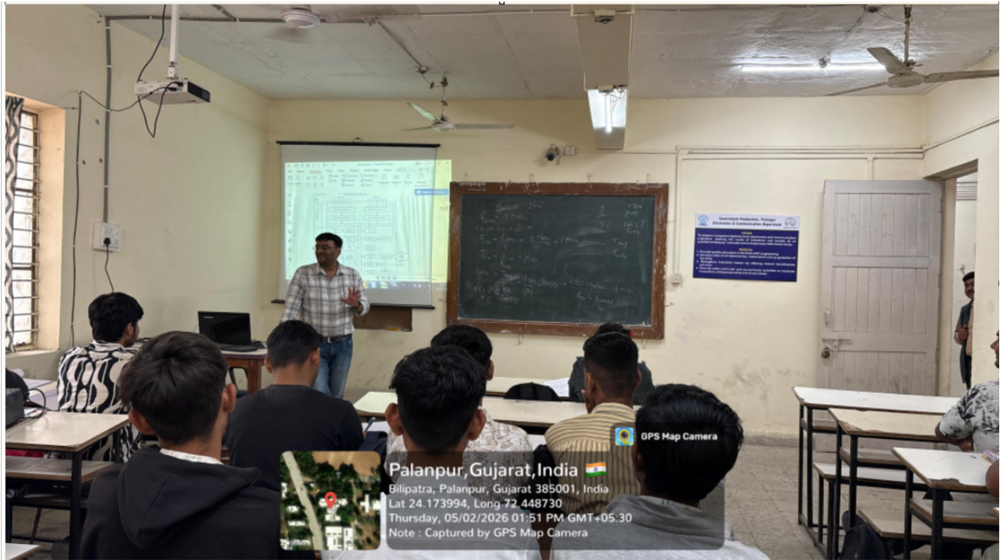

## Importance

- Learning is more effective and interesting
- Easy understanding of topics
- Students may get additional knowledge of topics.
- Video lecture provide practical application of knowledge to industries.
- Demonstration method

The demonstration of equipment / instrument is one of the practical methods to explain concept to students. Various models and charts in different subjects in department are useful to clear the concepts of topics.

Figure 2.2.1.4 Demonstration teaching method

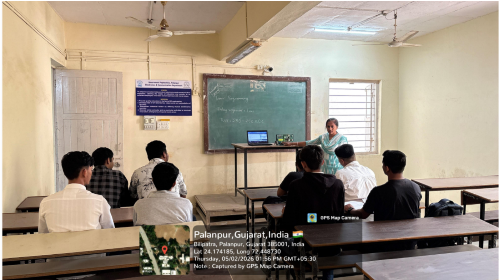

## Importance

- Improves conceptual clarity through hands-on learning
- Encourages active participation of students
- Builds confidence and interest in subjects
- Enhances practical skills and real-time observation
- Seminars / Presentation

Students are assigned topics from the curriculum or related fields. They research, prepare, and present in front of peers and faculty.

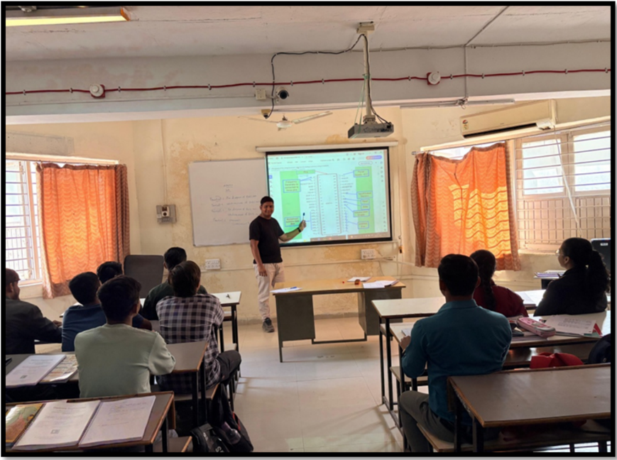

## Importance

- Improves understanding of topics in depth
- Enhances communication and presentation skills
- Builds self-confidence and teamwork
- Promotes self-learning and research attitude
- Flipped Classroom technique:

In few Classes we use this techniques where instead of introducing new concepts during classroom lectures, students first engage with learning materialsÑsuch as video lectures, reading content, or recorded presentations before coming to class. Classroom time is then utilized for discussions, problem-solving, collaborative activities, case studies, and doubt clarification.

Figure 2.2.1.5 Seminar/Presentation teaching method

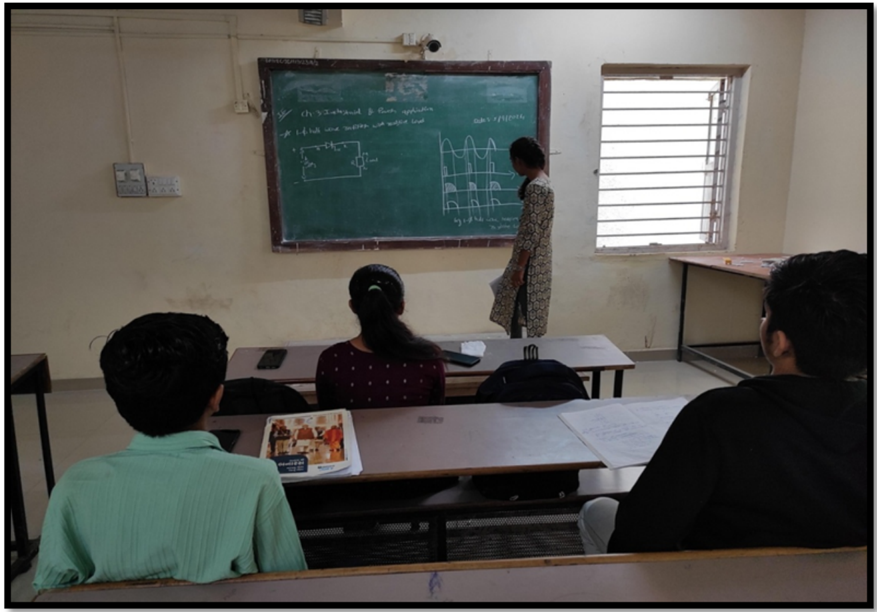

## Importance

- Enhances conceptual understanding
- Promotes active learning
- Improves student engagement
- Supports diverse learners
- Effective use of classroom time
- Develops self-learning skills
- Teaching through online Platform

During the COVID-19 pandemic, the Department of Electronics and Communication adopted Microsoft Teams as the primary platform for conducting online classes. It enabled faculty members to deliver lectures, conduct assessments, and interact with students effectively during lockdown periods. Microsoft team was used for following aspects:

- Live online classes with screen sharing and digital whiteboard
- Conducting quizzes, unit tests, and viva exams
- Maintaining subject-wise channels for better class management
- Organizing parent-teacher meetings and online mentoring
- Sharing of lecture recordings for revision

Figure 2.2.1.6 Flipped Classroom method

Figure 2.2.1.7 Microsoft Team online teaching

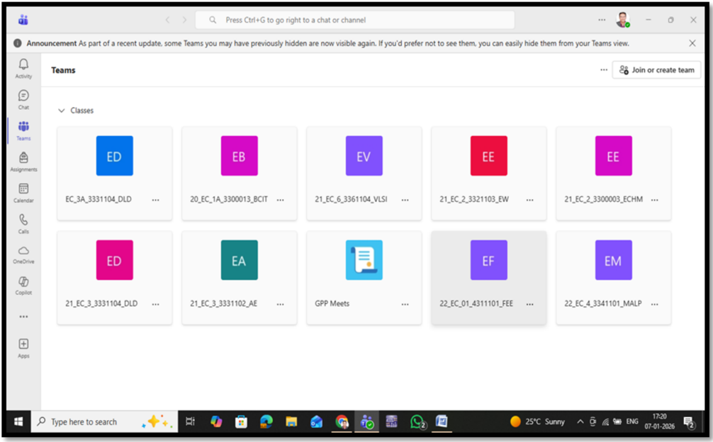

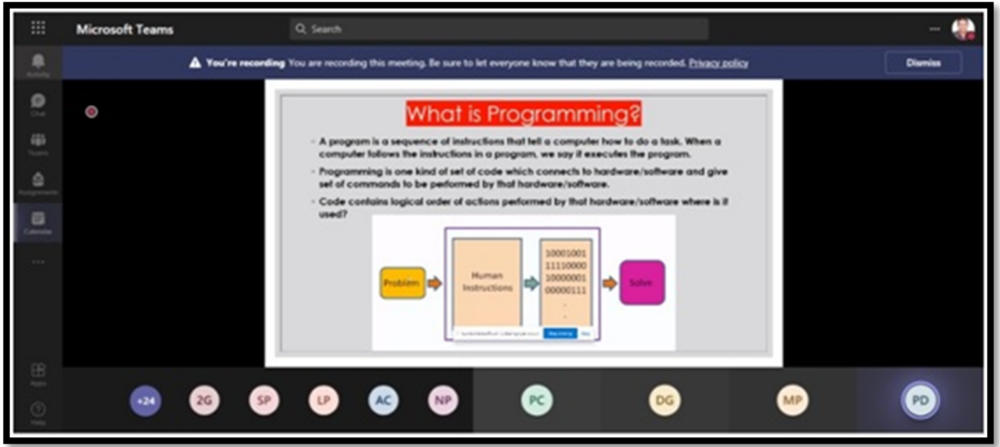

However, post-pandemic, the department has transitioned to using Google Classroom as the primary online platform for supporting academic activities, and it continues to be used effectively even in the current academic sessions. Google classroom is used for following aspects.

- Uploading of study materials, notes, and recorded video lectures
- Sharing of assignments, question banks, and lab manuals
- Collection of written submissions such as assignments and practical journals
- Continuous communication between faculty and students outside classroom hours

Figure 2.2.1.8 Google classroom online teaching

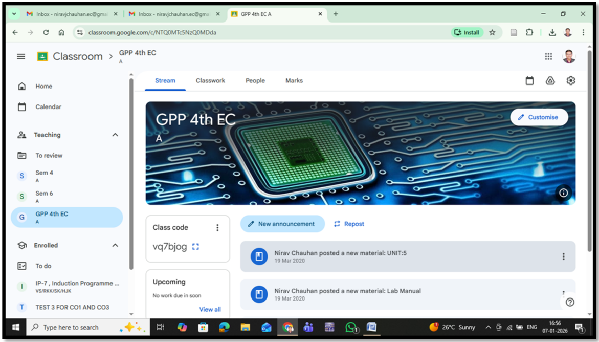

Importance:

- Supports blended learning with a mix of online and offline resources
- Students can access content anytime, aiding revision and self-paced learning
- Encourages the habit of independent and responsible learning
- Provides a structured digital environment for academic content management
- Bridges the gap in case of student absenteeism or special needs
- Use of Models, Charts, and Posters

Models and wall charts are placed in classrooms and labs to give visual support to theoretical topics.

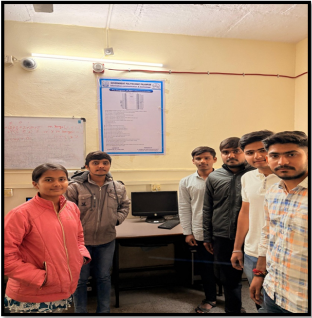

## Importance :

- Enhances memory retention through visual aids
- Encourages studentsÕ interest in the subject
- Helps in quick revision and referencing during practicals.
- Aids in better classroom environment and decorum

## Conclusion:

The department consistently implements innovative instructional planning and delivery strategies to enhance the effectiveness of the teachingÐlearning process. By integrating traditional pedagogical approaches with modern, technology-enabled methods, the department ensures comprehensive conceptual understanding, practical application of knowledge, and the development of professional competence among students.

## C. Methodologies to support weak students and encourage bright students (4)

Institute Marks

4.00

Students enrolling in diploma programs demonstrate varied academic backgrounds and learning paces. While some learners require additional academic support to strengthen their understanding of fundamental concepts, others show advanced capabilities and seek opportunities beyond the prescribed curriculum. To address these diverse needs and ensure inclusive learning, the department has established a structured policy for the identification and mentoring of weak students as well as the encouragement and advancement of bright students . This initiative enhances overall academic performance, promotes equitable development, and cultivates a balanced, performance-oriented learning environment.

## Weak Students Ð Identification

Weak students (slow learners) are identified through:

- Academic performance: Scoring less than 50% in unit/mid-semester/class tests.
- Attendance: Less than 75% attendance, as low presence often correlates with poor understanding.
- Conceptual clarity: Difficulty in grasping basic topics, requiring repeated explanations.
- Class engagement: Low participation in discussions, hesitation in asking doubts, and poor assignment submission record.
- Past academic history: Consistently low performance in previous semesters.

## Steps Taken for Weak Students

To support weak students, the department implements structured academic interventions such as:

- Remedial/Extra Classes for concept revision and doubt-solving.
- Personalized Mentoring by subject faculty during lectures.
- Assignments/question bank is provided focused on university question patterns and basic concept reinforcement.

Figure 2.2.1.9 Chart/poster in laboratory

- YouTube subject related video links are provided aligned with the syllabus.

- One-to-One Counseling with subject teachers and mentors for motivation.

- Parent-Teacher Interaction to ensure parental support and track attendance.

## Improvement in Weak Students (Result-Based Evidence)

- Continuous support has led to gradual improvement in internal marks (from &lt;50% to 55Ð65% range) in many students.

- Increased attendance and classroom participation observed after mentoring and counseling and parent teacher meeting.

- Students identified as weak in one semester have progressed to average or higher academic standing in the following semesters.

- The Òloop is closedÓ by tracking their university result and documenting it, ensuring measurable outcomes.

## Bright Students Ð Identification

Bright students are identified based on:

- Scoring more than 60% in class/unit/mid-semester exams.

- Strong previous academic record and consistent performance.

- Quick grasp of concepts, problem-solving skills, and self-learning capabilities.

- Active participation in class discussions, group activities, and leadership roles.

- High attendance and academic discipline.

## Steps Taken for Bright Students

To encourage high performers, the department offers:

- Encouraging them to participate in technical workshops and competitions.

- Advanced Learning via NPTEL videos and YouTube subject related videos and additional reference material aligned with the syllabus.

- Recognition &amp; Motivation through certificates and displaying achievers on department notice boards or websites.

- Regular Feedback and encouragement from faculty to promote innovation, curiosity, and self-directed learning.

## Improvement in Bright Students (Result-Based Evidence)

- These students consistently achieve good grades (60% and above) in internal and university exams.

- Results show that these students maintaining or improving their academic standing across semesters.

## Conclusion

The effective implementation of this policy has substantially enhanced studentsÕ academic performance and holistic development. By emphasizing early identification, need-based academic planning, and continuous monitoring, the policy successfully addresses learning gaps and supports progressive improvement. This initiative aligns with the principles of outcome-based education and clearly demonstrates the departmentÕs commitment to student-centric teachingÐlearning practices and academic excellence.

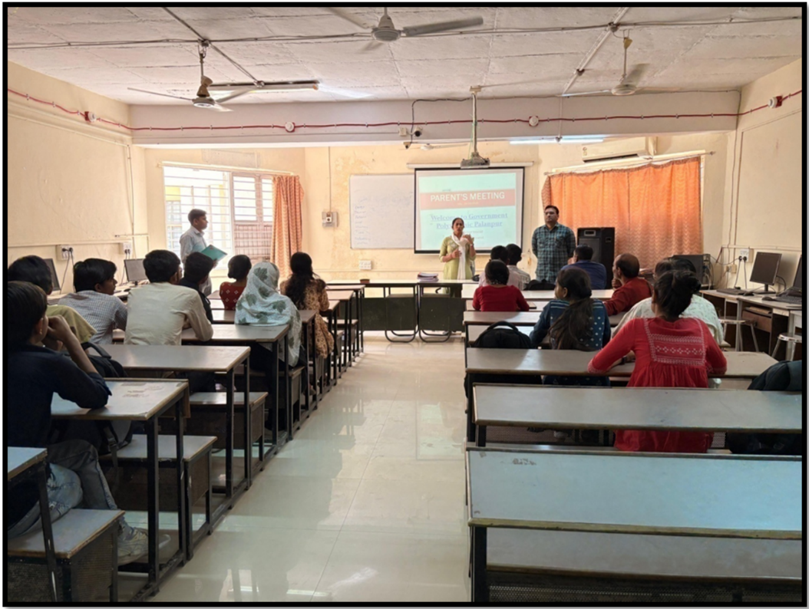

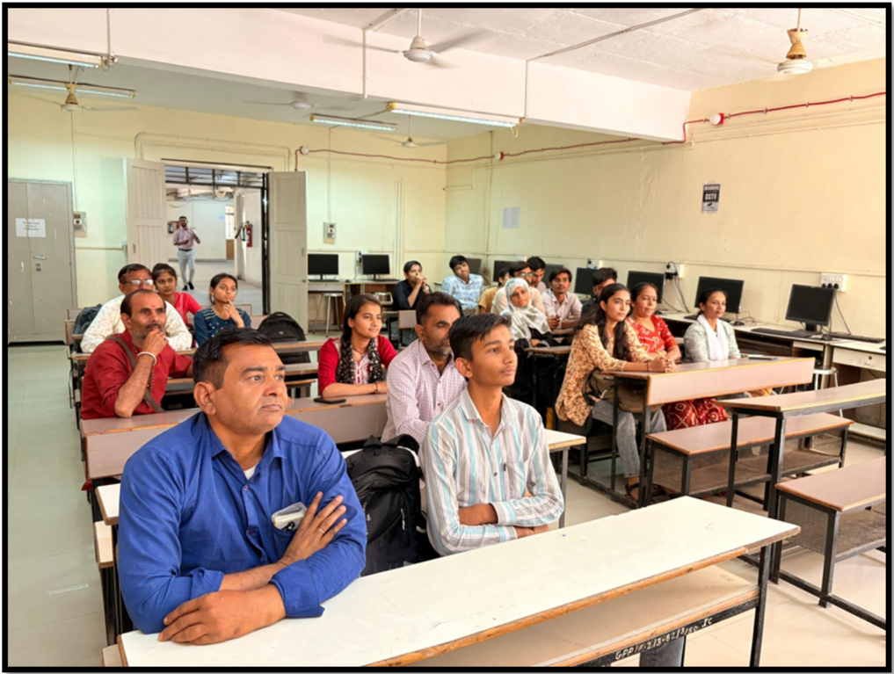

Figure 2.2.1.10 Parents Teacher Meeting

| D. Quality of classroom teaching (3)                                                                                                                                                                            | Institute Marks   |
|-----------------------------------------------------------------------------------------------------------------------------------------------------------------------------------------------------------------|-------------------|
| The Electronics & Communication Engineering Department emphasizes effective and engaging classroom teaching to ensure attainment of Course Outcomes (COs) and foster deep learning among diploma students.      |                   |
| 1.  Academic Planning & Preparedness                                                                                                                                                                            |                   |
| The department strictly follows the academic calendar issued by GTU and the institute. Subject allotment is done well in advance before the commencement of each semester, enabling faculty members to prepare: |                   |
| Lesson plans                                                                                                                                                                                                    |                   |
| Laboratory plans                                                                                                                                                                                                |                   |
| PowerPoint presentations / study materials/ lecture notes                                                                                                                                                       |                   |
| This ensures that teaching aligns with the academic schedule and individual faculty timetables approved by the Head of Department (HOD).                                                                        |                   |
| 2.  Course File Preparation                                                                                                                                                                                     |                   |
| Each subject coordinator, along with associated faculty members, prepares a comprehensive  Course File  which includes:                                                                                         |                   |
| University syllabus                                                                                                                                                                                             |                   |
| Lesson plan                                                                                                                                                                                                     |                   |
| Laboratory plan including list of practicals                                                                                                                                                                    |                   |
| Study materials                                                                                                                                                                                                 |                   |
| Assignment questions for weak students                                                                                                                                                                          |                   |
| Exam papers mapped with COs                                                                                                                                                                                     |                   |
| Attendance records                                                                                                                                                                                              |                   |
| This documentation ensures transparency and structured delivery of curriculum.                                                                                                                                  |                   |
| 3.  Teaching Methodology                                                                                                                                                                                        |                   |
| Faculty members adopt a variety of  instructional methods  to cater to diverse learning needs:                                                                                                                  |                   |

- Whiteboard and chalk method

- Multimedia teaching (PowerPoint, videos, animations)

- Demonstration-based teaching

- Flipped Classroom technique

- Seminar and discussion method

At the end of every session, students are encouraged to summarize key points, ask questions, and clarify doubts , which enhance interactive learning.

## 4. Learner-Centric Approach

The teaching approach promotes a positive and conducive environment for active participation. Faculty members frequently use questionÐanswer techniques, brainstorming , and problem-solving sessions to test and reinforce student understanding.

## 5. Assessment of Learning

Various internal assessment tools are implemented to evaluate the learning outcomes:

- Class/Mid test (Internal)

- Practical viva

These assessments are mapped with COs to ensure proper monitoring of learning objectives.

## 6. Industry Interaction &amp; Exposure

To bridge the gap between industry and academics, the department regularly organizes:

- Expert talks and seminars on emerging technologies

- Industrial visits to enhance practical understanding and real-world relevance

- MOUs with industries

## 7. Faculty Development &amp; Up-gradation

The department places strong emphasis on continuous faculty development to ensure high-quality teaching and subject expertise. Faculty members actively participate in Faculty Development Programs (FDPs), MOOCs, Workshops, and Short-Term Training Programs (STTPs) to upgrade their technical knowledge and pedagogical skills.

## In addition to this:

- Two faculty members have successfully earned their Ph.D. degrees.

- One faculty member has completed her MasterÕs degree.

- One faculty member is currently pursuing his Ph.D.

- One faculty member has completed AICTE QIP PG Certificate in Deep Learning.

- One faculty member is currently pursuing his B.S. in Data Science and applications (Completed till Level- Diploma in Programming, Diploma in Data Science).

- These academic pursuits enhance the subject depth, research orientation, and overall teaching quality of the department.

This continuous focus on faculty up-skilling ensures that students receive updated, industry-relevant, and research-backed instruction.

## 8. Monitoring and Feedback

- The HOD conducts surprise classroom and lab visits to verify coverage of lesson plans, proper resource utilization, and teaching effectiveness.

- Feedback from students is periodically collected and analyzed. Based on this, HOD provides constructive suggestions for continuous improvement in teaching quality.

- CCTV surveillance in classrooms ensures real-time monitoring and discipline.

## 9. Infrastructure Support

The campus is Wi-Fi enabled, facilitating access to digital content and online learning resources during classroom sessions.

## Conclusion:

The department ensures high-quality classroom teaching through planning, varied instructional methods, regular assessments, industry-academia linkage, and continuous monitoring. These initiatives collectively aim to enhance student learning, achieve COs, and maintain academic excellence.

## E. Conduct of experiments (3)

Institute Marks

3.00

The Electronics and Communication Engineering Department places strong emphasis on the systematic conduct of laboratory experiments to enhance studentsÕ practical understanding and application of theoretical concepts. These laboratory activities are carefully structured and aligned with Course Outcomes (COs) to effectively assess and measure student learning.

1. Planning of Practical Sessions

The Subject Coordinator prepares a detailed list of experiments and laboratory manual as per the GTU-prescribed syllabus, which also clearly outlines the intended learning outcomes and their mapping with Course Outcomes (COs) . A course file is maintained which includes:

- List of experiments

- Weekly laboratory planning

- Lab manuals

- Assessment rubrics

2. Common Laboratory Manuals

- From the academic year 2021-22, the Director of Technical Education (DTE) has implemented a standardized approach by introducing common laboratory manuals for each subject.
- This initiative ensures uniformity in experiment delivery, evaluation, and alignment with learning outcomes across all polytechnics.

## 3. Hands-on Learning Environment

- Practical sessions are conducted in well-equipped laboratories, where students perform experiments in small groups to ensure better individual attention and learning.
- Faculty members provide detailed explanation and demonstration before allowing students to perform the experiments, ensuring that students understand both theory and application.

## 4. Alternative Learning Resources

In case of non-availability of specific equipment or trainers , the department adopts alternative strategies to ensure continuity in practical learning, such as:

- Simulation software
- Mobile applications
- Virtual laboratories (Govt. of India initiatives)
- YouTube video lectures and animations
- Visits to other polytechnic institutes for hands-on demonstration

## 5. Assessment of Practical Outcomes

- Faculty members use rubrics-based evaluation at the end of each practical session to assess the students performance and achievement of learning outcomes.
- Regular feedback is given to students to improve their practical skills and understanding.
- A practical examination is conducted at the end of each semester as per GTU norms, which further ensures attainment of the practical component of the curriculum.

## Conclusion:

The department ensures that practical sessions are systematically planned, effectively delivered, and appropriately assessed through a balanced integration of physical and virtual resources. A strong emphasis on hands-on learning, standardized laboratory manuals, and continuous evaluation supports the holistic development of technical competencies among diploma students.

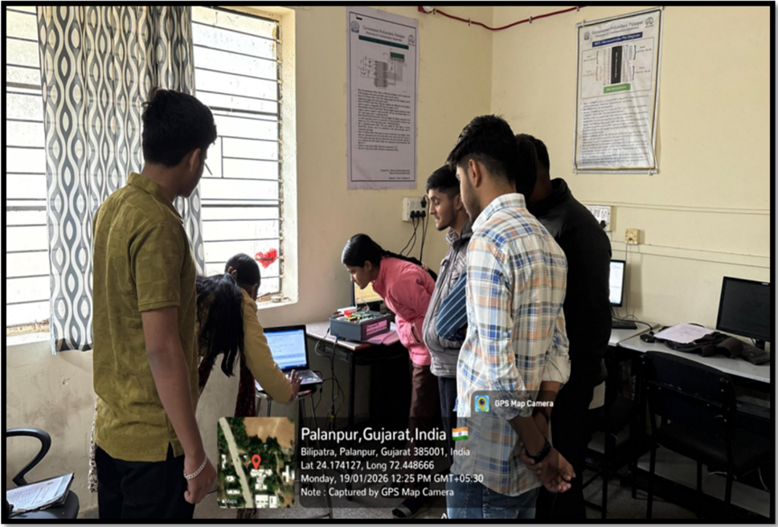

Figure 2.2.1.11 Lab Experiment

Institute Marks

A well-defined continuous assessment system is implemented across all laboratory courses to ensure consistent and fair evaluation of student performance throughout the semester.

- Regular Evaluation :

Students are assessed in each lab session based on their participation, performance, sincerity, and timely submission of assigned work.

## Assessment Approach :

Continuous assessment is carried out by the concerned subject in-charge using pre-decided assessment parameters. The criteria are designed to suit the nature of the subject and the type of laboratory (e.g., software-based, hardware-based, etc.).

## End-Semester Practical Examination :

Practical examinations are conducted at the end of each semester.

- For Semesters 5 and 6, evaluations are conducted by external examiners appointed by Gujarat Technological University (GTU).
- For Semesters 1 to 4 , the departmental faculty conducts the examination as per institute and university norms.

This structured approach ensures that students are continuously monitored, guided, and evaluated throughout the semester.

| Assessment crlterlon              | Excellent marks                                                                                 | Very Good 3 or 2 marks                                                            | Good 1or 0 mark                                                                                  |                                                              | Marks   |
|-----------------------------------|-------------------------------------------------------------------------------------------------|-----------------------------------------------------------------------------------|--------------------------------------------------------------------------------------------------|--------------------------------------------------------------|---------|
| Program Completeness/ Correciness | Code is completcly                                                                              | Code complelely Wth implementation issues                                         | Code marginally functional multiple                                                              | funcuonal th portion the code incomplete sgnificant          |         |
| Readablllty                       | Code organized properly   formatted and casy 10 tollow. Rclated code scctions logically grouped | Codc follow Jogically Minor problems                                              | Code is radable with   significant ettorls code organization problems                            | Codc poorly organized huule consisiene) anc logical grouping |         |
| Design testing                    | All Ie with simulation proper Iesults                                                           | Reasonable coveicd                                                                | Testing of the code                                                                              | design ctroneous inconsistent the code                       | 5       |
| Etficlency                        | Code without sacrificing readability understanding and                                          | mostly efficicnt scope Improve sclecton difercnt constructs modelling With        | Code marginally eflicient with scope improve by changing coding styles and constrcts significant | Code   unable coding patched                                 |         |
| Documentation/ Presentation       | Cadc documcnted with comments and design dctails. No typos/grammatical                          | Codc documented   with minor   formatting Minimal typing mistakes and grammatical | Significant code undocumented poorly documcnted portions                                         | the   code not documented or wronglinclevant comments;       |         |
| Total marks                       |                                                                                                 |                                                                                   |                                                                                                  |                                                              | 23      |

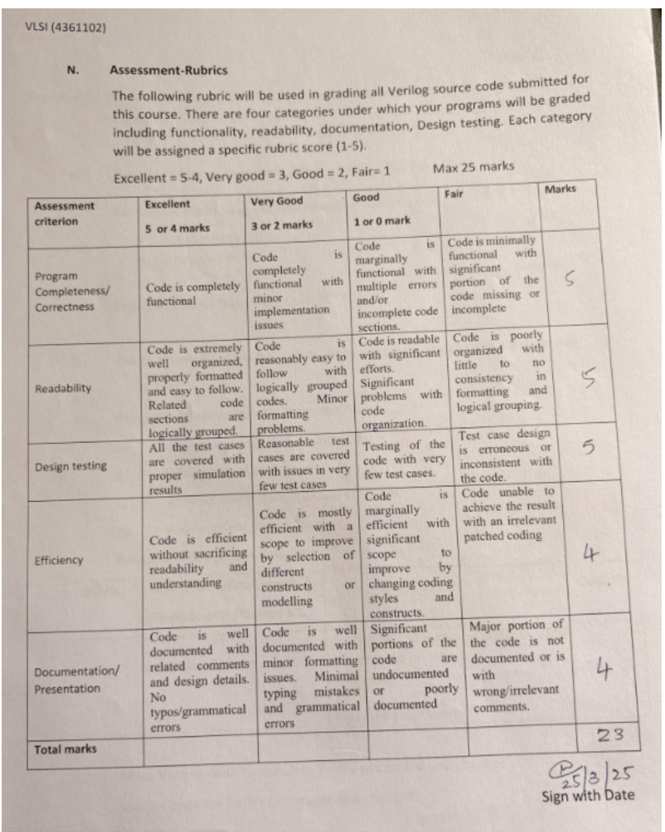

Figure 2.2.1.12 Practical rubrics

## G. Student feedback of teaching learning process and action taken (6)

Institute Marks

6.00

The institute follows a defined policy to collect, analyze, and act upon student feedback to continuously improve the teachingÐlearning process (TLP). Feedback is taken with transparency, confidentiality, and without hurting their progress.

1) Feedback Collection Process

a) Direct feedback

- A well-defined process is implemented at department level.

- All students are encouraged to submit feedback.

- Feedback is collected once each semester , either offline or online , coordinated by the Head of Department (HOD) / department coordinator.

- The questionnaire covers key aspects of TLP (content knowledge, delivery, communication, punctuality/regularity, interaction, response to queries, prerequisite coverage, real-life examples, and learning support).

- Responses are recorded on a five points scale (Excellent/ Very good/Good/Fair/Satisfactory).

- Data confidentiality is maintained; only consolidated results are shared.

## b) Indirect feedback

- HOD conducts periodic campus/classroom interactions with students regarding academics, laboratories, and support services.

- Course Exit Survey (for each course) and Program Exit Survey (for pass-out students) are administered every semester/year to capture attainment against course/program outcomes.

## 2) Data Analysis &amp; Reporting

- Department compiles the received feedback, prepares consolidated analysis reports , and identifies strengths and areas for improvement at course and faculty levels.

- Reports are discussed by HOD with concerned faculty members.

## 3) Action Taken Mechanism

- The HOD may suggest and guide faculty as per the feedback, which may include:

- Participation in FDPs and workshops for pedagogy enhancement.

- Adjustments in lesson planning, pace of delivery, and learner engagement methods.

- Additional tutorials, remedial sessions, lab demonstrations and YouTube videos.

- Improvement/addition of learning resources (notes, PPTs, manuals, question banks).

- Appreciation/Motivation: Faculty showing consistently high or improved feedback receive appreciation certificates from the department.

## 4) Effectiveness

- Improvements are monitored in the subsequent feedback cycle(s) and reflected through better consolidated scores, increased student satisfaction, and improved CO/PO attainment trends.

- Continuous review effectively closes the feedback loop and sustains the quality of the teachingÐlearning process.

## 2.2.2 Initiatives to improve the quality of semester tests and assignments (15)

Institute Marks

15.00

## A. Process for Internal semester question paper setting and evaluation and effective process implementation (5)

Institute Marks

5.00

Internal assessment for each course is conducted through class tests. The following structured process is followed for question paper setting, evaluation, and implementation to ensure transparency and academic effectiveness:

- The Head of Department (HOD) appoints a subject coordinator for each course, responsible for setting the class test paper and evaluating student performance.

- The subject coordinator, in consultation with the subject coordinator, defines the syllabus coverage for the class test and informs students in advance.

- The question paper is designed by the subject in-charge with clear mapping to Course Outcomes (COs). Questions are framed as per BloomÕs Taxonomy levels, ensuring inclusion of various cognitive domains (R/U/A) as per suggestion provided by the Departmental IQAC Committee/ Head of Department.

- The question papers are submitted to the Department GTU Coordinator for smooth conduction of the test.

- Students are briefed regarding the question paper format, evaluation scheme, and syllabus coverage. Seating arrangements and test schedules are displayed on the department notice board and/or digital media.

- After the test, answer sheets are evaluated by the subject faculty. Marks and performance are declared as per the scheduled timeline.

- Result analysis is carried out by the subject in-charge to identify slow learners. Remedial measures such as counselling and remedial classes are conducted to support their improvement.

- During COVID-19 pandemic, the same procedure was followed through online platforms, maintaining consistency and academic integrity in internal assessments.

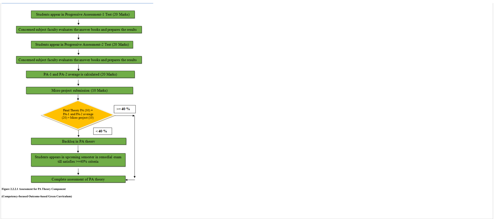

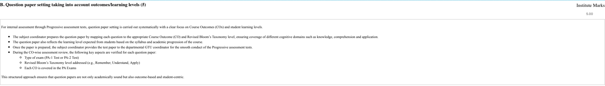

## C. COs coverage in class test / mid-term tests and assignments (5)

Institute Marks

5.00

C. COs covering in Class test / Mid - term tests and assignment ( 5 )

- At the beginning of the semester, the subject coordinator prepares the assessment plan (a part of the lesson plan).

- The assessment plan clearly outlines the CO-wise mapping for each evaluation method and covers the following elements: Course COs assessment is done by Progressive assessment tests.

- This systematic approach ensures continuous and outcome-based evaluation throughout the semester.

- A standard Progressive assessment test format is used across all subjects, as shown in the sample provided below. The format includes:

- Mapping of each question with the corresponding CO

- Indication of cognitive level (Remembering / Understanding / Applying, i.e., R/U/A)

- Marks distribution for each question

- Structured layout with optional and compulsory sections, ensuring coverage of the entire CO range

This process ensures transparency and uniformity while facilitating effective tracking of CO attainment across all subjects and assessments.

## Government Polytechnic; Palanpur ECIICT Department

Sub Name &amp; Code: Digital Electronics (4321102)

Progressive\_Assessment

Date: 03/04/2024

12:30pm

## Q-1 Answer Following Questions

Convert: (46)10

OR

=

Convert: (110111)2=

)1o

)s=

Subtract

2 s Complement method: (1110)2

(1000)2

Total Marks: 20

[6]

[3]

A

A

[3]

U

Perform: (1110110122+(10101000)2

using

[10] CO2

|     | Explain Logic Gates: AND, NOR NOT, EX-OR with their symbol, tuth table and equation. OR Name the Universal Gates. Draw circuit of AND, OR NOT NAND Gate using gate   | [4]   | R,U R, U   |
|-----|----------------------------------------------------------------------------------------------------------------------------------------------------------------------|-------|------------|
| (b) | Simplify the following Boolean function K-map: f(A,B,C,D) = Em (0,3,4,6,8,11,12) OR Simplify using Boolean Algebra: Y_AB+A B+A B+AB using                            | [3]   | A A        |
|     | State De-Morgan 's theorems and prove it.                                                                                                                            | [3]   | U          |

## Q-3 Answer Following Questions

Draw the logic circuit of Full Adder and explain its working.

OR

Draw the logic circuit of half Subtractor and explain its working.

## Course Outcomes:

Code

COI

CO2

CO3

CO4

CO5

4321102.1

4321102.2

4321102.3

4321102.4

4321102.5

Statement

Interpret various number systems and their conversions with

Implement simplified Boolean equations using logic gates.

Test different types of combinational logic circuits.

Test different types of sequential logic circuits.

Classify various memories and logic families.

[4]

U

)16

)16

binary arithmetic operations.

## Government Polytechnic; Palanpur ECIICT Department

Sub Name &amp; Code: Digital Electronics (4321102)

Progressive\_Assessment 2 (May-2024) Sem - 2

| 12:30pm Date: 22/05/2024       | 12:30pm Date: 22/05/2024                                                     | 12:30pm Date: 22/05/2024                                                                 | Total Marks: 20   | Total Marks: 20   |
|--------------------------------|------------------------------------------------------------------------------|------------------------------------------------------------------------------------------|-------------------|-------------------|
| Q-1 Answer Following Questions | Q-1 Answer Following Questions                                               | Q-1 Answer Following Questions                                                           | [4] Co3           | [4] Co3           |
|                                | Describe 8:1 Multiplexer with truth table, equation and circuit diagram OR   | Describe 8:1 Multiplexer with truth table, equation and circuit diagram OR               | [4]               | U                 |
|                                | Explain 3.8 Decoder with truth table and circuit diagram:                    | Explain 3.8 Decoder with truth table and circuit diagram:                                |                   |                   |
| Q-2 Answer Following Questions | Q-2 Answer Following Questions                                               | Q-2 Answer Following Questions                                                           | [10] CO4          | [10] CO4          |
| (a)                            | Describe JK flip with truth table and circuit diagram. OR flop               | Describe JK flip with truth table and circuit diagram. OR flop                           | [4]               | R, U              |
|                                | Explain SR flip with truth table and circuit diagram. flop                   | Explain SR flip with truth table and circuit diagram. flop                               |                   | R,U               |
|                                | Classify Shift Registers with the help of Block diagram. OR                  | Classify Shift Registers with the help of Block diagram. OR                              |                   |                   |
|                                | Explain SISO shift registers in detail.                                      | Explain SISO shift registers in detail.                                                  |                   | U                 |
|                                | Describe 4-bit Asynchronous UP Counter with truth table and circuit diagram. | Describe 4-bit Asynchronous UP Counter with truth table and circuit diagram.             | [3]               | U                 |
| Q-3 Answer Following Questions | Q-3 Answer Following Questions                                               | Q-3 Answer Following Questions                                                           | [6] CO5           |                   |
|                                | Define: Fan in, Fan out, Noise margin OR Compare SRAM and DRAM               | Define: Fan in, Fan out, Noise margin OR Compare SRAM and DRAM                           | [3]               | R, U R,U          |
| b)                             | Classify different Logic Families .                                          | Classify different Logic Families .                                                      | [3]               | A                 |
| Course Outcomes:               | Course Outcomes:                                                             | Course Outcomes:                                                                         |                   |                   |
|                                | Code                                                                         | Statement                                                                                |                   |                   |
| COI                            | 4321102.1                                                                    | Interpret various nuber systems and their conversions with binary arithmetic operations. |                   |                   |
| CO2                            | 4321102.2                                                                    | Implement simplified Boolean equations using logic gates.                                |                   |                   |
| CO3                            | 4321102.3                                                                    | Test different types of combinational logic circuits.                                    |                   |                   |
| CO4                            | 4321102.4                                                                    | Test different types of sequential logic circuits.                                       |                   |                   |
| COS                            | 4321102.5                                                                    | Classify various memories and logic families                                             |                   |                   |

## 2.2.3 Quality of Experiments (15)

## A. Experimental methodologies (5)

- In Electronics &amp; communication department we have allotted all courses in Nine (09) different laboratories. Details of laboratories are given in below table.
- Laboratory experiments for all courses are designed in accordance with the experiment list prescribed in the GTU curriculum.
- Batch size for laboratory session is decided as per guideline of Directorate of Technical Education.
- The laboratory sessions are conducted as per time table approved by Head and Principal.
- The procedure/theory/learning outcome is explained by faculties in prior to performance of experiment.
- Groups of 4 to 5 students are allowed to perform the practical for hands-on practice under the supervision of faculties and supporting staff.
- Students are encouraged to perform practical on bread board in courses where experiments kits are not available.
- Students are encouraged to design and develop circuits on PCB in courses like Electronics Workshop and Project for testing and troubleshooting.
- Students complete laboratory manual during course work which is continuously evaluated by concern faculty.
- Laboratory-in charge is allocated for each laboratory, to take care of laboratory.
- Equipment utilization register is maintained by lab assistant for each laboratory and it is dully signed by faculty.
- Experiments are performed on equipment or trainer kit. Some subjects are having computer related experiment so those are performed on computer lab.
- If there is no equipment or trainer kit available then that practical is performed either with simulation software or with virtual labs.

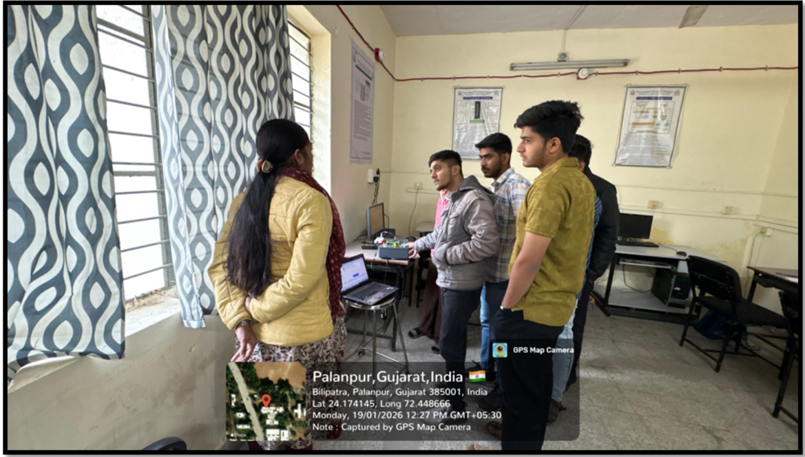

Figure: 2.2.3.1 Hands on practical in VLSI Lab

## Features of laboratory manual/ file

- Laboratory manuals for all courses are available with the department in hard copy/ soft copy.
- The list of experiment is prepared as per the suggested list of experiment by GTU in curriculum.
- DTE provides standardized common lab manuals for all subjects to ensure uniform practical training across all polytechnic institutes. These manuals help maintain consistency in laboratory work and assessments.
- Each title of the experiment is mapped with relevant course outcome of the course.
- Sample laboratory manual of each course with reading and observation is available to refer and verify the respective experiment data.

## Availability of adequate and well-equipped workshops, Laboratories

- The Electronics and Communication Engineering Department of Government Polytechnic Palanpur has a sufficient number of well-equipped laboratories and workshops to conduct various laboratory sessions.
- All laboratories are equipped with efficient equipment, enabling students to engage in hands-on activities and experiential learning during practical sessions as well as during flexible time slots based on their interests
- Equipments are stored at designated locations with appropriate tagging to ensure easy accessibility.
- Our laboratories consist of a comprehensive array of instruments and facilities, providing ample resources to support experimentation endeavours.

## Institute Marks

15.00

## Institute Marks

5.00

- All laboratories are provided with adequate display boards/Charts for necessary information to students and sufficient furniture facilities.
- The laboratories slots are provided as per curriculum requirement.

|   SR. N O | ROOM  N O.   | LAB  N AME          | N AME OF LAB I N CHARGE   |
|-----------|--------------|---------------------|---------------------------|
|         1 | B002         | Computer Lab-1      | Ms. M.K. Pedhadiya        |
|         2 | B008         | Computer Lab-2      | Dr. L.K. Patel            |
|         3 | B009         | Computer Lab-3      | Mr. M.J. Dabgar           |
|         4 | B014         | Computer Lab-4      | Mr. S.P. Joshiara         |
|         5 | B010         | Electronics Lab-1   | Mr. N.J. Chauhan          |
|         6 | B013         | Electronics Lab-2   | Mr. R.C. Parmar           |
|         7 | B106         | Electronics Lab-3   | Mr. N.J. Chauhan          |
|         8 | B101         | Communication Lab-1 | Dr. R.N. Patel            |
|         9 | B105         | Communication Lab-2 | Dr. R.N. Patel            |

Table: 2.2.3.1 N ame of Laboratory and in charge

## B. Innovative experiments including industry attached practices, virtual labs (5)

- Across many courses, innovative practices are adopted to actively engage students with emerging technologies. The department faculty consistently strive to introduce innovative laboratory experiments.
- In addition to curriculum-prescribed experiments, students are assigned micro-projects aligned with current industry requirements and emerging trends, thereby enhancing their simulation and practical skills.

|   SR. N O. | SEMESTER   | SUBJECT   | TOOL                 | DETAIL                                                       |
|------------|------------|-----------|----------------------|--------------------------------------------------------------|
|          1 | 6          | VLSI      | Quartus Free version | Simulation Software                                          |
|          2 | 2          | DE        | Virtual Lab          | Simulation Software                                          |
|          3 | 3,6        | CN        | CISCO Packet Tracer  | Simulation Software                                          |
|          4 | 4          | MP&MC     | Keil Free version    | 8051 Programming Software                                    |
|          5 | 4          | MP&MC     | Proteus Demo version | Device interfacing and simulation with 8051 microcontrollers |

Institute Marks

5.00

|   6 |   4 | DCOM      | Scilab         | Modulation and demodulation of analog and digital communication   |
|-----|-----|-----------|----------------|-------------------------------------------------------------------|
|   7 |   5 | SP        | Scilab         | Simulation Software                                               |
|   8 |   5 | OOPS & PP | Python IDLE    | Programming Software                                              |
|   9 |   5 | OOPS & PP | pycharm        | Programming Software                                              |
|  10 |   5 | OOPS & PP | jupyter        | Programming Software                                              |
|  11 |   5 | ES        | AVR Studio     | Integrated Digital Environment                                    |
|  12 |   6 | RE&ETE    | Arduino IDE    | Integrated Digital Environment                                    |
|  13 |   5 | ES        | eXtreme Burner | Development interface for AVR                                     |
|  14 |   2 | PCB&EWS   | KiCad          | Electronic Design Automation (EDA) tool                           |
|  15 |   3 | PC        | Code Block     | Integrated Digital Environment                                    |

## C. Relevance to outcomes (5)

- For all the courses, laboratory experiments to be performed are mapped with CO.
- DTE provides standardized common lab manuals for all subjects to ensure uniform practical training across all polytechnic institutes.
- The assessment is done based on rubrics for performance-based courses.
- Maximum COs are included in the list of experiments to be performed.
- The remaining COs are assessed through CO-wise examinations and other activities suggested by course coordinator.

Table: 2.2.3.2 Sample copy of ICT Tools and Software

Institute Marks

5.00

## Practical Outcome Course Outcome matrix Coursc Outcomes (COs): Microwave and Radar Communication) (4351103)

- a) CO1 Distinguish Electromagnetic wave propaBation through reflections from voltage and Current transmission
- b) CO2 Analyze performance of microwave components from a field point of view.

d)COA Maintain microwave semiconductor devices used to realize amplifiers and Oscillators.

e)co5 Maintain SONAR and RADAR systems a5 microwave applications

| 5. No.   | Practical Outcome/Title of experlment                                                                      | C01   | Co2   | Co3   | coa   | co5   |
|----------|------------------------------------------------------------------------------------------------------------|-------|-------|-------|-------|-------|
|          | Demonstrate Transmission line and its parameters_                                                          |       |       |       |       |       |
|          | Identify various microwave components in the microwave circuit.                                            |       |       |       |       |       |
|          | Test different control functions of GUNN power supply and draw V/I characteristics.                        |       |       |       |       |       |
|          | Set the microwave bench for optimum operation.                                                             |       |       |       |       |       |
|          | Measure the frequency generated by source and different wavelength in rectangular_waveguide for TE1,O mode |       |       |       |       |       |
|          | Measure VSWR for Biven microwave loads                                                                     |       |       |       |       |       |
|          | Measurement of attenuation of a Biven fixed attenuator:                                                    |       | v     |       |       |       |
|          | Study of Power division in Directional coupler and its characteristics.                                    |       | v     |       |       |       |
|          | Study circulator and its characteristics                                                                   |       | v     | v     |       |       |
| 10       | Study of Power division in Magic Tee and                                                                   |       | v     |       |       |       |
| 11       | Calibration of Biven variable attenuator                                                                   |       |       |       |       |       |
| 12       | Introduction to RADAR                                                                                      |       |       |       |       |       |
| 13.      | Measure VSWR and reflection coefficient for Biven lenBth of transmission line.                             |       |       |       |       |       |

Figure: 2.2.3.2 Sample copy of laboratory experiments mapped with CO

M

of Results (To de discussed and written during experiment by faculty and

Interpretation student)

Conclusion (To be written by student after performing experiment and to be verified by

faculty)

## N Practical related Quiz.

- 1 . List two port microwave components
- 2 List types of waveguide TEE
- 3 List more than two port (multi port)microwave components
- 0 References / Suggestions lab manual designer should Bive)

com Lwatch?v=lgBiWVLYEiA (faculty explains microwave components )

## P: Assessment-Rubrics

| Rubrics   | Prepare The experiment al setup. (5)   | Operate the equipment setup or circuit.(5)   | Follow safe practices measures (5)   | Record observatio ns correctly. (5)   | Interpret the result and conclude. (5)   | Total 25   |
|-----------|----------------------------------------|----------------------------------------------|--------------------------------------|---------------------------------------|------------------------------------------|------------|
| Marks     |                                        |                                              |                                      |                                       |                                          |            |

Sign with Datc

20

Figure: 2.2.3.3 Sample copy of laboratory experiments Rubrics

This is a sample copy; rubrics for practical examinations and records for other subjects are maintained in the respective faculty membersÕ course files.

## 2.2.4 Quality of Students Projects and Report Writing (35)

## Institute Marks

35.00

## A. Identification of projects and allocation methodology (3)

Institute Marks

3.00

- The Electronics &amp; Communication Department at Government Polytechnic, Palanpur, affiliated with Gujarat Technological University (GTU), offers project work to students in designated groups during the 5th and 6th semesters (Final Year), as per the universityÕs curriculum structure.

- Under the GTU curriculum introduced in September 2012, final-year project work carried a total of 10 credits and was divided into two parts:

ProjectÐ1 (Course Code: 3351107) in the 5th semester Ð 4 credits, with Internal Evaluation: 60 marks and External Evaluation: 40 marks, Total: 100 marks.

ProjectÐ2 (Course Code: 3361109) in the 6th semester Ð 6 credits, with Internal Evaluation: 100 marks and External Evaluation: 200 marks, Total: 300 marks.

(GTU Website Reference for Diploma Program Ð Project: Circular dated 13.08.2012, available at: https://s3-ap-southeast-1.amazonaws.com/gtusitecirculars/circulars/12Aug/13082012\_03.pdf)

- With the implementation of the Competency-focused Outcome-based Green Curriculum-2021 (COGC-2021), the curriculum was restructured to introduce mandatory summer internships alongside project work. The summer internships aim to provide practical, industry-focused exposure, guided by AICTE recommendations.

- As a result, the allocation of credits and structure for project courses was revised to accommodate these internships in the final year. With the GTU revised curriculum implemented from 2021, the final-year project credit distribution was reduced to a total of 2 credits, as follows

E&amp;C ProjectÐ1 ( Course Code: 4351107 ) in the 5th semester Ð 1 credit, with Internal Evaluation: 50 marks and External Evaluation: 50 marks, Total: 100 marks.

E&amp;C ProjectÐ2 (Course Code: 4361103) in the 6th semester Ð 1 credit, with Internal Evaluation: 25 marks and External Evaluation: 25 marks, Total: 50 marks.

- Also, Since 2021, GTUÕs revised diploma curriculum (COGC-2021), Competency-focused Outcome-based Green Curriculum-2021 , includes a 10-mark micro/mini project in the mid-semester internal evaluation. These micro/mini, application-oriented projects (14Ð16 hrs/semester) promote hands-on, competency-based learning, teamwork, documentation, and presentation skills.
- This change is aligned with NEP 2020, which emphasizes experiential and industry-linked education, integrating theory with practice.

## Project Identification Process:

- Final-year diploma projects, usually undertaken in Semesters 5 and 6, focus on addressing real-world problems, often drawn from industry, research institutions, government agencies, or broader socio-technical challenges.
- Shodh-Yatra: After completing the 4th semester, students embark on a ÒShodh-Yatra,Ó a problem-identification journey aimed at discovering potential project ideas from industry or relevant organizations. This exploration is usually completed before or shortly after the beginning of the 5th semester.
- Each student or project group is required to submit their problem definition to the departmental project guide within the timeline prescribed by GTU, through their assigned faculty guide.

## Guide Allocation:

- Each student or group is assigned a faculty guide responsible for reviewing, mentoring, and monitoring project progress throughout the academic year.
- The guide evaluates the problem definition and determines feasibility and relevance.
- An industry mentor may also be involved in guidance and evaluation, especially during final presentations and evaluations.
- The final allocation and confirmation process is managed by the concerned department HOD and communicated as per university guidelines.

## Key Points to be considered:

- Projects must align with a studentÕs chosen electives or branch specialization.
- Regular evaluations and reviews by guides are mandatory, and involvement of industry mentors is encouraged for practical/vocational relevance.
- Strict timelines are set for project identification, title submission, and evaluation stages, usually within the first three weeks of the 5th semester.

## Guidelines for Students

## A. Team Formation

- Team Size: 3 to 4 students per group
- Each group must be assigned to a faculty  Guide
- Guide will evaluate progress weekly and maintain a Project Progress Record

## B. Project Selection Guidelines

- Must address a real-world problem or innovative application.
- Ideas may originate from:
- Industry visits
- Faculty suggestions
- Student research
- Community needs (NGO/MSME/Smart City)
- Projects should integrate both hardware and software components.
- Projects with SSIP/startup potential are highly encouraged.

## B. Types and relevance of the projects and their contribution towards attainment of POs and PSOs (5)

Institute Marks

5.00

- Every EC diploma project in fifth and sixth semester should be clearly classified (application/product/research/review), selected after evaluating environment, safety, ethical, cost, and standards aspects, and mapped to relevant POs/PSOs.

- Most students opt for UDP (User Defined Projects), and industry mentors provide guidance mainly for selected project titles as per department project guide suggestions.

- Most projects are UDPs with optional industry mentor input for title selection and implementation guidance. This structured approach aligns with both GTU curriculum and Outcome based education requirements for quality assurance and outcome-based education.

## Mapping with Program Outcomes (POs) &amp; Program Specific Outcomes (PSOs)

- Projects must demonstrate contributions to the solution of engineering problems, design and development, teamwork, communication, ethics, societal/environmental impact, life-long learning.

- Also, in line with the application of electronics/communication engineering concepts, tools, and processes for real-world problem solving and innovation.

## Project List Year 2025-26

Project Title

Type

Mapping to

POs/PSOs

Guide

N

ame

| Smart auto-positioning chair system   | Hardware+Software   | PO1, PO2, PO3, PO4, PO6,  PSO1, PSO2          | Mr. M J Dabgar   |
|---------------------------------------|---------------------|-----------------------------------------------|------------------|
| Health Monitoring system              | Hardware+Software   | PO1, PO2, PO3, PO4, PO5, PO6, PO7, PSO1, PSO2 | Mr. M J Dabgar   |
| Wet, Dry and Metal Waste Segregation  | Hardware+Software   | PO1, PO2, PO3, PO4, PO5, PO6, PSO1, PSO2      | Mr. M J Dabgar   |

## Project List Year 2024-25

| Project Title             | Type                | Mapping to POs/PSOs                           | Guide  N ame      |
|---------------------------|---------------------|-----------------------------------------------|-------------------|
| IoT Based Home Automation | Hardware+Software   | PO1, PO2, PO3, PO4, PO5, PO6, PO7, PSO1, PSO2 | Mr.  N  J Chauhan |
| The Smart Dustbin         | Hardware+Software   | PO1, PO2, PO3, PO4, PO5, PO6,  PSO1, PSO2     | Mr.  N  J Chauhan |
| Smart Attendance System   | Hardware + Software | PO1, PO2, PO3, PO4, PO6, PSO1, PSO2           | Mr.  N  J Chauhan |

## Project List Year 2023-24

| Project Title               | Type              | Mapping to POs/PSOs                           | Guide  N ame   |
|-----------------------------|-------------------|-----------------------------------------------|----------------|
| Smart Trolly using Arduino  | Hardware+Software | PO1, PO2, PO3, PO4, PO5, PO6, PSO1, PSO2      | Mr. M J Dabgar |
| Smart Juice Vending Machine | Hardware+Software | PO1, PO2, PO3, PO4, PO5, PO6, PO7, PSO1, PSO2 | Mr. M J Dabgar |

Table: 2.2.4.1 Project List Year wise

## C. Process for monitoring and evaluation (5)

Institute Marks

5.00

## 1. Weekly Monitoring &amp; Progress Reporting

- Each project group meets their assigned faculty guide once every week for structured progress monitoring.

- Guides record observations in a weekly progress report, covering work done, issues faced, corrective actions suggested, and alignment with POs/PSOs.

## 2. Continuous Assessment by Faculty Guide

- Evaluation includes technical progress, design quality, adherence to safety, ethical practices, cost management, and compliance with relevant standards.

- Industry mentors (for selected UDP projects) provide suggestive inputs on title selection and technical improvements when required.

## 3. Individual &amp; Group Performance Tracking

- Contributions of each student are tracked through the progress reports, interim presentations, and mentor feedback.

- Rubrics aligned to NBA criteria assess problem-solving, innovation, teamwork, communication, and ethical/environmental considerations.

## 4. Mid-Term &amp; Final Review

- Mid-term review assesses ~50% project completion status; corrective measures are taken if required.

- Final review and evaluation (internal + external) involve prototype demonstration, viva-voce, and documentation quality check.

## 5. Documentation &amp; Feedback

- All weekly progress reports, rubric sheets, mentor comments, and evaluation summaries are maintained for NBA SAR evidence.

- Feedback is used for improving project execution processes in subsequent batches.

Legends: R = Remembrance; U = Understanding; A = Application and above levels (Revised BloomÕs taxonomy)

Activity

Weightage

Presentation-1

(20-Marks)

Presentation-2

(20-Marks)

Activity

Weightage

Documentation

(10-Marks)

| Activity                  | Technical Content of project (Innovative/ Project Complexity/ Quality of Build and Components /Recenttrends /Expansionetc.)   | Status of Hardware/ Coding   | PPT content/style   | Communication skill (Verbal/ N on verbal)   | Question Answer/ Discussion   |
|---------------------------|-------------------------------------------------------------------------------------------------------------------------------|------------------------------|---------------------|---------------------------------------------|-------------------------------|
| Weightage                 | 0to 4Marks                                                                                                                    | 0to4Marks                    | 0 to 4 Marks        | 0to 4Marks                                  | 0to 4Marks                    |
| Presentation-1 (20-Marks) |                                                                                                                               |                              |                     |                                             |                               |
| Presentation-2 (20-Marks) |                                                                                                                               |                              |                     |                                             |                               |

Report Contents

Reportasper

University format

(Sequence.

Bibliography,

Resources etc.)

Presentation of Block diagram/Circuit/Flow

Chart

Submissionof weekly Progress

Report

Overall Quality of

Report

Activity

Technical Content of project

(Innovative/ Project

Complexity/ Quality of Build and

Components

/Recenttrends

/Expansionetc.)

0 to 4 Marks

0 to 4 Marks

Status of

Hardware/

Coding

PPT

content/style

Communication skill

(Verbal/

N

on verbal)

0 to 4 Marks

Report Contents

(Sequence.

Bibliography,

Resources etc.)

0 to 2 Marks

Presentation of Block diagram/Circuit/Flow

Chart

0 to 2 Marks

0 to 4 Marks

Submission of weekly Progress

Report

0 to 2 Marks

Report as per

University format

0 to 2 Marks

Question

Answer/

Discussion

0 to 4 Marks

Overall Quality of

Report

0 to 2 Marks

Documentation /Project Report Rubrics: (Course Code: 4351107)

Project Presentation Rubrics (Course Code: 4361103)

Documentation/ProjectReport Rubrics: (Course Code: 4361103)

Weightage

0 to 2 Marks

0 to 2 Marks

0 to 2 Marks

0 to 2 Marks

0 to 2 Marks

Documentation

(10-Marks)

Table: 2.2.4.2 Project Rubrics

## D. Process to assess individual and team performance (5)

Institute Marks

5.00

## 1. Individual Assessment

- Each studentÕs contribution is tracked through weekly progress reports and guide observations during meetings and presentations.

- Peer feedback and individual viva sessions evaluate understanding, skills, and communication.

## 2. Team Evaluation

- Overall project progress, collaboration, and quality of outcomes are assessed by faculty guides and external examiners.

Industry mentors provide input on team coordination and practical implementation for relevant projects.

## 3. Assessment Methods

- Structured rubrics aligned with NBA criteria cover technical content, teamwork, innovation, ethics, and environmental aspects.

- Both ongoing monitoring and final evaluations are used to gauge performance.

## 4. Feedback and Improvement

- Timely feedback is shared with students and teams to promote learning, accountability, and teamwork enhancement.

This streamlined process ensures fair and effective evaluation of both individuals and teams while meeting NBA accreditation standards and supporting our department and university guidelines.

The following competencies broadly needs to be developed in students :

- Co-creation &amp; Interpersonal abilities

- Analysis Test and Troubleshooting skills

- Programming/simulation/ debugging skills

- PCB fabrication/ soldering skills/ modeling skill

- Documentation &amp; Presentation skill

## E. Quality of deliverable, working prototypes (12)

Institute Marks

12.00

- Completed projects and working prototypes are evaluated rigorously for functionality, innovation, and adherence to project objectives.

- Quality parameters include reliability, robustness, safety, ethical considerations, cost-effectiveness, and compliance with relevant standards.

- Projects are expected to demonstrate practical applicability and relevance to real-world problems, especially in line with UDP guidelines and industry input where applicable.

- Documentation qualityÑincluding design specifications, test results, and user manualsÑis reviewed to ensure completeness and clarity.

- Final assessment involves faculty guides and external examiners who verify prototype working condition, effectiveness, and the studentÕs understanding during demonstration and viva.

- The evaluation results are mapped with Program Outcomes (POs) and Program Specific Outcomes (PSOs) as evidence for NBA accreditation.

Some Glimpse of completed projects:

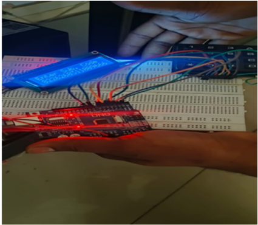

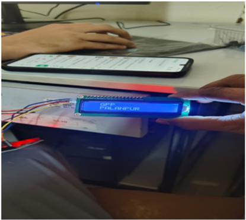

## F. Papers published /Awards/ Recognition received by projects at State/ National level (5)

## Student Startup and Innovation Policy (SSIP) support

- During the academic year 2024-2025 and 2025-26, students of EC department received funding through the SSIP Cell at the institute level. Under this support, the team developed a Proof of Concept (PoC), showcasing innovation, practical application, and potential societal impact.
- The details of projects supported from SSIP is as follows

## 2024-25

|   Sr no | Title                   | Student  N ame            | Approved Fund   |
|---------|-------------------------|---------------------------|-----------------|
|       1 | Smart Attendance System | Suthar Bharat Vishanubhai | 25000/-         |
|       2 | Smart Dustbin           | Prajapati Harshad S       | 16792/-         |

## 2025-26

|   Sr no | Title                                              | Student  N ame   | Approved Fund   |
|---------|----------------------------------------------------|------------------|-----------------|
|       1 | Smart chair positioning system                     | Dave Falguni J   | 25,200/-        |
|       2 | Core XY 3D Printer  (Apart from academic projects) | Mali Paresh      | 1,45,000/-      |

2.2.5 Industry Interaction and Industry Internship/Training (30)

Figure: 2.2.4.1 Sample project photos

Table: 2.2.4.3  Details of projects supported from SSIP

## Institute Marks

5.00

Institute Marks

30.00

Institute Marks

We have estsblished an industry supported lab in collaboration with BeeRobokids innovations pvt ltd with Title: "Advanced controller and processor laboratory".

From: BeeRobokids &lt;beerobokids@gmail com&gt; Sent: Tuesday; January 27,2026 3-05 PM To: principal-gp-palanpur Subject: Re: Subject: Invitation for Industry Collaboration to Establish an Advanced Controller and Processor Laboratory

This mail is from external domain, i.e. not from gujarat govin domain. Kindly open attachment and link with caution.

To

The Head of Department Department of Electronics and Communication Government Polytechnic Palanpur; Banaskantha Gujarat 385001

Respected Sir;

Greetings from Beerobokids Innovations Pvt. Ltd. Palanpur

We sincerely thank you for reaching out to us and for sharing the details of your proposed Industry-Supported Advanced Controller and Processor Laboratory initiative. We truly appreciate the efforts taken by the Department of Electronics and Communication; Government Polytechnic, Palanpur; to enhance technical education and provide industry-oriented practical exposure to students

We are pleased to inform you that Beerobokids Innovations Pvt: Ltd. is happy to collaborate with your esteemed institute for this initiative. We strongly believe that such industry-academia collaborations play a vital role in developing skilled, competent; and industry-ready engineers

Our organization is willing to extend support in areas such as technical guidance; expert lectures , student training programs , internships; and possible assistance related to equipment and software, subject to mutual discussion and feasibility .

We look forward to a fruitful and long-term association that will benefit students, faculty members, and the industry alike. Kindly let us know a convenient time for further discussion to explore the collaboration in detail.

Thank you once again for considering our organization as an industry partner.

With best regards Beerobokids Innovations Pvt. Ltd Contact: 9023415864

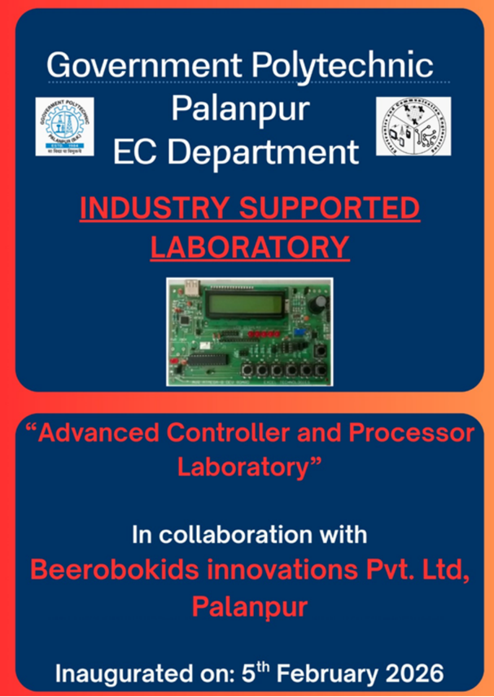

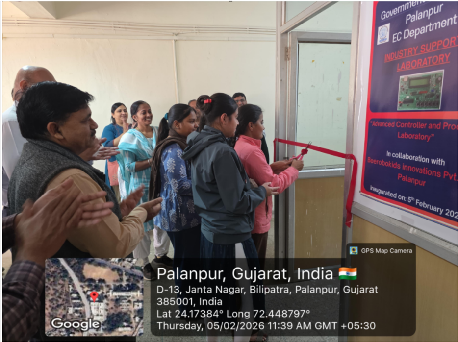

## B. Delivery of appropriate Course work by Industry experts (5)

- The delivery of coursework by industry experts adopts a holistic approach that blends real-world perspectives with practical experience and professional expertise.
- By inviting specialists from diverse fields to lead guest lectures and workshops, classrooms are enriched with authentic industry insights.
- Learners gain valuable exposure through direct interaction with professionals who share their experiences, offer practical guidance, and provide actionable insights.
- Additionally, industry experts support students in bridging the gap between theory and practice by demonstrating the real-world application of academic concepts.

| Sr.  N o   | Topic                            | N ame of Expert       | ExpertÕs Designation            | ExpertÕs institute/Company     | Date       | N o Of beneficiary students   |
|------------|----------------------------------|-----------------------|---------------------------------|--------------------------------|------------|-------------------------------|
| 2023-24    | 2023-24                          | 2023-24               | 2023-24                         | 2023-24                        | 2023-24    | 2023-24                       |
| 1          | Fabrication of Solar Cell        | Mr. Sandip Joshi      | Jr. Engineer Diploma EC         | Adani Power Ltd.               | 10-18-2023 | 7                             |
| 2          | Embedded System                  | Mr. Vishal Vadher     | Aast. Manager Training B.E.E.C. | SOFCON INDIAPVT LTD            | 03-13-2024 | 45                            |
| 3          | Web development technologies     | Mr. Vishal Vadher     | Aast. Manager Training B.E.E.C  | SOFCON INDIAPVT LTD            | 03-13-2024 | 45                            |
| 2024-25    | 2024-25                          | 2024-25               | 2024-25                         | 2024-25                        | 2024-25    | 2024-25                       |
| 1          | Ai-Ml: A New Era Of Future       | Mr. Vishal Vadher     | Aast. Manager Training B.E.E.C. | Sofcon Indiapvt Ltd            | 09-30-2024 | 42                            |
| 2          | Internet Of Things               | Dr. V K Thakar        | Dean Indrashil university ph.D. | Indrashil university           | 10-22-2024 | 49                            |
| 3          | Career Guidance For Ec engineers | Mr. Krishna Panchal   | Associate engineer B.E.E.C.     | E-Infochips                    | 11-10-2024 | 23                            |
| 4          | HAM Radio Workshop               | Mr. N. B. Nadoda      | Senior Lecturer                 | GGP, Ahmedabad                 | 02-14-2025 | 31                            |
| 5          | Drone Technologies               | Mr. Yuvrajsinh Rajput | CEO                             | Bee-Robokids Academy, Palanpur | 02-15-2025 | 36                            |

Figure: 2.2.5.1 Industry supported lab

Institute Marks

5.00

|    |                                              |                       | 2025-26             |                                         |            |    |
|----|----------------------------------------------|-----------------------|---------------------|-----------------------------------------|------------|----|
|  1 | Cyber Crime Awareness                        | Mr. Manish S Chauhan  | Assistant Professor | GEC Modasa                              | 09-12-2025 | 35 |
|  2 | IoT Applications with NodeMCU & Raspberry Pi | Mr. Rishabh Prajapati | Co-Founder          | Bee-Robokids Innovation Private Limited | 10-07-2025 | 15 |

Table: 2.2.5.1 Expert Lecture details

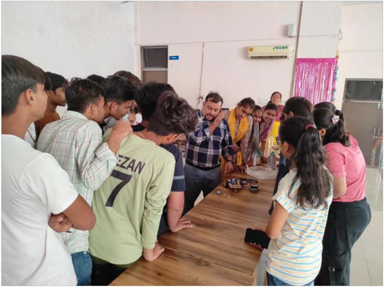

Figure 2.2.5.2  Embedded System expert lecture (2023-24)

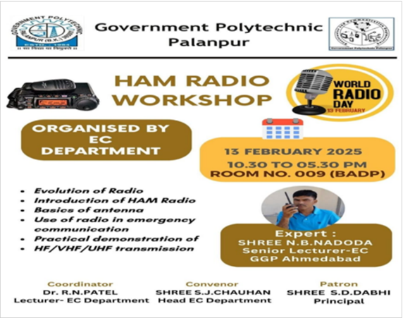

Figure 2.2.5.3  HAM Radio Workshop (2024-25)

## C. Industrial visits/tours for students (3)

- Industrial tours and field visits provide students with valuable practical exposure by demonstrating the real-world application of their academic studies.
- Organizing regular industry visits allows students to experience the actual working environment of organizations related to their field of study. These visits enable students to observe theoretical concepts in practice, helping them better understand how classroom knowledge translates into real-world scenarios.
- Through industrial exposure, students gain insights into industry-specific practices, standards, and regulations that may not be fully addressed in textbooks. Such experiences enhance student engagement with coursework, as learners can directly connect theory with practical applications.
- Additionally, industrial visits support students in the design, simulation, and implementation phases of their academic projects by providing real-world context and inspiration.

## Year 2023-24

Figure 2.2.5.4  Cyber Crime Awareness (2025-26)

|   Sr.  N o. | Date       | N ame of Industry                       | Semesters   |   N o. of Participants | N ame of Faculty                                    |
|-------------|------------|-----------------------------------------|-------------|------------------------|-----------------------------------------------------|
|           1 | 04/05/2023 | SAMSU N G SERVICE CE N TRE, PALA N PUR  | 2 &4        |                     19 | Mr. S P Joshiara & Dr. R  N  Patel                  |
|           2 | 10/05/2023 | COMMU N ITY RADIO STATIO N , PALA N PUR | 4           |                     11 | Mr. S J Chauhan & Mr. M J Dabgar                    |
|           3 | 01/08/2023 | BAJARA N G PAPERP RODUCTS, PALA N PUR   | 1           |                      7 | Mr. S J Chauhan & Mr. M J Dabgar                    |
|           4 | 16/03/2024 | PCB POWER PVT LTD, GA N DHI N AGAR      | 2,4,6       |                     14 | Mr. L K Patel, Mr.  N  J Chauhan, Ms. M K Pedhadiya |
|           5 | 16/03/2024 | MCBS PVT LTD, GA N DHI N AGAR           | 2,4,6       |                     14 | Mr. L K Patel, Mr.  N  J Chauhan, Ms. M K Pedhadiya |

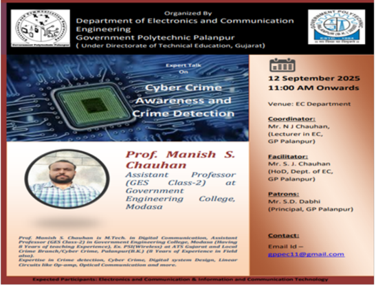

Institute Marks

3.00

## Year 2024-25

|   Sr.  N o. | Date       | N ame of Industry                       | Semesters   |   N o. of Participants | N ame of Faculty                       |
|-------------|------------|-----------------------------------------|-------------|------------------------|----------------------------------------|
|           1 | 02/08/2024 | BAJARA N G PAPERP RODUCTS, PALA N PUR   | 1           |                     13 | Mr. M J Dabgar                         |
|           2 | 25/09/2024 | RAILWAY STATIO N , PALA N PUR           | 3,5         |                     12 | Mr.  N  J Chauhan, Ms. M K Pedhadiya   |
|           3 | 05/10/2024 | BA N AS DAIRY                           | 3,5         |                     10 | Dr. R  N  Patel, MJD, Mr. S P Joshiara |
|           4 | 16/10/2024 | COMMU N ITY RADIO STATIO N , PALA N PUR | 4           |                      7 | Dr. R  N  Patel, Mr. S P Joshiara      |

Figure: 2.2.5.5 Industrial Visit at PCB POWER PVT LTD, GA N DHI N AGAR

Table: 2.2.5.3 Industrial Visits details Year 2024-25

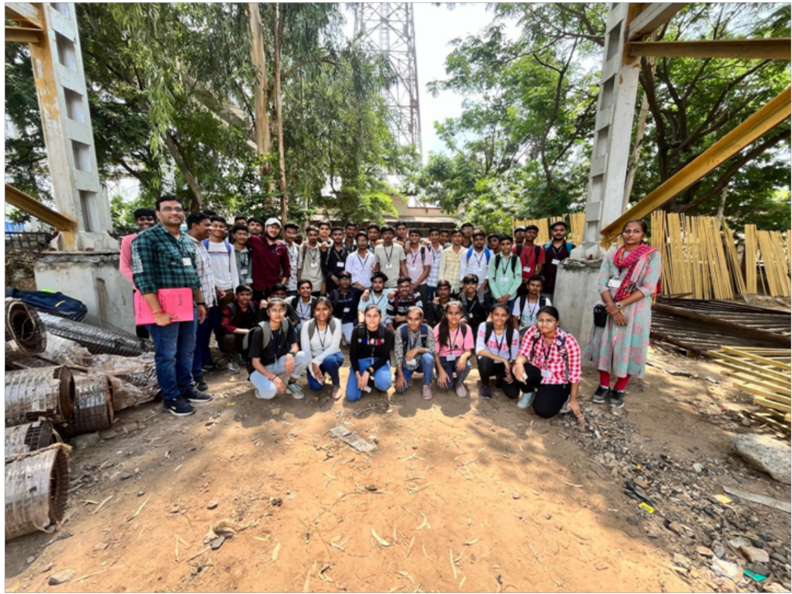

## Year 2025-26

|   Sr.  N o. | Date       | N ame of Industry                             | Semesters   |   N o. of Participants | N ame of Faculty                 |
|-------------|------------|-----------------------------------------------|-------------|------------------------|----------------------------------|
|           1 | 05/08/2025 | COMMU N ITY RADIO STATIO N , PALA N PUR       | 1           |                      6 | R C Parmar, Mr.  N  J Chauhan    |
|           2 | 20/09/2025 | N ETRAM (Command and Control Centre) Palanpur | 3,5         |                     12 | Mr. M J Dabgar &, S PJoshiara    |
|           3 | 17/11/2025 | COMMU N ITY RADIO STATIO N , PALA N PUR       | 3           |                      6 | Mr. L K Patel, Ms. M K Pedhadiya |

Figure: 2.2.5.6 Industrial Visit at RAILWAY STATIO N , PALA N PUR

Table: 2.2.5.4 Industrial Visits details Year 2025-26

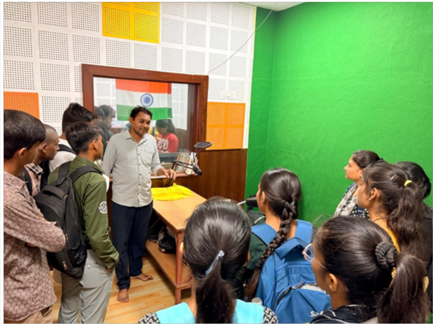

Figure: 2.2.5.7 Industrial Visit at COMMU N ITY RADIO STATIO N , PALA N PUR

At the conclusion of the industry visit, students were encouraged to share their reflections on the experience. Based on their feedback, the following key benefits were identified:

GLYPH&lt;0&gt; Observing theoretical concepts in real-world applications helped students better correlate academic knowledge with practical scenarios. GLYPH&lt;0&gt; Students gained valuable insights into industry-specific practices, standards, and regulatory frameworks that are not always fully addressed in textbooks. GLYPH&lt;0&gt; The visit enhanced studentsÕ engagement with coursework by enabling them to connect theoretical concepts with practical implications. GLYPH&lt;0&gt; Students found the experience beneficial for the design, simulation, and implementation stages of their academic projects. GLYPH&lt;0&gt; Learners developed an understanding of organizational culture, workplace ethics, and professional conduct prevalent in industry settings. GLYPH&lt;0&gt; Exposure to diverse industries allowed students to explore a wide range of career opportunities related to their field of study.

## D. Industrial training/ internship (5)

- With the objective of exposing students to professional career pathways through observation, understanding of industry working mechanisms, and hands-on experience in real-world projects, an internship program has been made mandatory during the 3rd and 5th semesters.
- The internship aims to equip students with practical knowledge and provide exposure to real-time industrial environments. To ensure broad learning opportunities, students may choose internships across various sectors, including government agencies, skill development centres, the social sector, government-initiated social schemes, and non-governmental organizations (NGOs).
- The internship duration is structured to align with academic progression, with a two-week internship for 3rd semester students and a six-week internship for 5th semester students.

## Year 2022-23

|   Sr.  N o. |   Semester |   N umber of Regular Students |   Students completed internship Participants |
|-------------|------------|-------------------------------|----------------------------------------------|
|           1 |          3 |                            12 |                                           12 |

## Year 2023-24

|   Sr.  N o. |   Semester |   N umber of Regular Students |   Students completed internship Participants |
|-------------|------------|-------------------------------|----------------------------------------------|
|           1 |          3 |                             9 |                                            8 |
|           2 |          5 |                             5 |                                            5 |

Institute Marks

5.00

## Year 2024-25

|   Sr.  N o. |   Semester |   N umber of Regular Students |   Students completed internship Participants |
|-------------|------------|-------------------------------|----------------------------------------------|
|           1 |          3 |                             6 |                                            6 |
|           2 |          5 |                             7 |                                            7 |

## Year 2025-26

|   Sr.  N o. |   Semester |   N umber of Regular Students |   Students completed internship Participants |
|-------------|------------|-------------------------------|----------------------------------------------|
|           1 |          5 |                             5 |                                            5 |

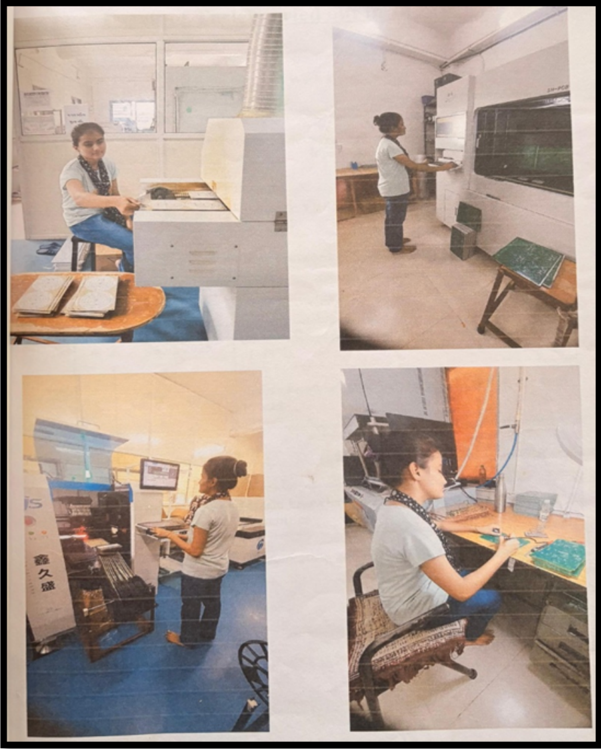

Table: 2.2.5.5 Student Internship details yearwise

Figure 2.2.5.8 Sample Internship Photo

Institute Marks

## Internal Evaluation 25 Marks PA()

| Parameter                                                  | Excellent   | Good   | Avcrage   | Not up the level of Satisfaction   | Obtaincd Marks   |
|------------------------------------------------------------|-------------|--------|-----------|------------------------------------|------------------|
| Mark range                                                 | 4-5         | 3-4    | 2-3       | Below 2                            |                  |
| Knowledge acquisition in specific domain . 5 marks         |             |        |           |                                    |                  |
| Skill and attitude attainment in specific domain . 5 marks |             |        |           |                                    |                  |
| Fcedback and suggestions given are incorporated? 5 marks   |             |        |           |                                    |                  |
| Quality of the prepared report and poster . 5 marks        |             |        |           |                                    |                  |
| Quality of the presentation. 5 marks                       |             |        |           |                                    |                  |

## (To be carried out by the mentor in consultation with Industry) Minimum Passing Marks: 13

Figure 2.2.5.9 Rubrics for Internal Evaluation

## F. Contribution to Community related projects/activities (5)

- Participating in community service allows students to actively contribute to their communities while creating a meaningful, long-term positive impact on society.
- Through community service or volunteerism, students develop valuable life skills and practical knowledge while offering support to individuals and groups in need.

|   Sr.  N O | Date                     | Activities                                                                                                                                                                                                                                                                                                                                                             |   Participated  Student |
|------------|--------------------------|------------------------------------------------------------------------------------------------------------------------------------------------------------------------------------------------------------------------------------------------------------------------------------------------------------------------------------------------------------------------|-------------------------|
|          1 | 05/05/2022               | Drawing and essay writing Competition on the theme  of Matdan Awareness                                                                                                                                                                                                                                                                                                |                      53 |
|          2 | 24/09/2022               | Talk with Village people about importance of organic farming @ Dhelana Village & playing physical games with primary school students                                                                                                                                                                                                                                   |                     276 |
|          3 | 02/01/2023 To 08/01/2023 | Special Camp @ Jalra Karja Village Learning through teaching Yoga Practice Village Survey Horticulture Development Seminar Sight seen through Walking at dantiwada dam water Awareness Rally Self employment through bakery business Distribution of  TULSI Plants  Tree Plantation Primary school kitchen services and gathering firewood from the forest for cooking |                      50 |
|          4 | 14/07/2023               | Trekking @ Jeshor Forest Hills & Collecting plastic garbage                                                                                                                                                                                                                                                                                                            |                      46 |
|          5 | 09/08/2023               | Earthen Lamp Lighting  (Meri Matti Mera Desh)                                                                                                                                                                                                                                                                                                                          |                     187 |
|          6 | 10/08/2023               | Vasudha Vandan By Tree Plantation                                                                                                                                                                                                                                                                                                                                      |                     175 |
|          7 | 08/12/2023               | Awareness Program on Mission LiFE (Life for Environment)                                                                                                                                                                                                                                                                                                               |                      48 |
|          8 | 28/03/2024               | Seminar and hands on practice for organic farming                                                                                                                                                                                                                                                                                                                      |                      70 |
|          9 | 19/04/2024               | Thalassemia Testing, Eye Check up and Dental Checkup                                                                                                                                                                                                                                                                                                                   |                     170 |
|         10 | 01/10/2024               | Cleanliness Drive at Railway station Palanpur                                                                                                                                                                                                                                                                                                                          |                      46 |

Institute Marks

5.00

Table: 2.2.5.6 Community related activity details

|   11 | 09/12/2024      | ACPDC awareness program                      | School students                 |
|------|-----------------|----------------------------------------------|---------------------------------|
|   12 | 10/02/2025      | Ambaji NSS Seva Camp                         | 24                              |
|   13 | 07/03/2025      | Gujarat cultural Elocution competitionÐ 2025 | 06                              |
|   14 | Yearly Activity | RTO (Learning license)  duties by faculties  | All learning  license aspirants |

## UNRESERVED TICKET OFFICE PALANPUR

Figure 2.2.5.10 Cleanliness Drive at Railway station Palanpur

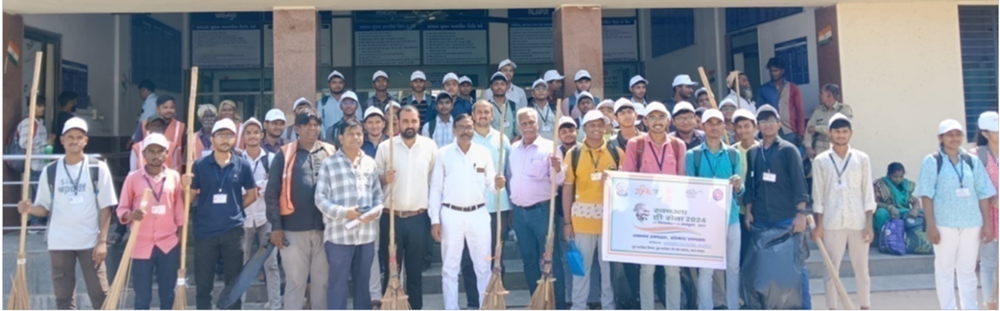

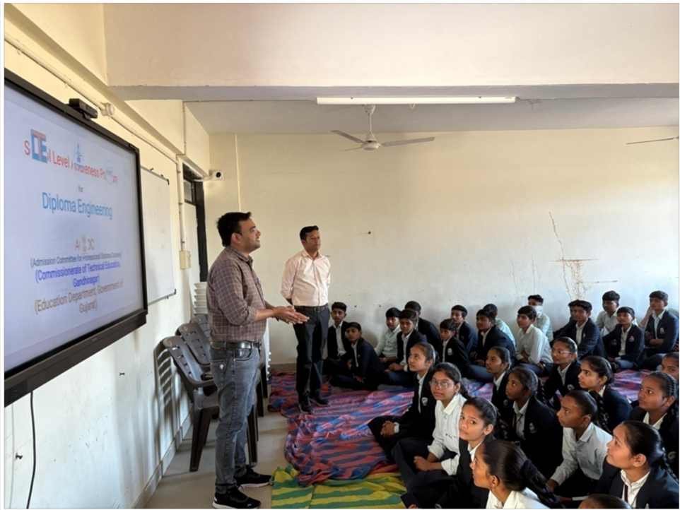

Figure 2.2.5.11 ACPDC awareness program

2.2.6 Information Access Facilities and Student Centric Learning Initiatives (15)

A. Availability of facilities &amp; Effective Utilization; specify the facilities, materials and scope for self-learning, Webinars, NPTEL Podcast, MOOCs etc (10)

## List of available information access facilities

- The Institute provides 24 × 7 internet connectivity to support studentsÕ academic and research activities.
- The Government of Gujarat has distributed tablets to students at a subsidized cost of ₹ 1000, enabling them to leverage modern technology and enhance their technical knowledge.
- The college offers access to the National Digital Library of India (NDLI), a vast digital repository developed by IIT Kharagpur under the Ministry of Education.
- The Institute website functions as the official digital platform, providing comprehensive and up-to-date information about the college.
- The Department website provides detailed information on faculty profiles, curriculum, laboratory facilities, events, and academic activities.
- The Department ensures 24 × 7 access to academic resources through a systematically organized Google Drive repository.
- The Department regularly organizes expert lectures and industrial visits to familiarize students with real-world applications and current industry practices.
- During the COVID-19 period, the Government of Gujarat provided students with Microsoft Teams accounts and Office 365 subscriptions to facilitate online learning.
- Faculty members utilize Google Classroom to share lecture materials, assignments, quizzes, and important announcements, ensuring effective communication, timely feedback, and an enhanced teachingÐlearning process.
- An induction program is conducted for first-year students to orient them to the academic environment, institutional facilities, and support systems.
- The students also have wired connectivity of internet in each lab. Sufficient LAN ports are available in all labs.
- A projector is setup along with screen in room no 009 and 011. This is helpful in teaching learning process and project presentation for the students.
- The department has a movable projector available for setting up ICT-based learning in several classrooms.

Institute Marks

15.00

Institute Marks

10.00

Figure: 2.2.6.1 Multimedia Classroom

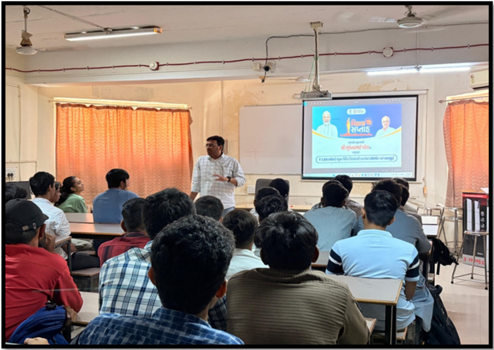

- ¥  The Government of Gujarat has provided Tablets to the students at a cost of Rs. 1000. So that students could take lever age of todayÕs technological trends and add some more knowledge into their technical database.
- ¥  Under the Namo E-Tablet Scheme, Gujarat Government offers subsidized tablets (Acer/Lenovo) to first-year college and polytechnic students from financially weaker backgrounds (annual income ≤ ₹ 1 lakh). Students pay a token fee of ₹ 1,000 for a device valued around ₹ 8Ð9 k, preloaded with educational content. Though ₹ 200 crore was budgeted to reach ~3 lakh students, no tablets have been distributed in the last three years.

## Government Polytechnic, Palanpur

## Tablet distribution-2017

| Sr. No   | EC   | IC   |   CIVIL |   MECHANICAL |   ELECTRICAL |   Total |
|----------|------|------|---------|--------------|--------------|---------|
|          |      |      |      70 |          103 |           52 |     234 |

## Government Polytechnic, Palanpur

## Tablet distribution-2018

| Sr.No   | EC   | IC   |   CIVIL |   MECHANICAL |   ELECTRICAL |   Total |
|---------|------|------|---------|--------------|--------------|---------|
|         |      |      |      77 |          102 |           76 |     260 |

## Government Polytechnic, Palanpur

## Tablet distribution -2019

|   EC | IC   |   CIVIL |   MECHANICAL |   ELECTRICAL |   Total |
|------|------|---------|--------------|--------------|---------|
|   17 |      |      97 |           58 |           42 |     217 |

## Figure: 2.2.6.2 Tablet distribute to students copy

- The Government of Gujarat has facilitated digital education by providing Microsoft Teams accounts and Office 365 subscriptions to faculty and students. This initiative supports seamless online teaching, learning.
- Faculty members can now conduct live classes, share study materials, and interact with students more efficiently during COVID time. And no teaching suffers during pandemic. It has enhanced the overall accessibility and effectiveness of digital education in the institute.
- All the teaching and learning data is available with faculty members through Microsoft Teams. This includes lecture recordings, study materials, assignments, and student attendance records. It helps ensure organized and efficient academic management.

Figure: 2.2.6.3 Sample of registration details of MS Team credential

| FirstName    | LastName   | DisplayName                    | UserPrincipalName                                                       | Department Title   | Department Title                                     | MobilePhone                                          | MobilePhone   | UsageLocation AccountSkuld                | Password   | state country city             | office   |
|--------------|------------|--------------------------------|-------------------------------------------------------------------------|--------------------|------------------------------------------------------|------------------------------------------------------|---------------|-------------------------------------------|------------|--------------------------------|----------|
| ASHWINSINH   | DABHI      | ASHWINSINH DABHI               | 19626o311002@gppalanpur onmicrosoft com                                 | EC_2019            | ST_regular reseller-account:STANDARDWOFFPACK_STUDENT | ST_regular reseller-account:STANDARDWOFFPACK_STUDENT | IN            | reseller-account:STANDARDWOFFPACK_STUDENT | EcJ94583   | Palanpur_Gujarat Al            |          |
| KHUSHBU      | GARASIYA   | KHUSHBU GARASIYA               | 196260311003@gppalanpur.onmicrosoft.com                                 | EC 2019            | ST_regular                                           | ST_regular                                           | 6356251075 IN | reseller-account:STANDARDWOFFPACK STUDENT | NoD84702   | Palanpur_Gujarat Al            |          |
| KAILASHKUMAR | JOSHI      | KAILASHKUMAR JOSHI             | 196260311004@gppalanpur onmicrosoft com                                 | EC_2019            | ST_regular                                           | ST_regular                                           | 8141973318 IN | reseller-account:STANDARDWOFFPACK_STUDENT |            | WmP85071 Palanpur_Gujarat   Al |          |
| CHHAYANK     | MEVADA     | CHHAYANK MEVADA                | 196260311005@gppalanpur onmicrosoft.com EC 2019                         |                    | ST_regular                                           | ST_regular                                           | 9328231687 IN | reseller-account:STANDARDWOFFPACK STUDENT | VnW31027   | Palanpur_Gujarat Al            |          |
| DARSHILKUMAR | MODI       | DARSHILKUMAR MODI              | 196260311006@gppalanpur onmicrosoft.com EC 2019                         |                    | ST_regular                                           | ST_regular                                           | 8780215685 IN | reseller-account:STANDARDWOFFPACK_STUDENT | SnQ97174   | Palanpur_Gujarat               |          |
| TIRTH        | PANCHAL    | TIRTH PANCHAL                  | 196260311008@gppalanpur onmicrosoft.com EC 2019                         |                    | ST_regular                                           | ST_regular                                           | 9510209937 IN | reseller-account:STANDARDWOFFPACK STUDENT | Kux82162   | Palanpur_Gujarat               |          |
| LAYRAJ       | PARMAR     | LAYRAJ PARMAR                  | 19626o311010@gppalanpur.onmicrosoft.com EC_2019                         |                    | ST_regular                                           | ST_regular                                           | 8511866599 IN | reseller-account:STANDARDWOFFPACK_STUDENT | VfP76169   | Palanpur_Gujarat               |          |
| KHUSHIBEN    | PATEL      | KHUSHIBEN PATEL                | 196260311011@gppalanpur onmicrosoft.com EC 2019                         |                    | ST_regular                                           | ST_regular                                           | 9328864396 IN | reseller-account:STANDARDWOFFPACK STUDENT | VuN35422   | Palanpur_Gujarat               |          |
| AKSHITKUMAR  | PRAJAPATI  |                                | AKSHITKUMAR PRAJAPATI   196260311012@gppalanpur onmicrosoft com EC_2019 |                    | ST_regular                                           | ST_regular                                           | 6352030854 IN | reseller-account:STANDARDWOFFPACK_STUDENT | YbL94725   | Palanpur_Gujarat               |          |
| ROHIT        | PRAJAPATI  | ROHIT PRAJAPATI                | 196260311013@gppalanpur onmicrosoft com EC_2019                         |                    | ST_regular                                           | ST_regular                                           | 9484400133 IN | reseller-account:STANDARDWOFFPACK_STUDENT | 0m017932   | Palanpur_Gujarat               |          |
| BHAVIK       | RAJPUT     | BHAVIK RAJPUT                  | 196260311014@gppalanpur onmicrosoft.com EC 2019                         |                    | ST_regular                                           | ST_regular                                           | 8160596361 IN | reseller-account:STANDARDWOFFPACK STUDENT | AgN22244   | Palanpur_Gujarat               |          |
| YUVRAJSINH   | RAJPUT     | YUVRAJSINH RAJPUT              | 196260311015@gppalanpur onmicrosoft.com EC 2019                         |                    | ST_regular                                           | ST_regular                                           | 8160664564 IN | reseller-account:STANDARDWOFFPACK_STUDENT |            | WmA96776 Palanpur_Gujarat      |          |
| ANAS         | UMATIYA    | ANAS UMATIYA                   | 196260311016@gppalanpur.onmicrosoft.com EC 2019                         |                    | ST_regular                                           | ST_regular                                           | 7043030244    | reseller-account:STANDARDWOFFPACK STUDENT | TbE44117   | Palanpur_Gujarat               |          |
| NITESHBHAI   |            | CHAUDHARI NITESHBHAI CHAUDHARI | 196260311502@gppalanpur onmicrosoft.com EC 2019                         |                    | ST_regular                                           | ST_regular                                           | 7383161793 IN | reseller-account:STANDARDWOFFPACK_STUDENT | NhJ28029   | Palanpur_Gujarat               |          |
| BHARGAVKUMAR | DAMOR      | BHARGAVKUMAR DAMOR             | 196260311503@gppalanpur.onmicrosoft.com EC 2019                         |                    | ST_regular                                           | ST_regular                                           | 7984808433 IN | reseller-account:STANDARDWOFFPACK STUDENT | HzH95190   | Palanpur_Gujarat               |          |
| HETALKUMARI  | PATEL      | HETALKUMARI PATEL              | 196260311504@gppalanpur onmicrosoft com EC 2019                         |                    | ST_regular                                           | ST_regular                                           | 7203037190 IN | reseller-account:STANDARDWOFFPACK_STUDENT | AnF66552   | Palanpur_Gujarat               |          |
| NIRAVBHAI    | SOLANKI    | NIRAVBHAI SOLANKI              | 196260311505@gppalanpur onmicrosoft.com EC 2019                         |                    | ST_regular                                           | ST_regular                                           | 9726745691 IN | reseller-account:STANDARDWOFFPACK STUDENT | UrG45695   | Palanpur_Gujarat               |          |
| Nirajkumar   | Prajapati  | Nirajkumar Prajapati           | 18626o3110o2@gppalanpur onmicrosoft com EC_2018                         |                    | ST_regular                                           | ST_regular                                           | 7043848309 IN | reseller-account:STANDARDWOFFPACK_STUDENT | YqT39329   | Palanpur_Gujarat               |          |
| Arunkumar    | Patel      | Arunkumar Patel                | 176260311001@gppalanpur onmicrosoft.com EC 2017                         |                    | ST_regular                                           | ST_regular                                           | 6352165925 IN | reseller-account:STANDARDWOFFPACK STUDENT | BrQ29887   | Palanpur_Gujarat Al            |          |

## Institute Library Ð EC Department Collection:

- Apart from NDLI access, the institute library houses a dedicated collection of over 102 books related to Electronics and Communication Engineering.
- These include textbooks, reference books, manuals, and competitive exam materials covering key areas like analog &amp; digital electronics, communication systems, microprocessors, VLSI, and embedded systems.
- The library supports studentsÕ academic, project, and research needs, and provides a quiet environment for self-study and knowledge enhancement.
- Students issue books from the institute library as per their academic requirements. Records of both book issuance and return are systematically maintained in the library.

A sample copy of the record format is available for reference. This helps in ensuring proper tracking and management of library resources

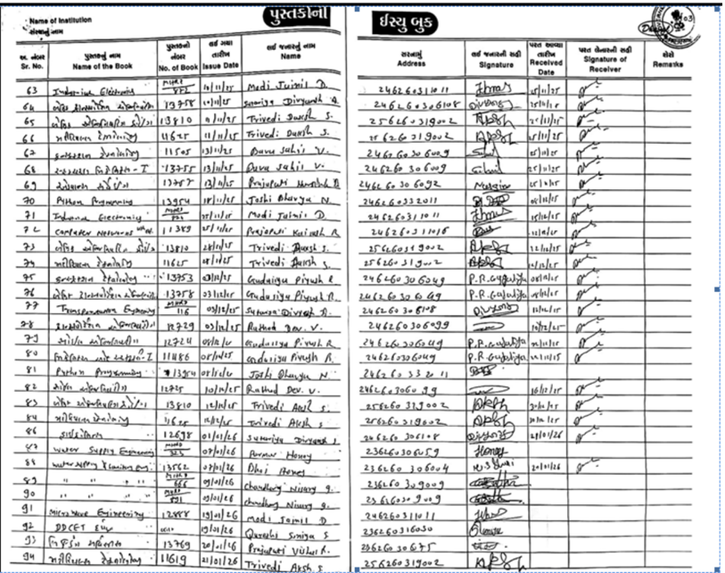

|    |    |      | Gs   | Gs   | Gs   | Gs   | Gs   |
|----|----|------|------|------|------|------|------|
|    |    | Namo |      |      |      |      |      |
| 5  | @l |      |      |      |      |      |      |

EC Department Library:

Figure: 2.2.6.4 A sample copy of the Library book issue return record

- This departmental library functions as a readily accessible academic resource center for both students and faculty, facilitating focused learning and providing convenient, department-level academic support..
- In addition to the central and departmental libraries, the institute provides online access to study materials for all subjects of the Electronics and Communication (EC) Department through the Learning Resources tab on the institute website, as mentioned below:https://www.gppalanpur.ac.in/posts/en/resources/study-materials/11-ec

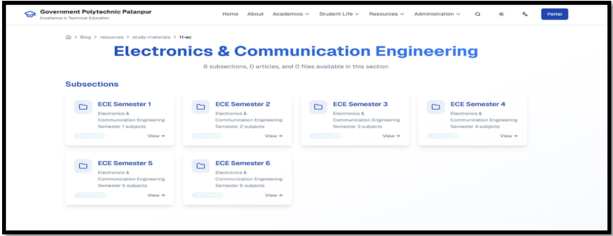

Figure: 2.2.6.5 Institute website

- The department website offers detailed information about the departmentÕs faculty, curriculum, lab facilities, events, and academic activities. It supports students by providing learning materials, project guidance, and updates related to departmental achievements.

The department website Link: https://ec.gppalanpur.in/

## SPECTRUM

## Parents Meeting; March 2025

By milav dabgar March 29, 2025

READ MORE

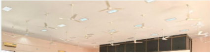

GPP EC

## Spectrum

Home Spectrum

## SPECTRUM

## EC Department Individual Student Results

By milav dabgar March 28,2025

Semester 1, Academic Year 2024-2025 Student Performance Summary Rank Student Name Enrollment ID SPI CPI Result Backlogs 1 MALI BHAVIN .

READ MORE

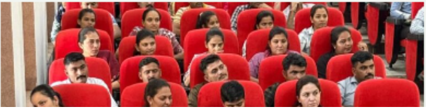

Figure: 2.2.6.6 Department website

## Google Drive-Based Learning Material Access

- The department provides students with 24x7 access to academic resources through a well-organized Google Drive repository. This includes lecture notes, lab manuals, previous year question papers, assignments, and reference materials, arranged semester and subject-wise.
- The facility supports self-learning and ensures students can conveniently access study materials anytime, enhancing the overall learning experience.
- Students can conveniently access the study materials stored in Google Drive by scanning the provided QR code, which directs them to the digital repository for quick and easy reference.
- Students can conveniently access the study materials stored in Google Drive by scanning the provided QR code, which directs them to the digital repository for quick and easy reference.

About

FAQ

Contact

## SPECTRUM

## Academic Performance Report March 2025

By milav dabgar March 28, 2025

Executive Summary This report presents an analysis of the examination results for students in the Electronics and Communication Engineering Department .

READ MORE

Figure: 2.2.6. 7 Google Drive-Based Learning Material Access QR code is available on notice board

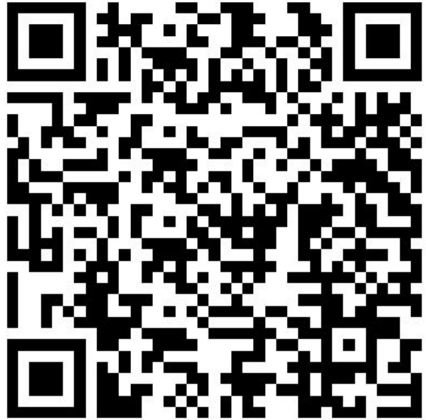

- The department regularly organizes expert lectures by industry professionals and academic experts to enhance students technical knowledge and exposure. Industrial visits are also arranged to help students understand real-world applications and industry practices related to their field of study

## List of E resources available

- Students are informed regarding NPTEL/SWAYAM portal for different MOOC training in engineering. Now, GTU has introduced MOOC credit program in sem-4 and sem-5 in NEP based syllabus. An introductory lecture is organized to make students aware of NPTEL website,
- Google classroom
- Microsoft Team
- Faculty members use Google Classroom to share lecture notes, assignments, quizzes, and important updates with students. It enables smooth communication, timely feedback, and enhances the overall teaching-learning process.

Figure: 2.2.6.8 Usage of Google classroom created for students

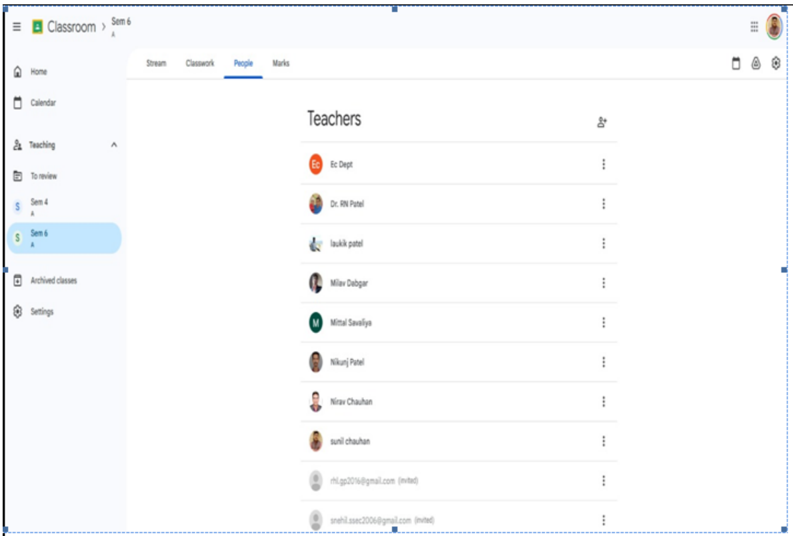

The Government of Gujarat has provided Microsoft Teams accounts and Office 365 subscriptions to all diploma institute faculties during the COVID-19 pandemic.

This initiative aimed to support uninterrupted online teaching and learning. Faculties can now effectively conduct virtual classes, share study materials, and collaborate with students in real time. The use of Office 365 tools has enhanced productivity and streamlined academic communication

Figure: 2.2.6.9 MS Team used by faculties of E.C. Department

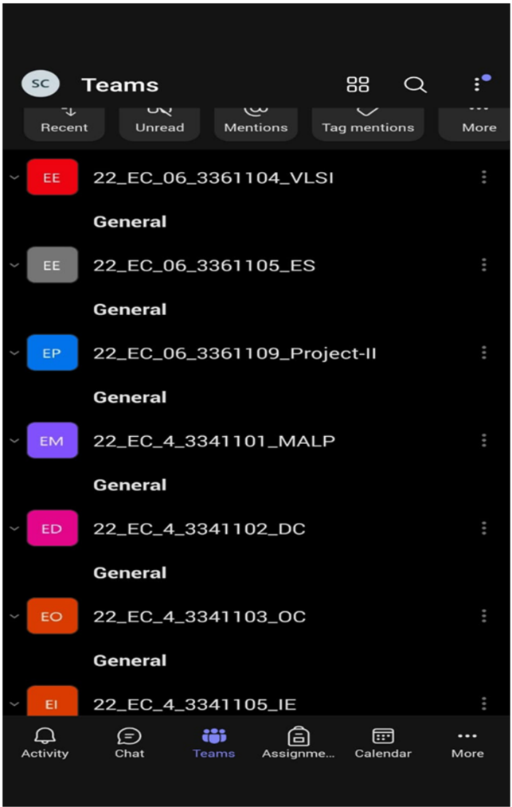

- Data related to lectures and lab sessions are maintained by the respective faculty members. This includes records of topics covered, attendance, and practical performance. Such documentation helps ensure proper academic monitoring and compliance.
- The department conducts a bridge course for lateral entry students (from Certificate to Diploma) to strengthen their fundamental knowledge and bridge curriculum gaps. The course covers essential topics in mathematics, basic sciences, and core engineering subjects, ensuring a smooth academic transition and better classroom engagement
- GTU has introduced a MOOC credit program in Semester 4 and Semester 5 under the NEP-based syllabus, which will be implemented from the next academic year. This program allows students to earn academic credits through online courses offered by recognized platforms.
- It aims to promote flexible, self-paced, and industry-relevant learning. A sample copy of the MOOC credit course details is attached for reference.Gujarat Technological University  website of GTU

|            |             |        |                                  |               |      | Hours   | Max Marks   |     |
|------------|-------------|--------|----------------------------------|---------------|------|---------|-------------|-----|
| subeode    | Braneh cede |        | subiestame                       | Categery      | Near |         |             |     |
|            |             | Jan-25 |                                  |               |      | NA      | 100         |     |
| noc25_cs11 |             | Jan-25 | Cloud Compuring                  |               |      | NA      | 100         | 10o |
| noc25      |             | Jan-25 |                                  | MOPEC Oi(Ooc) |      | NA      | 10o         |     |
|            |             |        | Graphics and Arimaon Development | MOPEC         |      | NA      | 100         | 10o |
|            |             | Juk24  | Entrepreneurship Development     |               |      | NA      |             | 10o |

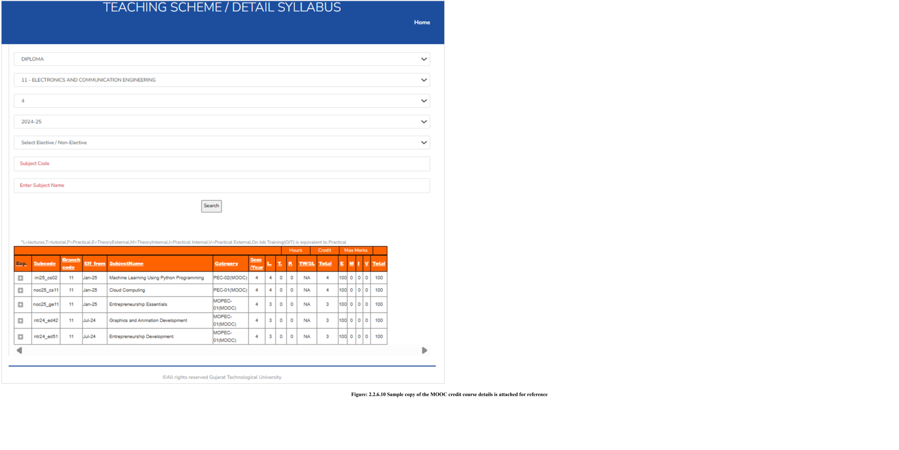

## B. Student Centric Learning Initiatives &amp; Effective Implementation (5)

Institute Marks

5.00

- Student Centric Learning focuses on empowering students to take an active role in education.
- Student Centric Learning is a worldwide popular teaching methodology which provides a thorough understanding of the concepts and process through active learning and co-operative participation.
- The project and problem-based learning is one kind of student centric learning which gives spark to the studentsÕ lateral thinking and promotes real application of the experiments in their fields of engineering.
- We are using various methods to raise the interest of students in the courses and technical events. We adapt various learning methods in classroom, like
1. Presentations
2. Seminar/WORKSHOP
3. Industrial Visit
4. You tube
5. National Digital library
6. E-Books (AICTE E Kumbh portal)
7. Induction program
8. Skilling Program
- Students present project or topic-based PPTs to improve communication, subject understanding, peer learning, and confidence
- Seminars and workshops by industry and academic experts enhance studentsÕ technical knowledge, soft skills, and link classroom learning with real-world applications.
- Industrial visits give students practical exposure to industry practices, technologies, and workflows, bridging classroom learning with real applications. Reports with details, participation, and observations are maintained for academic records.
- Faculty share subject-related YouTube links to support self-learning and revision. A department faculty has created playlists on C Programming and DC Circuits, shared via Google Classroom and WhatsApp for easy access.
- Our college provides access to the National Digital Library of India (NDLI), offering books, journals, videos, and exam materials. Students use it to enhance knowledge, support research, and promote self-learning.

Figure: 2.2.6.11 Students present their project presentation in class.

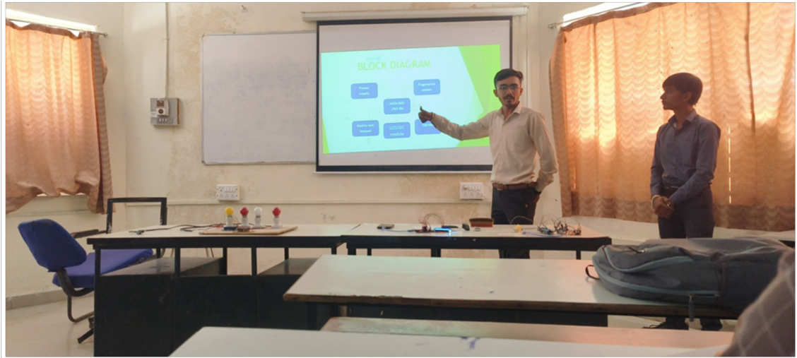

Figure: 2.2.6.12 Workshop organized by the department

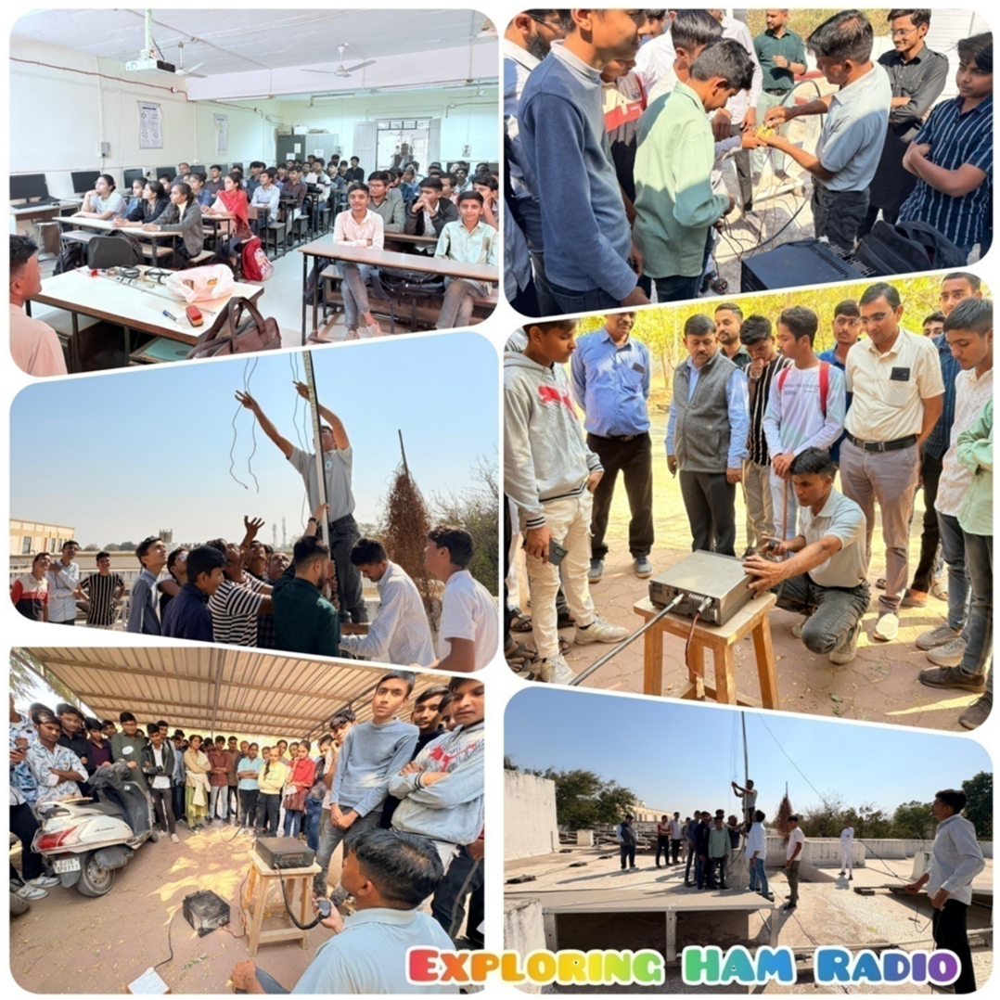

Figure: 2.2.6. 13 Sample photographs of industrial visit

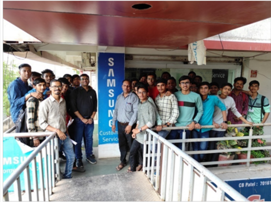

Figure: 2.2.6.14 Sample copy of you tube channel

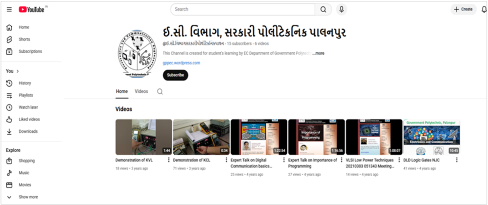

## Your Institute Government Polytechnic, Palanpur is now is now a part of the NDLI Club

Dear Kinjal,

The request of Government Polytechnic, Palanpur to set up NDLI Club at the institute has been approved. All interested students, faculty members and employees of Government Polytechnic, Palanpur can now enroll themselves as members of Government Polytechnic, Palanpur NDLI Club, using the passkey given below:

Passkey: 31c231de-e678-4046-b3bf - dcSea1b7e397

R OALABHAI

DaBHI

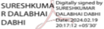

Club Registration Number : INGJNCRA7DAWSDV

You are requested to share the Passkey with all your students, faculty members and employees via e-mail and advise them to visit themselves as member of the NDLI Club using their e-mail id and the Passkey: You may also take a printout of the enclosed document and Daste it on

Scanned by CamScanner

Figure: 2.2.6.15 Copy of N DLI club registration

AICTE e-Kumbh promotes digital learning by offering online resources, webinars, and expert sessions to enhance technical knowledge and industry readiness. Students are encouraged to use the platform and actively benefit from its resources for academic growth

Figure: 2.2.6.16 Students use e-resources on AICTE e-Kumbh platform by using their credentials

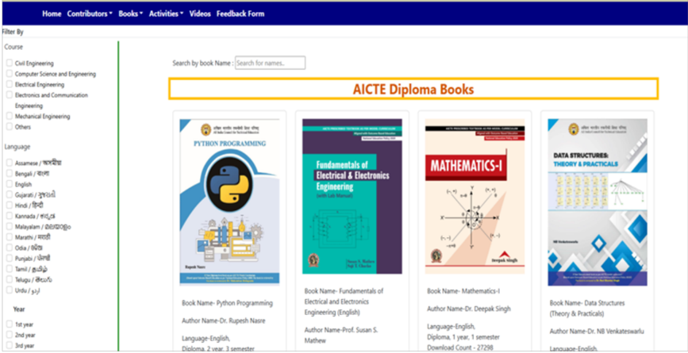

- As per GTU guidelines, the department conducts a two-week induction program for first-year students with sessions on values, communication, arts, technical awareness, and expert talks. It helps students adapt to college life, build confidence, and understand departmental activities. Records of the program are well maintained.
- The KCG Education DepartmentÕs Finishing School, launched in 2016-17, delivers 80/40 hours of skill-enhancement trainingÑstructured across four modulesÑthat empower final-year college students with life skills, employability skills, and spoken English proficiency to boost their industry readiness.

Figure: 2.2.6.17 Sample Time table of induction program

| Government Polytechnic Palanpur (626) Induction/Orientation Programme (For First Ycar Students (Admission Ycar-2025)   | Government Polytechnic Palanpur (626) Induction/Orientation Programme (For First Ycar Students (Admission Ycar-2025)   | Government Polytechnic Palanpur (626) Induction/Orientation Programme (For First Ycar Students (Admission Ycar-2025)   | Government Polytechnic Palanpur (626) Induction/Orientation Programme (For First Ycar Students (Admission Ycar-2025)   | Government Polytechnic Palanpur (626) Induction/Orientation Programme (For First Ycar Students (Admission Ycar-2025)   | Government Polytechnic Palanpur (626) Induction/Orientation Programme (For First Ycar Students (Admission Ycar-2025)   | Government Polytechnic Palanpur (626) Induction/Orientation Programme (For First Ycar Students (Admission Ycar-2025)   |
|------------------------------------------------------------------------------------------------------------------------|------------------------------------------------------------------------------------------------------------------------|------------------------------------------------------------------------------------------------------------------------|------------------------------------------------------------------------------------------------------------------------|------------------------------------------------------------------------------------------------------------------------|------------------------------------------------------------------------------------------------------------------------|------------------------------------------------------------------------------------------------------------------------|
| Duration Of Programmc: 24-07-2025 TO 06-08-2025) ((2 Wccks)                                                            | Duration Of Programmc: 24-07-2025 TO 06-08-2025) ((2 Wccks)                                                            | Duration Of Programmc: 24-07-2025 TO 06-08-2025) ((2 Wccks)                                                            | Duration Of Programmc: 24-07-2025 TO 06-08-2025) ((2 Wccks)                                                            | Duration Of Programmc: 24-07-2025 TO 06-08-2025) ((2 Wccks)                                                            | Duration Of Programmc: 24-07-2025 TO 06-08-2025) ((2 Wccks)                                                            | Duration Of Programmc: 24-07-2025 TO 06-08-2025) ((2 Wccks)                                                            |
| Wcck-1                                                                                                                 | Wcck-1                                                                                                                 | Wcck-1                                                                                                                 | Wcck-1                                                                                                                 | Wcck-1                                                                                                                 | Wcck-1                                                                                                                 | Wcck-1                                                                                                                 |
|                                                                                                                        | ProcrammcScssion Coordinator(s)                                                                                        |                                                                                                                        | Prorramme Session Dctails                                                                                              |                                                                                                                        | Venuc                                                                                                                  |                                                                                                                        |
|                                                                                                                        | Shri PK Bhavsar                                                                                                        | Scminar Hell                                                                                                           | 81                                                                                                                     |                                                                                                                        |                                                                                                                        |                                                                                                                        |
|                                                                                                                        | Shr P KBhavsar                                                                                                         |                                                                                                                        | 81                                                                                                                     |                                                                                                                        |                                                                                                                        |                                                                                                                        |
|                                                                                                                        | Shn T.D Modi                                                                                                           | Scmninar Hall                                                                                                          | 81                                                                                                                     |                                                                                                                        |                                                                                                                        |                                                                                                                        |
|                                                                                                                        | Tcam                                                                                                                   | Scminar Hell                                                                                                           | 81                                                                                                                     |                                                                                                                        | Accomndation                                                                                                           |                                                                                                                        |
|                                                                                                                        |                                                                                                                        |                                                                                                                        | 81                                                                                                                     | ME(KPDPD)                                                                                                              | Arca                                                                                                                   |                                                                                                                        |
|                                                                                                                        |                                                                                                                        | Scminsr Hsll                                                                                                           |                                                                                                                        | ME(KPDPD)                                                                                                              |                                                                                                                        |                                                                                                                        |
| 26725 &2u725                                                                                                           | 26725 &2u725                                                                                                           | 26725 &2u725                                                                                                           | 26725 &2u725                                                                                                           | 26725 &2u725                                                                                                           | 26725 &2u725                                                                                                           | 26725 &2u725                                                                                                           |
|                                                                                                                        |                                                                                                                        |                                                                                                                        |                                                                                                                        | ME(KPDPD)                                                                                                              |                                                                                                                        |                                                                                                                        |

| Batch  N o.   | Training Date   | Training Date   | Component N umber   | Training Hours   | Total    | N ame of Trainer   |
|---------------|-----------------|-----------------|---------------------|------------------|----------|--------------------|
|               | From            | To              |                     |                  | Students |                    |
| 1/2022-2023   | 06-FEB-2023     | 03-MAR- 2023    | ALL SETs            | 80               | 06       | Mr. ANAND VYAS &   |

3/2023-2024

6/2025-2026

19-FEB-2024

15-SEPT-

16-MAR-

2024

26-SEPT-

2025

2025

ALL SETs

40

7

Ms URJA JOSHI

Mr Divyang Gor

&amp;

Ms Kuntal Gor

Mr Divyang Gor

## 2.2.7 New Initiatives for embedding Professional Skills (15)

## A. Employability skill enhancement Initiatives and effective implementation (8)

## Institute Marks

15.00

Institute Marks

8.00

The Department of Electronics and Communication Engineering at Government Polytechnic, Palanpur places a strong emphasis on developing professional competence and employability skills among diploma students. This is achieved through systematic initiatives such as Placement Fairs, career guidance and counseling provided through mentors and the Training and Placement Office (TPO), as well as industry exposure through Industrial Visits and Expert Lectures.

## 1. Placement Fairs (Job Fairs)

The institute, in collaboration with the Education Department and the Knowledge Consortium of Gujarat (KCG), organized mega placement camps providing state-level opportunities for diploma students.

- 10 th March 2023, GP Palanpur - 5 EC students participated
- 11 th March 2024, DNP Arts, Deesa - 5 EC student participated
- 25 th February 2025, GP Palanpur - 7 EC students participated.

These initiatives have provided students with real interview exposure and direct interaction with industries, while companies appreciated the discipline and technical competence of students.

## 2. Career guidance and counseling- Mentors and TPO Cell:

The EC Department facilitates career guidance and counseling through mentors and the TPO Cell by conducting expert talks, workshops, and employability-focused training sessions.

- Workshops on HAM Radio, Drone Technologies etc.
- Expert Lectures on Career Guidance For EC Engineers by Mr. Krishna Panchal
- Soft Skills sessions under Finishing School, KCG.

These initiatives improved communication skills, professional awareness, and prepared students for higher studies and entrepreneurship.

## 3. Industrial Visits &amp; Expert Lectures:

## Industrial Visit details:

## Year 2023-24

|   Sr. N o. | Date       | N ame of Industry                       | Semesters   |   N o. of Participants | N ame of Faculty                   |
|------------|------------|-----------------------------------------|-------------|------------------------|------------------------------------|
|          1 | 04/05/2023 | SAMSU N G SERVICE CE N TRE, PALA N PUR  | 2 &4        |                     19 | Mr. S P Joshiara & Dr. R  N  Patel |
|          2 | 10/05/2023 | COMMU N ITY RADIO STATIO N , PALA N PUR | 4           |                     11 | Mr. S J Chauhan & Mr. M J Dabgar   |
|          3 | 01/08/2023 | BAJARA N G PAPERP RODUCTS, PALA N PUR   | 1           |                      7 | Mr. S J Chauhan & Mr. M J Dabgar   |

ALL SETs

80

05

## Table: 2.2.6.1 KCG Finishing School details

4

5

Sr.

N

o.

1

2

3

4

16/03/2024

16/03/2024

Date

02/08/2024

25/09/2024

05/10/2024

16/10/2024

Date

05/08/2025

20/09/2025

ame of Industry

N

COMMU

N

ITY RADIO

STATIO

N

, PALA

N

PUR

N

ETRAM (Command and

Control Centre) Palanpur

COMMU

N

ITY RADIO

17/11/2025

STATIO

N

, PALA

N

PUR

PCB POWER PVT LTD,

GA

DHI

AGAR

N

N

MCBS PVT LTD,

GA

DHI

AGAR

N

N

N

ame of Industry

BAJARA

2,4,6

2,4,6

Year 2024-25

Semesters

G PAPERP RODUCTS,

N

PALA

PUR

N

RAILWAY STATIO

N

PALA

PUR

N

BA

AS DAIRY

N

COMMU

ITY RADIO STATIO

N

N

PALA

,

4

PUR

N

Y ear 2025-26

Semesters

1

3,5

3

,

1

3,5

3,5

N

14

14

N

o. of

Participants

13

12

10

7

o. of Participants

6

12

6

Mr. L K Patel, Mr.

J

N

Chauhan, Ms. M K

Pedhadiya

Mr. L K Patel, Mr.

J

N

Chauhan, Ms. M K

Pedhadiya

N

ame of Faculty

Mr. M J Dabgar

Mr.

J Chauhan, Ms.

N

M K Pedhadiya

Dr. R

Patel, MJD,

N

Mr. S P Joshiara

Dr. R

Patel, Mr. S P

N

Joshiara

N

ame of Faculty

R C Parmar, Mr.

N

J

Chauhan

Mr. M J Dabgar &amp;, S

PJoshiara

Mr. L K Patel, Ms. M K

Pedhadiya

## Table 2.2.7.1 Industrial Visit details

Expert Lecture details:

| Sr. No   | Topic                                     | Name of Expert    | ExpertÕs Designation     | ExpertÕs institute/Company   | Date       |   No Of beneficiary students |
|----------|-------------------------------------------|-------------------|--------------------------|------------------------------|------------|------------------------------|
| 1        | NAVIC and its applications                | Dr. Mehul kumar   | Lecturer PhD EC          | GGP Surat                    | 01-29-2022 |                           29 |
|          | Future of Electronics in industries       | Mr. Prakash Darji | Design Engineer BE EC    | Google Banglore              | 06-08-2022 |                           41 |
|          | Importance of Communication in industries | Mr. Jaimin Rami   | Station Controller ME EC | JMRC Ahmedabad               | 08-09-2022 |                            8 |

|         | Cyber Security                               | Mr. Sagar Hajare      | Security Expert                 | Bank of America                         | 03-31-2023   | 35      |
|---------|----------------------------------------------|-----------------------|---------------------------------|-----------------------------------------|--------------|---------|
| 2023-24 | 2023-24                                      | 2023-24               | 2023-24                         | 2023-24                                 | 2023-24      | 2023-24 |
| 1       | Fabrication of Solar Cell                    | Mr. Sandip Joshi      | Jr. Engineer Diploma EC         | Adani Power Ltd.                        | 10-18-2023   | 7       |
| 2       | Embedded System                              | MR. VISHAL VADHER     | AAST. MANAGER TRAININGB.E.E.C.  | SOFCON INDIAPVT LTD                     | 03-13-2024   | 45      |
| 3       | Web development technologies                 | MR. VISHAL VADHER     | AAST. MANAGER TRAINING B.E.E.C. | SOFCON INDIAPVT LTD                     | 03-13-2024   | 45      |
| 2024-25 | 2024-25                                      | 2024-25               | 2024-25                         | 2024-25                                 | 2024-25      | 2024-25 |
| 1       | AI-ML: A NEW ERA OF FUTURE                   | MR. VISHAL VADHER     | AAST. MANAGER TRAININGB.E.E.C.  | SOFCON INDIAPVT LTD                     | 09-30-2024   | 42      |
| 2       | INTERNET OF THINGS                           | DR. V K THAKAR        | DEAN INDRASHILUNIVERSITYPH.D.   | INDRASHILUNIVERSITY                     | 10-22-2024   | 49      |
| 3       | CAREER GUIDANCE FOR ECENGINEERS              | MR. KRISHNA PANCHAL   | ASSOCIATEENGINEERB.E.E.C.       | E-INFOCHIPS                             | 11-10-2024   | 23      |
| 4       | HAM Radio Workshop                           | Mr. N. B. Nadoda      | Senior Lecturer                 | GGP, Ahmedabad                          | 02-14-2025   | 31      |
| 5       | Drone Technologies                           | Mr. Yuvrajsinh Rajput | CEO                             | Bee-Robokids Academy, Palanpur          | 02-15-2025   | 36      |
| 2025-26 | 2025-26                                      | 2025-26               | 2025-26                         | 2025-26                                 | 2025-26      | 2025-26 |
| 1       | Cyber Crime Awareness                        | Mr. Manish S Chauhan  | Assistant Professor             | GEC Modasa                              | 09-12-2025   | 35      |
| 2       | IoT Applications with NodeMCU & Raspberry Pi | Mr. Rishabh Prajapati | Co-Founder                      | Bee-Robokids Innovation Private Limited | 10-07-2025   | 15      |

## Table 2.2.7.2 Expert Lecture details

## Comprehensive Employability and Soft Skills Training Initiative

- Wadhwani Foundation Skilling Program was offered to students for gaining essential skills in ideation, prototyping, business modelling, and financial planning . The program focused on communication skills, job readiness, and entrepreneurship.

Meetul Patel

President

Wadhwani Global Entrepreneur

## CERTIFICATE OF PARTICIPATION

This is to certify that

Jainilkumar Modi has successfully participated in the

Venture Idea on September

Ignite Bootcamp

Development

23, 2025

gaining essential skills in ideation; prototyping; business modeling; and financial planning:

This certificate recognises their commitment to learning and ability to drive innovation and impact.

This certificate confirms the completion of 10 hours of training

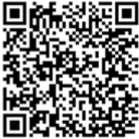

Figure: 2.2.7.1 Sample Student Certificate from Wadhwani Foundation

- Such value-added programs are organized every year to support studentsÕ overall development. These initiatives help bridge the gap between academics and industry expectations. After completion of course they provide certificate.

## B. Personality development related Initiatives &amp; effective implementation (7)

Institute Marks

7.00

The Department of Electronics and Communication Engineering at Government Polytechnic, Palanpur emphasizes the holistic development of students by strengthening their personality, communication, and life skills. These initiatives aim to prepare diploma students to face challenges with confidence, adaptability, and professionalism. The activities are implemented through structured programs and collaborations as detailed below:

## 1.Finishing School Programme

The institute, in collaboration with the Education Department and Knowledge Consortium of Gujarat (KCG), has successfully implemented the Finishing School Programme for final year students.

- Duration: 80/40 hours
- Focus Areas: Life skills, employability skills, functional English, and personality development.
- Outcome: Students developed self-confidence, communication ability, and professional etiquette, which enabled them to perform better in interviews and workplace environments.

## 2.Training &amp; Placement (T&amp;P) Cell Activities

The T&amp;P Cell of the institute plays a vital role in the overall personality development of EC students.

- Resume &amp; LinkedIn Profile creation.
- Placement fair conduction every year under KCG.
- Students are trained to handle stress, demonstrate leadership, and improve interpersonal skills.
- Industrial Visits and Expert Lectures conduction in collaboration with departments.

3.Value-Added Personality Development Programs

Sr.

N

1

- Wadhwani Foundation Skilling Program: Focused on communication, job readiness, and entrepreneurship skills. Certificates are awarded upon completion.
- Expert Lectures &amp; Workshops: Topics covered include soft skills for job interviews, career opportunities, teamwork, and leadership.

## Outcomes of Personality Development Initiatives

- Improved communication skills and self-confidence among students.
- Enhanced ability to face interviews and interact with industry professionals.
- Positive attitude, leadership qualities, and teamwork capabilities.
- Better adaptability to changing industry demands and lifelong learning orientation.
- Stronger alignment of academic learning with professional personality requirements.

## 2.2.8 Co-curricular &amp; Extra Curricular Activities (10)

## Co-curricular Activities

The Electronics &amp; Communication Engineering Department at Government Polytechnic, Palanpur conducts a variety of co-curricular activities to enhance technical competence, industry exposure, and practical learning among students.

- The Institute organizes Department Level Project Exhibitions New Palanpur for New India event) to showcase innovative ideas and practical solutions developed by students.
- Regular Expert Lectures and Seminars are conducted by industry experts and academicians to bridge the gap between academics and industry practices.
- Industrial Visits are arranged to reputed industries to provide students with real-time exposure to industrial processes and technologies.
- Various Workshops and Hands-on Training Programs on HAM Radio, Drone Technologies etc. are conducted to strengthen applied knowledge.

|   Sr.  N o | Co-curricular Activities                                   |   2023-24 |   2024-25 | 2025-26   |
|------------|------------------------------------------------------------|-----------|-----------|-----------|
|          1 | Industrial Visits                                          |         5 |         4 | 3         |
|          2 | Workshop/ Expert Lectures                                  |         3 |         5 | 2         |
|          3 | Project Exhibitions ( N ew Palanpur for  N ew India event) |         1 |         1 | -         |

Activities under ISTE Student

Chapter

(Co-curricular Activities)

Entrepreneurship Awareness Drive by ISTE Student Chapter GP

Palanpur

o

Organized Period

07/04/2025 &amp;

08/04/2025

N

o. of

Participants

95

N

o. of

Days

2

Resource Person /

Organizer

CED (Centre of

Entrepreneurship

Development)

Figure 2.2.8.1 Co-curricular Activity details

## Extra-Curricular Activities

The Electronics &amp; Communication Engineering Department at Government Polytechnic, Palanpur actively promotes student participation in diverse extra-curricular activities to foster holistic growth.

- Students enthusiastically participated in the Annual Sports Week Ð2023, 2024, and 2025, where they showcased their talent in different sports and games, fostering team spirit, leadership, and discipline.
- Under the banner of NSS (National Service Scheme), students took part in multiple social and cultural initiatives.
- International Yoga Day is celebrated every year to promote physical and mental well-being.
- A Tree Plantation Drive is organized every year, contributing to environmental sustainability and the development of a green campus.

Institute Marks

10.00

Sr.

N

o

Year

N

o. of Events

(Gymkhana)

N

o. of Events

(

N

SS)

1

2023-24

11

7

2

2024-25

13

4

3

2025-26

12

0

- Independence Day and Republic Day celebrations, along with related programs, are organized every year to inculcate patriotism and national pride.

- The Garba event is conducted annually, contributing to the preservation and promotion of cultural heritage.

- Voter Awareness drives and Road Safety Oath programs are held frequently to encourage responsible citizenship and safe practices

These extra-curricular activities not only provide students with opportunities to showcase their skills but also help in nurturing values of discipline, social responsibility, and cultural belongingness.

## Figure 2.2.8.2 Extra-Curricular Activity details

## 3 3 COURSE OUTCOMES AND PROGRAM OUTCOMES COURSE OUTCOMES AND PROGRAM OUTCOMES (100) (100)

## Total Marks Total Marks   100.00 100.00

## Define the Program specific outcomes

PSO1

Demonstrate proficiency in installation and problem solving of electronics and communication equipment.

PSO2

Proficiency in specialized software packages and coding useful for the analysis of electronics engineering systems and PCB design.

## 3.1 Establish the correlation between the courses and the POs and PSOs (20)

## Total Marks 20.00

## 3.1.1 Course Outcomes (SAR should include course outcomes of one course from each semester of study, however, should be prepared for all courses) (5)

Institute Marks

5.00

## Note : Number of Outcomes for a Course is expected to be 3 to 5.

## Course Name :

C1 17

Course Year :

2023-24

Course Name

## Statements

C1

17.1

Use basic active and passive electronic components.

C1

17.2

Develop different types of rectifiers using PN junction diode.

C1

17.3

Use special purpose diodes for different applications.

C1

17.4

Analyze various transistor configurations.

C1

17.5

Dispose electronic waste safely.

| Course Name :                                                      | C1  26                                                                                                  | Course Year :                                                      | 2023-24                                                            |
|--------------------------------------------------------------------|---------------------------------------------------------------------------------------------------------|--------------------------------------------------------------------|--------------------------------------------------------------------|
| Course Name Statements                                             | Course Name Statements                                                                                  | Course Name Statements                                             | Course Name Statements                                             |
| C1 26.1                                                            | Interpret various number systems and their conversions with binary arithmetic operations.               |                                                                    |                                                                    |
| C1 26.2                                                            | Implement simplified Boolean equations using logic gates.                                               |                                                                    |                                                                    |
| C1 26.3                                                            | Test different types of combinational logic circuits.                                                   |                                                                    |                                                                    |
| C1 26.4                                                            | Test different types of sequential logic circuits.                                                      |                                                                    |                                                                    |
| C1 26.5                                                            | Classify various memories and logic families.                                                           |                                                                    |                                                                    |
| Course Name : C2  32                                               | Course Name : C2  32                                                                                    | Course Year :                                                      | 2024-25                                                            |
| Course Name Statements                                             | Course Name Statements                                                                                  | Course Name Statements                                             | Course Name Statements                                             |
| C2 32.1                                                            | Analyze the DC circuit to calculate voltage and current at various points in the circuit.               |                                                                    |                                                                    |
| C2 32.2                                                            | Understand Concepts Of Two Port Network With Parameters.                                                |                                                                    |                                                                    |
| C2 32.3                                                            | Use various network theorems to analyze electronic networks.                                            |                                                                    |                                                                    |
| C2 32.4                                                            | Calculate parameters of series/parallel resonant and coupled circuits.                                  |                                                                    |                                                                    |
| C2 32.5                                                            | Build different types of Attenuators and constant K-type passive filters.                               |                                                                    |                                                                    |
| Course Name :                                                      | C2  42                                                                                                  | Course Year :                                                      | 2022-23                                                            |
| Course Name Statements                                             | Course Name Statements                                                                                  | Course Name Statements                                             | Course Name Statements                                             |
| C2 42.1                                                            | Identify basic features of microprocessor.                                                              |                                                                    |                                                                    |
| C2 42.2                                                            | Explain architecture and working of microprocessor.                                                     |                                                                    |                                                                    |
| C2 42.3                                                            | Illustrate microcontroller internal architecture.                                                       |                                                                    |                                                                    |
| C2 42.4                                                            | Write and execute assembly language programs(software) for given application.                           |                                                                    |                                                                    |
| C2 42.5                                                            | Interface microcontroller with hardware for given application.                                          |                                                                    |                                                                    |
| Course Name :                                                      | C3  53                                                                                                  | Course Year :                                                      | 2024-25                                                            |
| Course Name Statements                                             | Course Name Statements                                                                                  | Course Name Statements                                             | Course Name Statements                                             |
| C3 53.1                                                            | Distinguish Electromagnetic wave propagation through reflections from voltage and Current transmission. |                                                                    |                                                                    |
| C3 53.2                                                            | Analyze performance of microwave components from field point of view.                                   |                                                                    |                                                                    |
| C3 53.3                                                            | Maintain microwave components and Set up of microwave bench for optimum Operation.                      |                                                                    |                                                                    |
| C3 53.4                                                            | Maintain microwave semiconductor devices used to realized amplifiers and Oscillators                    |                                                                    |                                                                    |
| C3 53.5 Maintain SONAR and RADAR systems as microwave application. | C3 53.5 Maintain SONAR and RADAR systems as microwave application.                                      | C3 53.5 Maintain SONAR and RADAR systems as microwave application. | C3 53.5 Maintain SONAR and RADAR systems as microwave application. |
| Course Name :                                                      | C3  62                                                                                                  | Course Year :                                                      | 2024-25                                                            |
| Course Name Statements                                             | Course Name Statements                                                                                  | Course Name Statements                                             | Course Name Statements                                             |
| C3 62.1                                                            | Describe working of MOSFET system.                                                                      |                                                                    |                                                                    |
| C3 62.2                                                            | Maintain MOS inverters.                                                                                 |                                                                    |                                                                    |
| C3 62.3                                                            | Maintain MOS circuits.                                                                                  |                                                                    |                                                                    |
| C3 62.4                                                            | Describe fabrication process for MOS.                                                                   |                                                                    |                                                                    |
| C3 62.5                                                            | Develop VERILOG Programs for combinational and sequential circuits.                                     |                                                                    |                                                                    |

## 1 . course name : C217

| Course   |   PO1 |   PO2 |   PO3 |   PO4 | PO5   | PO6   | PO7   |
|----------|-------|-------|-------|-------|-------|-------|-------|
| C117.1   |     3 |   2   |   1   |   3   | -     | 2     | 1     |
| C117.2   |     3 |   1   |   2   |   2   | 1     | 1     | -     |
| C117.3   |     3 |   1   |   2   |   2   | 1     | 1     | 1     |
| C117.4   |     3 |   1   |   2   |   2   | -     | -     | -     |
| C117.5   |     3 |   1   |   1   |   2   | 3     | 1     | 1     |
| Average  |     3 |   1.2 |   1.6 |   2.2 | 1.67  | 1.25  | 1.00  |

## 2 . course name : C226

| Course   |   PO1 |   PO2 |   PO3 |   PO4 | PO5   |   PO6 |   PO7 |
|----------|-------|-------|-------|-------|-------|-------|-------|
| C126.1   |     3 |   1   |   1   |   1   | -     |   1   |   1   |
| C126.2   |     3 |   3   |   2   |   2   | -     |   2   |   1   |
| C126.3   |     3 |   2   |   2   |   2   | -     |   2   |   1   |
| C126.4   |     3 |   2   |   2   |   2   | -     |   2   |   1   |
| C126.5   |     3 |   1   |   2   |   2   | 2     |   2   |   2   |
| Average  |     3 |   1.8 |   1.8 |   1.8 | 2.00  |   1.8 |   1.2 |

## 3 . course name : C332

| Course   |   PO1 |   PO2 |   PO3 |   PO4 |   PO5 |   PO6 |   PO7 |
|----------|-------|-------|-------|-------|-------|-------|-------|
| C232.1   |     3 |   3   |   3   |   3   |   2   |   2   |   2   |
| C232.2   |     3 |   3   |   2   |   2   |   1   |   1   |   3   |
| C232.3   |     3 |   3   |   2   |   2   |   1   |   2   |   2   |
| C232.4   |     3 |   2   |   3   |   2   |   2   |   2   |   2   |
| C232.5   |     3 |   3   |   3   |   2   |   2   |   2   |   2   |
| Average  |     3 |   2.8 |   2.6 |   2.2 |   1.6 |   1.8 |   2.2 |

## 4 . course name : C342

| Course   |   PO1 |   PO2 |   PO3 |   PO4 | PO5   |   PO6 |   PO7 |
|----------|-------|-------|-------|-------|-------|-------|-------|
| C242.1   |     3 |     2 |   2   |   2   | 1     |   2   |   2   |
| C242.2   |     3 |     1 |   2   |   1   | -     |   2   |   1   |
| C242.3   |     3 |     2 |   2   |   3   | -     |   2   |   3   |
| C242.4   |     3 |     2 |   2   |   2   | -     |   2   |   3   |
| C242.5   |     3 |     3 |   3   |   3   | 1     |   3   |   3   |
| Average  |     3 |     2 |   2.2 |   2.2 | 1.00  |   2.2 |   2.4 |

## 5 . course name : C453

| Course   |   PO1 |   PO2 |   PO3 |   PO4 | PO5   | PO6   |   PO7 |
|----------|-------|-------|-------|-------|-------|-------|-------|
| C353.1   |   3   |   2   |   2   |     2 | 2     | -     |   2   |
| C353.2   |   2   |   2   |   2   |     2 | 2     | -     |   2   |
| C353.3   |   2   |   2   |   2   |     3 | 2     | 2     |   2   |
| C353.4   |   3   |   1   |   3   |     2 | -     | 2     |   2   |
| C353.5   |   1   |   1   |   2   |     1 | -     | -     |   1   |
| Average  |   2.2 |   1.6 |   2.2 |     2 | 2.00  | 2.00  |   1.8 |

## 6 . course name : C462

| Course   |   PO1 |   PO2 |   PO3 |   PO4 | PO5   | PO6   |   PO7 |
|----------|-------|-------|-------|-------|-------|-------|-------|
| C362.1   |   3   |   1   |     1 |   1   | -     | -     |   2   |
| C362.2   |   2   |   3   |     1 |   2   | -     | -     |   2   |
| C362.3   |   3   |   3   |     3 |   2   | 2     | 2     |   2   |
| C362.4   |   3   |   2   |     2 |   3   | 3     | 2     |   3   |
| C362.5   |   2   |   3   |     3 |   3   | 3     | 3     |   2   |
| Average  |   2.6 |   2.4 |     2 |   2.2 | 2.67  | 2.33  |   2.2 |

## 1 . Course Name : C217

| Course   |   PSO1 | PSO2   | PSO2   |
|----------|--------|--------|--------|
| C117.1   |      3 | -      |        |
| C117.2   |      3 | 1      |        |
| C117.3   |      3 | 1      |        |
| C117.4   |      3 | 1      |        |
| C117.5   |      3 | 3      |        |
| Average  |      3 | 1.00   | 1.00   |

## 2 . Course Name : C226

| Course   |   PSO1 |   PSO2 | PSO2   |
|----------|--------|--------|--------|
| C126.1   |    2   |      1 |        |
| C126.2   |    3   |      1 |        |
| C126.3   |    3   |      1 |        |
| C126.4   |    3   |      1 |        |
| C126.5   |    2   |      1 |        |
| Average  |    2.6 |      1 | 1.00   |

## 3 . Course Name : C332

| Course   |   PSO1 |   PSO2 | PSO2   |
|----------|--------|--------|--------|
| C232.1   |      3 |      2 |        |
| C232.2   |      3 |      2 |        |
| C232.3   |      3 |      2 |        |
| C232.4   |      3 |      2 |        |
| C232.5   |      3 |      2 |        |
| Average  |      3 |      2 | 2.00   |

## 4 . Course Name : C342

| Course   | PSO1   |   PSO2 | PSO2   |
|----------|--------|--------|--------|
| C242.1   | 2      |    1   |        |
| C242.2   | 3      |    1   |        |
| C242.3   | 3      |    2   |        |
| C242.4   | -      |    3   |        |
| C242.5   | 2      |    2   |        |
| Average  | 2.50   |    1.8 | 1.80   |

| Course   |   PSO1 |   PSO2 | PSO2   |
|----------|--------|--------|--------|
| C353.1   |    3   |    2   |        |
| C353.2   |    2   |    2   |        |
| C353.3   |    1   |    3   |        |
| C353.4   |    3   |    2   |        |
| C353.5   |    3   |    2   |        |
| Average  |    2.4 |    2.2 | 2.20   |

## 6 . Course Name : C462

| Course   |   PSO1 | PSO2   | PSO2   |
|----------|--------|--------|--------|
| C362.1   |    1   | -      |        |
| C362.2   |    2   | 2      |        |
| C362.3   |    3   | -      |        |
| C362.4   |    3   | -      |        |
| C362.5   |    3   | 3      |        |
| Average  |    2.4 | 2.50   | 2.50   |

## 3.1.3 - A Program level Course-PO matrix of all courses INCLUDING first year courses (10)

| Course   |   PO1 |   PO2 |   PO3 |   PO4 |   PO5 |   PO6 |   PO7 |
|----------|-------|-------|-------|-------|-------|-------|-------|
| C111     |  3    |  1.25 |  1    |   0   |  0    |  0    |   1   |
| C112     |  1.75 |  0    |  0    |   0   |  0    |  2    |   1.8 |
| C113     |  3    |  1    |  1    |   2   |  1    |  0    |   1   |
| C114     |  2.8  |  2    |  2    |   2   |  1.25 |  2    |   2.4 |
| C115     |  2.4  |  0    |  0    |   0   |  1    |  0    |   2   |
| C116     |  3    |  2    |  0    |   1   |  3    |  1    |   2   |
| C117     |  3    |  1.2  |  1.6  |   2.2 |  1.67 |  1.25 |   1   |
| C121     |  2    |  1.8  |  1.6  |   1   |  1.8  |  1.25 |   1.4 |
| C122     |  3    |  1.5  |  2.75 |   2.5 |  2    |  2    |   2   |
| C123     |  0    |  0    |  0    |   0   |  0    |  0    |   0   |
| C124     |  3    |  1    |  1    |   0   |  0    |  0    |   1   |
| C125     |  2.6  |  2.2  |  2.4  |   2.8 |  1.6  |  1.4  |   2.2 |
| C126     |  3    |  1.8  |  1.8  |   1.8 |  2    |  1.8  |   1.2 |
| C127     |  3    |  2.2  |  2.4  |   2.4 |  1.5  |  2.8  |   1.6 |
| C231     |  1.4  |  1    |  1.5  |   1.2 |  1    |  1    |   1   |
| C232     |  3    |  2.8  |  2.6  |   2.2 |  1.6  |  1.8  |   2.2 |
| C233     |  3    |  2    |  2.5  |   2.8 |  2    |  1    |   1.2 |
| C234     |  3    |  2    |  2    |   2.4 |  1.66 |  2.4  |   1.4 |
| C235     |  2.8  |  2    |  1.6  |   2.2 |  1.6  |  1    |   2.6 |
| C236     |  2.6  |  2.25 |  2    |   2.4 |  1.6  |  1.6  |   2.2 |
| C241     |  1    |  1    |  1    |   0   |  2.67 |  2.33 |   2.8 |
| C242     |  3    |  2    |  2.2  |   2.2 |  1    |  2.2  |   2.4 |

## Institute Marks

10.00

| C243   |   3.00 |   1.40 |   1.40 |   2.40 |   1.60 |   1.80 |   2.60 |
|--------|--------|--------|--------|--------|--------|--------|--------|
| C244   |   2.5  |   2.67 |   2.67 |   3    |   1.67 |   1    |   1.25 |
| C245   |   3    |   2.6  |   2.4  |   2.2  |   2    |   2.8  |   2.4  |
| C246   |   3    |   2.8  |   2.6  |   2.2  |   1.6  |   1.8  |   2.2  |
| C247   |   3    |   2.2  |   2    |   2.6  |   2.6  |   1.8  |   3    |
| C351   |   2.8  |   2    |   1.8  |   1.25 |   1.25 |   2.4  |   2.6  |
| C352   |   3    |   2.4  |   2    |   2    |   1.67 |   2.2  |   2.4  |
| C353   |   2.2  |   1.6  |   2.2  |   2    |   2    |   2    |   1.8  |
| C354   |   2.8  |   2    |   1.8  |   2    |   1.6  |   2    |   2.4  |
| C355   |   3    |   2.2  |   2    |   2.4  |   1    |   1.33 |   3    |
| C356   |   1.6  |   2    |   1.8  |   1.2  |   2.2  |   1.6  |   2    |
| C357   |   3    |   2    |   1.4  |   1.6  |   1.8  |   1.4  |   3    |
| C358   |   2.25 |   2    |   2    |   1.75 |   0    |   1.25 |   2.5  |
| C361   |   3    |   2.2  |   1.8  |   1.6  |   1.4  |   2.2  |   2.8  |
| C362   |   2.6  |   2.4  |   2    |   2.2  |   2.67 |   2.33 |   2.2  |
| C363   |   3    |   1    |   2.33 |   1.8  |   2    |   2    |   2    |
| C364   |   2.2  |   2.4  |   3    |   2.4  |   1.6  |   1.4  |   1    |
| C365   |   3    |   2    |   2    |   2    |   1.75 |   2    |   2.75 |

## 3.1.3 - B Program level Course-PSO matrix of all courses INCLUDING first year courses

| Course   |   PSO1 |   PSO2 |
|----------|--------|--------|
| C111     |    0   |   0    |
| C112     |    0   |   0    |
| C113     |    1.6 |   0    |
| C114     |    2.5 |   2.5  |
| C115     |    0   |   0    |
| C116     |    3   |   1    |
| C117     |    3   |   1    |
| C121     |    2   |   0    |
| C122     |    0   |   1    |
| C123     |    0   |   0    |
| C124     |    0   |   0    |
| C125     |    2.6 |   2.6  |
| C126     |    2.6 |   1    |
| C127     |    2.2 |   2.6  |
| C231     |    1.5 |   1    |
| C232     |    3   |   2    |
| C233     |    3   |   1.33 |
| C234     |    2.8 |   2.6  |
| C235     |    1.6 |   1    |
| C236     |    0   |   3    |
| C241     |    0   |   0    |

| C242   |   2.5 |   1.8 |
|--------|-------|-------|
| C243   |   2.8 |  2.6  |
| C244   |   3   |  2.5  |
| C245   |   2.6 |  2.8  |
| C246   |   3   |  1.4  |
| C247   |   3   |  1    |
| C351   |   2   |  2    |
| C352   |   2.2 |  2    |
| C353   |   2.4 |  2.2  |
| C354   |   3   |  2.33 |
| C355   |   0   |  3    |
| C356   |   2.4 |  2.33 |
| C357   |   2   |  2.2  |
| C358   |   0   |  3    |
| C361   |   2.4 |  2.8  |
| C362   |   2.4 |  2.5  |
| C363   |   2.2 |  2    |
| C364   |   1   |  2    |
| C365   |   3   |  3    |

- 3.2 Attainment of Course Outcomes (40)

## Total Marks 40.00

- 3.2.1 Describe the assessment processes used to gather the data upon which the evaluation of Course Outcome is based (10)

Institute Marks

10.00

We are using two methods for calculating attainment of course outcomes of each subject, So, direct course outcomes attainment calculated based on the Direct and Indirect Method. For calculation of final attainment 80% of direct COs attainment and 20% of indirect COs attainment is considered. Our institute is affiliated to Gujarat Technological University. There are four major (Maximum) components defined by the University for evaluating the performance of the students as shown in figure 3.2.1. Course exit survey form filled by student for indirect course outcomes attainment.

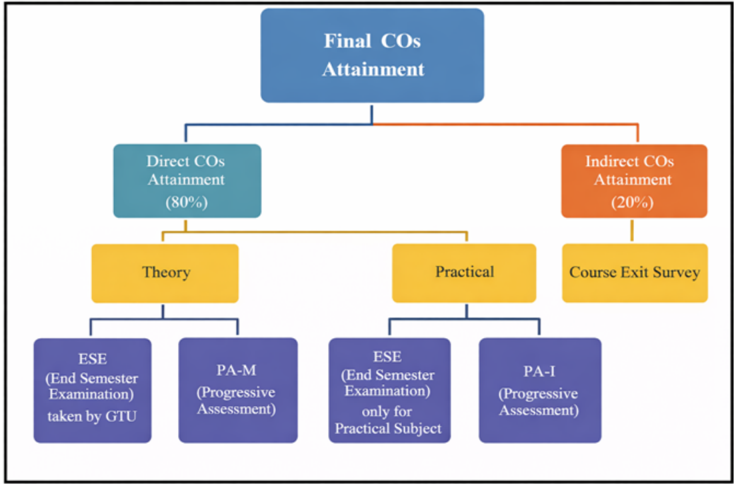

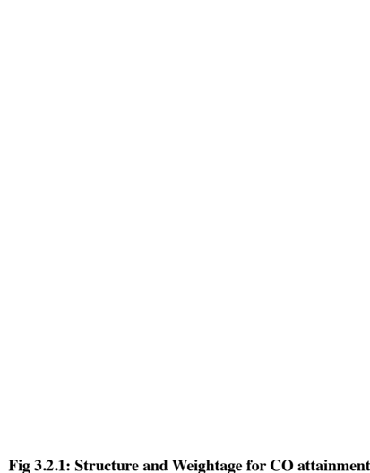

The various assessment components and processes used to gather the data for the evaluation of Course Outcomes by direct method are described as follows. The maximum marks and the weightage of each assessment component in the final grade are also summarized in the Table 3.2.1.1

| Sr. No.             | Component Name                          | Exam Conducted by                                       | Marks   | Remarks                                                                                                       | Relevance of assessment process                                                                                                                                                                                                                                                                                                                                                                                      |
|---------------------|-----------------------------------------|---------------------------------------------------------|---------|---------------------------------------------------------------------------------------------------------------|----------------------------------------------------------------------------------------------------------------------------------------------------------------------------------------------------------------------------------------------------------------------------------------------------------------------------------------------------------------------------------------------------------------------|
| 1                   | End Semester Exam (ESE)                 | University                                              | 70      | Results are declared by university in form of Grades                                                          | ESE is intended for making a comprehensive assessment of the ability of students to understand / apply / analyze / evaluate the various aspects of the respective course based on the entire syllabus.                                                                                                                                                                                                               |
| 2                   | End Semester Practical Exam ESE(V) - PR | Department (Sem. 1 to 4) University (Sem. 5 to 6) 25/50 | 25/50   | Results are declared by university in form of Grades                                                          | The comprehensive assessment associated with the practical aspects of the course is carried out at the end of the semester through practical exam and viva voce.                                                                                                                                                                                                                                                     |
| 3 Mid Semester Exam | PA(M) + Micro Project                   | Department                                              | 30      | Results are declared by university in form  of Grades. Marks are provided by the department to the university | The Class test/Mid Semester Exam are conducted to assess the ability of students to understand / apply / analyses / evaluate the various aspects of the respective course. At the end of the semester as per curriculum students need to submit the micro project as per concern subject from which student get hands on practice of Application level.                                                              |
| 4                   | Internal PA(I)                          | Department 25/50                                        |         | Results are declared by university in form of Grades. Marks are provided by the department to the university  | Assesses the ability of students to apply the theoretical aspects in practice as an individual task or as team work. It also helps to reinforce the concepts gained through class room learning. The assessment is carried out at the end of each experiment conducted and is based on the inferences drawn, data collected, analyzed & presented and knowledge of equipment / modern tools used during performance. |

PA (M) Conducted by Institute.

PA (I) Conducted by Institute.

ESE (V) PR For 1 to 4 Semester Conducted by Institute and for 5 to 6 Semester conducted by university.

Various courses offered to the students of diploma Electronics and Communication as per GTU curriculum has three different evaluation schemes.

CO attainment is based on the internal and external assessment as per GTU scheme of examination. Depending upon nature, of course, maximum marks for various courses may be 50,100,150.

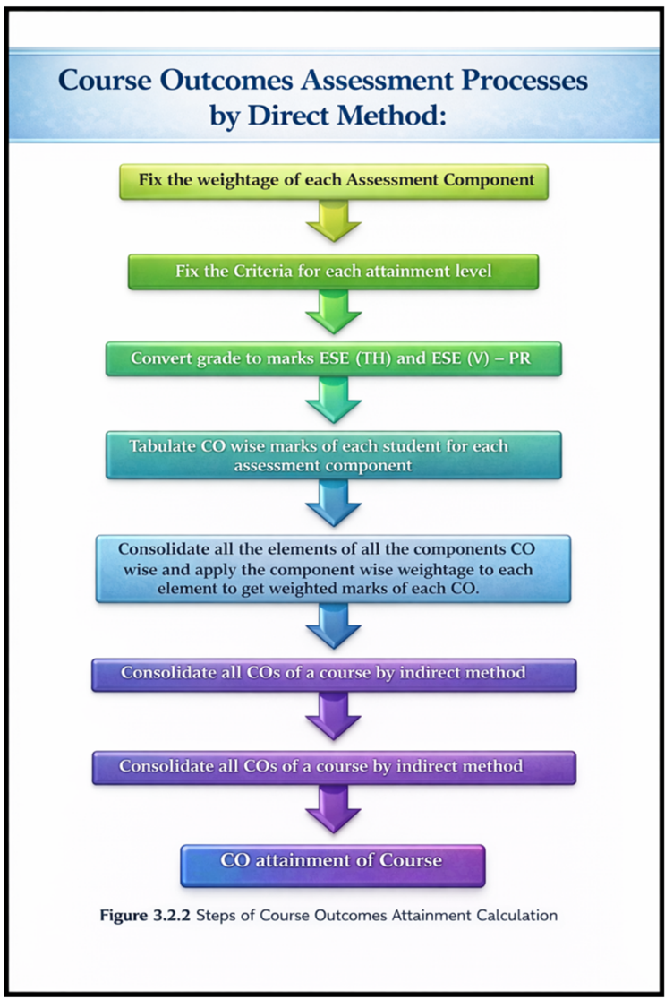

Step 1: Fix the weightage of each Assessment Component Prescribed by GTU for the courses offered in the program as per teaching scheme.

Our institute is affiliated to Gujarat Technological University. There are four major (Maximum) components defined by the University for evaluating the performance of the students. The number of components for the subject varies from 2 to 4. The component wise distribution of marks for various credit and scheme is as shown in Table 3.2.1.2. Based on the Component wise marks we fix the weightage to each component.

| Subjects having Credit 3/4/5   | Subjects having Credit 3/4/5   | Subjects having Credit 3/4/5   |
|--------------------------------|--------------------------------|--------------------------------|
| Component wise Weightage       | Component wise Weightage       | Component wise Weightage       |
| [Component |Markso Weight      |                                |                                |
| ESE                            | 70                             | 46.67                          |
| PA                             | 30                             | 20                             |
| ESE                            | 25                             | 16.67                          |
| PA                             | 25                             | 16.67                          |
| Total                          | 150                            | 100                            |

(a)

PA (M) Conducted by Institute.

PA (I) Conducted by Institute.

ESE (V) PR For 1 to 4 semester Conducted by Institute and for 5 to 6 semesters conducted by university.

ESE - Conducted by University

## Step 2: Fix the Criteria for CO attainment Level.

At the end of each course, the CO attainment is evaluated for all curriculum components. The attainment level is set by the Course Coordinator with the reference of previous results. The attainment is made by the institution or the program for analyzing the students' knowledge. For setting up the attainment level, our department has used the following method. Attainment level is taken as given below as considering student percentage fixed and varying the marks.

|   CO Attainment Level | 1 st  and 2 nd  Year                                                                | 3 rd  Year                                                                          |
|-----------------------|-------------------------------------------------------------------------------------|-------------------------------------------------------------------------------------|
|                     3 | 50% of students score more than 60% marks 50% of students score more than 70% marks |                                                                                     |
|                     2 |                                                                                     | 50% of students score more than 50% marks 50% of students score more than 60% marks |
|                     1 | 50% of students score more than 40% marks 50% of students score more than 50% marks |                                                                                     |

## Table 3.2.1.3 CO attainment levels

At the end of each course CO attainment is evaluated for all courses. For setting up the attainment level our department has used the following method.

| For First and Second-Year Courses   | 2021 Entry Batch2022 Entry Batch2023 Entry Batch   |    |    |    |                                                    |    |
|-------------------------------------|----------------------------------------------------|----|----|----|----------------------------------------------------|----|
|                                     |                                                    |    |    |    | % of Marks Level % of Marks Level % of Marks Level |    |
|                                     | 60                                                 | 3  | 60 | 3  | 60                                                 | 3  |
|                                     | 50                                                 | 2  | 50 | 2  | 50                                                 | 2  |
|                                     | 40                                                 | 1  | 40 | 1  | 40                                                 | 1  |

Table 3.2.1.4 Target Level for First and Second-Year Courses

## Subjects Credit 1/2/3 baving

## Component wise Weightage (Practical Only)

| Component   |        | Marks |% Weight   |
|-------------|--------|-------------------|
| 0 PA        | 25/50  | 50/50             |
| ESE () -PR  | 25/50  | 50/50             |
| Total       | 50/100 | 100               |

(b)

| Subjects having Credit 3/4   | Subjects having Credit 3/4   | Subjects having Credit 3/4   |
|------------------------------|------------------------------|------------------------------|
|                              |                              | % Weight                     |
| ESE                          | 70                           | 70                           |
| PA (MD                       | 30                           | 30                           |
| Total                        | 100                          | 100                          |

(c)

Table 3.2.1.2 Subjects with (a) 4 components, (b) 2 components &amp; (d) 2 components as assessment tool

For ESE (TH) component the grades from the GTU result are converted to marks as per table given below.

Step 4: Tabulate CO wise marks of each student for each assessment component .

Each assessment component comprises of various elements which are as follows:

- Theory End Semester exam (70 marks)
- Theory Mid Semester Exam (30 marks, Comprise of Progressive Assessment Exam and micro project)
- Practical End Semester Viva (25/50 marks)
- Practical Progressive Assessment ( 25/50 marks)

| For Last Year Courses   | 2021 Entry Batch2022 Entry Batch2023 Entry Batch   | 2021 Entry Batch2022 Entry Batch2023 Entry Batch   | 2021 Entry Batch2022 Entry Batch2023 Entry Batch   | 2021 Entry Batch2022 Entry Batch2023 Entry Batch   | 2021 Entry Batch2022 Entry Batch2023 Entry Batch   | 2021 Entry Batch2022 Entry Batch2023 Entry Batch   |
|-------------------------|----------------------------------------------------|----------------------------------------------------|----------------------------------------------------|----------------------------------------------------|----------------------------------------------------|----------------------------------------------------|
| For Last Year Courses   |                                                    |                                                    | % of Marks Level % of Marks Level % of Marks Level |                                                    |                                                    |                                                    |
| For Last Year Courses   | 70                                                 | 3                                                  | 70                                                 | 3                                                  | 70                                                 | 3                                                  |
| For Last Year Courses   | 60                                                 | 2                                                  | 60                                                 | 2                                                  | 60                                                 | 2                                                  |
| For Last Year Courses   | 50                                                 | 1                                                  | 50                                                 | 1                                                  | 50                                                 | 1                                                  |

Table 3.2.1.5 Target Level for Final Year Courses

Step 3: Convert grade to marks ESE (TH).

| Mark RangeGradeMid value of range   | Mark RangeGradeMid value of range   |   Mark RangeGradeMid value of range |
|-------------------------------------|-------------------------------------|-------------------------------------|
| 85 to 100                           | AA                                  |                                92.5 |
| 75 to 84                            | AB                                  |                                80   |
| 65 to 74                            | BB                                  |                                70   |
| 55 to 64                            | BC                                  |                                60   |
| 45 to 54                            | CC                                  |                                50   |
| 40 to 44                            | CD                                  |                                42   |
| 35 to 39                            | DD                                  |                                37   |
| <35                                 | FF                                  |                                17   |

Table 3.2.1.6 Grade to Marks Conversion

Figure 3.2.3: Sample Overall Marksheet for course Linear Integrated Circuit(Analog Electronics

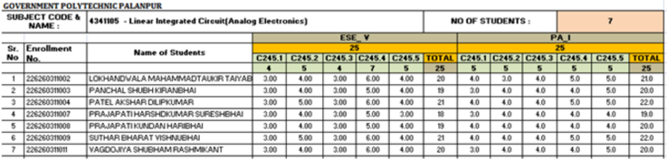

| Enrollmene No   |     |     |     |     |     | PA   |    |     |
|-----------------|-----|-----|-----|-----|-----|------|----|-----|
| 226260011002    | 360 |     | 300 | 600 |     |      |    | 210 |
| 22626001100}    |     |     | 300 | 300 |     |      |    | 200 |
|                 | J00 | 500 | 100 | 600 |     |      |    | 220 |
|                 |     | 100 | 100 | 500 |     |      |    |     |
|                 |     | 100 | 100 | 500 | 700 |      |    | 200 |
|                 | 300 | 500 | 100 | 600 | 700 |      |    | 220 |
|                 | 300 | 400 |     | 600 |     |      | #  | 200 |

For all relevant components for the subject CO wise marks of each student for each assessment component is tabulated. Sample for ESE TH component is shown in figure 3.2.4.

| GOVERNMENT POLYTECHNIC PALANPUR   | GOVERNMENT POLYTECHNIC PALANPUR   | GOVERNMENT POLYTECHNIC PALANPUR   | GOVERNMENT POLYTECHNIC PALANPUR   | GOVERNMENT POLYTECHNIC PALANPUR   | GOVERNMENT POLYTECHNIC PALANPUR   | GOVERNMENT POLYTECHNIC PALANPUR   | GOVERNMENT POLYTECHNIC PALANPUR   | GOVERNMENT POLYTECHNIC PALANPUR   | GOVERNMENT POLYTECHNIC PALANPUR   |
|-----------------------------------|-----------------------------------|-----------------------------------|-----------------------------------|-----------------------------------|-----------------------------------|-----------------------------------|-----------------------------------|-----------------------------------|-----------------------------------|
| SUBIECT CODEAND NAME :            | SUBIECT CODEAND NAME :            | Circuit(Analog Electronlcs)       | Circuit(Analog Electronlcs)       | Circuit(Analog Electronlcs)       | Circuit(Analog Electronlcs)       | Circuit(Analog Electronlcs)       | Circuit(Analog Electronlcs)       | SIUDENTS:                         |                                   |
| Sr. No                            |                                   |                                   | 2000                              | 2000                              | C253                              | 2286                              | (255                              | OUTOF IOIAL(ZO)                   | OUTOF IOTAL (100)                 |
|                                   | 226260311002                      |                                   |                                   | 12                                |                                   |                                   | 6.86                              |                                   |                                   |
|                                   | 226260311003                      | PANCHAL SHUBH KIRANBHAI           |                                   |                                   | 951                               | 8,46                              | 4,23                              | 25,9                              |                                   |
|                                   | 226260311004                      | PATEL AKSHAR DILIPKUXAR           |                                   | 10                                | 12.86                             | 1243                              | 5.72                              | 35                                |                                   |
|                                   | 226260311007                      | PRAJAPATI HARSHDKUMAR SURESHBHAI  |                                   |                                   | 566                               | 5.03                              | 251                               |                                   |                                   |
|                                   | 226260311008                      | [PRAJAPATI KUNDAN HARIBHAI        |                                   |                                   | 951                               | 8,+6                              |                                   | 25.9                              |                                   |
|                                   | 226260311009                      | ISUTHAR BHARAT VISHNUBHA          | 10                                | 10                                | 12,86                             | 11,43                             |                                   | 35                                |                                   |
|                                   | 226260311021                      |                                   |                                   |                                   | 5.66                              | 5.03                              | 251                               |                                   |                                   |

Figure 3.2.4: Sample Tabular form of CO wise marks for component ESE\_TH for Linear Integrated Circuit(Analog Electronics

Step 5 : Consolidate all the elements of all the components CO wise and apply the component wise weightage to each element to get weighted marks of each CO.

Sample for CO1 is shown in Figure 3.2.5. Similarly, element wise consolidation for all COs of a course gives the attainment level of all the CO of a particular course.

Figure 3.2.5: Sample consolidation of element wise marks for CO1 For Linear Integrated Circuit(Analog Electronics

|              |          |               |                 | GOYERNMENT POLYTECHNIC PALANPUR   |         |       |       |
|--------------|----------|---------------|-----------------|-----------------------------------|---------|-------|-------|
|              |          | 18-12-2024 To | 18-12-2024 To   |                                   |         |       |       |
|              |          | 4341105       | 4341105         | 4341105                           | 4341105 |       |       |
|              |          |               |                 |                                   | co      |       |       |
|              |          | ESE_IH        | 50              | 50                                |         |       |       |
|              |          | 46.67 20.00   |                 | ESEY 16.67 16.67                  | 3.0 2.0 |       |       |
|              |          |               |                 |                                   | 0-0     |       |       |
|              | Criteria | Marks >=      | 502)Mark 62 603 | 502)Mark 402 >                    | Total   |       |       |
| COMPONENT    | 20.00    | 18-33         | 20.00           | 16-00 74-33                       | 2 OF    |       |       |
| YEIGHTAGE    |          |               |                 |                                   |         |       |       |
| 226260311002 |          |               |                 |                                   |         |       |       |
|              |          |               |                 |                                   | 62.63   |       |       |
|              |          |               |                 |                                   | 49.42   |       |       |
| 226260311003 |          |               |                 |                                   |         |       |       |
| 226260311004 |          |               |                 |                                   | 63.00   |       |       |
|              |          |               |                 |                                   | 41.16   |       |       |
|              |          |               |                 |                                   | 54.84   |       |       |
| 226260311007 |          |               | ;               |                                   |         |       |       |
| 226260311008 |          |               |                 |                                   |         |       |       |
| 226260311009 |          |               |                 |                                   | 40.26   |       |       |
| 226260311011 |          |               |                 |                                   |         |       |       |
|              |          |               |                 |                                   | 63.00   | 63.00 | 63.00 |

We have taken students records for a particular subject as a sample data. In above figure column 3 to 6 shown marks gained by each student in different assessment component.

Total weightage marks of each component and for each student calculated by equation,

Total Weightage Marks = ∑ /u1D44A/u1D452/u1D456/u1D454 ℎ /u1D461/u1D44E/u1D454/u1D452/u1D45C/u1D453/u1D450/u1D45C/u1D45A/u1D45D/u1D45C/u1D45B/u1D452/u1D45B/u1D461 × /u1D440/u1D44E/u1D45F/u1D458/u1D460/u1D45C/u1D44F/u1D461/u1D44E/u1D456/u1D45B/u1D452/u1D451/u1D456/u1D45B/u1D450/u1D45C/u1D45A/u1D45D/u1D45C/u1D45B/u1D452/u1D45B/u1D461

Max weightage marks of C245.1 = (20 x 0.4667) + (18.33 x 0.20) + (20 x 0.1667) + (16 x 0.1667)

= 19

Marks obtained by student (Sr.No.-1) in C245.1

= 11.90

Percentage weightage marks obtained by student in C245.1 =

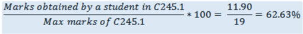

Percentage weightage marks obtained by each student is calculated. Student wise CO attainment calculation criteria are given in table 3.2.5. As per that table student 226260311002 obtained 62.63% in C245.1, so attainment level in C245.1 is 3. Same as 226260311003 obtained 49.42% in C245.1, so attainment level in C245.1 is 1.

|   CO Attainment LevelTarget Attainment LevelPercentage for First & Second YearPercentage for Final Year |    |                  |                   |
|---------------------------------------------------------------------------------------------------------|----|------------------|-------------------|
|                                                                                                       3 |  2 | >= 60 %          | >= 70 %           |
|                                                                                                       2 |  2 | >= 50 and <= 60% | >= 60% and <= 70% |
|                                                                                                       1 |  2 | >=40%and <= 50%  | >= 50% and <= 60% |
|                                                                                                       0 |  2 | < 40%            | < 50%             |

## Table 3.2.1.7 Student wise CO calculation criteria

## Step 6: Consolidate all COs of a course by direct method.

For each student CO wise attainment calculated. After that we make one summary sheet of all CO Attainment as shown in figure 3.2.6. From that, average value of each CO is considered as direct CO attainment for final attainment calculation.

## GOVERNMENT POLYTECHNIC PALANPUR

Term Date:

18-12-2024

Programme

Semester

Academic Year

Course Code and Name

Course Coordinator

Faculty Hembers Involved

To

Diploma in Electronics and Communication

Feb 2024 TO 2024

4341105 Linear Integrated Circuit(Analog Electronics)

Mr-RCParmar

0.00

No of Students in Class

7.00

AVERAGE ATTAINT

1.86

1.71

2.14

2.57

2.056

Figure 3.2.6: Sample summary sheet of all COs attainment for Linear Integrated Circuit(Analog Electronics)

| Haximum veighted Marks   | Haximum veighted Marks   | C245.1 19.00            | 5245.2 19.67            | C245.3 21.33            | 5245.4 23.33            | 5245.5 16.67            | 100.00   |
|--------------------------|--------------------------|-------------------------|-------------------------|-------------------------|-------------------------|-------------------------|----------|
|                          | Boll No                  | COvise attainment level | COvise attainment level | COvise attainment level | COvise attainment level | COvise attainment level | Student  |
|                          | 226260311002             |                         |                         |                         |                         |                         | 23       |
|                          | 226260311003             |                         |                         |                         |                         |                         | 148      |
|                          | 226260311004             |                         |                         |                         |                         |                         | 25       |
|                          | 226260311007             |                         |                         |                         |                         |                         | 0.62     |
|                          | 226260311008             |                         |                         |                         |                         |                         | 126      |
|                          | 226260311009             |                         |                         |                         |                         |                         | 25       |
|                          | 226260311011             |                         |                         |                         |                         |                         | 0.62     |

## Step 7: Consolidate all COs of a course by indirect method.

Course Exit Survey:

A course exit survey is conducted via hard copy for students who have completed the particular course. The Course outcome relevant questionnaires are asked in Course Exit Survey to evaluate the contribution of Course to attain POs and PSOs. Course exit survey also helps the Course Coordinator to take further corrective actions to improve. Sample of Course exit survey is shown in below figure:

28-04-2025

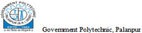

## Electronics and Communication Department

Course: Linea Integrated Circuit (Analog Electonics) [4341105]

| Enrollment Number:   | Enrollment Number:           | Enrollment Number:           | Enrollment Number:           | Date:                        | Date:                        |
|----------------------|------------------------------|------------------------------|------------------------------|------------------------------|------------------------------|
| 1)                   | amplifier?                   | amplifier?                   | amplifier?                   | amplifier?                   | amplifier?                   |
|                      | 1Excellent                   | 2Very Good                   |                              | 4Averase                     | SPoor                        |
|                      | 1Excellent                   | 2Very Good                   | 3 Good                       |                              |                              |
| 3)                   | practicalapplications?       | practicalapplications?       | practicalapplications?       | practicalapplications?       | practicalapplications?       |
|                      | 1Excellent                   | 2Very Good                   | 3Good                        |                              |                              |
|                      | operational amplifier!       | operational amplifier!       | operational amplifier!       | operational amplifier!       | operational amplifier!       |
|                      | 1Excellent                   | 2Very Good                   | 3 Good                       | 4Averas?                     | SPoor                        |
|                      | mono stable; bistable) using | mono stable; bistable) using | mono stable; bistable) using | mono stable; bistable) using | mono stable; bistable) using |
|                      | 1Excellent                   | Good 2Ver;                   | 3 Good                       | 4Averas?                     | SPoor                        |

## Figure: 3.2.7 Course Exit Survey

Based on Course Exit survey data received from student the co-relation has been established weightage between 1 to 3 as per need for calculating attainment of CO. So, we have established a co-relation for the values Excellent, Very Good, Good, Average and Poor with 3, 2.5, 2, 1.5 &amp; 1 according. The received data from the student is compiled as shown in figure and average of COs used for final attainment calculation.

## Step 8: Determine the overall attainment level of the course.

80 % weightage is given to direct assessment and 20 % to indirect assessment for overall CO Calculation.

For Example:

Direct Attainment Value of C245.1 = 2

Indirect Attainment Value of C245.1 = 2.29

Overall Attainment level of C245.1 = (2.0 x 0.8) + (2.29 x 0.2) = 2.06

Final overall attainment level of each COs for Linear Integrated Circuit (Analog Electronics) is calculated as shown in table 3.2.1.8.

|                                                                              |   C245.1 |   C245.2 |   C245.3 |   C245.4 |   C245.5 |
|------------------------------------------------------------------------------|----------|----------|----------|----------|----------|
| Direct COs Attainment                                                        |     2    |     1.86 |     1.71 |     2.14 |     2.57 |
| Indirect COs Attainment                                                      |     2.29 |     1.86 |     2.29 |     2.36 |     2.21 |
| Final COs Attainment (80% of Direct Attainment + 20% of Indirect Attainment) |     2.06 |     1.86 |     1.83 |     2.18 |     2.5  |

Table 3.2.1.8: Overall Attainment Level Calculation for Linear Integrated Circuit (Analog Electronics)

## 3.2.2 Record the attainment of Course Outcome of all courses with respect to set attainment levels (30)

|   Sr. No. |    | SemCourse Code               | Course Name                                                                 |                          |                          |    |   CO1CO2CO3CO4CO5CO6Average CO |
|-----------|----|------------------------------|-----------------------------------------------------------------------------|--------------------------|--------------------------|----|--------------------------------|
|         1 |    | C111                         | Mathematics                                                                 | 086 0.67 1.11 0.98 0.90  |                          | -  |                           0.9  |
|         2 |    | C112                         | Communication Skills in English                                             | 2.42 2.43 2.5 2.78       | 2.6                      | -  |                           2.54 |
|         3 |    | C113                         | Physics                                                                     |                          | 1.98 1.67 1.57 1.62 1.54 | -  |                           1.67 |
|         4 | 1  | C114                         | Basics of Information and Communication Technology 2.68 2.71 2.71 2.70 2.74 |                          |                          | -  |                           2.71 |
|         5 |    | C115                         | Sports and Yoga                                                             |                          | 2.93 2.92 2.85 2.84 2.88 | -  |                           2.89 |
|         6 |    | C116                         | Fundamentals of Electrical Engineering                                      | 1.61 1.24 2.66 2.09      | -                        | -  |                           1.9  |
|         7 |    | C117                         | Fundamentals of Electronics                                                 | 0.64 1.4                 | 1.72 1.79 1.43           | -  |                           1.39 |
|         8 |    | C121                         | Environment and Sustainability                                              | 1.29 1.91 1.67 1.99 1.88 |                          | -  |                           1.75 |
|         9 |    | C122                         | Engineering Drawing and Computer Aided Design                               | 2.82 2.83 2.77 2.84 2.63 |                          | -  |                           2.77 |
|        10 |    | C123                         | Indian Constitution                                                         |                          | 2.87 2.77 2.86 2.87 2.83 | -  |                           2.84 |
|        11 | 2  | C124 Engineering Mathematics |                                                                             | 1.54 0.96 1.52 1.41 1.33 |                          | -  |                           1.35 |
|        12 |    | C125                         | Electronics Workshop                                                        | 2.85 2.82 2.61 2.75 2.70 |                          | -  |                           2.69 |
|        13 |    | C126                         | Digital Electronics                                                         | 2.4 2.28 2 2             | 2.13                     | -  |                           2.16 |
|        14 |    | C127                         | Electronic Circuits & Applications                                          | 1.68 1.47 1.87 2.01 1.76 |                          | -  |                           1.76 |
|        15 |    | C231                         | Summer Internship-I                                                         | 2.85 2.48 2.68 2.37 2.56 |                          | -  |                           2.59 |
|        16 |    | C232                         | Electronic Circuits & Networks                                              | 1.53 1.75 1.52 1.14 1.69 |                          | -  |                           1.52 |
|        17 |    | C233                         | Electronic Measurements & Instruments                                       | 1.32 1.03 1.28 1.27 1.43 |                          | -  |                           1.27 |
|        18 | 3  | C234 Industrial Electronics  |                                                                             | 1.38 1.39 1.43 1.36 1.12 |                          | -  |                           1.34 |
|        19 |    | C235                         | Principle of Electronic Communication                                       | 1.69 1.29 1.67 1.25 1.56 |                          | -  |                           1.47 |
|        20 |    | C236                         | Programming In C                                                            | 1.27 1.29 1.47 1.68 1.54 |                          | -  |                           1.46 |

## Institute Marks

30.00

|   21 |    | C241                                                    | Integrated Personality Development Course           |                          | 2.90 2.87 2.87 2.88 2.88 2.88   |    |   2.88 |
|------|----|---------------------------------------------------------|-----------------------------------------------------|--------------------------|---------------------------------|----|--------|
|   22 |    | C242                                                    | Microprocessor & Microcontroller                    |                          | 1.90 2.20 2.31 2.17 2.10        | -  |   2.14 |
|   23 |    | C243                                                    | Digital Communication                               |                          | 2.55 2.38 2.80 2.36 2.59        | -  |   2.54 |
|   24 | 4  | C244                                                    | Circuit Design Tools                                | 2.80 2.80 2.90 2.77      | -                               | -  |   2.82 |
|   25 |    | C245                                                    | Linear Integrated Circuit(Analog Electronics)       |                          | 1.87 1.68 1.69 1.70 2.03        | -  |   1.8  |
|   26 |    | C246                                                    | Antenna & Wave Propagation                          | 2.63 2.68 2.57 2.77 2.87 |                                 | -  |   2.7  |
|   27 |    | C247                                                    | Consumer Electronics & Maintenance                  | 1.75 1.29 1.40 1.75 1.31 |                                 | -  |   1.5  |
|   28 |    | C351                                                    | Entrepreneurship and Start-ups                      | 1.90 2.06 1.74 1.16 1.36 |                                 | -  |   1.64 |
|   29 |    | C352                                                    | Embedded System                                     | 2.20 1.94 2.58 2.34 2.68 |                                 | -  |   2.35 |
|   30 |    | C353                                                    | Microwave and Radar Communication                   | 1.70 2.72 2.10 0.86 1.74 |                                 | -  |   1.82 |
|   31 | 5  | C354 Mobile & Wireless Communication                    |                                                     | 1.72 2.84 2.74 2.50 2.68 |                                 | -  |   2.5  |
|   32 |    | C355                                                    | Software Practices                                  | 2.82 2.88 2.80 2.88 2.86 |                                 | -  |   2.85 |
|   33 |    | C356                                                    | Summer Internship-II                                | 2.84 2.84 2.90 2.82 2.84 |                                 | -  |   2.85 |
|   34 |    | C357                                                    | Electronics and Communication Engineering Project-I | 2.68 2.62 2.72 2.72 2.66 |                                 | -  |   2.68 |
|   35 |    | C358                                                    | OOPS & Python Programming                           | 2.68 2.18 2.04 1.70      | -                               | -  |   2.15 |
|   36 |    | C361                                                    | Computer Networks & Data Communication              | 2.80 2.88 2.85 2.23 2.38 |                                 | -  |   2.63 |
|   37 |    | C362                                                    | VLSI                                                | 1.78 1.63 2.90 1.30 2.63 |                                 | -  |   2.05 |
|   38 | 6  | C363 Electronics & Communication Engineering Project-II |                                                     | 2.83 2.75 2.93 2.88 2.83 |                                 | -  |   2.84 |
|   39 |    | C364                                                    | Android App Development                             | 2.83 2.75 2.93 2.88 2.83 |                                 | -  |   2.84 |
|   40 |    | C365                                                    | Renewable Energy & Emerging Trends in Electronics   | 2.88 2.63 2.88 2.85      | -                               | -  |   2.81 |

Table 3.2.2.1 Attainment of Course outcome of Batch 2021-2024

|   Sr. No. | SemCourse Code   | Course Name                     |                          |    | CO1CO2CO3CO4CO5CO6Average CO   |
|-----------|------------------|---------------------------------|--------------------------|----|--------------------------------|
|         1 | C111             | Mathematics                     | 1.59 1.15 1.58 1.59 1.55 | -  | 1.49                           |
|         2 | C112             | Communication Skills in English | 1.6 1.55 1.6 2.19        | -  | 2.1 1.8                        |
|         3 | C113             | Physics                         | 2.14 2.34 2.06 2.07 1.37 | -  | 1.90                           |

| 4   | 1   | C114                                               | Basics of Information and Communication Technology 2.68 2.61 2.78 2.69 2.76   |                          |                          | -      | 2.71   |
|-----|-----|----------------------------------------------------|-------------------------------------------------------------------------------|--------------------------|--------------------------|--------|--------|
| 5   |     | C115 Sports and Yoga                               |                                                                               | 2.87 2.78 2.85 2.87 2.78 |                          | -      | 2.83   |
| 6   |     | C116 Fundamentals of Electrical Engineering        |                                                                               | 2.17 2.11 2.42 2.33      | -                        | -      | 2.26   |
| 7   |     | C117 Fundamentals of Electronics                   |                                                                               | 1.84 1.80 2.09 2.16      | -                        | -      | 1.97   |
| 8   |     | C121 Environment and Sustainability                |                                                                               |                          | 1.78 1.68 1.60 1.79 1.68 |        | 1.71   |
| 9   |     | C122 Engineering Drawing and Computer Aided Design |                                                                               |                          | 2.02 2.06 2.04 2.08 2.00 | - 2.04 |        |
| 10  |     | C123 Indian Constitution                           |                                                                               |                          | 2.65 2.54 2.43 2.21 2.59 | -      | 2.48   |
| 11  | 2   | C124 Engineering Mathematics                       | 1.92 1.66                                                                     | 2.1                      | 2.1 1.98                 | -      | 1.95   |
| 12  |     | C125 Electronics Workshop                          |                                                                               |                          | 2.60 2.57 2.51 2.44 2.24 | -      | 2.35   |
| 13  |     | C126 Digital Electronics                           | 2.42 2.09                                                                     | 2                        | 2.14 2.29                | -      | 2.19   |
| 14  |     | C127 Electronic Circuits & Applications            |                                                                               | 1.62 1.70 2.11 2.04 1.88 |                          | -      | 1.87   |
| 15  |     | C231 Summer Internship-I                           |                                                                               | 2.57 2.45 2.68 2.53 2.57 |                          | -      | 2.56   |
| 16  |     | C232 Electronic Circuits & Networks                |                                                                               |                          | 2.06 2.17 1.95 1.80 2.06 | -      | 2.01   |
| 17  |     | C233 Electronic Measurements & Instruments         |                                                                               | 2.28 1.86 2.15 2.05 2.20 |                          | -      | 2.11   |
|     | 3   | C234 Industrial Electronics                        |                                                                               | 1.73 1.84 1.58 1.60 1.63 | -                        |        | 1.67   |
| 19  |     | C235 Principle of Electronic Communication         |                                                                               | 2.49 1.59 2.37 1.36 2.05 |                          | -      | 1.97   |
| 20  |     | C236 Programming In C                              |                                                                               | 1.83 1.60 0.78 1.38 1.69 |                          | -      | 1.46   |
| 21  |     | C241 Integrated Personality Development Course     |                                                                               | 2.87 2.88 2.91 2.91 2.89 |                          |        | 2.89   |
| 22  |     | C242 Microprocessor & Microcontroller              |                                                                               | 2.62 2.76 2.32 2.14 2.23 |                          | -      | 2.47   |
| 23  |     | C243 Digital Communication                         |                                                                               | 2.86 2.46 2.41 2.47 2.43 |                          | -      | 2.53   |
| 24  | 4   | C244 Circuit Design Tools                          |                                                                               | 2.80 2.80 2.90 2.77      | - -                      |        | 2.82   |
| 25  |     | C245 Linear Integrated Circuit(Analog Electronics) |                                                                               | 2.06 1.86 1.83 2.18 2.50 |                          | -      | 2.08   |
| 26  |     | C246 Antenna & Wave Propagation                    |                                                                               | 2.63 2.68 1.40 2.77 2.87 |                          | -      | 1.61   |
| 27  |     | C247 Consumer Electronics & Maintenance            |                                                                               | 1.75 1.29 1.40 1.75 1.31 |                          | -      | 1.5    |
| 28  |     | C351 Entrepreneurship and Start-ups                |                                                                               | 2.01 1.57 1.59 1.53 1.33 |                          | -      | 1.6    |
| 29  |     | C352 Embedded System                               |                                                                               | 1.99 1.71 2.47 2.56 2.67 |                          | -      | 2.28   |
| 30  |     | C353 Microwave and Radar Communication             |                                                                               | 2.51 2.32 2.51 2.18 2.61 |                          | -      | 2.43   |

|   31 |   5 | C354 Mobile & Wireless Communication                     | 2.21 1.99 2.51 2.23 2.30   | -   |   2.25 |
|------|-----|----------------------------------------------------------|----------------------------|-----|--------|
|   32 |   5 | C355 Software Practices                                  | 2.84 2.77 2.77 2.84 2.83   | -   |   2.81 |
|   33 |   5 | C356 Summer Internship-II                                | 2.71 2.71 2.76 2.70 2.71   | -   |   2.72 |
|   34 |   5 | C357 Electronics and Communication Engineering Project-I | 2.77 2.89 2.87 2.84 2.89   | -   |   2.85 |
|   35 |   5 | C358 OOPS & Python Programming                           | 2.83 2.36 2.50 2.27 -      | -   |   2.52 |
|   36 |   5 | C361 Computer Networks & Data Communication              | 2.54 2.53 5.63 2.50 1.45   | -   |   2.33 |
|   37 |   5 | C362 VLSI                                                | 2.67 1.50 1.74 2.68 2.46   | -   |   2.21 |
|   38 |   6 | C363 Electronics & Communication Engineering Project-II  | 2.73 2.72 2.84 2.86 2.84   | -   |   2.8  |
|   39 |   6 | C364 Android App Development                             | 2.71 2.67 2.74 2.74 2.70   | -   |   2.71 |
|   40 |   6 | C365 Renewable Energy & Emerging Trends in Electronics   | 2.77 2.82 2.79 2.58 -      | -   |   2.74 |

## Table 3.2.2.2 Attainment of Course outcome of Batch 2022-2025

|   Sr. No. |    | SemCourse Code                      | Course Name                                                                 |                          |                          |    |   CO1CO2CO3CO4CO5CO6Average CO |
|-----------|----|-------------------------------------|-----------------------------------------------------------------------------|--------------------------|--------------------------|----|--------------------------------|
|         1 |    | C111                                | Mathematics                                                                 | 1.71 1.28 1.95 1.73 1.81 | -                        |    |                           1.7  |
|         2 |    | C112                                | Communication Skills in English                                             |                          | 2.63 2.54 2.63 2.76 2.84 | -  |                           2.68 |
|         3 |    | C113                                | Physics                                                                     |                          | 2.63 2.66 2.63 2.07 1.81 | -  |                           2.36 |
|         4 | 1  | C114                                | Basics of Information and Communication Technology 2.81 2.83 2.84 2.90 2.81 |                          |                          | -  |                           2.84 |
|         5 |    | C115                                | Sports and Yoga                                                             |                          | 2.84 2.86 2.87 2.90 2.83 | -  |                           2.86 |
|         6 |    | C116                                | Fundamentals of Electrical Engineering                                      | 2.15 1.85 2.43 2.15      | -                        | -  |                           2.15 |
|         7 |    | C117                                | Fundamentals of Electronics                                                 |                          | 2.25 2.14 2.35 2.29 0.46 | -  |                           1.9  |
|         8 |    | C121 Environment and Sustainability | 1.33 1.46                                                                   | 1.7                      | 1.41 1.21                | -  |                           1.42 |
|         9 |    | C122                                | Engineering Drawing and Computer Aided Design                               | 2.81 2.83 2.84           | 2.9 2.81                 | -  |                           2.83 |
|        10 |    | C123 Indian Constitution            | 2.8                                                                         | 2.83 2.84                | 2.9 2.81                 | -  |                           2.84 |
|        11 | 2  | C124 Engineering Mathematics        |                                                                             |                          | 1.37 1.17 1.37 1.38 1.35 | -  |                           1.33 |
|        12 |    | C125                                | Electronics Workshop                                                        |                          | 2.81 2.81 2.79 2.86 2.86 | -  |                           2.83 |
|        13 |    | C126                                | Digital Electronics                                                         |                          | 2.76 2.50 2.54 2.37 2.73 | -  |                           2.58 |
|        14 |    | C127                                | Electronic Circuits & Applications                                          |                          | 1.73 1.70 1.74 1.68 1.93 | -  |                           1.76 |

| 15   | C231   | Summer Internship-I                                 |                          | 2.83 2.72 2.97 2.82 2.88      | -   |   2.84 |
|------|--------|-----------------------------------------------------|--------------------------|-------------------------------|-----|--------|
| 16   | C232   | Electronic Circuits & Networks                      | 2.03 2.32 2.30 1.88 2.08 |                               | -   |   2.12 |
| 17   | C233   | Electronic Measurements & Instruments               | 2.59 1.91 2.25 2.17 2.17 |                               | -   |   2.22 |
|      | C234   | Industrial Electronics                              |                          | 2.25 2.03 2.28 2.24 2.07      | -   |   2.17 |
| 19   | C235   | Principle of Electronic Communication               | 2.43 1.78 2.83 1.75 2.62 |                               | -   |   2.28 |
| 20   | C236   | Programming In C                                    | 1.88 1.93 1.35 1.84 2.59 |                               | -   |   1.92 |
| 21   | C241   | Integrated Personality Development Course           |                          | 2.87 2.88 2.91 2.91 2.89 2.89 |     |   2.89 |
| 22   | C242   | Microprocessor & Microcontroller                    | 1.90 2.20 2.31 2.17 2.10 |                               | -   |   2.14 |
| 23   | C243   | Digital Communication                               | 2.55 2.38 2.80 2.36 2.59 |                               | -   |   2.54 |
| 24   | C244   | Circuit Design Tools                                | 2.80 2.80 2.90 2.77      | -                             | -   |   2.82 |
| 25   | C245   | Linear Integrated Circuit(Analog Electronics)       | 2.48 2.57 2.03 2.60 2.88 |                               | -   |   2.51 |
| 26   | C246   | Antenna & Wave Propagation                          | 2.63 2.68 2.57 2.77 2.87 |                               | -   |   2.7  |
| 27   | C247   | Consumer Electronics & Maintenance                  | 2.42 2.38 2.40 2.36 2.71 |                               |     |   2.45 |
| 28   | C351   | Entrepreneurship and Start-ups                      | 2.80 2.43 1.83 2.68 1.95 |                               | -   |   2.34 |
| 29   | C352   | Embedded System                                     | 1.85 2.28 2.50 2.78 2.68 |                               | -   |   2.42 |
| 30   | C353   | Microwave and Radar Communication                   | 2.40 2.83 2.50 2.98 2.80 |                               | -   |   2.7  |
| 31   | C354   | Mobile & Wireless Communication                     | 2.40 2.43 2.70 2.98 2.80 |                               | -   |   2.66 |
| 32   | C355   | Software Practices                                  | 2.83 2.83 2.85 2.88 2.80 |                               | -   |   2.84 |
| 33   | C356   | Summer Internship-II                                | 2.83 2.83 2.85 2.88 2.80 |                               | -   |   2.85 |
| 34   | C357   | Electronics and Communication Engineering Project-I | 2.85 2.88 2.93 2.78 2.80 |                               | -   |   2.85 |
| 35   | C358   | OOPS & Python Programming                           | 2.60 2.43 2.10 2.58      | -                             | -   |   2.43 |

Table 3.2.2.3 Attainment of Course outcome of Batch 2023-2026

Fig. 3.3.1.1 Structure for POs &amp; PSOs Attainment

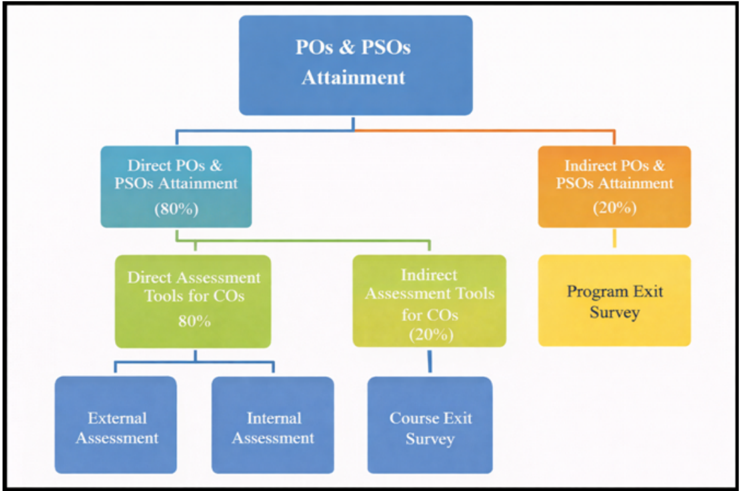

The assessment tools and processes used for measuring the attainment of each of the Program Outcomes and Program Specific Outcomes consist of direct and indirect attainment. For direct attainment process of POs consists of two tools i.e. direct assessment tool and indirect assessment tool for COs. The direct assessment tool consists of Internal and External assessment of the student as mentioned in above figure. The indirect assessment of COs is carried out by course exit survey.

## Direct POs &amp; PSOs Attainment:

Each COs of a particular course is mapped with the POs and PSOs with attainment level 1, 2, and 3. The value of particular COs attainment and COs POs PSOs mapping is used to derive the attainment of particular POs and PSOs using the below equation.

Likewise, attainment of all POs and PSOs with respect to all COs are derived and tabulated in COs-POs-PSOs attainment matrix.

The last row of COs-POs-PSOs attainment matrix indicates weighted average of all COs attainment for particular POs and PSOs, which in turns, represents POs and PSOs attainment for a particular course. A sample COs-POs-PSOs attainment matrix is given below. It represents the contribution of the respective course in direct attainment of POs and PSOs.

Figure 3.3.1.2: Sample COs/POs/PSOs Direct Attainment of Course Linear Integrated Circuit (Analog Electronics)

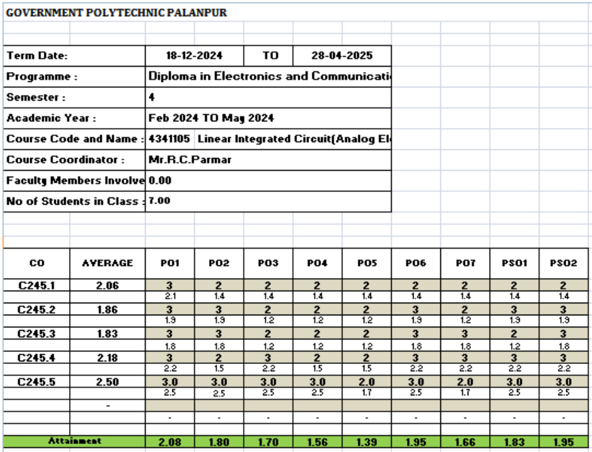

| GOVERNMENT POLYTECHNIC PALANPUR   | GOVERNMENT POLYTECHNIC PALANPUR   | GOVERNMENT POLYTECHNIC PALANPUR              | GOVERNMENT POLYTECHNIC PALANPUR              | GOVERNMENT POLYTECHNIC PALANPUR              | GOVERNMENT POLYTECHNIC PALANPUR              | GOVERNMENT POLYTECHNIC PALANPUR              | GOVERNMENT POLYTECHNIC PALANPUR              | GOVERNMENT POLYTECHNIC PALANPUR   | GOVERNMENT POLYTECHNIC PALANPUR   | GOVERNMENT POLYTECHNIC PALANPUR   |
|-----------------------------------|-----------------------------------|----------------------------------------------|----------------------------------------------|----------------------------------------------|----------------------------------------------|----------------------------------------------|----------------------------------------------|-----------------------------------|-----------------------------------|-----------------------------------|
| Term Date:                        | Term Date:                        | 18-12-2024                                   | 18-12-2024                                   | To                                           | 28-04-2025                                   | 28-04-2025                                   |                                              |                                   |                                   |                                   |
| Programme                         | Programme                         | Diploma in Electronics and Communicatis      | Diploma in Electronics and Communicatis      | Diploma in Electronics and Communicatis      | Diploma in Electronics and Communicatis      | Diploma in Electronics and Communicatis      | Diploma in Electronics and Communicatis      |                                   |                                   |                                   |
| Semester                          | Semester                          |                                              |                                              |                                              |                                              |                                              |                                              |                                   |                                   |                                   |
| Academic Year                     | Academic Year                     | Feb 2024 To 2024 Mas                         | Feb 2024 To 2024 Mas                         | Feb 2024 To 2024 Mas                         | Feb 2024 To 2024 Mas                         | Feb 2024 To 2024 Mas                         |                                              |                                   |                                   |                                   |
| Course Code and Name              | Course Code and Name              | 4341105 Linear Integrated Circuit( Analog El | 4341105 Linear Integrated Circuit( Analog El | 4341105 Linear Integrated Circuit( Analog El | 4341105 Linear Integrated Circuit( Analog El | 4341105 Linear Integrated Circuit( Analog El | 4341105 Linear Integrated Circuit( Analog El |                                   |                                   |                                   |
| Course Coordinator                | Course Coordinator                | MrRCParmar                                   | MrRCParmar                                   | MrRCParmar                                   | MrRCParmar                                   | MrRCParmar                                   |                                              |                                   |                                   |                                   |
| Faculty Members Involve 0.00      | Faculty Members Involve 0.00      | Faculty Members Involve 0.00                 | Faculty Members Involve 0.00                 | Faculty Members Involve 0.00                 | Faculty Members Involve 0.00                 | Faculty Members Involve 0.00                 |                                              |                                   |                                   |                                   |
| No of Students in Class 7.00      | No of Students in Class 7.00      | No of Students in Class 7.00                 | No of Students in Class 7.00                 | No of Students in Class 7.00                 | No of Students in Class 7.00                 | No of Students in Class 7.00                 |                                              |                                   |                                   |                                   |
| co                                | AYERAGE                           |                                              | Po2                                          | P03                                          |                                              |                                              | Po6                                          |                                   | PsOI                              |                                   |
| C2151                             | 2.06                              | 21                                           |                                              |                                              |                                              |                                              |                                              |                                   |                                   |                                   |
|                                   | 186                               |                                              |                                              |                                              |                                              |                                              |                                              |                                   |                                   |                                   |
|                                   |                                   | 25                                           |                                              |                                              |                                              |                                              |                                              |                                   |                                   |                                   |
|                                   |                                   | 208                                          | 180                                          |                                              | 156                                          | 139                                          | 195                                          | 166                               | 183                               | 195                               |

10.00

Course attainment value for each POs and PSOs is then tabulated for all the courses of the program to measure the direct attainment value for POs and PSOs. Average of all course POs &amp; PSOs is considered as direct attainment of POs &amp; PSOs which further used for overall POs &amp; PSOs attainment calculation.

## Indirect POs &amp; PSOs Attainment:

Indirect assessment includes program exit survey. These are based on a questionnaire which directly resembles with POs and PSOs. It is taken from passed out students from each batch through hard copy. The format of program exit survey is shown in Figure 3.3.1.3.

Figure 3.3.1.3: Sample of Program exit survey form

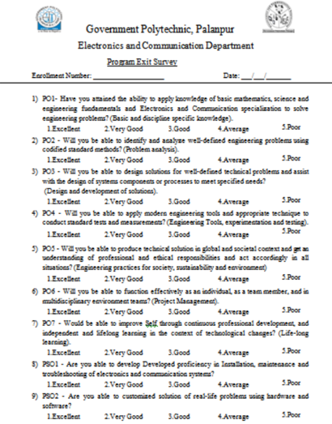

The responses are analyzed and transformed into Weightage of 1 to 3 as per need for calculating attainment of POs &amp; PSOs. So, we have established a co-relation for the values Excellent, Very Good, Good, Average and Poor with 3, 2.5, 2, 1.5 &amp; 1 accordingly. From the response we make summary sheet which are shown in figure 3.3.1.4. Average of each POs &amp; PSOs is taken for overall attainment of POs &amp; PSOs calculation.

| PO            | Total Count in received feedback   | Total Count in received feedback   | Total Count in received feedback   | Total Count in received feedback   | Total Count in received feedback   | Total Count in received feedback   | Total Count in received feedback   | Total Count in received feedback   | Total Count in received feedback   |
|---------------|------------------------------------|------------------------------------|------------------------------------|------------------------------------|------------------------------------|------------------------------------|------------------------------------|------------------------------------|------------------------------------|
| PO            | PO1                                | PO2                                |                                    | PO4                                | PO5                                | PO6                                | PO7                                | PSO1                               | PSO2                               |
| Excellent (5) |                                    |                                    |                                    |                                    |                                    |                                    |                                    |                                    |                                    |
| Good (4) Very |                                    |                                    |                                    |                                    |                                    |                                    |                                    |                                    |                                    |
| Good (3)      |                                    |                                    |                                    |                                    |                                    |                                    |                                    |                                    |                                    |
| Average (2)   |                                    |                                    |                                    |                                    |                                    |                                    |                                    |                                    |                                    |
| Poor (1)      |                                    |                                    |                                    |                                    |                                    |                                    |                                    |                                    |                                    |
| PO            | POI                                | PO2                                | PO3                                | PO4                                | PO5                                |                                    | PO7                                | PSOI                               | PSOZ                               |
| LEVEL         | 2.35                               | 242                                | 25                                 | 25                                 | 254                                | 2.54                               | 246                                | 2.62                               | 242                                |

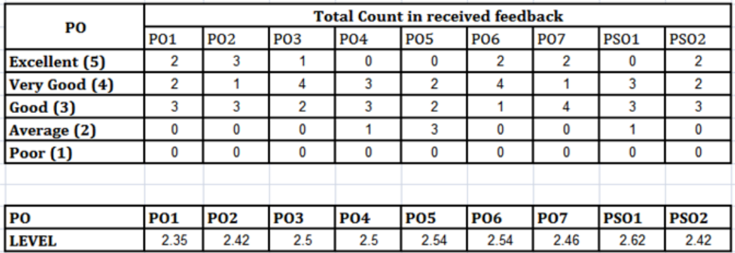

Figure 3.3.1.4: Sample Summary Sheet of Indirect POs &amp; PSOs Attainment for Batch 2022-25

## Overall attainment of POs and PSOs:

The overall attainment for each POs and PSOs is derived as per weightage of direct and indirect assessment. To measure the attainment of POs and PSOs, direct assessment has 80% weightage and indirect assessment has 20% weightage. Following illustrative table gives an insight of evaluating the weightage of direct and indirect attainment in measuring overall attainment of POs and PSOs.

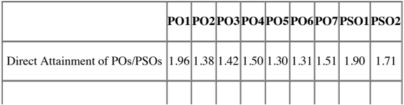

|                               | PO1PO2PO3PO4PO5PO6PO7PSO1PSO2                |
|-------------------------------|----------------------------------------------|
| Direct Attainment of POs/PSOs | 1.96 1.38 1.42 1.50 1.30 1.31 1.51 1.90 1.71 |

## 3.3.2 Provide results of evaluation of each PO &amp; PSO (30)

| Indirect Attainment of POs/PSOs 2.43 2.50 2.43 2.08 1.72 2.58 2.36   | 2.08 2.43                                    |
|----------------------------------------------------------------------|----------------------------------------------|
| Final Attainment of POs/PSOs (80% Direct + 20% Indirect)             | 2.05 1.60 1.62 1.62 1.38 1.56 1.68 1.90 1.71 |

Table 3.3.1.1: Sample Overall attainment of POs and PSOs For Batch 2022-2025

Institute Marks

30.00

PO Attainment PO Attainment

| Course   |   PO1 |   PO2 |      |   PO4 |   PO5 |   PO6 |   PO7 |
|----------|-------|-------|------|-------|-------|-------|-------|
| C111     |  1.49 |  0.62 | 0.48 |  0    |  0    |  0    |  0.45 |
| C112     |  1.11 |  0    | 0    |  0    |  0    |  1.24 |  1.1  |
| C113     |  2    |  0.72 | 0.67 |  1.33 |  0.61 |  0    |  0.67 |
| C114     |  2.53 |  1.81 | 1.8  |  1.81 |  1.13 |  1.8  |  2.18 |
| C115     |  2.26 |  0    | 0    |  0    |  0.94 |  0    |  1.89 |
| C116     |  2.26 |  1.43 | 0    |  0.74 |  2.33 |  0.75 |  1.51 |
| C117     |  1.58 |  0.65 | 0.93 |  1.18 |  0.43 |  0.63 |  0.44 |
| C121     |  1.14 |  1.02 | 0.91 |  0.56 |  1.03 |  0.7  |  0.8  |
| C122     |  2.05 |  1.02 | 1.88 |  1.71 |  1.37 |  1.37 |  1.37 |
| C123     |  0    |  0.83 | 0.83 |  0    |  1.66 |  0.83 |  1.66 |
| C124     |  1.95 |  0.65 | 0.65 |  0    |  0    |  0    |  0.63 |
| C125     |  2.15 |  1.8  | 1.97 |  2.31 |  1.3  |  1.12 |  1.8  |
| C126     |  2.19 |  1.28 | 1.3  |  1.3  |  1.52 |  1.3  |  0.88 |
| C127     |  1.87 |  1.38 | 1.51 |  1.48 |  0.97 |  1.73 |  1    |
| C231     |  1.2  |  0.85 | 1.29 |  1.03 |  0.85 |  0.85 |  0.85 |
| C232     |  2.01 |  1.89 | 1.74 |  1.48 |  1.07 |  1.2  |  1.48 |
| C233     |  2.11 |  1.4  | 1.78 |  1.96 |  1.3  |  0.68 |  0.84 |
| C234     |  1.4  |  0.93 | 0.93 |  1.12 |  0.71 |  1.12 |  0.66 |
| C235     |  1.83 |  1.26 | 1.09 |  1.42 |  1.01 |  0.59 |  1.67 |
| C236     |  1.22 |  0.97 | 0.85 |  1.1  |  0.74 |  0.81 |  1.08 |
| C241     |  0.97 |  0.97 | 0.97 |  0    |  2.58 |  2.27 |  2.72 |
| C242     |  1.77 |  1.15 | 1.29 |  1.27 |  0.61 |  1.29 |  1.37 |
| C243     |  2.32 |  1.08 | 1.07 |  1.86 |  1.24 |  1.39 |  2.01 |

| C244   |   2.35 |   1.91 |   1.90 |   2.76 |   1.09 |   0.92 |   1.16 |
|--------|--------|--------|--------|--------|--------|--------|--------|
| C245   |   2.15 |   1.86 |   1.76 |   1.61 |   1.44 |   2.02 |   1.71 |
| C246   |   2.5  |   2.34 |   2.17 |   1.85 |   1.34 |   1.5  |   1.83 |
| C247   |   1.6  |   1.19 |   1.08 |   1.38 |   1.38 |   0.97 |   1.6  |
| C351   |   1.5  |   1.03 |   0.97 |   0.63 |   0.63 |   1.26 |   1.37 |
| C352   |   2.28 |   1.87 |   1.62 |   1.62 |   1.32 |   1.75 |   1.92 |
| C353   |   1.76 |   1.3  |   1.76 |   1.61 |   1.63 |   1.57 |   1.44 |
| C354   |   2.1  |   1.52 |   1.37 |   1.52 |   1.2  |   1.52 |   1.78 |
| C355   |   2.81 |   2.07 |   1.88 |   2.26 |   0.95 |   1.25 |   2.81 |
| C356   |   1.45 |   1.81 |   1.63 |   1.09 |   2    |   1.45 |   1.82 |
| C357   |   2.85 |   1.9  |   1.33 |   1.52 |   1.71 |   1.33 |   2.85 |
| C358   |   1.9  |   1.65 |   1.63 |   1.09 |   2    |   1.45 |   1.82 |
| C361   |   2.33 |   1.65 |   1.46 |   1.22 |   1.04 |   1.65 |   2.16 |
| C362   |   1.95 |   1.68 |   1.48 |   1.64 |   2.1  |   1.8  |   1.65 |
| C363   |   2.72 |   0.91 |   2.14 |   1.67 |   1.85 |   1.9  |   1.88 |
| C364   |   1.99 |   2.17 |   2.71 |   2.17 |   1.45 |   1.27 |   0.9  |
| C365   |   2.74 |   1.81 |   1.81 |   1.81 |   1.6  |   1.81 |   2.51 |

## PO Attainment Level

| Course              |   PO1 |   PO2 |   PO3 |   PO4 |   PO5 |   PO6 |   PO7 |
|---------------------|-------|-------|-------|-------|-------|-------|-------|
| Direct Attainment   |  1.96 |  1.38 |  1.42 |  1.5  |  1.3  |  1.31 |  1.51 |
| InDirect Attainment |  2.43 |  2.5  |  2.43 |  2.08 |  1.72 |  2.58 |  2.36 |
| PO Attainment       |  2.05 |  1.6  |  1.62 |  1.62 |  1.38 |  1.56 |  1.68 |

## PSO Attainment PSO Attainment

| Course   |   PSO1 |   PSO2 |
|----------|--------|--------|
| C111     |   0    |   0    |
| C112     |   0    |   0    |
| C113     |   1.06 |   0    |
| C114     |   2.24 |   2.34 |
| C115     |   0    |   0    |
| C116     |   2.26 |   0.75 |
| C117     |   1.58 |   0.67 |
| C121     |   1.23 |   0    |
| C122     |   0    |   0.69 |
| C123     |   0    |   0    |
| C124     |   0    |   0    |
| C125     |   2.15 |   2.15 |
| C126     |   1.87 |   0.73 |
| C127     |   1.87 |   0.73 |
| C231     |   1.29 |   0.85 |

| C232   |   2.01 |   1.34 |
|--------|--------|--------|
| C233   |   2.11 |   0.91 |
| C234   |   1.3  |   1.22 |
| C235   |   1.08 |   0.66 |
| C236   |   0    |   1.46 |
| C241   |   0    |   0    |
| C242   |   1.54 |   1.01 |
| C243   |   2.15 |   2.01 |
| C244   |   2.48 |   2.35 |
| C245   |   1.89 |   2.02 |
| C246   |   2.5  |   1.16 |
| C247   |   1.6  |   0.53 |
| C351   |   0    |   0    |
| C352   |   1.75 |   1.61 |
| C353   |   1.94 |   1.79 |
| C354   |   2.25 |   1.71 |
| C355   |   0    |   2.81 |
| C356   |   2.18 |   2.12 |
| C357   |   1.9  |   2.09 |
| C361   |   1.82 |   2.16 |
| C362   |   1.93 |   1.73 |
| C363   |   2.05 |   1.87 |
| C364   |   0.9  |   1.81 |
| C365   |   2.74 |   2.7  |

## PSO Attainment Level

| Course              |   PSO1 |   PSO2 |
|---------------------|--------|--------|
| Direct Attainment   |   1.85 |   1.53 |
| InDirect Attainment |   2.08 |   2.43 |
| PSO Attainment      |   1.9  |   1.71 |

## 4 4 STUDENTS' PERFORMANCE STUDENTS' PERFORMANCE (200) (200)

## Total Marks Total Marks   80.63 80.63

Institute Marks

## Intake Information:

## Table 4.1

| Item                                                                   |   2025-26 (CAY) |   2024-25 (CAYm1) |   2023-24 (CAYm2) |   2022-23 (CAYm3) |   2021-22 (CAYm4) |   2020-21 (CAYm5) |
|------------------------------------------------------------------------|-----------------|-------------------|-------------------|-------------------|-------------------|-------------------|
| Sanctioned intake strength of the program((N)                          |              30 |                30 |                30 |                30 |                30 |                30 |
| Total number of students, admitted through state level counseling (N1) |              17 |                15 |                 7 |                11 |                19 |                 6 |
| Number of students, admitted through Institute level quota (N2)        |               0 |                 0 |                 0 |                 0 |                 0 |                 0 |

| Number of students, admitted through Lateral Entry (N3)          | 0 0 1 1 0 0     |
|------------------------------------------------------------------|-----------------|
| Total number of students admitted in the programme(N1 + N2 + N3) | 17 15 8 12 19 6 |

## Table 4.2

| Year of entry   | Total No of students admitted in the program (N1 + N2 + N3)   | Number of students who have successfully passed without backlogs in any year of study   | Number of students who have successfully passed without backlogs in any year of study   | Number of students who have successfully passed without backlogs in any year of study   |
|-----------------|---------------------------------------------------------------|-----------------------------------------------------------------------------------------|-----------------------------------------------------------------------------------------|-----------------------------------------------------------------------------------------|
| Year of entry   | Total No of students admitted in the program (N1 + N2 + N3)   | I year                                                                                  | II year                                                                                 | III year                                                                                |
| 2025-26         | 17                                                            | 0                                                                                       | 0                                                                                       | 0                                                                                       |
| 2024-25         | 15                                                            | 2                                                                                       | 0                                                                                       | 0                                                                                       |
| 2023-24         | 8                                                             | 3                                                                                       | 1                                                                                       | 0                                                                                       |
| 2022-23 (LYG)   | 12                                                            | 3                                                                                       | 0                                                                                       | 0                                                                                       |
| 2021-22 (LYGm1) | 19                                                            | 1                                                                                       | 1                                                                                       | 1                                                                                       |
| 2020-21 (LYGm2) | 6                                                             | 4                                                                                       | 2                                                                                       | 2                                                                                       |

## Table 4.3

| Year of entry   | Total No of students admitted in the program(N1 + N2 + N3)   | Number of students who have successfully graduated in stipulated period of study) [Total of with Backlog + without Backlog]   | Number of students who have successfully graduated in stipulated period of study) [Total of with Backlog + without Backlog]   | Number of students who have successfully graduated in stipulated period of study) [Total of with Backlog + without Backlog]   |
|-----------------|--------------------------------------------------------------|-------------------------------------------------------------------------------------------------------------------------------|-------------------------------------------------------------------------------------------------------------------------------|-------------------------------------------------------------------------------------------------------------------------------|
| Year of entry   | Total No of students admitted in the program(N1 + N2 + N3)   | I year                                                                                                                        | II year                                                                                                                       | III year                                                                                                                      |
| 2025-26         | 17                                                           | 0                                                                                                                             | 0                                                                                                                             | 0                                                                                                                             |
| 2024-25         | 15                                                           | 8                                                                                                                             | 0                                                                                                                             | 0                                                                                                                             |
| 2023-24         | 8                                                            | 6                                                                                                                             | 4                                                                                                                             | 0                                                                                                                             |
| 2022-23 (LYG)   | 12                                                           | 9                                                                                                                             | 7                                                                                                                             | 7                                                                                                                             |
| 2021-22 (LYGm1) | 19                                                           | 13                                                                                                                            | 5                                                                                                                             | 4                                                                                                                             |
| 2020-21 (LYGm2) | 6                                                            | 6                                                                                                                             | 5                                                                                                                             | 4                                                                                                                             |

## 4.1 Enrolment Ratio (20)

## Total Marks 0.00

## Institute Marks

0.00

|         |   N (From Table 4.1) |   N1 + N2 (From Table 4.1) |   Enrollment Ratio [(N1 + N2 / N)*100] |
|---------|----------------------|----------------------------|----------------------------------------|
| 2025-26 |                   30 |                         17 |                                  56.67 |
| 2024-25 |                   30 |                         15 |                                  50    |
| 2023-24 |                   30 |                          7 |                                  23.33 |

Average [ (ER1 + ER2 + ER3) / 3 ] : 43.33

Assessment : 0.00

## 4.2 Success Rate in the stipulated period of the program (60)

## 4.2.1 Success rate without backlogs in any year of study (40)

## Total Marks 14.93

Institute Marks

5.20

| Item                     | Last Year Graduate (2022-23)   | Last Year Graduate Minus 1 Batch (2021-22)   | Last Year Graduate Minus 2 Batch (2020-21)   |
|--------------------------|--------------------------------|----------------------------------------------|----------------------------------------------|
| Total Number of students |                                |                                              |                                              |

| (X) (admitted through state level counseling + admitted through Institute on Level quota + admitted through Lateral entry) (N1 + N2 + N3)   |   12.00 |   19.00 |   6.00 |
|---------------------------------------------------------------------------------------------------------------------------------------------|---------|---------|--------|
| Number of students who have graduated without backlogs in the stipulated period (Y)                                                         |       0 |    1    |   2    |
| Success Index [ SI = Y / X ]                                                                                                                |       0 |    0.05 |   0.33 |

Average SI [ (SI1 + SI2 + SI3) / 3 ] : 0.13

Assessment [40 * Average SI] : 5.20

## 4.2.2 Sucess rate in stipulated period (20)

Institute Marks

9.73

| Item                                                                                                                                                               |   Latest Year of Graduation, LYG (2022-23) |   Latest Year of Graduation minus 1, LYGm1 (2021-22) |   Latest Year of Graduation minus 2 LYGm2 (2020-21) |
|--------------------------------------------------------------------------------------------------------------------------------------------------------------------|--------------------------------------------|------------------------------------------------------|-----------------------------------------------------|
| Total Number of students (X) (admitted through state level counseling + admitted through Institute on Level quota + admitted through Lateral entry) (N1 + N2 + N3) |                                      12    |                                                19    |                                                6    |
| Number of students who have passed in the stipulated period (Y)                                                                                                    |                                       7    |                                                 4    |                                                4    |
| Success Index [ SI = Y / X ]                                                                                                                                       |                                       0.58 |                                                 0.21 |                                                0.67 |

Average SI[ ( SI1 + SI2 + SI3) / 3 ]: 0.49

Assessment [20 * Average SI] : 9.73

## 4.3 Academic Performance in First Year (25)

## Total Marks 10.99

## Institute Marks

10.99

| Academic Performance                                          |   2024-25 (CAYm1) |   2023-24 (CAYm2) |   2022-23 (CAYm3) |
|---------------------------------------------------------------|-------------------|-------------------|-------------------|
| Mean of CGPA or mean percentage of all successful students(X) |              6.34 |              6    |              5.71 |
| Total number of successful students(Y)                        |              8    |              6    |              9    |
| Totalnumber of students appeared in the examination(Z)        |             15    |              7    |             11    |
| API [ X*(Y/Z) ]:                                              |              3.38 |              5.14 |              4.67 |

Average API [ (AP1 + AP2 + AP3)/3 ] : 4.40

Assessment [2.5 * AverageAPI] : 10.99

## 4.4 Academic Performance in Second Year (20)

## Total Marks 6.51

## Institute Marks

6.51

| Academic Performance                                          |   2023-24(CAYm2) |   2022-23(CAYm3) |   2021-22(CAYm4) |
|---------------------------------------------------------------|------------------|------------------|------------------|
| Mean of CGPA or mean percentage of all successful students(X) |             6.93 |              4.9 |             6.18 |

| Total number of successful students (Y)                  |   4.00 |   7.00 |   5.00 |
|----------------------------------------------------------|--------|--------|--------|
| Total number of students appeared in the examination (Z) |   7    |  10    |  13    |
| API [ X * (Y/Z) ]                                        |   3.96 |   3.43 |   2.38 |

Average API [ (AP1 + AP2 + AP3)/3 ] : 3.26

Assessment [ 2.0 * AverageAPI ] : 6.51

## 4.5 Academic Performance in Final Year (15)

## Total Marks 9.40

## Institute Marks

9.40

| Academic Performance                                          |   2022-23 (LYG) |   2021-22 (LYGm1) |   2020-21(LYGm2) |
|---------------------------------------------------------------|-----------------|-------------------|------------------|
| Mean of CGPA or mean percentage of all successful students(X) |            6.94 |              7.53 |             7.29 |
| Total number of successful students(Y)                        |            7    |              4    |             4    |
| Totalnumber of students appeared in the examination(Z)        |            7    |              5    |             5    |
| API [ X*(Y/Z) ]:                                              |            6.94 |              6.02 |             5.83 |

Average API [ (AP1 + AP2 + AP3)/3 ] : 6.26

Assessment [1.5 * AverageAPI] : 9.40

## 4.6 Placement and Higher Studies (40)

## Total Marks 18.80

## Institute Marks

18.80

| Item                                                                                      |   2022-23 (Last Year Graduate,LYG) |   2021-22 (Last Year Graduate Minus 1 Batch,LYGm1) |   2020-21 (Last Year Graduate Minus 2 Batch,LYGm2) |
|-------------------------------------------------------------------------------------------|------------------------------------|----------------------------------------------------|----------------------------------------------------|
| Total No of Final Year Students(N)                                                        |                               7    |                                                5   |                                                5   |
| No of students placed in the companies or goverment sector(X)                             |                               1    |                                                2   |                                                0   |
| No of students admitted to higher studies (Y)                                             |                               1    |                                                1   |                                                2   |
| No. of students turned entrepreneur in the respective field of engineering/technology (Z) |                               0    |                                                0   |                                                0   |
| Placement Index [((1.25 * X) + Y + Z ) / N ] :                                            |                               0.32 |                                                0.7 |                                                0.4 |

Average Placement [ (P1 + P2 + P3)/3 ] : 0.47

Assessment [ 40 * Average Placement] : 18.80

## Provide the placement data in the below mentioned format with the name of the program and the assessment year (separately for CAYm1, CAYm2 and CAYm3):

## Program Name : Electronics &amp; Communication Engineering

## Assessment Year : 2024-25 (CAYm1)

|   S.No | Student Name            |   Enrollment No | Employee Name                                         | Appointment No   |
|--------|-------------------------|-----------------|-------------------------------------------------------|------------------|
|      1 | PANCHAL SHUBH KIRANBHAI |    226260311003 | MICRON SEMICONDUCTOR TECHNOLOGY INDIA PRIVATE LIMITED |                  |

## Assessment Year : 2023-24 (CAYm2)

1

PAWAR BHARAT SHANKARLAL

216260311003

MICRON SEMICONDUCTOR TECHNOLOGY INDIA PRIVATE LIMITED

2

RAVAL STUTIBEN AMITKUMAR

216260311005

TDS Lithium-Ion Battery Gujarat Private Limited

## Assessment Year : 2022-23 (CAYm3)

|   S.No | Student Name   | Enrollment No   | Employee Name   | Appointment No   |
|--------|----------------|-----------------|-----------------|------------------|
|      1 |                |                 |                 |                  |

## 4.7 Professional Activities (20)

## 4.7.1 Professional socities/ student chapters and organizing technical events (10)

A. Availability of Professional Societies/Chapters &amp; Relevant activities (5)

## RUSA:

- Rashtriya Uchchatar Shiksha Abhiyan (RUSA) is a Centrally Sponsored Scheme (CSS), launched in 2013 aims at providing strategic funding to eligible state higher educational institutions.
- Improve equity in higher education by providing adequate opportunities of higher education to SC/STs and socially and educationally backward classes; promote inclusion of women, minorities, and differently abled persons.

|   Sr. No | Organized Events and Titles                                                                    | Organized Period         |   No. of Days | Name of Expert          |
|----------|------------------------------------------------------------------------------------------------|--------------------------|---------------|-------------------------|
|        1 | Expert lecture on Energy conservation                                                          | 30/03/2017               |             1 | Electrical Department   |
|        2 | Expert lecture on Kaizen & Quality Trends                                                      | 31/08/2017               |             1 | Mukesh T.Khatri         |
|        3 | Expert lecture on Recent Trends in Automobile Engineering                                      | 5/9/2018                 |             1 | Mechanical Department   |
|        4 | Expert lecture on Health Awareness Among Girl Child                                            | 27/9/2018                |             1 | Dr.JayshreebenMajethiya |
|        5 | Expert lecture on Laws Related to Women Safety                                                 | 29/01/2020               |             1 | HetalbenK.Joshi         |
|        6 | Expert lecture on 'Create a atmosphere of Excellence & Equality among all sections of society' | 13/02/2020               |             1 | Mr.P.A.Thakor           |
|        7 | Expert lecture on 'Health Awareness Among Girl Child'                                          | 13/02/2020               |             1 | Dr.JayshreebenMajethiya |
|        8 | Workshop on 'Self Defence Training for Women"                                                  | 25/02/2020 To 29/02/2020 |             5 | G.P.Palanpur            |
|        9 | Workshop 'Self Defence Training for Women'                                                     | 13/12/2021 To 17/12/2021 |             5 | G.P.Palanpur            |
|       10 | Expert lecture on 'LAW RELATED TO WOMEN SAFET'                                                 | 03/05/2022               |             1 | Ms. Yashshvi Mehta      |
|       11 | Expert lecture on 'DISADVANTAGES OF MOBILE AND INTERNET'                                       | 03/05/2022               |             1 | Ms. Geeta Acharya       |
|       12 | Expert lecture on 'SELF EMPLOYMENT ENHANCEMENT'                                                | 03/05/2022               |             1 | Tithi Vakil             |

## Total Marks 20.00

Institute Marks

10.00

Institute Marks

5.00

| 13                                                                       | Expert lecture on 'COMPETETIVE EXAM PREPARATION CLASSES'   |   09/12/2022 | 1                        |   Target academy |
|--------------------------------------------------------------------------|------------------------------------------------------------|--------------|--------------------------|------------------|
| Expert lecture on 'PREVENTION OF FETICIDE'                               | 09/12/2022                                                 |            1 | Dr. Nilam Patel          |               14 |
| Expert lecture on 'GROUP COUNCELLING'                                    | 09/12/2022                                                 |            1 | Dr. NILAM PATEL          |               15 |
| Expert lecture on 'SELF EMPLOYMENT AND ENHANCEMENT FOR GIRLS' STUDENTS ' | 13/03/2023                                                 |            1 | MS. Jalpaben R Vaidya    |               16 |
| Expert lecture on 'MOTIVATIONALTALK FOR GIRL'S STUDENTS'                 | 13/03/2023                                                 |            1 | Mr. Darshan Solanki      |               17 |
| Expert lecture on 'WOMEN EMPOWERMENTFOR GIRLS STUDENTS'                  | 15/03/2023                                                 |            1 | MS. M.K. Pedhadiya       |               18 |
| Expert lecture on 'ICE BREAKING ACTIVITY FOR GIRLS' STUDENTS'            | 17/03/2023                                                 |            1 | Ms. Manishaben Joshi     |               19 |
| Expert lecture on 'ENHANCE CREATIVITY SKILLS FOR GIRLS' STUDENTS'        | 17/03/2023                                                 |            1 | Ms. Rukshanaben Parmar   |               20 |
| Expert lecture on 'ENTREPRENEURSHIP DEVLOPMENT'                          | 21/08/2023                                                 |            1 | Mr. Virendrasinh Chavda  |               21 |
| Expert lecture on 'INNOVATIONS & CREATIVITY'                             | 21/08/2023                                                 |            1 | Hiten Patel              |               22 |
| Expert lecture on 'SELF EMPLOYMENT AND ENHANCEMENT'                      | 21/08/2023                                                 |            1 | Mr. Gaurav Patel         |               23 |
| KARATE WORKSHOP FOR GIRLS                                                | 28/08/2023                                                 |            1 | Mr. Nareshbhai Prajapati |               24 |
| YOGA WORKSHOP                                                            | 15/09/2023                                                 |            1 | Mr. Ashish Modi          |               25 |

Table 4.7.1.1 Professional Society Activities

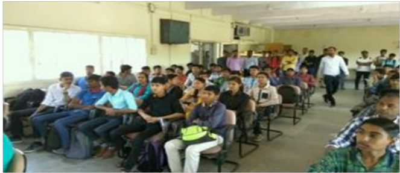

Figure 4.7.1.1 Expert lecture on Energy conservation

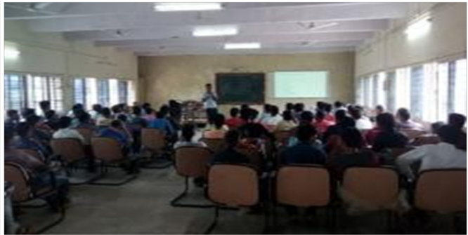

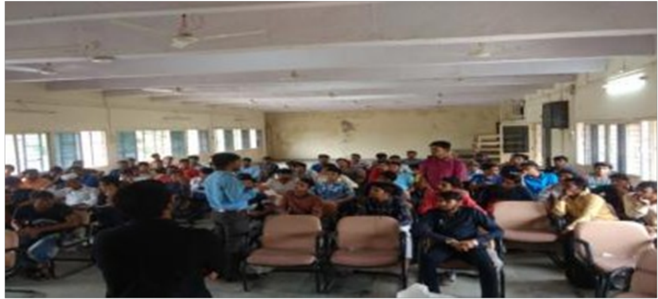

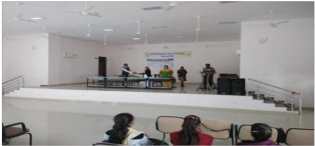

Figure 4.7.1.2 Expert lecture on Kaizen &amp; Qaulity Trends

Figure 4.7.1.3 Expert lecture on Recent Trends in Automobile Engineering

Figure 4.7.1.4 Expert lecture on Health Awareness Among Girl Child

Figure 4.7.1.5 Expert lecture on Laws Related to Women Safety

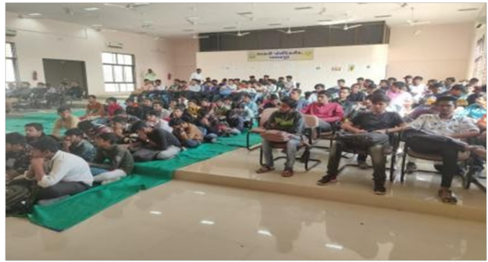

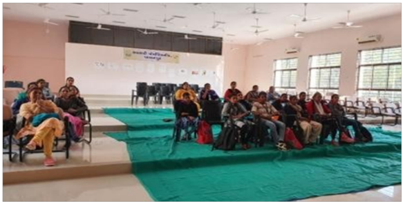

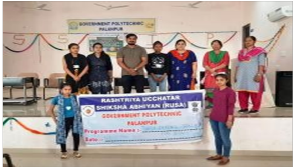

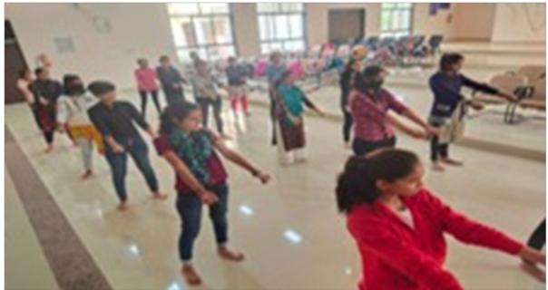

Figure 4.7.1.6 Expert lecture on ÒCreate a atmosphere of Excellence &amp; Equality among all sections of societyÓ

Figure 4.7.1.7 Expert lecture on ÒHealth Awareness Among Girl ChildÓ

Figure 4.7.1.8 Workshop on ÒSelf Defence Training for WomenÓ

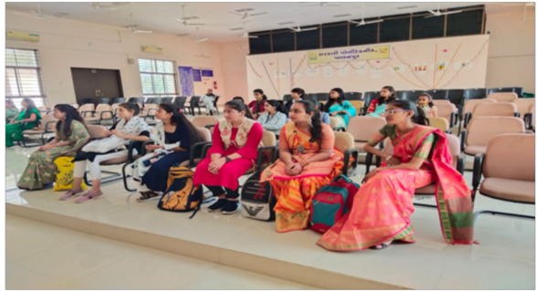

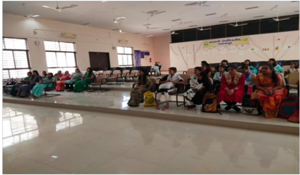

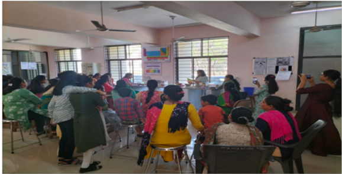

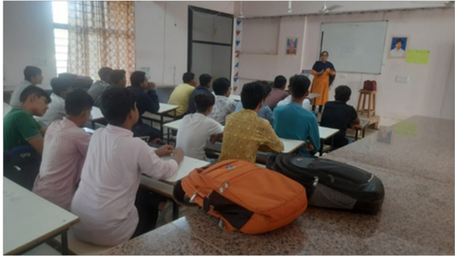

Figure 4.7.1.10 Expert lecture on Laws Related to Women Safety

Figure 4.7.1.11 Expert lecture on ÒDISADVA N TAGES OF MOBILE A N D I N TER N ETÓ

Figure 4.7.1.12 Expert lecture on ÒSELF EMPLOYME N T E N HA N CEME N TÓ

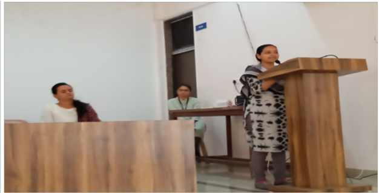

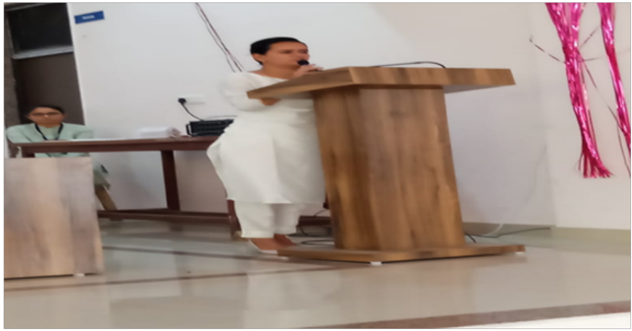

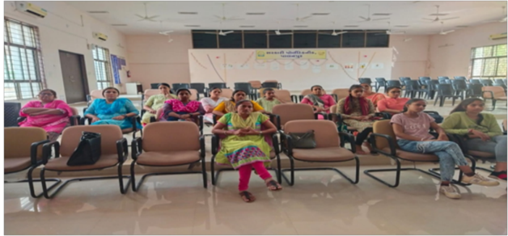

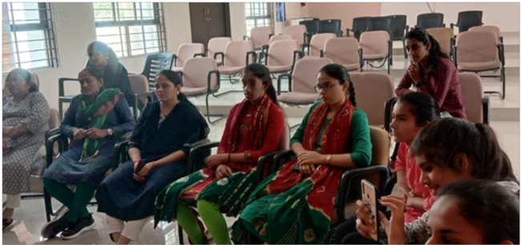

Figure 4.7.1.14 Expert lecture on ÒPREVE N TIO N OF FETICIDEÓ

Figure 4.7.1.15 Expert lecture on ÒGROUP COU N CELLI N GÓ

Figure 4.7.1.16 Expert lecture on ÒSELF EMPLOYME N T A N D E N HA N CEME N T FOR GIRLSÕ STUDE N TSÓ

Figure 4.7.1.17 Expert lecture on ÒMOTIVATIO N ALTALK FOR GIRLÕS STUDE N TSÓ

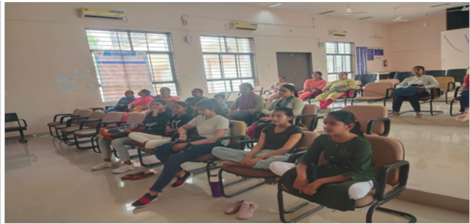

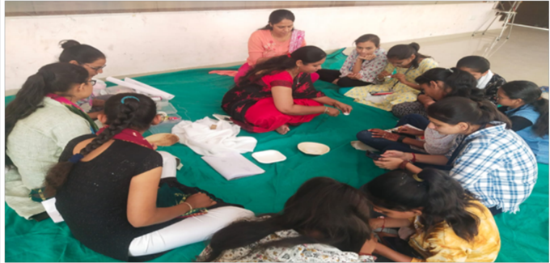

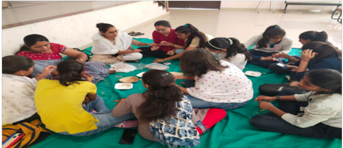

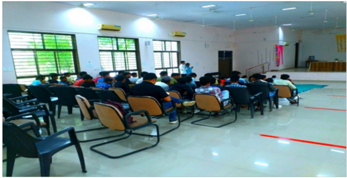

Figure 4.7.1.18 Expert lecture on ÒWOME N EMPOWERME N TFOR GIRLS STUDE N TSÓ

Figure 4.7.1.19 Expert lecture on ÒICE BREAKI N G ACTIVITY FOR GIRLSÕ STUDE N TSÓ

Figure 4.7.1.20 Expert lecture on ÒE N HA N CE CREATIVITY SKILLS FOR GIRLSÕ STUDE N TSÓ

Figure 4.7.1.21 Expert lecture on ÒE N TREPRE N EURSHIP DEVLOPME N TÓ

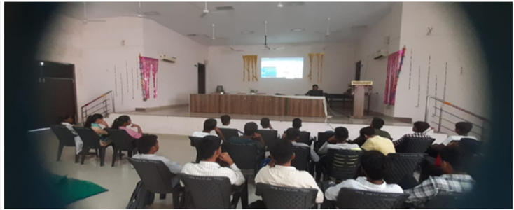

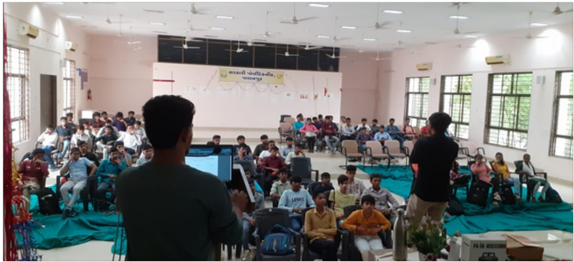

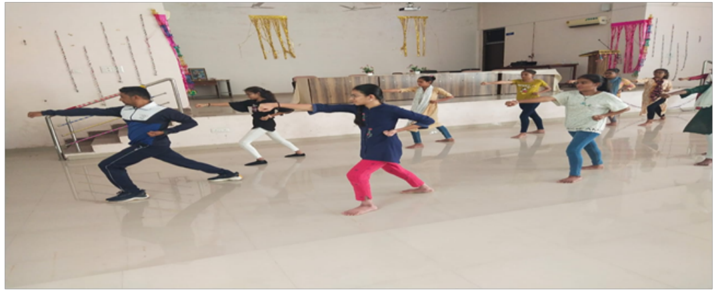

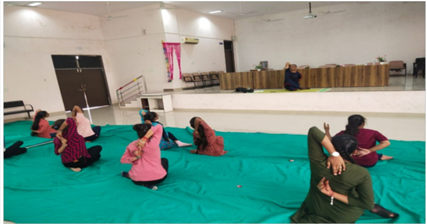

Figure 4.7.1.22 Expert lecture on ÒI NN OVATIO N S &amp; CREATIVITYÓ

Figure 4.7.1.23 Expert lecture on ÒSELF EMPLOYME N T A N D E N HA N CEME N TÓ

Figure 4.7.1.24 KARATE WORKSHOP FOR GIRLS

The Indian Society for Technical Education (ISTE) is the leading National Professional non-profit making Society for the Technical Education System in our country with the motto of Career Development of Teachers and Personality Development of Students and overall development of our Technical Education System.

Professional Societies/Chapters

Year

ISTE Chapter

Since 2021

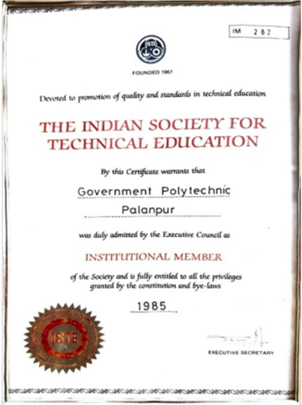

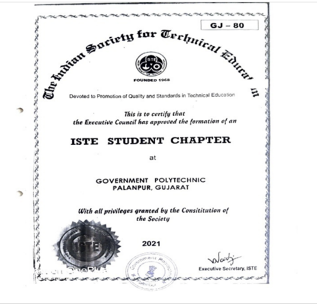

Table 4.7.1.2 ISTE Chapter

Figure 4.7.1.26   Institutional Member ISTE Chapter

Figute 4.7.1.27  ISTE Student Chapter

Activities under ISTE student chapter:

| Sr. No   | Organized Events and Titles   | Organized Period   | No. Of Participants   | No. of Days   | Resource Person   |
|----------|-------------------------------|--------------------|-----------------------|---------------|-------------------|
|          |                               | 07/04/2025         |                       |               |                   |

|   1 | Entrepreneurship Awareness Drive                            | To 08/04/2025   |   95 |   2 | CED (Center of Entrepreneurship Development)   |
|-----|-------------------------------------------------------------|-----------------|------|-----|------------------------------------------------|
|   2 | Expert Lecture on 'Drone Technologies'                      | 15/02/2025      |   36 |   1 | Organized by EC Department ,G.P.Palanpur       |
|   3 | Scratch Coding Competition                                  | 16/12/2025      |   12 |   1 | Organized by EC Department ,G.P.Palanpur       |
|   4 | Workshop on ' Introduction to RTL Design using Verilog HDL' | 15/04/2023      |   37 |   1 | Organized by EC Department ,G.P.Palanpur       |

Table 4.7.1.3 Activities under ISTE student chapter

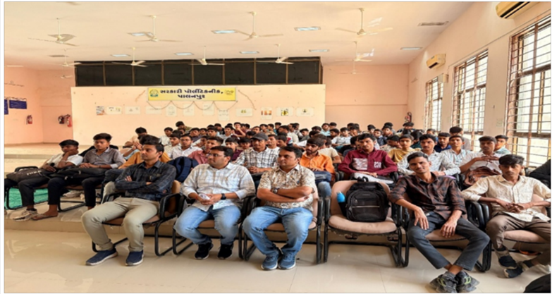

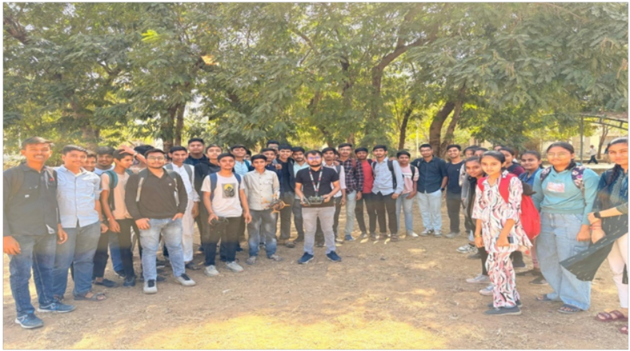

(a) Entrepreneurship Awareness Drive

(b) Expert Lecture on ÒDrone TechnologiesÓ

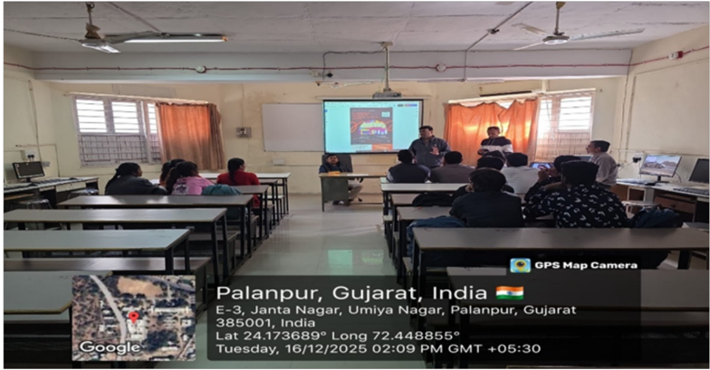

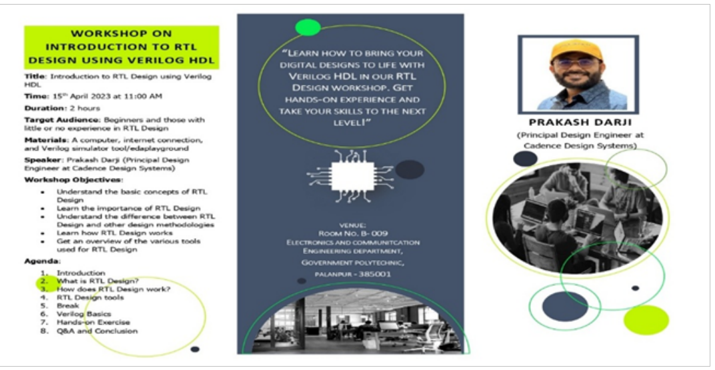

## Outcomes:

- Increased awareness among students about entrepreneurship as a career option
- Improved understanding of startup ecosystems, funding, and innovation
- Awareness of career opportunities in UAV and aerospace industries
- Understanding of real-world applications in agriculture, defense, surveillance, and logistics
- Improved logical thinking and problem-solving skills among participants
- Increased interest in programming and computational thinking

## B. Number, quality of engineering events (5)

- Various activities like Expert Lectures, Seminars, Guest Lectures and Career Guidance Programs are conducted to enhance various technical and professional skills among the students.
- Through these, we motivate our young, energetic, enthusiastic students to use their creative minds and their boundless imagination in the best possible way.
- With the help of this, students exhibit their talents which help in their career development and to elevate themselves onto excellent positions in the society.

## Academic Year 2025-26

| Sr No   | Title Of Event            | Date   | Type Of Event   | No. Of Student Participants   | Name of Expert/Place   |
|---------|---------------------------|--------|-----------------|-------------------------------|------------------------|
|         | IOT Application with ESP- |        | Technical       |                               | Mr. Rishabh            |

(c) Scratch Coding Competition

(d) Workshop on Ò Introduction to RTL Design using Verilog HDLÓ Figure 4.7.1.28 ISTE student chapter activities

Institute Marks

5.00

Figure 4.7.1.29 IOT Application with ESP-32, N OD-MCU, Rasberry Pi

|   1 | 32, NOD-MCU, Rasberry Pi                  | 07/10/2025   | Event           |   21 | Prajapati            |
|-----|-------------------------------------------|--------------|-----------------|------|----------------------|
|   2 | Cyber Crime Awareness and Crime Detection | 12/09/2025   | Technical Event |   35 | Prof. Manish Chauhan |

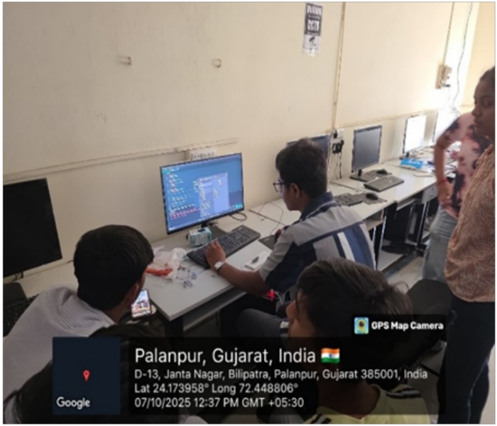

Figure 4.7.1.30 Cyber Crime Awareness and Crime Detection

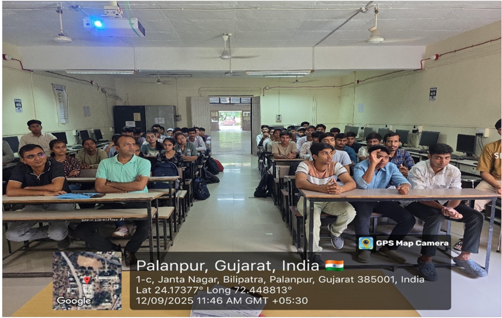

Industrial Visit (Academic Year 2025-26)

Sr

No.

Date

Area/Subject Of Industrial Visit

Name of

Industry

/Organization

Sem

Number

of

Students

Benefited

Name of Faculties Who Visited Industry

Table 4.7.1.4 Expert Lecture Detail 2025-26

|    |            |                      |                                              |     |   (EC & others) |                                 |
|----|------------|----------------------|----------------------------------------------|-----|-----------------|---------------------------------|
|  1 | 17/11/2025 | Communication System | COMMUNITY RADIOSTATION, PALANPUR             | 3   |              14 | Ms.M.K.Pedhadiya Dr. L.K.Patel  |
|  2 | 20/09/2025 | Computer Networking  | NETRAM (Command and Control Centre) Palanpur | 3,5 |              49 | Mr. M.J.Dabgar Mr. S.P.Joshiara |
|  3 | 05/08/2025 | Communication System | COMMUNITY RADIOSTATION, PALANPUR             | 1   |              14 | Mr. R.C.Parmar Mr. N.J.Chauhan  |

Table 4.7.1.5 Industrial Visit  Detail 2025-26

Figure 4.7.1.31 COMMU N ITY RADIO STATIO N , PALA N PUR

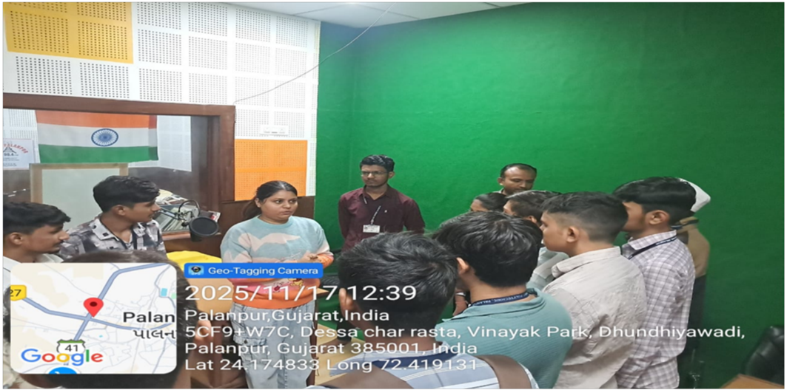

Figure 4.7.1.32 N ETRAM (Command and Control Centre) Palanpur

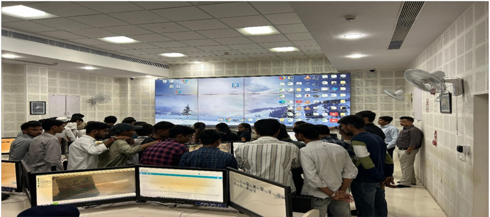

Figure 4.7.1.33 COMMU N ITY RADIO STATIO N , PALA N PUR

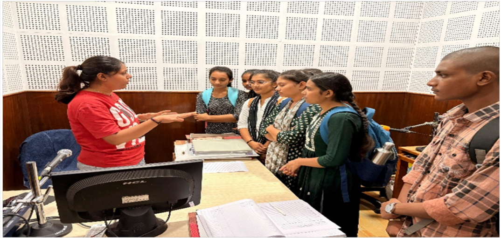

## Academic Year 2024-25

|   Sr No | Title Of Event             | Date       | Type Of Event   |   No. Of Student Participants (EC & others) | Name of Expert/Place   |
|---------|----------------------------|------------|-----------------|---------------------------------------------|------------------------|
|       1 | HAM Radio Workshop         | 14/02/2025 | Technical Event |                                          54 | Mr. N. B. Nadoda       |
|       2 | INTERNET OF THINGS         | 22/10/2024 | Expert Lecture  |                                          81 | DR. V K THAKAR         |
|       3 | AI-ML: A NEW ERA OF FUTURE | 30/09/2024 | Expert Lecture  |                                          91 | MR. VISHAL VADHER      |
|       4 | Embedded -IOT              | 30/09/2024 | Expert Lecture  |                                          91 | MR. VISHAL VADHER      |

Table 4.7.1.6 Expert Lecture Detail 2024-25

Figure 4.7.1.34 HAM Radio Workshop

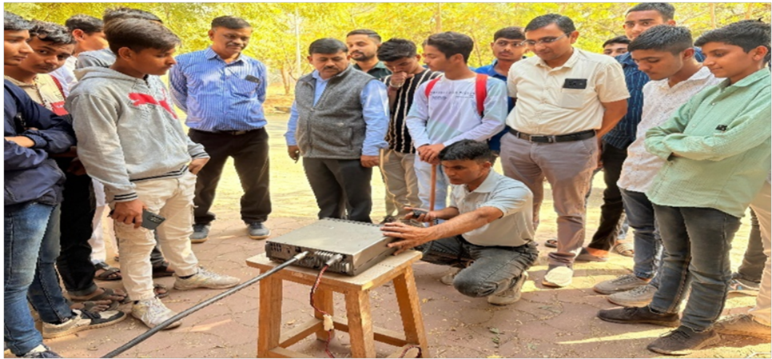

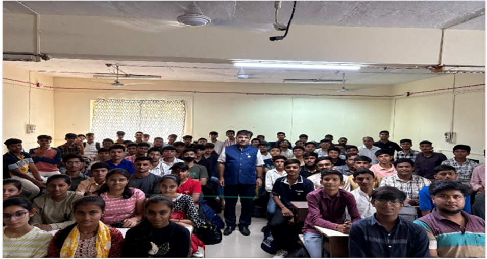

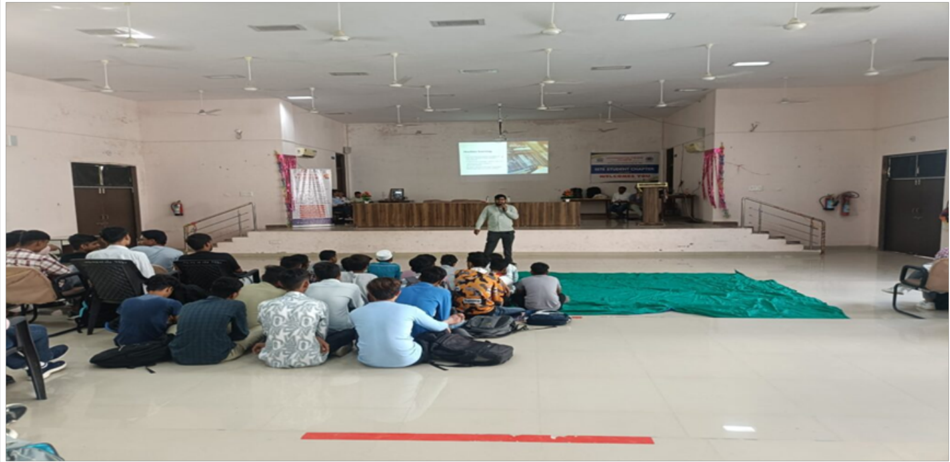

Figure 4.7.1.35  I N TER N ET OF THI N GS

## Industrial Visit (Academic Year 2024-25)

|   Sr No. | Date       | Area/Subject Of Industrial Visit   | Name of Industry /Organization    | Sem   |   Number of Students Benefited (EC & others) | Name of Faculties Who Visited Industry         |
|----------|------------|------------------------------------|-----------------------------------|-------|----------------------------------------------|------------------------------------------------|
|        1 | 16/10/2024 | Communication system               | COMMUNITY RADIOSTATION, PALANPUR  | 4     |                                           24 | Dr. R.N.Patel, Mr. S.P.Joshiara                |
|        2 | 05/10/2024 | Automation                         | BANAS DAIRY                       | 3, 5  |                                           37 | Dr. R.N.Patel, Mr. M.J.Dabgar Mr. S.P.Joshiara |
|        3 | 25/09/2024 | Fiber optics and communication     | RAILWAY STATION, PALANPUR         | 3,5   |                                           49 | Ms.M.K.Pedhadiya Mr. N.J.Chauhan               |
|        4 | 02/08/2024 | Automation                         | BAJARANG PAPERP RODUCTS, PALANPUR | 1     |                                           23 | Mr. N.J.Chauhan Mr. M.J.Dabgar                 |

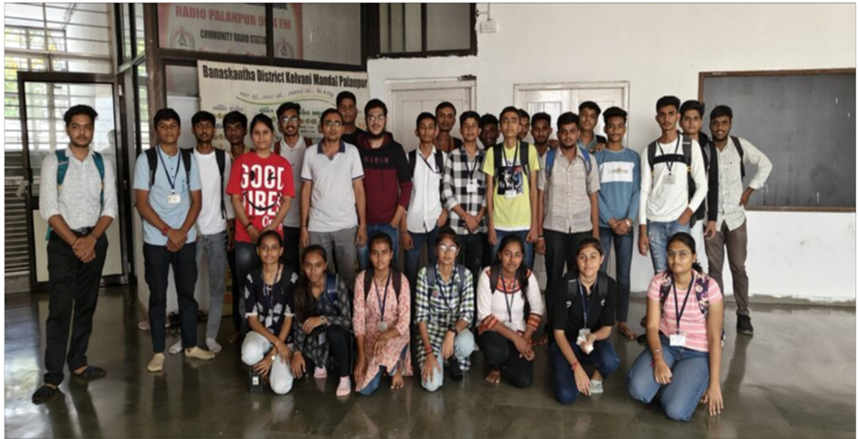

Table 4.7.1.7 Industrial Visit  Detail 2024-25

Figure 4.7.1.37 COMMU N ITY RADIO STATIO N , PALA N PUR

Figure 4.7.1.38 BA N AS DAIRY

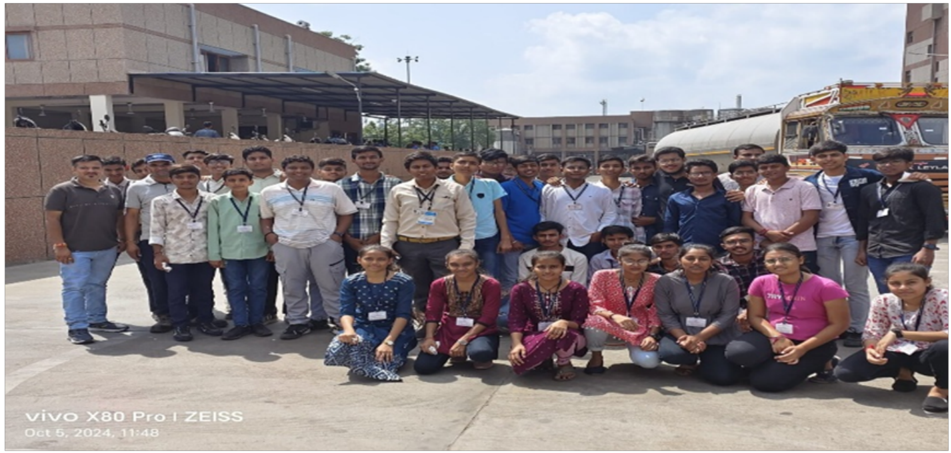

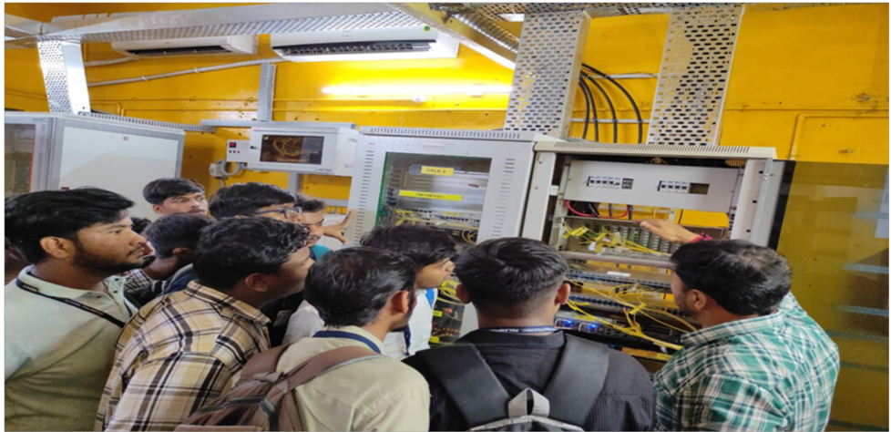

Figure 4.7.1.39 RAILWAY STATIO N , PALA N PUR

Figure 4.7.1.40 BAJARA N G PAPER PRODUCTS, PALA N PUR

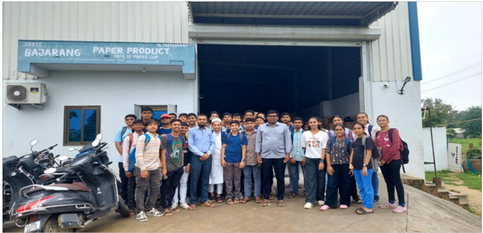

|   Sr No | Title Of Event                | Date       | Type Of Event   |   No. Of Student Participants(EC & others) | Name of Expert/Place        |
|---------|-------------------------------|------------|-----------------|--------------------------------------------|-----------------------------|
|       1 | Web development technologies  | 13/03/2024 | Expert Lecture  |                                         74 | MR. VISHAL VADHER           |
|       2 | Embedded System               | 13/03/2024 | Expert Lecture  |                                         74 | MR. VISHAL VADHER           |
|       3 | SEMICON INDIA-2023 Exhibition | 23/07/2023 | Technical Event |                                         27 | Mahatma Mandir, Gandhinagar |

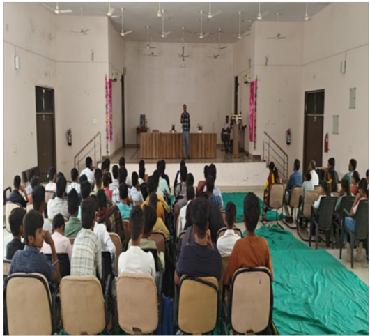

Figure 4.7.1.41 Web development technologies and Embedded System

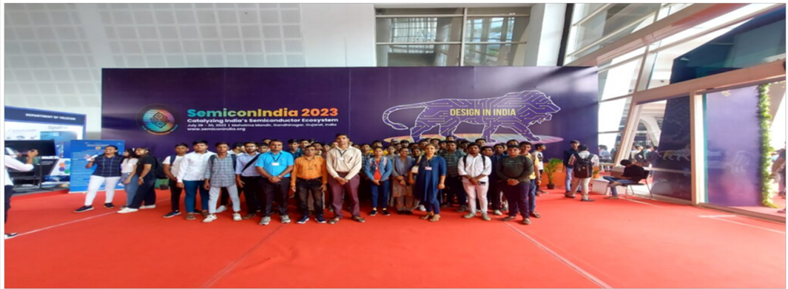

Figure 4.7.1.42 SEMICO N I N DIA-2023 Exhibition

Industrial Visit (Academic Year 2023-24)

Table 4.7.1.8 Expert Lecture Detail  2023-24

Table 4.7.1.9  Industrial Visit Detail  2023-24

|    |            |                                 |                                         |       |   (EC & others) |                                                 |
|----|------------|---------------------------------|-----------------------------------------|-------|-----------------|-------------------------------------------------|
|  1 | 16/03/2024 | Electronics and Embedded system | PCB POWER AND MCBS PVT LTD, GANDHINAGAR | 2,4,6 |              56 | Ms.M.K.Pedhadiya Dr. L.K.Patel, Mr. N.J.Chauhan |
|  2 | 01/08/2023 | Automation                      | BAJARANG PAPERPRODUCTS, PALANPUR        | 1     |              51 | Mr. S.J.Chauhan Mr. M.J.Dabgar                  |

Figure 4.7.1.43 PCB POWER A N D MCBS PVT LTD, GA N DHI N AGAR

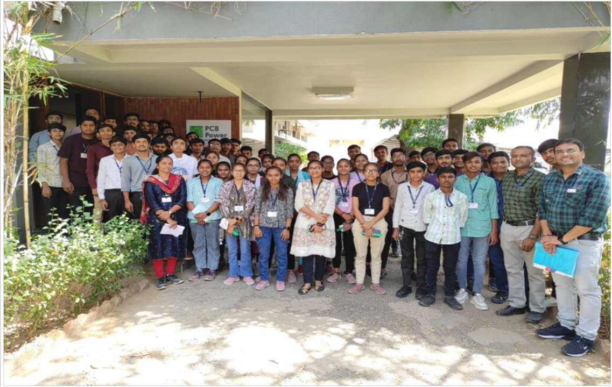

Figure 4.7.1.44 BAJARA N G PAPERPRODUCTS, PALA N PUR

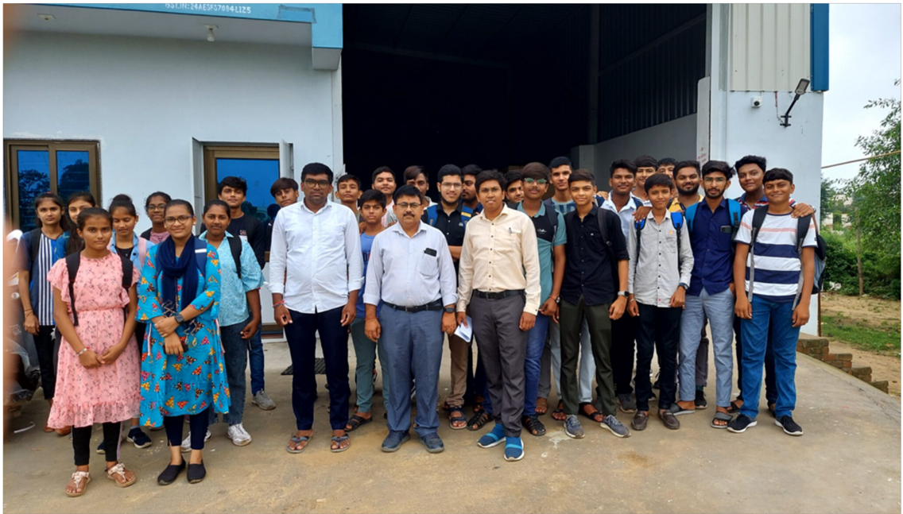

## Academic Year 2022-23

|   Sr No | Title Of Event                            | Date       | Type Of Event   |   No. Of Student Participants(EC & others) | Name of Expert/Place   |
|---------|-------------------------------------------|------------|-----------------|--------------------------------------------|------------------------|
|       1 | Cyber Security                            | 31/03/2023 | Expert Lecture  |                                         94 | Mr. Sagar Hajare       |
|       2 | Importance of Communication in industries | 08/09/2022 | Expert Lecture  |                                         05 | Mr. Jaimin Rami        |
|       3 | Future of Electronics in industries       | 06/08/2022 | Expert Lecture  |                                         34 | Mr. Prakash Darji      |

Table 4.7.1.9  Expert Lecture Detail  2022-23

Mr. Sagar Hajare Infrastructure Lead lood

Palanpur

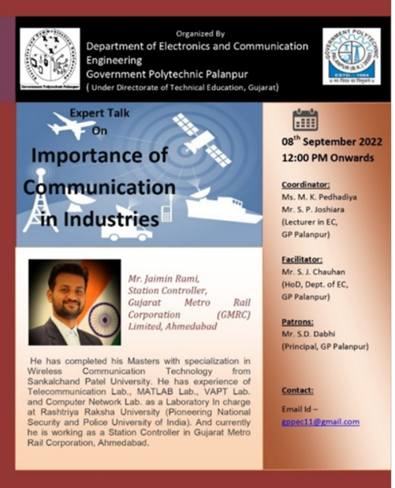

3:00 PM Onwards

GP Palanpur)

GP Palanpur)

Patrons: Mr. $0. Dabhl

Figure 4.7.1.45 Cyber Security

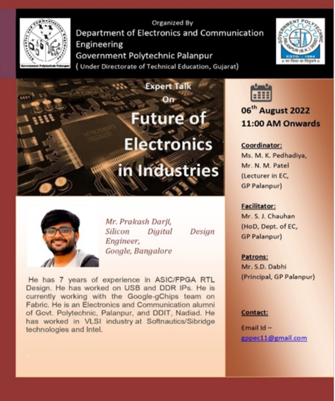

## Industrial Visit (Academic Year 2022-23)

|   Sr No. | Date       | Area/Subject Of Industrial Visit   | Name of Industry /Organization    | Sem   |   Number of Students Benefited (EC & others) | Name of Faculties Who Visited Industry   |
|----------|------------|------------------------------------|-----------------------------------|-------|----------------------------------------------|------------------------------------------|
|        1 | 10/05/2023 | Communication system               | COMMUNITY RADIO STATION, PALANPUR | 4     |                                           12 | Mr. S.J.Chauhan Mr. M.J.Dabgar           |
|        2 | 01/08/2023 | Mobile communication               | SAMSUNG SERVICE CENTRE, PALANPUR  | 2,4   |                                           19 | Dr. R.N.Patel, Mr. S.P.Joshiara          |
|        3 | 21/09/2022 | Automation                         | BAJARANG PAPERPRODUCTS, PALANPUR  | 1     |                                           23 | Mr. N.J.Chauhan                          |

Figure 4.7.1.47 Future of Electronics in industries

Table 4.7.1.9 Industrial Visit Detail  2022-23

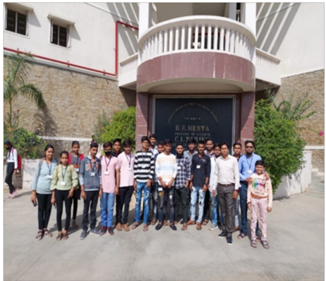

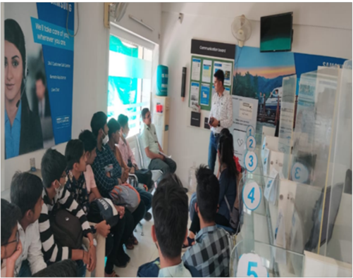

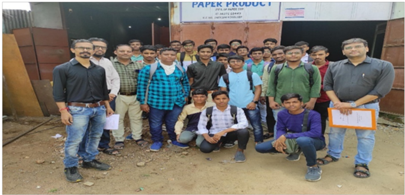

## Academic Year 2021-22

|   Sr No | Title Of Event             | Date       | Type Of Event   |   No. Of Student Participants(EC & others) | Name of Expert/Place   |
|---------|----------------------------|------------|-----------------|--------------------------------------------|------------------------|
|       1 | NAVIC and its applications | 29/01/2022 | Expert Lecture  |                                         29 | Dr. Mehulkumar         |

Figure 4.7.1.48 COMMU N ITY RADIO STATIO N , PALA N PUR

Figure 4.7.1.49 SAMSU N G SERVICE CE N TRE, PALA N PUR

Figure 4.7.1.50 BAJARA N G PAPERP RODUCTS, PALA N PUR

2

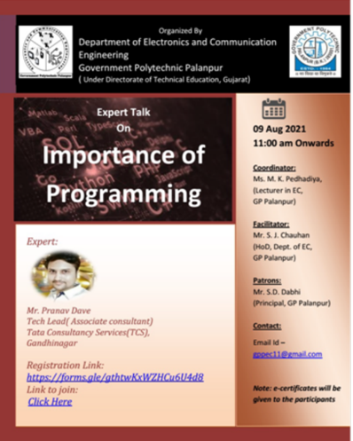

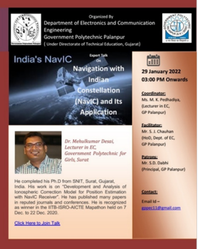

39

Figure 4.7.1.51 Importance of Programming

Figure 4.7.1.52 N AVIC and its applications

## Industrial Visit (Academic Year 2021-22)

|   Sr No. | Date       | Area/Subject Of Industrial Visit      | Name of Industry /Organization   |   Sem |   Number of Students Benefited (EC & others) | Name of Faculties Who Visited Industry   |
|----------|------------|---------------------------------------|----------------------------------|-------|----------------------------------------------|------------------------------------------|
|        1 | 02/05/2022 | Fundamental of electrical engineering | J K INDUSTRIES, CHANDISAR        |     2 |                                           14 | Mr. N.M.Patel                            |

|   2 | 12/04/2022   | Optical Communication   | SAHAJANAND LASER TECH, GANDHINAGAR   |   4 |   4 | Mr. M.J.Dabgar                               |
|-----|--------------|-------------------------|--------------------------------------|-----|-----|----------------------------------------------|
|   3 | 29/03/2022   | Mobile Communication    | SAMSUNG CARE, PALANPUR               |   4 |  15 | Mr.N.J.Chauhan Mr. N.M.Patel, Mr. R.C.Parmar |
|   4 | 26/03/2022   | Communication system    | COMMUNITY RADIO STATION, PALANPUR    |   6 |  14 | Mr. M.J.Dabgar Mr. N.M.Patel                 |

Table 4.7.1.11 Industrial Visit Detail 2021-22

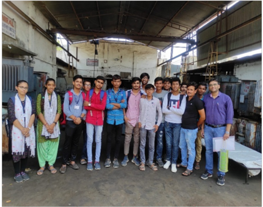

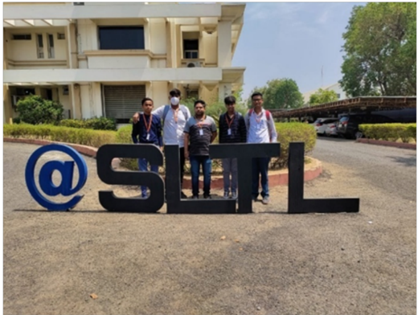

Figure 4.7.1.53 J K I N DUSTRIES, CHA N DISAR

Figure 4.7.1.54 SAHAJA N A N D LASER TECH, GA N DHI N AGAR

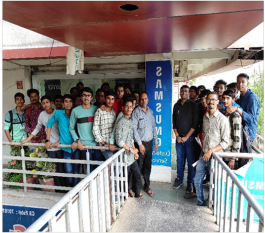

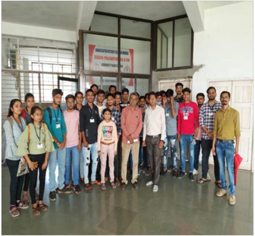

## Academic Year 2020-21

|   Sr No | Title Of Event                                       | Date       | Type Of Event   |   No. Of Student Participants(EC & others) | Name of Expert/Place   |
|---------|------------------------------------------------------|------------|-----------------|--------------------------------------------|------------------------|
|       1 | Digital Communication basics realization with MATLAB | 19/03/2021 | Expert Lecture  |                                         17 | Dr. Urvashi P. Shukla  |
|       2 | VLSI Low Power Techniques                            | 03/03/2021 | Expert Lecture  |                                         20 | Mr. Nishant Patel      |
|       3 | PCB Design                                           | 10/10/2020 | Expert Lecture  |                                         23 | Mr. Ankit Tundeliya    |
|       4 | Basic of Chip Design                                 | 26/09/2020 | Expert Lecture  |                                         22 | Mr. Abhishek Joshi     |

Figure 4.7.1.55 SAMSU N G CARE, PALA N PUR

Figure 4.7.1.56 CMMU N ITY RADIO STATIO N , PALA N PUR

Department of Electronics and Communication Engincerine Government Polytechnlc Palanpur

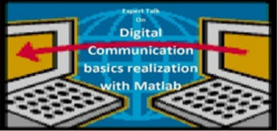

19 March 2021 11-00 AM Onwards

Dr Urvash /. Shukla, Department Computer

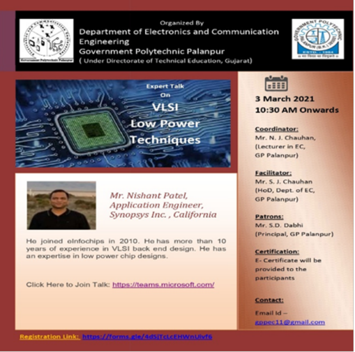

Figure 4.7.1.57 Digital Communication basics realization with MATLAB

Figure 4.7.1.58 VLSI Low Power Techniques

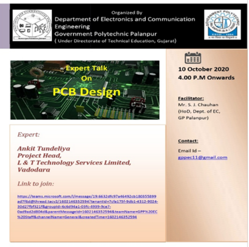

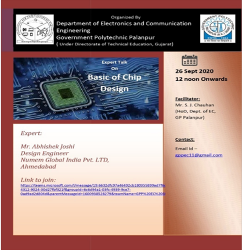

4.7.2 Publication of technical magazines, newsletters, etc. (5)

A. Quality &amp; Relevance of the contents and Print Material (3)

Electronics &amp; Communication department publishes yearly newsletter that broadly includes Vision and Mission of Department and Institute, PSOs, Photographs related to Departmental Curricular activities and Institute Co-Curricular activities, Technical blogs and Placement of students.

- All the newsletters can be viewed from the link: https://gppalanpur.ac.in/newsletters/spectrum/interactive GP Palanpur

Figure 4.7.1.59 PCB Design

Figure 4.7.1.60 Basic of Chip Design

Institute Marks

Institute Marks

3.00

- The head of Department is the chief editor and designated faculty and student coordinator yearly provide volunteer contribution for proof reading and selection of contents that has key thrust on upcoming technologies and development in the field of electronics and communication and research.

## List of Publication of Newsletters in CAY (2024-2025)

| Year    | Publication Name   | Chief Editor/Faculty coordinator                                            | NameoftheStudents                                |
|---------|--------------------|-----------------------------------------------------------------------------|--------------------------------------------------|
| 2024-25 | Spectrum (Band-IV) | Mr. S.J.Chauhan, HOD EC (Chief Editor) Mr. Milav Dabgar (FacultyCoordinator | MALI BHAVIN ASHOKBHAI MODI JAINILKUMAR DIPAKBHAI |

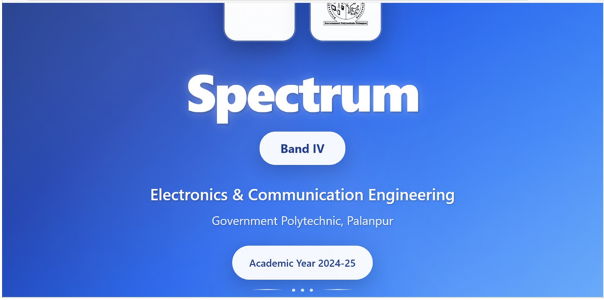

List of Publication of Newsletters in CAYm1 (2023-2024)

| Year    | Publication Name    | Chief Editor/Faculty coordinator                                            | NameoftheStudents                                          |
|---------|---------------------|-----------------------------------------------------------------------------|------------------------------------------------------------|
| 2023-24 | Spectrum (Band-III) | Mr. S.J.Chauhan, HOD EC (Chief Editor) Mr. Milav Dabgar (FacultyCoordinator | DAVE FALGUNI JITENDRAKUMAR PRAJAPATI PRINCEKUMAR DILIPBHAI |

2.00

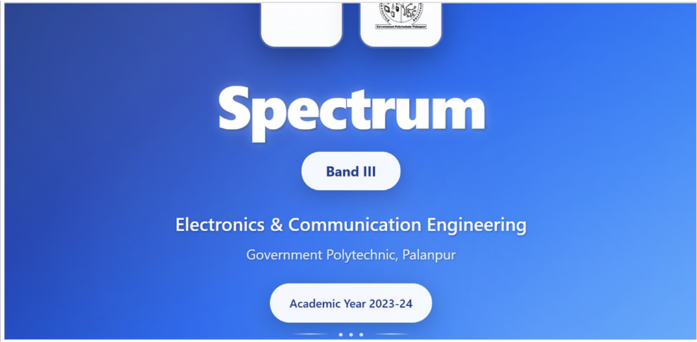

List of Publication of Newsletters in CAYm2 (2022-2023)

| Year    | Publication Name   | Chief Editor/Faculty coordinator                                            | NameoftheStudents                               |
|---------|--------------------|-----------------------------------------------------------------------------|-------------------------------------------------|
| 2022-23 | Spectrum (Band-II) | Mr. S.J.Chauhan, HOD EC (Chief Editor) Mr. Milav Dabgar (FacultyCoordinator | PANCHAL SHUBH KIRANBHAI PATEL AKSHAR DILIPKUMAR |

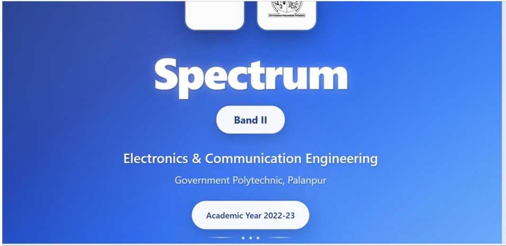

List of Publication of Newsletters in CAYm2 (2021-2022)

| Year    | Publication Name   | Chief Editor/Faculty coordinator                                            | NameoftheStudents        |
|---------|--------------------|-----------------------------------------------------------------------------|--------------------------|
| 2021-22 | Spectrum (Band-I)  | Mr. S.J.Chauhan, HOD EC (Chief Editor) Mr. Milav Dabgar (FacultyCoordinator | PAWAR BHARAT SHANKARLAL  |
| 2021-22 | Spectrum (Band-I)  |                                                                             | RAVAL STUTIBEN AMITKUMAR |

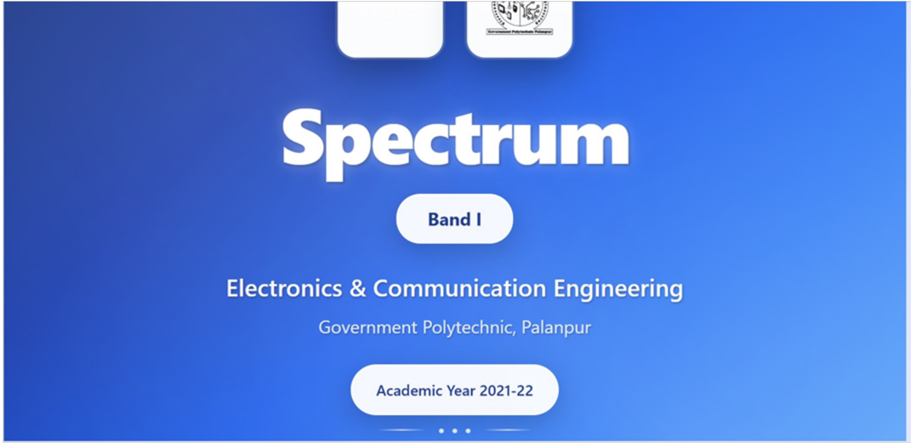

4.7.3 Participation in inter-institute / state/national events by students of the program of study (5)

Electronics &amp; Communication department have encouraged and motivated students to participate in technical events with strong support of department faculties and head of department.

|   Sr No. |   Enrollment No. | Name of Student        | Name of Event   | Place                     | YearOutcome   |
|----------|------------------|------------------------|-----------------|---------------------------|---------------|
|        1 |     236260311003 | MALI PARESH RAMESHBHAI | G3Q 2.0         | Government of Gujarat2024 |               |
|        2 |     236260311007 | PRAJAPATI SHAILESH     | G3Q 2.0         | Government of Gujarat2024 | Winner        |

Institute Marks

5.00

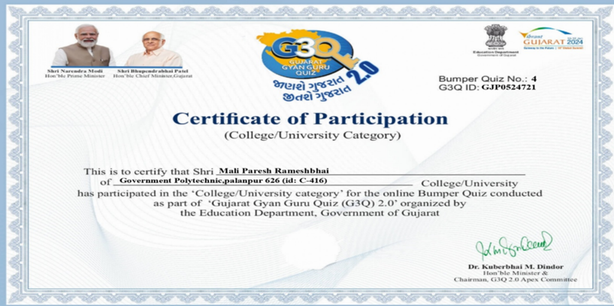

| Sr.No                 | Title of Event        | Dates                 | No. of Partici pants   | Place/ Institute Name    | Sponsor/ Collaboration   | Level of Event (Zonal/State/National)   |
|-----------------------|-----------------------|-----------------------|------------------------|--------------------------|--------------------------|-----------------------------------------|
| Academic Year 2022-23 | Academic Year 2022-23 | Academic Year 2022-23 | Academic Year 2022-23  | Academic Year 2022-23    | Academic Year 2022-23    | Academic Year 2022-23                   |
| 1                     | Placement Fair        | 10/03/2023            | 5                      | G.P.Palanpur             | KCG                      | Zonal Level                             |
| Academic Year 2023-24 | Academic Year 2023-24 | Academic Year 2023-24 | Academic Year 2023-24  | Academic Year 2023-24    | Academic Year 2023-24    | Academic Year 2023-24                   |
| 1                     | Placement Fair        | 11/03/2024            | 5                      | DNP arts College , Deesa | KCG                      | Zonal Level                             |
| Academic Year 2024-25 | Academic Year 2024-25 | Academic Year 2024-25 | Academic Year 2024-25  | Academic Year 2024-25    | Academic Year 2024-25    | Academic Year 2024-25                   |
| 1                     | Placement Fair        | 25/02/2025            | 7                      | G.P.Palanpur             | KCG                      | Zonal Level                             |
| Academic Year 2025-26 | Academic Year 2025-26 | Academic Year 2025-26 | Academic Year 2025-26  | Academic Year 2025-26    | Academic Year 2025-26    | Academic Year 2025-26                   |
| 1                     | Placement Fair        | 24/02/2026            | 6                      | DNP arts College , Deesa | KCG                      | Zonal Level                             |

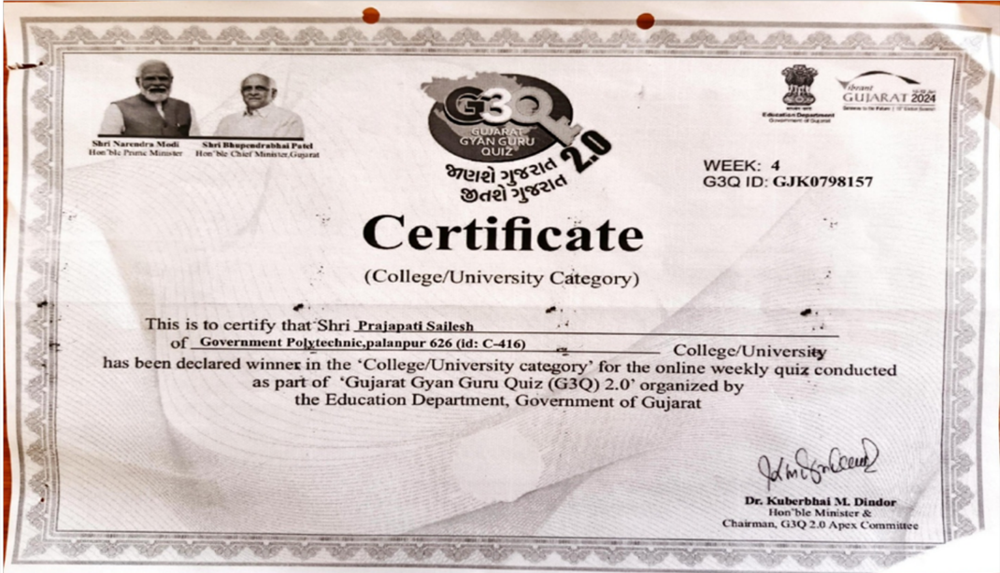

|                          |        | Area of Specialization                | Contribution to the program(% load)   | Contribution to the program(% load)   | Contribution to the program(% load)   | Research Paper   | Name University Degree   | Current   | Initial Date of   |         |     |                    | IS   |
|--------------------------|--------|---------------------------------------|---------------------------------------|---------------------------------------|---------------------------------------|------------------|--------------------------|-----------|-------------------|---------|-----|--------------------|------|
|                          |        | Area of Specialization                | CAY (2025- 26)                        | CAYm1 (2024-25)                       | CAYm2 (2023-24) Publications          | Research Paper   | Name University Degree   | Current   | Initial Date of   |         |     |                    | IS   |
| Mr. Sunil J.             | M.E.   | COMMUNICATION SYSTEM ENGG.            | 42                                    | 40                                    | 69                                    | 0                |                          | HOD       | 07/12/1993        | Regular | Yes | Chauhan            | No   |
| Ms. Mittal K. Pedhadiya  | M.Tech | WIRELESS COMMUNICATION AND TECHNOLOGY | 50                                    | 32                                    | 46                                    | 1                |                          | Lecturer  | 26/04/2011        | Regular | Yes |                    | No   |
| Dr. Laukikkumar K. Patel | Ph.D   | ELECTRONICS AND COMMUNICATION         | 30                                    | 35                                    | 36                                    | 1                |                          | Lecturer  | 28/04/2011        | Regular | Yes |                    | No   |
| Dr. Ratansing N. Patel   | Ph.D   | ELECTRONICS AND COMMUNICATION         | 63                                    | 62                                    | 61                                    | 1                |                          | Lecturer  | 28/10/2016        | Regular | Yes |                    | No   |
| Mr. Milav J. Dabgar      | M.E.   | COMMUNICATION SYSTEM ENGG.            | 18                                    | 23                                    | 31                                    | 0                |                          | Lecturer  | 02/11/2016        | Regular | Yes |                    | No   |
| Mr. Rahul C. Parmar      | M.E.   | COMMUNICATION SYSTEM ENGG.            | 48                                    | 56                                    | 50                                    | 0                |                          | Lecturer  | 28/10/2016        | Regular | Yes |                    | No   |
| Joshiara                 | B.E.   | ELECTRONICS AND COMMUNICATION         | 67                                    | 61                                    | 35                                    | 0                |                          | Lecturer  | 25/05/2017        | Regular | Yes | Mr. Snehilkumar P. | No   |
| Mr. Nirav J. Chauhan     | M.E.   | COMMUNICATION SYSTEM ENGG.            | 45                                    | 37                                    | 35                                    | 3                |                          | Lecturer  | 01/07/2017        | Regular | Yes |                    | No   |
| Mr. Chetan P. Gehlot     | M.Phil | MATHS                                 | 10                                    | 15                                    | 11                                    | 0                |                          | Lecturer  | 17/12/2009        | Regular | Yes |                    | No   |
| Dr. Chirag S. Pandya     | Ph.D   | ENGLISH                               | 19                                    | 10                                    | 10                                    | 0                |                          | Lecturer  | 26/05/2011        | Regular | Yes |                    | No   |
| Dr. Bhupendra B Mor      | Ph.D   | PHYSICS                               | 24                                    | 13                                    | 14                                    | 6                |                          | Lecturer  | 06/02/2012        | Regular | Yes |                    | No   |
| Dr. Mahesh F. Tank       | Ph.D   | chemistry                             | 12                                    | 12                                    | 0                                     | 0                |                          | Lecturer  | 08/02/2010        | Regular | Yes |                    | No   |
| Dr. Jigna D. Modi        | Ph.D   | chemistry                             | 0                                     | 6                                     | 0                                     | 0                |                          | Lecturer  | 08/10/2010        | Regular | Yes |                    | No   |
| Mr. Chirag M.            | M.E.   | MECHANICAL                            | 0                                     | 4                                     | 0                                     | 0                |                          | Lecturer  | 09/11/2016        | Regular | Yes | Amin               | No   |
|                          | B.E.   | MECHANICAL                            | 0                                     | 4                                     | 0                                     | 0                |                          | Lecturer  | 28/10/2016        | Regular | Yes | Mr. Tarun D. Modi  | No   |
| Mr. Sandip P.            | B.E.   | MECHANICAL                            | 0                                     | 38                                    | 0                                     | 0                |                          | Lecturer  | 28/10/2016        | Regular | Yes | Mahant             | No   |
| Mr. Rajesh L. Chaudhari  | B.E.   | MECHANICAL                            | 0                                     | 0                                     | 17                                    | 0                |                          | Lecturer  | 28/10/2016        | Regular | Yes |                    | No   |
| Mr. Dhanraj P.           | B.E.   | MECHANICAL                            | 0                                     | 0                                     | 14                                    | 0                |                          | Lecturer  | 28/10/2016        | Regular | Yes | Judal              | No   |
| Mr. Ashfaq M.            | M.E.   | ELECTRICAL ENGG.                      | 0                                     | 13                                    | 0                                     | 0                |                          | Lecturer  | 15/11/2016        | Regular | Yes | Qureshi            | No   |
| Mr. Ravindra P. Chavda   | M.E.   | ELECTRICAL ENGG.                      | 0                                     | 4                                     | 0                                     | 0                |                          | Lecturer  | 17/05/2017        | Regular | Yes |                    | No   |
| Shah                     | B.E.   | IC                                    | 0                                     | 0                                     | 100                                   | 0                |                          | Lecturer  | 14/02/1997        | Regular | Yes | Mrs. Meghana M.    | No   |
| Mr. Mahesh J. Vadhvaniya | B.E.   | IC                                    | 50                                    | 0                                     | 33                                    | 0                |                          | Lecturer  | 17/11/2000        | Regular | Yes |                    | No   |
| Mr. Jabbar V.            | M.E.   | IC                                    | 0                                     | 0                                     | 17                                    | 0                |                          | Lecturer  | 20/10/2015        | Regular | Yes | Kureshi            | No   |

## 5.1 Student-Faculty Ratio (SFR) (25)

## Total Marks 25.00

## Institute Marks

25

| Year         |   N |    F |   SFR=N/F |
|--------------|-----|------|-----------|
| 2025-26(CAY) |  90 | 4.78 |     18.83 |

| 2024-25(CAYm1)   |   90 | 4.65 19.35   |
|------------------|------|--------------|
| 2023-24(CAYm2)   |   91 | 5.79 15.72   |

## Average SFR : 17.97

## Assesement SFR : 25

## 5.1.1. Provide the information about the regular and contractual faculty as per the format mentioned below:

|                |   Total number of regular faculty in the department |   Total number of contractual faculty in the department |
|----------------|-----------------------------------------------------|---------------------------------------------------------|
| 2025-26(CAY)   |                                                   7 |                                                       0 |
| 2024-25(CAYm1) |                                                  11 |                                                       0 |
| 2023-24(CAYm2) |                                                  11 |                                                       0 |

## 5.2 Faculty Qualification (25)

## Total Marks 21.33

## 5.2.1 Faculty Qualification Index (20)

## Institute Marks

16.33

|         |   X |   Y |   F |   FQ = 2 x [(10X + 7Y) / F )] |
|---------|-----|-----|-----|-------------------------------|
| 2025-26 |   2 |   1 |   4 |                          13.5 |
| 2024-25 |   2 |   1 |   4 |                          13.5 |
| 2023-24 |   3 |   2 |   4 |                          22   |

Average Assessment : 16.33

## 5.2.2 Availability of Faculty/principal of that discipline with PhD. Qualification (5)

Availability of Faculty/principal of that discipline with PhD. Qualification ? : NO

## 5.3 Faculty Retention (20)

Institute Marks

0

## Total Marks 20.00

## Institute Marks

20.00

| Description                   |   2024-25 (CAYm1) |   2025-26 (CAY) |
|-------------------------------|-------------------|-----------------|
| No of Faculty Retained        |                11 |              11 |
| Total No. of Required Faculty |                 4 |               4 |
| % of Faculty Retained         |               275 |             275 |

Average : 275.00

Assessment Marks : 20.00

| Name of the faculty                                                  | Max 5 Per Faculty   | Max 5 Per Faculty   | Max 5 Per Faculty   |
|----------------------------------------------------------------------|---------------------|---------------------|---------------------|
| Name of the faculty                                                  | 2022-23 (CAYm3)     | 2023-24 (CAYm2)     | 2024-25 (CAYm1)     |
| Dr. Bhupendra B Mor                                                  | 5.00                | 5.00                | 0.00                |
| Dr. Chirag S. Pandya                                                 | 5.00                | 5.00                | 0.00                |
| Dr. Jigna D. Modi                                                    | 2.00                | 5.00                | 5.00                |
| Dr. Laukikkumar  K. Patel                                            | 2.00                | 5.00                | 5.00                |
| Dr. Mahesh F. Tank                                                   | 5.00                | 5.00                | 0.00                |
| Dr. Ratansing N. Patel                                               | 2.00                | 5.00                | 5.00                |
| Mr. Ashfaq M. Qureshi                                                | 5.00                | 5.00                | 0.00                |
| Mr. Chetan P. Gehlot                                                 | 5.00                | 5.00                | 0.00                |
| Mr. Chirag M. Amin                                                   | 5.00                | 5.00                | 5.00                |
| Mr. Dhanraj P. Judal                                                 | 0.00                | 4.00                | 5.00                |
| Mr. Jabbar V. Kureshi                                                | 0.00                | 5.00                | 0.00                |
| Mr. Mahesh J. Vadhvaniya                                             | 5.00                | 5.00                | 0.00                |
| Mr. Milav J. Dabgar                                                  | 0.00                | 2.00                | 5.00                |
| Mr. Nirav J. Chauhan                                                 | 2.00                | 5.00                | 5.00                |
| Mr. Rahul C. Parmar                                                  | 0.00                | 0.00                | 5.00                |
| Mr. Rajesh L. Chaudhari                                              | 2.00                | 5.00                | 5.00                |
| Mr. Ravindra P. Chavda                                               | 2.00                | 5.00                | 5.00                |
| Mr. Sandip P. Mahant                                                 | 5.00                | 5.00                | 5.00                |
| Mr. Snehilkumar P. Joshiara                                          | 0.00                | 2.00                | 5.00                |
| Mr. Sunil J. Chauhan                                                 | 3.00                | 1.00                | 5.00                |
| Mr. Tarun D. Modi                                                    | 5.00                | 5.00                | 5.00                |
| Ms. Mittal K. Pedhadiya                                              | 5.00                | 5.00                | 1.00                |
| Sum                                                                  | 65.00               | 94.00               | 71.00               |
| RF = Number of Faculty required to comply with 25 : 1 SFR as per 5.1 | 3.64                | 3.60                | 3.60                |
| Assessment [6*(Sum / 0.5RF)](Marks limited to 30)                    | 30.00               | 30.00               | 30.00               |

## 5.4. a. Organized/ Conducted FDPs and STTP by this department at State / National Level (12)

## Table 5.4.1 Expert Sessions Organized

|   Sr. No. | Session Title                                        |                       | Name Of External Professional Designation / Education Of Expert   | Expert Institute/Company                          | Date       |
|-----------|------------------------------------------------------|-----------------------|-------------------------------------------------------------------|---------------------------------------------------|------------|
|         1 | VLSI Low Power Techniques                            | Mr. Nishant Patel     | Application Engineer B.E.E.C.                                     | Synopsys Inc.California                           | 03/03/2021 |
|         2 | Digital Communication Basics Realization With Matlab | Dr. Urvashi P. Shukla | Assistant Professor Phd Ec                                        | Bansanthali Vidhyapith                            | 03/19/2021 |
|         3 | Importance Of Programming                            | Mr. Pranav Dave       | Associate Consultant MCA                                          | TCS Gandhinagar                                   | 09/08/2021 |
|         4 | NAVIC And Its Applications                           | Dr. Mehulkumar        | Lecturer Phd Ec                                                   | GGP Surat                                         | 01/29/2022 |
|         5 | Future Of Electronics In Industries                  | Mr. Prakash Darji     | Design Engineer Be Ec                                             | Google Banglore                                   | 06/08/2022 |
|         6 | Importance Of Communication In Industries            | Mr. Jaimin Rami       | Station Controller Me Ec                                          | Jmrc, Ahmedabad                                   | 08/09/2022 |
|         7 | Cyber Security                                       | Mr. Sagar Hajare      | Security Expert                                                   | Bank Of America                                   | 03/31/2023 |
|         8 | Fabrication Of Solar Cell                            | Mr. Sandip Joshi      | Jr. Engineer Diploma Ec                                           | Adani Power Ltd.                                  | 10/18/2023 |
|         9 | Embedded System                                      | Mr. Vishal Vadher     | Assistant Manager Training, B.E.E.C.                              | Sofcon India Pvt Ltd                              | 03/13/2024 |
|        10 | Web Development Technologies                         | Mr. Vishal Vadher     | Assistant Manager Training, B.E.E.C.                              | Sofcon India Pvt Ltd                              | 03/13/2024 |
|        11 | AI-ML: A New Era Of Future                           | Mr. Vishal Vadher     | Assistant Manager Training, B.E.E.C.                              | Sofcon India Pvt Ltd                              | 09/30/2024 |
|        12 | Internet Of Things                                   | Dr. V K Thakar        | Dean, Indrashil University, Ph.D.                                 | Indrashil University                              | 10/22/2024 |
|        13 | Career Guidance For EC Engineers                     | Mr. Krishna Panchal   | Associate Engineer, B.E.E.C.                                      | E-Infochips                                       | 11/10/2024 |
|        14 | Ham Radio Workshop                                   | Mr. N. B. Nadoda      | Senior Lecturer                                                   | GGP, Ahmedabad                                    | 02/14/2025 |
|        15 | Drone Technologies                                   | Mr. Yuvrajsinh Rajput | Founder                                                           | Bee-Robokits Academy, Palanpur                    | 02/15/2025 |
|        16 | Cyber Crime Awareness                                | Mr. Manish S Chauhan  | Assistant Professor                                               | GEC Modasa                                        | 09/12/2025 |
|        17 | IoT Applications with Node MCU & Raspberry Pi        | Mr. Rishabh Prajapati | Co-Founder                                                        | Bee-Robokids Innovation Private Limited10/07/2025 |            |

## Total Marks 12.00

## Institute Marks

12.00

## Achievement Summary:

- 17 Expert Sessions : Comprehensive coverage of emerging technologies
- Industry Collaboration :9 sessions by industry professionals from Google, TCS, Bank of America, Synopsys, etc.
- Academic Partnership : 8 sessions by academic experts from universities and research institutions
- Contemporary Topics : VLSI, IoT, AI-ML, Embedded Systems, Cyber Security, Drone Technology

Student Benefit : Exposure to industry practices and career guidance

## 5.5 Product development, Consultancy, Manufacturing contracts, testing contracts (8)

Our faculties perform and serve various duties other than classroom teaching as detailed out below.

## Contributions other than classroom teaching:

## Civic Duties

- Citizen Service Support - RTO Help Center
- Democratic Engagement - Election Duties
- Public Service - Government Examination Duties

## Educational Contributions

- Academic Contribution - Syllabus &amp; Lab Manual Development (GTU)

## Student Support &amp; Career Development

- Career Facilitation - Placement Fair

Figure 5.4.1 Expert Sessions

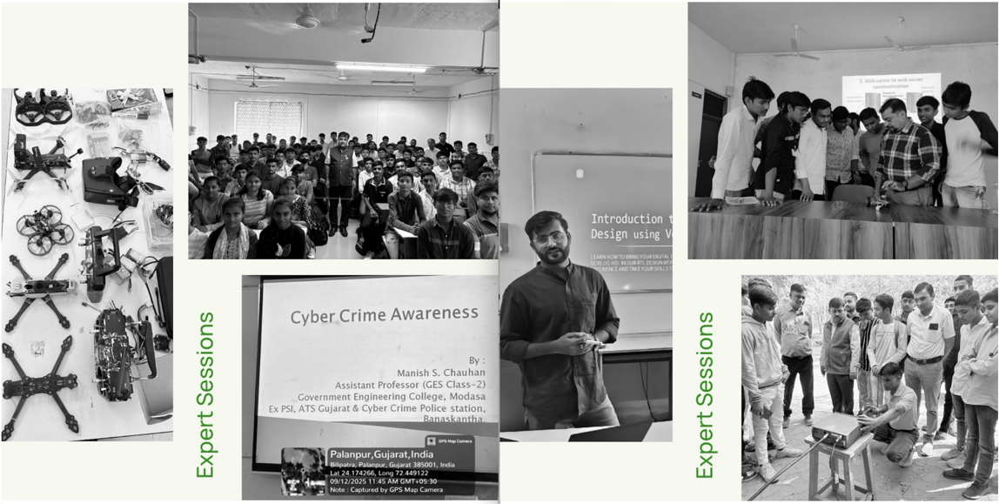

## Table 5.5.1 Patent Details

| Faculty Name             | Patent TypeStatus        | Application No. Date                         |            |
|--------------------------|--------------------------|----------------------------------------------|------------|
| Shri N. J. ChauhanDesign | Shri N. J. ChauhanDesign | Awaiting for Technical Examination472301-001 | 03/09/2025 |

## Total Marks 8.00

Institute Marks

8.00

| Dr. R. N. Patel   | Design   | Published   | 202341001043 A05/01/2023   |
|-------------------|----------|-------------|----------------------------|
| Dr. R. N. Patel   | Design   | Published   | 202241008305 A25/02/2022   |
| Dr. R. N. Patel   | Design   | Published   | 202141060958 A21/01/2022   |

Table 5.5.2 Faculty Contribution to Syllabus Development

| Faculty Name                     | Department                                                                      | Subject CodeSubject Name                                            | Academic Year of Syllabus Development   |
|----------------------------------|---------------------------------------------------------------------------------|---------------------------------------------------------------------|-----------------------------------------|
| Ms. M. K. Pedhadiya              | Electronics And Communication Department4321103                                 | Electronic Circuits & Applications                                  | 2022-23                                 |
| Shri Jabbarbhai Valibhai Kureshi | Instrumentation & Control Engineering                                           | 4341706 Industrial Power Control                                    | 2022-23                                 |
|                                  | Shri Nirav Jashvantkumar ChauhanElectronics And Communication Department4321102 | Digital Electronics                                                 | 2022-23                                 |
| Shri S J Chauhan                 | Electronics And Communication Department4321101                                 | Electronics Workshop                                                | 2022-23                                 |
| Shri R C Parmar                  | Electronics And Communication Department4331105                                 | Industrial Electronics                                              | 2022-23                                 |
| Dr. Laukikkumar K Patel          | Electronics And Communication Department4351104                                 | Mobile And Wireless Communication                                   | 2022-23                                 |
| Shri Milav Dabgar                | Electronics And Communication Department4341104                                 | Circuit Design Tools                                                | 2022-23                                 |
| Ms. M. K. Pedhadiya              | Electronics And Communication Department4361102                                 | VLSI                                                                | 2023-24                                 |
| Shri S J Chauhan                 | Electronics And Communication Department4341108                                 | Circuit Design Tools                                                | 2023-24                                 |
| Shri Milav Dabgar                | Electronics And Communication Department4343203                                 | Java Programming                                                    | 2023-24                                 |
| Shri S J Chauhan                 | Electronics And Communication Department4361103                                 | Electronic Project -II                                              | 2024-25                                 |
| Shri Ashfaq M. Qureshi           | Electrical Engineering Department                                               | Di01000171 Basics Of Electricals And Electronics Engineering2024-25 |                                         |
| Dr. Jigna D Modi                 | Sciences And Humanities Department                                              | Di01021011 Applied Chemistry                                        | 2024-25                                 |
| Dr. Jigna D Modi                 | Sciences And Humanities Department                                              | Di01000071 Engineering Chemistry                                    | 2024-25                                 |
| Shri Milav Dabgar                | Electronics And Communication Department4353207                                 | Advance Java                                                        | 2024-25                                 |
| Shri Milav Dabgar                | Electronics And Communication DepartmentDi04032021                              | Advance Java                                                        | 2025-26                                 |

Table 5.5.3 Duties Performed by Faculties outside GP Palanpur

| Faculty Name      | Department                      |           | Academic Year of Contribution/DutyContribution/Duty Start DateContribution/Duty End DateType of Contribution/Duty   |                                                    | Role in the Contribution/Duty                      |
|-------------------|---------------------------------|-----------|---------------------------------------------------------------------------------------------------------------------|----------------------------------------------------|----------------------------------------------------|
| Dr. Bhupendra Mor | Science & Humanities Department | 2021-2022 | 2/13/22                                                                                                             | 2/13/22Government Exam Duty (Conduction)Supervisor | 2/13/22Government Exam Duty (Conduction)Supervisor |
| Dr. Bhupendra Mor | Science & Humanities Department | 2021-2022 | 3/23/22                                                                                                             | 3/24/22Placement Fair Facilitation                 | Expenditure Committee                              |

| Shri C P GELOT        | GENERAL                         | 2021-2022   | 2/13/22   |                                                         | 2/13/22Government Exam Duty (Conduction)SUPERVISOR   |
|-----------------------|---------------------------------|-------------|-----------|---------------------------------------------------------|------------------------------------------------------|
| Dr R N Patel          | EC                              | 2021-2022   | 10/1/22   | 10/5/21Election Duty                                    | Zonal/Counting Supervisor                            |
| Dr R N Patel          | EC                              | 2021-2022   | 3/23/22   | 3/24/22Placement Fair Facilitation                      | Member of Media Committee                            |
| Shri T D MODI         | MECHANICAL                      | 2021-2022   | 1/1/26    | 1/31/26RTO Help Center Support                          | Member                                               |
| Shri T D MODI         | MECHANICAL                      | 2021-2022   | 4/1/22    | 4/30/22RTO Help Center Support                          | Member                                               |
| Shri Nirav J Chauhan  | EC                              | 2021-2022   | 3/2/22    | 3/24/22Placement Fair Facilitation                      | Student Registration Committee Coordinator           |
| Shri J V KURESHI      | IC                              | 2021-2022   | 3/2/22    | 3/25/22Placement Fair Facilitation                      | Student registration                                 |
| Shri J V KURESHI      | IC                              | 2021-2022   | 4/24/22   | 4/24/22Government Exam Duty (Conduction)INVIGILATOR     |                                                      |
| Shri J V KURSEHI      | IC                              | 2021-2022   | 10/1/21   | 10/31/21RTO Help Center Support                         | RTO license duty                                     |
| Shri J V KURESHI      | IC                              | 2021-2022   | 9/17/21   | 9/17/21Other Consultancy/Service Activity               | MEMBER                                               |
| Shri Nirav J Chauhan  | EC                              | 2021-2022   | 10/1/21   | 10/31/21RTO Help Center Support                         | Member                                               |
| Shri Nirav J Chauhan  | EC                              | 2021-2022   | 1/1/22    | 1/31/22RTO Help Center Support                          | Member                                               |
| Shri Nirav J Chauhan  | EC                              | 2021-2022   | 4/1/22    | 4/30/22RTO Help Center Support                          | Group Leader                                         |
| Shri R C PARMAR       | Electronics and Communication   | 2021-2022   | 9/1/22    | 12/31/22Election Duty                                   | ZONAL OFFICER                                        |
| Shri RAJESH CHAUDHARI | MECHANICAL                      | 2021-2022   | 7/1/21    | 6/30/22UPSC Exam Center Duty                            | SUPERVISOR                                           |
| Shri RAJESH CHAUDHARI | MECHANICAL                      | 2021-2022   | 7/1/21    | 6/30/22Election Duty                                    |                                                      |
| Dr. Bhupendra Mor     | Science & Humanities Department | 2022-2023   | 11/7/22   | 11/7/22Election Duty                                    | Zonal Officer                                        |
| Dr. Bhupendra Mor     | Science & Humanities Department | 2022-2023   | 3/9/23    | 3/10/23Placement Fair Facilitation                      | Expenditure Committee                                |
| Shri C P GELOT        | GENERAL                         | 2022-2023   | 3/9/23    | 3/10/23Placement Fair Facilitation                      | MEMBER                                               |
| Dr R N Patel          | EC                              | 2022-2023   | 12/7/22   | 12/8/22Election Duty                                    | Counting Supervisor                                  |
| Dr R N Patel          | EC                              | 2022-2023   | 3/9/23    | 3/10/23Placement Fair Facilitation                      | Member of Media Committee                            |
| Shri T D MODI         | MECHANICAL                      | 2022-2023   | 10/1/22   | 10/31/22RTO Help Center Support                         | Group Leader                                         |
| Shri Nirav J Chauhan  | EC                              | 2022-2023   | 2/15/23   | 3/10/23Placement Fair Facilitation                      | Student Registration Committee Coordinator           |
| Shri T .D.MODI        | MECHANICAL                      | 2022-2023   | 7/1/22    | 6/30/23Election Duty                                    | Zonal Officer                                        |
| Shri J V KURESHI      | IC                              | 2022-2023   | 9/1/22    | 12/30/22Election Duty                                   | ZONAL OFFICER                                        |
| Shri Nirav J Chauhan  | EC                              | 2022-2023   | 1/7/23    | 1/8/23Government Exam Duty (Conduction)Aayog Pratinidhi |                                                      |
| Ms. M. K. Pedhadiya   | EC                              | 2022-2023   | 3/9/23    | 3/10/23Placement Fair Facilitation                      | Member in Student-Industry mapping committee         |
| Shri RAJESH CHAUDHARI | MECHANICAL                      | 2022-2023   | 7/1/22    | 6/30/23RTO Help Center Support                          |                                                      |

| Shri RAJESH CHAUDHARI                                                       | MECHANICAL                                                                  | 2022-2023                                                                   | 7/1/22   | 6/30/23RTO Help Center Support                              |                                                           |
|-----------------------------------------------------------------------------|-----------------------------------------------------------------------------|-----------------------------------------------------------------------------|----------|-------------------------------------------------------------|-----------------------------------------------------------|
| Ms. M. K. Pedhadiya                                                         | EC                                                                          | 2022-2023                                                                   | 12/4/22  | 12/6/22Election Duty                                        | Presiding officer                                         |
| Ms. M. K. Pedhadiya                                                         | EC                                                                          | 2022-2023                                                                   | 3/9/23   | 3/10/23Placement Fair Facilitation                          | Industry student mapping                                  |
| Dr. Bhupendra Mor                                                           | Science & Humanities Department                                             | 2023-2024                                                                   | 10/15/23 | 10/15/23Government Exam Duty (Conduction)Supervior          |                                                           |
| Dr. Bhupendra Mor                                                           | Science & Humanities Department                                             | 2023-2024                                                                   | 3/12/24  | 3/13/24Placement Fair Facilitation                          | Expenditure Committee                                     |
| Shri C P GELOT                                                              | GENERAL                                                                     | 2023-2024                                                                   | 1/7/24   | 1/7/24Government Exam Duty (Conduction)TAKEDARI SUPERVISOR  |                                                           |
| Shri C P GELOT                                                              | GENERAL                                                                     | 2023-2024                                                                   | 1/21/24  | 1/21/24Government Exam Duty (Conduction)TAKEDARI SUPERVISOR |                                                           |
| Dr R N Patel                                                                | EC                                                                          | 2023-2024                                                                   | 12/18/23 | 1/30/24Election Duty                                        | Zonal Officer                                             |
| Dr R N Patel                                                                | EC                                                                          | 2023-2024                                                                   | 10/1/23  | 10/31/23RTO Help Center Support                             | Member                                                    |
| Dr R N Patel                                                                | EC                                                                          | 2023-2024                                                                   | 12/1/23  | 12/31/23RTO Help Center Support                             | Member                                                    |
| Shri T D MODI                                                               | MECHANICAL                                                                  | 2023-2024                                                                   | 2/1/24   | 2/29/24RTO Help Center Support                              | Group Leader                                              |
| Shri Nirav J Chauhan                                                        | EC                                                                          | 2023-2024                                                                   | 2/26/24  | 3/13/24Placement Fair Facilitation                          | Student Registration Committee Coordinator                |
| Shri T.D.MODI                                                               | MECHANICAL                                                                  | 2023-2024                                                                   | 7/1/23   | 6/30/24Election Duty                                        | Zonal Officer                                             |
| Shri T.D.MODI                                                               | MECHANICAL                                                                  | 2023-2024                                                                   | 7/1/23   | 6/30/24Other Consultancy/Service Activity                   | ACPDC ADMISSION AWARENESS PROGRAMME (INST.CONT.) (MEMBER) |
| Shri J V KURESHI                                                            | IC                                                                          | 2023-2024                                                                   | 2/15/23  | 3/10/23Placement Fair Facilitation                          | Student registration                                      |
| Shri J V KURESHI                                                            | IC                                                                          | 2023-2024                                                                   | 2/20/24  | 3/13/24Placement Fair Facilitation                          | Student registration                                      |
| Shri Nirav J Chauhan                                                        | EC                                                                          | 2023-2024                                                                   | 4/1/24   | 4/30/24RTO Help Center Support                              | Member                                                    |
| Shri Nirav J Chauhan                                                        | EC                                                                          | 2023-2024                                                                   | 3/21/24  | 5/5/24Election Duty                                         | Presiding Officer                                         |
| Shri Nirav J Chauhan                                                        | EC                                                                          | 2023-2024                                                                   | 1/17/24  | 1/21/24Government Exam Duty (Conduction)Takedari Supervisor |                                                           |
| Shri R C PARMAR                                                             | Electronics and Communication                                               | 2023-2024                                                                   | 12/19/23 | 5/31/23Election Duty                                        | ZONAL OFFICER                                             |
| Shri S.P.JOSHIARA                                                           | Electronics & communication engineering                                     | 2023-2024                                                                   | 9/1/23   | 9/30/23RTO Help Center Support                              | Member                                                    |
| Shri RAJESH CHAUDHARI                                                       | MECHANICAL                                                                  | 2023-2024                                                                   | 7/1/23   | 6/30/24RTO Help Center Support                              |                                                           |
| Shri SNEHILKUMAR P JOSHIARAELECTRONICS & COMMUNICATION ENGINEERING2023-2024 | Shri SNEHILKUMAR P JOSHIARAELECTRONICS & COMMUNICATION ENGINEERING2023-2024 | Shri SNEHILKUMAR P JOSHIARAELECTRONICS & COMMUNICATION ENGINEERING2023-2024 | 12/28/23 | 5/8/24Election Duty                                         | ZONAL OFFICER                                             |
| Ms. M. K. Pedhadiya                                                         | EC                                                                          | 2023-2024                                                                   | 5/6/24   | 5/8/24Election Duty                                         | Presiding                                                 |
| Ms. M. K. Pedhadiya                                                         | EC                                                                          | 2023-2024                                                                   | 10/10/23 | 10/10/23Government Exam Duty (Conduction)Vigilance officer  |                                                           |
| Dr. Laukikkumar K Patel                                                     | EC                                                                          | 2023-2024                                                                   | 12/28/23 | 3/15/24Election Duty                                        | ZONAL OFFICER                                             |
| Dr. Bhupendra Mor                                                           | Science & Humanities Department                                             | 2024-2025                                                                   | 9/14/25  | 9/14/25Government Exam Duty (Conduction)Center Incharge     |                                                           |

| Dr. Bhupendra Mor    | Science & Humanities Department           | 2024-2025   | 4/19/25   |                                                              | 4/19/25Government Exam Duty (Conduction)Center Incharge                          |
|----------------------|-------------------------------------------|-------------|-----------|--------------------------------------------------------------|----------------------------------------------------------------------------------|
| Dr. Bhupendra Mor    | Science & Humanities Department           | 2024-2025   | 2/25/25   | 2/25/25Placement Fair Facilitation                           | Expenditure Committee                                                            |
| Shri C P GELOT       | GENERAL                                   | 2024-2025   | 5/7/24    | 5/7/24Election Duty                                          | PRESIDING OFFICER                                                                |
| Dr R N Patel         | EC                                        | 2024-2025   | 11/1/24   | 11/30/24RTO Help Center Support                              | Member                                                                           |
| Dr R N Patel         | EC                                        | 2024-2025   | 2/25/25   | 2/25/25Placement Fair Facilitation                           | Member of Media Committee                                                        |
| Shri T.D.Modi        | MECHANICAL                                | 2024-2025   | 2/1/25    | 2/28/25RTO Help Center Support                               | Group Leader                                                                     |
| Shri Nirav J Chauhan | EC                                        | 2024-2025   | 8/27/25   | 2/25/25Placement Fair Facilitation                           | Student Registration Committee Coordinator                                       |
| Shri S J Chauhan     | EC                                        | 2024-2025   |           | Election Duty                                                | Presiding officer                                                                |
| Shri T.D.MODI        | MECHANICAL                                | 2024-2025   | 7/1/24    | 6/30/25Election Duty                                         | Zonal Officer                                                                    |
| Shri T.D.MODI        | MECHANICAL                                | 2024-2025   | 7/1/24    | 6/30/25Other Consultancy/Service Activity                    | Amusement Rides & Gaming Zone Inspection committee Dist:B.K  (Member)            |
| Shri T.D.MODI        | MECHANICAL                                | 2024-2025   | 7/1/24    | 6/30/25Other Consultancy/Service Activity                    | ACPDC Admission Awareness Programme (Institutional Cont.) (Member)               |
| Shri MAHESH F TANK   | General                                   | 2024-2025   | 5/6/24    | 5/8/24Election Duty                                          | Zonal Officer                                                                    |
| Shri J V KURESHI     | IC                                        | 2024-2025   | 1/25/25   | 2/25/25Placement Fair Facilitation                           | Student registration                                                             |
| Shri Nirav J Chauhan | EC                                        | 2024-2025   | 12/20/24  | 12/22/24Government Exam Duty (Conduction)Takedari Supervisor |                                                                                  |
| Ms. M. K. Pedhadiya  | EC                                        | 2024-2025   | 2/25/25   | 2/25/25Placement Fair Facilitation                           | Industry student mapping                                                         |
| Shri C P GELOT       | GENERAL                                   | 2025-2026   | 4/19/25   | 4/19/25Government Exam Duty (Conduction)STRONG ROOM INCHARGE |                                                                                  |
| Dr R N Patel         | EC                                        | 2025-2026   | 9/10/25   |                                                              | 9/14/25Government Exam Duty (Conduction)Representive of Commision for GSSSB Exam |
| Shri T.D.Modi        | MECHANICAL                                | 2025-2026   | 2/1/26    | 2/28/26RTO Help Center Support                               | GROUP LEADER                                                                     |
| Shri Nirav J Chauhan | EC                                        | 2025-2026   | 1/28/26   | 2/24/26Placement Fair Facilitation                           | Student Registration Committee Coordinator                                       |
| Shri T.D.MODI        | MECHANICAL                                | 2025-2026   | 7/1/21    | 3/1/25Placement Fair Facilitation                            | Member                                                                           |
| Shri J V KURESHI     | IC                                        | 2025-2026   | 1/28/26   | 2/24/26Placement Fair Facilitation                           | Student registration                                                             |
| Shri J V KURESHI     | IC                                        | 2025-2026   | 9/1/25    | 9/30/25RTO Help Center Support                               | RTO license duty                                                                 |
| Shri Nirav J Chauhan | EC                                        | 2025-2026   | 9/1/25    | 9/30/25RTO Help Center Support                               | Member                                                                           |
| Shri S.P.JOSHIARA    | Electronics and communication engineering | 2025-2026   | 12/1/25   | 12/31/25RTO Help Center Support                              | Member                                                                           |

5.00

Being a government institution, the faculty appraisal system is well defined, objective and transparent. Faculties are required to fill their appraisal report every year in the month of April in SATHI (System of Application of Technology for Human Resource Improvement) portal (till March-2023). From 2023 onwards, faculties are required to fill their appraisal report every year in the month of April in Karmyogi portal (https://karmyogi.gujarat.gov.in/).

The Performance Appraisal Report (PAR) format is in accordance with the procedure followed by all the departments in Government of Gujarat. These reports have replaced brief confidential reports with a transparent and detailed way of assessment of duties performed. The appraisal system is divided into four sections as follows:

## Table 5.6.1 FPADS Evaluation Parameters

| Category Parameter                         | Evaluated By Assess Scale        | Purpose                                    |
|--------------------------------------------|----------------------------------|--------------------------------------------|
| Training programs attended                 | Faculty Qualitative              | Professional development tracking          |
| Additional charges held (3+ months)Faculty | Qualitative                      | Administrative contribution                |
| Duty descriptions                          | Faculty 100 words                | Role clarity and responsibilities          |
| Annual work plan & achievements            | Faculty Qualitative              | Goal setting and accomplishment            |
| Extraordinary contributions                | Faculty Qualitative              | Social impact and innovation               |
| Performance hindrances                     | Faculty Qualitative              | Obstacle identification                    |
| Training needs                             | Faculty                          | 3 specific areasSkill development planning |
| Property declaration                       | Faculty Mandatory                | Transparency compliance                    |
| Work plan accomplishment                   | HOD/Reporting Officer1-10 scale  | Deliverable completion                     |
| Extraordinary work claims                  | HOD/Reporting OfficerQualitative | Validation of special achievements         |
| Work Performance Quality of work output    | HOD/Reporting Officer1-10 scale  | Work standard assessment                   |
| Decision making ability                    | HOD/Reporting Officer1-10 scale  | Management capability                      |
| Initiative for work                        | HOD/Reporting Officer1-10 scale  | Proactive behavior                         |
| Analytical ability                         | HOD/Reporting Officer1-10 scale  | Problem-solving skills                     |
| Communication skills                       | HOD/Reporting Officer1-10 scale  | Expression effectiveness                   |
| Knowledge of laws/rules/IT                 | HOD/Reporting Officer1-10 scale  | Tech. & regulatory compliance              |
| Coordination ability                       | HOD/Reporting Officer1-10 scale  | Collaborative efficiency                   |
| Attitude towards work                      | HOD/Reporting Officer1-10 scale  | Professional demeanor                      |
| Sense of responsibility                    | HOD/Reporting Officer1-10 scale  | Accountability                             |
| Interpersonal relations                    | HOD/Reporting Officer1-10 scale  | Emotional stability                        |
| Ability to motivate                        | HOD/Reporting Officer1-10 scale  | Team building                              |
| Leadership quality                         | HOD/Reporting Officer1-10 scale  | Guidance and direction                     |

## Key Features of the System:

- Comprehensive Coverage : 18 performance parameters covering all aspects of faculty role
- Dual Assessment : Self-appraisal combined with supervisor evaluation
- Quantitative Rating : 1-10 scale enables objective comparison
- Transparency : Faculty review their reports before finalization
- Grievance Mechanism : Objection provision ensures fairness
- Career Linkage : Directly connected to promotions and AGP advancement

The following table shows various sections included in the performance appraisal report:

| Lead. & Ethics   | Team spirit                | HOD/Reporting Officer1-10 scale   | Collaborative mindset      |
|------------------|----------------------------|-----------------------------------|----------------------------|
| Lead. & Ethics   | Integrity                  | HOD/Reporting Officer1-10 scale   | Ethical conduct            |
| Lead. & Ethics   | Moral courage              | HOD/Reporting Officer1-10 scale   | Principled decision-making |
| Compliance       | Disciplinary action report | HOD/Reporting OfficerYes/No       | Conduct monitoring         |
| Compliance       | Significant failures       | HOD/Reporting OfficerQualitative  | Improvement areas          |

Assessment Process: The evaluation by the reporting officer (HOD) on 18 parameters (scale 1-10) is reviewed by the reviewing authority (Principal). Overall assessment is computed out of 100 marks. After review, faculty are shown their performance reports to ensure transparency. Faculty can raise objections if dissatisfied. Reports are then forwarded to the Commissionerate of Technical Education for further processing.

Figure 5.6.1 Karmyogi Portal

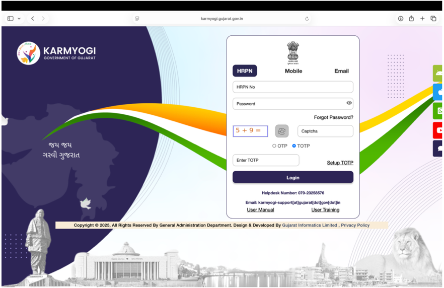

Table 5.6.2 Performance Appraisal Report Format

|   Sr. No | Name of Section                                    | Section to be filled by   |
|----------|----------------------------------------------------|---------------------------|
|        1 | Section I - Basic informationEstablishment section |                           |
|        2 | Section II - Self Appraisal                        | Faculty himself/herself   |
|        3 | Section III - Appraisal                            | Head of Department        |
|        4 | Section IV - Review                                | Head of Institution       |

## B. Its implementation and effectiveness (15)

Institute Marks

15.00

The entire appraisal system is transparent and time bound. Faculties are required to fill their Performance Appraisal Report (PAR) every year in the month of April. All the reports are sent to the Reporting Officer (Head of Department) for assessment and finally reviewed by the reviewing officer (Principal). After carefully reviewing, it is shown to the faculties to let them know their performance. Faculties are allowed to raise an objection, if they are not satisfied with the grades. The reports are then sent to the Commissionerate of Technical Education for further process. After a second review by the CTE office, reports of lecturers (class 2) are kept at CTE office and reports of Head of the departments (class 1) are sent to the education department.

Figure 5.6.2 Cogent Portal CAS Feature in HOD Role

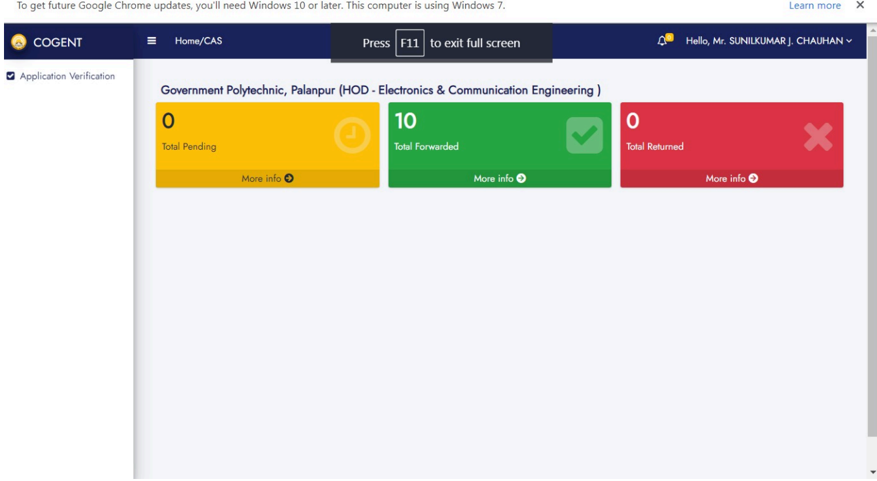

During the first ever joining if the faculty of technical branch is equipped with a Master degree and faculty for general stream is equipped with an MPhil or Ph.D. he/she directly placed in the 6000 (level 10) grade pay. If a faculty brings to the table a Ph.D. degree at the time of joining, he will be given 7000 (level 11) after successfully completing 4 years. For faculty a periodic change in their pay grade and all the appraisal reports are to be reviewed and all the reports with a score of 60 or more out of 100 are considered to be eligible for the AGP promotion from 5400 to 6000 (level 9A to 10), 6000 to 7000 (level 10 to 11), 7000 to 8000 (level 11 to 12) and 8000 to 9000 (level 12 to 13A1) respectively. For AGP promotion of 9000 to 10000 additional PhD qualification is required (applicable for only 6th Pay commission).

Eligibility criteria for various AGP movements for 6th CPC are as follows:

Table 5.6.3 Eligibility for academic grade pay (AGP) scale movement as per 6th pay

| Degree                                                       | AGP Scale Movement   | Eligibility Criteria          |
|--------------------------------------------------------------|----------------------|-------------------------------|
| Bachelor of Engineering (B.E.)                               | 5400                 | At the time of appointment    |
| Bachelor of Engineering (B.E.)                               | 6000                 | After acquiring ME or 6 years |
| Bachelor of Engineering (B.E.)                               | 7000                 | After completing 3 years      |
| Bachelor of Engineering (B.E.)                               | 8000                 | After completing 5 years      |
| Bachelor of Engineering (B.E.)                               | 9000                 | After completing 3 years      |
| Master of Engineering/Master of Technology (M.E./M.Tech)6000 |                      | At the time of appointment    |
| Master of Engineering/Master of Technology (M.E./M.Tech)7000 |                      | After completing 5 years      |
| Master of Engineering/Master of Technology (M.E./M.Tech)8000 |                      | After completing 5 years      |
| Master of Engineering/Master of Technology (M.E./M.Tech)9000 |                      | After completing 3 years      |

The faculty members are given Career Advancement (AGP) as per AICTE under career advancement scheme (CAS) on the basis of PBAS points obtained during the assessment period. The eligible faculty member aspiring for career advancement (Under CAS) needs to submit his/her application, which is scrutinized by the CAS Committee in the institute. The application is forwarded to the Commissionerate office for further processing. For promotion to the next higher level, all PARs (last 5 years) are to be reviewed. PAR is also considered for implementation of Career Advancement Scheme.

| No.   | Activity                                                                                                                                                                           | Cut off Dates   |          |
|-------|------------------------------------------------------------------------------------------------------------------------------------------------------------------------------------|-----------------|----------|
|       | PAR form to be generated of the officer reported upon by the Administration Establish Division.                                                                                    | April 15"       | On line  |
|       | Self-appraisal for current year                                                                                                                                                    | 15t May         | On line  |
|       | Appraisal by reporting authority                                                                                                                                                   | 15" June        | On line  |
|       | Appraisal by reviewing authority and discloser of PAR to officer reported upon                                                                                                     | July 15"        | On line  |
|       | Acceptance of PAR or representation any by officer reported upon.                                                                                                                  | 15t August      | On line  |
|       | Comments of the Reporting Authority on representation if any                                                                                                                       | 31 August       | On line  |
|       | Comments of the Reviewing Authority on representation if any                                                                                                                       | 15t September   | On line  |
|       | Decision of CCA about the representation   and comunication of the same alongwith complete PAR to the officer reported upon.                                                       | 15" October     | On line  |
|       | Acceptance of decision representation if any to the Referral Board by the officer reported upon through CCA                                                                        | 315T October    | Off line |
| 10    | Conveying of representation to the Referral Board alongwith all relevant documents by CCA                                                                                          | 15" November    | Off line |
| 11    | Decision and communication to the officer reported upon by the referral Board and end of entire PAR process (Copy of the decision to CCA, reporting officer and reviewing officer) | December        | Off line |

Figure 5.6.3 GAD Guidelines for PAR

## Process Timeline:

- Step 1 : Faculty self-appraisal (April annually)
- Step 2 : HOD evaluation and grading (April-May)
- Step 3 : Principal review and finalization (May)
- Step 4 : Faculty acknowledgment with objection window (May-June)
- Step 5 : CTE processing and career advancement eligibility (June onwards)

## Key Decision Points:

- Score more than or equal to 60 out of 100 required for AGP promotion eligibility
- Last 5 years PARs reviewed for career advancement
- PBAS points assessed by CAS Committee for promotion
- Transparent process with faculty access and objection mechanism

Gujarat Government implemented 7th pay scale for diploma institutions w.e.f 20/3/2020. Presently all faculty members are getting seventh pay scale. Gujarat government declared Career Advancement Scheme (CAS) implementation as per AICTE 7th pay recommendations on 01/03/2024.

The following faculty members are given career advancement as per seventh pay under CAS by CTE office.

Table 5.6.4 Career Advancement under CAS

|   Sr. No. | Faculty Name                          | CAS Eligibility Date                  | AGP Movement                                    | Status   |
|-----------|---------------------------------------|---------------------------------------|-------------------------------------------------|----------|
|         1 | Mr. Nirav J. Chauhan                  | 01/07/2022                            | L10-L11                                         | Complete |
|         2 | Miss Mittal K. Pedhadiya              | 08/05/2018                            | 15600-39100 (6000) - 15600-39100 (7000)Complete |          |
|         3 | Mr. Snehilkumar P. Joshiara25/05/2022 | Mr. Snehilkumar P. Joshiara25/05/2022 | L9A - L10                                       | Complete |

|   4 | Mr. Rahul C. Parmar      | 11/06/2021   | L10-L11                                          | Complete   |
|-----|--------------------------|--------------|--------------------------------------------------|------------|
|   5 | Mr. Milav J. Dabgar      | 02/11/2021   | L10-L11                                          | Complete   |
|   6 | Miss Mittal K. Pedhadiya | 26/04/2017   | 15600-39100 (5400) - 15600-39100 (6000) Complete |            |
|   7 | Dr. Ratansing N. Patel   | 28/10/2020   | 15600-39100 (6000) - 15600-39100(7000)           | Complete   |
|   8 | Mr. Laukikkumar K. Patel | 09/05/2016   | 15600-39100 (6000) - 15600-39100 (7000) Complete |            |
|   9 | Dr. Laukikkumar K. Patel | 09/05/2021   | L11-L12                                          | Complete   |

## C. Details of qualification up-gradation of faculty (10)

Faculties are sent for higher education by head office on seniority basis. Following faculties were permitted by the head office for pursuing higher study and the said faculties successfully up-graded their qualifications.

## Table 5.6.5 Faculty Qualification Upgradation

| Sr No.Name of Faculty             |          | DesignationDepartmentDegree   |                                       | Area of Specialization                                                                                          | University                  | Duration      |
|-----------------------------------|----------|-------------------------------|---------------------------------------|-----------------------------------------------------------------------------------------------------------------|-----------------------------|---------------|
| 1Dr. Laukikkumar K. PatelLecturer |          | ECE                           | Ph.D.                                 | Feature based image registration using machine learning                                                         | SPU, Mehsana                | 2019-2024     |
| 2Dr. Ratansing N. Patel           | Lecturer | ECE                           | Ph.D.                                 | Rectangular Microstrip Patch Antenna Design for Satelite image vision system applicationGTU, Ahmedabad2014-2019 |                             |               |
| 3Mr. Nirav J. Chauhan             | Lecturer | ECE                           | Ph.D.                                 | Design of Compact Wideband Microstrip Patch Antenna for Wireless Applications                                   | GTU, Ahmedabad2022-Continue |               |
| 4Mr. Milav J. Dabgar              | Lecturer | ECE                           | AICTE QIP PG CertificateDeep Learning |                                                                                                                 | NIT, Surat                  | 2025-2025     |
| 5Mr. Milav J. Dabgar              | Lecturer | ECE                           | B.S.                                  | Data Science & Applications                                                                                     | IIT, Madras                 | 2021-Continue |

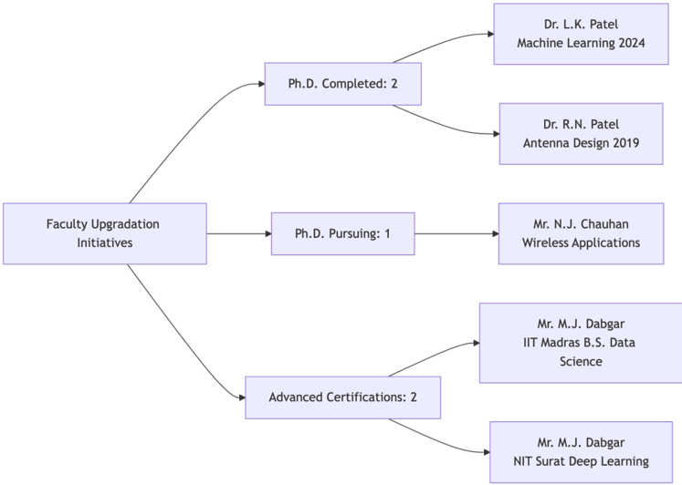

## Institute Marks

10.00

## Achievement Highlights:

- 2 Faculty : Successfully completed Ph.D. during/before assessment period
- 1 Faculty : Actively pursuing Ph.D. research
- Advanced Certifications : Faculty enrolled in IIT Madras and NIT Surat programs
- Continuous Learning : Institutional support for qualification upgradation
- Diverse Specializations : Machine Learning, Antenna Design, Data Science, Deep Learning.

## 6 6 FACILITIES AND TECHNICAL SUPPORT FACILITIES AND TECHNICAL SUPPORT (100) (100)

## 6.1 Availability of adequate, well equiped classrooms to meet the curriculum requirements (10)

## [A] Adequacy of number of classrooms in department

Course duration: 03 Year

Number of available classrooms: 05

## Adequacy: Yes, Adequate

The Electronics and Communication Engineering Department of Government Polytechnic, Palanpur, is equipped with five (05) well-furnished classrooms, each designed to facilitate effective teachingÐlearning processes. These classrooms are:

- Adequate in number and capacity to conduct lectures, tutorials, and other academic activities as per curriculum requirements, ensuring compliance with NBAÕs emphasis on infrastructure sufficiency.
- Well-equipped with modern teaching aids such as whiteboards, projection facilities, and audio-visual support, thereby enhancing student engagement and meeting the NBA criterion of effective delivery of curriculum.
- Integrated with CCTV surveillance systems , which not only strengthen institutional discipline and security but also align with NBAÕs focus on creating a safe and conducive learning environment.
- Designed to support inclusivity and accessibility , ensuring that students from diverse backgrounds can benefit equally, in line with NBAÕs quality benchmarks for equity in education.
- Maintained to high standards of cleanliness and ergonomics , contributing to student comfort and concentration, which indirectly supports NBAÕs concern for student-centric learning outcomes.

|         |                                   |                  |             | Facilities                        | Facilities               | Facilities   | Facilities                | Facilities                 | Facilities   | Facilities   |
|---------|-----------------------------------|------------------|-------------|-----------------------------------|--------------------------|--------------|---------------------------|----------------------------|--------------|--------------|
| Sr. No. | Building Name Room No.            | Seating Capacity | Area (m 2 ) | Projector                         | Chalk Board/ White Board | Benches      | Internet/ Wi-Fi           | Laptop/ PC (when required) | Fan          | Light        |
| 1       | BADP Building Ground Floor (B007) | 60               | 45          | Portable projector                | Yes                      | Yes          | CWAN (Wired and Wireless) | Laptop                     | Yes          | Yes          |
| 2       | BADP Building Ground Floor (B011) | 60               | 45          | Fixed Projector with Screen (OHP) | Yes                      | Yes          | CWAN (Wired and Wireless) | PC                         | Yes          | Yes          |
| 3       | BADP Building First Floor (B108)  | 60               | 45          | Portable projector                | Yes                      | Yes          | CWAN (Wired and Wireless) | Laptop                     | Yes          | Yes          |
| 4       | BADP Building First Floor         | 90               | 75          | Portable projector                | Yes                      | Yes          | CWAN (Wired and Wireless) | Laptop                     | Yes          | Yes          |

Total Marks Total Marks   100.00 100.00

## Total Marks 10.00

Institute Marks

10.00

[B] Adequate classroom infrastructure checklist

[1] Class room: B007

|    | (B109)                           |    |    |                             |     |     |                           |        |     |     |
|----|----------------------------------|----|----|-----------------------------|-----|-----|---------------------------|--------|-----|-----|
|  5 | BADP Building First Floor (B111) | 60 | 45 | Fixed Projector with Screen | Yes | Yes | CWAN (Wired and Wireless) | Laptop | Yes | Yes |

Table: 6.1.1 List of Classroom/Tutorial room with amenities

|   Sr. No. | Parameter                       | Criteria / Norms                                      | Available (Yes/No)   | Quantity / Details                                 | Remarks / Evidence Attached   |
|-----------|---------------------------------|-------------------------------------------------------|----------------------|----------------------------------------------------|-------------------------------|
|         1 | Size & Seating Capacity         | Minimum 33 sqm per class, 30 seats                    | Yes                  | 45 Sqm                                             | Area sheet of Institute       |
|         2 | Ventilation & Lighting          | Adequate lighting airflow, fans/windows functional    | Yes                  | Entry & Exit Doors, 4 windows                      | Photographs                   |
|         3 | ICT Infrastructure              | Projector / Internet / Audio system                   | Yes                  | Portable projector CWAN (Wired and Wireless)       | Photographs                   |
|         4 | Furniture                       | Comfortable Benches/chairs, Black board, clean layout | Yes                  | 20 Benches, 1 Chair, 1 Table, 1 Blackboard         | Photographs                   |
|         5 | Cleanliness                     | Regularly cleaned and maintained                      | Yes                  | Regularly cleaning of each classroom               | Register/ Contract letter     |
|         6 | Safety Measures                 | Fire extinguisher, emergency exits, CCTV, first aid   | Yes                  | CCTV Camera, MCBs, Fire extinguisher near entrance | Photographs                   |
|         7 | Network Connectivity            | LAN / Wi-Fi present functional                        | Yes                  | CWAN (Wired and Wireless)                          | Photographs                   |
|         8 | Evidence of Academic Use        | Photos, logs, lecture sessions                        | Yes                  | As per timetable                                   | Timetable file                |
|         9 | Display of Academic Information | Timetables, notices displayed                         | Yes                  | Notice board available near entrance               | Photographs                   |
|        10 | Academic Ambience               | Posters/charts, inspirational content                 | Yes                  | Posters/charts, inspirational content              | Photographs                   |

Table: 6.1.2 Adequate classroom B007 infrastructure checklist

Remarks /

[3] Class room: B108

|   Sr. No. | Parameter                       | Criteria / Norms                                      | Available (Yes/No)   | Quantity / Details                                         | Evidence Attached         |
|-----------|---------------------------------|-------------------------------------------------------|----------------------|------------------------------------------------------------|---------------------------|
|         1 | Size & Seating Capacity         | Minimum 33 sqm per class, 30 seats                    | Yes                  | 45 Sqm                                                     | Area sheet of Institute   |
|         2 | Ventilation & Lighting          | Adequate lighting airflow, fans/windows functional    | Yes                  | Entry & Exit Doors, 4 windows                              | Photographs               |
|         3 | ICT Infrastructure              | Projector / Internet / Audio system                   | Yes                  | Projector installed with Screen, CWAN (Wired and Wireless) | Photographs               |
|         4 | Furniture                       | Comfortable Benches/chairs, Black board, clean layout | Yes                  | 20 Benches, 1 Chair, 1 Table, 1 Blackboard                 | Photographs               |
|         5 | Cleanliness                     | Regularly cleaned and maintained                      | Yes                  | Regularly cleaning of each classroom                       | Register/ Contract letter |
|         6 | Safety Measures                 | Fire extinguisher, emergency exits, CCTV, first aid   | Yes                  | CCTV Camera, MCBs, Fire extinguisher near entrance         | Photographs               |
|         7 | Network Connectivity            | LAN / Wi-Fi present functional                        | Yes                  | CWAN (Wired and Wireless)                                  | Photographs               |
|         8 | Evidence of Academic Use        | Photos, logs, lecture sessions                        | Yes                  | As per timetable                                           | Timetable file            |
|         9 | Display of Academic Information | Timetables, notices displayed                         | Yes                  | Notice board available near entrance                       | Photographs               |
|        10 | Academic Ambience               | Posters/charts, inspirational content                 | Yes                  | Posters/charts, inspirational content                      | Photographs               |

## Table: 6.1.3 Adequate classroom B011 infrastructure checklist

|   Sr. No. | Parameter               | Criteria / Norms                                   | Available (Yes/No)   | Quantity / Details                           | Remarks / Evidence Attached   |
|-----------|-------------------------|----------------------------------------------------|----------------------|----------------------------------------------|-------------------------------|
|         1 | Size & Seating Capacity | Minimum 33 sqm per class, 30 seats                 | Yes                  | 45 Sqm                                       | Area sheet of Institute       |
|         2 | Ventilation & Lighting  | Adequate lighting airflow, fans/windows functional | Yes                  | Entry & Exit Doors, 4 windows                | Photographs                   |
|         3 | ICT Infrastructure      | Projector / Internet / Audio system                | Yes                  | Portable projector CWAN (Wired and Wireless) | Photographs                   |

[4] Class room: B109

|   4 | Furniture                       | Comfortable Benches/chairs, Black board, clean layout   | Yes   | 20 Benches, 1 Chair, 1 Table, 1 Blackboard         | Photographs               |
|-----|---------------------------------|---------------------------------------------------------|-------|----------------------------------------------------|---------------------------|
|   5 | Cleanliness                     | Regularly cleaned and maintained                        | Yes   | Regularly cleaning of each classroom               | Register/ Contract letter |
|   6 | Safety Measures                 | Fire extinguisher, emergency exits, CCTV, first aid     | Yes   | CCTV Camera, MCBs, Fire extinguisher near entrance | Photographs               |
|   7 | Network Connectivity            | LAN / Wi-Fi present functional                          | Yes   | CWAN (Wired and Wireless)                          | Photographs               |
|   8 | Evidence of Academic Use        | Photos, logs, lecture sessions                          | Yes   | As per timetable                                   | Timetable file            |
|   9 | Display of Academic Information | Timetables, notices displayed                           | Yes   | Notice board available near entrance               | Photographs               |
|  10 | Academic Ambience               | Posters/charts, inspirational content                   | Yes   | Posters/charts, inspirational content              | Photographs               |

## Table: 6.1.4 Adequate classroom B108 infrastructure checklist

|   Sr. No. | Parameter               | Criteria / Norms                                      | Available (Yes/No)   | Quantity / Details                                 | Remarks / Evidence Attached   |
|-----------|-------------------------|-------------------------------------------------------|----------------------|----------------------------------------------------|-------------------------------|
|         1 | Size & Seating Capacity | Minimum 33 sqm per class, 30 seats                    | Yes                  | 75 Sqm                                             | Area sheet of Institute       |
|         2 | Ventilation & Lighting  | Adequate lighting airflow, fans/windows functional    | Yes                  | 1 Door, 5 windows                                  | Photographs                   |
|         3 | ICT Infrastructure      | Projector / Internet / Audio system                   | Yes                  | Portable projector CWAN (Wired and Wireless)       | Photographs                   |
|         4 | Furniture               | Comfortable Benches/chairs, Black board, clean layout | Yes                  | 30 Benches, 1 Chair, 1 Table, 1 Blackboard         | Photographs                   |
|         5 | Cleanliness             | Regularly cleaned and maintained                      | Yes                  | Regularly cleaning of each classroom               | Register/ Contract letter     |
|         6 | Safety Measures         | Fire extinguisher, emergency exits, CCTV, first aid   | Yes                  | CCTV Camera, MCBs, Fire extinguisher near entrance | Photographs                   |

[5] Class room: B111

|   7 | Network Connectivity            | LAN / Wi-Fi present functional        | Yes   | CWAN (Wired and Wireless)             | Photographs    |
|-----|---------------------------------|---------------------------------------|-------|---------------------------------------|----------------|
|   8 | Evidence of Academic Use        | Photos, logs, lecture sessions        | Yes   | As per timetable                      | Timetable file |
|   9 | Display of Academic Information | Timetables, notices displayed         | Yes   | Notice board available near entrance  | Photographs    |
|  10 | Academic Ambience               | Posters/charts, inspirational content | Yes   | Posters/charts, inspirational content | Photographs    |

Table: 6.1.5 Adequate classroom B109 infrastructure checklist

|   Sr. No. | Parameter                       | Criteria / Norms                                      | Available (Yes/No)   | Quantity / Details                                 | Remarks / Evidence Attached   |
|-----------|---------------------------------|-------------------------------------------------------|----------------------|----------------------------------------------------|-------------------------------|
|         1 | Size & Seating Capacity         | Minimum 33 sqm per class, 30 seats                    | Yes                  | 45 Sqm                                             | Area sheet of Institute       |
|         2 | Ventilation & Lighting          | Adequate lighting airflow, fans/windows functional    | Yes                  | Entry & Exit Doors, 3 windows                      | Photographs                   |
|         3 | ICT Infrastructure              | Projector / Internet / Audio system                   | Yes                  | Portable projector CWAN (Wired and Wireless)       | Photographs                   |
|         4 | Furniture                       | Comfortable Benches/chairs, Black board, clean layout | Yes                  | 20 Benches, 1 Chair, 1 Table, 1 Blackboard         | Photographs                   |
|         5 | Cleanliness                     | Regularly cleaned and maintained                      | Yes                  | Regularly cleaning of each classroom               | Register/ Contract letter     |
|         6 | Safety Measures                 | Fire extinguisher, emergency exits, CCTV, first aid   | Yes                  | CCTV Camera, MCBs, Fire extinguisher near entrance | Photographs                   |
|         7 | Network Connectivity            | LAN / Wi-Fi present functional                        | Yes                  | CWAN (Wired and Wireless)                          | Photographs                   |
|         8 | Evidence of Academic Use        | Photos, logs, lecture sessions                        | Yes                  | As per timetable                                   | Timetable file                |
|         9 | Display of Academic Information | Timetables, notices displayed                         | Yes                  | Notice board available near entrance               | Photographs                   |
|        10 | Academic Ambience               | Posters/charts, inspirational content                 | Yes                  | Posters/charts, inspirational content              | Photographs                   |

Table: 6.1.6 Adequate classroom B111 infrastructure checklist

Figure 6.1.1 Photographs

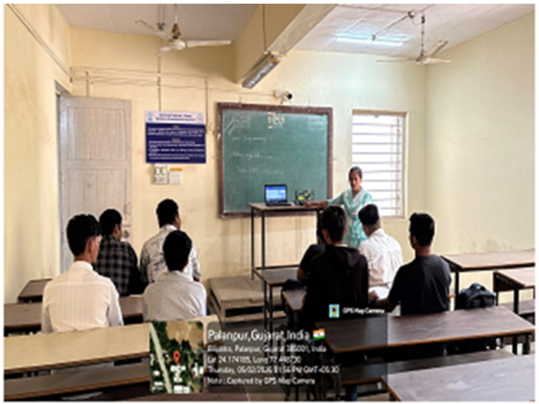

Figure 6.1.3 Photographs B1OS

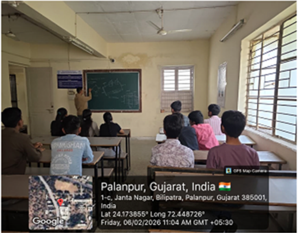

Figure 6.1.5 Photographs

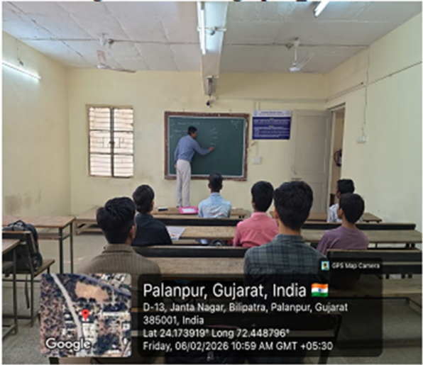

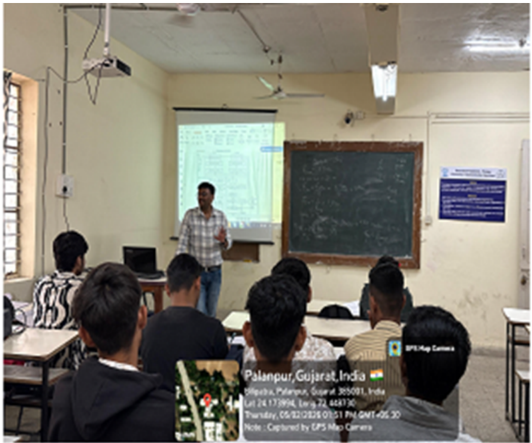

Figure 6.1.2 Photographs BOlI

Figure 6.1.4 Photographs B109

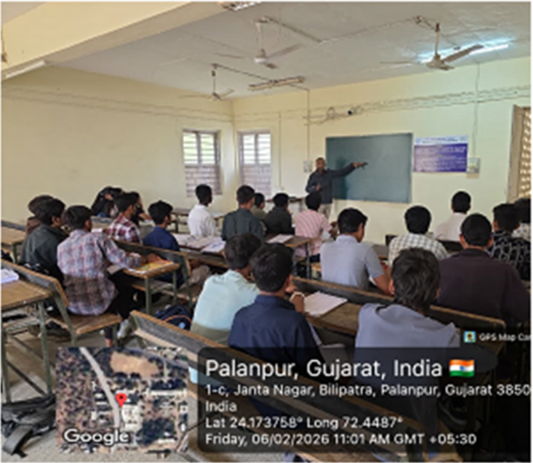

Figure 6.1.6 Fire extinguisher

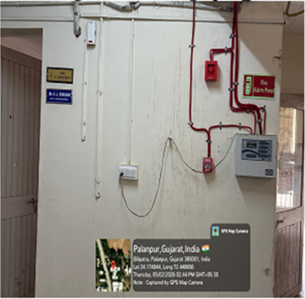

## 6.2 Availability of adequate and well-equipped workshops, Laboratories and Technical manpower to meet the curriculum requirements (40)

## A. Adequacy (10)

## [A] Availability of adequate well-equipped workshops/Laboratories

- The Electronics and Communication Engineering Department of Government Polytechnic, Palanpur, demonstrates strong institutional support through its well-established workshops and laboratories, whic h are sufficient in number and quality to meet curriculum requirements. In alignment with NBA Criterion 6, the following aspects are noteworthy:
- Adequacy and Availability of Laboratories:

The department has ensured that laboratories are not only adequate in number but also accessible during scheduled sessions and flexible hours. This reflects effective governance and commitment to student-centric learning.

- Modern Equipment and Consumables:
- Laboratories are furnished with efficient, modern instruments and consumables, systematically stored and tagged for easy identification. This indicates proper financial allocation and resource management.
- Hands-on and Experiential Learning:

Students are encouraged to engage in practical activities beyond scheduled sessions, fostering innovation and independent learning. This demonstrates institutional support for outcome-based education.

- Infrastructure and Facilities:

Each laboratory is equipped with adequate furniture, display boards, and charts for essential student information. This reflects governance that prioritizes student welfare and academic preparedness, ensuring that infrastructure supports both teaching and learning processes.

- Scheduling and Utilization:
- Laboratory sessions are systematically scheduled in accordance with curriculum requirements, ensuring optimal utilization of resources. This highlights effective planning and governance practices.
- Financial and Administrative Support:

The availability of modern equipment and consumables, along with proper maintenance and upgrades, reflects the institutionÕs commitment to continuous improvement

N umber of laboratories required as per AICTE Guideline: 2 Laboratory per year

Duration of course (Electronics and Communication Department): 3 years

Total number of laboratories required: 06

Total number of laboratories available in department: 09

Adequacy: Yes, Adequate

## [1] List of adequate Laboratory with course incorporated

|   Sr. No. | Name of Laboratory   | Building Name Room No.                   | Subject wise utilization                                                                                                                  |
|-----------|----------------------|------------------------------------------|-------------------------------------------------------------------------------------------------------------------------------------------|
|         1 | Computer Lab-1       | BADP Building Ground Floor Room No: B002 | Software Practice Renewable Energy & Emerging Trends in Electronics VLSI                                                                  |
|         2 | Computer Lab-2       | BADP Building Ground Floor Room No: B008 | Basic of Computer & information Technology Microprocessor & Microcontroller Embedded System                                               |
|         3 | Computer Lab-3       | BADP Building Ground Floor Room No: B009 | Fundamentals of Information Communication Technology Circuit Design Tools OOPS & Python Programming Computer Network & Data Communication |
|         4 | Computer Lab-4       | BADP Building Ground Floor               | Programming In C Android App Development                                                                                                  |

## Total Marks 40.00

Institute Marks

10.00

|    |                     | Room No: B014                            | Project-I Project-II                                                                                            |
|----|---------------------|------------------------------------------|-----------------------------------------------------------------------------------------------------------------|
|  5 | Electronics Lab-1   | BADP Building Ground Floor Room No: B010 | Fundamental of Electronics Electronics Circuit Application (ECA) Linear Integrated Circuit (Analog Electronics) |
|  6 | Electronics Lab-2   | BADP Building Ground Floor Room No: B013 | Electronics Circuit Network & Measurement Project-I Project-II                                                  |
|  7 | Electronics Lab-3   | BADP Building First Floor Room No: B106  | Consumer Electronics & Maintenance Digital Logic Design                                                         |
|  8 | Communication Lab-1 | BADP Building First Floor Room No: B101  | Fiber Optics Communication Mobile & Wireless Communication                                                      |
|  9 | Communication Lab-2 | BADP Building First Floor Room No: B105  | Principles of Electronic Communication Antenna Wave Propagation                                                 |

## Table: 6.2.1 Adequate Laboratory with course incorporated

[2] Facility available in Laboratory

Room area available

(meter square)

25.5

75

Name of

Laboratory

Computer

Lab-1

Computer

Location

BADP Building

Ground Floor

Room No: B002

BADP Building

Ground Floor

Amenities

Computer, Internet port

CWAN (Wired and Wireless)

White board

Lab Table and Stool

Faculty Table and Faculty

Chair

Display chart.

Projector installed

Computer, Internet port

CWAN (Wired and Wireless)

Smart/White board

Lab Table and Stool

| Lab-2               | Room No: B008                            |      | Faculty Table and Faculty Chair Display chart.                                                                                                                         |
|---------------------|------------------------------------------|------|------------------------------------------------------------------------------------------------------------------------------------------------------------------------|
| Computer Lab-3      | BADP Building Ground Floor Room No: B009 | 90   | Projector with motorized screen Computer, Internet port CWAN (Wired and Wireless) White board Lab Table and Stool Faculty Table and Faculty Chair Display chart.       |
| Computer Lab-4      | BADP Building Ground Floor Room No: B014 | 25.5 | Computer, Internet port CWAN (Wired and Wireless) White board Lab Table and Stool Faculty Table and Faculty Chair Display chart.                                       |
| Electronics Lab-1   | BADP Building Ground Floor Room No: B010 | 75   | Equipment/Trainer kit CWAN (Wired and Wireless) Black board Lab Table and Stool Faculty Table and Faculty Chair Cupboard and display chart.                            |
| Electronics Lab-2   | BADP Building Ground Floor Room No: B013 | 81   | Equipment/Trainer kit Computer and Internet port CWAN (Wired and Wireless) Black board Lab Table and Stool Faculty Table and Faculty Chair Cupboard and display chart. |
| Electronics Lab-3   | BADP Building First Floor Room No: B106  | 81   | Equipment/Trainer kit CWAN (Wired and Wireless) Black board Lab Table and Stool Faculty Table and Faculty Chair Cupboard and display chart.                            |
| Communication Lab-1 | BADP Building First Floor Room No: B101  | 81   | Equipment/Trainer kit CWAN (Wired and Wireless) Black board Lab Table and Stool Faculty Table and Faculty Chair Cupboard and display chart.                            |
| Communication Lab-2 | BADP Building First Floor Room No: B105  | 25.5 | Equipment/Trainer kit Computer and Internet port CWAN (Wired and Wireless) White board Lab Table and Stool Faculty Table and Faculty Chair Cupboard and display chart. |

Table: 6.2.2 Facility available in Laboratory

## [B] Quality of Laboratories/Workshop

- The Electronics and Communication Engineering Department of Government Polytechnic, Palanpur, demonstrates strong governance and institutional support through its nine (09) well-equipped laboratories, which are sufficient in number and quality to meet curriculum requirements. In line with NBA Criterion 6, the following aspects highlight effective governance and resource management:
- Adequacy of Laboratories and Equipment:

The department maintains nine laboratories furnished with sufficient trainer kits and modern equipment, ensuring compliance with curriculum requirements. This reflects proper planning and allocation of financial resources to sustain academic quality.

- ICT and N etworking Facilities:

Computer laboratories are equipped with Local Area Network (LAN) facilities, enabling students to access digital resources and fostering collaborative learning. This demonstrates institutional support for ICT integration.

- Accessibility and Student-Centric Governance:

Laboratories are kept open beyond timetable hours, allowing students to carry out project work and academic activities. This flexible access reflects governance practices that prioritize student learning outcomes and innovation.

- Procurement and Resource Management:
- The purchase process for equipment and computers is carried out regularly, ensuring laboratories remain updated with modern technology. This highlights transparent financial management and continuous improvement.
- Faculty Guidance and Academic Discipline:

Practical sessions are conducted under the supervision of faculty members, with students required to maintain proper records and readings. This structured approach reflects governance that ensures accountability, discipline, and quality in academic delivery.

- Cleanliness and Maintenance:

Laboratories are maintained with regular cleanliness practices, reflecting institutional commitment to providing a safe and conducive learning environment.

- Safety and Risk Management:

Safety measures such as first-aid boxes and fire extinguishers are available in the department.

## [1] Basic Laboratory details

[2] Facility available in Laboratory

|   Sr.  N o. | N ame of Laboratory   | Lab In charge      | Maximum  N o. of Students per Batch                                                 |
|-------------|-----------------------|--------------------|-------------------------------------------------------------------------------------|
|           1 | Computer Lab-1        | Ms. M.K. Pedhadiya | 20 students per batch in 1 st  & 2 nd  year and 15 students per batch in 3 rd  year |
|           2 | Computer Lab-2        | Dr. L.K. Patel     | 20 students per batch in 1 st  & 2 nd  year and 15 students per batch in 3 rd  year |
|           3 | Computer Lab-3        | Mr. M.J. Dabgar    | 20 students per batch in 1 st  & 2 nd  year and 15 students per batch in 3 rd  year |
|           4 | Computer Lab-4        | Mr. S.P. Joshiyara | 20 students per batch in 1 st  & 2 nd  year and 15 students per batch in 3 rd  year |
|           5 | Electronics Lab-1     | Mr. N.J. Chauhan   | 20 students per batch in 1 st  & 2 nd  year and 15 students per batch in 3 rd  year |
|           6 | Electronics Lab-2     | Mr. R.C. Parmar    | 20 students per batch in 1 st  & 2 nd  year and 15 students per batch in 3 rd  year |
|           7 | Electronics Lab-3     | Mr. N.J. Chauhan   | 20 students per batch in 1 st  & 2 nd  year and 15 students per batch in 3 rd  year |
|           8 | Communication Lab-1   | Dr. R.N. Patel     | 20 students per batch in 1 st  & 2 nd  year and 15 students per batch in 3 rd  year |
|           9 | Communication Lab-2   | Dr. R.N. Patel     | 20 students per batch in 1 st  & 2 nd  year and 15 students per batch in 3 rd  year |

Table: 6.2.3 Basic Laboratory details

|   Sr. N o. | Parameter                             | Yes/ N o   | Remarks / Evidence Available   |
|------------|---------------------------------------|------------|--------------------------------|
|          1 | Equipment available as per curriculum | Yes        | Concerned Register             |
|          2 | Availability of lab manual            | Yes        | Lab Manuals                    |
|          3 | Lab timetable with student allocation | Yes        | Timetable file                 |

4

5

6

7

8

Technician available per lab

Safety equipment present (fire extinguisher, first aid)

Internet / ICT-enabled tools (e.g. virtual labs, simulations)

Availability of SOPs / experiment list

Yes

Yes

Yes

Yes

Usage of laboratory equipments

Yes

## Table: 6.2.4 Facility available in Laboratory

[3] Laboratory equipments details (Subject wise utilization)

| Sr.  N o.   | N ame of Laboratory   | Building  N ame and Room  N o             | List of Equipments                                                                                                                                                                                                                                                                                                                                                                                                                                                                       | Subject wise Utilization                                                                                  |
|-------------|-----------------------|-------------------------------------------|------------------------------------------------------------------------------------------------------------------------------------------------------------------------------------------------------------------------------------------------------------------------------------------------------------------------------------------------------------------------------------------------------------------------------------------------------------------------------------------|-----------------------------------------------------------------------------------------------------------|
| 1           | Computer Lab-1        | BADP Building  Ground Floor Room No: B002 | Computer System  (LAN Connected) Open-Source Software VLSI Trainer kit                                                                                                                                                                                                                                                                                                                                                                                                                   | Software Practice    Renewable Energy & Emerging Trends     in     VLSI                                   |
| 2           | Computer Lab-2        | BADP Building  Ground Floor Room No: B008 | Computer System (LAN Connected) Open-Source Software 8085 microprocessor Trainer kit Microprocessor with 8253 Trainer kit Microprocessor Dynalog 8085 Trainer kit Microcontroller Dynalog 8051 Trainer kit Embedded Trainer kit Microprocessor trainer with A to D converter CARD                                                                                                                                                                                                        | Basic of Computer & information        Technology Microprocessor & Microcontroller Embedded System        |
| 3           | Computer Lab-3        | BADP Building  Ground Floor Room No: B009 | Computer System (LAN Connected) Open-Source Software Crimping tool                                                                                                                                                                                                                                                                                                                                                                                                                       | Circuit Design Tools OOPS & Python Programming                                                            |
| 4           | Computer Lab-4        | BADP Building  Ground Floor Room No: B014 | Computer System  (LAN Connected) Open-Source Software                                                                                                                                                                                                                                                                                                                                                                                                                                    | Android App Development Project-I                                                                         |
| 5           | Electronics Lab-1     | BADP Building  Ground Floor Room No: B010 | Multimeter Function Generator CRO PN/Zener/LED/LASER/Photo Diode characteristics Trainer kit Half/Full/Bridge wave Rectifier Trainer kit Astable/Monostable/Bistable multivibrater Trainer kit Ohm/KVL/KCL Trainer kit Oscillator Trainer kit BJT/FET characteristics Trainer kit Transistor amplifier Trainer kit Photo transistor characteristics Trainer kit IC555 Timer Trainer kit RC Coupled 2 stage transistor amplifier Trainer kit OPAMP Trainer kit Passive filter Trainer kit | Fundamental of Electronics Electronics Circuit Application (ECA Linear Integrated Circuit (Analog Electro |
|             |                       |                                           | Soldering   Iron                                                                                                                                                                                                                                                                                                                                                                                                                                                                         | Fundamental of Electrical Engineerin                                                                      |

One Lab Assistant in the department

Available in the department

In concern subject lab manuals

Chart in lab

Utilisation register

|    |                     |               | LCR Meter                                                                                                     | PCB Designing & Electronics worksh                                      |
|----|---------------------|---------------|---------------------------------------------------------------------------------------------------------------|-------------------------------------------------------------------------|
|    |                     |               | Function Generator                                                                                            |                                                                         |
|    |                     |               | CRO                                                                                                           |                                                                         |
|    |                     |               | DSO Scientific test lab (electronic workstation)                                                              | Electronics Circuit Network & Measure                                   |
|    |                     |               | Work bench                                                                                                    |                                                                         |
|    |                     |               | Diode characteristics Trainer kit                                                                             | Project-I                                                               |
|    |                     |               | Rectifier Trainer kit RC Phase-shift/Colpitt/Hartly/ Wein-bridge/Crystal Oscillator Trainer kit               | Project-II                                                              |
|    |                     |               | Voltage Doubler Trainer kit Voltage Regulator Trainer kit                                                     |                                                                         |
|    |                     |               | H Parameter of PNP Transistor in CE Trainer kit                                                               |                                                                         |
|    |                     |               | Transistor as common collector amplifier Trainer kit                                                          |                                                                         |
|    |                     |               | Wide b amplifier Trainer kit                                                                                  |                                                                         |
|    |                     |               | Integrating & differentiating & clamping circuit Trainer kit                                                  |                                                                         |
|    | Electronics         |               |                                                                                                               |                                                                         |
|    |                     | BADP Building | Network theorem & laws Trainer kit                                                                            |                                                                         |
| 6  | Lab-2               | Ground Floor  | Bread Board with Power Supplies Trainer kit                                                                   |                                                                         |
|    |                     |               | Discrete Component Trainer kit                                                                                |                                                                         |
|    |                     | Room No: B013 | Transistors characteristics Trainer kit                                                                       |                                                                         |
|    |                     |               | Biasing Techniques of Transistor (BJT) Trainer kit                                                            |                                                                         |
|    |                     |               | Constant K type low/high pass filter Trainer kit                                                              |                                                                         |
|    |                     |               | Series & parallel resonance Trainer kit                                                                       |                                                                         |
|    |                     |               | Maxwells/Wein/Schering bridge Trainer kit                                                                     |                                                                         |
|    |                     |               | Clip on meter/Clamp meter Variac/Dimmer state/Auto Transformer Single Phase SCR, Diac & Triac Characteristics | Applied Electronics                                                     |
|    |                     |               | RTD Trainer kit                                                                                               |                                                                         |
|    |                     |               | Thermocouple Trainer kit                                                                                      |                                                                         |
|    |                     |               | LVDT Trainer kit                                                                                              |                                                                         |
|    |                     |               | Series inverter Trainer kit IGBT Characteristic Trainer kit                                                   |                                                                         |
|    |                     |               | Universal Chopper Trainer kit                                                                                 |                                                                         |
|    |                     |               | Phase shift circuit for firing SCR using UJT Trainer kit                                                      |                                                                         |
|    |                     |               | Optical power meter                                                                                           |                                                                         |
|    |                     |               | Differential module for measurement of power Moving iron ammeter 0-2 amp                                      |                                                                         |
|    |                     |               | Watt meter low power factor                                                                                   |                                                                         |
|    |                     |               | Multimeter                                                                                                    | Consumer Electronics & Maintenanc                                       |
|    |                     |               | Function Generator                                                                                            |                                                                         |
|    |                     |               | CRO IC breadboard with built in power supply                                                                  |                                                                         |
|    |                     |               | Digital logic trainer with power supply                                                                       |                                                                         |
|    |                     |               | RS/D/JK flip flop form IC 7400 Trainer kit                                                                    |                                                                         |
|    |                     |               | Verification of N gate as universal gate Trainer kit                                                          |                                                                         |
|    |                     |               | BCD to 7 segment trainer board                                                                                |                                                                         |
|    |                     |               | Digital to analog converter Trainer kit                                                                       |                                                                         |
|    | Electronics         |               |                                                                                                               |                                                                         |
|    |                     | BADP Building | Analog to digital converter Trainer kit                                                                       |                                                                         |
| 7  | Lab-3               | First Floor   | Decade counter Trainer kit                                                                                    |                                                                         |
|    |                     | Room No: B106 | Digital trainer for verification of TT & Logic gates Trainer kit                                              |                                                                         |
|    |                     |               | 8 Channel analog multiplexer Trainer kit                                                                      | Digital Logic Design                                                    |
|    |                     |               | 8 Channel analog demultiplexer Trainer kit                                                                    |                                                                         |
|    |                     |               | BCD to Decimal converter Trainer kit                                                                          |                                                                         |
|    |                     |               | Decimal to BCD Converter Trainer kit                                                                          |                                                                         |
|    |                     |               | BCD to excess-3 converter Trainer kit                                                                         |                                                                         |
|    |                     |               | Excess-3 to BCD converter Trainer kit                                                                         |                                                                         |
|    |                     |               | Half/full adder Trainer kit                                                                                   |                                                                         |
|    |                     |               | 4-Bit Counters (Syn.  Asyn.) Trainer kit                                                                      |                                                                         |
|    |                     |               | Digital trainer for Logic gates Trainer kit                                                                   |                                                                         |
|    |                     |               | Digital IC tester Trainer kit                                                                                 |                                                                         |
|    |                     |               |                                                                                                               | Digital Communication                                                   |
|    |                     |               | Multimeter Function Generator                                                                                 | Fiber Optis Communication                                               |
|    |                     |               | Mobile Trainer kit Mobile communication Trainer                                                               |                                                                         |
|    |                     |               | CDMA mobile phone trainer PWM trainer                                                                         |                                                                         |
|    |                     |               | Digital communication Trainer kit                                                                             |                                                                         |
|    |                     | BADP Building |                                                                                                               |                                                                         |
|    |                     |               | Delta Modulation Demodulation Trainer kit                                                                     |                                                                         |
|    |                     |               | Pulse Code Mod De-mod Trainer kit                                                                             |                                                                         |
| 8  |                     |               | PAM-PPM-PWM Trainer kit                                                                                       |                                                                         |
|    | Communication Lab-1 |               |                                                                                                               |                                                                         |
|    |                     | Room No: B101 | Time Division Mux Demux Trainer kit                                                                           |                                                                         |
|    |                     | First Floor   |                                                                                                               |                                                                         |
|    |                     |               | Frequency Division Mux & Demux Trainer kit Delta modulation Trainer kit                                       | Frequency Division Mux & Demux Trainer kit Delta modulation Trainer kit |

- PSK Modulation Demodulation Trainer kit

- ASK Modulation Demodulation Trainer kit

- DC regulated power supply 0-30v/2amp

- Color pattern generator

Regulated power supply

9

Communication Lab-2

BADP Building

First Floor

Room No: B105

- CRO

DSO

- Multimeter

LCR Meter

- Function Generator

- Antenna Trainer kit

Transmission line Trainer kit

- GSM Trainer kit

ITI SMPS Trainer kit

- Microwave bench with VSWR Meter

AM modulation/demodulation Trainer kit

- SSB modulation &amp; demodulation Trainer kit

- DSB/SSB AM Receiver Trainer kit

- AGC trainer

- AM transmitter &amp; receiver Trainer kit

- FM transmitter &amp; receiver Trainer kit

- Frequency Modulation &amp; Demodulation Trainer kit

- AM-FM Radio Trainer kit

- PAM-PPM-PWM Trainer kit

- DC regulated multi output power supply

Principles of Electronic Communicati

Antenna and Wave Propagation

Microwave &amp; Radar Engineering

Table: 6.2.5 Laboratory equipments details with subject wise utilization

6.2.1 Photographs B002 Figure

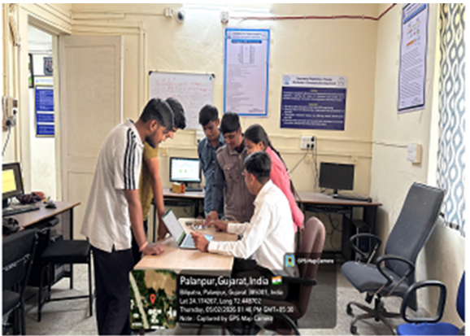

Figure 6.2.3 Photographs

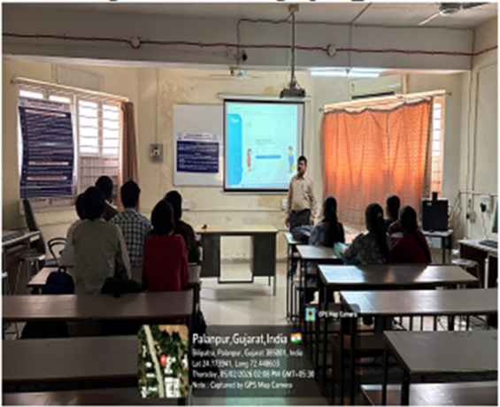

Figure 6.2.2 Photographs

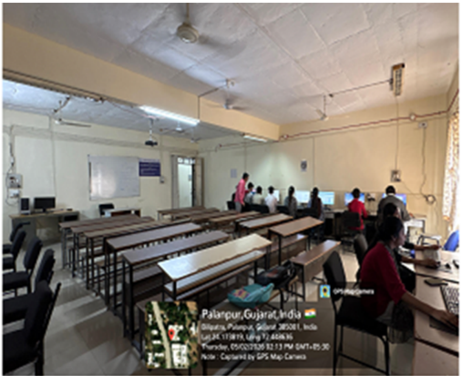

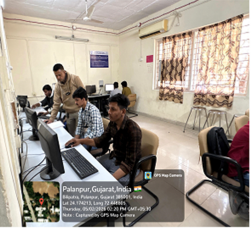

Figure 6.2.4 Photographs B014

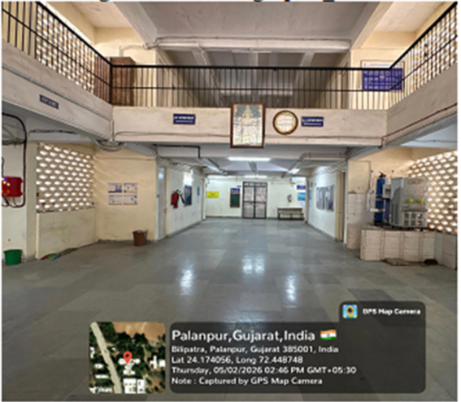

Figure 6.2.5 Fire extinguisher

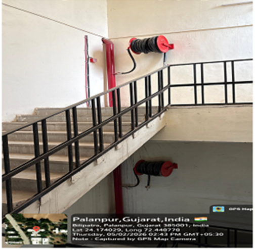

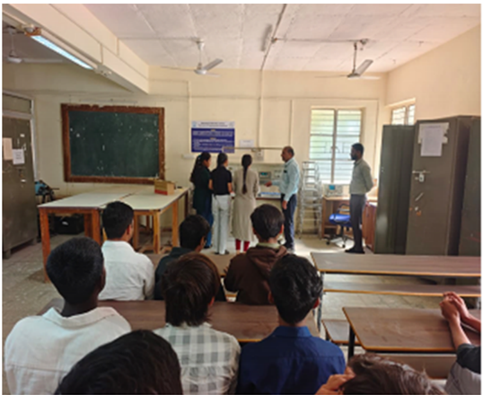

Figure 6.2.6 Photographs

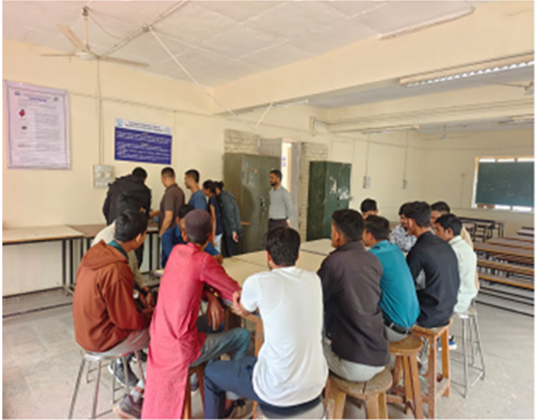

Figure 6.2.8 Photographs

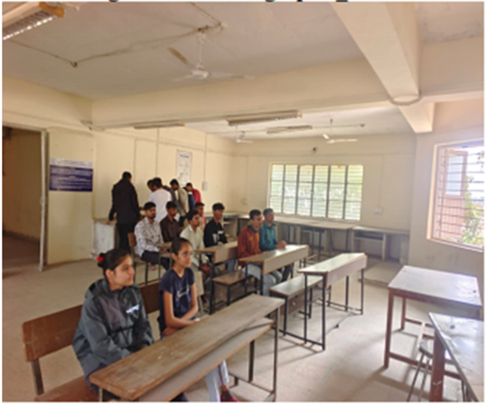

Figure 6.2.10 Photographs B1O6

Figure 6.2.7 Photographs B013

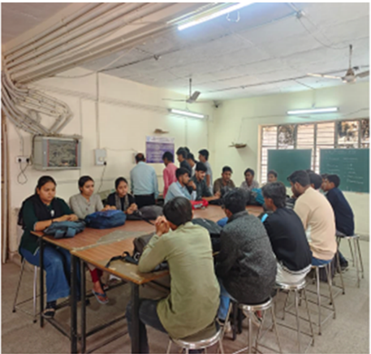

Figure 6.2.9 Photographs B1O5

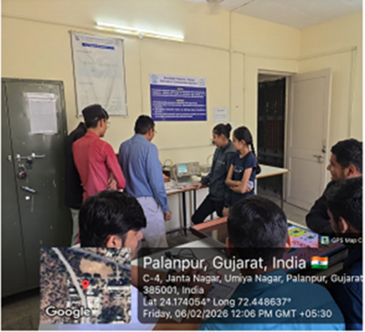

Figure 6.2.1l Fire extinguisher

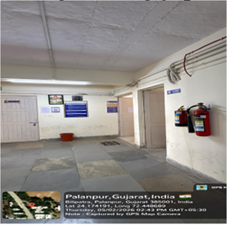

## [C] Technical Manpower support eligible Adequate

The list mentions the major equipment in the department. Besides these, many other equipment items costing less than ₹ 30,000 are also available.

|           |                                                             | N o. of                                        |                                                                | Weekly                                                             | Technical Manpower support   | Technical Manpower support   | Technical Manpower support   |
|-----------|-------------------------------------------------------------|------------------------------------------------|----------------------------------------------------------------|--------------------------------------------------------------------|------------------------------|------------------------------|------------------------------|
| Sr.  N o. | N ame of the Laboratory                                     | students per set-up (Batch Size)               | N ame of the Important equipment (costing more than Rs.30,000) | utilization status (all the courses for which the lab is utilized) | N ame of the technical staff | Designation                  | Qualification                |
| 1         | Computer Lab-1 BADP Building  Ground Floor Room No: B002    | 20 in 1 st  & 2 nd  year, and 15 in 3 rd  year | Computer System                                                | As per Time table.                                                 | Mr. V.S. Sama                | Lab Assistant                | BE in IC Engineering         |
| 2         | Computer Lab-2 BADP Building  Ground Floor Room No: B008    | 20 in 1 st  & 2 nd  year, and 15 in 3 rd  year | Computer System                                                | As per Time table.                                                 | Mr. V.S. Sama                | Lab Assistant                | BE in IC Engineering         |
| 3         | Computer Lab-3 BADP Building  Ground Floor Room No: B009    | 20 in 1 st  & 2 nd  year, and 15 in 3 rd  year | Computer System                                                | As per Time table.                                                 | Mr. V.S. Sama                | Lab Assistant                | BE in IC Engineering         |
| 4         | Computer Lab-4 BADP Building  Ground Floor Room No: B014    | 20 in 1 st  & 2 nd  year, and 15 in 3 rd  year | Computer System                                                | As per Time table.                                                 | Mr. V.S. Sama                | Lab Assistant                | BE in IC Engineering         |
| 5         | Electronics Lab-1 BADP Building  Ground Floor Room No: B010 | 20 in 1 st  & 2 nd  year, and 15 in 3 rd  year | Function Generator                                             | As per Time table.                                                 | Mr. V.S. Sama                | Lab Assistant                | BE in IC Engineering         |
| 6         | Electronics Lab-2 BADP Building  Ground Floor Room No: B013 | 20 in 1 st  & 2 nd  year, and 15 in 3 rd  year | CRO/DSO and Function Generator                                 | As per Time table.                                                 | Mr. V.S. Sama                | Lab Assistant                | BE in IC Engineering         |
|           | Electronics Lab-3                                           | 20 in 1 st  & 2 nd  year,                      |                                                                |                                                                    |                              | Lab Assistant                |                              |

10.00

|   7 | BADP Building  First Floor Room No: B106                     | and 15 in 3 rd  year                           | Function Generator                             | As per Time table.   | Mr. V.S. Sama   |               | BE in IC Engineering   |
|-----|--------------------------------------------------------------|------------------------------------------------|------------------------------------------------|----------------------|-----------------|---------------|------------------------|
|   8 | Communication Lab-1 BADP Building  First Floor Room No: B101 | 20 in 1 st  & 2 nd  year, and 15 in 3 rd  year | PAM-PPM-PWM Trainer kit and Mobile Trainer kit | As per Time table.   | Mr. V.S. Sama   | Lab Assistant | BE in IC Engineering   |
|   9 | Communication Lab-2 BADP Building  First Floor Room No: B105 | 20 in 1 st  & 2 nd  year, and 15 in 3 rd  year | Antenna Trainer kit and Microwave bench        | As per Time table.   | Mr. V.S. Sama   | Lab Assistant | BE in IC Engineering   |

Table: 6.2.6 Laboratory equipment details technical manpower support

| Sr. No   |                                                                   | Number of students per set up(Batch Size) Name of the Important Equipment(Costing more than Rs.30,000)   | Weekly utilization status(all the courses for which the lab is utilized)   | Technical Manpower Support   | Technical Manpower Support   | Technical Manpower Support   |
|----------|-------------------------------------------------------------------|----------------------------------------------------------------------------------------------------------|----------------------------------------------------------------------------|------------------------------|------------------------------|------------------------------|
| Sr. No   | Name of the Laboratory                                            | Number of students per set up(Batch Size) Name of the Important Equipment(Costing more than Rs.30,000)   | Weekly utilization status(all the courses for which the lab is utilized)   | Name of the Technical staff  | Designation                  | Qualification                |
| 1        | Computer  Lab-1 BADP Building   Ground Floor  Room No: B002 20    | Computer System                                                                                          | As per Time table.                                                         | Mr. V.S. Sama                | Lab Assistant                | BE in IC Engineering         |
| 2        | Computer  Lab-2 BADP Building   Ground Floor  Room No: B008 20    | Computer System                                                                                          | As per Time table.                                                         | Mr. V.S. Sama                | Lab Assistant                | BE in IC Engineering         |
| 3        | Computer  Lab-3 BADP Building   Ground Floor  Room No: B009 20    | Computer System                                                                                          | As per Time table.                                                         | Mr. V.S. Sama                | Lab Assistant                | BE in IC Engineering         |
| 4        | Computer  Lab-4 BADP Building   Ground Floor  Room No: B014 20    | Computer System                                                                                          | As per Time table.                                                         | Mr. V.S. Sama                | Lab Assistant                | BE in IC Engineering         |
| 5        | Electronics  Lab-1 BADP Building   Ground Floor  Room No: B010 20 | Function Generator                                                                                       | As per Time table.                                                         | Mr. V.S. Sama                | Lab Assistant                | BE in IC Engineering         |
| 6        | Electronics  Lab-2 BADP Building   Ground Floor  Room No: B013 20 | CRO/DSO and Function Generator                                                                           | As per Time table.                                                         | Mr. V.S. Sama                | Lab Assistant                | BE in IC Engineering         |
| 7        | Electronics  Lab-3 BADP Building   First Floor  Room No: B106 20  | Function Generator                                                                                       | As per Time table.                                                         | Mr. V.S. Sama                | Lab Assistant                | BE in IC Engineering         |
| 8        | Communication Lab-1 BADP Building   First Floor  Room No: B101 20 | PAM-PPM-PWM Trainer kit and Mobile Trainer kit                                                           | As per Time table.                                                         | Mr. V.S. Sama                | Lab Assistant                | BE in IC Engineering         |
| 9        | Communication Lab-2 BADP Building   First Floor  Room No: B105 20 | Antenna Trainer kit and Microwave bench                                                                  | As per Time table.                                                         | Mr. V.S. Sama                | Lab Assistant                | BE in IC Engineering         |

## 6.3 Additional facilities created for improving the quality of learning experience in laboratories (20)

## Total Marks 20.00

## A. Facilities (10)

## [A] Facilities

The Electronics and Communication Engineering Department of Government Polytechnic, Palanpur, demonstrates strong institutional support and effective governance through the provision of additional facilities that enhance the teachingÐlearning experience in laboratories. These initiatives reflect the departmentÕs commitment to fostering student creativity, technical skills, and outcome-based education.

- Regular Procurement and Upgradation:

Laboratory equipment is procured regularly in accordance with university circulars, ensuring that facilities remain updated and well-equipped. This reflects transparent governance and effective financial resource utilization.

- Department Library Managed by Students :

A dedicated departmental library, managed by students, provides supplementary learning resources. This initiative encourages self-directed learning, peer collaboration, and student participation in governance.

- High-Speed CWA N Internet Facility:

The department provides wired and wireless CWAN internet connectivity with a bandwidth of 200 Mbps. This robust infrastructure supports seamless access to online academic resources, research databases, and collaborative platforms, demonstrating institutional support for ICT-enabled learning.

- LA N Connectivity in Laboratories:

All laboratories are equipped with LAN facilities, ensuring reliable network access for experiments, simulations, and academic work. This reflects governance that prioritizes digital integration and resource accessibility.

- ICT-Enabled Teaching Tools:

Projectors with screens installed in laboratories (Room No. B008 and B009) support effective teachingÐlearning practices. These facilities enable faculty to deliver interactive sessions and allow students to present project work efficiently.

Institute Marks

10.00

- Student-Centric Governance and Support:

By providing these additional facilities, the department ensures that students have access to resources beyond the minimum curriculum requirements. This reflects governance practices that prioritize innovation, creativity, and holistic student development.

## [1] Purchase summary report of year from 2022-23 to 2025-26

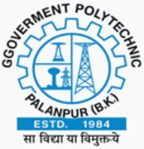

Government Polytechnic, Palanpur

Department of Electronics &amp; Communication

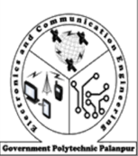

## Purchase summary report of year from 2022-23 to 2025-26

|         | Total Purchase Amount   | Total Purchase Amount   | Purchase items count   | Purchase items count   |           |
|---------|-------------------------|-------------------------|------------------------|------------------------|-----------|
| Year    | Equipment               | IT items                | Equipment              | IT items               | Furniture |
| 2022-23 | 420432                  | 00                      | 47                     | 00                     | 11722     |
| 2023-24 | 126938                  | 00                      | 14                     | 00                     | 00        |
| 2024-25 | 74440                   | 677842                  | 3                      | 11                     | 44783     |
| 2025-26 | 8990                    | 00                      | 1                      | 00                     | 00        |
| Total   | 630800                  | 677842                  | 65                     | 11                     | 56505     |

Table: 6.3.1 Departmental purchase summary

## Year 2022-23

| Sr. N o.   | Expandable Register   | Expandable Register   | Expandable Register   | GeM Contract  N o.   | Item description                                                                                          | Order Date   | CRAC Amount (Actual paid considering penalty etc..)   | Qt.   | Ordered  amount   |
|------------|-----------------------|-----------------------|-----------------------|----------------------|-----------------------------------------------------------------------------------------------------------|--------------|-------------------------------------------------------|-------|-------------------|
| Sr. N o.   | Register              | Page  N o.            | Sr. N o.              | GeM Contract  N o.   | Item description                                                                                          | Order Date   | CRAC Amount (Actual paid considering penalty etc..)   | Qt.   | Ordered  amount   |
| 1          | E                     | 13                    | 63                    | GEMC-511687745186103 | Metrix plus H Held 10000 KHz Digital Multimeter (Metrix plus) Model | Metrix+ 171TRMS+                    | 06-10-2022   | 18683                                                 | 5     | 18683             |
| 2          | E                     | 13                    | 64                    | GEMC-511687701684512 | Metravi Manual Digital LCD Display LCR Meter, Warranty 1 year (Metravi)Model | METRAVI-451                | 06-10-2022   | 4416                                                  | 1     | 4485              |
| 3          | E                     | 13                    | 65                    | GEMC-511687724579264 | SCHERING BRIDGE (LINKER)Model | SCHERING BRIDGE                                                           | 07-01-2023   | 9890                                                  | 1     | 9990              |
| 4          | E                     | 13                    | 66                    | GEMC-511687794982138 | ITI SMPS Trainer (LINKER)Model | ITI SMPS Trainer                                                         | 07-01-2023   | 11870                                                 | 1     | 11990             |
| 5          | E                     | 14                    | 67                    | GEMC-511687718480531 | Strain Gauge Trainer kit (BTC Instruments) Model | REX-652                                                | 07-01-2023   | 12477                                                 | 1     | 12540             |
| 6          | E                     | 14                    | 68                    | GEMC-511687788409647 | DIGITAL TO ANALOG TRAINER KIT (BTC Instruments) Model | DTOA                                              | 07-01-2023   | 3546                                                  | 1     | 3600              |
| 7          | E                     | 14                    | 69                    | GEMC-511687703126381 | PSK Modulation Demodulation Trainer Kit (BTC Instruments) Model | PSK Modulation Demodulation Trainer Kit | 20-01-2023   | 6965                                                  | 1     | 7000              |

## [2] Year-wise Equipment purchase detail

|   8 | E   |   14 |   70 | GEMC-511687762161725   | VARIAC/ DIMMERSTATE/ AUTO TRANSFORMER Single Phase, 2Amp (LABSURGE)Model | PH 258/1                                                           | 17-01-2023   |   5200 |   1 |   5200 |
|-----|-----|------|------|------------------------|-----------------------------------------------------------------------------------------------------------------------------------------------|--------------|--------|-----|--------|
|   9 | E   |   15 |   71 | GEMC-511687758178501   | Frequency Modulation & Demodulation TRAINER (BTC Instruments) Model |                                                                         | 17-01-2023   |   6965 |   1 |   7000 |
|  10 | E   |   15 |   72 | GEMC-511687701214990   | LCR Resonance Circuit with Built in Sine Wave Oscillator (BTC Instruments) Model | LCR Resonance Circuit with Built in Sine Wave Oscilloscope | 07-01-2023   |   7683 |   1 |   7800 |
|  11 | E   |   15 |   73 | GEMC-511687767236975   | Thermocouple Charterstics Apparatus (BTC Instruments) Model | Thermocouple Charterstics Apparatus                                             | 17-01-2023   |   7462 |   1 |   7500 |
|  12 | E   |   15 |   74 | GEMC-511687734702929   | FSK Modulation Demodulation Trainer Kit (BTC Instruments) Model | BTC- FSK                                                                    | 20-01-2023   |   7462 |   1 |   7500 |
|  13 | E   |   16 |   75 | GEMC-511687764423059   | Am-Fm Radio Trainer Kit (BTC Instruments) Model | Am-Fm Radio Trainer Kit                                                                     | 17-01-2023   |   7960 |   1 |   8000 |
|  14 | E   |   16 |   76 | GEMC-511687785615046   | 4-Bit Counters (Synchronous Asynchronous) (BTC Instruments) Model | 4-Bit Counters (Synchronous Asynchronous)                                 | 17-01-2023   |   5472 |   1 |   5500 |
|  15 | E   |   16 |   77 | GEMC-511687709631263   | Maximum Power Transfer Theorem (BTC Instruments) Model | Maximum Power Transfer Theorem                                                       | 17-01-2023   |   3781 |   1 |   3800 |
|  16 | E   |   16 |   78 | GEMC-511687704999223   | OHMS LAW APPARATUS With Power Supply (BTC Instruments) Model | GTC- 027                                                                       | 17-01-2023   |   1791 |   1 |   1800 |
|  17 | E   |   17 |   79 | GEMC-511687769798184   | Pulse Width Modulation Kit (BTC Instruments) Model | Pulse Width Modulation Kit                                                               | 17-01-2023   |   7462 |   1 |   7500 |
|  18 | E   |   17 |   80 | GEMC-511687736533145   | PAM-PPM-PWM Trainer kit (BTC Instruments) Model | PAM-PPM-PWM Trainer kit                                                                     | 17-01-2023   |  13432 |   1 |  13500 |
|  19 | E   |   17 |   81 | GEMC-511687784546022   | COLPITTS OSCILLATOR TRAINER (BTC Instruments) Model | BTC - COLLPIT OSCILLATOR                                                                | 17-01-2023   |   2985 |   1 |   3000 |
|  20 | E   |   17 |   82 | GEMC-511687738110995   | Discrete Component Trainer (BTC | Discrete Component Trainer Kit                                                                              | 17-01-2023   |   8955 |   1 |   9000 |
|  21 | E   |   18 |   83 | GEMC-511687718215498   | DSB/SSB AM Receiver Kit (LINKER)Model | DSB/SSB AM Receiver Kit                                                                               | 17-01-2023   |  18705 |   1 |  18900 |
|  22 | E   |   18 |   84 | GEMC-511687700193534   | Delta Modulation Demodulation Trainer Kit (LINKER)Model | Delta Modulation Demodulation Trainer Kit                                           | 17-01-2023   |  10825 |   1 |  10990 |
|  23 | E   |   18 |   85 | GEMC-511687721350332   | Crystal Oscillator (BTC Instruments) Model | Crystal Oscillator                                                                               | 17-01-2023   |   3447 |   1 |   3500 |
|  24 | E   |   18 |   86 | GEMC-511687798174000   | ASK MODULATION DEMODULATION TRAINER (BTC Instruments) Model | AMPLITUDE SHIFT KEYING MODULATION DEMODULATION                                  | 17-01-2023   |   5970 |   1 |   6000 |
|  25 | E   |   19 |   87 | GEMC-511687777573807   | ANALOG TO DIGITAL TRAINER (BTC Instruments) Model | BTC09                                                                                     | 07-01-2023   |   3546 |   1 |   3600 |

|   26 | E   |   19 |   88 | GEMC-511687703860557   | TRAINER (BTC Instruments) Model | BTC- BREAD BOARD TRAINER                                                                       | 17-01-2023   |   3940 |   1 |   4000 |
|------|-----|------|------|------------------------|----------------------------------------------------------------------------------------------------------------------------------|--------------|--------|-----|--------|
|   27 | E   |   19 |   89 | GEMC-511687790732628   | 555 Timer Trainer Kit (BTC Instruments) Model | 555 Timer Trainer Kit                                                            | 17-01-2023   |   5472 |   1 |   5500 |
|   28 | E   |   19 |   90 | GEMC-511687745528097   | Frequency Division Multiplexing & Demultiplexing TRAINER KIT (LINKER)Model | Frequency Division Multiplexing & Demultiplexing    | 17-01-2023   |  11810 |   1 |  11990 |
|   29 | E   |   20 |   91 | GEMC-511687757224366   | Biasing Techniques of Transistor (BJT) (BTC Instruments) Model | BTC789                                                          | 17-01-2023   |   5771 |   1 |   5800 |
|   30 | E   |   20 |   92 | GEMC-511687721951312   | UPS TRAINER (BTC Instruments) Model | BTCUPS TRAINER                                                                             | 17-01-2023   |  16915 |   1 |  17000 |
|   31 | E   |   20 |   93 | GEMC-511687771659081   | FET Characteristics Apparatus (BTC Instruments) Model | REX-535D                                                                 | 10-01-2023   |   4058 |   1 |   4099 |
|   32 | E   |   20 |   94 | GEMC-511687757551010   | OPERATIONAL AMPLIFIER TRAINER WITH 1 DIGITAL METER (BTC Instruments) Model | OPAMP TRAINER                                       | 17-01-2023   |   3940 |   1 |   4000 |
|   33 | E   |   21 |   95 | GEMC-511687716316202   | H Parameter of PNP Transistor in Common Emitter Mode (BTC Instruments) Model | H Parameter of PNP Transistor in Common Emitter M | 18-01-2023   |   4776 |   1 |   4800 |
|   34 | E   |   21 |   96 | GEMC-511687751792519   | VOLTAGE DOUBLER TRIPPLER CIRCUIT (BTC Instruments) Model | BTC09                                                                 | 17-01-2023   |   5565 |   1 |   5650 |
|   35 | E   |   21 |   97 | GEMC-511687789825392   | SCR, Diac & Triac Characteristics Trainer (BTC Instruments) Model | SCR, Diac & Triac Characteristics Trainer                    | 17-01-2023   |  12312 |   1 |  12500 |
|   36 | E   |   21 |   98 | GEMC-511687791146601   | RTD TEMPERATURE TRANSDUCER TRAINER (BTC Instruments) Model | RTD TEMPERATURE TRANSDUCER TRAINER                                  | 17-01-2023   |   9357 |   1 |   9500 |
|   37 | E   |   22 |   99 | GEMC-511687763697444   | Pulse Code Modulation Demodulation Trainer Kit (BTC Instruments) Model | Pulse Code Modulation Demodulation Trainer Kit          | 17-01-2023   |  10835 |   1 |  11000 |
|   38 | E   |   22 |  100 | GEMC-511687779200273   | Unbred 20-megahertz 2 channels AnalogOscilloscope (NA)Model | Unitec- OD20                                                       | 07-01-2023   |  19998 |   1 |  19998 |
|   39 | E   |   22 |  101 | GEMC-511687741762420   | HARTLEY OSCILLATOR KIT (BTC Instruments) Model | BTC-908                                                                         | 17-01-2023   |   2985 |   1 |   3000 |
|   40 | E   |   22 |  102 | GEMC-511687727095212   | RC PHASE SHIFT OSCILLATOR (BTC Instruments) Model | BTC- RC PHASE SHIFT                                                          | 17-01-2023   |   2985 |   1 |   3000 |
|   41 | E   |   23 |  103 | GEMC-511687747281772   | Wein Bridge Oscillator (BTC Instruments) Model | Wein Bridge Oscillator                                                          | 17-01-2023   |   2587 |   1 |   2600 |
|   42 | E   |   23 |  104 | GEMC-511687750692974   | PUSH PULL AMPLIFIER KIT (BTC Instruments) Model | BTC- PPL                                                                       | 07-01-2023   |   2985 |   1 |   3000 |
|   43 | E   |   23 |  105 | GEMC-511687757163770   | TIME DIVISON MULTIPLEXING DEMULTIPLEXING KIT (LINKER)Model | TIME DIVISON MULTIPLEXING DEMULTIPLEXING KIT                        | 20-01-2023   |  12795 |   1 |  12990 |
|   44 | E   |   23 |  106 | GEMC-511687765263840   | KVL & KCL TRAINER KIT (BTC Instruments) Model | SP-KVL                                                                           | 17-01-2023   |   3781 |   1 |   3800 |

| 45    | E     | 24    | 107   | GEMC-511687716964975   | ROBU. IN - Uno R3 Board without Cable compatible with Arduino (14140) (Robu.in) Model | ROBU.IN - Uno R3 Board without Cable compatible with Arduino (14140)   | 03-03-2023   |   3945 |   5 | 3945   |
|-------|-------|-------|-------|------------------------|----------------------------------------------------------------------------------------------------------------------------------------------------------------|--------------|--------|-----|--------|
| 46    | E     | 24    | 108   | GEMC-511687739675914   | GWINSTEK 10 MHz to 25 MHz Frequency 2 channel functiongenerator (GWINSTEK) Model | GWINSTEK AFG-2225                                                           | 28-02-2023   |  31970 |   1 | 31970  |
| 47    | E     | 24    | 109   | GEMC-511687727874530   | HTC Analog Digital (Mixed Signal) 100 MHz NA Digital StorageOscilloscope (HTC)Model | HTC 100 MHz Digital Oscilloscope                                         | 20-03-2023   |  44700 |   2 | 44700  |
| Total | Total | Total | Total | Total                  | Total                                                                                                                                                          | Total        | 420432 |  56 |        |

## Year 2023-24

|          | Expandable Register   | Expandable Register   | Expandable Register   |                      |                                                                                                                                                    |            | CRAC Amount (Actual paid   | Qt.   |                |
|----------|-----------------------|-----------------------|-----------------------|----------------------|----------------------------------------------------------------------------------------------------------------------------------------------------|------------|----------------------------|-------|----------------|
| Sr. N o. | Register              | Page N o.             | Sr. N o.              | GeM Contract  N o.   | Item description                                                                                                                                   | Order Date | considering penalty etc..) |       | Ordered amount |
| 1        | E                     | 24                    | 110                   | GEMC-511687717049199 | ASTALAB EQUIPMENTS 1 Hz to 100 KHz in 6 steps Digital Trainer Kit (ASTALAB EQUIPMENTÕS) Model | Series current feedback in transistor amplifier AP | 01-09-2023 | 5742                       | 1     | 5800           |
| 2        | E                     | 25                    | 111                   | GEMC-511687712919456 | ASTALAB EQUIPMENTS 1 Hz to 100 KHz in 6 steps Digital Trainer Kit (ASTALAB EQUIPMENTÕS) Model | Power amplifier trainer                            | 01-09-2023 | 6633                       | 1     | 6700           |
| 3        | E                     | 25                    | 112                   | GEMC-511687755658427 | ASTALAB EQUIPMENTS 1 Hz to 100 KHz in 6 steps Digital Trainer Kit (ASTALAB EQUIPMENTÕS) Model | Opto-coupler (MCT-2E) trainer                      | 01-09-2023 | 5742                       | 1     | 5800           |
| 4        | E                     | 25                    | 113                   | GEMC-511687723023039 | ASTALAB EQUIPMENTS 1 Hz to 1 MHz in 7 steps Digital Trainer Kit (ASTALAB EQUIPMENTÕS) Model | DECADE COUNTER trainer                               | 02-09-2023 | 5544                       | 1     | 5600           |
| 5        | E                     | 25                    | 114                   | GEMC-51168778851536  | ASTALAB EQUIPMENTS 1 Hz to 100 KHz in 6 steps Digital Trainer Kit (ASTALAB EQUIPMENTÕS) Model | Reciprocity/Super Postion/Thevenin                 | 27-09-2023 | 11300                      | 1     | 11300          |
| 6        | E                     | 26                    | 115                   | GEMC-511687749591854 | ASTALAB EQUIPMENTS 1 Hz to 1 MHz in 7 steps Digital Trainer Kit (ASTALAB EQUIPMENTÕS) Model | Maxwells bridge trainer kit                          | 01-09-2023 | 10741                      | 1     | 10850          |
| 7        | E                     | 26                    | 116                   | GEMC-511687764565814 | ASTALAB EQUIPMENTS 1 Hz to 1 MHz in 7 steps Digital Trainer Kit (ASTALAB EQUIPMENTÕS) Model | DIGITAL IC TESTER                                    | 01-09-2023 | 10780                      | 1     | 11000          |
| 8        | E                     | 26                    | 117                   | GEMC-511687794428477 | UNI-T 4.5-digit Backlit LCD Hand Held True Rms Clamp Meter (UNI-T) Model | UT211B                                                                  | 02-09-2023 | 17820                      | 3     | 18000          |
| 9        | E                     | 26                    | 118                   | GEMC-511687751160025 | ASTALAB EQUIPMENTS 1 Hz to 100 KHz in 6 steps Digital Trainer Kit (ASTALAB EQUIPMENTÕS) Model | Universal Chopper trainer                          | 11-10-2023 | 17640                      | 1     | 18000          |
| 10       | E                     | 27                    | 119                   | GEMC-511687755707891 | ASTALAB EQUIPMENTS 1 Hz to 1 MHz in 7 steps Digital Trainer Kit (ASTALAB EQUIPMENTÕS) Model | IGBT                                                 | 11-10-2023 | 9800                       | 1     | 10000          |

|       |       |       |       |                      | Characteristic trainer                                                                                                                          |            |        |    |       |
|-------|-------|-------|-------|----------------------|-------------------------------------------------------------------------------------------------------------------------------------------------|------------|--------|----|-------|
| 11    | E     | 27    | 120   | GEMC-511687795448484 | ASTALAB EQUIPMENTS 1 Hz to 1 MHz in 7 steps Digital Trainer Kit (ASTALAB EQUIPMENTÕS) Model | DIGITAL MOSFET characteristics trainer kit        | 11-10-2023 |   4179 |  1 | 4200  |
| 12    | E     | 27    | 121   | GEMC-511687761016473 | ASTALAB EQUIPMENTS 1 Hz to 100 KHz in 6 steps Digital Trainer Kit (ASTALAB EQUIPMENTÕS) Model | NortonÕs theorem trainer                        | 26-10-2023 |   5174 |  1 | 5200  |
| 13    | E     | 27    | 122   | GEMC-511687702876555 | ASTALAB EQUIPMENTS 1 Hz to 1 MHz in 7 steps Digital Trainer Kit (ASTALAB EQUIPMENTÕS) Model | Two stage ÒRCÓ coupled amplifier using Transistor | 01-09-2023 |   5148 |  1 | 5200  |
| 14    | E     | 28    | 123   | GEMC-511687776635913 | ASTALAB EQUIPMENTS 1 Hz to 1 MHz in 7 steps Digital Trainer Kit (ASTALAB EQUIPMENTÕS) Model | WHEATSTONE BRIDGE                                 | 27-09-2023 |  10695 |  1 | 11500 |
| Total | Total | Total | Total | Total                | Total                                                                                                                                           | Total      | 126938 | 16 |       |

## Year 2024-25

|             | Expandable Register   | Expandable Register   | Expandable Register   |                      |                                                                                                                                      |             | CRAC Amount                             |     |                |
|-------------|-----------------------|-----------------------|-----------------------|----------------------|--------------------------------------------------------------------------------------------------------------------------------------|-------------|-----------------------------------------|-----|----------------|
| Sr. N o.    | Register              | Page N o.             | Sr. N o.              | GeM Contract  N o.   | Item description                                                                                                                     | Order Date  | (Actual paid considering penalty etc..) | Qt. | Ordered amount |
| 1           | E                     | 32                    | 139                   | GEMC-511687744418451 | Ivesty Ring Topology for Networking Trainer Kit | Mobile Phone Trainer                                                               | 06-09-2024  | 24990                                   | 1   | 24990          |
| 2           | E                     | 32                    | 140                   | GEMC-511687719258644 | KITEK TECHNOLOGIES PRIVATE LIMITED NA FPGA Development and Evaluation Board Model | VLS-01 (VLSI Trainer with XILINX FPGA Spartan 6) | 14-10-2024  | 24774                                   | 1   | 24899          |
| 3           | E                     | 32                    | 141                   | GEMC-511687756696973 | KITEK TECHNOLOGIES PRIVATE LIMITED NA FPGA Development and Evaluation Board, Model | E87-04 (ATMEGA32 AVR Embedded Trainer Kit)      | 14-10-2024  | 24676                                   | 1   | 24800          |
| Total 74440 | Total 74440           | Total 74440           | Total 74440           | Total 74440          | Total 74440                                                                                                                          | Total 74440 | Total 74440                             | 3   |                |

## Year 2025-26

|          | Expandable Register   | Expandable Register   | Expandable Register   |                      |                                                                       |            | CRAC Amount (Actual paid   |     |                |
|----------|-----------------------|-----------------------|-----------------------|----------------------|-----------------------------------------------------------------------|------------|----------------------------|-----|----------------|
| Sr. N o. | Register              | Page N o.             | Sr. N o.              | GeM Contract  N o.   | Item description                                                      | Order Date | considering penalty etc..) | Qt. | Ordered amount |
| 1        | Expandable            | 33                    | 142                   | GEMC-511687778080969 | T-SERIES Bluetooth Speaker with Total Power Rating 100-125 (T-SERIES) | 08-09-2025 | 8990                       | 1   | 8990           |
| Total    | Total                 | Total                 | Total                 | Total                | Total                                                                 | Total      | 8990                       | 1   |                |

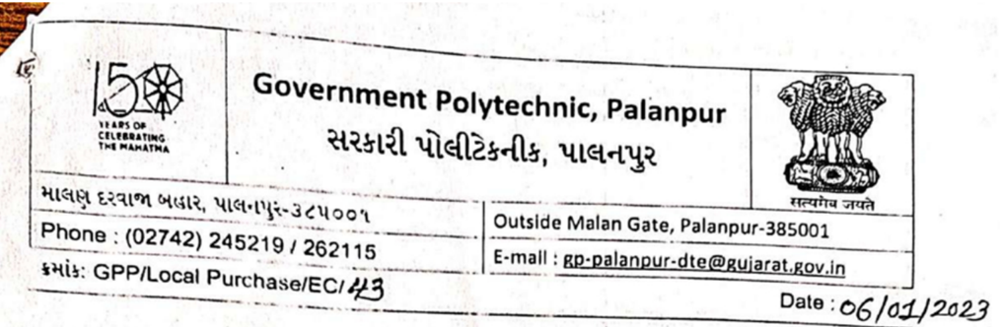

Phone

Outslde Malan Gate, Palanpur-385001

(02742) 245219 / 262115

{uis: GPPILocal

E-mall

PurchaselEcI 45

Dale : 06/01/2023

0*/09/2023 Date

## Purchase Order

As per above stated reference number and considering purchase to institution power delegated to from GEM head(Principal) ,it is granted to purchase following stated item portal.

## DEMAND NO 511687718480531

| Name of Item (with specification                                | Date      |   Pricelitem |   Quantity |   Total Price |
|-----------------------------------------------------------------|-----------|--------------|------------|---------------|
| Strain Gauge Trainer kit Can perform practical of Strain Gague. | 5/01/2023 |        12540 |          1 |         12540 |

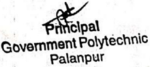

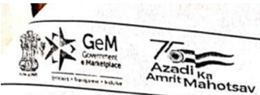

## Sancllon Order

Sanction of the competent

placed on the Seller for

of Goods/Servkces as per ohe an conlract lor payment to the Seller subject to deduction orderIContract ol TDS as applicable: incurring Supply making

## Organisation Details

## Detalls Buyer

Type:

State Govemment.

Namno:

Sunikumar J Chauhan

Doskgnallon:

Depanment:

Education Department Gujaral Commissionerate ol Technical Educallon

Emall ID:

Organisation Name:

GSTIN:

Ollicc Name:

Address:

DANASKANTHA 385001

## Financial Approval Detail

PRINCIPAL GOVERNMENT POLYTECHNIC PALANPUR

IFD Concurrence / Competent Approval Required? (HOD / Head ot Ollice) Hget availablity Authonty

YES

Designation of official providing Financial approval:

PRINCIPAL GOVERNMENT POLYTECHNIC PALANPUR

## Seller Details

Company Name:

BATRA TRADING COMPANY batratrading 37@omail com BATRA TRADING COMPANY Ambala HARYANA 133001

Email ID:

Addrcss:

Ministry:

## Product Details

|                         | Item Description         | Model                   | Ordered Quantlly        | Unlt                    | Price per Unit Inclusive of all Duties and Taxes (In INR)   |   Tolal Price (inclusivc o/ all Dutles and Taxes (In INR)) |
|-------------------------|--------------------------|-------------------------|-------------------------|-------------------------|-------------------------------------------------------------|------------------------------------------------------------|
|                         | Strain Gauge Trainer kit | 652                     |                         | pieces                  | 12540.0                                                     |                                                      12540 |
| al Order Value (in INR) | al Order Value (in INR)  | al Order Value (in INR) | al Order Value (in INR) | al Order Value (in INR) | al Order Value (in INR)                                     |                                                      12540 |

## Conslgnee Details

| S.No   | Conslgnee                                                                                             | Item                     | Lot No.   | Quantlty   | Delivery Slart After   | Dellvery To Be Completed By   |
|--------|-------------------------------------------------------------------------------------------------------|--------------------------|-----------|------------|------------------------|-------------------------------|
|        | Sunikumar J Chauhan hodec gPP- pln@gujarat gov in NEAR MALAN GATE PALANPUR BANASKANTHA GUJARAT 385001 | Strain Gauge Trainer kit |           |            | 07-Jan-2023            | 22Jan-2023                    |

## Terms &amp; Condltlons

- 1.This issues under the power delegaled to Minislries/Department ol the Government of Indialorganizationstale vide Annexure to schedule Vol the Delegation ol Financial Power Rules, 1978 as amended from time to time or as per applicable delegation 0l financial power rules as approved

Sanction Mo: 511687718480531 Sanction Date: 07-Jan-2023

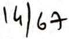

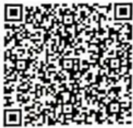

Invoice

SELLER DETAILS: Address: BATRA TRADING COMPANY 2759-20 TIMBER MARKET, ambala, Ambala, HARYANA; 133001 Email Id: BATRATRADING.37@GMAIL COM Contact No 08295848444 GSTIN: O6AAYFB8367KIZK

SHIPPING TO:

Consignee Name: Sunilkumar J Chauhan Address: NEAR MALAN GATE PALANPUR BANASKANTHA GUJARAT 385001

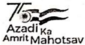

GeM Invoice No: GEM-27044607 GeM Invoice Date: 02-Feb-2023

Order No: GEMC-511687718480531 Order Date: 07-Jan-2023

Click here to download seller invoice

BILL TO: Buyer Name: Sunilkumar J Chauhan Address: NEAR MALAN GATE PALANPUR BANASKANTHA GUJARAT 385001

|   Seller Tax Invoice Number | Seller Tax Involce Date   | Dlspatch Mode   | Dispatch Date   |
|-----------------------------|---------------------------|-----------------|-----------------|
|                        8607 | 23-Jan-2023               | Manual          | 23-Jan-2023     |

| Place of Supply   | Place of Supply State (StatelUT Code)   | Supply Type   | Buyer GSTIN Number   |
|-------------------|-----------------------------------------|---------------|----------------------|
| Buyer Location    | Gujarat / 24                            | Inter-State   |                      |

| Product Description      | HSN Code    | Measuremen Supplied Oty                                                                 | Unit Price                                                   | Total Price inclusive all Taxos   |
|--------------------------|-------------|-----------------------------------------------------------------------------------------|--------------------------------------------------------------|-----------------------------------|
| Strain Gauge Trainer kit | 9027        |                                                                                         | Rs. 12540.00                                                 | Rs. 12540.00                      |
|                          |             | Taxable Amount Tax Rale (%) IGST Cess Rale (%) Cess Amount Cess in Quantum Rounding Off | Rs. 10627.12 18 Rs. 1912.88 0.00o Rs. 0.00 Rs. 0.00 Rs. 0.00 |                                   |
| Grand Total              | Grand Total | Grand Total                                                                             | Grand Total                                                  | Rs. 12540.00                      |

1 Me hereby declare that our firmlcompany has been specifically excluded Irom the requirement t0 comply with GST e-invoicing provisions vide Notification number 13/2020-Central Tax daled 21 March 2020, as amended up to date. Accordingly; at present, we are not covered under the ambit of GST c-invoicing provisions. do hereby declare that once the said provisions are made applicable to us, we shall issue the duly complied e-Invoice under GST Law. We

All GST invoice or document issued by us shall be properly and timely reported under respective returns under GST by us in line with the notified provisions and the applicable tax collected from Buyer shall be timely and correctly paid to the respective Government by us.

regard, we shall be liable in respect of all claims of tax, penally andlor interest, loss, damages, costs, expenses and liability that

## PALANPUR GOVERNMENT POLYTECHNIC,

| NAME OF ITEM                         |             |
|--------------------------------------|-------------|
| [SHORT DESCRIPTION                   |             |
| BUYER NAME                           | J. 'chavhan |
| [SUPPLIER NAME                       |             |
| [CONIRACT NO.                        |             |
| CONTRACT DATE                        |             |
| ITEM DELIVERED ON                    |             |
| ITEM INSPECTED ON                    |             |
| RECEIVED QTY .                       | 01          |
| ACCEPTED QTY                         | 01          |
| REJECTED QTY                         |             |
| DEPT. REGISTER PAGE NO. AND ITEM NO. |             |

BFPQRI AND

INSPECTION REPORT

ifem oK-

INSPECTED BY

SIGNATURE OF BUYER

2

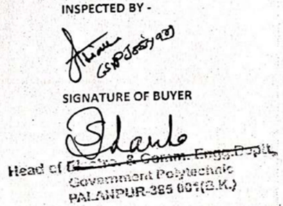

DATE - 07/62|2025

Clan

2

10 Cenilied IFai

11

125

6-607. No

(hi

- Kf gawge7

Ul

- Library Conligencec) are in cualalionin
- charges

Thls is la ParvFull

{claling

Paymenl

- {or Paymenl ol ßs

No

20

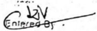

(Rurcss

Twelv&lt;

Dale

200

See

No.

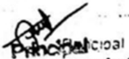

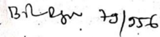

0=

'663

Ilem has

nol been

Dossed &amp;s | clov

Hu

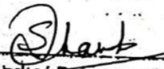

PALANPUR 365

a( Ilem

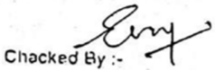

(FOR OFFICE USG )

1243)

## [B] Effective Utilization

For efficient and effective utilization of the available resources, the following measures have been implemented:

- An Equipment Utilization Register is maintained as per the format provided in the table below.
- Internet usage is monitored and regulated during working hours to ensure academic and administrative effectiveness.

## [1] Lab Utilization format

Academic term:

N ame of laboratory and Room N o.:

N ame of Subject with code:

|   Sr. N o. | Date   | Time Duration   | Semester   | Batch   | N ame of Equipment   | N ame and sign of Faculty   |
|------------|--------|-----------------|------------|---------|----------------------|-----------------------------|
|          1 |        |                 |            |         |                      |                             |
|          2 |        |                 |            |         |                      |                             |
|          3 |        |                 |            |         |                      |                             |
|          4 |        |                 |            |         |                      |                             |
|          5 |        |                 |            |         |                      |                             |
|          6 |        |                 |            |         |                      |                             |
|          7 |        |                 |            |         |                      |                             |
|          8 |        |                 |            |         |                      |                             |
|          9 |        |                 |            |         |                      |                             |
|         10 |        |                 |            |         |                      |                             |
|         11 |        |                 |            |         |                      |                             |
|         12 |        |                 |            |         |                      |                             |
|         13 |        |                 |            |         |                      |                             |

Government Polytechnic, Palanpur Department of Electronics &amp; Communication

Lab Utilization Register ÐFormat

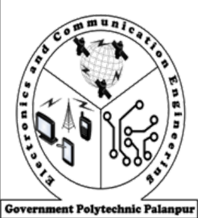

5.00

[2] Lab Utilization report

14

Table: 6.3.3 Laboratory Equipment utilization format

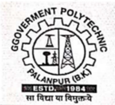

## Government Polytechnic, Palanpur Department of Electronics &amp; Communication

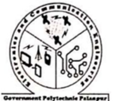

## Lab Utilization Register

Accademic term: 2024-2&lt;

|   Sr. No. | Date   | Time Duration   | Semester   | Batch   | Name of Equipment   | Name and Sign of Faculty   |
|-----------|--------|-----------------|------------|---------|---------------------|----------------------------|
|         1 |        |                 |            |         |                     |                            |
|         2 |        | 3+05110         |            | AL      |                     |                            |
|         3 | shles  |                 |            | AL      | buner kil           |                            |
|         4 |        | 3+5:1           |            | Al      | Anla "              |                            |
|         5 |        |                 |            | AL      |                     |                            |
|         6 |        | 3+5:            |            |         |                     |                            |
|         7 |        |                 |            | AL      | Aalenn              |                            |
|         8 |        |                 |            | 4+      |                     |                            |
|         9 |        |                 |            | A       | bunwlà              |                            |
|        10 |        |                 |            |         |                     |                            |
|        11 |        |                 |            | A       |                     |                            |
|        13 | 26lks  |                 |            | A       |                     |                            |
|        14 | aluls  |                 | Rec        | 4       | Jon+om              |                            |
|        15 |        |                 |            |         |                     |                            |
|        16 |        | 3+5116          |            | AL      |                     |                            |
|        17 |        |                 |            |         |                     |                            |

Name of laboratory and Room No:: Comnuniohn lab 2 (Room Ho 81S)

Name of Subject with code:

(u34)/06) 2 (ne 9

Document 6.3.6 Laboratory utilization report

## [C] Relevance to POs/PSOs (05)

The details regarding the effective utilization of facilities created to enhance the quality of teachingÐlearning processes, with specific relevance to Programme Outcomes (POs) and Programme Specific Outcomes (PSOs), are presented in the table below.

## [1] Year wise Equipment/Component purchase detail for additional facilities

## Year 2022-23

|   Sr.  N o. | Facility  N ame                                                                         | Description                                                                                                                                                                             | Reason(s) for creating facility                                                                                                                                                                                                                               | Utilization                           | Areas in which students are expected to have enhanced learning                                                                                               | Relevance to POs/PSOs             |
|-------------|-----------------------------------------------------------------------------------------|-----------------------------------------------------------------------------------------------------------------------------------------------------------------------------------------|---------------------------------------------------------------------------------------------------------------------------------------------------------------------------------------------------------------------------------------------------------------|---------------------------------------|--------------------------------------------------------------------------------------------------------------------------------------------------------------|-----------------------------------|
|           1 | Digital Multimeter                                                                      | Measurement of electrical parameters such as voltage (AC and DC), current, resistance, continuity and diode & transistor testing                                                        | Provides hands-on experience that reinforces theoretical concepts in electronics Enables students to verify laws and formulas through real-time measurement Helps students learn systematic fault diagnosis & troubleshoot in circuits                        | Electronic Lab -1, 2 &3 Comm Lab -1&2 | Diagnose faulty components and circuits Identify wiring errors Verify theoretical calculations experimentally                                                | PO1 PO2 PO4 PO5 PO7 PSO1          |
|           2 | Digital LCD Display LCR Meter                                                           | Accurately measurement of the electrical properties of inductance, capacitance and resistance                                                                                           | Helps students practically understand the behaviour of L, C & R beyond theoretical concepts Correct use of test instruments to verify component values for laboratory experiments and project work                                                            | Electronic Lab -1, 2 &3 Comm Lab -1&2 | Analysing measured data Identifying tolerances Understanding of accuracy & reliability in measurements                                                       | PO1 PO2 PO4 PO5 PO7 PSO1          |
|           3 | Different Types of Connectors, Electronics Components, Semiconductor Devices and Relays | Connector, IC, Register, Inductor, Diode, Transistor, Relay                                                                                                                             | Supports hands-on learning Helping students develop component selection, circuit assembly, soldering, testing, and troubleshooting skills                                                                                                                     | Electronic Lab -1, 2 &3 Comm Lab -1&2 | Component identification, testing, and debugging Ability to design, and analyse circuits using components                                                    | PO1 PO2 PO3 PO4 PO5 PO7 PSO1 PSO2 |
|           4 | Discrete Component Trainer                                                              | Resistors, capacitors, inductors, Diode, LED, Zener diode, BJT, FET with connecting/ measurement point, patch cords and multiple DC voltage outputs (+5V, ±12V, or adjustable voltages) | Enables students to verify theoretical concepts through hands-on experiments Provides practical exposure to circuit building, testing, and analysis using individual components Allows students to design and modify simple electronic circuits independently | Electronic Lab -1, 2 &3               | Logical thinking to identify and rectify circuit faults Conceptual clarity and hands-on skills Awareness of proper handling, ratings, and safety precautions | PO1 PO2 PO3 PO4 PO5 PSO1          |
|           5 | Bread Board with Power Supplies Trainer                                                 | Breadboard with connecting/ measurement point, patch cords and multiple DC voltage outputs (+5V, ±12V, or adjustable voltages)                                                          | Enables students to verify theoretical concepts through hands-on experiments Provides practical exposure to circuit building, testing, and analysis using individual components Allows students to design and modify simple                                   | Electronic Lab -1, 2 &3               | Logical thinking to identify and rectify circuit faults Conceptual clarity and hands-on skills                                                               | PO1 PO2 PO3 PO4 PO5 PSO1          |

|    |                                             |                                                                                                                                 | electronic circuits independently                                                                                                                                                                                                        |                     |                                                                                                                                                           |                      |
|----|---------------------------------------------|---------------------------------------------------------------------------------------------------------------------------------|------------------------------------------------------------------------------------------------------------------------------------------------------------------------------------------------------------------------------------------|---------------------|-----------------------------------------------------------------------------------------------------------------------------------------------------------|----------------------|
| 6  | Schering Bridge Trainer                     | Trainer kit with connecting/ measurement point, patch cords and multiple DC voltage outputs (+5V, ±12V, or adjustable voltages) | Practically perform experiments reinforcing theoretical concepts taught in class Students gain direct experience with AC bridge balancing methods, phase relationships, and impedance calculations                                       | Electronic Lab -1&2 | Practical knowledge of precision measurement of capacitance Ability to balance AC bridges accurately                                                      | PO1 PO2 PO4 PSO1     |
| 7  | SMPS Trainer                                | Adjustable output voltage and load conditions with test points and indicators                                                   | To provide students with real-time experience beyond theoretical classroom learning Learning how output voltage regulation is achieved under varying load and input conditions                                                           | Comm Lab - 2        | Clear understanding of switching devices To develop technical, analytical, and troubleshooting skills                                                     | PO1 PO2 PO4 PO5 PSO1 |
| 8  | Digital to Analog Trainer                   | Trainer kit with connecting/ measurement point, patch cords and multiple DC voltage outputs                                     | Enables students to understand how digital signals are converted into analog signals in real systems  Helps bridge the gap between theoretical concepts such as binary numbers, resolution, and quantization with practical outcomes     | Electronic Lab - 3  | Better understanding of binary numbers, digital codes, and logic levels Clear insight into how digital data is transformed into continuous analog signals | PO1 PO2 PO4 PSO1     |
| 9  | Analog to Digital Trainer                   | Trainer kit with connecting/ measurement point, patch cords and multiple DC voltage outputs                                     | Hands-on experience in observing input analog signals and corresponding digital outputs Learning the stages of sampling, quantization, and encoding                                                                                      | Electronic Lab - 3  | Clear understanding of continuous signals & their representation in digital form Skills in interfacing ADCs with MP and MC                                | PO1 PO2 PO4 PSO1     |
| 10 | Frequency Modulation & Demodulation Trainer | Trainer kit with connecting/ measurement point, patch cords and AC sine wave with frequency adjustable notch                    | Hands-on exploration of FM signal generation, Spectral characteristics of FM, Demodulation techniques Helps students develop operating signal generators, oscilloscopes, measuring frequency deviation, bandwidth, and distortion skills | Comm Lab -1&2       | Fundamental understanding, signal analysis & interpretation Experimental & analytical thinking Troubleshooting & problem-solving ability                  | PO1 PO2 PO4 PSO1     |
| 11 | ASK Modulation & Demodulation Trainer       | Trainer kit with connecting/ measurement point, patch cords and AC sine wave with amplitude adjustable notch                    | Hands-on exploration of FSK signal generation, Spectral characteristics of FSK, Demodulation techniques Helps students develop operating signal generators, oscilloscopes, measuring amplitude skills                                    | Comm Lab -1&2       | Fundamental understanding, signal analysis & interpretation Learning in circuit operation & measurement Experimental & analytical thinking                | PO1 PO2 PO4 PSO1     |
|    |                                             | Trainer kit with connecting/                                                                                                    | Hands-on exploration of PSK signal generation, Spectral characteristics of PSK, Demodulation                                                                                                                                             |                     | Fundamental understanding, signal analysis &                                                                                                              | PO1                  |

|   12 | PSK Modulation & Demodulation Trainer               | measurement point, patch cords and AC sine wave with phase shift adjustable notch                                               | techniques Helps students develop operating signal generators, oscilloscopes, measuring phase difference skills                                                                                                                      | Comm Lab -1&2      | interpretation Learning in circuit operation & measurement Experimental & analytical thinking                                                                           | PO2 PO4 PSO1          |
|------|-----------------------------------------------------|---------------------------------------------------------------------------------------------------------------------------------|--------------------------------------------------------------------------------------------------------------------------------------------------------------------------------------------------------------------------------------|--------------------|-------------------------------------------------------------------------------------------------------------------------------------------------------------------------|-----------------------|
|   13 | FSK Modulation & Demodulation Trainer               | Trainer kit with connecting/ measurement point, patch cords and AC sine wave with frequency adjustable notch                    | Hands-on exploration of FSK signal generation, Spectral characteristics of FSK, Demodulation techniques Helps students develop operating signal generators, oscilloscopes, measuring frequency skills                                | Comm Lab -1&2      | Fundamental understanding, signal analysis & interpretation Learning in circuit operation & measurement Experimental & analytical thinking                              | PO1 PO2 PO4 PSO1      |
|   14 | LCR Resonance Circuit Trainer                       | Trainer kit with connecting/ measurement point, patch cords and AC sine wave with frequency adjustable notch                    | Hands-on exploration of RLC circuit signal characteristics resonance BW Helps students develop operating signal generators, oscilloscopes, measuring frequency skills                                                                | Electronic Lab - 2 | Fundamental understanding, signal analysis & interpretation Learning in circuit operation and measurement Experimental & analytical thinking                            | PO1 PO2 PO4 PSO1      |
|   15 | Thermocouple Charterstics Trainer                   | Trainer kit with connecting/ measurement point, patch cords and DC voltage outputs                                              | Enables students to experimentally verify circuit, transforming a fundamental analytical result into observable and measurable outcomes Experimental validation of theory & conceptual understanding Measurement and Analysis Skills | Electronic Lab - 2 | Fundamental understanding, signal analysis & interpretation Learning in circuit operation, measurement & instrumentation proficiency Experimental & analytical thinking | PO1 PO2 PO4 PSO1      |
|   16 | AM-FM Radio Trainer                                 | Trainer kit with connecting/ measurement point, patch cords and AC sine wave with frequency adjustable notch                    | Enables students to experimentally verify circuit, transforming a fundamental analytical result into observable and measurable outcomes Experimental validation of theory & conceptual understanding Measurement and Analysis Skills | Comm Lab - 2       | Fundamental understanding, signal analysis & interpretation Learning in circuit operation, measurement & instrumentation proficiency Experimental & analytical thinking | PO1 PO2 PO4 PO5 PSO1  |
|   17 | 4-Bit Counters (Synchronous & Asynchronous) Trainer | Trainer kit with connecting/ measurement point, patch cords and multiple DC voltage outputs (+5V, ±12V, or adjustable voltages) | Strengthening Digital Fundamentals Clear Distinction Between Counter Types, Timing, Delay, and Clock Analysis                                                                                                                        | Electronic Lab - 3 | Design-Oriented Learning Instrumentation and Measurement Skills Troubleshooting and Logical Thinking                                                                    | PO1 PO2 PO4 PSO1 PSO2 |
|   18 | Maximum Power Transfer Theorem Trainer              | Trainer kit with connecting/ measurement point, patch cords and multiple DC voltage outputs (+5V, ±12V, or adjustable voltages) | Enables students to experimentally verify circuit, transforming a fundamental analytical result into observable and measurable outcomes Experimental validation of theory & conceptual understanding                                 | Electronic Lab - 2 | Network theorem application & validation Analytical and graphical interpretation of results Experimental planning & execution                                           | PO1 PO2 PO4 PSO1      |

|   19 | Ohms Law Trainer                                         | Trainer kit with connecting/ measurement point, patch cords and multiple DC voltage outputs (+5V, ±12V, or adjustable voltages)   | Enables students to experimentally verify circuit, transforming a fundamental analytical result into observable and measurable outcomes Experimental validation of theory & conceptual understanding                                 | Electronic Lab - 1&2   | Network law application & validation Analytical and graphical interpretation of results Experimental planning & execution    | PO1 PO2 PO4 PSO1     |
|------|----------------------------------------------------------|-----------------------------------------------------------------------------------------------------------------------------------|--------------------------------------------------------------------------------------------------------------------------------------------------------------------------------------------------------------------------------------|------------------------|------------------------------------------------------------------------------------------------------------------------------|----------------------|
|   20 | Pulse Width Modulation Trainer                           | Trainer kit with connecting/ measurement point, patch cords and AC sine wave with frequency/ amplitude adjustable notch           | Enables students to experimentally verify circuit, transforming a fundamental analytical result into observable and measurable outcomes Experimental validation of theory & conceptual understanding                                 | Comm Lab - 1           | PWM application & validation Analytical and graphical interpretation of results Experimental planning & execution            | PO1 PO2 PO4 PSO1     |
|   21 | Colpitts Oscillator Trainer                              | Trainer kit with connecting/ measurement point, patch cords and AC sine wave                                                      | Enables students to experimentally verify circuit, transforming a fundamental analytical result into observable and measurable outcomes Experimental validation of theory & conceptual understanding Measurement and Analysis Skills | Electronic Lab - 2     | Oscillator application & validation Analytical and graphical interpretation of results Experimental planning & execution     | PO1 PO2 PO4 PSO1     |
|   22 | Crystal Oscillator Trainer                               | Trainer kit with connecting/ measurement point, patch cords and AC sine wave                                                      | Enables students to experimentally verify circuit, transforming a fundamental analytical result into observable and measurable outcomes Experimental validation of theory & conceptual understanding                                 | Electronic Lab - 2     | Oscillator application & validation Analytical and graphical interpretation of results Experimental planning & execution     | PO1 PO2 PO4 PSO1     |
|   23 | 555 Timer Trainer                                        | Trainer kit with Patch points, sockets, patch cords, LED indicators and regulated DC power supply                                 | Enables students to experimentally verify multivibrator circuit, transforming a fundamental analytical result into observable and measurable outcomes Experimental validation of theory & conceptual understanding                   | Electronic Lab - 1     | Conceptual Understanding Improved ability to use equipment correctly and safely Ability to evaluate data & interpret results | PO1 PO2 PO4 PO5 PSO1 |
|   24 | Frequency Division Multiplexing & Demultiplexing Trainer | Trainer kit with connecting/ measurement point, patch cords and AC sine wave                                                      | Enables students to experimentally verify circuit, transforming a fundamental analytical result into observable and measurable outcomes Experimental validation of theory & conceptual understanding Measurement and Analysis Skills | Comm Lab - 1           | FDM application & validation Analytical and graphical interpretation of results Experimental planning & execution            | PO1 PO2 PO4 PSO1     |

|   25 | Biasing Techniques of Transistor Trainer   | Trainer kit with connecting/ measurement point, patch cords and multiple DC voltage outputs (+5V, ±12V, or adjustable voltages)   | Enables students to experimentally verify circuit, transforming a fundamental analytical result into observable and measurable outcomes Experimental validation of theory & conceptual understanding                                 | Electronic Lab - 1&2   | Transistor biasing application & validation Analytical and graphical interpretation of results Experimental planning & execution       | PO1 PO2 PO4 PSO1     |
|------|--------------------------------------------|-----------------------------------------------------------------------------------------------------------------------------------|--------------------------------------------------------------------------------------------------------------------------------------------------------------------------------------------------------------------------------------|------------------------|----------------------------------------------------------------------------------------------------------------------------------------|----------------------|
|   26 | FET Characteristics trainer                | Trainer kit with connecting/ measurement point, patch cords and multiple DC voltage outputs (+5V, ±12V, or adjustable voltages)   | Enables students to experimentally verify circuit, transforming a fundamental analytical result into observable and measurable outcomes Experimental validation of theory & conceptual understanding                                 | Electronic Lab - 1&2   | FET application & validation Analytical and graphical interpretation of results Experimental planning & execution                      | PO1 PO2 PO4 PSO1     |
|   27 | OPAMP Trainer                              | Trainer kit with connecting/ measurement point, patch cords and multiple DC voltage outputs (+5V, ±12V, or adjustable voltages)   | Enables students to experimentally verify circuit, transforming a fundamental analytical result into observable and measurable outcomes Experimental validation of theory & conceptual understanding Measurement and Analysis Skills | Electronic Lab - 1&2   | OPAMP application & validation Analytical and graphical interpretation of results Experimental planning & execution                    | PO1 PO2 PO4 PSO1     |
|   28 | Voltage Doubler & Trippler Circuit Trainer | Trainer kit with connecting/ measurement point, patch cords and multiple DC voltage outputs (+5V, ±12V, or adjustable voltages)   | Enables students to experimentally verify circuit, transforming a fundamental analytical result into observable and measurable outcomes Experimental validation of theory & conceptual understanding                                 | Electronic Lab - 1&2   | Clamper circuit application & validation Analytical and graphical interpretation of results Experimental planning & execution          | PO1 PO2 PO4 PO5 PSO1 |
|   29 | RTD Temperature Transducer Trainer         | Trainer kit with RTD sensor, connecting/ measurement point, patch cords and Regulated power supply                                | Enables students to understand the working principle of RTDs and relationship between temperature and resistance Perform calibration and linearization                                                                               | Electronic Lab - 2     | Understanding the working principle of RTD sensors Temperature Measurement Techniques Data Interpretation, Error Analysis and Accuracy | PO1 PO2 PO4 PO5 PSO1 |
|   30 | Hartley Oscillator Trainer                 | Trainer kit with connecting/ measurement point, patch cords and AC sine wave                                                      | Enables students to experimentally verify circuit, transforming a fundamental analytical result into observable and measurable outcomes Experimental validation of theory & conceptual understanding                                 | Electronic Lab - 2     | Oscillator application & validation Analytical and graphical interpretation of results Experimental planning & execution               | PO1 PO2 PO4 PSO1     |

|   31 | RC Phase Shift Oscillator Trainer                  | Trainer kit with connecting/ measurement point, patch cords and AC sine wave                                                    | Enables students to experimentally verify circuit, transforming a fundamental analytical result into observable and measurable outcomes Experimental validation of theory & conceptual understanding                                                                                                                                   | Electronic Lab - 2                  | Oscillator application & validation Analytical and graphical interpretation of results Experimental planning & execution          | PO1 PO2 PO4 PSO1      |
|------|----------------------------------------------------|---------------------------------------------------------------------------------------------------------------------------------|----------------------------------------------------------------------------------------------------------------------------------------------------------------------------------------------------------------------------------------------------------------------------------------------------------------------------------------|-------------------------------------|-----------------------------------------------------------------------------------------------------------------------------------|-----------------------|
|   32 | Wein Bridge Oscillator Trainer                     | Trainer kit with connecting/ measurement point, patch cords and AC sine wave                                                    | Enables students to experimentally verify circuit, transforming a fundamental analytical result into observable and measurable outcomes Experimental validation of theory & understanding                                                                                                                                              | Electronic Lab - 2                  | Oscillator application & validation Analytical and graphical interpretation of results Experimental planning & execution          | PO1 PO2 PO4 PSO1      |
|   33 | Push pull amplifier Trainer                        | Trainer kit with connecting/ measurement point, patch cords and multiple DC voltage outputs (+5V, ±12V, or adjustable voltages) | Enables students to experimentally verify circuit, transforming a fundamental analytical result into observable and measurable outcomes Experimental validation of theory & understanding                                                                                                                                              | Electronic Lab - 1&2                | Push pull amplifier application & validation Analytical and graphical interpretation of results Experimental planning & execution | PO1 PO2 PO4 PSO1      |
|   34 | KVL & KCL Trainer                                  | Trainer kit with connecting/ measurement point, patch cords and multiple DC voltage outputs (+5V, ±12V, or adjustable voltages) | Enables students to experimentally verify circuit, transforming a fundamental analytical result into observable and measurable outcomes Experimental validation of theory & conceptual understanding                                                                                                                                   | Electronic Lab - 1&2                | Law application & validation Analytical and graphical interpretation of results Experimental planning & execution                 | PO1 PO2 PO4 PSO1      |
|   35 | Uno R3 Board without Cable compatible with Arduino | On-board USB-to-serial interface, reset button, Digital I/O Pins, Analog Input Pins and status LEDs                             | Enables students to understanding Microcontroller Fundamentals Students gain practical experience in writing, compiling, and uploading programs using the Arduino IDE Learning Hardware software Integration Enables students to design and implement mini-projects such as sensor-based systems, automation tasks, and IoT prototypes | Electronic Lab Ð 2 Computer Lab - 4 | Debugging and Troubleshooting Skills Project-Based Learning Exposure to Open- Source Platforms Cost-Effective Learning Facility   | PO1 PO2 PO4 PSO1 PSO2 |

## Year 2023-24

| Tests a wide range of logic families (74xx,   | To help students quickly check whether a digital IC is working or faulty before using it in   |     |
|-----------------------------------------------|-----------------------------------------------------------------------------------------------|-----|
|                                               |                                                                                               | PO1 |

|   1 | Digital IC Tester                                       | etc), ZIF (Zero Insertion Force) socket for easy and safe IC placement, display and regulated power supply                      | experiments Better Understanding of Digital Logic prevents loss of time caused by using defective ICs during practical sessions                                                                                                        | Lab - 3              | Hands-On Laboratory Skills Observation and Analytical Skills Time Management in Experiments                                                                           | PO2 PO4 PSO1             |
|-----|---------------------------------------------------------|---------------------------------------------------------------------------------------------------------------------------------|----------------------------------------------------------------------------------------------------------------------------------------------------------------------------------------------------------------------------------------|----------------------|-----------------------------------------------------------------------------------------------------------------------------------------------------------------------|--------------------------|
|   2 | 4.5-digit Backlit LCD Hand Held True rms Clamp Meter    | 4.5-Digit Display, Backlit LCD, True RMS Measurement, and Clamp Function                                                        | Accurate measurement of AC/DC voltage and current using True RMS capability Understanding True RMS Measurements Time Efficiency in Measurements                                                                                        | Electronic Lab - 1&2 | Electrical Measurement Skills Hands-On Practical Skills Troubleshooting and Diagnostic Skills                                                                         | PO1 PO2 PO4 PO5 PSO1     |
|   3 | Series current feedback in transistor amplifier Trainer | Trainer kit with connecting/ measurement point, patch cords and multiple DC voltage outputs (+5V, ±12V, or adjustable voltages) | Enables students to experimentally verify circuit, transforming a fundamental analytical result into observable and measurable outcomes Experimental validation of theory & conceptual understanding                                   | Electronic Lab - 1&2 | Feedback amplifier application & validation Analytical and graphical interpretation of results Experimental planning & execution                                      | PO1 PO2 PO4 PSO1         |
|   4 | Power amplifier Trainer                                 | Trainer kit with connecting/ measurement point, patch cords and multiple DC voltage outputs (+5V, ±12V, or adjustable voltages) | Enables students to experimentally verify circuit, transforming a fundamental analytical result into observable and measurable outcomes Experimental validation of theory & understanding                                              | Electronic Lab - 1&2 | Power amplifier application & validation Analytical and graphical interpretation of results Experimental planning & execution                                         | PO1 PO2 PO4 PO5 PSO1     |
|   5 | Opto-coupler Trainer                                    | Trainer kit with connecting/ measurement point, patch cords and multiple DC voltage outputs (+5V, ±12V, or adjustable voltages) | Helps students learn how opto-couplers transfer signals without direct electrical contact, protecting sensitive circuits Enhances ability to design and test switching circuits, LED drivers, and relay interfaces using opto-couplers | Comm Lab - 1         | Innovation and Project Development Troubleshooting and Diagnostic Skills Signal Analysis and Observation Switching and Control Applications                           | PO1 PO2 PO3 PO4 PO5 PSO1 |
|   6 | DECADE Counter Trainer                                  | Trainer kit with connecting/ measurement point, patch cords and multiple DC voltage outputs (+5V, ±12V, or adjustable voltages) | Helps students learn proper use of clock signals, resets, and outputs in counting circuits Enables students to understanding Flip-Flops and Counters and Digital Counting Fundamentals                                                 | Electronic Lab - 3   | Practical Circuit Building Skills Digital Counting Fundamentals Troubleshooting and Diagnostic Skills Logic Level Understanding Problem-Solving and Critical Thinking | PO1 PO2 PO4 PSO1 PSO2    |
|   7 | Reciprocity Theorem Trainer                             | Trainer kit with connecting/ measurement point, patch cords and multiple DC voltage outputs (+5V, ±12V, or adjustable voltages) | Enables students to experimentally verify circuit, transforming a fundamental analytical result into observable and measurable outcomes Experimental validation of theory & conceptual                                                 | Electronic Lab - 1&2 | Network theorem application & validation Analytical and graphical interpretation of results Experimental                                                              | PO1 PO2 PO4 PSO1         |

|    |                                |                                                                                                                                 | understanding                                                                                                                                                                                                             |                      | planning & execution                                                                                                          |                  |
|----|--------------------------------|---------------------------------------------------------------------------------------------------------------------------------|---------------------------------------------------------------------------------------------------------------------------------------------------------------------------------------------------------------------------|----------------------|-------------------------------------------------------------------------------------------------------------------------------|------------------|
| 8  | Super Postion Theorem Trainer  | Trainer kit with connecting/ measurement point, patch cords and multiple DC voltage outputs (+5V, ±12V, or adjustable voltages) | Enables students to experimentally verify circuit, transforming a fundamental analytical result into observable and measurable outcomes Experimental validation of theory & conceptual understanding                      | Electronic Lab - 1&2 | Network theorem application & validation Analytical and graphical interpretation of results Experimental planning & execution | PO1 PO2 PO4 PSO1 |
| 9  | Thevenin Theorem Trainer       | Trainer kit with connecting/ measurement point, patch cords and multiple DC voltage outputs (+5V, ±12V, or adjustable)          | Enables students to experimentally verify circuit, transforming a fundamental analytical result into observable and measurable outcomes Experimental validation of theory                                                 | Electronic Lab - 1&2 | Network theorem application & validation Analytical and graphical interpretation of results                                   | PO1 PO2 PO4 PSO1 |
| 10 | NortonÕs Theorem Trainer       | Trainer kit with connecting/ measurement point, patch cords and multiple DC voltage outputs (+5V, ±12V, or adjustable voltages) | Enables students to experimentally verify circuit, transforming a fundamental analytical result into observable and measurable outcomes Experimental validation of theory & conceptual understanding                      | Electronic Lab - 1&2 | Network theorem application & validation Analytical and graphical interpretation of results Experimental planning & execution | PO1 PO2 PO4 PSO1 |
| 11 | Maxwells bridge Trainer        | Trainer kit with connecting/ measurement point, patch cords and multiple DC voltage outputs (+5V, ±12V, or adjustable voltages) | Enables students to experimentally verify circuit, transforming a fundamental analytical result into observable and measurable outcomes Experimental validation of theory & conceptual understanding                      | Electronic Lab - 1&2 | Maxwells bridge application & validation Analytical and graphical interpretation of results Experimental planning & execution | PO1 PO2 PO4 PSO1 |
| 12 | IGBT Characteristic Trainer    | Trainer kit with connecting/ measurement point, patch cords and multiple DC voltage outputs (+5V, ±12V, or adjustable voltages) | Enables students to experimentally verify circuit, transforming a fundamental analytical result into observable and measurable outcomes Experimental validation of theory & conceptual understanding                      | Electronic Lab - 1&2 | IGBT application & validation Analytical and graphical interpretation of results Experimental planning & execution            | PO1 PO2 PO4 PSO1 |
| 13 | MOSFET characteristics Trainer | Trainer kit with connecting/ measurement point, patch cords and multiple DC voltage outputs (+5V, ±12V, or adjustable voltages) | Enables students to experimentally verify circuit, transforming a fundamental analytical result into observable and measurable outcomes Experimental validation of theory & understanding Measurement and Analysis Skills | Electronic Lab - 1&2 | MOSFET application & validation Analytical and graphical interpretation of results Experimental planning & execution          | PO1 PO2 PO4 PSO1 |
|    |                                | Trainer kit with                                                                                                                | Enables students to experimentally verify circuit, transforming a fundamental analytical                                                                                                                                  |                      | RC coupled application & validation Analytical and                                                                            | PO1              |

|   14 | Transistor two stage RC coupled amplifier Trainer   | connecting/ measurement point, patch cords and regulated power supply                                                           | result into observable and measurable outcome Experimental validation of theory & understanding                                                                                                        | Electronic Lab - 1&2   | graphical interpretation of results Experimental planning & execution                               | PO2 PO4 PSO1     |
|------|-----------------------------------------------------|---------------------------------------------------------------------------------------------------------------------------------|--------------------------------------------------------------------------------------------------------------------------------------------------------------------------------------------------------|------------------------|-----------------------------------------------------------------------------------------------------|------------------|
|   15 | Wheatstone bridge Trainer                           | Trainer kit with connecting/ measurement point, patch cords and multiple DC voltage outputs (+5V, ±12V, or adjustable voltages) | Practically perform experiments and reinforcing theoretical concepts taught in class Students gain direct experience with AC bridge balancing methods, phase relationships, and impedance calculations | Electronic Lab - 1&2   | Practical knowledge of precision measurement of resistance Ability to balance AC bridges accurately | PO1 PO2 PO4 PSO1 |

## Year 2024-25

|   1 | Ring Topology for Networking Trainer    | Trainer kit with Ring Topology Setup, Multiple Node Support, Data Flow Observation, and Power and Connectivity                  | Helps students learn the principles of ring topology, including data flow, token passing, and network structure Enables students to set up and configure network devices                                                                                                             | Electronic Lab - 2  Comm Lab - 2   | Problem-Solving and Analytical Thinking Troubleshooting and Fault Analysis Protocol and Configuration Understanding                          | PO1 PO2 PO4 PSO1PSO2      |
|-----|-----------------------------------------|---------------------------------------------------------------------------------------------------------------------------------|--------------------------------------------------------------------------------------------------------------------------------------------------------------------------------------------------------------------------------------------------------------------------------------|------------------------------------|----------------------------------------------------------------------------------------------------------------------------------------------|---------------------------|
|   2 | VLSI Trainer with XILINX FPGA Spartan 6 | Trainer kit with Xilinx Spartan-6 FPGA, On- Board I/O Interfaces, Memory, Peripheral Access and On-board regulated power supply | Helps students learn to write, simulate, and debug VHDL for digital circuit design, FPGA architecture, pin configuration, and I/O interfacing Reinforces theoretical concepts of VLSI design, and sequential logic with hands-on FPGA experiments                                    | Computer Lab-1                     | HDL Language and FPGA Programming Skills Troubleshooting and Debugging Project and Design Skills Critical Thinking and Analytical Skills     | PO1 PO2 PO3 PO4 PSO1 PSO2 |
|   3 | AVR Embedded Trainer                    | Trainer kit with AVR Microcontroller, On- Board I/O Devices, Peripheral Interfaces, and On-board regulated DC power supply      | Helps students understanding of AVR microcontroller internal architecture, including CPU, memory (RAM, ROM/Flash), timers, and I/O ports Gain hands-on experience with LEDs, switches, relays, sensors, and displays Understand real-time control and scheduling in embedded systems | Computer Lab-1                     | Embedded System Programming skills Troubleshooting and Debugging Skills Hands-On Project Development Critical Thinking and Analytical Skills | PO1 PO2 PO4 PSO1 PSO2     |

## Year 2025-26

| 1   | General Purpose Board GPB with Breadboard Area, Connectivity and Terminals Enables students to assemble, modify, and test circuits safely, reinforcing theoretical concepts Helps students understand component behaviour, circuit connections, and signal flow in real circuits   | Circuit Assembly and Wiring Digital and Analog Circuit Design Troubleshooting and Fault Analysis   | PO1 PO2 PO3 PO4 PO5 PSO1   |
|-----|------------------------------------------------------------------------------------------------------------------------------------------------------------------------------------------------------------------------------------------------------------------------------------|----------------------------------------------------------------------------------------------------|----------------------------|
|     | Enables students to learn                                                                                                                                                                                                                                                          |                                                                                                    |                            |

Table 6.3.4 Year-wise Equipment/Component purchase detail for additional facilities

|   2 | Soldering iron and Desoldering pump                           | Hand tool that heats up to melt solder, allowing the formation of electrically and mechanically strong connections between components & PCB tracks, and remove molten solder from PCB joints                                         | proper handling of a soldering iron and safe soldering techniques Helps students understand the use of solder wire, flux, and soldering tips for different components Learn how to replace faulty components without damaging the PCB Enhance manual dexterity, precision, and careful handling of small components                                          | Electronic Lab - 1, 2 & 3                | Basic Soldering Skills Component Handling and Placement Circuit Assembly and Repair Thermal Management Awareness Hand-Eye Coordination and Precision Safety Practices Troubleshooting and Maintenance                          | PO1 PO2 PO3 PO4 PO5 PO7 PSO1   |
|-----|---------------------------------------------------------------|--------------------------------------------------------------------------------------------------------------------------------------------------------------------------------------------------------------------------------------|--------------------------------------------------------------------------------------------------------------------------------------------------------------------------------------------------------------------------------------------------------------------------------------------------------------------------------------------------------------|------------------------------------------|--------------------------------------------------------------------------------------------------------------------------------------------------------------------------------------------------------------------------------|--------------------------------|
|   3 | Digital ICs, CRO Probes, Different rating Cell and Capacitors | ICs 74xx for digital logic gate, 78xx & 79xx for ±V power supply, passive probes with attenuation factors like 1x & 10x, Different Rating Cells (1.5V, 3V, 6V, 9V, 12V, etc.), Capacitance ranges from picofarads (pF) to farads (F) | Enables students Building, testing, and modifying real circuits Enables students Diagnosing and correcting faults in components and circuits Enables students analyse electrical signals using CRO probes  Enables students selecting components (ICs, capacitors, cells) for desired functionality and motivate them for small hands-on project development | Electronic Lab - 1, 2 & 3 Comm Lab - 1&2 | Troubleshooting & Analytical Thinking Hands-On Practical Skills Integration of Components Instrumentation & Measurement Skills Circuit Design Awareness Safety & Professional Practices Hands-On Project Development           | PO1 PO2 PO4 PSO1               |
|   4 | T-SERIES Bluetooth Speaker with Total Power Rating 100-125    | Speaker with Total Power Rating (100Ð 125 W), Bluetooth Wireless Connectivity, Multi-Mode Playback, Portable Design and Enhanced Audio Features                                                                                      | Helps students learn about amplifiers, speakers, crossovers, and sound output circuitry Provides practical experience in Bluetooth pairing, signal transmission, and wireless audio streaming Hands-On Learning with Power Systems Allows students to explore various input sources like AUX, USB, memory cards, and FM radio                                | Comm Lab - 1&2                           | Understanding amplifiers, speaker drivers, crossovers, sound output circuitry, Bluetooth pairing, signal transmission, and wireless audio protocols Troubleshooting and Maintenance Skills Integration of Theory with Practice | PO1 PO2 PO4 PO5 PSO            |

## [2] Additional Learning Resources for Students

The department provides access to a departmental library and central library, along with internet/Wi-Fi facilities, e-learning platforms such as NPTEL, ONOS, the departmentÕs Google Drive, and SWAYAM, online study materials, and well-equipped laboratory resources to support self-learning and academic enrichment

## The additional learning resources available to students include:

## 1. Departmental Library

- Houses reference books, textbooks, and supplementary study materials tailored to the curriculum.
- Provides easy access within the department, reducing dependency on central facilities and ensuring students can quickly consult subject-specific resources.
- Supports continuous learning and exam preparation, especially with GTU-aligned materials.

## 2. DepartmentÕs Google Drive

- Functions as a digital academic repository containing syllabus, lab manuals, assignments, lecture notes, and GTU question papers.
- Ensures transparency and accessibilityÑstudents can retrieve materials anytime, anywhere.
- Promotes organized documentation, which is crucial for accreditation and outcome-based education.

## 3. Central Library

- Offers a wide spectrum of resources: books, journals, magazines, e-books, and digital learning platforms.
- Strengthens research culture by providing access to scholarly publications and databases.
- Encourages students to go beyond textbooks and engage with current trends and innovations.

## 4. O N OS Digital Platform

- Designed to foster innovation and research through digital tools.
- Provides opportunities for students to collaborate on projects, access advanced resources, and explore new technologies.
- Aligns with institutional goals of digital adoption and modernization.

## 5. SSIP Cell (Student Startup &amp; Innovation Policy)

- Encourages students to develop entrepreneurial skills and pursue innovative ideas.
- Provides mentorship, funding opportunities, and incubation support for startups.
- Strengthens the institutionÕs role in industry collaboration and innovation culture.

## 6. CWA N (Campus Wired and Wireless N etwork)

- Ensures seamless internet connectivity across campus.
- Facilitates access to online learning materials, research papers, and educational websites.
- Supports ICT-enabled learning, a key requirement for modern education.

## 7. E-learning Platforms ( N PTEL &amp; SWAYAM)

- Provide MOOCs, video lectures, and tutorials for self-paced learning.
- Enable students to learn from IITs and national-level experts, enhancing academic depth.
- Encourage lifelong learning and flexibility, aligning with global educational standards.

## 8. Laboratory and Computing Facilities

- Well-equipped labs allow students to conduct experiments, simulations, and hands-on projects.
- Strengthen practical knowledge and application of theory, a cornerstone of outcome-based education.
- Computing facilities support software-based learning, coding, and digital simulations.

## 9. Workshops, Seminars &amp; Guest Lectures

- Provide exposure to industry practices and academic advancements.
- Enable students to interact with experts, gain insights into emerging technologies, and develop professional skills.
- Strengthen industry-academia collaboration, enhancing employability and innovation.

## GPP EC Google Drive for Study Materials

## Link

https://drive.google.com/open?id=12Y-TdswTtsWz4CxeDIK8owbw4Ktg6\_J8&amp;usp=drive\_fs

## QR Code

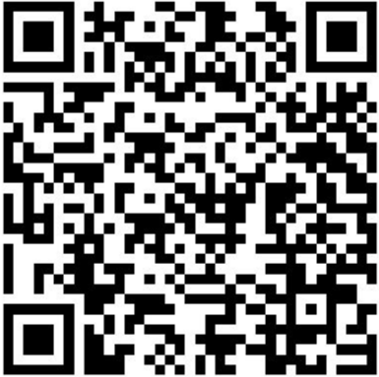

|   Sr.  N o. | Facility  N ame           | Details                                                                      | Reason(s) for Creating Facility                     | Utilization                                     | Area in which Students are Expected to Have Enhanced Learning   | Relevance to POs / PSOs   |
|-------------|---------------------------|------------------------------------------------------------------------------|-----------------------------------------------------|-------------------------------------------------|-----------------------------------------------------------------|---------------------------|
|           1 | Department Library        | Reference books, textbooks, solved examples, previous yearsÕ question papers | Easy access to subject- specific learning resources | Used for coursework and exam preparation        | Conceptual understanding, self- learning                        | PO1 PO2 PSO1              |
|           2 | DepartmentÕs Google Drive | Syllabus, lab manuals, assignments, lecture notes, GTU question              | Anytime access to academic materials                | Downloading study materials and lab preparation | Independent learning, digital literacy                          | PO1 PO5 PSO1              |

|    |                                      | papers                                                   |                                                       |                                               |                                       | PSO2                  |
|----|--------------------------------------|----------------------------------------------------------|-------------------------------------------------------|-----------------------------------------------|---------------------------------------|-----------------------|
|  3 | Central Library                      | Books, journals, magazines, e-books, digital databases   | Support advanced learning and research                | Reference for projects and research           | Research aptitude, lifelong learning  | PO2 PO4 PSO1 PSO2     |
|  4 | ONOS Digital Platform                | Online academic and innovation resources                 | Enhance innovation and exposure to advanced knowledge | Learning new technologies and research trends | Innovation, critical thinking         | PO4 PO5 PO7 PSO2      |
|  5 | SSIP Cell                            | Startup support, innovation mentoring, funding           | Encourage entrepreneurship and innovation             | Project development and startup activities    | Entrepreneurship skills               | PO3 PO5 PO7 PSO2      |
|  6 | CWAN (Wired and Wireless network)    | Campus-wide high- speed internet                         | Access online educational and research resources      | E-learning and research access                | Self-directed learning                | PO5 PO7 PSO2          |
|  7 | E-learning Platforms (NPTEL, SWAYAM) | Online courses, video lectures, certifications           | Supplement classroom teaching                         | Concept clarity and certifications            | Lifelong learning                     | PO1 PO7 PSO2          |
|  8 | Laboratory and Computing Facilities  | Well-equipped labs, hardware, software, simulation tools | Hands-on experiential learning                        | Experiments, simulations, projects            | Practical skills, problem- solving    | PO1 PO2 PO7 PSO1 PSO2 |
|  9 | Workshops, Seminars, Guest Lectures  | Expert talks, hands-on workshops, industry interaction   | Industry-academia exposure                            | Participation in technical events             | Professional and communication skills | PO1 PO7 PSO1 PSO2     |

Table 6.3.5 Additional Learning Resources and Facilities for Students

| Facility Name                       | Details                                                                                                                         | Reason(s) for creating facility                                                                             | Utilization                                     | Areas in which students are expected to have enhanced learning   | Relevance to POs/PSOs   |
|-------------------------------------|---------------------------------------------------------------------------------------------------------------------------------|-------------------------------------------------------------------------------------------------------------|-------------------------------------------------|------------------------------------------------------------------|-------------------------|
| Department Library                  | Reference books, textbooks, solved examples, previous years' question papers Easy access to subject-specific learning resources |                                                                                                             | Used for coursework and exam preparation        | Conceptual understanding, self-learning                          | PO1 PO2 PSO1            |
| Department's Google Drive           |                                                                                                                                 | Syllabus, lab manuals, assignments, lecture notes, GTU question papers Anytime access to academic materials | Downloading study materials and lab preparation | Independent learning, digital literacy                           | PO1 PO5 PSO1 PSO2       |
| ONOS Digital Platform               | Online academic and innovation resources                                                                                        | Enhance innovation and exposure to advanced knowledge                                                       | Learning new technologies and research trends   | Innovation, critical thinking                                    | PO4 PO5 PO7 PSO2        |
|                                     | CWAN  (Wired and Wireless network) Campus-wide high-speed internet                                                              | Access online educational and research resources                                                            | E-learning and research access                  | Self-directed learning                                           | PO5 PO7 PSO2            |
| Laboratory and Computing Facilities |                                                                                                                                 | Well-equipped labs, hardware, software, simulation tools Hands-on experiential learning                     | Experiments, simulations, projects              | Practical skills, problem-solving                                | PO1 PO2 PO7 PSO1 PSO2   |
|                                     | Workshops, Seminars, Guest LecturesExpert talks, hands-on workshops, industry interaction                                       | Industry-academia exposure                                                                                  | Participation in technical events               | Professional and communication skills                            | PO1 PO7 PSO1 PSO2       |

## [A] Maintenance of Physical Facilities

The institution/department ensures systematic maintenance and optimal utilization of laboratory infrastructure through well-defined procedures:

- Regular inspection and preventive maintenance of laboratory equipment are carried out prior to the commencement of each semester as and when required.
- Minor repairs are handled internally by the Laboratory Assistant and concerned faculty members, while major repairs and servicing are outsourced through institutional procedures if required.
- Computer laboratories are maintained through periodic checking before the start of the semester by concern lab in charge assisted by laboratory assistant.
- Minor hardware and software issues are resolved by departmental staff, whereas major maintenance and repair work is outsourced by the Institute on a call basis (AMC).
- The department is supported by CWAN (Central Wide Area Network) connectivity with both wired and wireless internet facilities, which are regularly maintained to support teachingÐlearning, research, and administrative activities for students and faculty.
- Laboratory models, equipment, and student projects are systematically stored and preserved to ensure safety, accessibility, and long-term usability.
- A Laboratory Utilization Register is maintained for all laboratories to monitor effective usage, scheduling of practical sessions, and compliance with institutional norms.
- Major electrical and civil maintenance works related to laboratory infrastructure are carried out by the Roads &amp; Buildings (R&amp;B) Department, ensuring compliance with safety and quality standards.

## [1] Equipment maintenance history card

Enhance manual dexterity, precisi

Safety P actices •

Safety &amp; Professional Pr

Integ

|   7 | Digital Multimeter •                                                                                                                                    | Measurement of electrical parameters such as voltage (AC and DC), current, resistance, continuity and diode & transistor testing Provides hands-o  experience that re nfor s theoret cal concepts in electronics • • El ctronic Lab -1, 2 &3 •                                        | Enables students to verify laws and formulas through real-time measurement • Comm Lab -1&2 • Diagnose faulty components and circuits • Identify wiring errors •                                                                                                                                                                                                                                   | Helps students learn systematic fault diagnosis & troubleshoot in circuits Verify theor tical calculations experimentally PO1 PO2 PO4 PO5 PO7 PSO1                                                                                                                                                  |
|-----|---------------------------------------------------------------------------------------------------------------------------------------------------------|---------------------------------------------------------------------------------------------------------------------------------------------------------------------------------------------------------------------------------------------------------------------------------------|---------------------------------------------------------------------------------------------------------------------------------------------------------------------------------------------------------------------------------------------------------------------------------------------------------------------------------------------------------------------------------------------------|-----------------------------------------------------------------------------------------------------------------------------------------------------------------------------------------------------------------------------------------------------------------------------------------------------|
|   8 | Digital LCD Display LCR Meter •                                                                                                                         | Accurately measurement of the electrical properties of inductance, capacitance and resistance  Helps students practically understand the behaviour of L, C & R beyond theoretical concepts • • Electronic Lab -1, 2 &3 •                                                              | Correct use of test instruments to verify component values for laboratory experiments and project work Comm Lab -1&2 • Analysing measur d data •                                                                                                                                                                                                                                                  | Identifying tolerances • Understanding of accuracy & reliability in measurements PO1 PO2 PO4 PO5 PO7 PSO1                                                                                                                                                                                           |
|   9 | Different Types of Connectors, Electronics Components, Semiconductor Devices and Relays Connector, IC,  Register, Inductor, Diode,  Transistor, Relay • | Supports hands-on learning • • Electronic Lab -1, 2 &3 •                                                                                                                                                                                                                              | Helping students develop component selection, circuit assembly, soldering, testing, and troubleshooting skills Comm Lab -1&2 • Component identification, testing, and debugging •                                                                                                                                                                                                                 | Ability to design, and analyse circuits using components PO1 PO2 PO3 PO4 PO5 PO7 PSO1 PSO2                                                                                                                                                                                                          |
|  10 | Discrete Component Trainer •                                                                                                                            | Enables students to verify theoretical concepts through hands-on experiments • • Electronic Lab -1, 2 &3                                                                                                                                                                              | Resistors, capacitors, inductors, Diode, LED, Zener diode, BJT, FET with connecting/ measurement point, patch cords and multiple DC voltage outputs (+5V, ±12V, or adjustable voltages) Provides practical exposure to circuit building, testing, and analysis using individual components • • Logical thinking to  den ify and rectify circuit faults • Conceptual clarity and hands-on skills • | Allows students to design and modify simple electronic circuits independently Awareness of proper handling, ratings, and safety precautions PO1 PO2 PO3 PO4 PO5 PSO1                                                                                                                                |
|  11 | Bread Board with Power Supplies Trainer •                                                                                                               | Breadboard with connecting/ measurement point, patch cords and multiple DC voltage outputs (+5V, ±12V, or adjustable voltages) Enables students to verify theoretical concepts through hands-on experiments • • Electronic Lab -1, 2 &3                                               | Provides practical exposure to circuit building, testing, and analysis using individual components • • Logical thinking to  den ify and rectify circuit faults • Conceptual clarity and hands-on skills                                                                                                                                                                                           | Allows students to design and modify simple electronic circuits independently PO1 PO2 PO3 PO4 PO5 PSO1                                                                                                                                                                                              |
|  12 | Digital IC Tester •                                                                                                                                     | Tests a wide range of logic families (74xx, etc), ZIF (Zero Insertion Force) socket for easy and safe IC placement, display and regulated power supply To help students quickly check whether a digital IC is working or faul y before using it in experiments • • Electronic Lab - 3 | Better Understanding of Digital Logic • • Development of Troubleshooting Sk lls •                                                                                                                                                                                                                                                                                                                 | prevents loss of time caused by using defective ICs during practical sessions Hands-On Laboratory Skills • Observation and Analytical Skills • Time Management in Experiments PO1 PO2 PO4 PSO1                                                                                                      |
|  13 | VLSI Trainer with XILINX FPGA Spartan 6 •                                                                                                               | Trainer kit with Xilinx Spartan-6 FPGA, On-Board I/O Interfaces, Memory, Peripheral Access and On-board regulated power supply • Comput r Lab-1                                                                                                                                       | Helps students learn to write, simulate, and debug VHDL for digital circuit design, FPGA architecture, pin configuration, and I/O interfacing • • HDL Language and FPGA Programming Skills •                                                                                                                                                                                                      | Reinforces theoretical concepts of VLSI design, and sequential logic with hands-on FPGA experiments Troubleshooting and Debugging • Project and Design Skills • Critical Thinking and Analytical Skills PO1 PO2 PO3 PO4 PSO1 PSO2                                                                   |
|  14 | General Purpose Board GPB with Breadboard Area, Connectivity and Terminals •                                                                            | Enables students to assemble, modify, and test circuits safely, reinforcing theoretical concepts • • Electronic Lab - 1, 2 & 3                                                                                                                                                        | Helps students understand component behaviour, circuit connections, and signal flow in real circuits • Circuit As embly and Wiring •                                                                                                                                                                                                                                                              | Digital and Analog Circuit Design • Troub eshooting and Fault Analysis PO1 PO2 PO3 PO4 PO5 PSO1                                                                                                                                                                                                     |
|  15 | •                                                                                                                                                       | Enables students to learn proper handling of a soldering iron and safe soldering techniques • • Electronic Lab - 1, 2 & 3                                                                                                                                                             | Soldering iron and Desoldering pump Hand tool that heats up to melt solder, allowing the formation of electrically and mechanically strong connections between components & PCB tracks, and remove molten solder from PCB joints Helps students understand the use of s • Basic Soldering Skills •                                                                                                | lder wire, flux, and soldering tips for different components • Learn how to replace faulty components without damaging the PCB • Comp nent Handling and Placement • Circuit Ass mbly and Repair • Thermal Man gement Awareness • Hand-Eye Coordination and Precision • PO1 PO2 PO3 PO4 PO5 PO7 PSO1 |
|  16 | Digital ICs, CRO Probes, Different rating Cell and Capacitors •                                                                                         | Enables students Building, t sting, and modifying real circuits • • Electronic Lab - 1, 2 & 3 •                                                                                                                                                                                       | ICs 74xx for digital logic gate, 78xx & 79xx for ±V power supply, passive probes with attenuation factors like 1x & 10x, Different Rating Cells (1.5V, 3V, 6V, 9V, 12V, etc.), Capacitance ranges from picofarads (pF) to farads (F) Enables students Diagnosing and correcting faults in components and circuits • Comm Lab - 1&2 • Troubleshooting & Analytic l Thinking •                      | Enables students analyse electrical signals using CRO probes •  Enables students selecting components (ICs, capacitors, cells) for desired functionalit Hands-On Practical Skills • Integration of Components • Instrumentation & Measurement Skills • Circuit Design Awareness • PO1 PO2 PO4 PSO1  |
|  17 | T-SERIES Bluetooth Speaker with Total Power Rating 100-125 Speaker with Total Power Rating (100-125 •                                                   | W), Bluetooth Wireless Connectivity, Multi Mode Playback, Portable Design and Enhanced Audio Features  Helps students learn about amplifiers, speakers, crossovers, and sound output circuitry • • Comm Lab - 1&2                                                                     | Provides p actical experience in Bluetooth pairing, signal transmission, and wireless audio streaming • • Understanding amp ifiers, spe                                                                                                                                                                                                                                                           | Hands-On Learning with Power Systems • Allows students to explore various input sources like AUX, USB ker drivers, c os overs, sound output circu try, Bluetooth pairing, signal transmission, and wireless audio protocols • Troubleshooting and Maintenance S ills • PO1 PO2 PO4 PO5 PSO1         |

## 6.4 Laboratories: Maintenance and overall ambiance (10)

## Total Marks 10.00

## Institute Marks

10.00

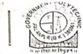

of Equipment Name

Order No: Purchasc of purchasc [Category

[Register (DS/Expa) Name &amp;

[Registcred Numbcr

GPR No. (Institute level)

Date of Purchasc/ Installation

[Name of Supplier

Iress of Suplier

Details of Equipment bry

## GOVERNMENT POLYTECHNIC, PALANPUR ELECTRONICS AND COMMUNICATION DEPARTMENT EQUIPMENT HISTORY CARD

Anlenna ku

Purchase ocaL

11/64

Roysl\_Houoe\_

310012

[Testing &amp; Mcasurement/ Trainer Kit/ # phereferal

## Equipment Examination Details

| Dare   | Examination Details   |                             | Examined Ey   | Remarks   |
|--------|-----------------------|-----------------------------|---------------|-----------|
| Dare   | Examination Details   | Status Non Workingl Working | Examined Ey   | Remarks   |
|        | H~                    |                             |               |           |
| Jnksn  | 8                     |                             |               | SsAuse    |
|        |                       |                             |               | 8 slu     |
| 1 Jh   | Fuvlmd                |                             |               | M         |
|        | 4                     |                             |               | 0         |

Document 6.4.1 Equipment maintenance history card

Make/Model

Serial No.

Unit Total Price

Warranty Period

Ph. Number of supplier

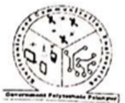

2261

26

1 %

- The department has adequate number of laboratories, which are utilized as per the approved academic time-table to meet curriculum and practical requirements.
- All laboratories are well-equipped with adequate and functional equipment to conduct prescribed experiments as per the university syllabus.
- Each laboratory is provided with essential teaching learning facilities such as white/chalk boards, CWAN (Central Wide Area Network) connectivity with both wired and wireless internet facilities, and other instructional aides to support effective practical demonstrations.
- Soft copies of laboratory manuals through G Ð Drive are made available for all laboratories for easy access by students and faculty.
- Laboratories are furnished with adequate furniture, including tables, stools, and chairs, ensuring comfort and proper ergonomics for students.
- The laboratories have an effective lighting system, supplemented with sufficient natural light, creating a conducive working environment.
- Safety instructions, including DoÕs and DonÕts, are prominently displayed in each laboratory to ensure safe laboratory practices.
- First-aid kits and fire extinguisher are available across department to handle minor medical emergencies.
- Students are permitted and encouraged to use laboratories and computer centres beyond regular practical hours for final-year project work, promoting experiential learning and innovation.

## 6.5 Availability of computing facility in the department (10)

## Language Laboratory Ð Systematic Development of Communication Skills

## 1. Infrastructure &amp; ICT Facilities

- The Language Lab is equipped with modern ICT infrastructure including computers, microphones, headphones, and audio-visual aids.
- Provides a user-friendly, interactive environment that supports both individual and group learning.
- Technology-enabled tools allow real-time monitoring, recording, and feedback, ensuring systematic skill development.

## 2. Focus on LSRW Skills

- The lab is designed to strengthen Listening, Speaking, Reading, and Writing (LSRW) skills.
- Students engage in structured exercises that improve pronunciation, fluency, comprehension, and vocabulary.
- Activities also emphasize non-verbal communication such as body language, gestures, and tone modulation.

## 3. Pedagogical Functions

- Supports a wide range of instructional functions:
- Recording &amp; Playback: Students can record their speech and analyze areas of improvement.
- Test Preparation: Facilitates practice for competitive exams, interviews, and presentations.
- TeacherÐStudent Interaction: Enables personalized guidance and corrective feedback.
- Group Activities &amp; Conferencing: Encourages collaborative learning and peer evaluation.

## 4. Professional &amp; Global Readiness

- Enhances confidence, fluency, and clarity of communication, preparing students for professional environments.
- Builds competencies required for multinational organizations, where effective communication is a key employability skill.
- Promotes global citizenship by exposing learners to diverse accents, cultural contexts, and communication styles.

## 5. Experiential Learning &amp; Innovation

- Interactive sessions simulate real-world scenarios such as interviews, group discussions, and presentations.
- Students gain hands-on experience in communication practices, bridging the gap between theory and application.
- Encourages self-learning and continuous improvement, aligning with outcome-based education principles.

## [1] Facility detail

| Sr.  N o.   | Facility   | Availability Status    |
|-------------|------------|------------------------|
|             |            | New Academic Building, |

## Total Marks 10.00

## Institute Marks

10.00

|   Sr. No | No Of Computer terminals   | Students Computer Ratio   | Details of Legal Software                                  | Details of Networking                            | Details of Printers, Scanners etc.                                                                                                                                                                                                                                             |
|----------|----------------------------|---------------------------|------------------------------------------------------------|--------------------------------------------------|--------------------------------------------------------------------------------------------------------------------------------------------------------------------------------------------------------------------------------------------------------------------------------|
|       75 |                            |                           | Windows Professional (Factory Loaded) • Microsoft Office • | Open-Source Software • Open-Source simulator • • | Multisim Live  • Keil Free version/ • Proteus Demo version  • Scratch •Electric Circuit Studio • MIT  CWAN connectivity with both wired and wi eless internet facilities  (200 Mbps)  • Total 90 High Speed LAN    ports • 2 Printer • 2 Multifuncti n Print r   • 3 Projector |

## 6.6 Language lab (10)

## Total Marks 10.00

## Institute Marks

10.00

## [2] List of Activities Conducted in the Language

- The Language Laboratory is systematically utilized for topic-wise communication skill activities as scheduled in the academic timetable.
- Each practical session is conducted under faculty supervision using allocated ICT resources such as computers, headphones with microphones, and projector facilities.
- Activities such as role-plays, telephonic conversations, situational dialogues, and interactive speaking exercises are regularly practiced listed below.
- Self-introduction and personal profiling
- Speaking about family and relationships
- Weather discussion and descriptive speaking
- Seeking permission and making polite requests
- Talking about hobbies and interests
- Seeking information at public places (railway station/airport)
- Fixing and taking appointments
- Role-play: Conversation with cashier (college/bank)
- Discussing holiday and travel plans
- Shopping-related conversations and bargaining skills
- Telephonic conversation practice
- Admission enquiry and formal interaction
- Greeting and wishing on social occasions
- Speaking about favourite sports and recreational activities
- Listening comprehension using audio clips
- Pronunciation and accent practice
- Group discussions and pair conversations
- Recording and playback for self-evaluation
- Vocabulary building exercises
- Mock interviews and basic professional communication

## [3] Websites used for Communication Practice

Lesson

Listening Level Test https://www.oxfordonlineenglish.com/english-level-test/listening

Vocabulary Level Test https://www.oxfordonlineenglish.com/english-level-test/vocabulary

Reading Level Test https://www.oxfordonlineenglish.com/english-level-test/reading

Grammar Level Test https://www.oxfordonlineenglish.com/english-level-test/grammar

English Listening Lesson https://www.oxfordonlineenglish.com/free-english-listening-lessons

English Vocabulary Lessons https://www.oxfordonlineenglish.com/free-english-vocabulary-lessons

Spoken English Lessons https://www.oxfordonlineenglish.com/free-spoken-english-lessons

|   1 | Laboratory Location and Area   | Room No G008, 76.56sqm area                                                                                                      |
|-----|--------------------------------|----------------------------------------------------------------------------------------------------------------------------------|
|   2 | ICT Facilities and Furniture   | 30 computer terminals with LAN & Internet connectivity (ACER-17 + HCL-13) 30 Head Phone with Mike                                |
|   3 | Lab register                   | Separately maintain                                                                                                              |
|   4 | Software                       | Open-source software such as AUDACITY and other relevant online platforms/tools used for language learning and skill development |

Table 6.6.1 Laboratory facility details

| English Pronunciation Lessons                                                                    |
|--------------------------------------------------------------------------------------------------|
| https://www.oxfordonlineenglish.com/free-english-pronunciation-lessons                           |
| English Writing Lesson                                                                           |
| https://www.oxfordonlineenglish.com/free-english-writing-lessons                                 |
| Skills                                                                                           |
| Listening                                                                                        |
| https://learnenglish.britishcouncil.org/skills/listening/beginner-a1                             |
| https://learnenglish.britishcouncil.org/skills/listening/pre-intermediate-a2                     |
| Reading                                                                                          |
| https://learnenglish.britishcouncil.org/skills/reading                                           |
| https://learnenglish.britishcouncil.org/skills/reading/pre-intermediate-a2                       |
| Writing                                                                                          |
| https://learnenglish.britishcouncil.org/skills/writing/beginner-a1                               |
| https://learnenglish.britishcouncil.org/skills/writing/pre-intermediate-a2                       |
| Speaking                                                                                         |
| https://learnenglish.britishcouncil.org/skills/speaking/beginner-a1                              |
| https://learnenglish.britishcouncil.org/skills/speaking/pre-intermediate-a2                      |
| Grammar                                                                                          |
| https://learnenglish.britishcouncil.org/skills/speaking/pre-intermediate-a2                      |
| Vocabulary                                                                                       |
| https://learnenglish.britishcouncil.org/vocabulary/beginner-to-pre-intermediate                  |
| Business English                                                                                 |
| https://learnenglish.britishcouncil.org/business-english/english-for-emails                      |
| General English                                                                                  |
| https://learnenglish.britishcouncil.org/general-english                                          |
| Online Activities                                                                                |
| https://www.cambridgeenglish.org/learning-english/activities-for-learners/?skill=grammar&rows=12 |
| Grammar                                                                                          |
| Vocabulary                                                                                       |
| https://www.myenglishpages.com/site_php_files/vocabulary.php                                     |
| Speaking                                                                                         |
| https://www.myenglishpages.com/site_php_files/speaking.php                                       |
| Reading                                                                                          |
| https://www.myenglishpages.com/site_php_files/reading.php                                        |
| Listening                                                                                        |
| Writing                                                                                          |
| https://www.myenglishpages.com/site_php_files/writing.php                                        |
| https://www.myenglishpages.com/site_php_files/exercises.php                                      |
| Exercises and Tests                                                                              |

Figure 6.6.1 Language lab photograph\_G008

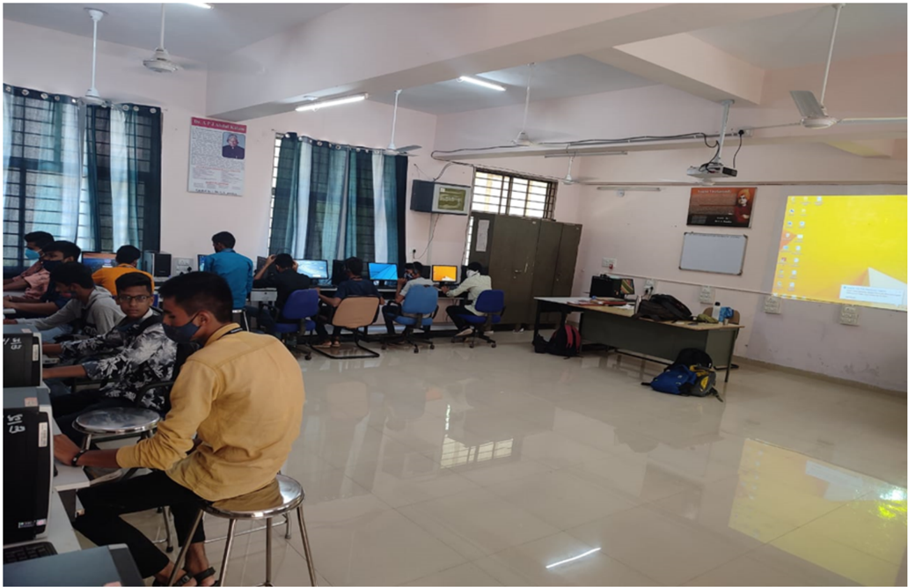

## 7 7 CONTINOUS IMPROVEMENT CONTINOUS IMPROVEMENT (75) (75)

## Total Marks Total Marks   75.00 75.00

## 7.1 Actions taken based on the resultsof evaluation of each of the POs and PSOs (25)

## Total Marks 25.00

Institute Marks

25.00

POs Attainment Levels and Actions for Improvement- (2024-25) POs Attainment Levels and Actions for Improvement- (2024-25)

POs

Target Level

Attainment Level

Observations

## PO 1 : Basic and Discipline specific knowledge

PO 1

1.87

2.04

Target achieved.

Target level increased to 1.95 for next AY.

## PO 2 : Problem analysis

PO 2

1.32

1.59

Target achieved.

Target level increased to 1.38 for next AY.

## PO 3 : Design/ development of solutions

PO 3

1.34

1.62

Target achieved.

Target level increased to 1.40 for next AY.

## PO 4 : Engineering Tools, Experimentation and Testing

PO 4

1.44

1.62

Target achieved.

Target level increased to 1.50 for next AY.

## PO 5 : Engineering practices for society, sustainability and environment

PO 5

1.20

1.36

Target achieved.

Target level increased to 1.25 for next AY.

## PO 6 : Project Management

PO 6

1.23

1.54

Target achieved.

Target level increased to 1.28 for next AY.

## PO 7 : Life-long learning

PO 7

1.41

1.68

Target achieved.

Target level increased to 1.47 for next AY.

PSOs Attainment Levels and Actions for Improvement- (2024-25) PSOs Attainment Levels and Actions for Improvement- (2024-25)

PSOs

Target Level

Attainment Level

Observations

## PSO 1 : Demonstrate proficiency in installation and problem solving of electronics and communication equipment.

PSO 1

1.71

1.89

Target achieved.

Target level increased to 1.78 for next AY.

## PSO 2 : Proficiency in specialized software packages and coding useful for the analysis of electronics engineering systems and PCB design.

PSO 2

1.45

1.73

Target achieved.

Target level increased to 1.51 for next AY.

## 7.2 Improvement in Success Index of Students without the backlog (10)

## Total Marks 10.00

Institute Marks

10.00

Items

Latest Passed out Batch (2022-23)

Latest Passed out Batch minus 1 (2021-22)

Latest Passed out Batch minus 2 (2020-21)

Success Index (from 4.2.1)

0.00

0.05

0.33

## 7.3 Improvement in Placement and Higher Studies (10)

| Items                    | 2024-25 (CAYm1)   | 2023-24 (CAYm2)   | 2022-23 (CAYm3)   |
|--------------------------|-------------------|-------------------|-------------------|
| Internal Academic Audits | YES               | YES               | YES               |

## 7.6 New Facility created in the Program (10)

| Items                | 2024-25 (CAYm1)   | 2023-24 (CAYm2)   | 2022-23 (CAYm3)   |
|----------------------|-------------------|-------------------|-------------------|
| New Facility Created | YES               | YES               | YES               |

## 8 8 STUDENT SUPPORT SYSTEMS STUDENT SUPPORT SYSTEMS (50) (50)

## 8.1 Mentoring system to help at individual level (10)

## Total Marks 10.00

## Institute Marks

10.00

| Items                      |   Latest Passed out Batch (2022-23) |   Latest Passed out Batch minus 1 (2021-22) |   Latest Passed out Batch minus 2 (2020-21) |
|----------------------------|-------------------------------------|---------------------------------------------|---------------------------------------------|
| Placement Index (from 4.6) |                                0.32 |                                         0.7 |                                         0.4 |

## 7.4 Improvement in Academic Performance in Final year (10)

## Total Marks 10.00

## Institute Marks

10.00

| Items                                 |   Latest Passed out Batch (2022-23) |   Latest Passed out Batch minus 1 (2021-22) |   Latest Passed out Batch minus 2 (2020-21) |
|---------------------------------------|-------------------------------------|---------------------------------------------|---------------------------------------------|
| Academic Performance Index (from 4.3) |                                6.94 |                                        6.02 |                                        5.83 |

## 7.5 Internal Academic Audits to Review Complete Academics &amp; to Implement Corrective Actions on Continous Basis (10)

## Total Marks 10.00

## Institute Marks

10.00

## Total Marks 10.00

## Institute Marks

10.00

## Total Marks Total Marks   50.00 50.00

## Total Marks 10.00

## Institute Marks

10.00

Government Polytechnic, Palanpur has established an effective student mentoring system aimed at developing technically competent diploma engineers. Faculty members provide structured, stage-wise mentoring throughout the students' academic journey, offering guidance and support in various aspects of their growth.

- Key Strengths of the Mentoring System
- Career Guidance : Students often struggle with choosing between higher studies, immediate employment, or entrepreneurship. Structured mentoring helps them make informed decisions aligned with their strengths and industry needs.
- Academic Support : Faculty mentors can identify learning gaps early, recommend remedial measures, and track progress, which directly improves performance.
- Personal Counseling : By offering empathetic support, mentors help students manage stress, confidence issues, or personal challenges-critical for overall well-being.
- Parent-Teacher Meetings (PTM) : Involving parents ensures transparency and builds a support network beyond the classroom.
- Holistic Development : Encouraging participation in co-curricular and extracurricular activities nurtures leadership, teamwork, and communication skills alongside technical competence.

This comprehensive mentoring approach ensures students receive continuous personal, academic, and professional guidance throughout their diploma program.

## Types of mentoring system:

| Descriptions of mentoring system:   | Descriptions of mentoring system:                     | Descriptions of mentoring system:                                                                                                                                                                                                                                                                                                                                                                                                                                                                                                                                                                                                                                                                           |
|-------------------------------------|-------------------------------------------------------|-------------------------------------------------------------------------------------------------------------------------------------------------------------------------------------------------------------------------------------------------------------------------------------------------------------------------------------------------------------------------------------------------------------------------------------------------------------------------------------------------------------------------------------------------------------------------------------------------------------------------------------------------------------------------------------------------------------|
| Sr. No.                             | Type of mentoring system                              | Functions                                                                                                                                                                                                                                                                                                                                                                                                                                                                                                                                                                                                                                                                                                   |
| 1                                   | Orientation/Induction program for first year students | Familiarize new admitted students/parents with various  sections,  facilities,  department  of  the institute,  institute  website,  section  heads,  head of the department (HoD), faculty members and make  them  aware  with  the  procedure  of  each section. Acquaint  students  with  Gujarat  Technological University  (GTU)  teaching  scheme,  syllabus, Examination scheme, GTU website, and GTU norms. Make them familiar with the other Students and Institute,  a  specific  2  weeks  Induction Programme is arranged  for  first  year  students, which includes basic lectures on Mathematics, English  and  General  activities  like sports, puzzles games, tree Plantation, visit etc. |
| 2                                   | Academic guidance                                     | Share  information  of  academic calendar, academic  schedules,  study  material,  and  e- learning resources. Identify students with less attendance and they are counselled by the mentor/HODs to improve their attendance. In  some  case  parents  are  informed  by telephonically for their ward attendance. For academically slow learners, subject teacher provides  additional  reading  materials,  model question  papers,  assignment  etc.  in  order  to pace them with other students.                                                                                                                                                                                                       |
| 3                                   | Professional guidance/ Career advancement             | Students  are  encouraged  to  participate  in competitive  activities,  expert  lectures, seminars,  online  platform  courses  and industrial  visit  for  up  scaling  their  knowledge and skill. Guidance  is  given  to  the  students  for higher studies.                                                                                                                                                                                                                                                                                                                                                                                                                                           |
| 4                                   | Overall growth / development                          | Students  are  encouraged  to  organize  and participate  in  co-curricular/extracurricular activities  under  guidance  of  faculty  members, which  help  them  to  develop  leadership qualities, decision making abilities, team spirit for overallgrowth.                                                                                                                                                                                                                                                                                                                                                                                                                                              |
| 5                                   | Student Mentoring                                     | Each  mentor  maintains  details  like parents/guardian's  name,  addresses,  contact numbers,  academic  progress/results ,issues faced by students and guidance given to student etc. Frequency of meeting: Once in a semester, also based on student's need                                                                                                                                                                                                                                                                                                                                                                                                                                              |

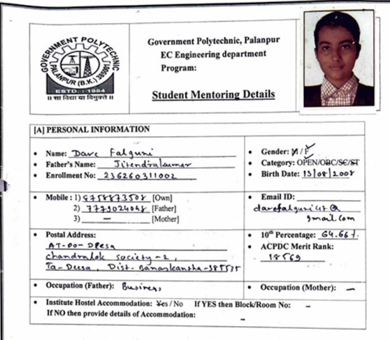

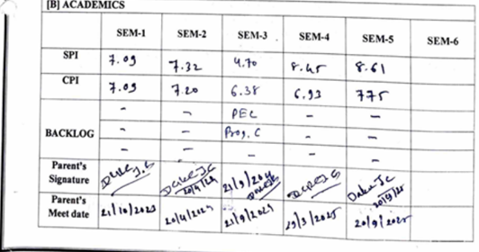

## Efficacy of our mentoring system:

- Student Progression and Career Outcomes
- Higher Studies as a Preferred Pathway

A significant proportion of students aspire to pursue higher education, with many successfully securing admissions in Bachelor of Engineering (BE) and Bachelor of Technology (B.Tech.) programs. This reflects their strong academic foundation and the institution's emphasis on preparing students for advanced learning opportunities.

- Successful Placements and Societal Contribution
- Numerous students are selected through campus placement drives and are now contributing meaningfully to society as professional engineers. Their roles span diverse industries, where they apply technical knowledge, problem-solving skills, and innovation to address real-world challenges. This not only enhances their personal growth but also strengthens the institution's reputation for producing competent graduates.
- Support for Slow Learners

Special mentoring initiatives have been implemented to support slow learners. Through personalized guidance, remedial sessions, and continuous monitoring, these students have shown remarkable improvement in academic performance. Their progress demonstrates the effectiveness of mentoring programs and the institution's commitment to inclusive education.

Total Marks 10.00

Feedback collected for all courses: YES/NO; Specify the feedback collection process; Average Percentage of students who participate; Specify the feedback analysis process; Basis of reward/ corrective measures, if any; Indices used for measuring quality of teaching &amp; learning and summary of the index values for all courses/teachers; Number of corrective actions taken.

Figure 8.1.1 Sample Mentoring Form

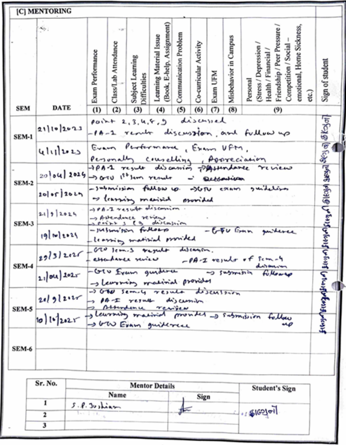

The institute has established a well-structured and transparent feedback collection system to capture students' views on teaching-learning processes.

## Direct feedback

- A clearly defined feedback process is in place at the institutional level.
- All students are actively encouraged to provide honest and constructive feedback.
- Student feedback is collected once every semester through Google forms/ hard copy at the department level.
- The standard student feedback format provided by AICTE is given below.

To be filled by individual student at the end of semester.

| Sr. No.   | Description                                                                                                               | Very Poor   | Poor   | Good   | Very Good   | Excellent   |
|-----------|---------------------------------------------------------------------------------------------------------------------------|-------------|--------|--------|-------------|-------------|
| Sr. No.   | Description                                                                                                               | (1)         | (2)    | (3)    | (4)         | (5)         |
| 1         | Has the teacher covered entire syllabus as per prescribed university/board?                                               |             |        |        |             |             |
| 2         | Has the teacher covered topic beyond syllabus?                                                                            |             |        |        |             |             |
| 3         | Effectiveness of teacher in terms of: (a)Technical content/course content (b)Communication skills (c)Use of teaching aids |             |        |        |             |             |
| 4         | Pace on which contents were covered                                                                                       |             |        |        |             |             |
| 5         | Motivation and inspiration for students to learn                                                                          |             |        |        |             |             |
| 6         | Support for development of studentsÕ skill (i) Practical demonstration (ii)Hands on training                              |             |        |        |             |             |
| 7         | Clarity of expectation of students                                                                                        |             |        |        |             |             |
| 8         | Feedback provided on studentsÕ progress                                                                                   |             |        |        |             |             |
| 9         | Willingness to offer help and advice to students                                                                          |             |        |        |             |             |
| Total     | Total                                                                                                                     |             |        |        |             |             |

If you want to give additional feedback, to improve quality of classroom teaching (if any):

\_\_\_\_\_\_\_\_\_\_\_\_\_\_\_\_\_\_\_\_\_\_\_\_\_\_\_\_\_\_\_\_\_\_\_\_\_\_\_\_\_\_\_\_\_\_\_\_\_\_\_\_\_\_\_\_\_\_\_\_\_\_\_\_\_\_\_\_\_\_\_\_\_\_\_\_\_\_

\_\_\_\_\_\_\_\_\_\_\_\_\_\_\_\_\_\_\_\_\_\_\_\_\_\_\_\_\_\_\_\_\_\_\_\_\_\_\_\_\_\_\_\_\_\_\_\_\_\_\_\_\_\_\_\_\_\_\_\_\_\_\_\_\_\_\_\_\_\_\_\_\_\_\_\_\_\_

Table 8.2.1 Format of student feedback form

## Government Polytechnic, Palanpur

## FEFDBACK FORM FOR CONCERNED FACULTY, FILLFD BY STUDENTS (EC Department)

Students ` Name (Optional):

Name of Facuhty:

L

pate

Academic Yearl Term:

Semester:

Course(Subject):

0 €

Date of feedback:

7676 2072

Term Date:

3|3

40

14/6

| Sr. o   | Description                                                       | Poor Very                             | Poor                                  | Goo                                   | Good Very                             | Exccllent                             |
|---------|-------------------------------------------------------------------|---------------------------------------|---------------------------------------|---------------------------------------|---------------------------------------|---------------------------------------|
|         | Has the teacher covered entire syllabus asper prescribed          |                                       |                                       |                                       |                                       |                                       |
| 2       | Has the teacher covered latest Developmenu topic beyond syllabus? |                                       |                                       |                                       |                                       |                                       |
|         | Effectivencss of teacher in terms of(                             | Effectivencss of teacher in terms of( | Effectivencss of teacher in terms of( | Effectivencss of teacher in terms of( | Effectivencss of teacher in terms of( | Effectivencss of teacher in terms of( |
| 3       | (a)Abilíty to teach technical course content                      |                                       |                                       |                                       |                                       |                                       |
| 3 2     |                                                                   |                                       |                                       |                                       |                                       |                                       |
|         | (Black board Projector/ Smart board)                              |                                       |                                       |                                       |                                       |                                       |
|         | Pace on which contents / topic / syllabus were covered            |                                       |                                       |                                       |                                       |                                       |
|         | Motivation and inspiration for students to learn)                 |                                       |                                       |                                       |                                       |                                       |
|         | Ability to clear doubts of students` mind)                        |                                       |                                       |                                       |                                       |                                       |
|         | Guidance                                                          |                                       |                                       |                                       |                                       |                                       |
|         | Willingness carcer                                                |                                       |                                       |                                       |                                       |                                       |
| Total   | Total                                                             | Total                                 | Total                                 | Total                                 | Total                                 | Total                                 |

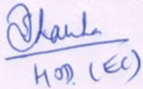

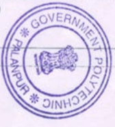

- Feedback received from students is systematically analyzed using predefined evaluation criteria.

- Each criterion is scored on a 4-point scale based on categorical responses:

- Excellent → 5

- Very Good → 4

- Good → 3

- Poor → 2

- Very Poor → 1

- The following key parameters are evaluated with the above numerical mapping:

- Interaction with students in the classroom

- Coverage and quality of Course Content

- Use of practical examples and ability to explain concepts effectively

- Regularity and punctuality in conducting classes

- Overall effectiveness of teaching

## Indirect feedback

- The HoD maintains record about live feedback taken during the semester. The sample format is shown below.

- The Principal, Heads of Departments (HoDs), and members of the Discipline Committee regularly visit the campus and interact directly with students to understand academic-related concerns.

- During official inspections, officers appointed by the Commissionerate of Technical Education (CTE) and Gujarat Technological University (GTU) collect independent feedback from both students and faculty members.

- Continuous monitoring of academic activities is carried out by the CTE office through regular CCTV surveillance.

## Electronics and Communication /ICT GP Palanpur

Engineering Department

Date :

LOG Book - Academic Monitoring (Visit of Live Academic Session

| Term Date                           | 0 62 | 202 4 2024                            |
|-------------------------------------|----------------------------------------------|
| Semester/ Div                       | Name of Present Faculty : MY . R € Payma~ 4K |
| 12'36 Classroom /Laboratory Room No | 12'36 Classroom /Laboratory Room No          |

## 1 General Observation

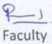

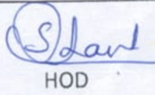

| 1.1   | Lecturer/ Laboratory                     | Routine Lecture-Lab Proxy lecture-Lab /Extra Lecturer lab   | Routine Lecture-Lab Proxy lecture-Lab /Extra Lecturer lab   | Routine Lecture-Lab Proxy lecture-Lab /Extra Lecturer lab   | Routine Lecture-Lab Proxy lecture-Lab /Extra Lecturer lab   |
|-------|------------------------------------------|-------------------------------------------------------------|-------------------------------------------------------------|-------------------------------------------------------------|-------------------------------------------------------------|
| 1.2   | Give detail if Proxy arrangement         | NA                                                          | NA                                                          | NA                                                          | NA                                                          |
|       |                                          | Present                                                     | Absent                                                      | Total                                                       | %                                                           |
| 1.3   | % Presence of student in a class         | 06                                                          | 03                                                          |                                                             |                                                             |
| 1.4   | Punctuality of teacher_to attend student | Punctuality of teacher_to attend student                    |                                                             |                                                             |                                                             |
| 5     | Coverall cleanliness of this Room        |                                                             |                                                             |                                                             |                                                             |
| 2     | Teaching Learning Process                | Teaching Learning Process                                   | Teaching Learning Process                                   | Teaching Learning Process                                   | Teaching Learning Process                                   |
| 2.1   |                                          |                                                             |                                                             |                                                             |                                                             |
| 2.2   | Topic Name/ Name of experiment           | clax AB                                                     | clax AB                                                     | clax AB                                                     | clax AB                                                     |
| 2.3   | Is it found as per lesson planning ?     | Yes/ No                                                     | Yes/ No                                                     | Yes/ No                                                     | Yes/ No                                                     |
| 2.4   | [Strategy of teaching (For Lecture       | Chalk : Board /White Board/ Multimedia                      | Chalk : Board /White Board/ Multimedia                      | Chalk : Board /White Board/ Multimedia                      | Chalk : Board /White Board/ Multimedia                      |
| 2.5   | Languages_used by teacher                |                                                             |                                                             |                                                             |                                                             |
| 2.6   | Content delivary to student              |                                                             |                                                             |                                                             |                                                             |
| 2.7   | Interaction with student                 |                                                             |                                                             |                                                             |                                                             |
| 2.8   | Name of Books used by teacher            | &                                                           | &                                                           | &                                                           | &                                                           |
|       | 3 HOD 's Remarks if any                  | 3 HOD 's Remarks if any                                     | 3 HOD 's Remarks if any                                     | 3 HOD 's Remarks if any                                     | 3 HOD 's Remarks if any                                     |
| 3.1   | Instructions given to student            | 40 G0 Avl                                                   | 40 G0 Avl                                                   | 40 G0 Avl                                                   | 40 G0 Avl                                                   |
| 3.2   | Instructions given to faculty            | Invlve Ve) he)                                              | Invlve Ve) he)                                              | Invlve Ve) he)                                              | Invlve Ve) he)                                              |
|       | Student                                  | P Faculty HOD 8                                             | P Faculty HOD 8                                             | P Faculty HOD 8                                             | P Faculty HOD 8                                             |

| B. Record of corrective measures taken (5)                                                                                                                                                | B. Record of corrective measures taken (5)                                                                                                                                                                                                                                                                                                                                                                                                                                                                                                                                                                                                                                                                                                                                                                                                                                                                                                                                                                                                                                                                                                                                                                                                                                                                                                                                                                                 | Institute Marks                                           |
|-------------------------------------------------------------------------------------------------------------------------------------------------------------------------------------------|----------------------------------------------------------------------------------------------------------------------------------------------------------------------------------------------------------------------------------------------------------------------------------------------------------------------------------------------------------------------------------------------------------------------------------------------------------------------------------------------------------------------------------------------------------------------------------------------------------------------------------------------------------------------------------------------------------------------------------------------------------------------------------------------------------------------------------------------------------------------------------------------------------------------------------------------------------------------------------------------------------------------------------------------------------------------------------------------------------------------------------------------------------------------------------------------------------------------------------------------------------------------------------------------------------------------------------------------------------------------------------------------------------------------------|-----------------------------------------------------------|
| Process                                                                                                                                                                                   | Corrective Measures                                                                                                                                                                                                                                                                                                                                                                                                                                                                                                                                                                                                                                                                                                                                                                                                                                                                                                                                                                                                                                                                                                                                                                                                                                                                                                                                                                                                        | 5.00                                                      |
| 1.  Student feedback (Format enclosed in section 8.2.A) 2.  Faculty self-appraisal report 3.  Feedback analysis report        (HOD Evaluations) 4.  Facultys Performance Appraisal report | In case of poor feedback for a faculty member, he/she is counselled by HOD and advised to improve performance in related area in the next semester.                                                                                                                                                                                                                                                                                                                                                                                                                                                                                                                                                                                                                                                                                                                                                                                                                                                                                                                                                                                                                                                                                                                                                                                                                                                                        |                                                           |
| Indices Used for faculty performance evaluations                                                                                                                                          | Feedback form designed by AICTE is taken as reference and the following indices are incorporated in the feedback form: Interaction with students in the classroom Practical examples / ability Course content Regularity and punctuality                                                                                                                                                                                                                                                                                                                                                                                                                                                                                                                                                                                                                                                                                                                                                                                                                                                                                                                                                                                                                                                                                                                                                                                   |                                                           |
| Number of Corrective Measures                                                                                                                                                             | Faculty Performance Review and Development Initiatives Structured Review Mechanism Faculty  members  who  receive  average  feedback  from  students  are invited  by  the  Head  of  Department  (HOD)  for  a  formal  review discussion.  This  structured  interaction  ensures  transparency,  where faculty are informed about the nature of the feedback and guided on specific  areas  requiring  improvement.  The  process  fosters accountability while maintaining a supportive environment. Guidance and Mentoring During these discussions, faculty are advised on strategies to enhance classroom  delivery,  student  engagement,  and  subject  expertise. Constructive  suggestions  are  provided  to  help  them  improve  their performance in subsequent semesters. The emphasis is on continuous improvement rather than criticism, ensuring faculty feel motivated to upgrade their teaching practices. Faculty Development Programs (FDPs) To  strengthen  teaching  effectiveness,  faculty  members  with  average feedback  are  deputed  to  Faculty  Development  Programs  (FDPs)  in relevant  subject  areas.  These  FDPs  expose  them  to  modern pedagogical  techniques,  emerging  technologies,  and  updated curriculum requirements. Participation in such programs helps faculty upgrade  knowledge,  refine  teaching  methodologies,  and  align  with industry expectations. |                                                           |
| Table 8.2.2 Process of evaluation and corrective measures                                                                                                                                 | Table 8.2.2 Process of evaluation and corrective measures                                                                                                                                                                                                                                                                                                                                                                                                                                                                                                                                                                                                                                                                                                                                                                                                                                                                                                                                                                                                                                                                                                                                                                                                                                                                                                                                                                  | Table 8.2.2 Process of evaluation and corrective measures |

## Contents

## Overview

- Report Overview &amp; Term Details
- Rating Scale
- Scale Rating

## 2 Feedback Analysis (Overall)

- 21 BranchAnalysis
- 22 Semester Analvsis
- Subject Annlysis
- FaculeyAnalysis

## Parameter-wise Feedback Analysis

- 3.1
- Subject Analysis (Parnmeter-wise)

Semcster Analysis (Parameter-wise)

- 34

## Misc Feedback Analysis

## Faculty Strength &amp; Weakness Analysis

- Subjects Tnught
- Mr S P Joshiara (SPJ)
- 512 Strengths (Top 3 Parnmeters
- 51 / HOD Comments
- 5.22
- Subjccts Taught
- (Top
- HOD Couments
- Subjects Taught
- Arens for Improvement (Lowest 3 Parnmeters)
- Strengths (Top 3 Parameters)
- HOD Comments

Mr LK Patel (LKP)

- Subjects Taught
- 5412 Strengths (Top 3 Parameters)
- HOD Comments
- Subjects Taught

Mr. RN Patel (RNP)

- Strengths 3 Paramcters (Top
- 5.5.3 Arens for Improvement (Lowest 3 Parameters)
- HOD Comments
- Subiects Taught
- 5 2

5.3

54

55

## Feedback Analysis Report

Odd, GTU Exam Winter 2023

Dept of ECE. GP Palanpur

- Parameters)

2

2

2

2

2

2

3

3

3

5

5

8

8

8

9

10

10

10

10

12

12

12

12

13

13

13

13

15

15

| Sub Code   | Subject   | Faculty   | Q1   | Q2   | Q3   | Q   | Q5                 | Q6   | Q7           | Q6   |     |     |      |      |
|------------|-----------|-----------|------|------|------|-----|--------------------|------|--------------|------|-----|-----|------|------|
|            |           | SP)       |      |      |      | 821 |                    |      |              |      |     |     |      | 814  |
|            |           | RNP       |      |      |      |     |                    |      |              |      |     |     | 3,74 |      |
|            |           |           |      |      |      |     |                    |      |              |      |     |     |      | 3.75 |
|            | SY        | SPI       |      |      |      |     | 360 3.60 3,60 3.67 |      |              |      |     |     |      |      |
|            | PP        |           | 65   |      |      |     |                    |      | 452 443 4.39 |      |     |     | 452  |      |
|            |           | RCP       |      |      |      |     |                    | 1522 |              |      |     | 489 | 435  |      |
|            |           |           | 80   |      |      |     |                    |      | 161          | 4.61 |     |     |      |      |
|            |           |           |      |      |      |     |                    |      |              |      |     | 27  | 270  |      |
| 4811602    |           | JC        |      |      |      |     |                    |      |              |      | 443 |     |      |      |

## 3.4 Faculty Analysis (Parameter-wise)

This section details the performance across feedback parameters (Q1-Q12) for each faculty member. specific

| Faculty   | Q1   | Q2   | Q3   |      | Q5   |      | Q7   |      | Q9   | Q10   | Q1   | Q12   | Score   |
|-----------|------|------|------|------|------|------|------|------|------|-------|------|-------|---------|
| SPJ       |      |      | 383  |      |      |      |      | 3.89 |      |       | 3.94 |       | 3,88    |
| MKP       | 132  | 415  |      |      |      | 137  |      |      |      |       |      |       |         |
| RCP       | 430  |      |      | 420  | 4127 |      | 421  | 431  | 4120 |       |      | 4.21  | 425     |
| LKP       | 476  |      | 476  | 188  | 477  | 183  |      |      |      |       |      |       |         |
| RNP       | 431  |      |      | 4.39 |      | 446  | 4    |      |      | 422   | 442  | 4     |         |
| MJD       | 4257 |      |      |      | 162  |      |      |      |      |       |      |       |         |
| SJC       |      | 385  | 420  |      | 4,16 |      | 442  |      |      | 132   |      |       |         |
| NJC       | 1.30 |      |      | 182  |      |      |      |      |      | 425   |      | 485   |         |
| MJV       | 3 76 |      |      | 8,25 | 343  | 3,39 |      |      | 3.10 |       | 3.14 | 8,84  |         |

## Misc Feedback Analysis

Ihis section contains additional analytical matrices and correlations.

## Faculty-Subject Correlation Matrix

This matrix highlights the correlation between faculty members and the subjects teach, showing the average score tor each faculty-subject

| Subject Code   | Subject Short   | MJD   | MJV   | MKP   | NJC   | RCP   | RNP   | SJC   | SPJ   | Subject Avg   |
|----------------|-----------------|-------|-------|-------|-------|-------|-------|-------|-------|---------------|
| 4300021        | ES              |       |       |       |       |       |       |       | 4.97  | 1.97          |
| 4351102        | ES              |       |       | 5 00  |       |       |       |       |       | 5.00          |
|                | MRC             |       |       |       |       | 198   |       |       |       | 4.96          |
| 4351104        | MWC             |       |       |       |       |       |       |       |       | 5,00          |
| 1351105        | SP              |       |       |       |       |       |       |       |       | 5.00          |
| 4351108        | OOPSPP          |       |       |       |       |       |       |       |       |               |
| 41351107       | ECEP            |       |       |       |       |       |       |       |       |               |
| 4331101        | ECN             |       |       |       |       |       |       |       |       | 4.52          |
|                | EMI             |       |       |       |       |       |       |       |       |               |
|                | IE              |       |       |       |       |       |       |       |       |               |
|                |                 |       |       |       |       |       |       | 461   |       | 4.61          |
| 4331105        | PC              |       |       | 119   |       |       |       |       |       | 4.19          |
| 1333201        | CE              |       |       |       |       |       |       |       |       | 400           |
| 1333202        | MMS             |       |       |       |       |       |       |       |       | 415           |
| 1333203        | DSA             | 4133  |       |       |       |       |       |       |       | 4.33          |
|                | DMS             |       |       | 135   |       |       |       |       |       |               |
| 1333205        | OSA             |       |       |       |       |       |       |       |       | 4.58          |

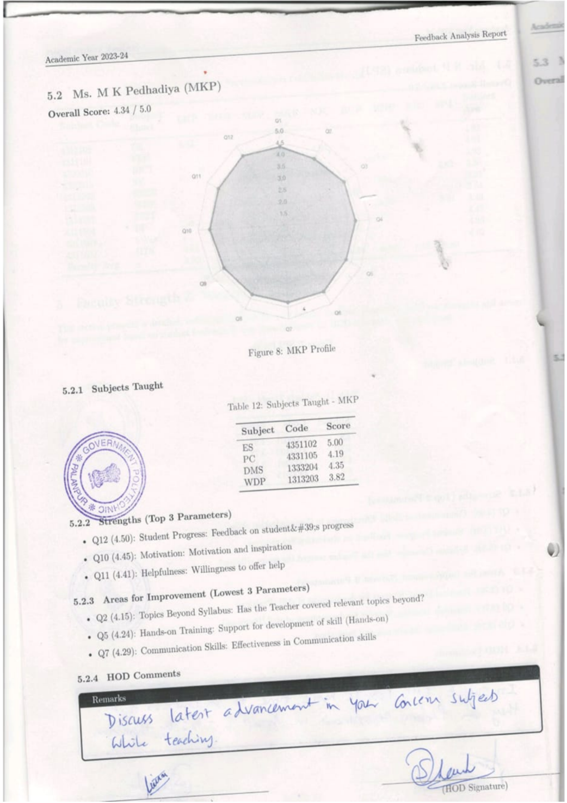

## 8.3 Feedback on facilities (5)

## A. Student feedback on facilities, analysis and corrective action taken (5)

- Feedback on various institutional facilities is collected online from passout students of institute.
- Based on the feedback received, the competent authority takes appropriate corrective actions to address and resolve issues related to the respective facilities.
- The prescribed format for student feedback on facilities is provided in Annexure 8.3.1 .

## STUDE N T FEEDBACK OF I N STITUTE FACILITIES

## Please rate the following institutional facilities.

Sr.

|      | Institutional facilities                                                                | Poor   | Good   | Very Good   | Excellent   |
|------|-----------------------------------------------------------------------------------------|--------|--------|-------------|-------------|
| N o. | N o.                                                                                    | N o.   | N o.   | N o.        | N o.        |
| 1.   | Overall Class Room facility (Board/bench/fan/cleanliness )                              | ☐      | ☐      | ☐           | ☐           |
| 2.   | Overall Laboratory facility (Equipment/ ease of doing experiment)                       | ☐      | ☐      | ☐           | ☐           |
| 3.   | Seminar Room / Auditorium (Overall)                                                     | ☐      | ☐      | ☐           | ☐           |
| 4.   | Wi-Fi (Internet ) Facility in Campus (NAMO Wi-fi)                                       | ☐      | ☐      | ☐           | ☐           |
| 5.   | Library (Availability of books / Reading space/ Library staff cooperation)              | ☐      | ☐      | ☐           | ☐           |
| 6.   | Canteen (Availability of breakfast/Tea/coffee)                                          | ☐      | ☐      | ☐           | ☐           |
| 7.   | Co Curricular Activity (Industrial visit/ Seminar) (Overall in 3 years)                 | ☐      | ☐      | ☐           | ☐           |
| 8.   | Sports/Cultural  activity (Play Ground)                                                 | ☐      | ☐      | ☐           | ☐           |
| 9.   | Drinking Water (Availability )                                                          | ☐      | ☐      | ☐           | ☐           |
| 10.  | Toilet  Block (Cleanliness)                                                             | ☐      | ☐      | ☐           | ☐           |
| 11.  | Communication to students-Overall (Website/ Notice board/ Social Media)                 | ☐      | ☐      | ☐           | ☐           |
| 12.  | Fee (College  + GTU ) Collection Process                                                | ☐      | ☐      | ☐           | ☐           |
| 13.  | Boys/Girls Common Room  (Availability/Usage)                                            | ☐      | ☐      | ☐           | ☐           |
| 14.  | Students counseling (Mentoring)                                                         | ☐      | ☐      | ☐           | ☐           |
| 15.  | Transportation from College (To & Fro)                                                  | ☐      | ☐      | ☐           | ☐           |
| 16.  | Security arrangement in  campus                                                         | ☐      | ☐      | ☐           | ☐           |
| 17.  | Co operation/ Support system from Student Section staff                                 | ☐      | ☐      | ☐           | ☐           |
| 18.  | Hostel facility (Overall) To be filled up, Only if you have stayed at institute hostel) | ☐      | ☐      | ☐           | ☐           |
| 19.  | Suggestions for improvement (If Any)                                                    | ☐      | ☐      | ☐           | ☐           |

## Total Marks 5.00

Institute Marks

5.00

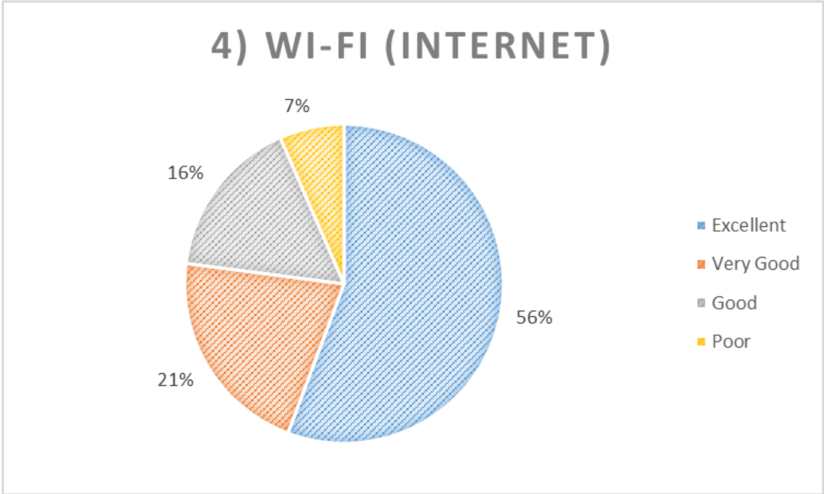

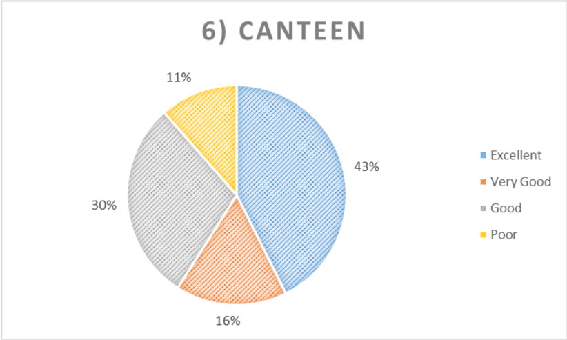

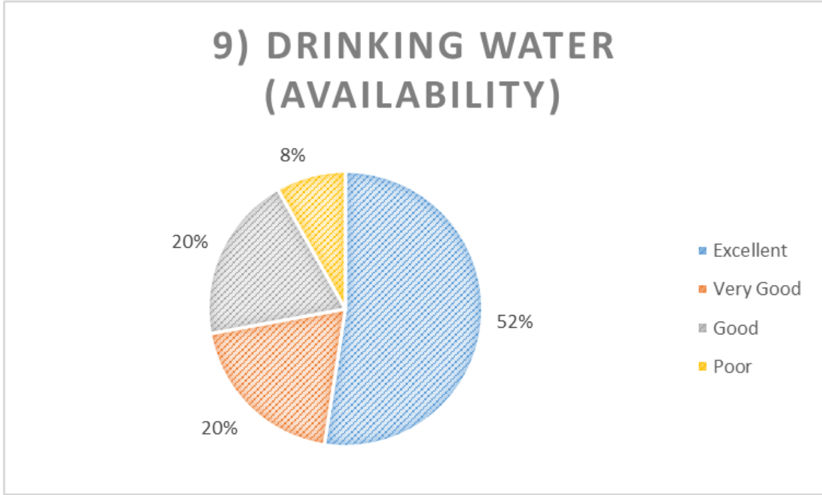

Figure 8.3.1 Analysis of Students feedback on various institutional facilities

|   Institutional facilities | Institutional facilities                          | Corrective Action                                                                                                                                                                                                                                                                                                                    |
|----------------------------|---------------------------------------------------|--------------------------------------------------------------------------------------------------------------------------------------------------------------------------------------------------------------------------------------------------------------------------------------------------------------------------------------|
|                          1 | Wi-Fi (Internet ) Facility in Campus (NAMO Wi-fi) | There are two internet facility in the campus. Namo Wi-Fi Facility has been provided by government through KCG and maintenance is done by BSNL as per government directions. Institute have other internet facility CWAN which is maintain by institute. It wired connection has speed of 200 mbps and Wi-Fi speed of 30 to 40 mbps. |
|                          2 | Canteen                                           | Agency is appointed for canteen as per Govt. norms.                                                                                                                                                                                                                                                                                  |
|                          3 | Drinking Water                                    | Water cooler & air conditioner maintenance correspondence is done. RO Drinking Water Facility has been provided.                                                                                                                                                                                                                     |
|                          4 | Cleanliness                                       | Annual cleanliness contract is given through GEM Portal. Department wise cleanliness observed on regular basis.                                                                                                                                                                                                                      |
|                          5 | Hostel facilities                                 | Hostel block-A is declared ÒNot to be usedÓ by R&B Department. Students are guided for alternate facility in nearby area. The estimates for new hostel building is submitted to DTE Gandhinagar.                                                                                                                                     |
|                          6 | Infrastructure Upgradation                        | Proposal for upgradation of existing auditorium interior is submitted to R&B. After sanctioning Proposal, upgradation work related to sitting and accoustic walls with modern PA system is ongoing.                                                                                                                                  |

Table 8.3.1 Corrective action taken based on feedback on facilities

## 8.4 Career Guidance, Training, Placement (20)

## Total Marks 20.00

## Institute Marks

20.00

Placement activities are executed in two modes. One is through campus Interview at institute and second is mega drive for placement at District level well organised by KCG (Knowledge consortium of Gujarat) under direct guidance of Education department.

The institute has three available cells, who are contributing in enhancement of the effectiveness of training and placement.

- Training and Placement Cell

- Finishing School

- RUSA

## (A) Availability

## 1. Training and Placement Cell

The Training and Placement Cell (TPC) at Government Polytechnic, Palanpur is clearly positioned as a cornerstone for student career readiness. Its dual focusÑcounseling for career development and arranging campus placementsÑcreates a strong bridge between academic learning and industry expectations. LetÕs break down its contributions:

## Key Functions of the Training &amp; Placement Cell

- Campus Recruitment Drives: Prestigious industries are invited to recruit diploma engineers directly from campus.
- Industrial Training &amp; Internships: Students gain hands-on exposure to workplace practices, machinery, and professional culture.
- Skill-Building Activities: Mock interviews, aptitude tests, and personality development programs prepare students for real recruitment scenarios.
- Industry Interaction: Regular sessions with industry professionals help students understand current market trends and skill demands.
- Continuous Career Guidance: Mentors and placement officers counsel students on career pathways, higher studies, and employability skills.

## Infrastructure of TPO Cell :

The TPO cell has one TPO office in LRUC building and for conducting personal interviews, one seminar room in Mechanical Building &amp; an auditorium Hall to address large amount of students.

## 2. Finishing school (Soft skill component)

The Finishing School Program at Government Polytechnic, Palanpur is a remarkable initiative that complements the Training &amp; Placement Cell by focusing on employability enhancement and life skills development. HereÕs a structured overview of its significance:

## Objectives of the Finishing School Program

- Skill Development Beyond Academics: Training in communication, soft skills, aptitude, technical competencies, teamwork, and professional ethics.
- Functional English Training: Special emphasis on improving English language proficiency for students who are academically strong but struggle with communication.
- Industry Readiness: Enhances confidence, workplace behavior, and problem-solving abilities to meet employer expectations.
- Bridging the Skill Gap: Addresses the mismatch between classroom learning and industry requirements, thereby improving placement opportunities.

## Implementation &amp; Reach

- Launched on 16th March 2017 by the Education Department, Government of Gujarat through the Knowledge Consortium of Gujarat (KCG).
- Initially piloted in ~40 colleges with 35 trainers; now expanded to 250+ colleges with 125 trainers.
- Government investment of approx. ₹ 15 crore has trained over 20,000 students, significantly improving employability ratios across the state.
- KCG assigned the agencies through GeM vide letter No.
- KCG, Gujarat Letter No. KCG/Finishing School/2022-23/2202 Dt. 10/11/2022
- KCG, Gujarat Letter No. KCG/Finishing School/2022-23/2179 Dt. 03/11/2022
- KCG, Gujarat Letter No. KCG/Finishing School/2022-23/2307 Dt. 02/12/2022

In that connection, H KumarÕs Education Institute, Ahmedabad is the assigned agency to Government Polytechnic, Palanpur.

## 3. Rashtriya Uchchatar Shiksha Abhiyan (RUSA)

The Rashtriya Uchchatar Shiksha Abhiyan (RUSA) project is a powerful driver of institutional strengthening, and Government Polytechnic, PalanpurÕs participation under Component 9 (Equity Initiative) is especially significant. HereÕs a structured overview:

## Objectives of RUSA

- Access, Equity, and Quality: Ensures planned development of higher education at the state level.
- Infrastructure Strengthening: Modernization of laboratories, classrooms, and learning facilities.
- Faculty Development: Training programs to enhance teaching quality and pedagogical innovation.
- Curriculum Enrichment: Adoption of updated syllabi and innovative teaching-learning practices.
- Digital &amp; Inclusive Education: Promotes e-learning, research, and equitable opportunities for all students.

## (B) Management

## 1.Training and Placement Cell

## Placement team

The College is having Training and Placement Cell. Prof. N.V.Oza (Lecturer of Mechanical Engineering.) is Convener of the cell. Mr. I D Chaudhary and Mr. J B Patel functions as Co -Convener of TPO. TPO cell is assisted by departmental TPO members.

· Faculty Coordinators and Students from each department are also involved actively in the placement cell activities like arranging pre-placement orientation sessions, placement activity, database management, etc.

· Placement cell is very keen to increase placements every year and expand industry contacts. Efforts for the same are made by placement cell as well as at faculty level.

· Placement cell initiates placements by inviting recruiters through invitation email or letter to companies or by communicating over telephone.

· Faculties from departments also contribute via referring companies/person in their contacts. Placement coordinators do visit company in person and discuss as well as invite companies to hire students from the institute.

· Department placement coordinators along with respective HOD also make efforts to liaison with industries at their level in addition to the placement cell activities.

· The students are exposed to the process of placement by making aware them about mock interviews, group discussion, aptitude tests etc.

|   Sr.  N o. | N ame              | Designation   | Department   | Email Id         |
|-------------|--------------------|---------------|--------------|------------------|
|           1 | Shri N.V.Oza       | Convener      | Mechanical   | gpptpo@gmail.com |
|           2 | Shri I.D.Chaudhary | Co-convenor   | Electrical   | gpptpo@gmail.com |
|           3 | Shri J B Patel     | Co-convenor   | Mechanical   | gpptpo@gmail.com |
|           4 | Mr. M.J.Dabagar    | Member        | EC           | gpptpo@gmail.com |
|           5 | Shri  A N Patel    | Member        | Civil        | gpptpo@gmail.com |
|           6 | Shri D P Judal     | Member        | Mechanical   | gpptpo@gmail.com |
|           7 | Shri Ankit Gajjar  | Member        | Electrical   | gpptpo@gmail.com |

| N AME                         | DEPARTME N T   | DESIG N ATIO N   |
|-------------------------------|----------------|------------------|
| Dr C S Pandya                 | GENERAL        | Coordinator      |
| Shri Y T RA N A               | CIVIL          | Member           |
| Shri T D Modi                 | MECHANICAL     | Member           |
| Shri R M Prajapati            | ELECTRICAL     | Member           |
| Shri M J Dabgar               | EC             | Member           |
| Shri V A Chauhan              | IC             | Member           |
| Shri  N irav Chauhan Sr Clerk | ACCOUNT        | Member           |

2.Finishing school (Soft skill component)

KCG FI N ISHI N G SCHOOL TEAM FOR MA N AGEME N T

3.Rashtriya Uchchatar Shiksha Abhiyan (RUSA)

## (C)  Effectiveness

## 1.Training and Placement Cell

## Campus Interview or Placement Procedure:

- Preparation of Industry list.
- Approaching Industry as per prepared list by email and telephone.
- Getting job specific selection criteria from HR department of different companies.
- After receiving the mail about requirements from the Industry, It is to be share to all the departmental TPO Coordinators.
- Departmental TPO Coordinators will share the same information among the concern students.
- As per specified selection criteria, departmental TPO Coordinators will prepare the list of eligible students.
- If Off campus is there, the list of concern students will be provided to the concern industry by email.
- The details of Off campus placement will be shared to the concern students to be appear for the interview.
- In case of placement at our place, discussion with industry personnel about their arrival to conduct the interview process.
- After finalization of interview date, The information will be shared to concern departmental TPO Coordinators to be aware of their role and responsibility during the whole on campus selection process.
- The result will be display on TPO Notice board as well as through whatsapp group.
- Collection of Offer letter/salary slip or I-card of Students who join the concern Industry.
- RecruiterÕs feedback about the process and students.
- Collective data of Campus Interview held at Institute and at Placement fair.

| Placement Data   | Placement Data   | Placement Data          | Placement Data                  | Placement Data                       | Placement Data              | Placement Data   |
|------------------|------------------|-------------------------|---------------------------------|--------------------------------------|-----------------------------|------------------|
| Department       | Passing Year     | No. of Student Pass-out | Current Status                  | Current Status                       | Current Status              | Current Status   |
| Department       | Passing Year     | No. of Student Pass-out | No. of Student doing Job/placed | No. of Student pursue higher studies | No. of Student Entrepreneur | % Placement      |
|                  | 2024-25          | 17                      | 0                               | 15                                   | --                          | 88%              |
|                  | 2023-24          | 16                      | 0                               | 16                                   | --                          | 100%             |
|                  | 2022-23          | 16                      | 0                               | 16                                   | --                          | 100%             |
|                  | 2021-22          | 29                      | 1                               | 26                                   | --                          | 93%              |
|                  | 2020-21          | 34                      | 0                               | 32                                   | --                          | 94%              |
|                  | 2024-25          | 10                      | 7                               | 3                                    | --                          | 100%             |
|                  | 2023-24          | 9                       | 4                               | 5                                    | --                          | 100%             |
|                  | 2022-23          | 16                      | 3                               | 12                                   | --                          | 94%              |
|                  | 2021-22          | 40                      | 3                               | 22                                   | --                          | 63%              |
|                  | 2020-21          | 57                      | 2                               | 35                                   | --                          | 65%              |

| Shri C P Gelot     | GENERAL    | Coordinator   |
|--------------------|------------|---------------|
| Shri S. N .Chauhan | MECHANICAL | Member        |
| Shri A.R.PATEL     | CIVIL      | Member        |
| Shri B.M.Patel     | ELECTRICAL | Member        |
| Shri R.C Parmar    | EC         | Member        |
| Shri  N .A.Modi    | MECHANICA  | Member        |

| Electrical                  | 2024-25   |   23 |   8 |   14 | --   | 96%   |
|-----------------------------|-----------|------|-----|------|------|-------|
| Electrical                  | 2023-24   |   16 |   6 |    6 | --   | 75%   |
| Electrical                  | 2022-23   |   13 |   3 |    3 | --   | 46%   |
| Electrical                  | 2021-22   |   24 |   8 |    3 | --   | 46%   |
| Electrical                  | 2020-21   |   47 |  13 |   10 | --   | 49%   |
| Electronics & Communication | 2024-25   |    3 |   1 |    1 | --   | 67%   |
| Electronics & Communication | 2023-24   |    3 |   2 |    1 | --   | 100%  |
| Electronics & Communication | 2022-23   |    2 |   0 |    2 | -    | 100%  |
| Electronics & Communication | 2021-22   |    4 |   1 |    2 | --   | 75%   |
| Electronics & Communication | 2020-21   |    5 |   1 |    2 | --   | 60%   |
| ICT                         | 2024-25   |    4 |   0 |    3 | --   | 75%   |

## Procedure for Placement Fair  (District level ) :

## (A)Pre-Placement:

- The education department of Gujarat state decides the Month, Date and venue of the different placement fair to be held across the state.
- The education department activates the web portal for planning and real time monitoring.
- The education department frame the guidelines and communicate its to the participating Institutes.
- Formation of Placement fair team by Institute head and distribution of Office order.
- The TPO make the team of 1, 2 or 3 staff members for different route to be visited.
- The team members make the list of Industry to be visited in Banaskatha as well as nearby district.
- Registration of final year students on web portal to participate in Placement fair.
- Visit to the different industries and vacancy data collection by the team members.
- Emailing the above data to the central portal team.
- Verification of above student and Industries data uploaded by the central portal team.
- Correcting the data if any discrepancy found by communicating to the Nodal officer of  Central portal team.
- Documentation of all the related information.
- Formation of different team by nodal officer and distribution of office order for placement fair execution at host institute.54
- Reporting and working at host institute as per direction of Nodal officer.

## (B)During the Placement:

- Reporting at the host institute on specified dates.
- Working at host institute for smooth execution of Placement fair.

## (C)Post-Placement:

- Review of Student placement.
- Record keeping of placement data.
- Uploading of offer letter on portal.
- Final account settlement.
- Surrender of grant of remaining amount.
- Feedback from industry

## Effectiveness of Placement fair  (District Level )

|   Year | Date       | Venue        |   No. of Industry present | No. of student registered   |   No. of student present |   No. of student appeared |   No. of student Selected |
|--------|------------|--------------|---------------------------|-----------------------------|--------------------------|---------------------------|---------------------------|
|   2021 | 18-03-2021 | GEC Palanpur |                         9 | 240                         |                      117 |                       303 |                        45 |
|   2022 | 23-03-2022 | G P PALANPUR |                         8 | 119                         |                      116 |                       226 |                        82 |
|   2023 | 10-03-2023 | G P PALANPUR |                         2 | 110(3)                      |                       54 |                       109 |                        22 |

|   2024 | 11-03-2024   | DNP Arts College, Deesa   |   2 |   80(0) |   38 |   18 |   6 |
|--------|--------------|---------------------------|-----|---------|------|------|-----|
|   2025 | 25-02-2025   | G P PALANPUR              |   4 |      81 |   81 |  192 | 106 |

|   Sr. No | Name of Industry                                   | Location                      |
|----------|----------------------------------------------------|-------------------------------|
|        1 | Academy For Skill Development, (For ArcelorMittal) | Hazira                        |
|        2 | L& T Construction,                                 | Surat                         |
|        3 | SUSPA Pneumatics India Private Limited,            | Ahmedabad                     |
|        4 | Suzuki Motor Gujarat Pvt Ltd                       | Hansalpur, Becharaji, Gujarat |
|        5 | Torrent Power,                                     | Ahmedabad                     |
|        6 | Asahi Glass India Ltd,                             | Chanasma                      |
|        7 | TATA Passenger Vehicle                             | Sanand                        |
|        8 | Tanu Motors ,                                      | Palanpur                      |
|        9 | L&T- Energy Carbonlite Solutions                   | Surat                         |
|       10 | TORRENT RENEWABLE                                  | Surat                         |
|       11 | M/s Micron                                         | Sanand                        |
|       12 | CMR Green Technologies Limited                     | Vadodara                      |

## Impact on Students

- Employability Enhancement: Students graduate with not just technical knowledge but also communication, confidence, and adaptability.
- Professional Competence: Exposure to industry practices ensures students are aligned with real-world requirements.
- Career Readiness: Structured guidance helps students transition smoothly from academics to employment or higher studies.

## Why Palanpur Polytechnic Stands Out

- The institution has become a preferred destination for industries seeking talented diploma engineers.
- Its proactive placement cell ensures students receive best opportunities through collaborations with reputed companies.
- The dual approachÑcounseling + placement drivesÑcreates a holistic support system for career development.

## 2.Finishing school (Soft skill component)

## Procedure to execute training Programme

- A meeting twice in a year with members from each department is conducted for planning and fixing the duration of training.
- List of interested students are registered and on the basis of total number of registered students batches are decided/divided as per KCG guidelines..
- After getting approval of Principal, availability of empanelled trainers is asked to the assigned agency by KCG, Gujarat i.e. H KumarÕs Education Institute, Ahmedabad and in adherence with the guidelines given by KCG, Gujarat,  the training(s) is/are scheduled to benefit the maximum students.
- For smooth conduction and monitoring, work distribution orders are generated.
- Attendance record on daily basis and photographs of the training are kept and sent to the KCG by the assigned trainers as per existing guidelines.
- At the end of training feedback in oral and written form are taken from the students as per existing guidelines.
- Procedure of payment of honorarium to the the assigned agency by KCG, Gujarat i.e. H KumarÕs Education Institute, Ahmedabad as per KCG guidelines.
- Final compiled report is submitted by the assigned agency by KCG, Gujarat i.e. H KumarÕs Education Institute, Ahmedabad to the KCG as well as to the Institute on the Web Portal  https://hk.kcgfinishingschool.com/
- Certificates are being printed and sent by the agency as per guidelines and distributed to the students.
- Review meeting after each completed trainings is conducted at institute level..

|             | Training Date   | Training Date   |                  |                | No. of Students trained   | BRANCHWISE     | BRANCHWISE     |                                |                                                                        |
|-------------|-----------------|-----------------|------------------|----------------|---------------------------|----------------|----------------|--------------------------------|------------------------------------------------------------------------|
|             | From            | To              | Component Number | Training Hours | per batch                 | Total Students | Total Students | Name of Trainer                | REMARK                                                                 |
| 1/2022-2023 | 06-FEB- 2023    | 03-MAR- 2023    | ALL SETs         | 80             | 48                        | CIVIL          | 41             | Mr ANAND VYAS & Ms URJA JOSHI  | SET-A, B, C, D (H KUMARS EDUCATION INSTITUTE, AHMEDABAD)               |
| 1/2022-2023 | 06-FEB- 2023    | 03-MAR- 2023    | ALL SETs         | 80             | 48                        | EC             | 06             | Mr ANAND VYAS & Ms URJA JOSHI  | SET-A, B, C, D (H KUMARS EDUCATION INSTITUTE, AHMEDABAD)               |
| 1/2022-2023 | 06-FEB- 2023    | 03-MAR- 2023    | ALL SETs         | 80             | 48                        | ELECTRICAL     | 01             | Mr ANAND VYAS & Ms URJA JOSHI  | SET-A, B, C, D (H KUMARS EDUCATION INSTITUTE, AHMEDABAD)               |
| 2/2022-2023 | 06-FEB- 2023    | 03-MAR- 2023    | ALL SETs         | 80             | 47                        | CIVIL          | 01 14          | Mr ANAND VYAS & Ms URJA JOSHI  | SET-A, B, C, D (H KUMARS EDUCATION INSTITUTE, AHMEDABAD)               |
| 2/2022-2023 | 06-FEB- 2023    | 03-MAR- 2023    | ALL SETs         | 80             | 47                        | ELECTRICAL     |                | Mr ANAND VYAS & Ms URJA JOSHI  | SET-A, B, C, D (H KUMARS EDUCATION INSTITUTE, AHMEDABAD)               |
| 2/2022-2023 | 06-FEB- 2023    | 03-MAR- 2023    | ALL SETs         | 80             | 47                        | MECHANICAL     | 32             | Mr ANAND VYAS & Ms URJA JOSHI  | SET-A, B, C, D (H KUMARS EDUCATION INSTITUTE, AHMEDABAD)               |
| 3/2023-2024 | 19-FEB- 2024    | 16-MAR- 2024    | ALL SETs         | 80             | 34                        | CIVIL          | 29             | Mr Divyang Gor & Ms Kuntal Gor | SET-A, B, C, D (H KUMARS EDUCATION INSTITUTE, AHMEDABAD)               |
| 3/2023-2024 | 19-FEB- 2024    | 16-MAR- 2024    | ALL SETs         | 80             | 34                        | EC             | 05             | Mr Divyang Gor & Ms Kuntal Gor | SET-A, B, C, D (H KUMARS EDUCATION INSTITUTE, AHMEDABAD)               |
| 4/2023-2024 | 19-FEB- 2024    | 16-MAR- 2024    | ALL SETs         | 80             | 43                        | MECHANICAL     | 23             | Mr Divyang Gor & Ms Kuntal Gor | SET-A, B, C, D (H KUMARS EDUCATION INSTITUTE, AHMEDABAD)               |
| 4/2023-2024 | 19-FEB- 2024    | 16-MAR- 2024    | ALL SETs         | 80             | 43                        | ELECTRICAL     | 20             | Mr Divyang Gor & Ms Kuntal Gor | SET-A, B, C, D (H KUMARS EDUCATION INSTITUTE, AHMEDABAD)               |
| 5/2025-2026 | 15-SEPT- 2025   | 26-SEPT- 2025   | ALL SETs         | 40             | 47                        | MECHANICAL     | 30             | Mr Prakash Detroja             | SET-A, B, C, D (Life Skills) (H KUMARS EDUCATION INSTITUTE, AHMEDABAD) |
| 5/2025-2026 | 15-SEPT- 2025   | 26-SEPT- 2025   | ALL SETs         | 40             | 47                        | IT             | 17             | Mr Prakash Detroja             | SET-A, B, C, D (Life Skills) (H KUMARS EDUCATION INSTITUTE, AHMEDABAD) |
| 6/2025-2026 | 15-SEPT- 2025   | 26-SEPT- 2025   | ALL SETs         | 40             | 48                        | CIVIL          | 41             | Mr Divyang Gor                 | SET-A, B, C, D (Spoken English)                                        |
| 6/2025-2026 | 15-SEPT- 2025   | 26-SEPT- 2025   | ALL SETs         | 40             | 48                        | EC             | 7              | Mr Divyang Gor                 | EDUCATION INSTITUTE,                                                   |
| 7/2025-2026 | 15-SEPT- 2025   | 26-SEPT- 2025   | ALL SETs         | 40             | 49                        | ELECTRICAL     | 29             | Mr Nikhil Oza                  | SET-A, B, C, D (Life Skills) (H KUMARS EDUCATION                       |
| 7/2025-2026 | 15-SEPT- 2025   | 26-SEPT- 2025   | ALL SETs         | 40             | 49                        | ICT            | 20             | Mr Nikhil Oza                  | INSTITUTE,                                                             |

## Finishing School ( Technical ):

At state level there was a training to faculty of Civil, Mechanical, Electrical and IC branch which was imparted by field experts  covering latest trends in industry of 2 to 5 days. The trained faculty then had delivered training to final year students as per following data.

|   SR.  N O. | DEPARTME N T   | DURATIO N   | AREA OF TRAI N I N G                                                               |   N O. OF PARTICIPA N T STUDE N TS |
|-------------|----------------|-------------|------------------------------------------------------------------------------------|------------------------------------|
|           1 | ELECTRICAL     | 06 Days     | Control Panel Wiring                                                               |                                 14 |
|           2 | MECHANICAL     | 10 Days     | 3D Solid Modelling & 3D Printing (Fs Mech-1)                                       |                                 10 |
|           2 | MECHANICAL     | 06 Days     | CNC Programming & Machining (Fs Mech-3)                                            |                                 19 |
|           3 | CIVIL          | 11 Days     | Total Station                                                                      |                                 19 |
|           4 | IC             | 05 Days     | Maintenance, Calibration And Testing Of Industrial Instruments (Pressure And Flow) |                                 03 |

## Summary of grant utilization KCG

|   Sr. No | FINANCAIL YEAR GRANT   |   RECEIVED |   TOTAL  (LAST FY CLOSING+GRANT RECEIVED IN CURRENT FY) |   USED GRANT |   CLOSING BALANCE |
|----------|------------------------|------------|---------------------------------------------------------|--------------|-------------------|
|        1 | 2022-23                |     255500 |                                                  666920 |       511000 |            155920 |
|        2 | 2023-24                |     511000 |                                                  666920 |       511000 |            155920 |
|        3 | 2024-25                |     511000 |                                                  666920 |            0 |            666920 |
|        4 | 2025-26                |          0 |                                                  666920 |       383250 |            283670 |

## Role of Government Polytechnic, Palanpur

- Recognized as a Finishing School Centre, which is a privilege and a mark of trust in the instituteÕs quality.
- The institute contributes by imparting training that enhances employability skills and life skills, preparing students for success not only in jobs but in all walks of life.
- This aligns perfectly with the instituteÕs mentoring and placement ecosystem, creating a holistic student development model.

## Impact on Students

- Confidence Boost: Students become more articulate and self-assured.
- Professional Competence: Training in ethics, teamwork, and workplace behavior makes them industry-ready.
- Career Success: Improved employability skills directly translate into better placement opportunities.

## 3.Rashtriya Uchchatar Shiksha Abhiyan (RUSA)

## Major initiatives of RUSA:

## 1. Equity opportunity cell

- We established Equity Opportunity Cell (EOC) for the development of SC, ST and OBC students including gender equality.

2. Remedial classes

- Workshops are organized to train students thoroughly for taking English Proficiency exams under SCOPE.

## 3. Gender sensitization campaign

- Under Gender Sensitization Campaign, the college organized ÒWomen Empowerment WeekÓ for the awareness, safety, encouragement and empowerment of women.

## 4. Innovative scheme (mentoring of girl child)

- Psychometric Test for girls was conducted by a famous city based Psychiatrist who is well known for his research publications.

## 5. Gender counseling

- Workshop on Business Related Communication Skills was conducted for SC/ST and OBC girls.

|   Sr. N o | EventDate                 | Topic                                              | Expert N ame                                                                                    |
|-----------|---------------------------|----------------------------------------------------|-------------------------------------------------------------------------------------------------|
|         1 | 05-03-2022                | LAW RELATED TO WOMEN SAFETY                        | MS.YASHSHVI MEHTA PANDYA                                                                        |
|         2 | 05-03-2022                | DISADVANTAGES OF MOBILE AND INTERNET               | MS.GEETA ACHARYA                                                                                |
|         3 | 05-03-2022                | SELF EMPLOYMENT ENHANCEMENT                        | TITHI VAKIL                                                                                     |
|         4 | 23-11-2022 TO  29-11-2022 | REMEDIAL CLASS                                     | C.P.GELOT C.S.PANDYA B.B.MOR M.F.TANK R.P.CHAVDA R.H.CHAVDA V.M.PRAJAPATI N.J.CHAUHAN N.M.PATEL |
|         5 | 23-11-2022                | COMPETATIVE EXAM CLASS                             | PATEL NARESHKUMAR KARSANBHAI                                                                    |
|         6 | 24-11-2022                | GROUP COUSELING                                    | DR.NILAM PATEL                                                                                  |
|         7 | 24-11-2022                | EXPERT LECTURE ON BRUN HATYA                       | DR.NILAM PATEL                                                                                  |
|         8 | 13-03-2023                | SELF EMPLOYMENT AND ENHANCEMENT FOR GIRLS STUDENTS | MS.JALPABEN R VAIDYA                                                                            |
|         9 | 13-03-2023                | MOTIVATIONALTALK FOR GIRLS STUDENTS                | MR.DARSHAN SOLANKI                                                                              |
|        10 | 15-03-2023                | WOMENEMPOWERMENT                                   | MS.M.K.PEDHADIYA                                                                                |
|        11 | 17-03-2023                | ICE BREAKING ACTIVITY FORGIRLS  STUDENTS           | MS.MANISHABEN JOSHI                                                                             |
|        12 | 17-03-2023                | TO ENHANCE CREATIVITY SKILLS FOR GIRLSSTUDENTS     | MS.RUKSHANABEN PARMAR                                                                           |

|   13 | 20-03-2023 TO 21-03-2023   | SPOKEN ENGLISH                            | DR.C.S.PANDYA           |
|------|----------------------------|-------------------------------------------|-------------------------|
|   14 | 07-08-2023 TO 09-08-2023   | ENTREPRENEURSHIP DEVLOPMENT               | MR.VIRENDRASINH CHAVDA  |
|   15 | 09-08-2023 TO 11-8-2023    | INNOVATION  CREATIVITY                    | HITTEN PATEL            |
|   16 | 17-8-2023 TO 19-8-2023     | SELF EMPLOYMENT AND ENHANCEMENT           | MR GAURAV PATEL         |
|   17 | 21-08-2023  TO 25-08-2023  | KARATE WORKSHOP                           | Mr.NARSHBHAI  PRAJAPATI |
|   18 | 11-09-2024 TO 14-09-2024   | YOGA WORKSHOP                             | MR.AASHISH B MODI       |
|   19 | 14-10-2024                 | EXPERT LECTURE ON COMPITATIVE EXAMINATION | DRASHTI S GAMI          |
|   20 | 10-10-2024                 | REMEDIAL CLASS FOR MATHEMATICS            | DRASHTI S GAMI          |
|   21 | 11-10-2024                 | EXPERT LECTURE ON WOMEN EMPOWERMENT       | DRASHTI S GAMI          |
|   22 | 11-10-2024                 | GROUP COUSELLING FOR GIRLS STUDENTS       | DRASHTI S GAMI          |
|   23 | 11-10-2024                 | CARRIER GUIDANCE FOR STUDENTS             | DRASHTI S GAMI          |

[Table 8.4.7 Events conducted under RUSA]

GRA N T UTILIZATIO N YEAR WISE

|   SR NO | FINANCIAL YEAR   |   GRANT BALANCE |   GRANT RECEIVED |
|---------|------------------|-----------------|------------------|
|       1 | 2022-23          |        50616.8  |            22930 |
|       2 | 2023-24          |        27686.8  |            26500 |
|       3 | 2024-25          |         1186.79 |             1186 |

- Receives RUSA grants under Component 9 (Equity Initiative), which focuses on inclusivity and bridging gaps for disadvantaged groups.
- Enables modernized labs and resources, improving hands-on learning for diploma engineering students.
- Supports faculty development workshops, ensuring teachers stay aligned with industry and academic advancements.
- Encourages innovative teaching methods like blended learning, project-based education, and digital tools.
- Enhances student performance and institutional effectiveness through systematic reforms and financial support.

## Benefits for Students

- Holistic Development: Beyond technical skills, students gain exposure to research, digital learning, and inclusive practices.
- Improved Employability: Better labs, updated curriculum, and skilled faculty directly enhance career readiness.
- Equity &amp; Inclusion: Focus on disadvantaged students ensures equal access to quality education.

## 8.5 Entrepreneurship Cell/Technology Business Incubator (5)

## Total Marks 5.00

Institute Marks

5.00

## A.Availability

The Student Startup and Innovation Policy (SSIP) of the Government of Gujarat encourages innovation, entrepreneurship, and startup culture among students. Under this policy, students receive financial assistance, mentoring, incubation support, and exposure to entrepreneurial ecosystems. SSIP motivates students to convert innovative ideas into viable products and startups. It promotes problem-solving skills, creativity, and self-employment, thereby reducing dependency on traditional job opportunities and fostering an innovation-driven mindset among diploma engineering students.

Government of Gujarat has developed a policy for providing assistance to Startups/ Innovation. Under this scheme, any individual/ group of individuals having innovative idea/ Concept will be eligible and/ or Universities/ education institutions, Incubation Centre/ PSUs/ R&amp;D Institutions/ Private and other establishments will be eligible as an institution to support and mentor to innovators as approved by Committee. Startups in an economys technology sectors is an important indicator of technological performance for several reasons.

The Student Startup&amp; Innovation Policy of Government of Gujarat aims to create an integrated, state-wide, university-based innovation ecosystem to support innovations and ideas of young students and provide a conductive environment for optimum harnessing of their creative pursuit.

Government Polytechnic Palanpur has started its SSIP cell in 2017. This centre is providing incubation facility for the students as itÕs equipped with basic modern instruments and computers with internet connectivity.

## Importance of SSIP for Diploma Engineering Colleges

- Encourages Innovation: Provides a structured platform for students to convert classroom knowledge into practical solutions.
- Funding Support: Students can receive grants (up to ₹ 2.5 lakh per project) for prototype development, reducing financial barriers.
- Skill Development: Promotes design thinking, problem-solving, and entrepreneurship skills beyond the syllabus.
- Industry Linkages: Builds bridges between academia, industry, and government, improving employability and startup culture.
- Recognition: Successful projects gain visibility at state and national levels, motivating students and institutions.

## Scope of SSIP in Diploma Colleges

- Prototype Development: Students can apply for grants to build working models of innovative ideas.
- Incubation Ecosystem: Colleges are encouraged to set up SSIP cells/incubation centres to mentor and guide students.
- Interdisciplinary Projects: Open to all branches of engineering and polytechnic programs, encouraging collaboration.
- IPR Support: Assistance for patent filing and intellectual property protection.
- Events &amp; Hackathons: Colleges can organize innovation challenges, bootcamps, and workshops under SSIP.
- Scaling Ideas: Promising student projects can be scaled into startups with further support from state innovation hubs.

## B. Management :

Following is a tem working hard to make SSIP activities to its effective ultilization.

|   Sr  N o | Faculty       | Deptt.   | Designation in SSIP Cell   |
|-----------|---------------|----------|----------------------------|
|         1 | Dr L K Patel  | EC       | SSIP Coordinator           |
|         2 | Mr B M Patel  | EE       | Member                     |
|         3 | Mr M J Dabgar | EC       | Member                     |
|         4 | Mr F M Mukhi  | Civil    | Member                     |

|   5 | Mr V H Suthar   | Mech   | Member   |
|-----|-----------------|--------|----------|
|   6 | Mr V A Chauhan  | IC     | Member   |

## C.Effectiveness :

The different activates organised by SSIP cell at GP, Palanpur are as under.

## Summary of SSIP Grant Sanctioned, Received, Utilized

| Financial Year   |   Sanction(Rs.) |   Received(Rs.) |   Utilized(Rs.) |
|------------------|-----------------|-----------------|-----------------|
| 2022-23          |          900000 |          450000 |          137304 |
| 2023-24          |         1080000 |          540000 |          287013 |
| 2024 -25         |         1160000 |               0 |           49005 |
| 2025 Ð 26        |         1360000 |               0 |          333664 |
| Total            |         4500000 |          990000 |          806986 |

## POC Utilized

| Year             |   No. Approved POC |   Fund Utilized |
|------------------|--------------------|-----------------|
| 2022-23          |                 15 |           79793 |
| 2023-24          |                  1 |          124889 |
| 2024 -25         |                 12 |           32295 |
| 2025 Ð till date |                  4 |          243160 |
| Total            |                 32 |          480137 |

## IPR Utilization

| Year             |   No. Approved IPR |   Fund Utilized |
|------------------|--------------------|-----------------|
| 2022-23          |                  1 |           12000 |
| 2023-24          |                  0 |               0 |
| 2024 -25         |                  0 |               0 |
| 2025 Ð till date |                  1 |           45000 |
| Total            |                  2 |           57000 |

## Event Utilization

| Year    |   No. Event organized |   Fund Utilized |
|---------|-----------------------|-----------------|
| 2022-23 |                    18 |           37412 |
| 2023-24 |                    09 |           13064 |

| 2024 -25         |   10 |   15710 |
|------------------|------|---------|
| 2025 Ð till date |   04 |   44416 |
| Total            |   41 |  110602 |

## Patent filed by students under SSIP:

|   Sr  N o | Title                                                                          |     IPR  N o | Leader  N ame           | Financial Year Date of filing   |            | Granted           |
|-----------|--------------------------------------------------------------------------------|--------------|-------------------------|---------------------------------|------------|-------------------|
|         1 | Switchboard                                                                    | 202021026651 | Mr. Hiten Patel 2020-21 |                                 | 24/06/2020 | 22/12/2023        |
|         2 | Smart Rotary Switchboard                                                       | 202021044176 | Mr. Hiten Patel 2020-21 |                                 | 10/10/2020 | 10/05/2022        |
|         3 | Water TAP Alarm                                                                | 202121004092 | Nai Dhaval              | 2020-21                         | 29-01-2021 | 25-10-2021        |
|         4 | Cup and Glass Cleaning Device                                                  | 202121049081 | Nai Dhaval              | 2021-22                         | 27/10/2021 | 20/02/2024        |
|         5 | Multimodular Digital Stethoscope with Integrated Diagnostics and AI Assistance | 202521118577 | Dr Vipul Tank           | 2025-26                         | 28-11-2025 | Under Examination |
|         6 | Modular Stethoscope with Interchangeable Chest Piece                           | 202521131153 | Dr Vipul Tank           | 2025-26                         | 24-12-2025 | Under Examination |

## Start-up Support :

|   Sr N o | Startup                         | Full name                     |   Contact number | Email address           | Domain                 | Startup Description (MCats)                                                                                                                                                                                                                                                                                                                                                                                                                                                                                  |
|----------|---------------------------------|-------------------------------|------------------|-------------------------|------------------------|--------------------------------------------------------------------------------------------------------------------------------------------------------------------------------------------------------------------------------------------------------------------------------------------------------------------------------------------------------------------------------------------------------------------------------------------------------------------------------------------------------------|
|        1 | Prahantam Pvt. Ltd              | Mr Dhaval Nai                 |       9638898921 | naidhaval724@gm ail.com | Manufacturing          | Prahantam Pvt. Ltd. is an Ahmedabad- based manufacturer of automated tea cup washing machines, designed to improve hygiene and efficiency for tea vendors and hospitality businesses.                                                                                                                                                                                                                                                                                                                        |
|        2 | Zephyr Digisteth                | Dr. Vipul Tank                |       8154976472 | vipulktank@gmail.com    | Healthcare & Nutrition | They are developing a compact, all-in- one medical device that assists both doctors and patients. It integrates auscultation, ECG, temperature, and blood sugar monitoring, with modular attachments like an otoscope, ophthalmoscope, and BP monitor. Designed for clinics and homes, it supports daily checkups, tele- consultations, and remote care. With AI- powered analysis, data storage, and live streaming, it enables faster, more accurate diagnoses and ensures no subtle signs are overlooked. |
|        3 | Beerobokids Innovations Pvt Ltd | Rishabh kunjeshbhai prajapati |       9687136019 | prajapatirshb@gmail.com | STEM Education         | BeeRobokids Innovations Pvt Ltd is a startup dedicated to empowering kids and young innovators through hands-on learning in Robotics, IoT, and emerging technologies. The platform nurtures creativity, critical thinking, and problem- solving skills, inspiring the next generation of inventors and tech leaders. By blending education with innovation, BeeRobokids aims to make future technologies accessible and engaging for young minds, fostering curiosity and lifelong learning.                 |

|   4 | Innovate 3D       | Deepak Chaudhary   |   9638718578 | dip9627@gmail.com                            | Tech   | Innovate 3D is a startup dedicated to advancing 3D design, printing, and rapid prototyping. It develops cost-effective 3D printers, STEM education kits, and offers prototyping support for startups and industries. By combining innovation, research, and practical learning, Innovate 3D makes advanced manufacturing accessible to students, creators, and businesses. Its mission is to bridge imagination and realityÑempowering people to turn ideas into tangible creations and shape future possibilities.   |
|-----|-------------------|--------------------|--------------|----------------------------------------------|--------|-----------------------------------------------------------------------------------------------------------------------------------------------------------------------------------------------------------------------------------------------------------------------------------------------------------------------------------------------------------------------------------------------------------------------------------------------------------------------------------------------------------------------|
|   5 | Sky Print Startup | Rajput yuvraj      |   8160664564 | rajputyuvraj224@gmail.com                    | Tech   | Sky Print is a startup focused on creating customized drone solutions for diverse industries and applications. The company designs high-performance FPV, surveillance, and custom-built drones, along with special models like flower- dropping drones for events. It also offers drone services, training, and ready-to-fly models. With a mission to redefine aerial technology, Sky Print aims to deliver innovative, reliable, and purpose-driven drones for commercial, creative, and industrial use.            |
|   6 | Sky craft         | Bharat Mali        |   7862996203 | malibharatkumar9070@gmail.com STEM Education |        | Develop low-cost robotics and IoT kits that make future technologies accessible. Create activity-based learning modules that inspire curiosity and encourage experiential learning. Support teachers and schools in rural areas with training programs and ready- to-use learning resources. Foster a culture of innovation, teamwork, and entrepreneurship among young learners.                                                                                                                                     |

## Events organized: Year 2022-2023

|    | Date       | Event  N ame                                             | Event Type           |   N o. Participation Venue |                                               |
|----|------------|----------------------------------------------------------|----------------------|----------------------------|-----------------------------------------------|
|  1 | 20/09/2022 | Group Discussion event for first and final year students | Group Discussion     |                        100 | seminar hall Government polytechnic palanpur  |
|  2 | 21/09/2022 | Group Discussion for STD 1 to 8                          | Group Discussion     |                        675 | Branch school palanpur                        |
|  3 | 23/09/2022 | Group Discussion for STD9 to 10                          | Group Discussion     |                        600 | Shri Vividhlaxmi VidhyamandirPalanpur         |
|  4 | 24/09/2022 | Group Discussion for STD 9 to 11                         | Group Discussion     |                        275 | Shri M M Mehta english medium school Palanpur |
|  5 | 26/09/2022 | Group Discussion for STD 6 to 8                          | Group Discussion     |                        550 | Shri I J Mehta Vidhyamandir school Palanpur   |
|  6 | 27/09/2022 | Group Discussion for STD 6 to 11                         | Group Discussion     |                        320 | Vimla Vidhyalay Gadh                          |
|  7 | 30/09/2022 | Group Discussion for STD 3 to 5                          | Group Discussion     |                        575 | Shri Rajlaxmi Primary School Palanpur         |
|  8 | 1/10/2022  | Group Discussion for STD 5 to 8                          | Group Discussion     |                        150 | Ganeshpura Primary School Palanpur            |
|  9 | 4/10/2022  | Group Discussion                                         | Group Discussion     |                        100 | Iqra english medium                           |
| 10 | 6/10/2022  | Group Discussion for STD 6 to 8                          | Group Discussion     |                        407 | Shri M M Mehta english medium school Palanpur |
| 11 | 10/10/2022 | New Palanpur for New India                               | Appreciation Program |                        150 | seminar hall Government polytechnic palanpur  |

|   12 | 10/1/2023                | Sensetization programme                  | Sensetization programme   |   483 | Iqra english medium                          |
|------|--------------------------|------------------------------------------|---------------------------|-------|----------------------------------------------|
|   13 | 10/01/2023 to 11/01/2023 | boot camp                                | work shop                 |    35 | Iqra english medium                          |
|   14 | 17/01/2023               | Sensetization programme                  | Sensetization programme   |   200 | Chaniyanaprimeri school                      |
|   15 | 17/01/2023 to 18/01/2023 | boot camp                                | work shop                 |    32 | Chaniyanaprimeri school                      |
|   16 | 10/02/2023               | motivational speech for Entrepreneurship | seminar                   |    90 | seminar hall Government polytechnic palanpur |
|   17 | 11/03/2023               | Sensetization programme                  | Sensetization programme   |   681 | Adarsh School palanpur                       |
|   18 | 11/03/2023 to 12/03/2023 | boot camp                                | work shop                 |    70 | Adarsh School palanpur                       |

## Year 2023-24

|   Sr no | Date                    | Event  N ame                                                | Event Type                                   |   N o. Participation Venue |              |
|---------|-------------------------|-------------------------------------------------------------|----------------------------------------------|----------------------------|--------------|
|       1 | 19/07/2023              | Sensitization program                                       | Sensitization program                        |                        210 | Seminar Hall |
|       2 | 10/08/2023              | Students innovation fest 2023                               | Expert Talk                                  |                        190 | Seminar Hall |
|       3 | 07-08-09/08/2023        | EXPERT LECTURE ON ENTERPRENEURSHIP DEVELOPMENT              | Expert lecture series by RUSHA and SSIP Cell |                         30 | Seminar Hall |
|       4 | 09-10-11/08/2023        | EXPERT LECTURE ON INNOVATION & CREATIVITY                   | Expert lecture series by RUSHA and SSIP Cell |                         30 | Seminar Hall |
|       5 | 17-18-19/08/2023        | EXPERT LECTURE ON SELF EMPLOYMENT & ENHANCEMENT             | Expert lecture series by RUSHA and SSIP Cell |                         30 | Seminar Hall |
|       6 | 21-08-2023              | Word entrepreneur Day(Enterpreneurship as a Career)         | seminar                                      |                        180 | Seminar Hall |
|       7 | 14-09-2023              | Innovation and Startup Sensitization work shop              | Seminar                                      |                        250 | Seminar Hall |
|       8 | 05-12-2023 to 10- 12-23 | Startup Conclave -2023,Gandhinagar STALL                    | Event                                        |                          3 | Gandhinagar  |
|       9 | 8/12/2023               | Startup Conclave -2023,Gandhinagar institute students visit | Event                                        |                         52 | Gandhinagar  |

## Year 2024-25

|   Sr no | Date       | Event  N ame               | Event Type   |   N o. Participation Venue |                                 |
|---------|------------|----------------------------|--------------|----------------------------|---------------------------------|
|       1 | 16/04/2024 | New Palanpur for New India | Event        |                        140 | G P Palanpur                    |
|       2 | 29/11/2024 | Sensitization program      | Seminar      |                       1398 | Swastik Primary school palanpur |
|       3 | 29/11/2024 | Sensitization program      | Seminar      |                       1000 | Adarsh Primary school palanpur  |

|   4 | 29/11/2024   | Sensitization program                                 | Seminar          |   500 | Adarsh school palanpur ( 9 to12 std)   |
|-----|--------------|-------------------------------------------------------|------------------|-------|----------------------------------------|
|   5 | 29/11/2024   | Sensitization program                                 | Seminar          |   700 | silverbell school palanpur             |
|   6 | 29/11/2024   | Sensitization program                                 | Seminar          |   862 | Hetiba primary school palanpur         |
|   7 | 29/11/2024   | Sensitization program                                 | Seminar          |   320 | Aekta Primaryschoolpalanpur            |
|   8 | 30/11/2024   | Sensitization program                                 | Seminar          |  1500 | Swastik school palanpur (9 to 12)      |
|   9 | 21/01/2025   | One day workshop                                      | One day workshop |    20 | G P palanpur                           |
|  10 | 25/03/2025   | Opening ceremony of Innovative Idea & One day seminar | One day seminar  |   120 | G P palanpur                           |

## Year 2025- till date

Sr no

Date

1

2

3

09/04/2025

06/09/2025

10/09/2025

4

18/09/2025

Event

N

ame

New Palanpur for

Event Type

Real-life problems tackled with

New India 3.0

tech-powered solutions.

Sensitization program Sensitization program

AI tools workshop

One day workshop

Sensitization program Sensitization program

## Outcomes of SSIP Activities

Financial Impact of SSIP Implementation (2022Ð2026)

- ¥ A total of ₹ 9.90 lakh SSIP grant was sanctioned, out of which ₹ 8.07 lakh has been effectively utilized for innovation, POC development, IPR filing, and events. ¥ 32 Proof of Concept (POC) projects were approved with ₹ 4.80 lakh utilized, promoting hands-on innovation and product development.
- ¥ 6 IPR applications were supported, strengthening the culture of patent awareness.
- ¥ 41 innovation and entrepreneurship events were organized with ₹ 1.10 lakh utilization, enhancing student exposure and participation.

The SSIP initiative has created a strong innovation ecosystem by supporting student projects, promoting entrepreneurship, strengthening IPR awareness, and organizing impactful events. The structured utilization of funds has ensured sustainable skill development, practical exposure, and real-world problem-solving abilities among students.

9 9 GOVERNANCE, INSTITUTIONAL SUPPORT AND FINANCIAL RESOURCES GOVERNANCE, INSTITUTIONAL SUPPORT AND FINANCIAL RESOURCES (75) (75)

9.1 Organization, Governance and Transparency (25)

9.1.1 State the Vission and Mission of the Institute (5)

Vision :

To produce competent diploma engineers as per need of industries and entrepreneurs with ethical values.

N

o. Participation Venue

250

G P Palanpur

145

72

62

Shri Ram

VidhyalayPalanpur

G P Palanpur

Gela Primary School

Total Marks Total Marks   75.00 75.00

Total Marks 25.00

Institute Marks

5.00

Government Polytechnic, Palanpur strives to impart, 1. To impart Industry oriented technical education. 2. Excellent teaching and learning environment. 3. Promote entrepreneurship activities. 4. Continual growth in every sphere of life by developing core human values

## 9.1.2 Governing body, administrative setup, functions of various bodies, define rules procedures, recruitment and promotional policies (5)

Institute Marks

5.00

## A. Governing Body and Administrative Setup:

The governance mechanism in government systems are designed to be fair, transparent and effective. Government Polytechnic, Palanpur is administered by the Commissionerate of Technical Education which reports to the Education department, Government of Gujarat. The organizational set up of the authorities of the whole Education Department is appended herewith at Figure 9.1

Figure.9.1 Governing Body - Organizational Chart - Education Department

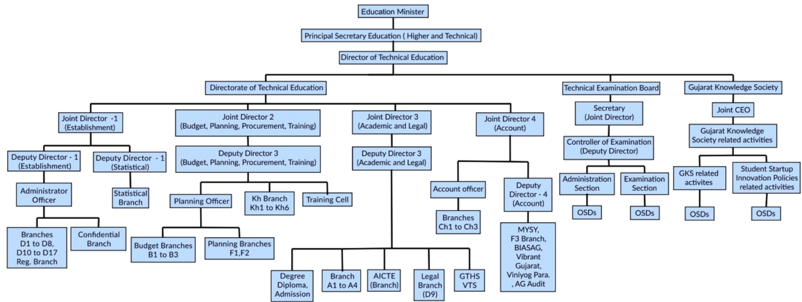

Furthermore, Government Polytechnic, Palanpur follows the standard practices defined in TEIM (Technical Education Institute Manual), which is available on Commissionerate of Technical Education, Gujarat website on the following link: https://dte.gujarat.gov.in/technical-education-institution-manual-teim-govtpolytechnics

## Functions and responsibilities of Various Bodies:

- The administration of the overall Education Department, Gujarat state is decentralized.
- The key officers of the education department are Principal Secretary (Higher and Technical Education), Director-Technical Education, Joint Directors and Principals of the various Government Polytechnics.
- Principal Secretary is the highest authority for overall higher and technical education system in the state.
- Under Principal Secretary, Directorate of Technical education works to leverage various governance supports to technical institutions.
- At Directorate office, Joint Directors are appointed for responsibilities of Establishment, Budget-Planning-Procurement, Academic, Legal and Admission related matters.
- At Institute level, Principal is the highest authority for various academic and administrative matters and reports to Director of Technical Education.
- Government Polytechnic, Palanpur is affiliated with Gujarat Technological University, Ahmedabad.
- For the curriculum and evaluation methodology, institute has adopted the rules and regulations laid down by the University.
- Being important stakeholder of the University system, many faculties of the Institute contributes on various boards such as Academic Council, Board of Studies, Academic Inspection etc.

## Service rules, procedures, recruitment and promotional policies:

## Service rules and procedures:

- The Service rules are well defined and amended time to time by the General Administration Department (GAD), Government of Gujarat.
- Service rules including pay, pension and leaves are published in Gujarat Civil Services Rules (GCSR).
- For the pay, Government follows AICTE guidelines.
- The rules are uploaded on Finance Department website on following link : GCSR Rules: https://financedepartment.gujarat.gov.in/rules.html

## Recruitment and Promotion policies:

- The Recruitment Rules (RR) and promotion policy concerned with academic faculties and supporting staff are framed by the Government from time to time.
- Gujarat Gaun Seva Pasandgi Mandal (GSSSB) is statutory body to carry out the direct recruitment for the various non-teaching positions.
- The Gujarat Public Service Commission (GPSC) is statutory body to carry out the direct recruitment for the various academic faculty positions (Principal, Head of the Department, Lecturer) in case of direct recruitment.
- All promotions are carried out as per rules through Departmental Promotion Committee (DPC) with final approval from GPSC.
- The overall mode of recruitment and promotion is as below:

100% of the sanctioned positions at the level of Lecturer carried out through direct recruitment by the GPSC based upon proposal received from education department, Gujarat state, as per AICTE norms.

For remaining cadre (Principal, Head of the Department) 50% of vacant positions are filled through direct recruitment by GPSC, while remaining 50% positions are filled through promotion by education department through departmental promotion committees.

The detailed information is available at: https://dte.gujarat.gov.in/recruitment-rules

## B. Minutes of Meetings and Action Taken Reports:

Institute has policy to arrange meetings of head of the different committees and their members for smooth functioning of the institute. Decisions taken in the meetings are recorded in Minutes of Meetings (MoM).

## C. Publication of Service Rules, Policies and Procedures:

As a Government institution, we are following Government of Gujarat Policies:

- Service Rules: Government Civil Services Rules (GCSR-2002)

https://financedepartment.gujarat.gov.in/rules.html

- Purchase Policy: Gujarat State Purchase Policy-2016

http://www.imd-gujarat.gov.in/Document/2016-6-7\_379.pdf

- Admission Policy: Gujarat Act - 2, 2008, Dated: 07/03/2008 and 28/05/2008

http://acpdc.co.in/advertisement/act.html

- Academic Policy: As per Gujarat Technological University (GTU), Ahmedabad

## http://www.gtu.ac.in

- Student's Startup and Innovation Policy: SSIP Policy published by Government of Gujarat as on 11/01/2017

http://www.startupgujarat.in/writereaddata/Images/pdf/Student-innov-Policy-HT-Edu.pdf

## D. Awareness of Service Rules, Policies and Procedures among the employees/students:

Awareness of Service Rules, Policies and Procedures among the employees/students created through training and awareness program as shown in following details:

## Employees:

- Teaching faculty training: Induction training, subjective training, interdisciplinary training, etc. are arranged by CTE training cell through FSD portal.

- Non-teaching faculty training: Administrative trainings are arranged by SPIPA.

- Institute circular and notification.

- Websites:

Government Polytechnic Palanpur (https://gppalanpur.ac.in)

Commissionerate of Technical Education (https://dte.gujarat.gov.in)

Gujarat Technological University (https://www.gtu.ac.in)

General Administration Department (https://gad.gujarat.gov.in)

Finance Department (https://financedepartment.gujarat.gov.in)

## Students:

- Through Induction and Awareness programs arranged at Institute.

- Institute circular and notice board.

- Websites:

Government Polytechnic Palanpur (https://gppalanpur.ac.in)

Gujarat Technological University (https://www.gtu.ac.in)

9.1.3 Decentralization in working and grievance redressal mechanism (5)

Institute Marks

## The administration of the Institute is decentralized as shown in Figure 9.2.

Figure 9.2 Organizational Chart - Institution level

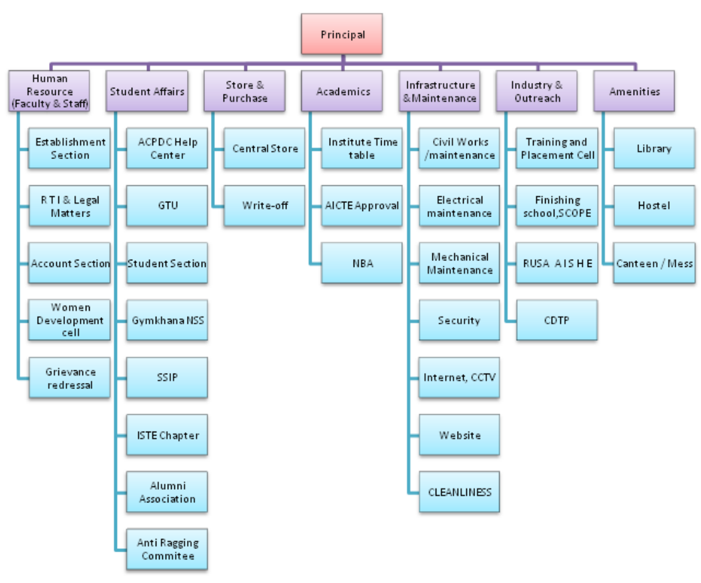

## Decentralization of work:

- Principal of the Institute is responsible for the overall academic and administrative aspects of the Institute.
- Institute also has cells for managing various institute level development activities like Establishment (for faculty and staff service matters), Students matters, Academics, Store and Purchase, Infrastructure &amp; Maintenance, Industry and outreach and central amenities.
- To look after the various academic activities of each programme, Institute has nominated heads of the departments (HODs).
- All faculty and staff members of the concerned programme report to the respective Head of department for their academic activities, academic calendar and managing department level administrative portfolios, grievances etc.
- All HODs report to the head of the Institute.
- To provide detailed guidelines for various activities of a teacher, a Technical Education Institute Manual (TIEM) has been prepared by Commissionerate of Technical Education, Government of Gujarat.
- As per the guidelines of the TEIM, various committees have been formed for the smooth working of the institutional matters as shown in the Figure 9.3 given below vide Office Order No.: GPP/EST/Work distribution/2024/662 Dated: 04/07/2024.

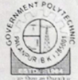

## Government Polytechnic, Palanpur

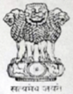

Outside Malan Gate, Palanpur-385001

Phone (02742) 245219 262115

No. GPP /EST/Work Distribution/ 662

Date

Following administrativelmanagerial duties are assigned t0 corresponding oflicersfaculties in   addition regular  job specific   responsibilities smooth   functioning and development of the institute till further order. All are inform to maintain rccords with proofs and present as and when required, for

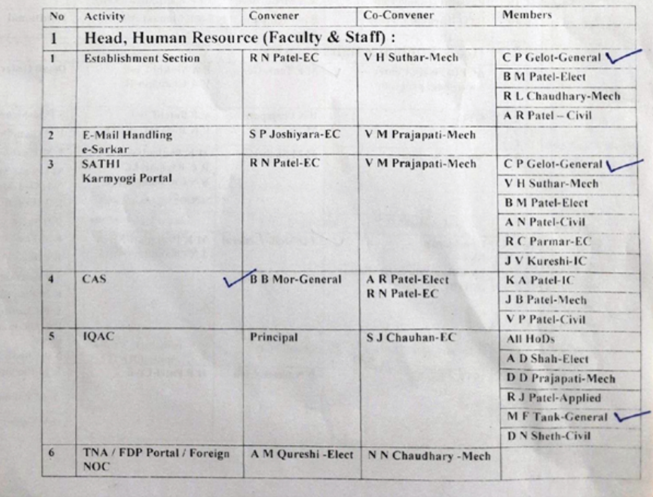

|                                        | Convcncr                               |                                        |                                                |
|----------------------------------------|----------------------------------------|----------------------------------------|------------------------------------------------|
| Head. Human Resource (Faculty & Stafl) | Head. Human Resource (Faculty & Stafl) | Head. Human Resource (Faculty & Stafl) | Head. Human Resource (Faculty & Stafl)         |
|                                        |                                        |                                        | ARPatel                                        |
| F-Mail Handling Sarkar                 |                                        |                                        |                                                |
| Karmyogi Portal                        | RN Patel-FC                            | M Prajapati-Mech                       | J Kureshi-IC                                   |
|                                        |                                        | R Patel-Elcet                          |                                                |
| IQAC                                   | Principal                              |                                        | Dshah-Elect DD Prajapati-Mech R J PatelApplied |
| FDP Portal Forcign                     | M Qureshi Elccr                        | Chaudhary Mech                         |                                                |

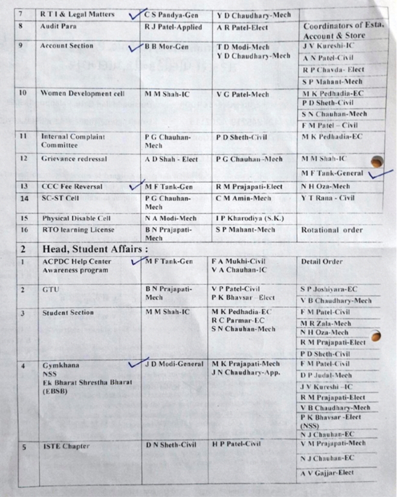

|    |                       |                       | YD Chaudhary-Mech                |                       |
|----|-----------------------|-----------------------|----------------------------------|-----------------------|
|    |                       |                       | 1D ModiMech YD Chaudhary-Mech    |                       |
| 10 | Women Development cel | M M shah-IC           |                                  |                       |
|    |                       | Mech                  |                                  |                       |
|    |                       | AD Shuh Elect         |                                  | MF ank-General        |
|    |                       |                       | RM Prajapati-Elect               |                       |
| 14 |                       | cChauhan- Mech        |                                  |                       |
|    |                       | AModi-Mech            |                                  |                       |
| 16 | RTO learning License  | Mcch                  | SP Mahant-Mech                   | Rotational order      |
|    | Head, Student Affairs | Head, Student Affairs | Head, Student Affairs            | Head, Student Affairs |
|    | ACPDC Help Center     | M FTank-Gen           | FA Mukhi-Chvil VA Chauhan-IC     | Detuil Order          |
|    | GTU                   | Mech                  |                                  |                       |
|    |                       | MM Shah-IC            | R C Parmar EC                    |                       |
|    | Cymkhana              |                       | M K Prjapati-Mlech Chaudhary-App |                       |
|    | ISIE Chapter          |                       |                                  | Gajlur-Elect          |

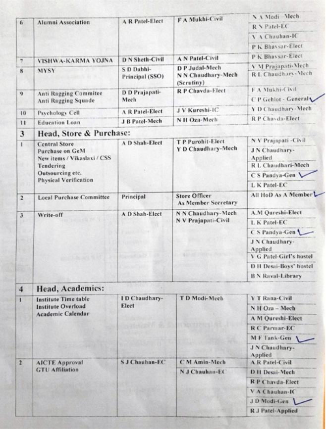

| Association                                               |                         |                                             | Modi Mech Chauhan-IC              |
|-----------------------------------------------------------|-------------------------|---------------------------------------------|-----------------------------------|
|                                                           |                         | 0 P Judal-Mech Nn Chuudhary-Mech (Scrutiny) |                                   |
|                                                           | Mech                    |                                             | General                           |
|                                                           |                         | VKureshi-IC                                 |                                   |
| Head, Store & Purchase:                                   | Head, Store & Purchase: | Head, Store & Purchase:                     | Head, Store & Purchase:           |
| Tendering Outsourcing etc. Physical Verilication          |                         |                                             |                                   |
|                                                           | Principal               | Store Officer As Member Secrctary           | Mcmber                            |
|                                                           | Dshah-Elcct             | Prajapati-Civil                             | hostel                            |
| Head , Academics:                                         | Head , Academics:       | Head , Academics:                           | Head , Academics:                 |
| Institute Time table Institute Overload Academic Calendar | D Chaudhary Elect       | TD                                          | Mech M Qureshi-Elect Chaudhary-   |
|                                                           |                         | CM Amin-Mech                                | RP Chasda-Flect R J Patel-Applieu |

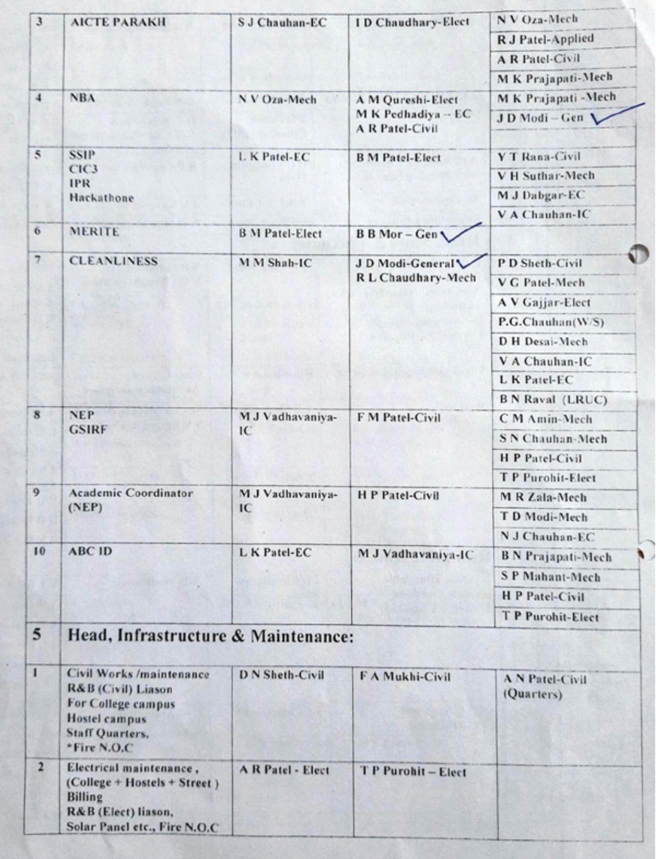

|    |                                     |                                     |                                     | MK Prajapati-Mlech                  |
|----|-------------------------------------|-------------------------------------|-------------------------------------|-------------------------------------|
|    |                                     |                                     | M k Pedhadiy"                       | M K Prajapati - Mech                |
|    | Hackathone                          |                                     |                                     | VA Chauhan-IC                       |
|    |                                     |                                     | Gen                                 |                                     |
|    |                                     |                                     | JD Modi-Gencral R L Chaudhary-Mech  | PD Sheth Civil                      |
|    | GSIRF                               | MJ Vadhavaniva- IC                  |                                     | TP Purohit-Fleci                    |
|    | cademic Coordinator (EP)            | Vadhavaniya- IC                     |                                     | M R Zala-Mech TD Modi-Mech          |
| 10 |                                     | LK Patel-EC                         | M J Vadhavaniya-IC                  | Mahant-Mech                         |
| 5  | Head, Infrastructure & Maintenance: | Head, Infrastructure & Maintenance: | Head, Infrastructure & Maintenance: | Head, Infrastructure & Maintenance: |
|    | lostel campus                       | D NSheth-Civil                      | FA Mukhi-Civil                      |                                     |
|    | (College Street Billing             |                                     | Elert                               |                                     |

| Mechanical Maintenance Firc Euinguisher                           | Mech                              | N N Chaudhary-Mech             |                            |
|-------------------------------------------------------------------|-----------------------------------|--------------------------------|----------------------------|
| Quarter Mllotment                                                 | R ) Patel-Applied                 |                                |                            |
|                                                                   | VI Chaudhary-Mech                 |                                |                            |
|                                                                   | Jv                                |                                |                            |
| Cogent                                                            | Jv                                |                                |                            |
|                                                                   | Jv                                | CM Amin Mech                   |                            |
|                                                                   | Jv                                | 10 Modi-General                |                            |
|                                                                   | Gencral                           | Coordinator 0f Training        |                            |
|                                                                   | M Kureshi-Eleci I} M Patel-Elcct  | Innovation                     |                            |
|                                                                   | M R Zala-Mech                     | Coordinator of ( limate Change |                            |
|                                                                   | Applicd                           | Coordinator of ( yber Club     |                            |
|                                                                   | M / Vadhavaniya- C                |                                |                            |
|                                                                   | R M Prajapati- Elect A Chauhan-IC |                                |                            |
|                                                                   | 5 P Joshlara-EC                   |                                |                            |
|                                                                   | Mech                              |                                |                            |
| Head, Industry & Outreach:                                        | Head, Industry & Outreach:        | Head, Industry & Outreach:     | Head, Industry & Outreach: |
| Training and Placement Cell, Placement Fair Industry Linkages Mou | D Chuudhary-Flect B Patel-Mech    |                                |                            |
| Training and Placement Cell, Placement Fair Industry Linkages Mou | D Chuudhary-Flect B Patel-Mech    | MJ                             |                            |
| Training and Placement Cell, Placement Fair Industry Linkages Mou | D Chuudhary-Flect B Patel-Mech    |                                |                            |
| Training and Placement Cell, Placement Fair Industry Linkages Mou | D Chuudhary-Flect B Patel-Mech    |                                |                            |

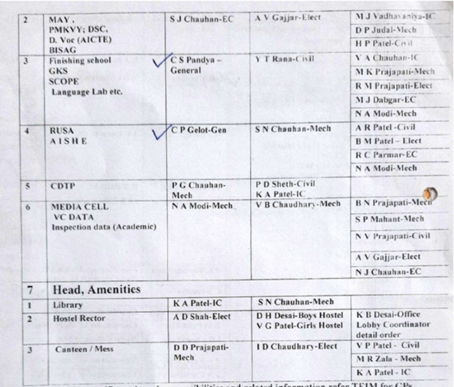

| Voc                       |                    |                                             |                              |
|---------------------------|--------------------|---------------------------------------------|------------------------------|
| Finishing school          | Gencral            |                                             | Chauhn-I( R M Prjapati-Elect |
| RUSA                      | CP Gclot-Gen       | Chauhan-Mech SN                             | R € ParmarEC                 |
|                           | Mech               |                                             |                              |
| Inspcchon data (Academic) |                    | VB Chaudhars-Mech                           |                              |
| Head, Amenitics           | Head, Amenitics    | Head, Amenitics                             | Head, Amenitics              |
| Library                   | KA Patel-IC        | S N Chauhan-Mech                            |                              |
| Hostel Rector             | AD Shah-Elcct      | 0 H Desai-Koy < Hostel 6 Patel-Cirls Hostel | detail ortler                |
| Canicen Mcss              | DD Prajapati- Mech | 1D Chaudhary-Elect                          | Civil Mech                   |

Note: For Portfolio specific responsibilities and related information refer TEIMfor GP~

Responsibilities of concerned conveners imembers:

- Colleeton dalalocumentsproofs
- Coorinate regular progres

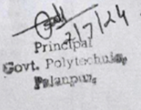

## Figure 9.3 Decentralization of work

## Brief scope of works:

## Human Resource (For faculty &amp; staff):

- Institute level overall human resource planning / administration including faculty / staff service level matters.
- Institute legal matters, RTI, educational quality assurance, Training need analysis, Annual performance Redressal.

## Student matters:

- Student section related activities/ services, scholarship matters.
- For smooth conduction of the examination and liaisons with University.
- Co-and-Extracurricular activities and responsible for various student amenities.
- Strong bonding with Alumni association.
- To promote NSS / NCC activities in the Institute.
- Various issues including Admission, Ragging, and student counselling.

## Academics:

- To ensure the quality of the academics at the Institute level.
- Coordination among various departments to ensure optimum utilization of the Institute level resources.
- First year academic and examination planning.
- To provide academic related data as per the needs of CTE and University.
- Taking care of the AICTE compliance, University affiliation, NBA requirements.
- To promote the innovation among the students.

## Store and Purchase:

- Prepare and propose new item requirements based on the Department demands and submit to Directorate of Technical Education office.
- To purchase and planning from non-government funds.
- To take care of write-off procedure, maintenance and calibration of various equipments based on the department request.
- To audit, ensure and keep record of utilization of the equipments.

## Infrastructure and Maintenance:

- Institute civil works and liaison with R and B civil/electrical related matters.
- Taking care of overall cleanliness and security of the Institute.
- To look into drinking water facility as well overall Institute ambiance.

## Industry and Outreach:

- To increase institute-Industry linkage.
- Media and newsletter coordination.
- To ensure the implementation of various GOI/GOG schemes effectively in Institute.
- Explore internship and training opportunities for the students.
- Skill development / Finishing school of the students

## Institute Amenities:

- To ensure optimal usage of Institute amenities, like hostel, canteen, centralized computing, library, language lab etc.

## B. Grievance redressal cell, Anti Ragging Committee and Prevention of Sexual Harassment Committee:

## Grievance Redressal Cell:

## Grievance Redressal system in Institute:

- Various cells are operative at Institute level for addressing the various grievances.
- Grievance Redress Mechanism has been institutionalized through portal.
- The administration mechanism for accountable, responsive and user-friendly approach has been established along with an efficient and effective grievance redress.

## Responsibilities of the Grievance Cell

- Addressing the grievance of the students and staff.
- Implementation of the corrective steps to be taken to address the grievances and other related matters.
- To deal with issues raised in anti-ragging committee, examination committee (Related to malpractice issues), Committee against sexual harassment, Women Empowerment committee etc.

## Grievance Redressal mechanism

- The students can apply on student portal.
- On receipt of specific complains/ grievance from a student, the Redressal cell meets, analyze the matter and corrective measures are taken wherever necessary.
- In case of urgent issue, one can meet concerned officer at any time.

## Anti-Ragging Committee:

- For prevention and prohibition of ragging in the Institute, an Anti-Ragging Committee as mandated by AICTE, has been formed by the institute.

## Institute level Anti-ragging committee

|   1 | Head of the institution                                                 | Mr. S. D. Dabhi, Principal                                                                                                        |
|-----|-------------------------------------------------------------------------|-----------------------------------------------------------------------------------------------------------------------------------|
|   2 | Representative of police administration (Police Sub Inspector)          | PSI, East Police Station, Palanpur                                                                                                |
|   3 | Local media member                                                      | BhagavatibenMaheshkumar Joshi ( /gjmI.03/gjVA/gjCA/gjmAA/gjRA/gjDHA/gjmAA/gjRA/gjmAA /gjSA/gjmAA/gjP_TA/gjmAA/gjmI.01/gjHA/gjKA ) |
|   4 | NGO member                                                              | Naisargik Trust, Mr. PrakashchandrChauhan                                                                                         |
|   5 | Representative of parents (member)                                      | Modi Girishbhai Amratlal                                                                                                          |
|   6 | Representative of students belonging to the fresher's category (member) | SmitKamrajbhaiChaudhary, 1 st Electrical                                                                                          |
|   7 | Representative of senior students (member)                              | 1. PanchalKrishBharatbhai, 3 rd Mechanical 2. GoswamiPrincegiriBharatgiri, 5 th Civil                                             |

|    |                                                      | 3. KhatikDipakShantilal, 5 th Electrical   |
|----|------------------------------------------------------|--------------------------------------------|
|  8 | Representative of non-teaching staff member          | Mr. I. P. Kharodiya, Storekeeper           |
|  9 | Representative of civil administration (Mamalatdar)  | Mamalatdar Palanpur City                   |
| 10 | Representative of faculty members (Member secretary) | Mr. D. D. Prajapati, I/C HoD Mechanical    |

## Women Development Cell:

- Women Development Cell is a mandated body as per the Rules and Regulations laid down by AICTE/UGC and MHRD.
- The WDC works with a sole aim of creating hassle-free environment for female students and staff of the campus community thereby enhancing their self-respect and self-confidence.

## 9.1.4 Delegation of financial powers (5)

## Delegation of Financial Powers:

Delegation of financial powers as per the State Government Rules explained as below:

- Controlling Officer - The Principal
- Drawing and Disbursing Officer (DDO) - The Principal
- All HODs are empowered to put the demand as per the requirement for the purchase of laboratory/utility equipment/books/furniture as follows:
- Item costing above Rs. 20000/-, Head of Department sends proposal to CTE purchase committee through Principal office. CTE Purchase committee consist of domain specific senior faculties from the various Govt. Institutions, headed by respective Joint Director, approves and purchases centrally as per the budget provision. (Through open tendering or Government e-Market (GeM).
- Item costing below Rs. 20000/-, purchase is made at the Institute level by concerned department with the help of store officer after due approval from Principal office.
- Consumables as per the requirement are purchased by the HOD with due approval of Head of the Institute.
- All section heads are empowered to scrutinize proposals made by relevant stakeholders and then purchase with due procedure.
- The institute has specific types of Non-Government funds such as Gymkhana fund, Social gathering fund. The disbursement of these funds is done by the Principal as per recommendation of relevant committee.

## 9.1.5 Transparency and availability of correct/unambiguous information in public domain (5)

Institute Marks

5.00

## Transparency and Availability of Information:

Information on policies, rules, processes and its dissemination are made available to the stakeholders on Institute/CTE/University website.

- All India Council for Technical Education (AICTE) EOA letters are available on Institute website.

- The information related to admission in professional courses in Gujarat State is available on ACPDC website (https://acpdc.gujarat.gov.in )

- All the necessary institute information regarding the students, staff and other co-curricular activities are available on the Institute website (https://gppalanpur.ac.in).

- The syllabus result and other relevant information for students and staff are available on the GTU website (http://www.gtu.ac.in).

- The vendor related information and the online bidding process are done through GeM portal for the procurement purpose.

- As a government institute, we are fully transparent in terms of policies, selection, rules, regulations and procedures.

- Details of policies, selection, rules, regulations and procedures are available on following websites.

Directorate of Technical Education, Gujarat (https://www.dte.gujarat.gov.in/).

Education Department, Government of Gujarat (http://gujarat-education.gov.in).

Gujarat Public Service Commission (http://gpsc.gujarat.gov.in).

- All the information pertaining to Right to Information Act is available on institute website (https://gppalanpur.ac.in/rti/).

Institute Marks

5.00

## Summary of current financial year's budget and actual expenditure incurred(for the institution exclusively)in the three previous financial years

Summary of current financial year's budget and actual expenditure incurred (for the institution exclusively) in the three previous financial years.

Total Income at Institute level: Total Income at Institute level:

## For (2025-26) (Rupees in Lakh)

Total Income

in (2025-26)

Rs/-

Actual expenses

in (2025-26)

Rs/-

Total No. of students in (2025-26)

692

Fee

Govt.

Grant(s)

Other Sources *

(specify)

Recurring including Salaries

Non- recurring

Special Projects / Any other, specify**

Expenses per student

Rs/-

1.57

9.00

1195.16

1.42

1152.07

0

8.19

1.66

* KCG: 142000

- ** KCG: 431050 CDTP: 69400 SSIP: 318826

## For (2024-25) (Rupees in Lakh)

Total Income

in (2024-25)

Rs/-

Actual expenses

in (2024-25)

Rs/-

Total No. of students in

(2024-25)

635

Fee

Govt.

Grant(s)

Other Sources *

(specify)

Recurring including Salaries

Non- recurring

Special Projects / Any other, specify**

Expenses per student

Rs/-

5.36

5.03

1483.50

5.11

1455.72

0

1.60

2.29

* KCG: 511000

- ** CDTP: 96500 SSIP: 63755

## For (2023-24) (Rupees in Lakh)

Total Income

in (2023-24)

Rs/-

Actual expenses

in (2023-24)

Rs/-

Total No. of students in (2023-24)

543

Fee

Govt.

Grant(s)

Other Sources *

(specify)

Recurring including Salaries

Non- recurring

Special Projects / Any other, specify**

Expenses per student

Rs/-

4.53

0

1348.67

* KCG: 511000 SSIP: 540000

- ** KCG: 511000 CDTP: 286000 RUSA: 26500 SSIP: 287013

## For (2022-23) (Rupees in Lakh)

Total Income in (2022-23)

Rs/-

Grant(s)

1335.49

Fee

Govt.

4.21

0

* KCG: 255500 SSIP: 450000

- ** KCG: 511000 CDTP: 156080 RUSA: 22930 SSIP: 137303.5

## Institute Utilization Table (Rupees in Lakh)

|        |                                                                                                     | 2022-23      | 2022-23        | 2023-24      | 2023-24        | 2024-25      | 2024-25        | 2025-26      | 2025-26        |
|--------|-----------------------------------------------------------------------------------------------------|--------------|----------------|--------------|----------------|--------------|----------------|--------------|----------------|
| Sr. No | Item                                                                                                | Budget (Rs.) | Expenses (Rs.) | Budget (Rs.) | Expenses (Rs.) | Budget (Rs.) | Expenses (Rs.) | Budget (Rs.) | Expenses (Rs.) |
| 1      | Teaching and non-teaching staff salary                                                              | 1241.41      | 1241.39        | 1233.00      | 1231.79        | 1292.00      | 1291.14        | 1090.00      | 1069.34        |
| 2      | Contingency (light bill / telephone bill, training & travel, books, building maintenance)           | 25.90        | 25.11          | 32.98        | 30.02          | 54.78        | 32.77          | 33.78        | 18.14          |
| 3      | Housekeeping & Contractual servants (security service & cleanliness), visiting faculty remuneration | 62.42        | 62.41          | 76.30        | 75.35          | 84.67        | 80.64          | 70.00        | 63.21          |
| 4      | Furniture, Laboratory equipments, consumables                                                       | 5.76         | 5.76           | 6.30         | 4.59           | 52.05        | 51.17          | 1.384        | 1.382          |
| 5      | Advance (festival & food grain) for class-4 staff                                                   | 0            | 0              | 0            | 0              | 0            | 0              | 0            | 0              |
| Total  | Total                                                                                               | 1335.49      | 1334.67        | 1348.58      | 1341.75        | 1483.50      | 1455.72        | 1195.16      | 1152.07        |

## Table 1 - CFYm1 2024-25

Total Income 1499.00

Actual expenditure(till…): 1457.30

Total No. Of Students

635

10.51

Other Sources *

(specify)

7.06

1343.54

Recurring including Salaries

1334.67

0

Actual expenses in (2022-23)

Rs/-

Non- recurring

0

11.11

Special Projects / Any other, specify**

8.27

2.49

Total No. of students in

(2022-23)

436

Expenses per student

Rs/-

3.08

|   Fee |   Govt. |   Grants |   Other sources(specify)  KCG |   Recurring including salaries |   Non Recurring |   Special Projects/Anyother, specify  CDTP, SSIP |   Expenditure per student |
|-------|---------|----------|-------------------------------|--------------------------------|-----------------|--------------------------------------------------|---------------------------|
|  5.36 |    5.03 |   1483.5 |                          5.11 |                         1455.7 |               0 |                                              1.6 |                      2.29 |

## Table 2 - CFYm2 2023-24

| Total Income  1363.71   |       |         |                                   | Actual expenditure(till…):  1354.65   |               |                                                           | Total No. Of Students 543   |
|-------------------------|-------|---------|-----------------------------------|---------------------------------------|---------------|-----------------------------------------------------------|-----------------------------|
| Fee                     | Govt. | Grants  | Other sources(specify)  KCG, SSIP | Recurring including salaries          | Non Recurring | Special Projects/Anyother, specify  KCG, CDTP, RUSA, SSIP | Expenditure per student     |
| 4.53                    | 0     | 1348.67 | 10.51                             | 1343.54                               | 0             | 11.11                                                     | 2.49                        |

## Table 3 - CFYm3 2022-23

| Total Income  1346.76   |       |         |                                   | Actual expenditure(till…):  1342.94   |               |                                                           | Total No. Of Students 436   |
|-------------------------|-------|---------|-----------------------------------|---------------------------------------|---------------|-----------------------------------------------------------|-----------------------------|
| Fee                     | Govt. | Grants  | Other sources(specify)  KCG, SSIP | Recurring including salaries          | Non Recurring | Special Projects/Anyother, specify  KCG, CDTP, RUSA, SSIP | Expenditure per student     |
| 4.21                    | 0     | 1335.49 | 7.06                              | 1334.67                               | 0             | 8.27                                                      | 3.08                        |

## 9.2.1 Adequacy of Budget Allocation (4)

## Institute Marks

4.00

Prior to each financial year, each department is preparing non-recurring budget requirement while account office is preparing the recurring budget requirement. The consolidated (recurring and non-recurring) budget requirement is prepared at institute level by the account office and submitted to Commissionerate of technical education for further approval of education department. Budget re-appropriation process is carried out at CTE level after 3rd quarter of the financial year to ensure the allocated budget is as per requirement for smooth functioning of the academic activities.

Details and justification of adequacy of Budget Allocation is as follows:

|   Sr. No | Year    |   Allocated Budget (Rs.) |   Expenditure (Rs.) | Remarks   |
|----------|---------|--------------------------|---------------------|-----------|
|        1 | 2025-26 |                  1195.16 |             1152.07 | Adequate  |
|        2 | 2024-25 |                  1483.5  |             1455.72 | Adequate  |
|        3 | 2023-24 |                  1348.58 |             1341.75 | Adequate  |
|        4 | 2022-23 |                  1335.49 |             1334.67 | Adequate  |

## 9.2.2 Utilization of allocated funds (4)

## Institute Marks

4.00

|   Sr. No | Year    |   Allocated Budget (Rs.) |   Expenditure (Rs.) |   Utilization (%) |
|----------|---------|--------------------------|---------------------|-------------------|
|        1 | 2025-26 |                  1195.16 |             1152.07 |             96.39 |
|        2 | 2024-25 |                  1483.5  |             1455.72 |             98.13 |

3

2023-24

1348.58

4

2022-23

1335.49

The allocated budget by the government to the institute for last three years was satisfactory and was utilized as per the details provided in Utilization Table.

## 9.2.3 Availability of the audited statements on the institute's website (2)

In the Government Institute audit is carried out by

1.  Our Head office i.e. Commissionerate of Technical Education, Gandhinagar, Gujarat State.
2.  Office of Accountant General, Rajkot.

Audited statements are available on Institute website.

## Last CTE and A G Audit details are as follows:

Visit Date

Audit

CTE Audit

24-06-2024 to 26-06-2024

Period covered

April-2023 to March-2024

A G Audit

06-12-2023 to 13-12-2023

December-2015 to October-2023

## 9.3 Department Specific Budget Allocation, Utilization (5)

EC Department EC Department

## For 2025-26 (Rupees in Lakh)

As per the total staff member of faculties recurring amount has been specified for department.

| Total Income: 114.79   | Total Income: 114.79   | Actual Expenditure: 114.79   | Actual Expenditure: 114.79   | Total No. of Students: 32   |
|------------------------|------------------------|------------------------------|------------------------------|-----------------------------|
| Non recurring          | Recurring (Salary)     | Non recurring                | Recurring (Salary)           | Expenditure per Student     |
| 0.09                   | 114.70                 | 0.09                         | 114.70                       | 3.58                        |

## Non -Recurring Table

Non -Recurring Expenditure

Computer/Equipment

Furniture

Amount(Rupees in Lakh)

0.09

0.00

1341.75

1334.67

99.49

99.94

Institute Marks

2.00

Total Marks 5.00

Library (books)

Total

0.00

0.09

## For 2024-25 (Rupees in Lakh)

As per the total staff member of faculties recurring amount has been specified for department.

| Total Income: 138.32   | Total Income: 138.32   | Actual Expenditure: 138.32   | Actual Expenditure: 138.32   | Total No. of Students: 31   |
|------------------------|------------------------|------------------------------|------------------------------|-----------------------------|
| Non recurring          | Recurring (Salary)     | Non recurring                | Recurring (Salary)           | Expenditure per Student     |
| 0.74                   | 137.58                 | 0.74                         | 137.58                       | 4.46                        |

## Non -Recurring Table

Non -Recurring

Expenditure

Computer/Equipment

Furniture

Library (books)

Total

Amount(Rupees in Lakh)

0.74

0.00

0.00

0.74

## For 2023-24 (Rupees in Lakh)

As per the total staff member of faculties recurring amount has been specified for department.

Total Income: 151.15

Recurring

(Salary)

149.88

Non recurring

1.27

## Non -Recurring Table

Non -Recurring

Expenditure

Computer/Equipment

Furniture

Library (books)

Total

For 2022-23 (Rupees in Lakh)

Amount(Rupees in Lakh)

1.27

0.00

0.00

1.27

Non recurring

1.27

Actual Expenditure: 151.15

Recurring

(Salary)

149.88

Total No. of Students: 23

Expenditure per Student

6.57

| Total Income: 133.76   | Total Income: 133.76   | Actual Expenditure: 133.76   | Actual Expenditure: 133.76   | Total No. of Students: 25   |
|------------------------|------------------------|------------------------------|------------------------------|-----------------------------|
| Non recurring          | Recurring (Salary)     | Non recurring                | Recurring (Salary)           | Expenditure per Student     |
| 3.76                   | 130.00                 | 3.76                         | 130.00                       | 5.35                        |

## Non -Recurring Table

| Non -Recurring Expenditure   |   Amount(Rupees in Lakh) |
|------------------------------|--------------------------|
| Computer/Equipment           |                     0    |
| Furniture                    |                     3.76 |
| Library (books)              |                     0    |
| Total                        |                     3.76 |

## Utilization Table (EC Department) (Rupees in Lakh)

|        |                                                     | 2022-23      | 2022-23        | 2023-24      | 2023-24        | 2024-25      | 2024-25        | 2025-26      | 2025-26        |
|--------|-----------------------------------------------------|--------------|----------------|--------------|----------------|--------------|----------------|--------------|----------------|
| Sr. No | Item                                                | Budget (Rs.) | Expenses (Rs.) | Budget (Rs.) | Expenses (Rs.) | Budget (Rs.) | Expenses (Rs.) | Budget (Rs.) | Expenses (Rs.) |
| 1      | Infrastructure Built-up                             | 0            | 0              | 0            | 0              | 0            | 0              | 0            | 0              |
| 2      | Library                                             | 0            | 0              | 0            | 0              | 0            | 0              | 0            | 0              |
| 3      | Laboratory Equipment                                | 0            | 0              | 1.27         | 1.27           | 0.74         | 0.74           | 0.09         | 0.09           |
| 4      | Software                                            | 0            | 0              | 0            | 0              | 0            | 0              | 0            | 0              |
| 5      | Furniture                                           | 3.76         | 3.76           | 0            | 0              | 0            | 0              | 0            | 0              |
| 6      | Laboratory Consumables                              | 0            | 0              | 0            | 0              | 0            | 0              | 0            | 0              |
| 7      | Maintenance and Spares                              | 0            | 0              | 0            | 0              | 0            | 0              | 0            | 0              |
| 8      | R&D                                                 | 0            | 0              | 0            | 0              | 0            | 0              | 0            | 0              |
| 9      | Teaching & Non-Teaching staff salary                | 130.00       | 130.00         | 149.88       | 149.88         | 137.58       | 137.58         | 114.70       | 114.70         |
| 10     | Miscellaneous expenses (Light, Rent, Public Advert) | 0            | 0              | 0            | 0              | 0            | 0              | 0            | 0              |
| 11     | Training & Travel                                   | 0.14         | 0.14           | 0.15         | 0.15           | 0.37         | 0.37           | 0.21         | 0.21           |

## Table 1 :: CFY 2025-26

Total Budget 114.79

Non Recurring

0.09

## Table 2 :: CFYm1 2024-25

Total Budget

138.32

Non Recurring

0.74

## Table 3 :: CFYm2 2023-24

Total Budget 151.15

Non Recurring

1.27

## Table 4 :: CFYm3 2022-23

Total Budget

133.76

Non Recurring

3.76

## 9.3.1 Adequacy of Budget Allocation (2)

115.00

Institute Marks

2.00

Prior to each financial year, each department is preparing non-recurring budget requirement while account office is preparing the recurring budget requirement. The consolidated (recurring and non-recurring) budget requirement is prepared at institute level by the account office and submitted to Commissionerate of technical education for further approval of education department. Budget re-appropriation process is carried out at CTE level after 3rd quarter of the financial year to ensure the allocated budget is as per requirement for smooth functioning of the academic activities.

## EC Department

Details and justification of adequacy of Budget Allocation is as follows:

|   Sr. No | Year    |   Allocated Budget (Rs.) |   Expenditure (Rs.) | Remarks   |
|----------|---------|--------------------------|---------------------|-----------|
|        1 | 2025-26 |                   115    |              115    | Adequate  |
|        2 | 2024-25 |                   138.69 |              138.69 | Adequate  |
|        3 | 2023-24 |                   151.3  |              151.3  | Adequate  |
|        4 | 2022-23 |                   133.9  |              133.9  | Adequate  |

Total

Recurring

114.70

Recurring

137.58

Recurring

149.88

Recurring

130.00

133.90

133.90

151.30

Actual expenditure (till…): 114.79

Non Recurring

0.09

Actual expenditure (till…): 138.32

Non Recurring

0.74

Actual expenditure (till…): 151.15

Non Recurring

1.27

Actual expenditure (till…): 133.76

Non Recurring

3.76

151.30

138.69

138.69

Recurring

114.70

Recurring

137.58

Recurring

149.88

Recurring

130.00

115.00

## 9.3.2 Utilization of allocated funds (3)

## Institute Marks

3.00

EC Department EC Department

|   Sr. No | Year    |   Allocated Budget (Rs.) |   Expenditure (Rs.) | Utilization (%)   |
|----------|---------|--------------------------|---------------------|-------------------|
|        1 | 2025-26 |                   115    |              115    | 100%              |
|        2 | 2024-25 |                   138.69 |              138.69 | 100%              |
|        3 | 2023-24 |                   151.3  |              151.3  | 100%              |
|        4 | 2022-23 |                   133.9  |              133.9  | 100%              |

## 9.4 Library and Internet (20)

## Total Marks 20.00

## (It is assumed that zero deficiency report was received by the institution, Effective availability and utilization to be demonstrated)

## 9.4.1 Quality of learning resources (hard/soft) (10)

## Library:

- The library acts as a key resource and learning center of the Institute. Library maintains records of books, Journals and Newsletters. The library issues the books to the students.
- The books are arranged in dedicated cupboards and labeled relevantly. The books related to technical courses are available in the library of all available programs.
- Books related to soft skills also available in the library. As a part of digitalized library, the Institute is having access of various E-books, Library blog and e-content.
- Details of the library and its services are mentioned in Table 9.4.1various types of Learning resources are available in the library.
- Library contains technical as well as soft skill related books. New titles added every year are specified in Table 9.4.2
- E-Journal details are mentioned in table 9.4.3

## Table 9.4.1 Details of the library and its services

| Library Service                              | Yes                 |
|----------------------------------------------|---------------------|
| The total area of the library (in Sq. meter) | 769.20 Square meter |
| Total seating capacity                       | 30                  |
| Number of Books Issued Per day(average)      | 2                   |
| Number of visitors per day                   | 20                  |

Institute Marks

10.00

| Number of library staff         | Total : 1 Library Officers-2                                      |
|---------------------------------|-------------------------------------------------------------------|
| Computerization for search      | Yes                                                               |
| Issue/return records maintained | Yes                                                               |
| Library Additional Services     | Internet, Library Blog, e-Journals, e-Books, new arrivals display |

## Table 9.4.2 Titles added year wise

| Year      |   Number of New Titles Added |   Number of Volumes Added | Amount utilized (Rs)   |
|-----------|------------------------------|---------------------------|------------------------|
| 2018-2019 |                          113 |                       227 | 86299/-                |
| 2019-2020 |                          189 |                      1049 | 63443/-                |
| 2020-2021 |                           20 |                       122 | 37699/-                |
| 2021-2022 |                          154 |                       170 | 27956/-                |
| 2022-2023 |                           10 |                        41 | 17275/-                |
| 2023-2024 |                           07 |                        43 | 26846/-                |
| 2024-2025 |                           38 |                       138 | 110635/-               |

## Table 9.4.3 List of e-Journals

| Program                | NAME OF JOURNAL                        | Publisher Name             |
|------------------------|----------------------------------------|----------------------------|
| E.C. Engineering       | Inventi Impact Antennas & Propagation  | Inventi Journals Pvt. Ltd. |
| IT & ICT Engineering   | Inventi Impact Artificial Intelligence | Inventi Journals Pvt. Ltd. |
| Civil Engineering      | Inventi Impact Civil Structures        | Inventi Journals Pvt. Ltd. |
| Electrical Engineering | Inventi Impact Electrical Engineering  | Inventi Journals Pvt. Ltd. |
| Mechanical Engineering | Inventi Impact Mechanical Engineering  | Inventi Journals Pvt. Ltd. |
| EC and ICT Engineering | Inventi Impact VLSI                    | Inventi Journals Pvt. Ltd. |

E-Journals (Free Open Access) link available on library blog

|   Sr. No. | Name of Journal                                                                                      |
|-----------|------------------------------------------------------------------------------------------------------|
|         1 | International Journal of Advances in Applied Sciences                                                |
|         2 | International Journal of Informatics and Communication Technology                                    |
|         3 | International Journal of Social Networking and Virtual Communities                                   |
|         4 | International Journal of Electronic and Telecommunications                                           |
|         5 | Advances in Electrical and Electronic Engineering                                                    |
|         6 | Journals of Civil and Environmental Engineering                                                      |
|         7 | Advances in Automobile Engineering                                                                   |
|         8 | Industrial Engineering And Management                                                                |
|         9 | International Journal of Advance Innovations, Thoughts and Ideas                                     |
|        10 | International Journal of Sensor Networks and Data Communications                                     |
|        11 | Irrigation & Drainage Systems Engineering                                                            |
|        12 | Journal of Applied Mechanical Engineering                                                            |
|        13 | Journal of information Technology and Software Engineering                                           |
|        14 | Journal of Telecommunication System and Management                                                   |
|        15 | Lovotics                                                                                             |
|        16 | Advances in Robotics and Automation                                                                  |
|        17 | Biosensors Journal                                                                                   |
|        18 | Global Journal of Technology and Optimization                                                        |
|        19 | Innovative energy and Research                                                                       |
|        20 | International Journal of Advancements in Technology                                                  |
|        21 | Journal of Aeronautics and Aerospace Engineering                                                     |
|        22 | Journal of Architectural Engineering Technology                                                      |
|        23 | Journal of Electrical and Electronics Systems                                                        |
|        24 | Journal of Steel Structures & Construction                                                           |
|        25 | Journal of Textile science and Engineering                                                           |
|        26 | International Journal of Advance Research in Electrical, Electronics and Instrumentation Engineering |
|        27 | International Journal of Innovative Research in Computer and Communication Engineering               |

|   28 | International Journal of Innovative Research in Science, engineering and Technology   |
|------|---------------------------------------------------------------------------------------|
|   29 | Journal of Global Research in Computer Sciences                                       |
|   30 | Research & Reviews : Journal of Engineering and Technology                            |
|   31 | Research & Reviews: Journal of Educational Studies                                    |
|   32 | Research & Reviews: Journal of Engineering and Technology                             |

Details of accessibility to Learning Resources center to students is mentioned in 9.4.4

## Table 9.4.4 Accessibility to students for self-learning activities

| Digital Library Service                            | Yes, (Students and Staff are registered at NDLI and ONOS)                                                                                                                                             |
|----------------------------------------------------|-------------------------------------------------------------------------------------------------------------------------------------------------------------------------------------------------------|
| Availability of Internet with computing facilities | Yes                                                                                                                                                                                                   |
| The library resources for diploma students         | Textbooks, General Reference Material, and Newspapers are available for reference.                                                                                                                    |
| User Orientation                                   | During orientation program of 1st year, students visit Library and are Oriented to utilize effective resources. Department co-ordinates are also guiding the students for efficient use of resources. |
| Library slot for students                          | Library slots are included in timetable                                                                                                                                                               |

## 9.4.2 Internet (10)

Institute Marks

10.00

Name of the Internet provider

Bharat Sanchar  Nigam Limited(BSNL) (Broadband), Bharat Sanchar  Nigam Limited(BSNL) (Fiber link for NAMO Wi-Fi)

Available band width

200 Mbps + 200 Mbps

WiFi availability

Total No. of Hotspots-2, No. of Access points-14, Bandwidth-200 Mbps

Internet access in labs, classrooms, library and offices of all Departments

Total 347 No. of Internet Nodes available

Security arrangements

Cyberoam CR500ia (Partially Working)

9.5 Institutional Contribution to the Community Development (5)

Total Marks 5.00

Institute Marks

5.00

- CDTP: Community Development through Polytechnics (CDTP) Scheme is funded by MHRD, New Delhi. Details of CDTP activities are as follows:

Community Wing project was started at Government Polytechnic, Palanpur in the year 1994. Then the scheme is revised as CDTP (Community development through Polytechnic) in 2008. The grant allocation for the project is being done by MHRD, New Delhi. It is govern by the coordinator (Principal) of the institute with the advice of advisory committee as well as executive committee.

For the implementation of CDTP Project, a survey of rural area is being done on primary basis to identify the skill based need of the society. On the basis of such survey, different short term training program is conducted to enhance employability as well as their self-employment. For the smooth operation of the scheme a community consultant is hired on contract base. In this scheme trainer given remuneration on hour basis and the trainees are trained without any charge means free of cost. Last three years, financial status &amp; progress data is as under.

## Table:-1 Financial status &amp; progress

Recurring grant

(Rs.)

2118914.50

2034580.00

Year

2022-23

2023-24

2024-25

2077132.00

Non-recurring grant

(Rs.)

593700.00

593700.00

593700.00

Total

(Rs.)

2712614.50

2628280.00

2670832.00

Expenditure

(Rs.)

156168.50

28600.00

96500.00

Nos. of trained person

109

17

76

Nos. of employment / self employment after training

49

05

37

## Table:-2 Skill Development Training Program for the year 2024-25

| Sr. No   | Course Name    |   No. of Trained person |
|----------|----------------|-------------------------|
| 1        | Dress making   |                      16 |
| 2        | Tailoring work |                      15 |
| 3        | Beauty parlor  |                      30 |
| 4        | Wiremen        |                      15 |
| Total    | Total          |                      76 |

- Driving Learning License Center: Driving Learning License Center of RTO is functioning at institute. Online test through RTO portal is carried out and on successful completion of the test, the applicant is issued a learning license.

Sr No

Year

Number of learning license issued

1

2

3

2023

2024

2025

1824

1576

942

Institute Marks

10.00

Government Polytechnic Palanpur Alumni Association (GPPLAA) was established in 2020 with aim to promote brotherhood among alumni, exchange ideas, spread knowledge, stimulate thinking and help Government Polytechnic Palanpur to provide excellence in the field of engineering. Alumni awareness programs and alumni meet is arranged in Institute.

## Objectives of the Alumni Association

- To strengthen the connection between the alumni of the institution and the current students of the institution, the officers/staff/teachers and to provide/make infrastructural facilities in the institution for the educational and all-round development of the institution and present students.
- To involve the alumni of the institution in various activities conducted by the institution for institutional and social development.
- To find employment opportunities for current and former students of the institution.
- To provide scholarships for educational assistance to needy students studying in the institution.
- To give achievement/encouragement awards to brilliant students studying in the institution.
- To provide reimbursement of registration fees and travel expenses as an incentive to the students and faculty members of the institution to participate in educational activities such as conferences, workshops, technical symposia held in the state and across India.
- To organize different types of activities for the welfare of the alumni of the institution.
- To organize the alumni of the institution and make them partners in achieving scientific and technological development of the nation and the world by organizing various activities.
- To organize institutional/political/national discussions and seminars to provide guidance on knowledge and career progression to the current and former students of the institution.
- To manage the funds collected in the organization in a systematic manner as per the requirement and to increase it by investing it partially/fully in appropriate places.
- To organize activities that encourages students to develop entrepreneurial qualities and contribute to technological innovation.
- To strengthen the institutions linkages with industrial organizations.
- To organize other pre-planned or incidental activities falling within the legal provisions similar to the above activities to fulfill the objectives of the organization.

## Alumni committee

|   Sr. No | Name           | Name of Department   | Designation   |
|----------|----------------|----------------------|---------------|
|        1 | Mr.A.R.Patel   | EE                   | Convener      |
|        2 | Mr.F.A.Mukhi   | CIVIL                | Co-Convener   |
|        3 | Mr.N.A.Modi    | ME                   | Member        |
|        4 | Dr.R.N.Patel   | EC                   | Member        |
|        5 | Mr.V.A.Chauhan | IC                   | Member        |
|        6 | Mr.P.K.Bhavsar | EE                   | Member        |

## Alumni Association Executive Committee

|   Sr. No | Name                             | Designation    |
|----------|----------------------------------|----------------|
|        1 | Mr.Sureshbhai Dalabhai Dabhi     | President      |
|        2 | Mr.Mohanbhai Danabhai Parmar     | Vice-President |
|        3 | Mr.AshokKumar Ramjibhai Patel    | Secretary      |
|        4 | Mr.Wasimkhan Sikandarkhan Sama   | Treasurer      |
|        5 | Mr.Ishwarbhai Dahyalal Chaudhary | Member         |
|        6 | Mr.Rohitkumar Manubhai Prajapati | Member         |
|        7 | Mr.Chauhan Gautamkumar Nanjibhai | Member         |

8

9

Mrs.Kusumben Chandrakant Rawal

Mr.Kirankumar Chhaganlal Desai

Member

Member

## Alumni meetings

|   Sr. No | Event            | Date       |   Participant |
|----------|------------------|------------|---------------|
|        1 | Alumni Meet-2022 | 26-06-2022 |            12 |
|        2 | Alumni Meet-2023 | 05-02-2023 |            62 |
|        3 | Alumni Meet-2024 | 19-11-2023 |            16 |
|        4 | Alumni Meet-2025 | 19-01-2025 |             6 |
|        5 | Alumni Meet-2026 | 11-01-2026 |            15 |

1. Basic and Discipline specific knowledge: Apply knowledge of basic mathematics, science and engineering fundamentals and engineering specialization to solve the engineering problems.
2. Problem analysis: Identify and analyse well-defined engineering problems using codified standard methods.
3. Design/ development of solutions : Design solutions for well-defined technical problems and assist with the design of systems components or processes to meet specified needs.
4. Engineering Tools, Experimentation and Testing: Apply modern engineering tools and appropriate technique to conduct standard tests and measurements.
5. Engineering practices for society, sustainability and environment: Apply appropriate technology in context of society, sustainability, environment and ethical practices.
6. Project Management: Use engineering management principles individually, as a team member or a leader to manage projects and effectively communicate about well-defined engineering activities.
7. Life-long learning: Ability to analyse individual needs and engage in updating in the context of technological changes.

## (B) PROGRAM SPECIFIC OUTCOME (PSOs)

| PSO1   | Demonstrate proficiency in installation and problem solving of electronics and communication equipment.                            |
|--------|------------------------------------------------------------------------------------------------------------------------------------|
| PSO2   | Proficiency in specialized software packages and coding useful for the analysis of electronics engineering systems and PCB design. |

## Annexure I

## (A) PROGRAM OUTCOME (POs)

Place : Palanpur Date : 17-02-2026 15:40:11

## Declaration

The head of the institution needs to make a declaration as per the format given The head of the institution needs to make a declaration as per the format given - -

- I undertake that, the institution is well aware about the provisions in the NBA's accreditation manual concerned for this application, rules, regulations, notifications and NBA expert visit guidelines inforce as on date and the institutes hall fully abide by them.
- It is submitted that information provided in this Self Assessment Report is factually correct.
- I understand and agree that an appropriate disciplinary action against the Institute willbe initiated by the NBA. In case, any false statement/information is observed during pre-visit, visit, postvisit and subsequent to grant of accreditation.

Head of the Institute Name : Shri S. D. Dabhi Designation : In-charge Principal Signature :

Seal of The Institution :

