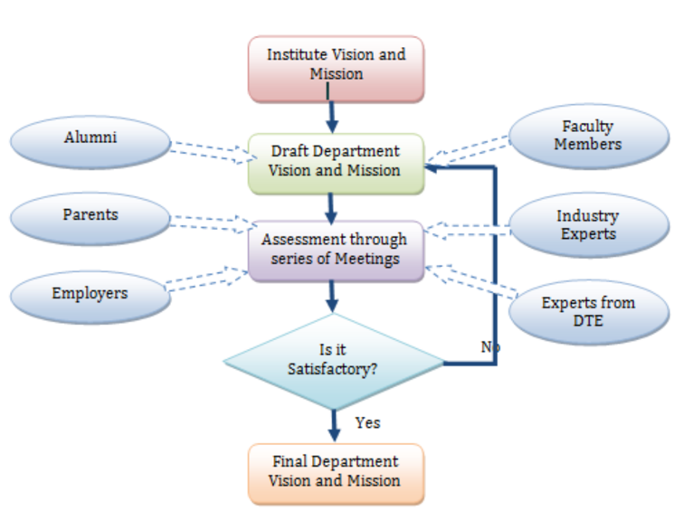
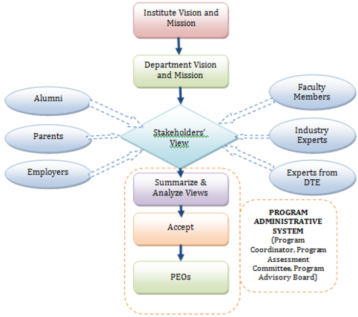
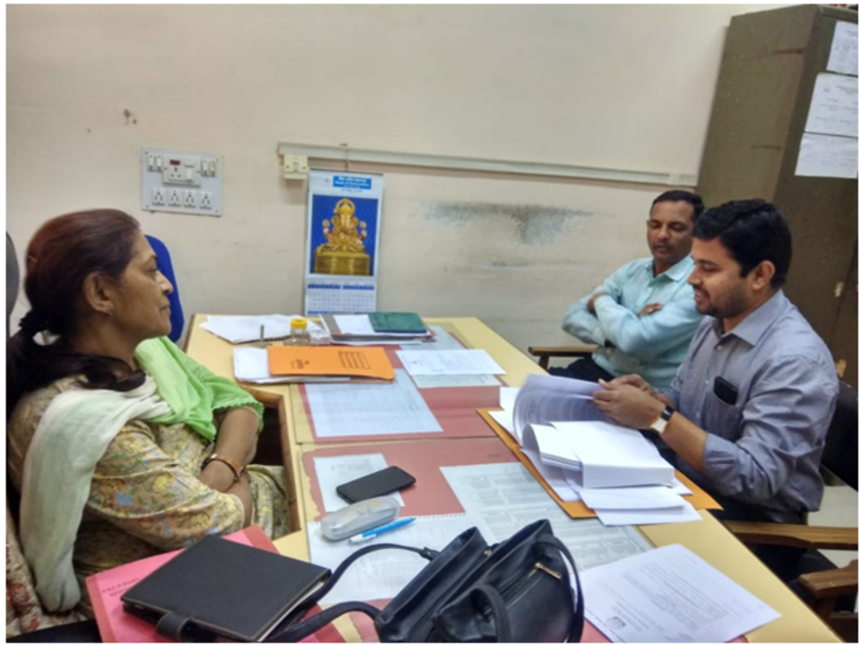
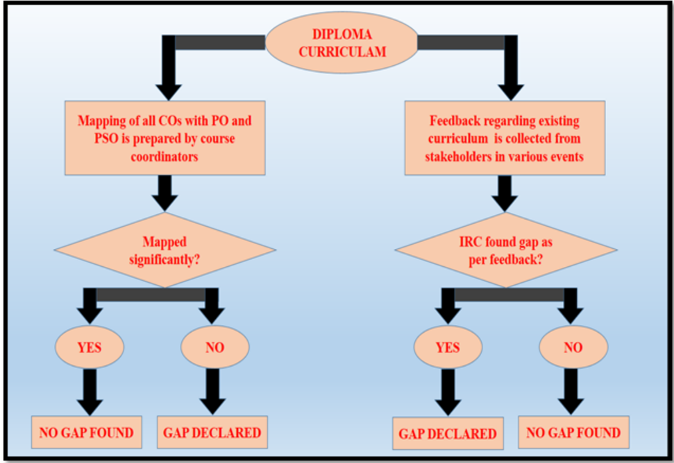
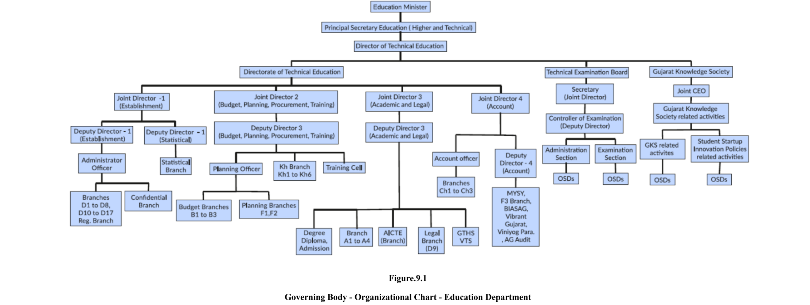
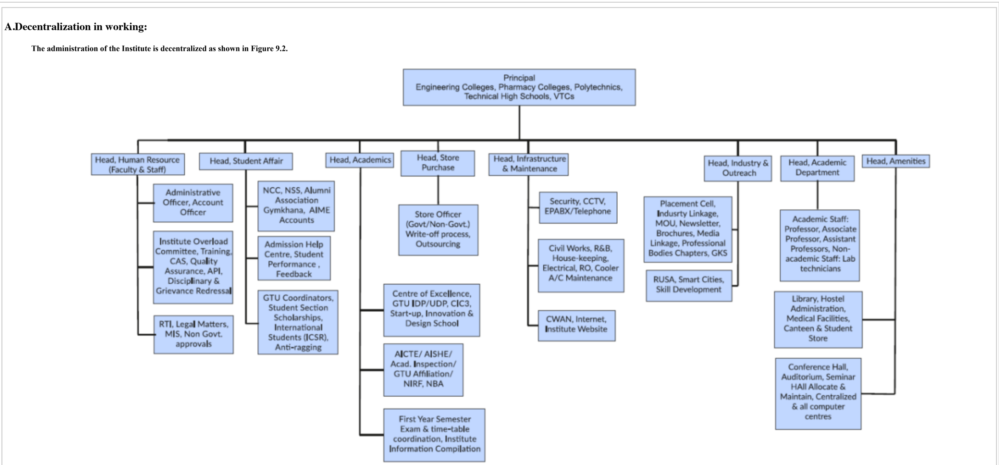
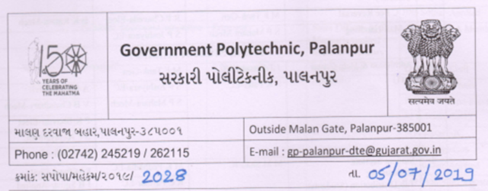
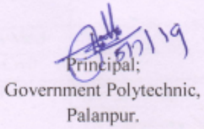
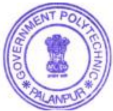

Government Polytechnic, Palanpur strives to impart,

- Industry oriented technical education.
- Excellent teaching and learning environment.
- Promote entrepreneurship activities.
- Continual growth in every sphere of life by developing core human values.

## Electrical Engineering

## PART B: Criteria Summary

| Critera No.   | Criteria                                                  |   Total Marks |   Institute Marks |
|---------------|-----------------------------------------------------------|---------------|-------------------|
| 1             | VISION, MISSION AND PROGRAM EDUCATIONAL OBJECTIVES        |            50 |             48    |
| 2             | PROGRAM CURRICULUM AND TEACHING - LEARNING PROCESSES      |           200 |            151    |
| 3             | COURSE OUTCOMES AND PROGRAM OUTCOMES                      |           100 |             92    |
| 4             | STUDENTS' PERFORMANCE                                     |           200 |             89.74 |
| 5             | FACULTY INFORMATION AND CONTRIBUTIONS                     |           150 |            127    |
| 6             | FACILITIES AND TECHNICAL SUPPORT                          |           100 |             86    |
| 7             | CONTINOUS IMPROVEMENT                                     |            75 |             60    |
| 8             | STUDENT SUPPORT SYSTEMS                                   |            50 |             42    |
| 9             | GOVERNANCE, INSTITUTIONAL SUPPORT AND FINANCIAL RESOURCES |            75 |             70    |
|               | Total                                                     |          1000 |            766    |

## Part B

1 1 VISION, MISSION AND PROGRAM EDUCATIONAL OBJECTIVES VISION, MISSION AND PROGRAM EDUCATIONAL OBJECTIVES (50) (50)

1.1 State the Vision and Mission of the Department and Institution (5)

To produce competent diploma engineers as per need of Industries and entrepreneurs with ethical values.

## Vision of the institute

Mission of the institute

## Total Marks Total Marks   48.00 48.00

## Total Marks 5.00

## Institute Marks

5.00

## Mission of the Department

| Mission No.   | Mission Statements                                                                                                                            | Mission Statements   |
|---------------|-----------------------------------------------------------------------------------------------------------------------------------------------|----------------------|
| M1            | • Prepare the students with strong fundamental concepts and problem solving skills to          enhance their employability in the industries. |                      |
| M2            | • To provide them a platform for developing new products that can help industry and society          as a whole.                              |                      |
| M3            | • Promote leadership and entrepreneurship skills in a student through various projects, co-          curriculum, extra-curriculum events.     |                      |
| M4            | • Imbibe social awareness and responsibility in students to serve the society and protect          environment.                               |                      |

## 1.2 State the Program Educational Objectives (PEOs) (5)

| PEO No.   | Program Educational Objectives Statements                                                           | Program Educational Objectives Statements   |
|-----------|-----------------------------------------------------------------------------------------------------|---------------------------------------------|
| PEO1      | Apply the knowledge of electrical engineering to solve problems of industrial and social relevance. |                                             |
| PEO2      | Pursue higher education and adopt to changing professional needs and engage in lifelong learning.   |                                             |
| PEO3      | Be professional with leadership qualities, ethics, moral values and work efficiently in a team.     |                                             |
| PEO4      | Fulfill social and economical commitments by entrepreneurial spirit.                                |                                             |

## Total Marks 5.00

## Institute Marks

5.00

## 1.3 Indicate where and how the Vision, Mission and PEOs are published and disseminated among stakeholders (10)

The Vision and Mission of the department are published and disseminated through following:

|   Sr. No. | Place of Dissemination                                                     |
|-----------|----------------------------------------------------------------------------|
|         1 | Institute Website                                                          |
|         2 | Display Board at the entrance of department and Corridors                  |
|         3 | Departmental Notice Board                                                  |
|         4 | Principal office, HOD Office, Departmental Laboratories and Faculty cabins |
|         5 | College Campus like Library Hall, college Canteen, Seminar Hall            |

The PEOs of the department are published and disseminated through:

|   Sr. No. | Place of Dissemination                                    |
|-----------|-----------------------------------------------------------|
|         1 | Institute Website                                         |
|         2 | Departmental Notice Board                                 |
|         3 | HOD Office, Departmental Laboratories, and Faculty cabins |

1.4 State the process for defining the Vission and Mission of the Department, and PEOs of the program (15)

## Total Marks 10.00

## Institute Marks

10.00

## Total Marks 15.00

## Institute Marks

15.00

With the active participation of HOD, Internal Quality Assessment Committee, faculty members and staff along with the continuous feedback from stakeholders, the Vision and Mission statement of the department was discussed and developed in various meetings in alignment with Vision and Mission of the Institute.

The Vision and Mission Statements of the department have been revised by considering the institutional Visionand Mission. The department has adopted a consultative approach to establish its vision and mission by involving the stakeholders of the institute such as faculty, students, staff, parents, alumni, industrial experts, and employers. While articulating the vision and mission statements for the department the future technology and societal requirements were also considered. The whole process is illustrated through the flow chart shown as under.

Fig 141 Process for Defining Vision and Mission of the Department

- Considering the institutional Vision and Mission as the base and incorporating global projections in the field of Electrical Engineering and allied fields, the Vision and Mission Statements of the department have been defined.
- The departmental faculty members met number of times to develop and cultivate a strong and meaningful Vision and Mission statements
- A series of discussions were conducted simultaneously among Program Assessment Committee (PAC), Alumni representatives, Industry experts and Training experts to finalize the Vision, Mission and PEOs.(fig. 1.4.3.)

PEOs are the characteristics of graduates of a program, which enable the students to become successful professionals in their field.

The department has documented measurable PEOs for its Diploma in Electrical Engineering program taking into account the program's constituencies and the mission of the institute.

The PEOs are established in the light of the vision and mission statements of the department. Our process for establishing and revising Program Educational Objectives (PEOs) is depicted in fig. 1.4.2

Vision and Mission of the Institute, Department and Graduate attributes recommended by NBA are taken as directorial factors in forming the PEOs. Stakeholder inputs are obtained through extensive surveys with follow-up telephone calls by the Department HOD and associated faculties.

fig 142 Frocess for Defining PEOs of the Department

fig. 1.4.3.. Meetings for Discussion about Vision-Mission &amp;PEOs with Stakeholders

## 1.5 Establish Consistency of PEOs with Mission of the Department (15)

## Total Marks 13.00

## Institute Marks

13.00

The PEOs ensure the accomplishments of the mission of the Department with special emphasis on technical competence of engineers, value addition sustainable solutions to engineering problems. For the mapping of PEOs and Mission, several meetings of the faculty members were conducted at department level. The feedback of the faculty members was taken into consideration and the mapping was finalized as below.

| PEO Statements                                                                                      |   M1 |   M2 |   M3 |   M4 |
|-----------------------------------------------------------------------------------------------------|------|------|------|------|
| Apply the knowledge of electrical engineering to solve problems of industrial and social relevance. |    3 |    3 |    1 |    1 |
| Pursue higher education and adopt to changing professional needs and engage in lifelong learning.   |    2 |    3 |    1 |    2 |
| Be professional with leadership qualities, ethics, moral values and work efficiently in a team.     |    2 |    2 |    3 |    3 |
| Fulfill social and economical commitments by entrepreneurial spirit.                                |    1 |    2 |    3 |    3 |

## 2 2 PROGRAM CURRICULUM AND TEACHING - LEARNING PROCESSES PROGRAM CURRICULUM AND TEACHING - LEARNING PROCESSES (200) (200)

## 2.1 Program Curriculum (40)

All POs and PSOs are being demonstrably met through Curriculum ? :

--Select--

2.1.1 State the process used to identify extent of compliance of the Board curriculum for attaining the Program Outcomes (POs) and Program Specific Outcomes (PSOs) as mentioned in AnnexureI. Also mention the identified curricular gaps, if any (25)

A. Process used to identify extent of compliance of curriculum for attaining POs &amp; PSOs (15)

## Total Marks Total Marks   151.00 151.00

## Total Marks 35.00

Institute Marks

23.00

Institute Marks

The Gujarat Technological University was established by Government of Gujarat vide Gujarat Act No. 20 of 2007. The introduced syllabus in 2007 was proposed to be revised to bridge the gap between institute and industry through a demand driven module in order to create employable engineers and professionals taking into account concept of outcome based curriculum as per NBA terminology.

In year 2012, in collaboration with NITTTR, the new curriculum was introduced after a series of workshops and training to senior faculties of diploma colleges across Gujarat.

The overall process for framing curriculum is summarized as under:

- As per AICTE model curriculum, the experts of program decided by Board of Studies, are invited and review the existing and model curriculum.
- Each faculty in-charge determines the level of their courses studying the elements of POs. Further, the Bloom's level of cognitive domain was adopted to determine the level of expected attainment.
- The University Curriculum is categorized as follows:

The introductory courses were termed as First year courses which are mostly covering Bloom's levels 1 &amp; 2, where students were exposed to the topic.

The competency courses were termed as Second and Third year courses which are up to covering Blooms levels 3, where students gain competency in the topic.

The program wise committee is formed and the following procedure is followed by each program:

- The university issue orders to 4 to 5 expert faculties from GTU affiliated government polytechnics of each course and 2 experts from NITTTR for overall review.
- The review meeting of existing curriculum is done on basis of feedbacks received from stakeholders like industries, alumni etc.
- As per review, the expectation from curriculum is finalized and process of framing is initiated.
- Year-wise framing and finalization of curriculum for each course is reviewed and approved in coordination with experts of NITTTR.
- The year-wise finalized curriculum for all the programs is displayed on GTU website for sharing the information of students.

## A. Process used to identify extent of compliance of curriculum for attaining POs &amp; PSOs (15)

Every course coordinator maps their course outcome with POs and PSOs considering content of course given by GTU. The mapping with justification is reviewed by department level committee. After successful verification and update of all the courses, the program compile data of mapping for all the courses. Hence, the program level mapping is generated and each course execution in classroom and laboratories leads towards the attainment of POs and PSOs.

The program level matrix is shown as under, which is common for all the years in consideration:

## GOVERNMENT POLYTECHNIC,PALANPUR.

## NAME OF DEPARTMENT :Electrical Engineering

|    | COURSE   |         | PO1   | PO2   | PO3   | PO4   | PO5   | PO6   | PO7   | PSO1   | PSO2   | PSO3   |
|----|----------|---------|-------|-------|-------|-------|-------|-------|-------|--------|--------|--------|
|  1 | C101     | 3300001 | 3     | 1     | -     | -     | -     | -     | 1     | 1      | -      | -      |
|  2 | C102     | 3300002 | 3     | -     | -     | -     | -     | 2     | 2     | 1      | 1      | 1      |
|  3 | C103     | 3300003 | 1     | 2     | 2     | 1     | 2     | 1     | 2     | 2      | 2      | 1      |
|  4 | C104     | 3300006 |       |       |       |       |       |       |       |        |        |        |
|  5 | C105     | 3300013 | 2     | 3     | 2     | 2     | 2     | 3     | 3     | 2      | 2      | 2      |

|   6 | C106   |   3300015 | 2   |   - | 1   | 1   | 2   | -   | 1   | -   | 1   | -   |
|-----|--------|-----------|-----|-----|-----|-----|-----|-----|-----|-----|-----|-----|
|   7 | C201   |   1990001 | -   |   1 | 1   | -   | 2   | 2   | 3   | 1   | -   | 1   |
|   8 | C202   |   3320002 | 3   |   1 | -   | -   | -   | -   | -   | 2   | -   | -   |
|   9 | C203   |   3320004 | 3   |   3 | 2   | 3   | 2   | 2   | 2   | -   | -   | -   |
|  10 | C204   |   3300005 | 2   |   2 | 1   | 1   | -   | -   | 1   | 2   | 1   | 1   |
|  11 | C205   |   3300007 | 2   |   2 | 1   | 1   | 1   | 2   | 1   | 2   | -   | -   |
|  12 | C206   |   3320903 | 3   |   2 | 2   | 2   | 2   | 2   | 2   | 3   | 2   | 2   |
|  13 | C207   |   3320902 | 3   |   3 | 2   | 3   | 3   | 2   | 2   | 2   | 2   | 2   |
|  14 | C301   |   3330901 | 3   |   3 |     | 2   |     | 3   |     | 3   | 3   |     |
|  15 | C302   |   3330902 | 3   |   2 | 2   | 3   | -   | -   | 2   | 3   | 2   | 2   |
|  16 | C303   |   3330903 | 3   |   3 | 2   | 2   | -   | 2   | 3   | 3   | 3   | -   |
|  17 | C304   |   3330904 | 3   |   3 | -   | 3   | -   | 3   | -   | 3   | 3   | 3   |
|  18 | C305   |   3330905 | 3   |   2 | 1   | 2   | 2   | -   | 2   | 2   | 2   | 2   |
|  19 | C401   |   3340901 | 3   |   3 |     | 3   | 2   | 3   | 2   | 3   | 3   | 3   |
|  20 | C402   |   3340902 | 3   |   2 | 2   | 2   | 1   | 2   | 2   | 3   | -   | 1   |
|  21 | C403   |   3340903 | 3   |   2 | 2   | 2   | 2   | -   | 2   | 2   | 2   | 2   |
|  22 | C404   |   3340904 | 2   |   3 | 1   | 2   | 2   | 2   | 2   | 2   | 2   | 3   |
|  23 | C405   |   3340905 | 2   |   2 | 2   | 2   | -   | 3   | 2   | 3   | 2   | 2   |
|  24 | C501   |   3350901 | 2   |   2 | 2   | 2   | 3   | -   | 2   | 2   | 2   | 3   |

|   25 | C502   |   3350902 |   3 |   2 | 3   | 2   |   3 |   3 |   3 |   2 |   - | 2   |
|------|--------|-----------|-----|-----|-----|-----|-----|-----|-----|-----|-----|-----|
|   26 | C503   |   3350903 |   3 |   2 | 3   | 2   |   3 |   3 |   3 |   3 |   2 | 2   |
|   27 | C504   |   3350904 |   3 |   3 | 3   | 3   |   3 |   2 |   3 |   3 |   2 | 3   |
|   28 | C505   |   3350907 |   3 |   2 | -   | -   |   2 |   2 |   2 |   3 |   2 | 2   |
|   29 | C506   |   3350908 |   3 |   3 | 2   | 3   |   3 |   3 |   3 |   3 |   2 | 3   |
|   30 | C601   |   3360901 |   3 |   3 | 2   | 3   |   2 |   2 |   2 |   3 |   2 | 2   |
|   31 | C602   |   3360902 |   2 |   2 | 2   | 3   |   2 |   2 |   2 |   2 |   2 |     |
|   32 | C603   |   3360907 |   2 |   2 | 3   | 2   |   2 |   2 |   2 |   2 |   3 | 2   |
|   33 | C604   |   3360908 |   3 |   3 | 3   | 3   |   3 |   2 |   3 |   3 |   3 | 2   |
|   34 | C605   |   3360909 |   3 |   3 | 3   | 3   |   3 |   3 |   3 |   3 |   3 | 3   |

In order to comply the curriculum various paths are followed as under:

1.  We are publishing schedule in academic calendar for CO-wise tests with suggested week for each semester. Course wise schedule for assignments and quizzes are given by respective course coordinators. Every course coordinator is preparing course file which includes details like academic calendar (schedule), time table of faculty and copy of laboratory timetable, syllabus of subject, lesson planning, class notes, software and multimedia details, assignments, evaluation reports, exam papers etc.
2.  Assignments are given based on reference books, e-learning resources and other web-based resources. Continuous assessment is done for all the components of teaching learning process
3. Laboratory plans are prepared for each laboratory course. This plan includes number of experiments as prescribed in the curriculum. Apart from this, additional experiments/case studies are included in the plan as per the needs. Laboratory manuals are prepared for all the experiments in the plan.
4. In laboratory assignment questions/problems/mini projects are given as needed
5. Continuous assessment system is also implemented for assessment of laboratory work. The assessment is done on the basis of timely submission of laboratory records, understanding of the experiment through oral questions and participation in performing the experiment.
4.  The top three meritorious students per semester are awarded appreciation letter and gift for every GTU examination at department level. The methodology is explained in 2.2.1 (C).
5.  The remedial classes if required are arranged for weak students. We are having mentoring system to help at individual levels. This mentoring is for overall development of the student. Each faculty member (counsellor) is assigned one batch for supervising their progress and reports throughout the duration of program.
6.  Professional guidance is provided by arranging lectures of eminent personalities from academics, industry and social workers. Lectures of faculty members from other institutions are also organized.

## B. List the curricular gaps for the attainment of POs &amp; PSOs (10)

Institute Marks 8.00

- Mapping of COs with POs and PSOs was done by course coordinator.
- At every technical event and meeting with stakeholders the review about existing diploma syllabus is collected.
- The department level committee reviews the feedback about existing curriculum to search out the content beyond the syllabus.
- We review not only the curriculum gap due to POs and PSOs mapping, but also identify the gap based on review feedback from stakeholders.
- Finally, the content beyond syllabus which is to be taught to make corrective actions for bridging the gap were thoroughly discussed and finalized.
- The content found as curriculum gap is sent to university.

e found gap in technological aspect in feedbacks and the gap was pertaining to the course 'Microprocessor and Controller Applications', which is offered in 5 th semester. The course does not cover recent advancement in controller technology and we tried to bridge the gap by offering two modules to 5 th semester students. The module is pertaining to Arduino controller, which is useful tool for students in using advanced controller and for execution in final year project also.

The flow chart shows the process for deciding curriculum gap is shown here:

| 2.1.2 Contents beyond the Syllabus (15)                                                     | Institute Marks   |
|---------------------------------------------------------------------------------------------|-------------------|
|                                                                                             | 12.00             |
| A. Steps taken to get identified gaps included in the curriculum (eg. letters to Board) (2) | Institute Marks   |
|                                                                                             | 1.00              |

- The curriculum gap was communicated to university through e-mail as well as through post by the department through head of institute.
- The gap and its justification were also communicated to the university and recommendation to consider the suggestion in upcoming curriculum revision was done by IRC (Internal Review Committee) under the guidance of head of department.

As AICTE has proposed the model curriculum in 2019, we are hopeful to have the new curriculum with reasonable consideration to our suggestion.

## B. Delivery details of content beyond syllabus (10)

Institute Marks

8.00

We found gap in technological aspect in feedbacks and the gap was pertaining to the course 3350904 -'Microprocessor and Controller Applications', which is offered in 5 th semester. The course does not cover recent advancement in controller technology and we tried to bridge the gap by offering two modules (1) Seminar on Arduino (2) Hands on practice on Arduino, to 5 th semester students. The module is pertaining to Arduino controller, which is useful tool for students in using advanced controller and for execution in final year project also.

We manage external experts on our field to bridge the gap in the benefit our students by inviting the enthusiastic experts, who are not willing to practice only due to financial reasons but also due to their interest in sharing their skills and knowledge among the students.

## C. Mapping of content beyond syllabus with the POs &amp; PSOs (3)

## Institute Marks

3.00

## 2019-20

|   S.No | Gap                 | Action Taken Date-Month-Year                                            | Resource Person with Designation      | Mode     |   No. of students present | Relevance to POs, PSOs   |
|--------|---------------------|-------------------------------------------------------------------------|---------------------------------------|----------|---------------------------|--------------------------|
|      1 | Advanced Controller | 'Introduction of Arduino and its Application as Controller.' 20/07/2019 | Hiten V. Patel  Automation Consultant | Seminar  |                       100 | PO-4,5,10 PSO-1,2        |
|      2 | Advanced Controller | 'Hands on Practice with Arduino Controller' 07/09/2019                  | Hiten V. Patel  Automation Consultant | Workshop |                       100 | PO-4,5,10 PSO-1,2        |

## 2018-19

|   S.No | Gap                 | Action Taken Date-Month-Year                                            | Resource Person with Designation   | Mode     |   No. of students present | Relevance to POs, PSOs   |
|--------|---------------------|-------------------------------------------------------------------------|------------------------------------|----------|---------------------------|--------------------------|
|      1 | Advanced Controller | 'Introduction of Arduino and its Application as Controller.' 07/07/2018 | Dhaval Tailor AP, ADIT             | Seminar  |                       100 | PO-4,5,10 PSO-1,2        |
|      2 | Advanced Controller | 'Hands on Practice with Arduino Controller' 15/09/2018                  | Dhaval Tailor AP, ADIT             | Workshop |                       100 | PO-4,5,10 PSO-1,2        |

## 2017-18

|   S.No | Gap                 | Action Taken Date-Month-Year                                            | Resource Person with Designation   | Mode     |   No. of students present | Relevance to POs, PSOs   |
|--------|---------------------|-------------------------------------------------------------------------|------------------------------------|----------|---------------------------|--------------------------|
|      1 | Advanced Controller | 'Introduction of Arduino and its Application as Controller.' 29/07/2017 | Dhaval Tailor AP, ADIT             | Seminar  |                       100 | PO-4,5,10 PSO-1,2        |
|      2 | Advanced Controller | 'Hands on Practice with Arduino Controller' 30/09/2017                  | Dhaval Tailor AP, ADIT             | Workshop |                       100 | PO-4,5,10 PSO-1,2        |

## 2.2 Teaching - Learning Process (160)

## 2.2.1 Describe Processes followed to ensure/improve quality of Teaching &amp; Learning based on following points (25)

## A. Adherence to Academic Calendar (3)

The adherence of academic calendar is the essential to organize the work culture of any institute. The adherence of academic calendar includes following attributes:

- Smooth functioning of teaching learning process
- Clarity of scheduled events on the campus
- Conducive environment of institute
- Avoidance possibility of clashing between different events
- Equal opportunity for students to justify co-curricular and extra-curricular activities
- Liberty to faculties to plan best possible execution of course

The department follows the academic calendar declared by GTU (www.gtu.ac.in) and by Institute. Academic calendar and timetable are given at the beginning of the semester to all the students. Based on institute academic calendar, the department publish own time table on department notice board. The lectures and the laboratories are conducted regularly as per the timetable. The examination and other events are conducted as per the academic calendar.

We also consider the importance of co-curricular and extra- curricular activity in overall growth of students. We include all such activities in our academic calendar and celebrates may of such events. Few activities are listed below:

- Days of national importance, like republic day, independence day
- Sports week
- Cultural events like Garba
- Events of social importance like cleanliness drive, seminar for tobacco awareness, women equality and law etc.

## B. Use of various instructional planning and delivery methods (3)

Institute Marks

2.00

For identifying various instructional planning and delivery methods, course coordinator along with course faculty prepare the detailed exercise of planning and delivery methods. Use of various instructional methods and pedagogical initiatives are opted by every faculty.

- Content delivery in classroom
- Power Point presentation
- Industrial Visits
- Presentation/Seminars
- Tutorials
- Case Study

## Total Marks 116.00

Institute Marks

21.00

Institute Marks

3.00

Efforts to keep the students engaged through various activities like seminars, NPTEL videos, inter-departmental visits, debate on technical topics, discussion on startups, mini projects, group discussion, career counseling, alumni interactions etc.

At the end of the semester, feedback from students (on an anonymous basis) is taken for each subject. The quality of the teaching skill, knowledge impartment, course delivery methods, class discipline and behavioral skills, specific for a faculty member are analyzed. This enables the department to make proactive changes for successive batches and functioning methods of the faculty.

To improve the quality of laboratory experience, use of modern tools for practical conduction, laboratory manuals are designed. The observation and analysis of the experiments are done by the students.

We give our special attention on our first year students as they are in transforming stage of life, from school to college. We have a strong team of science and humanities and also other programs, who are involved in first year teaching. We monitor progress and learning of students from the first year by assigning them class coordinators and mentors from the first year.

At the end of even term 2019-20, we faced COVID-19 and continued to use alternative instructional methodologies. Faculties used various tools of E-learning for students and developed the best quality of E-learning contents in benefit of students and continue uninterrupted teaching learning process. Some of mediums are listed below:

- Google Meet /Zoom for lecture conduction
- Simulations for practical
- YouTube videos
- Scanned copies of class notes
- Power point presentation for explaining contents.
- Animations

## C. Methodologies to support weak students and encourage bright students (4)

The weak and bright students are identified based on the policy of department. The identified weak students are engaged in various activities as under:

- The concern student will be counseled by concern subject teachers regarding how to improve the fundamentals of the particular subject.
- The concern subject teachers will address the difficulties faced by the weak student in concern subject.
- The concern subject teacher will give extra assignments to weak students for practice.
- The concern subject teacher will guide the weak student regarding how to write answers in the examination.
- If needed, the concern subject teacher will arrange extra lectures for the weak students.
- The concern subject teacher will monitor the progress of concern weak students.

The bright students are motivated as under:

- Top 3 bright students in each GTU exams are awarded with letter of appreciation and a little gift from department.
- The concern subject teacher will counsel the bright students regarding various career options available to him/her after completing the diploma.
- They are encouraged to participate in various competitions like Hackathon, and other state level events etc., showcase their innovative ideas and participate in Student Start-up and Innovation Policy (SSIP), publish patents under SSIP.

## D. Quality of classroom teaching (3)

Institute Marks

2.00

- Each lecture is scheduled for 1 hour.
- Each classroom is equipped with green board.
- A multimedia classroom is available at department.

Institute Marks 4.00

- Various teaching learning process like case study, group discussion, presentation etc. are used by faculty to achieve maximum involvement of students in the class as per the plan submitted to head.
- During the lecture faculty member take efforts to keep students engaged by reviewing and asking questions on previous lecture and interactively deliver the lecture considering the related course outcome related with the topic.
- At the end of the lecture students are encouraged to summarize, ask doubts from the content taught.
- The quality of classroom teaching of every teacher for every course is assessed by department head and senior faculties in terms of feedback from students with various parameters.
- The department head takes random round to the class and laboratories to verify the content as per lesson and lab plan, utilization of available resources, effectiveness of the teaching etc.
- Classroom teaching process is continuously monitored by higher authority through CCTV camera.
- Campus is having Wi-Fi facility.
- Absent students in performance lab are offered remedial laboratories on regular basis.
- Sample copies of continuously evaluated term work are available with respective faculties.
- The sample format for continuous assessment sheet is given below:

E. Conduct of experiments (3)

Institute Marks

3.00

- Experiments are conducted in each course planning as per the laboratory hours with minimum planning of 28 hours per lab.

- Laboratory manuals include introduction and step by step procedure to conduct the experiments on setup.

- Most of the laboratories are equipped with adequate equipment.

- Observations and calculations are recorded by students in laboratory files which are maintained and evaluated regularly.

F. Continuous Assessment in the laboratory (3)

Institute Marks

2.00

- The assessment is done on the basis of technical and non-technical aspects related to practical.

- Rubrics are developed by faculty members to assess the required parameters for the said course.

Sample rubric is given below for 3350904- Microprocessor and controller applications:

Government Polytechnic, Palanpur

Electrical Engineering Department

Rubrics for Practical Exam

33350904- Microprocessor &amp; Controller Applications

Excellent

(5)

Very Good (4)

Good

(3)

Poor

(2)

Very Poor

(1)

| Set-up and Equipment Care (1-5) (A)        | ¥ All equipment accurately placed ¥ All necessary supplies on hand ¥ Very neat and organized                                                                                              | ¥ All equipment accurately placed ¥ All necessary supplies on hand                                                                       | ¥ Set-up of equipment is generally accurate with 1 or 2 small details that need refinement ¥ All necessary supplies on hand                                                 | ¥ Set-up of equipment is generally workable with several details that need refinement ¥ Some necessary supplies have to be searched out   | ¥ Set-up of equipment is not accurate, help is required with several major details ¥ Many necessary supplies have to be searches out   |
|--------------------------------------------|-------------------------------------------------------------------------------------------------------------------------------------------------------------------------------------------|------------------------------------------------------------------------------------------------------------------------------------------|-----------------------------------------------------------------------------------------------------------------------------------------------------------------------------|-------------------------------------------------------------------------------------------------------------------------------------------|----------------------------------------------------------------------------------------------------------------------------------------|
| Follow the sequence of Procedure (1-5) (B) | ¥ Demonstrates very good knowledge of the lab procedures ¥ Willingly helps other students to follow procedures ¥ Thoroughly and carefully follows each step before moving on to next step | ¥ Demonstrates sound knowledge of lab procedures ¥ Will discuss with peers to solve problems in procedures ¥ Carefully follows each step | ¥ Demonstrates good knowledge of the lab procedures ¥ Will ask peers for help with problems in lab procedures ¥ Works to follow each step before moving on to the next step | ¥ Demonstrates general knowledge of lab procedures ¥ Requires help from teacher with some steps in procedures                             | ¥ Lacks the appropriate knowledge of the lab procedures ¥ Often requires help from the teacher to even complete basic procedures       |
| Result after execution (1-5) (C)           | ¥ Accuracy in  result ¥ Confidence of accuracy ¥ Less time to reach the result                                                                                                            | ¥Accuracy in  result ¥ Confidence of accuracy ¥Relatively more time to reach the result                                                  | ¥Accuracy in  result ¥ Reasonable confidence of accuracy ¥More time to reach the result                                                                                     | ¥Error in  result ¥ Less  confidence of accuracy ¥More time to reach the result                                                           | ¥No  result ¥ Less  confidence of accuracy ¥More time to reach the result                                                              |
| Viva (1-5) (D)                             | ¥Quick and right answer ¥ Answer in detail ¥Willingness to demonstrate knowledge ¥ Enthusiasm                                                                                             | ¥Quick and right answer ¥ Answer in detail ¥Willingness to demonstrate knowledge                                                         | ¥Right answer after recall and think ¥ Answer in short ¥Willingness to demonstrate knowledge                                                                                | ¥Right/wrong answer after guessing ¥ Answer in short                                                                                      | ¥Not Answering ¥ Escapism approach                                                                                                     |

Government Polytechnic, Palanpur

Electrical Engineering Department

## Semester:5

Subject Code:3340905

Name of Subject: Microprocessor &amp; Controller Application

Batch: E1

Enroll No.

Exp-01 Exp-02 Exp-03 Exp-04 Exp-05 Exp-06 Exp-07 Exp-08 Exp-09 Exp-10

TOTAL

166260309501

176260309006

## G. Student feedback of teaching learning process and action taken (6)

Institute Marks

5.00

Up to odd term of 2019-20, we took the feedback by hard copy format.The methodology followed is given under:

- The feedback activity was conducted once in a semester.

- Top 10 students are selected from ongoing sessions and gathered to fill the feedback form for teaching learning process.

- The students are called in break time and asked to fill the forms for their subjects.

- The students fill the forms in presence of head of department and senior faculties.

- The feedbacks collected and reviewed by head of department.

- The copy of feedback is given to respective faculty to keep as personal record and improvement, if required.

To improve the quality of teaching learning process, we have developed the mechanism for getting the honest feedback, which ensure the best possible outcome from the students and faculties.

We have framed policy to collect and review of feedback by online mode as under:

## The methodology for filling the feedback by students:

- The feedback link is shared to students of all the semester twice in the semester, which was shared in hard copy in earlier days.

- The first feedback is conducted in mid of semester and the second feedback before the end of semester.

- The department head is in-charge for whole process of feedback and sometimes accompanied by maximum two senior faculties of department throughout of procedure.

- The students are explained the importance of feedback process and encouraged to give honest and fearless feedback to improve the teaching learning procedure in the classroom.

- The feedback process is given time of maximum one week,

- The same procedure is done for second feedback session.

## The methodology for reviewing feedback and delivering the feedback to faculties

- The head of department has to review and analyze feedback.

- The secrecy of the feedback is to be maintained throughout the procedure.

- As the grading of each question is 1 to 5 the maximum average grading of the feedback will be 5.

- According to feedback, the faculties will be given the acknowledgment of feedback by head of department in personal.

- The constructive remarks from head to improve the quality of teaching learning process will be appreciated.
- For second feedback the first feedback is to be considered and the improvement is to be assessed, if the case required.

## Justification of effectiveness of the process

- The feedback questionnaires of AICTE include the overall holistic approach of teaching learning process and classroom and laboratory conduction.
- It also encompasses the following attributes:
- Introducing the latest technology by covering topic beyond syllabus
- Use of various teaching aids
- Motivation to students
- Practical demonstration
- Hands on training
- Personal mentoring
- After the second feedback, the quality is assured by comparing it with previous one.
- The whole process is reviewed by non-prejudiced team under direct supervision of head of department.

The feedbacks about lectures and practical sessions and appraising the concerned faculties using a rating pattern as per AICTE 7 CPC format as shown below:

Semester:

[Course (Code):

Name of faculty:

other suggestion to improve quality of teaching learning process: Any

| Sr. No.   | Description                                                                   | Poor Very   | Poor   | Good   | Good Very   | Excellent   |
|-----------|-------------------------------------------------------------------------------|-------------|--------|--------|-------------|-------------|
| Sr. No.   | Description                                                                   | 1           | 2      | 3      | 4           | 5           |
|           | Has the teacher covered entire Isyllabus as per prescribed] university board? |             |        |        |             |             |
|           | [Has the teacher covered topic beyond syllabus?                               |             |        |        |             |             |
| 3         | [Effectiveness of teacher in                                                  |             |        |        |             |             |
| 3         | [(a)Technical content course content                                          |             |        |        |             |             |
| 3         | @)Communication skills (c)Use of teaching aids                                |             |        |        |             |             |
|           | Pace on which contents were covered                                           |             |        |        |             |             |
|           | Motivation and inspiration for Istudents to learn                             |             |        |        |             |             |
|           | [Support for development of Istudents skill                                   |             |        |        |             |             |
|           | Practical demonstration                                                       |             |        |        |             |             |
|           | training [Clarity of expectation of Istudents                                 |             |        |        |             |             |
| 8         | [Feedback provided on [students'progress                                      |             |        |        |             |             |
| 9         | Willingness to offer help and advice to students                              |             |        |        |             |             |
| Iotal     | Iotal                                                                         |             |        |        |             |             |

## 2.2.2 Initiatives to improve the quality of semester tests and assignments (15)

## A. Process for Internal semester question paper setting and evaluation and effective process implementation (5)

## Setting of internal semester question paper:

- All course coordinator follow plan to conduct tests based on Course Outcome covered in the class.
- Two tests are conducted for covering of all COs for assessment.
- The internal semester question papers are drawn jointly by course-partners.
- The learning level, difficulty level etc. are assessed.

## Evaluation of internal semester question paper:

- Evaluation of internal paper is done by senor faculties and head.
- Approval from the head is taken by course coordinator for finalization.
- The paper is evaluated based on CO coverage, learning level, GTU scheme etc.

For internal assessment, CO-wise exam is conducted as per the declared schedule in academic calendar displayed by department on notice board. The CO-wise exam covers syllabus in parts, the end semester examination covers the complete syllabus.

## Effectiveness of the process implementation:

- The department level exam coordinator implements the whole process of exam under supervision of head.
- The secrecy is maintained throughout of the process.
- Question paper is evaluated in various aspects like CO coverage, learning level etc.
- The assessment is done based on model answer.
- Students are shown answer sheet after assessment.
- The final internal marks are submitted to GTU portal by course coordinator.
- Student may verify marks on GTU portal and represents, if any corrections needed.

## B. Question paper setting taking into account outcomes/learning levels (5)

Institute Marks

5.00

For CO-wise exam examination, the review for each question paper is done according to the following points.

- Type of exam (MCQ/Descriptive/Assignment)

- Bloom Taxonomy level addressed

- Learning Level

- Weightage of CO as per scheme

## Institute Marks

14.00

## Institute Marks

5.00

## C. COs coverage in class test / mid-term tests and assignments (5)

Institute Marks

4.00

to Head of Department. The plan covers following aspects in terms of CO coverage.

- Type of test for CO

- Number of written test for specified CO

- Number of assignment for specified CO

The submitted data is verified by Head of Department and implementation by course faculty is done as per the directions/ corrections of Head. Sample format of assessment plan is given below:

## CO &amp; Learning Level Execution Plan

Name of Subject:

Code of Subject:

Semester: 05

Type of Test

Marks CO No.

Target Learning Level (R/U/A)

Medium/Tool for test

Mid

30

R-U-A

Hard Copy

MCQ

20

R-U

Google Forms

Practical Exam-Internal

10

Psychomotor Domain

8085 Kit &amp; Validated Rubrics

File Work Internal

10

-

RUBRICS

Viva -Internal

10

R-U-A

RUBRICS

Viva External

20

R-U-A

RUBRICS

I undersigned assure that above assessment plan covers all the COs of my subject, with required learning level.

Subject

Coordinator

2.2.3 Quality of Experiments (15)

## Institute Marks

14.00

## A. Experimental methodologies (5)

Institute Marks

5.00

- For all the courses laboratory experiments are designed as per suggested experiment list in GTU curriculum with tagging of CO.

- Based on the hours allotted to laboratory, the course coordinator decides the number of experiments and request head to initiate the purchase procedure, if any equipment is needed for performing certain experiment.

- Batch size for laboratory session is decided as per guideline of Department of Technical Education.

- The laboratory sessions are conducted as per time table approved by Head and Principal.

## Methodology for conduction of experiment

- At the starting of the laboratory session, faculty introduces the title of the experiment to the students.

- The students are encouraged to relate the title of experiment with the topic covered in classroom.

- The related materials/animations/equipments/accessories are displayed to batch and session is made open for two-way interaction.

- For the performance laboratory session, the students are shown and explained connection diagram and students are directed to connect the circuit by their way without power supply.

- The faculty verifies the circuit connection and give modification, if required.

- The faculty explains the connections to the whole batch.

- The group of students is demonstrated the performance and readings are taken with involvement of students in operation of equipment.

- On completion of first group, the second group is called to perform same experiment in presence of faculty and team leader of previous group.

## Features of laboratory manual/ file

- Laboratory manuals for all course are available with the department in hard copy/ soft copy.

- The list of practical is prepared as per the suggested list of experiment by GTU in curriculum.

- Each title of the experiment is mapped with relevant CO of the course.

- Sample laboratory manual of each course with reading and observation is available to refer and verify the respective experiment data.

## B. Innovative experiments including industry attached practices, virtual labs (5)

Institute Marks

4.00

In many courses, we use some innovative practices to attach students more with new technologies. We use freeware software, demo version and virtual laboratory in courses. The sample is shown as under:

Sr.

Semester

Subject

Tool

Detail

|   No. |    |                                                  |             |                                               |
|-------|----|--------------------------------------------------|-------------|-----------------------------------------------|
|     1 |  4 | Computer Aided Electrical Drawing and Simulation | Logisim     | Experiment : Simulation of Logic Gates        |
|     2 |  5 | Microprocessor & Controller Applications         | Virtual Lab | Experiment: ladder diagram using Virtual lab. |

## C. Relevance to outcomes (5)

- For all the courses, laboratory experiments to be performed are mapped with CO.
- The assessment is done based on rubrics for performance based courses.
- Maximum COs are included in the list of experiments to be performed.
- The remaining COs are assessed through CO-wise examinations and other activities suggested by course coordinator.

Government Polytechnic, Palanpur Electrical Engineering Department

Name of Faculty :- Smt. M.B.Shah/Shri A.M.Qureshi

SEMESTER :5TH

SUB NAME: Microprocessor and Controller Application (3350904 )

|    | Details of Practical                                                                           | CO Mapped   | Justification                                                               |
|----|------------------------------------------------------------------------------------------------|-------------|-----------------------------------------------------------------------------|
|  1 | Control angular displacement using synchro.                                                    | 1           | Identification of type of control system & Real life control system example |
|  2 | Regulate speed of DC motor using tacho generator.                                              | 1,4         | Identification of type of control system & Real life control system example |
|  3 | Develop assembly language program for arithmetic addition of two numbers using µP 8085 kit.    | 2           | Interpret pin diagram and load & execution of program                       |
|  4 | Develop assembly language program for arithmetic subtraction of two numbers using µP 8085 kit. | 2           | interpret pin diagram and load & execution of program                       |
|  5 | Develop assembly language program for arithmetic                                               | 2           | interpret pin diagram and load & execution of                               |

Institute Marks

5.00

|                     | multiplication of two numbers using µP 8085 kit.          |                     | program                                                                   |
|---------------------|-----------------------------------------------------------|---------------------|---------------------------------------------------------------------------|
| 6                   | Interface seven segment LED display with µP 8085 kit.     | 2,4                 | interpret pin diagram and load & execution of program & Real life example |
| 7                   | Interface LCD with µP 8085 kit.                           | 2,4                 | interpret pin diagram and load & execution of program & Real life example |
| 8                   | Control speed of stepper motor using with µP 8085 kit.    | 2,4                 | interpret pin diagram and load & execution of program & Real life example |
| 9                   | Interface programmable device like 8255 with µP 8085 kit. | 2,4                 | interpret pin diagram and load & execution of program & Real life example |
| 10                  | Control traffic light system using µP 8085.               | 2,4                 | interpret pin diagram and load & execution of program & Real life example |
| 11                  | Ladder diagram using VLAB                                 | 5                   | Ladder diagram as programming language of PLC                             |
| SIGN OF FACULTY HOD | SIGN OF FACULTY HOD                                       | SIGN OF FACULTY HOD | SIGN OF FACULTY HOD                                                       |

## 2.2.4 Quality of Students Projects and Report Writing (35)

## A. Identification of projects and allocation methodology (3)

## Methodology of project identification:

- At diploma level project, we expect student to solve the 'Well defined engineering problem'.
- Students are encouraged and motivated to think about their project title from their very first year.
- The expectation from their final year project is explained the seminar organized at the end of semester-04.
- The whole process and guidelines are discussed with students and they are encouraged to search project title, based on real life problem or social and industrial relevance.
- Students are motivated to execute 'SHODHYATRA', and discuss their founding with faculties and identify their scope of project.
- Students are also encouraged to review their senior's project and identify the problem selected by them.

## Methodology of project allocation:

- On completion of semester-04, department level seminar is organized to guide the students about requirement and expectation from project.
- In the beginning of semester -05, the group formation for project is done by students in the limit of 4 to 6 students per group.
- Students are encouraged to collect industrial problem by doing 'SHODHYATRA'.

## Institute Marks

28.00

## Institute Marks

3.00

- Students are also encouraged to share their own idea bout project based on their observation and learning.
- The faculties and project coordinator review the project idea of students based on various parameters like,
- Originality of idea
- Compatibility of group
- Compatibility with diploma level
- Product or process type
- Social relevance
- Needed time span for completion
- Project coordinator display suggested list of titles with names of faculty for the remaining groups, whose title is not still finalized.
- The students approach faculty to discuss project title and hence title is finalized for the whole class.
- Depending upon the scope and size of the project problems, students can either choose to have two separate (or independent) problems as project I and project II or students can have a big complex problem, solving of which may need more time and efforts in the form of integrated or combined Project I and Project II. If the idea of project is approved by faculties and project coordinator, the project is allocated to the group.

The selected title is verified in terms of outcomes and quality of proposed project is verified by HOD and Coordinator. After deciding and allocation of title of project and faculty guide the review and other progress continues as per the schedule given by project coordinator.

## B. Types and relevance of the projects and their contribution towards attainment of POs and PSOs (5)

Institute Marks

5.00

The finalized project titles are verified in terms of relevance of project and their contribution towards attainment of POs and PSOs are verified and for the last three years all the successful projects and their details are given as under:

| Sr. No.   | Year   | Title of Project                                         | PO1 to PO7 Mapping   | PO1 to PO7 Mapping   | PO1 to PO7 Mapping   | PO1 to PO7 Mapping   | PO1 to PO7 Mapping   | PO1 to PO7 Mapping   | PO1 to PO7 Mapping   | PSO-1 to PSO-2 Mapping   | PSO-1 to PSO-2 Mapping   | PSO-1 to PSO-2 Mapping   |
|-----------|--------|----------------------------------------------------------|----------------------|----------------------|----------------------|----------------------|----------------------|----------------------|----------------------|--------------------------|--------------------------|--------------------------|
| Sr. No.   | Year   | Title of Project                                         | PO1                  | PO2                  | PO3                  | PO4                  | PO5                  | PO6                  | PO7                  | PSO1                     | PSO2                     | PSO3                     |
| 1         | 2017   | Prepaid energy meter using GSM technology.               | 2                    | 3                    | 3                    | 2                    |                      | 3                    | 2                    | 2                        | 3                        | 3                        |
| 2         | 2017   | Solar based inverter technology.                         | 2                    | 2                    | 2                    | 1                    | 3                    | 3                    | 2                    | 2                        | 3                        | 2                        |
| 3         | 2017   | Solar pump control for different time slot power saving. | 2                    | 3                    | 2                    | 2                    | 3                    | 3                    | 2                    | 2                        | 3                        |                          |
| 4         | 2017   | Under and over voltage                                   | 2                    | 2                    | 2                    | 3                    |                      | 3                    | 2                    | 1                        | 3                        | 2                        |

|    |      | protection.                                                                  |    |    |    |    |    |    |    |    |    |    |
|----|------|------------------------------------------------------------------------------|----|----|----|----|----|----|----|----|----|----|
|  5 | 2017 | Transformer overload and short circuit protection.                           |  2 |  3 |  2 |  2 |    |  3 |  2 |  1 |  3 |  2 |
|  6 | 2017 | DC power transmission system.                                                |  2 |  3 |  2 |  2 |    |  3 |  2 |  1 |  3 |  2 |
|  7 | 2017 | Power factor improvement using capacitor bank.                               |  3 |  3 |  2 |  3 |    |  3 |  2 |  2 |  3 |  2 |
|  8 | 2017 | A project model on optimum energy management system.                         |  2 |  2 |  3 |  3 | 2  |  3 |  2 |  2 |  3 |  3 |
|  9 | 2017 | Electric magnet levitation traction.                                         |  3 |  2 |  3 |  2 | 2  |  3 |  2 |  2 |  3 |  3 |
|  1 | 2018 | Transmission line modeling to understand Ferranti effect.                    |  3 |  3 |  2 |  2 |    |  3 |  2 |  2 |  3 |  3 |
|  2 | 2018 | Modern automated irrigation system.                                          |  2 |  2 |  2 |  2 | 2  |  3 |  2 |  2 |  3 |  3 |
|  3 | 2018 | Soft starter of Induction motor.                                             |  2 |  3 |  2 |  2 |    |  3 |  2 |  2 |  3 |  3 |
|  4 | 2018 | "Affordable fully automatic washing machine using solar photo voltaic panel. |  2 |  2 |  2 |  2 |    |  3 |  2 |  2 |  3 |  3 |

|   5 |   2018 | "Cyclo- converter using Thyristors"                                         |   2 |   2 |   3 |   1 |    |   3 |   2 |   2 |   3 |   3 |
|-----|--------|-----------------------------------------------------------------------------|-----|-----|-----|-----|----|-----|-----|-----|-----|-----|
|   6 |   2018 | "Generation of electricity on highway by vertical axis wind turbine (VAWT)" |   2 |   3 |   2 |   3 | 2  |   3 |   2 |   2 |   3 |   3 |
|   7 |   2018 | "Automatic motor coil winding machine"                                      |   2 |   2 |   2 |   2 |    |   3 |   2 |   2 |   3 |   3 |
|   1 |   2019 | Automation in water flow controller.                                        |   2 |   2 |   3 |   2 | 2  |   3 |   2 |   2 |   3 |   3 |
|   2 |   2019 | Intelligent Blind Stick using Arduino                                       |   1 |   3 |   2 |   3 | 2  |   3 |   2 |   2 |   3 |   3 |
|   3 |   2019 | Colour sorting machine using Raspberry Pi                                   |   1 |   2 |   3 |   3 |    |   3 |   2 |   2 |   3 |   3 |
|   4 |   2019 | Voltage control in transmission line using arduino                          |   1 |   2 |   2 |   2 |    |   3 |   2 |   2 |   3 |   3 |

## C. Process for monitoring and evaluation (5)

Institute Marks 5.00

Progress monitoring is done as per the following methodology:

- Each group is assigned one guide and co-guide.

- The department review progress of project twice in a semester.

- The internal guide and co-guide closely monitor progress of each and every step of project.

- The Project Progress Report (PPR) is maintained, which covers all the important aspects of projects for monitoring.

- The aspects monitored are listed below:

- Group formation and project title selection

- Literature review and problem definition
- Abstract
- Design block diagram, circuit diagram and budget
- Component purchase
- Component technical review/testing
- Assembling of components/ Hands on PCB and programming
- Verification of result
- Report writing
- Final presentation with model/project

## GOVERNMENT POLYTECHNIC PALANPUR

Diploma in Electrical Engineering

Project Progress Report (PPR) for one title

Project Title:

Guide Names:

Co-Guide Names:

Project Team Members Name &amp; Enrollment Number

1)

2)

3)

4)

5)

6)

Sr. No.Due Date

Activity

Date of

completion

Signature of

Guide

P/A

Remarks

1

Group Formation and Project

Title Selection

|   2 | Literature Review and problem definition               |
|-----|--------------------------------------------------------|
|   3 | Abstract                                               |
|   4 | Design of block diagram, circuit and budget            |
|   5 | Components Purchase                                    |
|   6 | Component Technical Review/Testing                     |
|   7 | Assembling of components /Hands on PCB and Programming |
|   8 | Verification of result                                 |
|   9 | Report Writing                                         |
|  10 | Final presentation with model/project.                 |

SIGN OF PROJECT CO-ORDINATOR

SIGN OF HOD

For evaluation of project, the quality check and direction of the working is evaluated by internal guide and co-guide. The progress review of the project is decided by the program and the schedule of number of reviews to be taken throughout the semester is displayed on notice-board.

At program level minimum two reviews are conducted and committee suggest more review, if more improvement is expected from project. At the end of semester, the external examiner executes the final review of the project.

D. Process to assess individual and team performance (5)

Institute Marks

5.00

- From the inception of the project, the students of each group are encouraged to divide tasks as per skills and interest.

- The guide and co-guide closely assess the efforts and contribution of each student of the group and time to time give their inputs to enrich their quality of contribution.

- Department level review is organized in front of all faculties, twice in the semester.
- The presentation is divided in each student, to identify the understanding and contribution.
- Each student as well as the whole group is assessed in terms of performance and contribution.
- The sample rubrics for final assessment is given here:

| Sr. No.   | Criteria                             | Proficient (90-100%)                                                                                                                                                                                                           | Adequate (75-89%)                                                                                                                                | Substandard (50-74%)                                                                                                                                    | Unacceptable (0-49%)                                                                                                                  |
|-----------|--------------------------------------|--------------------------------------------------------------------------------------------------------------------------------------------------------------------------------------------------------------------------------|--------------------------------------------------------------------------------------------------------------------------------------------------|---------------------------------------------------------------------------------------------------------------------------------------------------------|---------------------------------------------------------------------------------------------------------------------------------------|
| 1         | Technical Knowledge                  | Innovative idea, Relevance and usefulness to the field                                                                                                                                                                         | Less innovative, idea, Relevance and usefulness to the field to some extent                                                                      | Not innovative but related to the field                                                                                                                 | No innovativeness, relevance and usefulness of project                                                                                |
| 2         | Selection of proper tools/components | Use of modern engineering tools that are most applicable to problem at hand without external guidance and aware of advantages & limitations of all tools.                                                                      | Justifies the selection of tools selected by them use modern engineering tool that may be appropriate for the problem at hand with some guidance | Explain the reasoning behind the use of particular tool and uses modern engineering tools given to them to complete the task with significant guidance  | Cannot select the appropriate tool and cannot be able to use modern engineering tools even under the guidance                         |
| 3         | Team work                            | Treats team members respectfully and fosters a general climate of mutual respect Listens to other team members and encourages them to participate Gives and receives constructive feedback; helps others incorporate feedback. | Treats team members respectfully.  Listens to other team members. Gives and receives constructive feedback.                                      | Sometimes treats team members disrespectfully Occasionally listens to other team members Shows difficulties giving and receiving constructive feedback. | Treats team members disrespectfully. Rarely listens to other team members. Critical and defensive when giving and receiving feedback. |
|           | Presentation/                        | Objectively documents all data and information. Uses good skills and software for report                                                                                                                                       | Documents the relevant data and information .Uses data to calculate additional information. Shows awareness of all main interrelations and       | Documents some of the data and information Performs some basic calculations and plots data and results, but not able to                                 | Documentation of data and information is poor. Unable to use data to                                                                  |

4

5

Communication

Skill/Report Writing

Working writing. Uses graphics

that explain and reinforce text and

presentation. Refers to slides to make points

and engaged with audience.

Working perfectly,

Model/Prototype cost effective, energy

saving, safe.

## E. Quality of deliverable, working prototypes (12)

Institute Marks

8.00

The department has the display room for prototype and the all working prototypes and models are available with the department. The students of upcoming batch also review and search possibilities and idea for their new projects.

The possibility of deliverability is verified by the team carrying the project under the supervision of internal guide. The students are motivated to make deliverable prototypes and the guidance for making the deliverable projects is also given by SSIP team.

Few deliverable projects for community are listed as under. The listed projects have potential of conversion in deliverable projects, if proper financial supports and some more technical supports are offered.

| Sr. No.   | Year   | Title of Project                            | Students Name & Number    | Name of Guide                    | Deliverable Area   |
|-----------|--------|---------------------------------------------|---------------------------|----------------------------------|--------------------|
| 1         | 2017   | Prepared energy meter using GSM technology. | Ganvit Arun S.            | Mr.T.P. Purohit Mr.N.A. Sunasara | Field              |
| 1         | 2017   | Prepared energy meter using GSM technology. | Kotiya Satishkumar M.     | Mr.T.P. Purohit Mr.N.A. Sunasara | Field              |
| 1         | 2017   | Prepared energy meter using GSM technology. | Prajapati Hitendra S.     | Mr.T.P. Purohit Mr.N.A. Sunasara | Field              |
| 1         | 2017   | Prepared energy meter using GSM technology. | Suthar Mahendrakumar D.   | Mr.T.P. Purohit Mr.N.A. Sunasara | Field              |
|           |        |                                             | Patel Arpitkumar Vinubhai |                                  |                    |

trends in the data.

Plots all data against correct Variables.

Uses graphics that explain text and

presentation. Refers to slides to make

points and eye contact majority of

time

Working perfectly, energy saving, safe

but not cost effective,

see full picture. Uses

graphics that relate to text

and presentation.

Refers to slides to make

points and occasional eye

contact

Working not satisfactorily.

calculate additional information. Uses

graphics that rarely support text and

presentation. Reads all slides and no

eye contact

Not working at all

|   2 |   2017 | Power factor improvement using capacitor bank.             | Prajapati Pranay Bhanuprasad Patel Vaibhavkumar Sureshbhai                              | Mr.A.M. Qureshi Mr.N.A. Sunasara   | Laboratory Demonstration   |
|-----|--------|------------------------------------------------------------|-----------------------------------------------------------------------------------------|------------------------------------|----------------------------|
|   3 |   2018 | Modern automated irrigation system.                        | Karan H. Joshi Panchal Montu A. Chauhan Yogendra V. Prajapati Sanjay A. Rathod Vinay R. | Mr. B. M. Patel                    | Agriculture                |
|   4 |   2019 | Automation in Water Flow Controller                        | Barad Dipendrasinh M Mali Vipulkumar N Suthar Hardikkumar M                             | Mr. P. K. Bhavsar                  | Societal Welfare           |
|   5 |   2019 | Smart Camera Vision for visually impaired.                 | Daraji Govindbhai V. Parmar  Kalubhai D.                                                | Mr. B. M. Patel                    | Societal Welfare           |
|   6 |   2019 | Design and development of three phase full wave rectifier. | Deshmuk Hitendra Deshmukh Dharmesh Gelot Vasuba Patel Sunny                             | Mr. P. K. Bhavsar                  | Laboratory Demonstration   |

## F. Papers published /Awards/ Recognition received by projects at State/ National level (5)

The department encourage participation in state level events.

|   Sr. No. |   Year | Title of Project                            | Students Name & Number   | Name of Event (Paper/Conference/ Hackathon etc)   | Type of Event                   | Final Award or status                                                                          |
|-----------|--------|---------------------------------------------|--------------------------|---------------------------------------------------|---------------------------------|------------------------------------------------------------------------------------------------|
|         1 |   2019 | Prepared energy meter using GSM technology. | Barad Dipendrasinh M     | Gujarat Industrial Hackathon-2019                 | State level project competition | Semifinal round clear at Marwadi University Rajkot and go  for final round at PDPU Gandhinagar |
|         1 |   2019 | Prepared energy meter using GSM technology. | Daraji Govindbhai V.     | Gujarat Industrial Hackathon-2019                 | State level project competition | Semifinal round clear at Marwadi University Rajkot and go  for final round at PDPU Gandhinagar |
|         1 |   2019 | Prepared energy meter using GSM technology. | Limbachiya Jaykumar C.   | Gujarat Industrial Hackathon-2019                 | State level project competition | Semifinal round clear at Marwadi University Rajkot and go  for final round at PDPU Gandhinagar |
|         2 |   2019 | Modern automated irrigation System          | Karan H. Joshi           | Gujarat Industrial Hackathon-2019                 | State level project competition | Selected in Round-01                                                                           |
|         2 |   2019 | Modern automated irrigation System          | Panchal Montu A.         | Gujarat Industrial Hackathon-2019                 | State level project competition | Selected in Round-01                                                                           |
|         2 |   2019 | Modern automated irrigation System          | Chauhan Yogendra V.      | Gujarat Industrial Hackathon-2019                 | State level project competition | Selected in Round-01                                                                           |
|         2 |   2019 | Modern automated irrigation System          | Prajapati Sanjay A.      | Gujarat Industrial Hackathon-2019                 | State level project competition | Selected in Round-01                                                                           |
|         2 |   2019 | Modern automated irrigation System          | Rathod Vinay R.          | Gujarat Industrial Hackathon-2019                 | State level project competition | Selected in Round-01                                                                           |
|         2 |   2019 | Modern automated irrigation System          | Sunasara Yasir A.        | Gujarat Industrial Hackathon-2019                 | State level project competition | Selected in Round-01                                                                           |

Institute Marks

2.00

## A. Industry supported Labs (2)

We are trying to build relationship with industry in benefit of student and hopeful to have industry supported lab in some courses. Currently we do not have any industry supported lab.

## B. Delivery of appropriate Course work by Industry experts (5)

We invite industry experts on regular basis. We believe in incline our students towards industry by giving a chance of interaction with them. The summary for last three years is shown here:

|   Sr.No. | Date of Activity   | Event Name                                   | Conducted By:                 |
|----------|--------------------|----------------------------------------------|-------------------------------|
|        1 | 3/23/2017          | Nuclear Awareness Program                    | NPCIL,Bhavnagar               |
|        2 | 4/8/2017           | E C workshop                                 | Dynemic Consultancy  C/O GEDA |
|        3 | 16/04/2018         | Mobile Energy Conservation Demonstration Van | GEDA, Gandginagar             |
|        4 | 27/02/2018         | ' Renewable Energy' Demonstration Van        | GEDA, Gandginagar             |
|        5 | 06/04/2018         | Motivational speech                          | K A Modi, GETCO               |
|        6 | 04-10-2018         | Energy conservation                          | GEDA, Gandginagar             |
|        7 | 15/02/2019         | Mobile Renewable Energy Demonstration Van    | GEDA, Gandginagar             |

Institute Marks

0.00

Institute Marks

3.00

We believe in relate the classroom with industry. The tentative schedule of industrial visit is displayed in academic calendar subjected to change by convenience of industry. The summary for last three years is shown here:

| Sr.No.   | Year   | Date of visit   | Semester    | Company name             | Place                 |
|----------|--------|-----------------|-------------|--------------------------|-----------------------|
| 1        | 2017   | 7-Jan-17        | 6           | Arihant Pvt. Ltd.        | Palanpur              |
| 2        | 2017   | 12-Jan-17       | 6           | Vibrant Gujarat          | Gandhinagar           |
| 3        | 2017   | 18-Jan-17       | 4           | Duke Plasto Pvt. Ltd     | Palanpur              |
| 4        | 2017   | 4-Feb-17        | 4           | Patel Transformer        | Chandisar             |
| 5        | 2017   | 4-Feb-17        | 2           | Banas Dairy              | Palanpur              |
| 6        | 2017   | 4-Feb-17        | 6           | Patel Transformer        | Chandisar             |
| 7        | 2017   | 15-Feb-17       | 6           | SPRERI                   | V V Nagar             |
| 8        | 2017   | 15-Feb-17       | 6           | ADIT  College            | V V Nagar             |
| 9        | 2017   | 1-Mar-17        | 6           | Thermal power Plant      | Gandhinagar           |
| 10       | 2017   | 1-Mar-17        | 6           | IGTR,Vatva GIDC          | Ahmedabad             |
| 11       | 2017   | 18-Mar-17       | 6           | Getco 400 kv Sub station | Kansari               |
| 12       | 2017   | 9-Apr-17        | 3           | Solar Rooftop            | G P Palanpur          |
| 13       | 2017   | 16-Sep-17       | 3           | Solar Plant              | Charankha             |
| 14       | 2017   | 16-Sep-17       | 5           | 220 kv substation        | Palanpur              |
| 15       | 2018   | 28-Jan-18       | 6th and 4th | Science Fair             | Vidyamandir, Palanpur |
| 16       | 2018   | 13-Apr-18       | 6           | Sardar Sarovar           | Navagam, Kevadiya     |
|          |        |                 |             |                          | Colony                |

|   17 | 10-Jun-18   |   3 | Solar PV Plant Charankha   | Patan     |
|------|-------------|-----|----------------------------|-----------|
|   18 | 10-Jun-18   |   1 | Science city               | Ahmedabad |
|   19 | 8-Sep-18    |   5 | Adani ,Mundra              | Mundra    |
|   20 | 3-Mar-19    |   2 | Banas Dairy, Palanpur      | Palanpur  |
|   21 | 2-Aug-19    |   4 | Duke Pumps, Palanpur       | Palanpur  |
|   22 | 2-Aug-19    |   6 | Duke Pumps, Palanpur       | Palanpur  |
|   23 | 11-Sep-19   |   6 | 220kv Palanpur Substation  | Palanpur  |

## D. Industrial training/ internship (5)

We are planning for industrial training/ internship.

## E. Post training/ internship Assessment (10)

We are planning for industrial training/ internship.

F. Contribution to Community related projects/activities (5)

## Institute Marks

0.00

Institute Marks

0.00

Institute Marks

4.00

- Intelligent Blind Stick using Arduino
- Automotion in Water Flow Controller ( G.P. Palnpur )
- "Modern Automated Irrigation System"

The students of electrical department contributed in programming for project 'Smart Dustbin', which falls under mechanical department, which won cash price of Rs. 30000, by CM of state.

We also encourage our students to contribute in society by participating in extra-curricular activities and events of national interests. Some events are:

- Safai Abhiyan
- COVID Awareness
- SSIP Awareness in schools

2.2.6 Information Access Facilities and Student Centric Learning Initiatives (15)

A. Availability of facilities &amp; Effective Utilization; specify the facilities, materials and scope for self-learning, Webinars, NPTEL Podcast, MOOCs etc (10)

- We are having facility of department library to facilitate the student more learning under free time.
- The library is equipped with good quality of books from different publishers.
- As E- library, we are registered with IIT- Kahadagpur \_E library
- We have allocated PC for students in department library along with materials like animations, video, presentations and other study material with tagging of subject.
- We have almost more than 100 e-books in library and more 20 NPTEL courses in library PC.
- We are maintaining utilization register of department library.
- Every semester is allocated time-table for department library utilization. In free slots of time table students are also encouraged to spend time at department library.

B. Student Centric Learning Initiatives &amp; Effective Implementation (5)

Institute Marks

3.00

We are using various methods to raise the interest of students in the courses and technical events. We adapt various learning methods in classroom, like

- Case studies

- Animations

- Presentations

- Seminar

- Industrial Visit

- Digital library

- E-Books

- Registration of E-library

## Institute Marks

11.00

Institute Marks

8.00

2.2.7 New Initiatives for embedding Professional Skills (15)

Institute Marks

10.00

## A. Employability skill enhancement Initiatives and effective implementation (8)

## Institute Marks

5.00

Under finishing school project of Government, faculties are offered training in technical domain and the training to faculty is passed to students by the trained faculty of the department.

Sr. No.

Name of Training

Expert

% Student Participation

1

Control Panel Wiring

Shri B.M.Patel

14/17 (82.35%)

After successful completion of training, the students are assessed by examiner and the outcome is measured with all domains and PO consideration. The type of assessment tool utilized is decided as per the training module.

At department level, we are organizing many events to enrich employablity skills of our students.

All the successful students are awarded the certificate.

## B. Personality development related Initiatives &amp; effective implementation (7)

## Institute Marks

5.00

Under finishing school project of Government, faculties are offered training in non-technical domain and the expert train the students.

Sr. No.

Name of Training

Expert

% Student Participation

1

English speaking life skills and

employability skills

GKS nominated faculty

29/29 (100.00%)

After successful completion of training, the students are assessed by examiner and the outcome is measured with all domains and PO consideration. The type of assessment tool utilized is decided as per the training module. All the successful students are awarded the certificate.

In view of interview, students are polished by offering additional lecture at department level. Some events are listed as under:

Sr.No.

Year

Lecture Topic

Date

Time

No.Student Present

Conducted

By:

| 1              | Roof top system design and visit at solar roof top polytechnic                                                                                            | 1/7/2017   | 10 to 11:30    |   12 | B M Patel   |
|----------------|-----------------------------------------------------------------------------------------------------------------------------------------------------------|------------|----------------|------|-------------|
| 2              | Interview tips and biodata preparation                                                                                                                    | 1/7/2017   | 11:30 to 12:45 |   12 | B M Patel   |
| 3              | Generation transmission over view                                                                                                                         | 1/17/2017  | 10:15 to 11:30 |   39 | B M Patel   |
| 4              | Genco transco Disco                                                                                                                                       | 1/18/2017  | 10:15 to 11:30 |   13 | B M Patel   |
| 5              | Insulator sag Line model                                                                                                                                  | 1/19/2017  | 10:15 to 11:30 |   19 | B M Patel   |
| 6              | Transformer basic and objective question                                                                                                                  | 1/31/2017  | 10:15 to 11:30 |   23 | B M Patel   |
| 7              | Group Discussion and /gjSA/gjPHA/gjLLA/gjTA/gjmAA /gjNA/gjmU/gjAnusvara /gjRA/gjHA/gjS_YA /gjA/gjNA/gjmE /gjOne/gjZero /gjmI.01/gjNA/gjYA/gjMA/gjmAA/gjmE | 2/2/2017   | 10:15 to 11:30 |   12 | B M Patel   |
| 8              | Sub station and single line diagram                                                                                                                       | 2/3/2017   | 10:15 to 11:31 |    9 | B M Patel   |
| Jan- 2017 to 9 | Aptitude preparation 1                                                                                                                                    | 2/9/2017   | 10:15 to 11:32 |   12 | B M Patel   |
| 2017 10        | Aptitude preparation 2                                                                                                                                    | 2/14/2017  | 10:15 to 11:30 |    7 | B M Patel   |
| 11             | Generating station dagram, PLCC, HVAC And HVDC                                                                                                            | 3/7/2017   | 10:15 to 11:30 |   18 | B M Patel   |
| 12             | Generation transmission objective test and preparation                                                                                                    | 3/9/2017   | 10:15 to 11:30 |   22 | B M Patel   |
| 13             | Objective Generation from V K Mehta                                                                                                                       | 3/15/2017  | 1 to 2         |   29 | B M Patel   |

| 14                 | Objedtive of Supply system from V K Mehta                                                 | 3/17/2017   | 10:20 to 11:30   |   12 | B M Patel               |
|--------------------|-------------------------------------------------------------------------------------------|-------------|------------------|------|-------------------------|
| 15                 | Objective of transformer from V K Mehta                                                   | 3/31/2017   | 10:20 to 11:30   |   13 | B M Patel               |
| 16                 | Prapared Bio-Data for Torrent power                                                       | 4/4/2017    | 10:20 to 11:30   |   11 | B M Patel               |
| 17                 | Objective of Transformer and IM                                                           | 4/6/2017    | 10:20 to 11:30   |   11 | B M Patel               |
| 18                 | Quiz of Induction Motor                                                                   | 4/7/2017    | 10:20 to 11:30   |   16 | B M Patel               |
| 19                 | G D and Resume making                                                                     | 1/2/2018    | 4 to 5           |   14 | B M Patel               |
| 20                 | Induction Motor                                                                           | 02/02/2018  | 1:30 to 03:00    |   25 | B M Patel               |
| 21                 | Transmission and Distribution                                                             | 03/02/2018  | 10:30 to 12:30   |    7 | B M Patel               |
| 2018 to July-18 22 | How to search online subject relevant material , Objective question of Electrical Machine | 03/02/2018  | 1:30 to 04:00    |    7 | A M Quresi ,T P Purohit |
| 23                 | Interview tips and biodata preparation                                                    | 11/04/2018  | 11 to 12         |    9 | B M Patel               |
| 24                 | HR Interview Preparation 11/05/2018                                                       |             | 12 to 1          |    9 | B M Patel               |

2.2.8 Co-curricular &amp; Extra Curricular Activities (10)

The major co-curricular and extra-curricular activates are planned on commencement of semester and executed by in-charge officer of the activity. Last three year co-curricular activities are as under:

Date of

Institute Marks 8.00

| Sr.No.           | Year            | Seminar / workshop                                                | Event Name          | Conducted By:                          | Place                       |
|------------------|-----------------|-------------------------------------------------------------------|---------------------|----------------------------------------|-----------------------------|
| 1                |                 | 12/31/2016                                                        | MSME Seminar        | MSME Institute Ahmedabad               | Kanubhai Mehta Hall,Planpur |
| 2                | 2/27/2017       | EC Van                                                            |                     | Darshan institute C/O GEDA             | G P Palanpur                |
| 3                | 2017 2/28/2017  | CED Camp                                                          |                     | CED Gandhinagar By: Dharmendra pandya  | G P Palanpur                |
| 4                | 3/23/2017       | Nuclear Awarness Program                                          |                     | NPCIL,Bhavnagar                        | G P Palanpur                |
| 5                | 4/8/2017        | E C workshop                                                      | Dynemic Consultancy | C/O GEDA                               | G P Palanpur                |
| 6 7 8 9 10 11 12 | 05/01/2018      | SSIP  Introductory lecture                                        | GEC,Patan           |                                        | G P Palanpur                |
| 6 7 8 9 10 11 12 | 07/02/2018      | Entrepreneurship and Startup by SSIP support (SSIP)               |                     | SSIP Team GEC PATAN                    | GEC Patan                   |
| 6 7 8 9 10 11 12 | 16-17/02/2018   | Basics of Arduino                                                 |                     | EC DEpt. G P Palanpur                  | G P Palanpur                |
| 6 7 8 9 10 11 12 | 17/02/2018      | What is IPR                                                       |                     | SSIP Team GEC PATAN                    | GEC Patan                   |
| 6 7 8 9 10 11 12 | 27/02/2018      | ' Renewable Energy' Demonstration Van                             |                     | GEDA, Gandginagar                      | G P Palanpur                |
| 6 7 8 9 10 11 12 | 28/02/2018      | Innovation by people that can impact our lives in positive manner | Electrical          | B M Patel, Lect.                       | G P Palanpur                |
| 6 7 8 9 10 11 12 | 07/03/2018      | Entrepreneurship as a career option                               |                     | I D Chaudhary, Lect. Electrical Dept   | G P Palanpur                |
| 13               | 2018 09/03/2018 | Arduino for Automation                                            |                     | Hiten Patel,Degree Eng college student | G P Palanpur                |
| 14               | 13/03/2018      | participation in hackethon                                        | DTE Gujarat         |                                        | MArwadi Univarsity, Rajkot  |
| 15               | 06/04/2018      | Motivational speech                                               | K A Modi, GETCO     |                                        | G P Palanpur                |

| 16            | 16/04/2018    | Mobile Energy Conservation Demonstration Van                         | GEDA, Gandginagar       | G P Palanpur      |
|---------------|---------------|----------------------------------------------------------------------|-------------------------|-------------------|
| 17            | 10-09-2018    | Inogration of Industrial Hackathon 2018/ SIC 2018 Prize Distribution | Education Dept. Gujarat | GMDC Ground       |
| 18 10-09-2018 |               | Entrepreneurship  Awarness                                           | CED, Gandhinagar        | G P Palanpur      |
| 19            | 26/09/2018    | Smart Gujarat for New India Hackathon                                | SSIP Cell DTE           | Mahatma Mandir    |
| 20            | 04-10-2018    | Energy conservation                                                  | GEDA, Gandginagar       | G P Palanpur      |
| 21            | 1/3/2019      | Ideation and innovation                                              | Mr B M Patel            | G P Palanpur      |
| 22            | 10/10/2019    | Energy conservation awareness                                        | GEDA, Gandginagar       | G P Palanpur      |
| 23            | 15/02/2019    | Mobile Renewable Energy Demonstration Van                            | GEDA, Gandginagar       | G P Palanpur      |
| 24            | 19-20/02/2019 | HAckathon-2019                                                       | Education Dept.         | BVM, Marvadi Uni. |
| 2019 25       | 20-21/03/2019 | Hack-19 round 2                                                      | Education Dept.         | PDPU              |
| 26            | 20/03/2019    | How to select project and SSIP grant                                 | Mr B M Patel            | G P Palanpur      |
| 27            | 15/04/2019    | Technical event                                                      | Project presentation    | G P Palanpur      |
| 28            | 15/04/2019    | Technical event                                                      | Idea Presentation       | G P Palanpur      |
| 29            | 15/04/2019    | Technical event                                                      | Start up story          | G P Palanpur      |

Last three year extra curricular activities as as under:

| 1      | 21/6/2017   | International yoga day celebration             | CONDUCTED BY INSTITUTEGP PALANPUR   |
|--------|-------------|------------------------------------------------|-------------------------------------|
| 2      | Aug-17      | khel mahakumbh                                 | CONDUCTED BY INSTITUTEGP PALANPUR   |
| 3      | Aug-17      | Youth voters day celebration-2017              | CONDUCTED BY INSTITUTEGP PALANPUR   |
| 4      | 15/08/2017  | Celebration of independence day                | CONDUCTED BY INSTITUTEGP PALANPUR   |
| 2017 5 | Sep-17      | Cleanliness week celebration                   | CONDUCTED BY INSTITUTEGP PALANPUR   |
| 6      | 31/10/2017  | Celebration of sardar patel jyanti             | CONDUCTED BY INSTITUTEGP PALANPUR   |
| 7      | 11/12/2017  | Celebration of national education day          | CONDUCTED BY INSTITUTEGP PALANPUR   |
| 8      | 26/11/2017  | Celebration of national constitution day       | CONDUCTED BY INSTITUTEGP PALANPUR   |
| 1      | 25/1/2018   | youth voters day celebration-2017              | CONDUCTED BY INSTITUTEGP PALANPUR   |
| 2      | 26/1/2018   | Celebration of national republic day           | CONDUCTED BY INSTITUTEGP PALANPUR   |
| 3      | 5/2/2018    | Seminar on disaster management and fire safety | CONDUCTED BY INSTITUTEGP PALANPUR   |
| 4      | 27/2/2018   | Thalassemia test                               | RED CROSS Ahmedabad GP PALANPUR     |
| 5      | 7/3/2018    | Gujarat road safety cadre core(GRSCC)          | GRSCC Palanpur GP PALANPUR          |
| 6      | 13/4/2018   | Thalassemia test                               | RED CROSS Ahmedabad GP PALANPUR     |
| 2018 7 | 21/6/2018   | Yoga day                                       | CONDUCTED BY INSTITUTEGP PALANPUR   |
| 8      | 25/7/2018   | Celebration of tree plantation                 | CONDUCTED BY INSTITUTEGP PALANPUR   |
| 9      | 15/8/2018   | Celebration of independence day                | CONDUCTED BY INSTITUTEGP PALANPUR   |
| 10     | 3/9/2018    | Celebration of mahatma Gandhi jayanti          | CONDUCTED BY INSTITUTEGP PALANPUR   |

| 11   | 9/10/2018              | Celebration of navratri                                                   | CONDUCTED BY INSTITUTEGP PALANPUR   |
|------|------------------------|---------------------------------------------------------------------------|-------------------------------------|
| 12   | 30/10/2018             | Celebration of national unity day                                         | CONDUCTED BY INSTITUTEGP PALANPUR   |
| 13   | 26/11/2018             | Celebration of national constitution day                                  | CONDUCTED BY INSTITUTEGP PALANPUR   |
| 1    | 18/1/2019              | National tobacco control program                                          | CONDUCTED BY INSTITUTEGP PALANPUR   |
| 2    | 26/1/2019              | Celebration of national republic day                                      | CONDUCTED BY INSTITUTEGP PALANPUR   |
| 3    | 25/3/2019 to30/3/2019  | Celebration of sports week                                                | CONDUCTED BY INSTITUTEGP PALANPUR   |
| 4    | 30/3/2019              | Prize distribution of 1st,2nd number students in 1st,3rd and 5th GTU exam | CONDUCTED BY INSTITUTEGP PALANPUR   |
| 5    | 26/32019 to 11/4/2019  | Thalassemia camp                                                          | RED CROSS Ahmedabad GP PALANPUR     |
| 6    | 18/6/2019 to 21/6/2019 | International yoga day celebration                                        | CONDUCTED BY INSTITUTEGP PALANPUR   |
| 7    | 20/6/2019              | Poster presentation and essay writing according to international yoga day | CONDUCTED BY INSTITUTEGP PALANPUR   |
| 8    | 4/7/2019               | Celebration of tree plantation                                            | CONDUCTED BY INSTITUTEGP PALANPUR   |
| 9    | 11/7/2019              | Seminar on disaster training                                              | CONDUCTED BY INSTITUTEGP PALANPUR   |
| 10   | 19/7/2019              | Motivational expert lecture                                               | CONDUCTED BY INSTITUTEGP PALANPUR   |
| 11   | 2019 25/7/2019         | Expert lecture on housekeeping and waste control                          | CONDUCTED BY INSTITUTEGP PALANPUR   |
| 12   | 8/8/2019               | Tobacco free campus movement wall paint poster done                       | CONDUCTED BY INSTITUTEGP PALANPUR   |
|      |                        | Celebration of mahatma gandhi tyanti  26/8/2019:prayer and deep           |                                     |

|   13 | 26/8/2019 to 31/8/2019   | pragatya 27/8/2019:dramatic act,dance,bhajan 28/8/2019:cleanliness of campus  29/8/2019:speech on consciousness about thoughts of gandhiji 30/8/2019:exam on gandhi vichar chintan 31/8/2019:compitation on poster,rangoli,essay on gandhiji   | CONDUCTED BY INSTITUTEGP PALANPUR   |
|------|--------------------------|------------------------------------------------------------------------------------------------------------------------------------------------------------------------------------------------------------------------------------------------|-------------------------------------|
|   14 | 29/8/2019                | Live telecast according feet india movement                                                                                                                                                                                                    | CONDUCTED BY INSTITUTEGP PALANPUR   |
|   15 | 27/9/2019                | 125 janm jayanti celebration on swami vivekanand lecture in Chicago                                                                                                                                                                            | CONDUCTED BY INSTITUTEGP PALANPUR   |
|   16 | 2/10/2019                | Program of fit India pledging                                                                                                                                                                                                                  | CONDUCTED BY INSTITUTEGP PALANPUR   |
|   17 | 9/10/2019                | Navratri celebration                                                                                                                                                                                                                           | CONDUCTED BY INSTITUTEGP PALANPUR   |
|   18 | 26/11/2019               | celebration of national constitution day                                                                                                                                                                                                       | CONDUCTED BY INSTITUTEGP PALANPUR   |

## 3 3 COURSE OUTCOMES AND PROGRAM OUTCOMES COURSE OUTCOMES AND PROGRAM OUTCOMES (100) (100)

## Define the Program specific outcomes

PSO1

Maintain various types of electrical machines

PSO2

Maintain the operation of power systems

PSO3

Undertake the electrification of commercial and residential buildings

5.00

Note : Number of Outcomes for a Course is expected to be 3 to 5.

Course Name :

C1 05

Course Year :

2019-20

## Course Name

## Statements

C1

05.1

Describe computer hardware and software.

C1

05.2

Create documents using MS Word, Ms Excel and Ms PowerPoint.

C1

05.3

Apply basic formatting and data entry features for document preparation.

C1

05.4

Create simple static web page using basic HTML tags.

Course Name :

C1 13

Course Year :

2019-20

## Course Name

## Statements

C1

12.1

Use different physical quantities and components in Electrical Engineering.

C1

12.2

Solve simple electrical circuits using basic circuit laws.

C1

12.3

Solve simple electrical circuits using network theorems.

C1

12.4

Interpret the working of capacitor based on electrostatic principle.

C1

12.5

Interpret the working of inductor based on electromagnetic principle.

Course Name :

C2 03

Course Year :

2019-20

## Course Name

## Statements

C2

03.1

Interpret different terms related to fundamental of measurement and instrumentation.

C2

03.2

Use  potentiometer,megger and ACbridge for relevant application

C2

03.3

Use of electomechanical instruments for measurements of electrical quantities

C2

03.4

Calibrate ammeter,voltmeter,wattmerter and energymeter.

C2

03.5

Select required transducer for measurement procedure.

Course Name :

C2 06

Course Year :

2019-20

## Course Name

C2

06.1

C2

06.2

C2

06.3

C2 06.4

C2 06.5

## Course Name :

Course Name

C3

03.1

C3

C3

C3

03.2

03.3

03.4

C3

03.5

Maintain the working of three phase transformer.

Maintain the working of three phase induction motor.

Maintain the working of alternator.

Use synchronous motor for relevant application.

Use the relevant single phase induction motor for various applications.

C3 03

Utilize various power semiconductor devices for different applications.

Use SCR protection and commutation circuit for relevant application.

Test the performance of different chopper circuits.

Test the performance of inverters and cyclo-converter circuits.

Use various power electronic circuits in domestic and industrial applications.

## Course Name :

C3 10

Course Year :

2019-20

| Course Name   | Statements                                                                                 |
|---------------|--------------------------------------------------------------------------------------------|
| C3 10.1       | Prepare electrical plan, layout and testing report for building and complexes.             |
| C3 10.2       | Undertake electrification of commercial complexes and public buildings                     |
| C3 10.3       | Undertake electrification of commercial complexes and public buildings                     |
| C3 10.4       | Estimate cost of distribution system for  multistoried buildings and commercial complexes. |
| C3 10.5       | Install safety devices in  multistoried buildings and commercial complexes.                |

3.1.2 CO-PO matrices of courses selected in 3.1.1(Six matrices to be mentioned; one per semester from 1st to 6th semester) (5)

## 1 . course name : C205

Course

C105.1

C105.2

C105.3

2

2

-

PO1

PO2

PO3

PO4

PO5

PO6

-

3

-

-

-

-

-

2

-

Statements

Statements

-

-

-

Course Year :

-

2

3

-

-

-

PO7

2019-20

Institute Marks

5.00

| C105.4   |   - |   - |   2 |   - |   2 |   - |   2 |
|----------|-----|-----|-----|-----|-----|-----|-----|
| Average  |   2 |   3 |   2 |   2 |   2 | 2.5 |   2 |

## 2 . course name : C213

| Course   |   PO1 | PO2   | PO3   | PO4   | PO5   | PO6   | PO7   |
|----------|-------|-------|-------|-------|-------|-------|-------|
| C112.1   |   3   | -     | -     | 2     | -     | -     | 2     |
| C112.2   |   3   | 2     | 2     | 2     | -     | -     | 2     |
| C112.3   |   3   | 2     | 2     | 2     | -     | -     | 2     |
| C112.4   |   2   | -     | -     | -     | -     | -     | -     |
| C112.5   |   2   | -     | 3     | -     | -     | -     | -     |
| Average  |   2.6 | 2.00  | 2.00  | 2.00  | 0.00  | 0.00  | 2.00  |

## 3 . course name : C303

| Course   |   PO1 | PO2   | PO3   | PO4   | PO5   | PO6   |   PO7 |
|----------|-------|-------|-------|-------|-------|-------|-------|
| C203.1   |   3   | -     | -     | -     | -     | -     |     2 |
| C203.2   |   2   | -     | -     | 3     | -     | -     |     2 |
| C203.3   |   2   | -     | -     | 3     | -     | -     |     2 |
| C203.4   |   3   | 2     | -     | 3     | 2     | -     |     2 |
| C203.5   |   2   | 2     | 2     | 2     | 2     | -     |     2 |
| Average  |   2.4 | 2.00  | 2.00  | 2.75  | 2.00  | 0.00  |     2 |

## 4 . course name : C306

| Course   |   PO1 | PO2   | PO3   |   PO4 | PO5   | PO6   | PO7   |
|----------|-------|-------|-------|-------|-------|-------|-------|
| C206.1   |     3 | 2     | 2     |   1   | 2     | -     | 2     |
| C206.2   |     3 | 2     | 2     |   2   | 2     | -     | 2     |
| C206.3   |     3 | 2     | -     |   2   | 2     | -     | 2     |
| C206.4   |     3 | -     | -     |   1   | -     | -     | -     |
| C206.5   |     3 | -     | 1     |   1   | 2     | -     | 2     |
| Average  |     3 | 2.00  | 1.66  |   1.4 | 2.00  | 0.00  | 2.00  |

## 5 . course name : C403

| Course   |   PO1 | PO2   | PO3   |   PO4 | PO5   | PO6   |   PO7 |
|----------|-------|-------|-------|-------|-------|-------|-------|
| C303.1   |     3 | -     |       |     2 | -     | -     |     2 |

| C303.2   |   2 | -    | -    |   2 | -    | -    |   2 |
|----------|-----|------|------|-----|------|------|-----|
| C303.3   | 3   | -    | -    | 2   | -    | -    |   2 |
| C303.4   | 3   | -    | -    | 3   | -    | -    |   2 |
| C303.5   | 3   | -    | -    | 2   | 2    | -    |   2 |
| Average  | 2.8 | 0.00 | 0.00 | 2.2 | 2.00 | 0.00 |   2 |

## 6 . course name : C410

| Course   |   PO1 | PO2   | PO3   | PO4   |   PO5 | PO6   | PO7   |
|----------|-------|-------|-------|-------|-------|-------|-------|
| C310.1   |   3   | -     | 3     | 2     |   2   | 2     | 2     |
| C310.2   |   2   | -     | -     | 2     |   2   | -     | 2     |
| C310.3   |   2   | -     | 2     | -     |   3   | 2     | -     |
| C310.4   |   2   | -     | 2     | -     |   3   | 2     | -     |
| C310.5   |   2   | -     | -     | 2     |   3   | -     | 2     |
| Average  |   2.2 | 0.00  | 2.33  | 2.00  |   2.6 | 2.00  | 2.00  |

## 1 . Course Name : C205

| Course   | PSO1   | PSO2   | PSO3   |
|----------|--------|--------|--------|
| C105.1   | -      | 1      | -      |
| C105.2   | 2      | -      | -      |
| C105.3   | 2      | -      | -      |
| C105.4   | -      | -      | -      |
| Average  | 2.00   | 1.00   | 0.00   |

## 2 . Course Name : C213

| Course   | PSO1   | PSO2   | PSO3   |
|----------|--------|--------|--------|
| C112.1   | -      | -      | -      |
| C112.2   | -      | -      | -      |
| C112.3   | -      | -      | -      |
| C112.4   | -      | -      | -      |
| C112.5   | -      | -      | -      |
| Average  | 0.00   | 0.00   | 0.00   |

## 3 . Course Name : C303

| Course   | PSO1   | PSO2   | PSO3   |
|----------|--------|--------|--------|
| C203.1   | -      | -      | -      |
| C203.2   | -      | -      | 2      |
| C203.3   | -      | -      | -      |
| C203.4   | -      | -      | -      |
| C203.5   | -      | -      | -      |
| Average  | 0.00   | 0.00   | 2.00   |

## 4 . Course Name : C306

| Course   |   PSO1 |   PSO2 | PSO3   |
|----------|--------|--------|--------|
| C206.1   |      1 |      1 | -      |
| C206.2   |      1 |      1 | -      |
| C206.3   |      1 |      1 | -      |
| C206.4   |      1 |      1 | -      |
| C206.5   |      1 |      1 | -      |
| Average  |      1 |      1 | 0.00   |

## 5 . Course Name : C403

| Course   | PSO1   | PSO2   | PSO3   |
|----------|--------|--------|--------|
| C303.1   | 2      | -      | -      |
| C303.2   | 2      | -      | -      |
| C303.3   | -      | -      | -      |
| C303.4   | -      | 2      | -      |
| C303.5   | 2      | -      | 2      |
| Average  | 2.00   | 2.00   | 2.00   |

## 6 . Course Name : C410

| Course   | PSO1   | PSO2   |   PSO3 |
|----------|--------|--------|--------|
| C310.1   | -      | -      |      3 |
| C310.2   | -      | -      |      3 |
| C310.3   | -      | -      |      3 |
| C310.4   | -      | -      |      3 |
| C310.5   | -      | -      |      3 |

## 3.1.3 - A Program level Course-PO matrix of all courses INCLUDING first year courses (10)

| Course   |   PO1 |   PO2 |   PO3 |   PO4 |   PO5 |   PO6 |   PO7 |
|----------|-------|-------|-------|-------|-------|-------|-------|
| C0101    |  3    |  1    |  0    |  0    |  0    |   0   |  1    |
| C0102    |  3    |  0    |  0    |  0    |  0    |   1.5 |  1.67 |
| C0103    |  2.8  |  1.6  |  1.4  |  1.8  |  2    |   1.4 |  2    |
| C0104    |  2    |  1    |  1    |  0    |  0    |   0   |  1    |
| C0105    |  2    |  3    |  2    |  2    |  2    |   2.5 |  2    |
| C0106    |  2    |  0    |  1    |  1.33 |  1.66 |   0   |  1    |
| C0107    |  0    |  0    |  0    |  0    |  0    |   2   |  3    |
| C0108    |  3    |  1    |  0    |  0    |  0    |   0   |  1    |
| C0109    |  2.75 |  2.75 |  2    |  2    |  1.5  |   1.5 |  1.5  |
| C0110    |  2    |  1.33 |  0    |  0    |  0    |   0   |  1    |
| C0111    |  2    |  2.25 |  1    |  3    |  1.2  |   1   |  1    |
| C0112    |  2.8  |  2    |  2    |  3    |  2    |   2   |  2    |
| C0113    |  2.6  |  2    |  2    |  2    |  0    |   0   |  2    |
| C0201    |  2.8  |  2    |  0    |  2    |  2    |   0   |  2    |
| C0202    |  2.8  |  2    |  1    |  3    |  2    |   0   |  2    |
| C0203    |  2.4  |  2    |  2    |  2.75 |  2    |   0   |  2    |
| C0204    |  3    |  0    |  0    |  0    |  2    |   0   |  2    |
| C0205    |  2.8  |  2    |  2    |  2    |  0    |   2   |  2    |
| C0206    |  3    |  2    |  1.66 |  1.4  |  2    |   0   |  2    |
| C0207    |  3    |  2    |  2    |  2    |  2    |   0   |  0    |
| C0208    |  2.2  |  2    |  2    |  2    |  2    |   0   |  2    |
| C0209    |  2.6  |  2    |  2    |  2    |  2    |   0   |  2    |
| C0210    |  2    |  2    |  2    |  2    |  0    |   0   |  2    |
| C0301    |  2.4  |  2    |  2    |  2    |  2.2  |   2   |  2    |
| C0302    |  2.4  |  2    |  2    |  2    |  2.4  |   2   |  3    |

## Institute Marks

9.00

| C0303   |   2.80 |   0.00 |   0.00 |   2.20 |   2.00 |   0.00 |   2.00 |
|---------|--------|--------|--------|--------|--------|--------|--------|
| C0304   |   2    |      2 |   2    |      2 |   0    |      0 |      2 |
| C0305   |   2.4  |      2 |   2    |      2 |   1.5  |      0 |      2 |
| C0306   |   2.25 |      3 |   2.5  |      3 |   2.33 |      3 |      3 |
| C0307   |   2.8  |      2 |   2    |      2 |   2    |      0 |      2 |
| C0308   |   2.6  |      2 |   2    |      2 |   2.33 |      0 |      2 |
| C0309   |   2.5  |      2 |   0    |      2 |   2    |      0 |      2 |
| C0310   |   2.2  |      0 |   2.33 |      2 |   2.6  |      2 |      2 |
| C0311   |   2.8  |      3 |   2.75 |      3 |   3    |      3 |      3 |

## 3.1.3 - B Program level Course-PSO matrix of all courses INCLUDING first year courses

| Course   |   PSO1 |   PSO2 |   PSO3 |
|----------|--------|--------|--------|
| C0101    |    1   |    1   |   1    |
| C0102    |    1   |    0   |   0    |
| C0103    |    1.2 |    1.6 |   1.5  |
| C0104    |    1   |    0   |   0    |
| C0105    |    2   |    1   |   0    |
| C0106    |    0   |    1   |   0    |
| C0107    |    0   |    0   |   0    |
| C0108    |    1   |    1   |   0    |
| C0109    |    0   |    0   |   0    |
| C0110    |    1   |    1   |   1    |
| C0111    |    1   |    0   |   0    |
| C0112    |    1   |    1   |   1.66 |
| C0113    |    0   |    0   |   0    |
| C0201    |    0   |    0   |   0    |
| C0202    |    1   |    1   |   0    |
| C0203    |    0   |    0   |   2    |
| C0204    |    0   |    2   |   0    |

| C0205   |    2 |    0 |   0 |
|---------|------|------|-----|
| C0206   | 1    | 1    | 0   |
| C0207   | 0    | 2    | 0   |
| C0208   | 2.5  | 0    | 2.5 |
| C0209   | 2    | 2    | 2   |
| C0210   | 0    | 0    | 2   |
| C0301   | 0    | 0    | 2   |
| C0302   | 2    | 2    | 2   |
| C0303   | 2    | 2    | 2   |
| C0304   | 2    | 2    | 0   |
| C0305   | 2.33 | 2    | 0   |
| C0306   | 0    | 0    | 0   |
| C0307   | 2    | 2    | 0   |
| C0308   | 2    | 2    | 0   |
| C0309   | 2.33 | 2.67 | 0   |
| C0310   | 0    | 0    | 3   |
| C0311   | 0    | 0    | 0   |

## 3.2 Attainment of Course Outcomes (40)

## Total Marks 38.00

## 3.2.1 Describe the assessment processes used to gather the data upon which the evaluation of Course Outcome is based (10)

Institute Marks 10.00

The various assessment components and processes used to gather the data for the evaluation of Course Outcome are described as follows. The maximum marks and the weightage of each assessment component in the final grade are also summarized in the Table 3.2.1.1.

Step 1: Fix weight of each Assessment Component Prescribed by GTU for the courses offered in the program

Our institute is affiliated to Gujarat Technological University. There are four major (Maximum) components defined by the University for evaluating the performance of the students. The number of component for the subject varies from 2 to 4. The component wise distribution of marks is as shown in Table 3.2.1.1.

Table 3.2.1.1 Examination Scheme

|             |                                      | Marks                             | Marks                    | Marks                       | Exam                                            |                                                                                                                                 |
|-------------|--------------------------------------|-----------------------------------|--------------------------|-----------------------------|-------------------------------------------------|---------------------------------------------------------------------------------------------------------------------------------|
| Sr. No      | Component Name                       | Subject with Theory and Practical | Subject with only Theory | Subject with only Practical | Conducted by                                    | Remarks                                                                                                                         |
| 1           | End Semester Exam (TH ESE)           | 70                                | 70                       | -                           | University                                      | Results are given in form of Grades                                                                                             |
| 2           | End Semester Practical Exam (PR ESE) | 20/40                             | -                        | 40/60                       | Department (Sem 1 to 4) University (Sem 5 to 6) | Results are given in form of Grades                                                                                             |
| 3           | Mid Semester Exam (TH PA)            | 30                                | 30                       | -                           | Department                                      | It includes continuous evaluations at department level which includes Quizzes, Mid Semester Exam etc.                           |
| 4           | Internal (PR PA)                     | 30/60                             | -                        | 60/90                       | Department                                      | It is based on Practical Performance, Assignments, Mini Projects, Presentations, Class Participation, Term Work Submission etc. |
| Total Marks | Total Marks                          | 150/200                           | 100                      | 100/150                     |                                                 |                                                                                                                                 |

In our attainment process we give X% weightage to PA (Progressive Assessment) component and Y% weightage to ESE (End Semester Exam) component.

X% and Y% is based on GTU teaching scheme.

Step 2: Fix the Criteria for CO attainment Level.

Table 3.2.1.2 Attainment Level

|        | Grade AA to CC   | Level 3   |
|--------|------------------|-----------|
| TH ESE | Grade CD         | Level 2   |

|                    | Grade DD         | Level 1   |
|--------------------|------------------|-----------|
| PR ESE             | Grade AA to BB   | Level 3   |
| PR ESE             | Grade BC         | Level 2   |
| PR ESE             | Grade CC         | Level 1   |
|                    | Grade AA to BB   | Level 3   |
|                    | Grade BC         | Level 2   |
|                    | Grade CC         | Level 1   |
| Mid. Semester Exam | >= 60% Marks     | Level 3   |
| Mid. Semester Exam | >=50% <60% Marks | Level 2   |
| Mid. Semester Exam | >40% <50%  Marks | Level 1   |

The grades are given on the basis of their mark range. University's grade pattern is shown in table 3.2.1.3.

Table 3.2.1.3 University Grading Scheme

|   No | GTU GRADE   | Mark- Range   |   Average Percentage |   SPI Credits |
|------|-------------|---------------|----------------------|---------------|
|    1 | AA          | 85-100        |                   93 |            10 |
|    2 | AB          | 75-84         |                   80 |             9 |
|    3 | BB          | 65-74         |                   70 |             8 |
|    4 | BC          | 55-64         |                   60 |             7 |
|    5 | CC          | 45-54         |                   50 |             6 |
|    6 | CD          | 40-44         |                   42 |             5 |
|    7 | DD          | 35-39         |                   37 |             4 |

Step 3: Tabulate marks/grades of each student for each assessment component which are in the purview of the department.

Sample Marks entry of Mid Sem examination (TH PA) for one subject is show in below table.

Table 3.2.1.4 TH PA CO wise Marks entry

|         |               | COWISE MARKS   | COWISE MARKS   | COWISE MARKS   | COWISE MARKS   | COWISE MARKS   | COWISE MARKS   |
|---------|---------------|----------------|----------------|----------------|----------------|----------------|----------------|
| SR. NO. | ENROLLMENT NO | CO1            | CO2            | CO3            | CO4            | CO5            | TOTAL          |
|         |               | 6              | 6              | 6              | 6              | 6              | (30)           |
| 1       | 176260309006  | 5              | 5              | 2              | 5              | 5              | 22             |
| 2       | 176260309007  | 2              | 2              | 0              | 0              | 2              | 06             |
| 3       | 176260309010  | 5              | 4              | 3              | 3              | 4              | 19             |
|         | .......       |                |                |                |                |                |                |
|         | .......       |                |                |                |                |                |                |
| 35      | 176260309509  | 4              | 4              | 4              | 4              | 3              | 19             |
| 36      | 176260309510  | 5              | 5              | 3              | 5              | 4              | 22             |
| 37      | 176260309513  | 3              | 3              | 3              | 3              | 1              | 13             |

Sample Gread entry of Practical End semester examination (PR ESE) for one subject is show in table 3.2.1.5.

Table 3.2.1.5 PR ESE Marks entry

1

2

3

35

36

176260309006

176260309007

176260309010

.......

.......

176260309509

176260309510

37

176260309513

Similarly for other components of Assessment marks are populated by faculties based on assessment scheme.

Step 4: Convert marks/grades into Attainment level.

Converting grades of various components into attainment level for one sample subject is shown in table 3.2.1.6 and 3.2.1.7.

As shown in Table 3.2.1.6 and 3.2.1.7, based on the grades/marks achieved by students in various components, attainment level is assigned to each student as per Table 3.2.1.2. Final attainment level of the component is average of attainment level obtained by all students in that component.

Table 3.2.1.6 Attainment calculation for PR PA, TH ESE, PR ESE components

|   No |   Enrollment No | SUBGRI (PR PA)   | SUBGRE (TH ESE)   | SUBGRV (PR ESE)   |   Attainment PR PA |   Attainment TH ESE |   Attainment PR ESE |
|------|-----------------|------------------|-------------------|-------------------|--------------------|---------------------|---------------------|
|    1 |    176260309006 | AB               | DD                | AA                |                  3 |                   1 |                   3 |
|    2 |    176260309007 | FF               | FF                | FF                |                  0 |                   0 |                   0 |
|    3 |    176260309010 | BB               | CD                | BB                |                  3 |                   2 |                   3 |

AA

FF

BB

AB

AB

BB

|    | .......      |    |                 |                 |      |      |      |
|----|--------------|----|-----------------|-----------------|------|------|------|
|    | .......      |    |                 |                 |      |      |      |
| 35 | 176260309509 | AB | BB              | AB              | 3    | 3    | 3    |
| 36 | 176260309510 | AB | AB              | AB              | 3    | 3    | 3    |
| 37 | 176260309513 | BB | FF              | BB              | 3    | 0    | 3    |
|    |              |    | Total           | Total           | 81   | 26   | 76   |
|    |              |    | No. Of Students | No. Of Students | 37   | 37   | 37   |
|    |              |    | Attainment      | Attainment      | 2.18 | 0.70 | 2.05 |

Table 3.2.1.7 Attainment calculation for TH PA

|         |               | CO WISE  MARKS (Percentage)   | CO WISE  MARKS (Percentage)   | CO WISE  MARKS (Percentage)   | CO WISE  MARKS (Percentage)                           | CO WISE  MARKS (Percentage)   | TOTAL (30)   | CO ATTAINMENT   | CO ATTAINMENT   | CO ATTAINMENT   | CO ATTAINMENT   | CO ATTAINMENT   |
|---------|---------------|-------------------------------|-------------------------------|-------------------------------|-------------------------------------------------------|-------------------------------|--------------|-----------------|-----------------|-----------------|-----------------|-----------------|
| SR. NO. | ENROLLMENT NO | CO1                           | CO2                           | CO3                           | CO4                                                   | CO5                           | TOTAL (30)   | CO1CO2CO3CO4CO5 |                 |                 |                 |                 |
|         |               | 6                             | 6                             | 6                             | 6                                                     | 6                             |              | 10              | 10              | 10              | 0               | 0               |
| 1       | 176260309006  |                               |                               |                               | 5 (83.33%)5 (83.33%) 2 (33.33%) 5 (83.33%) 5 (83.33%) |                               | 22           | 3               | 3               | 0               | 3               | 3               |
| 2       | 176260309007  |                               | 2 (33.33%)2 (33.33%)          | 0  (0%)                       | 0  (0%)                                               | 2 (33.33%)                    | 06           | 0               | 0               | 0               | 0               | 0               |
| 3       | 176260309010  |                               | 5 (83.33%)4 (66.67%)3         | (50%)3                        |                                                       | (50%)4 (66.67%)               | 19           | 3               | 3               | 2               | 2               | 3               |
|         | .......       |                               |                               |                               |                                                       |                               |              |                 |                 |                 |                 |                 |
|         | .......       |                               |                               |                               |                                                       |                               |              |                 |                 |                 |                 |                 |
| 35      | 176260309509  |                               |                               |                               | 4 (66.67%)4 (66.67%) 4 (66.67%) 4 (66.67%) 3          | (50%)                         | 19           | 3               | 3               | 3               | 3               | 2               |
| 36      | 176260309510  |                               | 5 (83.33%)5 (83.33%) 3        | (50%)                         | 5 (83.33%) 4 (66.67%)                                 |                               | 22           | 3               | 3               | 2               | 3               | 3               |
| 37      | 176260309513  | 3  (50%)                      | 3  (50%)                      | 3  (50%)                      | 3  (50%)                                              | 1 (16.67%)                    | 13           | 2               | 2               | 2               | 2               | 0               |

Step 5: Calculate Overall CO Attainment from attainment of various components.

Overall CO attainment is calculated based on weighted average of all the components as per table 3.2.1.8.

## Table 3.2.1.8 CO Attainment Calculation

## Direct Course Attainment Calculation

|             | PA (Progressive Assessment )   | PA (Progressive Assessment )   | PA (Progressive Assessment )   | ESE (End Semester Exam)   | ESE (End Semester Exam)   | ESE (End Semester Exam)   | Total              |
|-------------|--------------------------------|--------------------------------|--------------------------------|---------------------------|---------------------------|---------------------------|--------------------|
| Weightage   | X (40)                         | X (40)                         | X (40)                         | Y (60)                    | Y (60)                    | Y (60)                    | 100                |
|             | Mid sem TH PA                  | Practical PR PA                | Total Attainment               | Viva PR ESE               | GTU Exam TH ESE           | Total Attainment          | CO wise Attainment |
| TOTAL Marks | 30                             | 30                             | 60                             | 20                        | 70                        | 90                        |                    |
| CO1         | 2.00                           | 2.19                           | 2.09                           | 2.05                      | 0.70                      | 1.00                      | 1.44               |
| CO2         | 1.76                           | 2.19                           | 1.97                           | 2.05                      | 0.70                      | 1.00                      | 1.39               |
| CO3         | 1.70                           | 2.19                           | 1.95                           | 2.05                      | 0.70                      | 1.00                      | 1.38               |
| CO4         | 1.27                           | 2.19                           | 1.73                           | 2.05                      | 0.70                      | 1.00                      | 1.29               |
| CO5         | 1.49                           | 2.19                           | 1.84                           | 2.05                      | 0.70                      | 1.00                      | 1.34               |

PA Attainment = Average(TH PA Attainment, PR PA Attainment)

ESE Attainment = Average(TH ESE Attainment, PR ESE Attainment)

Overall CO attainment = X %* Internal Attainment + Y % * External Attainment

AVERAGE

2.00 1.76 1.70 1.27 1.49

## 3.2.2 Record the attainment of Course Outcome of all courses with respect to set attainment levels (30)

| NBA Portal Course Code   |   GTU Course Code |   CO-1 |   CO-2 |   CO-3 |   CO-4 |   CO-5 |
|--------------------------|-------------------|--------|--------|--------|--------|--------|
| C0101                    |           3300001 |   1.13 |   1.36 |   1.13 |   0    |   0    |
| C0102                    |           3300002 |   1.85 |   1.99 |   1.85 |   0    |   0    |
| C0103                    |           3300003 |   1.98 |   1.98 |   1.98 |   2.08 |   0    |
| C0104                    |           3300006 |   1.39 |   1.39 |   1.19 |   0    |   0    |
| C0105                    |           3300013 |   2.68 |   2.68 |   2.68 |   2.68 |   0    |
| C0106                    |           3300015 |   1.3  |   1.3  |   1.37 |   1.26 |   1.26 |
| C0107                    |           1990001 |   2.99 |   2.99 |   2.99 |   0    |   0    |
| C0108                    |           3320002 |   1.65 |   1.67 |   1.65 |   0    |   0    |
| C0109                    |           3320004 |   3    |   3    |   3    |   3    |   0    |
| C0110                    |           3300005 |   1.95 |   1.96 |   1.95 |   0    |   0    |
| C0111                    |           3300007 |   1.18 |   1.18 |   1.23 |   1.13 |   1.13 |
| C0112                    |           3320902 |   3    |   3    |   3    |   3    |   0    |
| C0113                    |           3320903 |   1.29 |   1.31 |   1.27 |   1.25 |   1.26 |
| C0201                    |           3330901 |   1.44 |   1.39 |   1.38 |   1.29 |   1.34 |
| C0202                    |           3330902 |   1.49 |   1.49 |   1.48 |   1.44 |   1.47 |

Institute Marks

28.00

| C0203   |   3330903 |   1.44 |   1.39 |   1.38 |   1.29 |   1.34 |
|---------|-----------|--------|--------|--------|--------|--------|
| C0204   |   3330904 |   1.64 |   1.55 |   1.53 |   1.32 |   1.28 |
| C0205   |   3330905 |   1.4  |   1.35 |   1.34 |   1.26 |   1.3  |
| C0206   |   3340901 |   1.97 |   1.95 |   1.87 |   1.95 |   2    |
| C0207   |   3340902 |   1.84 |   1.82 |   1.75 |   1.82 |   1.86 |
| C0208   |   3340903 |   1.51 |   1.51 |   1.51 |   1.63 |   1.7  |
| C0209   |   3340904 |   1.96 |   1.94 |   1.86 |   1.94 |   1.99 |
| C0210   |   3340905 |   2.74 |   2.74 |   2.74 |   2.74 |   2.74 |
| C0301   |   3350901 |   2.49 |   2.43 |   2.52 |   2.6  |   2.64 |
| C0302   |   3350902 |   1.12 |   1.12 |   1.12 |   1.2  |   0.97 |
| C0303   |   3350903 |   1.64 |   1.64 |   1.64 |   1.64 |   1.6  |
| C0304   |   3350904 |   2.57 |   2.57 |   2.57 |   2.6  |   2.61 |
| C0305   |   3350907 |   2.16 |   2.15 |   2.11 |   2.1  |   2.15 |
| C0306   |   3350908 |   3    |   3    |   3    |   3    |   3    |
| C0307   |   3360901 |   3.06 |   2.97 |   2.71 |   2.89 |   2.94 |
| C0308   |   3360902 |   3    |   3    |   3    |   3    |   3    |
| C0309   |   3360907 |   3    |   2.74 |   2.63 |   2.71 |   0    |
| C0310   |   3360908 |   2.94 |   2.91 |   3    |   2.98 |   3    |
| C0311   |   3360909 |   3    |   3    |   3    |   3    |   3    |

## 3.3 Attainment of Program Outcomes and Program Specific Outcomes (40)

## Total Marks 35.00

## 3.3.1 Describe assessment tools and processes used for assesing the attainment of each POs and PSOs as mentioned in Annexure 1 (10)

Institute Marks

10.00

PO-PSO attainment is evaluated based on the performance of Direct assessment and Indirect assessment processes. To measure attainment of POs and PSOs, direct and indirect assessments have 80% and 20% weightage respectively.

## Table 3.3.1.1 PO-PSO Attainment Scheme

| PO-PSO Attainment   | Weightage   | Components                                         |
|---------------------|-------------|----------------------------------------------------|
| Direct Attainment   | 80%         | PA Examination (X% weightage)  as described in 3.2 |
| Indirect Attainment | 20%         | Program Exit Survey                                |

## Direct attainment

Step 1: Calculate PO attainment from CO Attainment for particular course.

The direct assessment consists of the performance of the students in PA and ESE assessments as described in 3.2. Each CO of a particular course is mapped with the POs with attainment level 1, 2, 3 or 0(-). Accordingly, CO attainment is evaluated through PA and ESE assessment processes. The value for a particular CO attainment is used to derive the attainment of particular PO.

Table 3.3.1.2 CO-PO-PSO Mapping for sample subject

CO

CO1

CO2

CO3

PO-1

3

2

2

PO-2

PO-3

PO-4

PO-5

PO-6

PO-7

PSO-1

0

0

0

0

0

0

0

3

3

0

0

0

0

0

0

2

2

2

0

0

0

PSO-2

0

0

0

PSO-3

2

| CO4                       |    3 |   2 |   0 |     3 |   2 |   0 |   2 |   0 |   0 |    |
|---------------------------|------|-----|-----|-------|-----|-----|-----|-----|-----|----|
| CO5                       |  2   |   2 |   2 |  2    |   2 |   0 |   2 |   0 |   0 |    |
| Sum                       | 12   |   4 |   2 | 11    |   4 |   0 |  10 |   0 |   0 | 2  |
| No of CO Addressed PO/PSO |  5   |   2 |   1 |  4    |   2 |   0 |   5 |   0 |   0 | 1  |
| Average Mapping           |  2.4 |   2 |   2 |  2.75 |   2 |   0 |   2 |   0 |   0 | 2  |

Table 3.3.1.3 CO Attainment for sample subject

| CO         |   CO1 |   CO2 |   CO3 |   CO4 |   CO5 |
|------------|-------|-------|-------|-------|-------|
| Attainment |  1.44 |  1.39 |  1.38 |  1.29 |  1.34 |

- PO Attainment of the subject is calculated using weighted average method.

Table 3.3.1.4 PO-PSO Attainment calculation for sample subject

| CO                 |   PO-1 |   PO-2 |   PO-3 |   PO-4 |   PO-5 |   PO-6 |   PO-7 |   PSO-1 |   PSO-2 |   PSO-3 |
|--------------------|--------|--------|--------|--------|--------|--------|--------|---------|---------|---------|
| CO1                |   1.44 |   0    |   0    |   0    |   0    |      0 |   0.96 |       0 |       0 |    0    |
| CO2                |   0.93 |   0    |   0    |   1.39 |   0    |      0 |   0.93 |       0 |       0 |    0.93 |
| CO3                |   0.92 |   0    |   0    |   1.38 |   0    |      0 |   0.92 |       0 |       0 |    0    |
| CO4                |   1.29 |   0.86 |   0    |   1.29 |   0.86 |      0 |   0.86 |       0 |       0 |    0    |
| CO5                |   0.89 |   0.89 |   0.89 |   0.89 |   0.89 |      0 |   0.89 |       0 |       0 |    0    |
| Sum                |   5.47 |   1.75 |   0.89 |   4.96 |   1.75 |      0 |   4.56 |       0 |       0 |    0.93 |
| No of CO Addresses |   5    |   2    |   1    |   4    |   2    |      0 |   5    |       0 |       0 |    1    |

| PO /PSO    |      |      |      |      |      |    |      |    |    |      |
|------------|------|------|------|------|------|----|------|----|----|------|
| Attainment | 1.09 | 0.88 | 0.89 | 1.24 | 0.88 |  0 | 0.91 |  0 |  0 | 0.93 |

## For Example:

PO1 Attainment for CO1 = (CO1 Attainment * Mapping of CO1 with PO1)/3

Overall PO1 attainment = Average of PO1 Attainment by all COs

So maximum PO-PSO Attainment achieved for particular course is equal to Average CO-PO-PSO Mapping.

Step 2: Calculate Direct PO-PSO attainment from PO-PSO attainment of all courses.

Table 3.3.1.5 Direct PO-PSO Attainment calculation

| COURSE                    | PO1   | PO2   | PO3   | PO4   | PO5   | PO6   | PO7   |      |      | PSO1 PSO2 PSO-3   |
|---------------------------|-------|-------|-------|-------|-------|-------|-------|------|------|-------------------|
| C0101                     | 1.21  | 0.40  | 0.00  | 0.00  | 0.00  | 0.00  | 0.40  | 0.42 | 0.38 | 0.38              |
| C0102                     | 1.89  | 0.00  | 0.00  | 0.00  | 0.00  | 0.92  | 1.06  | 0.62 | 0.00 | 0.00              |
| …                         |       |       |       |       |       |       |       |      |      |                   |
| …                         |       |       |       |       |       |       |       |      |      |                   |
| C0310                     | 2.20  | 0.00  | 2.33  | 2.00  | 2.60  | 2.00  | 2.00  | 0.00 | 0.00 | 3.00              |
| C0311                     | 2.80  | 3.00  | 2.75  | 3.00  | 3.00  | 3.00  | 3.00  | 0.00 | 0.00 | 0.00              |
| Direct PO- PSO Attainment | 1.71  | 1.43  | 1.39  | 1.56  | 1.48  | 1.63  | 1.37  | 1.06 | 1.13 | 1.31              |

## Indirect attainment

Indirect assessment includes program exit survey. This survey is based on a questionnaire which directly resembles with POs and PSOs. Feedback given by pass out students is then analysed and transformed into weightage of 1 to 3. Table 3.3.1.6 shows the contribution of program exit survey towards PO-PSO attainment.

Table 3.3.1.6 Indirect PO-PSO Attainment calculation

## Overall attainment of POs and PSOs

The overall attainment for each PO and PSO is derived as per weightage of direct and indirect attainment. To measure the attainment of POs and PSOs, direct assessment has 80% weightage and indirect assessment has 20% weightage. Following illustrative table gives an insight of evaluating weightage of direct and indirect attainment in measuring overall attainment of POs and PSOs.

Table 3.3.1.7 Overall PO-PSO Attainment calculation from Direct and Indirect Attainment

| Attainment                |   PO1 |   PO2 |   PO3 |   PO4 |   PO5 |   PO6 |   PO7 |   PSO1 |   PSO2 |   PSO3 |
|---------------------------|-------|-------|-------|-------|-------|-------|-------|--------|--------|--------|
| Direct Attainment         |  1.71 |  1.43 |  1.39 |  1.56 |  1.48 |  1.63 |  1.37 |   1.06 |   1.13 |   1.31 |
| Indirect Attainment       |  3    |  2.4  |  2    |  2    |  2    |  2.2  |  1.8  |   2.2  |   2.4  |   2    |
| Overall PO-PSO Attainment |  1.97 |  1.62 |  1.51 |  1.65 |  1.58 |  1.74 |  1.45 |   1.29 |   1.38 |   1.45 |

## 3.3.2 Provide results of evaluation of each PO &amp; PSO (30)

## Institute Marks

25.00

## PO Attainment PO Attainment

| Course   |   PO1 |   PO2 |   PO3 |   PO4 |   PO5 |   PO6 |   PO7 |
|----------|-------|-------|-------|-------|-------|-------|-------|
| C0101    |  1.21 |  0.4  |  0    |  0    |  0    |  0    |  0.4  |
| C0102    |  1.89 |  0    |  0    |  0    |  0    |  0.92 |  1.06 |
| C0103    |  1.83 |  1.01 |  1.01 |  1.17 |  1.33 |  1    |  1.33 |
| C0104    |  0.86 |  0.46 |  0.4  |  0    |  0    |  0    |  0.4  |
| C0105    |  1.79 |  2.68 |  1.79 |  1.79 |  1.79 |  2.23 |  1.79 |

| C0106   |   0.87 |   0.00 |   0.43 |   0.57 |   0.73 |   0.00 |   0.43 |
|---------|--------|--------|--------|--------|--------|--------|--------|
| C0107   |   0    |   0    |   0    |   0    |   0    |   1.99 |   2.99 |
| C0108   |   1.66 |   0.55 |   0    |   0    |   0    |   0    |   0.55 |
| C0109   |   2.75 |   2.75 |   2    |   2    |   1.5  |   1.5  |   1.5  |
| C0110   |   1.3  |   0.87 |   0    |   0    |   0    |   0    |   0.65 |
| C0111   |   0.79 |   0.79 |   0.39 |   1.18 |   0.49 |   0.39 |   0.39 |
| C0112   |   2.75 |   2    |   2    |   3    |   2    |   2    |   2    |
| C0113   |   1.11 |   0.86 |   0.86 |   0.86 |   0    |   0    |   0.86 |
| C0201   |   1.28 |   0.91 |   0    |   0.9  |   0.89 |   0    |   0.91 |
| C0202   |   1.38 |   0.98 |   0.49 |   1.47 |   0.98 |   0    |   0.98 |
| C0203   |   1.09 |   0.88 |   0.89 |   1.24 |   0.88 |   0    |   0.91 |
| C0204   |   1.46 |   0    |   0    |   0    |   1.01 |   0    |   0.95 |
| C0205   |   1.24 |   0.89 |   0.89 |   0.89 |   0    |   0.84 |   0.89 |
| C0206   |   1.95 |   1.29 |   1.09 |   0.9  |   1.3  |   0    |   1.3  |
| C0207   |   1.94 |   1.29 |   1.3  |   1.31 |   1.27 |   0    |   0    |
| C0208   |   1.16 |   1.05 |   1.07 |   1.07 |   1.07 |   0    |   1.06 |
| C0209   |   1.68 |   1.27 |   1.27 |   1.31 |   1.33 |   0    |   1.29 |
| C0210   |   1.83 |   1.83 |   1.83 |   1.83 |   0    |   0    |   1.83 |
| C0301   |   2.02 |   1.71 |   1.72 |   1.71 |   1.85 |   1.68 |   1.69 |
| C0302   |   0.87 |   0.73 |   0.69 |   0.73 |   0.87 |   0.64 |   0.97 |
| C0303   |   1.53 |   0    |   0    |   1.2  |   1.07 |   0    |   1.09 |
| C304    |   1.73 |   1.73 |   1.72 |   1.72 |   0    |   0    |   1.71 |
| C0305   |   1.7  |   1.42 |   1.41 |   1.4  |   1.06 |   0    |   1.42 |
| C0306   |   2.25 |   3    |   2.5  |   3    |   2.33 |   3    |   3    |
| C0307   |   2.72 |   1.92 |   1.92 |   1.94 |   1.96 |   0    |   1.9  |
| C0308   |   2.6  |   2    |   2    |   2    |   2.33 |   0    |   2    |
| C0309   |   2.3  |   1.79 |   0    |   1.85 |   1.85 |   0    |   1.8  |
| C0310   |   2.2  |   0    |   2.33 |   2    |   2.6  |   2    |   2    |
| C0311   |   2.8  |   3    |   2.75 |   3    |   3    |   3    |   3    |

## PO Attainment Level

| Course              |   PO1 |   PO2 |   PO3 |   PO4 |   PO5 |   PO6 |   PO7 |
|---------------------|-------|-------|-------|-------|-------|-------|-------|
| Direct Attainment   |  1.66 |  1.18 |  1.02 |  1.24 |  1.04 |  0.62 |  1.32 |
| InDirect Attainment |  3    |  2.4  |  2    |  2    |  2    |  2.2  |  1.8  |
| PO Attainment       |  1.93 |  1.42 |  1.22 |  1.39 |  1.23 |  0.94 |  1.42 |

## PSO Attainment PSO Attainment

| Course   |   PSO1 |   PSO2 |   PSO3 |
|----------|--------|--------|--------|
| C0101    |   0.42 |   0.38 |   0.38 |
| C0102    |   0.62 |   0    |   0    |
| C0103    |   0.67 |   1.17 |   0.66 |
| C0104    |   0.4  |   0    |   0    |
| C0105    |   1.79 |   0.89 |   0    |
| C0106    |   0    |   0.43 |   0    |
| C0107    |   0    |   0    |   0    |
| C0108    |   0.55 |   0.55 |   0    |
| C0109    |   0    |   0    |   0    |
| C0110    |   0.65 |   0.65 |   0.65 |
| C0111    |   0.39 |   0    |   0    |
| C0112    |   1    |   1    |   1.5  |
| C0113    |   0    |   0    |   0    |
| C0201    |   0    |   0    |   0    |
| C0202    |   0.49 |   0.49 |   0    |
| C0203    |   0    |   0    |   0.93 |
| C0204    |   0    |   1.01 |   0    |
| C0205    |   0.84 |   0    |   0    |
| C0206    |   0.65 |   0.65 |   0    |
| C0207    |   0    |   1.29 |   0    |
| C0208    |   1.32 |   0    |   1.32 |

| C0209   |   1.33 |   1.33 |   1.33 |
|---------|--------|--------|--------|
| C0210   |   0    |   0    |   1.83 |
| C0301   |   0    |   0    |   1.69 |
| C0302   |   0.69 |   0.72 |   0.71 |
| C0303   |   1.09 |   1.1  |   1.07 |
| C0304   |   1.73 |   1.74 |   0    |
| C0305   |   1.65 |   1.43 |   0    |
| C0306   |   0    |   0    |   0    |
| C0307   |   1.94 |   2.14 |   0    |
| C0308   |   2    |   2    |   2    |
| C0309   |   2.1  |   2.49 |   0    |
| C0310   |   0    |   0    |   3    |
| C0311   |   0    |   0    |   0    |

## PSO Attainment Level

| Course              |   PSO1 |   PSO2 |   PSO3 |
|---------------------|--------|--------|--------|
| Direct Attainment   |   0.66 |   0.63 |    0.5 |
| InDirect Attainment |   2.2  |   2.4  |    2   |
| PSO Attainment      |   0.97 |   0.98 |    0.8 |

## 4 4 STUDENTS' PERFORMANCE STUDENTS' PERFORMANCE (200) (200)

## Total Marks Total Marks   89.74 89.74

## Institute Marks

## Intake Information:

## Table 4.1

| Item                                                                   |   2019-20 (CAY) |   2018-19 (CAYm1) |   2017-18 (CAYm2) |   2016-17 (CAYm3) |   2015-16 (CAYm4) |   2014-15 (CAYm5) |
|------------------------------------------------------------------------|-----------------|-------------------|-------------------|-------------------|-------------------|-------------------|
| Sanctioned intake strength of the program((N)                          |              90 |                90 |                90 |                90 |                90 |                90 |
| Total number of students, admitted through state level counseling (N1) |              46 |                77 |                52 |                67 |                67 |                65 |

| Number of students, admitted through Institute level quota (N2)   |   0 |   0 |   0 |   0 |   0 |   0 |
|-------------------------------------------------------------------|-----|-----|-----|-----|-----|-----|
| Number of students, admitted through Lateral Entry (N3)           |   0 |   3 |   0 |   2 |   8 |   9 |
| Total number of students admitted in the programme(N1 + N2 + N3)  |  46 |  80 |  52 |  69 |  75 |  74 |

## Table 4.2

| Year of entry   | Total No of students admitted in the program (N1 + N2 + N3)   | Number of students who have successfully passed without backlogs in any year of study   | Number of students who have successfully passed without backlogs in any year of study   | Number of students who have successfully passed without backlogs in any year of study   |
|-----------------|---------------------------------------------------------------|-----------------------------------------------------------------------------------------|-----------------------------------------------------------------------------------------|-----------------------------------------------------------------------------------------|
| Year of entry   | Total No of students admitted in the program (N1 + N2 + N3)   | I year                                                                                  | II year                                                                                 | III year                                                                                |
| 2019-20         | 46                                                            | 0                                                                                       | 0                                                                                       | 0                                                                                       |
| 2018-19         | 80                                                            | 11                                                                                      | 0                                                                                       | 0                                                                                       |
| 2017-18         | 52                                                            | 2                                                                                       | 2                                                                                       | 0                                                                                       |
| 2016-17 (LYG)   | 69                                                            | 9                                                                                       | 7                                                                                       | 7                                                                                       |
| 2015-16 (LYGm1) | 75                                                            | 7                                                                                       | 5                                                                                       | 5                                                                                       |
| 2014-15 (LYGm2) | 74                                                            | 10                                                                                      | 10                                                                                      | 9                                                                                       |

## Table 4.3

| Year of entry   | Total No of students admitted in the program(N1 + N2 + N3)   | Number of students who have successfully graduated in stipulated period of study) [Total of with Backlog + without Backlog]   | Number of students who have successfully graduated in stipulated period of study) [Total of with Backlog + without Backlog]   | Number of students who have successfully graduated in stipulated period of study) [Total of with Backlog + without Backlog]   |
|-----------------|--------------------------------------------------------------|-------------------------------------------------------------------------------------------------------------------------------|-------------------------------------------------------------------------------------------------------------------------------|-------------------------------------------------------------------------------------------------------------------------------|
| Year of entry   | Total No of students admitted in the program(N1 + N2 + N3)   | I year                                                                                                                        | II year                                                                                                                       | III year                                                                                                                      |
| 2019-20         | 46                                                           | 0                                                                                                                             | 0                                                                                                                             | 0                                                                                                                             |
| 2018-19         | 80                                                           | 56                                                                                                                            | 0                                                                                                                             | 0                                                                                                                             |
| 2017-18         | 52                                                           | 37                                                                                                                            | 15                                                                                                                            | 0                                                                                                                             |
| 2016-17 (LYG)   | 69                                                           | 41                                                                                                                            | 27                                                                                                                            | 21                                                                                                                            |
| 2015-16 (LYGm1) | 75                                                           | 44                                                                                                                            | 39                                                                                                                            | 28                                                                                                                            |
| 2014-15 (LYGm2) | 74                                                           | 52                                                                                                                            | 42                                                                                                                            | 34                                                                                                                            |

## 4.1 Enrolment Ratio (20)

## Total Marks 12.00

## Institute Marks

12.00

|         |   N (From Table 4.1) |   N1 + N2 (From Table 4.1) |   Enrollment Ratio [(N1 + N2 / N)*100] |
|---------|----------------------|----------------------------|----------------------------------------|
| 2019-20 |                   90 |                         46 |                                  51.11 |
| 2018-19 |                   90 |                         77 |                                  85.56 |
| 2017-18 |                   90 |                         52 |                                  57.78 |

Average [ (ER1 + ER2 + ER3) / 3 ] : 64.82

Assessment :

12.00

## 4.2 Success Rate in the stipulated period of the program (60)

## 4.2.1 Success rate without backlogs in any year of study (40)

## Total Marks 12.00

## Institute Marks

4.00

| Item                                                                                                                                                               |   Last Year Graduate (2016-17) |   Last Year Graduate Minus 1 Batch (2015-16) |   Last Year Graduate Minus 2 Batch (2014-15) |
|--------------------------------------------------------------------------------------------------------------------------------------------------------------------|--------------------------------|----------------------------------------------|----------------------------------------------|
| Total Number of students (X) (admitted through state level counseling + admitted through Institute on Level quota + admitted through Lateral entry) (N1 + N2 + N3) |                           69   |                                        75    |                                        74    |
| Number of students who have graduated without backlogs in the stipulated period (Y)                                                                                |                            7   |                                         5    |                                         9    |
| Success Index [ SI = Y / X ]                                                                                                                                       |                            0.1 |                                         0.07 |                                         0.12 |

Average SI [ (SI1 + SI2 + SI3) / 3 ] : 0.10

Assessment [40 * Average SI] :

4.00

## 4.2.2 Sucess rate in stipulated period (20)

## Institute Marks

8.00

| Item                                                                                                                                                               |   Latest Year of Graduation, LYG (2016- 17) |   Latest Year of Graduation minus 1, LYGm1 (2015- 16) |   Latest Year of Graduation minus 2 LYGm2 (2014- 15) |
|--------------------------------------------------------------------------------------------------------------------------------------------------------------------|---------------------------------------------|-------------------------------------------------------|------------------------------------------------------|
| Total Number of students (X) (admitted through state level counseling + admitted through Institute on Level quota + admitted through Lateral entry) (N1 + N2 + N3) |                                          69 |                                                    75 |                                                   74 |

| Number of students who have passed in the stipulated period (Y)   |   21.00 |   28.00 |   39.00 |
|-------------------------------------------------------------------|---------|---------|---------|
| Success Index [ SI = Y / X ]                                      |     0.3 |    0.37 |    0.53 |

Average SI[ ( SI1 + SI2 + SI3) / 3 ]: 0.40

Assessment [20 * Average SI] : 8.00

## 4.3 Academic Performance in First Year (25)

## Total Marks 8.43

## Institute Marks

8.43

| Academic Performance                                          |   2018-19 (CAYm1) |   2017-18 (CAYm2) |   2016-17 (CAYm3) |
|---------------------------------------------------------------|-------------------|-------------------|-------------------|
| Mean of CGPA or mean percentage of all successful students(X) |              5.19 |              4.11 |              5.6  |
| Total number of successful students(Y)                        |             56    |             37    |             41    |
| Totalnumber of students appeared in the examination(Z)        |             77    |             52    |             67    |
| API [ X*(Y/Z) ]:                                              |              3.77 |              2.93 |              3.42 |

Average API [ (AP1 + AP2 + AP3)/3 ] : 3.37

Assessment [2.5 * AverageAPI] : 8.43

## 4.4 Academic Performance in Second Year (20)

## Total Marks 6.87

## Institute Marks

6.87

| Academic Performance                                          |   2017-18(CAYm2) |   2016-17(CAYm3) |   2015-16(CAYm4) |
|---------------------------------------------------------------|------------------|------------------|------------------|
| Mean of CGPA or mean percentage of all successful students(X) |             4.97 |             6.32 |             5.77 |
| Total number of successful students (Y)                       |            15    |            27    |            39    |
| Total number of students appeared in the examination (Z)      |            37    |            43    |            52    |
| API [ X * (Y/Z) ]                                             |             2.01 |             3.97 |             4.33 |

Average API [ (AP1 + AP2 + AP3)/3 ] : 3.44

## 4.5 Academic Performance in Final Year (15)

## Total Marks 9.64

## Institute Marks

9.64

| Academic Performance                                          |   2016-17 (LYG) |   2015-16 (LYGm1) |   2014-15(LYGm2) |
|---------------------------------------------------------------|-----------------|-------------------|------------------|
| Mean of CGPA or mean percentage of all successful students(X) |            8.52 |              8.33 |             8.23 |
| Total number of successful students(Y)                        |           21    |             28    |            34    |
| Totalnumber of students appeared in the examination(Z)        |           27    |             39    |            42    |
| API [ X*(Y/Z) ]:                                              |            6.63 |              5.98 |             6.66 |

Average API [ (AP1 + AP2 + AP3)/3 ] : 6.42

Assessment [1.5 * AverageAPI] : 9.64

## 4.6 Placement and Higher Studies (40)

## Total Marks 28.80

## Institute Marks

28.80

| Item                                                                                      |   2016-17 (Last Year Graduate,LYG) |   2015-16 (Last Year Graduate Minus 1 Batch,LYGm1) |   2014-15 (Last Year Graduate Minus 2 Batch,LYGm2) |
|-------------------------------------------------------------------------------------------|------------------------------------|----------------------------------------------------|----------------------------------------------------|
| Total No of Final Year Students(N)                                                        |                              27    |                                              39    |                                               42   |
| No of students placed in the companies or goverment sector(X)                             |                               6    |                                              11    |                                                7   |
| No of students admitted to higher studies (Y)                                             |                              12    |                                              10    |                                               23   |
| No. of students turned entrepreneur in the respective field of engineering/technology (Z) |                               0    |                                               1    |                                                2   |
| Placement Index [((1.25 * X) + Y + Z ) / N ] :                                            |                               0.72 |                                               0.63 |                                                0.8 |

Average Placement [ (P1 + P2 + P3)/3 ] : 0.72

Assessment [ 40 * Average Placement] : 28.80

Provide the placement data in the below mentioned format with the name of the program and the assessment year (separately for CAYm1, CAYm2 and CAYm3):

## Program Name : Electrical Engineering

## Assessment Year : 2018-19 (CAYm1)

|   S.No | Student Name                        |   Enrollment No | Employee Name                 | Appointment No   |
|--------|-------------------------------------|-----------------|-------------------------------|------------------|
|      1 | MEER AFTABBHAI MAHEMUDBHAI          |    166260309025 | CEAT LTD halol                | TRAINEE ENGINEER |
|      2 | PANCHAL MONTU ASHOKBHAI             |    166260309030 | 66 kv s/s kunvarva            | SBO              |
|      3 | PATEL SAGARKUMAR MAHESHBHAI         |    166260309040 | AIC TECHNIK PVT LTD GIDC VAPI | TRAINEE ENGINEER |
|      4 | RATHOD VINAYKUMAR RAMESHBHAI        |    166260309050 | Aroma submersible             | TRAINEE ENGINEER |
|      5 | CHAUHAN YOGENDRASINHJI VANRAJSINHJI |    166260309010 | GELCO ELECTRONICS PVT. LTD.   | TRAINEE ENGINEER |
|      6 | PARMAR NARESHBHAI DEVAJI            |    166260309034 | JYOTINDRA PVT. LTD. PALANPUR  | TRAINEE ENGINEER |

## Assessment Year : 2017-18 (CAYm2)

|   S.No | Student Name              |   Enrollment No | Employee Name                                         | Appointment No                 |
|--------|---------------------------|-----------------|-------------------------------------------------------|--------------------------------|
|      1 | Gelot Alpeshkumar R       |    156260309023 | GE power system India Pvt. LTD.                       | Maintenance  Engineer          |
|      2 | Ghori Pareshkumar D       |    156260309024 | Torrent power Ltd Ahmedabad                           | Junior executive               |
|      3 | Mansuri Najminbanu U      |    156260309033 | GE power system India Pvt. LTD.                       | Power system  Engineer         |
|      4 | Prajapati Yogeshkumar B   |    156260309051 | Rane NSK Steering System Pvt LTD                      | Line leader                    |
|      5 | Purohit Shivam D          |    156260309052 | MUDRA SOLAR photo voltaic  Limited IN ADANI           | Maintenance  Engineer          |
|      6 | Prajapati Hitendrakumar S |    156260309516 | RANE NSK STEERING SYSTEM PRIVATE LIMITED DEOT         |                                |
|      7 | Shahu Manishkumar H       |    156260309519 | Sterlite technologies limited                         | process associate              |
|      8 | Gohil Kiran               |    166268309001 | Auxiliary Power Service Pvt Ltd.                      | Assistant Electrical  Engineer |
|      9 | Jadav Piyush              |    166268309002 | "R&B DEPARTMENT IN SACHIVALAY  COMPLEX GANDHINAGAR "  | WireMan                        |
|     10 | Makawana Manish           |    166268309004 | "R&B DEPARTMENT CAPITAL  PROJECT BHAVAN GANDHINAGAR " | WIRE MAN                       |
|     11 | Nai Sagar                 |    166268309007 | Sterlite Technologies Limited.                        | DET                            |

## Assessment Year : 2016-17 (CAYm3)

|   S.No | Student Name                     |   Enrollment No | Employee Name Appointment No                       |
|--------|----------------------------------|-----------------|----------------------------------------------------|
|      1 | CHAUDHARY VENKATEXBHAI VINUBHAI  |    146260309009 | TORRENT POWER & DISTRIBUTION AHMEDABADTRAINEE ENGG |
|      2 | PANDYA JEKIKUMAR ASHOKBHAI       |    146260309036 | TORRENT POWER & DISTRIBUTION AHMEDABADTRAINEE ENGG |
|      3 | MAKWANA HARDIKBHAI CHAMANBHAI    |    146260309511 | TORRENT POWER & DISTRIBUTION AHMEDABADTRAINEE ENGG |
|      4 | PATANI PARESHBHAI PUNAMBHAI      |    146260309516 | TORRENT POWER & DISTRIBUTION AHMEDABADTRAINEE ENGG |
|      5 | PRAJAPATI YOGESHKUMAR RAMESHBHAI |    156268309007 | MOSERBEAR RADHANPUR (CHARANKA) TRAINEE ENGG        |

6

SUMARA RUSKAMBHAI NASIRBHAI

156268309012

BANAS DAIRY

TRAINEE ENGG

7

GOSWAMI HARSHGIRI GAUTAMGIRI

146260309012

Active engineer

TRAINEE ENGG

## 4.7 Professional Activities (20)

## 4.7.1 Professional socities/ student chapters and organizing technical events (10)

A. Availability of Professional Societies/Chapters &amp; Relevant activities (5)

## Total Marks 12.00

## Institute Marks

5.00

Institute Marks

1.00

The institution has became member of SSIP(Students Start up and Innovation Policy) since 2018.The institute organised Project fair from 2018 ,where Electrical Engineering final year projects have been displayed for the public and industry.

## B. Number, quality of engineering events (5)

## Institute Marks

4.00

## Number of technical/engineering events

|   Sr.No. | Year   | Date of Seminar / workshop   | Event Name                 | Conducted By:                         | Place                       |
|----------|--------|------------------------------|----------------------------|---------------------------------------|-----------------------------|
|        1 | 2017   | 12/31/2016                   | MSME Seminar               | MSME Institute Ahmedabad              | Kanubhai Mehta Hall,Planpur |
|        2 | 2017   | 2/27/2017                    | EC Van                     | Darshan institute C/O GEDA            | G P Palanpur                |
|        3 | 2017   | 2/28/2017                    | CED Camp                   | CED Gandhinagar By: Dharmendra pandya | G P Palanpur                |
|        4 | 2017   | 3/23/2017                    | Nuclear Awarness Program   | NPCIL,Bhavnagar                       | G P Palanpur                |
|        5 | 2017   | 4/8/2017                     | E C workshop               | Dynemic Consultancy C/O GEDA          | G P Palanpur                |
|        6 |        | 05/01/2018                   | SSIP  Introductory lecture | GEC,Patan                             | G P Palanpur                |

| 7       | 07/02/2018    |                                                                   | Entrepreneurship and Startup by SSIP support (SSIP) SSIP Team GEC PATAN   | GEC Patan    |
|---------|---------------|-------------------------------------------------------------------|---------------------------------------------------------------------------|--------------|
| 8       | 16-17/02/2018 | Basics of Arduino                                                 | EC DEpt. G P Palanpur                                                     | G P Palanpur |
| 9       | 17/02/2018    | What is IPR                                                       | SSIP Team GEC PATAN                                                       | GEC Patan    |
| 10      | 27/02/2018    | ' Renewable Energy' Demonstration Van                             | GEDA, Gandginagar                                                         | G P Palanpur |
| 2018 11 | 28/02/2018    | Innovation by people that can impact our lives in positive manner | B M Patel, Lect. Electrical                                               | G P Palanpur |
| 12      | 07/03/2018    | Entrepreneurship as a career option                               | I D Chaudhary, Lect. Electrical Dept                                      | G P Palanpur |
| 13      | 09/03/2018    | Arduino for Automation                                            | Hiten Patel,Degree Eng college student                                    | G P Palanpur |
| 15      | 06/04/2018    | Motivational speech                                               | K A Modi, GETCO                                                           | G P Palanpur |
| 16      | 16/04/2018    | Mobile Energy Conservation Demonstration Van                      | GEDA, Gandginagar                                                         | G P Palanpur |
| 18      | 10-09-2018    | Entrepreneurship  Awarness                                        | CED, Gandhinagar                                                          | G P Palanpur |
| 20      | 04-10-2018    | Energy conservation                                               | GEDA, Gandginagar                                                         | G P Palanpur |
| 21      | 1/3/2019      | Ideation and innovation                                           | Mr B M Patel                                                              | G P Palanpur |
| 22      | 10/10/2019    | Energy conservation awareness                                     | GEDA, Gandginagar                                                         | G P Palanpur |
| 23      | 15/02/2019    | Mobile Renewable Energy Demonstration Van                         | GEDA, Gandginagar                                                         | G P Palanpur |
| 2019 26 | 20/03/2019    | How to select project and SSIP grant                              | Mr B M Patel                                                              | G P Palanpur |
| 27      | 15/04/2019    | Technical event                                                   | Project presentation                                                      | G P Palanpur |
| 28      | 15/04/2019    | Technical event                                                   | Idea Presentation                                                         | G P Palanpur |

29

15/04/2019

Technical event

Start up story

G P Palanpur

- 4.7.2 Publication of technical magazines, newsletters, etc. (5)

Institute Marks

- A. Quality &amp; Relevance of the contents and Print Material (3)

Institute Marks

2.00

As on date only one departmental newsletter is published in which we included following

- 1) Department mission, vision and PSOs.

- 2) Photographs related to seminar/workshop

- 3) Project demonstration photographs

- 4) Industrial visit photographs

- 5) Student appreciation and motivation photographs

- 6) Orientation program related photographs etc.

## B. Participation of Students from the program (2)

Institute Marks

1.00

Students participated as an editorial team in departmental newsletter publication.

## 4.7.3 Participation in inter-institute / state/national events by students of the program of study (5)

Institute Marks

4.00

Participation in inter-institute / state/national events by students of the electrical department

Sr No.

Year

Event name

State/National

Location

Participation

Date/Month

Remarks

Mentor Name and Branch or faculty participation

Any special achievement

|   1 |   2017 | Smart Gujarat for New India Hackathon                                | State         |                              | Mahatma mandir 4 students and 2 faculty     | 26/09/2017    |                                                            | B M Patel,  D J Vaghela           |                             |
|-----|--------|----------------------------------------------------------------------|---------------|------------------------------|---------------------------------------------|---------------|------------------------------------------------------------|-----------------------------------|-----------------------------|
|   3 |   2017 | Smart India Hackathon -2018                                          | National      |                              | 1 team, 4 students 5th Sem electrical       | 11/12/2017    | applied and selected                                       | P K Bhavsar                       |                             |
|  10 |   2018 | Smart India Hackathon -2019                                          | National      |                              |                                             | 8/1/2018      |                                                            | B M Patel (SPOC)                  |                             |
|   4 |   2018 | Technical event (project & Poster presentation)                      | College level | G P Palanpur                 | 134 students participated                   | 6/4/2018      |                                                            | SSIP team                         |                             |
|   5 |   2018 | Technical event (on the spot Event)                                  | College level | G P Palanpur                 | 130 students participated                   | 6/4/2018      |                                                            | V A Prajapati                     |                             |
|   6 |   2018 | summer Innovation challenge-2018                                     | State         |                              | 2 team,5 students from 3rd sem Electrical   | 3/5/2018      | applied and selected                                       | B M Patel                         |                             |
|   7 |   2018 | Inogration of Industrial Hackathon 2018/ SIC 2018 Prize Distribution | State         | GMDC Ground                  | 4 students Mix                              | 10-09-2018    |                                                            | B M Patel                         |                             |
|   8 |   2018 | Hackathon-2018- 19 (Industrial)                                      | State         | BVM, Marvadi Uni.,IITRAM AMD | 3 team, 4th EE=4,6th EE=2,6th EC=3 Total 9  | 19-20/02/2019 | 8 team (28 students) was register and selected for round 1 | B.M.PATEL,T.P.PUROHIT, M J Dabgar | 2 team selected for round 2 |
|   9 |   2018 | Hack-19 round 2                                                      | State         | PDPU                         | 2 team selected , 4th EE=4,6th EC=3 Total=7 | 20-21/03/2019 |                                                            | T P Purohit , M J Dabgar          |                             |
|  11 |   2018 | Technical event(Idea Presentation)                                   | College level | G P Palanpur                 | 17 team, 34 students                        | 15/04/2019    |                                                            | M J Dabgar                        |                             |
|  12 |   2018 | Technical event(Start up story)                                      | College level | G P Palanpur                 | 31 team, 90 students                        | 15/04/2019    |                                                            | B M Patel                         |                             |

| 13   |                     | Technical event(project)                       | College level        | G P Palanpur               | 4 team, 10 students                                                                                       | 15/04/2019               |                                                                  | T P Purohit           |                                                                      |
|------|---------------------|------------------------------------------------|----------------------|----------------------------|-----------------------------------------------------------------------------------------------------------|--------------------------|------------------------------------------------------------------|-----------------------|----------------------------------------------------------------------|
| 14   |                     | Technical event(On the spot Event)             | College level        | G P Palanpur               | 100 students                                                                                              | 15/04/2019               |                                                                  | D D Panchal           |                                                                      |
| 15   |                     | SOIC Student participation                     | State level event    |                            | 3 team register for state level competation (1 Mech 2 Ele)                                                | Aug-19                   | 1 team selected for round 1 and participated at ahmedabad (Mech) | 1 D D panchal         |                                                                      |
| 16   | July-19 to Dec-2019 | Hackathon 19-20                                | State level event    |                            | total 8 team register from G P Palanpur (EE-4, Mech-1,EC-1, Civil-1)& 2 register from vidhyamandir school | 19-Nov                   | event will be in Feb- 20                                         | B M Patel, EE Dept    |                                                                      |
| 17   |                     | Sansadhan Hackathon (National level event)     | National level event |                            | 1 team register (1-EE)                                                                                    | 19-Sep                   | Not selected for round  1                                        | Mr B M Patel, EE Dept |                                                                      |
| 19   |                     | Award Distribution By MP shri Parbatbhai patel | College level        | G P Palanpur               | 6 students awwarded (04 EE, 01 ME,01 EC)                                                                  | 7/12/2019                |                                                                  | SSIP team             |                                                                      |
| 18   | Jan 2020            | Smart City Hackathon Rajkot                    | State level event    | Rajkot                     | 4 Team Register (EE,EC Mix student and 1 team from Mech)                                                  | Jan-20                   | all 4 team selected and 3 team attended with working model       | Mr B M Patel, EE Dept | 1 team student of Mech 4th sem got 5th rank and win 30000/- Rs prize |
| 19   | Feb-2020            | Smart Gujarat Hackathon                        | State level event    | Ganpat University Mahesana | 20 students participated (+9 from vidhyamandir)                                                           | 27/02/2020 to 28/02/2020 | 2nd round result awaiting 16-3-2020                              | Mr B M Patel, EE Dept | awaiting                                                             |
|      |                     | New Palanpur                                   |                      |                            |                                                                                                           |                          |                                                                  |                       | Awards given to -winner -Schools for best performance                |

|   20 | 03-03-2020   | New India "our problem-Our solution"   | State level event    | Government polytechnic palanpur   | 67 teams, 250 students from out and in campus   | 03-03-2020   |                              | Open for all school and college students   | -Startup having potential -9 schoolstudents appriciation -22 college students appriciated   |
|------|--------------|----------------------------------------|----------------------|-----------------------------------|-------------------------------------------------|--------------|------------------------------|--------------------------------------------|---------------------------------------------------------------------------------------------|
|   21 | March-2020   | Applied for NRDC events                | National level event |                                   | 2 team 05 students applied for this event       | 10-3-2020    | awaiting for selection list  |                                            | - Dipendra 6th electrical - Nai Dhaval 4th Mech                                             |
|   22 |              | April 2020 Applied for SOIC            | Statelevel           |                                   | 3 team participated                             |              | Not selected for final round | B M Patel                                  | - Vasim 4th EE - Nai Dhaval 4th ME - Hiten Vidhyamandir school                              |

The students of electrical department contributed in programming for project 'Smart Dustbin', which falls under mechanical department, which won cash price of Rs. 30000, by CM of state in Hackathon

## 5 5 FACULTY INFORMATION AND CONTRIBUTIONS FACULTY INFORMATION AND CONTRIBUTIONS (150) (150)

Total Marks Total Marks   127.00 127.00

| Name              | University Degree   | Area of Specialization   | Contribution to the program(% load)   | Contribution to the program(% load)   | Contribution to the program(% load)   | Research Paper Publications   | Faculty receiving Ph.D/M.Tech during the Assessment year   | Current Designation      | Initial Date of   | Association Type   | At present working with the Institution(Yes/No)   | In case of NO, Date of Leaving   | IS         |
|-------------------|---------------------|--------------------------|---------------------------------------|---------------------------------------|---------------------------------------|-------------------------------|------------------------------------------------------------|--------------------------|-------------------|--------------------|---------------------------------------------------|----------------------------------|------------|
| Name              | University Degree   | Area of Specialization   | CAY (2019- 20)                        | CAYm1 (2018- 19)                      | CAYm2 (2017- 18)                      | Research Paper Publications   | Faculty receiving Ph.D/M.Tech during the Assessment year   | Current Designation      | Joining           | Association Type   | At present working with the Institution(Yes/No)   | In case of NO, Date of Leaving   | Principal? |
| Mrs. M.B. SHAH    | M.E/M.Tech          | CONTROL SYSTEM           | 100                                   | 0                                     | 0                                     | 0                             | 0                                                          | HOD                      | 13/11/2018        | Regular            | Yes                                               |                                  | No         |
| MR.N N PANDYA     | M.E/M.Tech          | POWER SYSTEMS            | 0                                     | 0                                     | 100                                   | 0                             | 0                                                          | Selection Grade Lecturer | 01/04/2015        | Regular            | No                                                | 06/12/2018                       | No         |
| MR. I D CHAUDHARY | ME/M. Tech and PhD  | POWER SYSTEM             | 100                                   | 100                                   | 100                                   | 0                             | 0                                                          | Sr.Lecturer              | 22/06/2016        | Regular            | Yes                                               |                                  | No         |
| MR.A M QURESHI    | M.E/M.Tech          | POWER SYSTEMS            | 100                                   | 100                                   | 100                                   | 0                             | 0                                                          | Lecturer                 | 15/11/2016        | Regular            | Yes                                               |                                  | No         |
| MR. T. P .PUROHIT | M.E/M.Tech          | POWER SYSTEM             | 87                                    | 100                                   | 100                                   | 0                             | 0                                                          | Lecturer                 | 10/11/2016        | Regular            | Yes                                               |                                  | No         |
| MR. B. M. PATEL   | M.E/M.Tech          | POWER SYSTEMS            | 100                                   | 100                                   | 100                                   | 0                             | 0                                                          | Lecturer                 | 08/11/2016        | Regular            | Yes                                               |                                  | No         |

| MR. P. K. BHAVSAR   | M.E/M.Tech     | POWER SYSTEM           | 100   | 100   | 100   | 0   | 0   | Lecturer                 | 22/11/2016   | Regular     | Yes   |            | No   |
|---------------------|----------------|------------------------|-------|-------|-------|-----|-----|--------------------------|--------------|-------------|-------|------------|------|
| MR. A. V. GAJJAR    | M.E/M.Tech     | POWER SYSTEM           | 100   | 100   | 100   | 0   | 0   | Lecturer                 | 04/11/2016   | Regular     | Yes   |            | No   |
| MR. A. R. NIJANANDI | M.E/M.Tech     | POWER SYSTEM           | 100   | 100   | 70    | 0   | 0   | Lecturer                 | 11/11/2016   | Regular     | No    | 25/08/2020 | No   |
| MR. R. M. PRAJAPATI | B.E/B.Tech     | POWER SYSTEMS          | 94    | 100   | 60    | 0   | 0   | Lecturer                 | 14/12/2016   | Regular     | Yes   |            | No   |
| MR. R. P. CHAVDA    | M.E/M.Tech     | POWER SYSTEMS          | 93    | 76    | 81    | 0   | 0   | Lecturer                 | 17/05/2017   | Regular     | Yes   |            | No   |
| MR. N. A. SUNASARA  | B.E/B.Tech     | POWER SYSTEMS          | 44    | 48    | 85    | 0   | 0   | Lecturer                 | 31/07/2008   | Contractual | No    | 25/08/2020 | No   |
| MR. S. H. CHAUDHARY | B.E/B.Tech     | POWER SYSTEM           | 89    | 70    | 95    | 0   | 0   | Lecturer                 | 12/01/2016   | Contractual | Yes   |            | No   |
| MR. H. R. MAKWANA   | B.E/B.Tech     | POWER SYSTEM           | 94    | 100   | 90    | 0   | 0   | Lecturer                 | 11/09/2008   | Contractual | No    | 25/08/2020 | No   |
| MR. M. R. PATEL     | B.E/B.Tech     | POWER SYSTEM           | 100   | 95    | 85    | 0   | 0   | Lecturer                 | 02/01/1900   | Contractual | Yes   |            | No   |
| MR. G. S RATHWA     | B.E/B.Tech     | POWER SYSTEM           | 41    | 75    | 76    | 0   | 0   | Lecturer                 | 06/10/2012   | Contractual | Yes   |            | No   |
| DR.J D MODI         | M.Sc. and PhD  | CHEMISTRY              | 37    | 52    | 36    | 0   | 0   | Lecturer                 | 31/12/2014   | Regular     | Yes   |            | No   |
| DR. B B MOR         | M.Sc. and PhD  | PHYSICS                | 30    | 30    | 36    | 0   | 1   | Lecturer                 | 29/06/2015   | Regular     | Yes   |            | No   |
| DR.C S PANDYA       | M.A and Ph.D   | ENGLISH                | 15    | 23    | 14    | 0   | 0   | Lecturer                 | 26/05/2010   | Regular     | Yes   |            | No   |
| MR.J P FUDANI       | B.E/B.Tech     | MECHANICAL             | 10    | 8     | 0     | 0   | 0   | Lecturer                 | 28/10/2016   | Regular     | Yes   |            | No   |
| MR.N A MODI         | M.E/M.Tech     | PRODUCTION ENGINEERING | 15    | 0     | 0     | 0   | 0   | Lecturer                 | 28/10/2016   | Regular     | Yes   |            | No   |
| SMT. P.D.SHETH      | M.E/M.Tech WRM |                        | 11    | 0     | 0     | 0   | 0   | Lecturer                 | 19/05/2011   | Regular     | Yes   |            | No   |
| SMT. F.M.PATEL      | B.E/B.Tech     | TRANSPORTATION         | 9     | 13    | 6     | 0   | 0   | Lecturer                 | 03/02/2009   | Contractual | Yes   |            | No   |
| DR.P D PATEL        | M.Sc. and PhD  | MATHEMATICS            | 0     | 0     | 22    | 0   | 1   | Lecturer                 | 26/05/2011   | Regular     | No    | 08/03/2019 | No   |
| MR.H.P.PATEL        | B.E/B.Tech     | CIVIL                  | 0     | 3     | 0     | 0   | 0   | Lecturer                 | 01/07/2016   | Regular     | Yes   |            | No   |
| MR.D.D. PRAJAPATI   | M.E/M.Tech     | THERMAL ENGINEERING    | 0     | 20    | 0     | 0   | 0   | Selection Grade Lecturer | 19/06/2018   | Regular     | Yes   |            | No   |
| MR.V B CHAUDHARI    | M.E/M.Tech     | MECHANICAL             | 0     | 12    | 0     | 0   | 0   | Lecturer                 | 28/10/2016   | Regular     | Yes   |            | No   |
| MR.R.H              |                |                        |       |       |       |     |     |                          |              |             |       |            |      |

| PRAJAPATI         | B.E/B.Tech   | MECHANICAL                           |   25 |   21 |   13 |   0 |   0 | Lecturer   | 28/10/2016   | Regular     | Yes   |            | No   |
|-------------------|--------------|--------------------------------------|------|------|------|-----|-----|------------|--------------|-------------|-------|------------|------|
| MR.N H OZA        | M.E/M.Tech   | THERMAL ENGINEERING                  |    0 |   10 |    8 |   0 |   0 | Lecturer   | 29/10/2016   | Regular     | Yes   |            | No   |
| MR.M.K. PRAJAPATI | M.E/M.Tech   | MECHANICAL                           |    0 |   26 |    7 |   0 |   0 | Lecturer   | 28/10/2016   | Regular     | Yes   |            | No   |
| MR.M R ZALA       | M.E/M.Tech   | MECHANICAL(I.C engine & Automobiles) |    0 |    7 |   16 |   0 |   0 | Lecturer   | 09/11/2016   | Regular     | Yes   |            | No   |
| MR.T D MODI       | B.E/B.Tech   | MECHANICAL                           |    0 |    6 |    0 |   0 |   0 | Lecturer   | 28/10/2016   | Regular     | Yes   |            | No   |
| MR.J D CHAVADA    | B.E/B.Tech   | MECHANICAL                           |    0 |    3 |   10 |   0 |   0 | Lecturer   | 10/10/2008   | Contractual | Yes   |            | No   |
| MR.S P MAHANT     | B.E/B.Tech   | MECHANICAL                           |    0 |    0 |   11 |   0 |   0 | Lecturer   | 28/10/2016   | Regular     | Yes   |            | No   |
| MR.J A JOSHI      | M.Phil       | MATHEMATICS                          |    0 |   20 |   22 |   0 |   0 | Lecturer   | 17/12/2009   | Regular     | No    | 03/12/2019 | No   |
| MR.Y.T.RANA       | B.E/B.Tech   | CIVIL                                |    0 |    0 |    9 |   0 |   0 | Lecturer   | 18/09/2015   | Regular     | Yes   |            | No   |
| MR.A.R.PATEL      | M.E/M.Tech   | CASAD                                |    0 |    0 |    8 |   0 |   0 | Lecturer   | 20/06/2016   | Regular     | Yes   |            | No   |
| MR. C M AMIN      | M.E/M.Tech   | Automobile Engineering               |   15 |    8 |    0 |   0 |   0 | Lecturer   | 09/11/2016   | Regular     | Yes   |            | No   |
| MR.R L CHAUDHARI  | B.E/B.Tech   | MECHANICAL                           |   15 |   17 |   14 |   0 |   0 | Lecturer   | 28/10/2016   | Regular     | Yes   |            | No   |

## 5.1 Student-Faculty Ratio (SFR) (25)

## Total Marks 25.00

## Institute Marks

25

Average SFR : 18.08

| Year           |   N |     F |   SFR=N/F |
|----------------|-----|-------|-----------|
| 2019-20(CAY)   | 272 | 15.24 |     17.85 |
| 2018-19(CAYm1) | 280 | 15.43 |     18.15 |
| 2017-18(CAYm2) | 287 | 15.74 |     18.23 |

## Assesement SFR : 25

5.1.1. Provide the information about the regular and contractual faculty as per the format mentioned below:

|                |   Total number of regular faculty in the department |   Total number of contractual faculty in the department |
|----------------|-----------------------------------------------------|---------------------------------------------------------|
| 2019-20(CAY)   |                                                  18 |                                                       6 |
| 2018-19(CAYm1) |                                                  22 |                                                       7 |
| 2017-18(CAYm2) |                                                  21 |                                                       7 |

## 5.2 Faculty Qualification (25)

## Total Marks 20.00

## 5.2.1 Faculty Qualification Index (20)

## Institute Marks

20.00

|         |   X |   Y |    |   FQ = 2 x [(10X + 7Y) / F )] |
|---------|-----|-----|----|-------------------------------|
| 2019-20 |  20 |   8 | 10 |                         51.2  |
| 2018-19 |  19 |   8 | 11 |                         44.73 |
| 2017-18 |  20 |   8 | 11 |                         46.55 |

Average Assessment :

47.49

## 5.2.2 Availability of Faculty/principal of that discipline with PhD. Qualification (5)

Availability of Faculty/principal of that discipline with PhD. Qualification ? : NO

## 5.3 Faculty Retention (20)

## Institute Marks

0

## Total Marks 20.00

## Institute Marks

20.00

| Description            |   2018-19 (CAYm1) |   2019-20 (CAY) |
|------------------------|-------------------|-----------------|
| No of Faculty Retained |                26 |              26 |
| Total No of Faculty    |                28 |              28 |
| % of Faculty Retained  |                93 |              93 |

## 5.4 Faculty as participants in Faculty development/training activities conducted by other organizations (30)

|                     | Max 5 Per Faculty   | Max 5 Per Faculty   | Max 5 Per Faculty   |
|---------------------|---------------------|---------------------|---------------------|
| Name of the faculty | 2016-17 (CAYm3)     | 2017-18 (CAYm2)     | 2018-19 (CAYm1)     |
| DR. B B MOR         | 5.00                | 5.00                | 5.00                |
| DR.C S PANDYA       | 2.00                | 5.00                | 5.00                |
| DR.J D MODI         | 0.00                | 0.00                | 0.00                |
| DR.P D PATEL        | 0.00                | 0.00                | 0.00                |
| MR. A. R. NIJANANDI | 5.00                | 5.00                | 0.00                |
| MR. A. V. GAJJAR    | 5.00                | 0.00                | 2.00                |
| MR. B. M. PATEL     | 2.00                | 5.00                | 5.00                |
| MR. C M AMIN        | 5.00                | 0.00                | 5.00                |
| MR. G. S RATHWA     | 0.00                | 0.00                | 0.00                |
| MR. H. R. MAKWANA   | 0.00                | 0.00                | 0.00                |
| MR. I D CHAUDHARY   | 2.00                | 5.00                | 5.00                |
| MR. N. A. SUNASARA  |                     |                     |                     |
|                     | 0.00                | 0.00                | 0.00                |
| MR. P. K. BHAVSAR   | 2.00                | 5.00                | 5.00                |

## Total Marks 30.00

## Institute Marks

30.00

| MR. R. M. PRAJAPATI   |   5.00 |   5.00 |   5.00 |
|-----------------------|--------|--------|--------|
| MR. R. P. CHAVDA      |      5 |      5 |      5 |
| MR. S. H. CHAUDHARY   |      0 |      0 |      0 |
| MR. T. P .PUROHIT     |      2 |      5 |      5 |
| MR.A M  QURESHI       |      2 |      5 |      5 |
| MR.A.R.PATEL          |      0 |      5 |      5 |
| MR.D.D. PRAJAPATI     |      0 |      2 |      0 |
| MR.H.P.PATEL          |      5 |      5 |      2 |
| MR.J A JOSHI          |      5 |      5 |      0 |
| MR.J D CHAVADA        |      0 |      0 |      0 |
| MR.J P FUDANI         |      2 |      5 |      2 |
| MR.M R ZALA           |      5 |      2 |      5 |
| MR.M.K. PRAJAPATI     |      2 |      5 |      0 |
| MR.N A MODI           |      0 |      0 |      0 |
| MR.N H OZA            |      5 |      0 |      0 |
| MR.N N PANDYA         |      0 |      0 |      0 |
| MR.R L CHAUDHARI      |      5 |      5 |      0 |
| MR.R.H PRAJAPATI      |      5 |      2 |      0 |
| MR.S P MAHANT         |      2 |      5 |      0 |
| MR.T D MODI           |      5 |      5 |      2 |

MR.V B CHAUDHARI

5.00

0.00

0.00

MR.Y.T.RANA

0.00

5.00

5.00

Mrs. M.B. SHAH

0.00

0.00

2.00

SMT. F.M.PATEL

0.00

0.00

0.00

SMT. P.D.SHETH

0.00

0.00

0.00

Sum

88.00

101.00

75.00

RF = Number of Faculty required to comply with 25 : 1 SFR as per 5.1

11.48

11.20

10.88

Assessment [6*(Sum / 0.5RF)](Marks limited to 30)

30.00

30.00

30.00

Average assessment over 3 years (Marks limited to 30): 30.00

5.4. a. Organized/ Conducted FDPs and STTP by this department at State / National Level (12)

## Total Marks 0.00

## Institute Marks

0.00

Electrical Engineering Department has not Organized / Conducted FDPs and STTP at State / National Level

5.5 Product development, Consultancy, Manufacturing contracts, testing contracts (8)

## Total Marks 2.00

## Institute Marks

2.00

SSIP Cell, G P PAlanpur

Product Development Support

Sr No. appruval

Institute

Date

Filing Date Application numberPublication DateGrant Date

Applicant Name

Innovator Name

Title of invention

Remark ( for product development)

|              |                        |                                 | Mr Hiten Patel                                                                     | Final                                                                                                    |
|--------------|------------------------|---------------------------------|------------------------------------------------------------------------------------|----------------------------------------------------------------------------------------------------------|
|              |                        |                                 | Mr Nailesh Parmar (4th EE)                                                         | product development                                                                                      |
| 1 12-02-2020 | 24-6-2020 202021026651 | Mr Hiten Patel 2019 GTU Passout | Mr Vasim Manesiya (4th EE) Mr Jil Patel (4thEE) Mr Nai Dhaval (4th ME)             | Switchboard by relevant company consult is                                                               |
| 3            |                        | Mr Wasim mansiya                | Mr Wasim mansiya (5 th  EE)                                                        | Wifi based Electric control panel operation Prototype model prepared final testing is going on Prototype |
| 4            |                        | Mr Dipendraa barad and team     | Mr Dipendra barad  (passout EE 2020)                                               | Design of lo cost solenoid valve for RO TAP model prepared final testing is going on                     |
| 5            |                        | Mr Naved Pathan and team        | Mr Naved Pathan and team (Passout ME 2020)Bending Machine for construction company | Prototype model prepared final testing                                                                   |

5.6 Faculty Performance Appraisal and Development System (FPADS) (30)

## Total Marks 30.00

A. A well-defined FPADS instituted for all the assessment years (5)

## Institute Marks

5.00

Being government institution, faculty appraisal system is well defined and transparent. Faculties are required to fill their Performance Appraisal Report (PAR) at every year in the month of April. All the PAR are sent to Reporting

Officer (Head of Department) for assessment and finally reviewed by Reviewing officer (Principal). After carefully reviewed, it has been shown to candidates to let them know their performance. The reports are then sent to the Commissionerate of Technical Education for further process. After second review by the CTE office, reports of Lecturer (class 2) are being kept at the same office and reports of HOD (class 1) are sent to the education department. The whole appraisal system is transparent and time bound. For promotion to next higher level, all the PAR (last 5 years PAR) are to be reviewed and all the PAR with comment 'very good or higher' are considered to be eligible. PAR is also considered for implementation of CAS.

## Key points for faculty appraisal are:

- Result Analysis and Actions taken to improve grades
- Additional Content to be covered other than regular curriculum
- Other initiatives for department, College and Campus
- Industry Interactions and Visits
- Placements related efforts
- Improvements in T-L Process and Pedagogical Innovations.

## B. Its implementation and effectiveness (15)

|   Sr.No. | Name of Faculty       | Graduation      | University and Year of Post Graduation    | Designation   | Date of joining   | Education Department order           |
|----------|-----------------------|-----------------|-------------------------------------------|---------------|-------------------|--------------------------------------|
|        1 | Mrs.Madhvi Biren Shah | M.E. Electrical | Gujarat University, Ahmedabad. Year: 1999 | HOD           | 13/11/2018        | ASCT/132015/1353/GH. Date:23/10/2018 |

## C. Details of qualification up-gradation of faculty (10)

. Department and related faculties academic upgradation details are as follows.

Academic Up gradation Detail

Sr.No

1

Name of Faculty

Mrs. M.B.Shah

Degree Awarded

Year

University

M.E.

ELECTRICAL

1999

Gujarat University,

Ahmedabad

Maharaja Sayajirao

## Institute Marks

15.00

## Institute Marks

10.00

2

3

4

5

Shri I.D.Chaudhary M.E. ELECTRICAL

Shri M.F.Tank

PhD (Chemistry)

Shri C.S.Pandya

Shri P.D.Patel

PhD

(English)

PhD (Mathematics)

2014

2014

2015

2017

University, Vadodra

Hemchandracharya North

Gujarat University, Patan

Hemchandracharya North

Gujarat University, Patan

Hemchandracharya North

Gujarat University, Patan

6

Shri B.B.Mor

PhD (Physics)

2017

Rai University,

Ahmedabad

## 6 6 FACILITIES AND TECHNICAL SUPPORT FACILITIES AND TECHNICAL SUPPORT (100) (100)

6.1 Availability of adequate, well equiped classrooms to meet the curriculum requirements (10)

## Total Marks Total Marks   86.00 86.00

## Total Marks 10.00

## Institute Marks

10.00

Adequate number of class rooms are available for conducting the lectures and tutorials. The class rooms operate on a shared basis for theory and tutorials. Conventional black boards are provided in every class. Classrooms are enough to accommodate 60 students and are well furnished and ensure proper circulation of fresh air and light. State of the art seminar halls are available which are made use for conducting lecture talks by eminent persons from industry and academia.

|    | SR NO NAME OF CLASSROOM   | BUILDING NAME AND ROOM NO   |   SITTING CAPACITY | RESOURECS            |
|----|---------------------------|-----------------------------|--------------------|----------------------|
|  1 | First year                | 202- Main building          |                 60 | Green board, Benches |
|  2 | Second year               | 201- Main building          |                 60 | Green board, Benches |
|  3 | Third year                | 219- Main building          |                 60 | Green board, Benches |

## A. Adequacy (10)

Electrical Department is adequate with sufficient no. of laboratories and workshop .

All the laboratories and workshop are well spaced and suitable for Specified batch size.

## B. Quality of Labs/workshop (20)

| SR NO   | NAME OF THE  LABORATORY                                | NAME OF THE IMPORTANT EQUIPMENT                                                                                        | REMARKS   |
|---------|--------------------------------------------------------|------------------------------------------------------------------------------------------------------------------------|-----------|
| 1       | Basic Of Computer & Information Technology Semester-01 | Computer With Ms-Office                                                                                                | Adequate  |
| 2       | Basic Of Electrical Engineering  Semester-01           | 1- Ф   Variac Resistive Load Bank Inductor Capacitor MCB, Fuse, ELCB 1-  Ф  Transformer Ammeter, Multimeter, Voltmeter | Adequate  |
|         |                                                        | Wire Stripper, Electricians' Knife ,Electric Soldering Iron , Hammer , Screwdriver ,Steel Measuring Tape Hacksaw       |           |

## Institute Marks

10.00

Institute Marks 17.00

| 3   | Electrical Engineering Workshop Practice  Semester-02   | Insulated Tape Plier, Wires Nose Pliers Lineman's Plier,                                                                                                                                                    | Adequate   |
|-----|---------------------------------------------------------|-------------------------------------------------------------------------------------------------------------------------------------------------------------------------------------------------------------|------------|
| 4   | Ac Circuits Semester-03                                 | CRO- Dual Channel , 20 Mhz Choke Coil, 10 A,230 V, 50Hz Resistive Load,10 A,230V Digital Wattmeter Ammeter Voltmeter Multimeter Capacitor, 20 Microfarad , 415 V, 3  Ф Capacitor Rheostat -300 Ohm, 150 Ohm | Adequate   |
|     | Semester-03                                             | DC Motor-Generator Turbo Set                                                                                                                                                                                |            |
| 5   | D C Machines And Transformer                            | DC Shunt Motor                                                                                                                                                                                              | Adequate   |

|    |                                                               | 1- Ф  Transformer                                                                                                                                                                                                                                                        |          |
|----|---------------------------------------------------------------|--------------------------------------------------------------------------------------------------------------------------------------------------------------------------------------------------------------------------------------------------------------------------|----------|
|  6 | Electrical Instrumentation  Semester-03                       | Slide Wire Potentiometer, Rheostats , Ammeter, Voltmeter Whetstone Bridge, Multimeter, Kelvin Bridge, Megger, Induction Motor, Transformer Hays Bridge De sautyS Bridge, 1- Ф  Energy Meter,Wattmeter,1- Ф  Variac LVDT , RTD ,Flexible Wire                             | Adequate |
|  7 | Electronics Components And Circuits  Semester-03              | Function Generator, CRO, Rectifier, CB,CC,CE configuration Transistor Kit, IC 555 Kit ,Oscillator , Multivibrator                                                                                                                                                        | Adequate |
|  8 | Poly phase Transformers And Rotating Ac Machines  Semester-04 | 3-  Ф  Induction Motor, 5 Hp, 415V, 7.5A, 1440 Rpm 3-  Ф  Induction Motor, 7.5 Hp, 440V, 10A, 1440 Rpm Coupled With DC Shunt Machine 5 KW,1500 Rpm,  230 V, 19.5 A 3-  Ф  Synchronous Motor, 5 H.P.,440V, 5.5A Coupled With DC Shunt Machine 1.2Kw,1500 Rpm,230 V, 3.5 A | Adequate |
|  9 | Utilization Of Electrical Energy Semester-04                  | LUX Meter                                                                                                                                                                                                                                                                | Adequate |

|   10 | Digital Electronics And Digital Instruments  Semester-04     | Kit For Logic Gates BCD To Seven Segment Decoder Flip Flop Encoder-Decoder Kit Analog To Digital Converter Digital To Analog Converter Binary To Gray Converter Adder And Subtracter BCD To Binary Converter                                                                             | Adequate   |
|------|--------------------------------------------------------------|------------------------------------------------------------------------------------------------------------------------------------------------------------------------------------------------------------------------------------------------------------------------------------------|------------|
|   11 | Computer Aided Electrical Drawing And Simulation Semester-05 | Computer With Auto Cad Software                                                                                                                                                                                                                                                          | Adequate   |
|   12 | Power Electronics  Semester-05                               | 3- Ф  Half Wave Rectifier Trainer Panel 3- Ф  Full Wave Rectifier Trainer Panel IGBT Characteristics Kit Triac Trainer Kit 1-  Ф   Fully Controlled Rectifier Kit 1- Ф  Series/ Parallel Inverter Kit 1- Ф  Cyclo-converter Kit Variable Frequency Drive (1- Ф  To 3- Ф ,Rating 0.75 KW) | Adequate   |

|   13 | Microprocessor And Controller Applications  Semester-05    | Synchro Transmitter & Receiver Kit Nvis 8085 Microprocessor Kit Nvis Interfacing Module                                                                                                                                                                                             | Adequate   |
|------|------------------------------------------------------------|-------------------------------------------------------------------------------------------------------------------------------------------------------------------------------------------------------------------------------------------------------------------------------------|------------|
|   14 | Switchgear & Protection Semester-05                        | 1- Ф  Variac ,Ammeter, Voltmeter ,Multimeter ,Fuse Wire (Swg-35,38) Flexible Wire ,Rheostate ,D.C. Supply, CT, PT ,Galvanometer,3- Ф  Variac, Load ,3- Ф  Induction Motor Induction Motor Simulation Panel, Differential Protection Panel, Negative phase Sequence Protection Panel | Adequate   |
|   15 | Maintenance Of Transformer And Circuit Breaker Semester-06 | Transformer Oil Testing Kit Megger 3- Ф  Transformer                                                                                                                                                                                                                                | Adequate   |
|   16 | Electrification Of Building Complexes Semester-06          | Megger Earth Tester                                                                                                                                                                                                                                                                 | Adequate   |

SR.NO.

1

STAFF NAME

S.K.METIYA

DESIGNATION

LABORATORY ASSISTANT

QUALIFICATION

10TH

PASS

REMARKS

Adequate

2

N.G.CHAVDA

ELECTRICIAN

2ND CLASS

WIREMAN,

B.A.

Adequate

| Sr. No   | Name of the Laboratory   | Number of students per set up(Batch Size)   | Name of the Important Equipment(Costing more than Rs.30,000)                                                                                                            | Weekly utilization status(all the courses for which the lab is utilized)   | Technical Manpower Support   | Technical Manpower Support   | Technical Manpower Support   |
|----------|--------------------------|---------------------------------------------|-------------------------------------------------------------------------------------------------------------------------------------------------------------------------|----------------------------------------------------------------------------|------------------------------|------------------------------|------------------------------|
| Sr. No   | Name of the Laboratory   | Number of students per set up(Batch Size)   | Name of the Important Equipment(Costing more than Rs.30,000)                                                                                                            | Weekly utilization status(all the courses for which the lab is utilized)   | Name of the Technical staff  | Designation                  | Qualification                |
| 1        | MACHINES LAB             | 20                                          | ELECTRICAL MACHINE TRAINER TURBO 2000 WITH ALL ACCESSORIES                                                                                                              | 16                                                                         | N.G.CHAVDA                   | ELECTRICIAN                  | 2nd class wireman,  B.A.     |
| 2        | POWER LAB                | 15                                          | 1.INDUCTION MOTOR  PROTECTION SIMULATOR  2. MERZ PRICE PROTECTION OF TRANSFORMER USING PERCENTAGE  BIASED  DIFFERENTIAL RELAY PANEL 3. NEGATIVE PHASE SET RELAY TRAINER | 28                                                                         | S.K.METIYA                   | LAB  ASSIS ANT               | 10TH PASS                    |
| 3        | ELECTRONICS LAB          | 20                                          | CATHOD RAY OSCILLOSCOPE 60MHZ DUAL TRACE                                                                                                                                | 14                                                                         | S.K.METIYA                   | LAB  ASSISTANT               | 10TH PASS                    |
| 4        | BASIC ELECTRICAL LAB     | 20                                          | -                                                                                                                                                                       | 8                                                                          | S.K.METIYA                   | LAB  ASSISTANT               | 10TH PASS                    |
| 5        | PROJECT LAB              | 15                                          | -                                                                                                                                                                       | 4                                                                          | S.K.METIYA                   | LAB  ASSISTANT               | 10TH PASS                    |
| 6        | COMPUTER LAB             | 20                                          | 30 COMPUTER                                                                                                                                                             | 12                                                                         | S.K.METIYA                   | LAB  ASSISTANT               | 10TH PASS                    |

6.3 Additional facilities created for improving the quality of learning experience in laboratories (20)

## Total Marks 15.00

A. Facilities (10)

The details of additional facilities created for improving the quality of learning experience in laboratory is given in table

Institute Marks

8.00

B. Effective Utilization (5)

The details of effective utilization of facilities created for improving the quality of learning and teaching for student is given in table

## C. Relevance to POs/PSOs (5)

|   SR NO | FACILITY NAME         | DETAILS                                                               | REIEVANCE TO POS/PSOS       |
|---------|-----------------------|-----------------------------------------------------------------------|-----------------------------|
|       1 | Room No-101-A         | Basic electrical lab.                                                 | PO 1,2,3,4,5,6,7 PSO 1,2,3  |
|       2 | Room No 101-B         | Project lab.                                                          | PO 1,2,3,4,5, 6,7 PSO 1,2,3 |
|       3 | Room No 105           | Computer lab.                                                         | PO 1,2,3,4,6,7 PSO 1        |
|       4 | Room No 110           | ICT Room                                                              | PO 1,3,4,6,7 PSO 1          |
|       5 | NAMO WIFI             | Wi-Fi speed 100 mbps.                                                 | PO 1,3,4,7                  |
|       6 | BISAG                 | BISAG  Set-up                                                         | PO 1,7                      |
|       7 | E-Library             | E-Book , National Digital Library, Web site: https://ndl.iitkgp.ac.in | PO 1,2,3,4,7                |
|       8 | Departmental  Library | Text Books, Reference Books, Project report                           | PO 1,2,3,4,7                |

Institute Marks 4.00

Institute Marks

3.00

9

Common Internet Facility Ethernet/Wi-Fi 10 mbps.

PO 1,3,4,7

|   Sr. No | Facility Name            | Details                                                            | Reason(s) for creating facility                                                                  | Utilization                                                                                                                                                                                                   | Areas in which students are expected to have enhanced learning                                                                                                                                                                          | Relevance to POs/PSOs       |
|----------|--------------------------|--------------------------------------------------------------------|--------------------------------------------------------------------------------------------------|---------------------------------------------------------------------------------------------------------------------------------------------------------------------------------------------------------------|-----------------------------------------------------------------------------------------------------------------------------------------------------------------------------------------------------------------------------------------|-----------------------------|
|        1 | 101-A                    | Basic electrical lab.                                              |                                                                                                  | Throughout the semester                                                                                                                                                                                       | As mechanical department is shifted to new academic block and the available new space has been utilized to develop these new laboratories for improved teaching learning environment  Basic concept electrical engineering              | PO 1,2,3,4,5,6,7 PSO 1,2,3  |
|        2 | 101-B                    | Project lab.                                                       |                                                                                                  | Throughout the semester                                                                                                                                                                                       | As mechanical department is shifted to new academic block and the available new space has been utilized to develop these new laboratories for improved teaching learning environment  Psychomotor &  Soft skill                         | PO 1,2,3,4,5, 6,7 PSO 1,2,3 |
|        3 | 105                      | Computer lab.                                                      |                                                                                                  | As mechanical department is shifted to new academic block and the available new space has been utilized to develop these new laboratories for improved teaching learning environment  Throughout the semester | Soft skill                                                                                                                                                                                                                              | PO 1,2,3,4,6,7 PSO 1        |
|        4 | 110                      | ICT Room                                                           | To improve student learning and better teaching  methods                                         | Throughout the semester                                                                                                                                                                                       | Soft skill , Communication skill , Technical knowledge , Hands-on practice , video lecture for courses , E-Contain of courses                                                                                                           | PO 1,3,4,6,7 PSO 1          |
|        5 | NAMO WIFI                | Wi-Fi speed 100 mbps.                                              |                                                                                                  | For clearing concepts and obtaining necessary data for various projects                                                                                                                                       | U ilizing the facility of NAMO Wi-Fi for the enhancement of knowledge throughout the semester Working on different Projects, Design Enginee ing and start -ups                                                                          | PO 1,3,4,7                  |
|        6 |                          | BISAG  Information system BISAG Set-up Total 16 Education channels | To Enhance Learning of student                                                                   | Occasionally                                                                                                                                                                                                  | Facility for video lecture of BISAG programs for different subjects                                                                                                                                                                     | PO 1,7                      |
|        7 | E-Library Facility       |                                                                    | E-Book ,National Digital Library, Web site: https://ndl.iitkgp.ac.in To Enhance Teaching Learnin | of student and faculty Throughout the semester                                                                                                                                                                | Access to online E-contain                                                                                                                                                                                                              | PO 1,2,3,4,7                |
|        8 | Departmental  Library    | Text Books, Reference Books, Project  report.                      |                                                                                                  | Throughout the sem ster                                                                                                                                                                                       | To meet the needs of the students, To provide reference books , To refer advanced information for seminar, laboratory and projects  Students and staff can refer text bo k and have a better understanding , preparation of class notes | PO 1,2,3,4,7                |
|        9 | Common Internet Facility | Ethernet/Wi-Fi 10 mbps.                                            | Facility to staff and students for enhancing Teaching Learning                                   | Throughout the semester                                                                                                                                                                                       | More knowledge apart from curriculum, Access to learning resources                                                                                                                                                                      | PO 1,3,4,7                  |

## 6.4 Laboratories: Maintenance and overall ambiance (10)

## Total Marks 8.00

## Institute Marks

8.00

## Maintenance:

- Laboratories are regularly cleaned and monitored.
- All the machines are being maintained properly.
- In case of failure of the machine / equipments maintenance is being carried out.
- The proper working of the machines are assured by the Lab assistant.
- The Power electric supply in the laboratories are assured by the Electrician.
- Obsolete or non- repairable equipments are being write -off periodically.
- The Major maintenance of Electrical and Civil work of the laboratories are being carried out by R&amp;B department.

Ambience:

- The laboratories are well ventilated and airy.
- The instruction sheet with respect to dos and don'ts are displayed for students understanding.
- Proper seating arrangement is provided in all the laboratories for the students to sit and complete their manual related activities.
- Safety measures are undertaken and students are warned about the same to prevent accidents In laboratories.
- The laboratories are provided with proper storage cabinets.
- Each lab is provided with a black board to enable laboratory teaching.
- The relevant charts are displayed on the walls of the laboratory.
- Fire extinguishers are provided at prominent locations.

## 6.5 Availability of computing facility in the department (10)

## Total Marks 8.00

## Institute Marks

8.00

| Sr. No   |   No Of Computer terminals | Students Computer Ratio                     | Details of Legal Software           | Details of Networking                                                         | Details of Printers, Scanners etc.   |
|----------|----------------------------|---------------------------------------------|-------------------------------------|-------------------------------------------------------------------------------|--------------------------------------|
|          |                         30 | 40/30= 1.33 say 1.5 (Student : Computer = 3 | 2) 2 Computer per 3 Students For th | benefit of students open source/Freeware software is being used. 38 LAN point | Printers - 06 Scanners-01            |

## 6.6 Language lab (10)

## Total Marks 8.00

Institute Marks

8.00

Language laboratory is a room fully furnished with equipment like computers, microphones, headphones etc. to learn any language and practice our verbal and non-verbal skills in a scientific way and in user-friendly manner. It provides ample opportunities to the students to develop the communication skills (Listening, Speaking, Reading, and Writing) to reach up to the image of global citizen and adept employee of any multi-national companies or organization. Language laboratory enables students to master any language flawlessly and effortlessly. The Language lab offers a variety of functions such as Recording, High Speed Copying, Test Preparation, Intercom, Student Monitoring, Teacher/Student Call, Group Conferencing, etc.

## AVAILABILTY

|   SR. NO. | REQUIREMENT             | AVAILABILITY STATUS          |
|-----------|-------------------------|------------------------------|
|         1 | Laboratory Area         | Room No. G-08 (New Building) |
|         2 | Teacher Console(Server) | To Be Developed/Procured     |

|   3 | Students Console Computers)         | Available                          |
|-----|-------------------------------------|------------------------------------|
|   4 | Language Lab Software (1+30 users)* | To Be Procured by CTE, Gandhinagar |
|   5 | Head Phone With Mike                | Available                          |
|   6 | LCD Projector                       | Available                          |
|   7 | Computer Tables                     | Available                          |
|   8 | Computer Chairs                     | Available                          |
|   9 | Projector Screen                    | Available                          |
|  10 | Green/White/Black Board             | Available                          |
|  11 | Teaching Material (E-Books, CDs)    | Available                          |
|  12 | Internet Facility                   | NAMO WI-FI Available               |

* Approximate cost of software is Rs. 2, 00,000/- (Two Lakh only) and the Language Laboratory Software requirement from institute level is already submitted to the Head Office and the procurement will be done by the office of Director of Technical Education, Gandhinagar.

## LOGBOOK FOR THE USAGE OF LANGUAGELAB

AVAILABLE (Separate Lab. Register maintained in the format available at institute level)

## SOFTWARES AND METHODOLOGY USED FOR LANUAGE LAB

- Æ Open source software like AUDACITY and other online platforms/tools are used for the benefits of the students.
- Æ Moreover, students are allowed to use computers for resume writing practice.
- Æ Downloaded videos are shown to the students for better understanding etc.
- Æ Also stored audio/video material is used for enhancement of communication skills.
- Æ Task based project/assignment work given and presentation are taken from the students.

Assigned work/project is checked for evaluation purpose.

## 7 7 CONTINOUS IMPROVEMENT CONTINOUS IMPROVEMENT (75) (75)

Total Marks Total Marks   60.00 60.00

## 7.1 Actions taken based on the resultsof evaluation of each of the POs and PSOs (25)

## Total Marks 22.00

Institute Marks

22.00

POs Attainment Levels and Actions for Improvement- (2018-19) POs Attainment Levels and Actions for Improvement- (2018-19)

POs

Target Level

Attainment Level

Observations

## PO 1 : Basic and Discipline specific knowledge

PO 1

2.49

1.97

Need to improve Mathematics and Science basic knowledge

Induction program for 1st year students. Giving Assignment from GTU Exam paper

## PO 2 : Problem analysis

PO 2

1.96

1.56

Need to reinforce problem solving exercise

Emphasis given to solve numerical problems Solving numerical from GTU exam paper in class

## PO 3 : Design/ development of solutions

PO 3

1.86

1.60

Need to emphasized

Motivate to participate real life problem solving events Motivate to take final year project related to real life problems and to start work from 3rd semester Arrange visit and seminars to understand real scenario.

## PO 4 : Engineering Tools, Experimentation and Testing

PO 4

2.09

1.74

More attention require for practical session

physical tools are used in Laboratories Purchase of New Equipments done every year as per lab requirements virtual lab, animation, you-tube videos  are used for better understanding Motivated to use latest controller Arduino, Rasbery Pi etc..

## PO 5 : Engineering practices for society, sustainability and environment

PO 5

1.99

1.74

Need to involve students day to day activities

Students are encouraged to work on real life problems for their final year project Motivated to participate in social service activity like Plantation, Swachchh Bharat Abhiyan Motivated for renewable  energy and energy conservation by  visit of solar  park , Roof top solar system and seminars

## PO 6 : Project Management

PO 6

1.99

1.87

Involve students to participate in events

Participate in state / National level events in group Learn team work during final year project work Technical festivals, programs, etc. are organized

## PO 7 : Life-long learning

PO 7

1.88

1.61

Prepare students for lifelong learning attitude

Motivation in class room were given Usage of new software and hardware tools Communication ways and etiquette through Finishing school

## PSOs Attainment Levels and Actions for Improvement- (2018-19) PSOs Attainment Levels and Actions for Improvement- (2018-19)

PSOs

Target Level

Attainment Level

Observations

## PSO 1 : Maintain various types of electrical machines

PSO 1

1.59

1.24

Need to improve practical approach

Students are encouraged to participate industrial interection program motivate student to visit laboratory and interect with lab teacher in extra time by arrangement of visit related to electrical maintenance company

## PSO 2 : Maintain the operation of power systems

PSO 2

1.60

1.31

Need to reinforce practical approach

visit arrangement for power station and substation expert talk arrangemet related power system operation

## PSO 3 : Undertake the electrification of commercial and residential buildings

PSO 3

1.89

1.75

require involvement of students for practical understanding

by adding relevent experiment in relevent subject by arrangement of visit of campus buiding electrification

## 7.2 Improvement in Success Index of Students without the backlog (10)

Items

Latest Passed out Batch (2016-17)

Success Index (from 4.2.1)

0.10

## 7.3 Improvement in Placement and Higher Studies (10)

Items

Latest Passed out Batch (2016-17)

Placement Index (from 4.6)

0.72

## 7.4 Improvement in Academic Performance in Final year (10)

0.07

0.63

Latest Passed out Batch minus 1 (2015-16)

Latest Passed out Batch minus 1 (2015-16)

0.12

0.80

## Total Marks 7.00

Institute Marks

7.00

Latest Passed out Batch minus 2 (2014-15)

## Total Marks 7.00

Institute Marks

7.00

Latest Passed out Batch minus 2 (2014-15)

## Total Marks 6.00

Institute Marks

6.00

| Items                                 |   Latest Passed out Batch (2016-17) |   Latest Passed out Batch minus 1 (2015-16) |   Latest Passed out Batch minus 2 (2014-15) |
|---------------------------------------|-------------------------------------|---------------------------------------------|---------------------------------------------|
| Academic Performance Index (from 4.3) |                                6.63 |                                        5.98 |                                        6.66 |

| Items                    | 2018-19 (CAYm1)    | 2017-18 (CAYm2)   | 2016-17 (CAYm3)   |
|--------------------------|--------------------|-------------------|-------------------|
| Internal Academic Audits | YES, twice in year | YES,twice in year | YES,twice in year |

## 7.6 New Facility created in the Program (10)

Items

2018-19 (CAYm1)

New Facility Created

NAMO e-Tab, M block and raspberry pi

## 8 8 STUDENT SUPPORT SYSTEMS STUDENT SUPPORT SYSTEMS (50) (50)

## 8.1 Mentoring system to help at individual level (10)

2017-18 (CAYm2)

NAMO wifi, NAMO teblet, Arduno IDE

2016-17 (CAYm3)

BSNL wifi, open source software

Descriptions of mentoring system:

## Institute Marks

10.00

## Total Marks 8.00

## Institute Marks

8.00

## Total Marks Total Marks   42.00 42.00

## Total Marks 9.00

## Institute Marks

9.00

Government Polytechnic, Palanpur aims to deliver technical programs and services to meet the changing needs of society and industry and thereby contribute to overall techno-economic development of the State in particular and Nation in general. It also aims to produce innovative and globally competitive diploma engineering students who can contribute to improve quality of life of communities. An effective Student Mentoring System (SMS) has been implemented at the institute.

## Details of mentoring system:

The mentoring system involving faculties at all levels mainly provides support to the students in the matters such as

- To help them make better choice for career path and prepare them for the same
- To create awareness among the students for importance of overall personality development and to serve the society in the best possible manner as an engineer
- To solve their theoretical and practical issues in order to sharpen their knowledge
- A complete track of the students' activities like Academic, Curricular, Co-curricular, Extra Curricular achievements as well as Social activities are registered in the system
- Faculties have a meeting with the students periodically and their academic progress and all other activities are discussed
- Any discrepancies in the student's behaviour like attendance, participation and interaction in any sphere of college life is questioned and is counselled with care
- If necessary, the committee will have discussions with the Parents or guardian

## Table 8.1.1 Student Mentoring System

|   Sr. No. | Type of mentoring system Functions          |                                                                                                                                                                                                                                                                                                                                                                                                                                                                |
|-----------|---------------------------------------------|----------------------------------------------------------------------------------------------------------------------------------------------------------------------------------------------------------------------------------------------------------------------------------------------------------------------------------------------------------------------------------------------------------------------------------------------------------------|
|         1 | Orientation program for first year students | To impart information to newly admitted students about institute regarding vision & mission of institute/program, faculty members and teaching/examination scheme of GTU. To motivate the students by experts so that they will be able to carry out their study and other routine work without hesitation. To make them familiar with the campus, laboratories, library and other facilities through a guided tour by faculty members.                        |
|         2 | Professional guidance                       | Encourage students to discuss their ideas and presentations. Stimulate students' thinking towards innovation in projects Support their learning through technical workshops, industrial tour etc. Persuade them to upgrade their domain knowledge through consistent usage of technical and industrial journals Motivate them to expand their domain knowledge base through participation in competitive activities like corporate quizzes in campus placement |
|         3 | Academic guidance                           | Share information of academic planners, academic schedules and e-learning resources. Identify students with poor attendance and ensure that they improve their attendance by getting counselled in the presence of mentor and HOD Focus on academically weak students, by providing them with additional reading materials, model questions along with solutions and special classes to cope up                                                                |
|         4 | Career advancement                          | Provide Career Guidance and other Training apart from arranging campus recruitment drives by the Training & Placement Cell Guide students for higher studies                                                                                                                                                                                                                                                                                                   |
|         5 | Laboratory specific                         | Counsel students who are irregular in laboratory classes to attend regularly and complete backlog experiments during specified extra hours. Arrange special lab coaching for Students with backlogs in external lab exams                                                                                                                                                                                                                                      |

6

All - round development

development through participation in literary, cultural and sports activities which help to develop leadership qualities, decision making abilities, team spirit, socio psychological awareness, to shape the student into an intellectually integrated person.

7

Personal development

- Empower and enable inner adjustments by individual students to counter and cope with physical, emotional, mental, social and environmental challenges through student- counsellor interaction/ through one to one session with mentor.

- Engage in family /peer counselling by Mentor /HOD to strengthen student's interpersonal relationships thereby improving their grades.

Number of faculty mentors:

46

Each student is allotted with a faculty mentor, and each mentor maintains details like parents/guardian's name, addresses, contact numbers and academic details, academic scores etc.

Number of students per mentor:

20 (Approximate)

Frequency of meeting:

Twice in a semester, also based on students' need

## Efficacy:

- Most Students improvement in Regularity in Classroom and Practical sessions and eventually improves University Exam Results

- Participate in state level Technical events/ competitions like Smart Gujarat Hackathon, Tech fest (by GTU), etc.

- -Participate in Institute level Co-curricular activities like Sports, Painting competitions, Cultural activities, NSS etc.

- Increased number of students opting for Degree Program at leading Universities in India

8.2 Feedback analysis and reward/ corrective measures taken, if any (10)

Total Marks 8.00

4.00

|                                                                                                                                           |                                                                                                                                                                                                                                                                                                                                                                                                                                                            | Table 8.2.1 Feedback System   |
|-------------------------------------------------------------------------------------------------------------------------------------------|------------------------------------------------------------------------------------------------------------------------------------------------------------------------------------------------------------------------------------------------------------------------------------------------------------------------------------------------------------------------------------------------------------------------------------------------------------|-------------------------------|
| Feedback collected for all courses:                                                                                                       | YES                                                                                                                                                                                                                                                                                                                                                                                                                                                        |                               |
| Feedback collection process:                                                                                                              | Hardcopy/Online                                                                                                                                                                                                                                                                                                                                                                                                                                            |                               |
| Feedback mechanism is well organized system in the department/college for all courses.  All the students are encouraged to give feedback. | Feedback mechanism is well organized system in the department/college for all courses.  All the students are encouraged to give feedback.                                                                                                                                                                                                                                                                                                                  |                               |
| Items                                                                                                                                     | Description                                                                                                                                                                                                                                                                                                                                                                                                                                                |                               |
| Feedback receiver                                                                                                                         | HOD                                                                                                                                                                                                                                                                                                                                                                                                                                                        |                               |
| Frequency of feedback collection                                                                                                          | Once in a semester (but oral feedback from Class is taken by HOD almost every month)                                                                                                                                                                                                                                                                                                                                                                       |                               |
| Matrices used for calculation                                                                                                             | 1 - Poor 2 - satisfactory  3 - Good 4 - very Good  5 - Excellent                                                                                                                                                                                                                                                                                                                                                                                           |                               |
| Purpose of comment                                                                                                                        | For improving the overall performance of faculty members                                                                                                                                                                                                                                                                                                                                                                                                   |                               |
| Corrective actions taken in the last 3 years                                                                                              | 1.To improve the results of few subjects  following actions were taken Æ  Extra classes Æ  Weekly exams 2. To increase the industry interaction, more number of industrial visits and expert lectures were arranged. Students were also motivated to undergo internship during the semester break. 3. To improve the placement, finishing schools, and special sessions on Induction Programs for English, communication skills, Maths etc. were arranged. |                               |

Average Percentage of students who participate:

Feedback analysis process:

&gt; 60 %

Manually

Æ

The feedback collected from students is first analysed by Departmental HOD.

Æ

Æ

The contents of the feedback are shared with each faculty member individually.

Performance of each individual faculty is assessed by HOD.

## FORMAT for Faculty Feedback By student (As per AICTE )

Academic Year:

Name of Faculty:

Course(Subject):

Semester:

Date of feedback:

-

| Sr. No.   | Description                                                                 | Poor   | Satisfactory   | Good   | Very Good   | Excellent   |
|-----------|-----------------------------------------------------------------------------|--------|----------------|--------|-------------|-------------|
| Sr. No.   | Description                                                                 | (1)    | (2)            | (3)    | (4)         | (5)         |
| 1         | Has the teacher covered entire syllabus as per prescribed university/board? |        |                |        |             |             |
| 2         | Has the teacher covered topic beyond syllabus?                              |        |                |        |             |             |
| 3         | Effectiveness of teacher in terms of:                                       |        |                |        |             |             |
| 3         | (a)Technical content/course content                                         |        |                |        |             |             |
| 3         | (b)Communication skills                                                     |        |                |        |             |             |
| 3         | (c)Use of teaching aids                                                     |        |                |        |             |             |

- 4 Pace on which contents were covered

- 5 Motivation and inspiration for students to learn

6

Support for development of students' skill

(i) Practical demonstration

(ii)Hands on training

- 7 Clarity of expectation of students

- 8 Feedback provided on students' progress

9

Willingness to offer help and advice

to students

Total

If you want to give additional feedback, to improve quality of classroom teaching as per NBA:

\_\_\_\_\_\_\_\_\_\_\_\_\_\_\_\_\_\_\_\_\_\_\_\_\_\_\_\_\_\_\_\_\_\_\_\_\_\_\_\_\_\_\_\_\_\_\_\_\_\_\_\_\_\_\_\_\_\_\_\_\_\_\_\_\_\_\_\_\_\_\_\_\_\_\_\_\_\_

\_\_\_\_\_\_\_\_\_\_\_\_\_\_\_\_\_\_\_\_\_\_\_\_\_\_\_\_\_\_\_\_\_\_\_\_\_\_\_\_\_\_\_\_\_\_\_\_\_\_\_\_\_\_\_\_\_\_\_\_\_\_\_\_\_\_\_\_\_\_\_\_\_\_\_\_\_\_

B. Record of corrective measures taken (5)

Institute Marks

4.00

Following is a description regarding feedback of faculty taken from students. There is always a scope for improvement. Teaching learning process is a continuous process. Teacher must be wide open to accept feedback from student and change his teaching habitual style best suited top students.

Basis of reward/ corrective measures

System of reward process:

1.Student's feedback

| (Format enclosed as above )                                                                                                        | Corrective measures:                                                                                                                                                                                                                                                                                                        |
|------------------------------------------------------------------------------------------------------------------------------------|-----------------------------------------------------------------------------------------------------------------------------------------------------------------------------------------------------------------------------------------------------------------------------------------------------------------------------|
| 2. The faculty's self-appraisal report 3. HOD's evaluation 4. The marks given by faculty appraisal committee, headed by Principal. | In case of poor feedback of faculty member, s/he is called before HOD and asked to improve the performance during next semester.                                                                                                                                                                                            |
| Reward: Higher marks will be reflected in Performance Appraisal Reports of Individual faculty members.                             | Faculty members are regularly deputed to attend FDP/STTP for content up gradation and to improve teaching skill.                                                                                                                                                                                                            |
| Indices used and Summary                                                                                                           | Feedback form designed by AICTE is taken as reference & further process was carried out. Following indices are incorporated in feedback form Interaction with Students in the class Practical Examples / Ability Course Content Regularity and Punctuality Overall                                                          |
| Number of Corrective measures                                                                                                      | Faculty members with average feedback were called by HOD and informed about their feedback. They were asked to improve their performance in subsequent semesters. The faculty members were deputed for Induction training programs and FDP in the relevant areas to improve overall performance and knowledge up gradation. |

8.3 Feedback on facilities (5)

## Total Marks 4.00

A. Student feedback on facilities, analysis and corrective action taken (5)

Institute Marks

4.00

- Feedback is collected from the students using either in hard copy or Google form on the facilities available in the college such as class room infrastructure, library, labs, canteen, playground, internet facility, etc.
- The feedback is analysed and the necessary corrective measures are implemented after discussions with the management.
- Following is a sample format for collecting this feedback.

## Government Polytechnic Palanpur

## Feedback on Facility

## (To be Given By Students , of Final Year or Passed Out recently)

Give your valuable feedback honestly for further improvement in college infrastructural facility. (Make Tick mark, any one )

|   SR. | Parameter                                                                  | Excellent (4)   | Very good (3)   | Good  (2)   | Poor (1)   |
|-------|----------------------------------------------------------------------------|-----------------|-----------------|-------------|------------|
|     1 | Overall Class Room facility (Board/bench/fan /cleanliness )                |                 |                 |             |            |
|     2 | Overall Laboratory facility (Equipment/ ease of doing experiment)          |                 |                 |             |            |
|     3 | Seminar Room/Auditorium (Overall)                                          |                 |                 |             |            |
|     4 | Wi-Fi (Internet ) Facility in Campus (NAMO Wi-fi)                          |                 |                 |             |            |
|     5 | Library (Availability of books / Reading space/ Library staff cooperation) |                 |                 |             |            |
|     6 | Canteen (Availability of breakfast/Tea/coffee)                             |                 |                 |             |            |
|     7 | Co Curricular Activity (Industrial visit/ Seminar) (Overall in 3 years)    |                 |                 |             |            |
|     8 | Sports/Cultural activity (Play Ground)                                     |                 |                 |             |            |
|     9 | Drinking Water (Availability )                                             |                 |                 |             |            |
|    10 | Toilet Block (Cleanliness)                                                 |                 |                 |             |            |

- 11 Communication to students-Overall (Website/ Notice board/ Social Media)

12

Fee (College + GTU ) Collection Process

13

Boys/Girl s Common Room

(Availability/Usage)

14

Students counseling (Mentoring)

15

Transportation from College (To &amp; Fro)

- 16 Security arrangement in campus

17

Co operation/ Support system from Student

Section staff

Following 2 points are To be filled up if you have stayed at institute hostel

19

Hostel facility

(Overall)

20

Hostel Mesh

(Availability/Quality of food)

## Special Remark (If Any)

: \_\_\_\_\_\_\_\_\_\_\_\_\_\_\_\_\_\_\_\_\_\_\_\_\_\_\_\_\_\_\_\_\_\_\_\_\_\_\_\_\_\_\_\_\_\_\_\_\_\_\_\_\_\_\_\_

Name of Student

This is Optional data

Enrollment Number

Department

This is Compulsory data to be provided.

Admission year

Passed Out Year

Overall Result Of student (CPI

)

Place :

Date :

Details of corrective action taken is as under.

| Feedback                        | Corrective Action                                                                                                                                                                                                                                                                                                                                                                                                          |
|---------------------------------|----------------------------------------------------------------------------------------------------------------------------------------------------------------------------------------------------------------------------------------------------------------------------------------------------------------------------------------------------------------------------------------------------------------------------|
| Class Room facility             | We are  renovating class rooms as per requirement. New Green Board, window, door are installed as a continuous process of maintenance.                                                                                                                                                                                                                                                                                     |
| Clean drinking water facility   | We have drinking water facility in all building. In mechanical building 2 water cooler with RO are functioning.We will purchase sanctioned 5 new water cooler in few months .                                                                                                                                                                                                                                              |
| Internet connection (Wi-Fi )    | For NAMO wi-fi 2 work Station, Total 14 Access point . In which 7 Access point is fixed at main building & 7- Access- point fixed at Mechanical building. Further, we are in correspondence with BSNL for installation of wi-fi nodes in the institute.                                                                                                                                                                    |
| Sanitation Facility             | Contract of cleanliness is renewed every year with new more added area specific task and area to strengthen cleanliness of campus. Co ordinators at department level monitor this activity of external agencies.                                                                                                                                                                                                           |
| Sport  facility                 | Student  Gymkhana  Committee  is  empowered  to maintain  the  grounds  &  other  sports  facilities.  Sport  tools  &  equipment  were  purchased  on  the basis  of  recommendations  of  Student  Gymkhana Committee.  Institute  also  celebrates  sports  week every year. Financial support was also provided to individual/team  to  participate  in  University  level competitions.                               |
| Library Facility                | Every year we are purchasing new books. E books are made available to students in library.                                                                                                                                                                                                                                                                                                                                 |
| Canteen Facility                | In canteen , seating arrangement for students has been facilitated this year. Faculty of canteen committee daily monitor timings ,rate and quality of food sanctioned as per contract.                                                                                                                                                                                                                                     |
| Student counselling (mentoring) | In each department , close monitoring on every student's academic  activity is being done .                                                                                                                                                                                                                                                                                                                                |
| Hostel Facility                 | We are constantly trying to improve facility to students. Mess is running providing quality meal at reasonable rate. Food quality is examines on weekly basis.  Hot water for bath is provided in all 3 blocks. Separate 2 points of security is provided on 24 x 7 basis. Each lobby is being monitored  in all aspects by lobby co ordinators. All blocks are covered in cleanliness contract through external agencies. |

This institute is working excellent in carrier guidance,training and placement area. Following cells are functioning at this institute with same motto tostrenghten carrier of students. They are

1.  Training and Placement Cell
2.  Finishing School Project.

Following is a details in above sequence in terms of its availability,management and effectiveness concerns with carrier of students .

## 1. Training and Placement Cell:

Placement activities are executed in 2 mode. One is through campus Interview at institute and second is mega drive for placement at District level well organised by KCG (Knowledge consortium of Gujarat) under direct guidance of Education department.

## (A) Availability

Government Polytechnic, Palanpur has risen as one of the most preferred institute for acquisition of talented students from the Campus. The Placement Cell in the institute has been operational with the dual objectives of providing counselling to the students for their career development and arranging campus placement drives with prestigious industries to provide best opportunities to students.

## Infrastructure of TPO Cell :

The TPO cell has 1 conference room and 1 TPO Cabin (for conducting personal interviews) in LRUC building and an auditorium Hall .

## (B) Management

## Placement team

The College is having Training and Placement Cell. Prof. I D Chaudhary (Sr. Lecturer of electrical dept.) is in-charge of the cell. Mr. DD Panchal and Mr. N P Vasava functions as assistant TPO. TPO cell is assisted by departmental TPO members.

|   Sr.No | Name               | Designation             | Department                  |   Contact No | Email Id         |
|---------|--------------------|-------------------------|-----------------------------|--------------|------------------|
|       1 | Shri I.D.Chaudhary | Convener                | Electrical                  |   9426588882 | gpptpo@gmail.com |
|       2 | Shri D.D.Panchal   | Co -Convener Mechanical |                             |   9106427005 | gpptpo@gmail.com |
|       2 | Shri N.P.Vasava    | Co-Convener             | Instrumentation and Control |   8233868622 | gpptpo@gmail.com |
|       3 | Shri H.P.Patel     | Member                  | Civil                       |   9429762152 | gpptpo@gmail.com |
|       4 | Shri R.H.Prajapati | Member                  | Mechanical                  |   9427405872 | gpptpo@gmail.com |
|       5 | Shri A.V.Gajjar    | Member                  | Electrical                  |   7016228090 | gpptpo@gmail.com |

Institute Marks 17.00

|   6 | Shri N.M.Patel     | Member   | Electronics and Communication 9974562310   |
|-----|--------------------|----------|--------------------------------------------|
|   7 | Shri T.J.Chaudhary | Member   | Instrumentation and Control 9879674770     |

- Faculty Coordinators and Students from each department are also involved actively in the placement cell activities like arranging pre-placement orientation sessions, placement activity, database management, etc.
- Placement cell is very keen to increase placements every year and expand industry contacts. Efforts for the same are made by placement cell as well as at faculty level.
- Placement cell initiates placements by inviting recruiters through invitation email or letter to companies or by communicating over telephone.
- Faculties from departments also contribute via referring companies/person in their contacts. Placement coordinators do visit company in person and discuss as well as invite companies to hire students from the institute.
- Department placement coordinators along with respective HOD also make efforts to liaison with industries at their level in addition to the placement cell activities.
- The students are exposed to the process of placement by conducting mock interviews, group discussion, aptitude tests etc.

## Campus Interview or Placement Procedure :

- Preparation of Industry list.
- Approaching Industry as per prepared list by email and telephone.
- Getting job specific selection criteria from HR department of different companies.
- After receiving the mail about requirements from the Industry, It is to be share to all the departmental TPO Coordinators.
- Departmental TPO Coordinators will share the same information among the concern students.
- As per specified selection criteria, departmental TPO Coordinators will prepare the list of eligible students.
- If Off campus is there, the list of concern students will be provided to the concern industry by email.
- The details of Off campus placement will be shared to the concern students to be appear for the interview.
- In case of placement at our place, discussion with industry personnel about their arrival to conduct the interview process.
- After finalization of interview date, The information will be shared to concern departmental TPO Coordinators to be aware of their role and responsibility during the whole on campus selection process.
- The result will be display on TPO Notice board as well as through wats up group.
- Collection of Offer letter/salary slip or I-card of Students who join the concern Industry.
- Recruiter's feedback about the process and students.

## (C) Effectiveness :

Collective data of Campus Interview held at Institute and at Placement fair.

## Placement Data

|       |         | Total No. of final year Student   | Current Status                  | Current Status                       | Current Status   | Current Status   |
|-------|---------|-----------------------------------|---------------------------------|--------------------------------------|------------------|------------------|
|       | Year    | Total No. of final year Student   | No. of Student doing Job/placed | No. of Student pursue higher studies | Entrepreneur     | % Placement      |
| Civil | 2017-18 | Exam Pending                      | 1                               | Admission process is going on        | 0                | 2.00             |
| Civil | 2016-17 | 39                                | 4                               | 17                                   | 0                | 54               |
| Civil | 2015-16 | 48                                | 2                               | 25                                   | 1                | 58               |
| Civil |         |                                   |                                 |                                      |                  |                  |

| Year    | Average placement   |
|---------|---------------------|
| 2014-15 | 62 %                |
| 2015-16 | 59 %                |
| 2016-17 | 68 %                |

|                             | 2014-15   | 42           |   2 | 21                            |   0 |   55 |
|-----------------------------|-----------|--------------|-----|-------------------------------|-----|------|
| Mechanical                  | 2017-18   | Exam Pending |  17 | Admission process is going on |   0 |   29 |
| Mechanical                  | 2016-17   | 71           |  36 | 25                            |   0 |   86 |
| Mechanical                  | 2015-16   | 89           |  31 | 34                            |   0 |   73 |
| Mechanical                  | 2014-15   | 89           |  11 | 39                            |   0 |   56 |
| Electrical                  | 2017-18   | Exam Pending |   6 | Admission process is going on |   0 |   33 |
| Electrical                  | 2016-17   | 27           |   6 | 12                            |   0 |   67 |
| Electrical                  | 2015-16   | 39           |  11 | 10                            |   1 |   56 |
| Electrical                  | 2014-15   | 42           |   7 | 23                            |   2 |   76 |
| Electronics & Communication | 2017-18   | Exam Pending |   1 | Admission process is going on |   0 |   25 |
| Electronics & Communication | 2016-17   | 5            |   1 | 2                             |   0 |   60 |
| Electronics & Communication | 2015-16   | 11           |   1 | 4                             |   0 |   45 |
| Electronics & Communication | 2014-15   | 7            |   2 | 5                             |   0 |  100 |
| Instrumentation & Control   | 2017-18   | Exam Pending |   3 | Admission process is going on |   0 |   12 |
| Instrumentation & Control   | 2016-17   | 19           |   6 | 4                             |   0 |   53 |
| Instrumentation & Control   | 2015-16   | 60           |  10 | 24                            |   0 |   57 |
| Instrumentation & Control   | 2014-15   | 83           |  10 | 35                            |   0 |   54 |

## Procedure for Placement Fair (District level ) :

## (A) Pre-Placement:

- The education department of Gujarat state decides the Month, Date and venue of the different placement fair to be held across the state.
- The education department activates the web portal for planning and real time monitoring.
- The education department frame the guidelines and communicate its to the participating Institutes.
- Formation of Placement fair team by Institute head and distribution of Office order.
- The TPO make the team of 1, 2 or 3 staff members for different route to be visited.
- The team members make the list of Industry to be visited in Banaskatha as well as nearby district.
- Registration of final year students on web portal to participate in Placement fair.
- Visit to the different industries and vacancy data collection by the team members.
- Emailing the above data to the central portal team.
- Verification of above student and Industries data uploaded by the central portal team.
- Correcting the data if any discrepancy found by communicating to the Nodal officer of

Central portal team.

- Documentation of all the related information.
- Formation of different team by nodal officer and distribution of office order for placement fair execution at host institute.54
- Reporting and working at host institute as per direction of Nodal officer.

## B. During the Placement:

- Reporting at the host institute on specified dates.
- Working at host institute for smooth execution of Placement fair.

## C. Post-Placement:

- Review of Student placement.
- Record keeping of placement data.
- Uploading of offer letter on portal.
- Final account settlement.
- Surrender of grant of remaining amount.
- Feedback from industry

## Effectiveness of Placement fair (District Level )

## G. P. Palanpur in Mega Placement fair: Zone-2 Node-2 Banaskatha district

Year Date Venue No. of Industry Visited No. of Industry present No. of vacancy Generated No. of student registered No. of student present No. of student appeared No. of student Selected

|   2019 | 11-02- 2019 12-02-   | Govt. Engg,. College Palanpur   |   27 |   9 |   139 |   177 |   170 |   153 |   18 |
|--------|----------------------|---------------------------------|------|-----|-------|-------|-------|-------|------|
|   2020 | 07-02- 2020 08-02-   | G.E. C. Palanpur                |   52 |  16 |   142 |   137 |   112 |   261 |   30 |

## List of major Recruiters

|   Sr. No | Name of Industry                     | Location   |
|----------|--------------------------------------|------------|
|        1 | Adani solar Pvt. Ltd                 | Mundra     |
|        2 | Asahi Glass India Ltd.               | Chanshma   |
|        3 | Essar SRF Ltd                        | Dahej      |
|        4 | Kribhco Co-operative Ltd             | Surat      |
|        5 | L & T  Limted                        | Surat      |
|        6 | Motherson Sumi  Systems  Ltd.        | Ahmedabad  |
|        7 | Tata Motor Ltd                       | Sanand     |
|        8 | Torrent Power & Distribution Co.Ltd. | Ahmedabad  |
|        9 | L&T Construction Ltd.                | Mumbai     |
|       10 | Tupendous Construction Pvt.Ltd.      | Ahmedabad  |

|   11 | Systra Mva Consulting India Pvt. Ltd.   | New Delhi       |
|------|-----------------------------------------|-----------------|
|   12 | GRE Electrical Pvt.Ltd.                 | Mehsana         |
|   13 | Adani port Ltd.                         | Mundra          |
|   14 | Subros Ltd.                             | Sanand          |
|   15 | GE Power Ltd.                           | Sanand          |
|   16 | Krishna Maruti Ltd.                     | Becharaji       |
|   17 | Sterlite Tech Ltd.                      | Aurangabad      |
|   18 | HMSU Rollers India Pvt.Ltd.             | Balva           |
|   19 | Tanu Motors Pvt.Ltd.                    | Palanpur        |
|   20 | Leak- Proof cast (I) Pvt.Ltd.           | Chhapi          |
|   21 | Leak- Proof engineering (I) Pvt.Ltd.    | Chhapi          |
|   22 | Ceat Tyre Ltd.                          | Halol           |
|   23 | Zydus Cadila Pvt.Ltd.                   | Ahmedabad       |
|   24 | Voltas Beko India Pvt.Ltd.              | Ahmedabad       |
|   25 | Yashaswi  Academy  For skills Pvt.Ltd.  | Pune            |
|   26 | Essar-Arsnel Mittal-Nippon Steel ltd.   | Hazira,Surat    |
|   27 | Adani Green Energy Ltd.                 | Ahmedabad       |
|   28 | Steel Strips Wheels Ltd.                | Martoli,Mehsana |
|   29 | Automotive Electronics Power Pvt.Ltd    | Becharaji       |
|   30 | SKH Y-TEC India Pvt.Ltd.                | Becharaji       |

31

Sun Vacuum Formers India Pvt.Ltd

## 2. Finishing School project

## A. Availability :

The Education Department of Government of Gujarat has taken the initiative of introducing the Finishing School Concept for final year students of colleges across the State. This initiative has been implemented by Knowledge Consortium of Gujarat. The objective of the program is to enhance the employability skills as well as Functional English Language skills of the students who are academically good, but lack in basic communication and life skills, due to which they are unable to secure jobs. The Finishing School Program was launched on 16th March 2017.

It is an Employability Enhancement Initiative of the Education Department, Government of Gujarat for imparting training on Skill development for students of Higher and Technical Education to make them Industry-ready. KCG had empaneled initially more than 35 trainers across Gujarat to impart training to the students and about 40 Colleges (Higher Education and Technical Education) were selected to carry out the pilot and presently the project is running successfully in more than 250 colleges (Higher Education and Technical Education and Grant-in-Aid) with around 125 trainers. Government of Gujarat has spent approx. Rs. 15 crore for providing training to more than 20000 students which resulted into the enhancement of the employability ratio of students in the State.

It is a matter of privilege for Government Polytechnic, Palanpur to be recognized as a centre to impart the training of Finishing School. The institute takes it as an opportunity to contribute to the project designed for the students especially to enhance employability skills along with life skills to get success in every fields of life.

## KCG FINISHING SCHOOL TEAM FOR MANAGEMENT

| NAME                | DEPARTMENT   | DESIGNATION   |   MOBILE NO. |
|---------------------|--------------|---------------|--------------|
| Dr C S Pandya       | GENERAL      | Coordinator   |   9998089654 |
| Shri Y T Rana       | CIVIL        | Member        |   9624201434 |
| Shri T D Modi       | MECHANICAL   | Member        |   8905122630 |
| Shri S H Chaudhary  | ELECTRICAL   | Member        |   9879430247 |
| Shri M J Dabgar     | EC           | Member        |   8128576285 |
| Shri N P Vasava     | IC           | Member        |   8238868622 |
| Shri R B Kathrotiya | ACCOUNT      | Member        |   9979794323 |

## (B ) Management :

## WORK DISTRIBUTION ORDER

For smooth and effective conduction of the training of KCG FINISHING SCHOOL following is a work distribution among faculty for its smooth functioning.

Kadi

| NAME & DEPARTMENT             | DESIGNATION   | WORK ASSIGNED                                                                                                                                                            |
|-------------------------------|---------------|--------------------------------------------------------------------------------------------------------------------------------------------------------------------------|
| Dr C S Pandya GENERAL         | Coordinator   | Overall monitoring, liaison and correspondence with KCG, Principal & Trainers etc. To keep compiled record of training batch/students/trainers/letters/minutes/account   |
| Shri Y T RANA CIVIL           | Member        | To keep record of students of concerned department (Name,Add.,Mob, Email etc.) To check training's conductivity and students' discipline and  regularity                 |
| Shri T D Modi MECHANICAL      | Member        | To keep record of students of concerned department (Name,Add.,Mob, Email etc.) To manage  attendance  format and reply as well as MAS to  KCG during training            |
| Shri S H Chaudhary ELECTRICAL | Member        | To keep record of students of concerned department (Name,Add.,Mob, Email etc.) To manage  hospitality and feedback forms of students during training                     |
| Shri M J Dabgar EC            | Member        | To keep record of students of concerned department (Name,Add.,Mob, Email etc.) Technical and resources support during entire training to the trainers at institute level |
| Shri N P Vasava IC            | Member        | To keep record of students of concerned department (Name,Add.,Mob, Email etc.) Photography of entire training and its compilation in CD and sorting of students          |
| Shri R B Kathrotiya ACCOUNT   | Member        | To maintain records of all account/finance and ready remuneration bill in KCG formats To make arrangement for approval of bills and payment to the trainers              |

## Procedure to execute training Programme

- A meeting twice in a year with members from each department is conducted for planning and fixing the duration of training.
- List of interested students are registered and on the basis of total number of registered students batches are decided/divided.
- After getting approval of Principal, availability of empanelled trainers is asked via e-mail and report is prepare.
- As per requirement and after consultation, the names of trainers are finalized and approved through resolution at college level.
- Confirmation mails are sent to the trainers and KCG for consideration and final approval letter.
- After getting formal approval from KCG, trainings are conducted at institute level with introductory speech.
- For smooth conduction and monitoring, work distribution orders are generated.
- Attendance record on daily basis and photographs of the training are sent to KCG Finishing school official e-mail id.
- At the end of training feedback in oral and written form are taken from the students through valedictory ceremony.
- Procedure of payment of honorarium to the trainers is done as per KCG guidelines.
- Final compiled report is submitted to the KCG with all supporting docs along with CD of photographs of entire training.
- Certificates are being printed and distributed to the students.
- Review meeting after each completed trainings is conducted at institute level..

## (C) Effectiveness :

- A SWOT analysis helped the students to identify their skills and weakness to boost their Self-confidence.
- Through keen observation, concentration, empathy and team work the students developed Self-discipline.
- With critical thinking and problem solving attitude, students set goals and committed to them.
- Along with Interpersonal skills and negotiation skills, students improved their decision making skills.
- A systematic approach towards self-development and self-esteem through stress management was developed.
- Proper guidance regarding cover letter and resume' writing was given where time management emphasized.
- Tips to crack interview with proper way of presentation skills and group discussion shared.
- With development of planning and organizing skills, Leaderships skills developed among the students.
- Value of professional ethics and focused direction boosted the students' efficiency.
- Proper body language improved interpersonal skills which were tested in Group discussion.
- Phobia of interview removed and performance of the students improved via mock-interview.
- Grooming of basic Functional English practice helped the students to improve their communication skills.
- Overall development of the students was possible through training sessions of KCG Finishing school.

| Batch No.    | Training Date   | Training Date   | Training Hours   | Total 5 TH & 6 TH Students   | Name of Trainer   | REMARK   |
|--------------|-----------------|-----------------|------------------|------------------------------|-------------------|----------|
| Batch No.    | From            | To              | Training Hours   | Total 5 TH & 6 TH Students   | Name of Trainer   | REMARK   |
| 1/2018- 2019 | 02-JUL- 2018    | 12-JUL- 2018    | 25+25=50         | 28                           | Mr ASHISH SHAH    |          |
| 2/2018- 2019 | 01-JAN- 2019    | 11-JAN- 2019    | 25+25=50         | 40                           | Ms ANUPAMA BOHRA  |          |

| 3/2018- 2019   | 01-JAN- 2019   | 11-JAN- 2019   | 25+25=50   |   40 | Mr SHORAB NEGI         |
|----------------|----------------|----------------|------------|------|------------------------|
| 4/2018- 2019   | 01-JAN- 2019   | 11-JAN- 2019   | 25+25=50   |   47 | Mrs SUPREETI NEGI      |
| 2/2018- 2019   | 03-OCT- 2018   | 13-OCT- 2018   | 25+25=50   |   40 | Ms ELIZABETH CHRISTIAN |
| 3/2018- 2019   | 03-OCT- 2018   | 13-OCT- 2018   | 25+25=50   |   40 | PUSHPENDRA C SINORA    |
| 4/2018- 2019   | 03-OCT- 2018   | 13-OCT- 2018   | 25+25=50   |   47 | Ms NISHA MEHTA         |
| 1/2019- 2020   | 20-JAN- 2020   | 31-JAN- 2020   | 20+20=40   |   40 | Mr SUNIL ACHARYA       |
| 2/2019- 2020   | 20-JAN- 2020   | 31-JAN- 2020   | 20+20=40   |   45 | Mr ERSHAD ALI SYED     |
| 3/2019- 2020   | 20-JAN- 2020   | 31-JAN- 2020   | 20+20=40   |   40 | Ms NANDINI SINHA       |

Finishing School ( Technical ): At state level there was a training to faculty of Civil,mechanical,electrical and IC branch which was imparted by field experts covering lattest trends in industry of 2 to 5 days. The trained faculty then had delivered training to final year students as per following data.

| SR. NO.   | DEPARTMENT   | DURATION   | AREA OF TRAINING                                                                   |   NO. OF PARTICIPANT STUDENTS |
|-----------|--------------|------------|------------------------------------------------------------------------------------|-------------------------------|
| 1         | ELECTRICAL   | 06 Days    | Control Panel Wiring                                                               |                            14 |
| 2         | MECHANICAL   | 10 Days    | 3D Solid Modelling & 3D Printing (Fs Mech-1)                                       |                            10 |
|           | MECHANICAL   | 06 Days    | CNC Programming & Machining (Fs Mech-3)                                            |                            19 |
| 3         | CIVIL        | 11 Days    | Total Station                                                                      |                            19 |
| 4         | IC           | 05 Days    | Maintenance, Calibration And Testing Of Industrial Instruments (Pressure And Flow) |                            03 |

8.5 Entrepreneurship Cell/Technology Business Incubator (5)

This institute strives hard to inculcate entrepreneurship while student is with us for three years by following 2 schemes.

1.  Student Start-up and student Innovation (SSIP CELL)
2.  Entrepreneur ship Cell.

Following is a details of this two cells in terms of availability ,management and effectiveness.

1. Student Start-up and student Innovation (SSIP CELL)
- A. Availability

## Total Marks 4.00

Institute Marks 4.00

Government of Gujarat has developed a policy for providing assistance to Startups/ Innovation. Under this scheme, any individual/ group of individuals having innovative idea/ Concept will be eligible and/ or Universities/ education institutions, Incubation Centre/ PSUs/ R&amp;D Institutions/ Private and other establishments will be eligible as an institution to support and mentor to innovators as approved by Committee. Startups in an economys technology sectors is an important indicator of technological performance for several reasons.

The Student Startup &amp; Innovation Policy of Government of Gujarat aims to create an integrated, state-wide, university-based innovation ecosystem to support innovations and ideas of young students and provide a conductive environment for optimum harnessing of their creative pursuit.

Gvernment Polytechnic Palanpur has started its SSIP cell in 2017. This centre is providing incubation facility for the students as it's equipped with basic modern instruments and computers with internet connectivity.

## B. Management :

Following is a tem working hard to make SSIP activities to its effective ultilization.

|   Sr No | Faculty          | Deptt.   | Designation in SSIP Cell   |
|---------|------------------|----------|----------------------------|
|       1 | Mr B M Patel     | EE       | SSIP Coordinator           |
|       2 | Mr M J Dabgar    | EC       | Co-cordinator              |
|       3 | Mr Y T Rana      | Civil    | Member                     |
|       4 | Mr D D Panchal   | Mech     | Member                     |
|       5 | Mr V A Chauhan   | IC       | Member                     |
|       6 | Mr R M Prajapati | EE       | Member                     |

## C. Effectiveness :

The different activates organised by SSIP cell at GP, Palanpur are as under.

Overall Activities at a glance (June-2017 to July-2020):

No Sensitization Program in campus

No Sensitization Program out campus

No seminar till date

2

10

29

| Boot camp/ workshop                     | 4 (3 in campus + 1 out campus )                                                     |
|-----------------------------------------|-------------------------------------------------------------------------------------|
| No Technical events organized in campus | 3 (New Palanpur for new India -March-2020: 80 team and 400 + students participated) |
| appreciation Award distribution program | 2 (In presence of M.P. shri Parbatbhai patel)                                       |
| No State Hackathon participation        | 8 (In Jan:2020 we got 5 th  rank and win 30000/- prize money)                       |
| No. National Hackathon participation    | 3                                                                                   |
| No projects  approved for POC           | 13                                                                                  |
| No startup Support                      | 1(at incubation stage)                                                              |
| No IPR support                          | 1 (Patent got  published in June-2020, second patent filing under process)          |

## List of Events organized by SSIP cell 2017-18

|   Sr. no | Event Name                                        | Date                   | Organize by or venue   | Participants   |
|----------|---------------------------------------------------|------------------------|------------------------|----------------|
|        1 | Smart Gujarat for New India Hackathon             | 26/09/2017             | SSIP Cell DTE          | 4              |
|        2 | Solar Roof Top Training                           | 04/12/17 to 04/01/2018 | inventrik, Palanpur    | 9              |
|        3 | SSIP  Introductory lecture                        | 05/01/2018             | GEC,Patan              | 64             |
|        4 | Converting IDEA Into Reality- Startup perspective | 07/02/2018             | SSIP Team GEC PATAN    | 14             |
|        5 | Intellectual Property (IP)                        | 17/02/2018             | SSIP Team GEC          | 09+1 (faculty) |

|    | Strategy for academia in Gujarat                                  |               | PATAN                 |     |
|----|-------------------------------------------------------------------|---------------|-----------------------|-----|
|  6 | Basics of Arduino                                                 | 16-17/02/2018 | EC DEpt. G P Palanpur |  11 |
|  7 | Technical event (project & Poster presentation)                   | 6/4/2018      | G P Palanpur          | 134 |
|  8 | Motivational speech                                               | 06/04/2018    | GETCO                 |  40 |
|  9 | Arduino for Automation                                            | 09/03/2018    | G.P.PALANPUR          |   9 |
| 10 | Entrepreneurship and Contracting after Diploma                    | 07/03/2018    | G.P.PALANPUR          |  89 |
| 11 | Innovation by people that can impact our lives in positive manner | 28/02/2018    | G.P.PALANPUR          |  48 |
| 12 | Smart Gujarat for New India Hackathon                             | 13/03/2018    | DTE Gujarat           |   3 |

## List of Events organized by SSIP cell 2018-19

|    | Sr no Event Name                                                     | Date       | Organize by or venue    | Participants         |
|----|----------------------------------------------------------------------|------------|-------------------------|----------------------|
|  1 | Inogration of Industrial Hackathon 2018/ SIC 2018 Prize Distribution | 10-09-2018 | Education Dept. Gujarat | 6                    |
|  2 | Entrepreneurship  Awarness                                           | 10-09-2018 | CED, Gandhinagar        | 82                   |
|  3 | Ideation and innovation                                              | 1/3/2019   | G.P.PALANPUR            | 45                   |
|  4 | How to select project and SSIP grant                                 | 20/03/2019 | G.P.PALANPUR            | 28                   |
|  5 | Technical event(Idea Presentation)                                   | 15/04/2019 | SSIP CELL GP PALANPUR   | 17 team, 34 students |

|   6 | Technical event(project)        | 15/04/2019    | SSIP CELL GP PALANPUR   | 31 team, 90 students       |
|-----|---------------------------------|---------------|-------------------------|----------------------------|
|   7 | Technical event(Start up story) | 15/04/2019    | SSIP CELL GP PALANPUR   | 4 team, 10 students        |
|   8 | HAckathon-2019                  | 19-20/02/2019 | Education Dept.         | 4th EE=4,6th EE=2,6th EC=3 |
|   9 | Hack-19 round 2                 | 20-21/03/2019 | Education Dept.         | 4th EE=4,6th EC=3          |

## List of Events organized by SSIP cell 2019-20

|    | Sr no Event Name                                        | Date                      | Organize by or venue                                                               |   Participants |
|----|---------------------------------------------------------|---------------------------|------------------------------------------------------------------------------------|----------------|
|  1 | Awareness program at Govinda                            | 18-07-2019 to 18- 07-2019 | Shri Ram Vidhyalay, SS Govinda Campus, Palanpur Std-8                              |            180 |
|  2 | Awareness program at Govinda                            | 18-07-2019 to 18- 07-2019 | Shri Ram Vidhyalay, SS Govinda Campus, Palanpur Std:11-12                          |            130 |
|  3 | Awareness program at Technical Highschool               | 11-07-2019 to 11- 07-2019 | Technical High School, palanpur                                                    |             44 |
|  4 | Awareness program at Vidhyamandir Campus                | 24-07-2019 to 24- 07-2019 | Shree Vividhlaxi Vidhyamandir, Near Police Head quarters, Palanpur, Gujarat 385001 |           1000 |
|  5 | Awareness Program for 1st Year Students                 | 19-07-2019 to 19- 07-2019 | Government Polytechnic, Palanpur                                                   |            108 |
|  6 | Awareness Program for 2nd and 3rd Year Students         | 11-07-2019 to 11- 07-2019 | Government Polytechnic, Palanpur                                                   |            152 |
|  7 | Awareness Program for 2nd and 3rd Year Students By GEC, | 11-07-2019 to 11-         | Government Polytechnic,                                                            |            121 |

|    | Palanpur                                      | 07-2019                   | Palanpur                                                                           |     |
|----|-----------------------------------------------|---------------------------|------------------------------------------------------------------------------------|-----|
| 8  | Robotics Boot Camp for Final Year Student     | 01-07-2019 to 02- 07-2019 | Government Polytechnic, Palanpur                                                   | 57  |
| 9  | Robotics Boot Camp for Second Year Student    | 19-07-2019 to 20- 07-2019 | Government Polytechnic, Palanpur                                                   | 40  |
| 10 | Robotics Boot Camp for 1st Year Student       | 20-09-2019 to 21- 09-2019 | Government Polytechnic, Palanpur                                                   | 59  |
| 11 | Patent Search and filing                      | 26-9-2019                 | Shree Vividhlaxi Vidhyamandir, Near Police Head Querters, Palanpur, Gujarat 385001 | 700 |
| 12 | Patent Search and filing                      | 26-9-2019                 | Government Polytechnic, Palanpur                                                   | 225 |
| 13 | Automation and Robotics bootcamp              | 20-10-2019                | Vidhyamandir Palanpur                                                              | 25  |
| 14 | CAD                                           | 13-8-2019                 | Government Polytechnic, Palanpur (Mech 3rd and 5th)                                | 50  |
| 15 | Project selection and apply for SSIP          | 25-8-2019                 | Government Polytechnic, Palanpur (all branch 5th sem)                              | 35  |
| 16 | Startup and its importance                    | 29-08-2019                | Government Polytechnic (all branch)                                                | 250 |
| 17 | Student Project presentation (SSIP committee) | 01-10-2019                | Government Polytechnic (all branch)                                                | 48  |
|    |                                               |                           | Government                                                                         |     |

|   18 | Design thinking and Production                      | 07/12/2019   | Polytechnic (all branch)                                                   | 250                                           |
|------|-----------------------------------------------------|--------------|----------------------------------------------------------------------------|-----------------------------------------------|
|   19 | SSIP Project Mentoring session                      | 29-12-2019   | SSIP Cell G P Palanpur                                                     | 23                                            |
|   20 | Sketch Programing and Arduino programing            | 22/12/2019   | Government Polytechnic (all branch) also vidhyamandir student participated | 17                                            |
|   21 | Sensitization SSIP and New india New Palanpur Event | 09-01-2020   | Adarsh School, Palanpur                                                    | 300                                           |
|   22 | Sensitization SSIP and New india New Palanpur Event | 09-01-2020   | Government Higher secondary school                                         | 80                                            |
|   23 | Sensitization SSIP and New india New Palanpur Event | 17-01-2020   | Karnavat  School                                                           | 250                                           |
|   24 | New Palanpur New India our problem&Our solution     | 03-03-2020   | Government polytechnic palanpur                                            | 67 teams, 250 students from out and in campus |

## List of Events organized by SSIP cell from 2020-21 till Aug-2020

|   Sr no | Event Name                       | Date       | Organize by or venue             |   Participants |
|---------|----------------------------------|------------|----------------------------------|----------------|
|       1 | Basic of Arduino                 | 21-04-2020 | GPP online                       |             21 |
|       2 | Learn Step By Step Innovation    | 21-04-2021 | GPP online                       |             20 |
|       3 | Fundamental of microwave Devices | 06-06-2020 | GPP online                       |            100 |
|       4 | Digital system using FPGA        | 06-06-2020 | GPP online                       |            100 |
|       5 | SSIP Sensitization Program       | 24-07-2020 | Dantiwada Agriculture university |           1000 |

|   6 | /gjHA_mvR/gjDA/gjYA/gjTHA/gjmII  INNOVATION   | 19-8-2020   | GPP Online   |   170 |
|-----|-----------------------------------------------|-------------|--------------|-------|
|   7 | IDEATHON opening                              | 19-8-2020   | GPP online   |   170 |

## Outcomes of SSIP Activities

- Idea generation and problem identification skill are improved in the students
- Students are motivated for design and development of novelty product using the concept of engineering.
- The awareness of business models and product design increased in the students.
- Awareness of intellectual property was also developed among the students.
- Sensitization of SSIP activity among 2500 students of various school through seminar and project demonstration in Banaskantha region.
- 3 students have won 5 th rank at Smart City Hackathon Rajkot and won prize of rupees 30000 .
- 2 students have won prize of Rs.5000 in event names as 'New Palanpur for New India' organised by SSIP cell.

## 2. Entreprenuership cell.

(A) Availability : E-Cell (Entrepreneurship Cell) aims to promote the entrepreneurship culture in and around the campus by providing multiple platforms to budding entrepreneurs where they can improve upon their Entrepreneurship skill, get mentorship from relevant stack holders.

- A. Management : Following is a list of officers which were allotted duties related to entrepreneurship activities planning and their execution.

| Sr No   | Name            | Deptt.   | Designation   |
|---------|-----------------|----------|---------------|
|         | Mr J T Patankar | IC       | Convener      |
| 1       | Mr B M Patel    | EE       | Co-cordinator |
| 2       | Mr M J Dabgar   | EC       | Member        |
| 3       | Mr Y T Rana     | Civil    | Member        |
| 4       | Mr D D Panchal  | Mech     | Member        |
| 5       | Mr V A Chauhan  | IC       | Member        |
| 6       | Mr T P Purohit  | EE       | Member        |

## B. Effectiveness :

## List of Events organized by to promote Start up activities 2017-18

|   Sr no | Event Name                                       | Date                   | Organize by or venue   |   Participants |
|---------|--------------------------------------------------|------------------------|------------------------|----------------|
|       1 | Solar Roof Top Training                          | 04/12/17 to 04/01/2018 | inventrik, Palanpur    |              9 |
|       2 | Converting IDEA Into Reality-Startup perspective | 07/02/2018             | SSIP Team GEC PATAN    |             14 |
|       3 | Entrepreneurship and Contracting after Diploma   | 07/03/2018             | G.P.PALANPUR           |             89 |

## List of Events organized by to promote Start up activities 2018-19.

|   Sr no | Event Name                      | Date       | Organize by or venue   | Participants        |
|---------|---------------------------------|------------|------------------------|---------------------|
|       1 | Entrepreneurship Awarness       | 10-09-2018 | CED, Gandhinagar       | 82                  |
|       2 | Technical event(Start up story) | 15/04/2019 | SSIP CELL GP PALANPUR  | 4 team, 10 students |

## List of Events organized by to promote Start up activities 2019-20

| Sr no   | Event Name                                            | Date      | Organize by or venue   | Participants                             |
|---------|-------------------------------------------------------|-----------|------------------------|------------------------------------------|
| 1       | Award Distribution By MP shri Parbatbhai patel        | 7/12/2019 | G P Palanpur           | 6 students awwarded (04 EE, 01 ME,01 EC) |
|         | Startup encouragement program (New Palanpur New India |           | State level event by   | Appreciation certy given to              |

2

"our problem-Our solution" Open for all school and college students)

03-03-2020

G P Palanpur

-6 projects having Startup potential

9 9 GOVERNANCE, INSTITUTIONAL SUPPORT AND FINANCIAL RESOURCES GOVERNANCE, INSTITUTIONAL SUPPORT AND FINANCIAL RESOURCES (75) (75)

Total Marks Total Marks   70.00 70.00

9.1 Organization, Governance and Transparency (25)

Total Marks 25.00

9.1.1 State the Vission and Mission of the Institute (5)

Institute Marks

5.00

Vision :

To produce competent diploma engineers as per need of Industries and entrepreneurs with ethical values.

Mission :

Government Polytechnic, Palanpur strives to impart, ¥ Industry oriented technical education. ¥ Excellent teaching and learning environment. ¥ Promote entrepreneurship activities. ¥ Continual growth in every sphere of life by developing core human values.

9.1.2 Governing body, administrative setup, functions of various bodies, define rules procedures, recruitment and promotional policies (5)

Institute Marks 5.00

A.Governing Body and Administrative Setup:

The governance mechanism in government systems are designed to be fair, transparent and effective. Government Polytechnic, Palanpur is administered by the Commissionerate of Technical Education which reports to the Education department, Government of Gujarat. The organizational set up of the authorities of the whole Education Department is appended herewith at Figure 9.1.

Furthermore, Government Polytechnic, Palanpur follows the standard practices defined in TEIM (Technical Education Institute Manual), which is available on Commissionerate of Technical Education, Gujarat  website on the following link:

- ¥ TEIM Manual: https://dte.gujarat.gov.in/technical-education-institution-manual-teim-govt-polytechnics

## Functions and responsibilities of Various Bodies:

- The administration of the overall Education Department, Gujarat state is decentralized.
- The key officers of the education department are Principal Secretary (Higher and Technical Education), Director-Technical Education, Joint Directors and Principals of the various Government Polytechnics.
- Principal Secretary is the highest authority for overall higher and technical education system in the state.
- Under Principal secretary, Directorate of Technical education works to leverage various governance supports to technical institutions.
- At Directorate office, Joint Directors are appointed for responsibilities of Establishment, Budget-Planning-Procurement, Academic, Legal and Admission related matters.
- At Institute level, Principal is the highest authority for various academic and administrative matters and reports to Director of Technical Education.
- Government Polytechnic,Palanpur is affiliated with Gujarat Technological University, Ahmedabad.
- For the curriculum and evaluation methodology, institute has adopted the rules and regulations laid down by the University.
- Being important stakeholder of the University system, many faculties of the Institute contributes on various boards such as Academic Council, Board of Studies, Academic Inspection etc.

## Service rules, procedures, recruitment and promotional policies:

## Service rules and procedures:

- The Service rules are well defined and amended time to time by the General Administration Department (GAD), Government of Gujarat.
- Service rules including pay, pension and leaves are published in Gujarat Civil Services Rules (GCSR).
- For the pay, Government follows AICTE guidelines.
- The rules are uploaded on Finance Department website on  following link :

## Recruitment and Promotion policies:

- The Recruitment Rules (RR) and promotion policy concerned with academic faculties and supporting staff are framed by the Government from time to time.
- Gujarat Gaun Seva Pasandgi Mandal (GSSSB) is statutory body to carry out the direct recruitment for the various non-teaching positions.
- The Gujarat Public Service Commission (GPSC) is statutory body to carry out the direct recruitment for the various academic faculty positions (Principal, Head of the Department,Lecturer) in case of direct recruitment.
- All promotions are carried out as per rules through Departmental Promotion Committee (DPC) with final approval from GPSC.
- The overall mode of recruitment and promotion is as below:
- 100% of the sanctioned positions at the level of Lecturer carried out through direct recruitment by the GPSC based upon proposal received from education department,Gujarat state, as per AICTE norms.
- For remaining cadre (Principal,Head of the Department)  50% of vacant positionsare filled through direct recruitment by GPSC,while remaining 50% positions are filled through promotion by education department through departmental promotion committees.
- The detailed information is available at following link

## https://dte.gujarat.gov.in/recruitment-rules

## B.Minutes of Meetings and Action Taken Reports:

Institute has policy to arrange meetings of head of the different committees and their members for smooth functioning of the institute. Decisions taken in the meetings are recorded in Minutes of Meetings (MoM).

## C.Publication of  Service Rules, Policies and Procedures:

As a Government institution, we are following Government of Gujarat Policies:

- Service Rules: Government Civil Services Rules (GCSR-2002).
- GCSR Rules: https://financedepartment.gujarat.gov.in/rules.html
- Purchase Policy: Gujarat State Purchase Policy-2016.
- Gujarat State Purchase Policy-2016 : http://www.imd-gujarat.gov.in/Document/2016-6-7\_379.pdf
- Admission Policy: Gujarat Act - 2, 2008, Dated: 07/03/2008 and 28/05/2008.
- Admission Policy: http://acpdc.co.in/advertisement/act.html
- Academic Policy: As per Gujarat Technological University (GTU).
- http://www.gtu.ac.in
- StudentÕs Startup and Innovation Policy: SSIP Policy published by Government of Gujarat as on 11/01/2017.
- SSIP Policy:  http://www.startupgujarat.in/writereaddata/Images/pdf/Student-innov-Policy-HT-Edu.pdf

## D.Awareness of Service Rules, Policies and Procedures among the employees/students:

Awareness of Service Rules, Policies and Procedures among the employees/students created through training and awareness program as shown in following details:

## Employees:

- Teaching faculty training: Induction training, subjective training, interdisciplinary training, etc. are arranged by CTE training cell through FSD portal.
- Non-teaching faculty training: Administrative trainings are arranged by SPIPA.
- Institute circular and notification.
- Websites:
1. Government Polytechnic Palanpur (www.gppp.cteguj.in)
2. Commissionerate of Technical Education (https://dte.gujarat.gov.in)
3. Gujarat Technological University (https://www.gtu.ac.in)
4. General Administration Department (https://gad.gujarat.gov.in)
5. Finance Department (https://financedepartment.gujarat.gov.in)

## Students:

- Through Induction and Awareness programs arranged at Institute.
- Institute circular and notice board.
- Websites:
1. Government Polytechnic Palanpur (www.gppp.cteguj.in)
2. Gujarat Technological University (https://www.gtu.ac.in)

## 9.1.3 Decentralization in working and grievance redressal mechanism (5)

## Institute Marks

5.00

Figure 9.2 Organizational Chart - Institution level

## Decentralization of work :

- Principal of the Institute is responsible for the overall academic and administrative aspects of the Institute.
- Institute also has cells for managing various institute level development activities like Establishment (for faculty and staff service matters), Students matters, Academics, Store and Purchase, Infrastructure &amp;

Maintenance, Industry and outreach and central amenities.

- To look after the various academic activities of each programme, Institute has nominated heads of the departments (HODs).
- All faculty and staff members of the concerned programme report to the respective Head of department for their academic activities, academic calendar and managing department level administrative portfolios, grievances etc.
- All HODs report to the head of the Institute.
- To provide detailed guidelines for various activities of a teacher, a Technical Education Institute Manual (TIEM) has been prepared by Commissionerate of Technical Education, Government of Gujarat.
- As per the guidelines of the TEIM, various committees have been formed for the smooth working of the institutional matters as shown in the Figure 9.3 given below vide Office Order No.: GPP/EST/2019/2028 Dated: 05/07/2019.

Outside Malan Gate, Palanpur-385001

Phone (02742) 245219 / 262115

2028

2019

Following administrativc managerial duties are assigned to corresponding oflicers /staff in addition t0 their rcgular job specific responsibilities   for smooth functioning and overall development of the institute till

| Sr   | Activity                                              |                                      | Co Convener                          | Members                              |
|------|-------------------------------------------------------|--------------------------------------|--------------------------------------|--------------------------------------|
|      | Head, Human Resource (Faculty Staff)                  | Head, Human Resource (Faculty Staff) | Head, Human Resource (Faculty Staff) | Head, Human Resource (Faculty Staff) |
|      | Establishments                                        |                                      | RN Patel-EC                          | VM Prajapati-Mech                    |
|      | Establishments                                        |                                      | RN Patel-EC                          | AV Gaijar-Elect                      |
|      | Establishments                                        |                                      | RN Patel-EC                          | R G Rana-IC                          |
|      | Establishments                                        |                                      | RN Patel-EC                          | VHSuthar-Mech                        |
|      |                                                       | Pnncipal                             |                                      |                                      |
|      |                                                       | Pnncipal                             |                                      | MD Parmar- Applied                   |
|      |                                                       | Pnncipal                             |                                      | DD Prajapati-Mech                    |
|      |                                                       | Pnncipal                             |                                      | JJoshi-Gcn                           |
|      | Faculty Training And Pedagogy                         | Pnncipal                             | MR Zala-Mech                         | NA Sunsara-Elect                     |
|      |                                                       | Pnncipal                             | MS Mevada-Mech                       |                                      |
|      | Audit Para                                            | Pnncipal                             |                                      |                                      |
|      | Accounl                                               | DK Raval-Mech                        | HT Patcl-Civil                       | B B Mor-Gen                          |
|      | Accounl                                               | DK Raval-Mech                        | HT Patcl-Civil                       | Chaudhary_Appliod                    |
|      | Accounl                                               | DK Raval-Mech                        | HT Patcl-Civil                       | JV Kureshi-IC                        |
|      | Accounl                                               | DK Raval-Mech                        | HT Patcl-Civil                       | AR Mijanandi-Elect                   |
|      | Accounl                                               | DK Raval-Mech                        | HT Patcl-Civil                       | 1D Modi-Mech                         |
|      | Accounl                                               | DK Raval-Mech                        | HT Patcl-Civil                       | YD Chaudhary-Mech                    |
|      | Women Devclopment cell & Internal Complaint Committee | MM Shah-IC                           |                                      | DETAIL ORDER                         |

Page 1of 5

|    | Grievance redressal (Staff & Student_                                                                   | S B Khara-Civil       | 1D Chaudhary Elect           | DETAIL ORDER                        |
|----|---------------------------------------------------------------------------------------------------------|-----------------------|------------------------------|-------------------------------------|
|    | CCC Fcc Reversal                                                                                        | MF Tank-Gen           |                              |                                     |
|    | E-Mail Handling                                                                                         | S P Mahant-Mech       | S P Joshiyara-FC             |                                     |
| 2  | Head, Student Affairs                                                                                   | Head, Student Affairs | Head, Student Affairs        | Head, Student Affairs               |
|    | Admission & flelp Center                                                                                |                       |                              |                                     |
|    | GTU                                                                                                     | LK Patel-EC           |                              | AR Patel-Civil                      |
|    | GTU                                                                                                     | LK Patel-EC           |                              | V B Chaudhary-Mech                  |
|    | GTU                                                                                                     | LK Patel-EC           |                              | PK Bhavsar-Elect                    |
|    | GTU                                                                                                     | LK Patel-EC           |                              | S P Joshiyara-EC                    |
|    | GTU                                                                                                     | LK Patel-EC           |                              | D J Modi -IC                        |
|    | Student Section; Scholarship; Tab Distribution (Students); FEE collection; Student Related Mallers ctc, | M M Shah-IC           | MK Pedhadia-FC               | FM Pael Civil                       |
|    | Student Section; Scholarship; Tab Distribution (Students); FEE collection; Student Related Mallers ctc, | M M Shah-IC           | RC Parmar-EC                 | Suthar-Applied                      |
|    | Student Section; Scholarship; Tab Distribution (Students); FEE collection; Student Related Mallers ctc, | M M Shah-IC           |                              | MR Zala-Mech                        |
|    | Student Section; Scholarship; Tab Distribution (Students); FEE collection; Student Related Mallers ctc, | M M Shah-IC           |                              | VHOza-Mech                          |
|    | Student Section; Scholarship; Tab Distribution (Students); FEE collection; Student Related Mallers ctc, | M M Shah-IC           |                              | R M Prajapati-Flect                 |
|    | Student Section; Scholarship; Tab Distribution (Students); FEE collection; Student Related Mallers ctc, | M M Shah-IC           |                              | R C Parmar-EC                       |
|    | Student Section; Scholarship; Tab Distribution (Students); FEE collection; Student Related Mallers ctc, | M M Shah-IC           |                              | RN Sosa -IC                         |
|    | Student Section; Scholarship; Tab Distribution (Students); FEE collection; Student Related Mallers ctc, | M M Shah-IC           |                              | M R Patel-Elect                     |
|    | Gymkhana . NSS, NCC Auditoriun, Expert Lecture                                                          |                       | RH1 Prajapati-Mech           | FM Patel-Civil                      |
|    | Gymkhana . NSS, NCC Auditoriun, Expert Lecture                                                          |                       |                              | MK Prajapati-Mech                   |
|    | Gymkhana . NSS, NCC Auditoriun, Expert Lecture                                                          |                       |                              | G S Rathawa-Elect NM Patel-FC       |
|    | Gymkhana . NSS, NCC Auditoriun, Expert Lecture                                                          |                       |                              | TJ Chaudhary-IC                     |
|    | Gymkhana . NSS, NCC Auditoriun, Expert Lecture                                                          |                       |                              | D Modi Gen                          |
|    | Alumni Association                                                                                      | MD Parmar-Applied     | PK Bhavsar-Elect             | JN Chaudhary-Applicd HP Patel-Civil |
|    | Alumni Association                                                                                      | MD Parmar-Applied     | PK Bhavsar-Elect             | MK Prajapati-Mcch PK Bhavsar-Elect  |
|    | Alumni Association                                                                                      | MD Parmar-Applied     | PK Bhavsar-Elect             | RNPatel-EC                          |
|    | VISHWA-KARMA YOJNA                                                                                      | S B Khara-Civil       | FM Patel Civil               |                                     |
|    | MYSY                                                                                                    | VM Prajapati-Mech     | RL Chaudhari- Mech           |                                     |
| 8  | Anti Ragging Committee                                                                                  | MD Parmar-Applied     |                              | DETAIL ORDER                        |
| 3  | Head, Store Purchase:                                                                                   | Head, Store Purchase: | Head, Store Purchase:        | Head, Store Purchase:               |
|    | Central Store Ollicer; Purchase & GeM: New items Vikaslaxi CSS; Tendering                               | M J Mansuri-Applied   | CM Prajapati-Mech MFTank-Gen | 11 7 Patel-Civil                    |
|    | Central Store Ollicer; Purchase & GeM: New items Vikaslaxi CSS; Tendering                               | M J Mansuri-Applied   |                              | D N Sheth-Civil                     |
|    | Central Store Ollicer; Purchase & GeM: New items Vikaslaxi CSS; Tendering                               | M J Mansuri-Applied   |                              | PFudani-Mech                        |
|    | Central Store Ollicer; Purchase & GeM: New items Vikaslaxi CSS; Tendering                               | M J Mansuri-Applied   |                              | RL Chaudhari-Mech                   |
|    | Central Store Ollicer; Purchase & GeM: New items Vikaslaxi CSS; Tendering                               | M J Mansuri-Applied   |                              | LK Patel-FC                         |
|    | Central Store Ollicer; Purchase & GeM: New items Vikaslaxi CSS; Tendering                               | M J Mansuri-Applied   |                              | J V Kureshi-IC                      |
|    | Central Store Ollicer; Purchase & GeM: New items Vikaslaxi CSS; Tendering                               | M J Mansuri-Applied   |                              |                                     |

Page 2 of 5

|                     |                                                                                                                                              |                 |                                                                      | CS Pandya Gen                                                                                                                              |
|---------------------|----------------------------------------------------------------------------------------------------------------------------------------------|-----------------|----------------------------------------------------------------------|--------------------------------------------------------------------------------------------------------------------------------------------|
|                     | Purchase Approval Committee                                                                                                                  |                 |                                                                      | Suthar-Applied                                                                                                                             |
| All HoD As A Member |                                                                                                                                              | Principal       | Store Officer: M J Mansuri- Applied Member Secretary                 |                                                                                                                                            |
| BK Katara-Mech      | Write-off                                                                                                                                    | SB Khara-Civil  | MJ Mansuri- Applied                                                  | D N Sheth-Civil                                                                                                                            |
|                     | Institute Timne lable coordinalion. Institute Ovcrload commillee  worklond calculation Work load distribution AICTE Approval GIU Aftiliation | SB Khara-Civill | Head, Academics: TD Modi-Mech R G Rana-IC CM Amin-Mech NJ Chauhan-EC | YTRana-Civil M S Mevada-Mech AM Qureshi-Elect J C Patcl-IC MF Tank-Gcn J N Chaudhary-Applied DH DesaieMech R P Chavada-Elect NJ Chauhan-EC |
|                     | NBA                                                                                                                                          | JTPalankar-IC   | MM Shah-IC                                                           | BB Mor-Gen B Suthar-Applicd MK Pedhadia-EC C M Prajapati-Mech                                                                              |
|                     |                                                                                                                                              |                 |                                                                      | R P Chavada-Elect                                                                                                                          |
|                     |                                                                                                                                              | (Mentor)        | M J Dabgar-EC                                                        | JD Modi-Gen                                                                                                                                |
|                     | SSIP . GTU IDPUDP CIC} , Start -Up Innovation and                                                                                            |                 |                                                                      | YT Ranu-Civil                                                                                                                              |
|                     |                                                                                                                                              |                 | PD Sheth-Civil                                                       | DD Panchal-Mech TP Purohit-Elect Va Chauhan-IC                                                                                             |
|                     | CLEANLINESS                                                                                                                                  |                 |                                                                      | PD Sheth-Civil                                                                                                                             |
|                     |                                                                                                                                              |                 |                                                                      | DH DcsaieMech A V Gajjar-Elect S P Joshiara -EC                                                                                            |
|                     |                                                                                                                                              |                 |                                                                      | NP Vasava-IC                                                                                                                               |
|                     |                                                                                                                                              |                 |                                                                      | R G Rana-IC                                                                                                                                |

|    |                                                                                   |                                     |                                     | J D Modi-Gen                        |
|----|-----------------------------------------------------------------------------------|-------------------------------------|-------------------------------------|-------------------------------------|
| 5  | Head, Infrastructure & Maintanance:                                               | Head, Infrastructure & Maintanance: | Head, Infrastructure & Maintanance: | Head, Infrastructure & Maintanance: |
|    | Civil Works R&B (Civil) Liason                                                    | NN Rajgor-Civil                     | HT Patel-Civil                      |                                     |
|    | Electrical maintenance Billing & R&B (Elect) liason  Solar Panel etc.             | NN Rajgor-Civil                     |                                     | AR Nijanandi-Elect                  |
|    | Mcchanical Maintainancc RO & Water Cooler. AC Maintenance cte.                    | NN Rajgor-Civil                     | R H Prajapati-Mech                  | BK Katara-Mech JD Chavda-Mech       |
|    | Quarters Allotment                                                                |                                     |                                     | DD Prajapati-Mech                   |
|    | Security Institutional Discipline                                                 | RB Mor-Gien                         | Mech                                | A N Patel-Civil                     |
|    | Security Institutional Discipline                                                 | RB Mor-Gien                         | Mech                                | RPChavada-Elecl                     |
|    | Security Institutional Discipline                                                 | RB Mor-Gien                         | Mech                                | NJ Chauhan-EC                       |
|    | CWAN Internet Facility . Lcasc Linc CCTV NAMO WIFL Video Conferencing: BISAG etc- | RB Mor-Gien                         | AS Chaudhary-IC                     | PD Sheth-Civil                      |
|    | CWAN Internet Facility . Lcasc Linc CCTV NAMO WIFL Video Conferencing: BISAG etc- |                                     | AS Chaudhary-IC                     | DD Panchal-Mech                     |
|    | CWAN Internet Facility . Lcasc Linc CCTV NAMO WIFL Video Conferencing: BISAG etc- |                                     | AS Chaudhary-IC                     | AM Qureshi-Elect                    |
|    | CWAN Internet Facility . Lcasc Linc CCTV NAMO WIFL Video Conferencing: BISAG etc- |                                     | AS Chaudhary-IC                     | BB Mor-Gen                          |
|    | CWAN Internet Facility . Lcasc Linc CCTV NAMO WIFL Video Conferencing: BISAG etc- |                                     | AS Chaudhary-IC                     | B Suthar-Applied                    |
|    | MIS Wehsite of Institute KYC ctc                                                  | JTPatankar-IC                       | SP Joshiyara EC M J Dabgar-EC       | A R Patel-Civil                     |
|    | MIS Wehsite of Institute KYC ctc                                                  | JTPatankar-IC                       | SP Joshiyara EC M J Dabgar-EC       | CM Amin-Mech                        |
|    | MIS Wehsite of Institute KYC ctc                                                  | JTPatankar-IC                       | SP Joshiyara EC M J Dabgar-EC       | MR Patel-Elect                      |
|    | MIS Wehsite of Institute KYC ctc                                                  | JTPatankar-IC                       | SP Joshiyara EC M J Dabgar-EC       | A $ Chaudhary-IC                    |
|    | MIS Wehsite of Institute KYC ctc                                                  | JTPatankar-IC                       | SP Joshiyara EC M J Dabgar-EC       | B Suthar-Applied                    |
|    | MIS Wehsite of Institute KYC ctc                                                  | JTPatankar-IC                       | SP Joshiyara EC M J Dabgar-EC       | D J Modi -IC                        |
|    | Head, Industry & Outreach:                                                        | Head, Industry & Outreach:          | Head, Industry & Outreach:          | Head, Industry & Outreach:          |
|    | Placement Cell. Industry Linkages Placement Fair MOU CIl elc                      |                                     | DD Panchal-Mech                     | HP Patel-Civil                      |
|    | Placement Cell. Industry Linkages Placement Fair MOU CIl elc                      |                                     | NP Vasava-IC                        | R H Prajapati-Mech                  |
|    | Placement Cell. Industry Linkages Placement Fair MOU CIl elc                      |                                     | NP Vasava-IC                        | A V Gajiar-Elect                    |
|    | Placement Cell. Industry Linkages Placement Fair MOU CIl elc                      |                                     | NP Vasava-IC                        | NM Patel-EC                         |
|    | MAY (Mukhya Mantri Apprentice Yojna) ; PMKVY: D Voc (AICTE) ete.                  | S J Chauhan-FC                      | JP Fudani-Mech                      |                                     |
|    | MAY (Mukhya Mantri Apprentice Yojna) ; PMKVY: D Voc (AICTE) ete.                  | S J Chauhan-FC                      | MK Pedhadia-EC                      | RN Sosa IC                          |
|    | Finishing school (All) GKS SCOPE Language Lab ctc.                                | CS Pandya-Gicn                      | 1D Modi-Mech                        | TD Modi-Mech                        |
|    | Finishing school (All) GKS SCOPE Language Lab ctc.                                | CS Pandya-Gicn                      | 1D Modi-Mech                        | 5H Chaudhury-Elect                  |
|    | Finishing school (All) GKS SCOPE Language Lab ctc.                                | CS Pandya-Gicn                      | 1D Modi-Mech                        | Y T Rana-Civil                      |

Page 4 of 5

## Brief scope of works of each cell:

Human Resource cell (For faculty &amp; staff):

- ¥ Institute level overall human resource planning / administration including faculty / staff service level matters.

|    |                                             |                   |                   | M J Dabgar-FC         |
|----|---------------------------------------------|-------------------|-------------------|-----------------------|
|    |                                             |                   |                   | NP Vasava-IC          |
|    | RUSA A1S HE                                 | JA Joshi-Gen      | S NChauhan-Mech   | AR Patel-Civil        |
|    | RUSA A1S HE                                 | JA Joshi-Gen      | S NChauhan-Mech   | S N Chauhan-Mech      |
|    | RUSA A1S HE                                 | JA Joshi-Gen      | S NChauhan-Mech   | N A Sunsara-Elect     |
|    | RUSA A1S HE                                 | JA Joshi-Gen      | S NChauhan-Mech   | R € Parmur-EC         |
|    | RUSA A1S HE                                 | JA Joshi-Gen      | S NChauhan-Mech   | D J Vaghela-IC        |
|    | RUSA A1S HE                                 | JA Joshi-Gen      | S NChauhan-Mech   | J N Chaudbary-Applied |
|    | CDTP                                        | DD Prajapali-Mech |                   | D NSheth-Civil        |
|    | MEDIA & INFORMATION CELL & VC DATA          | JA Joshi-Gen      | S P Joshiyara-EC  | LK Patel-EC           |
| 7  | Hcad, Amenities                             | Hcad, Amenities   | Hcad, Amenities   | Hcad, Amenities       |
|    | Library                                     |                   |                   |                       |
|    | Hostel Rector Canteen Mess Medical Facility | MD Parmar-Applicd | CN Prajapati-Mech | Lobby Coordinators    |
|    | Hostel Rector Canteen Mess Medical Facility | MD Parmar-Applicd | AN Patel-Civil    | Lobby Coordinators    |
|    | Hostel Rector Canteen Mess Medical Facility | MD Parmar-Applicd | D Modi-Gien       | Lobby Coordinators    |

## Note: For portfolio specific and responsibilities and related information refer TEIM for GPs. goals

Responsibilities of concerned convencrs /members;

- Prepare an annual action plan with clear objectives by following standard methodology considering NBA requirements as benchmark for overall development /smooth functioning ofthe institute
- 3 Take Proactive initiative for Reformation in allotted portfolio and quality record keeping for exhibits.
- 2 Collection of previous dataldocuments proofs from Fx. Convener} In-charge if required and processed further to achieve the target as planned in action plan.
- accomplish the plan work as per annual action plan.
- 6 Prepare annual summary report mentioning brief statistics of fulfillment of objectives' for allotted responsibilities . Also maintain portfolio fic rccords 'proofs for the purpose of NBAAICTE goal specil
- Coordinate committee members representatives at interval to identily progress/ lagging follow ups. rcgular
- Constitute

objectives / strategies mentioned in the annual action plan.

## to: Copy'

- 1 All HoD 5 for information and co ordination with convener.
- 2 Account. Establishment and Storc File.
- 3 Concern oflicers /slaff for necessary action (Through E-mail)

Figure 9.3

Page 5 of 5

## ¥ Institute legal matters, RTI, educational quality assurance, Training need analysis, Annual performance Redressal.

## Student matters cell:

- ¥ Student section related activities/ services, scholarship matters.
- ¥ For smooth conduction of the examination and liaisons with University.
- ¥ Co-and-Extracurricular activities and responsible for various student amenities.
- ¥ Strong bonding with Alumni association.
- ¥ To promote NSS / NCC activities in the Institute.
- ¥ Various issues including Admission, Ragging, and student counselling.

## Academics cell:

- ¥ To ensure the quality of the academics at the Institute level.
- ¥ Coordination among various departments to ensure optimum utilization of the Institute level resources.
- ¥ First year academic and examination planning.
- ¥ To provide academic related data as per the needs of CTE and University.
- ¥ Taking care of the AICTE compliance, University affiliation, NBA requirements.
- ¥ To promote the innovation among the students.

## Store and Purchase cell:

- ¥ Prepare and propose new item requirements based on the Department demands and submit to Directorate of Technical Education office.
- ¥ To purchase and planning from non-government funds.
- ¥ To take care of write-off procedure, maintenance and calibration of various equipments based on the department request.
- ¥ To audit, ensure and keep record of utilization of the equipments.

## Infrastructure and Maintenance cell:

- ¥ Institute Civil works and liaison with R and B civil/electrical related matters.
- ¥ Taking care of overall cleanliness and security of the Institute.
- ¥ To look into drinking water facility as well overall Institute ambiance.

## Industry and Outreach cell:

- ¥ To increase institute-Industry linkage.
- ¥ Media and newsletter coordination.
- ¥ To ensure the implementation of various GOI/GOG schemes effectively in Institute.
- ¥ Explore internship and training opportunities for the students.
- ¥ Skill development / Finishing school of the students

## Institute Amenities cell:

- ¥ To ensure optimal usage of Institute amenities, like hostel, canteen, centralized computing, library, language lab etc.

## B.Grievance redressal cell, Anti Ragging Committee and Prevention of Sexual Harassment Committee:

## B.1 Grievance Redressal

## Grievance Redressal system in Institute:

- Various cells are operative at Institute level for addressing the various grievances.
- Grievance Redress Mechanism has been institutionalized through portal.
- The administration mechanism for accountable, responsive and user-friendly approach has been established along with an efficient and effective grievance redress.

## Responsibilities of the Grievance Cell

- Addressing the grievance of the students and staff.
- Implementation of the corrective steps to be taken to address the grievances and other related matters.
- To deal with issues raised in anti-ragging committee, examination committee (Related to malpractice issues), Committee against sexual harassment.
- Women Empowerment committee etc.

## Grievance Redressal mechanism

- The students can apply on student portal.
- On receipt of specific complains/ grievance from a student, the Redressal cell meets, analyze the matter and corrective measures are taken wherever necessary.
- In case of urgent issue, one can meet concerned officer at any time.

## B.2 Anti-Ragging Committee:

- For prevention and prohibition of ragging in the Institute, an Anti-Ragging Committee as mandated by AICTE, has been formed by the institute.

## B.3 Women Development Cell:

- Women Development Cell is a mandated body as per the Rules and Regulations laid down by AICTE/UGC and MHRD.
- The WDC works with a sole aim of creating hassle-free environment for female students and staff of the campus community thereby enhancing their self-respect and self-confidence.

## 9.1.4 Delegation of financial powers (5)

## Delegation of Financial Powers:

Delegation of financial powers as per the State Government Rules explained as below:

- Controlling Officer - The Principal
- Drawing and Disbursing Officer (DDO) - The Principal
- All HODs are empowered to put the demand as per the requirement for the purchase of laboratory/utility equipment/books/furniture as follows:
- Item costing above Rs. 20000/-, Head of Department sends proposal to CTE purchase committee through Principal office. CTE Purchase committee consist of domain specific senior faculties from the various Govt. Institutions, headed by respective Joint Director, approves and purchases centrally as per the budget provision. (Through open tendering or Government e-Market (GeM).
- Item costing below Rs. 20000/-, purchase is made at the Institute level by concerned department with the help of store officer after due approval from Principal office.
- Consumables as per the requirement are purchased by the HOD with due approval of Head of the Institute.
- All section heads are empowered to scrutinize proposals made by relevant stakeholders and then purchase with due procedure.
- The institute has specific types of Non-Government funds such as Gymkhana fund, Social gathering fund. The disbursement of these funds is done by the Principal as per recommendation of relevant committee.

## 9.1.5 Transparency and availability of correct/unambiguous information in public domain (5)

Institute Marks

5.00

## Transparency and Availability of Information:

Information on policies, rules, processes and its dissemination are made available to the stakeholders on Institute/CTE/University website.

- All India Council for Technical Education (AICTE) EOA letters are available on Institute website.
- The information related to admission in professional courses in Gujarat State is available on ACPDC website (http://www.acpdc.co.in/).
- All the necessary institute information regarding the students, staff and other co-curricular activities are available on the Institute website (http://www.gppp.cteguj.in).
- The syllabus result and other relevant information for students and staff are available on the GTU website (http://www.gtu.ac.in).
- The vendor related information and the online bidding process are done through GeM portal for the procurement purpose.
- As a government institute, we are fully transparent in terms of policies, selection, rules, regulations and procedures.
- Details of policies, selection, rules, regulations and procedures are available on following websites.
- Directorate of Technical Education, Gujarat (https://www.dte.gujarat.gov.in/).
- Education Department, Government of Gujarat (http://gujarat-education.gov.in).
- Gujarat Public Service Commission (http://gpsc.gujarat.gov.in).
- All the information pertaining to Right to Information Act is available on institute website (http://www.gppp.cteguj.in/rti/).

Institute Marks 5.00

## 9.2 Budget Allocation, Utilization, and Public Accounting at Institute level (10)

## Summary of current financial year's budget and actual expenditure incurred(for the institution exclusively)in the three previous financial years

Summary of current financial year's budget and actual expenditure incurred (for the institution exclusively) in the three previous financial years is shown below.

## Utilization Table

|        |                                                                                                     | 2016-17      | 2016-17        | 2017-18      | 2017-18        | 2018-19      | 2018-19        | 2019-20      | 2019-20        |
|--------|-----------------------------------------------------------------------------------------------------|--------------|----------------|--------------|----------------|--------------|----------------|--------------|----------------|
| Sr. No | Item                                                                                                | Budget (Rs.) | Expenses (Rs.) | Budget (Rs.) | Expenses (Rs.) | Budget (Rs.) | Expenses (Rs.) | Budget (Rs.) | Expenses (Rs.) |
| 1      | Teaching and non-teaching staff salary                                                              | 77737560     | 68511946       | 117858715    | 77150463       | 120334817    | 89610116       | 112439920    | 103173496      |
| 2      | Contingency (light bill / telephone bill, training & travel, books, building maintenance)           | 6211827      | 3124354        | 6323028      | 1970096        | 2603267      | 1975651        | 1899056      | 1932225        |
| 3      | Housekeeping & Contractual servants (security service & cleanliness), visiting faculty remuneration | 7423877      | 3816020        | 4598372      | 4399770        | 5322702      | 4326457        | 4832236      | 5007932        |
| 4      | Furniture, Laboratory equipments, consumables                                                       | 1000000      | 1085909        | 1011650      | 0              | 0            | 223723         | 500000       | 103228         |
| 5      | Advance (festival & food grain) for class-4 staff                                                   | 120000       | 120000         | 94000        | 0              | 100000       | 0              | 165000       | 0              |
| Total  | Total                                                                                               | 92493264     | 76658229       | 129885765    | 83520329       | 128360786    | 96135947       | 119836212    | 110216881      |

| Total Income  98963845.00   | Total Income  98963845.00   |           |                        | Actual expenditure(till…):  96631885.00   | Actual expenditure(till…):  96631885.00   | Actual expenditure(till…):  96631885.00                 | Total No. Of Students 655   |
|-----------------------------|-----------------------------|-----------|------------------------|-------------------------------------------|-------------------------------------------|---------------------------------------------------------|-----------------------------|
| Fee                         | Govt.                       | Grants    | Other sources(specify) | Recurring including salaries              | Non Recurring                             | Special Projects/Anyother, specify KCG, CDTP, CSS, RUSA | Expenditure per student     |
| 2308554.00                  | 96310000.00                 | 345291.00 | 0                      | 95825925.00                               | 310022.00                                 | 495938.00                                               | 147529.60                   |

## Table 2 - CFYm2 2017-18

| Total Income  90767442.00   | Total Income  90767442.00   |           |                        | Actual expenditure(till…):  84966253.00   | Actual expenditure(till…):  84966253.00   | Actual expenditure(till…):  84966253.00            | Total No. Of Students 797   |
|-----------------------------|-----------------------------|-----------|------------------------|-------------------------------------------|-------------------------------------------|----------------------------------------------------|-----------------------------|
| Fee                         | Govt.                       | Grants    | Other sources(specify) | Recurring including salaries              | Non Recurring                             | Special Projects/Anyother, specify CDTP, CSS, RUSA | Expenditure per student     |
| 2630242.00                  | 87491000.00                 | 646200.00 | 0                      | 84904073.00                               | 0                                         | 62180                                              | 106607.59                   |

## Table 3 - CFYm3 2016-17

| Total Income  82160494.00   | Total Income  82160494.00   |        |                        | Actual expenditure(till…):  76863184.00   | Actual expenditure(till…):  76863184.00   | Actual expenditure(till…):  76863184.00            | Total No. Of Students 960   |
|-----------------------------|-----------------------------|--------|------------------------|-------------------------------------------|-------------------------------------------|----------------------------------------------------|-----------------------------|
| Fee                         | Govt.                       | Grants | Other sources(specify) | Recurring including salaries              | Non Recurring                             | Special Projects/Anyother, specify CDTP, CSS, RUSA | Expenditure per student     |
| 3698082.00                  | 78444786.00                 | 17626  | 0                      | 75370616.00                               | 1317613.00                                | 174955.00                                          | 80065.82                    |

## 9.2.1 Adequacy of Budget Allocation (4)

## Institute Marks

4.00

Prior to each financial year, each department is preparing non-recurring budget requirement while account office is preparing the recurring budget requirement. The consolidated (recurring and non-recurring) budget requirement is prepared at institute level by the account office and submitted to Commissionerate of technical education for further approval of education department. Budget re-appropriation process is carried out at CTE level after 3rd quarter of the financial year to ensure the allocated budget is as per requirement for smooth functioning of the academic activities.

Details and justification of adequacy of Budget Allocation is as follows :

|   Sr. No | Year            |   Allocated Budget (Rs.) |   Expenditure (Rs.) | Remarks   |
|----------|-----------------|--------------------------|---------------------|-----------|
|        1 | CFY (2019-20)   |              1.12935e+08 |         1.11286e+08 | Adequate  |
|        2 | CFYm1 (2018-19) |              9.63516e+07 |         9.61359e+07 | Adequate  |

3

CFYm2 (2017-18)

## 9.2.2 Utilization of allocated funds (4)

Institute Marks

4.00

|   Sr. No | Year            |   Allocated Budget (Rs.) |   Expenditure (Rs.) |   Utilization (%) |
|----------|-----------------|--------------------------|---------------------|-------------------|
|        1 | CFY (2019-20)   |              1.12935e+08 |         1.11286e+08 |             98.54 |
|        2 | CFYm1 (2018-19) |              9.63516e+07 |         9.61359e+07 |             99.77 |
|        3 | CFYm2 (2017-18) |              8.7491e+07  |         8.49041e+07 |             97.04 |

The allocated budget by the government to the institute for last three years was satisfactory and was utilized as per the details provided in Utilization Table.

## 9.2.3 Availability of the audited statements on the institute's website (2)

In the Government Institute audit is carried out by

(1) Our Head office i.e. Commissionerate of Technical Education, Gandhinagar, Gujarat State.

(2) Office of Accountant General, Rajkot.

A udited statements are available on Institute website.

Last CTE audit details are as follows:

Date of Audit visit to Institute: 17/2/2020 to 20/2/2020.

Period covered by Audit: April-2014 to March-2019.

Last A.G audit details are as follows:

Date of Audit visit to Institute: 16/12/2015 to 28/12/2015.

Period covered by Audit: June-2007 to November-2015.

Institute Marks 2.00

87491000.00

84904073.00

Adequate

## 9.3 Department Specific Budget Allocation, Utilization (5)

## Utilization Table (Electrical Department)

|                                                     | 2019-20      | 2019-20        | 2018-19      | 2018-19        | 2017-18      | 2017-18        | 2016-17      | 2016-17        |
|-----------------------------------------------------|--------------|----------------|--------------|----------------|--------------|----------------|--------------|----------------|
| Item                                                | Budget (Rs.) | Expenses (Rs.) | Budget (Rs.) | Expenses (Rs.) | Budget (Rs.) | Expenses (Rs.) | Budget (Rs.) | Expenses (Rs.) |
| Infrastructure Built-up                             | 0            | 0              | 0            | 0              | 0            | 0              | 0            | 0              |
| Library                                             | 4759         | 4759           | 5695         | 5695           | 0            | 0              | 3135         | 3135           |
| Laboratory Equipment                                | 110452       | 110452         | 0            | 0              | 70450        | 70450          | 559263       | 559263         |
| Software                                            | 0            | 0              | 0            | 0              | 0            | 0              | 0            | 0              |
| Furniture                                           | 0            | 0              | 0            | 0              | 9000         | 9000           | 0            | 0              |
| Laboratory Consumables                              | 0            | 0              | 4870         | 4870           | 4885         | 4885           | 6550         | 6550           |
| Maintenance and Spares                              | 0            | 0              | 0            | 0              | 0            | 0              | 0            | 0              |
| R&D                                                 | 0            | 0              | 0            | 0              | 0            | 0              | 0            | 0              |
| Teaching & Non-Teaching staff salary                | 12781873     | 12781873       | 11454994     | 11454994       | 10588042     | 10588042       | 7825674      | 7825674        |
| Miscellaneous expenses (Light, Rent, Public Advert) | 407200       | 385100         | 404400       | 369296         | 444400       | 386827         | 638000       | 559630         |

| Security, House keeping   |   1009000 |   1001586 |   865800 |   865200 |   955200 |   879954 |   775400 |   763204 |
|---------------------------|-----------|-----------|----------|----------|----------|----------|----------|----------|
| Training & Travel         |      4294 |      4294 |     7035 |     7035 |     1000 |     1000 |        0 |        0 |
| Total Rs.                 |  14317578 |  14288064 | 12742794 | 12707090 | 12072977 | 11940158 |  9808022 |  9717456 |

## Table 1 :: CFY 2019-20

| Total Budget  14317578   | Actual expenditure (till…):  14288064   | Actual expenditure (till…):  14288064   | Actual expenditure (till…):  14288064   |
|--------------------------|-----------------------------------------|-----------------------------------------|-----------------------------------------|
| Non Recurring            | Recurring                               | Non Recurring                           | Recurring                               |
| 115211                   | 14202367                                | 115211                                  | 14172853                                |

## Table 2 :: CFYm1 2018-19

| Total Budget  12742794   |           | Actual expenditure (till…):  12707090   |           |
|--------------------------|-----------|-----------------------------------------|-----------|
| Non Recurring            | Recurring | Non Recurring                           | Recurring |
| 10565                    | 12732229  | 10565                                   | 12696525  |

## Table 3 :: CFYm2 2017-18

| Total Budget  12072977   |           | Actual expenditure (till…):  11940158   |           |
|--------------------------|-----------|-----------------------------------------|-----------|
| Non Recurring            | Recurring | Non Recurring                           | Recurring |
| 84335                    | 11988642  | 84335                                   | 11855823  |

## Table 4 :: CFYm3 2016-17

| Total Budget  9808022   |           | Actual expenditure (till…):  9717456   |           |
|-------------------------|-----------|----------------------------------------|-----------|
| Non Recurring           | Recurring | Non Recurring                          | Recurring |
| 568948                  | 9239074   | 568948                                 | 9148508   |

## 9.3.1 Adequacy of Budget Allocation (2)

Institute Marks

2.00

Prior to each financial year, each department is preparing non-recurring budget requirement while account office is preparing the recurring budget requirement. The consolidated (recurring and non-recurring) budget requirement is prepared at institute level by the account office and submitted to Commissionerate of technical education for further approval of education department. Budget re-appropriation process is carried out at CTE level after 3rd quarter of the financial year to ensure the allocated budget is as per requirement for smooth functioning of the academic activities.

Details and justification of adequacy of Budget Allocation is as follows:

|   Sr. No | Year            |   Allocated Budget (Rs.) |   Expenditure (Rs.) | Remarks   |
|----------|-----------------|--------------------------|---------------------|-----------|
|        1 | CFY (2019-20)   |              1.43176e+07 |         1.42881e+07 | Adequate  |
|        2 | CFYm1 (2018-19) |              1.27428e+07 |         1.27071e+07 | Adequate  |
|        3 | CFYm2 (2017-18) |              1.2073e+07  |         1.19402e+07 | Adequate  |
|        4 | CFYm3 (2016-17) |              9.80802e+06 |         9.71746e+06 | Adequate  |

9.3.2 Utilization of allocated funds (3)

Institute Marks

3.00

|   Sr. No | Year            |   Allocated Budget (Rs.) |   Expenditure (Rs.) |   Utilization (%) |
|----------|-----------------|--------------------------|---------------------|-------------------|
|        1 | CFY (2019-20)   |              1.43176e+07 |         1.42881e+07 |             99.79 |
|        2 | CFYm1 (2018-19) |              1.27428e+07 |         1.27071e+07 |             99.72 |
|        3 | CFYm2 (2017-18) |              1.2073e+07  |         1.19402e+07 |             98.9  |
|        4 | CFYm3 (2016-17) |              9.80802e+06 |         9.71746e+06 |             99.08 |

9.4 Library and Internet (20)

Total Marks 20.00

(It is assumed that zero deficiency report was received by the institution, Effective availability and utilization to be demonstrated)

9.4.1 Quality of learning resources (hard/soft) (10)

Institute Marks

10.00

Institute has a central library which has a rich collection of books/journals/periodicals etc.

Details of the library are as under.

- Carpet area of library (in m): 769.20 Square Meter.

- Reading space (in m): 225.20 Square Meter.

- Number of seats in reading space: 30

- Number of Books Circulation per day: 6

- Number of users per day: 25 to 30

- Number of users (reading space) per day: 25

- Timings: During Working day: 10:00 TO 05:40

- Number of library staff: 2

- Number of library staff with degree in Library: 1

- Management Computerization, For search: YES

- Library services on Internet/Intranet:

- Æ E-Books Access and Downloading Facility.

- Æ E-Journals/Magazines Access &amp; Downloading Facility.

- Library Total No. of Books (Hard/Soft):

Hard Copy 17666 (Titles 3983)

Soft Copy (E-Books) 371

- Total No. of Journals / Technical Magazines

- No. of total technical Journals / Magazines Subscribed :

Hard Copy: 17

Soft Copy: 01

- Digital Library

- Member of National Digital Library: Yes, IIT Kharagpur

- Availability over Internet / Intranet:

- E-Books: 371 Nos.

- E-Journals: 01 Nos.

- Institute is very specific to ensure that the classroom teaching, laboratory learning and the concept of self learning methodology is practiced seriously and sincerely.

- Internet connected PCs are available in library from which students can access e-resources with local network facility in library.

- List of available e-books of branch wise is also available at library so, students can easily find out whatever they want to search.

- We are issuing 2 books per student for 2 weeks.

- General knowledge reading materials is also provided to students for various competitive exams.

- Newspaper facility is also available for students as well as staff.

- Question papers of past five years of various subjects are also available at library for students.

## 9.4.2 Internet (10)

Institute Marks

10.00

Name of the Internet provider

Bharat Sanchar  Nigam Limited(BSNL)

Available band width

10MBPS CAMPUS LAN (WIRED), 200MBPS WIFI

WiFi availability

Yes, No of access points:14

Internet access in labs, classrooms, library and

Yes, Total 347 Nodes

## 9.5 Institutional Contribution to the Community Development (5)

Government Polytechnic, Palanpur contribute their share in Community Development through following activities.

1. Community Development Through Polytechnics (CDTP) Scheme funded by MHRD, New Delhi.

Details of CDTP activities are as follows:

Community Wing project was started at Government Polytechnic, Palanpur in the year 1994. Then the scheme is revised as CDTP (Community development through Polytechnic) in 2008. The grant allocation for the project is being done by MHRD, New Delhi. It is govern by the coordinator (Principal) of the institute with the advice of advisory committee as well as executive committee.

For the implementation of CDTP Project, a survey of rural area is being done on primary basis to identify the skill based need of the society. On the basis of such survey, different short term training program is conducted to enhance employability as well as their self-employment. For the smooth operation of the scheme a community consultant is hired on contract base. In this scheme trainer given remuneration on hour basis and the trainees are trained without any charge means free of cost. Last four years, financial status &amp; progress data is as under.

## Table:-1 (Financial status &amp; progress)

| Year    | Recurring grant (Rs.)   | Non- recurring grant (Rs.)   | Total (Rs.)              | Expenditure (Rs.)   |   Nos. of trained person |   Nos. of employment/self employment after training |
|---------|-------------------------|------------------------------|--------------------------|---------------------|--------------------------|-----------------------------------------------------|
| 2016-17 | 23,61,148=00            |                              | 5,93,700=00 29,54,848=00 | 1,37,482=00         |                      144 |                                                  60 |
| 2017-18 | 24,14,144=00            |                              | 5,93,700=00 30,07,844=00 | 54,750=00           |                       00 |                                                  00 |
| 2018-19 | 24,82,020=00            |                              | 5,93,700=00 30,75,720=00 | 37,402=00           |                       52 |                                                  28 |
| 2019-20 | 22,17,126=50            |                              | 5,93,700=00 28,10,826=00 | 3,56,318=50         |                      262 |                                                 155 |

## Table:-2 (Skill Development Training Program for the year 2019-20)

|   Sr.No | Course Name         |   No. of Trained person |
|---------|---------------------|-------------------------|
|       1 | Data entry operator |                      41 |

## Total Marks 5.00

## Institute Marks

5.00

| 2   | Embroidery work                 |   30 |
|-----|---------------------------------|------|
| 3   | Paper bag making                |   17 |
| 4   | Tailoring work.                 |  120 |
| 5   | Beauty parlour                  |   20 |
| 6   | Embroidery and  hand work       |   17 |
| 7   | Tailoring  and  Embroidery Work |   17 |
|     | Total                           |  262 |

9.6 Alumni Performance and Connect (10)

## Total Marks 5.00

Institute Marks

5.00

Applied for registration of Alumni Association in the Office of Charity Commissioner as on Date.5th September,2020.

PSO1

Maintain various types of electrical machines

PSO2

Maintain the operation of power systems

PSO3

Undertake the electrification of commercial and residential buildings

## Annexure I

## (A) PROGRAM OUTCOME (POs)

1. Basic and Discipline specific knowledge: Apply knowledge of basic mathematics, science and engineering fundamentals and engineering specialization to solve the engineering problems.
2. Problem analysis: Identify and analyse well-defined engineering problems using codified standard methods.
3. Design/ development of solutions : Design solutions for well-defined technical problems and assist with the design of systems components or processes to meet specified needs.
4. Engineering Tools, Experimentation and Testing: Apply modern engineering tools and appropriate technique to conduct standard tests and measurements.
5. Engineering practices for society, sustainability and environment: Apply appropriate technology in context of society, sustainability, environment and ethical practices.
6. Project Management: Use engineering management principles individually, as a team member or a leader to manage projects and effectively communicate about well-defined engineering activities.
7. Life-long learning: Ability to analyse individual needs and engage in updating in the context of technological changes.

## (B) PROGRAM SPECIFIC OUTCOME (PSOs)

Place :

Palanpur

Date :

24-09-2020 15:53:03

## Declaration

The head of the institution needs to make a declaration as per the format given The head of the institution needs to make a declaration as per the format given - -

- I undertake that, the institution is well aware about the provisions in the NBA's accreditation manual concerned for this application, rules, regulations, notifications and NBA expert visit guidelines inforce as on date and the institutes hall fully abide by them.
- It is submitted that information provided in this Self Assessment Report is factually correct.
- I understand and agree that an appropriate disciplinary action against the Institute willbe initiated by the NBA. In case, any false statement/information is observed during pre-visit, visit, postvisit and subsequent to grant of accreditation.

## Head of the Institute

Name : Mr.Sureshkumar.D.Dabhi

Designation : Head of the Department(Mechanical Engineering Department) and Principal(Incharge) Signature :

Seal of The Institution :

