## Part B

## 1 1 VISION, MISSION AND PROGRAM EDUCATIONAL OBJECTIVES VISION, MISSION AND PROGRAM EDUCATIONAL OBJECTIVES (50) (50)

## 1.1 State the Vision and Mission of the Department and Institution (5)

To produce competent diploma engineers as per need of industries and entrepreneurs with ethical values.

## Vision of the institute

| Mission of the institute   | Government polytechnic, Palanpur strives to impart  1. Industry oriented technical education. 2. Excellent teaching and learning environment. 3. Promote entrepreneurship activities. 4. Continual growth in every sphere of life by developing core human values.   |
|----------------------------|----------------------------------------------------------------------------------------------------------------------------------------------------------------------------------------------------------------------------------------------------------------------|
|                            | To create competent diploma mechanical engineers with humanities, leadership and entrepreneurship qualities.                                                                                                                                                         |

Mission of the Department

| Mission No.   | Mission Statements   |
|---------------|----------------------|
| M1            |                      |
| M2            |                      |
| M3            |                      |

## Mechanical Engineering

## PART B: Criteria Summary

| Critera No.   | Criteria                                                  |   Total Marks |   Institute Marks |
|---------------|-----------------------------------------------------------|---------------|-------------------|
| 1             | VISION, MISSION AND PROGRAM EDUCATIONAL OBJECTIVES        |            50 |             50    |
| 2             | PROGRAM CURRICULUM AND TEACHING - LEARNING PROCESSES      |           200 |            178    |
| 3             | COURSE OUTCOMES AND PROGRAM OUTCOMES                      |           100 |             92    |
| 4             | STUDENTS' PERFORMANCE                                     |           200 |             85.79 |
| 5             | FACULTY INFORMATION AND CONTRIBUTIONS                     |           150 |            127    |
| 6             | FACILITIES AND TECHNICAL SUPPORT                          |           100 |             85    |
| 7             | CONTINOUS IMPROVEMENT                                     |            75 |             65    |
| 8             | STUDENT SUPPORT SYSTEMS                                   |            50 |             42    |
| 9             | GOVERNANCE, INSTITUTIONAL SUPPORT AND FINANCIAL RESOURCES |            75 |             70    |
|               | Total                                                     |          1000 |            795    |

## Total Marks Total Marks   50.00 50.00

## Total Marks 5.00

Institute Marks

5.00

## 1.2 State the Program Educational Objectives (PEOs) (5)

| PEO No.   | Program Educational Objectives Statements                                             | Program Educational Objectives Statements   |
|-----------|---------------------------------------------------------------------------------------|---------------------------------------------|
| PEO1      | Successfully apply the principle of mechanical engineering in the industry.           |                                             |
| PEO2      | Pursue continued life long learning through professional practice and higher studies. |                                             |
| PEO3      | Established as a successful entrepreneur.                                             |                                             |

## 1.3 Indicate where and how the Vision, Mission and PEOs are published and disseminated among stakeholders (10)

The Vision and Mission of the department are published and disseminated through following:

The Vision and Mission of the department are published and disseminated through following:

|   Sr. No. | Place of Dissemination                                                     |
|-----------|----------------------------------------------------------------------------|
|         1 | Institute Website                                                          |
|         2 | Display Board at the entrance of department and Corridors                  |
|         3 | Departmental Notice Board                                                  |
|         4 | Principal office, HOD Office, Departmental Laboratories and Faculty cabins |
|         5 | College Campus like Library Hall, college Canteen, Seminar Hall            |

The PEOs of the department are published and disseminated through:

|   Sr. No. | Place of Dissemination    |
|-----------|---------------------------|
|         1 | Institute Website         |
|         2 | Departmental Notice Board |

## Total Marks 5.00

## Institute Marks

5.00

## Total Marks 10.00

## Institute Marks

10.00

3

1.4 State the process for defining the Vission and Mission of the Department, and PEOs of the program (15)

## Total Marks 15.00

Institute Marks

15.00

With the active participation of HOD, Internal Quality Assessment Committee, faculty members and staff along with the continuous feedback from stakeholders, the Vision and Mission statement of the department was discussed and developed in various meetings in alignment with Vision and Mission of the Institute.

The Vision and Mission Statements of the department have been revised by considering the institutional Visionand Mission. The department has adopted a consultative approach to establish its vision and mission by involving the stakeholders of the institute such as faculty, students, staff, parents, alumni, industrial experts, and employers. While articulating the vision and mission statements for the department the future technology and societal requirements were also considered. The whole process is illustrated through the flow chart shown as under.

Fig 141 Process for Defîning Vision and Mission of the Department

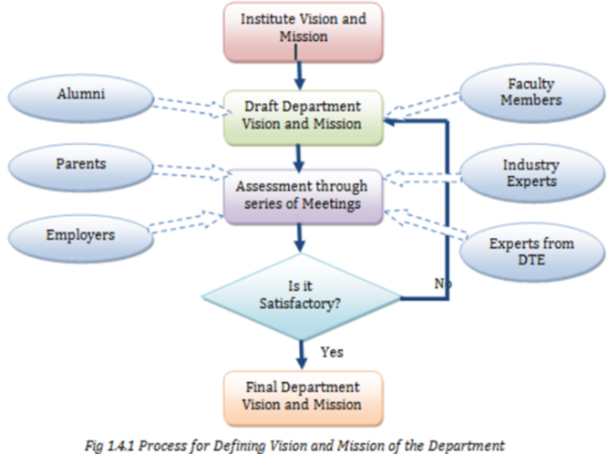

- Considering the institutional Vision and Mission as the base and incorporating global projections in the field of Mechanical Engineering and allied fields, the Vision and Mission Statements of the department have been defined.
- The departmental faculty members met number of times to develop and cultivate a strong and meaningful Vision and Mission statements
- A series of discussions were conducted simultaneously among Program Assessment Committee (PAC), Alumni representatives, Industry experts and Training experts to finalize the Vision, Mission and PEOs.(fig. 1.4.3.)

PEOs are the characteristics of graduates of a program, which enable the students to become successful professionals in their field.

The department has documented measurable PEOs for its Diploma in Mechanical Engineering program taking into account the program's constituencies and the mission of the institute.

The PEOs are established in the light of the vision and mission statements of the department. Our process for establishing and revising Program Educational Objectives (PEOs) is depicted in fig. 1.4.2

Vision and Mission of the Institute, Department and Graduate attributes recommended by NBA are taken as directorial factors in forming the PEOs. Stakeholder inputs are obtained through extensive surveys with follow-up telephone calls by the Department HOD and associated faculties.

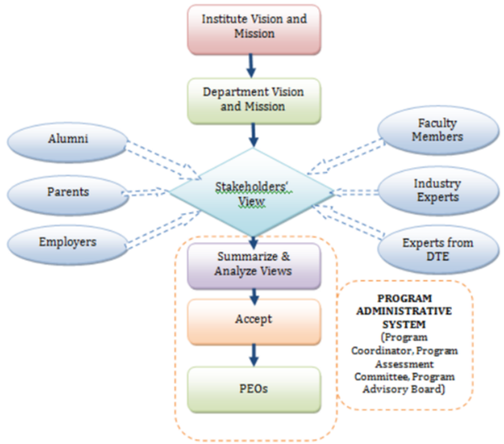

fip 142 Process for Defining PEOs of the Department

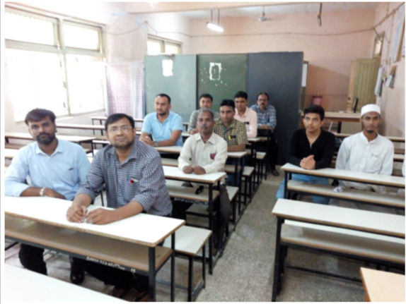

Total Marks 15.00

Institute Marks

15.00

The PEOs ensure the accomplishments of the mission of the Department with special emphasis on technical competence of engineers, value addition sustainable solutions to engineering problems. For the mapping of PEOs and Mission, several meetings of the faculty members were conducted at department level. The feedback of the faculty members was taken into consideration and the mapping was finalized as below.

| PEO Statements                                                                        |   M1 |   M2 |   M3 |   M4 |
|---------------------------------------------------------------------------------------|------|------|------|------|
| Successfully apply the principle of mechanical engineering in the industry.           |    2 |    3 |    2 |    2 |
| Pursue continued life long learning through professional practice and higher studies. |    3 |    2 |    2 |    1 |
| Established as a successful entrepreneur.                                             |    1 |    1 |    3 |    3 |

## 2 2 PROGRAM CURRICULUM AND TEACHING - LEARNING PROCESSES PROGRAM CURRICULUM AND TEACHING - LEARNING PROCESSES (200) (200)

## 2.1 Program Curriculum (40)

All POs and PSOs are being demonstrably met through Curriculum ? : --Select--

## 2.1.1 State the process used to identify extent of compliance of the Board curriculum for attaining the Program Outcomes (POs) and Program Specific Outcomes (PSOs) as mentioned in AnnexureI. Also mention the identified curricular gaps, if any (25)

## A. Process used to identify extent of compliance of curriculum for attaining POs &amp; PSOs (15)

## Total Marks Total Marks   178.00 178.00

## Total Marks 40.00

## Institute Marks

25.00

## Institute Marks

15.00

The Gujarat Technological University was established by Government of Gujarat vide Gujarat Act No. 20 of 2007. The introduced syllabus in 2007 was proposed to be revised to bridge the gap between institute and industry through a demand driven module in order to crate employable engineers and professionals taking into account concept of outcome based curriculum as per NBA terminology.

In year 2012, in collaboration with NITTTR, the new curriculum was introduced after a series of workshops and training to senior faculties of diploma colleges across Gujarat.

The overall process for framing curriculum is summarized as under:

- Æ As per AICTE model curriculum, the experts of program decided by Board of Studies, are invited and review the existing and model curriculum.
- Æ Each faculty in-charge determines the level of their courses studying the elements of POs. Further, the Bloom's level of cognitive domain was adopted to determine the level of expected attainment.
- Æ The University Curriculum is categorized as follows:
- Æ The introductory courses were termed as First year courses which are mostly covering Bloom's levels 1 &amp; 2, where students were exposed to the topic.
- Æ The competency courses were termed as Second and Third year courses which are up to covering Blooms levels 3, where students gain competency in the topic.

## The program wise committee is formed and the following procedure is followed by each program:

- Æ The university issue orders to 4 to 5 expert faculties from GTU affiliated government polytechnics of each course and 2 experts from NITTTR for overall review.
- Æ The review meeting of existing curriculum is done on basis of feedbacks received from stakeholders like industries, alumni etc.
- Æ As per review, the expectation from curriculum is finalized and process of framing is initiated.
- Æ Year-wise framing and finalization of curriculum for each course is reviewed and approved in coordination with experts of NITTTR.
- Æ The year-wise finalized curriculum for all the programs is displayed on GTU website for sharing the information with the students.

## A. Process used to identify extent of compliance of curriculum for attaining POs &amp; PSOs (15)

Every course coordinator maps their course outcome with POs and PSOs considering content of course given by GTU. The mapping with justification is reviewed by department level committee. After successful verification and update of all the courses, the program compile data of mapping for all the courses. Hence, the program level mapping is generated and each course execution in classroom and laboratories leads towards the attainment of POs and PSOs.

## The program level matrix is available in criterion 3

In order to comply the curriculum various paths are followed as under:

1.  We are publishing schedule in academic calendar for CO-wise tests with suggested week for each semester. Course wise assignments and quizzes are given by respective course coordinators. Every course coordinator is preparing course file which includes details like academic calendar (schedule), time table of faculty and copy of laboratory timetable, syllabus of subject, lesson planning, class notes, software and multimedia details, assignments, evaluation reports, exam papers etc.

2.  Assignments are prepared with respect to the curriculum by respective course coordinators. Continuous assessment is done for all the components of teaching learning process

3. Laboratory plans are prepared for each laboratory course. This plan includes number of experiments as prescribed in the curriculum. Apart from this, additional experiments/case studies are included in the plan as per the needs. Laboratory manuals are prepared for all the experiments in the plan.

- In laboratory assignment questions/problems/mini projects are given as needed

- Continuous assessment system is also implemented for assessment of laboratory work. The assessment is done on the basis of timely submission of laboratory records, understanding of the experiment through oral questions and participation in performing the experiment as per rubrics.

4.  The top three meritorious students per semester are appreciated and given a prize for every GTU examination at department level. The methodology is explained in 2.2.1 (C).

5.  The remedial classes if required are arranged for weak students. We are having mentoring system to help at individual levels. This mentoring is for overall development of the student. Each faculty member (counselor) is assigned a group of students for supervising their progress and reports throughout the duration of program.

6.  Professional guidance is provided by arranging lectures of eminent personalities from academics &amp; industry.

## B. List the curricular gaps for the attainment of POs &amp; PSOs (10)

Institute Marks 10.00

## Process to identify the curriculum gap:

- Mapping of COs with POs and PSOs is done by course coordinator.

- At every technical event and meeting with stakeholders the review about existing diploma syllabus is collected.

- The department level committee reviews the feedback about existing curriculum to search out the content beyond the syllabus.

- We review not only the curriculum gap due to POs and PSOs mapping, but also identify the gap based on review feedback from stakeholders.

- Finally, the content beyond syllabus which is to be taught to make corrective actions for bridging the gap were thoroughly discussed and finalized.

- The content found as curriculum gap is sent to university.

- We found gap in technological aspect in feedbacks and the gap was pertaining to the course 'Basic Engineering Drawing', which is offered in 1 st semester. The course does not cover 'Loci of Points' and we tried to bridge the gap by offering extra lecture and lab sessions to 1st semester students of the program. The topic identified as gap is a very basic conceptual requirement to be added in the curriculum as it is useful while designing different mechanisms for various engineering applications so we are trying to fill the curriculum gap through extra lecture and lab sessions.

The flow chart shows the process for deciding curriculum gap is shown here:

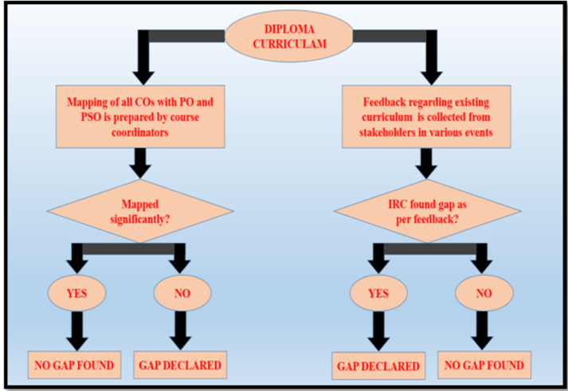

2.1.2 Contents beyond the Syllabus (15)

## A. Steps taken to get identified gaps included in the curriculum (eg. letters to Board) (2)

- The curriculum gap was communicated to university through post by the department through head of institute.
- The gap and its justification were also communicated to the university and recommendation to consider the suggestion in upcoming curriculum revision was done by IRC (Internal Review Committee) under the guidance of head of department.

As AICTE has proposed the model curriculum in 2019, we are hopeful to have the new curriculum with reasonable consideration to our suggestion.

## B. Delivery details of content beyond syllabus (10)

Institute Marks 10.00

- We found gap in technological aspect in feedbacks and the gap was pertaining to the course 'Basic Engineering Drawing', which is offered in 1 st semester. The course does not cover 'Loci of Points' and we tried to bridge the gap by offering extra lecture and lab sessions to 1 st semester students of the program. The topic identified as gap is a very basic conceptual requirement to be added in the curriculum as it is useful while designing different mechanisms for various engineering applications so we are trying to fill the curriculum gap through extra lecture and lab sessions along with assignments/ drawing sheets.

CAY-2019-20

| Sr. No   | Gap               | Action Taken   | Date- Month- Year   | Resource Person with Designation   | Mode   |   No. of Present Students | Relevance POs and PSOs   |
|----------|-------------------|----------------|---------------------|------------------------------------|--------|---------------------------|--------------------------|
|          | Loci of points in |                | 31/8/2019           | Shri. R.H.Prajapati(LME)           |        |                        44 |                          |

## Institute Marks

15.00

## Institute Marks

2.00

## CAYm1-2018-19

|   Sr. No | Gap                                                                          | Action Taken                                                     | Date- Month- Year   | Resource Person with Designation   | Mode                                                                              |   No. of Present Students | Relevance POs and PSOs   |
|----------|------------------------------------------------------------------------------|------------------------------------------------------------------|---------------------|------------------------------------|-----------------------------------------------------------------------------------|---------------------------|--------------------------|
|        1 | Loci of points in Basic Engg. Drawing which is not covered in the curriculum | Extra lecture and lab sessions delivered by faculties of program |                     | 18/8/2018 Shri.V.H.Suthar(LME)     | Content deliverd using chalk and blackboard followed by assignment /drawingsheets |                        67 | PO-1 PO-2                |
|        2 | Loci of points in Basic Engg. Drawing which is not covered in the curriculum | Extra lecture and lab sessions delivered by faculties of program | 15/9/2018           | Shri.M.R.Zala(LME)                 | Content deliverd using chalk and blackboard followed by assignment /drawingsheets |                        71 |                          |

## CAYm2-2017-18

|   Sr. No | Gap                                                               | Action Taken                          | Date- Month- Year   | Resource Person with Designation   | Mode                                                       |   No. of Present Students | Relevance POs and PSOs   |
|----------|-------------------------------------------------------------------|---------------------------------------|---------------------|------------------------------------|------------------------------------------------------------|---------------------------|--------------------------|
|        1 | Loci of points in Basic Engg. Drawing which is not covered in the | Extra sessions delivered by faculties | 19/8/2017           | Shri. R.H.Prajapati(LME)           | chalk and blackboard followed by assignment /drawingsheets |                        93 | PO-1 PO-2                |
|        2 | curriculum                                                        | lecture and lab of program            |                     | 16/9/2017 Shri.M.K.Prajapati(LME)  | Content deliverd using                                     |                        96 |                          |

## C. Mapping of content beyond syllabus with the POs &amp; PSOs (3)

## Institute Marks

3.00

## 2019-20

|   S.No | Gap Action Taken                                                                                                                               | Date-Month-Year   | Resource Person with Designation   | Mode No. of students present                                                         | Relevance to POs, PSOs   |
|--------|------------------------------------------------------------------------------------------------------------------------------------------------|-------------------|------------------------------------|--------------------------------------------------------------------------------------|--------------------------|
|      1 | Loci of points in Basic Engg. Drawing which is not covered in the curriculum  Extra lecture and lab sessions delivered by faculties of program | 31/08/2019        | Shri. R.H.Prajapati(LME)           | Content deliverd using chalk and blackboard followed by assignment /drawingsheets 44 | PO-1, PO-2               |
|      2 | Loci of points in Basic Engg. Drawing which is not covered in the curriculum Extra lecture and lab sessions delivered by faculties of program  | 21/09/2019        | Shri.V.M.Prajapati(LME)            | Content deliverd using chalk and blackboard followed by assignment /drawingsheets 45 | PO-1, PO-2               |

## 2018-19

|   S.No | Gap Action Taken                                                                                                                               | Date-Month-Year   | Resource Person with Designation   | Mode No. of students present                                                         | Relevance to POs, PSOs   |
|--------|------------------------------------------------------------------------------------------------------------------------------------------------|-------------------|------------------------------------|--------------------------------------------------------------------------------------|--------------------------|
|      1 | Loci of points in Basic Engg. Drawing which is not covered in the curriculum  Extra lecture and lab sessions delivered by faculties of program | 18/08/2018        | Shri.V.H.Suthar(LME)               | Content deliverd using chalk and blackboard followed by assignment /drawingsheets 67 | PO-1, PO-2               |
|      2 | Loci of points in Basic Engg. Drawing which is not covered in the curriculum  Extra lecture and lab sessions delivered by faculties of program | 15/09/2018        | Shri.M.R.Zala(LME)                 | Content deliverd using chalk and blackboard followed by assignment /drawingsheets 71 | PO-1, PO-2               |

## 2017-18

|   S.No | Gap Action Taken                                                                                                                               | Date-Month-Year   | Resource Person with Designation   | Mode No. of students present                                                         | Relevance to POs, PSOs   |
|--------|------------------------------------------------------------------------------------------------------------------------------------------------|-------------------|------------------------------------|--------------------------------------------------------------------------------------|--------------------------|
|      1 | Loci of points in Basic Engg. Drawing which is not covered in the curriculum  Extra lecture and lab sessions delivered by faculties of program | 19/08/2017        | Shri. R.H.Prajapati(LME)           | Content deliverd using chalk and blackboard followed by assignment /drawingsheets 93 | PO-1, PO-2               |
|      2 | Loci of points in Basic Engg. Drawing which is not covered in the curriculum  Extra lecture and lab sessions delivered by faculties of program | 16/09/2017        | Shri.M.K.Prajapati(LME)            | Content deliverd using chalk and blackboard followed by assignment /drawingsheets 96 | PO-1, PO-2               |

## 2.2 Teaching - Learning Process (160)

## Total Marks 138.00

## 2.2.1 Describe Processes followed to ensure/improve quality of Teaching &amp; Learning based on following points (25)

## A. Adherence to Academic Calendar (3)

The adherence of academic calendar is the essential to organize the work culture of any institute. The adherence of academic calendar includes following attributes:

- Smooth functioning of teaching learning process
- Clarity of scheduled events on the campus
- Structured environment of institute
- Avoidance possibility of clashing between different events
- Equal opportunity for students to justify co-curricular and extra-curricular activities
- Freedom/Liberty to faculties to plan best possible execution of course

The department follows the academic calendar declared by GTU (www.gtu.ac.in) and by Institute. Academic calendar and timetable are given at the beginning of the semester to all the students. Based on institute academic calendar, the department publish own time table on department notice board. The lectures and the laboratories are conducted regularly as per the timetable. The examination and other events are conducted as per the academic calendar.

We also consider the importance of co-curricular and extra- curricular activity in overall growth of students. We include all such activities in our academic calendar and celebrates may of such events. Few activities are listed below:

## Institute Marks

25.00

## Institute Marks

3.00

- Days of national importance, like republic day, independence day
- Sports week
- Cultural events like Garba
- Events of social importance like cleanliness drive, seminar for tobacco awareness, women equality and law etc.

| Academic Calendar   | Academic Calendar   | Academic Calendar   | Academic Calendar   |                  | ODD 2019   | ODD 2019                                          |         |                | G P PALANPUR         | G P PALANPUR         | G P PALANPUR         | G P PALANPUR         |
|---------------------|---------------------|---------------------|---------------------|------------------|------------|---------------------------------------------------|---------|----------------|----------------------|----------------------|----------------------|----------------------|
|                     | June                |                     | August              | August           | September  | September                                         | October | October        | November             | November             | December             | December             |
|                     |                     | Mo                  |                     |                  | Su         |                                                   | Tu      |                |                      |                      | Su                   |                      |
| Su                  |                     | Tu                  |                     |                  | Mo         |                                                   |         | Gandhi JAYanti |                      |                      | Mo                   |                      |
| Mo                  |                     | We                  |                     |                  |            |                                                   |         |                | Su                   |                      | Tu                   |                      |
|                     |                     | Ih                  |                     |                  | We         |                                                   |         |                | Mo                   |                      | We                   |                      |
| We                  |                     |                     | Mo                  |                  |            | TEACHER'S DAY                                     |         |                | 5 Tu                 |                      |                      |                      |
|                     |                     |                     | 6 Tu                |                  |            |                                                   | Su      |                |                      |                      |                      |                      |
|                     |                     | Su                  |                     |                  |            |                                                   | Mo      |                |                      |                      |                      |                      |
| 50                  |                     |                     |                     |                  | Su         |                                                   | Iu      |                |                      |                      | Su                   |                      |
| Su                  |                     |                     |                     |                  | Mo         |                                                   | We      |                |                      |                      |                      |                      |
| 10 Mo               |                     | 10 We               |                     |                  | 10 Tu      |                                                   | 10 Th   | ee             | 10 Su                |                      | 10 Tu                |                      |
|                     |                     |                     | 11 Su               |                  | 11 We      |                                                   |         |                | Mo                   |                      |                      |                      |
| 12 We               |                     |                     | 12 Mo               | BaKRieid         |            |                                                   |         |                | 12 Tu                | Jayn                 | 12 Th                |                      |
|                     |                     |                     | 13 v                |                  | 13 Fr      |                                                   |         |                | 13 We                |                      | 13 Fr                |                      |
|                     |                     | 14 Su               | 14 We               |                  |            |                                                   | 14 Mo   |                |                      |                      | 14 5                 |                      |
|                     |                     | 15 Mo               |                     | independence DAY | 15 Su      |                                                   | 15 Tu   |                |                      |                      |                      |                      |
| 16 Su               |                     |                     | 16 Fr               |                  | 16 No      |                                                   |         |                | 16 S,                |                      |                      |                      |
| 17 Mo               |                     | 17 We               | 17 81               | Paten            | 17 Tu      |                                                   |         |                |                      |                      | 17 Tu                |                      |
| 18 Tu               |                     |                     |                     |                  |            |                                                   | 18 Fr   |                | 18 o                 |                      |                      |                      |
| 19 We               |                     |                     |                     |                  | 19 Tn      |                                                   |         |                |                      |                      | 10 I                 |                      |
| 20 In               |                     |                     | 20 Tu               |                  |            |                                                   | [20 Su  |                | 20 We                |                      | 20 Fr                |                      |
| 21 Fr               | YOGA DAY            | 21 Su               |                     |                  | 21 Sa      |                                                   | 21      |                | 21 In                |                      | 21 Sa                |                      |
|                     |                     | 22                  | 22 Th               |                  | 22 Su      |                                                   | 22 Tu   |                | 22 Fr                |                      | 22 Su                |                      |
| 23 Su               |                     | 23 Tu               |                     |                  |            |                                                   |         |                |                      |                      | 23 Mo                |                      |
| 24 Mo               |                     |                     | 24 S0               | Janmashtami      | 24 Tu      |                                                   | 24 Th   |                | 24 Su                |                      | 24 Tu                |                      |
| 25 Tu               |                     | 25 Th               | 25 Su               |                  | 25 Me      |                                                   | 25 Fr   |                | 25 Mo                |                      |                      | Christmas            |
| 26 We               |                     | 26 Fr               | 26 Mo               |                  | 26 In      |                                                   | 26 S0   |                | 26 Tu                |                      | 26 Th                |                      |
|                     |                     |                     |                     |                  |            |                                                   |         |                | 27 Wo                |                      |                      |                      |
| 28 Fr               |                     |                     | 28 We               |                  | 20 Sa      |                                                   | 28 Mo   | NEW YEAR       | 28 Th                |                      |                      |                      |
|                     |                     | 29 Mo               | 29 In               |                  | 29 Su      |                                                   | 29 Tu   |                | 29 Fr                |                      | 29 Su                |                      |
|                     |                     | 30 Tu               |                     |                  | 30 Mo      |                                                   | 30      |                |                      |                      | 30 Mo                |                      |
|                     |                     | 31 We               |                     |                  |            |                                                   | 31 Th   |                |                      |                      | 31 Iu                |                      |
|                     |                     |                     |                     |                  |            | 17-06-2019 TO 16-10-2018 17-06-2018 Tu 16-10-2018 |         |                | ALLDATES AREPROPOSED | ALLDATES AREPROPOSED | ALLDATES AREPROPOSED | ALLDATES AREPROPOSED |

Fig. 2.2.1.1: Institute Academic Calendar

## Academic Calendar Mechanical Department

Government Polytechnic, Palanpur GTU ODD TERM 2019-20 (SEM 1,3,5)

| Activity                           | Planned Schedule         | Planned Schedule                                  |
|------------------------------------|--------------------------|---------------------------------------------------|
| Term Dates                         | Sem 3,5 Sem 1            | 17/06/2019 to 16/10/2019 01/08/2019 to 20/12/2019 |
| Tree Plantation                    | 04/07/2019               | 04/07/2019                                        |
| Orientation Program                | Sem 1                    | 18/07/2019                                        |
| Induction Program                  | Sem 1                    | 18/07/2019 to 31/07/2019                          |
| Expert Lecture                     | Sem 5                    | 25/07/2019                                        |
| Industrial visit                   | Sem 5                    | 02/08/2019                                        |
| Midsem Project Presentation in Lab | Sem 5                    | 03/08/2019                                        |
| Industrial visit                   | Sem 3                    | 07/08/2019                                        |
| Independence Day Celebration       | 15/08/2019               | 15/08/2019                                        |
| Teacher's Day                      | 05/09/2019               | 05/09/2019                                        |
| Midsem Exam                        | Sem 3,5                  | 16/09/2019 to 21/09/2019                          |
| Remedial Exam                      | Sem 3,5                  | 30/09/2019 to 05/10/2019                          |
| Navratri Celebration               | 09/10/2019               | 09/10/2019                                        |
| Project Demonstration              | Sem 5                    | 10/10/2019                                        |
| Term work Submission               | Sem 3,5                  | 13/10/2019 to 16/10/2019                          |
| Term End                           | Sem 3,5                  | 16/10/2019                                        |
| Midsem Exam                        | Seml                     | 17/10/2019 to 22/10/2019                          |
| Diwali Vaccation                   | 24/10/2019 to 13/11/2019 | 24/10/2019 to 13/11/2019                          |
| External Exam                      | Sem 3,5                  | 03/11/2019                                        |
| Remedial Exam                      |                          | 25/11/2019 to 30/11/2019                          |
| Term work Submission               | Seml                     | 18/12/2019 to 20/12/2019                          |
| Term End                           | Sem1                     | 20/12/2019                                        |
| External Exam                      | Seml                     | 30/12/2019                                        |

Fig. 2.2.1.2: Department Academic calendar

## B. Use of various instructional planning and delivery methods (3)

For identifying various instructional planning and delivery methods, course coordinator along with course faculty prepare the detailed exercise of planning and delivery methods. Use of various instructional methods and pedagogical initiatives are opted by every faculty.

- Content deliver in classroom
- Power Point presentation
- Industrial Visits
- Presentation/Seminars
- Tutorials
- Efficient usage of e-resources

Efforts to keep the students engaged through various activities like seminars, NPTEL videos, inter-departmental visits, debate on technical topics, and discussion on startups, mini projects, group discussion, career counseling, and alumni interactions etc.

At the end of the semester, feedback from students (on an anonymous basis) is taken for each subject. The quality of the teaching skill, knowledge impartment, course delivery methods, class discipline and behavioral skills, specific for a faculty member are analyzed. This enables the department to make proactive changes for successive batches and functioning methods of the faculty.

Institute Marks

3.00

## C. Methodologies to support weak students and encourage bright students (4)

Institute Marks

4.00

The weak and bright students are identified based on the policy of the department. The weak students are identified based on last GTU results having less than 4 SPI. The identified weak students are engaged in various activities as under:

- The concern subject teacher will give extra assignments to weak students for practice.

- The concern subject teacher will arrange extra lectures for the weak students.

- The concern subject teacher will monitor the progress of concern weak students.

- The bright students are motivated as under:

- Top 3 bright students in each GTU exams are appreciated and awarded by a prize from department.

- The concern subject teacher will counsel the bright students regarding various career options available to him/her after completing the diploma.

- They are encouraged to participate in various competitions like Hackathon, and other state level events etc., showcase their innovative ideas and participate in Student Start-up and Innovation Policy (SSIP), publish patents under SSIP.

## D. Quality of classroom teaching (3)

Institute Marks

3.00

- Each lecture is scheduled for 1 hour.

- Each classroom is spacious and equipped with green board and a multimedia classroom is available with department to create better and effective teaching learning environment. .

- Various teaching learning process like case study, group discussion, presentation etc, are used by faculty to achieve maximum involvement of students in the class.

- During the lecture faculty member take efforts to keep students engaged by reviewing and asking questions on previous lecture and interactively deliver the lecture considering the related course outcome related with the topic.

- At the end of the lecture students are encouraged to summarize, ask doubts from the content taught.

- The quality of classroom teaching of every teacher for every course is assessed by department head and senior faculties in terms of feedback from students with various parameters.

- The department head takes random round to the class and laboratories to verify the content as per lesson and lab plan, utilization of available resources, effectiveness of the teaching etc.

- Classroom teaching process is continuously monitored by Head of Department/Principal/committee of DTE through CCTV camera.

- Campus is having Wi-Fi facility which is utilized by staffs and students.

## E. Conduct of experiments (3)

Institute Marks

3.00

- Experiments are conducted in each course as per planning in line with GTU curriculum.

- Laboratory manuals include introduction and step by step procedure to conduct the experiments on setup.

- Laboratories are equipped with adequate equipment.

- Observations and calculations are recorded by students in laboratory files/manual which are maintained and evaluated regularly.

## F. Continuous Assessment in the laboratory (3)

Institute Marks 3.00

- Continuous assessment system is followed for assessment of laboratory work of the students.

- The assessment is done on the basis of participation in performing the experiment, pro-activeness, practical skill, safety aspect, sincerity, in-time submission and as per rubrics of the laboratory practical.

- Sample copies of continuously evaluated term work are available with respective faculties.

## Table. 2.2.1.1 Continuous Assessment sheet

## G. Student feedback of teaching learning process and action taken (6)

Institute Marks

6.00

To improve the quality of teaching learning process, the department developed policy for getting the honest feedback, which ensure the best possible outcome from the students and faculties.

## The methodology for filling the feedback by students:

- The format of feedback is shared to students twice in the semester in hard copy.

- All the students are required to fill the feedbacks about lectures and practical sessions and appraising the concerned faculties using a rating pattern

- The first feedback is conducted in mid of semester and the second feedback before the end of semester.

- The department head is in-charge for whole process of feedback and sometimes accompanied by maximum two senior faculties of department throughout of procedure.

- The students are explained the importance of feedback process and encouraged to give honest and fearless feedback to improve the teaching learning procedure in the classroom.

- The same procedure is done for second feedback session.

## The methodology for reviewing feedback and delivering the feedback to faculties

- The head of department has to review and analyze feedback.

- The secrecy of the feedback is to be maintained throughout the procedure.

- As the grading of each question is 1 to 5 the maximum average grading of the feedback will be 5.

- According to feedback, the faculties will be given the acknowledgment of average grading with the respective remarks of head of department in personal.

- The constructive remarks from head to improve the quality of teaching learning process will be appreciated.

- For second feedback the first feedback is to be considered and the improvement is to be assessed, if the case required.

- The faculty members are counseled and motivated by the Head of the Department regularly.

## Justification of effectiveness of the process

- The feedback questionnaires of AICTE include the overall holistic approach of teaching learning process and classroom and laboratory conduction.

- It also encompasses the following attributes:

- Introducing the latest technology by covering topic beyond syllabus

- Use of various teaching aids

- Motivation to students

- Practical demonstration

- Hand on training

- Personal mentoring

- The whole process is reviewed by non-prejudice team under direct supervision of head of department.

- After the second feedback, the quality is assured by comparing it with previous one.

The feedbacks about lectures and practical sessions and appraising the concerned faculties using a rating pattern as per AICTE 7 CPC format as shown below:

## Mechanical Engineering Department

Semester:

Subject Code:

Name of Subject:

Batch:

Enroll No.

Exp-01

Exp-02

Exp-03

Exp-04

Exp-05

Exp-06

Exp-07

Exp-08

Exp-09

Exp-10

TOTAL

date

date

Marks

Marks

Semeste:

Course ( Codel:

Name of faculty:

| ISr. No   | Name of faculty: Desription                                                            | Poor Tery   | Poor      | Good      | Good      |           |
|-----------|----------------------------------------------------------------------------------------|-------------|-----------|-----------|-----------|-----------|
| ISr. No   | Fas the teacher coverdentire |ssilabus Per   prescribed luniverit board?               |             |           |           |           |           |
|           | Fas the teacher covered topic Iberond sslabus?                                         |             |           |           |           |           |
|           | EfectivenessOf teacher in [a)Technical content course kcontent (6)Communication skills |             |           |           |           |           |
|           | Pace on which contents "ere                                                            |             |           |           |           |           |
|           | [Support For development o Practical demonstration Hands on ta ining                   |             |           |           |           |           |
|           | Istudents                                                                              |             |           |           |           |           |
|           | [Feedback provided on                                                                  |             |           |           |           |           |
|           | ladvice to students                                                                    |             |           |           |           |           |
| Iotal     | Iotal                                                                                  |             |           |           |           |           |
| Other Any | Other Any                                                                              | Other Any   | Other Any | Other Any | Other Any | Other Any |

Table.2.2.1.2 feedback form

2.2.2 Initiatives to improve the quality of semester tests and assignments (15)

## A. Process for Internal semester question paper setting and evaluation and effective process implementation (5)

- For internal assessment, CO-wise exam is conducted as per the declared schedule in academic calendar displayed by department on notice board.
- The CO-wise exam covers syllabus in parts, the end semester examination covers the complete syllabus.
- Internal Question Paper for Mid-Semester exams is set by following below mentioned steps:
- Initial Draft of paper is prepared by Course Coordinator and associated subject teachers by taking into consideration
- Bloom's Taxonomy
- GTU Course Scheme
- Draft of the paper is then presented to Departmental Review Committee for review. The review committee may give comments, if any.
- Question Paper is revised after including the suggestions and it is finalized.
- A continuous evaluation system is in effect which includes class tests, assignments and oral examination of students to assess their understanding of the subject.

Institute Marks

15.00

Institute Marks

5.00

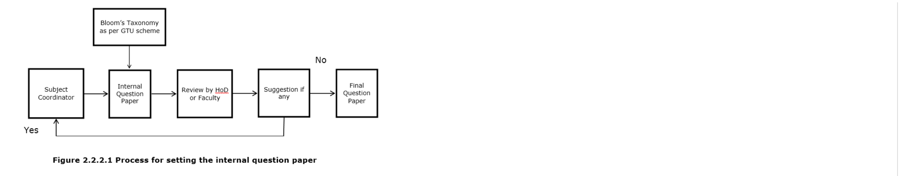

## B. Question paper setting taking into account outcomes/learning levels (5)

## Institute Marks

5.00

- ¥ The course coordinator ensures that the questions of internal question paper are framed based on various levels of Bloom's taxonomy and are mapped to the COs.
- ¥ The course coordinator decides the number of questions and marks allotted for each question.

The course coordinator submits the question paper to the departmental review committee and the committee checks the quality and learning levels and COs compliance and suggests any changes, if required.

| Define (1) Crystal lattice (2) Unit cell                                                   |    |
|--------------------------------------------------------------------------------------------|----|
| iiDefine: (1) Density (2) Melting point.                                                   |    |
| 2. Give characteristics Ofelectrovalent bond @MARK) OR                                     |    |
| Give characterstcs ofCovaent bond (2 MARK)                                                 |    |
| metal crystal structures( 4 MARK) OR                                                       |    |
| 3.State the effectof properties with sketch. (4 MARK) 'cooling                             | 4  |
| QUESIION: 2 (Co 3)                                                                         |    |
| Differentiate between micro andmacro examinaton (4 MARK) OR                                | 4  |
| Draw and Explain Optical Principle of metallurgical Microscope With line diagram. (4 MARK) | 4  |
| QUESIION: 3 (Co 4)                                                                         |    |
| 1.                                                                                         | R  |
| OR 1. Classify plain carbon steel according tO carbon content (2 MARK)                     |    |
| 2 Draw and explain flow diagram for the production ofiron and steel. (4 MARK) OR           | 4  |
|                                                                                            | {  |
| List characteristics Ofbrass (4 MARK) OR                                                   |    |
| Classify the castiron and vrite properties and applications Of gray cast iron (4 MARK)     |    |
| List the propenies of Oil. (2 MARK) OR                                                     | R  |
| Define Powder Metallurgy. ( MARK)                                                          | R  |
| 2 List application of coolant or cutting fluids  ( MARK) OR                                |    |
| 3 List merits and demerits Of powder metallurgy (MARK)                                     |    |

## C. COs coverage in class test / mid-term tests and assignments (5)

Institute Marks

5.00

- Evidence of COs coverage in class test / mid-term tests are available in the question paper / assignments/ tutorials.

2.2.3 Quality of Experiments (15)

Institute Marks

10.00

## A. Experimental methodologies (5)

Institute Marks

5.00

- The methodology for performing experiment is as under:

- At the starting of the laboratory session faculty introduce the title of the experiment to the students.

- The students are encouraged to relate the title of experiment with the topic covered in classroom.

- The related materials/animations/equipments/accessories are displayed to batch and session is made open for two way interaction.

- For the performance laboratory session, the students are shown and explained demonstration and performance type practical under the guidance of faculty so students can learn the particular practical knowledge.

- The group of students is demonstrated the performance and readings are taken with involvement of students in operation of equipment.

- On completion of first group, the second group is called to perform same experiment in presence of faculty.

B. Innovative experiments including industry attached practices, virtual labs (5)

Institute Marks

0.00

NIL

C. Relevance to outcomes (5)

Institute Marks

5.00

For all the courses, laboratory experiments to be performed are mapped with CO. The assessment is done based on rubrics for performance based courses. Maximum COs are included in the list of experiments to be performed. The remaining COs are assessed through CO-wise examinations and other activities suggested by course coordinator.

## Government Polytechnic , Palanpur Department of Mechanical Engineering

## Semester:

## Sub: FMHM (3331903

Understand fluid mechanic principles Of bernoulli, Continuity , momentum &amp; energy as applied to fuid motion with derivation € applications

Explain Basic Fluid properties &amp; Pressure measuring devices flow patterns

Describe Pumps turbines Hydropneumatic elements &amp; devices

| Iitle of Practical                                                                          | Course Outcome   | Date   | Page No.   | Marks   | Sign   |
|---------------------------------------------------------------------------------------------|------------------|--------|------------|---------|--------|
| Demonstrate various fluid properties.                                                       |                  |        |            |         |        |
| Demonstrate and Measure pressure 1 Various manometers . ii. Various Pressure gauges using:. |                  |        |            |         |        |
| Verify Bernoulli s theorem                                                                  |                  |        |            |         |        |
| Measure fluid flow by Venturimeter                                                          |                  |        |            |         |        |
| Measure fluid flow by Orifice meter                                                         |                  |        |            |         |        |
| Estimate Reynolds number given test using                                                   |                  |        |            |         |        |
| Determine major and minor head loss through pipes.                                          |                  |        |            |         |        |
| Perform per BIS                                                                             |                  |        |            |         |        |
| Performance test ofreciprocating                                                            |                  |        |            |         |        |
| Demonstrate use of different hydraulic andpneumatic devices.                                |                  |        |            |         |        |
| Mini Proj.                                                                                  |                  |        |            |         |        |

2.2.4 Quality of Students Projects and Report Writing (35)

## A. Identification of projects and allocation methodology (3)

## Methodology of project identification

To develop the highly essential industry oriented skills and competencies in the students, the project I and II are undertaken in the last two semesters.

According to the requirement of National Board of Accreditation (NBA), 'learning to learn' is an important. It is required to develop this skill in the students so that they continue to acquire on their own new knowledge and skills from different 'on the job experiences' during their career in industry.

Depending upon the scope and size of the project problems, students can either choose to have two separate (or independent) problems as project I and project II or students can have a big complex problem, solving of which may need more time and efforts in the form of integrated or combined Project I and Project II. However, students have to declare in the beginning of the fifth semester that whether they want to have two separate problems as project I and Project II or one complex big problem as integrated Project I and II.

We expect and identify the following attributes from final year projects:

- Æ Technical aspects covered and difficulty level
- Æ Originality of idea
- Æ Possibility of funding and the overall budget

Institute Marks

35.00

Institute Marks

3.00

- Æ Level of the students, who are going to carry out project
- Æ Probable time period to complete the project

## Methodology of project allocation:

- Æ In the first iteration for project allocation procedure, all the students are encourage to make a group for project and bring their own title to the choice of their faculty depending on the expertise of faculty at the end of semester-04.
- Æ If the faculty observe and verify the scope of the project, the same title is to be selected for the group at the commencement of 5 th Semester.
- Æ If still students are still need help to decide their title or not able to find suitable one, the project coordinator collects and display the suggested titles with name of faculty.
- Æ The students can meet the faculty and discuss with the faculty for deciding the project title at commencement of 5 th Semester.
- Æ In special case, if the group of students have already done basic working under SSIP in lower semester, the same title is to be carried out with extended scope in 5 th Semester.

The selected title is verified in terms of outcomes and quality of proposed project is verified by HOD and Coordinator.

After deciding and allocation of title of project and faculty guide the review and other progress continues as per the schedule given by project coordinator.

## B. Types and relevance of the projects and their contribution towards attainment of POs and PSOs (5)

The finalized project titles are verified in terms of relevance of project and their contribution towards attainment of POs and PSOs are verified for the last three years.

## Sample format as under.

| Sr N   | Year      | Tide of Project                                         | Category Consideratio (environmen safety , ethics; cost, standard   | Category Classification Application Pr oduct Researc hReview etc.   | PROJCT GUDE          | Relevance of Pos 1 to 7 & PSos 1 to 2   |
|--------|-----------|---------------------------------------------------------|---------------------------------------------------------------------|---------------------------------------------------------------------|----------------------|-----------------------------------------|
|        | 2017 - 18 | PFE BENDING MC                                          | standard                                                            | Application                                                         | DHDesai              | All POs &PSOs                           |
|        | 2017 - 18 | REIROFIITING OF                                         | cost                                                                | Application                                                         | RH Prajapati         | All POs &PSOs                           |
|        | 2018- 19  | MAGNETC FORCE                                           | Environment                                                         | Application                                                         | TD Modi/ 5 N Chauhan | All POs &PSOs                           |
|        | 2018 - 19 | DESIGX & WATER SPRAKLIG & GRASS CCTTING                 | Environment                                                         | Application                                                         | cM Amin              | All POs &PSOs                           |
|        | 2019- 20  | SOLAR OPERAIED                                          | Research Revieu                                                     | Application                                                         | VMPrajapati          | All &PSOs POs                           |
|        | 2019 20   | DESIGN AND FABRICATION OF MOBILE OPERATED FLOOR CLEANER | Research                                                            | Application                                                         | Mk Prajapati         | All POs &PSOs                           |

Institute Marks

5.00

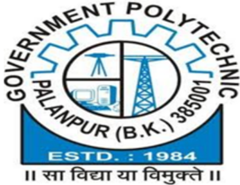

C. Process for monitoring and evaluation (5)

Institute Marks

5.00

The project coordinator with approval of head, assign internal project guide for each selected project title as per the experts available with the department. To monitor the progress of project the format of monitoring is given to each group to take step wise comments for their individual and group. Sample format is as under:

## GOVERNMENT POLYTECHNIC PALANPUR

## MECHANICAL DEPARTMENT

## PROJECT SELECTION FORM

SUB: PROJECT-I (3351908)/ PROJECT -II (3361910)

PROJECT TITLE

1) UDP: -------------------------------------------------------------------------------------------------

OR

2) IDP:

---------------------------------------------------------------------------------------------------

SR NO

ENROLLMENT

NUMBER

STUDENT NAME

MOBILE NO.

SIGN

1

2

3

4

5

6

GUIDE NAME ------------------------------------------------------------------------ SIGN-------------------------------

H.O.D

NOTE: (Project and group cannot change without permission of guide &amp; H.O.D )

DATE

ACTIVITIES

Date of completion

Signature of Guide

P/A

Group Formation and

Semester :

Project Title Selection

Literature Review

Abstract

Components Purchase

Component Technical

Review

Hands Practice

,assembling

Report Review

Presentation in front of

all Faculties Member

## SAMPLE FORMAT:

D. Process to assess individual and team performance (5)

Institute Marks

5.00

The assessment of project is done as per rubrics to record and appreciate the overall learning of the individual student. The internal guide closely review the teamwork and leadership of the group as well as individual. The internal faculty has the role in internal component of the project review. In addition to that the department committee also take individual presentation along with the cross examination to verify individual's contribution.

## Government Polytechnic, Palanpur

Department of Mechanical Engineering

## RUBRICS FOR PROJECT-I &amp;II EVALUATION

Enrollment

Title of Project

Guide name

ACTIVITIES

Date

Name

17/06/201 7

Project Title

Framing

156260319001

Literature Review

15/07/201 7

156260319007

Problem Define

19/08/201 7

156260319011

Product Design

16/09/201 7

156260319015

RETROFITTING

Report Writing(Project 1)

07/10/201 7

156260319019

OF PLANNER

CHAUDHARV

Component Purchase

30/12/2017

MC

RHPRAJAPATI

Assembling

20/01/2018

Testing

17/02/2018

Report Writing(Project 2)

Project Group No.

Project Title :

Name of Guide :

Name of Co-Guide :

Project Group

Member No

M1

M2

M3

M4

M5

M6

| Review                                | Agenda    | Assessment   | Review Assessment Weightage project-i&ii   | Over all Weightage   |
|---------------------------------------|-----------|--------------|--------------------------------------------|----------------------|
| Project Synopsis/ Proposal Evaluation | Rubric R1 | 12 (21)      | 60 PR-II (90)                              | Review 1             |
| Mid-Term Project Evaluation           | Rubric R2 | 12 (23)      | 60 PR-II (90)                              | Review 2             |
| End Semester Project Evaluation       | Rubric R3 | 12 (23)      | 60 PR-II (90)                              | Review 3             |
| Project Report Evaluation             | Rubric R4 | 12 (23)      | 60 PR-II (90)                              | Review 4             |
| Evaluation by Guide                   | Rubric R5 | 12 (23)      | 60 PR-II (90)                              | Review 5             |

Enrollment No.

Name of Student

Government Polytechnic, Palanpur

Department of Engineering Mechanical

RUBRICS FOR PROJECT-I &amp;II EVALUATION

Rubrics Review

External Evaluation (Grade)

Final Grade

## Maximum Marks: 12

## Level of Achievement

|    |                                                                   | Good (3)                                                                                                                            | Average (2)                                                                                                               | Poor (1)                                                                                                             | Score             |
|----|-------------------------------------------------------------------|-------------------------------------------------------------------------------------------------------------------------------------|---------------------------------------------------------------------------------------------------------------------------|----------------------------------------------------------------------------------------------------------------------|-------------------|
| A  | Identification of Problem Domain and Detailed Analysis            | Detailed and extensive explanation of the purpose and need of the project (3)                                                       | Average explanation of the purpose and need of the project                                                                | Minimal explanation of the purpose and need of the project                                                           | M1 M2 M3 M4 M5 M6 |
| B  | Study of the Existing Systems and Feasibility of Project Proposal | Detailed and extensive explanation of the specifications and the limitations of the existing systems  (4)                           | Moderate study of the existing systems; collects some basic information                                                   | Minimal explanation of the specifications and the limitations of the existing systems; incomplete information        | M1 M2 M3 M4 M5 M6 |
| C  | Objectives and Methodology of the Proposed Work                   | All objectives of the proposed work are well defined; Steps to be followed to solve the defined problem are clearly Specified.  (5) | Incomplete justification to the objectives proposed; Steps are mentioned but unclear; without justification to objectives | Objectives of the proposed work are either not identified or not well defined; Incomplete and improper specification | M1 M2 M3 M4 M5 M6 |

## Maximum Marks: 12

Level of Achievement

Excellent (4)

Divison of

Good (3)

Average (2)

40

PR-II(60)

100 PR-II(150)

Poor (1)

Score

Rubric R1: Project Synopsis/ Proposal Evaluation

Rubric R2: Mid-term Project Evaluation

| A   | Design Methodology                          | problem into modules and good selection of computing framework GLYPH<0>Appropriate design methodology and properly justification  (3)                                                                     | Divison of problem into modules and good selection of computing framework GLYPH<0>Design methodology not properly justified  (2.5)                                                                                      | Divison of problem into modules but inappropriate selection of computing framework  (2) GLYPH<0>Design methodology not defined properly                                                     | Modular approach not adopted GLYPH<0>GLYPH<0>Design methodology not defined (1.5)                                                               | M1 M2 M3 M4 M5 M6   |
|-----|---------------------------------------------|-----------------------------------------------------------------------------------------------------------------------------------------------------------------------------------------------------------|-------------------------------------------------------------------------------------------------------------------------------------------------------------------------------------------------------------------------|---------------------------------------------------------------------------------------------------------------------------------------------------------------------------------------------|-------------------------------------------------------------------------------------------------------------------------------------------------|---------------------|
| B   | Planning of Project Work and Team Structure | GLYPH<0>Time frame properly specified and being followed GLYPH<0>Appropriate distribution of project work (4)                                                                                             | Time frame properly specified and being followed GLYPH<0>Distribution of project work inappropriate  (3.5)                                                                                                              | Time frame properly specified, but not being followed GLYPH<0>Distribution of project work un-even  (3)                                                                                     | Time frame not properly specified GLYPH<0>In-appropriate distribution of project work  (2)                                                      | M1 M2 M3 M4 M5 M6   |
| C   | Demonstration and Presentation              | Objectives achieved as per time frame GLYPH<0>Contents of presentations are appropriate and well arranged GLYPH<0>GLYPH<0>Proper eye contact with audience and clear voice with good spoken language  (5) | Objectives achieved as per time frame GLYPH<0>Contents of presentations are appropriate but not well arranged GLYPH<0>Satisfactorydemonstration, clear voice with good spoken language but eye contact not proper (4.5) | GLYPH<0>Objectives achieved as per time frame GLYPH<0>Contents of presentations are appropriate but not well arranged (3.5) GLYPH<0>Presentation not satisfactory and average demonstration | No objectives achieved GLYPH<0>Contents of presentations are not appropriate and not well delivered GLYPH<0>Poor delivery of presentation (2.5) | M1 M2 M3 M4 M5 M6   |

## Maximum Marks: 12

## Level of Achievement

| Excellent (6)                                   | Good (5)                                        | Average (2)             | Poor (1)               | Score   |
|-------------------------------------------------|-------------------------------------------------|-------------------------|------------------------|---------|
| Changes are made as per modifications suggested | Changes are made as per modifications suggested | Few changes are made as | Suggestions during mid | M1 M2   |

Rubric R3: End Semester Internal Project Evaluation

| A   | Incorporation of Suggestions   | during mid term evaluation and new innovations added                                                                                                                             | during mid term evaluation and good justification                                                                                                                         | per modifications suggested during mid term evaluation                                                                                                                             | term evaluation are not incorporated                                                                                                          | M3 M4 M5 M6       |
|-----|--------------------------------|----------------------------------------------------------------------------------------------------------------------------------------------------------------------------------|---------------------------------------------------------------------------------------------------------------------------------------------------------------------------|------------------------------------------------------------------------------------------------------------------------------------------------------------------------------------|-----------------------------------------------------------------------------------------------------------------------------------------------|-------------------|
| B   | Project Demonstration          | All defined objectives are achieved GLYPH<0>Each module working well and properly demonstrated GLYPH<0>All modules of project are well integrated and system working is accurate | All defined objectives are achieved GLYPH<0>Each module working well and properly demonstrated GLYPH<0>Integration of all modules not done and system working is not very | Some of the defined objectives are achieved GLYPH<0>Modules are working well in isolation and properly demonstrated GLYPH<0>GLYPH<0>Modules of project are not properly integrated | Defined objectives are not achieved GLYPH<0>GLYPH<0>Modules are not in proper working form that further leads to failure of integrated system | M1 M2 M3 M4 M5 M6 |
| C   | Presentation                   | Contents of presentations are appropriate and well delivered GLYPH<0>GLYPH<0>Proper eye contact with audience and clear voice with good spoken language                          | Contents of presentations are appropriate and well delivered GLYPH<0>Clear voice with good spoken language but less eye contact with audience                             | Contents of presentations are not appropriate GLYPH<0>GLYPH<0>Eye contact with few people and unclear voice                                                                        | Contents of presentations are not appropriate and not well delivered GLYPH<0>GLYPH<0>Poor delivery of presentation                            | M1 M2 M3 M4 M5 M6 |

## Maximum Marks: 12

## Level of Achievement

|    |                | Excellent (4)                                                                                                         | Good (3)                                                                                                                    | Average (2)                                                                                                                       | Poor (1)                                                                                                       | Score             |
|----|----------------|-----------------------------------------------------------------------------------------------------------------------|-----------------------------------------------------------------------------------------------------------------------------|-----------------------------------------------------------------------------------------------------------------------------------|----------------------------------------------------------------------------------------------------------------|-------------------|
| A  | Project Report | GLYPH<0>Project report is according to the specified format GLYPH<0>References and citations are appropriate and well | Project report is according to the specified format GLYPH<0>References and citations are appropriate but not mentioned well | GLYPH<0>Project report is according to the specified format but some mistakes GLYPH<0>In-sufficient references and citations  (3) | GLYPH<0>Project report not prepared according to the specified format GLYPH<0>References and citations are not | M1 M2 M3 M4 M5 M6 |

Rubric R4: Project Report Evaluation

|    |                                               | mentioned  (4)                                                                                                                                                          | (3.5)                                                                                                                                                                      |                                                                                                                                                                         | appropriate  (2)                                                                                                                                                |                   |
|----|-----------------------------------------------|-------------------------------------------------------------------------------------------------------------------------------------------------------------------------|----------------------------------------------------------------------------------------------------------------------------------------------------------------------------|-------------------------------------------------------------------------------------------------------------------------------------------------------------------------|-----------------------------------------------------------------------------------------------------------------------------------------------------------------|-------------------|
| B  | Description of Concepts and Technical Details | Complete explanation of the key concepts GLYPH<0>GLYPH<0>Strong description of the technical requirements of the project  (4)                                           | Complete explanation of the key concepts GLYPH<0>GLYPH<0>In-sufficient description of the technical requirements of the project  (3.5)                                     | Complete explanation of the key concepts but little relevance to literature GLYPH<0>GLYPH<0>In-sufficient description of the technical requirements of the project  (3) | Inapproiate explanation of the key concepts GLYPH<0>GLYPH<0>Poor description of the technical requirements of the project  (2)                                  | M1 M2 M3 M4 M5 M6 |
| C  | Conclusion and Discussion                     | Results are presented in very appropriate manner GLYPH<0>Project work is well summarized and concluded GLYPH<0>Future extensions in the project are well specified  (4) | GLYPH<0>Results are presented in good manner GLYPH<0>Project work summary and conclusion not very appropriate GLYPH<0>Future extensions in the project are specified (3.5) | Results presented are not much satisfactory GLYPH<0>Project work summary and conclusion not very appropriate GLYPH<0>Future extensions in the project are specified (3) | Results are not presented properly GLYPH<0>Project work is not summarized and concluded GLYPH<0>GLYPH<0>Future extensions in the project are not specified  (2) | M1 M2 M3 M4 M5 M6 |

## Maximum Marks: 12

## Level of Achievement

|                                           | Good (3)                                                                                  | Average (2)                                                            | Poor (1)                                                        | Score             |
|-------------------------------------------|-------------------------------------------------------------------------------------------|------------------------------------------------------------------------|-----------------------------------------------------------------|-------------------|
| A Working within a Team                   | Collaborates and communicates in a group situation and integrates the views of others (3) | Exchanges some views but requires guidance to collaborate with others. | Makes little or no attempt to collaborate in a group situation. | M1 M2 M3 M4 M5 M6 |
| Technical Knowledge and Awareness related | Extensive knowledge related to the                                                        | Fair knowledge related to the project                                  | Lacks sufficient knowledge                                      | M1 M2 M3 M4       |

Rubric R5: Evaluation by Guide

| B   | to the Project   | project  (4)                                              |                                                                                              | M5 M6             |
|-----|------------------|-----------------------------------------------------------|----------------------------------------------------------------------------------------------|-------------------|
| C   | Regularity       | Reports to the guide regularly and consistent in work (5) | Not very regular but consistent in the work Irregular in attendance and inconsistent in work | M1 M2 M3 M4 M5 M6 |

## SAMPLE FORMAT 2018-2019

|    |                      |                                                                           |                                                       | Name of Activity (1-5) with Date   | Name of Activity (1-5) with Date   | Name of Activity (1-5) with Date   | Name of Activity (1-5) with Date   | Name of Activity (1-5) with Date   | Name of Activity (1-5) with Date   | Name of Activity (1-5) with Date   | Name of Activity (1-5) with Date   | Name of Activity (1-5) with Date   | Name of Activity (1-5) with Date   | Name of Activity (1-5) with Date   |
|----|----------------------|---------------------------------------------------------------------------|-------------------------------------------------------|------------------------------------|------------------------------------|------------------------------------|------------------------------------|------------------------------------|------------------------------------|------------------------------------|------------------------------------|------------------------------------|------------------------------------|------------------------------------|
|    | Sr. NoEnrollment No. | Team Leader/Team Member                                                   | Title of Project                                      | Project Title Framing              | Literature Review                  | Problem Define                     | Product                            | Design Report Writing(Project 1)   | Total Marks Project- I (60)        | Component Purchase                 |                                    | AssemblingTesting                  | Report Writing(Project 2)          | Total Marks Project- II (90)       |
|    |                      |                                                                           |                                                       | 12                                 | 12                                 | 12                                 | 12                                 | 12                                 | 60                                 | 21                                 | 23                                 | 23                                 | 23                                 | 90                                 |
|    |                      |                                                                           |                                                       | 10                                 | 10                                 | 10                                 | 12                                 | 10                                 | 52                                 | 14                                 | 16                                 | 16                                 | 16                                 | 62                                 |
|    | 146260319540         | RABARI ROHITBHAI DAHYABHAI 156260319008 CHAUDHARI PRIYANKKUMAR HEMRAJBHAI |                                                       | 9                                  | 9                                  | 9                                  | 9                                  | 9                                  | 45                                 | 0                                  | 0                                  | 0                                  | 0                                  | 0                                  |
|    | 156260319034         | HATHILA AJAYBHAI RAMESHBHAI                                               | MECHANICAL                                            | 10                                 | 10                                 | 10                                 | 9                                  | 10                                 | 49                                 | 15                                 | 15                                 | 15                                 | 15                                 | 60                                 |
| 1  | 166260319006         | BAROT ABHI PARESHBHAI                                                     | LAWN MOVER                                            | 10                                 | 10                                 | 10                                 | 10                                 | 10                                 | 50                                 | 15                                 | 15                                 | 15                                 | 15                                 | 60                                 |
|    | 166260319007         | BELIM MUHMMUD                                                             |                                                       | 10                                 | 10                                 | 10                                 | 11                                 | 10                                 | 51                                 | 18                                 | 19                                 | 19                                 | 19                                 | 75                                 |
|    | 166260319010         | BHAKHARVALA JAVEDSHA                                                      |                                                       | 10                                 | 10                                 | 10                                 | 11                                 | 10                                 | 51                                 | 18                                 | 18                                 | 18                                 | 18                                 | 72                                 |
| 2  | 156260319060         | MODI HIREN                                                                |                                                       | 9                                  | 9                                  | 9                                  | 9                                  | 9                                  | 45                                 | 15                                 | 15                                 | 15                                 | 15                                 | 60                                 |
|    | 156260319070         | PANCHAL KARTIK M                                                          | MODIFY AGRICULTURE SPREYPUMP OPERATED BY WHEEL ROTORY | 9                                  | 9                                  | 9                                  | 10                                 | 9                                  | 46                                 | 17                                 | 16                                 | 16                                 | 16                                 | 65                                 |
|    | 156260319109         | SOLANKI RAVI V                                                            | MOTION                                                | 9                                  | 9                                  | 9                                  | 10                                 | 9                                  | 46                                 | 15                                 | 15                                 | 15                                 | 15                                 | 60                                 |
|    | 166260319002         | AKOLIYA VIPULBHAI DALCHHABHAI                                             |                                                       | 10                                 | 10                                 | 10                                 | 10                                 | 10                                 | 50                                 | 16                                 | 18                                 | 18                                 | 18                                 | 70                                 |
| 3  | 166260319011         | BHATI ADITYASINH MANSINH                                                  |                                                       | 11                                 | 11                                 | 11                                 | 10                                 | 11                                 | 54                                 | 18                                 | 20                                 | 20                                 | 20                                 | 78                                 |
|    | 166260319013         | CHAUDHARI BHAVESHKUMAR NANJIBHA                                           | RECONDITIONING                                        | 10                                 | 10                                 | 10                                 | 10                                 | 10                                 | 50                                 | 16                                 | 18                                 | 18                                 | 18                                 | 70                                 |
|    | 166260319015         | CHAUDHARI DIVYESHKUMAR VARSIBHAI                                          | OF FOUR STROKE SINGLE CYLINDER                        | 10                                 | 10                                 | 10                                 | 9                                  | 10                                 | 49                                 | 20                                 | 20                                 | 20                                 | 20                                 | 80                                 |
|    | 166260319016         | CHAUDHARY JAYDEEPKUMAR DEVJIBHAI                                          | DIESEL ENGINE                                         | 11                                 | 11                                 | 11                                 | 11                                 | 11                                 | 55                                 | 20                                 | 22                                 | 22                                 | 22                                 | 86                                 |
|    | 166260319024         | DABHI KETANKUMAR NARSINHBHAI                                              |                                                       | 11                                 | 11                                 | 11                                 | 11                                 | 11                                 | 55                                 | 16                                 | 18                                 | 18                                 | 18                                 | 70                                 |

## E. Quality of deliverable, working prototypes (12)

Institute Marks 12.00

The department has the display room for prototype and the all working prototypes and models are available with the department. The students of upcoming batch also review and search possibilities and idea for their new projects.

The possibility of deliverability is verified by the team carrying the project under the supervision of internal guide. The students are motivated to make deliverable prototypes and the guidance for making the deliverable projects is also given by SSIP team.

Few deliverable projects for community are listed as under. The listed projects have potential of conversion in deliverable projects, if proper financial supports and some more technical supports are offered.

## SAMPLE FORMAT SHOWN FOLLOWING

Sr.

No.

Year

Title of Project

Students Name

&amp; Number

Name of

Guide

Availability

of Project

Report (Y/N)

Working/Non-

Working

Remarks

1

2017-

18

MULTIDIAMETER

PIPE BENDING

M/C

156260319089

DHDesai

Y

WORKING

156260319091

156260319092

156260319094

2

2018-

19

AUTOMATIC

SAND FILTER

AND SEPRATING

SYSTEM

166260319105

MRZala

Y

WORKING

166260319108

166260319109

166260319112

166260319113

3

2019-

20

DESIGN AND

FABRICATION OF

MOBILE

OPERATED

FLOOR CLEANER

176260319514

MK

Prajapati

Y

WORKING

176260319527

176260319529

176260319530

176260319531

176260319532

The department encourage participation in state level events.

Sr.

Students Name

Name of Event

No.

1

2

Year

2017-

18

2017-

(Paper/Confereacne/Hackaton etc)

TECHANICAL EVENT

-2017-18

TECHANICAL EVENT

Type of Event

PROJECT

PRESANTATION

POSTER

Final

Award or

status

FIRST

PRIZE

FIRST

18

-2017-18

PRESANTATION

PRIZE

Title of Project

MAINTENANCE

OF PLANNER

MACHINE

CNC PLOTER

&amp; Number

CHAUDHARY

GAUTAM P

CHAUDHARY

KALPESH A

JADAV

ASHOK

SOMPURA

JAY D

PATIL

PUSHPDIP B

|    |          | SR.NO Year Title of Project   | Students Name & Number   | Name of Event (Paper/Confereacne/Hackathon etc)   | Type of Event                    | Final Award or status     | Remarks                |
|----|----------|-------------------------------|--------------------------|---------------------------------------------------|----------------------------------|---------------------------|------------------------|
|  1 | 2019- 20 | SMART GAS REGULATOR           | SELIYA ASFAK A           | STUDENTS OPEN INNOVATION CHALLANGE                | STATE LEVEL IDEA PRESENTATION    | FINAL PRESENTATION /PITCH | TEAM ID NO- SOIC000543 |
|  1 | 2019- 20 | SMART GAS REGULATOR           | NAI DHAVAL P             | STUDENTS OPEN INNOVATION CHALLANGE                | STATE LEVEL IDEA PRESENTATION    | FINAL PRESENTATION /PITCH | TEAM ID NO- SOIC000543 |
|  2 | 2019- 20 | AUTOMATIC SLIDING WINDOW      | SELIYA ASFAK A           | PRAXES GEC PALANPUR                               | STATE LEVEL PROJECT PRESENTATION | PARTICEPATION             |                        |
|  2 | 2019- 20 | AUTOMATIC SLIDING WINDOW      | NAI DHAVAL P             | PRAXES GEC PALANPUR                               | STATE LEVEL PROJECT PRESENTATION | PARTICEPATION             |                        |
|  3 | 2019- 20 | SMART DUST BIN                | SELIYA ASFAK A           | SMART CITY HACKATHON                              | STATE LEVEL QIUZE COMPITATION    | 5TH RANK                  | RS-30000/- PRIZE       |
|  3 | 2019- 20 | SMART DUST BIN                | NAI DHAVAL P             | SMART CITY HACKATHON                              | STATE LEVEL QIUZE COMPITATION    | 5TH RANK                  | RS-30000/- PRIZE       |
|  3 | 2019- 20 | SMART DUST BIN                | ROHIT KIRIT              | SMART CITY HACKATHON                              | STATE LEVEL QIUZE COMPITATION    | 5TH RANK                  | RS-30000/- PRIZE       |

Remarks

5.00

|   4 | 2019- 20   | SMART DUST BIN   | NAI DHAVAL P                                           | INDUSTRIAL  HACKATHON   | STATE LEVEL QIUZE COMPITATION   | PARTICEPATION   |
|-----|------------|------------------|--------------------------------------------------------|-------------------------|---------------------------------|-----------------|
|   4 | 2019- 20   | SMART DUST BIN   | ROHIT KIRIT                                            | INDUSTRIAL  HACKATHON   | STATE LEVEL QIUZE COMPITATION   | PARTICEPATION   |
|   5 | 2019- 20   | SOLAR BICYCLE    | PRAJAPATI KISOR M PRAJAPATI KETAN P PRAJAPATI KRUNAL R | GTU PROJECT FAIR        | INSTITUTE LEVEL COMPITATION     | 3 RANK          |
|   5 | 2019- 20   | SOLAR BICYCLE    | PRAJAPATI UMANG A                                      | GTU PROJECT FAIR        | INSTITUTE LEVEL COMPITATION     | 3 RANK          |
|   5 | 2019- 20   | SOLAR BICYCLE    | PRAJAPATI URVASHI K                                    | GTU PROJECT FAIR        | INSTITUTE LEVEL COMPITATION     | 3 RANK          |
|   5 | 2019- 20   | SOLAR BICYCLE    |                                                        | GTU PROJECT FAIR        | INSTITUTE LEVEL COMPITATION     | 3 RANK          |

| 2.2.5 Industry Interaction and Industry Internship/Training (30)                                                                                                                         | Institute Marks   |
|------------------------------------------------------------------------------------------------------------------------------------------------------------------------------------------|-------------------|
|                                                                                                                                                                                          | 13.00             |
| A. Industry supported Labs (2)                                                                                                                                                           | Institute Marks   |
|                                                                                                                                                                                          | 0.00              |
| We are trying to build relationship with industry in benefit of student and hopeful to have industry supported lab in some courses. Currently we do not have any industry supported lab. |                   |

## B. Delivery of appropriate Course work by Industry experts (5)

Institute Marks

5.00

We invite industry experts on regular basis. We believe in incline our students towards industry by giving a chance of interaction with them. The summary for last three years is shown here:

|    | SR.NO.NAME OF EXPERT FACULTY           | ORGANIZATION /INDUSTRY            | DATE      | TOPIC                                                 |
|----|----------------------------------------|-----------------------------------|-----------|-------------------------------------------------------|
|  1 | Mr. Mukesh Yogi Mr. Paresh Suryavanshi | SAI CAD, PATAN                    | 6/3/2020  | AUTOCAD & CNC Programming                             |
|  2 | Mr. Sudhir Patel Mr. Ashish Patel      | Ford Motors Pvt Ltd.              |           | 10/1/2020 Issue resolution factory introduction & 5'S |
|  3 | Mr Bharatbhai                          | BANAS DAIRY, PALANPUR25/07/2019   |           | Housekeeping & Waste control                          |
|  4 | company representative                 | FORD MOTORS INDIA PVT LTD, SANAND | 4/8/2018  | Quality and Delivery flow                             |
|  5 | company representative                 | GEDA, Gandhinagar                 | 4/10/2018 | energy conservation                                   |
|  6 | MR.MEVADA                              | S.R.PATEL ENGG.COLLEGE18/03/2017  |           | One Day workshop cum expert lecture on robotics       |

|   7 | INSTITUTE FACULTY      | Entrepreneurship development institute   | 28/02/2017   | One Day workshop on Enterpreneurship Development   |
|-----|------------------------|------------------------------------------|--------------|----------------------------------------------------|
|   8 | company representative | GEDA                                     | 4/8/2017     | One Day workshop on Energy Conservation            |
|   9 | Mr Bharatbhai          | BANAS DAIRY, PALANPUR31/08/2017          |              | Expert Lecture on "Kaizen"                         |
|  10 | Mr Bharatbhai          | BANAS DAIRY, PALANPUR 31/8/2017          |              | Expert Lecture on "Quality Trade"                  |

## C. Industrial visits/tours for students (3)

We believe in relate the classroom with industry. The tentative schedule of industrial visit is displayed in academic calendar subjected to change by convenience of industry. The summary for last three years is shown here:

| SR.NO. NAME OF INDUSTRY                    | TYPE OF INDUSTRY   | DATE  OF VISIT   | OBJECTIVE/ PURPOSE                |   NO. OF STUDENT |
|--------------------------------------------|--------------------|------------------|-----------------------------------|------------------|
| 1Adani Power and port, Mundra              | port               | 20/03/2017       | industrial exposure and awareness |               77 |
| 2 Center of Excellence (COE) at GEC, Patan | design             | 01/04/2017       | industrial exposure and awareness |               17 |
| 3 Thermal Power Station, Gandhinagar       | power plant        | 05/04/2017       | industrial exposure and awareness |               25 |
| 4 Thermal Power Station, Gandhinagar       | power plant        | 12/04/2017       | industrial exposure and awareness |               33 |
| 5 Ammann Apollo Ind. Pvt. Ltd, jagudan     | production         | 11/04/2017       | industrial exposure and awareness |               56 |
| 6 Sardar Sarovar dam, Kevadiya Colony      | irrigation         | 08/01/2017       | industrial exposure and awareness |               94 |
| 7 Royal Castor product Ltd, Sidhpur        | oil                | 08/02/2017       | industrial exposure and awareness |               72 |
| 8 Laxmi Narayan Metal Ind, Mehsana         | production         | 23/02/2018       | industrial exposure and awareness |               52 |
| 9 Dhruvi Road Equipment,Mehsana            | production         | 28/02/2018       | industrial exposure and awareness |               65 |
| 10Adani, Mundra                            | port               | 08/09/2018       | industrial exposure and awareness |               76 |
| 11 Laxmi Narayan Metal Ind, Mehsana        | production         | 18/08/2018       | industrial exposure and awareness |               59 |
| 12BANAS DAIRY, PALANPUR                    | dairy              | 18/02/2019       | industrial exposure and awareness |               51 |

Institute Marks

3.00

| 13ROYAL CASTOR, SIDDHPURoil           |                     | 27/02/2019    | industrial exposure and awareness   |   43 |
|---------------------------------------|---------------------|---------------|-------------------------------------|------|
| 14 AMMAN APOLLO IND PVT LTD, MEHSANA  | production          | 03/02/2019    | industrial exposure and awareness   |   35 |
| 15BANAS DAIRY, PALANPUR               | dairy               | 22/07/2019    | industrial exposure and awareness   |   34 |
| 16 Sahajanand Laser Technology Ltd.   | production          | 08/02/2019    | industrial exposure and awareness   |   32 |
| 17 Laxmi Narayan Metal Ind, Mehsana   | production          | 08/07/2019    | industrial exposure and awareness   |   34 |
| 18Adani port and Powerplant           | Port and powerplant | 18-19/01/2020 | industrial exposure and awareness   |   86 |
| 19 Thermal Power Station, Gandhinagar | power plant         | 11/3/2020     | industrial exposure and awareness   |   37 |

## D. Industrial training/ internship (5)

## Institute Marks

0.00

We are planning for industrial training/ internship.

## E. Post training/ internship Assessment (10)

Institute Marks

0.00

We are planning for industrial training/ internship.

## F. Contribution to Community related projects/activities (5)

Institute Marks

5.00

GLYPH&lt;0&gt; Tree plantation program has been organized every year at GP-Palanpur. GLYPH&lt;0&gt; Road and Safety awareness program. GLYPH&lt;0&gt; Under SSIP,' New Palanpur for New India' event organized at Government Polytechnic Palanpur for resolving problems of a city. GLYPH&lt;0&gt; Fit India Plogging run program held at 02/10/2019. GLYPH&lt;0&gt; 'Smart Dustbin', A project of 4th Semester Mechanical students won a cash price of Rs. 30000, by CM of Gujarat at state level Hecathone.

2.2.6 Information Access Facilities and Student Centric Learning Initiatives (15)

## Institute Marks

15.00

A. Availability of facilities &amp; Effective Utilization; specify the facilities, materials and scope for self-learning, Webinars, NPTEL Podcast, MOOCs etc (10)

Institute Marks

10.00

List of ICT enabled facility

Computer laboratory is equipped with various CAD software like AutoCAD, Creo parametric etc. Laboratory is utilized by students for software training and their project related work.

Sr. No.

A1

A2

A3

Type of ICT facility

LAPTOP, PROJECTOR AND SPEAKERS

WIFI, Computer laboratory, tablet

Location/Room No.Semester for which facility is developmentMaintained Utilization RegisterRemarks

-

ALL

YES

F01

3 &amp; 4

YES

PROJECTOR WITH INTERACTIVE MULTIMEDIA BOARD

F09

ALL

NO

Government provides a NAMO tablet and high speed wifi network to students free of cost so that they can use it for learning purpose. Separate seminar room is equipped with projector and interactive multimedia board for better understanding of topic to be covered. Interactive multimedia board has many intuitive features to make session more interesting and effective.

B. Student Centric Learning Initiatives &amp; Effective Implementation (5)

Institute Marks

5.00

Often arrange a quiz and debate for various technical subjects where students where participated and improved their knowledge. Expert from industries are invited to deliver lecture and make them aware about current scenario of industry. Expert for AutoCAD training was also invited to clear student's doubts about AutoCAD.

2.2.7 New Initiatives for embedding Professional Skills (15)

Institute Marks

15.00

Institute Marks

8.00

A. Employability skill enhancement Initiatives and effective implementation (8)

| Sr. No.   | Name of Activity                   | Organizer Cell                              | Year   | Number of Benefited Students                                  | Funding Agency   | Remarks        |
|-----------|------------------------------------|---------------------------------------------|--------|---------------------------------------------------------------|------------------|----------------|
| 1.        | LIFE SKILL EMPLOYABILITY SKILLS    | Finishing School (Conducted By KCG Trainer) | 2018   | 12 (10Boys+2Girls) Adm.Year- 2015(6th sem)                    | K.C.G, Ahmedabad | Non- Technical |
| 2.        | FUNCTIONAL ENGLISH & COMMUNICATION | Finishing School (Conducted By KCG Trainer) | 2018   | 51 (Boys) (40 Batch-1) + (11 Batch-2) Adm.Year-2016 (5th Sem) | K.C.G, Ahmedabad | Non- Technical |
|           |                                    |                                             |        | 51 (Boys)                                                     |                  |                |

3.

4.

5.

6.

LIFE SKILL

EMPLOYABILITY

SKILLS

3D SOLID

MODELING &amp; 3D

PRINTING

PROFICIENCY IN

QUALITY

PRODUCTION

SYSTEM-

IN MECHANICAL

ENGINEERING

CNC

PROGRAMMING &amp;

MACHINING

Finishing

School

(Conducted

By KCG

Trainer)

Finishing

School

(Conducted

By

Dept.Faculty)

Finishing

School

(Conducted

By

Dept.Faculty)

Finishing

School

(Conducted

By

(40 Batch-1) +

(11 Batch-2)

Adm.Year-2016

(6th sem)

20(Boys)

Adm.Year 2017

(5th sem)

20 (19 Boys +1

girl)

Adm.Year 2017

(5th sem)

19(Boys)

Adm.Year 2017

(5th sem)

Dept.Faculty)

## B. Personality development related Initiatives &amp; effective implementation (7)

|   Sr. No. | Name of Activity                   | Organizer Cell                              | Year Final Assessment Done(Y/N) Attach seprate document if YES   | Number of Appeared Students                                   | No.of Successful Students                                     | Remarks        |
|-----------|------------------------------------|---------------------------------------------|------------------------------------------------------------------|---------------------------------------------------------------|---------------------------------------------------------------|----------------|
|         1 | LIFE SKILL EMPLOYABILITY SKILLS    | Finishing School (Conducted By KCG Trainer) | 2018Y                                                            | 12 (10Boys+2Girls) Adm.Year- 2015(6th sem)                    | 12 (10Boys+2Girls) Adm.Year- 2015(6th sem)                    | Non- Technical |
|         2 | FUNCTIONAL ENGLISH & COMMUNICATION | Finishing School (Conducted By KCG Trainer) | 2018Y                                                            | 51 (Boys) (40 Batch-1) + (11 Batch-2) Adm.Year-2016 (5th Sem) | 51 (Boys) (40 Batch-1) + (11 Batch-2) Adm.Year-2016 (5th Sem) | Non- Technical |
|         3 | LIFE SKILL EMPLOYABILITY SKILLS    | Finishing School (Conducted By KCG Trainer) | 2019Y                                                            | 51 (Boys) (40 Batch-1) + (11 Batch-2) Adm.Year-2016 (6th sem) | 51 (Boys) (40 Batch-1) + (11 Batch-2) Adm.Year-2016 (6th sem) | Non- Technical |

2019

2019

2019

2019

K.C.G,

Ahmedabad

K.C.G,

Ahmedabad

K.C.G,

Ahmedabad

K.C.G,

Ahmedabad

Non-

Technical

Technical

Technical

Technical

Institute Marks

7.00

4

5

6

3D SOLID

MODELING &amp; 3D

PRINTING

PROFICIENCY IN

QUALITY

PRODUCTION

SYSTEM-

IN MECHANICAL

ENGINEERING

CNC

PROGRAMMING

&amp; MACHINING

Finishing

School

(Conducted

By

Dept.Faculty)

Finishing

School

(Conducted

By

Dept.Faculty)

Finishing

School

(Conducted

By

Dept.Faculty)

## 2.2.8 Co-curricular &amp; Extra Curricular Activities (10)

Different programs were organized by department and institute. Student participates in each program with interest. each program is useful to enhances student overall growth.

.

Following are some co-curriculum and extra curriculum activities organized at our institute.

## A. Co-curriculum activities

Expert lecture from different fields were organized to overcome curriculum gap as well as to enhance student knowledge. The experts are from different industries, design software engineer, higher study expert. Some workshop is also organized to enhance student's skill and knowledge of technical fields as well as current affairs. These workshops aware students about current scenario in industries and helps student to decide future career. Various program under student startup and innovation policy (SSIP) are organized to give student platform to present their ideas and increasing their thinking capacity.

## MECHANICAL DEPARTMENT, GP PALANPUR

Details of Workshops/Expert Lecture conducted during 2017

|         | Name of      |                                                  |          | Dates     | Dates      | No. of participants   | No. of participants   |
|---------|--------------|--------------------------------------------------|----------|-----------|------------|-----------------------|-----------------------|
| Sr. No. | Institute    | Name of Title/ Topics                            | Duration | From      | To         | Dept. faculty         | Others                |
| 1       | G.P.Palanpur | One Day workshop cum expert lecture on robotics  | 1 day    | 3/18/2017 | 18/03/2017 | 15                    | 77                    |
| 2       | G.P.Palanpur | One Day workshop on Enterpreneurship Development | 1 day    | 2/28/2017 | 2/28/2017  | 10                    | 67                    |
| 3       | G.P.Palanpur | One Day workshop on Energy Conservation          | 1 day    | 04/082017 | 04/082017  | 4                     | 50                    |
| 4       | G.P.Palanpur | Expert Lecture on "Kaizen"                       | 1 day    | 8/31/2017 | 8/31/2017  | 4                     | 98                    |
| 5       | G.P.Palanpur | Expert Lecture on "Quality Trade"                | 1 day    | 8/31/2017 | 8/31/2017  | 4                     | 98                    |

## G.P. PALANPUR

Mechanical Department

2019Y

2019Y

2019Y

20(Boys)

Adm.Year 2017

(5th sem)

20 (19 Boys +1

girl)

Adm.Year 2017

(5th sem)

19(Boys)

Adm.Year 2017

(5th sem)

20(Boys)

Adm.Year 2017

(5th sem)

20 (19 Boys +1

girl)

Adm.Year 2017

(5th sem)

19(Boys)

Adm.Year 2017

(5th sem)

Technical

Technical

Technical

Institute Marks

10.00

| Sr. No.   | Name of Institute   | Name of Company                          | Semester       | Dates     | Dates     | No. of participants   | No. of participants   |
|-----------|---------------------|------------------------------------------|----------------|-----------|-----------|-----------------------|-----------------------|
| Sr. No.   | Name of Institute   | Name of Company                          | Semester       | From      | To        | faculty               | students              |
| 1         | G.P.Palanpur        | Adani Power and port, Mundra             | 6th            | 3/20/2017 | 21-Mar-17 | 4                     | 77                    |
| 2         | G.P.Palanpur        | Center of Excellence (COE) at GEC, Patan | 6th            | 4/1/2017  | 1-Apr-17  | 2                     | 17                    |
| 3         | G.P.Palanpur        | Thermal Power Station, Gandhinagar       | 4th P-div      | 4/5/2017  | 5-Apr-17  | 2                     | 25                    |
| 4         | G.P.Palanpur        | Thermal Power Station, Gandhinagar       | 4th Q & R- div | 4/12/2017 | 12-Apr-17 | 2                     | 33                    |
| 5         | G.P.Palanpur        | Ammann Apollo Ind. Pvt. Ltd, jagudan     | 4th            | 4/11/2017 | 11-Apr-17 | 3                     | 56                    |
| 6         | G.P.Palanpur        | Sardar Sarovar dam, Kevadiya Colony      | 3rd            | 1/8/2017  | 1/8/2017  | 4                     | 94                    |
| 7         | G.P.Palanpur        | Royal Castor product Ltd, Sidhpur        | 5th            | 2/8/2017  | 2/8/2017  | 4                     | 72                    |

## G.P. Palanpur Mechanical Department

## Details of Expert LECTURE 2018

|   1 | G.P.Palanpur FORD MOTORS INDIA PVT LTD, SANAND                 | 5th EMCHANICAL AND ELECTRICAL   | 4/8/2018   |   6 | 54+34=88   |
|-----|----------------------------------------------------------------|---------------------------------|------------|-----|------------|
|   2 | G.P.Palanpur Energy Conservation Workshop by GEDA, Gandhinagar | 5th EMCHANICAL AND ELECTRICAL   | 4/10/2018  |   9 | 42+38=80   |

## Details of Industrial Visit coducted in 2018

| Sr. No.   | Name of Institute   |                                  | Semester   | Dates      | Dates      | No. of participants   | No. of participants   |
|-----------|---------------------|----------------------------------|------------|------------|------------|-----------------------|-----------------------|
|           |                     | Name of Company                  |            | From       | To         | faculty               | students              |
| 1         | G.P.Palanpur        | Laxmi Narayan Metal Ind, Mehsana | 4th sem    | 23/02/2018 | 23/02/2018 | 3                     | 52                    |
| 2         | G.P.Palanpur        | Dhruvi Road Equipment,Mehsana    | 6th sem    | 28/02/2018 | 28/02/2018 | 3                     | 65                    |
| 3         |                     | G.P.PalanpurAdani, Mundra        | 5th sem    | 9/8/2018   | 10/8/2018  | 4                     | 76                    |

## Details of Industrial Visit conducted in 2019

| Sr. No.   | Name of Company                   | Semester   | Dates      | No. of participants   | No. of participants   |
|-----------|-----------------------------------|------------|------------|-----------------------|-----------------------|
|           |                                   |            | From       | faculty               | students              |
| '         | BANAS DAIRY, PALANPUR             | 2nd        | 18/02/2019 | NNC,MSM,BKK           | 51                    |
| 2         | ROYAL CASTOR, SIDDHPUR            | 4th        | 27/02/2019 | DKR,KSP,RHP           | 43                    |
| 3         | AMMAN APOLLO IND PVT LTD, MEHSANA | 6th        | 2/3/2019   | VBC,RHP,RLC           | 35                    |
| 4         | BANAS DAIRY, PALANPUR             | 1st        | 22/07/2019 | MKP,CMA,YDC           | 34                    |
| 5         | Sahajanand Laser Technology Ltd.  | 5th        | 2/8/2019   | JPF,RHP,DDPL          | 32                    |
| 6         | Laxmi Narayan Metal Ind, Mehsana  | 3rd        | 7/8/2019   | DKR,VBC,RHP           | 36                    |
| 7         | BANAS DAIRY, PALANPUR             | 1st        | 17/07/2019 | CMA,MKP,YDC           | 34                    |

## Details of Expert Lecture in 2019

|         |                                     |          | Date       | No. of participants   | No. of participants   |
|---------|-------------------------------------|----------|------------|-----------------------|-----------------------|
| Sr. No. | Name of Company                     | Semester |            | faculty               | students              |
| 1       | Mr Bharatbhai BANAS DAIRY, PALANPUR | 5th      | 25/07/2019 | 3                     | 34                    |

## Details of Workshops/Expert Lecture conducted during 2020

| Sr. No.   | Name of Institute   |                                                                       | Duration   | Dates     | Dates   | No. of participants   | No. of participants   |
|-----------|---------------------|-----------------------------------------------------------------------|------------|-----------|---------|-----------------------|-----------------------|
|           |                     | Name of Title/ Topics                                                 |            | From      | To      | Dept. faculty         | Others                |
| 1         | G.P.Palanpur        | One Day workshop cum expert lecture on Auto Cad and CNC Program       | 1 day      | 6/3/2020  |         | 5                     | 57                    |
| 2         | G.P.Palanpur        | Issue Resolution in Different Ways and Factory Introduction and "5 S" | 1 day      | 10/1/2020 |         | 15                    | 70                    |

## Details of Industrial Visit conducted in 2020

|         | Name of   |                 |          | Dates   | No. of participants   |
|---------|-----------|-----------------|----------|---------|-----------------------|
| Sr. No. | Institute | Name of Company | Semester |         |                       |

|    |                                                | From      |           | To                    |   faculty |   students |
|----|------------------------------------------------|-----------|-----------|-----------------------|-----------|------------|
|  1 | G.P.Palanpur Adani Power Plant and Will mar    | 4th , 6th |           | 18/01/2020 19/01/2020 |         4 |         86 |
|  2 | G.P.Palanpur Thermal Power Station,Gandhinagar | 4th       | 11/3/2020 | -                     |         2 |         37 |

## Student Start up and Innovation Policy (SSIP) event summery

|   SR.NO | EVENT NAME                                                          | EVENT DATE               |   NO OF PEARTICIPANT | expert name                                                    |
|---------|---------------------------------------------------------------------|--------------------------|----------------------|----------------------------------------------------------------|
|       1 | Two day boot camp Programs on 'Intelligent robotics and Automation' | 20.09.2019 to 21.09.2019 |                   59 | Mr Hiten Patel Graduate Enginer Trainee Anup Industries ,Anand |
|       2 | Two day boot camp Programs on 'Intelligent robotics and Automation' | 19.07.2019 to 20.07.2019 |                   50 | Mr Hiten Patel Graduate Enginer Trainee Anup Industries ,Anand |
|       3 | Two day boot camp Programs on 'Intelligent robotics and Automation  | 01.07.2019 to 02.07.2019 |                   50 | Mr Hiten Patel Graduate Enginer Trainee Anup Industries ,Anand |
|       4 | Seminar on" START UP AND ITS IMPORATANCE"                           | 29.08.2019               |                  200 | Shri Arvind Gelotar Founder ,Le chalo app                      |
|       5 | Seminar on" Patent search and filing"                               | 26.09.2019               |                  200 | Mr Amitkumar Patel Asst. prof. GTU                             |
|       6 | Seminar on "Sensitization about SSIP"                               | 10.07.2019               |                  100 | Shri B.M.Patel Lecturer. G.P.Palanpur                          |
|       7 | Seminar on "Sensitization about SSIP"                               | 19.07.2019               |                  100 | Shri B.M.Patel                                                 |
|       8 | Seminar on "Sensitization about SSIP"                               | 10.07.2019               |                  200 | Prof. H.V.Hirvaniya Asst.Prof. GEC Palanpur                    |
|       9 | New palanpur for new india                                          | 03.03.2020               |                   40 | -                                                              |
|      10 | GTU project fair                                                    | 03.03.2020               |                   59 | -                                                              |

## (B) Extra curriculum activities

Sports week, annual function, thalassemia test, independence day celebration, Gandhi jayanti,subhash Chandra boss jayanti,road safety week, yoga day, tree plantation, disaster management,navratri garba celebration, painting competition, essay writing and many more such activities are organized to enhance student skill ,to remove their stage fear as well as to make him overall competent. Program like prize distribution are organized to appreciate student and motivate to participate in extra activities.

|   Extra curriculum Activity | Extra curriculum Activity   | Extra curriculum Activity                                                   |
|-----------------------------|-----------------------------|-----------------------------------------------------------------------------|
|                           1 | 26/3/2019 & 11/4/2019       | Thalassemia camp for student                                                |
|                           2 | 18/6/2019 to 21/6/2019      | International yoga day celebration, Poster presentation & essay competition |

| 3     | 4/7/2019                 | Celebration of Tree plantation-2019                                                                                                                 |
|-------|--------------------------|-----------------------------------------------------------------------------------------------------------------------------------------------------|
| 4     | 11/7/2019                | Disaster training/seminar                                                                                                                           |
| 5     | 19/7/2019                | Motivational expert lecture                                                                                                                         |
| 6     | 25/7/2019                | Expert lecture ( Housekeeping, 5's & waste control)                                                                                                 |
| 7     | 8/8/2019                 | Wall paint poster in Tobacco free campus movement programme                                                                                         |
| 8     | 15/8/2019                | 15th August                                                                                                                                         |
| 9     | 26/8/2019 to             | Mahatma Gandhi birthday celebration 26/8/2019 : Prayer, Deep Pragtya, Graam shilpi's expert lecture 27/8/2019 : drama, dance and bhajan             |
|       | 31/8/2019                | 28/8/2019 : clean campus movement (shram yagna) 29/8/2019 : expert lecture on 'Gandhi vichaar chintan exam' 30/8/2019 : Gandhi vichaar chintan exam |
| 10    | 29/8/2019                | Live telecast for Fit India movement programme                                                                                                      |
| 12 13 | 2/10/2019 9/10/2019      | Fit India Plogging run programme Celebration of Navratri Garba mahotsav                                                                             |
|       | 26/11/2019               |                                                                                                                                                     |
| 14    |                          | Celebration of Constitution Day                                                                                                                     |
| 15    | 7/12/2019                | Republic day celebration                                                                                                                            |
|       |                          | Tablet Distribution & Prize distribution under SSIP                                                                                                 |
| 16    | 26/1/2020                |                                                                                                                                                     |
| 17    | 25/02/2020 to 29/02/2020 | Sports weak(umang-2020)                                                                                                                             |
|       |                          | Independence day celebration                                                                                                                        |
| 18    | 15/08/2020               |                                                                                                                                                     |
| 19    | 2/9/2020                 | Fire safety seminar                                                                                                                                 |
| 20    | 5/9/2020                 | National tobaco control program                                                                                                                     |
| 21    | 5/9/2020                 | Tree Plantation                                                                                                                                     |

## 3 3 COURSE OUTCOMES AND PROGRAM OUTCOMES COURSE OUTCOMES AND PROGRAM OUTCOMES (100) (100)

Total Marks Total Marks   92.00 92.00

## Define the Program specific outcomes

PSO1

Diploma Mechanical Engineer will be able to  supervise  various processes and parameters in industries.

PSO2

Diploma Mechanical engineer will be able to maintain industrial machinery

## 3.1 Establish the correlation between the courses and the POs and PSOs (20)

## Total Marks 19.00

3.1.1 Course Outcomes (SAR should include course outcomes of one course from each semester of study, however, should be prepared for all courses) (5)

Institute Marks

5.00

Note : Number of Outcomes for a Course is expected to be 3 to 5.

Course Name :

C1 06

Course Year :

2019-20

Course Name

Statements

C1

06.1

Adapt safety rules in workshop

C1

06.2

Prepare fitting job as per specification using fitting tools

C1

06.3

Prepare tin smithy job as per specification using tin smithy tools

C1

06.4

Prepare wooden job as per specification using carpentry tools

C1

06.5

Prepare pipe fitting job as per specification using pipe fitting tools

C1

06.6

Prepare job as per specification by using metal joining and cutting method.

## Course Name :

C1 10

Course Year :

2019-20

Course Name

## Statements

C1

10.1

Identify various crystal structures and properties of engineering materials.

C1

10.2

Recommend heat treartment processes to improve mechanical properties by interpreting TTT diagram, Iron carbon diagram and cooling curves

C1

10.3

Examine micro structure of specimen using metallurgical microscope

C1

10.4

Select metals and non-metals for various mechanical components.

C1

10.5

Use electrolysis, paints and powder metallurgy to improve surface properties.

C1

10.6

Select suitable cutting oils and lubricants as per requirement.

## Course Name :

C2

07

Course Year :

2019-20

Course Name

## Statements

C2

07.1

Identify critical human factors and training needs to enhance productivity and industrial harmony.

C2

07.2

Use motivational strategies, values and ethics effectively to improve relations within and outside the organizations.

C2

07.3

Develop team spirit and positive attitude for personal and professional development.

C2

07.4

Develop decision making and leadership qualities for effective management.

C2

07.5

Use various stress and change management techniques to resolve conflicts.

## Course Name :

C2

08

Course Year :

2019-20

Course Name

Statements

C2

08.1

Select relevant cutting parameters to produce components using various machine tools.

C2

08.2

Produce job using lathe and drilling machines

C2

08.3

Produce job using milling machines.

C2

08.4

Produce job using shaping/planning and slotting machines.

C2

08.5

Select relevant cutting tools and tool holders for various operations.

C2

08.6

Prepare tool layouts to produce components using special purpose machine tools.

## Course Name :

C3

01

Course Year :

2019-20

Course Name

## Statements

C3

01.1

Analyze performance of ICEs using performance parameters and heat balance sheet.

C3

01.2

Select alternative fuel and related support system for various I.C. Engines.

C3 01.3

Analyze the performance for various refrigeration system using standard procedures.

C3

01.4

Estimate air conditioning parameters for various appliances.

## Course Name :

C3

08

Course Year :

2019-20

Course Name

## Statements

C3

08.1

Justify the need of CNC machines based on situations.

C3

08.2

Select cutting tools and tool holders for CNC machines.

C3

08.3

Develop CNC Part Programmes for simple machine components as per ISO format.

C3

08.4

"Develop CNC Part ProgrammeSsfor complex jobs using MACRO, CANNED CYCLE and SUBROUTINE considering compensations."

## 3.1.2 CO-PO matrices of courses selected in 3.1.1(Six matrices to be mentioned; one per semester from 1st to 6th semester) (5)

## 1 . course name : C206

| Course   | PO1    | PO2    | PO3    | PO4    | PO5    | PO6    | PO7    |
|----------|--------|--------|--------|--------|--------|--------|--------|
| C106.1   | Select | Select | Select | Select | Select | Select | Select |
| C106.2   | Select | Select | Select | Select | Select | Select | Select |
| C106.3   | Select | Select | Select | Select | Select | Select | Select |
| C106.4   | Select | Select | Select | Select | Select | Select | Select |
| C106.5   | Select | Select | Select | Select | Select | Select | Select |
| C106.6   | Select | Select | Select | Select | Select | Select | Select |

## 2 . course name : C210

| Course   |   PO1 |   PO2 |   PO3 |   PO4 |   PO5 |   PO6 |   PO7 |
|----------|-------|-------|-------|-------|-------|-------|-------|
| C110.1   |     3 |  3    |  2    |  2    |     1 |     1 |     3 |
| C110.2   |     3 |  3    |  3    |  3    |     1 |     1 |     3 |
| C110.3   |     3 |  3    |  3    |  3    |     1 |     1 |     3 |
| C110.4   |     3 |  3    |  3    |  3    |     1 |     1 |     3 |
| C110.5   |     3 |  2    |  3    |  3    |     1 |     1 |     3 |
| C110.6   |     3 |  2    |  2    |  2    |     1 |     1 |     3 |
| Average  |     3 |  2.67 |  2.67 |  2.67 |     1 |     1 |     3 |

## 3 . course name : C307

| Course   |   PO1 |   PO2 | PO3   | PO4   | PO5   | PO6   | PO7   |
|----------|-------|-------|-------|-------|-------|-------|-------|
| C207.1   |     2 |   1   | -     | -     | 1     | -     | -     |
| C207.2   |     2 |   2   | -     | -     | 2     | 1     | 1     |
| C207.3   |     2 |   1   | -     | -     | -     | 3     | -     |
| C207.4   |     2 |   1   | -     | -     | -     | 3     | -     |
| C207.5   |     2 |   2   | -     | -     | 1     | 3     | -     |
| Average  |     2 |   1.4 | 0.00  | 0.00  | 1.33  | 2.50  | 1.00  |

## 4 . course name : C308

| Course   |   PO1 | PO2   | PO3   | PO4   | PO5   |   PO6 | PO7   |
|----------|-------|-------|-------|-------|-------|-------|-------|
| C208.1   |     3 | 2     | -     | -     | 2     |  1    | -     |
| C208.2   |     3 | -     | -     | 2     | -     |  1    | 2     |
| C208.3   |     3 | -     | -     | 2     | -     |  1    | 2     |
| C208.4   |     3 | -     | -     | 2     | -     |  1    | 2     |
| C208.5   |     3 | 2     | -     | 2     | 1     |  2    | -     |
| C208.6   |     3 | 1     | 1     | -     | -     |  2    | -     |
| Average  |     3 | 1.67  | 1.00  | 2.00  | 1.50  |  1.33 | 2.00  |

## 5 . course name : C401

5.00

| C301.1   |   3 |   3 |   3 |   3 |   3 |   3 |   3 |
|----------|-----|-----|-----|-----|-----|-----|-----|
| C301.2   |   3 | 1   | 1   | 1   |   3 | 1   |   3 |
| C301.3   |   3 | 3   | 3   | 3   |   3 | 3   |   3 |
| C301.4   |   3 | 3   | 3   | 3   |   3 | 3   |   3 |
| Average  |   3 | 2.5 | 2.5 | 2.5 |   3 | 2.5 |   3 |

## 6 . course name : C408

| Course   |   PO1 |   PO2 |   PO3 |   PO4 |   PO5 | PO6   | PO7   |
|----------|-------|-------|-------|-------|-------|-------|-------|
| C308.1   |     3 |   2   |   2   |   2   |   2   | -     | -     |
| C308.2   |     3 |   2   |   2   |   3   |   2   | 2     | 2     |
| C308.3   |     3 |   2   |   3   |   3   |   3   | 2     | 3     |
| C308.4   |     3 |   3   |   3   |   3   |   2   | 2     | 2     |
| C308.5   |     3 |   2   |   2   |   2   |   2   | 2     | -     |
| Average  |     3 |   2.2 |   2.4 |   2.6 |   2.2 | 2.00  | 2.33  |

## 1 . Course Name : C206

| Course   | PSO1   | PSO2   | PSO2   |
|----------|--------|--------|--------|
| C106.1   | Select | Select |        |
| C106.2   | Select | Select |        |
| C106.3   | Select | Select |        |
| C106.4   | Select | Select |        |
| C106.5   | Select | Select |        |
| C106.6   | Select | Select |        |

## 2 . Course Name : C210

| Course   |   PSO1 |   PSO2 | PSO2   |
|----------|--------|--------|--------|
| C110.1   |      2 |      1 |        |
| C110.2   |      2 |      1 |        |
| C110.3   |      2 |      1 |        |
| C110.4   |      2 |      1 |        |
| C110.5   |      2 |      1 |        |
| C110.6   |      2 |      1 |        |
| Average  |      2 |      1 | 1.00   |

## 3 . Course Name : C307

| Course   |   PSO1 |   PSO2 | PSO2   |
|----------|--------|--------|--------|
| C207.1   |    2   |    1   |        |
| C207.2   |    2   |    2   |        |
| C207.3   |    2   |    2   |        |
| C207.4   |    3   |    2   |        |
| C207.5   |    2   |    1   |        |
| Average  |    2.2 |    1.6 |        |

## 4 . Course Name : C308

| C208.1   |    2 |    2 |
|----------|------|------|
| C208.2   | 3    | 3    |
| C208.3   | 3    | 3    |
| C208.4   | 3    | 3    |
| C208.5   | 2    | 2    |
| C208.6   | 1    | 1    |
| Average  | 2.33 | 2.33 |

## 5 . Course Name : C401

| Course   |   PSO1 |   PSO2 | PSO2   |
|----------|--------|--------|--------|
| C301.1   |      3 |   3    |        |
| C301.2   |      3 |   2    |        |
| C301.3   |      3 |   3    |        |
| C301.4   |      3 |   3    |        |
| Average  |      3 |   2.75 |        |

## 6 . Course Name : C408

| Course   |   PSO1 |   PSO2 | PSO2   |
|----------|--------|--------|--------|
| C308.1   |    2   |    2   |        |
| C308.2   |    2   |    2   |        |
| C308.3   |    3   |    3   |        |
| C308.4   |    3   |    3   |        |
| C308.5   |    2   |    2   |        |
| Average  |    2.4 |    2.4 |        |

## 3.1.3 - A Program level Course-PO matrix of all courses INCLUDING first year courses (10)

| Course   |   PO1 |   PO2 |   PO3 |   PO4 |   PO5 |   PO6 |   PO7 |
|----------|-------|-------|-------|-------|-------|-------|-------|
| C101     |  3    |  1    |  0    |  0    |  0    |  0    |  1    |
| C102     |  3    |  0    |  0    |  0    |  0    |  1.5  |  1.67 |
| C103     |  2.33 |  0    |  0    |  0    |  2.83 |  0    |  0    |
| C104     |  2    |  1    |  1    |  0    |  0    |  0    |  1    |
| C105     |  2    |  2.25 |  1    |  3    |  1.2  |  1    |  1    |
| C106     |  2    |  0    |  0    |  3    |  1.17 |  1    |  1    |
| C107     |  0    |  0    |  0    |  0    |  0    |  2    |  3    |
| C108     |  3    |  1    |  0    |  0    |  0    |  0    |  1    |
| C109     |  2    |  2.2  |  0    |  3    |  0    |  0    |  1.33 |
| C110     |  3    |  2.67 |  2.67 |  2.67 |  1    |  1    |  3    |
| C111     |  2    |  3    |  2    |  2    |  1.2  |  1    |  1    |
| C112     |  2.75 |  2.75 |  2    |  2    |  1.5  |  1.5  |  1.5  |
| C201     |  3    |  2    |  0    |  2    |  2    |  1.25 |  1    |
| C202     |  3    |  2    |  0    |  0    |  0    |  0    |  0    |
| C203     |  2    |  1.71 |  1.25 |  2.75 |  1    |  1    |  1    |

Institute Marks

9.00

| C204   |   2.00 |   2.20 |   0.00 |   2.00 |   1.00 |   0.00 |   0.00 |
|--------|--------|--------|--------|--------|--------|--------|--------|
| C205   |   3    |   2    |    2   |   2    |   2    |   0    |   2    |
| C206   |   3    |   0    |    0   |   3    |   1    |   1    |   2    |
| C207   |   2    |   1.4  |    0   |   0    |   1.33 |   2.5  |   1    |
| C208   |   3    |   1.67 |    1   |   2    |   1.5  |   1.33 |   2    |
| C209   |   3    |   2    |    0   |   2.67 |   1.5  |   1.6  |   0    |
| C210   |   3    |   1.86 |    0   |   0    |   1.33 |   1.5  |   1    |
| C211   |   3    |   2    |    0   |   3    |   0    |   2    |   2.25 |
| C212   |   3    |   1.43 |    1   |   2    |   1    |   1    |   1    |
| C213   |   2    |   2    |    1   |   1.71 |   1.29 |   1.29 |   1.57 |
| C301   |   3    |   2.5  |    2.5 |   2.5  |   3    |   2.5  |   3    |
| C302   |   2.29 |   2.17 |    2   |   1.5  |   1.57 |   1.5  |   2    |
| C303   |   3    |   1.6  |    1   |   2    |   2    |   1.4  |   1.4  |
| C304   |   2.2  |   2    |    0   |   2    |   2    |   2    |   0    |
| C305   |   2.75 |   3    |    0   |   0    |   2    |   2    |   2    |
| C306   |   2    |   2    |    0   |   0    |   2    |   2.25 |   1.8  |
| C307   |   2.75 |   3    |    2.5 |   2    |   1.75 |   1.5  |   2    |
| C308   |   3    |   2.2  |    2.4 |   2.6  |   2.2  |   2    |   2.33 |
| C309   |   3    |   2.33 |    3   |   1.2  |   1    |   1    |   2    |
| C310   |   2.17 |   2.67 |    0   |   0    |   2    |   2    |   2    |
| C311   |   2.6  |   2    |    2.4 |   2.2  |   2.8  |   2    |   2.6  |
| C312   |   2.67 |   2    |    2   |   2.5  |   2    |   3    |   2    |
| C313   |   2.6  |   1.83 |    1.2 |   2.2  |   1.67 |   1.5  |   1.67 |

## 3.1.3 - B Program level Course-PSO matrix of all courses INCLUDING first year courses

| Course   |   PSO1 |   PSO2 |
|----------|--------|--------|
| C101     |   2    |   1    |
| C102     |   1    |   0    |
| C103     |   2    |   0    |
| C104     |   1    |   0    |
| C105     |   1.25 |   1.2  |
| C106     |   3    |   3    |
| C107     |   1.5  |   0    |
| C108     |   1    |   1    |
| C109     |   0    |   0    |
| C110     |   2    |   1    |
| C111     |   2    |   1.17 |
| C112     |   0    |   0    |
| C201     |   2    |   2    |
| C202     |   1    |   0    |
| C203     |   1    |   1    |

| C204   |    0 |    0 |
|--------|------|------|
| C205   | 2    | 2    |
| C206   | 1.33 | 1.33 |
| C207   | 2.2  | 1.6  |
| C208   | 2.33 | 2.33 |
| C209   | 1    | 1    |
| C210   | 1.25 | 1    |
| C211   | 1.8  | 1    |
| C212   | 2    | 1.43 |
| C213   | 1.71 | 2.86 |
| C301   | 3    | 2.75 |
| C302   | 1.57 | 1.14 |
| C303   | 2    | 1    |
| C304   | 2    | 1.6  |
| C305   | 2    | 2    |
| C306   | 0    | 0    |
| C307   | 1.5  | 1.25 |
| C308   | 2.4  | 2.4  |
| C309   | 1.8  | 1.5  |
| C310   | 1.5  | 1.5  |
| C311   | 2    | 2    |
| C312   | 3    | 2    |
| C313   | 1.67 | 1.5  |

## 3.2 Attainment of Course Outcomes (40)

## 3.2.1 Describe the assessment processes used to gather the data upon which the evaluation of Course Outcome is based (10)

The various assessment components and processes used to gather the data for the valuation of Course Outcome are described as follows. The maximum marks and the weightage of each assessment component in the final grade are also summarized in the Table 3.2.1.1.

Step 1: Fix weight of each Assessment Component Prescribed by GTU for the courses offered in the program

Our institute is affiliated to Gujarat Technological University. There are four major(Maximum) components defined by the University for evaluating the performance of the students. The number of component for the subject varies from 2 to 4. The component wise distribution of marks is as shown in Table 3.2.1.1.

## Table 3.2.1.1 Examination Scheme

|        |                | Marks                             | Marks                    | Marks                       | Exam Conducted by   |                           |
|--------|----------------|-----------------------------------|--------------------------|-----------------------------|---------------------|---------------------------|
| Sr. No | Component Name | Subject with Theory and Practical | Subject with only Theory | Subject with only Practical |                     | Remarks                   |
|        | End Semester   |                                   |                          |                             |                     | Results are given in form |

## Total Marks 37.00

Institute Marks

9.00

| 1           | Exam (TH ESE)                        | 70      | 70   | -       | University                                      | of Grades                                                                                                                       |
|-------------|--------------------------------------|---------|------|---------|-------------------------------------------------|---------------------------------------------------------------------------------------------------------------------------------|
| 2           | End Semester Practical Exam (PR ESE) | 20/40   | -    | 40/60   | Department (Sem 1 to 4) University (Sem 5 to 6) | Results are given in form of Grades                                                                                             |
| 3           | Mid Semester Exam (TH PA)            | 30      | 30   | -       | Department                                      | It includes continuous evaluations at department level which includes Quizzes, Mid Semester Exam etc.                           |
| 4           | Internal (PR PA)                     | 30/60   | -    | 60/90   | Department                                      | It is based on Practical Performance, Assignments, Mini Projects, Presentations, Class Participation, Term Work Submission etc. |
| Total Marks | Total Marks                          | 150/200 | 100  | 100/150 |                                                 |                                                                                                                                 |

In our attainment process we give 70% weight age to End semester Exam conducted by University and 30% weight age Progressive Assessment conducted by Department.

Step 2: Fix the Criteria for CO attainment Level.

Table 3.2.1.2 Attainment Level PR PA, TH ESE, PR ESE component

|        | Attainment Level       | Attainment Level       | Attainment Level   | Attainment Level   | Attainment Level   | Attainment Level   |
|--------|------------------------|------------------------|--------------------|--------------------|--------------------|--------------------|
| Grades | Progressive Assessment | Progressive Assessment | Grades             | End Semester Exam  | End Semester Exam  | End Semester Exam  |
|        | Practical PA           | Weightage              | Grades             | Theory ESE         | Practical ESE      | Weightage          |
| AA     | 3                      | 30 %                   | AA                 | 3                  | 3                  | 70 %               |
| AB     | 3                      | 30 %                   | AB                 | 3                  | 3                  | 70 %               |
| BB     | 3                      | 30 %                   | BB                 | 3                  | 3                  | 70 %               |
| BC     | 2                      | 30 %                   | BC                 | 3                  | 2                  | 70 %               |
| CC     | 1                      | 30 %                   | CC                 | 3                  | 1                  | 70 %               |
| CD     | -                      | 30 %                   | CD                 | 2                  | -                  | 70 %               |
| DD     | -                      | 30 %                   | DD                 | 1                  | -                  | 70 %               |
| FF     | _                      | 30 %                   | FF                 | 0                  | -                  | 70 %               |

The grades are given on the basis of their mark range. University's grade pattern is shown in table 3.2.1.4.

## Table 3.2.1.3 Attainment Level Theory PA

## Attainment Level For Theory PA

| Marks                   |   Attainment | Weightage   |
|-------------------------|--------------|-------------|
| CO wise Marks >= 60%    |            3 | 30%         |
| CO wise Marks>= 50%<60% |            2 | 30%         |
| CO wise Marks>= 40%<50% |            1 | 30%         |
| Total Marks <12 (Fail)  |            0 | 30%         |

## Table 3.2.1.4 University Grading Scheme

|   No | GTU GRADE   | Mark- Range         | Average Percentage   |   SPI Credits |
|------|-------------|---------------------|----------------------|---------------|
|    1 | AA          | 85-100              | 93                   |            10 |
|    2 | AB          | 75-84               | 80                   |             9 |
|    3 | BB          | 65-74               | 70                   |             8 |
|    4 | BC          | 55-64               | 60                   |             7 |
|    5 | CC          | 45-54               | 50                   |             6 |
|    6 | CD          | 40-44               | 42                   |             5 |
|    7 | DD          | 35-39               | 37                   |             4 |
|    8 | FF          | Less Than 35 (Fail) |                      |             0 |

Step 3: Tabulate marks/grades of each student for each assessment component which are in the department.

Sample Marks entry of Mid Sem examination (TH PA) for one subject is show in below table.

## Table 3.2.1.5 TH PA CO wise Marks entry

|                |                | CO WISE  MARKS   | CO WISE  MARKS   | CO WISE  MARKS   | CO WISE  MARKS   | % of Marks     | % of Marks     | % of Marks     | % of Marks     | ATTAINMEN   | ATTAINMEN   | ATTAINMEN   | ATTAINMEN   |
|----------------|----------------|------------------|------------------|------------------|------------------|----------------|----------------|----------------|----------------|-------------|-------------|-------------|-------------|
| SR. NO.        | ENROLLMENT NO  | CO1              | CO2              | CO3              | CO4              | CO1            | CO2            | CO3            | CO4            | CO1         | CO2         | CO3         | CO4         |
|                |                | 8                | 8                | 8                | 6                |                |                |                |                |             |             |             |             |
| 1              | 176260319005   | 6                | 6                | 6                | 3                | 75% 75%        |                | 75%            | 50%            | 3           | 3           | 3           | 2           |
| 2              | 176260319015   | 6                | 6                | 6                | 3                | 75% 75%        |                | 75%            | 50%            | 3           | 3           | 3           | 2           |
| 3              | 176260319018   | 4                | 4                | 4                | 4                | 50%            | 50%            | 50%            | 66%            | 2           | 2           | 2           | 3           |
| -              | ---            | -                | -                | -                | -                |                |                |                |                | -           | -           | --          | -           |
| 58             | 176260319541   | 4                | 4                | 4                | 4                | 50%            | 50%            | 50%            | 66%            | 2           | 2           | 2           | 3           |
| 59             | 176260319542   | 4                | 4                | 4                | 3                | 50%            | 50%            | 50%            | 50%            | 2           | 2           | 2           | 2           |
| 60             | 176260319543   | 6                | 6                | 6                | 5                |                | 75% 75%        | 75%            | 83%            | 3           | 3           | 3           | 3           |
| Total Sum      | Total Sum      | Total Sum        | Total Sum        | Total Sum        | Total Sum        | Total Sum      | Total Sum      | Total Sum      | Total Sum      | 150         | 130         | 140         | 15          |
| No of Students | No of Students | No of Students   | No of Students   | No of Students   | No of Students   | No of Students | No of Students | No of Students | No of Students | 60          | 60          | 60          | 60          |
| Attainment     | Attainment     | Attainment       | Attainment       | Attainment       | Attainment       | Attainment     | Attainment     | Attainment     | Attainment     | 2.5         | 2.16        | 2.33        | 2.53        |

Step 4: Convert marks/grades into Attainment level.

Converting grades of various components into attainment level for one sample subject is shown in table 3.2.1.6 and 3.2.1.7.

As shown in Table 3.2.1.6 and 3.2.1.7, based on the grades/marks achieved by students in various components, attainment level is assigned to each student as per Table 3.2.1.2. Final attainment level of the component is average of attainment level obtained by all students in that component.

Table 3.2.1.6 Attainment calculation for PR PA, TH ESE, PR ESE components

Practical

Theory

Practical

Enrollment No

Attainment

Attainment

Attainment

PA

ESE

ESE

PR PA

TH ESE

PR ESE

No

Step 5: Calculate Overall CO Attainment from attainment of various components.

Overall CO attainment is calculated based on weighted average of all the components as per table 3.2.1.7

| 1   | 176260319005   | AB   | BC              | AB              | 3     | 3     | 3     |
|-----|----------------|------|-----------------|-----------------|-------|-------|-------|
| 2   | 176260319015   | CC   | CD              | CC              | 1     | 2     | 1     |
| 3   | 176260319018   | BC   | DD              | AB              | 2     | 1     | 2     |
| -   | ---            |      |                 |                 |       |       |       |
| 58  | 176260319541   | AA   | BC              | AB              | 3     | 3     | 3     |
| 59  | 176260319542   | CC   | CD              | FF              | 1     | 2     | 1     |
| 60  | 176260319543   | BB   | FF              | BC              | 3     | 0     | 3     |
|     |                |      | Total           | Total           | 150   | 110   | 143   |
|     |                |      | No. Of Students | No. Of Students | 60    | 60    | 60    |
|     |                |      | Attainment      | Attainment      | 2.500 | 1.833 | 2.383 |

Table 3.2.1.7 CO Attainment Calculation

## Direct Course Attainment Calculation

|             | Progressive Assessment(PA)   | Progressive Assessment(PA)   | Progressive Assessment(PA)   | End semester Exam(ESE)   | End semester Exam(ESE)   | End semester Exam(ESE)   | Total   |
|-------------|------------------------------|------------------------------|------------------------------|--------------------------|--------------------------|--------------------------|---------|
| Weightag e  | 30                           | 30                           | 30                           | 70                       | 70                       | 70                       | 100     |
|             | THEORY PA                    | Practical PA                 | Total PA                     | THEORY ESE               | Practical ESE            | Total ESE                | Total   |
| Total Marks | 30                           | 30                           | 60                           | 70                       | 20                       | 90                       | 150     |
| CO1         | 2.5                          | 2.5                          | 2.50                         | 1.83                     | 2.38                     | 1.95                     | 2.12    |
| CO2         | 2.16                         | 2.5                          | 2.33                         | 1.83                     | 2.38                     | 1.95                     | 2.07    |
| CO3         | 2.33                         | 2.5                          | 2.42                         | 1.83                     | 2.38                     | 1.95                     | 2.09    |
| CO4         | 2.53                         | 2.5                          | 2.52                         | 1.83                     | 2.38                     | 1.95                     | 2.12    |
| CO5         | 0                            | 2.5                          | 2.50                         | 1.83                     | 2.38                     | 1.95                     | 2.12    |

- Progressive Assessment (PA) attainment = Weightage average of Theory Progressive Attainment

And Practical Progressive Attainment

- End Semester Exam (ESE) Attainment = Weightage average of End semester theory

And End semester practical exam.

- Overall Direct CO attainment = 0.3 * Progressive assessment Attainment + 0.7 *
- End Semester Exam Attainment

Indirect CO Attainment is taken form course exit survey

Final Co Attainment = 0.8 * Direct Co Attainment + 0.2* Indirect Co Attainment

## Table 3.2.1.8 Direct CO Attainment

| Subject   |   CO1 |   CO2 |   CO3 |   CO4 |   CO5 |   CO6 |
|-----------|-------|-------|-------|-------|-------|-------|
| C101      |  2.12 |  2.07 |  2.09 |  2.12 |  2.12 |  2.12 |

## Table 3.2.1.9 Indirect CO Attainment

| Subject   |   CO1 |   CO2 |   CO3 |   CO4 |   CO5 |   CO6 |
|-----------|-------|-------|-------|-------|-------|-------|
| C101      |  2.25 |  2.63 |  2.63 |  2.88 |  2.75 |  2.38 |

## Table 3.2.1.10 Final CO Attainment

| Subject   |   CO1 |   CO2 |   CO3 |   CO4 |   CO5 |   CO6 |
|-----------|-------|-------|-------|-------|-------|-------|
| C101      |  2.15 |  2.18 |   2.2 |  2.27 |  2.25 |  2.17 |

3.2.2 Record the attainment of Course Outcome of all courses with respect to set attainment levels (30)

| MECHANICAL ENGINEERING DEPARTMENT   | MECHANICAL ENGINEERING DEPARTMENT   | MECHANICAL ENGINEERING DEPARTMENT   | MECHANICAL ENGINEERING DEPARTMENT   | MECHANICAL ENGINEERING DEPARTMENT   | MECHANICAL ENGINEERING DEPARTMENT   | MECHANICAL ENGINEERING DEPARTMENT   | MECHANICAL ENGINEERING DEPARTMENT   | MECHANICAL ENGINEERING DEPARTMENT   |
|-------------------------------------|-------------------------------------|-------------------------------------|-------------------------------------|-------------------------------------|-------------------------------------|-------------------------------------|-------------------------------------|-------------------------------------|
| DIRECT CO ATTAINMENT                | DIRECT CO ATTAINMENT                | DIRECT CO ATTAINMENT                | DIRECT CO ATTAINMENT                | DIRECT CO ATTAINMENT                | DIRECT CO ATTAINMENT                | Batch :2017-2020                    | Batch :2017-2020                    | Batch :2017-2020                    |
| NBA PORTAL CODE                     | COURSE                              | CO1                                 | CO2                                 | CO3                                 | CO4                                 | CO5                                 | CO6                                 | CO7                                 |
| C101                                | 3300001                             | 0.72                                | 0.72                                | 0.91                                |                                     |                                     |                                     |                                     |
| C102                                | 3300002                             | 1.93                                | 2.04                                | 1.93                                |                                     |                                     |                                     |                                     |
| C103                                | 3300003                             | 1.71                                | 1.71                                | 1.71                                | 2.20                                | 1.89                                | 1.89                                |                                     |
| C104                                | 3300004                             | 1.66                                | 1.73                                | 1.66                                |                                     |                                     |                                     |                                     |
| C105                                | 3300007                             | 1.84                                | 1.84                                | 1.89                                | 1.83                                | 1.83                                |                                     |                                     |
| C106                                | 3301901                             | 2.61                                | 2.61                                | 2.61                                | 2.61                                | 2.61                                | 2.61                                |                                     |
| C107                                | 1990001                             | 2.89                                | 2.89                                | 2.89                                |                                     |                                     |                                     |                                     |
| C108                                | 3320003                             | 0.89                                | 0.89                                | 1.13                                |                                     |                                     |                                     |                                     |
| C109                                | 3300008                             | 2.51                                | 2.51                                | 2.51                                | 2.51                                | 2.51                                |                                     |                                     |
| C110                                | 3321902                             | 1.61                                | 1.61                                | 1.75                                | 1.79                                | 1.79                                | 1.17                                |                                     |
| C111                                | 3321901                             | 1.40                                | 1.40                                | 1.49                                | 1.53                                | 1.53                                | 1.53                                |                                     |
| C112                                | 3320004                             | 2.36                                | 2.36                                | 2.36                                | 2.36                                |                                     |                                     |                                     |
| C201                                | 3331901                             | 1.60                                | 1.60                                | 1.66                                | 1.65                                | 1.65                                |                                     |                                     |

Institute Marks

28.00

| C202   |   3331902 |   1.02 |   1.02 |   1.10 | 0.48   | 0.48   |      |      |
|--------|-----------|--------|--------|--------|--------|--------|------|------|
| C203   |   3331903 |   1.5  |   1.5  |   1.59 | 1.56   | 1.56   | 1.56 | 1.56 |
| C204   |   3331904 |   1.27 |   1.58 |   1.58 | 1.27   | 1.27   |      |      |
| C205   |   3331905 |   1.62 |   1.41 |   1.41 | 1.53   | 1.38   |      |      |
| C206   |   3331906 |   2.43 |   2.43 |   2.43 |        |        |      |      |
| C207   |   3330001 |   1.64 |   1.64 |   1.85 | 1.13   | 1.13   |      |      |
| C208   |   3341901 |   2.28 |   2.28 |   2.28 | 2.35   | 2.35   | 2.35 |      |
| C209   |   3341902 |   1.34 |   1.34 |   1.41 | 1.37   | 1.37   | 1.37 |      |
| C210   |   3341903 |   1.56 |   1.56 |   1.65 | 1.65   | 1.65   | 1.65 | 1.65 |
| C211   |   3341904 |   1.61 |   1.61 |   1.7  | 1.73   | 1.73   |      |      |
| C212   |   3341905 |   2.23 |   2.23 |   2.27 | 2.28   | 2.28   | 2.28 | 2.28 |
| C213   |   3341906 |   2.63 |   2.63 |   2.63 | 2.77   | 2.73   | 2.73 | 2.73 |
| C301   |   3351901 |   2.2  |   2.2  |   2.05 | 2.20   |        |      |      |
| C302   |   3351902 |   2.21 |   2.21 |   2.29 | 2.29   | 2.29   | 2.29 | 2.29 |
| C303   |   3351903 |   2.58 |   2.55 |   2.58 | 2.58   | 2.58   |      |      |
| C304   |   3351904 |   2.66 |   2.66 |   2.69 | 2.68   | 2.68   |      |      |
| C305   |   3351905 |   2.71 |   2.71 |   2.74 | 2.73   |        |      |      |
| C306   |   3351906 |   2.53 |   2.59 |   2.43 | 2.59   | 2.59   | 0.00 | 0.00 |
| C307   |   3351908 |   2.83 |   2.83 |   2.83 | 2.83   |        |      |      |
| C308   |   3361901 |   2.88 |   2.78 |   2.63 | 3.00   | 3.00   |      |      |
| C309   |   3361902 |   2.74 |   2.76 |   2.67 | 2.89   | 2.89   |      |      |
| C310   |   3361903 |   2.64 |   2.64 |   2.84 | 2.02   | 2.02   | 2.02 |      |
| C311   |   3361904 |   2.64 |   2.64 |   2.69 | 2.59   | 2.59   |      |      |
| C312   |   3361905 |   2.93 |   2.93 |   2.93 | 2.94   | 2.94   | 2.89 |      |
| C313   |   3361910 |   3    |   3    |   3    | 3.00   | 3.00   | 3.00 |      |

## MECHANICAL ENGINEERING DEPARTMENT

| NBA PORTAL CODE   |   COURSE |   CO1 |   CO2 |   CO3 | CO4   | CO5   | CO6   | CO7   |
|-------------------|----------|-------|-------|-------|-------|-------|-------|-------|
| C101              |  3300001 |  2.4  |  2.3  |  2.2  |       |       |       |       |
| C102              |  3300002 |  2.5  |  2.1  |  2.4  |       |       |       |       |
| C103              |  3300003 |  3    |  2.9  |  2.8  | 2.60  | 2.60  | 2.70  |       |
| C104              |  3300004 |  2.1  |  2.3  |  2.5  |       |       |       |       |
| C105              |  3300007 |  2.4  |  2.5  |  2.7  | 1.80  | 1.60  |       |       |
| C106              |  3301901 |  2.8  |  2.7  |  2.6  | 2.80  | 2.70  | 2.90  |       |
| C107              |  1990001 |  2.6  |  2.4  |  2.6  |       |       |       |       |
| C108              |  3320003 |  2.3  |  2.2  |  2.2  |       |       |       |       |
| C109              |  3300008 |  2.5  |  2.1  |  2.4  | 2.10  | 2.40  |       |       |
| C110              |  3321902 |  2.9  |  2.7  |  2.7  | 2.60  | 2.80  | 2.50  |       |
| C111              |  3321901 |  2.8  |  2.4  |  2.7  | 2.70  | 2.70  | 2.60  |       |
| C112              |  3320004 |  2.3  |  2.3  |  2.4  | 2.30  |       |       |       |
| C201              |  3331901 |  2.4  |  2.4  |  2.1  | 2.30  | 2.30  |       |       |
| C202              |  3331902 |  2.3  |  2.2  |  1.9  | 1.90  | 1.90  |       |       |
| C203              |  3331903 |  2.6  |  2.8  |  2.5  | 2.80  | 2.60  | 2.70  | 2.70  |
| C204              |  3331904 |  2.4  |  2.4  |  2.1  | 2.30  | 2.30  |       |       |
| C205              |  3331905 |  2.4  |  2.4  |  2.1  | 2.30  | 2.30  |       |       |
| C206              |  3331906 |  3    |  2.7  |  2.7  |       |       |       |       |
| C207              |  3330001 |  2.9  |  2.7  |  2.7  | 2.70  | 2.60  |       |       |
| C208              |  3341901 |  2.2  |  2.8  |  2.6  | 2.20  | 2.60  | 2.10  |       |
| C209              |  3341902 |  2.6  |  2.5  |  2.7  | 2.50  | 2.60  | 2.60  |       |
| C210              |  3341903 |  2.5  |  2.3  |  2.5  | 2.60  | 2.30  | 2.60  | 2.30  |
| C211              |  3341904 |  2.8  |  2.9  |  2.8  | 2.70  | 2.50  |       |       |
| C212              |  3341905 |  2.8  |  2.9  |  3    | 2.80  | 2.80  | 2.80  | 2.80  |
| C213              |  3341906 |  2.25 |  2.63 |  2.63 | 2.88  | 2.75  | 2.38  | 2.75  |

| C301   |   3351901 |   2.90 |   2.80 |   3.00 |   2.90 |      |      |      |
|--------|-----------|--------|--------|--------|--------|------|------|------|
| C302   |   3351902 |   3    |   2.8  |   2.6  |   2.8  | 2.80 | 2.80 | 2.80 |
| C303   |   3351903 |   2.7  |   2.7  |   2.7  |   2.7  | 2.70 |      |      |
| C304   |   3351904 |   2.8  |   2.4  |   2.4  |   2.3  | 2.30 |      |      |
| C305   |   3351905 |   2.4  |   2.3  |   2.2  |   2.3  |      |      |      |
| C306   |   3351906 |   2.5  |   2.7  |   2.4  |   2.3  | 2.60 |      |      |
| C307   |   3351908 |   3    |   2.8  |   2.8  |   2.8  |      |      |      |
| C308   |   3361901 |   2.67 |   2.67 |   2.44 |   2.33 | 2.67 |      |      |
| C309   |   3361902 |   2.8  |   2.7  |   2.5  |   2.5  | 2.90 |      |      |
| C310   |   3361903 |   2.6  |   2    |   2.3  |   2.3  | 2.10 | 2.40 |      |
| C311   |   3361904 |   3    |   2    |   2    |   2.5  | 2.00 |      |      |
| C312   |   3361905 |   2.9  |   2.9  |   2.5  |   2.5  | 2.80 | 2.30 |      |
| C313   |   3361910 |   3    |   2.8  |   2.6  |   2.8  | 2.60 | 2.80 |      |

| MECHANICAL ENGINEERING DEPARTMENT   | MECHANICAL ENGINEERING DEPARTMENT   | MECHANICAL ENGINEERING DEPARTMENT   | MECHANICAL ENGINEERING DEPARTMENT   | MECHANICAL ENGINEERING DEPARTMENT   | MECHANICAL ENGINEERING DEPARTMENT   | MECHANICAL ENGINEERING DEPARTMENT   | MECHANICAL ENGINEERING DEPARTMENT   | MECHANICAL ENGINEERING DEPARTMENT   |
|-------------------------------------|-------------------------------------|-------------------------------------|-------------------------------------|-------------------------------------|-------------------------------------|-------------------------------------|-------------------------------------|-------------------------------------|
| FINAL CO ATTAINMENT                 | FINAL CO ATTAINMENT                 | FINAL CO ATTAINMENT                 | FINAL CO ATTAINMENT                 | FINAL CO ATTAINMENT                 | Batch :2017-2020                    | Batch :2017-2020                    | Batch :2017-2020                    | Batch :2017-2020                    |
| NBA PORTAL CODE                     | COURSE                              | CO1                                 | CO2                                 | CO3                                 | CO4                                 | CO5                                 | CO6                                 | CO7                                 |
| C101                                | 3300001                             | 1.06                                | 1.04                                | 1.17                                | 0.00                                | 0.00                                | 0.00                                | 0.00                                |
| C102                                | 3300002                             | 2.04                                | 2.05                                | 2.02                                | 0.00                                | 0.00                                | 0.00                                | 0.00                                |
| C103                                | 3300003                             | 1.97                                | 1.95                                | 1.93                                | 2.28                                | 2.03                                | 2.05                                | 0.00                                |
| C104                                | 3300004                             | 1.75                                | 1.84                                | 1.83                                | 0.00                                | 0.00                                | 0.00                                | 0.00                                |
| C105                                | 3300007                             | 1.96                                | 1.98                                | 2.05                                | 1.82                                | 1.78                                | 0.00                                | 0.00                                |
| C106                                | 3301901                             | 2.64                                | 2.62                                | 2.60                                | 2.64                                | 2.62                                | 2.66                                | 0.00                                |
| C107                                | 1990001                             | 2.83                                | 2.79                                | 2.83                                | 0.00                                | 0.00                                | 0.00                                | 0.00                                |
| C108                                | 3320003                             | 1.18                                | 1.16                                | 1.34                                | 0.00                                | 0.00                                | 0.00                                | 0.00                                |
| C109                                | 3300008                             | 2.51                                | 2.43                                | 2.49                                | 2.43                                | 2.49                                | 0.00                                | 0.00                                |
| C110                                | 3321902                             | 1.87                                | 1.83                                | 1.94                                | 1.95                                | 1.99                                | 1.44                                | 0.00                                |

| C111   |   3321901 |   1.68 |   1.60 |   1.73 |   1.76 |   1.76 |   1.74 |   0.00 |
|--------|-----------|--------|--------|--------|--------|--------|--------|--------|
| C112   |   3320004 |   2.35 |   2.35 |   2.37 |   2.35 |   0    |   0    |   0    |
| C201   |   3331901 |   1.76 |   1.76 |   1.75 |   1.78 |   1.78 |   0    |   0    |
| C202   |   3331902 |   1.27 |   1.25 |   1.26 |   0.77 |   0.77 |   0    |   0    |
| C203   |   3331903 |   1.72 |   1.76 |   1.77 |   1.81 |   1.77 |   1.79 |   1.79 |
| C204   |   3331904 |   1.49 |   1.75 |   1.69 |   1.47 |   1.47 |   0    |   0    |
| C205   |   3331905 |   1.78 |   1.61 |   1.54 |   1.68 |   1.56 |   0    |   0    |
| C206   |   3331906 |   2.54 |   2.48 |   2.48 |   0    |   0    |   0    |   0    |
| C207   |   3330001 |   1.89 |   1.85 |   2.02 |   1.44 |   1.42 |   0    |   0    |
| C208   |   3341901 |   2.27 |   2.39 |   2.35 |   2.32 |   2.4  |   2.3  |   0    |
| C209   |   3341902 |   1.59 |   1.57 |   1.67 |   1.6  |   1.62 |   1.62 |   0    |
| C210   |   3341903 |   1.75 |   1.71 |   1.82 |   1.84 |   1.78 |   1.84 |   1.78 |
| C211   |   3341904 |   1.85 |   1.87 |   1.92 |   1.92 |   1.88 |   0    |   0    |
| C212   |   3341905 |   2.35 |   2.37 |   2.42 |   2.39 |   2.39 |   2.39 |   2.39 |
| C213   |   3341906 |   2.55 |   2.63 |   2.63 |   2.79 |   2.73 |   2.66 |   2.73 |
| C301   |   3351901 |   2.34 |   2.32 |   2.24 |   2.34 |   0    |   0    |   0    |
| C302   |   3351902 |   2.37 |   2.33 |   2.35 |   2.39 |   2.39 |   2.39 |   2.39 |
| C303   |   3351903 |   2.61 |   2.58 |   2.6  |   2.6  |   2.61 |   0    |   0    |
| C304   |   3351904 |   2.69 |   2.61 |   2.64 |   2.61 |   2.61 |   0    |   0    |
| C305   |   3351905 |   2.65 |   2.63 |   2.63 |   2.65 |   0    |   0    |   0    |
| C306   |   3351906 |   2.52 |   2.61 |   2.43 |   2.53 |   2.59 |   0    |   0    |
| C307   |   3351908 |   2.86 |   2.82 |   2.82 |   2.82 |   0    |   0    |   0    |
| C308   |   3361901 |   2.83 |   2.75 |   2.6  |   2.87 |   2.93 |   0    |   0    |
| C309   |   3361902 |   2.75 |   2.75 |   2.64 |   2.81 |   2.89 |   0    |   0    |
| C310   |   3361903 |   2.63 |   2.51 |   2.73 |   2.08 |   2.04 |   2.1  |   0    |
| C311   |   3361904 |   2.71 |   2.51 |   2.56 |   2.58 |   2.48 |   0    |   0    |
| C312   |   3361905 |   2.92 |   2.92 |   2.84 |   2.85 |   2.91 |   2.77 |   0    |

## Direct attainment

Step 1: Calculate PO attainment from CO Attainment for particular course.

The direct assessment consists of the performance of the students in internal and external assessments as described in 3.2. Each CO of a particular course is mapped with the POs with attainment level 1, 2, 3 or 0(-). Accordingly, CO attainment is evaluated through internal and external assessment processes. The value for a particular CO attainment is used to derive the attainment of particular PO.

## Table 3.3.1.2 CO-PO-PSO Mapping for sample subject

| CO   |   PO-1 |   PO-2 |   PO-3 |   PO-4 |   PO-5 |   PO-6 |   PO-7 |   PSO-1 |   PSO-2 |
|------|--------|--------|--------|--------|--------|--------|--------|---------|---------|
| CO1  |      2 |      0 |      0 |      2 |      1 |      1 |      2 |       2 |       3 |
| CO2  |      2 |      2 |      0 |      2 |      1 |      1 |      1 |       2 |       3 |
| CO3  |      2 |      2 |      0 |      2 |      1 |      1 |      2 |       2 |       3 |
| CO4  |      2 |      2 |      0 |      2 |      1 |      2 |      1 |       2 |       3 |
| CO5  |      2 |      2 |      0 |      2 |      1 |      2 |      1 |       1 |       3 |

C313

3361910

3.00

## 3.3 Attainment of Program Outcomes and Program Specific Outcomes (40)

3.3.1 Describe assessment tools and processes used for assesing the attainment of each POs and PSOs as mentioned in Annexure 1 (10)

PO-PSO attainment is evaluated based on the performance of Direct assessment and Indirect assessment processes. To measure attainment of POs and PSOs, direct and indirect assessments have 80% and 20% weightage respectively.

## Table 3.3.1.1 PO-PSO Attainment Scheme

PO-PSO Attainment

Weightage

Components

Progressive Assessment

(30% weightage)

as described in 3.2

End Semester

Examination

(70% weightage) as described in 3.2

Program Exit Survey &amp; Stake holder survey

Direct Attainment

Indirect Attainment

2.96

2.92

80%

20%

2.96

2.92

2.96

0.00

## Total Marks 36.00

Institute Marks

9.00

PO Attainment of the subject is calculated using weighted average method.

## For Example:

PO1 Attainment for CO1 = (CO1 Attainment * Mapping of CO1 with PO1)/3

Overall PO1 attainment = Average of PO1 Attainment by all COs

Step 2: Calculate Direct PO-PSO attainment from PO-PSO attainment of all courses.

| CO6                   |   2 |   0 |   1 |    1 |   3 |   1 |   2 |    1 |    2 |
|-----------------------|-----|-----|-----|------|-----|-----|-----|------|------|
| Sum                   |  12 |   8 |   1 | 11   | 8   | 8   | 9   | 10   | 17   |
| No of CO Addressed PO |   6 |   4 |   1 |  6   | 6   | 6   | 6   |  6   |  6   |
| Average Mapping       |   2 |   2 |   1 |  1.8 | 1.3 | 1.3 | 1.5 |  1.6 |  2.8 |

## Table 3.3.1.3 PO-PSO Attainment calculation for sample subject

| CO                    |   PO-1 |   PO-2 |   PO-3 |   PO-4 |   PO-5 |   PO-6 |   PO-7 |   PSO-1 |   PSO-2 |
|-----------------------|--------|--------|--------|--------|--------|--------|--------|---------|---------|
| CO1                   |   1.41 |   0    |   0    |   1.41 |   0.71 |   0.71 |   1.41 |    1.41 |    2.12 |
| CO2                   |   1.38 |   1.38 |   0    |   1.38 |   0.69 |   0.69 |   0.69 |    1.38 |    2.07 |
| CO3                   |   1.39 |   1.39 |   0    |   1.39 |   0.7  |   0.7  |   1.39 |    1.39 |    2.09 |
| CO4                   |   1.41 |   1.41 |   0    |   1.41 |   0.71 |   1.41 |   0.71 |    1.41 |    2.12 |
| CO5                   |   1.41 |   1.41 |   0    |   1.41 |   0.71 |   1.41 |   0.71 |    0.71 |    2.12 |
| CO6                   |   1.41 |   0    |   0.71 |   0.71 |   2.12 |   0.71 |   1.41 |    0.71 |    1.41 |
| SUM                   |   8.43 |   5.6  |   0.71 |   7.72 |   5.63 |   5.63 |   6.32 |    7.01 |   11.93 |
| No of CO Addresses PO |   6    |   4    |   1    |   6    |   6    |   6    |   6    |    6    |    6    |
| Attainment            |   1.4  |   1.4  |   0.71 |   1.29 |   0.94 |   0.94 |   1.05 |    1.17 |    1.99 |

So maximum PO-PSO Attainment achieved for particular course is equal to Average CO-PO-PSO Mapping

## Table 3.3.1.4 Direct PO-PSO Attainment calculation

| C101                     | 1.40   | 1.40   | 0.71   | 1.29   | 0.94   | 0.94   | 1.05   | 1.17   | 1.99   |
|--------------------------|--------|--------|--------|--------|--------|--------|--------|--------|--------|
| C102                     | 1.49   | 1.11   | 1.22   | -      | -      | -      | -      | -      | -      |
| …                        |        |        |        |        |        |        |        |        |        |
| C312                     | 2.60   | 1.73   | 1.90   | 2.08   | -      | 1.68   | 2.61   | 2.61   | -      |
| C313                     | 1.89   | 1.64   | 2.46   | 2.50   | 1.75   | 2.50   | 1.60   | -      | 2.50   |
| Direct PO-PSO Attainment | 1.79   | 1.35   | 1.35   | 1.59   | 1.19   | 1.23   | 1.26   | 1.23   | 1.14   |

## Indirect attainment

Indirect assessment includes program exit survey. This survey is based on a questionnaire which directly resembles with POs and PSOs. Feedback given by pass out students is then analysed and transformed into weightage of 1 to 3.

Table 3.3.1.5 contribution of program exit survey towards PO-PSO attainment.

Indirect PO-PSO

Attainment

PO1

PO2

PO3

PO4

PO5

PO6

PO7

PSO1

Indirect Attainment

From Program Exit

Survey (out of 3)

Indirect Attainment

From stake holder survey

(out of 3)

Average indirect

Attainment

2.75

2.58

2.67

2.50

2.17

2.34

2.50

2.08

2.29

2.69

2.50

2.60

2.75

1.83

2.29

2.31

2.17

2.24

2.69

2.25

2.47

2.44

2.33

2.39

PSO2

2.44

2.25

2.35

## Overall attainment of POs and PSOs

The overall attainment for each PO and PSO is derived as per weightage of direct and indirect attainment. To measure the attainment of POs and PSOs, direct assessment has 80% weightage and indirect assessment has 20% weightage. Following illustrative table gives an insight of evaluating weightage of direct and indirect attainment in measuring overall attainment of POs and PSOs.

Table 3.3.1.6 Overall PO-PSO Attainment calculation from Direct and Indirect Attainment

| Attainment        |   PO1 |   PO2 |   PO3 |   PO4 |   PO5 |   PO6 |   PO7 |   PSO1 |   PSO2 |
|-------------------|-------|-------|-------|-------|-------|-------|-------|--------|--------|
| Direct Attainment |  1.79 |  1.35 |  1.35 |  1.59 |  1.19 |  1.23 |  1.26 |   1.23 |   1.14 |

Overall PO-PSO Attainment = 0.8 * Direct PO-PSO Attainment + 0.2 * Indirect PO-PSO

Attainment

## 3.3.2 Provide results of evaluation of each PO &amp; PSO (30)

| Indirect Attainment       |   2.67 |   2.34 |   2.29 |   2.60 |   2.29 |   2.24 |   2.47 |   2.39 |   2.35 |
|---------------------------|--------|--------|--------|--------|--------|--------|--------|--------|--------|
| Overall PO-PSO Attainment |   1.97 |   1.55 |   1.54 |   1.79 |   1.41 |   1.43 |    1.5 |   1.46 |   1.38 |

## Institute Marks

27.00

## PO Attainment PO Attainment

| Course   |   PO1 |   PO2 |   PO3 |      |   PO5 |   PO6 |   PO7 |
|----------|-------|-------|-------|------|-------|-------|-------|
| C101     |  0.78 |  0.26 |  0    | 0    |  0    |  0    |  0.26 |
| C102     |  1.97 |  0    |  0    | 0    |  0    |  0.96 |  1.1  |
| C103     |  1.45 |  0    |  0    | 0    |  1.74 |  0    |  0    |
| C104     |  1.12 |  0.56 |  0.56 | 0    |  0    |  0    |  0.55 |
| C105     |  1.23 |  1.24 |  0.62 | 1.85 |  0.77 |  0.62 |  0.62 |
| C106     |  1.74 |  0    |  0    | 2.61 |  1.01 |  0.87 |  0.87 |
| C107     |  0    |  0    |  0    | 0    |  0    |  1.93 |  2.89 |
| C108     |  0.97 |  0.32 |  0    | 0    |  0    |  0    |  0.32 |
| C109     |  1.7  |  0.57 |  0    | 1.07 |  0.54 |  0    |  0    |
| C110     |  1.62 |  1.46 |  1.47 | 1.47 |  0.54 |  0.54 |  1.62 |
| C111     |  0.99 |  1.45 |  0.99 | 0.99 |  0.59 |  0.49 |  0.49 |
| C112     |  2.16 |  2.16 |  1.57 | 1.57 |  1.18 |  1.18 |  1.18 |
| C201     |  1.64 |  0.44 |  0    | 0.66 |  0.22 |  0.55 |  0.33 |
| C202     |  0.82 |  0.52 |  0    | 0    |  0    |  0    |  0    |
| C203     |  1.03 |  0.89 |  0.65 | 1.42 |  0.52 |  0.52 |  0.52 |
| C204     |  1.39 |  0.46 |  0    | 0.84 |  0.42 |  0    |  0    |
| C205     |  1.47 |  0.96 |  1.01 | 0.96 |  0.98 |  0    |  0.98 |
| C206     |  2.43 |  0    |  0    | 2.43 |  0.81 |  0.81 |  1.62 |
| C207     |  0.98 |  0.68 |  0    | 0    |  0.67 |  1.16 |  0.55 |
| C208     |  2.32 |  1.29 |  0.78 | 1.54 |  1.15 |  1.03 |  1.54 |
| C209     |  1.37 |  0.91 |  0    | 1.21 |  0.69 |  0.73 |  0    |
| C210     |  1.62 |  1.01 |  0    | 0    |  0.7  |  0.82 |  0.55 |
| C211     |  1.68 |  1.11 |  0    | 1.69 |  0    |  1.12 |  1.27 |
| C212     |  2.27 |  1.08 |  0.76 | 1.51 |  0.76 |  0.76 |  0.76 |
| C213     |  1.8  |  1.8  |  0.91 | 1.54 |  1.16 |  1.16 |  1.41 |
| C301     |  2.17 |  1.8  |  1.8  | 1.8  |  2.17 |  1.8  |  2.17 |

| C302   |   1.73 |   1.64 |   1.53 |   1.14 |   1.19 |   1.13 |   1.51 |
|--------|--------|--------|--------|--------|--------|--------|--------|
| C303   |   2.57 |   1.37 |   0.86 |   1.72 |   1.72 |   1.2  |   1.2  |
| C304   |   1.96 |   1.78 |   0    |   1.78 |   1.79 |   1.78 |   0    |
| C305   |   2.5  |   2.71 |   0    |   0    |   1.82 |   1.82 |   1.81 |
| C306   |   1.7  |   1.73 |   0    |   0    |   1.68 |   1.9  |   1.54 |
| C307   |   2.59 |   2.83 |   2.36 |   1.89 |   1.65 |   1.42 |   1.89 |
| C308   |   2.86 |   2.1  |   2.28 |   2.47 |   2.08 |   1.9  |   2.16 |
| C309   |   2.79 |   2.17 |   2.78 |   1.11 |   0.93 |   0.93 |   1.84 |
| C310   |   1.69 |   2    |   0    |   0    |   1.76 |   1.83 |   1.35 |
| C311   |   1.79 |   1.38 |   1.66 |   1.52 |   1.93 |   1.38 |   1.79 |
| C312   |   2.6  |   1.95 |   1.95 |   2.45 |   1.95 |   2.93 |   1.96 |
| C313   |   2.6  |   1.83 |   1.2  |   2.2  |   1.67 |   1.5  |   1.67 |

## PO Attainment Level

| Course              |   PO1 |   PO2 |   PO3 |   PO4 |   PO5 |   PO6 |   PO7 |
|---------------------|-------|-------|-------|-------|-------|-------|-------|
| Direct Attainment   |  1.79 |  1.35 |  1.35 |  1.59 |  1.19 |  1.23 |  1.26 |
| InDirect Attainment |  2.67 |  2.34 |  2.29 |  2.6  |  2.29 |  2.24 |  2.47 |
| PO Attainment       |  1.97 |  1.55 |  1.54 |  1.79 |  1.41 |  1.43 |  1.5  |

## PSO Attainment PSO Attainment

| Course   |   PSO1 |   PSO2 |
|----------|--------|--------|
| C101     |   0.54 |   0.27 |
| C102     |   0.66 |   0    |
| C103     |   1.18 |   0    |
| C104     |   0.56 |   0    |
| C105     |   0.62 |   0.62 |
| C106     |   2.61 |   2.61 |
| C107     |   1.45 |   0    |
| C108     |   0.34 |   0.3  |
| C109     |   0.57 |   0.57 |
| C110     |   1.08 |   0.54 |
| C111     |   0.98 |   0.58 |
| C112     |   0    |   0    |
| C201     |   1.09 |   1.09 |
| C202     |   0.27 |   0    |
| C203     |   0.52 |   0.52 |
| C204     |   0.46 |   0.46 |
| C205     |   0.96 |   0.96 |
| C206     |   1.08 |   1.08 |
| C207     |   1.06 |   0.8  |

| C208   |   1.8 |   1.8 |
|--------|-------|-------|
| C209   |  0.46 |  0.46 |
| C210   |  0.69 |  0.55 |
| C211   |  1.01 |  0.56 |
| C212   |  1.51 |  1.08 |
| C213   |  1.54 |  2.56 |
| C301   |  2.17 |  1.98 |
| C302   |  1.19 |  0.86 |
| C303   |  1.72 |  0.86 |
| C304   |  1.79 |  1.43 |
| C305   |  1.82 |  1.82 |
| C306   |  0    |  0    |
| C307   |  1.42 |  1.18 |
| C308   |  2.28 |  2.28 |
| C309   |  1.68 |  1.41 |
| C310   |  1.16 |  1.38 |
| C311   |  1.38 |  1.38 |
| C312   |  2.93 |  1.95 |
| C313   |  1.67 |  1.5  |

## PSO Attainment Level

| Course              |   PSO1 |   PSO2 |
|---------------------|--------|--------|
| Direct Attainment   |   1.23 |   1.14 |
| InDirect Attainment |   2.39 |   2.35 |
| PSO Attainment      |   1.46 |   1.38 |

## 4 4 STUDENTS' PERFORMANCE STUDENTS' PERFORMANCE (200) (200)

## Total Marks Total Marks   85.79 85.79

Institute Marks

## Intake Information:

## Table 4.1

| Item                                                                   |   2019-20 (CAY) |   2018-19 (CAYm1) |   2017-18 (CAYm2) |   2016-17 (CAYm3) |   2015-16 (CAYm4) |   2014-15 (CAYm5) |
|------------------------------------------------------------------------|-----------------|-------------------|-------------------|-------------------|-------------------|-------------------|
| Sanctioned intake strength of the program((N)                          |             180 |               180 |               180 |               180 |               180 |               180 |
| Total number of students, admitted through state level counseling (N1) |              68 |               111 |               117 |               144 |               150 |               151 |
| Number of students, admitted through Institute level quota (N2)        |               0 |                 0 |                 0 |                 0 |                 0 |                 0 |
| Number of students, admitted through Lateral Entry (N3)                |               0 |                 5 |                 5 |                 6 |                 6 |                16 |
| Total number of students admitted in the programme(N1 + N2 + N3)       |              68 |               116 |               122 |               150 |               156 |               167 |

## Table 4.2

| Year of entry   | Total No of students admitted in the program (N1 + N2 + N3)   | Number of students who have successfully passed without backlogs in any year of study   | Number of students who have successfully passed without backlogs in any year of study   | Number of students who have successfully passed without backlogs in any year of study   |
|-----------------|---------------------------------------------------------------|-----------------------------------------------------------------------------------------|-----------------------------------------------------------------------------------------|-----------------------------------------------------------------------------------------|
| Year of entry   | Total No of students admitted in the program (N1 + N2 + N3)   | I year                                                                                  | II year                                                                                 | III year                                                                                |
| 2019-20         | 68                                                            | 0                                                                                       | 0                                                                                       | 0                                                                                       |
| 2018-19         | 116                                                           | 13                                                                                      | 0                                                                                       | 0                                                                                       |
| 2017-18         | 122                                                           | 14                                                                                      | 9                                                                                       | 0                                                                                       |
| 2016-17 (LYG)   | 150                                                           | 29                                                                                      | 10                                                                                      | 7                                                                                       |
| 2015-16 (LYGm1) | 156                                                           | 26                                                                                      | 19                                                                                      | 19                                                                                      |
| 2014-15 (LYGm2) | 167                                                           | 21                                                                                      | 14                                                                                      | 14                                                                                      |

## Table 4.3

| Year of entry   | Total No of students admitted in the program(N1 + N2 + N3)   | Number of students who have successfully graduated in stipulated period of study) [Total of with Backlog + without Backlog]   | Number of students who have successfully graduated in stipulated period of study) [Total of with Backlog + without Backlog]   | Number of students who have successfully graduated in stipulated period of study) [Total of with Backlog + without Backlog]   |
|-----------------|--------------------------------------------------------------|-------------------------------------------------------------------------------------------------------------------------------|-------------------------------------------------------------------------------------------------------------------------------|-------------------------------------------------------------------------------------------------------------------------------|
| Year of entry   | Total No of students admitted in the program(N1 + N2 + N3)   | I year                                                                                                                        | II year                                                                                                                       | III year                                                                                                                      |
| 2019-20         | 68                                                           | 0                                                                                                                             | 0                                                                                                                             | 0                                                                                                                             |
| 2018-19         | 116                                                          | 68                                                                                                                            | 0                                                                                                                             | 0                                                                                                                             |
| 2017-18         | 122                                                          | 86                                                                                                                            | 53                                                                                                                            | 0                                                                                                                             |
| 2016-17 (LYG)   | 150                                                          | 111                                                                                                                           | 71                                                                                                                            | 45                                                                                                                            |
| 2015-16 (LYGm1) | 156                                                          | 123                                                                                                                           | 89                                                                                                                            | 54                                                                                                                            |
| 2014-15 (LYGm2) | 167                                                          | 106                                                                                                                           | 89                                                                                                                            | 52                                                                                                                            |

## 4.1 Enrolment Ratio (20)

## Total Marks 8.00

## Institute Marks

8.00

|         |   N (From Table 4.1) |   N1 + N2 (From Table 4.1) |   Enrollment Ratio [(N1 + N2 / N)*100] |
|---------|----------------------|----------------------------|----------------------------------------|
| 2019-20 |                  180 |                         68 |                                  37.78 |
| 2018-19 |                  180 |                        111 |                                  61.67 |
| 2017-18 |                  180 |                        117 |                                  65    |

Average [ (ER1 + ER2 + ER3) / 3 ] : 54.82

Assessment : 8.00

## 4.2 Success Rate in the stipulated period of the program (60)

## 4.2.1 Success rate without backlogs in any year of study (40)

## Total Marks 9.60

Institute Marks

3.20

| Item                                                                                                                                                               | Last Year Graduate (2016-17)   | Last Year Graduate Minus 1 Batch (2015-16)   | Last Year Graduate Minus 2 Batch (2014-15)   |
|--------------------------------------------------------------------------------------------------------------------------------------------------------------------|--------------------------------|----------------------------------------------|----------------------------------------------|
| Total Number of students (X) (admitted through state level counseling + admitted through Institute on Level quota + admitted through Lateral entry) (N1 + N2 + N3) | 150.00                         | 156.00                                       | 167.00                                       |
| Number of students who                                                                                                                                             |                                |                                              |                                              |

| have graduated without backlogs in the stipulated period (Y)   |   7.00 |   19.00 |   14.00 |
|----------------------------------------------------------------|--------|---------|---------|
| Success Index [ SI = Y / X ]                                   |   0.05 |    0.12 |    0.08 |

Average SI [ (SI1 + SI2 + SI3) / 3 ] : 0.08

Assessment [40 * Average SI] : 3.20

## 4.2.2 Sucess rate in stipulated period (20)

Institute Marks

6.40

| Item                                                                                                                                                               |   Latest Year of Graduation, LYG (2016-17) |   Latest Year of Graduation minus 1, LYGm1 (2015-16) |   Latest Year of Graduation minus 2 LYGm2 (2014-15) |
|--------------------------------------------------------------------------------------------------------------------------------------------------------------------|--------------------------------------------|------------------------------------------------------|-----------------------------------------------------|
| Total Number of students (X) (admitted through state level counseling + admitted through Institute on Level quota + admitted through Lateral entry) (N1 + N2 + N3) |                                      150   |                                               156    |                                              167    |
| Number of students who have passed in the stipulated period (Y)                                                                                                    |                                       45   |                                                54    |                                               52    |
| Success Index [ SI = Y / X ]                                                                                                                                       |                                        0.3 |                                                 0.35 |                                                0.31 |

Average SI[ ( SI1 + SI2 + SI3) / 3 ]: 0.32

Assessment [20 * Average SI] : 6.40

## 4.3 Academic Performance in First Year (25)

## Total Marks 8.68

## Institute Marks

8.68

| Academic Performance                                          |   2018-19 (CAYm1) |   2017-18 (CAYm2) |   2016-17 (CAYm3) |
|---------------------------------------------------------------|-------------------|-------------------|-------------------|
| Mean of CGPA or mean percentage of all successful students(X) |              4.85 |              4.47 |              5.38 |
| Total number of successful students(Y)                        |             68    |             86    |            111    |
| Totalnumber of students appeared in the examination(Z)        |            111    |            117    |            144    |
| API [ X*(Y/Z) ]:                                              |              2.97 |              3.29 |              4.15 |

Average API [ (AP1 + AP2 + AP3)/3 ] : 3.47

Assessment [2.5 * AverageAPI] : 8.68

## 4.4 Academic Performance in Second Year (20)

## Total Marks 7.25

Institute Marks

7.25

| Academic Performance                                          |   2017-18(CAYm2) |   2016-17(CAYm3) |   2015-16(CAYm4) |
|---------------------------------------------------------------|------------------|------------------|------------------|
| Mean of CGPA or mean percentage of all successful students(X) |             5.67 |             5.79 |             5.9  |
| Total number of successful students (Y)                       |            53    |            71    |            89    |
| Total number of students appeared in the examination (Z)      |            91    |           117    |           129    |
| API [ X * (Y/Z) ]                                             |             3.3  |             3.51 |             4.07 |

Assessment [ 2.0 * AverageAPI ] : 7.25

## 4.5 Academic Performance in Final Year (15)

## Total Marks 7.26

## Institute Marks

7.26

| Academic Performance                                          |   2016-17 (LYG) |   2015-16 (LYGm1) |   2014-15(LYGm2) |
|---------------------------------------------------------------|-----------------|-------------------|------------------|
| Mean of CGPA or mean percentage of all successful students(X) |            7.66 |              8.04 |             8.16 |
| Total number of successful students(Y)                        |           45    |             54    |            52    |
| Totalnumber of students appeared in the examination(Z)        |           71    |             89    |            89    |
| API [ X*(Y/Z) ]:                                              |            4.86 |              4.88 |             4.77 |

Average API [ (AP1 + AP2 + AP3)/3 ] : 4.84

Assessment [1.5 * AverageAPI] : 7.26

## 4.6 Placement and Higher Studies (40)

## Total Marks 32.00

## Institute Marks

32.00

| Item                                                                                      |   2016-17 (Last Year Graduate,LYG) |   2015-16 (Last Year Graduate Minus 1 Batch,LYGm1) |   2014-15 (Last Year Graduate Minus 2 Batch,LYGm2) |
|-------------------------------------------------------------------------------------------|------------------------------------|----------------------------------------------------|----------------------------------------------------|
| Total No of Final Year Students(N)                                                        |                              71    |                                              89    |                                              89    |
| No of students placed in the companies or goverment sector(X)                             |                              36    |                                              31    |                                              11    |
| No of students admitted to higher studies (Y)                                             |                              25    |                                              34    |                                              39    |
| No. of students turned entrepreneur in the respective field of engineering/technology (Z) |                               0    |                                               0    |                                               0    |
| Placement Index [((1.25 * X) + Y + Z ) / N ] :                                            |                               0.99 |                                               0.82 |                                               0.59 |

Average Placement [ (P1 + P2 + P3)/3 ] : 0.80

Assessment [ 40 * Average Placement] : 32.00

## Provide the placement data in the below mentioned format with the name of the program and the assessment year (separately for CAYm1, CAYm2 and CAYm3):

## Program Name : Mechanical Engineering

## Assessment Year : 2018-19 (CAYm1)

|   S.No | Student Name                  |   Enrollment No | Employee Name                             | Appointment No                |
|--------|-------------------------------|-----------------|-------------------------------------------|-------------------------------|
|      1 | Samir Bhati                   |    166260319003 | SKH Y-TEC India Private Limited.BECHARAJI | Mail dated 14th June'2020     |
|      2 | BHAKHARVALA JAVIDSHA NAJIRSHA |    166260319010 | ASAHI INDIA GLASS LTD,KADI                | Mail dated 13th June'2019     |
|      3 | GAMIT PRASANNKUMAR NARESHBHAI |    166260319032 | PRODUCTION ENGINEER                       | Data not available 9687798701 |
|      4 | JAGANIYA JAYESH GOVINDBHAI    |    166260319039 | ASAHI INDIA GLASS LTD,KADI                | Mail dated 13th June'2019     |
|      5 | MODI MIHIR PARESHBHAI         |    166260319052 | L&T HAZIRA,SURAT                          | Data not available 8401897797 |
|      6 | NAI VISHAL JAGDISHBHAI        |    166260319055 | JOB- MOTHER SON SUMI                      | Data not available 7041689315 |
|      7 | PANCHAL ASHISH NARESHBHAI     |    166260319056 | METRIC PVT LTD                            | Data not available 7600330084 |

|   8 | PANCHAL JASHAVANTKUMAR RAMESHBHAI   |   166260319057 | INTAS PHARMA PVT LTD                      | Data not available 7285005363                                        |
|-----|-------------------------------------|----------------|-------------------------------------------|----------------------------------------------------------------------|
|   9 | PATEL KULDIP MAHESHBHAI             |   166260319075 | SKH Y-TEC India Private Limited.BECHARAJI | Mail dated 14th June'2020                                            |
|  10 | SUTHAR RUTIKKUMAR DHULABHAI         |   166260319101 | SKH Y-TEC India Private Limited.BECHARAJI | Mail dated 14th June'2020                                            |
|  11 | THAKOR HARDIKKUMAR KAMLESHBHAI      |   166260319105 | MARICO LTD                                | Data not available 7487862798                                        |
|  12 | TRIVEDI MUKUNDKUMAR KRUSHANLAL      |   166260319109 | SKH Y-TEC India Private Limited.BECHARAJI | Mail dated 14th June'2020                                            |
|  13 | AHIR JIGARKUMAR MAGANBHAI           |   166260319501 | SUN PHARMA, DADRA, SILVASA                | Data not available 9727486356                                        |
|  14 | MANSURI MAHAMMAS SAFVAN M           |   166260319517 | SKH Y-TEC India Private Limited.BECHARAJI | Mail dated 14th June'2020                                            |
|  15 | NADOLIYA ANASHBHAI ABDULRAZAK       |   166260319522 | SKH Y-TEC India Private Limited.BECHARAJI | Mail dated 14th June'2020                                            |
|  16 | PATEL NEEL HARSHKUMAR               |   166260319536 | SKH Y-TEC India Private Limited.BECHARAJI | Mail dated 14th June'2020                                            |
|  17 | SOLANKI JAYESH ASHVINBHAI           |   166260319548 | SKH Y-TEC India Private Limited.BECHARAJI | Mail dated 14th June'2020                                            |
|  18 | SUTHAR HIRENKUMAR SHIVSHANKARBHAI   |   166260319554 |                                           | ZYDUS CADILA HEALTH CARE LTD, AHMEDABADData not available 7490986995 |
|  19 | MODI MEET BABUBHAI                  |   176268319501 | SUZUKI, BECHRAJI                          | Appointment letter/29 MAY20                                          |
|  20 | Belim Mahammadumar Mahammadamin     |   166260319007 | Mother son sumi                           | Mail dated 25th May'2019                                             |
|  21 | Bhati Adityasinh Mansinh            |   166260319011 | Mother son sumi                           | Mail dated 25th May'2019                                             |
|  22 | Kumbhar Arvindkumar Shankarbhai     |   166260319044 | Mother son sumi                           | Mail dated 25th May'2019                                             |
|  23 | Panchal Vishvaskumar Kamleshbhai    |   166260319061 | Mother son sumi                           | Mail dated 25th May'2019                                             |
|  24 | Parmar Karan Dilip Kumar            |   166260319067 | Mother son sumi                           | Mail dated 25th May'2019                                             |
|  25 | Prabhubhai Ratnabhai Parmar         |   166260319068 | Mother son sumi                           | Mail dated 25th May'2019                                             |
|  26 | Kushang Patel                       |   166260319076 | Mother son sumi                           | Mail dated 25th May'2019                                             |
|  27 | Prajapati Kaushalkumar Sureshbhai   |   166260319082 | Mother son sumi                           | Mail dated 25th May'2019                                             |
|  28 | Rajput Yashadip Nagajibhai          |   166260319086 | Mother son sumi                           | Mail dated 25th May'2019                                             |
|  29 | Chavda Bhavikkumar Talshibhai       |   166260319510 | Mother son sumi                           | Mail dated 25th May'2019                                             |
|  30 | Gandhi Harshil Dipeshbhai           |   166260319513 | Mother son sumi                           | Mail dated 25th May'2019                                             |
|  31 | Maru Dhaval Kumar Jayantibhai       |   166260319518 | Mother son sumi                           | Mail dated 25th May'2019                                             |
|  32 | Ghanchi Bhagirath Ambaji            |   166260319035 | Mother son sumi                           | Mail dated 25th May'2019                                             |
|  33 | Mevada Parth Hasmukhbhai            |   166260319520 | Mother son sumi                           | Mail dated 25th May'2019                                             |
|  34 | Rohit Prahaladbhai Panchal          |   166260319525 | Mother son sumi                           | Mail dated 25th May'2019                                             |
|  35 | Patel Dhruv Ashokbhai               |   166260319532 | Mother son sumi                           | Mail dated 25th May'2019                                             |
|  36 | Patel Ujaskumar Rasikbhai           |   166260319539 | Mother son sumi                           | Mail dated 25th May'2019                                             |

## Assessment Year : 2017-18 (CAYm2)

|   S.No | Student Name                      |   Enrollment No | Employee Name                             | Appointment No                  |
|--------|-----------------------------------|-----------------|-------------------------------------------|---------------------------------|
|      1 | MODI HIREN                        |    156260319060 | SKH Y-TEC India Private Limited.BECHARAJI | Mail dated 14th june 2020       |
|      2 | CHAUDHARY GAUTAM PRABHAKARBHAI    |    156260319011 | L&T,PONDICHERY, KRIBHCO                   | APPOINTMENT ORDER /13/08/2018   |
|      3 | PABANI CHINTANKUMAR MAYARAM       |    156260319066 | ATMAN SOLUTIONS PVT LTD, AHMEDABAD        | Data not available 7778808900   |
|      4 | RAYJADA NIKEERAJ NAVALSINH        |    156260319549 | MULTIMET TECH FAB PVT LTD, AHMEDABAD      | Data not available 7043463432   |
|      5 | PRAJAPATI VIDHIBEN KUNJESHKUMAR   |    156260319094 | Essar surat                               | Data not available 9824979674   |
|      6 | PATEL RUTVIK MAHESHKUMAR          |    156260319539 | Tanu Motor                                | Data not available 9925468422   |
|      7 | MALI JAGDISHBHAI MANGABHAI        |    156260319051 | Essar surat                               | Data not available 8155876210   |
|      8 | SUTHAR CHIRAGKUMAR NARABHERAMBHAI |    156260319116 | SKH Y-TEC India Private Limited.BECHARAJI | Mail dated 14th june 2020       |
|      9 | PARMAR RUTVIK RAMESHKUMA          |    156260319080 | KRIBHCO, SURAT                            | Data not available 9512705889   |
|     10 | NAYI PRATIXIT RAMANBHAI           |    156260319065 | ZYDUS CADILA                              | "Data not available 7802837013" |
|     11 | GAMIT TARAL VINODBHAI             |    156260319031 | GUJARAT STATE ELECTRICITY CORPORATION     | ORDER dated 28/08/2018          |

|   12 | SUMARA SAHIDBHAI VALIBHAI                        | 156260319554   | Hyfunn food ,MEHSANA                                             | Data not available 7285075536   |
|------|--------------------------------------------------|----------------|------------------------------------------------------------------|---------------------------------|
|   13 | JADAV ASHOKBHAI ARVINDBHAI                       | 156260319035   | SKH Y-TEC India Private Limited.BECHARAJI                        | Mail dated 14th june 2020       |
|   14 | SINDHI SAJJADHUSEN SABIRHUSEN                    | 156260319553   | TANU MOTOR                                                       | Mail dated 22nd MAY 2018        |
|   15 | NAI VISHAL ARAVINDKUMAR                          | 156260319525   | TANU MOTOR                                                       | Mail dated 22nd MAY 2018        |
|   16 | DESAI AKSHAY AMIBHAI                             | 156260319028   | Essar surat                                                      | Data not available 7043972797   |
|   17 | SOLANKI ABHI BAKULBHAISOLANKI ABHI BAKULBHAI     | 156260319106   | McCain foods (India) pvt Ltd                                     | "Data not available 9408200182" |
|   18 | MODI PIYUSH KUMAR DEVCHAND BHAI                  | 156260319523   | ESSAR STEEL , HAZIRA (ARCELOR MITTAL AND NIPPON STEEL INDIA LTD) | Data not available 7383082686   |
|   19 | MEVADA ATULKUMAR NARAYANBHAI                     | 156260319055   | SKH Y-TEC India Private Limited.BECHARAJI                        | Mail dated 14th june 2020       |
|   20 | PRAJAPATI ARJUN DINESHBHAI                       | 156260319089   | SKH Y-TEC India Private Limited.BECHARAJI                        | Mail dated 14th june 2020       |
|   21 | CHAUDHRY NIKUNJ JAGDISHBHAI                      | 156260319007   | SKH Y-TEC India Private Limited.BECHARAJI                        | Mail dated 14th june 2020       |
|   22 | JUNEJA MAHAMMADSAMIR MAHAMMADIDRIS               | 156260319041   | TANU MOTOR                                                       | Mail dated 22nd MAY 2018        |
|   23 | KURESHI MAHAMMAD SAHIL HANIFMAHAMMAD156260319518 |                | TANU MOTOR                                                       | Mail dated 22nd MAY 2018        |
|   24 | MODI BHAVYA KALPESHKUMAR                         | 156260319059   | Suzuki Motors,Bechraji                                           | Data not available 9099250319   |
|   25 | GAUSWAMI JANAKGIRI SURESHPURI                    | 156260319033   | Hyfunn food ,MEHSANA                                             | "Data not available 8469875545" |
|   26 | SINDHI AYANKHAN MUNAJMAHAMMAD                    | 156260319552   | HMSU INDIA PVT LTD, SANAND                                       | Data not available 7359690016   |
|   27 | JOSHI KAUSHALKUMAR NAVINCHANDRA                  | 156260319038   | TANU MOTOR                                                       | "Data not available 8490872355" |
|   28 | VAGHELA SIDDHARTHSINH MAHENDRASINH               | 156260319123   | TANU MOTOR                                                       | Mail dated 22nd MAY 2018        |
|   29 | MORIYA FAIZAN SULEMANBHAI                        | 156260319062   | TANU MOTOR                                                       | Mail dated 22nd MAY 2018        |
|   30 | PANCHAL KARTIK M                                 | 156260319070   | L&T HAZIRA,SURAT                                                 | Data not available 7567702792   |
|   31 | PATEL JAIMINKUMAR JAYANTILAL                     | 156260319537   | SKH Y-TEC India Private Limited.BECHARAJI(2020)                  | Mail dated 14th june 2020       |

## Assessment Year : 2016-17 (CAYm3)

|   S.No | Student Name                        |   Enrollment No | Employee Name                      | Appointment No                |
|--------|-------------------------------------|-----------------|------------------------------------|-------------------------------|
|      1 | RANUVA MUKESHBHAI DARGHABHAI        |    146260319098 | TATA MOTOR , SANAND                | Data not available 8154964717 |
|      2 | SENMA BHAVESHKUMAR BABUBHAI         |    146260319104 | TATA MOTOR , SANAND                | Data not available 9725105271 |
|      3 | YADAV BHAVESH JAVANJI               |    146260319119 | Tanu Motors                        | Mail dated 22nd MAY 2018      |
|      4 | CHAUHAN AMITSINGH KISHORKUMAR SINGH |    146260319507 | STEEL FURNITURE FACTORY, AHMEDABAD | Data not available 9974006491 |
|      5 | MODI LAXMAN CHUNILAL                |    146260319518 | ASAHI INDIA GLASS LTD              | Data not available 8905029492 |
|      6 | PATEL MILANKUMAR HARISHBHAI         |    146260319535 | APPRENTICE COURSE, AHMEDABAD       | Data not available 8153809268 |
|      7 | PRAJAPATI DEVENDRAKUMAR KANTIBHAI   |    156268319018 | AUTO COMPANY,AHMEDABAD             | Data not available 8141532061 |
|      8 | PARMAR HITEN D                      |    146260319070 | SUBROS LTD., AHMEDABAD             | Mail dated 15th February 2018 |
|      9 | CHAVDA JIGAR N                      |    146260319022 | SUBROS LTD., AHMEDABAD             | Mail dated 15th February 2018 |
|     10 | SATHVARA PRATIK A                   |    146260319103 | SUBROS LTD., AHMEDABAD             | Mail dated 15th February 2018 |
|     11 | CHAUDHARY JIGAR D                   |    146260319506 | SUBROS LTD., AHMEDABAD             | Mail dated 15th February 2018 |

## 4.7 Professional Activities (20)

4.7.1 Professional socities/ student chapters and organizing technical events (10)

A. Availability of Professional Societies/Chapters &amp; Relevant activities (5)

## Total Marks 13.00

Institute Marks

8.00

## Institute Marks

Professional societies/ chapters were not available in past, but currently we are working on it.

we are orgainazing Other technical activites like as model presentation, project presentation, start-up activities etc. every year

## B. Number, quality of engineering events (5)

Technical events-2017-18

Sr No.

Year

Name

Technical event

(project &amp;

Poster presentation)

poster

Presentation status

2 team of student

participant

2 team of student

participant

## Technical events-2018-19

|   Sr No. | Year    | Name                 | Type Venue                        | Date      | status                     |
|----------|---------|----------------------|-----------------------------------|-----------|----------------------------|
|        1 |         | Project Presentation | Institute level event GP Palanpur | 15-4-2019 | Only participant           |
|        2 | 2018-19 | Idea Presentation    | Institute level event GP Palanpur | 15-4-2019 | Only participant           |
|        3 |         | Start up story       | Institute level event GP Palanpur | 15-4-2019 | 2 team student participant |

## Technical events-2019-20

Sr No.

Year

Name

1.

GTU Project

Fair-2019-20

Type

Venue

Institute level event GP Palanpur

Date

3-3-2020

status

1 team student got 3

rd rank

2.

New palanpur

Only for New India

Institute level event GP Palanpur

3-3-2020

participant

Type

Venue

Institute level event GP Palanpur

Institute level event GP Palanpur

1.

2017-18

2.

Date

6-4-2018

6-4-2018

Institute Marks 5.00

|   Sr No. | Year    | Name                                          | Type      | Venue                                                 | Date                      | Coordinator Name   |     Mobile |   No of Participant | Expert or speaker Detail   |
|----------|---------|-----------------------------------------------|-----------|-------------------------------------------------------|---------------------------|--------------------|------------|---------------------|----------------------------|
|        1 |         | Robotics Boot Camp for Final Year Student     | Workshop  | Government Polytechnic, Palanpur                      | 01-07-2019 to 02-07- 2019 | Dhaval D Panchal   | 9726993235 |                  57 | Mr Hiten patel             |
|        2 |         | Robotics Boot Camp for Second Year Student    | Workshop  | Government Polytechnic, Palanpur                      | 19-07-2019 to 20-07- 2019 | Dhaval D Panchal   | 9726993235 |                  40 | Mr Hiten patel             |
|        3 |         | Robotics Boot Camp for 1st Year Student       | Workshop  | Government Polytechnic, Palanpur                      | 20-09-2019 to 21-09- 2019 | Dhaval D Panchal   | 9726993235 |                  59 | Mr Hiten patel             |
|        4 |         | Patent Search and filing                      | Seminar   | Government Polytechnic, Palanpur                      | 26-9-2019                 | Dhaval D Panchal   | 9726993235 |                 225 | Mr Amit Patel              |
|        5 | 2019-20 | Project selection and apply for SSIP          | Seminar   | Government Polytechnic, Palanpur (all branch 5th sem) | 25-8-2019                 | Dhaval D Panchal   | 9726993236 |                  35 | Mr B M Patel               |
|        6 |         | Startup and its importance                    | Seminar   | Government Polytechnic (all branch)                   | 29-08-2019                | Dhaval D Panchal   | 9726993236 |                 250 | Mr Arvind Gelotar          |
|        7 |         | Student Project presentation (SSIP committee) | Seminar   | Government Polytechnic (all branch)                   | 01-10-2019                | Dhaval D Panchal   | 9726993236 |                  48 | SSIP committee             |
|        8 |         | Design thinking and Production                | Seminar   | Government Polytechnic (all branch)                   | 07/12/2019                | Dhaval D Panchal   | 9726993236 |                 250 | Mr Sehzad Sekh             |
|        9 |         | SSIP Project Mentoring session                | Mentoring | SSIP Cell G P Palanpur                                | 29-12-2019                | B M Patel          | 9726246059 |                  23 | Mr Hiten Patel             |

4.7.2 Publication of technical magazines, newsletters, etc. (5)

A. Quality &amp; Relevance of the contents and Print Material (3)

Currently not available but we are working on it.

Institute Marks

Institute Marks 0.00

Institute Marks

Currently not available but we are working on it.

## 4.7.3 Participation in inter-institute / state/national events by students of the program of study (5)

we are awarded 30000 rs prize in presence of honourable Chief minister of gujarat for Smart City Hackathon event at rajkot in 2020.

|   Sr No. | Year    | Name                        | Type Venue                                                                                                                  | Date                | status                                                                 |
|----------|---------|-----------------------------|-----------------------------------------------------------------------------------------------------------------------------|---------------------|------------------------------------------------------------------------|
|        1 | 2018-19 | Industry Hackathon          | State level eventGMDC ground                                                                                                | 10-9-2018           | 1 team student of Mech Registered                                      |
|        2 |         | SOIC Student participation  | State level eventKCG ahemadabad                                                                                             | Aug-19              | 1 team selected for round 1 and participated atahmedabad (Mech)        |
|        3 | 2019-20 | Smart City Hackathon Rajkot | State level eventRajkot                                                                                                     | 23-1-2020 24-1-2020 | 1 team student of Mech 4 th sem got 5 th rank and win 30000/- Rs prize |
|        4 |         | Hackathon 19- 20            | State level event total 8 team register from G P Palanpur (EE-4, Mech-1,EC-1, Civil-1)& 2 register from vidhyamandir school | 27-2-2020 28-2-2020 | Regional round complete. Result awating                                |

## 5 5 FACULTY INFORMATION AND CONTRIBUTIONS FACULTY INFORMATION AND CONTRIBUTIONS (150) (150)

## Total Marks Total Marks   127.00 127.00

| Name          | University Degree   | Area of Specialization   | Contribution to the program(% load)   | Contribution to the program(% load)   | Contribution to the program(% load)   | Research Paper   | Faculty receiving Ph.D/M.Tech during the   | Current                  |                         |                  |                                                 |              |               |
|---------------|---------------------|--------------------------|---------------------------------------|---------------------------------------|---------------------------------------|------------------|--------------------------------------------|--------------------------|-------------------------|------------------|-------------------------------------------------|--------------|---------------|
| Name          | University Degree   | Area of Specialization   | CAY (2019- 20)                        | CAYm1 (2018-19)                       | CAYm2 (2017-18)                       | Publications     | Assessment year                            | Designation              | Initial Date of Joining | Association Type | At present working with the Institution(Yes/No) |              | IS Principal? |
| S D DABHI     | M.E/M.Tech          | MANUFACTURING SYSTEM     | 100                                   | 0                                     | 0                                     | 0                | 0                                          | HOD                      | 30/01/2019              | Regular          | Yes                                             |              | Yes           |
|               | M.E/M.Tech          | PRODUCTION ENGINEERING   | 100                                   | 100                                   | 100                                   | 1                | 1                                          | Sr.Lecturer              | 11/12/2014              | Regular          | Yes                                             | D. K . RAVAL | No            |
| D D PRAJAPATI | M.E/M.Tech          | THERMAL ENGINEERING      | 100                                   | 80                                    | 0                                     | 0                | 0                                          | Selection Grade Lecturer | 19/06/2018              | Regular          | Yes                                             |              | No            |
| J P FUDANI    | B.E/B.Tech          | MECHANICAL               | 85                                    | 92                                    | 100                                   | 0                | 0                                          | Lecturer                 | 28/10/2016              | Regular          | Yes                                             |              | No            |

Institute Marks 5.00

| V B CHAUDHARI   | M.E/M.Tech    | PRODUCTION ENGINEERING        |   100 |   88 | 100   |   0 |   0 | Lecturer                 | 28/10/2016   | Regular     | Yes   |            | No   |
|-----------------|---------------|-------------------------------|-------|------|-------|-----|-----|--------------------------|--------------|-------------|-------|------------|------|
| R H PRAJAPATI   | B.E/B.Tech    | MECHANICAL                    |    70 |   65 | 77    |   0 |   0 | Lecturer                 | 28/10/2016   | Regular     | Yes   |            | No   |
| D D PANCHAL     | M.E/M.Tech    | PRODUCTION ENGINEERING        |    90 |  100 | 100   |   0 |   0 | Lecturer                 | 04/11/2016   | Regular     | Yes   |            | No   |
| N H OZA         | M.E/M.Tech    | THERMAL ENGINEERING           |    89 |   83 | 92    |   0 |   0 | Lecturer                 | 29/10/2016   | Regular     | Yes   |            | No   |
| M K PRAJAPATI   | M.E/M.Tech    | I C ENGINE & AUTOMOBILE       |    70 |   48 | 77    |   0 |   0 | Lecturer                 | 28/10/2016   | Regular     | Yes   |            | No   |
| C M AMIN        | M.E/M.Tech    | AUTOMOBILE ENGINEERING        |    85 |   92 | 83    |   0 |   0 | Lecturer                 | 09/11/2016   | Regular     | Yes   |            | No   |
| R L CHAUDHARI   | B.E/B.Tech    | MECHANICAL                    |    75 |   70 | 72    |   0 |   0 | Lecturer                 | 28/10/2016   | Regular     | Yes   |            | No   |
| D H DESAI       | B.E/B.Tech    | MECHANICAL                    |    79 |   93 | 93    |   0 |   0 | Lecturer                 | 05/11/2016   | Regular     | Yes   |            | No   |
| V H SUTHAR      | B.E/B.Tech    | MECHANICAL                    |   100 |   89 | 100   |   0 |   0 | Lecturer                 | 28/10/2016   | Regular     | Yes   |            | No   |
| N A MODI        | M.E/M.Tech    | PRODUCTION ENGINEERING        |    45 |  100 | 100   |   0 |   0 | Lecturer                 | 28/10/2016   | Regular     | Yes   |            | No   |
| M R ZALA        | M.E/M.Tech    | I C ENGINE & AUTOMOBILE       |    88 |   79 | 84    |   0 |   0 | Lecturer                 | 09/11/2016   | Regular     | Yes   |            | No   |
| S R MODI        | M.E/M.Tech    | ENERGY ENGINEERING            |    89 |  100 | 100   |   0 |   0 | Lecturer                 | 28/10/2016   | Regular     | Yes   |            | No   |
| N N CHAUDHARY   | M.E/M.Tech    | CAD/CAM                       |    75 |   77 | 96    |   0 |   0 | Lecturer                 | 28/10/2016   | Regular     | Yes   |            | No   |
| S P MAHANT      | B.E/B.Tech    | MECHANICAL                    |   100 |  100 | 89    |   0 |   0 | Lecturer                 | 28/10/2016   | Regular     | Yes   |            | No   |
| V M PRAJAPATI   | M.E/M.Tech    | CAD/CAM                       |    95 |   93 | 100   |   0 |   0 | Lecturer                 | 28/10/2016   | Regular     | Yes   |            | No   |
| C N PRAJAPATI   | B.E/B.Tech    | MECHANICAL                    |    85 |  100 | 100   |   0 |   0 | Lecturer                 | 28/10/2016   | Regular     | Yes   |            | No   |
| T D MODI        | B.E/B.Tech    | MECHANICAL                    |   100 |   94 | 94    |   0 |   0 | Lecturer                 | 28/10/2016   | Regular     | Yes   |            | No   |
| S N CHAUHAN     | B.E/B.Tech    | MECHANICAL                    |   100 |  100 | 96    |   0 |   0 | Lecturer                 | 28/10/2016   | Regular     | Yes   |            | No   |
| J D CHAVDA      | B.E/B.Tech    | MECHANICAL                    |   100 |   86 | 83    |   0 |   0 | Lecturer                 | 10/10/2008   | Contractual | Yes   |            | No   |
| B K KATARA      | B.E/B.Tech    | MECHANICAL                    |   100 |   93 | 93    |   0 |   0 | Lecturer                 | 04/03/2013   | Contractual | Yes   |            | No   |
| J D MODI        | M.Sc. and PhD | CHEMISTRY                     |    17 |   10 | 8     |   0 |   0 | Lecturer                 | 31/12/2014   | Regular     | Yes   |            | No   |
| C S PANDYA      | M.A and Ph.D  | ENGLISH                       |    25 |   24 | 36    |   0 |   0 | Lecturer                 | 26/05/2011   | Regular     | Yes   |            | No   |
| B B MOR         | M.Sc. and PhD | PHYSICS                       |    43 |   40 | 64    |   0 |   1 | Lecturer                 | 29/06/2015   | Regular     | Yes   |            | No   |
| P D SHETH       | M.E/M.Tech    | WATER RESOURCE AND MANAGEMENT |    11 |   16 | 0     |   0 |   0 | Lecturer                 | 30/06/2015   | Regular     | Yes   |            | No   |
| F M PATEL       | B.E/B.Tech    | CIVIL                         |    16 |   13 | 0     |   0 |   0 | Lecturer                 | 03/02/2009   | Contractual | Yes   |            | No   |
| M J MANSURI     | B.E/B.Tech    | CIVIL                         |     7 |    7 | 15    |   0 |   0 | Selection Grade Lecturer | 16/01/2016   | Regular     | Yes   |            | No   |
| J N CHAUDHARY   | B.E/B.Tech    | CIVIL                         |    37 |   49 | 23    |   0 |   0 | Lecturer                 | 23/02/2016   | Regular     | Yes   |            | No   |
| N A SUNSARA     | B.E/B.Tech    | ELECTRICAL                    |    56 |   45 | 0     |   0 |   0 | Lecturer                 | 31/07/2008   | Contractual | No    | 25/08/2020 | No   |
| G S RATHWA      | B.E/B.Tech    | ELECTRICAL                    |    41 |   25 | 24    |   0 |   0 | Lecturer                 | 06/10/2012   | Contractual | Yes   |            | No   |
| M S MEWADA      | B.E/B.Tech    | MECHANICAL                    |     0 |  100 | 93    |   0 |   0 | Lecturer                 | 30/07/2008   | Contractual | No    | 21/01/2020 | No   |
| J A JOSHI       | M.Phil        | MATHEMATICS                   |     0 |   40 | 56 17 |   0 |   0 | Lecturer                 | 17/12/2009   | Regular     | No    | 03/12/2019 | No   |
| M F TANK        | M.Sc. and     | CHEMISTRY                     |     0 |   19 |       |   0 |   0 | Lecturer                 | 08/02/2010   | Regular     | Yes   |            | No   |

| PhD           | PhD           | PhD                             |   PhD |   PhD |   PhD |   PhD | PhD      | PhD        | PhD         | PhD   |            |    |
|---------------|---------------|---------------------------------|-------|-------|-------|-------|----------|------------|-------------|-------|------------|----|
| M D PARMAR    | M.E/M.Tech    | CASAD                           |     0 |     7 |     0 |     0 | HOD      | 22/08/2018 | Regular     | Yes   |            | No |
| J B SUTHAR    | M.E/M.Tech    | STRUCTURE                       |     0 |    45 |    14 |     0 | Lecturer | 05/03/2016 | Regular     | No    | 03/12/2019 | No |
| H T PATEL     | M.E/M.Tech    | HYDRAULIC STRUCTURES            |     0 |     8 |    15 |     0 | Lecturer | 27/05/2011 | Regular     | Yes   |            | No |
| Y T RANA      | B.E/B.Tech    | CIVIL                           |     0 |     9 |     3 |     0 | Lecturer | 18/09/2015 | Regular     | Yes   |            | No |
| A R PATEL     | M.E/M.Tech    | CASAD                           |     0 |     3 |    14 |     0 | Lecturer | 20/06/2016 | Regular     | Yes   |            | No |
| H P PATEL     | B.E/B.Tech    | CIVIL                           |     0 |     6 |     6 |     0 | Lecturer | 01/07/2016 | Regular     | Yes   |            | No |
| A N PATEL     | B.E/B.Tech    | CIVIL                           |     0 |     3 |     0 |     0 | Lecturer | 21/06/2016 | Regular     | Yes   |            | No |
| R P CHAVDA    | M.E/M.Tech    | POWER SYSTEMS                   |     0 |    24 |     0 |     0 | Lecturer | 17/05/2017 | Regular     | Yes   |            | No |
| K S PATEL     | M.E/M.Tech    | ADVANCE MANUFACTURING TECHNIQUE |     0 |     0 |   100 |     0 | Lecturer | 19/01/2016 | Regular     | No    | 08/03/2019 | No |
| C M PRAJAPATI | M.E/M.Tech    | THERMAL SCIENCE ENGINEERING     |   100 |   100 |   100 |     0 | Lecturer | 07/12/2013 | Regular     | Yes   |            | No |
| B N PRAJAPATI | M.E/M.Tech    | MACHINE DESIGN                  |     0 |     0 |   100 |     0 | Lecturer | 10/05/2011 | Regular     | No    | 18/06/2018 | No |
| P D PATEL     | M.Sc. and PhD | MATHEMATICS                     |     0 |     0 |    56 |     1 | Lecturer | 26/05/2011 | Regular     | No    | 08/03/2019 | No |
| D N SHETH     | M.E/M.Tech    | CASAD                           |     0 |     0 |     9 |     0 | Lecturer | 10/06/2011 | Regular     | Yes   |            | No |
| A R NIJANANDI | M.E/M.Tech    | POWER SYSTEMS                   |     0 |     0 |    30 |     0 | Lecturer | 11/11/2016 | Regular     | No    | 25/08/2020 | No |
| R M PRAJAPATI | B.E/B.Tech    | ELECTRICAL                      |     0 |     0 |    40 |     0 | Lecturer | 14/12/2016 | Regular     | Yes   |            | No |
| H R MAKWANA   | B.E/B.Tech    | ELECTRICAL                      |     0 |     0 |    10 |     0 | Lecturer | 11/09/2008 | Contractual | No    | 25/08/2020 | No |
| S H CHAUDHARY | B.E/B.Tech    | ELECTRICAL                      |     0 |     0 |     5 |     0 | Lecturer | 12/01/2016 | Contractual | Yes   |            | No |
| M R PATEL     | B.E/B.Tech    | ELECTRICAL                      |     0 |     0 |    15 |     0 | Lecturer | 02/02/2009 | Contractual | Yes   |            | No |

## 5.1 Student-Faculty Ratio (SFR) (25)

## Total Marks 25.00

## Institute Marks

25

Average SFR : 21.00

| Year           |   N |     F |   SFR=N/F |
|----------------|-----|-------|-----------|
| 2019-20(CAY)   | 551 | 24.73 |     22.28 |
| 2018-19(CAYm1) | 553 | 26.15 |     21.15 |
| 2017-18(CAYm2) | 564 | 28.82 |     19.57 |

## Assesement SFR : 25

## 5.1.1. Provide the information about the regular and contractual faculty as per the format mentioned below:

|                |   Total number of regular faculty in the department |   Total number of contractual faculty in the department |
|----------------|-----------------------------------------------------|---------------------------------------------------------|
| 2019-20(CAY)   |                                                  28 |                                                       5 |
| 2018-19(CAYm1) |                                                  36 |                                                       6 |
| 2017-18(CAYm2) |                                                  37 |                                                       7 |

## 5.2 Faculty Qualification (25)

## 5.2.1 Faculty Qualification Index (20)

## Total Marks 20.00

## Institute Marks

20.00

|         |   X |   Y |    |   FQ = 2 x [(10X + 7Y) / F )] |
|---------|-----|-----|----|-------------------------------|
| 2019-20 |  24 |  15 | 22 |                         31.36 |
| 2018-19 |  24 |  15 | 22 |                         31.36 |
| 2017-18 |  25 |  15 | 22 |                         32.27 |

Average Assessment : 31.67

## 5.2.2 Availability of Faculty/principal of that discipline with PhD. Qualification (5)

Availability of Faculty/principal of that discipline with PhD. Qualification ? : NO

## 5.3 Faculty Retention (20)

Institute Marks

0

## Total Marks 20.00

## Institute Marks

20.00

Average : 90.00

| Description            |   2018-19 (CAYm1) |   2019-20 (CAY) |
|------------------------|-------------------|-----------------|
| No of Faculty Retained |                37 |              35 |
| Total No of Faculty    |                40 |              40 |
| % of Faculty Retained  |                92 |              88 |

Assessment Marks : 20.00

## 5.4 Faculty as participants in Faculty development/training activities conducted by other organizations (30)

| Name of the faculty   | Max 5 Per Faculty   | Max 5 Per Faculty   | Max 5 Per Faculty   |
|-----------------------|---------------------|---------------------|---------------------|
|                       | 2016-17 (CAYm3)     | 2017-18 (CAYm2)     | 2018-19 (CAYm1)     |
| A N PATEL             | 5.00                | 1.00                | 5.00                |
| A R NIJANANDI         | 5.00                | 5.00                | 0.00                |
| A R PATEL             | 0.00                | 5.00                | 5.00                |

## Total Marks 30.00

## Institute Marks

30.00

| B B MOR       |   5.00 |   5.00 |   5.00 |
|---------------|--------|--------|--------|
| B K KATARA    |      0 |      0 |      0 |
| B N PRAJAPATI |      5 |      0 |      0 |
| C M AMIN      |      5 |      0 |      5 |
| C M PRAJAPATI |      2 |      2 |      0 |
| C N PRAJAPATI |      5 |      0 |      0 |
| C S PANDYA    |      2 |      5 |      5 |
| D D PANCHAL   |      5 |      5 |      2 |
| D D PRAJAPATI |      0 |      2 |      0 |
| D H DESAI     |      5 |      5 |      0 |
| D N SHETH     |      0 |      5 |      5 |
| D. K . RAVAL  |      2 |      2 |      2 |
| F M PATEL     |      0 |      0 |      0 |
| G S RATHWA    |      0 |      0 |      0 |
| H P PATEL     |      5 |      5 |      2 |
| H R MAKWANA   |      0 |      0 |      0 |
| H T PATEL     |      5 |      5 |      2 |
| J A JOSHI     |      0 |      0 |      0 |
| J B SUTHAR    |      2 |      0 |      5 |
| J D CHAVDA    |      0 |      0 |      0 |
| J D MODI      |      0 |      0 |      0 |
| J N CHAUDHARY |      0 |      5 |      5 |
| J P FUDANI    |      2 |      5 |      2 |
| K S PATEL     |      0 |      5 |      0 |
| M D PARMAR    |      0 |      0 |      0 |
| M F TANK      |      2 |      5 |      5 |
| M J MANSURI   |      2 |      0 |      0 |
| M K PRAJAPATI |      2 |      5 |      0 |

| M R PATEL                                                            |   0.00 |   0.00 |   0.00 |
|----------------------------------------------------------------------|--------|--------|--------|
| M R ZALA                                                             |   5    |   2    |   5    |
| M S MEWADA                                                           |   0    |   0    |   0    |
| N A MODI                                                             |   2    |   2    |   5    |
| N A SUNSARA                                                          |   0    |   0    |   0    |
| N H OZA                                                              |   5    |   0    |   0    |
| N N CHAUDHARY                                                        |   5    |   2    |   0    |
| P D PATEL                                                            |   0    |   0    |   0    |
| P D SHETH                                                            |   0    |   0    |   0    |
| R H PRAJAPATI                                                        |   5    |   2    |   0    |
| R L CHAUDHARI                                                        |   5    |   5    |   0    |
| R M PRAJAPATI                                                        |   5    |   5    |   5    |
| R P CHAVDA                                                           |   5    |   5    |   5    |
| S D DABHI                                                            |   2    |   0    |   0    |
| S H CHAUDHARY                                                        |   0    |   0    |   0    |
| S N CHAUHAN                                                          |   5    |   0    |   5    |
| S P MAHANT                                                           |   2    |   5    |   0    |
| S R MODI                                                             |   0    |   5    |   0    |
| T D MODI                                                             |   5    |   5    |   2    |
| V B CHAUDHARI                                                        |   5    |   0    |   0    |
| V H SUTHAR                                                           |   5    |   0    |   2    |
| V M PRAJAPATI                                                        |   2    |   5    |   0    |
| Y T RANA                                                             |   0    |   5    |   5    |
| Sum                                                                  | 129    | 125    |  89    |
| RF = Number of Faculty required to comply with 25 : 1 SFR as per 5.1 |  22.56 |  22.12 |  22.04 |
| Assessment [6*(Sum / 0.5RF)](Marks limited to 30)                    |  30    |  30    |  30    |

- Mechanical Engineering Department has not Organized / Conducted FDPs and STTP at State / National Level.

5.5 Product development, Consultancy, Manufacturing contracts, testing contracts (8)

## Product Development

|   Sr No. | Institute approval Date   | filing Date             | Application numberPublication DateGrant Date   |            | Applicant Name                  | Innovator Name                                                                                                                                  | Title of invention                       | Remark (for product development)                                                   |
|----------|---------------------------|-------------------------|------------------------------------------------|------------|---------------------------------|-------------------------------------------------------------------------------------------------------------------------------------------------|------------------------------------------|------------------------------------------------------------------------------------|
|        1 | 12-02-2020                | 24-6-2020               | 202021026651                                   | 17/07/2020 | Mr Hiten Patel 2019 GTU Passout | Mr Hiten Patel Mr Nailesh Parmar (4th EE) Mr Vasim Manesiya (4th EE) Mr Jil Patel (4thEE) Mr Nai Dhaval (4th ME) Mr B M Patel (EE Faculty)      | Switchboard                              | Final product development by relevant company consult is under process             |
|        2 |                           | 12-2-2020 Under process | -                                              | -          | Mr Hiten Patel 2019 GTU Passout | Mr Hiten Patel Mr Nailesh Parmar (4th EE) Mr Vasim Manesiya (4th EE) Mr Jil Patel (4thEE) Mr Nai Dhaval (4th ME) Mr B M Patel (EE Faculty)      | Smart Rotary Switchboard                 | After patent filing Final product development work will be done, its under process |
|        3 | -                         | Under process           | -                                              | -          | Mr Naved Pathan and team        | Mr Naved Pathan and team (Passout ME 2020) Mr Parth Patel (Passout ME 2020) Mr Mahipat Zala (Passout ME 2020) Mr Sanket Patel (Passout ME 2020) | Bending Machine for construction company | Prototype model prepared final testing is going on                                 |

5.6 Faculty Performance Appraisal and Development System (FPADS) (30)

A. A well-defined FPADS instituted for all the assessment years (5)

Institute Marks

0.00

## Total Marks 2.00

Institute Marks

2.00

## Total Marks 30.00

Institute Marks

5.00

them know their performance. The reports are then sent to the Commissionerate of Technical Education for further process. After second review by the CTE office, reports of Lecturer (class 2) are being kept at the same office and reports of HOD (class 1) are sent to the education department. The whole appraisal system is transparent and time bound. For promotion to next higher level, all the PAR (last 5 years PAR) are to be reviewed and all the PAR with comment Òvery good or higherÓ are considered to be eligible. PAR is also considered for implementation of CAS.

Key points for faculty appraisal are:-

· Result Analysis and Actions taken to improve grades

· Additional Content to be covered other than regular curriculum

· Other initiatives for department, College and Campus

· Industry Interactions and Visits

· Placements related efforts

· Improvements in T-L Process and Pedagogical Innovations

## B. Its implementation and effectiveness (15)

Sr No.

Name of faculty

Shri S D Dabhi

(ME Mechanical)

Shri D.K. Raval

1

2

(ME Mechanical)

Promoted to Head of Department of Mechanical Engineering (Class-1)

Order No -

/gjA/gjmE/gjSA/gjSA/gjmII/gjTTA/gjmII

-13-2009-

/gjKHA/gjmAA

56 -

/gjGHA

, Dated-29/12/2009

Promoted to Sr. lecturer of Mechanical Engineering Department

Order No -

/gjA/gjmE/gjJA\_mII/gjPA/gjmII

-

/gjmI.01/gjDDA/gjP\_LA/gjmAA/gjmE/gjMA/gjmAA

-8000-18-

/gjGHA

15/3009 Dt. 08/03/2018

## C. Details of qualification up-gradation of faculty (10)

| Sr No.   | Name of Faculty    | Qualification                                        | University & Year of Post Graduation/PhD   | University & Year of Post Graduation/PhD   | Designation        |
|----------|--------------------|------------------------------------------------------|--------------------------------------------|--------------------------------------------|--------------------|
| Sr No.   | Name of Faculty    | Qualification                                        | University                                 | Year of Post Graduation/PhD                | Designation        |
| 1.       | Shri S D Dabhi     | ME Manufacturing System EngineeringMNIT,Jaipur       |                                            | 2003                                       | HOD                |
| 2.       | Shri D D Prajapati | ME Thermal Engineering                               | Gujarat Technological University2016       |                                            | Sr. Grade Lecturer |
| 3.       | Shri D.K.Raval     | ME Production Engineering                            | Gujarat Technological University2017       |                                            | Sr. Lecturer       |
| 4.       | Shri K S Patel     | ME Advance Manufacturing Technique Ganpat University |                                            | 2008                                       | Lecturer           |
| 5.       |                    | Shri B N Prajapati ME Machine Design                 | Sardar Patel University                    | 2009                                       | Lecturer           |
| 6.       |                    | Shri C M PrajapatiME Thermal Science                 | M S University Baroda                      | 2014                                       | Lecturer           |
| 7        | Shri C S Pandya    | PhD                                                  | HNGU Patan                                 | 2016                                       | Lecturer           |
| 8        | Shri M F Tank      | PhD                                                  | HNGU Patan                                 | 2015                                       | Lecturer           |

Promotion Detail

Institute Marks

15.00

Institute Marks

10.00

9

Shri B B MOR

PhD

10

Shri P D Patel

PhD

RAI University

HNGU Patan

## 6 6 FACILITIES AND TECHNICAL SUPPORT FACILITIES AND TECHNICAL SUPPORT (100) (100)

6.1 Availability of adequate, well equiped classrooms to meet the curriculum requirements (10)

|   Sr. no. | Name Of Classroom                                   | Location (Building name & Room No.)Sitting Capacity   |    | Resources                        |
|-----------|-----------------------------------------------------|-------------------------------------------------------|----|----------------------------------|
|         1 | First year (A Div.)                                 | 203- Main building                                    | 60 | Green Board Benches              |
|         2 | First year (B Div.)                                 | 216- Main building                                    | 60 | Green Board Benches              |
|         3 | First Year Classroom (C. Div.)G07- Mechanical Block |                                                       | 60 | Green Board Benches              |
|         4 | Second year (P Div.)                                | F08- Mechanical Block                                 | 60 | Green Board Benches              |
|         5 | Second year (Q Div.)                                | G06- Mechanical Block                                 | 60 | Green Board Benches              |
|         6 | Third year (X Div.)                                 | F06- Mechanical Block                                 | 60 | Green Board Benches              |
|         7 | Third year (Y Div.)                                 | F07- Mechanical Block                                 | 60 | Green Board Benches              |
|         8 | Multimedia/ Seminar room                            | F09-Mechanical Block                                  | 60 | Smart Board Multimedia Projector |

6.2 Availability of adequate and well-equipped workshops, Laboratories and Technical manpower to meet the curriculum requirements (40)

## A. Adequacy (10)

Mechanical Department  is adequate with sufficient no. of laboratories and seperate workshop building.

All the laboratories and and workshop are well spaced and suitable for Specified batch size.

## B. Quality of Labs/workshop (20)

Department Laboratories and workshop are well maintained and Enriched with all necessary equipments, models and charts for effective curriculum delivery

2018

2017

Lecturer

Lecturer

## Total Marks Total Marks   85.00 85.00

## Total Marks 10.00

Institute Marks

10.00

## Total Marks 36.00

Institute Marks

10.00

Institute Marks

18.00

## C. Technical Manpower support -Eligible and Adequate (10)

## Institute Marks

8.00

Department have well qualified technical manpower for laboratory assistance.

1.Mr. D R. Mod  - ITI WELDER  2

| Sr. No   | Name of the Laboratory                                    | Number of students per set up(Batch Size)   | Name of the Important Equipment(Costing more than Rs.30,000)                                                                                                                                         | Weekly utilization status(all the courses for which the lab is utilized)   | Technical Manpower Support                                                                                                                                                                                                                                                                                                                                           | Technical Manpower Support   | Technical Manpower Support      |
|----------|-----------------------------------------------------------|---------------------------------------------|------------------------------------------------------------------------------------------------------------------------------------------------------------------------------------------------------|----------------------------------------------------------------------------|----------------------------------------------------------------------------------------------------------------------------------------------------------------------------------------------------------------------------------------------------------------------------------------------------------------------------------------------------------------------|------------------------------|---------------------------------|
| Sr. No   | Name of the Laboratory                                    | Number of students per set up(Batch Size)   | Name of the Important Equipment(Costing more than Rs.30,000)                                                                                                                                         | Weekly utilization status(all the courses for which the lab is utilized)   | Name of the Technical staff                                                                                                                                                                                                                                                                                                                                          | Designation                  | Qualification                   |
| 1        | Thermal & BME Lab                                         | 20                                          | 1. Single Cylinder Two Stroke Petrol Engine 2. Single Cylinder Four stroke Vertical Diesel Engine 3. Four Stroke/ Four Cylinder Water cooled vertical petrol  engine  4. window type air conditioner | 18                                                                         | Mr. C.D. Nagar                                                                                                                                                                                                                                                                                                                                                       | Lab assistant                | B.A, M.A,B.ed                   |
| 2        | FMHM & M&I Lab                                            | 20                                          | 1. Slip guage 2. Surface roughness comparison microscope 3. Portable surface roughness measuring equipment  4. Centrifugal pump test rig 5. Hydraulic bench                                          | 16                                                                         | Mr. C.D. Nagar                                                                                                                                                                                                                                                                                                                                                       | Lab assistant                | B.A, M.A,B.ed                   |
| 3        | Drawing Lab (BED /MD)                                     | 20                                          | Nil                                                                                                                                                                                                  | 40                                                                         | Nil                                                                                                                                                                                                                                                                                                                                                                  | Nil                          | Nil                             |
| 4        | Computer Lab (CAD & CAMD)                                 | 20                                          | Computers                                                                                                                                                                                            | 20                                                                         | Mr. C.D. Nagar                                                                                                                                                                                                                                                                                                                                                       | Lab assistant                | B.A, M.A,B.ed                   |
| 5        | DME & TOOL Lab                                            | 15                                          | Nil                                                                                                                                                                                                  | 10                                                                         | Mr. C.D. Nagar                                                                                                                                                                                                                                                                                                                                                       | Lab assistant                | B.A, M.A,B.ed                   |
| 6        | TOM & FOME Lab                                            | 20                                          | Nil                                                                                                                                                                                                  | 8                                                                          | Mr. C.D. Nagar                                                                                                                                                                                                                                                                                                                                                       | Lab assistant                | B.A, M.A,B.ed                   |
| 7        | SEED/IE/MSM/MS  Lab                                       | 20                                          | 1. Metallurgical microscope with standard specimen                                                                                                                                                   | 20                                                                         | Mr. C.D. Nagar                                                                                                                                                                                                                                                                                                                                                       | Lab assistant                | B.A, M.A,B.ed                   |
| 8        | WORKSHOP (Workshop Practice/ME-I/ME-II/ME-III/PMS/CAM/FT) | 20                                          |                                                                                                                                                                                                      | 56                                                                         | 1.Lathe machine  2. Tool and cutter grinder  3. Milling machine  4. Shaper machine  5. Radial Drilling machine  6. Centre lathe general type  7. Planner machine  8. Slotting machine  9. CNC TRAINER LATHE  10. Capstan and turret lathe  11. Oil Cooled Arc Welding Machine  12. Spot Wel 1.Mr. D.R. Modi  2.Mr. A.M. Patel  3. Mr. K.N. Patel  4. Mrs. H.N. Patel | Lab instructor               | 1.Mr. D R. Mod  - ITI WELDER  2 |

## 6.3 Additional facilities created for improving the quality of learning experience in laboratories (20)

## Total Marks 15.00

## A. Facilities (10)

1. Capstan and turret lathe in manufactureing engineering lab enhance students learning in manufacturing area
2. Fabrication related Industry drawings in fabrication technology lab enhance students ability towards Interpretation of fabrication drawings

## B. Effective Utilization (5)

1.  Above mentione facilities are effectively utilized in concerned laboratories.
2.  Sepearte log utilization logbook is maintained for utilization of above facilities.

## C. Relevance to POs/PSOs (5)

Above mentioned additional facilities are having core realtion with engineering machine tools and strong existence in manufacturing &amp; fabrication areas of program. So above mentioned facilities have relevance to below mentioned POs/PSOs :

1. PO-4 Engineering tools -experiments and testing.
2. PSO-1 Diploma mechanical engineer will be able to supervise various processes and parameters in industry.
3. PSO-2 Diploma mechanical engineer will be able to maintain industrial machinery.

## Institute Marks

7.00

Institute Marks

4.00

Institute Marks

4.00

| Sr. No   | Facility Name Details Reason(s) for creating facility                                                                                                                                                                                | Utilization   | Areas in which students are expected to have enhanced learning   | Relevance to POs/PSOs   |
|----------|--------------------------------------------------------------------------------------------------------------------------------------------------------------------------------------------------------------------------------------|---------------|------------------------------------------------------------------|-------------------------|
|          | Capstan and turret lathe in workshopPractical on this machine is not in syllabus but helpful for demonstration of topic To enhance knowledge of students about Conventional machine tools by demonstration of Capstan & Turret lathe | ME-II Lab     | Manufacturing                                                    | PO-4, PSO-1, PSO-2      |
|          | Fabrication related Industry drawingsFabrication related Industry drawings for interpretation  in FT lab  To enhance students abi ity towards Interpretation of fabrication drawings                                                 | FT Lab        | Manufacturing & fabrication                                      | PO-4, PSO-1, PSO-2      |

6.4 Laboratories: Maintenance and overall ambiance (10)

## Total Marks 8.00

## Institute Marks

8.00

| MaintanancePolicy                                                                                                                                                                                                                                                                                                                                                                                                                                                               | Implementation Mechanism                                                                                                                                                                                                                                              | output                                                                                                                                                                                                                                                                                                                                                                                                                                                                                                                                                                                           |
|---------------------------------------------------------------------------------------------------------------------------------------------------------------------------------------------------------------------------------------------------------------------------------------------------------------------------------------------------------------------------------------------------------------------------------------------------------------------------------|-----------------------------------------------------------------------------------------------------------------------------------------------------------------------------------------------------------------------------------------------------------------------|--------------------------------------------------------------------------------------------------------------------------------------------------------------------------------------------------------------------------------------------------------------------------------------------------------------------------------------------------------------------------------------------------------------------------------------------------------------------------------------------------------------------------------------------------------------------------------------------------|
| After every term Break one week Maintanance Schedule is organized in Department. Identify area, equipment & facility for Preventive Maintanance & Breakdown. Breakdown Maintenance Is also  Carried out as retrofitting project by students of final year Daily cleaning activity is carried out and monitored . Routine Servicing of the equipment in each laboratory is also carried out. In all necessary PC systems, Office Software like Microsoft office & other required | 1. Testing & Troubleshooting of all equipments is carried out in every term break. 2. Breakdown Maintenance is Carried out as retrofitting project by students of final 3. Procurement of new equipments is carried out once a year by Institutional Store committee. | Following machines were  Reconditioned Under breakdown maintanance as a project work  - Single Cylinder Diesel Engine  - Shaper Machine  - Planner Machine  - Lathe Machine  - I.C.Engine  - Air Compressor  - Spot Welding machine Due to preventative maintenance majority of machines are under working Conditions. Due to routine maintenance of  equipments students get ready to use machines for performing practicals. Routine maintenance also ensures student's safety. Well maintained and updated computer lab provides enhanced exposure to software side of programme to students. |

## Overall Ambiance:

1.  Neat and clean as well as well ventilated Laboratories.
2.  Proper flooring in each &amp; every Laboratories.
3.  Laboratories are also equipped with subject related charts on the walls attracting students for learning.
4.  Labs are so designed to have sufficient sunlight.
5.  The instruction sheet with respect to dos and don'ts are displayed for students Safety.
6.  Safety measures are undertaken and students are warned about the same to prevent accidents in laboratories.
7.  Proper seating arrangement is provided in all the laboratories for the students to sit and complete their manual related activities.
8.  The laboratories are provided with proper storage cabinets.

Sr. No

1

## 6.6 Language lab (10)

34

No Of Computer terminals

1.17

Students Computer Ratio

Details of Legal Software

Details of Networking

1. MS office 365 (License version)  2. Auto cad (Open source)   3. Creo  parametric (Open source)

Details of Printers, Scanners etc.

1. Namo Wi-Fi in New mechanical Block   2. GSWAN in one of the faculty cabin

1. Printers (6 Nos)  2. Multifunctional printers (2 Nos)

## Total Marks 8.00

## Institute Marks

8.00

## LANGUAGE LABORATORY

Language laboratory is a room fully furnished with equipment like computers, microphones, headphones etc. to learn any language and practice our verbal and non-verbal skills in a scientific way and in user-friendly manner. It provides ample opportunities to the students to develop the communication skills (Listening, Speaking, Reading, and Writing) to reach up to the image of global citizen and adept employee of any multi-national companies or organization. Language laboratory enables students to master any language flawlessly and effortlessly. The Language lab offers a variety of functions such as Recording, High Speed Copying, Test Preparation, Intercom, Student Monitoring, Teacher/Student Call, Group Conferencing, etc.

## AVAILABILTY

|   SR. NO. | REQUIREMENT                         | AVAILABILITY STATUS               |
|-----------|-------------------------------------|-----------------------------------|
|         1 | Laboratory Area                     | Room No. G-08 (New Building)      |
|         2 | Teacher Console(Server)             | To Be Developed/Procured          |
|         3 | Students Console Computers)         | Available                         |
|         4 | Language Lab Software (1+30 users)* | To Be Procured by CTE,Gandhinagar |
|         5 | Head Phone With Mike                | Available                         |
|         6 | LCD Projector                       | Available                         |
|         7 | Computer Tables                     | Available                         |
|         8 | Computer Chairs                     | Available                         |
|         9 | Projector Screen                    | Available                         |
|        10 | Green/White/Black Board             | Available                         |
|        11 | Teaching Material (E-Books, CDs)    | Available                         |
|        12 | Internet Facility                   | NaMo WI-FI Available              |

* Approximate cost of software is Rs. 2, 00,000/- (Two lakh only) and the Language Laboratory Software requirement from institute level is already submitted to the Head Office and the procurement will be done by the office of Director of Technical Education, Gandhinagar.

## LOGBOOK FOR THE USAGE OF LANGUAGELAB

AVAILABLE (Separate Lab. Register maintained in the format available at institute level)

## SOFTWARES AND METHODOLOGY USED FOR LANUAGE LAB

- Open source software like AUDACITY and other online platforms/tools are used for the benefits of the students.
- Moreover, students are allowed to use computers for resume writing practice.
- Downloaded videos are shown to the students for better understanding etc.
- Also stored audio/video material is used for enhancement of communication skills.
- Task based project/assignment work given and presentation are taken from the students.
- Assigned work/project is checked for evaluation purpose.

7 7 CONTINOUS IMPROVEMENT CONTINOUS IMPROVEMENT (75) (75)

Total Marks Total Marks   65.00 65.00

## 7.1 Actions taken based on the resultsof evaluation of each of the POs and PSOs (25)

## Total Marks 25.00

Institute Marks

25.00

POs Attainment Levels and Actions for Improvement- (2018-19) POs Attainment Levels and Actions for Improvement- (2018-19)

POs

Target Level

Attainment Level

Observations

## PO 1 : Basic and Discipline specific knowledge

PO 1

1.69

1.94

Target Achieved. (We Wiil Improve Target Level in Next Academic Year)

Action :1 Induction Programme Will be conduct for New Admitted Students.

Action :2 Remedial/Extra Classes will be conduct for students.

## PO 2 : Problem analysis

PO 2

1.33

1.54

Target Achieved (We Wiil Improve Target Level in Next Academic Year)

Action :1 Enhanced through Active learning Assignments with numerical/ tutorials. Action :2 Students will be identify problems through Mini project in Laboratory

## PO 3 : Design/ development of solutions

PO 3

1.16

1.48

Target Achieved

(We Wiil Improve Target Level in Next Academic Year)

Action :1 Fields/Industrial Visit Will be Arrange.

Action :2 Expert Lecture will be  Arrange.

Action :3 Students will be motivate to solve technical problems in a course of design engineering

## PO 4 : Engineering Tools, Experimentation and Testing

PO 4

1.49

1.76

Target Achieved

(We Wiil Improve Target Level in Next Academic Year)

## PO 5 : Engineering practices for society, sustainability and environment

PO 5

1.08

1.35

Target Achieved

(We Wiil Improve Target Level in Next Academic Year)

Action :1 Students will be  motivate through  Health &amp; Safety  Awareness Programme like (GEDA ...)

Action :2 Students will be encourage through different activities by "Gymkhana " committee like( Road Safety Week, Beti Bachao Beti Padhao, Disater Management, palntation, tobaco free campus etc..) Action :3 Students will Practice safety norms in Mechanical Workshop

## PO 6 : Project Management

PO 6

1.04

1.41

Target Achieved (We Wiil Improve Target Level in Next Academic Year)

Action :1 Students will be encourage to use modern tools as well as latest software for design &amp; Drafting like (Autocad, Cre-o, Or solid works etc..)

Action :2 Students will be perform experiments Multiple times in laboratory

Action :3 learning through ICT tools like  (MS-TEAM, google Classroom , Blogger etc..)

Action :4 Animation, Virtual labs &amp; You tube online videos will be use for enhancing knowledge.

demanding new equipments every year ragarding to lab requirements.

Action :1 Students will be  Develop Project management skills as their final year projects. Action :2 students will motivate through Participate in state/National level activity in a groups. Action :3 improve project management skills under SSIP events.

Action :4 Through Mini project in lab

## PO 7 : Life-long learning

PO 7

1.11

Action :1 Finishing School Training Programme initiated for students focus on to develop ethics, communication skills &amp; life skills.

Action :2 students will be  participate in " Grand education Fair, industrial hackathon, vibrant Gujarat Action :3 Learning Through "E-Namo Tab"

PSOs Attainment Levels and Actions for Improvement- (2018-19) PSOs Attainment Levels and Actions for Improvement- (2018-19)

PSOs

Target Level

Attainment Level

## PSO 1 : Diploma Mechanical Engineer will be able to supervise various processes and parameters in industries.

PSO 1

1.16

1.42

Action :1 Industrial/Filed visit will be  arrange.

Action :2 Expert lecture will be arrange  on "Entrepreneurship Development" &amp; other manufacturing area.

Action :3 One day workshop will arrange on (kaizen, 5's , recent trends in manufacturing )

## PSO 2 : Diploma Mechanical engineer will be able to maintain industrial machinery

PSO 2

1.04

Action :1 Students will be encourage to perform/Practice Preventive/Breckdown Maintenance Activity/Project in Mechanical Workshop.

## 7.2 Improvement in Success Index of Students without the backlog (10)

Items

Placement Index (from 4.6)

0.99

1.48

1.33

Latest Passed out Batch (2016-17)

0.82

Target Achieved (We Wiil Improve Target Level in Next Academic Year)

Observations

Target achieved (We Will Improve target Level in Next Academic Year)

Target achieved (We Will Improve target Level in Next Academic Year)

Latest Passed out Batch minus 1 (2015-16)

0.59

Latest Passed out Batch minus 2 (2014-15)

## Total Marks 7.00

## Institute Marks

7.00

| Items                      |   Latest Passed out Batch (2016-17) |   Latest Passed out Batch minus 1 (2015-16) |   Latest Passed out Batch minus 2 (2014-15) |
|----------------------------|-------------------------------------|---------------------------------------------|---------------------------------------------|
| Success Index (from 4.2.1) |                                0.05 |                                        0.12 |                                        0.08 |

## 7.3 Improvement in Placement and Higher Studies (10)

## Total Marks 8.00

Institute Marks

8.00

## Total Marks 7.00

Institute Marks

| Items                                 |   Latest Passed out Batch (2016-17) |   Latest Passed out Batch minus 1 (2015-16) |   Latest Passed out Batch minus 2 (2014-15) |
|---------------------------------------|-------------------------------------|---------------------------------------------|---------------------------------------------|
| Academic Performance Index (from 4.3) |                                4.86 |                                        4.88 |                                        4.77 |

## 7.5 Internal Academic Audits to Review Complete Academics &amp; to Implement Corrective Actions on Continous Basis (10)

## Total Marks 10.00

## Institute Marks

10.00

## Total Marks 8.00

## Institute Marks

8.00

## Total Marks Total Marks   42.00 42.00

## Total Marks 9.00

## Institute Marks

9.00

Government Polytechnic, Palanpur aims to deliver technical programs and services to meet the changing needs of society and industry and thereby contribute to overall techno-economic development of the State in particular and Nation in general. It also aims to produce innovative and globally competitive diploma engineering students who can contribute to improve quality of life of communities. An effective Student Mentoring System (SMS) has been implemented at the institute.

## Details of mentoring system:

The mentoring system involving faculties at all levels mainly provides support to the students in the matters such as

- To help them make better choice for career path and prepare them for the same
- To create awareness among the students for importance of overall personality development and to serve the society in the best possible manner as an engineer
- To solve their theoretical and practical issues in order to sharpen their knowledge
- A complete track of the students' activities like Academic, Curricular, Co-curricular, Extra Curricular achievements as well as Social activities are registered in the system
- Faculties have a meeting with the students periodically and their academic progress and all other activities are discussed
- Any discrepancies in the student's behaviour like attendance, participation and interaction in any sphere of college life is questioned and is counselled with care
- If necessary, the committee will have discussions with the Parents or guardian

## Table 8.1.1 Student Mentoring System

## Descriptions of mentoring system:

| Sr. No.   | Type of mentoring system Functions                                                                                                                                        |
|-----------|---------------------------------------------------------------------------------------------------------------------------------------------------------------------------|
|           | To impart information to newly admitted students about institute regarding vision & mission of institute/program, faculty members and teaching/examination scheme of GTU. |

| Items                    | 2018-19 (CAYm1)      | 2017-18 (CAYm2)       | 2016-17 (CAYm3)       |
|--------------------------|----------------------|-----------------------|-----------------------|
| Internal Academic Audits | YES ,Twice in a Year | YES , Twice in a Year | YES , Twice in a Year |

## 7.6 New Facility created in the Program (10)

EQU PMENT/MACHINES (CENTRIFUGAL PUMP TEST RING &amp; CAPSTAN LATHE)

| Items                | 2018-19 (CAYm1)   | 2017-18 (CAYm2) 2016-17 (CAYm3)                                                                                                                                                         |
|----------------------|-------------------|-----------------------------------------------------------------------------------------------------------------------------------------------------------------------------------------|
| New Facility Created |                   | NAMO E-TAB TABLET, INFRASTRUCTURE (02-CLASSROOM , 01-LABORATORY , 01-MULTI MEDIA ROOM , DEPARTMENT LIBRARY Room No:-G010) NAMO E-TAB TABLET, INFRASTRUCTURE (01-CLASSROOM) , NAMO WI-FI |

## 8 8 STUDENT SUPPORT SYSTEMS STUDENT SUPPORT SYSTEMS (50) (50)

## 8.1 Mentoring system to help at individual level (10)

| 1                                                                                                                                                                                     | Orientation program for first year students                                                                                                                                           | To motivate the students by experts so that they will be able to carry out their study and other routine work without hesitation. To make them familiar with the campus, laboratories, library and other facilities through a guided tour by faculty members.                                                                                                                                                                                                  |
|---------------------------------------------------------------------------------------------------------------------------------------------------------------------------------------|---------------------------------------------------------------------------------------------------------------------------------------------------------------------------------------|----------------------------------------------------------------------------------------------------------------------------------------------------------------------------------------------------------------------------------------------------------------------------------------------------------------------------------------------------------------------------------------------------------------------------------------------------------------|
| 2                                                                                                                                                                                     | Professional guidance                                                                                                                                                                 | Encourage students to discuss their ideas and presentations. Stimulate students' thinking towards innovation in projects Support their learning through technical workshops, industrial tour etc. Persuade them to upgrade their domain knowledge through consistent usage of technical and industrial journals Motivate them to expand their domain knowledge base through participation in competitive activities like corporate quizzes in campus placement |
|                                                                                                                                                                                       | Academic guidance                                                                                                                                                                     | Share information of academic planners, academic schedules and e-learning resources. Identify students with poor attendance and ensure that they improve their attendance by getting counselled in the presence of mentor and HOD Focus on academically weak students, by providing them with additional reading materials, model questions along with solutions and special classes to cope up                                                                |
| 4                                                                                                                                                                                     | Career advancement                                                                                                                                                                    | Provide Career Guidance and other Training apart from arranging campus recruitment drives by the Training & Placement Cell Guide students for higher studies                                                                                                                                                                                                                                                                                                   |
| 5                                                                                                                                                                                     | Laboratory specific                                                                                                                                                                   | Counsel students who are irregular in laboratory classes to attend regularly and complete backlog experiments during specified extra hours. Arrange special lab coaching for Students with backlogs in external lab exams                                                                                                                                                                                                                                      |
| 6                                                                                                                                                                                     | All - round development                                                                                                                                                               | Encourage and support students towards all round development through participation in literary, cultural and sports activities which help to develop leadership qualities, decision making abilities, team spirit, socio psychological awareness, to shape the student into an intellectually integrated person.                                                                                                                                               |
| 7                                                                                                                                                                                     | Personal development                                                                                                                                                                  | Empower and enable inner adjustments by individual students to counter and cope with physical, emotional, mental, social and environmental challenges through student- counsellor interaction/ through one to one session with mentor. Engage in family /peer counselling by Mentor /HOD to strengthen student's interpersonal relationships thereby improving their grades.                                                                                   |
| Number of faculty mentors: 46                                                                                                                                                         | Number of faculty mentors: 46                                                                                                                                                         | Number of faculty mentors: 46                                                                                                                                                                                                                                                                                                                                                                                                                                  |
| Each student is allotted with a faculty mentor, and each mentor maintains details like parents/guardian's name, addresses, contact numbers and academic details, academic scores etc. | Each student is allotted with a faculty mentor, and each mentor maintains details like parents/guardian's name, addresses, contact numbers and academic details, academic scores etc. | Each student is allotted with a faculty mentor, and each mentor maintains details like parents/guardian's name, addresses, contact numbers and academic details, academic scores etc.                                                                                                                                                                                                                                                                          |
| Number of students per mentor:                                                                                                                                                        | Number of students per mentor:                                                                                                                                                        | 20 (Approximate)                                                                                                                                                                                                                                                                                                                                                                                                                                               |
| Frequency of meeting:                                                                                                                                                                 | Frequency of meeting:                                                                                                                                                                 | Twice in a semester, also based on students' need                                                                                                                                                                                                                                                                                                                                                                                                              |

## Efficacy:

- Most Students improvement in Regularity in Classroom and Practical sessions and eventually improves University Exam Results

- Participate in state level Technical events/ competitions like Smart Gujarat Hackathon, Tech fest (by GTU), etc.

-Participate in Institute level Co-curricular activities like Sports, Painting competitions, Cultural activities, NSS etc.

- Increased number of students opting for Degree Program at leading Universities in India

8.2 Feedback analysis and reward/ corrective measures taken, if any (10)

Total Marks 8.00

Feedback collected for all courses: YES/NO; Specify the feedback collection process; Average Percentage of students who participate; Specify the feedback analysis process; Basis of reward/ corrective measures, if any; Indices used for measuring quality of teaching &amp; learning and summary of the index values for all courses/teachers; Number of corrective actions taken.

A. Methodology being followed for feedback collection, analysis and its effectiveness (5)

Institute Marks

4.00

Table 8.2.1 Feedback System

Feedback collected for all courses:

YES

Feedback collection process:

Hardcopy/Online

- Feedback mechanism is well organized system in the department/college for all courses.

- All the students are encouraged to give feedback.

Items

Description

Feedback receiver

HOD

Frequency of feedback collection

Once in a semester (but oral feedback from Class is taken by HOD almost every month)

Matrices used for calculation

1 - Poor

2 -satisfacvtory 3 - Good

4 - Very Good

5 - Excellent

Purpose of comment

For improving the overall performance of faculty members

Corrective actions taken in the last 3 years

1.To improve the results of few subjects following actions were taken

- Extra classes

- Weekly exams

2. To increase the industry interaction, more number of industrial visits and expert lectures were arranged. Students were also motivated to undergo internship during the semester break.

3. To improve the placement, finishing schools, and special sessions on Induction

Average Percentage of students who participate:

Programs for English, communication skills, Maths etc. were arranged.

&gt; 60 %

Feedback analysis process:

Manually

- The feedback collected from students is first analysed by Departmental HOD.
- The contents of the feedback are shared with each faculty member individually.
- Performance of each individual faculty is assessed by HOD

FORMAT for Faculty FEEDBACK By student (As per AICTE )

Academic Year:

Name of Faculty:

Course(Subject):

Semester:

Date of feedback:

| Sr. No.   | Description                                                                 | Poor   | satisfactory   | Good   | Very Good   | Excellent   |
|-----------|-----------------------------------------------------------------------------|--------|----------------|--------|-------------|-------------|
| Sr. No.   | Description                                                                 | (1)    | (2)            | (3)    | (4)         | (5)         |
| 1         | Has the teacher covered entire syllabus as per prescribed university/board? |        |                |        |             |             |
| 2         | Has the teacher covered topic beyond syllabus?                              |        |                |        |             |             |
| 3         | Effectiveness of teacher in terms of: (a)Technical content/course content   |        |                |        |             |             |
| 4         | Pace on which contents were covered                                         |        |                |        |             |             |
| 5         | Motivation and inspiration for students to learn                            |        |                |        |             |             |
| 6         | Support for development of students' skill (i) Practical demonstration      |        |                |        |             |             |
| 7         | Clarity of expectation of students                                          |        |                |        |             |             |

- 8 Feedback provided on students' progress

- 9 Willingness to offer help and advice to students

Total

If you want to give additional feedback, to improve quality of classroom teaching as per NBA:

\_\_\_\_\_\_\_\_\_\_\_\_\_\_\_\_\_\_\_\_\_\_\_\_\_\_\_\_\_\_\_\_\_\_\_\_\_\_\_\_\_\_\_\_\_\_\_\_\_\_\_\_\_\_\_\_\_\_\_\_\_\_\_\_\_\_\_\_\_\_\_\_\_\_\_\_\_\_

\_\_\_\_\_\_\_\_\_\_\_\_\_\_\_\_\_\_\_\_\_\_\_\_\_\_\_\_\_\_\_\_\_\_\_\_\_\_\_\_\_\_\_\_\_\_\_\_\_\_\_\_\_\_\_\_\_\_\_\_\_\_\_\_\_\_\_\_\_\_\_\_\_\_\_\_\_\_

## B. Record of corrective measures taken (5)

Institute Marks

4.00

Following is a description regarding feedback of faculty taken from students. There is always a scope for improvement. Teaching learning process is a continuous process. Teacher must be wide open to accept feedback from student and change his teaching habitual style best suited top students.

## Basis of reward/ corrective measures

## System of reward process:

1.Student's feedback

(Format enclosed as above )

2. The faculty's self-appraisal report

3. HOD's evaluation

4. The marks given by faculty appraisal committee, headed by Principal.

## Reward:

Higher marks will be reflected in Performance Appraisal Reports of Individual faculty members.

## Corrective measures:

- In case of poor feedback of faculty member, s/he is called before HOD and asked to improve the performance during next semester.

- Faculty members are regularly deputed to attend FDP/STTP for content up gradation and to improve teaching skill.

## Indices used and Summary

Feedback form designed by AICTE is taken as reference &amp; further process was carried out. Following indices are incorporated in feedback form

- Interaction with Students in the class

- Practical Examples / Ability

- Course Content

- Regularity and Punctuality

- Overall

Number of Corrective measures

Faculty members with average feedback were called by HOD and informed about their feedback. They were asked to improve their performance in subsequent semesters. The

faculty members were deputed for Induction training programs and FDP in the relevant areas to improve overall performance and knowledge up gradation.

## 8.3 Feedback on facilities (5)

## A. Student feedback on facilities, analysis and corrective action taken (5)

A standard procedure for feedback on facilities exists at the institute as per details given below.

- Feedback is collected from the students using either in hard copy or Google form on the facilities available in the college such as class room infrastructure, library, labs, canteen, playground, internet facility, etc.
- The feedback is analysed and the necessary corrective measures are implemented after discussions with the management.
- Following is a sample format for collecting this feedback.

## Government Polytechnic Palanpur

## Feedback on Facility

## (To be Given By Students , of Final Year or Passed Out recently)

Give your valuable feedback honestly for further improvement in college infrastructural facility.

(Make Tick mark, any one )

|   SR. | Parameter                                                                  | Excellent (4)   | Very good (3)   | Good  (2)   | Poor (1)   |
|-------|----------------------------------------------------------------------------|-----------------|-----------------|-------------|------------|
|     1 | Overall Class Room facility (Board/bench/fan /cleanliness )                |                 |                 |             |            |
|     2 | Overall Laboratory facility (Equipment/ ease of doing experiment)          |                 |                 |             |            |
|     3 | Seminar Room/Auditorium (Overall)                                          |                 |                 |             |            |
|     4 | Wi-Fi (Internet ) Facility in Campus (NAMO Wi-fi)                          |                 |                 |             |            |
|     5 | Library (Availability of books / Reading space/ Library staff cooperation) |                 |                 |             |            |
|     6 | Canteen (Availability of breakfast/Tea/coffee)                             |                 |                 |             |            |
|     7 | Co Curricular Activity (Industrial visit/ Seminar) (Overall in 3 years)    |                 |                 |             |            |
|     8 | Sports/Cultural activity (Play Ground)                                     |                 |                 |             |            |
|     9 | Drinking Water (Availability )                                             |                 |                 |             |            |

## Total Marks 4.00

Institute Marks

4.00

- 10 Toilet Block (Cleanliness)

- 11 Communication to students-Overall (Website/ Notice board/ Social Media)

- 12 Fee (College + GTU ) Collection Process

- 13 Boys/Girl s Common Room (Availability/Usage)

- 14 Students counseling (Mentoring)

- 15 Transportation from College (To &amp; Fro)

- 16 Security arrangement in campus

- 17 Co operation/ Support system from Student Section staff

Following 2 points are To be filled up if you have stayed at institute hostel

19 Hostel facility (Overall)

- 20 Hostel Mesh (Availability/Quality of food)

## Special Remark (If Any)

: \_\_\_\_\_\_\_\_\_\_\_\_\_\_\_\_\_\_\_\_\_\_\_\_\_\_\_\_\_\_\_\_\_\_\_\_\_\_\_\_\_\_\_\_\_\_\_\_\_\_\_\_\_\_\_\_

Name of Student

This is Optional data

Enrollment Number

Department

This is Compulsory data to be provided.

Admission year

Passed Out Year

Overall Result Of student (CPI

)

- Place :

- Date :

Sign of Student (Optional)

Details of corrective action taken is as under.

| Feedback                        | Corrective Action                                                                                                                                                                                                                                                                                                                                                                                                          |
|---------------------------------|----------------------------------------------------------------------------------------------------------------------------------------------------------------------------------------------------------------------------------------------------------------------------------------------------------------------------------------------------------------------------------------------------------------------------|
| Class Room facility             | We are  renovating class rooms as per requirement. New Green Board, window, door are installed as a continuous process of maintenance.                                                                                                                                                                                                                                                                                     |
| Clean drinking water facility   | We have drinking water facility in all building. In mechanical building 2 water cooler with RO are functioning.We will purchase sanctioned 5 new water cooler in few months .                                                                                                                                                                                                                                              |
| Internet connection  (Wi-Fi )   | For NAMO wi-fi 2 work Station, Total 14 Access point . In which 7 Access point is fixed at main building & 7- Access- point fixed at Mechanical building. Further, we are in correspondence with BSNL for installation of wi-fi nodes in the institute.                                                                                                                                                                    |
| Sanitation Facility             | Contract of cleanliness is renewed every year with new more added area specific task and area to strengthen cleanliness of campus. Co ordinators at department level monitor this activity of external agencies.                                                                                                                                                                                                           |
| Sport  facility                 | Student  Gymkhana  Committee  is  empowered  to maintain  the  grounds  &  other  sports  facilities.  Sport  tools  &  equipment  were  purchased  on  the basis  of  recommendations  of  Student  Gymkhana Committee.  Institute  also  celebrates  sports  week every year. Financial support was also provided to individual/team  to  participate  in  University  level competitions.                               |
| Library Facility                | Every year we are purchasing new books. E books are made available to students in library.                                                                                                                                                                                                                                                                                                                                 |
| Canteen Facility                | In canteen , seating arrangement for students has been facilitated this year. Faculty of canteen committee daily monitor timings ,rate and quality of food sanctioned as per contract.                                                                                                                                                                                                                                     |
| Student counselling (mentoring) | In each department , close monitoring on every student's academic  activity is being done .                                                                                                                                                                                                                                                                                                                                |
| Hostel Facility                 | We are constantly trying to improve facility to students. Mess is running providing quality meal at reasonable rate. Food quality is examines on weekly basis.  Hot water for bath is provided in all 3 blocks. Separate 2 points of security is provided on 24 x 7 basis. Each lobby is being monitored  in all aspects by lobby co ordinators. All blocks are covered in cleanliness contract through external agencies. |

## 8.4 Career Guidance, Training, Placement (20)

This institute is working excellent in carrier guidance,training and placement area. Following cells are functioning at this institute with same motto tostrenghten carrier of students. They are

1.  Training and Placement Cell
2.  Finishing School Project.

Following is a details in above sequence in terms of its availability,management and effectiveness concerns with carrier of students .

## 1. Training and Placement Cell:

Placement activities are executed in 2 mode. One is through campus Interview at institute and second is mega drive for placement at District level well organised by KCG (Knowledge consortium of Gujarat) under direct guidance of Education department.

## (A) Availability

Government Polytechnic, Palanpur has risen as one of the most preferred institute for acquisition of talented students from the Campus. The Placement Cell in the institute has been operational with the dual objectives of providing counselling to the students for their career development and arranging campus placement drives with prestigious industries to provide best opportunities to students.

## Infrastructure of TPO Cell :

The TPO cell has 1 conference room and 1 TPO Cabin (for conducting personal interviews) in LRUC building and an auditorium Hall .

## (B) Management

Placement team

Total Marks 17.00

Institute Marks

17.00

The College is having Training and Placement Cell. Prof. I D Chaudhary (Sr. Lecturer of electrical dept.) is in-charge of the cell. Mr. DD Panchal and Mr. N P Vasava functions as assistant TPO. TPO cell is assisted by departmental TPO members.

|   Sr.No | Name               | Designation             | Department                    |   Contact No | Email Id         |
|---------|--------------------|-------------------------|-------------------------------|--------------|------------------|
|       1 | Shri I.D.Chaudhary | Convener                | Electrical                    |   9426588882 | gpptpo@gmail.com |
|       2 | Shri D.D.Panchal   | Co -Convener Mechanical |                               |   9106427005 | gpptpo@gmail.com |
|       2 | Shri N.P.Vasava    | Co-Convener             | Instrumentation and Control   |   8233868622 | gpptpo@gmail.com |
|       3 | Shri H.P.Patel     | Member                  | Civil                         |   9429762152 | gpptpo@gmail.com |
|       4 | Shri R.H.Prajapati | Member                  | Mechanical                    |   9427405872 | gpptpo@gmail.com |
|       5 | Shri A.V.Gajjar    | Member                  | Electrical                    |   7016228090 | gpptpo@gmail.com |
|       6 | Shri N.M.Patel     | Member                  | Electronics and Communication |   9974562310 | gpptpo@gmail.com |
|       7 | Shri T.J.Chaudhary | Member                  | Instrumentation and Control   |   9879674770 | gpptpo@gmail.com |

- Faculty Coordinators and Students from each department are also involved actively in the placement cell activities like arranging pre-placement orientation sessions, placement activity, database management, etc.
- Placement cell is very keen to increase placements every year and expand industry contacts. Efforts for the same are made by placement cell as well as at faculty level.
- Placement cell initiates placements by inviting recruiters through invitation email or letter to companies or by communicating over telephone.
- Faculties from departments also contribute via referring companies/person in their contacts. Placement coordinators do visit company in person and discuss as well as invite companies to hire students from the institute.
- Department placement coordinators along with respective HOD also make efforts to liaison with industries at their level in addition to the placement cell activities.
- The students are exposed to the process of placement by conducting mock interviews, group discussion, aptitude tests etc.

## Campus Interview or Placement Procedure :

- Preparation of Industry list.
- Approaching Industry as per prepared list by email and telephone.
- Getting job specific selection criteria from HR department of different companies.
- After receiving the mail about requirements from the Industry, It is to be share to all the departmental TPO Coordinators.
- Departmental TPO Coordinators will share the same information among the concern students.
- As per specified selection criteria, departmental TPO Coordinators will prepare the list of eligible students.
- If Off campus is there, the list of concern students will be provided to the concern industry by email.
- The details of Off campus placement will be shared to the concern students to be appear for the interview.
- In case of placement at our place, discussion with industry personnel about their arrival to conduct the interview process.
- After finalization of interview date, The information will be shared to concern departmental TPO Coordinators to be aware of their role and responsibility during the whole on campus selection process.
- The result will be display on TPO Notice board as well as through wats up group.
- Collection of Offer letter/salary slip or I-card of Students who join the concern Industry.
- Recruiter's feedback about the process and students.

## (C) Effectiveness :

Collective data of Campus Interview held at Institute and at Placement fair.

## Placement Data

|            |                |                                 | Current Status                  | Current Status                       | Current Status   | Current Status   |
|------------|----------------|---------------------------------|---------------------------------|--------------------------------------|------------------|------------------|
| Department | Admission Year | Total No. of final year Student | No. of Student doing Job/placed | No. of Student pursue higher studies | Entrepreneur     | % Placement      |
| Civil      | 2017-18        | Exam Pending                    | 1                               | Admission process is going on        | 0                | 2.00             |
| Civil      | 2016-17        | 39                              | 4                               | 17                                   | 0                | 54               |

|                 | 2015-16   | 48           |   2 | 25                            |   1 |   58 |
|-----------------|-----------|--------------|-----|-------------------------------|-----|------|
|                 | 2014-15   | 42           |   2 | 21                            |   0 |   55 |
| Mechanical      | 2017-18   | Exam Pending |  17 | Admission process is going on |   0 |   29 |
|                 | 2016-17   | 71           |  36 | 25                            |   0 |   86 |
|                 | 2015-16   | 89           |  31 | 34                            |   0 |   73 |
|                 | 2014-15   | 89           |  11 | 39                            |   0 |   56 |
| Electrical      | 2017-18   | Exam Pending |   6 | Admission process is going on |   0 |   33 |
|                 | 2016-17   | 27           |   4 | 11                            |   0 |   59 |
|                 | 2015-16   | 39           |  11 | 10                            |   1 |   63 |
|                 | 2014-15   | 42           |   6 | 23                            |   2 |   77 |
|                 | 2017-18   | Exam Pending |   1 | Admission process is going on |   0 |   25 |
| Electronics &   | 2016-17   | 5            |   1 | 2                             |   0 |   60 |
| Communication   | 2015-16   | 11           |   1 | 4                             |   0 |   45 |
|                 | 2014-15   | 7            |   2 | 5                             |   0 |  100 |
|                 | 2017-18   | Exam Pending |   3 | Admission process is going on |   0 |   12 |
| Instrumentation | 2016-17   | 19           |   6 | 4                             |   0 |   53 |
| & Control       | 2015-16   | 60           |  10 | 24                            |   0 |   57 |
|                 | 2014-15   | 83           |  10 | 35                            |   0 |   54 |

## Procedure for Placement Fair (District level ) :

## (A) Pre-Placement:

- The education department of Gujarat state decides the Month, Date and venue of the different placement fair to be held across the state.
- The education department activates the web portal for planning and real time monitoring.
- The education department frame the guidelines and communicate its to the participating Institutes.
- Formation of Placement fair team by Institute head and distribution of Office order.
- The TPO make the team of 1, 2 or 3 staff members for different route to be visited.
- The team members make the list of Industry to be visited in Banaskatha as well as nearby district.
- Registration of final year students on web portal to participate in Placement fair.
- Visit to the different industries and vacancy data collection by the team members.
- Emailing the above data to the central portal team.
- Verification of above student and Industries data uploaded by the central portal team.
- Correcting the data if any discrepancy found by communicating to the Nodal officer of

| Year    | Average placement   |
|---------|---------------------|
| 2014-15 | 62 %                |
| 2015-16 | 59 %                |
| 2016-17 | 68 %                |

Central portal team.

- Documentation of all the related information.
- Formation of different team by nodal officer and distribution of office order for placement fair execution at host institute.54
- Reporting and working at host institute as per direction of Nodal officer.

## B. During the Placement:

- Reporting at the host institute on specified dates.
- Working at host institute for smooth execution of Placement fair.

## C. Post-Placement:

- Review of Student placement.
- Record keeping of placement data.
- Uploading of offer letter on portal.
- Final account settlement.
- Surrender of grant of remaining amount.
- Feedback from industry

## Effectiveness of Placement fair (District Level )

## G. P. Palanpur in Mega Placement fair: Zone-2 Node-2 Banaskatha district

|   Year | Date                    | Venue                         |   No. of Industry Visited |   No. of Industry present |   No. of vacancy Generated |   No. of student registered |   No. of student present |   No. of student appeared |   No. of student Selected |
|--------|-------------------------|-------------------------------|---------------------------|---------------------------|----------------------------|-----------------------------|--------------------------|---------------------------|---------------------------|
|   2019 | 11-02- 2019 12-02-      | Govt. Engg,. College Palanpur |                        27 |                         9 |                        139 |                         177 |                      170 |                       153 |                        18 |
|   2020 | 07-02- 2020 08-02- 2020 | G.E. C. Palanpur              |                        52 |                        16 |                        142 |                         137 |                      112 |                       261 |                        30 |

## List of major Recruiters

|   Sr. No | Name of Industry                     | Location   |
|----------|--------------------------------------|------------|
|        1 | Adani solar Pvt. Ltd                 | Mundra     |
|        2 | Asahi Glass India Ltd.               | Chanshma   |
|        3 | Essar SRF Ltd                        | Dahej      |
|        4 | Kribhco Co-operative Ltd             | Surat      |
|        5 | L & T  Limted                        | Surat      |
|        6 | Motherson Sumi  Systems  Ltd.        | Ahmedabad  |
|        7 | Tata Motor Ltd                       | Sanand     |
|        8 | Torrent Power & Distribution Co.Ltd. | Ahmedabad  |

|   9 | L&T Construction Ltd.                  | Mumbai          |
|-----|----------------------------------------|-----------------|
|  10 | Tupendous Construction Pvt.Ltd.        | Ahmedabad       |
|  11 | Systra Mva Consulting India Pvt. Ltd.  | New Delhi       |
|  12 | GRE Electrical Pvt.Ltd.                | Mehsana         |
|  13 | Adani port Ltd.                        | Mundra          |
|  14 | Subros Ltd.                            | Sanand          |
|  15 | GE Power Ltd.                          | Sanand          |
|  16 | Krishna Maruti Ltd.                    | Becharaji       |
|  17 | Sterlite Tech Ltd.                     | Aurangabad      |
|  18 | HMSU Rollers India Pvt.Ltd.            | Balva           |
|  19 | Tanu Motors Pvt.Ltd.                   | Palanpur        |
|  20 | Leak- Proof cast (I) Pvt.Ltd.          | Chhapi          |
|  21 | Leak- Proof engineering (I) Pvt.Ltd.   | Chhapi          |
|  22 | Ceat Tyre Ltd.                         | Halol           |
|  23 | Zydus Cadila Pvt.Ltd.                  | Ahmedabad       |
|  24 | Voltas Beko India Pvt.Ltd.             | Ahmedabad       |
|  25 | Yashaswi  Academy  For skills Pvt.Ltd. | Pune            |
|  26 | Essar-Arsnel Mittal-Nippon Steel ltd.  | Hazira,Surat    |
|  27 | Adani Green Energy Ltd.                | Ahmedabad       |
|  28 | Steel Strips Wheels Ltd.               | Martoli,Mehsana |
|  29 | Automotive Electronics Power Pvt.Ltd   | Becharaji       |
|  30 | SKH Y-TEC India Pvt.Ltd.               | Becharaji       |
|  31 | Sun Vacuum Formers India Pvt.Ltd       | Kadi            |

## 2. Finishing School project

- A. Availability :

The Education Department of Government of Gujarat has taken the initiative of introducing the Finishing School Concept for final year students of colleges across the State. This initiative has been implemented by Knowledge Consortium of Gujarat. The objective of the program is to enhance the employability skills as well as Functional English Language skills of the students who are academically good, but lack in basic communication and life skills, due to which they are unable to secure jobs. The Finishing School Program was launched on 16th March 2017.

It is an Employability Enhancement Initiative of the Education Department, Government of Gujarat for imparting training on Skill development for students of Higher and Technical Education to make them Industry-ready. KCG had empaneled initially more than 35 trainers across Gujarat to impart training to the students and about 40 Colleges (Higher Education and Technical Education) were selected to carry out the pilot and presently the project is running successfully in more than 250 colleges (Higher Education and Technical Education and Grant-in-Aid) with around 125 trainers. Government of Gujarat has spent approx. Rs. 15 crore for providing training to more than 20000 students which resulted into the enhancement of the employability ratio of students in the State.

It is a matter of privilege for Government Polytechnic, Palanpur to be recognized as a centre to impart the training of Finishing School. The institute takes it as an opportunity to contribute to the project designed for the students especially to enhance employability skills along with life skills to get success in every fields of life.

## KCG FINISHING SCHOOL TEAM FOR MANAGEMENT

NAME

DEPARTMENT

DESIGNATION

Dr C S Pandya

Shri Y T Rana

Shri T D Modi

Shri S H Chaudhary

Shri M J Dabgar

Shri N P Vasava

Shri R B Kathrotiya

## (B ) Management :

## WORK DISTRIBUTION ORDER

For smooth and effective conduction of the training of KCG FINISHING SCHOOL following is a work distribution among faculty for its smooth functioning.

| NAME & DEPARTMENT             | DESIGNATION   | WORK ASSIGNED                                                                                                                                                            |
|-------------------------------|---------------|--------------------------------------------------------------------------------------------------------------------------------------------------------------------------|
| Dr C S Pandya GENERAL         | Coordinator   | Overall monitoring, liaison and correspondence with KCG, Principal & Trainers etc. To keep compiled record of training batch/students/trainers/letters/minutes/account   |
| Shri Y T RANA CIVIL           | Member        | To keep record of students of concerned department (Name,Add.,Mob, Email etc.) To check training's conductivity and students' discipline and  regularity                 |
| Shri T D Modi MECHANICAL      | Member        | To keep record of students of concerned department (Name,Add.,Mob, Email etc.) To manage  attendance  format and reply as well as MAS to  KCG during training            |
| Shri S H Chaudhary ELECTRICAL | Member        | To keep record of students of concerned department (Name,Add.,Mob, Email etc.) To manage  hospitality and feedback forms of students during training                     |
| Shri M J Dabgar EC            | Member        | To keep record of students of concerned department (Name,Add.,Mob, Email etc.) Technical and resources support during entire training to the trainers at institute level |

GENERAL

CIVIL

MECHANICAL

ELECTRICAL

EC

IC

ACCOUNT

Coordinator

Member

Member

Member

Member

Member

Member

MOBILE NO.

9998089654

9624201434

8905122630

9879430247

8128576285

8238868622

9979794323

| Shri N P Vasava IC   | Member   | To keep record of students of concerned department (Name,Add.,Mob, Email etc.) Photography of entire training and its compilation in CD and sorting of students Shri R B Kathrotiya   |
|----------------------|----------|---------------------------------------------------------------------------------------------------------------------------------------------------------------------------------------|
| ACCOUNT              | Member   | To maintain records of all account/finance and ready remuneration bill in KCG formats To make arrangement for approval of bills and payment to the trainers                           |

## Procedure to execute training Programme

- A meeting twice in a year with members from each department is conducted for planning and fixing the duration of training.
- List of interested students are registered and on the basis of total number of registered students batches are decided/divided.
- After getting approval of Principal, availability of empanelled trainers is asked via e-mail and report is prepare.
- As per requirement and after consultation, the names of trainers are finalized and approved through resolution at college level.
- Confirmation mails are sent to the trainers and KCG for consideration and final approval letter.
- After getting formal approval from KCG, trainings are conducted at institute level with introductory speech.
- For smooth conduction and monitoring, work distribution orders are generated.
- Attendance record on daily basis and photographs of the training are sent to KCG Finishing school official e-mail id.
- At the end of training feedback in oral and written form are taken from the students through valedictory ceremony.
- Procedure of payment of honorarium to the trainers is done as per KCG guidelines.
- Final compiled report is submitted to the KCG with all supporting docs along with CD of photographs of entire training.
- Certificates are being printed and distributed to the students.
- Review meeting after each completed trainings is conducted at institute level..

## (C) Effectiveness :

## EFFECTIVENESS OF KCG FINISHING SCHOOL:

- A SWOT analysis helped the students to identify their skills and weakness to boost their Self-confidence.
- Through keen observation, concentration, empathy and team work the students developed Self-discipline.
- With critical thinking and problem solving attitude, students set goals and committed to them.
- Along with Interpersonal skills and negotiation skills, students improved their decision making skills.
- A systematic approach towards self-development and self-esteem through stress management was developed.
- Proper guidance regarding cover letter and resume' writing was given where time management emphasized.
- Tips to crack interview with proper way of presentation skills and group discussion shared.
- With development of planning and organizing skills, Leaderships skills developed among the students.
- Value of professional ethics and focused direction boosted the students' efficiency.
- Proper body language improved interpersonal skills which were tested in Group discussion.
- Phobia of interview removed and performance of the students improved via mock-interview.
- Grooming of basic Functional English practice helped the students to improve their communication skills.
- Overall development of the students was possible through training sessions of KCG Finishing school.

| Batch No.    | Training Date   | Training Date   | Training Hours   | Total 5 TH & 6 TH Students   | Name of Trainer   | REMARK   |
|--------------|-----------------|-----------------|------------------|------------------------------|-------------------|----------|
| Batch No.    | From            | To              | Training Hours   | Total 5 TH & 6 TH Students   | Name of Trainer   | REMARK   |
| 1/2018- 2019 | 02-JUL- 2018    | 12-JUL- 2018    | 25+25=50         | 28                           | Mr ASHISH SHAH    |          |
| 2/2018- 2019 | 01-JAN- 2019    | 11-JAN- 2019    | 25+25=50         | 40                           | Ms ANUPAMA BOHRA  |          |
| 3/2018- 2019 | 01-JAN- 2019    | 11-JAN- 2019    | 25+25=50         | 40                           | Mr SHORAB NEGI    |          |

| 4/2018- 2019   | 01-JAN- 2019   | 11-JAN- 2019   | 25+25=50   |   47 | Mrs SUPREETI NEGI      | COMPONENT-1 (LIFE SKILLS)   |
|----------------|----------------|----------------|------------|------|------------------------|-----------------------------|
| 2/2018- 2019   | 03-OCT- 2018   | 13-OCT- 2018   | 25+25=50   |   40 | Ms ELIZABETH CHRISTIAN | COMPONENT-1 (LIFE SKILLS)   |
| 3/2018- 2019   | 03-OCT- 2018   | 13-OCT- 2018   | 25+25=50   |   40 | PUSHPENDRA C SINORA    | COMPONENT-1 (LIFE SKILLS)   |
| 4/2018- 2019   | 03-OCT- 2018   | 13-OCT- 2018   | 25+25=50   |   47 | Ms NISHA MEHTA         | COMPONENT-1 (LIFE SKILLS)   |
| 1/2019- 2020   | 20-JAN- 2020   | 31-JAN- 2020   | 20+20=40   |   40 | Mr SUNIL ACHARYA       | COMPONENT-1 (LIFE SKILLS)   |
| 2/2019- 2020   | 20-JAN- 2020   | 31-JAN- 2020   | 20+20=40   |   45 | Mr ERSHAD ALI SYED     | COMPONENT-1 (LIFE SKILLS)   |
| 3/2019- 2020   | 20-JAN- 2020   | 31-JAN- 2020   | 20+20=40   |   40 | Ms NANDINI SINHA       | COMPONENT-1 (LIFE SKILLS)   |

Finishing School ( Technical ): At state level there was a training to faculty of Civil,mechanical,electrical and IC branch which was imparted by field experts covering lattest trends in industry of 2 to 5 days. The trained faculty then had delivered training to final year students as per following data.

|   SR. NO. | DEPARTMENT   | DURATION   | AREA OF TRAINING                                                             |   NO. OF PARTICIPANT STUDENTS |
|-----------|--------------|------------|------------------------------------------------------------------------------|-------------------------------|
|         1 | ELECTRICAL   | 06 Days    | Control Panel Wiring                                                         |                            14 |
|         2 | MECHANICAL   | 10 Days    | 3D Solid Modelling & 3D Printing (Fs Mech-1)                                 |                            10 |
|         2 | MECHANICAL   | 06 Days    | CNC Programming & Machining (Fs Mech-3)                                      |                            19 |
|         3 | CIVIL        | 11 Days    | Total Station                                                                |                            19 |
|         4 | IC           | 05 Days    | Maintenance, Calibration And Testing Of Industrial Instruments (Pressure And |                            03 |

Admission process is going on

Flow)

8.5 Entrepreneurship Cell/Technology Business Incubator (5)

## Total Marks 4.00

Institute Marks

4.00

This institute strives hard to inculcate entrepreneurship while student is with us for three years by following 2 schemes.

1.  Student Start-up and student Innovation (SSIP CELL)

2.  Entrepreneur ship Cell.

Following is a details of this two cells in terms of availability ,management and effectiveness.

1. Student Start-up and student Innovation (SSIP CELL)

## A. Availability

Government of Gujarat has developed a policy for providing assistance to Startups/ Innovation. Under this scheme, any individual/ group of individuals having innovative idea/ Concept will be eligible and/ or Universities/ education institutions, Incubation Centre/ PSUs/ R&amp;D Institutions/ Private and other establishments will be eligible as an institution to support and mentor to innovators as approved by Committee. Startups in an economys technology sectors is an important indicator of technological performance for several reasons.

The Student Startup &amp; Innovation Policy of Government of Gujarat aims to create an integrated, state-wide, university-based innovation ecosystem to support innovations and ideas of young students and provide a conductive environment for optimum harnessing of their creative pursuit.

Government Polytechnic Palanpur has started its SSIP cell in 2017. This centre is providing incubation facility for the students as it's equipped with basic modern instruments and computers with internet connectivity.

## B. Management :

Following is a tem working hard to make SSIP activities to its effective ultilization.

Sr No

Faculty

Deptt.

Designation

in SSIP Cell

1

Mr B M Patel

EE

SSIP Coordinator

2

Mr M J Dabgar

EC

Co-cordinator

3

Mr Y T Rana

Civil

Member

4

Mr D D Panchal

Mech

Member

5

Mr V A Chauhan

IC

Member

6

Mr R M Prajapati

EE

Member

## C. Effectiveness :

The different activates organised by SSIP cell at GP, Palanpur are as under.

Overall Activities at a glance (June-2017 to July-2020):

| No.of  Sensitization Program in campus       | 2                                                                                   |
|----------------------------------------------|-------------------------------------------------------------------------------------|
| No. of  Sensitization Program out campus     | 10                                                                                  |
| No. of  seminar till date                    | 29                                                                                  |
| Boot camp/ workshop                          | 4 (3 in campus + 1 out campus )                                                     |
| No. of  Technical events organized in campus | 3 (New Palanpur for new India -March-2020: 80 team and 400 + students participated) |
| appreciation Award distribution program      | 2 (In presence of M.P. shri Parbatbhai patel)                                       |
| No.of  State Hackathon participation         | 8 (In Jan:2020 we got 5 th  rank and win 30000/- prize money)                       |
| No..of  National Hackathon participation     | 3                                                                                   |
| No projects  approved for POC                | 13                                                                                  |
| No.of  startup Support                       | 1(at incubation stage)                                                              |
| No.of  IPR support                           | 1 (Patent got  published in June-2020, second patent filing under process)          |

## List of Events organized by SSIP cell 2017-18

|   Sr. no | Event Name                                                  | Date                   | Organize by or venue   | Participants   |
|----------|-------------------------------------------------------------|------------------------|------------------------|----------------|
|        1 | Smart Gujarat for New India Hackathon                       | 26/09/2017             | SSIP Cell DTE          | 4              |
|        2 | Solar Roof Top Training                                     | 04/12/17 to 04/01/2018 | inventrik, Palanpur    | 9              |
|        3 | SSIP  Introductory lecture                                  | 05/01/2018             | GEC,Patan              | 64             |
|        4 | Converting IDEA Into Reality- Startup perspective           | 07/02/2018             | SSIP Team GEC PATAN    | 14             |
|        5 | Intellectual Property (IP) Strategy for academia in Gujarat | 17/02/2018             | SSIP Team GEC PATAN    | 09+1 (faculty) |
|        6 | Basics of Arduino                                           | 16-17/02/2018          | EC DEpt. G P Palanpur  | 11             |
|        7 | Technical event (project & Poster presentation)             | 6/4/2018               | G P Palanpur           | 134            |
|        8 | Motivational speech                                         | 06/04/2018             | GETCO                  | 40             |

|   9 | Arduino for Automation                                            | 09/03/2018   | G.P.PALANPUR   |   9 |
|-----|-------------------------------------------------------------------|--------------|----------------|-----|
|  10 | Entrepreneurship and Contracting after Diploma                    | 07/03/2018   | G.P.PALANPUR   |  89 |
|  11 | Innovation by people that can impact our lives in positive manner | 28/02/2018   | G.P.PALANPUR   |  48 |
|  12 | Smart Gujarat for New India Hackathon                             | 13/03/2018   | DTE Gujarat    |   3 |

## List of Events organized by SSIP cell 2018-19

|    | Sr no Event Name                                                     | Date          | Organize by or venue    | Participants               |
|----|----------------------------------------------------------------------|---------------|-------------------------|----------------------------|
|  1 | Inogration of Industrial Hackathon 2018/ SIC 2018 Prize Distribution | 10-09-2018    | Education Dept. Gujarat | 6                          |
|  2 | Entrepreneurship  Awarness                                           | 10-09-2018    | CED, Gandhinagar        | 82                         |
|  3 | Ideation and innovation                                              | 1/3/2019      | G.P.PALANPUR            | 45                         |
|  4 | How to select project and SSIP grant                                 | 20/03/2019    | G.P.PALANPUR            | 28                         |
|  5 | Technical event(Idea Presentation)                                   | 15/04/2019    | SSIP CELL GP PALANPUR   | 17 team, 34 students       |
|  6 | Technical event(project)                                             | 15/04/2019    | SSIP CELL GP PALANPUR   | 31 team, 90 students       |
|  7 | Technical event(Start up story)                                      | 15/04/2019    | SSIP CELL GP PALANPUR   | 4 team, 10 students        |
|  8 | HAckathon-2019                                                       | 19-20/02/2019 | Education Dept.         | 4th EE=4,6th EE=2,6th EC=3 |
|  9 | Hack-19 round 2                                                      | 20-21/03/2019 | Education Dept.         | 4th EE=4,6th EC=3          |

## List of Events organized by SSIP cell 2019-20

|    | Sr no Event Name             | Date                      | Organize by or venue                                      | Participants   |
|----|------------------------------|---------------------------|-----------------------------------------------------------|----------------|
| 1  | Awareness program at Govinda | 18-07-2019 to 18- 07-2019 | Shri Ram Vidhyalay, SS Govinda Campus, Palanpur Std-8     | 180            |
| 2  | Awareness program at Govinda | 18-07-2019 to 18- 07-2019 | Shri Ram Vidhyalay, SS Govinda Campus, Palanpur Std:11-12 | 130            |
|    | Awareness program at         | 11-07-2019 to 11-         | Technical High                                            |                |

| 3   | Technical Highschool                                             | 07-2019                   | School, palanpur                                                                   | 44   |
|-----|------------------------------------------------------------------|---------------------------|------------------------------------------------------------------------------------|------|
| 4   | Awareness program at Vidhyamandir Campus                         | 24-07-2019 to 24- 07-2019 | Shree Vividhlaxi Vidhyamandir, Near Police Head quarters, Palanpur, Gujarat 385001 | 1000 |
| 5   | Awareness Program for 1st Year Students                          | 19-07-2019 to 19- 07-2019 | Government Polytechnic, Palanpur                                                   | 108  |
| 6   | Awareness Program for 2nd and 3rd Year Students                  | 11-07-2019 to 11- 07-2019 | Government Polytechnic, Palanpur                                                   | 152  |
| 7   | Awareness Program for 2nd and 3rd Year Students By GEC, Palanpur | 11-07-2019 to 11- 07-2019 | Government Polytechnic, Palanpur                                                   | 121  |
| 8   | Robotics Boot Camp for Final Year Student                        | 01-07-2019 to 02- 07-2019 | Government Polytechnic, Palanpur                                                   | 57   |
| 9   | Robotics Boot Camp for Second Year Student                       | 19-07-2019 to 20- 07-2019 | Government Polytechnic, Palanpur                                                   | 40   |
| 10  | Robotics Boot Camp for 1st Year Student                          | 20-09-2019 to 21- 09-2019 | Government Polytechnic, Palanpur                                                   | 59   |
| 11  | Patent Search and filing                                         | 26-9-2019                 | Shree Vividhlaxi Vidhyamandir, Near Police Head Querters, Palanpur, Gujarat 385001 | 700  |
| 12  | Patent Search and filing                                         | 26-9-2019                 | Government Polytechnic, Palanpur                                                   | 225  |
| 13  | Automation and Robotics bootcamp                                 | 20-10-2019                | Vidhyamandir Palanpur                                                              | 25   |
| 14  | CAD                                                              | 13-8-2019                 | Government Polytechnic, Palanpur (Mech 3rd and 5th)                                | 50   |
| 15  | Project selection and apply for SSIP                             | 25-8-2019                 | Government Polytechnic, Palanpur (all branch 5th sem)                              | 35   |
| 16  | Startup and its importance                                       | 29-08-2019                | Government Polytechnic (all branch)                                                | 250  |
| 17  | Student Project presentation (SSIP committee)                    | 01-10-2019                | Government Polytechnic (all branch)                                                | 48   |
|     |                                                                  |                           | Government                                                                         |      |

|   18 | Design thinking and Production                      | 07/12/2019   | Polytechnic (all branch)                                                   | 250                                           |
|------|-----------------------------------------------------|--------------|----------------------------------------------------------------------------|-----------------------------------------------|
|   19 | SSIP Project Mentoring session                      | 29-12-2019   | SSIP Cell G P Palanpur                                                     | 23                                            |
|   20 | Sketch Programing and Arduino programing            | 22/12/2019   | Government Polytechnic (all branch) also vidhyamandir student participated | 17                                            |
|   21 | Sensitization SSIP and New india New Palanpur Event | 09-01-2020   | Adarsh School, Palanpur                                                    | 300                                           |
|   22 | Sensitization SSIP and New india New Palanpur Event | 09-01-2020   | Government Higher secondary school                                         | 80                                            |
|   23 | Sensitization SSIP and New india New Palanpur Event | 17-01-2020   | Karnavat  School                                                           | 250                                           |
|   24 | New Palanpur New India our problem&Our solution     | 03-03-2020   | Government polytechnic palanpur                                            | 67 teams, 250 students from out and in campus |

## List of Events organized by SSIP cell from 2020-21 till Aug-2020

|   Sr no | Event Name                                  | Date       | Organize by or venue             |   Participants |
|---------|---------------------------------------------|------------|----------------------------------|----------------|
|       1 | Basic of Arduino                            | 21-04-2020 | GPP online                       |             21 |
|       2 | Learn Step By Step Innovation               | 21-04-2021 | GPP online                       |             20 |
|       3 | Fundamental of microwave Devices            | 06-06-2020 | GPP online                       |            100 |
|       4 | Digital system using FPGA                   | 06-06-2020 | GPP online                       |            100 |
|       5 | SSIP Sensitization Program                  | 24-07-2020 | Dantiwada Agriculture university |           1000 |
|       6 | /gjHA_mvR/gjDA/gjYA/gjTHA/gjmII  INNOVATION | 19-8-2020  | GPP Online                       |            170 |
|       7 | IDEATHON opening                            | 19-8-2020  | GPP online                       |            170 |

## Outcomes of SSIP Activities

- Idea generation and problem identification skill are improved in the students
- Students are motivated for design and development of novelty product using the concept of engineering.
- The awareness of business models and product design increased in the students.
- Awareness of intellectual property was also developed among the students.
- Sensitization of SSIP activity among 2500 students of various school through seminar and project demonstration in Banaskantha region.
- 3 students have won 5 th rank at Smart City Hackathon Rajkot and won prize of rupees 30000 .
- 2 students have won prize of Rs.5000 in event names as 'New Palanpur for New India' organised by SSIP cell.

## 2. Entreprenuership cell.

(A) Availability : E-Cell (Entrepreneurship Cell) aims to promote the entrepreneurship culture in and around the campus by providing multiple platforms to budding entrepreneurs where they can improve upon their Entrepreneurship skill, get mentorship from relevant stack holders.

- A. Management : Following is a list of officers which were allotted duties related to entrepreneurship activities planning and their execution.

| Sr No   | Name            | Deptt.   | Designation   |
|---------|-----------------|----------|---------------|
|         | Mr J T Patankar | IC       | Convener      |
| 1       | Mr B M Patel    | EE       | Co-cordinator |
| 2       | Mr M J Dabgar   | EC       | Member        |
| 3       | Mr Y T Rana     | Civil    | Member        |
| 4       | Mr D D Panchal  | Mech     | Member        |
| 5       | Mr V A Chauhan  | IC       | Member        |
| 6       | Mr T P Purohit  | EE       | Member        |

## B. Effectiveness :

## List of Events organized by to promote Start up activities 2017-18

|   Sr no | Event Name                                       | Date                   | Organize by or venue   |   Participants |
|---------|--------------------------------------------------|------------------------|------------------------|----------------|
|       1 | Solar Roof Top Training                          | 04/12/17 to 04/01/2018 | inventrik, Palanpur    |              9 |
|       2 | Converting IDEA Into Reality-Startup perspective | 07/02/2018             | SSIP Team GEC PATAN    |             14 |
|       3 | Entrepreneurship and Contracting after Diploma   | 07/03/2018             | G.P.PALANPUR           |             89 |

## List of Events organized by to promote Start up activities 2018-19.

|   Sr no | Event Name                      | Date       | Organize by or venue   | Participants        |
|---------|---------------------------------|------------|------------------------|---------------------|
|       1 | Entrepreneurship Awarness       | 10-09-2018 | CED, Gandhinagar       | 82                  |
|       2 | Technical event(Start up story) | 15/04/2019 | SSIP CELL GP PALANPUR  | 4 team, 10 students |

## List of Events organized by to promote Start up activities 2019-20

|   Sr no | Event Name                                                                                                                 | Date       | Organize by or venue              | Participants                                                     |
|---------|----------------------------------------------------------------------------------------------------------------------------|------------|-----------------------------------|------------------------------------------------------------------|
|       1 | Award Distribution By MP shri Parbatbhai patel                                                                             | 7/12/2019  | G P Palanpur                      | 6 students awwarded (04 EE, 01 ME,01 EC)                         |
|       2 | Startup encouragement program (New Palanpur New India "our problem-Our solution" Open for all school and college students) | 03-03-2020 | State level event by G P Palanpur | Appreciation certy given to -6 projects having Startup potential |

9 9 GOVERNANCE, INSTITUTIONAL SUPPORT AND FINANCIAL RESOURCES GOVERNANCE, INSTITUTIONAL SUPPORT AND FINANCIAL RESOURCES (75) (75)

9.1 Organization, Governance and Transparency (25)

9.1.1 State the Vission and Mission of the Institute (5)

Vision :

To produce competent diploma engineers as per need of industries and entrepreneurs with ethical values.

Mission :

Government polytechnic, Palanpur strives to impart 1. Industry oriented technical education. 2. Excellent teaching and learning environment. 3. Promote entrepreneurship activities. 4. Continual growth in every sphere of life by developing core human values.

9.1.2 Governing body, administrative setup, functions of various bodies, define rules procedures, recruitment and promotional policies (5)

Total Marks Total Marks   70.00 70.00

Total Marks 25.00

Institute Marks

5.00

Institute Marks

5.00

A.Governing Body and Administrative Setup:

The governance mechanism in government systems are designed to be fair, transparent and effective. Government Polytechnic, Palanpur is administered by the Commissionerate of Technical Education which reports to the Education department, Government of Gujarat. The organizational set up of the authorities of the whole Education Department is appended herewith at Figure 9.1.

Figure.9.1

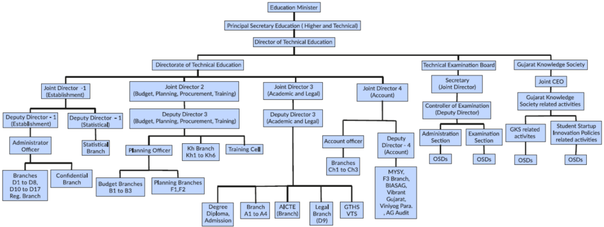

Governing Body - Organizational Chart - Education Department

Furthermore, Government Polytechnic, Palanpur follows the standard practices defined in TEIM (Technical Education Institute Manual), which is available on Commissionerate of Technical Education, Gujarat  website on the following link: ¥ TEIM Manual: https://dte.gujarat.gov.in/technical-education-institution-manual-teim-govt-polytechnics

## Functions and responsibilities of Various Bodies:

- The administration of the overall Education Department, Gujarat state is decentralized.
- The key officers of the education department are Principal Secretary (Higher and Technical Education), Director-Technical Education, Joint Directors and Principals of the various Government Polytechnics.
- Principal Secretary is the highest authority for overall higher and technical education system in the state.
- Under Principal secretary, Directorate of Technical education works to leverage various governance supports to technical institutions.
- At Directorate office, Joint Directors are appointed for responsibilities of Establishment, Budget-Planning-Procurement, Academic, Legal and Admission related matters.
- At Institute level, Principal is the highest authority for various academic and administrative matters and reports to Director of Technical Education.
- Government Polytechnic,Palanpur is affiliated with Gujarat Technological University, Ahmedabad.
- For the curriculum and evaluation methodology, institute has adopted the rules and regulations laid down by the University.
- Being important stakeholder of the University system, many faculties of the Institute contributes on various boards such as Academic Council, Board of Studies, Academic Inspection etc.

## Service rules, procedures, recruitment and promotional policies:

## Service rules and procedures:

- The Service rules are well defined and amended time to time by the General Administration Department (GAD), Government of Gujarat.
- Service rules including pay, pension and leaves are published in Gujarat Civil Services Rules (GCSR).
- For the pay, Government follows AICTE guidelines.
- The rules are uploaded on Finance Department website on  following link :
- GCSR Rules: https://financedepartment.gujarat.gov.in/rules.html

## Recruitment and Promotion policies:

- The Recruitment Rules (RR) and promotion policy concerned with academic faculties and supporting staff are framed by the Government from time to time.
- Gujarat Gaun Seva Pasandgi Mandal (GSSSB) is statutory body to carry out the direct recruitment for the various non-teaching positions.
- The Gujarat Public Service Commission (GPSC) is statutory body to carry out the direct recruitment for the various academic faculty positions (Principal, Head of the Department,Lecturer) in case of direct recruitment.
- All promotions are carried out as per rules through Departmental Promotion Committee (DPC) with final approval from GPSC.
- The overall mode of recruitment and promotion is as below:
- 100% of the sanctioned positions at the level of Lecturer carried out through direct recruitment by the GPSC based upon proposal received from education department,Gujarat state, as per AICTE norms.
- For remaining cadre (Principal,Head of the Department)  50% of vacant positionsare filled through direct recruitment by GPSC,while remaining 50% positions are filled through promotion by education department through departmental promotion committees.
- The detailed information is available at following link

## https://dte.gujarat.gov.in/recruitment-rules

## B.Minutes of Meetings and Action Taken Reports:

Institute has policy to arrange meetings of head of the different committees and their members for smooth functioning of the institute. Decisions taken in the meetings are recorded in Minutes of Meetings (MoM).

## C.Publication of  Service Rules, Policies and Procedures:

As a Government institution, we are following Government of Gujarat Policies:

- Service Rules: Government Civil Services Rules (GCSR-2002).

- GCSR Rules: https://financedepartment.gujarat.gov.in/rules.html

- Purchase Policy: Gujarat State Purchase Policy-2016.

- Gujarat State Purchase Policy-2016 : http://www.imd-gujarat.gov.in/Document/2016-6-7\_379.pdf

- Admission Policy: Gujarat Act - 2, 2008, Dated: 07/03/2008 and 28/05/2008.

- Admission Policy: http://acpdc.co.in/advertisement/act.html

- Academic Policy: As per Gujarat Technological University (GTU).

- http://www.gtu.ac.in

- StudentÕs Startup and Innovation Policy: SSIP Policy published by Government of Gujarat as on 11/01/2017.

- SSIP Policy:  http://www.startupgujarat.in/writereaddata/Images/pdf/Student-innov-Policy-HT-Edu.pdf

## D.Awareness of Service Rules, Policies and Procedures among the employees/students:

Awareness of Service Rules, Policies and Procedures among the employees/students created through training and awareness program as shown in following details:

## Employees:

- Teaching faculty training: Induction training, subjective training, interdisciplinary training, etc. are arranged by CTE training cell through FSD portal.

- Non-teaching faculty training: Administrative trainings are arranged by SPIPA.

- Institute circular and notification.

- Websites:

1. Government Polytechnic Palanpur (www.gppp.cteguj.in)

2. Commissionerate of Technical Education (https://dte.gujarat.gov.in)

3. Gujarat Technological University (https://www.gtu.ac.in)

4. General Administration Department (https://gad.gujarat.gov.in)

5. Finance Department (https://financedepartment.gujarat.gov.in)

## Students:

- Through Induction and Awareness programs arranged at Institute.

- Institute circular and notice board.

- Websites:

1. Government Polytechnic Palanpur (www.gppp.cteguj.in)

2. Gujarat Technological University (https://www.gtu.ac.in)

## 9.1.3 Decentralization in working and grievance redressal mechanism (5)

## Institute Marks

5.00

## A.Decentralization in working:

The administration of the Institute is decentralized as shown in Figure 9.2.

Figure 9.2 Organizational Chart - Institution level

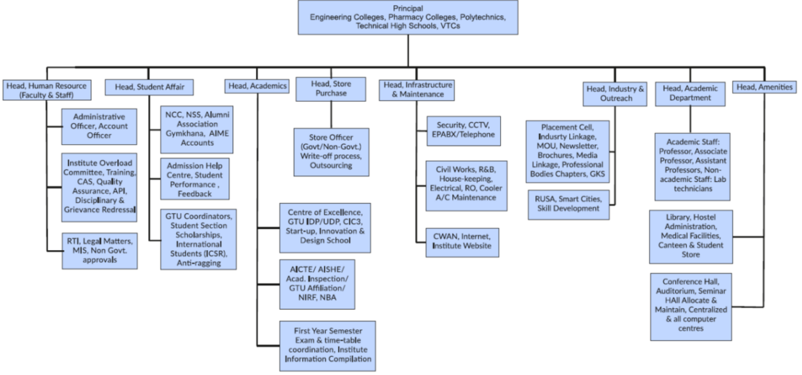

## Decentralization of work :

- Principal of the Institute is responsible for the overall academic and administrative aspects of the Institute.
- Institute also has cells for managing various institute level development activities like Establishment (for faculty and staff service matters), Students matters, Academics, Store and Purchase, Infrastructure &amp; Maintenance, Industry and outreach and central amenities.
- To look after the various academic activities of each programme, Institute has nominated heads of the departments (HODs).
- All faculty and staff members of the concerned programme report to the respective Head of department for their academic activities, academic calendar and managing department level administrative portfolios, grievances etc.
- All HODs report to the head of the Institute.
- To provide detailed guidelines for various activities of a teacher, a Technical Education Institute Manual (TIEM) has been prepared by Commissionerate of Technical Education, Government of Gujarat.
- As per the guidelines of the TEIM, various committees have been formed for the smooth working of the institutional matters as shown in the Figure 9.3 given below vide Office Order No.: GPP/EST/2019/2028 Dated: 05/07/2019.

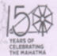

## Government Polytechnic, Palanpur

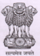

Outside Malan Gate, Palanpur- 385001

Phone (02742) 245219 / 262115

2028

2019

their regular job specific responsibilities  for smooth functioning and overall development of the institute till will havec to present as and when required and

| Sr   | Activity                                              |                                        | Co Convener                            | Members                                                                       |
|------|-------------------------------------------------------|----------------------------------------|----------------------------------------|-------------------------------------------------------------------------------|
|      | Head, Human Resource (Faculty & Staff)                | Head, Human Resource (Faculty & Staff) | Head, Human Resource (Faculty & Staff) | Head, Human Resource (Faculty & Staff)                                        |
|      | Establishmcnts                                        |                                        | RNPatel-EC                             | VMI Prajapati-Mech                                                            |
|      | IQACTCAS                                              | Prncipal                               |                                        | MD Parmar-Applied MB Shah-Elect DD Prajapati-Mech                             |
|      | Faculty Training And Pedagogy                         | KA Patel-IC                            | M R Zala-Mech                          | NA Sunsara-Elect                                                              |
|      | Audit Para                                            | M ) Mansuri-Applieu) DK Raval-Mech     | NN Rajgor-Civil                        |                                                                               |
|      | Women Devclopment cell & Internal Complaint Committce | M MShah-IC                             | H T Patel-Civil Mk Pedhadia-EC         | J VKureshi-IC A R Nilanandi-Elect TD Modi-Mech YD Chaudhary-Mcch DETAIL ORDER |

Page 1of 5

|    | Grievance redressal (Staff & Student                                                                    | S B Khara-Civil                   | D Chaudhary-Elect                               | DETAIL ORDER                                                                                             |
|----|---------------------------------------------------------------------------------------------------------|-----------------------------------|-------------------------------------------------|----------------------------------------------------------------------------------------------------------|
|    | CCC Fcc Reversal                                                                                        | MF Tank-Gen                       | RP Chavada-Elcct                                | B K Katara-Mech                                                                                          |
| 1o | E-Mail Handling                                                                                         | S P Mahant-Mech                   | S P Joshiyara-FC                                |                                                                                                          |
| 2  | Head, Student Affairs                                                                                   | Head, Student Affairs             | Head, Student Affairs                           | Head, Student Affairs                                                                                    |
|    | Admission & Hlelp Center                                                                                |                                   | MF Tank-Gen                                     |                                                                                                          |
|    | GTU                                                                                                     | LK Patel-EC                       | S P Mahant-Mech                                 | A R Patel-Civil                                                                                          |
|    | Student Section; Scholarship: Tab Distribution (Students); FEE collection: Student Related Malters ctc. | MM Shah-IC                        | MK Pedhadia-FC RCParmar-EC                      | FM Patel-Civil B Suthar-Applied MR Zala-Mech NHOza-Mech R M Prajapati-Flect R N Sosa -IC M R Patel-Elect |
|    | Gymkhana . NSS, NCC Auditorium , Lecture Expert                                                         |                                   | R11 Prajapati-Mech J C Patel-IC                 | D J Vaghela-IC FM Patel-Civil MK Prajapati-Mech G $ Rathawa-Elect NM Patel-FC                            |
|    | Alumni Association                                                                                      |                                   |                                                 | TJ Chaudhary-IC JN Chaudhary-Applicd HP Patel-Civil                                                      |
|    |                                                                                                         | MD Parmar-Applied                 | PK Bhavsar-Elect                                | PK Bhavsar RN Patel-EC Elect                                                                             |
|    | VISHWA-KARMA YOJNA MYSY                                                                                 | S B Khara-Civil VM Prajapati-Mech | FM Patel Civil                                  | VA Chauhan-IC 577 Chaudhary-Elect                                                                        |
|    | Anti Ragging Committee Central Storc Oflicer; Purchasc & GeM:                                           | MD Parmar-Applied Applied         | Mech Head, Store & Purchase: € M Prajapati-Mech | DETAIL ORDER 11 7 Patel Civil                                                                            |

2 of 5 Page

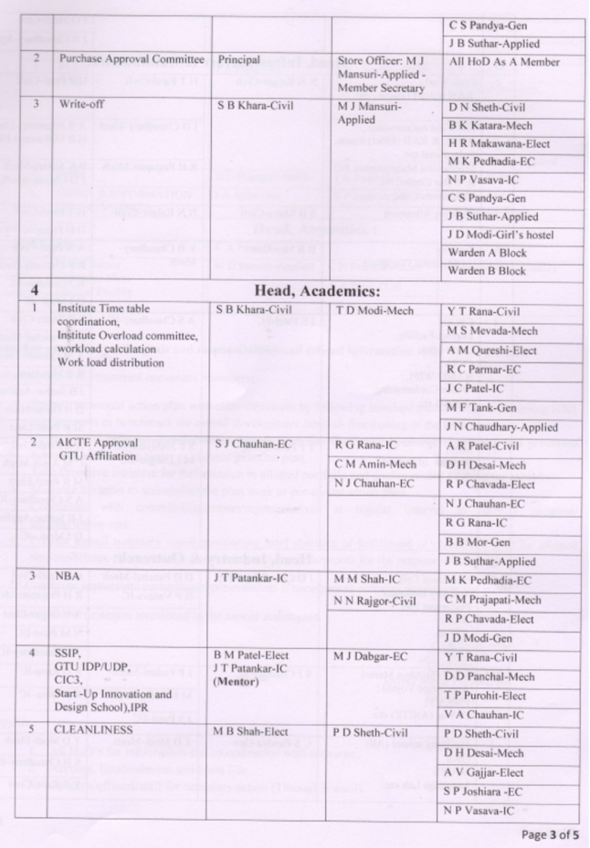

|                                                                                                                 |                 |                                               | CS Pandya-Gen                                                                                                                                           |
|-----------------------------------------------------------------------------------------------------------------|-----------------|-----------------------------------------------|---------------------------------------------------------------------------------------------------------------------------------------------------------|
| Purchase Approval Committee                                                                                     |                 |                                               |                                                                                                                                                         |
| Write-ofr                                                                                                       | S B Khara-Civil | Mansuri-Applied Member Secretary MJ Mansuri - | All HoD As A Member DN Sheth-Civil                                                                                                                      |
|                                                                                                                 |                 | Applied                                       | BK Katara-Mech IR Makawana-Elect MK Pedhadia-EC NP Vasava-IC CS Pandya-Gen 1 R Suthar-Applied Warden A Block Warden B Block                             |
| Head, Academics: Institute Timne lable coordination. workload calculation Work load distribution AICTE Approval | SB Khara-Civil  | TD Modi-Mech R G Rana-IC CM Amin-Mech         | YT Rana-Civil M S Mevada-Mech M Qureshi-Elect R € Parmar-EC MF Tank-Gcn JN Chaudhary-Applied A R Patel Civil RP Chavada-Elect NJ Chauhan-EC R G Rana-IC |
| GIU Aftiliation                                                                                                 |                 | NJ Chauhan-EC                                 | BB Mor-Gen B Suthar-Applied                                                                                                                             |
| NBA                                                                                                             | JTPalankar-IC   | MM Shah-IC VN Rajgor Civil                    | MK Pedhadia-EC CM Prajapati-Mech R P Chavada-Elect                                                                                                      |
|                                                                                                                 | (Mentor)        | M J Dabgar-EC                                 | JD Modi-Gen                                                                                                                                             |
| SSIP GTU IDPIUDP Start -Up Innovation and Desien School) IPR                                                    |                 |                                               |                                                                                                                                                         |
| CLEANLINESS                                                                                                     | MB Shah-Elect   | PDSheth Civil                                 | DD Panchal-Mech TP Purohit-Elect VA Chauhan-IC                                                                                                          |
|                                                                                                                 |                 |                                               | PD Sheth-Civil DH Desai-Mech A V Gajjar-Elect NP Vasava-IC                                                                                              |

|                                                                                 |                                    |                                    | D Modi-Gen                           |
|---------------------------------------------------------------------------------|------------------------------------|------------------------------------|--------------------------------------|
| Head, Infrastructure &Maintanance:                                              | Head, Infrastructure &Maintanance: | Head, Infrastructure &Maintanance: | Head, Infrastructure &Maintanance:   |
| Civil Works R&B (Civil) Liason                                                  | N N Rajgor-Civil                   | HT Patel-Civil                     | HP Patel Civil                       |
| Electrical maintenance & R&B (Elect) liason, Mechanical Maintainancc RO Billing |                                    |                                    | AR Nijanandi-Elect HR Makawana-Elect |
| & Water Cooler. AC Maintenance                                                  |                                    | R H Prajapati-Mech                 | BK Katara-Mech JD Chavda-Mech        |
| Quarters Allotment                                                              |                                    | NN Rajgor-Civil                    |                                      |
|                                                                                 |                                    |                                    | DD Prajapati-Mech                    |
| Security Institutional Discipline                                               | B B Mor-Gen                        | VB Chaudhary - Mech                | A N Patel-Civil                      |
|                                                                                 |                                    |                                    | RP Chavada-Elect                     |
|                                                                                 |                                    |                                    | NJ Chauhan-EC                        |
|                                                                                 |                                    |                                    | DJ Modi -IC                          |
| CWAN                                                                            | 5 Patel-EC                         | AS Chaudhary-IC                    | PD Sheth-Civil                       |
| Internct Facility                                                               |                                    |                                    | DD Panchal-Mech                      |
| CCTV                                                                            |                                    |                                    | A M Qureshi-Elect                    |
| NAMO WIFL                                                                       |                                    |                                    | B B Mor-Gen                          |
| Video Conferencing:                                                             |                                    |                                    | B Suthar-Applied                     |
|                                                                                 |                                    |                                    | Elect                                |
|                                                                                 | JTPatankar-IC                      | SP Joshiyara EC                    | A R Patel-Civil                      |
| MIS Website  of Institute                                                       |                                    | M J Dabgar-EC                      | CM Amin-Mech                         |
|                                                                                 |                                    |                                    | MR Patel-Elect                       |
|                                                                                 |                                    |                                    | A $ Chaudhary-IC                     |
|                                                                                 |                                    |                                    | J B Suthar-Applicd                   |
|                                                                                 |                                    |                                    | D J Modi -IC                         |
| Placement Cell.                                                                 | TD Chaudhary-Elect                 | Head, Industry & Outreach:         | HP Patel-Civil                       |
| Industry Linkages Placement Fair                                                |                                    | NP Vasava-IC                       | RH Prajapati-Mech                    |
| MOU                                                                             |                                    |                                    | V Gajiar-Elect                       |
|                                                                                 |                                    | JP Fudani-Mech                     |                                      |
| Apprentice Yojna) PMKVY:                                                        |                                    | MK Pedhadia-EC                     | RN SosaIC                            |
|                                                                                 |                                    |                                    | NM Patel-EC                          |
|                                                                                 |                                    |                                    | TJ Chaudhary-IC                      |
| MAY (Mukhya Mantri                                                              |                                    |                                    |                                      |
| Finishing school (All) GKS                                                      | CS Pandya-Gien                     | 1D Modi-Mech                       | TD Modi-Mech 8H Chaudhary-Elect      |
|                                                                                 |                                    |                                    | YT Rana Civil                        |
| Language Lab ctc.                                                               |                                    |                                    |                                      |
| SCOPE                                                                           |                                    |                                    |                                      |

Page 4 of 5

## Brief scope of works of each cell:

## Human Resource cell (For faculty &amp; staff):

- ¥ Institute level overall human resource planning / administration including faculty / staff service level matters.
- ¥ Institute legal matters, RTI, educational quality assurance, Training need analysis, Annual performance Redressal.

## Student matters cell:

- ¥ Student section related activities/ services, scholarship matters.
- ¥ For smooth conduction of the examination and liaisons with University.
- ¥ Co-and-Extracurricular activities and responsible for various student amenities.
- ¥ Strong bonding with Alumni association.
- ¥ To promote NSS / NCC activities in the Institute.
- ¥ Various issues including Admission, Ragging, and student counselling.

## Academics cell:

- ¥ To ensure the quality of the academics at the Institute level.
- ¥ Coordination among various departments to ensure optimum utilization of the Institute level resources.
- ¥ First year academic and examination planning.
- ¥ To provide academic related data as per the needs of CTE and University.
- ¥ Taking care of the AICTE compliance, University affiliation, NBA requirements.
- ¥ To promote the innovation among the students.

## Store and Purchase cell:

- ¥ Prepare and propose new item requirements based on the Department demands and submit to Directorate of Technical Education office.
- ¥ To purchase and planning from non-government funds.
- ¥ To take care of write-off procedure, maintenance and calibration of various equipments based on the department request.
- ¥ To audit, ensure and keep record of utilization of the equipments.

Infrastructure and Maintenance cell:

|                                             |                   |                   | M J Dabgar-FC               |
|---------------------------------------------|-------------------|-------------------|-----------------------------|
|                                             |                   |                   | NP Vasava-IC                |
| RUSA                                        | JA Joshi-Gen      | S NChauhan-Mech   | A R Patel-Civil             |
| CDTP                                        | DD Prajapati-Mech |                   | D NSheth-Civil              |
| MEDIA & INFORMATION CELL & VC DATA          | JA Joshi-Gen      | S P Joshiyara-EC  | LK Patel-EC S P MahanteMech |
| Hcad, Amenities                             | Hcad, Amenities   | Hcad, Amenities   | Hcad, Amenities             |
| Library                                     | K A Patel-IC      |                   |                             |
| Hostel Rector Canteen Mess Medical Facility | MD Parmar-Applied | CN Prajapati-Mech | All Lobby Coordinators      |
| Hostel Rector Canteen Mess Medical Facility | MD Parmar-Applied | AN Patcl-Civil    | All Lobby Coordinators      |
| Hostel Rector Canteen Mess Medical Facility | MD Parmar-Applied | JD Modi Gen       | All Lobby Coordinators      |

## Note: For portfolio specific and responsibilities and related information refer TEIM for GPs goals

Responsibilities of concerned convencrs Imcmbers;

- Prepare an annual action plan with clear objectives by following standard methodology considering NBA requirements as benchmark for overall devclopment /smooth functioning ofthe institute.
- further to achieve the target as planned in action plan.
- Motivate the tcam to accomplish the plan as per annual action plan. Work
- Take Proactive initiative for Reformation in allotted portfolio and quality record keeping for exhibits.
- Coordinate committee members representatives rcgular interval to identily progress' laggingfollow ups.
- Prepare annual summary report mentioning brief statistics of fulfillment of objectives' for allotted responsibilities. Also maintain portfolio specific rccords /proofs for the purpose of NBAAICTE. goal
- Constitute appropriate committec representatives ifnecessary to achievel implement the

objectives / strategies mentioned in the annual action plan.

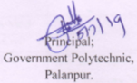

## to: Copy

- Concern ollicers /slaft for necessary action (Through E-mail)

Figure 9.3

Page 5 of 5

- ¥ Institute Civil works and liaison with R and B civil/electrical related matters.
- ¥ Taking care of overall cleanliness and security of the Institute.
- ¥ To look into drinking water facility as well overall Institute ambiance.

## Industry and Outreach cell:

- ¥ To increase institute-Industry linkage.
- ¥ Media and newsletter coordination.
- ¥ To ensure the implementation of various GOI/GOG schemes effectively in Institute.
- ¥ Explore internship and training opportunities for the students.
- ¥ Skill development / Finishing school of the students

## Institute Amenities cell:

- ¥ To ensure optimal usage of Institute amenities, like hostel, canteen, centralized computing, library, language lab etc.

## B.Grievance redressal cell, Anti Ragging Committee and Prevention of Sexual Harassment Committee:

## B.1 Grievance Redressal

## Grievance Redressal system in Institute:

- Various cells are operative at Institute level for addressing the various grievances.
- Grievance Redress Mechanism has been institutionalized through portal.
- The administration mechanism for accountable, responsive and user-friendly approach has been established along with an efficient and effective grievance redress.

## Responsibilities of the Grievance Cell

- Addressing the grievance of the students and staff.
- Implementation of the corrective steps to be taken to address the grievances and other related matters.
- To deal with issues raised in anti-ragging committee, examination committee (Related to malpractice issues), Committee against sexual harassment.
- Women Empowerment committee etc.

## Grievance Redressal mechanism

- The students can apply on student portal.
- On receipt of specific complains/ grievance from a student, the Redressal cell meets, analyze the matter and corrective measures are taken wherever necessary.
- In case of urgent issue, one can meet concerned officer at any time.

## B.2 Anti-Ragging Committee:

- For prevention and prohibition of ragging in the Institute, an Anti-Ragging Committee as mandated by AICTE, has been formed by the institute.

## B.3 Women Development Cell:

- Women Development Cell is a mandated body as per the Rules and Regulations laid down by AICTE/UGC and MHRD.
- The WDC works with a sole aim of creating hassle-free environment for female students and staff of the campus community thereby enhancing their self-respect and self-confidence.

## 9.1.4 Delegation of financial powers (5)

Institute Marks

5.00

## Delegation of Financial Powers:

Delegation of financial powers as per the State Government Rules explained as below:

- Controlling Officer - The Principal

- Drawing and Disbursing Officer (DDO) - The Principal

- All HODs are empowered to put the demand as per the requirement for the purchase of laboratory/utility equipment/books/furniture as follows:

- Item costing above Rs. 20000/-, Head of Department sends proposal to CTE purchase committee through Principal office. CTE Purchase committee consist of domain specific senior faculties from the various Govt. Institutions, headed by respective Joint Director, approves and purchases centrally as per the budget provision. (Through open tendering or Government e-Market (GeM).

- Item costing below Rs. 20000/-, purchase is made at the Institute level by concerned department with the help of store officer after due approval from Principal office.

- Consumables as per the requirement are purchased by the HOD with due approval of Head of the Institute.

- All section heads are empowered to scrutinize proposals made by relevant stakeholders and then purchase with due procedure.

- The institute has specific types of Non-Government funds such as Gymkhana fund, Social gathering fund. The disbursement of these funds is done by the Principal as per recommendation of relevant committee.

## 9.1.5 Transparency and availability of correct/unambiguous information in public domain (5)

Institute Marks

5.00

## Transparency and Availability of Information:

Information on policies, rules, processes and its dissemination are made available to the stakeholders on Institute/CTE/University website.

- All India Council for Technical Education (AICTE) EOA letters are available on Institute website.
- The information related to admission in professional courses in Gujarat State is available on ACPDC website (http://www.acpdc.co.in/).
- All the necessary institute information regarding the students, staff and other co-curricular activities are available on the Institute website (http://www.gppp.cteguj.in).
- The syllabus result and other relevant information for students and staff are available on the GTU website (http://www.gtu.ac.in).
- The vendor related information and the online bidding process are done through GeM portal for the procurement purpose.
- As a government institute, we are fully transparent in terms of policies, selection, rules, regulations and procedures.
- Details of policies, selection, rules, regulations and procedures are available on following websites.
- Directorate of Technical Education, Gujarat (https://www.dte.gujarat.gov.in/).
- Education Department, Government of Gujarat (http://gujarat-education.gov.in).
- Gujarat Public Service Commission (http://gpsc.gujarat.gov.in).
- All the information pertaining to Right to Information Act is available on institute website (http://www.gppp.cteguj.in/rti/).

## 9.2 Budget Allocation, Utilization, and Public Accounting at Institute level (10)

## Summary of current financial year's budget and actual expenditure incurred(for the institution exclusively)in the three previous financial years

Summary of current financial year's budget and actual expenditure incurred (for the institution exclusively) in the three previous financial years is shown below.

## Utilization Table

|        |                                                                                                     | 2016-17      | 2016-17        | 2017-18      | 2017-18        | 2018-19      | 2018-19        | 2019-20      | 2019-20        |
|--------|-----------------------------------------------------------------------------------------------------|--------------|----------------|--------------|----------------|--------------|----------------|--------------|----------------|
| Sr. No | Item                                                                                                | Budget (Rs.) | Expenses (Rs.) | Budget (Rs.) | Expenses (Rs.) | Budget (Rs.) | Expenses (Rs.) | Budget (Rs.) | Expenses (Rs.) |
| 1      | Teaching and non-teaching staff salary                                                              | 77737560     | 68511946       | 117858715    | 77150463       | 120334817    | 89610116       | 112439920    | 103173496      |
| 2      | Contingency (light bill / telephone bill, training & travel, books, building maintenance)           | 6211827      | 3124354        | 6323028      | 1970096        | 2603267      | 1975651        | 1899056      | 1932225        |
| 3      | Housekeeping & Contractual servants (security service & cleanliness), visiting faculty remuneration | 7423877      | 3816020        | 4598372      | 4399770        | 5322702      | 4326457        | 4832236      | 5007932        |
| 4      | Furniture, Laboratory equipments, consumables                                                       | 1000000      | 1085909        | 1011650      | 0              | 0            | 223723         | 500000       | 103228         |
| 5      | Advance (festival & food grain) for class-4 staff                                                   | 120000       | 120000         | 94000        | 0              | 100000       | 0              | 165000       | 0              |
| Total  | Total                                                                                               | 92493264     | 76658229       | 129885765    | 83520329       | 128360786    | 96135947       | 119836212    | 110216881      |

## Table 1 - CFYm1 2018-19

| Total Income  98963845.00   | Total Income  98963845.00   | Total Income  98963845.00   | Total Income  98963845.00   | Actual expenditure(till…):  96631885.00   | Actual expenditure(till…):  96631885.00   | Actual expenditure(till…):  96631885.00                  | Total No. Of Students 655   |
|-----------------------------|-----------------------------|-----------------------------|-----------------------------|-------------------------------------------|-------------------------------------------|----------------------------------------------------------|-----------------------------|
| Fee                         | Govt.                       | Grants                      | Other sources(specify)      | Recurring including salaries              | Non Recurring                             | Special Projects/Anyother, specify  KCG, CDTP, CSS, RUSA | Expenditure per student     |
| 2308554.00                  | 96310000.00                 | 345291.00                   | 0                           | 95825925.00                               | 310022.00                                 | 495938.00                                                | 147529.60                   |

Total Marks 10.00

## Table 2 - CFYm2 2017-18

| Total Income  90767442.00   | Total Income  90767442.00   |           |                        | Actual expenditure(till…):  84966253.00   | Actual expenditure(till…):  84966253.00   | Actual expenditure(till…):  84966253.00             | Total No. Of Students 797   |
|-----------------------------|-----------------------------|-----------|------------------------|-------------------------------------------|-------------------------------------------|-----------------------------------------------------|-----------------------------|
| Fee                         | Govt.                       | Grants    | Other sources(specify) | Recurring including salaries              | Non Recurring                             | Special Projects/Anyother, specify  CDTP, CSS, RUSA | Expenditure per student     |
| 2630242.00                  | 87491000.00                 | 646200.00 | 0                      | 84904073.00                               | 0                                         | 62180                                               | 106607.59                   |

## Table 3 - CFYm3 2016-17

| Total Income  82160494.00   | Total Income  82160494.00   | Total Income  82160494.00   | Total Income  82160494.00   | Actual expenditure(till…):  76863184.00   | Actual expenditure(till…):  76863184.00   | Actual expenditure(till…):  76863184.00             | Total No. Of Students 960   |
|-----------------------------|-----------------------------|-----------------------------|-----------------------------|-------------------------------------------|-------------------------------------------|-----------------------------------------------------|-----------------------------|
| Fee                         | Govt.                       | Grants                      | Other sources(specify)      | Recurring including salaries              | Non Recurring                             | Special Projects/Anyother, specify  CDTP, CSS, RUSA | Expenditure per student     |
| 3698082.00                  | 78444786.00                 | 17626                       | 0                           | 75370616.00                               | 1317613.00                                | 174955.00                                           | 80065.82                    |

## 9.2.1 Adequacy of Budget Allocation (4)

## Institute Marks

4.00

Prior to each financial year, each department is preparing non-recurring budget requirement while account office is preparing the recurring budget requirement. The consolidated (recurring and non-recurring) budget requirement is prepared at institute level by the account office and submitted to Commissionerate of technical education for further approval of education department. Budget re-appropriation process is carried out at CTE level after 3rd quarter of the financial year to ensure the allocated budget is as per requirement for smooth functioning of the academic activities.

Details and justification of adequacy of Budget Allocation is as follows :

|   Sr. No | Year            |   Allocated Budget (Rs.) |   Expenditure (Rs.) | Remarks   |
|----------|-----------------|--------------------------|---------------------|-----------|
|        1 | CFY (2019-20)   |              1.12935e+08 |         1.11286e+08 | Adequate  |
|        2 | CFYm1 (2018-19) |              9.63516e+07 |         9.61359e+07 | Adequate  |
|        3 | CFYm2 (2017-18) |              8.7491e+07  |         8.49041e+07 | Adequate  |

## 9.2.2 Utilization of allocated funds (4)

## Institute Marks

4.00

|   Sr. No | Year            |   Allocated Budget (Rs.) |   Expenditure (Rs.) |   Utilization (%) |
|----------|-----------------|--------------------------|---------------------|-------------------|
|        1 | CFY (2019-20)   |              1.12935e+08 |         1.11286e+08 |             98.54 |
|        2 | CFYm1 (2018-19) |              9.63516e+07 |         9.61359e+07 |             99.77 |
|        3 | CFYm2 (2017-18) |              8.7491e+07  |         8.49041e+07 |             97.04 |

The allocated budget by the government to the institute for last three years was satisfactory and was utilized as per the details provided in Utilization Table.

In the Government Institute audit is carried out by

- (1) Our Head office i.e. Commissionerate of Technical Education, Gandhinagar, Gujarat State.

- (2) Office of Accountant General, Rajkot.

A udited statements are available on Institute website.

Last CTE audit details are as follows:

Date of Audit visit to Institute: 17/2/2020 to 20/2/2020.

Period covered by Audit: April-2014 to March-2019.

Last A.G audit details are as follows:

Date of Audit visit to Institute: 16/12/2015 to 28/12/2015.

Period covered by Audit: June-2007 to November-2015.

## 9.3 Department Specific Budget Allocation, Utilization (5)

## Total Marks 5.00

## Utilization Table (Mechanical Department)

|                                      | 2019-20      | 2019-20        | 2018-19      | 2018-19        | 2017-18      | 2017-18        | 2016-17      | 2016-17        |
|--------------------------------------|--------------|----------------|--------------|----------------|--------------|----------------|--------------|----------------|
| Item                                 | Budget (Rs.) | Expenses (Rs.) | Budget (Rs.) | Expenses (Rs.) | Budget (Rs.) | Expenses (Rs.) | Budget (Rs.) | Expenses (Rs.) |
| Infrastructure Built-up              | 0            | 0              | 104146000    | 92583000       | 0            | 0              | 0            | 0              |
| Library                              | 9790         | 9790           | 43082        | 43082          | 0            | 0              | 2580         | 2580           |
| Laboratory Equipment                 | 0            | 0              | 16567        | 16567          | 0            | 0              | 391492       | 391492         |
| Software                             | 0            | 0              | 0            | 0              | 0            | 0              | 0            | 0              |
| Furniture                            | 0            | 0              | 0            | 0              | 18000        | 18000          | 0            | 0              |
| Laboratory Consumables               | 2354         | 2354           | 0            | 0              | 959          | 959            | 2630         | 2630           |
| Maintenance and Spares               | 0            | 0              | 0            | 0              | 0            | 0              | 0            | 0              |
| R&D                                  | 0            | 0              | 0            | 0              | 0            | 0              | 0            | 0              |
| Teaching & Non-Teaching staff salary | 26097199     | 26097199       | 22089143     | 22089143       | 19594372     | 19594372       | 11882101     | 11882101       |
| Miscellaneous expenses               | 407200       | 385100         | 404400       | 369296         | 444400       | 386827         | 638000       | 559630         |

| (Light, Rent, Public Advert)   |          |          |           |           |          |          |          |          |
|--------------------------------|----------|----------|-----------|-----------|----------|----------|----------|----------|
| Security, House keeping        |  1009000 |  1001586 |    865800 |    865200 |   955200 |   879954 |   775400 |   763204 |
| Training & Travel              |     7356 |     7356 |      7160 |      7160 |     7436 |     7436 |        0 |        0 |
| Total Rs.                      | 27532899 | 27503385 | 127572152 | 115973448 | 21020367 | 20887548 | 13692203 | 13601637 |

## Table 1 :: CFY 2019-20

| Total Budget  27532899   | Actual expenditure (till…):  27503385   | Actual expenditure (till…):  27503385   | Actual expenditure (till…):  27503385   |
|--------------------------|-----------------------------------------|-----------------------------------------|-----------------------------------------|
| Non Recurring            | Recurring                               | Non Recurring                           | Recurring                               |
| 12144                    | 27520755                                | 12144                                   | 27491241                                |

## Table 2 :: CFYm1 2018-19

| Total Budget  127572152   |           | Actual expenditure (till…):  115973448   |           |
|---------------------------|-----------|------------------------------------------|-----------|
| Non Recurring             | Recurring | Non Recurring                            | Recurring |
| 104205649                 | 23366503  | 92642649                                 | 23330799  |

## Table 3 :: CFYm2 2017-18

| Total Budget  21020367   |           | Actual expenditure (till…):  20887548   |           |
|--------------------------|-----------|-----------------------------------------|-----------|
| Non Recurring            | Recurring | Non Recurring                           | Recurring |
| 18959                    | 21001408  | 18959                                   | 20868589  |

## Table 4 :: CFYm3 2016-17

| Total Budget  13692203   |           | Actual expenditure (till…):  13601637   |           |
|--------------------------|-----------|-----------------------------------------|-----------|
| Non Recurring            | Recurring | Non Recurring                           | Recurring |
| 396702                   | 13295501  | 396702                                  | 13204935  |

## 9.3.1 Adequacy of Budget Allocation (2)

Institute Marks

2.00

Prior to each financial year, each department is preparing non-recurring budget requirement while account office is preparing the recurring budget requirement. The consolidated (recurring and non-recurring) budget requirement is prepared at institute level by the account office and submitted to Commissionerate of technical education for further approval of education department. Budget re-appropriation process is carried out at CTE level after 3rd quarter of the financial year to ensure the allocated budget is as per requirement for smooth functioning of the academic activities.

Details and justification of adequacy of Budget Allocation is as follows:

|   Sr. No | Year            |   Allocated Budget (Rs.) |             | Remarks   |
|----------|-----------------|--------------------------|-------------|-----------|
|        1 | CFY (2019-20)   |              2.75329e+07 | 2.75034e+07 | Adequate  |
|        2 | CFYm1 (2018-19) |              1.27572e+08 | 1.15973e+08 | Adequate  |
|        3 | CFYm2 (2017-18) |              2.10204e+07 | 2.08875e+07 | Adequate  |

4

CFYm3 (2016-17)

## 9.3.2 Utilization of allocated funds (3)

Institute Marks

3.00

|   Sr. No | Year            |   Allocated Budget (Rs.) |   Expenditure (Rs.) |   Utilization (%) |
|----------|-----------------|--------------------------|---------------------|-------------------|
|        1 | CFY (2019-20)   |              2.75329e+07 |         2.75034e+07 |             99.89 |
|        2 | CFYm1 (2018-19) |              1.27572e+08 |         1.15973e+08 |             90.9  |
|        3 | CFYm2 (2017-18) |              2.10204e+07 |         2.08875e+07 |             99.37 |
|        4 | CFYm3 (2016-17) |              1.36922e+07 |         1.36016e+07 |             99.34 |

## 9.4 Library and Internet (20)

## Total Marks 20.00

(It is assumed that zero deficiency report was received by the institution, Effective availability and utilization to be demonstrated)

## 9.4.1 Quality of learning resources (hard/soft) (10)

Institute has a central library which has a rich collection of books/journals/periodicals etc.

## Details of the library are as under.

- Carpet area of library (in m): 769.20 Square Meter.
- Reading space (in m): 225.20 Square Meter.
- Number of seats in reading space: 30
- Number of Books Circulation per day: 6
- Number of users per day: 25 to 30
- Number of users (reading space) per day: 25
- Timings: During Working day: 10:00 TO 05:40
- Number of library staff: 2
- Number of library staff with degree in Library: 1
- Management Computerization, For search: YES
- Library services on Internet/Intranet:
- Æ E-Books Access and Downloading Facility.
- Æ E-Journals/Magazines Access &amp; Downloading Facility.
- Library Total No. of Books (Hard/Soft):

Hard Copy 17666 (Titles 3983)

Soft Copy (E-Books) 371

- Total No. of Journals / Technical Magazines
- No. of total technical Journals / Magazines Subscribed :

Hard Copy: 17

Soft Copy: 01

- Digital Library
- Member of National Digital Library: Yes, IIT Kharagpur
- Availability over Internet / Intranet:
- E-Books: 371 Nos.
- E-Journals: 01 Nos.
- Institute is very specific to ensure that the classroom teaching, laboratory learning and the concept of self learning methodology is practiced seriously and sincerely.
- Internet connected PCs are available in library from which students can access e-resources with local network facility in library.
- List of available e-books of branch wise is also available at library so, students can easily find out whatever they want to search.

13692203.00

13601637.00

Institute Marks

10.00

- We are issuing 2 books per student for 2 weeks.
- General knowledge reading materials is also provided to students for various competitive exams.
- Newspaper facility is also available for students as well as staff.
- Question papers of past five years of various subjects are also available at library for students.

## 9.4.2 Internet (10)

Name of the Internet provider

Bharat Sanchar  Nigam Limited(BSNL)

Available band width

10MBPS CAMPUS LAN (WIRED), 200MBPS WIFI

WiFi availability

Yes, No of access points:14

Internet access in labs, classrooms, library and offices of all Departments

Yes, Total 347 Nodes

Security arrangements

Firewall Partially working (Cyber Roam)

## 9.5 Institutional Contribution to the Community Development (5)

Government Polytechnic, Palanpur contribute their share in Community Development through following activities.

1. Community Development Through Polytechnics (CDTP) Scheme funded by MHRD, New Delhi.

Details of CDTP activities are as follows:

Community Wing project was started at Government Polytechnic, Palanpur in the year 1994. Then the scheme is revised as CDTP (Community development through Polytechnic) in 2008. The grant allocation for the project is being done by MHRD, New Delhi. It is govern by the coordinator (Principal) of the institute with the advice of advisory committee as well as executive committee.

For the implementation of CDTP Project, a survey of rural area is being done on primary basis to identify the skill based need of the society. On the basis of such survey, different short term training program is conducted to enhance employability as well as their self-employment. For the smooth operation of the scheme a community consultant is hired on contract base. In this scheme trainer given remuneration on hour basis and the trainees are trained without any charge means free of cost. Last four years, financial status &amp; progress data is as under.

## Table:-1 (Financial status &amp; progress)

| Year    | Recurring grant (Rs.)   | Non- recurring grant (Rs.)   | Total (Rs.)              | Expenditure (Rs.)   |   Nos. of trained person |   Nos. of employment/self employment after training |
|---------|-------------------------|------------------------------|--------------------------|---------------------|--------------------------|-----------------------------------------------------|
| 2016-17 | 23,61,148=00            |                              | 5,93,700=00 29,54,848=00 | 1,37,482=00         |                      144 |                                                  60 |
| 2017-18 | 24,14,144=00            |                              | 5,93,700=00 30,07,844=00 | 54,750=00           |                       00 |                                                  00 |
| 2018-19 | 24,82,020=00            |                              | 5,93,700=00 30,75,720=00 | 37,402=00           |                       52 |                                                  28 |
| 2019-20 | 22,17,126=50            |                              | 5,93,700=00 28,10,826=00 | 3,56,318=50         |                      262 |                                                 155 |

## Table:-2 (Skill Development Training Program for the year 2019-20)

|   Sr.No | Course Name         |   No. of Trained person |
|---------|---------------------|-------------------------|
|       1 | Data entry operator |                      41 |
|       2 | Embroidery work     |                      30 |

Institute Marks

10.00

## Total Marks 5.00

Institute Marks

5.00

| 3     | Paper bag making                |   17 |
|-------|---------------------------------|------|
| 4     | Tailoring work.                 |  120 |
| 5     | Beauty parlour                  |   20 |
| 6     | Embroidery and  hand work       |   17 |
| 7     | Tailoring  and  Embroidery Work |   17 |
| Total |                                 |  262 |

9.6 Alumni Performance and Connect (10)

## Total Marks 5.00

Institute Marks

5.00

Applied for registration of Alumni Association in the Office of Charity Commissioner as on Date.5th September,2020.

1. Basic and Discipline specific knowledge: Apply knowledge of basic mathematics, science and engineering fundamentals and engineering specialization to solve the engineering problems.
2. Problem analysis: Identify and analyse well-defined engineering problems using codified standard methods.
3. Design/ development of solutions : Design solutions for well-defined technical problems and assist with the design of systems components or processes to meet specified needs.
4. Engineering Tools, Experimentation and Testing: Apply modern engineering tools and appropriate technique to conduct standard tests and measurements.
5. Engineering practices for society, sustainability and environment: Apply appropriate technology in context of society, sustainability, environment and ethical practices.
6. Project Management: Use engineering management principles individually, as a team member or a leader to manage projects and effectively communicate about well-defined engineering activities.
7. Life-long learning: Ability to analyse individual needs and engage in updating in the context of technological changes.

## (B) PROGRAM SPECIFIC OUTCOME (PSOs)

| PSO1   | Diploma Mechanical Engineer will be able to supervise various processes and parameters in industries.   |
|--------|---------------------------------------------------------------------------------------------------------|
| PSO2   | Diploma Mechanical engineer will be able to maintain industrial machinery                               |

## Annexure I (A) PROGRAM OUTCOME (POs)

Place : Palanpur Date : 24-09-2020 15:45:18

## Declaration

The head of the institution needs to make a declaration as per the format given The head of the institution needs to make a declaration as per the format given - -

- I undertake that, the institution is well aware about the provisions in the NBA's accreditation manual concerned for this application, rules, regulations, notifications and NBA expert visit guidelines inforce as on date and the institutes hall fully abide by them.
- It is submitted that information provided in this Self Assessment Report is factually correct.
- I understand and agree that an appropriate disciplinary action against the Institute willbe initiated by the NBA. In case, any false statement/information is observed during pre-visit, visit, postvisit and subsequent to grant of accreditation.

## Head of the Institute

Name : Mr.Sureshkumar.D.Dabhi

Designation : Head of the Department(Mechanical Engineering Department) and Principal(Incharge) Signature :

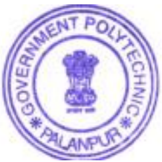